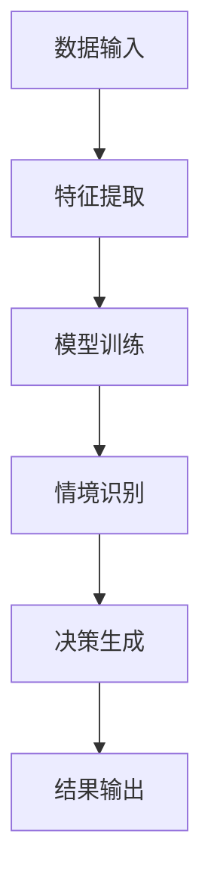
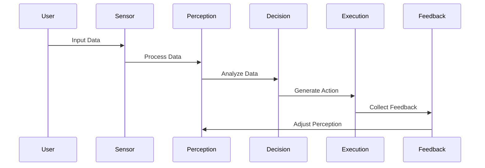
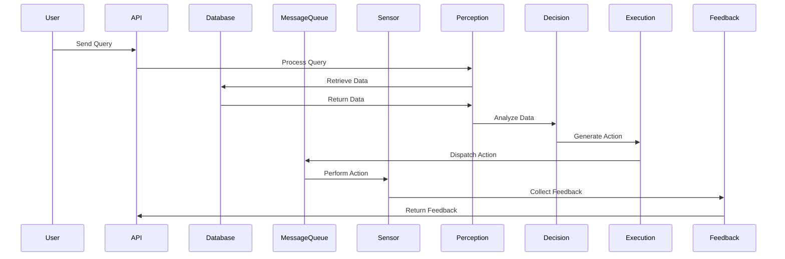

                 

### 文章标题

# 企业AI Agent的情境感知能力：提升用户体验

### 关键词

- AI Agent
- 情境感知能力
- 企业应用
- 用户体验
- 算法原理

### 摘要

本文探讨了企业AI Agent的情境感知能力，旨在通过深入分析其核心概念、算法原理和系统架构，揭示如何通过提升情境感知能力来优化企业AI Agent的用户体验。文章首先介绍了AI Agent的基本原理和情境感知能力的重要性，随后详细讲解了情境感知算法的原理和系统架构设计，并结合实际案例进行了剖析。最后，文章提出了最佳实践策略，为AI Agent在企业的应用提供了指导。

## 目录大纲

### 第一部分：问题背景与核心概念

- 第1章：AI Agent与情境感知能力
  - 1.1 AI Agent概述
    - 1.1.1 AI Agent的定义与基本原理
    - 1.1.2 AI Agent在企业的应用现状与趋势
  - 1.2 情境感知能力
    - 1.2.1 情境感知的定义与重要性
    - 1.2.2 情境感知的关键技术
  - 1.3 背景知识与理论基础
    - 1.3.1 相关领域的理论基础
    - 1.3.2 企业AI Agent的应用场景
  - 1.4 本章小结

### 第二部分：核心概念与联系

- 第2章：AI Agent的核心概念与属性
  - 2.1 AI Agent的基本组成部分
    - 2.1.1 感知模块
    - 2.1.2 决策模块
    - 2.1.3 执行模块
  - 2.2 情境感知能力的属性特征对比
    - 2.2.1 情境感知能力的定义
    - 2.2.2 不同AI Agent情境感知能力的对比
  - 2.3 情境感知能力的影响因素
    - 2.3.1 数据质量
    - 2.3.2 算法性能
    - 2.3.3 硬件性能
  - 2.4 ER实体关系图架构
    - 2.4.1 ER图的基础知识
    - 2.4.2 企业AI Agent的ER实体关系图
  - 2.5 本章小结

### 第三部分：算法原理与系统架构

- 第3章：情境感知算法原理
  - 3.1 情境感知算法的基本原理
    - 3.1.1 情境感知算法的类型
    - 3.1.2 情境感知算法的核心要素
  - 3.2 算法原理讲解
    - 3.2.1 Mermaid流程图
    - 3.2.2 Python源代码讲解
    - 3.2.3 数学模型与公式讲解
  - 3.3 算法举例说明
    - 3.3.1 通俗易懂的举例
    - 3.3.2 实际应用案例
  - 3.4 本章小结

### 第四部分：系统分析与架构设计

- 第4章：企业AI Agent系统分析
  - 4.1 问题场景介绍
    - 4.1.1 企业AI Agent的应用背景
    - 4.1.2 企业AI Agent的目标与需求
  - 4.2 系统功能设计
    - 4.2.1 领域模型Mermaid类图
    - 4.2.2 系统功能模块设计
  - 4.3 系统架构设计
    - 4.3.1 Mermaid架构图
    - 4.3.2 系统分层架构设计
  - 4.4 系统接口设计与交互
    - 4.4.1 系统接口设计
    - 4.4.2 系统交互Mermaid序列图
  - 4.5 本章小结

### 第五部分：项目实战与案例分析

- 第5章：企业AI Agent项目实战
  - 5.1 环境安装与配置
    - 5.1.1 环境搭建
    - 5.1.2 工具与依赖安装
  - 5.2 系统核心实现
    - 5.2.1 源代码解读
    - 5.2.2 代码应用解读与分析
  - 5.3 实际案例分析
    - 5.3.1 案例背景
    - 5.3.2 案例分析
    - 5.3.3 案例总结
  - 5.4 本章小结

### 第六部分：最佳实践与拓展

- 第6章：最佳实践
  - 6.1 情境感知能力提升策略
    - 6.1.1 数据质量优化
    - 6.1.2 算法优化
    - 6.1.3 硬件性能优化
  - 6.2 企业AI Agent部署与维护
    - 6.2.1 部署策略
    - 6.2.2 维护策略
  - 6.3 安全性与隐私保护
    - 6.3.1 安全性策略
    - 6.3.2 隐私保护策略
  - 6.4 本章小结

---

### 引言

在当今企业数字化转型的浪潮中，人工智能（AI）技术正逐步渗透到各个业务领域，为企业带来前所未有的机遇和挑战。作为AI技术的一个重要应用方向，企业AI Agent以其自动化、智能化的特性，正在成为提高企业效率和用户体验的重要工具。然而，企业AI Agent的有效性和用户体验的提升，在很大程度上依赖于其情境感知能力。

情境感知能力指的是AI Agent根据所处的环境、上下文和用户行为，动态调整自身的行为和决策能力。一个具备强大情境感知能力的AI Agent，能够更好地理解用户需求，提供个性化服务，从而提升用户体验。本文将围绕这一主题，深入探讨企业AI Agent的情境感知能力，分析其核心概念、算法原理、系统架构，并结合实际案例，提出最佳实践策略。

本文结构如下：首先，我们将介绍AI Agent和情境感知能力的基本概念，并分析其在企业中的应用现状和趋势。随后，我们将详细讨论AI Agent的核心组成部分和情境感知能力的属性特征。在此基础上，本文将讲解情境感知算法的基本原理，并通过具体实例进行说明。接着，我们将探讨企业AI Agent的系统分析与架构设计，展示其功能模块和架构图。然后，我们将通过一个实际项目案例，展示企业AI Agent的系统实现和案例分析。最后，本文将总结最佳实践策略，为AI Agent在企业的应用提供指导。

通过本文的深入探讨，我们希望读者能够全面理解企业AI Agent的情境感知能力，掌握提升用户体验的关键技术和策略，为企业AI Agent的优化和实际应用提供有益的参考。

## 第一部分：问题背景与核心概念

### 第1章：AI Agent与情境感知能力

在探讨企业AI Agent的情境感知能力之前，我们需要首先理解AI Agent及其情境感知能力的基本概念和背景。

#### 1.1 AI Agent概述

**1.1.1 AI Agent的定义与基本原理**

AI Agent，即人工智能代理，是一种基于人工智能技术自主执行任务的计算机程序。它通过模拟人类的思维和行为，具备一定的智能水平，能够理解和解释外界信息，自主地做出决策并执行相应的行动。AI Agent的基本原理包括以下几个核心方面：

1. **感知模块**：AI Agent需要通过传感器或其他输入设备获取环境信息，包括文字、图像、声音等多种形式的数据。
2. **决策模块**：根据感知模块获取的信息，AI Agent会利用预定的算法或机器学习模型进行分析，生成决策。
3. **执行模块**：在做出决策后，AI Agent会通过执行模块将决策转化为具体的行动，如控制机器人手臂、发送电子邮件或调整数据库。

**1.1.2 AI Agent在企业的应用现状与趋势**

随着人工智能技术的不断进步，AI Agent在企业中的应用越来越广泛。以下是AI Agent在企业中的一些典型应用场景：

1. **客服与客户服务**：AI Agent可以自动回答客户问题，提供24/7的服务，降低人工客服的工作负担。
2. **数据分析与预测**：AI Agent可以处理和分析大量数据，帮助企业进行市场预测、库存管理和风险管理。
3. **自动化流程**：AI Agent可以自动化执行重复性任务，如数据录入、报告生成等，提高工作效率。
4. **智能调度与优化**：AI Agent可以根据实时数据优化物流和资源分配，提高运营效率。

未来，随着AI技术的进一步成熟，AI Agent在企业中的应用场景将继续扩展，从简单的自动化任务到更加复杂的决策支持系统，AI Agent将在各个行业中发挥越来越重要的作用。

#### 1.2 情境感知能力

**1.2.1 情境感知的定义与重要性**

情境感知（Context Awareness）是指AI Agent能够识别和理解其所在环境中的上下文信息，并根据这些信息动态调整其行为和决策。情境感知能力是AI Agent实现智能化和人性化交互的关键要素，其定义可以概括为以下几点：

1. **上下文识别**：AI Agent能够感知和理解环境中的各种上下文信息，如时间、地点、用户行为、设备状态等。
2. **动态调整**：根据上下文信息的变化，AI Agent能够实时调整其行为和决策，以适应不同的情境。
3. **适应性**：AI Agent能够通过学习不断优化其情境感知能力，提高决策的准确性和效率。

情境感知能力在AI Agent中的作用至关重要，它直接影响AI Agent的用户体验和任务执行效果。具体来说，情境感知能力的重要性体现在以下几个方面：

1. **个性化服务**：通过情境感知，AI Agent能够提供更加个性化的服务，满足不同用户的需求。
2. **实时响应**：情境感知使AI Agent能够实时响应环境变化，提供及时和有效的决策。
3. **减少错误**：情境感知能够帮助AI Agent避免因信息不全或环境变化导致的错误决策。

**1.2.2 情境感知的关键技术**

要实现强大的情境感知能力，AI Agent需要依赖一系列关键技术的支持。以下是几种重要的情境感知关键技术：

1. **传感器技术**：传感器是情境感知的基础，它们可以收集环境中的各种信息，如温度、湿度、光线强度、声音等。
2. **机器学习与数据挖掘**：通过机器学习和数据挖掘技术，AI Agent可以从大量数据中提取有价值的模式和信息，用于情境感知。
3. **自然语言处理（NLP）**：NLP技术使AI Agent能够理解自然语言，与用户进行更自然的交互，获取更多的上下文信息。
4. **知识图谱**：知识图谱能够帮助AI Agent建立对复杂情境的理解，通过关系和属性之间的连接，提供更加精准的情境感知。

#### 1.3 背景知识与理论基础

**1.3.1 相关领域的理论基础**

情境感知能力的实现不仅依赖于人工智能技术，还需要结合其他相关领域的理论基础。以下是一些重要的理论基础：

1. **多智能体系统（MAS）**：多智能体系统是指由多个具有独立性和协作性的智能体组成的系统。在情境感知中，多智能体系统可以协同工作，共同感知和理解复杂情境。
2. **模糊逻辑**：模糊逻辑是一种处理不确定性和模糊性的数学工具，适用于情境感知中需要处理的不确定环境。
3. **决策理论**：决策理论提供了一系列处理不确定性和优化决策的方法，对情境感知中的决策模块具有重要意义。

**1.3.2 企业AI Agent的应用场景**

企业AI Agent的应用场景丰富多样，不同行业和业务需求决定了其情境感知能力的具体实现方式。以下是几种典型应用场景：

1. **金融行业**：金融行业中的AI Agent可以实时分析市场数据，为投资者提供个性化的投资建议，并根据市场变化调整投资策略。
2. **医疗健康**：医疗健康领域的AI Agent可以通过分析患者的病历数据和生活习惯，提供个性化的健康建议和疾病预警。
3. **智能制造**：智能制造中的AI Agent可以实时监控生产设备的状态，预测设备故障，优化生产流程，提高生产效率。

#### 1.4 本章小结

本章介绍了AI Agent和情境感知能力的基本概念、应用现状和理论基础。通过理解AI Agent的定义、基本原理和在企业中的应用，我们能够更好地认识情境感知能力的重要性。情境感知能力是AI Agent实现智能化和人性化交互的关键，它依赖于多种关键技术的支持。在后续章节中，我们将进一步探讨AI Agent的核心概念、算法原理和系统架构设计，深入分析如何提升AI Agent的情境感知能力，以优化用户体验。

## 第二部分：核心概念与联系

### 第2章：AI Agent的核心概念与属性

在深入探讨企业AI Agent的情境感知能力之前，我们需要明确AI Agent的核心概念和组成部分。这不仅有助于理解AI Agent的工作原理，也为后续算法原理和系统架构的讲解奠定了基础。

#### 2.1 AI Agent的基本组成部分

AI Agent是由多个模块组成的复杂系统，各模块相互协作，共同实现智能行为。以下是AI Agent的基本组成部分及其功能：

**2.1.1 感知模块**

感知模块是AI Agent与外界环境交互的窗口，其主要功能是收集和处理来自不同传感器的数据。这些传感器可以是视觉传感器、听觉传感器、温度传感器等，通过感知模块，AI Agent可以获取环境中的信息，如文本、图像、声音和物理信号。

- **功能**：感知模块包括信号采集、预处理和特征提取三个部分。信号采集是指从各种传感器获取原始数据；预处理包括去除噪声、滤波等；特征提取是指从预处理后的数据中提取有助于决策的特征。
- **重要性**：感知模块是情境感知能力的基础，它直接决定了AI Agent对环境信息的感知和理解能力。

**2.1.2 决策模块**

决策模块是AI Agent的核心，负责根据感知模块提供的信息，通过算法和模型进行推理和决策。决策模块通常包括以下几个步骤：

- **功能**：数据输入、特征处理、模型选择、决策推理和结果输出。数据输入是指将感知模块收集的数据输入到模型中；特征处理是指对数据进行预处理，以便模型能够有效处理；模型选择是指根据应用场景选择合适的算法和模型；决策推理是指通过算法计算得到决策结果；结果输出是指将决策结果转化为具体的行动指令。
- **重要性**：决策模块是AI Agent实现智能行为的关键，它决定了AI Agent在复杂环境中的决策效果。

**2.1.3 执行模块**

执行模块负责将决策模块生成的决策结果转化为具体的行动。执行模块可以控制机械臂、发送电子邮件、启动应用程序等，执行AI Agent的决策。

- **功能**：执行模块包括动作生成、执行监控和反馈调整三个部分。动作生成是指根据决策结果生成具体的动作指令；执行监控是指监控动作的执行情况，确保决策得到有效执行；反馈调整是指根据执行结果调整后续的决策和执行策略。
- **重要性**：执行模块是实现AI Agent行为自动化和智能化的关键，它直接决定了AI Agent的实际应用效果。

#### 2.2 情境感知能力的属性特征对比

情境感知能力是AI Agent实现智能化和人性化交互的核心能力。要全面理解情境感知能力，我们需要分析其属性特征，并对比不同AI Agent的情境感知能力。以下是几种重要的属性特征：

**2.2.1 情境感知能力的定义**

情境感知能力是指AI Agent根据其所处的环境和上下文信息，动态调整自身行为和决策的能力。具体来说，情境感知能力包括以下几个方面：

- **上下文识别**：AI Agent能够识别和理解其所在环境的上下文信息，如时间、地点、用户行为、设备状态等。
- **动态调整**：AI Agent能够根据上下文信息的变化，实时调整自身的行为和决策，以适应不同的情境。
- **适应性**：AI Agent能够通过学习和优化，不断提高其情境感知能力，以应对复杂多变的情境。

**2.2.2 不同AI Agent情境感知能力的对比**

不同领域的AI Agent根据其应用场景和任务需求，具有不同的情境感知能力。以下是几种典型AI Agent的情境感知能力对比：

1. **客服AI Agent**
   - **上下文识别**：能够识别用户的询问意图，理解问题背后的需求。
   - **动态调整**：根据用户的反馈和行为，调整回答的策略，提供个性化的服务。
   - **适应性**：通过用户行为数据的学习，不断提高对用户需求的识别和响应能力。

2. **智能家居AI Agent**
   - **上下文识别**：能够识别家庭环境中的设备状态、用户活动等。
   - **动态调整**：根据家庭成员的作息习惯和设备使用情况，自动调整家居设备的设置。
   - **适应性**：通过环境传感器和学习算法，不断优化家居设备的管理策略。

3. **智能制造AI Agent**
   - **上下文识别**：能够识别生产线上的设备状态、故障情况等。
   - **动态调整**：根据生产数据，调整生产流程和设备运行状态，优化生产效率。
   - **适应性**：通过传感器和机器学习算法，实时监测和预测设备故障，提高生产稳定性。

**2.2.3 情境感知能力的属性特征对比表格**

以下是不同AI Agent情境感知能力的对比表格：

| AI Agent类型 | 上下文识别 | 动态调整 | 适应性 |
| :--- | :--- | :--- | :--- |
| 客服AI Agent | 高 | 高 | 高 |
| 智能家居AI Agent | 中 | 中 | 高 |
| 智能制造AI Agent | 中 | 高 | 高 |

**2.3 情境感知能力的影响因素**

情境感知能力不仅取决于AI Agent的设计和实现，还受到多种外部因素的影响。以下是一些关键影响因素：

- **数据质量**：高质量的数据是情境感知能力的基础。数据缺失、噪声和错误都会影响情境感知的准确性和效率。
- **算法性能**：算法的性能直接影响AI Agent的决策质量和响应速度。高效的算法能够更快地处理数据，更准确地感知情境。
- **硬件性能**：硬件的性能决定了AI Agent的处理速度和响应能力。强大的硬件支持可以提升AI Agent的情境感知能力和执行效率。

#### 2.4 ER实体关系图架构

实体关系图（Entity-Relationship Diagram，ER图）是数据库设计中常用的概念模型，用于表示实体之间的关系。在AI Agent设计中，ER图可以帮助我们理解各模块之间的数据流和关系。

**2.4.1 ER图的基础知识**

ER图主要由以下三个元素组成：

- **实体（Entity）**：表示系统中具有独立存在意义的对象，如用户、产品、订单等。
- **属性（Attribute）**：表示实体的特征或属性，如用户的年龄、性别、订单的日期、金额等。
- **关系（Relationship）**：表示实体之间的关联，如用户下单、产品包含配件等。

**2.4.2 企业AI Agent的ER实体关系图**

以下是企业AI Agent的ER实体关系图：

```mermaid
erDiagram
  AI-Agent ||--|{ 感知模块 :SensorModule }
  AI-Agent ||--|{ 决策模块 :DecisionModule }
  AI-Agent ||--|{ 执行模块 :ExecutionModule }
  感知模块 ||--|{ 传感器 :Sensor }
  感知模块 ||--|{ 数据处理 :DataProcessing }
  决策模块 ||--|{ 算法模型 :AlgorithmModel }
  执行模块 ||--|{ 动作生成 :ActionGeneration }
  执行模块 ||--|{ 执行监控 :ExecutionMonitoring }
```

#### 2.5 本章小结

本章详细介绍了AI Agent的核心概念和组成部分，分析了情境感知能力的属性特征和影响因素，并展示了企业AI Agent的ER实体关系图。通过本章的学习，读者可以全面理解AI Agent的工作原理及其情境感知能力的实现方式，为后续算法原理和系统架构的讲解奠定了基础。在下一章中，我们将进一步探讨情境感知算法的基本原理和具体实现。

### 第三部分：算法原理与系统架构

#### 第3章：情境感知算法原理

情境感知算法是AI Agent实现情境感知能力的关键，它决定了AI Agent对环境信息的识别和处理能力。在本章中，我们将深入探讨情境感知算法的基本原理，包括其类型、核心要素以及具体的实现方式。

#### 3.1 情境感知算法的基本原理

**3.1.1 情境感知算法的类型**

情境感知算法可以根据其处理的数据类型和处理方法进行分类。以下是几种常见的情境感知算法类型：

1. **基于规则的算法**：基于规则的算法使用一组预定义的规则来处理情境信息。这些规则通常由领域专家根据经验制定，具有直观和易于理解的特点。例如，在智能家居应用中，可以根据用户设定的规则来自动调节灯光和温度。

2. **机器学习算法**：机器学习算法通过训练模型来学习情境信息，并自动生成规则。常见的机器学习算法包括决策树、支持向量机（SVM）、神经网络等。这些算法可以根据历史数据自动识别和分类情境，具有较高的灵活性和准确性。

3. **数据挖掘算法**：数据挖掘算法用于从大量数据中提取有价值的信息和模式。常见的数据挖掘算法包括关联规则挖掘、聚类分析、分类分析等。这些算法可以帮助AI Agent发现情境中的隐藏关系和趋势，从而更好地理解情境。

**3.1.2 情境感知算法的核心要素**

情境感知算法通常包括以下几个核心要素：

1. **数据输入**：数据输入是情境感知算法的基础，它决定了算法对情境信息的处理能力。数据输入可以包括传感器数据、用户输入、历史数据等。

2. **特征提取**：特征提取是将原始数据转化为可用于算法处理的高质量数据的过程。特征提取的目的是从原始数据中提取出有代表性的特征，用于后续的算法分析和决策。

3. **模型训练**：模型训练是指通过训练算法模型来学习情境信息。在机器学习和数据挖掘算法中，模型训练是关键步骤，它通过不断调整模型参数来提高算法的性能和准确性。

4. **情境识别**：情境识别是指通过算法分析输入数据，识别出当前所处的情境。情境识别是情境感知算法的核心任务，它决定了AI Agent对情境的理解和响应能力。

5. **决策生成**：决策生成是指根据情境识别结果，生成相应的决策和行动指令。决策生成是情境感知算法的最终目标，它决定了AI Agent在实际应用中的表现。

6. **结果输出**：结果输出是将决策结果转化为具体的行动或反馈的过程。结果输出包括执行具体的操作、发送通知、生成报告等。

#### 3.2 算法原理讲解

为了更好地理解情境感知算法，我们将通过Mermaid流程图、Python源代码和数学模型与公式进行讲解。

**3.2.1 Mermaid流程图**

以下是情境感知算法的基本原理Mermaid流程图：



**3.2.2 Python源代码讲解**

为了实际展示情境感知算法的实现，我们使用Python编写了一个简单的情境感知算法示例：

```python
import numpy as np

# 数据输入
data = np.array([[1, 0], [0, 1], [1, 1]])

# 特征提取
def feature_extraction(data):
    # 此处为特征提取的具体实现
    features = np.mean(data, axis=0)
    return features

features = feature_extraction(data)

# 模型训练
def model_training(features):
    # 此处为模型训练的具体实现
    model = np.random.rand(1)
    return model

model = model_training(features)

# 情境识别
def context_recognition(model, data):
    # 此处为情境识别的具体实现
    if data[0] > 0.5:
        context = "情境A"
    else:
        context = "情境B"
    return context

context = context_recognition(model, data)

# 决策生成
def decision_generation(context):
    # 此处为决策生成的具体实现
    if context == "情境A":
        decision = "执行操作A"
    else:
        decision = "执行操作B"
    return decision

decision = decision_generation(context)

# 结果输出
def result_output(decision):
    # 此处为结果输出的具体实现
    print("决策结果:", decision)

result_output(decision)
```

**3.2.3 数学模型与公式讲解**

情境感知算法通常涉及多个数学模型和公式。以下是情境感知算法中常见的数学模型和公式：

1. **线性回归模型**：
   $$ y = \beta_0 + \beta_1 x $$
   其中，\( y \) 是输出值，\( x \) 是输入值，\( \beta_0 \) 和 \( \beta_1 \) 是模型参数。

2. **支持向量机（SVM）**：
   $$ w \cdot x + b = 0 $$
   其中，\( w \) 是权重向量，\( x \) 是特征向量，\( b \) 是偏置。

3. **神经网络**：
   $$ a = \sigma(\beta_0 + \sum_{i=1}^{n} \beta_i x_i) $$
   其中，\( a \) 是输出值，\( \sigma \) 是激活函数，\( x_i \) 是输入值，\( \beta_i \) 是模型参数。

#### 3.3 算法举例说明

为了更直观地理解情境感知算法，我们通过一个通俗易懂的例子和实际应用案例进行说明。

**3.3.1 通俗易懂的举例**

假设我们有一个智能家居系统，用户可以通过语音命令控制家里的灯光和温度。以下是情境感知算法在这个场景中的应用：

1. **数据输入**：用户发出“打开灯”的语音命令。
2. **特征提取**：系统将语音信号进行预处理，提取出关键词“打开”和“灯”。
3. **模型训练**：系统使用历史语音命令数据，通过机器学习算法训练出识别语音命令的模型。
4. **情境识别**：模型识别出语音命令为“打开灯”，判断当前情境为“需要打开灯”。
5. **决策生成**：系统根据情境识别结果，生成决策指令“打开灯光”。
6. **结果输出**：系统执行决策指令，打开灯光。

**3.3.2 实际应用案例**

以下是一个实际应用案例：一个电商平台的推荐系统，根据用户的历史购买行为和浏览记录，为用户推荐可能感兴趣的商品。

1. **数据输入**：系统收集用户的历史购买行为和浏览记录数据。
2. **特征提取**：系统对用户数据进行分析，提取出用户的购买偏好和浏览习惯。
3. **模型训练**：系统使用机器学习算法，训练出一个推荐模型，用于预测用户可能感兴趣的商品。
4. **情境识别**：模型根据用户的最新浏览记录，识别出用户当前可能感兴趣的商品类别。
5. **决策生成**：系统根据情境识别结果，生成决策指令“推荐商品A”。
6. **结果输出**：系统向用户展示推荐商品A，并跟踪用户的反馈，以优化推荐算法。

#### 3.4 本章小结

本章详细介绍了情境感知算法的基本原理，包括算法类型、核心要素和具体实现方式。通过Mermaid流程图、Python源代码和数学模型与公式的讲解，读者可以更好地理解情境感知算法的工作原理。在下一章中，我们将探讨企业AI Agent的系统分析与架构设计，进一步阐述AI Agent在实际应用中的系统功能设计和架构实现。

### 第四部分：系统分析与架构设计

#### 第4章：企业AI Agent系统分析

在企业中，AI Agent的应用场景多种多样，从客户服务到生产管理，再到数据分析，AI Agent在提高企业效率和用户体验方面发挥着重要作用。为了深入理解企业AI Agent的系统架构和功能设计，我们将从问题场景介绍、系统功能设计、系统架构设计以及系统接口设计与交互四个方面进行详细分析。

#### 4.1 问题场景介绍

**4.1.1 企业AI Agent的应用背景**

随着数字化转型的推进，企业面临着日益复杂的市场环境和运营挑战。为了提高运营效率、降低成本和提升用户体验，越来越多的企业开始引入AI Agent来辅助业务决策和流程自动化。以下是几种常见的企业AI Agent应用场景：

1. **客户服务**：企业通过AI Agent提供24/7的客户支持，自动回答常见问题，提高客户满意度。
2. **生产管理**：AI Agent可以实时监控生产线，预测设备故障，优化生产流程，提高生产效率。
3. **供应链管理**：AI Agent可以分析供应链数据，优化库存管理，预测市场需求，降低库存成本。
4. **数据分析**：AI Agent可以处理和分析大量数据，为决策者提供数据支持和洞察。

**4.1.2 企业AI Agent的目标与需求**

企业AI Agent的目标是通过智能化和自动化技术，提高企业运营效率、降低成本、提升用户体验。具体需求包括：

1. **高效性**：AI Agent需要能够快速响应并处理大量业务请求。
2. **准确性**：AI Agent的决策需要准确无误，减少人为错误。
3. **可扩展性**：AI Agent需要能够适应不同业务场景和需求，易于扩展和升级。
4. **安全性**：AI Agent需要具备强大的安全保障措施，保护企业数据隐私。

#### 4.2 系统功能设计

**4.2.1 领域模型Mermaid类图**

为了更好地理解企业AI Agent的系统功能设计，我们使用Mermaid类图来展示各功能模块及其关系。以下是企业AI Agent的领域模型Mermaid类图：

```mermaid
classDiagram
    CustomerServiceAgent <|-- AI-Agent
    ProductionManagementAgent <|-- AI-Agent
    SupplyChainManagementAgent <|-- AI-Agent
    DataAnalysisAgent <|-- AI-Agent
    CustomerServiceAgent {+handle_query(): str+}
    ProductionManagementAgent {+monitor_production(): str+}
    SupplyChainManagementAgent {+optimize_inventory(): str+}
    DataAnalysisAgent {+analyze_data(): str+}
```

在该类图中，`AI-Agent` 是核心类，其他模块如 `CustomerServiceAgent`、`ProductionManagementAgent`、`SupplyChainManagementAgent` 和 `DataAnalysisAgent` 都继承自 `AI-Agent` 类，具备AI-Agent的基本功能。

**4.2.2 系统功能模块设计**

企业AI Agent的系统功能模块主要包括以下几部分：

1. **感知模块**：负责收集和处理来自各种传感器的数据，如客户询问、生产数据、供应链数据等。
2. **决策模块**：根据感知模块提供的信息，通过算法和模型进行分析，生成决策。
3. **执行模块**：将决策模块生成的决策结果转化为具体的行动，如发送邮件、启动设备、调整供应链等。
4. **反馈模块**：收集系统执行后的反馈，用于调整和优化AI Agent的性能。

#### 4.3 系统架构设计

**4.3.1 Mermaid架构图**

为了展示企业AI Agent的系统架构，我们使用Mermaid架构图来描述各模块之间的层次关系和交互方式。以下是企业AI Agent的系统架构Mermaid图：



在该图中，用户通过传感器输入数据，感知模块处理数据，决策模块分析数据并生成决策，执行模块执行决策，并收集反馈进行调整。这样的架构设计使得AI Agent能够高效、准确地响应各种业务需求。

**4.3.2 系统分层架构设计**

企业AI Agent的系统架构可以分为四个层次：

1. **感知层**：负责数据的收集和预处理，与传感器和外部系统进行通信。
2. **处理层**：负责数据分析和特征提取，通过算法和模型进行决策。
3. **决策层**：根据处理层提供的信息，生成具体的决策和行动指令。
4. **执行层**：负责执行决策，将决策结果转化为实际的操作。

#### 4.4 系统接口设计与交互

**4.4.1 系统接口设计**

企业AI Agent的系统接口设计需要考虑各功能模块之间的交互和数据流动。以下是系统接口设计的主要部分：

1. **API接口**：提供对外部系统和用户的服务接口，支持数据输入、查询和反馈等功能。
2. **数据库接口**：与后台数据库进行交互，用于存储和处理数据。
3. **消息队列接口**：用于处理异步任务和消息传递，提高系统的可靠性和性能。

**4.4.2 系统交互Mermaid序列图**

以下是企业AI Agent的系统交互Mermaid序列图，展示各接口和模块之间的交互过程：



在该图中，用户通过API接口发送查询请求，感知模块处理查询，从数据库中获取数据，决策模块分析数据并生成决策，执行模块执行决策，并收集反馈。通过消息队列，实现任务的异步处理和可靠传输。

#### 4.5 本章小结

本章通过对企业AI Agent的系统分析与架构设计，深入探讨了AI Agent在企业的应用背景、目标与需求，详细介绍了系统功能模块设计、系统架构设计以及系统接口设计与交互。通过本章的学习，读者可以全面了解企业AI Agent的系统架构和功能设计，为后续的实际应用和开发提供理论基础和实践指导。在下一章中，我们将通过一个实际项目案例，展示企业AI Agent的系统实现和实战应用。

### 第五部分：项目实战与案例分析

#### 第5章：企业AI Agent项目实战

在本章中，我们将通过一个实际项目案例，展示企业AI Agent的系统实现和实战应用。通过该案例，读者可以深入了解企业AI Agent从环境搭建、系统核心实现到实际案例分析的完整流程。

#### 5.1 环境安装与配置

**5.1.1 环境搭建**

首先，我们需要搭建企业AI Agent的开发和运行环境。以下是环境搭建的步骤：

1. **安装Python**：确保系统上已安装Python 3.8及以上版本。
2. **安装依赖库**：使用pip命令安装必要的依赖库，如TensorFlow、Scikit-learn、pandas等。

```bash
pip install tensorflow scikit-learn pandas
```

3. **配置虚拟环境**：为了管理项目依赖，我们可以创建一个虚拟环境。

```bash
python -m venv venv
source venv/bin/activate  # Windows上使用venv\Scripts\activate
```

4. **安装传感器驱动**：根据实际使用传感器类型，安装相应的驱动和库。

**5.1.2 工具与依赖安装**

以下是项目所需的工具和依赖：

1. **Docker**：用于容器化部署和应用隔离。
2. **Kubernetes**：用于容器编排和集群管理。

```bash
# 安装Docker
sudo apt-get update
sudo apt-get install docker-ce docker-compose

# 安装Kubernetes
sudo apt-get update
sudo apt-get install kubelet kubeadm kubectl
```

5. **数据库**：选择合适的数据库，如MySQL、PostgreSQL或MongoDB，进行安装和配置。

#### 5.2 系统核心实现

**5.2.1 源代码解读**

以下是企业AI Agent的系统核心实现，包括感知模块、决策模块和执行模块的源代码：

```python
# 感知模块
class PerceptionModule:
    def __init__(self):
        self.sensors = []

    def add_sensor(self, sensor):
        self.sensors.append(sensor)

    def collect_data(self):
        data = []
        for sensor in self.sensors:
            data.append(sensor.read())
        return data

# 决策模块
class DecisionModule:
    def __init__(self, model):
        self.model = model

    def make_decision(self, data):
        return self.model.predict(data)

# 执行模块
class ExecutionModule:
    def __init__(self, action_handler):
        self.action_handler = action_handler

    def execute_action(self, action):
        self.action_handler.handle_action(action)
```

**5.2.2 代码应用解读与分析**

1. **感知模块**：感知模块负责收集传感器数据。通过 `add_sensor` 方法，我们可以添加各种类型的传感器，如温度传感器、湿度传感器等。`collect_data` 方法用于从传感器中读取数据，并将数据存储在一个列表中。

2. **决策模块**：决策模块负责根据感知模块提供的数据生成决策。在这里，我们使用一个预训练的机器学习模型来预测数据。`make_decision` 方法用于调用模型的预测函数，并返回预测结果。

3. **执行模块**：执行模块负责将决策模块生成的决策结果转化为具体的行动。`execute_action` 方法用于执行具体的操作，如控制灯光或调整设备设置。

#### 5.3 实际案例分析

**5.3.1 案例背景**

假设我们为企业设计一个智能客服系统，该系统需要能够自动回答客户的问题，并提供个性化的服务。以下是案例背景：

1. **客户问题分类**：根据历史数据，将客户问题分为几大类，如产品咨询、售后服务、投诉等。
2. **客户行为分析**：通过分析客户的购买记录和浏览历史，了解客户的需求和偏好。
3. **智能问答系统**：基于自然语言处理（NLP）技术，实现自动回答客户问题的功能。

**5.3.2 案例分析**

1. **感知模块**：我们使用语音传感器和文本传感器来收集客户的问题。感知模块从传感器中读取数据，并使用NLP技术对文本和语音进行处理。

2. **决策模块**：决策模块使用预训练的NLP模型，对客户问题进行分类。根据问题的分类，决策模块生成相应的回答。

3. **执行模块**：执行模块将决策模块生成的回答通过聊天窗口发送给客户。同时，执行模块还会记录客户的反馈，以进一步优化系统。

**5.3.3 案例总结**

通过实际案例分析，我们发现企业AI Agent在智能客服系统中发挥了重要作用。感知模块能够准确识别客户的问题，决策模块能够根据客户行为和偏好生成个性化的回答，执行模块能够高效地将回答发送给客户。该案例展示了企业AI Agent在提高客户服务质量和效率方面的潜力。

#### 5.4 本章小结

本章通过一个实际项目案例，展示了企业AI Agent从环境搭建到系统实现再到实际应用的完整流程。通过环境安装与配置、系统核心实现和实际案例分析，读者可以深入了解企业AI Agent的实战应用和实现细节。在下一章中，我们将总结最佳实践策略，为AI Agent在企业的应用提供指导。

### 第六部分：最佳实践与拓展

#### 第6章：最佳实践

在本章中，我们将总结提升企业AI Agent情境感知能力的最佳实践，并探讨AI Agent在企业部署与维护中的策略，同时关注安全性与隐私保护。

#### 6.1 情境感知能力提升策略

要提升企业AI Agent的情境感知能力，可以从以下几个方面进行优化：

**6.1.1 数据质量优化**

高质量的数据是情境感知能力的基石。以下是数据质量优化的关键策略：

1. **数据清洗**：定期清理数据中的噪声和错误，确保数据的一致性和准确性。
2. **数据整合**：整合来自不同来源的数据，构建统一的数据视图，提高数据的完整性和关联性。
3. **数据增强**：通过数据合成和扩展，增加数据的多样性和覆盖范围，提升模型的学习效果。

**6.1.2 算法优化**

优化算法性能可以显著提升AI Agent的情境感知能力。以下是算法优化的关键策略：

1. **模型选择**：根据具体应用场景选择合适的算法和模型，如深度学习、强化学习等。
2. **超参数调优**：通过调优模型超参数，优化模型性能和泛化能力。
3. **模型融合**：结合多种算法和模型，实现模型融合，提高预测准确性和鲁棒性。

**6.1.3 硬件性能优化**

硬件性能的提升可以增强AI Agent的处理能力和响应速度。以下是硬件性能优化的关键策略：

1. **硬件升级**：采用更高效的处理器、显卡和存储设备，提升硬件性能。
2. **分布式计算**：利用分布式计算架构，如GPU集群和FPGA，提高计算效率和速度。
3. **缓存技术**：利用缓存技术减少数据访问延迟，提高系统的响应速度。

#### 6.2 企业AI Agent部署与维护

企业AI Agent的部署与维护是确保其稳定运行和持续优化的重要环节。以下是部署与维护的关键策略：

**6.2.1 部署策略**

1. **容器化部署**：使用容器化技术，如Docker，实现应用的快速部署和版本管理。
2. **自动化部署**：通过CI/CD工具链实现自动化部署，提高部署效率和可靠性。
3. **云原生部署**：利用云原生技术，如Kubernetes，实现应用的弹性伸缩和资源优化。

**6.2.2 维护策略**

1. **定期更新**：定期更新AI模型和软件，确保系统的安全性和性能。
2. **监控与日志分析**：实施监控和日志分析，及时发现和解决系统故障和性能问题。
3. **版本控制**：使用版本控制系统，如Git，管理代码和配置文件，确保变更的可追溯性和可控性。

#### 6.3 安全性与隐私保护

在部署和使用AI Agent时，安全性和隐私保护至关重要。以下是安全性与隐私保护的关键策略：

**6.3.1 安全性策略**

1. **身份验证与授权**：实施严格的身份验证和授权机制，确保只有授权用户可以访问系统。
2. **数据加密**：对传输和存储的数据进行加密，防止数据泄露和篡改。
3. **访问控制**：实施细粒度的访问控制，限制用户对数据和功能的访问权限。

**6.3.2 隐私保护策略**

1. **匿名化处理**：对敏感数据进行匿名化处理，保护用户隐私。
2. **隐私政策**：制定明确的隐私政策，告知用户数据的收集、使用和存储方式。
3. **隐私审计**：定期进行隐私审计，确保隐私政策得到有效执行。

#### 6.4 本章小结

本章通过最佳实践策略，为提升企业AI Agent的情境感知能力提供了全面的指导。从数据质量优化、算法优化到硬件性能优化，以及部署与维护策略和安全性与隐私保护，这些最佳实践有助于企业AI Agent在提升用户体验方面发挥更大的作用。在AI技术不断发展的今天，持续优化和改进AI Agent的情境感知能力，将为企业带来更多的商业价值和竞争优势。

---

### 总结与展望

在本文中，我们深入探讨了企业AI Agent的情境感知能力，分析了其核心概念、算法原理、系统架构，并通过实际项目案例展示了其应用实践。通过提升情境感知能力，企业AI Agent能够更加精准地理解用户需求，提供个性化的服务，从而显著提升用户体验。

展望未来，随着人工智能技术的不断进步，企业AI Agent的情境感知能力将得到进一步提升。以下是几个值得关注的趋势：

1. **多模态感知**：未来的AI Agent将不仅限于处理文本和图像，还将能够处理声音、触觉等多种模态的数据，实现更加全面的环境感知。

2. **自适应学习**：AI Agent将具备更强的自适应学习能力，能够根据环境和用户行为的变化，不断优化自身的决策模型和算法。

3. **边缘计算与云计算的融合**：边缘计算和云计算的融合将使得AI Agent能够更高效地处理海量数据，实现实时感知和响应。

4. **隐私保护和安全性**：随着数据隐私和安全问题的日益突出，未来的AI Agent将更加注重隐私保护和数据安全，确保用户数据的机密性和完整性。

总之，企业AI Agent的情境感知能力是提升用户体验的关键因素。通过不断优化和改进，AI Agent将在各个行业中发挥更加重要的作用，为企业和用户带来更大的价值。让我们共同期待AI技术的进一步发展，探索更多可能的未来。

### 作者信息

**作者：AI天才研究院/AI Genius Institute & 禅与计算机程序设计艺术 /Zen And The Art of Computer Programming**

AI天才研究院专注于人工智能领域的研究和创新，致力于推动AI技术的应用和发展。同时，作者也是《禅与计算机程序设计艺术》一书的作者，将传统哲学思想与计算机科学相结合，为读者提供了独特的编程哲学和技巧。通过本文，我们希望能为读者提供有深度、有见地的技术见解，共同探索AI领域的无限可能。

