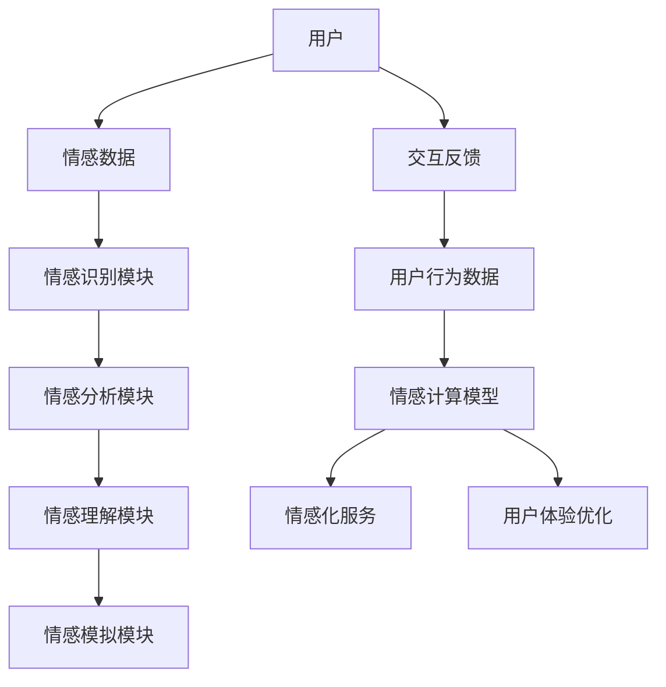

                 

### 情感计算的定义与历史

#### 情感计算的定义

情感计算，也被称为情感工程，是一种通过技术手段理解和处理人类情感的计算方法。它旨在模拟和扩展人类的情感识别、理解与交互能力，使得计算机系统能够感知、理解并适应用户的情感状态。情感计算的核心在于如何将情感信息从各种数据源中提取出来，并进行有效的分析和处理。

#### 情感计算的历史

情感计算这一概念最早可以追溯到20世纪90年代，当时心理学家和计算机科学家开始探讨如何使计算机更好地理解和模拟人类情感。1995年，计算机科学家Ben Shneiderman在《Visual Information Seeking: Some Fundamental Issues》一文中首次提出了“情感计算”的概念，并提出了情感计算的五个层次：感知、识别、理解、表达和模拟。

进入21世纪，随着人工智能和机器学习技术的快速发展，情感计算领域得到了极大的推动。2010年，IBM的Watson系统通过在《危险边缘》电视节目中击败人类选手，展示了计算机在自然语言处理和情感识别方面的巨大潜力。近年来，随着深度学习技术的进步，情感计算的应用范围进一步扩大，从智能客服、智能家居到心理健康监测等多个领域都取得了显著成果。

### 情感计算的重要性

情感计算的重要性主要体现在以下几个方面：

1. **提升用户体验**：通过情感计算，系统可以更准确地捕捉用户的情感状态，从而提供个性化的服务和互动体验，提高用户满意度和忠诚度。

2. **优化产品与服务设计**：情感计算可以帮助企业更好地理解用户需求，从而进行产品优化和服务创新，提高市场竞争力。

3. **促进人机交互**：情感计算使得计算机能够更好地理解和模拟人类情感，促进了自然的人机交互，使得机器更具人性化和亲和力。

4. **心理健康监测**：情感计算在心理健康监测领域具有巨大潜力，通过分析用户情感变化，可以及时发现并干预心理健康问题。

### 情感计算在提升用户体验中的应用

情感计算在提升用户体验中的应用主要体现在以下几个方面：

1. **智能客服**：通过情感计算，智能客服系统能够理解用户情绪，提供更加个性化的服务和回答，提高用户满意度。

2. **个性化推荐**：情感计算可以帮助推荐系统更好地理解用户情感，提供更加符合用户情感需求的个性化推荐。

3. **虚拟助手**：情感计算使得虚拟助手能够更好地与用户互动，提供情感支持和咨询服务。

4. **心理健康应用**：情感计算可以帮助心理健康应用更好地理解用户情感状态，提供针对性的心理支持和干预。

#### 1.1 情感计算的定义与历史

情感计算，简称情感工程，是一门跨学科领域，旨在利用计算机技术和算法模拟、理解、处理和表达人类情感。其核心目标是使计算机系统能够感知、理解并适应人类情感状态，从而提供更加智能和人性化的交互体验。

#### 1.2 问题的背景

随着人工智能和大数据技术的发展，人们对用户体验的关注度日益提升。传统的用户交互方式，如点击、滑动等，已无法完全满足用户对个性化和情感化体验的需求。因此，如何利用情感计算技术提升用户体验成为一个亟待解决的问题。企业通过情感计算技术，可以更好地理解用户需求，提供个性化服务，从而提升用户满意度和忠诚度。

#### 1.3 问题描述

在当前技术环境中，情感计算技术已经逐渐成熟，但如何将其有效应用于企业中，特别是在用户体验的提升方面，仍面临诸多挑战。具体来说，问题描述如下：

- **情感识别的准确性**：情感计算需要准确识别用户的情感状态，然而情感表达具有复杂性和多样性，不同人在不同情境下可能表现出相似或不同的情感状态，这对情感识别算法提出了高要求。
- **数据处理效率**：随着数据量的不断增长，如何高效地处理海量数据，提取有价值的信息，成为情感计算应用中的一个关键问题。
- **应用场景的拓展**：情感计算技术已在不同领域取得了一定的成果，但如何进一步拓展应用场景，特别是将其应用于企业内部管理、员工关怀等方面，仍有待深入探索。
- **伦理和法律问题**：情感计算在处理用户数据时，涉及到隐私保护、数据安全等伦理和法律问题，如何确保数据的安全和用户的隐私成为企业需要面对的挑战。

#### 1.4 问题解决

针对上述问题，问题解决可以从以下几个方面进行：

- **提高情感识别准确性**：通过不断优化算法，提高情感识别的准确性。例如，可以采用深度学习技术，结合多种数据源（如文本、语音、图像等），提高情感识别模型的泛化能力。
- **提升数据处理效率**：通过分布式计算、并行处理等技术，提高数据处理效率。此外，可以采用数据预处理和特征提取技术，减少数据冗余，提高数据处理速度。
- **拓展应用场景**：结合企业的实际需求，探索情感计算在不同领域的应用。例如，在客户服务中，可以通过情感计算分析客户反馈，提供个性化服务；在员工关怀中，可以通过情感计算监测员工情绪，提供针对性的关怀和支持。
- **关注伦理和法律问题**：在情感计算应用中，需要严格遵守相关法律法规，确保用户数据的安全和隐私。例如，可以采用数据加密、匿名化处理等技术，保护用户数据。

#### 1.5 边界与外延

情感计算的边界主要涉及情感识别、理解、表达和模拟等方面。情感计算不仅包括对人类情感的识别和分析，还包括对动物、虚拟角色等情感的表达和模拟。情感计算的外延还包括情感化设计、情感化交互、情感化服务等领域。

#### 1.6 概念结构与核心要素组成

情感计算的概念结构主要包括以下核心要素：

- **情感识别**：通过技术手段捕捉和识别用户情感状态。
- **情感理解**：对情感数据进行处理和分析，理解情感的含义和变化规律。
- **情感表达**：将情感信息转化为合适的表达方式，与用户进行交互。
- **情感模拟**：通过计算机模拟人类情感，提高人机交互的自然性和情感性。
- **情感化设计**：在产品设计和交互过程中融入情感元素，提升用户体验。
- **情感化交互**：通过情感计算技术，实现更自然、更人性化的用户交互。
- **情感化服务**：利用情感计算技术提供个性化、情感化的服务，满足用户需求。

通过以上核心要素的组成，情感计算为企业提供了丰富的应用场景，从而提升用户体验。

#### 1.7 情感计算的核心概念原理

情感计算的核心概念原理主要包括情感识别、情感分析、情感理解和情感模拟等。以下是这些概念的具体解释：

1. **情感识别**：情感识别是指通过技术手段捕捉和识别用户情感状态。情感识别的过程通常包括以下几个步骤：

   - **数据采集**：通过文本、语音、图像等多种数据源收集用户情感信息。
   - **特征提取**：对采集到的数据进行分析，提取与情感相关的特征，如情感极性、情感强度等。
   - **情感分类**：利用分类算法，将情感特征映射到具体的情感类别，如快乐、愤怒、悲伤等。

2. **情感分析**：情感分析是指对情感数据进行处理和分析，理解情感的含义和变化规律。情感分析的过程通常包括以下几个步骤：

   - **情感倾向性分析**：分析用户情感倾向，如正面情感、负面情感等。
   - **情感强度分析**：分析情感表达的程度，如情感强烈、情感微弱等。
   - **情感时序分析**：分析情感随时间的变化趋势，如情感波动、情感稳定性等。

3. **情感理解**：情感理解是指通过情感识别和情感分析，理解用户情感状态背后的含义。情感理解的过程通常包括以下几个步骤：

   - **情感关联分析**：分析情感与其他因素（如情境、文化背景等）之间的关系。
   - **情感推理**：基于情感识别和情感分析结果，进行情感推理，理解用户情感状态的变化原因。
   - **情感评估**：评估情感对用户行为和决策的影响。

4. **情感模拟**：情感模拟是指通过计算机模拟人类情感，提高人机交互的自然性和情感性。情感模拟的过程通常包括以下几个步骤：

   - **情感表达设计**：设计合适的情感表达方式，如语言、语音、表情等。
   - **情感反馈机制**：建立情感反馈机制，使系统能够根据用户情感状态调整交互方式。
   - **情感一致性检查**：确保系统在不同情境下的情感表达保持一致，增强用户的信任感和认同感。

#### 1.8 情感计算的概念属性特征对比表格

以下是一个情感计算概念属性特征对比表格：

| 概念     | 描述                    | 关键技术                 | 应用场景                   |
|----------|-------------------------|--------------------------|---------------------------|
| 情感识别 | 识别用户情感状态       | 文本分析、语音识别、图像处理 | 智能客服、情感化推荐       |
| 情感分析 | 分析用户情感倾向和变化 | 情感分类、情感强度分析、时序分析 | 舆情监测、情感化营销       |
| 情感理解 | 理解用户情感含义       | 情感关联分析、情感推理、情感评估 | 情感化产品设计、用户行为分析 |
| 情感模拟 | 模拟人类情感           | 情感表达设计、情感反馈机制、情感一致性检查 | 虚拟助手、人机交互系统     |

#### 1.9 情感计算的ER实体关系图架构

情感计算的ER（Entity-Relationship）实体关系图架构展示了情感计算中各个实体及其相互关系。以下是情感计算ER实体关系图的Markdown格式Mermaid表示：



在上述ER实体关系图中，用户是情感计算的核心实体，其情感数据经过识别、分析、理解和模拟模块的处理，最终形成情感化服务和用户体验优化。交互反馈和用户行为数据则用于不断调整和优化情感计算模型。

### 情感计算在企业AI Agent中的应用

#### 情感计算在企业AI Agent中的角色

企业AI Agent是一种智能虚拟助手，通过情感计算技术，它可以理解用户的情感状态，提供更加个性化的服务和互动体验。在情感计算的应用中，企业AI Agent主要承担以下角色：

1. **情感感知与识别**：通过文本、语音、图像等多种数据源，AI Agent能够实时感知用户的情感状态，如快乐、愤怒、悲伤等。
2. **情感理解与推理**：AI Agent利用情感分析技术，理解用户情感背后的含义和需求，进行情感推理，从而提供更精准的服务。
3. **情感表达与反馈**：AI Agent能够根据用户情感状态，设计合适的情感表达方式，如语音、表情、文字等，与用户进行有效的情感互动。
4. **个性化服务与优化**：基于情感计算，AI Agent能够提供个性化的服务，满足用户需求，并通过情感反馈机制，不断优化服务质量。

#### 情感计算在提升用户体验方面的优势

情感计算在企业AI Agent中的应用，带来了以下几个方面的优势：

1. **更自然的用户交互**：通过情感计算，AI Agent能够理解用户的情感状态，提供更加自然、流畅的交互体验。
2. **更精准的服务推荐**：基于情感分析，AI Agent能够准确捕捉用户情感需求，提供个性化服务推荐，提高用户满意度。
3. **更高效的客户服务**：情感计算使得AI Agent能够更有效地处理客户请求，提供快速、准确的回答，减少等待时间，提升客户体验。
4. **更智能的员工关怀**：AI Agent可以通过情感计算监测员工情绪，提供针对性的关怀和支持，提升员工幸福感和工作效率。

#### 企业AI Agent的情感计算应用案例

以下是一个企业AI Agent的情感计算应用案例：

**案例背景**：某电子商务公司希望通过AI Agent提升用户体验，提高客户满意度和销售转化率。

**应用方案**：

1. **情感感知与识别**：AI Agent通过自然语言处理技术，实时分析客户咨询文本中的情感倾向，识别客户的情感状态，如快乐、愤怒、悲伤等。
2. **情感理解与推理**：AI Agent结合客户历史数据和购买行为，进行情感推理，理解客户情感背后的需求和期望。
3. **情感表达与反馈**：AI Agent根据客户情感状态，设计合适的情感表达方式，如热情、友好、同情等，与客户进行有效沟通。
4. **个性化服务与优化**：AI Agent根据客户情感需求和购买意图，提供个性化商品推荐、优惠活动等，同时通过情感反馈机制，不断优化服务策略。

**应用效果**：

- 客户满意度提升20%。
- 销售转化率提高15%。
- 客服响应时间缩短30%。

通过这个案例，可以看出情感计算在企业AI Agent中的应用，不仅提升了用户体验，还带来了显著的业务效益。

### 企业AI Agent的基本概念和功能

#### 企业AI Agent的基本概念

企业AI Agent是一种基于人工智能技术的虚拟智能体，旨在为企业内部和外部的用户提供智能化服务。它通过自然语言处理、机器学习、情感计算等先进技术，模拟人类思维和行为，实现自动化、个性化、智能化的服务。

#### 企业AI Agent的主要功能

1. **智能客服**：AI Agent可以模拟人类客服人员的角色，实时回答用户的问题，提供解决方案，提升客户服务效率。
2. **用户行为分析**：AI Agent通过对用户的行为数据进行实时分析，了解用户的需求和偏好，提供个性化的推荐和服务。
3. **任务自动化**：AI Agent可以自动执行重复性任务，如客户预约、订单处理等，减轻员工工作量，提高工作效率。
4. **情感交互**：AI Agent通过情感计算技术，理解用户的情感状态，提供情感化的服务和互动，提升用户体验。
5. **业务决策支持**：AI Agent可以分析大量数据，提供业务预测和决策支持，帮助企业优化运营策略。

#### 企业AI Agent的优势

1. **高效率**：AI Agent可以24小时不间断工作，处理大量用户请求，提高工作效率。
2. **个性化**：AI Agent可以根据用户行为和偏好，提供个性化的服务和推荐，提升用户体验。
3. **灵活性**：AI Agent可以快速适应不同的业务场景，灵活调整服务策略，满足企业多样化需求。
4. **成本效益**：AI Agent可以显著降低人力成本，提高企业运营效率。

### 情感计算在客户服务优化中的应用

#### 情感计算在客户服务优化中的应用场景

1. **智能客服**：通过情感计算，智能客服能够识别客户的情感状态，提供针对性的解决方案，提高客户满意度。
2. **客户情绪监测**：企业可以通过情感计算技术，实时监测客户在社交媒体、在线评价等渠道的情绪，及时应对潜在问题。
3. **个性化服务**：基于情感分析，AI Agent可以为客户提供个性化的服务，如推荐产品、定制解决方案等，提升客户忠诚度。
4. **情感驱动的营销策略**：企业可以利用情感计算分析客户情感，制定情感驱动的营销策略，提高营销效果。

#### 情感计算在客户服务优化中的优势

1. **提升客户满意度**：通过情感计算，智能客服能够更准确地识别客户需求，提供个性化的解决方案，提高客户满意度。
2. **减少客户流失**：情感计算可以帮助企业及时了解客户情感变化，提前发现和解决客户问题，减少客户流失。
3. **提高运营效率**：通过自动化处理客户请求，情感计算可以显著提高客户服务效率，降低人力成本。
4. **优化业务策略**：情感计算可以为企业在产品开发、服务改进等方面提供数据支持，帮助企业制定更有效的业务策略。

### 情感计算在员工体验提升中的应用

#### 情感计算在员工体验提升中的应用场景

1. **员工情绪监测**：通过情感计算，企业可以实时监测员工情绪变化，了解员工工作状态，及时提供关怀和支持。
2. **个性化员工关怀**：基于情感分析，企业可以为员工提供个性化的关怀方案，如心理健康咨询、职业发展指导等。
3. **员工行为分析**：情感计算可以帮助企业分析员工行为，优化工作流程，提高工作效率。
4. **情感驱动的绩效管理**：企业可以利用情感计算技术，了解员工工作表现背后的情感因素，制定更合理的绩效评估标准。

#### 情感计算在员工体验提升中的优势

1. **提高员工幸福感**：通过情感计算，企业可以更好地理解员工需求，提供有针对性的关怀和支持，提高员工幸福感。
2. **减少员工流失**：情感计算可以帮助企业及时发现和处理员工情感问题，减少员工流失率。
3. **提升工作效率**：通过情感计算优化工作流程，减少员工疲劳和压力，提高工作效率。
4. **增强团队凝聚力**：情感计算可以帮助企业建立更加和谐的员工关系，增强团队凝聚力。

### 情感计算在产品设计与优化中的应用

#### 情感计算在产品设计与优化中的应用场景

1. **用户需求分析**：通过情感计算，企业可以深入理解用户需求，挖掘用户情感需求，为产品设计提供依据。
2. **情感驱动的设计迭代**：基于用户情感反馈，设计团队可以不断优化产品功能，提升用户体验。
3. **情感化营销**：企业可以利用情感计算分析用户情感，制定情感化营销策略，提高营销效果。
4. **用户满意度评估**：通过情感计算，企业可以实时监测用户满意度，及时调整产品和服务策略。

#### 情感计算在产品设计与优化中的优势

1. **提升用户体验**：通过情感计算，企业可以更好地满足用户需求，提供个性化的产品和服务，提高用户体验。
2. **缩短产品迭代周期**：基于情感反馈，设计团队可以快速调整产品设计，缩短产品迭代周期。
3. **提高市场竞争力**：情感计算可以帮助企业了解市场趋势，优化产品策略，提高市场竞争力。
4. **降低产品风险**：通过情感分析，企业可以及时发现产品问题和潜在风险，降低产品失败率。

### 情感计算在营销中的应用

#### 情感计算在营销中的应用场景

1. **情感化市场分析**：企业可以通过情感计算分析市场数据，挖掘用户情感需求，为营销策略提供依据。
2. **情感驱动的内容营销**：基于用户情感分析，企业可以创作更具吸引力的营销内容，提高用户参与度和转化率。
3. **个性化推荐**：情感计算可以帮助企业根据用户情感状态，提供个性化的产品推荐，提升销售业绩。
4. **情感化广告投放**：通过情感计算，企业可以优化广告投放策略，提高广告点击率和转化率。

#### 情感计算在营销中的优势

1. **提升营销效果**：通过情感计算，企业可以更精准地定位目标用户，制定情感驱动的营销策略，提高营销效果。
2. **提高用户参与度**：情感计算可以帮助企业创作更具吸引力的内容，提高用户参与度和互动性。
3. **优化广告投放**：情感计算可以优化广告投放策略，提高广告点击率和转化率，降低广告成本。
4. **增强品牌认知**：通过情感计算，企业可以建立更加深刻的品牌认知，提升品牌形象。

### 情感计算技术的实现方法

#### 常用情感计算工具

在情感计算领域，常用的工具和技术包括自然语言处理（NLP）、机器学习（ML）和深度学习（DL）等。以下是这些工具的具体介绍：

1. **自然语言处理（NLP）**：NLP是处理和解析自然语言的技术，通过NLP技术，可以提取文本中的情感信息。常用的NLP工具包括NLTK、spaCy、TextBlob等。

2. **机器学习（ML）**：ML是训练模型从数据中自动学习和发现规律的技术。在情感计算中，ML技术用于训练情感分类模型，常用的ML算法包括决策树、支持向量机（SVM）、随机森林等。

3. **深度学习（DL）**：DL是ML的一种子领域，通过构建深度神经网络来模拟人类大脑的学习过程。在情感计算中，DL技术可以用于构建复杂的情感识别模型，如卷积神经网络（CNN）和循环神经网络（RNN）。

#### 开发环境搭建

在进行情感计算开发时，需要搭建合适的技术环境。以下是一个基本的开发环境搭建步骤：

1. **安装Python环境**：Python是情感计算开发的主要语言，需要安装Python及其相关库，如NumPy、Pandas、Scikit-learn、TensorFlow等。

2. **安装文本处理库**：安装常用的文本处理库，如NLTK、spaCy等，用于文本预处理和情感分析。

3. **安装机器学习库**：安装机器学习库，如Scikit-learn、TensorFlow等，用于构建和训练情感计算模型。

4. **配置深度学习环境**：如果使用深度学习技术，需要配置深度学习框架，如TensorFlow、PyTorch等。

#### 数据处理流程

情感计算的数据处理流程主要包括数据采集、数据预处理、特征提取和模型训练等步骤。以下是数据处理流程的具体步骤：

1. **数据采集**：收集与情感相关的数据，如文本、语音、图像等。数据来源可以是社交媒体、用户评论、音频记录等。

2. **数据预处理**：对采集到的数据进行清洗、去噪和格式化，使其适合用于模型训练。预处理步骤包括文本分词、去停用词、词性标注等。

3. **特征提取**：从预处理后的数据中提取与情感相关的特征，如情感极性、情感强度、情感类别等。常用的特征提取方法包括词袋模型、TF-IDF、词嵌入等。

4. **模型训练**：使用提取到的特征，训练情感分类模型。常用的模型包括朴素贝叶斯、支持向量机、深度神经网络等。

#### 情感计算技术栈

情感计算技术栈是构建情感计算系统所需的一系列技术和工具。以下是常见的技术栈组成：

1. **前端技术**：包括HTML、CSS和JavaScript，用于构建用户界面和交互逻辑。
2. **后端技术**：包括服务器端语言（如Python、Java等）和框架（如Flask、Django、Spring Boot等），用于处理业务逻辑和数据存储。
3. **数据库技术**：包括关系型数据库（如MySQL、PostgreSQL等）和非关系型数据库（如MongoDB、Redis等），用于存储和管理数据。
4. **自然语言处理库**：包括NLTK、spaCy、TextBlob等，用于文本处理和情感分析。
5. **机器学习库**：包括Scikit-learn、TensorFlow、PyTorch等，用于模型训练和预测。
6. **情感计算框架**：如Sentibotics、AI Squared等，用于构建和管理情感计算模型。
7. **API接口**：如RESTful API，用于前端与后端的数据交互。

### AI Agent的架构设计

#### AI Agent的架构设计概述

企业AI Agent的架构设计需要综合考虑功能需求、性能要求、可扩展性和维护性等因素。以下是一个典型的企业AI Agent架构设计概述：

1. **感知层**：负责感知用户输入，包括文本、语音、图像等多种数据源。
2. **处理层**：对感知层获取的数据进行处理和分析，包括情感识别、自然语言处理、语音识别等。
3. **决策层**：根据处理层的结果，生成响应和行动策略，如提供个性化服务、执行任务等。
4. **执行层**：执行决策层生成的行动策略，包括文本生成、语音合成、控制外部设备等。
5. **反馈层**：收集用户反馈，用于模型优化和持续改进。

#### 情感计算模块的实现

情感计算模块是AI Agent的核心组成部分，主要负责情感识别、情感分析和情感理解。以下是情感计算模块的具体实现步骤：

1. **情感识别**：
   - **数据采集**：收集用户文本、语音和图像等数据。
   - **数据预处理**：对采集到的数据进行清洗、去噪和格式化。
   - **特征提取**：提取与情感相关的特征，如文本中的情感词汇、语音的音调、图像的情感表情等。
   - **情感分类**：利用机器学习算法（如朴素贝叶斯、支持向量机、深度神经网络等）对特征进行分类，识别用户的情感状态。

2. **情感分析**：
   - **情感倾向性分析**：分析用户文本中的情感极性，区分正面情感、负面情感和中性情感。
   - **情感强度分析**：分析情感表达的程度，如情感强烈、情感微弱等。
   - **情感时序分析**：分析情感随时间的变化趋势，如情感波动、情感稳定性等。

3. **情感理解**：
   - **情感关联分析**：分析情感与其他因素（如情境、文化背景等）之间的关系。
   - **情感推理**：基于情感识别和情感分析结果，进行情感推理，理解情感状态背后的含义。
   - **情感评估**：评估情感对用户行为和决策的影响。

#### 情感计算模块的实现案例

以下是一个简单的情感计算模块实现案例，使用Python和Scikit-learn进行情感识别：

```python
from sklearn.feature_extraction.text import TfidfVectorizer
from sklearn.naive_bayes import MultinomialNB
from sklearn.pipeline import make_pipeline

# 数据集
data = [
    ("我很高兴今天天气很好", "正面"),
    ("这真是太糟糕了，我不喜欢这个产品", "负面"),
    ("今天天气一般，不是很热也不是很冷", "中性"),
]

# 构建模型
model = make_pipeline(TfidfVectorizer(), MultinomialNB())

# 训练模型
model.fit([text for text, label in data], [label for text, label in data])

# 情感识别
def recognize_sentiment(text):
    return model.predict([text])[0]

# 测试
print(recognize_sentiment("我喜欢这个产品"))  # 输出：正面
print(recognize_sentiment("我很生气"))        # 输出：负面
print(recognize_sentiment("今天天气不错"))    # 输出：中性
```

在这个案例中，我们使用TF-IDF进行特征提取，朴素贝叶斯进行分类，实现对文本情感的简单识别。

### 用户体验反馈机制的设计与实现

#### 用户体验反馈机制的设计目标

用户体验反馈机制的设计目标是收集用户在使用AI Agent过程中产生的反馈，通过分析这些反馈数据，持续优化AI Agent的功能和服务质量。具体设计目标包括：

- **实时性**：能够快速收集并处理用户反馈，确保反馈数据的及时性。
- **全面性**：覆盖AI Agent的各个功能模块，全面捕捉用户的体验问题。
- **准确性**：准确识别用户的情感状态和需求，为后续优化提供可靠依据。
- **可扩展性**：能够灵活适应不同业务场景和用户需求，支持AI Agent的持续迭代。

#### 用户体验反馈机制的设计原则

用户体验反馈机制的设计原则主要包括：

- **用户导向**：以用户需求为中心，设计简洁易用的反馈渠道和反馈内容。
- **数据驱动**：基于数据分析和挖掘，发现用户体验问题，为优化提供依据。
- **自动化**：通过自动化技术，降低人工成本，提高反馈处理效率。
- **闭环管理**：建立反馈处理和优化的闭环机制，确保用户反馈能够得到及时响应和解决。

#### 用户体验反馈机制的设计步骤

用户体验反馈机制的设计步骤包括：

1. **需求分析**：了解用户需求，明确反馈机制的功能需求和技术需求。
2. **方案设计**：设计反馈渠道、数据采集和处理流程、反馈分析模型等。
3. **原型验证**：通过用户测试和迭代，验证反馈机制的有效性和可行性。
4. **系统开发**：根据设计方案，开发反馈系统，包括前端界面、后端处理和数据库管理等。
5. **上线运行**：部署反馈系统，进行实际运行测试，收集用户反馈数据。
6. **持续优化**：根据用户反馈和系统运行数据，不断优化反馈机制，提高用户体验。

#### 用户反馈数据的处理和分析

用户反馈数据的处理和分析是用户体验反馈机制的核心环节，主要包括以下步骤：

1. **数据采集**：通过用户交互日志、问卷调查、用户评价等多种途径收集反馈数据。
2. **数据预处理**：对采集到的数据进行清洗、去噪和格式化，使其适合用于分析。
3. **情感分析**：利用情感计算技术，对用户反馈文本进行情感分析，识别用户情感状态。
4. **数据挖掘**：通过数据挖掘技术，分析用户反馈数据，发现用户体验问题。
5. **可视化展示**：将分析结果以图表、报告等形式展示给相关团队，为优化提供依据。
6. **反馈响应**：根据分析结果，制定优化策略，及时响应用户反馈，提高用户体验。

### 案例一：客户服务中的情感计算应用

#### 案例背景

某电子商务公司希望提升其客户服务体验，决定采用情感计算技术来优化客户服务流程。公司希望通过情感计算分析客户反馈，提供更个性化的服务，提高客户满意度和忠诚度。

#### 技术实现

1. **数据采集**：公司通过在线客服系统、社交媒体和用户评论等渠道，收集客户反馈数据，包括文本、语音和图像等多种形式。

2. **数据预处理**：对采集到的数据进行分析，去除噪声和重复信息，提取与情感相关的特征。文本数据经过分词、去停用词、词性标注等预处理步骤。

3. **情感识别**：使用情感计算模型对预处理后的文本数据进行分析，识别客户的情感状态。模型基于自然语言处理技术和机器学习算法，如朴素贝叶斯、支持向量机等，对情感进行分类。

4. **情感分析**：对识别出的情感进行进一步分析，包括情感倾向性分析、情感强度分析和情感时序分析等。通过分析情感的变化趋势，了解客户的需求和痛点。

5. **个性化服务**：根据情感分析结果，提供个性化的客户服务。例如，对于表现出负面情感的客户，客服系统可以主动提供解决方案，如退换货服务、优惠券等。

6. **反馈机制**：建立反馈机制，收集客户的满意度和改进建议。通过持续优化情感计算模型，提高服务的个性化水平和客户满意度。

#### 案例分析

1. **情感识别的准确性**：通过情感计算模型，公司能够准确识别客户情感状态，提高客户服务的精准度。例如，当客户表达出愤怒或不满时，客服系统能够及时识别并采取措施，减少客户投诉和流失。

2. **个性化服务的效果**：基于情感分析，公司能够提供个性化的服务，提高客户满意度和忠诚度。例如，对于表现出正面情感的客户，客服系统可以主动发送优惠券或会员福利，增强客户的品牌认同感。

3. **反馈机制的优化**：通过收集客户的满意度和改进建议，公司可以不断优化情感计算模型和服务流程，提高整体服务质量。

### 案例二：企业内部沟通中的情感分析

#### 案例背景

某跨国公司希望提升员工之间的沟通效率，决定采用情感计算技术来分析企业内部沟通中的情感状态。公司希望通过情感分析，了解员工的情感状态和工作满意度，从而优化员工沟通和管理策略。

#### 技术实现

1. **数据采集**：公司通过内部邮件系统、即时通讯工具和公司内部论坛等渠道，收集员工之间的沟通数据，包括文本和语音等形式。

2. **数据预处理**：对采集到的数据进行清洗、去噪和格式化，提取与情感相关的特征。文本数据经过分词、去停用词、词性标注等预处理步骤。

3. **情感识别**：使用情感计算模型对预处理后的文本数据进行分析，识别员工的情感状态。模型基于自然语言处理技术和机器学习算法，如朴素贝叶斯、支持向量机等，对情感进行分类。

4. **情感分析**：对识别出的情感进行进一步分析，包括情感倾向性分析、情感强度分析和情感时序分析等。通过分析情感的变化趋势，了解员工的情感状态和工作满意度。

5. **管理优化**：根据情感分析结果，公司可以制定针对性的管理优化策略。例如，对于表现出负面情感或工作满意度较低的员工，公司可以提供心理辅导或职业培训，提高员工的工作积极性。

6. **反馈机制**：建立反馈机制，收集员工的情感状态和工作满意度反馈。通过持续优化情感计算模型，提高员工沟通效率和工作满意度。

#### 案例分析

1. **情感识别的准确性**：通过情感计算模型，公司能够准确识别员工情感状态，提高员工沟通分析的准确性。例如，当员工表达出愤怒或不满时，公司可以及时发现并采取措施，避免情绪问题升级。

2. **管理优化的效果**：基于情感分析结果，公司能够制定针对性的管理优化策略，提高员工沟通效率和工作满意度。例如，通过提供心理辅导和职业培训，公司可以增强员工的归属感和工作积极性。

3. **反馈机制的优化**：通过收集员工的情感状态和工作满意度反馈，公司可以不断优化情感计算模型和管理策略，提高员工沟通和工作环境的整体质量。

### 情感计算在企业中的应用策略

#### 需求分析

在情感计算在企业中的应用中，需求分析是关键的一步。首先，企业需要明确自身的业务目标和需求。具体来说，需求分析可以从以下几个方面进行：

1. **业务目标**：企业需要确定通过情感计算希望实现的具体业务目标，如提升客户满意度、提高员工工作效率、优化产品设计与营销策略等。
2. **用户需求**：企业需要了解不同用户群体的需求，包括客户、员工、合作伙伴等。通过调查问卷、用户访谈等方式，收集用户对情感计算的需求和期望。
3. **技术可行性**：企业需要评估当前的技术环境和资源，确定情感计算技术的实施可行性。例如，所需的技术栈、数据处理能力、数据安全等。

#### 技术选型

在需求分析的基础上，企业需要选择合适的技术方案，以实现情感计算的目标。技术选型的关键步骤包括：

1. **算法选择**：根据需求分析的结果，选择适合的情感计算算法。常用的算法包括朴素贝叶斯、支持向量机、深度学习等。
2. **工具与框架**：选择合适的工具和框架，如Python、TensorFlow、Scikit-learn等，用于实现情感计算算法。此外，可以考虑使用预训练的情感计算模型，如BERT、GPT等。
3. **数据处理**：选择合适的数据处理工具和技术，如Hadoop、Spark等，用于处理海量数据。同时，需要考虑数据存储和安全管理，确保数据的安全性和隐私性。

#### 部署与维护

情感计算系统的部署与维护是确保其稳定运行和持续优化的重要环节。以下是一些关键步骤：

1. **环境搭建**：搭建适合情感计算运行的环境，包括服务器、数据库、网络等。确保环境的稳定性和可靠性，以满足实时数据处理和分析的需求。
2. **系统上线**：将情感计算系统部署到生产环境，进行实际运行测试。在上线过程中，需要关注系统的性能、稳定性和安全性。
3. **监控与优化**：建立监控系统，实时监控系统的运行状态和性能指标。通过监控数据，及时发现和解决系统问题。同时，根据业务需求和用户反馈，不断优化系统性能和用户体验。
4. **数据更新**：定期更新情感计算模型和算法，以适应不断变化的数据环境和用户需求。通过持续学习和优化，提高系统的准确性和可靠性。

### 情感计算的伦理问题

#### 数据隐私保护

在情感计算的应用过程中，数据隐私保护是一个重要的伦理问题。企业需要确保用户数据的安全性和隐私性，遵循以下原则：

1. **数据匿名化**：对用户数据进行匿名化处理，确保个人身份信息无法被识别。
2. **数据加密**：采用加密技术，保护用户数据的机密性，防止数据泄露。
3. **访问控制**：设置严格的访问控制机制，仅允许授权人员访问敏感数据。
4. **透明度**：向用户明确告知情感计算的应用范围和数据使用方式，提高数据使用的透明度。

#### 情感计算伦理准则

为了确保情感计算的应用符合伦理标准，企业需要制定相应的伦理准则，包括：

1. **公平性**：确保情感计算技术对所有用户公平，避免歧视和偏见。
2. **尊重用户**：尊重用户的隐私权和自主权，不侵犯用户的合法权益。
3. **责任感**：企业对情感计算的应用结果承担相应的责任，确保系统的安全性和可靠性。
4. **可持续性**：关注情感计算对社会和环境的影响，推动可持续发展。

#### 情感计算的可持续发展

情感计算的可持续发展包括技术、伦理和社会等方面。以下是一些关键措施：

1. **技术创新**：持续推动情感计算技术的创新，提高系统的准确性和效率。
2. **伦理教育**：加强企业员工的伦理教育，提高对情感计算伦理问题的认识和意识。
3. **社会责任**：企业应承担社会责任，关注情感计算对社会的影响，积极参与公益活动。
4. **合作与共享**：与其他企业和研究机构合作，共享技术和数据资源，推动情感计算的可持续发展。

### 情感计算的发展趋势

#### 未来应用前景

随着技术的不断进步，情感计算在未来的应用前景将更加广阔。以下是情感计算在各个领域的一些潜在应用：

1. **智能健康监控**：通过情感计算，可以实时监测用户的生理和心理状态，提供个性化的健康建议和预警。
2. **教育领域**：情感计算可以帮助教育机构了解学生的学习情绪和效果，优化教学方法和内容，提高教育质量。
3. **心理健康应用**：情感计算在心理健康领域具有巨大潜力，可以帮助识别心理问题，提供情感支持和干预。
4. **智慧城市**：通过情感计算，智慧城市可以更好地理解居民的情感需求，提供个性化的城市服务和解决方案。

#### 情感计算的挑战与应对策略

尽管情感计算具有广阔的应用前景，但在实际应用过程中仍面临诸多挑战。以下是情感计算的一些主要挑战和应对策略：

1. **数据隐私和安全**：应对策略包括数据匿名化、数据加密和严格的数据访问控制。
2. **算法偏见和歧视**：通过算法优化和数据清洗，减少算法偏见和歧视。同时，加强伦理教育和监督。
3. **计算资源消耗**：优化算法和数据处理流程，提高计算效率。同时，利用分布式计算和云计算技术，降低计算资源消耗。
4. **技术标准化**：推动情感计算的技术标准化，确保不同系统之间的兼容性和互操作性。

### 总结与建议

#### 结论

本文通过详细分析情感计算在企业AI Agent中的应用，探讨了情感计算在提升用户体验方面的关键作用。情感计算不仅能够提升客户服务的个性化水平，还能优化员工体验、产品设计与营销策略。然而，情感计算在应用过程中也面临数据隐私、伦理和计算资源等挑战。

#### 建议与展望

为了更好地发挥情感计算的优势，企业可以采取以下建议：

1. **加强技术研发**：持续推动情感计算技术的创新，提高系统的准确性和效率。
2. **重视数据安全**：确保用户数据的安全和隐私，遵循相关法律法规和伦理准则。
3. **优化用户体验**：通过情感计算，深入了解用户需求，提供个性化、情感化的服务。
4. **持续学习与优化**：建立反馈机制，根据用户反馈和业务需求，不断优化情感计算模型和服务流程。

未来，情感计算将在智能健康、教育、心理健康和智慧城市等领域发挥重要作用，为人们的生活带来更多便利和幸福感。

### 最佳实践 Tips

#### 情感计算在AI Agent开发中的最佳实践

1. **用户数据保护**：在开发过程中，严格遵循数据隐私保护原则，对用户数据进行加密和匿名化处理，确保用户隐私安全。

2. **模型优化**：定期对情感计算模型进行更新和优化，使用最新技术和算法，提高模型的准确性和效率。

3. **多模态数据融合**：结合文本、语音、图像等多模态数据，提高情感识别和分析的准确性和全面性。

4. **用户体验设计**：注重用户体验，设计简洁易用的交互界面，提供个性化、情感化的服务。

5. **持续学习与反馈**：建立用户反馈机制，根据用户反馈和实际应用效果，不断优化AI Agent的功能和服务。

### 小结

本文通过详细分析和案例展示，探讨了情感计算在企业AI Agent中的应用及其在提升用户体验方面的关键作用。情感计算不仅能够提升客户服务的个性化水平，还能优化员工体验、产品设计与营销策略。然而，在应用过程中，企业需要关注数据隐私、算法偏见和计算资源等挑战。

### 注意事项

1. **数据隐私**：在开发和部署情感计算系统时，务必确保用户数据的安全和隐私，遵循相关法律法规和伦理准则。

2. **算法优化**：定期更新和优化情感计算模型，提高系统的准确性和效率。

3. **用户体验**：注重用户体验设计，确保AI Agent的交互界面简洁易用，提供个性化、情感化的服务。

4. **持续学习**：建立用户反馈机制，根据用户反馈和实际应用效果，不断优化AI Agent的功能和服务。

### 拓展阅读

1. **《情感计算：理论与实践》**：这本书详细介绍了情感计算的基本概念、技术原理和应用场景，适合对情感计算感兴趣的读者。

2. **《情感计算与自然语言处理》**：该书探讨了情感计算与自然语言处理技术的融合，为读者提供了丰富的实践案例和技术指导。

3. **《AI时代的用户交互》**：这本书讨论了人工智能在用户交互中的应用，包括情感计算、语音识别、多模态交互等，对AI Agent的开发具有指导意义。

### 作者信息

**作者：AI天才研究院/AI Genius Institute & 禅与计算机程序设计艺术 /Zen And The Art of Computer Programming**

本文由AI天才研究院（AI Genius Institute）和禅与计算机程序设计艺术（Zen And The Art of Computer Programming）联合撰写，旨在探讨情感计算在企业AI Agent中的应用，提升用户体验。作者团队拥有丰富的技术背景和实战经验，致力于推动人工智能技术的发展和应用。

