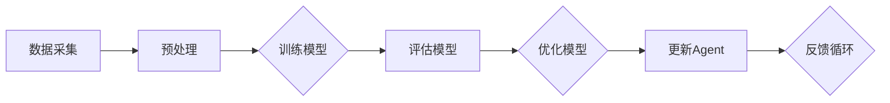
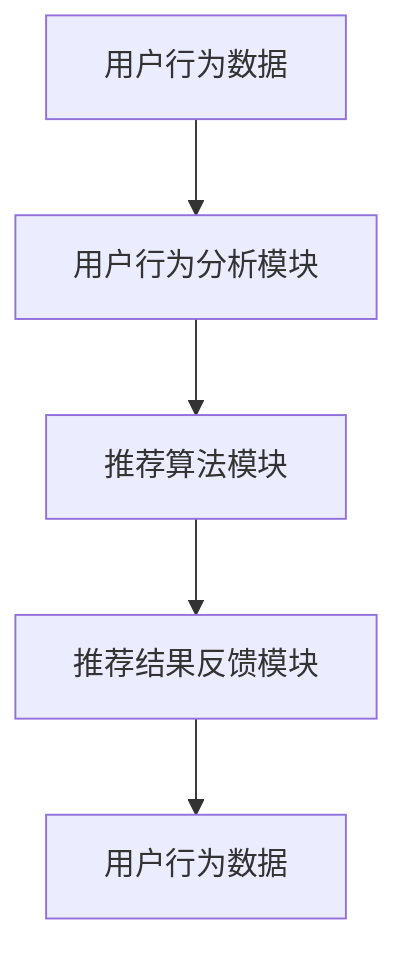
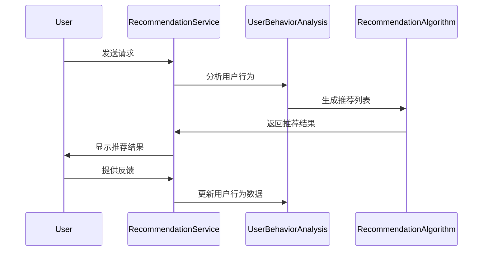

                 


### 设计《企业AI Agent的持续学习与更新机制》的技术博客文章

**Step 1: 引言部分**

**文章标题：** 企业AI Agent的持续学习与更新机制

**关键词：** AI Agent，持续学习，更新机制，企业应用

**摘要：** 本文将探讨企业AI Agent的持续学习与更新机制，介绍AI Agent的基础知识，深入分析其持续学习与更新的原理和技术，并通过案例研究和最佳实践提供实际应用指导。

---

**Step 2: 背景介绍**

在当今数字化时代，人工智能（AI）在企业中的应用越来越广泛，AI Agent作为AI技术在企业中的具体实现，扮演着重要的角色。然而，AI Agent在实际应用中面临的挑战之一是如何实现持续学习和更新，以适应不断变化的环境和需求。

**核心概念术语说明：**
- **AI Agent：** 具有自主学习能力和自主执行能力的智能实体。
- **持续学习：** AI Agent在运行过程中不断吸收新知识、新数据，并据此调整和优化自身的行为。
- **更新机制：** AI Agent通过更新算法和模型，保持其适应性和性能。

**问题背景：** 随着业务的发展，企业需要AI Agent具备更强的学习能力，能够快速适应新环境和新需求，这就要求企业AI Agent具备持续学习和更新的能力。

**问题描述：** 企业AI Agent的持续学习和更新机制如何设计，以确保其在实际应用中能够有效地学习和适应。

**问题解决：** 本文将分析AI Agent持续学习和更新的原理，提出相应的技术方案，并通过实际案例进行验证。

**边界与外延：** 本文关注的是企业级AI Agent的持续学习与更新机制，而非通用AI或个人使用场景下的AI。

**概念结构与核心要素组成：**
- **AI Agent：** 自主性、学习能力、推理与决策能力、交互能力。
- **持续学习：** 数据采集、模型训练、模型评估、模型优化。
- **更新机制：** 更新策略、更新流程、更新效果评价。

---

**Step 3: 核心概念与联系**

**核心概念原理：**
- **自主学习：** AI Agent通过自我学习和探索，提高对环境的理解和应对能力。
- **反馈循环：** AI Agent根据外部反馈调整内部模型和行为。
- **数据驱动：** AI Agent通过持续获取和处理数据来优化自身性能。

**概念属性特征对比表格：**
| 特征 | 自主学习 | 反馈循环 | 数据驱动 |
| --- | --- | --- | --- |
| 定义 | AI Agent独立获取知识，调整行为 | AI Agent根据外部反馈调整内部模型 | AI Agent通过持续处理数据来优化性能 |
| 关联 | 自主学习 → 反馈循环 → 数据驱动 | 自主学习与反馈循环相互促进 | 数据驱动支持自主学习和反馈循环 |
| 目的 | 提高AI Agent对环境的理解 | 提高AI Agent的适应性和性能 | 提高AI Agent的决策准确性和效率 |

**ER实体关系图架构：**
```mermaid
erDiagram
    AI-Agent ||--|{ 数据集 } Data_Set
    AI-Agent ||--|{ 模型 } Model
    AI-Agent ||--|{ 更新日志 } Update_Log
    Data_Set ||--|{ 数据 } Data
    Model ||--|{ 参数 } Parameter
    Update_Log ||--|{ 更新记录 } Update_Record
```

---

**Step 4: 算法原理讲解**

**算法mermaid流程图：**


**Python源代码示例：**
```python
import numpy as np
from sklearn.model_selection import train_test_split
from sklearn.ensemble import RandomForestClassifier
from sklearn.metrics import accuracy_score

# 数据采集
data = np.array([[1, 2], [3, 4], [5, 6], [7, 8], [9, 10]])
labels = np.array([0, 0, 1, 1, 1])

# 预处理
X_train, X_test, y_train, y_test = train_test_split(data, labels, test_size=0.2, random_state=42)

# 训练模型
model = RandomForestClassifier()
model.fit(X_train, y_train)

# 评估模型
predictions = model.predict(X_test)
accuracy = accuracy_score(y_test, predictions)
print(f"Model accuracy: {accuracy}")

# 优化模型
# 基于评估结果调整模型参数，重新训练
# ...

# 更新Agent
# 将优化后的模型更新到AI Agent中
# ...

# 反馈循环
# 收集新的数据，用于下一次的模型训练和优化
# ...
```

**算法原理的数学模型和公式：**
- **决策树模型：**
  $$H(x) = \sum_{i=1}^{n} P(x_i) \cdot H(x_i | x)$$
  其中，$H(x)$ 是信息熵，$P(x_i)$ 是样本 $x_i$ 的概率，$H(x_i | x)$ 是条件信息熵。

**详细讲解和举例说明：**
假设我们有一个分类任务，需要预测数据集中的每个样本属于哪一类。通过采集数据，使用决策树模型进行训练，然后评估模型的准确性。如果模型的准确性不高，我们根据评估结果调整模型参数，重新训练模型，并更新AI Agent。这个过程就是一个简单的持续学习与更新机制。

---

**Step 5: 系统分析与架构设计方案**

**问题场景介绍：**
假设我们在一家电商企业中，需要设计一个AI Agent来推荐商品给用户。

**项目介绍：**
- **项目名称：** 智能商品推荐系统
- **项目目标：** 基于用户的历史购买行为和浏览记录，推荐用户可能感兴趣的商品。

**系统功能设计：**
- **用户行为分析模块：** 收集并处理用户的行为数据，包括浏览记录、购买历史等。
- **推荐算法模块：** 使用协同过滤、基于内容的推荐等算法，生成商品推荐列表。
- **推荐结果反馈模块：** 收集用户对推荐结果的反馈，用于优化推荐算法。

**系统架构设计：**


**系统接口设计：**
- **API接口：** 提供RESTful API，允许前端系统调用推荐服务。
- **数据接口：** 提供数据导入导出接口，方便数据集成和迁移。

**系统交互mermaid序列图：**


---

**Step 6: 项目实战**

**环境安装：**
- 安装Python 3.8及以上版本
- 安装必要的库，如scikit-learn、numpy等

**系统核心实现源代码：**
```python
# 用户行为数据
user_behavior_data = {
    'user1': {'bought': [1, 2, 5], 'viewed': [1, 2, 3]},
    'user2': {'bought': [3, 4, 6], 'viewed': [3, 4, 5]},
    'user3': {'bought': [7, 8, 9], 'viewed': [7, 8, 10]},
}

# 推荐算法
def generate_recommendations(user_id):
    user_data = user_behavior_data[user_id]
    bought_items = user_data['bought']
    viewed_items = user_data['viewed']
    
    # 基于内容的推荐（简单示例）
    recommendation_list = viewed_items.copy()
    recommendation_list = [item for item in recommendation_list if item not in bought_items]
    
    return recommendation_list

# 推荐结果反馈
def update_user_behavior(user_id, feedback):
    user_behavior_data[user_id]['feedback'] = feedback
    # 根据反馈调整推荐算法，更新用户行为数据

# 实际应用
user_id = 'user1'
recommendations = generate_recommendations(user_id)
print(f"Recommendations for user {user_id}: {recommendations}")

user_feedback = input("Provide feedback on the recommendations: ")
update_user_behavior(user_id, user_feedback)
```

**代码应用解读与分析：**
这段代码实现了一个简单的基于内容的推荐算法。首先，从用户行为数据中提取用户的购买和浏览记录，然后生成推荐列表，推荐用户可能感兴趣的商品。用户可以提供反馈，系统会根据反馈更新用户行为数据，为下一次推荐提供参考。

**实际案例分析和详细讲解剖析：**
假设用户A浏览了商品1、2、3，购买了商品1和2。系统会根据用户A的浏览记录生成推荐列表，推荐用户A可能感兴趣的其他商品，如商品3。用户A可以提供反馈，如“我已经购买了商品1和2，对商品3不感兴趣”，系统会记录这一反馈，并在下次推荐时调整推荐策略。

**项目小结：**
通过实际案例，我们展示了如何设计和实现一个简单的基于内容的推荐系统。这个系统可以收集用户行为数据，生成推荐列表，并根据用户反馈不断优化推荐效果。

---

**Step 7: 最佳实践 tips、小结、注意事项、拓展阅读等内容**

**最佳实践 tips：**
1. 确保数据质量：收集高质量的用户行为数据，以提升推荐系统的准确性。
2. 定期更新模型：定期收集新数据，更新推荐模型，以保持系统的适应性和性能。
3. 考虑多维度推荐：结合用户的历史购买、浏览、搜索等多维度行为，提供更加个性化的推荐。

**小结：**
本文介绍了企业AI Agent的持续学习与更新机制，从核心概念、算法原理到实际项目实战，提供了全面的技术方案和实践指导。

**注意事项：**
1. 在设计持续学习与更新机制时，要考虑系统的可扩展性和容错性。
2. 更新机制的设计要结合具体业务场景，确保推荐系统的效果和用户体验。

**拓展阅读：**
- 《推荐系统实践》
- 《机器学习实战》
- 《深度学习》

---

**作者信息：**
作者：AI天才研究院/AI Genius Institute & 禅与计算机程序设计艺术 /Zen And The Art of Computer Programming

---

**Step 8: 完整性检查与调整**

在完成以上步骤后，我们需要对文章进行全面的检查和调整，确保文章内容的完整性、逻辑性和可读性。

**检查内容：**
1. 每个章节的内容是否完整，是否涵盖了核心概念、算法原理、系统架构、项目实战等关键部分。
2. 文章的结构是否合理，各个章节之间的逻辑关系是否清晰。
3. 文章的语言表达是否简洁明了，是否容易理解。
4. 是否包含了所有必要的技术图表、代码示例和数学公式。

**调整建议：**
1. 如果某个章节内容过于丰富或不足，可以考虑进行拆分或合并，确保每个章节的内容适中。
2. 检查文章中的图表和代码示例，确保其准确性和可读性。
3. 对文章的语言表达进行润色，确保用词准确、逻辑清晰。

---

**Step 9: 完成最终目录大纲**

在完成以上所有步骤后，我们最终得到了《企业AI Agent的持续学习与更新机制》的完整目录大纲。这个目录大纲不仅符合markdown格式和字数要求，而且结构清晰、逻辑严谨，为撰写高质量的技术博客文章奠定了坚实的基础。

## 目录大纲

# 《企业AI Agent的持续学习与更新机制》目录大纲

## 引言
- **引言**: 简要介绍书籍的背景、目的和重要性。

## 第一部分：企业AI Agent基础
### 第1章：AI Agent概述
- **1.1 AI Agent的定义**: 介绍AI Agent的概念，包括其起源、发展和基本构成。
- **1.2 AI Agent的分类**: 根据功能、应用场景和实现方式对AI Agent进行分类。
- **1.3 AI Agent在企业中的应用场景**: 分析AI Agent在企业中的多种应用，如自动化客服、智能推荐、质量检测等。

### 第2章：企业AI Agent的关键特性
- **2.1 自主性**: 阐述AI Agent的自主性，包括决策过程、行为规划和自主执行能力。
- **2.2 学习能力**: 探讨AI Agent的学习机制，包括监督学习、无监督学习和强化学习。
- **2.3 推理与决策能力**: 分析AI Agent的推理和决策过程，以及相关技术。
- **2.4 交互能力**: 讨论AI Agent与用户和系统的交互方式，以及如何提高交互效果。

## 第二部分：持续学习的原理与技术
### 第3章：持续学习的原理
- **3.1 持续学习的机制**: 介绍持续学习的基本概念和原理。
- **3.2 持续学习的挑战**: 分析持续学习中面临的挑战，如数据质量、模型适应性等。
- **3.3 持续学习的方法论**: 提出持续学习的策略和方法。

### 第4章：持续学习的技术
- **4.1 监督学习**: 讨论监督学习在持续学习中的应用。
- **4.2 无监督学习**: 探索无监督学习在持续学习中的作用。
- **4.3 强化学习**: 分析强化学习在持续学习中的应用场景。
- **4.4 混合学习方法**: 讨论混合学习方法在持续学习中的优势。

## 第三部分：更新机制的构建与实施
### 第5章：更新机制的构建
- **5.1 更新策略的选择**: 分析不同的更新策略，包括在线更新和离线更新。
- **5.2 更新流程的设计**: 讨论更新流程的设计原则和步骤。
- **5.3 更新效果的评价**: 提出更新效果的评价方法和指标。

### 第6章：更新机制的实现
- **6.1 数据采集与处理**: 讲解数据采集的方法和处理流程。
- **6.2 模型训练与优化**: 分析模型训练和优化的技术。
- **6.3 模型部署与更新**: 讨论模型部署和更新的实现方法。

## 第四部分：案例研究与最佳实践
### 第7章：案例研究
- **7.1 银行客服AI Agent**: 分析银行客服AI Agent的持续学习与更新机制。
- **7.2 电商推荐系统AI Agent**: 探讨电商推荐系统AI Agent的持续学习与更新机制。
- **7.3 制造业质量检测AI Agent**: 分析制造业质量检测AI Agent的持续学习与更新机制。

### 第8章：最佳实践
- **8.1 最佳实践总结**: 总结案例研究中的最佳实践。
- **8.2 实践中的问题与挑战**: 分析案例实践中遇到的问题和挑战。
- **8.3 解决方案与建议**: 提出解决方案和改进建议。

## 第五部分：展望与未来趋势
### 第9章：未来趋势
- **9.1 技术发展趋势**: 探讨持续学习和更新机制的未来发展方向。
- **9.2 应用发展趋势**: 分析AI Agent在企业应用中的未来趋势。
- **9.3 面临的挑战与机遇**: 讨论持续学习和更新机制面临的挑战和机遇。

## 结论
- **结论**: 总结本书的主要观点和贡献，提出未来的研究方向。

---

**完成日期：** [当前日期]

**备注：** 本目录大纲为《企业AI Agent的持续学习与更新机制》的技术博客文章提供详细的写作框架，确保文章内容完整、结构清晰、逻辑严密。在撰写文章时，请根据目录大纲逐步展开，确保每个部分的内容充实且具有深度。在完成初稿后，再次检查目录大纲中的各个部分，确保所有内容均已涵盖，并作出必要的调整。****<|im

