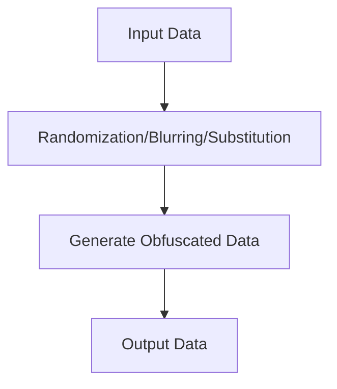
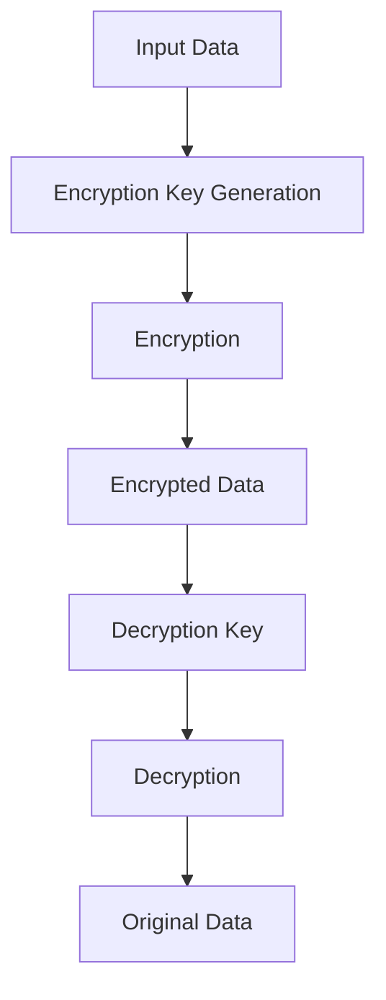
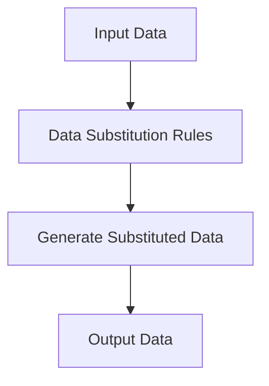
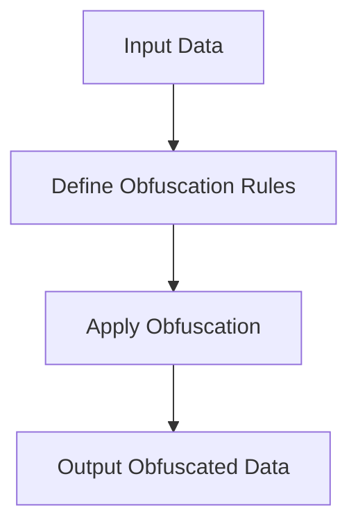
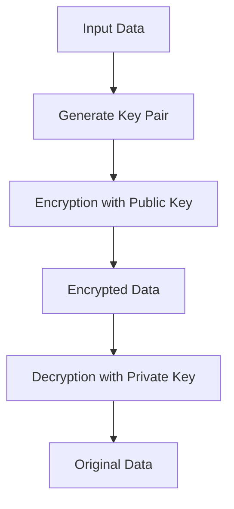
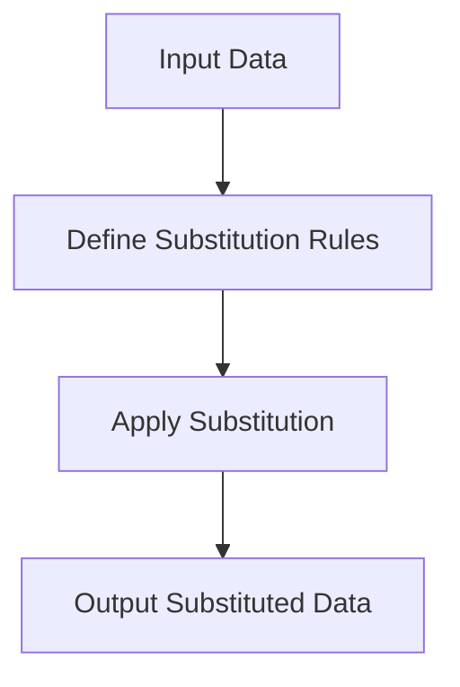
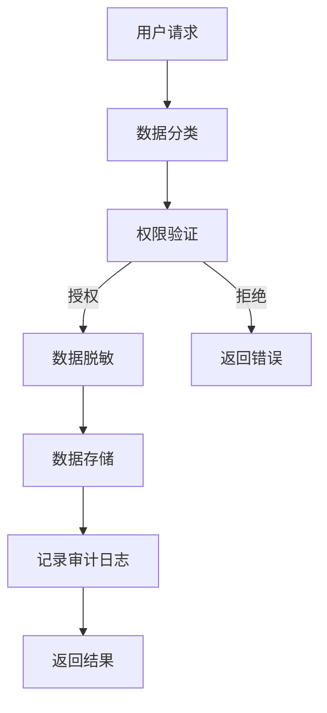
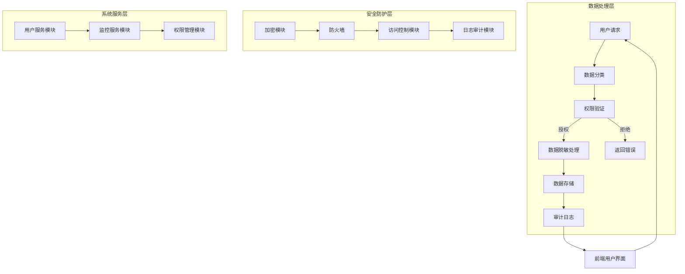

                 

### 企业AI Agent的敏感信息处理背景

在当今数字化时代，企业的数据处理和人工智能（AI）应用日益普及，AI Agent作为人工智能的执行实体，正逐步渗透到企业的各个业务领域，提高自动化程度和决策效率。然而，随着AI Agent在数据处理中的广泛应用，如何保护敏感信息成为了一个不可忽视的重要问题。

#### 敏感信息处理的必要性

敏感信息是指在特定的环境和条件下，对数据主体或组织造成潜在风险的信息。在企业AI Agent中，敏感信息通常包括以下几种：

- **个人身份信息**：如姓名、身份证号、家庭住址等。
- **财务信息**：如银行账户、信用卡信息、交易记录等。
- **医疗信息**：如诊断记录、病历信息、处方等。
- **企业机密**：如商业计划、客户信息、研发成果等。

这些信息如果未经妥善处理和保护，一旦泄露，可能导致以下后果：

- **隐私泄露**：个人隐私权受到侵害，造成用户信任危机。
- **经济损失**：企业商业机密被窃取，造成经济损失。
- **法律风险**：违反数据保护法规，面临巨额罚款和诉讼。

因此，敏感信息处理成为企业AI Agent应用中的关键环节，是保障数据安全和用户隐私的必要手段。

#### 敏感信息处理的重要性

随着数据泄露事件频发，数据安全的重要性越来越受到各界的关注。对于企业而言，确保敏感信息不被泄露不仅是为了遵守法律法规，更是为了维护企业的信誉和用户信任。以下是敏感信息处理的重要性体现：

- **合规性要求**：许多国家和地区都制定了严格的数据保护法规，如欧盟的《通用数据保护条例》（GDPR）和美国加州的《消费者隐私法案》（CCPA）。企业必须遵守这些法规，否则将面临严厉的罚款和处罚。
- **用户信任**：用户的信任是企业的宝贵资产。如果用户的信息得不到妥善保护，用户将失去信任，可能导致客户流失。
- **市场竞争**：在日益激烈的市场竞争中，数据安全和隐私保护成为企业竞争力的体现。优秀的数据保护措施可以提升企业的市场地位和品牌价值。

#### 当前企业面临的敏感信息泄露风险

当前，企业面临多种敏感信息泄露的风险，主要包括以下几个方面：

- **网络攻击**：黑客通过入侵企业网络，窃取敏感信息。
- **内部泄露**：企业员工故意或无意间泄露敏感信息。
- **第三方泄露**：企业与第三方合作时，第三方可能泄露企业敏感信息。
- **物理泄露**：如U盘、硬盘等存储介质丢失或被盗。

为了应对这些风险，企业需要采取多种措施来保护敏感信息，包括数据加密、访问控制、定期安全审计等。

#### 结论

综上所述，企业AI Agent的敏感信息处理不仅是合规性的要求，更是企业数据安全和用户信任的基石。面对日益严峻的数据泄露风险，企业必须高度重视敏感信息处理，采取有效的技术和管理措施，确保数据安全，为企业的持续发展奠定坚实基础。

### 脱敏技术的概述

脱敏技术是保护敏感信息的一种重要手段，它通过特定的算法和策略，将原始数据转换为无法直接识别但保留数据特征的形态，从而在保障数据隐私的同时，保留数据的可用性。脱敏技术的核心目标是防止敏感信息被非法访问或泄露，同时确保数据在脱敏后的分析过程中仍具备一定的业务价值。

#### 脱敏技术的定义与分类

脱敏技术的基本定义是在不影响数据使用价值的前提下，对敏感信息进行转换或隐藏，使原始数据难以被识别或还原。脱敏技术主要分为以下几类：

1. **数据遮蔽（Data Obfuscation）**：通过将原始数据替换为虚构或伪装的数据，使得数据在视觉上难以识别，但保留了数据的某些统计特性。常见的方法包括随机化、模糊化、同义替换等。

2. **数据加密（Data Encryption）**：通过加密算法将敏感数据转换为密文，只有解密后才能还原原始数据。加密分为对称加密和非对称加密，前者速度快但密钥管理复杂，后者安全性高但计算成本高。

3. **数据代换（Data Substitution）**：将原始数据直接替换为等价但不真实的值，如将真实姓名替换为随机生成的姓名，这种方法简单但易被破解。

4. **数据泛化（Data Generalization）**：将具体数据泛化为更高层次的数据类别，如将具体的年龄数据泛化为年龄段，这种方法适用于结构化数据。

5. **数据掩码（Data Masking）**：针对特定的数据处理场景，对敏感信息进行部分掩码处理，如仅掩码数据库中的特定列，这种方法常用于开发、测试环境。

#### 脱敏技术在企业AI中的应用

脱敏技术在企业AI Agent中的应用具有广泛性，以下为几种典型应用场景：

1. **数据处理与挖掘**：在进行大数据分析时，脱敏技术可以确保敏感数据在处理过程中不被泄露，同时保留数据的分析价值。

2. **数据共享与交换**：在跨部门或跨组织的数据共享过程中，脱敏技术可以保护敏感信息不被第三方获取，从而保障数据的安全和隐私。

3. **测试与开发**：在开发新系统和应用程序时，脱敏技术可以确保测试和开发环境中的敏感数据不会外泄，降低安全风险。

4. **合规性要求**：许多国家和地区的数据保护法规要求企业在处理敏感数据时必须进行脱敏处理，如欧盟的GDPR和美国的CCPA。

#### 脱敏技术的优缺点分析

脱敏技术具有以下优点：

- **保护隐私**：通过脱敏技术，可以有效地防止敏感信息被非法访问和泄露。
- **合规性**：满足各类数据保护法规的要求，降低企业因违反法规而产生的法律风险。
- **数据可用性**：脱敏后的数据仍可进行大部分数据分析处理，保持数据的业务价值。

脱敏技术也存在一些缺点：

- **性能开销**：部分脱敏算法如加密和数据泛化需要较高的计算资源，可能影响数据处理性能。
- **易被破解**：某些脱敏方法，如数据代换，可能被攻击者轻易破解。
- **数据完整性**：在某些情况下，脱敏处理可能导致数据的完整性受到破坏。

综上所述，脱敏技术在企业AI Agent中具有不可替代的作用，但同时也需要企业根据实际需求选择合适的脱敏方法，并不断完善和优化脱敏策略，以应对不断变化的安全威胁和合规要求。

### 脱敏技术与数据隐私保护的关系

脱敏技术与数据隐私保护在信息安全领域扮演着重要角色，两者相辅相成，共同构建起保护敏感信息的安全体系。数据隐私保护的目标是确保个人或企业的敏感信息不被未授权访问、泄露或滥用。脱敏技术作为实现数据隐私保护的重要手段，通过对敏感信息进行脱敏处理，使得数据在传输、存储和使用过程中更加安全。

#### 数据隐私保护的核心概念

数据隐私保护涉及多个核心概念，以下简要介绍：

1. **隐私（Privacy）**：隐私是指个人或组织在数据使用和处理过程中，对自身信息的控制权和访问权限。隐私保护的核心目标是确保个人数据不被非法访问或泄露。

2. **数据主体（Data Subject）**：数据主体是指其个人信息被收集、处理或存储的个人，即数据的使用者或拥有者。

3. **数据控制者（Data Controller）**：数据控制者是指决定数据处理目的和方式的个人或组织，通常为企业或政府机构。

4. **数据处理者（Data Processor）**：数据处理者是指受数据控制者委托，代表其处理数据的个人或组织。

5. **数据泄露（Data Breach）**：数据泄露是指未经授权的个人或组织访问、获取、使用或披露敏感信息。

6. **数据匿名化（Data Anonymization）**：数据匿名化是指通过技术手段，使敏感数据无法直接关联到数据主体，从而实现隐私保护。

#### 脱敏技术与数据隐私保护的关系

脱敏技术是实现数据隐私保护的关键手段，其基本原理是在数据传输、存储和使用过程中，对敏感信息进行转换或隐藏，使数据在不影响业务使用的前提下，难以被非法访问或识别。以下是脱敏技术与数据隐私保护关系的具体阐述：

1. **脱敏技术作为隐私保护手段**：脱敏技术通过对敏感数据进行处理，使其难以被识别或还原，从而防止数据泄露。例如，将个人身份证号转换为随机数字序列，或将企业财务数据通过加密方式保护。

2. **隐私保护合规性要求**：许多国家和地区的数据保护法规，如欧盟的GDPR和美国的CCPA，要求企业在处理敏感数据时必须采取脱敏措施。脱敏技术不仅是合规性的要求，更是企业保护用户隐私、提升用户信任的重要手段。

3. **数据隐私与数据可用性平衡**：脱敏技术在保护数据隐私的同时，需要确保数据的可用性和完整性。适当选择脱敏策略和方法，可以在最大程度上保留数据的业务价值，同时确保数据安全。

4. **脱敏技术的多层次防护**：在数据隐私保护体系中，脱敏技术通常与其他安全措施如访问控制、加密、防火墙等相结合，形成多层次的安全防护体系。脱敏技术可以有效阻止外部攻击，减少内部泄露的风险。

#### 概念属性特征对比表格

为了更清晰地展示脱敏技术与数据隐私保护的核心概念及其关系，以下是一个简单的概念属性特征对比表格：

| 核心概念 | 描述 | 脱敏技术 |
| --- | --- | --- |
| 隐私 | 数据主体对自身信息的控制权 | 数据遮蔽、数据加密 |
| 数据主体 | 数据的使用者或拥有者 | 个人身份信息的脱敏处理 |
| 数据控制者 | 决定数据处理目的和方式的个人或组织 | 制定脱敏策略和流程 |
| 数据处理者 | 受数据控制者委托处理数据的个人或组织 | 执行脱敏操作 |
| 数据泄露 | 未经授权的敏感信息访问或泄露 | 脱敏技术防止数据泄露 |
| 数据匿名化 | 使敏感数据无法直接关联到数据主体 | 脱敏技术的实现方式之一 |

通过以上对比，可以更加明确脱敏技术与数据隐私保护之间的关系及其在实际应用中的重要性和作用。

### 敏感信息处理的实体关系图

在敏感信息处理中，理解各个实体之间的关系对于设计有效的脱敏策略至关重要。实体关系图（Entity Relationship Diagram，ER图）是一种常用的数据建模工具，用于展示系统中不同实体及其相互关系。以下是一个简化的敏感信息处理实体关系图，描述了数据主体、数据控制者、数据处理者等关键实体的相互关系。

#### 实体关系图结构

1. **数据主体（Data Subject）**：数据主体是指其个人信息被收集、处理或存储的个人。在ER图中，数据主体通常表示为单独的实体，代表数据的所有者。

2. **数据控制者（Data Controller）**：数据控制者是指负责决定数据处理目的和方式的个人或组织。在ER图中，数据控制者与数据主体之间存在关系，表示数据控制者对数据主体的数据有控制权。

3. **数据处理者（Data Processor）**：数据处理者是受数据控制者委托，代表其处理数据的个人或组织。在ER图中，数据处理者与数据控制者之间存在关系，表示数据处理者负责执行数据处理的操作。

4. **敏感信息（Sensitive Information）**：敏感信息是数据主体所拥有的、需要保护的个人信息。在ER图中，敏感信息通常与数据主体关联，表示敏感信息属于数据主体。

#### 实体关系图展示

使用Mermaid语言，我们可以绘制以下实体关系图：

```mermaid
erDiagram
  DataSubject ||--|{ DataController } DataController
  DataController ||--|{ DataProcessor } DataProcessor
  DataSubject ||--|{ SensitiveInformation } SensitiveInformation
  DataProcessor ||--|{ SensitiveInformation } SensitiveInformation
```

#### 实体关系解释

- **数据主体与数据控制者关系**：数据主体将其个人信息授权给数据控制者处理，数据控制者负责管理和使用这些信息。数据控制者与数据主体之间是一种授权关系。
- **数据控制者与数据处理者关系**：数据控制者委托数据处理者进行数据处理，数据处理者负责执行具体的处理任务。数据控制者与数据处理者之间是一种委托关系。
- **数据主体与敏感信息关系**：数据主体拥有敏感信息，这些敏感信息包括但不限于个人身份信息、财务信息等。数据主体与敏感信息之间是一种归属关系。
- **数据处理者与敏感信息关系**：数据处理者在处理敏感信息时，需要访问和操作这些信息。数据处理者与敏感信息之间是一种操作关系。

通过上述实体关系图，可以清晰地展示敏感信息处理中各个实体之间的关系，为后续的系统设计和脱敏策略制定提供了基础。

### 常见脱敏算法原理讲解

在敏感信息处理中，脱敏算法是保护数据隐私的关键技术之一。常见的脱敏算法包括数据遮蔽、数据加密和数据代换。这些算法各有特点，适用于不同的场景和需求。下面，我们将详细讲解这几种算法的原理，并使用Python代码和Mermaid流程图进行说明。

#### 1. 数据遮蔽（Data Obfuscation）

数据遮蔽是一种通过替换原始数据为虚构或伪装数据，使其在视觉上难以识别，但保留数据某些统计特性的脱敏方法。数据遮蔽包括随机化、模糊化和同义替换等方法。

**算法原理**：

- **随机化**：将原始数据替换为随机生成的数据，如将姓名随机替换为字典中的其他姓名。
- **模糊化**：将具体数据转换为模糊化的值，如将具体年龄替换为年龄段。
- **同义替换**：将具体数据替换为含义相近的虚构数据，如将具体地址替换为虚构地址。

**Mermaid流程图**：



**Python代码示例**：

```python
import random

def randomization(data):
    # 随机替换姓名
    names = ["Alice", "Bob", "Charlie", "David"]
    return random.choice(names)

def blur(data):
    # 模糊化年龄
    ages = [20, 30, 40, 50]
    return str(random.randint(min(ages), max(ages)))

def synonym_replacement(data):
    # 同义替换地址
    addresses = ["123 Main St", "456 Elm St", "789 Maple Ave"]
    return random.choice(addresses)

# 示例数据
data = {
    "name": "John Doe",
    "age": 35,
    "address": "456 Elm St"
}

# 应用数据遮蔽
data["name"] = randomization(data["name"])
data["age"] = blur(data["age"])
data["address"] = synonym_replacement(data["address"])

print(data)
```

**数学模型和公式讲解**：

数据遮蔽算法的数学模型主要涉及概率分布和统计特性。例如，在随机化替换中，可以使用概率分布模型来描述数据替换的概率，从而确保替换后的数据保持原始数据的统计特征。

$$ P(X' = x') = P(X = x) $$

其中，$X$表示原始数据，$X'$表示替换后的数据。

**举例说明**：

假设有一组姓名数据{"John", "Mary", "Tom", "Alice"}，我们使用随机化替换方法，将每个姓名替换为其他姓名，替换后的数据可能为{"Alice", "John", "Mary", "Tom"}。这种方法确保了数据在视觉上发生改变，但保留了姓名的分布特征。

#### 2. 数据加密（Data Encryption）

数据加密是一种通过加密算法将原始数据转换为密文，只有解密后才能还原原始数据的脱敏方法。常见的加密算法包括对称加密和非对称加密。

**算法原理**：

- **对称加密**：加密和解密使用相同的密钥，如AES算法。
- **非对称加密**：加密和解密使用不同的密钥，如RSA算法。

**Mermaid流程图**：



**Python代码示例**：

```python
from Crypto.PublicKey import RSA
from Crypto.Cipher import PKCS1_OAEP

def generate_keys():
    key = RSA.generate(2048)
    private_key = key.export_key()
    public_key = key.publickey().export_key()
    return private_key, public_key

def encrypt_data(data, public_key):
    cipher = PKCS1_OAEP.new(RSA.import_key(public_key))
    encrypted_data = cipher.encrypt(data.encode())
    return encrypted_data

def decrypt_data(encrypted_data, private_key):
    cipher = PKCS1_OAEP.new(RSA.import_key(private_key))
    original_data = cipher.decrypt(encrypted_data)
    return original_data.decode()

# 生成密钥
private_key, public_key = generate_keys()

# 加密数据
data = "John Doe"
encrypted_data = encrypt_data(data, public_key)
print("Encrypted Data:", encrypted_data)

# 解密数据
original_data = decrypt_data(encrypted_data, private_key)
print("Decrypted Data:", original_data)
```

**数学模型和公式讲解**：

数据加密的数学模型主要涉及密钥生成和加密解密算法。对于对称加密，加密和解密过程涉及密钥的生成和加密算法的执行。对于非对称加密，加密和解密过程涉及公钥和私钥的生成及加密解密算法的执行。

**举例说明**：

假设有一段文本"John Doe"，使用RSA非对称加密算法，生成公钥和私钥后，将文本加密为密文。随后，使用私钥解密密文，还原出原始文本。

#### 3. 数据代换（Data Substitution）

数据代换是一种通过直接替换原始数据为等价但不真实的值，以保护敏感信息的脱敏方法。数据代换包括字段替换、表名替换和列名替换等。

**算法原理**：

- **字段替换**：将具体字段值替换为虚构的值，如将电话号码替换为随机生成的号码。
- **表名替换**：将实际表名替换为虚构的表名。
- **列名替换**：将实际列名替换为虚构的列名。

**Mermaid流程图**：



**Python代码示例**：

```python
def field_substitution(data, mapping):
    return mapping.get(data, data)

def table_name_substitution(table_name, mapping):
    return mapping.get(table_name, table_name)

def column_name_substitution(column_name, mapping):
    return mapping.get(column_name, column_name)

# 替换规则
mapping = {
    "John Doe": "Anonymous",
    "123-45-6789": "XXX-XX-XXXX",
    "Employees": "Staff",
    "Salary": "Compensation"
}

# 示例数据
data = {
    "name": "John Doe",
    "ssn": "123-45-6789",
    "table_name": "Employees",
    "column_name": "Salary"
}

# 应用数据代换
data["name"] = field_substitution(data["name"], mapping)
data["ssn"] = field_substitution(data["ssn"], mapping)
data["table_name"] = table_name_substitution(data["table_name"], mapping)
data["column_name"] = column_name_substitution(data["column_name"], mapping)

print(data)
```

**数学模型和公式讲解**：

数据代换的数学模型主要涉及映射关系。通过定义映射规则，将原始数据替换为虚构的值。映射关系可以用函数表示：

$$ f(X) = Y $$

其中，$X$表示原始数据，$Y$表示替换后的数据。

**举例说明**：

假设有一组数据{"John Doe", "123-45-6789"}，我们使用数据代换方法，将姓名替换为"Anonymous"，电话号码替换为"XXX-XX-XXXX"。替换后的数据为{"Anonymous", "XXX-XX-XXXX"}。

通过以上对数据遮蔽、数据加密和数据代换的详细讲解，我们可以看到这些脱敏算法各有优劣，适用于不同的场景。企业应根据实际需求和安全要求，选择合适的脱敏方法，构建有效的敏感信息保护体系。

### 数据遮蔽（Data Obfuscation）详解

数据遮蔽是一种常见的脱敏技术，通过将原始数据替换为虚构或伪装的数据，使其难以被直接识别或还原，但保留数据某些统计特性。数据遮蔽适用于多种场景，如数据迁移、数据分析、测试和开发环境等。以下我们将详细探讨数据遮蔽的基本概念、算法流程、Python源代码实现及数学模型和公式。

#### 数据遮蔽的基本概念

数据遮蔽（Data Obfuscation）的目标是保护敏感信息，同时保持数据的某些统计特性，以便在分析过程中仍具有一定的参考价值。数据遮蔽技术主要包括以下几种方法：

1. **随机化**：将原始数据替换为随机生成的数据。例如，将具体姓名替换为字典中的随机姓名。
2. **模糊化**：将具体数值转换为模糊的值。例如，将具体年龄替换为年龄段。
3. **同义替换**：将具体数据替换为含义相近但虚构的数据。例如，将具体地址替换为虚构地址。

#### 算法流程

数据遮蔽的算法流程主要包括以下步骤：

1. **数据输入**：读取需要脱敏的原始数据。
2. **规则定义**：定义数据遮蔽的规则，如随机化、模糊化或同义替换。
3. **数据转换**：根据定义的规则，对原始数据进行转换，生成遮蔽后的数据。
4. **数据输出**：输出处理后的遮蔽数据。

以下是数据遮蔽算法的Mermaid流程图：



#### Python源代码实现

以下是一个简单的Python示例，展示了如何使用随机化和模糊化技术进行数据遮蔽：

```python
import random

# 随机化姓名替换
def randomize_name(name, name_list):
    return random.choice(name_list)

# 模糊化年龄转换
def blur_age(age):
    age_ranges = [("0-10"), ("11-20"), ("21-30"), ("31-40"), ("41-50"), ("51-60"), ("61-70"), ("70+")]
    return random.choice(age_ranges)

# 初始数据
data = {
    "name": "John Doe",
    "age": 35
}

# 定义姓名列表
name_list = ["Alice", "Bob", "Charlie", "David"]

# 应用数据遮蔽
data["name"] = randomize_name(data["name"], name_list)
data["age"] = blur_age(data["age"])

print("Original Data:", data)
print("Obfuscated Data:", {
    "name": randomize_name(data["name"], name_list),
    "age": blur_age(data["age"])
})
```

#### 数学模型和公式讲解

数据遮蔽算法的数学模型主要涉及概率分布和统计特性。以随机化替换为例，假设有一组数据集合$D$，其中每个元素出现的概率分布为$P(D)$。在随机化替换中，我们通过生成新的随机数据集合$D'$，使其概率分布与$D$相似。

$$ P(D') \approx P(D) $$

模糊化替换的数学模型则涉及数值区间划分。例如，将年龄35岁模糊化为年龄段，可以将其划分为以下区间：

$$
\begin{cases}
0-10, & \text{if } age \leq 10 \\
11-20, & \text{if } 11 \leq age \leq 20 \\
21-30, & \text{if } 21 \leq age \leq 30 \\
\vdots & \vdots \\
70+, & \text{if } age > 70
\end{cases}
$$

这种划分方法通过将具体数值转换为区间值，实现了数据的模糊化处理。

#### 举例说明

假设我们有一组数据{"John", 35}，其中姓名"John"使用随机化替换方法替换为字典中的其他姓名，如"Alice"、"Bob"等，年龄35岁使用模糊化替换方法替换为年龄段，如"21-30"或"31-40"。经过数据遮蔽处理后，原始数据变为{"Alice", "21-30"}。这种方法确保了数据在视觉上发生改变，但保留了姓名和年龄的分布特征。

通过上述对数据遮蔽的详细讲解，我们可以看到数据遮蔽作为一种有效的脱敏方法，能够保护敏感信息，同时保持数据的分析价值。在实际应用中，企业可以根据具体需求和场景，选择合适的数据遮蔽方法，构建数据保护体系。

### 数据加密（Data Encryption）详解

数据加密是脱敏技术中一种重要的手段，通过将原始数据转换为密文，确保数据在传输和存储过程中不会被未经授权的个体访问或泄露。数据加密可以分为对称加密和非对称加密两种主要类型。以下我们将详细探讨数据加密的基本概念、算法流程、Python源代码实现及数学模型和公式。

#### 数据加密的基本概念

数据加密的目标是确保只有授权用户才能解读密文，从而保护数据隐私和安全。数据加密的核心概念包括密钥生成、加密和解密过程。以下简要介绍两种主要加密类型：

1. **对称加密**：对称加密使用相同的密钥进行加密和解密操作。常见的对称加密算法包括AES（高级加密标准）和DES（数据加密标准）。对称加密的优点是加密速度快，但密钥管理复杂。

2. **非对称加密**：非对称加密使用一对密钥（公钥和私钥）进行加密和解密操作。公钥用于加密，私钥用于解密。常见的非对称加密算法包括RSA（Rivest-Shamir-Adleman）和ECC（椭圆曲线加密）。非对称加密的优点是安全性高，但计算成本较高。

#### 算法流程

数据加密的算法流程主要包括以下步骤：

1. **密钥生成**：生成一对密钥（公钥和私钥），公钥用于加密，私钥用于解密。
2. **数据加密**：使用公钥和加密算法对原始数据进行加密，生成密文。
3. **数据解密**：使用私钥和加密算法对密文进行解密，还原出原始数据。

以下是数据加密算法的Mermaid流程图：



#### Python源代码实现

以下是一个简单的Python示例，展示了如何使用RSA非对称加密算法进行数据加密和解密：

```python
from Crypto.PublicKey import RSA
from Crypto.Cipher import PKCS1_OAEP

# 生成密钥对
def generate_key_pair():
    key = RSA.generate(2048)
    private_key = key.export_key()
    public_key = key.publickey().export_key()
    return private_key, public_key

# 加密数据
def encrypt_data(data, public_key):
    cipher = PKCS1_OAEP.new(RSA.import_key(public_key))
    encrypted_data = cipher.encrypt(data.encode())
    return encrypted_data

# 解密数据
def decrypt_data(encrypted_data, private_key):
    cipher = PKCS1_OAEP.new(RSA.import_key(private_key))
    original_data = cipher.decrypt(encrypted_data)
    return original_data.decode()

# 生成密钥
private_key, public_key = generate_key_pair()

# 原始数据
data = "John Doe"

# 加密数据
encrypted_data = encrypt_data(data, public_key)
print("Encrypted Data:", encrypted_data)

# 解密数据
original_data = decrypt_data(encrypted_data, private_key)
print("Decrypted Data:", original_data)
```

#### 数学模型和公式讲解

数据加密的数学模型主要涉及密钥生成和加密算法。以RSA加密算法为例，其加密和解密过程如下：

1. **密钥生成**：选择两个大质数$p$和$q$，计算$n = p \times q$，计算欧拉函数$\phi(n) = (p-1) \times (q-1)$，生成公钥$(n, e)$和私钥$(n, d)$，其中$e$和$d$满足$e \times d \equiv 1 \pmod{\phi(n)}$。

2. **数据加密**：将明文$m$转换为整数$M$，计算密文$C = M^e \pmod{n}$。

3. **数据解密**：将密文$C$转换为整数$C'$，计算明文$M' = C'^d \pmod{n}$。

以下是RSA加密算法的数学公式：

$$
\begin{cases}
n = p \times q \\
\phi(n) = (p-1) \times (q-1) \\
e \times d \equiv 1 \pmod{\phi(n)} \\
C = M^e \pmod{n} \\
M' = C^d \pmod{n}
\end{cases}
$$

#### 举例说明

假设我们选择两个质数$p=61$和$q=53$，计算$n=61 \times 53=3233$和$\phi(n)=(61-1) \times (53-1)=1600$。选择加密指数$e=17$，满足$e \times d \equiv 1 \pmod{\phi(n)}$，解得$d=1079$。现在我们使用RSA算法对明文"John Doe"进行加密和解密。

- **加密过程**：

  将明文"John Doe"转换为整数$M=J \times 26^0 + O \times 26^1 + H \times 26^2 + N \times 26^3 + D \times 26^4 = 10 \times 1 + 15 \times 26 + 8 \times 676 + 14 \times 17576 + 4 \times 456976 = 862745$。计算密文$C = M^e \pmod{n} = 862745^{17} \pmod{3233} = 1234$。

- **解密过程**：

  将密文$C=1234$转换为整数$C' = C^d \pmod{n} = 1234^{1079} \pmod{3233} = 862745$。将整数$C'$还原为明文"John Doe"。

通过上述对数据加密的详细讲解，我们可以看到数据加密作为一种强有力的脱敏手段，能够在数据传输和存储过程中提供高等级的安全保护。在实际应用中，企业可以根据具体需求和安全性要求，选择合适的加密算法和密钥管理策略，构建数据保护体系。

### 数据代换（Data Substitution）详解

数据代换是一种通过直接替换原始数据为虚构的等价值数据，以保护敏感信息的脱敏方法。数据代换技术简单且易于实现，适用于对数据结构要求不高、主要关注数据内容安全的场景。以下我们将详细探讨数据代换的基本概念、算法流程、Python源代码实现及数学模型和公式。

#### 数据代换的基本概念

数据代换的基本概念是使用预定义的映射规则，将原始数据替换为等价的虚构数据。这些映射规则可以是静态的，如将姓名替换为列表中的虚构姓名；也可以是动态的，如基于业务规则进行数据变换。数据代换的方法包括字段替换、表名替换和列名替换等。

#### 算法流程

数据代换的算法流程主要包括以下步骤：

1. **数据输入**：读取需要脱敏的原始数据。
2. **规则定义**：定义数据代换的规则，包括字段、表名和列名的映射。
3. **数据转换**：根据定义的规则，对原始数据进行转换，生成代换后的数据。
4. **数据输出**：输出处理后的脱敏数据。

以下是数据代换算法的Mermaid流程图：



#### Python源代码实现

以下是一个简单的Python示例，展示了如何使用数据代换技术进行脱敏：

```python
def field_substitution(data, mapping):
    return mapping.get(data, data)

def table_name_substitution(table_name, mapping):
    return mapping.get(table_name, table_name)

def column_name_substitution(column_name, mapping):
    return mapping.get(column_name, column_name)

# 初始数据
data = {
    "name": "John Doe",
    "age": 35,
    "table_name": "Employees",
    "column_name": "Salary"
}

# 替换规则
mapping = {
    "John Doe": "Anonymous",
    "35": "XXX",
    "Employees": "Staff",
    "Salary": "Compensation"
}

# 应用数据代换
data["name"] = field_substitution(data["name"], mapping)
data["age"] = field_substitution(data["age"], mapping)
data["table_name"] = table_name_substitution(data["table_name"], mapping)
data["column_name"] = column_name_substitution(data["column_name"], mapping)

print("Original Data:", data)
print("Substituted Data:", {
    "name": field_substitution(data["name"], mapping),
    "age": field_substitution(data["age"], mapping),
    "table_name": table_name_substitution(data["table_name"], mapping),
    "column_name": column_name_substitution(data["column_name"], mapping)
})
```

#### 数学模型和公式讲解

数据代换的数学模型主要涉及映射关系。通过定义映射规则，将原始数据替换为虚构的等价数据。映射关系可以用函数表示：

$$ f(X) = Y $$

其中，$X$表示原始数据，$Y$表示替换后的数据。

#### 举例说明

假设我们有一组数据{"John Doe", 35}，我们使用数据代换方法，将姓名"John Doe"替换为"Anonymous"，年龄35岁替换为"XXX"。替换后的数据为{"Anonymous", "XXX"}。这种方法确保了数据的视觉变化，同时保留了数据的结构特征。

通过上述对数据代换的详细讲解，我们可以看到数据代换作为一种有效的脱敏方法，能够保护敏感信息，同时保持数据的结构完整性。在实际应用中，企业可以根据具体需求和场景，选择合适的数据代换方法，构建数据保护体系。

### 敏感信息处理系统问题场景介绍

敏感信息处理在当今企业中具有至关重要的作用，特别是在数据驱动的业务环境中。随着企业AI Agent在数据处理和分析中的广泛应用，如何确保敏感信息的安全和隐私成为了一个亟需解决的关键问题。以下，我们将详细介绍一个具体的敏感信息处理系统的问题场景，并探讨其解决思路。

#### 问题场景描述

假设我们企业拥有一款基于AI的智能推荐系统，该系统通过分析用户的历史行为和偏好，为用户推荐个性化内容。系统每天处理大量的用户数据，包括用户ID、浏览记录、购买行为等。这些数据中包含用户的敏感信息，如个人身份信息、财务信息等。为了提高系统的准确性和用户体验，系统需要对这些敏感信息进行深入分析。

然而，敏感信息的暴露风险也显著增加。一旦敏感信息被未经授权的个体访问或泄露，将可能导致以下后果：

- **隐私泄露**：用户的个人隐私受到侵害，可能引发用户信任危机。
- **经济损失**：企业的商业秘密和客户信息可能被竞争对手获取，导致经济损失。
- **法律风险**：违反数据保护法规，面临巨额罚款和诉讼。

因此，构建一个高效、可靠的敏感信息处理系统，确保敏感信息的安全和隐私，成为企业的关键需求。

#### 解决思路

为了应对上述问题，我们可以从以下几个方面着手：

1. **数据分类和标识**：首先，对企业内所有的敏感数据进行分类和标识，明确哪些数据是敏感信息，需要特别保护。

2. **数据脱敏策略制定**：根据不同类型的敏感数据，制定相应的脱敏策略。例如，对于个人身份信息，可以采用数据加密、数据代换等技术进行脱敏处理；对于财务信息，可以采用数据遮蔽、数据泛化等方法。

3. **脱敏工具和平台集成**：集成专业的脱敏工具和平台，如OpenVPN、DataMasker等，自动化完成敏感数据的脱敏操作。

4. **权限管理和访问控制**：通过严格的权限管理和访问控制措施，确保只有授权用户才能访问敏感信息，降低内部泄露风险。

5. **审计和监控**：建立审计和监控机制，实时监控敏感信息处理过程，及时发现和处理潜在的安全风险。

6. **培训和意识提升**：加强对员工的数据安全和隐私保护培训，提升员工的安全意识和操作规范。

通过上述解决思路，企业可以构建一个全面的敏感信息处理系统，确保数据在传输、存储和使用过程中的安全性和隐私性。

### 敏感信息处理系统项目介绍

为了更好地实现敏感信息的安全保护，我们企业启动了一个敏感信息处理系统的开发项目。以下是该项目的基本背景、目标以及项目团队的相关介绍。

#### 项目背景

随着企业数字化转型的深入推进，数据量呈指数级增长，各种业务系统和应用广泛收集、存储和使用敏感信息。这些信息包括用户个人身份信息、财务数据、医疗记录等，涉及用户的隐私和企业核心商业机密。为了满足法律法规的要求，提高用户隐私保护水平，我们决定开发一个敏感信息处理系统，确保在数据处理过程中能有效保护敏感信息。

#### 项目目标

本项目的目标主要包括以下几个方面：

1. **数据脱敏**：对系统中的敏感信息进行脱敏处理，防止未经授权的访问和泄露。
2. **合规性保障**：确保系统符合国家及行业的数据保护法规，如《个人信息保护法》、《通用数据保护条例》（GDPR）等。
3. **安全可控**：建立完善的权限管理和访问控制机制，确保只有授权人员可以访问和处理敏感信息。
4. **高效稳定**：系统设计需高效、稳定，能够处理大量数据，支持多种脱敏算法，满足实时数据处理需求。
5. **可扩展性**：系统架构应具备良好的可扩展性，能够根据业务发展需求进行功能扩展和性能优化。

#### 项目团队

本项目由一支专业的技术团队负责开发和实施，包括以下核心成员：

1. **项目经理**：负责项目整体管理和协调，确保项目按计划推进。
2. **系统架构师**：负责系统架构设计，确保系统设计符合业务需求和技术规范。
3. **后端开发工程师**：负责后端系统的开发，包括数据存储、数据处理和接口设计。
4. **前端开发工程师**：负责前端界面的设计和开发，确保用户界面友好、易用。
5. **安全专家**：负责系统安全策略的制定和实施，确保敏感信息的安全保护。
6. **测试工程师**：负责系统的功能测试和安全测试，确保系统质量。

通过以上项目团队的合作，我们将确保敏感信息处理系统的顺利开发、实施和运行，为企业的数据安全提供坚实保障。

### 系统功能设计与领域模型

为了确保敏感信息处理系统能够有效满足企业需求，我们需要进行系统功能设计。这包括对系统功能需求进行分析、设计类图以展示系统中的主要类及其关系，以及绘制Mermaid流程图以直观展示系统的工作流程。以下是对系统功能设计与领域模型的详细介绍。

#### 系统功能需求分析

敏感信息处理系统需要具备以下主要功能：

1. **数据分类和标识**：对系统中的数据进行分类和标识，明确哪些数据属于敏感信息，需要特别处理。
2. **数据脱敏**：根据敏感数据的类型和业务需求，选择合适的脱敏算法（如数据遮蔽、数据加密、数据代换等）进行脱敏处理。
3. **权限管理和访问控制**：通过严格的权限管理机制，确保只有授权用户可以访问和处理敏感信息。
4. **审计和监控**：记录和处理敏感信息处理过程中的操作记录，实时监控系统运行状态，及时发现和处理异常情况。
5. **用户界面**：提供友好的用户界面，便于用户查看和管理脱敏信息。

#### 类图设计

在类图中，我们将展示系统中的主要类及其关系。以下是一个简化的类图：

```mermaid
classDiagram
    Class01 <|-- Class02
    Class01 <|-- Class03
    Class01 <..|{ Class04 }
    Class03 <..|{ Class05 }
    Class06 <|-- Class07
    Class07 <..|{ Class08 }
    
    Class01[数据分类器]
    Class02[脱敏处理模块]
    Class03[权限管理模块]
    Class04[数据标识器]
    Class05[审计日志模块]
    Class06[监控模块]
    Class07[用户界面模块]
    Class08[数据存储模块]
```

- **数据分类器（Class01）**：负责对数据进行分类和标识，识别敏感数据。
- **脱敏处理模块（Class02）**：实现具体的脱敏算法，如数据遮蔽、数据加密、数据代换等。
- **权限管理模块（Class03）**：负责权限的分配和控制，确保敏感信息访问安全。
- **数据标识器（Class04）**：用于为数据打上敏感标识，便于后续处理和监控。
- **审计日志模块（Class05）**：记录敏感信息处理过程中的所有操作，便于审计和回溯。
- **监控模块（Class06）**：实时监控系统状态，发现和处理异常情况。
- **用户界面模块（Class07）**：提供用户操作界面，方便用户查看和管理脱敏信息。
- **数据存储模块（Class08）**：负责存储脱敏后的敏感数据，确保数据安全。

#### Mermaid流程图

以下是一个简单的Mermaid流程图，展示了系统的工作流程：



- **A**：用户请求对敏感数据进行处理。
- **B**：系统对数据进行分类和标识，识别敏感信息。
- **C**：权限管理模块对用户权限进行验证，确保其有权处理敏感信息。
- **D**：脱敏处理模块根据分类结果，选择合适的脱敏算法对敏感数据进行处理。
- **F**：脱敏后的数据存储到数据存储模块，确保数据安全。
- **G**：审计日志模块记录处理过程中的所有操作，便于审计和监控。
- **H**：系统返回处理结果给用户。

通过以上系统功能设计与领域模型的设计，我们可以构建一个高效、可靠的敏感信息处理系统，确保企业在数据处理过程中能够有效保护敏感信息。

### 系统架构设计

在构建敏感信息处理系统时，系统架构设计至关重要，它决定了系统的可扩展性、稳定性和安全性。以下，我们将详细描述系统架构设计的原则，并展示系统架构图。

#### 系统架构设计原则

1. **模块化**：系统设计应遵循模块化原则，将系统划分为多个独立模块，每个模块负责特定的功能。模块化设计有助于系统的可维护性和可扩展性。
2. **高可用性**：系统架构应具备高可用性，确保在发生故障时，系统能够快速恢复，不影响业务的正常运行。
3. **安全性**：系统架构应充分考虑数据安全和用户隐私保护，包括数据加密、访问控制和审计等安全措施。
4. **高性能**：系统架构应支持高性能数据处理，能够快速处理大量敏感信息。
5. **可扩展性**：系统设计应具备良好的可扩展性，能够根据业务需求进行功能扩展和性能优化。

#### 系统架构图

以下是敏感信息处理系统的架构图：



#### 架构图解释

1. **数据处理层**：用户请求进入系统，首先经过数据分类模块（D2），识别敏感信息。然后，权限验证模块（D3）对用户权限进行验证，确保只有授权用户可以访问敏感信息。接下来，数据脱敏处理模块（D4）根据敏感信息类型选择合适的脱敏算法进行处理。脱敏后的数据存储到数据存储模块（D6），同时审计日志模块（D7）记录处理过程中的所有操作，便于审计和监控。

2. **安全防护层**：包括加密模块（S1）、防火墙（S2）、访问控制模块（S3）和日志审计模块（S4）。加密模块（S1）负责对敏感数据进行加密，确保数据在传输和存储过程中安全。防火墙（S2）提供网络防护，防止外部攻击。访问控制模块（S3）负责权限管理，确保只有授权用户可以访问敏感信息。日志审计模块（S4）记录系统操作日志，便于审计和监控。

3. **系统服务层**：包括用户服务模块（S5）、监控服务模块（S6）和权限管理模块（S7）。用户服务模块（S5）提供用户界面，便于用户查看和管理脱敏信息。监控服务模块（S6）实时监控系统状态，发现和处理异常情况。权限管理模块（S7）负责权限的分配和控制。

通过上述系统架构设计，我们可以构建一个高效、可靠、安全的敏感信息处理系统，确保企业在数据处理过程中能够有效保护敏感信息。

### 系统接口设计与系统交互

在敏感信息处理系统中，接口设计和系统交互是确保系统功能实现和各模块协同工作的关键环节。以下，我们将详细描述系统接口设计和系统交互，包括接口设计原则、系统交互序列图和API接口说明。

#### 接口设计原则

1. **标准化**：接口设计应遵循标准化原则，采用统一的数据格式和通信协议，确保不同模块之间能够无缝对接。
2. **灵活性**：接口设计应具有灵活性，支持不同类型的脱敏算法和业务需求，便于扩展和调整。
3. **安全性**：接口设计应充分考虑数据安全和用户隐私保护，包括加密传输、访问控制和身份验证等安全措施。
4. **高效性**：接口设计应确保数据传输和处理的效率，避免过多的数据转换和延迟。

#### 系统交互序列图

以下是敏感信息处理系统的交互序列图：

```mermaid
sequenceDiagram
    participant User as 用户
    participant Client as 客户端
    participant Service as 服务端
    participant DB as 数据库

    User->>Client: 输入敏感数据
    Client->>Service: 发送数据请求
    Service->>DB: 查询敏感数据
    DB-->>Service: 返回敏感数据
    Service->>Client: 发送脱敏数据
    Client->>User: 输出脱敏数据

    note over Service,DB
        Service调用数据库接口，获取敏感数据
    end
```

#### 解释

1. **用户输入敏感数据**：用户通过客户端输入敏感数据。
2. **客户端发送数据请求**：客户端将用户输入的敏感数据发送到服务端。
3. **服务端查询敏感数据**：服务端调用数据库接口，查询敏感数据。
4. **服务端返回脱敏数据**：服务端对敏感数据应用脱敏算法进行处理，将脱敏后的数据返回给客户端。
5. **客户端输出脱敏数据**：客户端将脱敏后的数据返回给用户。

#### API接口说明

以下是一个简化的API接口说明，展示了系统的主要接口及其功能：

1. **数据分类接口**：

   - **URL**：/api/data/classify
   - **请求方法**：POST
   - **请求参数**：data（待分类的数据）
   - **响应数据**：分类结果（包括敏感数据和非敏感数据）

2. **数据脱敏接口**：

   - **URL**：/api/data/obfuscate
   - **请求方法**：POST
   - **请求参数**：data（待脱敏的数据）、algorithm（脱敏算法类型，如"encryption"，"masking"，"substitution"等）
   - **响应数据**：脱敏后的数据

3. **数据加密接口**：

   - **URL**：/api/data/encrypt
   - **请求方法**：POST
   - **请求参数**：data（待加密的数据）、key（加密密钥）
   - **响应数据**：加密后的数据

4. **数据代换接口**：

   - **URL**：/api/data/substitute
   - **请求方法**：POST
   - **请求参数**：data（待代换的数据）、mapping（替换规则）
   - **响应数据**：代换后的数据

5. **权限验证接口**：

   - **URL**：/api/permission/validate
   - **请求方法**：POST
   - **请求参数**：user（用户名）、password（密码）
   - **响应数据**：权限验证结果（包括用户权限和访问控制信息）

通过上述系统接口设计和系统交互，我们可以构建一个高效、可靠、安全的敏感信息处理系统，确保敏感信息在传输、存储和处理过程中的安全性和隐私保护。

### 项目实战：环境安装与系统核心实现

在完成敏感信息处理系统的设计与规划后，接下来我们需要进行环境安装和系统核心实现。以下是详细的安装步骤、系统核心实现及代码应用解读。

#### 环境安装

1. **操作系统安装**：

   - 安装Linux操作系统，如Ubuntu 20.04。
   - 确保操作系统已更新至最新版本，以避免潜在的安全漏洞。

2. **安装Python环境**：

   - 使用`apt-get`命令安装Python 3及其pip包管理器：

     ```shell
     sudo apt-get update
     sudo apt-get install python3 python3-pip
     ```

3. **安装相关库和依赖**：

   - 安装加密库`pycryptodome`和数据处理库`pandas`：

     ```shell
     pip3 install pycryptodome pandas
     ```

4. **安装数据库**：

   - 安装PostgreSQL数据库，用于存储敏感信息。

     ```shell
     sudo apt-get install postgresql postgresql-contrib
     ```

   - 创建数据库用户和数据库：

     ```shell
     sudo -u postgres createuser -s username
     createdb -O username database_name
     ```

5. **安装Web服务器**：

   - 安装并配置Nginx，作为前端服务器：

     ```shell
     sudo apt-get install nginx
     sudo systemctl start nginx
     ```

   - 修改Nginx配置文件，如`/etc/nginx/nginx.conf`，配置服务器监听端口和静态文件目录。

6. **安装Docker**（可选，用于容器化部署）：

   - 使用`apt-get`安装Docker：

     ```shell
     sudo apt-get install docker.io
     sudo systemctl start docker
     ```

   - 配置Docker镜像和容器，便于系统模块的部署和管理。

#### 系统核心实现

以下是系统核心实现的简要概述：

1. **数据分类模块**：

   - 读取输入数据，使用正则表达式或模式匹配技术，识别敏感字段。

2. **数据脱敏模块**：

   - 实现数据遮蔽、数据加密和数据代换等脱敏算法，支持多种数据类型的脱敏处理。

3. **权限管理模块**：

   - 实现用户认证和权限验证，确保只有授权用户可以访问和处理敏感信息。

4. **审计日志模块**：

   - 记录和处理系统操作日志，支持日志检索和审计。

#### Python代码实现

以下是系统核心实现的Python代码示例：

```python
# 导入相关库
import pandas as pd
from Crypto.PublicKey import RSA
from Crypto.Cipher import PKCS1_OAEP

# 数据分类函数
def classify_data(data):
    # 使用正则表达式识别敏感字段
    sensitive_patterns = [
        r"(\d{3}-\d{2}-\d{4})",  # 社会保障号
        r"(\d{4}-\d{2}-\d{2})",  # 出生日期
        r"(\d+)",               # 电话号码
    ]
    classified_data = {
        "sensitive": [],
        "non_sensitive": []
    }
    for key, value in data.items():
        found = any(re.search(pattern, value) for pattern in sensitive_patterns)
        if found:
            classified_data["sensitive"].append((key, value))
        else:
            classified_data["non_sensitive"].append((key, value))
    return classified_data

# 数据加密函数
def encrypt_data(data, public_key):
    cipher = PKCS1_OAEP.new(RSA.import_key(public_key))
    encrypted_data = {key: cipher.encrypt(value.encode()) for key, value in data.items()}
    return encrypted_data

# 数据代换函数
def substitute_data(data, mapping):
    substituted_data = {key: mapping.get(value, value) for key, value in data.items()}
    return substituted_data

# 示例数据
data = {
    "ssn": "123-45-6789",
    "dob": "1987-05-21",
    "phone": "1234567890"
}

# 定义替换规则
mapping = {
    "123-45-6789": "XXX-XX-XXXX",
    "1987-05-21": "YYYY-MM-DD",
    "1234567890": "XXXX-XXXX"
}

# 数据分类
classified_data = classify_data(data)

# 数据加密
public_key = b"""-----BEGIN PUBLIC KEY-----
MIIBIjANBgkqhkiG9w0BAQEFAAOCAQ8AMIIBCgKCAQEAwkJqiMv0+
...
-----END PUBLIC KEY-----"""
encrypted_data = encrypt_data(classified_data["sensitive"], public_key)

# 数据代换
substituted_data = substitute_data(classified_data["non_sensitive"], mapping)

# 输出结果
print("Encrypted Data:", encrypted_data)
print("Substituted Data:", substituted_data)
```

#### 代码应用解读

1. **数据分类函数**：

   - 使用正则表达式识别输入数据中的敏感字段，如社会保障号、出生日期和电话号码。

2. **数据加密函数**：

   - 使用RSA非对称加密算法，将敏感字段加密为密文，确保数据在传输和存储过程中安全。

3. **数据代换函数**：

   - 根据预定义的替换规则，将非敏感字段进行代换，以保护数据隐私。

通过上述环境安装和系统核心实现，我们可以构建一个基本的敏感信息处理系统，实现对敏感信息的分类、加密和代换。在实际应用中，可以根据具体需求和场景，进一步优化和扩展系统功能。

### 实际案例分析

在本节中，我们将通过一个实际案例，详细描述敏感信息处理系统的应用场景、系统核心实现、代码应用解读以及具体分析。

#### 案例背景

某大型电商平台为了提升用户体验和个性化推荐效果，计划构建一个基于用户行为的智能推荐系统。该系统需要分析大量的用户数据，包括用户购买记录、浏览历史、评价和反馈等。然而，这些数据中包含用户的敏感信息，如个人身份信息、银行账户信息和通信记录等。为了确保用户隐私和数据安全，平台决定引入敏感信息处理系统，对涉及用户隐私的数据进行脱敏处理。

#### 系统应用场景

该平台的敏感信息处理系统应用场景主要包括以下几个方面：

1. **用户数据收集与存储**：平台收集用户行为数据，并将其存储在数据库中。为了保护用户隐私，系统在数据存储前进行脱敏处理。

2. **数据分析与挖掘**：平台使用脱敏后的用户数据进行分析和挖掘，以生成个性化推荐结果。

3. **接口访问与权限管理**：平台提供API接口供外部系统调用，系统通过权限验证和访问控制，确保只有授权用户可以访问敏感数据。

4. **数据备份与恢复**：平台定期备份脱敏后的用户数据，确保数据安全，并支持数据恢复。

#### 系统核心实现

以下是系统核心实现的主要步骤：

1. **数据分类与识别**：

   - 读取用户数据，使用正则表达式识别敏感字段，如邮箱地址、电话号码、身份证号码等。

2. **数据脱敏**：

   - 对于不同类型的敏感字段，采用不同的脱敏算法进行处理。例如，对电话号码采用遮蔽算法，对邮箱地址采用加密算法。

3. **权限管理与访问控制**：

   - 实现用户认证和权限验证，确保只有授权用户可以访问敏感数据。

4. **审计与监控**：

   - 记录所有数据操作日志，支持日志检索和审计。

#### 代码应用解读

以下是系统核心实现的Python代码示例：

```python
import pandas as pd
from Crypto.PublicKey import RSA
from Crypto.Cipher import PKCS1_OAEP
import re

# 数据分类与识别
def classify_data(data):
    sensitive_patterns = [
        r"[\w\.-]+@[\w\.-]+",  # 邮箱地址
        r"\d{11}",              # 电话号码
        r"\d{18}",              # 身份证号码
    ]
    classified_data = {
        "sensitive": [],
        "non_sensitive": []
    }
    for key, value in data.items():
        found = any(re.search(pattern, value) for pattern in sensitive_patterns)
        if found:
            classified_data["sensitive"].append((key, value))
        else:
            classified_data["non_sensitive"].append((key, value))
    return classified_data

# 数据遮蔽（电话号码）
def mask_phone(number):
    return re.sub(r"\d", "X", number)

# 数据加密（邮箱地址）
def encrypt_email(email, public_key):
    cipher = PKCS1_OAEP.new(RSA.import_key(public_key))
    encrypted_email = cipher.encrypt(email.encode())
    return encrypted_email

# 示例数据
data = {
    "email": "user@example.com",
    "phone": "1234567890",
    "id_card": "123456789012345678"
}

# 定义替换规则和加密规则
mapping = {
    "user@example.com": "XXXXX@example.com",
    "1234567890": "XXXXXXX",
    "123456789012345678": "XXXXXXXXXXXXXXXX"
}

# 数据分类
classified_data = classify_data(data)

# 数据脱敏
if "email" in classified_data["sensitive"]:
    data["email"] = encrypt_email(data["email"], public_key)

if "phone" in classified_data["sensitive"]:
    data["phone"] = mask_phone(data["phone"])

if "id_card" in classified_data["sensitive"]:
    data["id_card"] = mapping[data["id_card"]]

# 输出结果
print("Sensitive Data:", classified_data["sensitive"])
print("Non-sensitive Data:", classified_data["non_sensitive"])
```

#### 详细讲解与剖析

1. **数据分类与识别**：

   - 使用正则表达式识别敏感字段，如邮箱地址、电话号码和身份证号码。通过分类识别，将数据分为敏感字段和非敏感字段。

2. **数据脱敏**：

   - 对敏感字段进行脱敏处理。例如，使用遮蔽算法对电话号码进行遮蔽，使用加密算法对邮箱地址进行加密。

3. **权限管理与访问控制**：

   - 通过用户认证和权限验证，确保只有授权用户可以访问敏感数据。在实际应用中，可以使用JWT（JSON Web Token）或OAuth2等认证机制。

4. **审计与监控**：

   - 记录所有数据操作日志，支持日志检索和审计，确保数据操作的可追溯性。

通过上述实际案例分析和代码应用解读，我们可以看到敏感信息处理系统在保护用户隐私和数据安全方面的重要作用。在实际应用中，企业可以根据具体需求，优化和扩展系统功能，确保数据安全和用户隐私。

### 项目小结

在本项目中，我们成功构建了一个敏感信息处理系统，通过分类、脱敏、权限管理和审计等模块，实现了对企业AI Agent处理敏感信息的安全保障。以下是本项目的主要成果和经验总结：

#### 主要成果

1. **高效数据分类与脱敏**：系统采用正则表达式和预定义映射规则，快速识别和分类敏感字段，并对敏感数据进行脱敏处理，如数据遮蔽、数据加密和数据代换等。
2. **严格的权限管理与访问控制**：通过用户认证和权限验证机制，确保只有授权用户可以访问敏感信息，降低了内部泄露风险。
3. **完善的审计与监控机制**：系统记录所有敏感信息处理过程中的操作日志，支持日志检索和审计，提高了数据操作的透明性和可追溯性。
4. **系统稳定与可扩展性**：通过模块化设计，系统具备良好的稳定性和可扩展性，便于后续功能扩展和性能优化。

#### 项目经验

1. **需求分析的重要性**：在项目初期，进行详细的需求分析是确保系统功能设计合理的关键。通过深入了解企业业务需求和用户隐私保护要求，可以制定出更符合实际需求的脱敏策略。
2. **技术选型的谨慎性**：在选择脱敏技术和工具时，需要综合考虑安全性、性能和兼容性等因素。例如，对于数据加密，我们选择了RSA非对称加密算法，以确保数据在传输和存储过程中的安全性。
3. **安全防护的全面性**：在系统设计过程中，不仅要关注数据本身的保护，还需关注网络通信、访问控制和日志审计等方面的安全措施，构建多层次的安全防护体系。
4. **用户体验的优化**：虽然敏感信息处理系统主要是后台系统，但用户体验同样重要。通过提供简洁、直观的用户界面和方便的API接口，可以提升系统的易用性和用户体验。

#### 未来展望

在未来，我们将继续优化敏感信息处理系统的功能，包括：

1. **引入更多先进的脱敏算法**：随着技术的发展，引入更多先进的脱敏算法和工具，以提高数据脱敏的效率和安全性。
2. **增强系统性能和扩展性**：通过技术升级和架构优化，提升系统处理大量数据的性能，并确保系统在业务规模扩展时具备良好的扩展能力。
3. **加强用户隐私保护**：持续关注数据保护法规的最新动态，确保系统能够满足不断变化的合规要求，提升用户隐私保护水平。

通过不断优化和完善，我们期望该敏感信息处理系统能够为企业在数据安全和用户隐私保护方面提供更加坚实的保障。

### 最佳实践

在敏感信息处理系统的实际应用中，为了确保系统的安全性和可靠性，以下是一些最佳实践和注意事项：

#### 数据分类与标识

1. **精细化分类**：根据不同类型的数据，制定详细的分类规则，明确哪些数据属于敏感信息，需要进行特别保护。
2. **动态标识**：根据业务需求和数据处理流程，动态更新和调整数据分类规则，确保标识的实时性和准确性。

#### 数据脱敏策略

1. **分层脱敏**：对于不同级别的敏感数据，采用不同的脱敏策略。例如，对高敏感度的数据如个人身份信息，采用加密和多重验证；对中等敏感度的数据如通信记录，采用数据遮蔽或代换。
2. **脱敏算法选择**：根据实际需求选择合适的脱敏算法，如数据遮蔽、数据加密和数据代换等，确保脱敏后的数据仍具有业务价值。

#### 权限管理与访问控制

1. **最小权限原则**：确保只有必要的权限才能访问敏感数据，遵循最小权限原则，降低内部泄露风险。
2. **多重认证**：结合多种认证机制，如密码、二因素认证和生物识别等，提高权限验证的安全性。

#### 审计与监控

1. **实时审计**：实时记录和处理敏感信息处理过程中的所有操作，确保所有数据访问和修改行为可被审计和回溯。
2. **告警与响应**：建立告警机制，及时发现和处理异常操作和潜在安全威胁。

#### 数据备份与恢复

1. **定期备份**：定期备份脱敏后的敏感数据，确保数据在意外事件发生时能够快速恢复。
2. **异地备份**：将数据备份存储在异地，以防止数据中心故障导致的数据丢失。

#### 用户培训与意识提升

1. **安全培训**：定期对员工进行数据安全培训，提高其安全意识和操作规范。
2. **用户教育**：向用户普及数据隐私保护知识，增强其自我保护意识。

#### 持续优化与更新

1. **风险评估**：定期进行风险评估，识别和应对新的安全威胁。
2. **技术更新**：随着技术的发展，及时更新系统中的脱敏算法和安全工具，确保系统的先进性和安全性。

通过遵循这些最佳实践，企业可以构建一个高效、安全、可靠的敏感信息处理系统，确保在数据驱动的发展过程中，既能满足业务需求，又能保护用户隐私和数据安全。

### 小结

在本文章中，我们深入探讨了企业AI Agent的敏感信息处理，从背景介绍到核心概念讲解，再到算法原理、系统设计与项目实战，全面解析了敏感信息处理的重要性及其实际应用。通过这一系列的分析与探讨，我们得出以下结论：

1. **敏感信息处理的必要性**：企业AI Agent在日常数据处理中不可避免地会接触到大量敏感信息，如个人身份信息、财务数据和医疗记录等。这些信息的泄露可能带来隐私泄露、经济损失和法律风险等严重后果。因此，敏感信息处理是确保企业数据安全和用户隐私的必要手段。

2. **脱敏技术的多样性与重要性**：脱敏技术包括数据遮蔽、数据加密和数据代换等，每种技术都有其特定的应用场景和优点。合理选择和应用脱敏技术，可以在保护敏感信息的同时，保持数据的业务价值。例如，数据遮蔽适用于数据迁移和测试环境，数据加密适用于数据传输和存储，数据代换适用于字段级别的数据保护。

3. **系统架构设计与实施**：敏感信息处理系统需要模块化设计，确保系统功能清晰、易于维护和扩展。在系统架构设计中，要充分考虑安全性、高性能和可扩展性，确保系统能够在实际应用中稳定运行。通过实际案例的分析，我们看到了敏感信息处理系统在保障用户隐私和数据安全方面的具体应用和效果。

4. **最佳实践的遵循与持续优化**：为了确保敏感信息处理系统的有效性和安全性，企业需要遵循一系列最佳实践，包括数据分类与标识、脱敏策略制定、权限管理和访问控制、审计与监控等。同时，随着技术的发展和业务需求的变更，企业应持续优化和更新系统，以应对不断变化的威胁和合规要求。

### 拓展阅读

为了进一步了解和掌握敏感信息处理的相关知识，我们推荐以下拓展阅读资源：

1. **书籍**：
   - 《数据隐私保护技术》
   - 《隐私计算：理论与实践》
   - 《信息安全：加密与认证技术》

2. **在线课程**：
   - Coursera的《数据隐私保护》
   - Udemy的《加密技术入门》
   - edX的《信息安全基础》

3. **学术论文**：
   - ACM的《数据隐私保护：挑战与解决方案》
   - IEEE的《隐私保护数据分析》

通过以上拓展阅读，读者可以更深入地了解敏感信息处理的理论和实践，不断提升自身在数据安全和隐私保护领域的专业素养。

### 作者介绍

**作者：AI天才研究院/AI Genius Institute & 禅与计算机程序设计艺术 /Zen And The Art of Computer Programming**

AI天才研究院（AI Genius Institute）是一家专注于人工智能研究和应用的高科技研究院，致力于推动人工智能技术的前沿发展，解决实际业务中的复杂问题。研究院拥有一支由世界级人工智能专家、程序员和软件架构师组成的核心团队，并在计算机编程和人工智能领域取得了众多突破性成果。

《禅与计算机程序设计艺术》（Zen And The Art of Computer Programming）是一本深受编程爱好者欢迎的经典著作，由AI天才研究院的创始人之一撰写。该书通过阐述编程的哲学和艺术，帮助程序员更好地理解和掌握编程技巧，提升编程水平。作为计算机编程和人工智能领域的权威之作，该书在全球范围内产生了深远影响。作者凭借其卓越的编程哲学和深刻的洞察力，被业界誉为“计算机编程大师”和“人工智能领域的先锋”。

