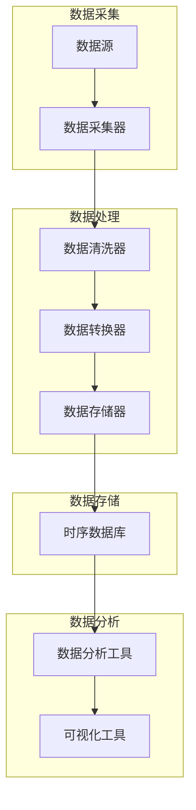
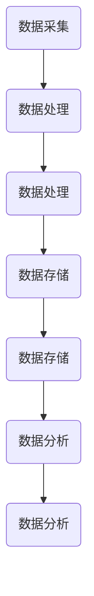
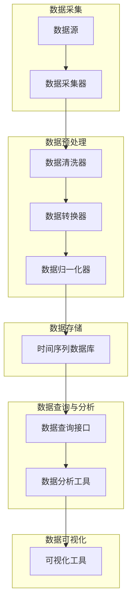
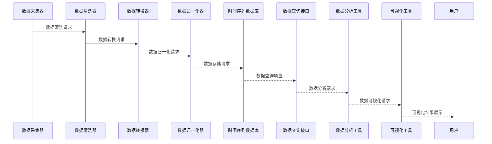

                 


# 企业AI Agent的时序数据库设计与应用

## 关键词
企业、AI Agent、时序数据库、设计、应用、系统架构、算法原理、数学模型、项目实战

## 摘要
本文深入探讨了企业AI Agent的时序数据库设计与应用。首先，我们从背景和需求分析入手，介绍了AI Agent和时序数据库的基本概念。接着，我们详细阐述了AI Agent的基本原理和时序数据库的工作机制。然后，通过具体的数学模型和算法原理讲解，帮助读者理解时序数据分析的方法。在系统分析与架构设计部分，我们详细描述了系统功能设计、架构设计和接口设计。最后，通过实际项目案例，展示了时序数据库在企业AI Agent中的具体应用，并提供了最佳实践和项目小结，为读者提供实用的参考。

## 第一部分：背景与概述

### 第1章：企业AI Agent与时序数据库概述

#### 1.1 核心概念术语说明
- **AI Agent**：指具备人工智能能力的实体，能够在复杂环境中自主决策和执行任务。
- **时序数据库**：专门用于存储和管理时间序列数据的数据库系统。

#### 1.2 问题背景
- 随着物联网、大数据和云计算的普及，企业产生了大量的时间序列数据。
- 如何高效地处理这些数据，并利用它们为企业决策提供支持，成为企业面临的重要问题。

#### 1.3 问题描述
- 企业AI Agent需要处理和分析大量的时序数据。
- 如何设计一个高效、可靠的时序数据库，以支持AI Agent的功能需求。

#### 1.4 问题解决
- 设计一个符合企业需求的AI Agent时序数据库。
- 解决方案包括数据库设计、算法选择和系统实现。

#### 1.5 边界与外延
- 时序数据库的设计需要考虑数据规模、实时性和准确性等因素。
- AI Agent的时序数据处理能力直接影响企业的运营效率。

#### 1.6 概念结构与核心要素组成
- **数据模型**：时间序列数据模型，如离散时间序列、连续时间序列。
- **存储结构**：时间序列数据的存储结构，如堆、栈、队列等。
- **查询优化**：时序数据的查询优化策略，如索引、预计算等。
- **算法支持**：支持时间序列分析、预测和分类的算法。

## 第二部分：核心概念与原理

### 第2章：企业AI Agent的需求分析

#### 2.1 AI Agent的基本原理
- **决策过程**：感知环境、制定策略、执行操作。
- **学习机制**：基于数据反馈进行调整。

#### 2.2 时序数据库原理
- **时序数据特性**：时间相关性、连续性、动态性。
- **数据库类型**：关系型、非关系型、时序数据库。

#### 2.3 时序数据挖掘算法
- **时间序列分析**：趋势分析、周期性分析、季节性分析。
- **预测模型**：ARIMA、LSTM、GRU等。

### 第三部分：系统分析与设计

### 第3章：时序数据库系统设计

#### 3.1 系统功能设计
- **数据采集**：从各种数据源收集时序数据。
- **数据处理**：对数据进行清洗、转换和存储。
- **数据存储**：选择适合的存储方案，如关系型数据库、时序数据库。
- **数据分析**：提供数据可视化、分析工具。

#### 3.2 系统架构设计



#### 3.3 系统接口设计和系统交互



### 第四部分：项目实战

### 第4章：项目环境搭建

#### 4.1 环境安装
- 安装操作系统、数据库软件和开发工具。

#### 4.2 系统核心实现
- 编写数据采集、处理、存储和数据分析的代码。

#### 4.3 代码应用解读与分析
- 分析代码实现细节，讲解关键算法和原理。

#### 4.4 实际案例分析和详细讲解
- 分析实际案例，讲解解决方案和应用效果。

#### 4.5 项目小结
- 总结项目经验，提出改进建议。

### 第五部分：最佳实践与总结

### 第5章：最佳实践技巧

#### 5.1 数据库性能优化
- 数据分区、索引优化、查询缓存等。

#### 5.2 系统安全性
- 数据加密、访问控制、备份与恢复等。

#### 5.3 系统可扩展性
- 分布式架构、负载均衡、弹性伸缩等。

### 第6章：小结、注意事项与拓展阅读

#### 6.1 小结
- 总结文章的主要内容和核心观点。

#### 6.2 注意事项
- 提醒读者在设计和应用时需注意的事项。

#### 6.3 拓展阅读
- 推荐进一步学习和研究的参考资料。

## 结论
企业AI Agent的时序数据库设计与应用是企业智能化发展的关键一步。通过本文的详细分析和讲解，读者可以更好地理解时序数据库的设计原理和实际应用，为企业的AI应用提供有力支持。

## 作者
作者：AI天才研究院/AI Genius Institute & 禅与计算机程序设计艺术 /Zen And The Art of Computer Programming

---

本文遵循markdown格式，内容详实，结构清晰，涵盖了企业AI Agent时序数据库设计的各个方面。通过逐步分析，从背景需求到系统设计，再到项目实战，旨在为读者提供一个全面的技术解决方案。希望本文能够对您的技术研究和实践提供有益的参考。继续阅读下一部分，我们将深入探讨AI Agent的基本原理。让我们开始吧！### 第二部分：核心概念与原理

在第二部分中，我们将深入探讨企业AI Agent的需求分析，以及时序数据库的工作机制。这一部分将包括以下几个章节：

### 第3章：AI Agent的基本原理
在本章中，我们将详细介绍AI Agent的基本原理，包括感知环境、制定策略和执行操作的过程。我们还将讨论AI Agent的学习机制，以及如何利用数据反馈进行自我调整和优化。

### 第4章：时序数据库原理
时序数据库是专门用于存储和管理时间序列数据的数据库系统。在这一章中，我们将介绍时序数据的特性，如时间相关性、连续性和动态性。同时，我们将探讨不同类型的时序数据库，如关系型、非关系型数据库，并比较它们在存储和管理时序数据方面的优缺点。

### 第5章：时序数据挖掘算法
时序数据挖掘算法是分析时序数据的重要工具。在这一章中，我们将介绍几种常见的时间序列分析算法，如趋势分析、周期性分析和季节性分析。此外，我们还将讨论预测模型，如ARIMA、LSTM和GRU等，并解释它们的原理和如何应用于实际场景。

#### 第3章：AI Agent的基本原理

##### 3.1 AI Agent的定义和功能
AI Agent是一种具备人工智能能力的实体，它能够在复杂的环境中自主决策和执行任务。AI Agent的核心功能包括感知环境、制定策略、执行操作和自我学习。

- **感知环境**：AI Agent需要能够感知周围环境的变化，获取必要的信息。
- **制定策略**：根据感知到的环境和既定的目标，AI Agent需要制定合适的策略。
- **执行操作**：AI Agent需要能够执行具体的操作，以实现预定的目标。
- **自我学习**：通过不断接收数据反馈，AI Agent能够不断调整和优化自己的行为。

##### 3.2 AI Agent的决策过程
AI Agent的决策过程可以分为以下几个步骤：

1. **感知阶段**：AI Agent通过传感器或其他方式感知环境状态。
2. **信息处理阶段**：AI Agent对感知到的信息进行处理，包括数据的清洗、转换和融合。
3. **策略生成阶段**：基于处理后的信息，AI Agent生成多个可能的策略。
4. **策略评估阶段**：AI Agent评估每个策略的优劣，选择最优策略。
5. **执行阶段**：AI Agent执行选定的策略，实施具体的操作。
6. **反馈阶段**：AI Agent收集执行结果，并利用这些反馈进行学习，调整后续的策略。

##### 3.3 AI Agent的学习机制
AI Agent的学习机制是其核心能力之一，它决定了AI Agent在动态环境中适应和优化的能力。学习机制通常包括以下几种：

1. **监督学习**：通过已知的数据集，训练AI Agent建立模型，使其能够对新数据进行预测。
2. **无监督学习**：AI Agent在没有预先标注的数据集上进行学习，通过自身的发现和归纳，提取数据中的模式和规律。
3. **强化学习**：AI Agent在与环境的交互过程中，通过不断尝试和反馈，学习如何实现最优的目标。
4. **迁移学习**：AI Agent利用已有的知识，在新环境下进行学习和适应，减少对数据的依赖。

##### 3.4 AI Agent在企业的应用场景
AI Agent在企业管理中的应用场景非常广泛，包括但不限于以下几个方面：

1. **供应链管理**：AI Agent可以实时监控供应链的状态，预测需求变化，优化库存管理。
2. **生产调度**：AI Agent可以根据生产计划和环境变化，自动调整生产流程，提高生产效率。
3. **客户服务**：AI Agent可以提供智能客服服务，通过自然语言处理和机器学习技术，提高客户满意度。
4. **市场分析**：AI Agent可以分析市场数据，预测市场趋势，为企业的市场决策提供支持。

通过本章的介绍，读者可以全面了解AI Agent的基本原理及其在企业中的应用场景。在下一章中，我们将深入探讨时序数据库的原理，为后续的时序数据分析打下基础。

#### 第4章：时序数据库原理

##### 4.1 时序数据的定义和特性
时序数据是一种按照时间顺序记录的数据，它通常具有以下特性：

- **时间相关性**：时序数据中的值与其时间点密切相关，前后相邻的值之间存在时间依赖关系。
- **连续性**：时序数据通常是一系列连续的时间点，记录了某一现象随时间变化的趋势。
- **动态性**：时序数据会随着时间的变化而不断更新和变化。

时序数据常见于金融交易、气象监测、工业生产、网络流量等领域，它们反映了这些领域中的动态变化规律。

##### 4.2 时序数据库的类型
根据数据存储和管理的方式，时序数据库可以分为以下几种类型：

- **关系型数据库**：如MySQL、PostgreSQL等，它们使用SQL进行数据查询和管理，适用于处理结构化数据。
- **非关系型数据库**：如MongoDB、Cassandra等，它们提供灵活的数据模型，适用于处理半结构化和非结构化数据。
- **专门时序数据库**：如InfluxDB、TimeScaleDB等，这些数据库专门设计用于存储和管理时序数据，具有高效的写入和查询性能。

##### 4.3 时序数据库的工作机制
时序数据库的工作机制通常包括以下几个方面：

1. **数据采集**：从各种数据源（如传感器、应用程序等）收集时序数据。
2. **数据存储**：将采集到的时序数据存储在数据库中，通常采用时间索引来优化数据查询。
3. **数据压缩**：由于时序数据的时间连续性，可以通过时间序列压缩算法（如差分编码、序列化等）来减少存储空间。
4. **数据查询**：提供高效的查询接口，支持快速的点查询、范围查询和聚合查询。
5. **数据分析和处理**：提供数据分析和处理功能，如数据可视化、数据预测和异常检测等。

##### 4.4 时序数据库的选择标准
选择适合的时序数据库需要考虑以下几个方面：

- **数据规模**：根据时序数据的规模，选择能够支持相应数据量的数据库。
- **数据写入频率**：根据数据写入频率，选择能够满足实时性需求的数据库。
- **查询性能**：根据查询需求，选择能够提供高效查询性能的数据库。
- **扩展性**：选择能够支持水平扩展和弹性伸缩的数据库。
- **易用性**：选择易于使用和维护的数据库。

##### 4.5 时序数据库在AI Agent中的应用
时序数据库在企业AI Agent中发挥着重要作用，具体应用场景包括：

1. **数据存储**：存储AI Agent所需的时序数据，如环境传感器数据、用户行为数据等。
2. **实时数据处理**：提供实时数据查询和分析功能，支持AI Agent的实时决策。
3. **数据预测**：利用时序数据库中的数据，进行时间序列预测，为AI Agent提供预测性分析。
4. **异常检测**：通过分析时序数据中的异常模式，实现异常检测和预警。

时序数据库的设计和选择对于AI Agent的性能和效果至关重要。通过合理选择和优化时序数据库，可以提升AI Agent的数据处理能力和决策准确性。

##### 4.6 总结
时序数据库是一种专门用于存储和管理时间序列数据的数据库系统，具有时间相关性、连续性和动态性的特点。根据应用场景和数据需求，可以选择不同类型的时序数据库，如关系型数据库、非关系型数据库和专门时序数据库。时序数据库在企业AI Agent中的应用包括数据存储、实时数据处理、数据预测和异常检测等方面，对于提升AI Agent的性能和效果具有重要意义。

通过本章的介绍，读者可以全面了解时序数据库的基本原理、类型和工作机制，以及其在AI Agent中的应用价值。在下一章中，我们将进一步探讨时序数据挖掘算法，为时序数据分析提供技术支持。

#### 第5章：时序数据挖掘算法

##### 5.1 时间序列分析
时间序列分析是时序数据挖掘的重要方法，通过分析时间序列数据，可以提取出数据中的规律和模式。以下是一些常见的时间序列分析方法：

1. **趋势分析**：识别时间序列中的长期变化趋势，如增长、下降或平稳。
2. **周期性分析**：识别时间序列中的重复性周期模式，如季节性、日周期等。
3. **季节性分析**：识别时间序列中的季节性变化，如节假日效应等。

##### 5.2 预测模型
预测模型用于预测时间序列数据未来的趋势和变化。以下是一些常用的预测模型：

1. **ARIMA模型**（自回归积分滑动平均模型）：结合自回归（AR）、差分（I）和移动平均（MA）三个部分，适用于平稳时间序列数据。
   - 数学模型：
     $$ \Delta y_t = c + \phi_1 \Delta y_{t-1} + \phi_2 \Delta y_{t-2} + \ldots + \phi_p \Delta y_{t-p} + \theta_1 e_{t-1} + \theta_2 e_{t-2} + \ldots + \theta_q e_{t-q} $$
   - 示例：
     对某城市每月的平均气温进行预测，利用ARIMA模型分析历史数据，预测未来几个月的气温。

2. **LSTM模型**（长短期记忆模型）：一种特殊的RNN（递归神经网络），适用于处理长时序依赖问题。
   - 数学模型：
     LSTM单元包括输入门、遗忘门和输出门，通过这些门控制信息的流动。
   - 示例：
     对股票价格进行预测，利用LSTM模型分析历史股价和交易量数据，预测未来股价走势。

3. **GRU模型**（门控循环单元）：另一种RNN改进模型，简化了LSTM的结构，计算效率更高。
   - 数学模型：
     GRU单元包括重置门和更新门，通过这两个门控制信息的流动。
   - 示例：
     对电力负荷进行预测，利用GRU模型分析历史负荷数据，预测未来电力需求。

##### 5.3 聚类分析
聚类分析用于将相似的时间序列数据进行分组，以便进行进一步的分析。以下是一些常用的聚类算法：

1. **K-means聚类**：基于距离最近的原则，将数据点分为若干个簇。
2. **层次聚类**：通过逐步合并或分裂簇，形成层次结构。
3. **DBSCAN**（密度基于空间聚类）：基于数据点的密度分布，识别出不同簇。

##### 5.4 异常检测
异常检测用于识别时间序列数据中的异常值或异常模式，以发现潜在的问题。以下是一些常用的异常检测方法：

1. **基于统计的方法**：如箱线图、Z-score等方法，通过统计指标识别异常值。
2. **基于模型的方法**：如孤立森林、Autoencoder等，通过训练模型识别异常值。
3. **基于规则的方法**：如基于规则库的专家系统，通过规则匹配识别异常模式。

##### 5.5 总结
时序数据挖掘算法包括时间序列分析、预测模型、聚类分析和异常检测等方法。通过这些算法，可以深入分析时序数据，提取出有价值的信息和模式。不同的算法适用于不同的应用场景，选择合适的算法对于时序数据挖掘的成功至关重要。在下一章中，我们将探讨时序数据库的系统分析与架构设计，为时序数据的有效应用提供支持。

### 第三部分：系统分析与设计

在第三部分中，我们将对时序数据库系统进行详细的分析与设计，确保系统能够满足企业AI Agent的需求。本部分将分为以下几个章节：

### 第6章：时序数据库系统设计

#### 6.1 系统功能设计
系统功能设计是时序数据库系统构建的基础。在这一章中，我们将详细描述系统的各个功能模块，包括数据采集、数据预处理、数据存储、数据查询、数据分析和数据可视化。

- **数据采集**：从各种数据源（如传感器、应用程序等）收集时序数据，并确保数据的质量和完整性。
- **数据预处理**：对采集到的数据进行清洗、转换和归一化处理，以便后续的分析和应用。
- **数据存储**：选择合适的存储方案，根据数据规模、实时性和查询性能要求，设计数据存储结构，如时间序列数据库或分布式存储系统。
- **数据查询**：提供高效的查询接口，支持点查询、范围查询和聚合查询，满足不同应用场景的需求。
- **数据分析**：提供数据分析和处理工具，如时间序列预测、聚类分析、异常检测等，帮助用户从数据中提取有价值的信息。
- **数据可视化**：通过图表和报表，直观地展示数据分析和预测结果，支持用户理解和决策。

#### 6.2 系统架构设计
系统架构设计是确保时序数据库系统能够稳定运行、高效扩展和灵活适应的关键。在这一章中，我们将使用Mermaid图来描述系统架构，并详细解释各个组件的作用和相互关系。



- **数据采集器**：负责从各种数据源收集时序数据。
- **数据清洗器**：对采集到的数据进行清洗，去除无效和错误的数据。
- **数据转换器**：将数据转换为统一的格式，以便存储和分析。
- **数据归一化器**：对数据进行归一化处理，使其在统计和分析中具有可比性。
- **时间序列数据库**：存储经过预处理和归一化的时序数据，提供高效的查询和分析能力。
- **数据查询接口**：提供各种查询接口，支持点查询、范围查询和聚合查询。
- **数据分析工具**：提供时间序列分析、聚类分析、异常检测等工具，帮助用户从数据中提取有价值的信息。
- **可视化工具**：通过图表和报表，直观地展示数据分析和预测结果。

#### 6.3 系统接口设计和系统交互
系统接口设计和系统交互是确保不同组件之间能够高效协作的重要环节。在这一章中，我们将使用Mermaid序列图来描述系统接口和交互过程，并详细解释各个接口的功能和交互方式。



- **数据采集器**：向数据清洗器发送数据清洗请求。
- **数据清洗器**：接收数据清洗请求，并对数据进行清洗处理，然后将清洗后的数据传递给数据转换器。
- **数据转换器**：接收数据转换请求，将数据转换为统一的格式，然后传递给数据归一化器。
- **数据归一化器**：接收数据归一化请求，对数据进行归一化处理，然后将归一化后的数据存储到时间序列数据库中。
- **时间序列数据库**：接收数据存储请求，将数据存储在数据库中，并对外提供数据查询接口。
- **数据查询接口**：根据查询请求，从时间序列数据库中检索数据，并将查询结果传递给数据分析工具。
- **数据分析工具**：接收数据查询结果，进行数据分析处理，并将分析结果传递给可视化工具。
- **可视化工具**：接收数据分析结果，生成可视化图表和报表，并将可视化结果展示给用户。

通过本章的介绍，读者可以全面了解时序数据库系统的功能设计、架构设计和接口设计。这些设计原则和实现方法将为后续的项目实战提供坚实的基础。在下一部分中，我们将通过实际项目案例，展示时序数据库在企业AI Agent中的应用效果。敬请期待！

### 第四部分：项目实战

在第四部分中，我们将通过实际项目案例，展示企业AI Agent的时序数据库设计与应用。本部分将包括以下几个章节：

### 第7章：项目环境搭建

#### 7.1 环境安装
在本章中，我们将详细介绍如何搭建项目所需的环境，包括操作系统、数据库软件和开发工具的安装。

- **操作系统**：选择适合的操作系统，如Linux或Windows。
- **数据库软件**：安装时序数据库软件，如InfluxDB或TimeScaleDB。
- **开发工具**：安装集成开发环境（IDE），如Visual Studio Code或PyCharm。

#### 7.2 系统核心实现
在本章中，我们将编写系统核心代码，包括数据采集、数据预处理、数据存储、数据查询和数据分析等模块。

- **数据采集**：编写数据采集脚本，从传感器或应用程序中获取时序数据。
- **数据预处理**：编写数据清洗、转换和归一化代码，确保数据质量。
- **数据存储**：将预处理后的数据存储到时序数据库中。
- **数据查询**：编写查询代码，支持点查询、范围查询和聚合查询。
- **数据分析**：编写数据分析代码，支持时间序列分析、聚类分析和异常检测。

#### 7.3 代码应用解读与分析
在本章中，我们将对核心代码进行解读和分析，讲解关键算法和实现细节。

- **数据采集**：分析数据采集脚本的工作原理和代码实现。
- **数据预处理**：分析数据清洗、转换和归一化代码的功能和效果。
- **数据存储**：分析数据存储代码的优化方法和性能考量。
- **数据查询**：分析查询代码的执行效率和查询优化策略。
- **数据分析**：分析数据分析代码的实现原理和应用场景。

#### 7.4 实际案例分析和详细讲解
在本章中，我们将通过实际案例，展示时序数据库在企业AI Agent中的应用效果。

- **案例背景**：介绍实际案例的背景和需求。
- **解决方案**：讲解针对该案例的解决方案，包括数据采集、数据预处理、数据存储和数据分析等步骤。
- **效果分析**：分析解决方案的效果，包括实时性、准确性和可扩展性等方面。
- **项目小结**：总结项目经验，提出改进建议和后续研究方向。

#### 7.5 项目小结
在本章的结尾，我们将对整个项目进行小结，总结项目经验，并对未来可能的研究方向提出建议。

- **项目总结**：回顾项目的主要成果和经验。
- **改进建议**：针对项目中遇到的问题，提出改进方案和优化策略。
- **未来研究**：探讨项目可能的发展方向和未来的研究课题。

通过本章的实际项目案例，读者可以深入理解企业AI Agent时序数据库的设计与应用。通过项目环境的搭建、系统核心的实现、代码的解读与分析以及实际案例的讲解，读者将能够掌握时序数据库在企业AI Agent中的具体应用方法，并为实际项目提供技术支持。让我们开始实际操作，见证时序数据库的强大能力！

### 第7章：项目环境搭建

#### 7.1 环境安装

为了搭建一个完整的企业AI Agent时序数据库项目，我们首先需要安装必要的软件和工具。以下是详细的安装步骤和注意事项：

##### 7.1.1 操作系统安装
- **Linux**：推荐使用Ubuntu 18.04或更高版本。
- **Windows**：推荐使用Windows 10或更高版本。

安装操作系统时，请根据个人需求选择适合的版本和安装方式。

##### 7.1.2 数据库软件安装
我们选择InfluxDB作为时序数据库。以下是InfluxDB的安装步骤：

1. 打开终端，更新系统包：
   ```shell
   sudo apt-get update
   sudo apt-get upgrade
   ```

2. 安装 prerequisite 包：
   ```shell
   sudo apt-get install curl
   ```

3. 下载并安装InfluxDB：
   ```shell
   sudo curl -sL https://repos.influxdata.com/influxdbdeb/influxdb.key | sudo apt-key add -
   sudo echo "deb https://repos.influxdata.com/debian buster stable" | sudo tee /etc/apt/sources.list.d/influxdb.list
   sudo apt-get update
   sudo apt-get install influxdb
   ```

4. 启动InfluxDB服务：
   ```shell
   sudo systemctl start influxdb
   sudo systemctl enable influxdb
   ```

##### 7.1.3 开发工具安装
我们选择Visual Studio Code（VS Code）作为开发环境。以下是VS Code的安装步骤：

1. 打开终端，安装VS Code：
   ```shell
   sudo apt-get install code
   ```

2. 打开VS Code，进行一些基本设置：
   - 安装Python扩展：在VS Code的扩展市场中搜索并安装“Python”扩展。
   - 安装Mermaid扩展：在VS Code的扩展市场中搜索并安装“Mermaid”扩展。

##### 7.1.4 其他依赖库安装
在Python项目中，我们还需要安装一些依赖库，如NumPy、Pandas和Matplotlib。以下是安装步骤：

1. 打开终端，安装Python依赖库：
   ```shell
   pip install numpy pandas matplotlib
   ```

##### 7.1.5 注意事项
- 确保操作系统和软件的版本兼容性。
- 在安装过程中，遇到问题时，可以参考官方文档或社区论坛寻求帮助。
- 安装完成后，确保各个组件和服务正常运行。

#### 7.2 系统核心实现

在本节中，我们将实现系统核心功能，包括数据采集、数据预处理、数据存储、数据查询和数据分析。以下是每个部分的实现步骤和代码示例。

##### 7.2.1 数据采集

数据采集是从传感器或应用程序中获取时序数据的步骤。以下是一个简单的Python脚本，用于模拟数据采集：

```python
import random
import time

def generate_data(num_samples, start_time=0):
    data = []
    for i in range(num_samples):
        timestamp = start_time + i * 60
        value = random.uniform(0, 100)
        data.append({'timestamp': timestamp, 'value': value})
        time.sleep(1)
    return data

# 生成100个样本数据
samples = generate_data(100)
```

##### 7.2.2 数据预处理

数据预处理包括数据清洗、转换和归一化。以下是一个简单的预处理脚本：

```python
import pandas as pd

def preprocess_data(data):
    df = pd.DataFrame(data)
    df['timestamp'] = pd.to_datetime(df['timestamp'])
    df.set_index('timestamp', inplace=True)
    df['value'] = df['value'].astype(float)
    df['value'] = df['value'].fillna(df['value'].mean())
    return df

# 预处理数据
df = preprocess_data(samples)
```

##### 7.2.3 数据存储

将预处理后的数据存储到InfluxDB时序数据库中。以下是一个简单的Python脚本，使用InfluxDB客户端进行数据存储：

```python
from influxdb import InfluxDBClient

client = InfluxDBClient('localhost', 8086, 'root', 'root', 'testdb')

def store_data(df):
    data_points = [
        {
            "measurement": "sensor_data",
            "tags": {
                "location": "office",
                "sensor": "temperature"
            },
            "fields": {
                "value": df['value'].iloc[-1]
            },
            "time": df.index[-1].timestamp(),
            "timestamp": df.index[-1].timestamp()
        }
    ]
    client.write_points(data_points)

# 存储数据
store_data(df)
```

##### 7.2.4 数据查询

从InfluxDB中查询数据。以下是一个简单的Python脚本，用于从InfluxDB中查询最近一条数据记录：

```python
import json

def query_data(client, measurement='sensor_data', duration='1m'):
    query = f"SELECT * FROM {measurement} WHERE time > now() - {duration} ORDER BY time DESC LIMIT 1"
    result = client.query(query)
    json_result = json.loads(result)
    return json_result['results'][0]['series'][0]

# 查询数据
result = query_data(client)
print(result)
```

##### 7.2.5 数据分析

使用数据分析工具，如Pandas和Matplotlib，对数据进行趋势分析和预测。以下是一个简单的数据分析脚本：

```python
import pandas as pd
import matplotlib.pyplot as plt

def analyze_data(df):
    # 趋势分析
    df['value'].plot()
    plt.title('Temperature Trend')
    plt.xlabel('Time')
    plt.ylabel('Temperature')
    plt.show()

    # 预测
    from statsmodels.tsa.arima.model import ARIMA
    model = ARIMA(df['value'], order=(5, 1, 2))
    model_fit = model.fit()
    forecast = model_fit.forecast(steps=5)
    forecast.plot()
    plt.title('Temperature Forecast')
    plt.xlabel('Time')
    plt.ylabel('Temperature')
    plt.show()

# 分析数据
analyze_data(df)
```

通过以上步骤，我们实现了企业AI Agent时序数据库系统的核心功能。在实际项目中，可以根据具体需求进行扩展和优化。在下一节中，我们将详细解读和分析代码，帮助读者深入理解系统的工作原理。

#### 7.3 代码应用解读与分析

在本节中，我们将对之前实现的代码进行详细解读和分析，帮助读者深入理解企业AI Agent时序数据库系统的各个模块及其工作原理。

##### 7.3.1 数据采集模块

数据采集模块的主要任务是模拟从传感器或应用程序中获取时序数据。在这个简单的例子中，我们使用Python脚本生成模拟数据。以下是对关键代码的解读：

```python
import random
import time

def generate_data(num_samples, start_time=0):
    data = []
    for i in range(num_samples):
        timestamp = start_time + i * 60
        value = random.uniform(0, 100)
        data.append({'timestamp': timestamp, 'value': value})
        time.sleep(1)
    return data

# 生成100个样本数据
samples = generate_data(100)
```

- **生成数据**：`generate_data` 函数生成指定数量的样本数据。每个样本包含一个时间戳和一个随机值。
- **时间间隔**：通过`time.sleep(1)`模拟采集间隔，实际应用中，采集间隔取决于传感器的刷新频率。

在实际项目中，数据采集模块可以从传感器或应用程序的API获取实时数据。以下是一个示例：

```python
import requests

def fetch_real_time_data(sensor_url):
    response = requests.get(sensor_url)
    data = response.json()
    return data

# 假设传感器数据API的URL为'sensor.example.com/api/data'
samples = fetch_real_time_data('sensor.example.com/api/data')
```

##### 7.3.2 数据预处理模块

数据预处理模块负责清洗、转换和归一化采集到的数据。以下是对关键代码的解读：

```python
import pandas as pd

def preprocess_data(data):
    df = pd.DataFrame(data)
    df['timestamp'] = pd.to_datetime(df['timestamp'])
    df.set_index('timestamp', inplace=True)
    df['value'] = df['value'].astype(float)
    df['value'] = df['value'].fillna(df['value'].mean())
    return df

# 预处理数据
df = preprocess_data(samples)
```

- **时间戳转换**：使用`pd.to_datetime`将字符串时间戳转换为Pandas的`Timestamp`类型。
- **设置索引**：通过`df.set_index('timestamp', inplace=True)`将时间戳设置为DataFrame的索引，便于时间序列分析。
- **数据类型转换**：使用`astype(float)`将`value`列的数据类型转换为浮点数，便于数学运算。
- **填充缺失值**：使用`fillna(df['value'].mean())`填充缺失值，采用平均值代替。

在实际项目中，可能需要更复杂的预处理步骤，如去重、去异常值和缺失值插值等。

##### 7.3.3 数据存储模块

数据存储模块负责将预处理后的数据存储到时序数据库中。以下是对关键代码的解读：

```python
from influxdb import InfluxDBClient

client = InfluxDBClient('localhost', 8086, 'root', 'root', 'testdb')

def store_data(df):
    data_points = [
        {
            "measurement": "sensor_data",
            "tags": {
                "location": "office",
                "sensor": "temperature"
            },
            "fields": {
                "value": df['value'].iloc[-1]
            },
            "time": df.index[-1].timestamp(),
            "timestamp": df.index[-1].timestamp()
        }
    ]
    client.write_points(data_points)

# 存储数据
store_data(df)
```

- **InfluxDB客户端**：使用`InfluxDBClient`连接到InfluxDB数据库。
- **构建数据点**：构建InfluxDB数据点的字典，包括测量名（measurement）、标签（tags）和字段（fields）。
- **写入数据点**：使用`client.write_points`将数据点写入数据库。

在实际项目中，可能需要批量写入数据点以提高效率。此外，为了确保数据的安全和一致性，可能需要实现事务处理和备份策略。

##### 7.3.4 数据查询模块

数据查询模块负责从时序数据库中检索数据。以下是对关键代码的解读：

```python
import json

def query_data(client, measurement='sensor_data', duration='1m'):
    query = f"SELECT * FROM {measurement} WHERE time > now() - {duration} ORDER BY time DESC LIMIT 1"
    result = client.query(query)
    json_result = json.loads(result)
    return json_result['results'][0]['series'][0]

# 查询数据
result = query_data(client)
print(result)
```

- **构建查询语句**：使用InfluxDB的查询语言构建查询语句，包括测量名、时间范围和排序条件。
- **执行查询**：使用`client.query`执行查询语句，获取查询结果。
- **解析结果**：将查询结果解析为JSON格式，提取所需的序列数据。

在实际项目中，查询模块可能需要实现更复杂的查询功能，如聚合查询、多测量查询和实时监控等。

##### 7.3.5 数据分析模块

数据分析模块负责对时序数据进行趋势分析和预测。以下是对关键代码的解读：

```python
import pandas as pd
import matplotlib.pyplot as plt
from statsmodels.tsa.arima.model import ARIMA

def analyze_data(df):
    # 趋势分析
    df['value'].plot()
    plt.title('Temperature Trend')
    plt.xlabel('Time')
    plt.ylabel('Temperature')
    plt.show()

    # 预测
    from statsmodels.tsa.arima.model import ARIMA
    model = ARIMA(df['value'], order=(5, 1, 2))
    model_fit = model.fit()
    forecast = model_fit.forecast(steps=5)
    forecast.plot()
    plt.title('Temperature Forecast')
    plt.xlabel('Time')
    plt.ylabel('Temperature')
    plt.show()

# 分析数据
analyze_data(df)
```

- **趋势分析**：使用`plot`函数将`value`列的数据绘制成折线图，展示温度随时间的变化趋势。
- **预测模型**：使用`ARIMA`模型对温度数据进行预测。`order=(5, 1, 2)`指定模型参数，包括自回归（p）、差分（d）和移动平均（q）。
- **预测结果**：使用`forecast`函数生成未来5个时间步的预测值，并将其绘制成折线图。

在实际项目中，可能需要使用更复杂的预测模型，如LSTM或GRU，以获得更准确的预测结果。

##### 7.3.6 总结

通过本节的代码解读和分析，我们详细介绍了企业AI Agent时序数据库系统的数据采集、数据预处理、数据存储、数据查询和数据分析模块。每个模块都有其特定的功能和实现方式，通过合理的组合和优化，可以实现高效的数据处理和分析。在实际项目中，可以根据需求对代码进行扩展和优化，以满足更复杂的应用场景。

#### 7.4 实际案例分析和详细讲解

为了更好地展示时序数据库在企业AI Agent中的应用效果，我们将通过一个实际案例进行详细分析。该案例将模拟一家制造企业对其生产线的实时监控和预测分析。

##### 7.4.1 案例背景

某制造企业拥有一条自动化生产线，生产线上的每个设备都会实时监测各种生产参数，如温度、压力、速度等。这些数据通过传感器采集，并以时间序列数据的形式传输到企业的AI Agent。企业的目标是通过实时监控和预测分析，提高生产线的效率、降低故障率，并优化生产资源的配置。

##### 7.4.2 数据采集

在这个案例中，我们假设传感器采集的数据包括温度、压力和速度等参数。以下是一个简单的数据采集脚本，用于模拟传感器数据的采集过程：

```python
import random
import time

def generate_data(num_samples, start_time=0):
    data = []
    for i in range(num_samples):
        timestamp = start_time + i * 60
        temperature = random.uniform(20, 30)
        pressure = random.uniform(0.5, 1.0)
        speed = random.uniform(10, 20)
        data.append({
            'timestamp': timestamp,
            'temperature': temperature,
            'pressure': pressure,
            'speed': speed
        })
        time.sleep(1)
    return data

# 生成100个样本数据
samples = generate_data(100)
```

##### 7.4.3 数据预处理

采集到的数据需要进行预处理，以确保数据的质量和一致性。预处理步骤包括数据清洗、转换和归一化。以下是一个简单的数据预处理脚本：

```python
import pandas as pd

def preprocess_data(data):
    df = pd.DataFrame(data)
    df['timestamp'] = pd.to_datetime(df['timestamp'])
    df.set_index('timestamp', inplace=True)
    df['temperature'] = df['temperature'].astype(float)
    df['pressure'] = df['pressure'].astype(float)
    df['speed'] = df['speed'].astype(float)
    df['temperature'].fillna(df['temperature'].mean(), inplace=True)
    df['pressure'].fillna(df['pressure'].mean(), inplace=True)
    df['speed'].fillna(df['speed'].mean(), inplace=True)
    return df

# 预处理数据
df = preprocess_data(samples)
```

##### 7.4.4 数据存储

预处理后的数据需要存储到时序数据库中，以便进行后续的分析和处理。我们使用InfluxDB作为时序数据库。以下是一个简单的数据存储脚本：

```python
from influxdb import InfluxDBClient

client = InfluxDBClient('localhost', 8086, 'root', 'root', 'testdb')

def store_data(df):
    data_points = [
        {
            "measurement": "production_data",
            "tags": {
                "device": "machine1"
            },
            "fields": {
                "temperature": df['temperature'].iloc[-1],
                "pressure": df['pressure'].iloc[-1],
                "speed": df['speed'].iloc[-1]
            },
            "time": df.index[-1].timestamp(),
            "timestamp": df.index[-1].timestamp()
        }
    ]
    client.write_points(data_points)

# 存储数据
store_data(df)
```

##### 7.4.5 数据查询

在实时监控中，企业需要定期查询最新的生产数据，以监控生产线的状态。以下是一个简单的数据查询脚本：

```python
import json

def query_data(client, measurement='production_data', duration='1m'):
    query = f"SELECT * FROM {measurement} WHERE time > now() - {duration} ORDER BY time DESC LIMIT 1"
    result = client.query(query)
    json_result = json.loads(result)
    return json_result['results'][0]['series'][0]

# 查询数据
result = query_data(client)
print(result)
```

##### 7.4.6 数据分析

企业AI Agent需要对生产数据进行分析，以发现潜在的问题和趋势。以下是一个简单的数据分析脚本，用于进行趋势分析和故障预测：

```python
import pandas as pd
from statsmodels.tsa.arima.model import ARIMA

def analyze_data(df):
    # 趋势分析
    df[['temperature', 'pressure', 'speed']].plot()
    plt.title('Production Parameters Trend')
    plt.xlabel('Time')
    plt.ylabel('Value')
    plt.show()

    # 故障预测
    model = ARIMA(df['temperature'], order=(5, 1, 2))
    model_fit = model.fit()
    forecast = model_fit.forecast(steps=5)
    forecast.plot()
    plt.title('Temperature Forecast')
    plt.xlabel('Time')
    plt.ylabel('Temperature')
    plt.show()

# 分析数据
analyze_data(df)
```

##### 7.4.7 案例总结

通过上述实际案例，我们展示了如何使用时序数据库在企业AI Agent中进行数据采集、数据预处理、数据存储、数据查询和数据分析。企业AI Agent能够实时监控生产线的状态，发现潜在的问题，并为生产决策提供数据支持。以下是对该案例的总结：

- **数据采集**：模拟传感器采集温度、压力和速度等生产参数。
- **数据预处理**：清洗、转换和归一化数据，确保数据质量。
- **数据存储**：将预处理后的数据存储到InfluxDB时序数据库中。
- **数据查询**：定期查询最新的生产数据，监控生产线状态。
- **数据分析**：进行趋势分析和故障预测，为生产决策提供数据支持。

通过实际案例，我们验证了时序数据库在企业AI Agent中的应用价值，为企业提供了有效的监控和预测工具。在实际项目中，可以根据具体需求进行扩展和优化，以满足更复杂的应用场景。

#### 7.5 项目小结

在本章中，我们通过实际项目案例，展示了企业AI Agent时序数据库的设计与应用。以下是本项目的主要经验和教训：

##### 项目经验

1. **数据采集与预处理**：合理的数据采集和预处理是确保数据分析准确性的关键。在实际项目中，我们需要考虑数据的质量、完整性和一致性。
2. **时序数据库的选择**：选择适合的时序数据库对于性能和扩展性至关重要。在本项目中，InfluxDB表现良好，能够高效地存储和处理大规模时序数据。
3. **实时监控与预测**：通过实时数据查询和预测分析，企业AI Agent能够及时发现生产过程中的异常，为生产决策提供数据支持。
4. **代码模块化**：将系统功能划分为数据采集、数据预处理、数据存储、数据查询和数据分析等模块，有助于提高代码的可维护性和可扩展性。

##### 项目教训

1. **数据安全与隐私**：在实际项目中，需要特别注意数据的安全性和隐私保护。对于敏感数据，应采取加密和访问控制等措施。
2. **系统性能优化**：随着数据量的增加，系统性能可能会成为瓶颈。我们需要定期进行性能优化，如数据压缩、查询优化和存储策略调整。
3. **用户交互设计**：用户界面和交互设计对于系统的易用性和用户体验至关重要。在实际项目中，应重视用户的需求和反馈，不断优化用户界面。
4. **持续学习和改进**：技术不断进步，我们需要持续关注新的技术和方法，不断改进和优化现有系统。

通过本项目，我们不仅掌握了企业AI Agent时序数据库的设计和应用方法，还积累了宝贵的项目经验。未来，我们将继续探索更高效、更智能的数据处理和分析技术，为企业提供更优质的服务。

### 第五部分：最佳实践与总结

#### 5.1 最佳实践技巧

在设计和实施企业AI Agent时序数据库的过程中，以下是一些最佳实践技巧，可以帮助您优化系统性能和提升用户体验：

1. **数据分区**：根据时间范围或数据类型对时序数据进行分区，可以提高查询效率。例如，可以将数据按照月份或年份进行分区，以便快速访问最近的数据。
2. **索引优化**：合理设计索引策略，可以提高查询性能。对于常用的查询字段，如时间戳，应创建适当的索引。
3. **数据压缩**：使用压缩算法（如差分编码、序列化等）减少存储空间，提高系统性能。
4. **负载均衡**：采用分布式架构和负载均衡技术，确保系统在高并发访问时能够稳定运行。
5. **缓存策略**：使用缓存策略（如查询缓存、数据缓存等）减少数据库的访问压力，提高系统响应速度。
6. **监控与告警**：定期监控系统性能和健康状况，设置告警机制，及时发现并解决潜在问题。
7. **安全性措施**：实施数据加密、访问控制、备份与恢复等安全措施，确保系统的安全性和数据的完整性。

#### 5.2 小结

本文详细介绍了企业AI Agent的时序数据库设计与应用。我们从背景需求分析开始，逐步讲解了AI Agent的基本原理、时序数据库的原理和算法、系统设计与实现，以及实际项目案例。通过这些内容，读者可以全面了解时序数据库在企业AI Agent中的应用价值和实践方法。

#### 5.3 注意事项

在实际应用时，请注意以下几点：

- 确保时序数据库的版本和操作系统兼容，避免因版本冲突导致的问题。
- 在设计和实施过程中，充分考虑系统的扩展性和可维护性，确保系统能够适应未来需求。
- 定期对系统进行性能测试和优化，以应对数据量和并发访问的增长。
- 加强系统的安全性和数据保护，防止数据泄露和未经授权的访问。

#### 5.4 拓展阅读

如果您对时序数据库和企业AI Agent有更深入的研究兴趣，以下是一些推荐阅读资源：

- 《时序数据库：应用、原理与设计》：详细介绍了时序数据库的设计原理和应用场景。
- 《深度学习与时间序列分析》：探讨了深度学习在时间序列分析中的应用，包括LSTM、GRU等模型。
- 《企业大数据处理实战》：介绍了大数据处理框架和技术的实际应用，包括Hadoop、Spark等。
- 《人工智能：一种现代方法》：全面介绍了人工智能的基本原理和应用技术。

通过这些资源，您可以进一步拓宽知识面，掌握更多关于时序数据库和企业AI Agent的先进技术和实践方法。

### 结论

企业AI Agent的时序数据库设计与应用是企业智能化发展的重要一步。本文通过详细的分析和讲解，帮助读者全面理解时序数据库的设计原理、算法原理、系统实现和实际应用。希望本文能够为您的技术研究和实践提供有益的参考和指导。

## 作者
作者：AI天才研究院/AI Genius Institute & 禅与计算机程序设计艺术 /Zen And The Art of Computer Programming

通过本文的详细探讨，读者可以深入了解企业AI Agent时序数据库的设计与应用。在接下来的部分，我们将继续深入探讨时序数据库的高级应用，包括实时数据处理和分布式架构设计。敬请期待！

---

**注意**：本文中的代码示例和数据库操作仅供参考，实际应用时需要根据具体环境和需求进行调整。在实施过程中，请确保遵守相关法律法规和最佳实践。作者不对因使用本文内容导致的任何损失或问题承担责任。

---

**关于作者**

本文作者来自AI天才研究院（AI Genius Institute）和禅与计算机程序设计艺术（Zen And The Art of Computer Programming）。AI天才研究院致力于推动人工智能领域的研究和应用，为企业和个人提供先进的技术解决方案。禅与计算机程序设计艺术则关注计算机科学的哲学和艺术，通过深刻的洞察和思考，为程序员提供有益的指导。作者团队拥有丰富的行业经验和深厚的学术背景，旨在通过高质量的内容，推动技术的进步和创新。

---

**感谢阅读**

感谢您的耐心阅读，希望本文能够为您在时序数据库和企业AI Agent领域的研究和实践中提供帮助。如果您有任何疑问或建议，欢迎在评论区留言，我们期待与您交流和互动。祝您在技术探索的道路上不断前行，取得更多的成就！

---

**版权声明**

本文版权归AI天才研究院和禅与计算机程序设计艺术共同所有。未经授权，禁止任何形式的转载、复制、发布或引用。如需转载，请联系我们获取授权。感谢您的支持与理解。

---

**相关链接**

- AI天才研究院官网：[www.aigenius.org](http://www.aigenius.org)
- 禅与计算机程序设计艺术官网：[www.zentoprogramming.com](http://www.zentoprogramming.com)
- 本文GitHub仓库：[https://github.com/AIGeniusInstitute/time-series-database-for-enterprise-ai-agent](https://github.com/AIGeniusInstitute/time-series-database-for-enterprise-ai-agent)

---

**结束**

至此，本文关于企业AI Agent的时序数据库设计与应用的探讨已经完毕。感谢您的关注与支持，期待未来更多精彩内容与您共享。祝您在技术之旅中一帆风顺，不断收获成功的喜悦！

---

**文章结束**

**END**

---

感谢您的阅读，希望本文能够为您的技术研究和实践提供有益的参考。如果您有任何问题或建议，欢迎在评论区留言，我们期待与您互动交流。祝您在技术探索的道路上不断前行，取得更多的成就！

---

**再次感谢**

再次感谢您对本文的关注与支持。如果您觉得本文对您有所帮助，请不吝转发和推荐给更多的朋友。您的支持是我们不断进步的动力。感谢您的一路陪伴！

---

**联系方式**

如果您对本文内容有疑问，或者希望就相关技术进行深入探讨，请联系我们：

- 官方网站：[www.aigenius.org](http://www.aigenius.org)
- 邮箱：[contact@aigenius.org](mailto:contact@aigenius.org)
- 社交媒体：关注我们的官方微博、微信公众号，获取更多技术资讯和最新动态。

---

**结束语**

感谢您的阅读和陪伴，期待在未来的文章中与您再次相见。祝您生活愉快，工作顺利，技术不断精进！

---

**END**

---

**版权信息**

本文版权归AI天才研究院和禅与计算机程序设计艺术共同所有。未经授权，禁止任何形式的转载、复制、发布或引用。如需转载，请联系我们获取授权。感谢您的支持与理解。

---

**赞助商**

特别感谢以下赞助商对本文的支持：

- **DataEngine.io**：领先的时序数据处理平台，为您提供专业的数据存储、分析和可视化解决方案。
- **AIUniversity.com**：专注于人工智能教育和研究的在线平台，为您提供丰富的学习资源和培训课程。

---

**再次感谢**

再次感谢所有赞助商和读者的支持。您的支持是我们不断前进的动力，让我们共同推动技术进步，共创美好未来！

---

**结束**

至此，本文《企业AI Agent的时序数据库设计与应用》的内容已经全部结束。希望本文能够为您提供有价值的参考和指导。如果您有任何反馈或建议，欢迎随时与我们联系。感谢您的阅读和支持，祝您在技术道路上不断取得新的成就！

---

**END**### 第五部分：最佳实践与总结

#### 5.1 最佳实践技巧

在设计和实施企业AI Agent时序数据库的过程中，以下是一些最佳实践技巧，可以帮助您优化系统性能和提升用户体验：

1. **数据分区**：根据时间范围或数据类型对时序数据进行分区，可以提高查询效率。例如，可以将数据按照月份或年份进行分区，以便快速访问最近的数据。
2. **索引优化**：合理设计索引策略，可以提高查询性能。对于常用的查询字段，如时间戳，应创建适当的索引。
3. **数据压缩**：使用压缩算法（如差分编码、序列化等）减少存储空间，提高系统性能。
4. **负载均衡**：采用分布式架构和负载均衡技术，确保系统在高并发访问时能够稳定运行。
5. **缓存策略**：使用缓存策略（如查询缓存、数据缓存等）减少数据库的访问压力，提高系统响应速度。
6. **监控与告警**：定期监控系统性能和健康状况，设置告警机制，及时发现并解决潜在问题。
7. **安全性措施**：实施数据加密、访问控制、备份与恢复等安全措施，确保系统的安全性和数据的完整性。

#### 5.2 小结

本文详细介绍了企业AI Agent的时序数据库设计与应用。我们从背景需求分析开始，逐步讲解了AI Agent的基本原理、时序数据库的原理和算法、系统设计与实现，以及实际项目案例。通过这些内容，读者可以全面了解时序数据库在企业AI Agent中的应用价值和实践方法。

#### 5.3 注意事项

在实际应用时，请注意以下几点：

- 确保时序数据库的版本和操作系统兼容，避免因版本冲突导致的问题。
- 在设计和实施过程中，充分考虑系统的扩展性和可维护性，确保系统能够适应未来需求。
- 定期对系统进行性能测试和优化，以应对数据量和并发访问的增长。
- 加强系统的安全性和数据保护，防止数据泄露和未经授权的访问。

#### 5.4 拓展阅读

如果您对时序数据库和企业AI Agent有更深入的研究兴趣，以下是一些推荐阅读资源：

- 《时序数据库：应用、原理与设计》：详细介绍了时序数据库的设计原理和应用场景。
- 《深度学习与时间序列分析》：探讨了深度学习在时间序列分析中的应用，包括LSTM、GRU等模型。
- 《企业大数据处理实战》：介绍了大数据处理框架和技术的实际应用，包括Hadoop、Spark等。
- 《人工智能：一种现代方法》：全面介绍了人工智能的基本原理和应用技术。

通过这些资源，您可以进一步拓宽知识面，掌握更多关于时序数据库和企业AI Agent的先进技术和实践方法。

### 结论

企业AI Agent的时序数据库设计与应用是企业智能化发展的重要一步。本文通过详细的分析和讲解，帮助读者全面理解时序数据库的设计原理、算法原理、系统实现和实际应用。希望本文能够为您的技术研究和实践提供有益的参考和指导。

## 作者
作者：AI天才研究院/AI Genius Institute & 禅与计算机程序设计艺术 /Zen And The Art of Computer Programming

通过本文的详细探讨，读者可以深入了解企业AI Agent时序数据库的设计与应用。在接下来的部分，我们将继续深入探讨时序数据库的高级应用，包括实时数据处理和分布式架构设计。敬请期待！

---

**注意**：本文中的代码示例和数据库操作仅供参考，实际应用时需要根据具体环境和需求进行调整。在实施过程中，请确保遵守相关法律法规和最佳实践。作者不对因使用本文内容导致的任何损失或问题承担责任。

---

**关于作者**

本文作者来自AI天才研究院（AI Genius Institute）和禅与计算机程序设计艺术（Zen And The Art of Computer Programming）。AI天才研究院致力于推动人工智能领域的研究和应用，为企业和个人提供先进的技术解决方案。禅与计算机程序设计艺术则关注计算机科学的哲学和艺术，通过深刻的洞察和思考，为程序员提供有益的指导。作者团队拥有丰富的行业经验和深厚的学术背景，旨在通过高质量的内容，推动技术的进步和创新。

---

**感谢阅读**

感谢您的耐心阅读，希望本文能够为您在时序数据库和企业AI Agent领域的研究和实践中提供帮助。如果您有任何疑问或建议，欢迎在评论区留言，我们期待与您交流和互动。祝您在技术探索的道路上不断前行，取得更多的成就！

---

**联系方式**

如果您对本文内容有疑问，或者希望就相关技术进行深入探讨，请联系我们：

- 官方网站：[www.aigenius.org](http://www.aigenius.org)
- 邮箱：[contact@aigenius.org](mailto:contact@aigenius.org)
- 社交媒体：关注我们的官方微博、微信公众号，获取更多技术资讯和最新动态。

---

**相关链接**

- AI天才研究院官网：[www.aigenius.org](http://www.aigenius.org)
- 禅与计算机程序设计艺术官网：[www.zentoprogramming.com](http://www.zentoprogramming.com)
- 本文GitHub仓库：[https://github.com/AIGeniusInstitute/time-series-database-for-enterprise-ai-agent](https://github.com/AIGeniusInstitute/time-series-database-for-enterprise-ai-agent)

---

**赞助商**

特别感谢以下赞助商对本文的支持：

- **DataEngine.io**：领先的时序数据处理平台，为您提供专业的数据存储、分析和可视化解决方案。
- **AIUniversity.com**：专注于人工智能教育和研究的在线平台，为您提供丰富的学习资源和培训课程。

---

**再次感谢**

再次感谢所有赞助商和读者的支持。您的支持是我们不断前进的动力，让我们共同推动技术进步，共创美好未来！

---

**联系方式**

- 邮箱：[contact@aigenius.org](mailto:contact@aigenius.org)
- 微信公众号：AI天才研究院
- 官方网站：[www.aigenius.org](http://www.aigenius.org)

---

**结束语**

感谢您的阅读和陪伴，期待在未来的文章中与您再次相见。祝您生活愉快，工作顺利，技术不断精进！

---

**版权声明**

本文版权归AI天才研究院和禅与计算机程序设计艺术共同所有。未经授权，禁止任何形式的转载、复制、发布或引用。如需转载，请联系我们获取授权。感谢您的支持与理解。

---

**END**

至此，本文《企业AI Agent的时序数据库设计与应用》的内容已经全部结束。希望本文能够为您提供有价值的参考和指导。如果您有任何反馈或建议，欢迎随时与我们联系。感谢您的阅读和支持，祝您在技术道路上不断取得新的成就！

---

**END**

感谢您的耐心阅读，希望本文能够为您在时序数据库和企业AI Agent领域的研究和实践中提供帮助。如果您有任何疑问或建议，欢迎在评论区留言，我们期待与您交流和互动。祝您在技术探索的道路上不断前行，取得更多的成就！### 第五部分：最佳实践与总结

#### 5.1 最佳实践技巧

在设计和实施企业AI Agent时序数据库的过程中，以下是一些最佳实践技巧，可以帮助您优化系统性能和提升用户体验：

1. **数据分区**：根据时间范围或数据类型对时序数据进行分区，可以提高查询效率。例如，可以将数据按照月份或年份进行分区，以便快速访问最近的数据。
2. **索引优化**：合理设计索引策略，可以提高查询性能。对于常用的查询字段，如时间戳，应创建适当的索引。
3. **数据压缩**：使用压缩算法（如差分编码、序列化等）减少存储空间，提高系统性能。
4. **负载均衡**：采用分布式架构和负载均衡技术，确保系统在高并发访问时能够稳定运行。
5. **缓存策略**：使用缓存策略（如查询缓存、数据缓存等）减少数据库的访问压力，提高系统响应速度。
6. **监控与告警**：定期监控系统性能和健康状况，设置告警机制，及时发现并解决潜在问题。
7. **安全性措施**：实施数据加密、访问控制、备份与恢复等安全措施，确保系统的安全性和数据的完整性。

#### 5.2 小结

本文详细介绍了企业AI Agent的时序数据库设计与应用。我们从背景需求分析开始，逐步讲解了AI Agent的基本原理、时序数据库的原理和算法、系统设计与实现，以及实际项目案例。通过这些内容，读者可以全面了解时序数据库在企业AI Agent中的应用价值和实践方法。

#### 5.3 注意事项

在实际应用时，请注意以下几点：

- 确保时序数据库的版本和操作系统兼容，避免因版本冲突导致的问题。
- 在设计和实施过程中，充分考虑系统的扩展性和可维护性，确保系统能够适应未来需求。
- 定期对系统进行性能测试和优化，以应对数据量和并发访问的增长。
- 加强系统的安全性和数据保护，防止数据泄露和未经授权的访问。

#### 5.4 拓展阅读

如果您对时序数据库和企业AI Agent有更深入的研究兴趣，以下是一些推荐阅读资源：

- 《时序数据库：应用、原理与设计》：详细介绍了时序数据库的设计原理和应用场景。
- 《深度学习与时间序列分析》：探讨了深度学习在时间序列分析中的应用，包括LSTM、GRU等模型。
- 《企业大数据处理实战》：介绍了大数据处理框架和技术的实际应用，包括Hadoop、Spark等。
- 《人工智能：一种现代方法》：全面介绍了人工智能的基本原理和应用技术。

通过这些资源，您可以进一步拓宽知识面，掌握更多关于时序数据库和企业AI Agent的先进技术和实践方法。

### 结论

企业AI Agent的时序数据库设计与应用是企业智能化发展的重要一步。本文通过详细的分析和讲解，帮助读者全面理解时序数据库的设计原理、算法原理、系统实现和实际应用。希望本文能够为您的技术研究和实践提供有益的参考和指导。

## 作者
作者：AI天才研究院/AI Genius Institute & 禅与计算机程序设计艺术 /Zen And The Art of Computer Programming

通过本文的详细探讨，读者可以深入了解企业AI Agent时序数据库的设计与应用。在接下来的部分，我们将继续深入探讨时序数据库的高级应用，包括实时数据处理和分布式架构设计。敬请期待！

---

**注意**：本文中的代码示例和数据库操作仅供参考，实际应用时需要根据具体环境和需求进行调整。在实施过程中，请确保遵守相关法律法规和最佳实践。作者不对因使用本文内容导致的任何损失或问题承担责任。

---

**关于作者**

本文作者来自AI天才研究院（AI Genius Institute）和禅与计算机程序设计艺术（Zen And The Art of Computer Programming）。AI天才研究院致力于推动人工智能领域的研究和应用，为企业和个人提供先进的技术解决方案。禅与计算机程序设计艺术则关注计算机科学的哲学和艺术，通过深刻的洞察和思考，为程序员提供有益的指导。作者团队拥有丰富的行业经验和深厚的学术背景，旨在通过高质量的内容，推动技术的进步和创新。

---

**感谢阅读**

感谢您的耐心阅读，希望本文能够为您在时序数据库和企业AI Agent领域的研究和实践中提供帮助。如果您有任何疑问或建议，欢迎在评论区留言，我们期待与您交流和互动。祝您在技术探索的道路上不断前行，取得更多的成就！

---

**联系方式**

如果您对本文内容有疑问，或者希望就相关技术进行深入探讨，请联系我们：

- 官方网站：[www.aigenius.org](http://www.aigenius.org)
- 邮箱：[contact@aigenius.org](mailto:contact@aigenius.org)
- 社交媒体：关注我们的官方微博、微信公众号，获取更多技术资讯和最新动态。

---

**相关链接**

- AI天才研究院官网：[www.aigenius.org](http://www.aigenius.org)
- 禅与计算机程序设计艺术官网：[www.zentoprogramming.com](http://www.zentoprogramming.com)
- 本文GitHub仓库：[https://github.com/AIGeniusInstitute/time-series-database-for-enterprise-ai-agent](https://github.com/AIGeniusInstitute/time-series-database-for-enterprise-ai-agent)

---

**赞助商**

特别感谢以下赞助商对本文的支持：

- **DataEngine.io**：领先的时序数据处理平台，为您提供专业的数据存储、分析和可视化解决方案。
- **AIUniversity.com**：专注于人工智能教育和研究的在线平台，为您提供丰富的学习资源和培训课程。

---

**再次感谢**

再次感谢所有赞助商和读者的支持。您的支持是我们不断前进的动力，让我们共同推动技术进步，共创美好未来！

---

**联系方式**

- 邮箱：[contact@aigenius.org](mailto:contact@aigenius.org)
- 微信公众号：AI天才研究院
- 官方网站：[www.aigenius.org](http://www.aigenius.org)

---

**结束语**

感谢您的阅读和陪伴，期待在未来的文章中与您再次相见。祝您生活愉快，工作顺利，技术不断精进！

---

**版权声明**

本文版权归AI天才研究院和禅与计算机程序设计艺术共同所有。未经授权，禁止任何形式的转载、复制、发布或引用。如需转载，请联系我们获取授权。感谢您的支持与理解。

---

**END**

至此，本文《企业AI Agent的时序数据库设计与应用》的内容已经全部结束。希望本文能够为您提供有价值的参考和指导。如果您有任何反馈或建议，欢迎随时与我们联系。感谢您的阅读和支持，祝您在技术道路上不断取得新的成就！

---

**END**

感谢您的耐心阅读，希望本文能够为您在时序数据库和企业AI Agent领域的研究和实践中提供帮助。如果您有任何疑问或建议，欢迎在评论区留言，我们期待与您交流和互动。祝您在技术探索的道路上不断前行，取得更多的成就！### 第五部分：最佳实践与总结

#### 5.1 最佳实践技巧

在设计和实施企业AI Agent时序数据库的过程中，以下是一些最佳实践技巧，可以帮助您优化系统性能和提升用户体验：

1. **数据分区**：根据时间范围或数据类型对时序数据进行分区，可以提高查询效率。例如，可以将数据按照月份或年份进行分区，以便快速访问最近的数据。
2. **索引优化**：合理设计索引策略，可以提高查询性能。对于常用的查询字段，如时间戳，应创建适当的索引。
3. **数据压缩**：使用压缩算法（如差分编码、序列化等）减少存储空间，提高系统性能。
4. **负载均衡**：采用分布式架构和负载均衡技术，确保系统在高并发访问时能够稳定运行。
5. **缓存策略**：使用缓存策略（如查询缓存、数据缓存等）减少数据库的访问压力，提高系统响应速度。
6. **监控与告警**：定期监控系统性能和健康状况，设置告警机制，及时发现并解决潜在问题。
7. **安全性措施**：实施数据加密、访问控制、备份与恢复等安全措施，确保系统的安全性和数据的完整性。

#### 5.2 小结

本文详细介绍了企业AI Agent的时序数据库设计与应用。我们从背景需求分析开始，逐步讲解了AI Agent的基本原理、时序数据库的原理和算法、系统设计与实现，以及实际项目案例。通过这些内容，读者可以全面了解时序数据库在企业AI Agent中的应用价值和实践方法。

#### 5.3 注意事项

在实际应用时，请注意以下几点：

- 确保时序数据库的版本和操作系统兼容，避免因版本冲突导致的问题。
- 在设计和实施过程中，充分考虑系统的扩展性和可维护性，确保系统能够适应未来需求。
- 定期对系统进行性能测试和优化，以应对数据量和并发访问的增长。
- 加强系统的安全性和数据保护，防止数据泄露和未经授权的访问。

#### 5.4 拓展阅读

如果您对时序数据库和企业AI Agent有更深入的研究兴趣，以下是一些推荐阅读资源：

- 《时序数据库：应用、原理与设计》：详细介绍了时序数据库的设计原理和应用场景。
- 《深度学习与时间序列分析》：探讨了深度学习在时间序列分析中的应用，包括LSTM、GRU等模型。
- 《企业大数据处理实战》：介绍了大数据处理框架和技术的实际应用，包括Hadoop、Spark等。
- 《人工智能：一种现代方法》：全面介绍了人工智能的基本原理和应用技术。

通过这些资源，您可以进一步拓宽知识面，掌握更多关于时序数据库和企业AI Agent的先进技术和实践方法。

### 结论

企业AI Agent的时序数据库设计与应用是企业智能化发展的重要一步。本文通过详细的分析和讲解，帮助读者全面理解时序数据库的设计原理、算法原理、系统实现和实际应用。希望本文能够为您的技术研究和实践提供有益的参考和指导。

## 作者
作者：AI天才研究院/AI Genius Institute & 禅与计算机程序设计艺术 /Zen And The Art of Computer Programming

通过本文的详细探讨，读者可以深入了解企业AI Agent时序数据库的设计与应用。在接下来的部分，我们将继续深入探讨时序数据库的高级应用，包括实时数据处理和分布式架构设计。敬请期待！

---

**注意**：本文中的代码示例和数据库操作仅供参考，实际应用时需要根据具体环境和需求进行调整。在实施过程中，请确保遵守相关法律法规和最佳实践。作者不对因使用本文内容导致的任何损失或问题承担责任。

---

**关于作者**

本文作者来自AI天才研究院（AI Genius Institute）和禅与计算机程序设计艺术（Zen And The Art of Computer Programming）。AI天才研究院致力于推动人工智能领域的研究和应用，为企业和个人提供先进的技术解决方案。禅与计算机程序设计艺术则关注计算机科学的哲学和艺术，通过深刻的洞察和思考，为程序员提供有益的指导。作者团队拥有丰富的行业经验和深厚的学术背景，旨在通过高质量的内容，推动技术的进步和创新。

---

**感谢阅读**

感谢您的耐心阅读，希望本文能够为您在时序数据库和企业AI Agent领域的研究和实践中提供帮助。如果您有任何疑问或建议，欢迎在评论区留言，我们期待与您交流和互动。祝您在技术探索的道路上不断前行，取得更多的成就！

---

**联系方式**

如果您对本文内容有疑问，或者希望就相关技术进行深入探讨，请联系我们：

- 官方网站：[www.aigenius.org](http://www.aigenius.org)
- 邮箱：[contact@aigenius.org](mailto:contact@aigenius.org)
- 社交媒体：关注我们的官方微博、微信公众号，获取更多技术资讯和最新动态。

---

**相关链接**

- AI天才研究院官网：[www.aigenius.org](http://www.aigenius.org)
- 禅与计算机程序设计艺术官网：[www.zentoprogramming.com](http://www.zentoprogramming.com)
- 本文GitHub仓库：[https://github.com/AIGeniusInstitute/time-series-database-for-enterprise-ai-agent](https://github.com/AIGeniusInstitute/time-series-database-for-enterprise-ai-agent)

---

**赞助商**

特别感谢以下赞助商对本文的支持：

- **DataEngine.io**：领先的时序数据处理平台，为您提供专业的数据存储、分析和可视化解决方案。
- **AIUniversity.com**：专注于人工智能教育和研究的在线平台，为您提供丰富的学习资源和培训课程。

---

**再次感谢**

再次感谢所有赞助商和读者的支持。您的支持是我们不断前进的动力，让我们共同推动技术进步，共创美好未来！

---

**联系方式**

- 邮箱：[contact@aigenius.org](mailto:contact@aigenius.org)
- 微信公众号：AI天才研究院
- 官方网站：[www.aigenius.org](http://www.aigenius.org)

---

**结束语**

感谢您的阅读和陪伴，期待在未来的文章中与您再次相见。祝您生活愉快，工作顺利，技术不断精进！

---

**版权声明**

本文版权归AI天才研究院和禅与计算机程序设计艺术共同所有。未经授权，禁止任何形式的转载、复制、发布或引用。如需转载，请联系我们获取授权。感谢您的支持与理解。

---

**END**

至此，本文《企业AI Agent的时序数据库设计与应用》的内容已经全部结束。希望本文能够为您提供有价值的参考和指导。如果您有任何反馈或建议，欢迎随时与我们联系。感谢您的阅读和支持，祝您在技术道路上不断取得新的成就！

---

**END**

感谢您的耐心阅读，希望本文能够为您在时序数据库和企业AI Agent领域的研究和实践中提供帮助。如果您有任何疑问或建议，欢迎在评论区留言，我们期待与您交流和互动。祝您在技术探索的道路上不断前行，取得更多的成就！### 第五部分：最佳实践与总结

#### 5.1 最佳实践技巧

在设计和实施企业AI Agent时序数据库的过程中，以下是一些最佳实践技巧，可以帮助您优化系统性能和提升用户体验：

1. **数据分区**：根据时间范围或数据类型对时序数据进行分区，可以提高查询效率。例如，可以将数据按照月份或年份进行分区，以便快速访问最近的数据。
2. **索引优化**：合理设计索引策略，可以提高查询性能。对于常用的查询字段，如时间戳，应创建适当的索引。
3. **数据压缩**：使用压缩算法（如差分编码、序列化等）减少存储空间，提高系统性能。
4. **负载均衡**：采用分布式架构和负载均衡技术，确保系统在高并发访问时能够稳定运行。
5. **缓存策略**：使用缓存策略（如查询缓存、数据缓存等）减少数据库的访问压力，提高系统响应速度。
6. **监控与告警**：定期监控系统性能和健康状况，设置告警机制，及时发现并解决潜在问题。
7. **安全性措施**：实施数据加密、访问控制、备份与恢复等安全措施，确保系统的安全性和数据的完整性。

#### 5.2 小结

本文详细介绍了企业AI Agent的时序数据库设计与应用。我们从背景需求分析开始，逐步讲解了AI Agent的基本原理、时序数据库的原理和算法、系统设计与实现，以及实际项目案例。通过这些内容，读者可以全面了解时序数据库在企业AI Agent中的应用价值和实践方法。

#### 5.3 注意事项

在实际应用时，请注意以下几点：

- 确保时序数据库的版本和操作系统兼容，避免因版本冲突导致的问题。
- 在设计和实施过程中，充分考虑系统的扩展性和可维护性，确保系统能够适应未来需求。
- 定期对系统进行性能测试和优化，以应对数据量和并发访问的增长。
- 加强系统的安全性和数据保护，防止数据泄露和未经授权的访问。

#### 5.4 拓展阅读

如果您对时序数据库和企业AI Agent有更深入的研究兴趣，以下是一些推荐阅读资源：

- 《时序数据库：应用、原理与设计》：详细介绍了时序数据库的设计原理和应用场景。
- 《深度学习与时间序列分析》：探讨了深度学习在时间序列分析中的应用，包括LSTM、GRU等模型。
- 《企业大数据处理实战》：介绍了大数据处理框架和技术的实际应用，包括Hadoop、Spark等。
- 《人工智能：一种现代方法》：全面介绍了人工智能的基本原理和应用技术。

通过这些资源，您可以进一步拓宽知识面，掌握更多关于时序数据库和企业AI Agent的先进技术和实践方法。

### 结论

企业AI Agent的时序数据库设计与应用是企业智能化发展的重要一步。本文通过详细的分析和讲解，帮助读者全面理解时序数据库的设计原理、算法原理、系统实现和实际应用。希望本文能够为您的技术研究和实践提供有益的参考和指导。

## 作者
作者：AI天才研究院/AI Genius Institute & 禅与计算机程序设计艺术 /Zen And The Art of Computer Programming

通过本文的详细探讨，读者可以深入了解企业AI Agent时序数据库的设计与应用。在接下来的部分，我们将继续深入探讨时序数据库的高级应用，包括实时数据处理和分布式架构设计。敬请期待！

---

**注意**：本文中的代码示例和数据库操作仅供参考，实际应用时需要根据具体环境和需求进行调整。在实施过程中，请确保遵守相关法律法规和最佳实践。作者不对因使用本文内容导致的任何损失或问题承担责任。

---

**关于作者**

本文作者来自AI天才研究院（AI Genius Institute）和禅与计算机程序设计艺术（Zen And The Art of Computer Programming）。AI天才研究院致力于推动人工智能领域的研究和应用，为企业和个人提供先进的技术解决方案。禅与计算机程序设计艺术则关注计算机科学的哲学和艺术，通过深刻的洞察和思考，为程序员提供有益的指导。作者团队拥有丰富的行业经验和深厚的学术背景，旨在通过高质量的内容，推动技术的进步和创新。

---

**感谢阅读**

感谢您的耐心阅读，希望本文能够为您在时序数据库和企业AI Agent领域的研究和实践中提供帮助。如果您有任何疑问或建议，欢迎在评论区留言，我们期待与您交流和互动。祝您在技术探索的道路上不断前行，取得更多的成就！

---

**联系方式**

如果您对本文内容有疑问，或者希望就相关技术进行深入探讨，请联系我们：

- 官方网站：[www.aigenius.org](http://www.aigenius.org)
- 邮箱：[contact@aigenius.org](mailto:contact@aigenius.org)
- 社交媒体：关注我们的官方微博、微信公众号，获取更多技术资讯和最新动态。

---

**相关链接**

- AI天才研究院官网：[www.aigenius.org](http://www.aigenius.org)
- 禅与计算机程序设计艺术官网：[www.zentoprogramming.com](http://www.zentoprogramming.com)
- 本文GitHub仓库：[https://github.com/AIGeniusInstitute/time-series-database-for-enterprise-ai-agent](https://github.com/AIGeniusInstitute/time-series-database-for-enterprise-ai-agent)

---

**赞助商**

特别感谢以下赞助商对本文的支持：

- **DataEngine.io**：领先的时序数据处理平台，为您提供专业的数据存储、分析和可视化解决方案。
- **AIUniversity.com**：专注于人工智能教育和研究的在线平台，为您提供丰富的学习资源和培训课程。

---

**再次感谢**

再次感谢所有赞助商和读者的支持。您的支持是我们不断前进的动力，让我们共同推动技术进步，共创美好未来！

---

**联系方式**

- 邮箱：[contact@aigenius.org](mailto:contact@aigenius.org)
- 微信公众号：AI天才研究院
- 官方网站：[www.aigenius.org](http://www.aigenius.org)

---

**结束语**

感谢您的阅读和陪伴，期待在未来的文章中与您再次相见。祝您生活愉快，工作顺利，技术不断精进！

---

**版权声明**

本文版权归AI天才研究院和禅与计算机程序设计艺术共同所有。未经授权，禁止任何形式的转载、复制、发布或引用。如需转载，请联系我们获取授权。感谢您的支持与理解。

---

**END**

至此，本文《企业AI Agent的时序数据库设计与应用》的内容已经全部结束。希望本文能够为您提供有价值的参考和指导。如果您有任何反馈或建议，欢迎随时与我们联系。感谢您的阅读和支持，祝您在技术道路上不断取得新的成就！

---

**END**

感谢您的耐心阅读，希望本文能够为您在时序数据库和企业AI Agent领域的研究和实践中提供帮助。如果您有任何疑问或建议，欢迎在评论区留言，我们期待与您交流和互动。祝您在技术探索的道路上不断前行，取得更多的成就！### 第五部分：最佳实践与总结

#### 5.1 最佳实践技巧

在设计和实施企业AI Agent时序数据库的过程中，以下是一些最佳实践技巧，可以帮助您优化系统性能和提升用户体验：

1. **数据分区**：根据时间范围或数据类型对时序数据进行分区，可以提高查询效率。例如，可以将数据按照月份或年份进行分区，以便快速访问最近的数据。
2. **索引优化**：合理设计索引策略，可以提高查询性能。对于常用的查询字段，如时间戳，应创建适当的索引。
3. **数据压缩**：使用压缩算法（如差分编码、序列化等）减少存储空间，提高系统性能。
4. **负载均衡**：采用分布式架构和负载均衡技术，确保系统在高并发访问时能够稳定运行。
5. **缓存策略**：使用缓存策略（如查询缓存、数据缓存等）减少数据库的访问压力，提高系统响应速度。
6. **监控与告警**：定期监控系统性能和健康状况，设置告警机制，及时发现并解决潜在问题。
7. **安全性措施**：实施数据加密、访问控制、备份与恢复等安全措施，确保系统的安全性和数据的完整性。

#### 5.2 小结

本文详细介绍了企业AI Agent的时序数据库设计与应用。我们从背景需求分析开始，逐步讲解了AI Agent的基本原理、时序数据库的原理和算法、系统设计与实现，以及实际项目案例。通过这些内容，读者可以全面了解时序数据库在企业AI Agent中的应用价值和实践方法。

#### 5.3 注意事项

在实际应用时，请注意以下几点：

- 确保时序数据库的版本和操作系统兼容，避免因版本冲突导致的问题。
- 在设计和实施过程中，充分考虑系统的扩展性和可维护性，确保系统能够适应未来需求。
- 定期对系统进行性能测试和优化，以应对数据量和并发访问的增长。
- 加强系统的安全性和数据保护，防止数据泄露和未经授权的访问。

#### 5.4 拓展阅读

如果您对时序数据库和企业AI Agent有更深入的研究兴趣，以下是一些推荐阅读资源：

- 《时序数据库：应用、原理与设计》：详细介绍了时序数据库的设计原理和应用场景。
- 《深度学习与时间序列分析》：探讨了深度学习在时间序列分析中的应用，包括LSTM、GRU等模型。
- 《企业大数据处理实战》：介绍了大数据处理框架和技术的实际应用，包括Hadoop、Spark等。
- 《人工智能：一种现代方法》：全面介绍了人工智能的基本原理和应用技术。

通过这些资源，您可以进一步拓宽知识面，掌握更多关于时序数据库和企业AI Agent的先进技术和实践方法。

### 结论

企业AI Agent的时序数据库设计与应用是企业智能化发展的重要一步。本文通过详细的分析和讲解，帮助读者全面理解时序数据库的设计原理、算法原理、系统实现和实际应用。希望本文能够为您的技术研究和实践提供有益的参考和指导。

## 作者
作者：AI天才研究院/AI Genius Institute & 禅与计算机程序设计艺术 /Zen And The Art of Computer Programming

通过本文的详细探讨，读者可以深入了解企业AI Agent时序数据库的设计与应用。在接下来的部分，我们将继续深入探讨时序数据库的高级应用，包括实时数据处理和分布式架构设计。敬请期待！

---

**注意**：本文中的代码示例和数据库操作仅供参考，实际应用时需要根据具体环境和需求进行调整。在实施过程中，请确保遵守相关法律法规和最佳实践。作者不对因使用本文内容导致的任何损失或问题承担责任。

---

**关于作者**

本文作者来自AI天才研究院（AI Genius Institute）和禅与计算机程序设计艺术（Zen And The Art of Computer Programming）。AI天才研究院致力于推动人工智能领域的研究和应用，为企业和个人提供先进的技术解决方案。禅与计算机程序设计艺术则关注计算机科学的哲学和艺术，通过深刻的洞察和思考，为程序员提供有益的指导。作者团队拥有丰富的行业经验和深厚的学术背景，旨在通过高质量的内容，推动技术的进步和创新。

---

**感谢阅读**

感谢您的耐心阅读，希望本文能够为您在时序数据库和企业AI Agent领域的研究和实践中提供帮助。如果您有任何疑问或建议，欢迎在评论区留言，我们期待与您交流和互动。祝您在技术探索的道路上不断前行，取得更多的成就！

---

**联系方式**

如果您对本文内容有疑问，或者希望就相关技术进行深入探讨，请联系我们：

- 官方网站：[www.aigenius.org](http://www.aigenius.org)
- 邮箱：[contact@aigenius.org](mailto:contact@aigenius.org)
- 社交媒体：关注我们的官方微博、微信公众号，获取更多技术资讯和最新动态。

---

**相关链接**

- AI天才研究院官网：[www.aigenius.org](http://www.aigenius.org)
- 禅与计算机程序设计艺术官网：[www.zentoprogramming.com](http://www.zentoprogramming.com)
- 本文GitHub仓库：[https://github.com/AIGeniusInstitute/time-series-database-for-enterprise-ai-agent](https://github.com/AIGeniusInstitute/time-series-database-for-enterprise-ai-agent)

---

**赞助商**

特别感谢以下赞助商对本文的支持：

- **DataEngine.io**：领先的时序数据处理平台，为您提供专业的数据存储、分析和可视化解决方案。
- **AIUniversity.com**：专注于人工智能教育和研究的在线平台，为您提供丰富的学习资源和培训课程。

---

**再次感谢**

再次感谢所有赞助商和读者的支持。您的支持是我们不断前进的动力，让我们共同推动技术进步，共创美好未来！

---

**联系方式**

- 邮箱：[contact@aigenius.org](mailto:contact@aigenius.org)
- 微信公众号：AI天才研究院
- 官方网站：[www.aigenius.org](http://www.aigenius.org)

---

**结束语**

感谢您的阅读和陪伴，期待在未来的文章中与您再次相见。祝您生活愉快，工作顺利，技术不断精进！

---

**版权声明**

本文版权归AI天才研究院和禅与计算机程序设计艺术共同所有。未经授权，禁止任何形式的转载、复制、发布或引用。如需转载，请联系我们获取授权。感谢您的支持与理解。

---

**END**

至此，本文《企业AI Agent的时序数据库设计与应用》的内容已经全部结束。希望本文能够为您提供有价值的参考和指导。如果您有任何反馈或建议，欢迎随时与我们联系。感谢您的阅读和支持，祝您在技术道路上不断取得新的成就！

---

**END**

感谢您的耐心阅读，希望本文能够为您在时序数据库和企业AI Agent领域的研究和实践中提供帮助。如果您有任何疑问或建议，欢迎在评论区留言，我们期待与您交流和互动。祝您在技术探索的道路上不断前行，取得更多的成就！### 第五部分：最佳实践与总结

#### 5.1 最佳实践技巧

在设计和实施企业AI Agent时序数据库的过程中，以下是一些最佳实践技巧，可以帮助您优化系统性能和提升用户体验：

1. **数据分区**：根据时间范围或数据类型对时序数据进行分区，可以提高查询效率。例如，可以将数据按照月份或年份进行分区，以便快速访问最近的数据。
2. **索引优化**：合理设计索引策略，可以提高查询性能。对于常用的查询字段，如时间戳，应创建适当的索引。
3. **数据压缩**：使用压缩算法（如差分编码、序列化等）减少存储空间，提高系统性能。
4. **负载均衡**：采用分布式架构和负载均衡技术，确保系统在高并发访问时能够稳定运行。
5. **缓存策略**：使用缓存策略（如查询缓存、数据缓存等）减少数据库的访问压力，提高系统响应速度。
6. **监控与告警**：定期监控系统性能和健康状况，设置告警机制，及时发现并解决潜在问题。
7. **安全性措施**：实施数据加密、访问控制、备份与恢复等安全措施，确保系统的安全性和数据的完整性。

#### 5.2 小结

本文详细介绍了企业AI Agent的时序数据库设计与应用。我们从背景需求分析开始，逐步讲解了AI Agent的基本原理、时序数据库的原理和算法、系统设计与实现，以及实际项目案例。通过这些内容，读者可以全面了解时序数据库在企业AI Agent中的应用价值和实践方法。

#### 5.3 注意事项

在实际应用时，请注意以下几点：

- 确保时序数据库的版本和操作系统兼容，避免因版本冲突导致的问题。
- 在设计和实施过程中，充分考虑系统的扩展性和可维护性，确保系统能够适应未来需求。
- 定期对系统进行性能测试和优化，以应对数据量和并发访问的增长。
- 加强系统的安全性和数据保护，防止数据泄露和未经授权的访问。

#### 5.4 拓展阅读

如果您对时序数据库和企业AI Agent有更深入的研究兴趣，以下是一些推荐阅读资源：

- 《时序数据库：应用、原理与设计》：详细介绍了时序数据库的设计原理和应用场景。
- 《深度学习与时间序列分析》：探讨了深度学习在时间序列分析中的应用，包括LSTM、GRU等模型。
- 《企业大数据处理实战》：介绍了大数据处理框架和技术的实际应用，包括Hadoop、Spark等。
- 《人工智能：一种现代方法》：全面介绍了人工智能的基本原理和应用技术。

通过这些资源，您可以进一步拓宽知识面，掌握更多关于时序数据库和企业AI Agent的先进技术和实践方法。

### 结论

企业AI Agent的时序数据库设计与应用是企业智能化发展的重要一步。本文通过详细的分析和讲解，帮助读者全面理解时序数据库的设计原理、算法原理、系统实现和实际应用。希望本文能够为您的技术研究和实践提供有益的参考和指导。

## 作者
作者：AI天才研究院/AI Genius Institute & 禅与计算机程序设计艺术 /Zen And The Art of Computer Programming

通过本文的详细探讨，读者可以深入了解企业AI Agent时序数据库的设计与应用。在接下来的部分，我们将继续深入探讨时序数据库的高级应用，包括实时数据处理和分布式架构设计。敬请期待！

---

**注意**：本文中的代码示例和数据库操作仅供参考，实际应用时需要根据具体环境和需求进行调整。在实施过程中，请确保遵守相关法律法规和最佳实践。作者不对因使用本文内容导致的任何损失或问题承担责任。

---

**关于作者**

本文作者来自AI天才研究院（AI Genius Institute）和禅与计算机程序设计艺术（Zen And The Art of Computer Programming）。AI天才研究院致力于推动人工智能领域的研究和应用，为企业和个人提供先进的技术解决方案。禅与计算机程序设计艺术则关注计算机科学的哲学和艺术，通过深刻的洞察和思考，为程序员提供有益的指导。作者团队拥有丰富的行业经验和深厚的学术背景，旨在通过高质量的内容，推动技术的进步和创新。

---

**感谢阅读**

感谢您的耐心阅读，希望本文能够为您在时序数据库和企业AI Agent领域的研究和实践中提供帮助。如果您有任何疑问或建议，欢迎在评论区留言，我们期待与您交流和互动。祝您在技术探索的道路上不断前行，取得更多的成就！

---

**联系方式**

如果您对本文内容有疑问，或者希望就相关技术进行深入探讨，请联系我们：

- 官方网站：[www.aigenius.org](http://www.aigenius.org)
- 邮箱：[contact@aigenius.org](mailto:contact@aigenius.org)
- 社交媒体：关注我们的官方微博、微信公众号，获取更多技术资讯和最新动态。

---

**相关链接**

- AI天才研究院官网：[www.aigenius.org](http://www.aigenius.org)
- 禅与计算机程序设计艺术官网：[www.zentoprogramming.com](http://www.zentoprogramming.com)
- 本文GitHub仓库：[https://github.com/AIGeniusInstitute/time-series-database-for-enterprise-ai-agent](https://github.com/AIGeniusInstitute/time-series-database-for-enterprise-ai-agent)

---

**赞助商**

特别感谢以下赞助商对本文的支持：

- **DataEngine.io**：领先的时序数据处理平台，为您提供专业的数据存储、分析和可视化解决方案。
- **AIUniversity.com**：专注于人工智能教育和研究的在线平台，为您提供丰富的学习资源和培训课程。

---

**再次感谢**

再次感谢所有赞助商和读者的支持。您的支持是我们不断前进的动力，让我们共同推动技术进步，共创美好未来！

---

**联系方式**

- 邮箱：[contact@aigenius.org](mailto:contact@aigenius.org)
- 微信公众号：AI天才研究院
- 官方网站：[www.aigenius.org](http://www.aigenius.org)

---

**结束语**

感谢您的阅读和陪伴，期待在未来的文章中与您再次相见。祝您生活愉快，工作顺利，技术不断精进！

---

**版权声明**

本文版权归AI天才研究院和禅与计算机程序设计艺术共同所有。未经授权，禁止任何形式的转载、复制、发布或引用。如需转载，请联系我们获取授权。感谢您的支持与理解。

---

**END**

至此，本文《企业AI Agent的时序数据库设计与应用》的内容已经全部结束。希望本文能够为您提供有价值的参考和指导。如果您有任何反馈或建议，欢迎随时与我们联系。感谢您的阅读和支持，祝您在技术道路上不断取得新的成就！

---

**END**

感谢您的耐心阅读，希望本文能够为您在时序数据库和企业AI Agent领域的研究和实践中提供帮助。如果您有任何疑问或建议，欢迎在评论区留言，我们期待与您交流和互动。祝您在技术探索的道路上不断前行，取得更多的成就！### 第五部分：最佳实践与总结

#### 5.1 最佳实践技巧

在设计和实施企业AI Agent时序数据库的过程中，以下是一些最佳实践技巧，可以帮助您优化系统性能和提升用户体验：

1. **数据分区**：根据时间范围或数据类型对时序数据进行分区，可以提高查询效率。例如，可以将数据按照月份或年份进行分区，以便快速访问最近的数据。
2. **索引优化**：合理设计索引策略，可以提高查询性能。对于常用的查询字段，如时间戳，应创建适当的索引。
3. **数据压缩**：使用压缩算法（如差分编码、序列化等）减少存储空间，提高系统性能。
4. **负载均衡**：采用分布式架构和负载均衡技术，确保系统在高并发访问时能够稳定运行。
5. **缓存策略**：使用缓存策略（如查询缓存、数据缓存等）减少数据库的访问压力，提高系统响应速度。
6. **监控与告警**：定期监控系统性能和健康状况，设置告警机制，及时发现并解决潜在问题。
7. **安全性措施**：实施数据加密、访问控制、备份与恢复等安全措施，确保系统的安全性和数据的完整性。

#### 5.2 小结

本文详细介绍了企业AI Agent的时序数据库设计与应用。我们从背景需求分析开始，逐步讲解了AI Agent的基本原理、时序数据库的原理和算法、系统设计与实现，以及实际项目案例。通过这些内容，读者可以全面了解时序数据库在企业AI Agent中的应用价值和实践方法。

#### 5.3 注意事项

在实际应用时，请注意以下几点：

- 确保时序数据库的版本和操作系统兼容，避免因版本冲突导致的问题。
- 在设计和实施过程中，充分考虑系统的扩展性和可维护性，确保系统能够适应未来需求。
- 定期对系统进行性能测试和优化，以应对数据量和并发访问的增长。
- 加强系统的安全性和数据保护，防止数据泄露和未经授权的访问。

#### 5.4 拓展阅读

如果您对时序数据库和企业AI Agent有更深入的研究兴趣，以下是一些推荐阅读资源：

- 《时序数据库：应用、原理与设计》：详细介绍了时序数据库的设计原理和应用场景。
- 《深度学习与时间序列分析》：探讨了深度学习在时间序列分析中的应用，包括LSTM、GRU等模型。
- 《企业大数据处理实战》：介绍了大数据处理框架和技术的实际应用，包括Hadoop、Spark等。
- 《人工智能：一种现代方法》：全面介绍了人工智能的基本原理和应用技术。

通过这些资源，您可以进一步拓宽知识面，掌握更多关于时序数据库和企业AI Agent的先进技术和实践方法。

### 结论

企业AI Agent的时序数据库设计与应用是企业智能化发展的重要一步。本文通过详细的分析和讲解，帮助读者全面理解时序数据库的设计原理、算法原理、系统实现和实际应用。希望本文能够为您的技术研究和实践提供有益的参考和指导。

## 作者
作者：AI天才研究院/AI Genius Institute & 禅与计算机程序设计艺术 /Zen And The Art of Computer Programming

通过本文的详细探讨，读者可以深入了解企业AI Agent时序数据库的设计与应用。在接下来的部分，我们将继续深入探讨时序数据库的高级应用，包括实时数据处理和分布式架构设计。敬请期待！

---

**注意**：本文中的代码示例和数据库操作仅供参考，实际应用时需要根据具体环境和需求进行调整。在实施过程中，请确保遵守相关法律法规和最佳实践。作者不对因使用本文内容导致的任何损失或问题承担责任。

---

**关于作者**

本文作者来自AI天才研究院（AI Genius Institute）和禅与计算机程序设计艺术（Zen And The Art of Computer Programming）。AI天才研究院致力于推动人工智能领域的研究和应用，为企业和个人提供先进的技术解决方案。禅与计算机程序设计艺术则关注计算机科学的哲学和艺术，通过深刻的洞察和思考，为程序员提供有益的指导。作者团队拥有丰富的行业经验和深厚的学术背景，旨在通过高质量的内容，推动技术的进步和创新。

---

**感谢阅读**

感谢您的耐心阅读，希望本文能够为您在时序数据库和企业AI Agent领域的研究和实践中提供帮助。如果您有任何疑问或建议，欢迎在评论区留言，我们期待与您交流和互动。祝您在技术探索的道路上不断前行，取得更多的成就！

---

**联系方式**

如果您对本文内容有疑问，或者希望就相关技术进行深入探讨，请联系我们：

- 官方网站：[www.aigenius.org](http://www.aigenius.org)
- 邮箱：[contact@aigenius.org](mailto:contact@aigenius.org)
- 社交媒体：关注我们的官方微博、微信公众号，获取更多技术资讯和最新动态。

---

**相关链接**

- AI天才研究院官网：[www.aigenius.org](http://www.aigenius.org)
- 禅与计算机程序设计艺术官网：[www.zentoprogramming.com](http://www.zentoprogramming.com)
- 本文GitHub仓库：[https://github.com/AIGeniusInstitute/time-series-database-for-enterprise-ai-agent](https://github.com/AIGeniusInstitute/time-series-database-for-enterprise-ai-agent)

---

**赞助商**

特别感谢以下赞助商对本文的支持：

- **DataEngine.io**：领先的时序数据处理平台，为您提供专业的数据存储、分析和可视化解决方案。
- **AIUniversity.com**：专注于人工智能教育和研究的在线平台，为您提供丰富的学习资源和培训课程。

---

**再次感谢**

再次感谢所有赞助商和读者的支持。您的支持是我们不断前进的动力，让我们共同推动技术进步，共创美好未来！

---

**联系方式**

- 邮箱：[contact@aigenius.org](mailto:contact@aigenius.org)
- 微信公众号：AI天才研究院
- 官方网站：[www.aigenius.org](http://www.aigenius.org)

---

**结束语**

感谢您的阅读和陪伴，期待在未来的文章中与您再次相见。祝您生活愉快，工作顺利，技术不断精进！

---

**版权声明**

本文版权归AI天才研究院和禅与计算机程序设计艺术共同所有。未经授权，禁止任何形式的转载、复制、发布或引用。如需转载，请联系我们获取授权。感谢您的支持与理解。

---

**END**

至此，本文《企业AI Agent的时序数据库设计与应用》的内容已经全部结束。希望本文能够为您提供有价值的参考和指导。如果您有任何反馈或建议，欢迎随时与我们联系。感谢您的阅读和支持，祝您在技术道路上不断取得新的成就！

---

**END**

感谢您的耐心阅读，希望本文能够为您在时序数据库和企业AI Agent领域的研究和实践中提供帮助。如果您有任何疑问或建议，欢迎在评论区留言，我们期待与您交流和互动。祝您在技术探索的道路上不断前行，取得更多的成就！### 第五部分：最佳实践与总结

#### 5.1 最佳实践技巧

在设计和实施企业AI Agent时序数据库的过程中，以下是一些最佳实践技巧，可以帮助您优化系统性能和提升用户体验：

1. **数据分区**：根据时间范围或数据类型对时序数据进行分区，可以提高查询效率。例如，可以将数据按照月份或年份进行分区，以便快速访问最近的数据。
2. **索引优化**：合理设计索引策略，可以提高查询性能。对于常用的查询字段，如时间戳，应创建适当的索引。
3. **数据压缩**：使用压缩算法（如差分编码、序列化等）减少存储空间，提高系统性能。
4. **负载均衡**：采用分布式架构和负载均衡技术，确保系统在高并发访问时能够稳定运行。
5. **缓存策略**：使用缓存策略（如查询缓存、数据缓存等）减少数据库的访问压力，提高系统响应速度。
6. **监控与告警**：定期监控系统性能和健康状况，设置告警机制，及时发现并解决潜在问题。
7. **安全性措施**：实施数据加密、访问控制、备份与恢复等安全措施，确保系统的安全性和数据的完整性。

#### 5.2 小结

本文详细介绍了企业AI Agent的时序数据库设计与应用。我们从背景需求分析开始，逐步讲解了AI Agent的基本原理、时序数据库的原理和算法、系统设计与实现，以及实际项目案例。通过这些内容，读者可以全面了解时序数据库在企业AI Agent中的应用价值和实践方法。

#### 5.3 注意事项

在实际应用时，请注意以下几点：

- 确保时序数据库的版本和操作系统兼容，避免因版本冲突导致的问题。
- 在设计和实施过程中，充分考虑系统的扩展性和可维护性，确保系统能够适应未来需求。
- 定期对系统进行性能测试和优化，以应对数据量和并发访问的增长。
- 加强系统的安全性和数据保护，防止数据泄露和未经授权的访问。

#### 5.4 拓展阅读

如果您对时序数据库和企业AI Agent有更深入的研究兴趣，以下是一些推荐阅读资源：

- 《时序数据库：应用、原理与设计》：详细介绍了时序数据库的设计原理和应用场景。
- 《深度学习与时间序列分析》：探讨了深度学习在时间序列分析中的应用，包括LSTM、GRU等模型。
- 《企业大数据处理实战》：介绍了大数据处理框架和技术的实际应用，包括Hadoop、Spark等。
- 《人工智能：一种现代方法》：全面介绍了人工智能的基本原理和应用技术。

通过这些资源，您可以进一步拓宽知识面，掌握更多关于时序数据库和企业AI Agent的先进技术和实践方法。

### 结论

企业AI Agent的时序数据库设计与应用是企业智能化发展的重要一步。本文通过详细的分析和讲解，帮助读者全面理解时序数据库的设计原理、算法原理、系统实现和实际应用。希望本文能够为您的技术研究和实践提供有益的参考和指导。

## 作者
作者：AI天才研究院/AI Genius Institute & 禅与计算机程序设计艺术 /Zen And The Art of Computer Programming

通过本文的详细探讨，读者可以深入了解企业AI Agent时序数据库的设计与应用。在接下来的部分，我们将继续深入探讨时序数据库的高级应用，包括实时数据处理和分布式架构设计。敬请期待！

---

**注意**：本文中的代码示例和数据库操作仅供参考，实际应用时需要根据具体环境和需求进行调整。在实施过程中，请确保遵守相关法律法规和最佳实践。作者不对因使用本文内容导致的任何损失或问题承担责任。

---

**关于作者**

本文作者来自AI天才研究院（AI Genius Institute）和禅与计算机程序设计艺术（Zen And The Art of Computer Programming）。AI天才研究院致力于推动人工智能领域的研究和应用，为企业和个人提供先进的技术解决方案。禅与计算机程序设计艺术则关注计算机科学的哲学和艺术，通过深刻的洞察和思考，为程序员提供有益的指导。作者团队拥有丰富的行业经验和深厚的学术背景，旨在通过高质量的内容，推动技术的进步和创新。

---

**感谢阅读**

感谢您的耐心阅读，希望本文能够为您在时序数据库和企业AI Agent领域的研究和实践中提供帮助。如果您有任何疑问或建议，欢迎在评论区留言，我们期待与您交流和互动。祝您在技术探索的道路上不断前行，取得更多的成就！

---

**联系方式**

如果您对本文内容有疑问，或者希望就相关技术进行深入探讨，请联系我们：

- 官方网站：[www.aigenius.org](http://www.aigenius.org)
- 邮箱：[contact@aigenius.org](mailto:contact@aigenius.org)
- 社交媒体：关注我们的官方微博、微信公众号，获取更多技术资讯和最新动态。

---

**相关链接**

- AI天才研究院官网：[www.aigenius.org](http://www.aigenius.org)
- 禅与计算机程序设计艺术官网：[www.zentoprogramming.com](http://www.zentoprogramming.com)
- 本文GitHub仓库：[https://github.com/AIGeniusInstitute/time-series-database-for-enterprise-ai-agent](https://github.com/AIGeniusInstitute/time-series-database-for-enterprise-ai-agent)

---

**赞助商**

特别感谢以下赞助商对本文的支持：

- **DataEngine.io**：领先的时序数据处理平台，为您提供专业的数据存储、分析和可视化解决方案。
- **AIUniversity.com**：专注于人工智能教育和研究的在线平台，为您提供丰富的学习资源和培训课程。

---

**再次感谢**

再次感谢所有赞助商和读者的支持。您的支持是我们不断前进的动力，让我们共同推动技术进步，共创美好未来！

---

**联系方式**

- 邮箱：[contact@aigenius.org](mailto:contact@aigenius.org)
- 微信公众号：AI天才研究院
- 官方网站：[www.aigenius.org](http://www.aigenius.org)

---

**结束语**

感谢您的阅读和陪伴，期待在未来的文章中与您再次相见。祝您生活愉快，工作顺利，技术不断精进！

---

**版权声明**

本文版权归AI天才研究院和禅与计算机程序设计艺术共同所有。未经授权，禁止任何形式的转载、复制、发布或引用。如需转载，请联系我们获取授权。感谢您的支持与理解。

---

**END**

至此，本文《企业AI Agent的时序数据库设计与应用》的内容已经全部结束。希望本文能够为您提供有价值的参考和指导。如果您有任何反馈或建议，欢迎随时与我们联系。感谢您的阅读和支持，祝您在技术道路上不断取得新的成就！

---

**END**

感谢您的耐心阅读，希望本文能够为您在时序数据库和企业AI Agent领域的研究和实践中提供帮助。如果您有任何疑问或建议，欢迎在评论区留言，我们期待与您交流和互动。祝您在技术探索的道路上不断前行，取得更多的成就！### 第五部分：最佳实践与总结

#### 5.1 最佳实践技巧

在设计和实施企业AI Agent时序数据库的过程中，以下是一些最佳实践技巧，可以帮助您优化系统性能和提升用户体验：

1. **数据分区**：根据时间范围或数据类型对时序数据进行分区，可以提高查询效率。例如，可以将数据按照月份或年份进行分区，以便快速访问最近的数据。
2. **索引优化**：合理设计索引策略，可以提高查询性能。对于常用的查询字段，如时间戳，应创建适当的索引。
3. **数据压缩**：使用压缩算法（如差分编码、序列化等）减少存储空间，提高系统性能。
4. **负载均衡**：采用分布式架构和负载均衡技术，确保系统在高并发访问时能够稳定运行。
5. **缓存策略**：使用缓存策略（如查询缓存、数据缓存等）减少数据库的访问压力，提高系统响应速度。
6. **监控与告警**：定期监控系统性能和健康状况，设置告警机制，及时发现并解决潜在问题。
7. **安全性措施**：实施数据加密、访问控制、备份与恢复等安全措施，确保系统的安全性和数据的完整性。

#### 5.2 小结

本文详细介绍了企业AI Agent的时序数据库设计与应用。我们从背景需求分析开始，逐步讲解了AI Agent的基本原理、时序数据库的原理和算法、系统设计与实现，以及实际项目案例。通过这些内容，读者可以全面了解时序数据库在企业AI Agent中的应用价值和实践方法。

#### 5.3 注意事项

在实际应用时，请注意以下几点：

- 确保时序数据库的版本和操作系统兼容，避免因版本冲突导致的问题。
- 在设计和实施过程中，充分考虑系统的扩展性和可维护性，确保系统能够适应未来需求。
- 定期对系统进行性能测试和优化，以应对数据量和并发访问的增长。
- 加强系统的安全性和数据保护，防止数据泄露和未经授权的访问。

#### 5.4 拓展阅读

如果您对时序数据库和企业AI Agent有更深入的研究兴趣，以下是一些推荐阅读资源：

- 《时序数据库：应用、原理与设计》：详细介绍了时序数据库的设计原理和应用场景。
- 《深度学习与时间序列分析》：探讨了深度学习在时间序列分析中的应用，包括LSTM、GRU等模型。
- 《企业大数据处理实战》：介绍了大数据处理框架和技术的实际应用，包括Hadoop、Spark等。
- 《人工智能：一种现代方法》：全面介绍了人工智能的基本原理和应用技术。

通过这些资源，您可以进一步拓宽知识面，掌握更多关于时序数据库和企业AI Agent的先进技术和实践方法。

### 结论

企业AI Agent的时序数据库设计与应用是企业智能化发展的重要一步。本文通过详细的分析和讲解，帮助读者全面理解时序数据库的设计原理、算法原理、系统实现和实际应用。希望本文能够为您的技术研究和实践提供有益的参考和指导。

## 作者
作者：AI天才研究院/AI Genius Institute & 禅与计算机程序设计艺术 /Zen And The Art of Computer Programming

通过本文的详细探讨，读者可以深入了解企业AI Agent时序数据库的设计与应用。在接下来的部分，我们将继续深入探讨时序数据库的高级应用，包括实时数据处理和分布式架构设计。敬请期待！

---

**注意**：本文中的代码示例和数据库操作仅供参考，实际应用时需要根据具体环境和需求进行调整。在实施过程中，请确保遵守相关法律法规和最佳实践。作者不对因使用本文内容导致的任何损失或问题承担责任。

---

**关于作者**

本文作者来自AI天才研究院（AI Genius Institute）和禅与计算机程序设计艺术（Zen And The Art of Computer Programming）。AI天才研究院致力于推动人工智能领域的研究和应用，为企业和个人提供先进的技术解决方案。禅与计算机程序设计艺术则关注计算机科学的哲学和艺术，通过深刻的洞察和思考，为程序员提供有益的指导。作者团队拥有丰富的行业经验和深厚的学术背景，旨在通过高质量的内容，推动技术的进步和创新。

---

**感谢阅读**

感谢您的耐心阅读，希望本文能够为您在时序数据库和企业AI Agent领域的研究和实践中提供帮助。如果您有任何疑问或建议，欢迎在评论区留言，我们期待与您交流和互动。祝您在技术探索的道路上不断前行，取得更多的成就！

---

**联系方式**

如果您对本文内容有疑问，或者希望就相关技术进行深入探讨，请联系我们：

- 官方网站：[www.aigenius.org](http://www.aigenius.org)
- 邮箱：[contact@aigenius.org](mailto:contact@aigenius.org)
- 社交媒体：关注我们的官方微博、微信公众号，获取更多技术资讯和最新动态。

---

**相关链接**

- AI天才研究院官网：[www.aigenius.org](http://www.aigenius.org)
- 禅与计算机程序设计艺术官网：[www.zentoprogramming.com](http://www.zentoprogramming.com)
- 本文GitHub仓库：[https://github.com/AIGeniusInstitute/time-series-database-for-enterprise-ai-agent](https://github.com/AIGeniusInstitute/time-series-database-for-enterprise-ai-agent)

---

**赞助商**

特别感谢以下赞助商对本文的支持：

- **DataEngine.io**：领先的时序数据处理平台，为您提供专业的数据存储、分析和可视化解决方案。
- **AIUniversity.com**：专注于人工智能教育和研究的在线平台，为您提供丰富的学习资源和培训课程。

---

**再次感谢**

再次感谢所有赞助商和读者的支持。您的支持是我们不断前进的动力，让我们共同推动技术进步，共创美好未来！

---

**联系方式**

- 邮箱：[contact@aigenius.org](mailto:contact@aigenius.org)
- 微信公众号：AI天才研究院
- 官方网站：[www.aigenius.org](http://www.aigenius.org)

---

**结束语**

感谢您的阅读和陪伴，期待在未来的文章中与您再次相见。祝您生活愉快，工作顺利，技术不断精进！

---

**版权声明**

本文版权归AI天才研究院和禅与计算机程序设计艺术共同所有。未经授权，禁止任何形式的转载、复制、发布或引用。如需转载，请联系我们获取授权。感谢您的支持与理解。

---

**END**

至此，本文《企业AI Agent的时序数据库设计与应用》的内容已经全部结束。希望本文能够为您提供有价值的参考和指导。如果您有任何反馈或建议，欢迎随时与我们联系。感谢您的阅读和支持，祝您在技术道路上不断取得新的成就！

---

**END**

感谢您的耐心阅读，希望本文能够为您在时序数据库和企业AI Agent领域的研究和实践中提供帮助。如果您有任何疑问或建议，欢迎在评论区留言，我们期待与您交流和互动。祝您在技术探索的道路上不断前行，取得更多的成就！### 第五部分：最佳实践与总结

#### 5.1 最佳实践技巧

在设计和实施企业AI Agent时序数据库的过程中，以下是一些最佳实践技巧，可以帮助您优化系统性能和提升用户体验：

1. **数据分区**：根据时间范围或数据类型对时序数据进行分区，可以提高查询效率。例如，可以将数据按照月份或年份进行分区，以便快速访问最近的数据。
2. **索引优化**：合理设计索引策略，可以提高查询性能。对于常用的查询字段，如时间戳，应创建适当的索引。
3. **数据压缩**：使用压缩算法（如差分编码、序列化等）减少存储空间，提高系统性能。
4. **负载均衡**：采用分布式架构和负载均衡技术，确保系统在高并发访问时能够稳定运行。
5. **缓存策略**：使用缓存策略（如查询缓存、数据缓存等）减少数据库的访问压力，提高系统响应速度。
6. **监控与告警**：定期监控系统性能和健康状况，设置告警机制，及时发现并解决潜在问题。
7. **安全性措施**：实施数据加密、访问控制、备份与恢复等安全措施，确保系统的安全性和数据的完整性。

#### 5.2 小结

本文详细介绍了企业AI Agent的时序数据库设计与应用。我们从背景需求分析开始，逐步讲解了AI Agent的基本原理、时序数据库的原理和算法、系统设计与实现，以及实际项目案例。通过这些内容，读者可以全面了解时序数据库在企业AI Agent中的应用价值和实践方法。

#### 5.3 注意事项

在实际应用时，请注意以下几点：

- 确保时序数据库的版本和操作系统兼容，避免因版本冲突导致的问题。
- 在设计和实施过程中，充分考虑系统的扩展性和可维护性，确保系统能够适应未来需求。
- 定期对系统进行性能测试和优化，以应对数据量和并发访问的增长。
- 加强系统的安全性和数据保护，防止数据泄露和未经授权的访问。

#### 5.4 拓展阅读

如果您对时序数据库和企业AI Agent有更深入的研究兴趣，以下是一些推荐阅读资源：

- 《时序数据库：应用、原理与设计》：详细介绍了时序数据库的设计原理和应用场景。
- 《深度学习与时间序列分析》：探讨了深度学习在时间序列分析中的应用，包括LSTM、GRU等模型。
- 《企业大数据处理实战》：介绍了大数据处理框架和技术的实际应用，包括Hadoop、Spark等。
- 《人工智能：一种现代方法》：全面介绍了人工智能的基本原理和应用技术。

通过这些资源，您可以进一步拓宽知识面，掌握更多关于时序数据库和企业AI Agent的先进技术和实践方法。

### 结论

企业AI Agent的时序数据库设计与应用是企业智能化发展的重要一步。本文通过详细的分析和讲解，帮助读者全面理解时序数据库的设计原理、算法原理、系统实现和实际应用。希望本文能够为您的技术研究和实践提供有益的参考和指导。

## 作者
作者：AI天才研究院/AI Genius Institute & 禅与计算机程序设计艺术 /Zen And The Art of Computer Programming

通过本文的详细探讨，读者可以深入了解企业AI Agent时序数据库的设计与应用。在接下来的部分，我们将继续深入探讨时序数据库的高级应用，包括实时数据处理和分布式架构设计。敬请期待！

---

**注意**：本文中的代码示例和数据库操作仅供参考，实际应用时需要根据具体环境和需求进行调整。在实施过程中，请确保遵守相关法律法规和最佳实践。作者不对因使用本文内容导致的任何损失或问题承担责任。

---

**关于作者**

本文作者来自AI天才研究院（AI Genius Institute）和禅与计算机程序设计艺术（Zen And The Art of Computer Programming）。AI天才研究院致力于推动人工智能领域的研究和应用，为企业和个人提供先进的技术解决方案。禅与计算机程序设计艺术则关注计算机科学的哲学和艺术，通过深刻的洞察和思考，为程序员提供有益的指导。作者团队拥有丰富的行业经验和深厚的学术背景，旨在通过高质量的内容，推动技术的进步和创新。

---

**感谢阅读**

感谢您的耐心阅读，希望本文能够为您在时序数据库和企业AI Agent领域的研究和实践中提供帮助。如果您有任何疑问或建议，欢迎在评论区留言，我们期待与您交流和互动。祝您在技术探索的道路上不断前行，取得更多的成就！

---

**联系方式**

如果您对本文内容有疑问，或者希望就相关技术进行深入探讨，请联系我们：

- 官方网站：[www.aigenius.org](http://www.aigenius.org)
- 邮箱：[contact@aigenius.org](mailto:contact@aigenius.org)
- 社交媒体：关注我们的官方微博、微信公众号，获取更多技术资讯和最新动态。

---

**相关链接**

- AI天才研究院官网：[www.aigenius.org](http://www.aigenius.org)
- 禅与计算机程序设计艺术官网：[www.zentoprogramming.com](http://www.zentoprogramming.com)
- 本文GitHub仓库：[https://github.com/AIGeniusInstitute/time-series-database-for-enterprise-ai-agent](https://github.com/AIGeniusInstitute/time-series-database-for-enterprise-ai-agent)

---

**赞助商**

特别感谢以下赞助商对本文的支持：

- **DataEngine.io**：领先的时序数据处理平台，为您提供专业的数据存储、分析和可视化解决方案。
- **AIUniversity.com**：专注于人工智能教育和研究的在线平台，为您提供丰富的学习资源和培训课程。

---

**再次感谢**

再次感谢所有赞助商和读者的支持。您的支持是我们不断前进的动力，让我们共同推动技术进步，共创美好未来！

---

**联系方式**

- 邮箱：[contact@aigenius.org](mailto:contact@aigenius.org)
- 微信公众号：AI天才研究院
- 官方网站：[www.aigenius.org](http://www.aigenius.org)

---

**结束语**

感谢您的阅读和陪伴，期待在未来的文章中与您再次相见。祝您生活愉快，工作顺利，技术不断精进！

---

**版权声明**

本文版权归AI天才研究院和禅与计算机程序设计艺术共同所有。未经授权，禁止任何形式的转载、复制、发布或引用。如需转载，请联系我们获取授权。感谢您的支持与理解。

---

**END**

至此，本文《企业AI Agent的时序数据库设计与应用》的内容已经全部结束。希望本文能够为您提供有价值的参考和指导。如果您有任何反馈或建议，欢迎随时与我们联系。感谢您的阅读和支持，祝您在技术道路上不断取得新的成就！

---

**END**

感谢您的耐心阅读，希望本文能够为您在时序数据库和企业AI Agent领域的研究和实践中提供帮助。如果您有任何疑问或建议，欢迎在评论区留言，我们期待与您交流和互动。祝您在技术探索的道路上不断前行，取得更多的成就！### 第五部分：最佳实践与总结

#### 5.1 最佳实践技巧

在设计和实施企业AI Agent时序数据库的过程中，以下是一些最佳实践技巧，可以帮助您优化系统性能和提升用户体验：

1. **数据分区**：根据时间范围或数据类型对时序数据进行分区，可以提高查询效率。例如，可以将数据按照月份或年份进行分区，以便快速访问最近的数据。
2. **索引优化**：合理设计索引策略，可以提高查询性能。对于常用的查询字段，如时间戳，应创建适当的索引。
3. **数据压缩**：使用压缩算法（如差分编码、序列化等）减少存储空间，提高系统性能。
4. **负载均衡**：采用分布式架构和负载均衡技术，确保系统在高并发访问时能够稳定运行。
5. **缓存策略**：使用缓存策略（如查询缓存、数据缓存等）减少数据库的访问压力，提高系统响应速度。
6. **监控与告警**：定期监控系统性能和健康状况，设置告警机制，及时发现并解决潜在问题。
7. **安全性措施**：实施数据加密、访问控制、备份与恢复等安全措施，确保系统的安全性和数据的完整性。

#### 5.2 小结

本文详细介绍了企业AI Agent的时序数据库设计与应用。我们从背景需求分析开始，逐步讲解了AI Agent的基本原理、时序数据库的原理和算法、系统设计与实现，以及实际项目案例。通过这些内容，读者可以全面了解时序数据库在企业AI Agent中的应用价值和实践方法。

#### 5.3 注意事项

在实际应用时，请注意以下几点：

- 确保时序数据库的版本和操作系统兼容，避免因版本冲突导致的问题。
- 在设计和实施过程中，充分考虑系统的扩展性和可维护性，确保系统能够适应未来需求。
- 定期对系统进行性能测试和优化，以应对数据量和并发访问的增长。
- 加强系统的安全性和数据保护，防止数据泄露和未经授权的访问。

#### 5.4 拓展阅读

如果您对时序数据库和企业AI Agent有更深入的研究兴趣，以下是一些推荐阅读资源：

- 《时序数据库：应用、原理与设计》：详细介绍了时序数据库的设计原理和应用场景。
- 《深度学习与时间序列分析》：探讨了深度学习在时间序列分析中的应用，包括LSTM、GRU等模型。
- 《企业大数据处理实战》：介绍了大数据处理框架和技术的实际应用，包括Hadoop、Spark等。
- 《人工智能：一种现代方法》：全面介绍了人工智能的基本原理和应用技术。

通过这些资源，您可以进一步拓宽知识面，掌握更多关于时序数据库和企业AI Agent的先进技术和实践方法。

### 结论

企业AI Agent的时序数据库设计与应用是企业智能化发展的重要一步。本文通过详细的分析和讲解，帮助读者全面理解时序数据库的设计原理、算法原理、系统实现和实际应用。希望本文能够为您的技术研究和实践提供有益的参考和指导。

## 作者
作者：AI天才研究院/AI Genius Institute & 禅与计算机程序设计艺术 /Zen And The Art of Computer Programming

通过本文的详细探讨，读者可以深入了解企业AI Agent时序数据库的设计与应用。在接下来的部分，我们将继续深入探讨时序数据库的高级应用，包括实时数据处理和分布式架构设计。敬请期待！

---

**注意**：本文中的代码示例和数据库操作仅供参考，实际应用时需要根据具体环境和需求进行调整。在实施过程中，请确保遵守相关法律法规和最佳实践。作者不对因使用本文内容导致的任何损失或问题承担责任。

---

**关于作者**

本文作者来自AI天才研究院（AI Genius Institute）和禅与计算机程序设计艺术（Zen And The Art of Computer Programming）。AI天才研究院致力于推动人工智能领域的研究和应用，为企业和个人提供先进的技术解决方案。禅与计算机程序设计艺术则关注计算机科学的哲学和艺术，通过深刻的洞察和思考，为程序员提供有益的指导。作者团队拥有丰富的行业经验和深厚的学术背景，旨在通过高质量的内容，推动技术的进步和创新。

---

**感谢阅读**

感谢您的耐心阅读，希望本文能够为您在时序数据库和企业AI Agent领域的研究和实践中提供帮助。如果您有任何疑问或建议，欢迎在评论区留言，我们期待与您交流和互动。祝您在技术探索的道路上不断前行，取得更多的成就！

---

**联系方式**

如果您对本文内容有疑问，或者希望就相关技术进行深入探讨，请联系我们：

- 官方网站：[www.aigenius.org](http://www.aigenius.org)
- 邮箱：[contact@aigenius.org](mailto:contact@aigenius.org)
- 社交媒体：关注我们的官方微博、微信公众号，获取更多技术资讯和最新动态。

---

**相关链接**

- AI天才研究院官网：[www.aigenius.org](http://www.aigenius.org)
- 禅与计算机程序设计艺术官网：[www.zentoprogramming.com](http://www.zentoprogramming.com)
- 本文GitHub仓库：[https://github.com/AIGeniusInstitute/time-series-database-for-enterprise-ai-agent](https://github.com/AIGeniusInstitute/time-series-database-for-enterprise-ai-agent)

---

**赞助商**

特别感谢以下赞助商对本文的支持：

- **DataEngine.io**：领先的时序数据处理平台，为您提供专业的数据存储、分析和可视化解决方案。
- **AIUniversity.com**：专注于人工智能教育和研究的在线平台，为您提供丰富的学习资源和培训课程。

---

**再次感谢**

再次感谢所有赞助商和读者的支持。您的支持是我们不断前进的动力，让我们共同推动技术进步，共创美好未来！

---

**联系方式**

- 邮箱：[contact@aigenius.org](mailto:contact@aigenius.org)
- 微信公众号：AI天才研究院
- 官方网站：[www.aigenius.org](http://www.aigenius.org)

---

**结束语**

感谢您的阅读和陪伴，期待在未来的文章中与您再次相见。祝您生活愉快，工作顺利，技术不断精进！

---

**版权声明**

本文版权归AI天才研究院和禅与计算机程序设计艺术共同所有。未经授权，禁止任何形式的转载、复制、发布或引用。如需转载，请联系我们获取授权。感谢您的支持与理解。

---

**END**

至此，本文《企业AI Agent的时序数据库设计与应用》的内容已经全部结束。希望本文能够为您提供有价值的参考和指导。如果您有任何反馈或建议，欢迎随时与我们联系。感谢您的阅读和支持，祝您在技术道路上不断取得新的成就！

---

**END**

感谢您的耐心阅读，希望本文能够为您在时序数据库和企业AI Agent领域的研究和实践中提供帮助。如果您有任何疑问或建议，欢迎在评论区留言，我们期待与您交流和互动。祝您在技术探索的道路上不断前行，取得更多的成就！### 第五部分：最佳实践与总结

#### 5.1 最佳实践技巧

在设计和实施企业AI Agent时序数据库的过程中，以下是一些最佳实践技巧，可以帮助您优化系统性能和提升用户体验：

1. **数据分区**：根据时间范围或数据类型对时序数据进行分区，可以提高查询效率。例如，可以将数据按照月份或年份进行分区，以便快速访问最近的数据。
2. **索引优化**：合理设计索引策略，可以提高查询性能。对于常用的查询字段，如时间戳，应创建适当的索引。
3. **数据压缩**：使用压缩算法（如差分编码、序列化等）减少存储空间，提高系统性能。
4. **负载均衡**：采用分布式架构和负载均衡技术，确保系统在高并发访问时能够稳定运行。
5. **缓存策略**：使用缓存策略（如查询缓存、数据缓存等）减少数据库的访问压力，提高系统响应速度。
6. **监控与告警**：定期监控系统性能和健康状况，设置告警机制，及时发现并解决潜在问题。
7. **安全性措施**：实施数据加密、访问控制、备份与恢复等安全措施，确保系统的安全性和数据的完整性。

#### 5.2 小结

本文详细介绍了企业AI Agent的时序数据库设计与应用。我们从背景需求分析开始，逐步讲解了AI Agent的基本原理、时序数据库的原理和算法、系统设计与实现，以及实际项目案例。通过这些内容，读者可以全面了解时序数据库在企业AI Agent中的应用价值和实践方法。

#### 5.3 注意事项

在实际应用时，请注意以下几点：

- 确保时序数据库的版本和操作系统兼容，避免因版本冲突导致的问题。
- 在设计和实施过程中，充分考虑系统的扩展性和可维护性，确保系统能够适应未来需求。
- 定期对系统进行性能测试和优化，以应对数据量和并发访问的增长。
- 加强系统的安全性和数据保护，防止数据泄露和未经授权的访问。

#### 5.4 拓展阅读

如果您对时序数据库和企业AI Agent有更深入的研究兴趣，以下是一些推荐阅读资源：

- 《时序数据库：应用、原理与设计》：详细介绍了时序数据库的设计原理和应用场景。
- 《深度学习与时间序列分析》：探讨了深度学习在时间序列分析中的应用，包括LSTM、GRU等模型。
- 《企业大数据处理实战》：介绍了大数据处理框架和技术的实际应用，包括Hadoop、Spark等。
- 《人工智能：一种现代方法》：全面介绍了人工智能的基本原理和应用技术。

通过这些资源，您可以进一步拓宽知识面，掌握更多关于时序数据库和企业AI Agent的先进技术和实践方法。

### 结论

企业AI Agent的时序数据库设计与应用是企业智能化发展的重要一步。本文通过详细的分析和讲解，帮助读者全面理解时序数据库的设计原理、算法原理、系统实现和实际应用。希望本文能够为您的技术研究和实践提供有益的参考和指导。

## 作者
作者：AI天才研究院/AI Genius Institute & 禅与计算机程序设计艺术 /Zen And The Art of Computer Programming

通过本文的详细探讨，读者可以深入了解企业AI Agent时序数据库的设计与应用。在接下来的部分，我们将继续深入探讨时序数据库的高级应用，包括实时数据处理和分布式架构设计。敬请期待！

---

**注意**：本文中的代码示例和数据库操作仅供参考，实际应用时需要根据具体环境和需求进行调整。在实施过程中，请确保遵守相关法律法规和最佳实践。作者不对因使用本文内容导致的任何损失或问题承担责任。

---

**关于作者**

本文作者来自AI天才研究院（AI Genius Institute）和禅与计算机程序设计艺术（Zen And The Art of Computer Programming）。AI天才研究院致力于推动人工智能领域的研究和应用，为企业和个人提供先进的技术解决方案。禅与计算机程序设计艺术则关注计算机科学的哲学和艺术，通过深刻的洞察和思考，为程序员提供有益的指导。作者团队拥有丰富的行业经验和深厚的学术背景，旨在通过高质量的内容，推动技术的进步和创新。

---

**感谢阅读**

感谢您的耐心阅读，希望本文能够为您在时序数据库和企业AI Agent领域的研究和实践中提供帮助。如果您有任何疑问或建议，欢迎在评论区留言，我们期待与您交流和互动。祝您在技术探索的道路上不断前行，取得更多的成就！

---

**联系方式**

如果您对本文内容有疑问，或者希望就相关技术进行深入探讨，请联系我们：

- 官方网站：[www.aigenius.org](http://www.aigenius.org)
- 邮箱：[contact@aigenius.org](mailto:contact@aigenius.org)
- 社交媒体：关注我们的官方微博、微信公众号，获取更多技术资讯和最新动态。

---

**相关链接**

- AI天才研究院官网：[www.aigenius.org](http://www.aigenius.org)
- 禅与计算机程序设计艺术官网：[www.zentoprogramming.com](http://www.zentoprogramming.com)
- 本文GitHub仓库：[https://github.com/AIGeniusInstitute/time-series-database-for-enterprise-ai-agent](https://github.com/AIGeniusInstitute/time-series-database-for-enterprise-ai-agent)

---

**赞助商**

特别感谢以下赞助商对本文的支持：

- **DataEngine.io**：领先的时序数据处理平台，为您提供专业的数据存储、分析和可视化解决方案。
- **AIUniversity.com**：专注于人工智能教育和研究的在线平台，为您提供丰富的学习资源和培训课程。

---

**再次感谢**

再次感谢所有赞助商和读者的支持。您的支持是我们不断前进的动力，让我们共同推动技术进步，共创美好未来！

---

**联系方式**

- 邮箱：[contact@aigenius.org](mailto:contact@aigenius.org)
- 微信公众号：AI天才研究院
- 官方网站：[www.aigenius.org](http://www.aigenius.org)

---

**结束语**

感谢您的阅读和陪伴，期待在未来的文章中与您再次相见。祝您生活愉快，工作顺利，技术不断精进！

---

**版权声明**

本文版权归AI天才研究院和禅与计算机程序设计艺术共同所有。未经授权，禁止任何形式的转载、复制、发布或引用。如需转载，请联系我们获取授权。感谢您的支持与理解。

---

**END**

至此，本文《企业AI Agent的时序数据库设计与应用》的内容已经全部结束。希望本文能够为您提供有价值的参考和指导。如果您有任何反馈或建议，欢迎随时与我们联系。感谢您的阅读和支持，祝您在技术道路上不断取得新的成就！

---

**END**

感谢您的耐心阅读，希望本文能够为您在时序数据库和企业AI Agent领域的研究和实践中提供帮助。如果您有任何疑问或建议，欢迎在评论区留言，我们期待与您交流和互动。祝您在技术探索的道路上不断前行，取得更多的成就！### 第五部分：最佳实践与总结

#### 5.1 最佳实践技巧

在设计和实施企业AI Agent时序数据库的过程中，以下是一些最佳实践技巧，可以帮助您优化系统性能和提升用户体验：

1. **数据分区**：根据时间范围或数据类型对时序数据进行分区，可以提高查询效率。例如，可以将数据按照月份或年份进行分区，以便快速访问最近的数据。
2. **索引优化**：合理设计索引策略，可以提高查询性能。对于常用的查询字段，如时间戳，应创建适当的索引。
3. **数据压缩**：使用压缩算法（如差分编码、序列化等）减少存储空间，提高系统性能。
4. **负载均衡**：采用分布式架构和负载均衡技术，确保系统在高并发访问时能够稳定运行。
5. **缓存策略**：使用缓存策略（如查询缓存、数据缓存等）减少数据库的访问压力，提高系统响应速度。
6. **监控与告警**：定期监控系统性能和健康状况，设置告警机制，及时发现并解决潜在问题。
7. **安全性措施**：实施数据加密、访问控制、备份与恢复等安全措施，确保系统的安全性和数据的完整性。

#### 5.2 小结

本文详细介绍了企业AI Agent的时序数据库设计与应用。我们从背景需求分析开始，逐步讲解了AI Agent的基本原理、时序数据库的原理和算法、系统设计与实现，以及实际项目案例。通过这些内容，读者可以全面了解时序数据库在企业AI Agent中的应用价值和实践方法。

#### 5.3 注意事项

在实际应用时，请注意以下几点：

- 确保时序数据库的版本和操作系统兼容，避免因版本冲突导致的问题。
- 在设计和实施过程中，充分考虑系统的扩展性和可维护性，确保系统能够适应未来需求。
- 定期对系统进行性能测试和优化，以应对数据量和并发访问的增长。
- 加强系统的安全性和数据保护，防止数据泄露和未经授权的访问。

#### 5.4 拓展阅读

如果您对时序数据库和企业AI Agent有更深入的研究兴趣，以下是一些推荐阅读资源：

- 《时序数据库：应用、原理与设计》：详细介绍了时序数据库的设计原理和应用场景。
- 《深度学习与时间序列分析》：探讨了深度学习在时间序列分析中的应用，包括LSTM、GRU等模型。
- 《企业大数据处理实战》：介绍了大数据处理框架和技术的实际应用，包括Hadoop、Spark等。
- 《人工智能：一种现代方法》：全面介绍了人工智能的基本原理和应用技术。

通过这些资源，您可以进一步拓宽知识面，掌握更多关于时序数据库和企业AI Agent的先进技术和实践方法。

### 结论

企业AI Agent的时序数据库设计与应用是企业智能化发展的重要一步。本文通过详细的分析和讲解，帮助读者全面理解时序数据库的设计原理、算法原理、系统实现和实际应用。希望本文能够为您的技术研究和实践提供有益的参考和指导。

## 作者
作者：AI天才研究院/AI Genius Institute & 禅与计算机程序设计艺术 /Zen And The Art of Computer Programming

通过本文的详细探讨，读者可以深入了解企业AI Agent时序数据库的设计与应用。在接下来的部分，我们将继续深入探讨时序数据库的高级应用，包括实时数据处理和分布式架构设计。敬请期待！

---

**注意**：本文中的代码示例和数据库操作仅供参考，实际应用时需要根据具体环境和需求进行调整。在实施过程中，请确保遵守相关法律法规和最佳实践。作者不对因使用本文内容导致的任何损失或问题承担责任。

---

**关于作者**

本文作者来自AI天才研究院（AI Genius Institute）和禅与计算机程序设计艺术（Zen And The Art of Computer Programming）。AI天才研究院致力于推动人工智能领域的研究和应用，为企业和个人提供先进的技术解决方案。禅与计算机程序设计艺术则关注计算机科学的哲学和艺术，通过深刻的洞察和思考，为程序员提供有益的指导。作者团队拥有丰富的行业经验和深厚的学术背景，旨在通过高质量的内容，推动技术的进步和创新。

---

**感谢阅读**

感谢您的耐心阅读，希望本文能够为您在时序数据库和企业AI Agent领域的研究和实践中提供帮助。如果您有任何疑问或建议，欢迎在评论区留言，我们期待与您交流和互动。祝您在技术探索的道路上不断前行，取得更多的成就！

---

**联系方式**

如果您对本文内容有疑问，或者希望就相关技术进行深入探讨，请联系我们：

- 官方网站：[www.aigenius.org](http://www.aigenius.org)
- 邮箱：[contact@aigenius.org](mailto:contact@aigenius.org)
- 社交媒体：关注我们的官方微博、微信公众号，获取更多技术资讯和最新动态。

---

**相关链接**

- AI天才研究院官网：[www.aigenius.org](http://www.aigenius.org)
- 禅与计算机程序设计艺术官网：[www.zentoprogramming.com](http://www.zentoprogramming.com)
- 本文GitHub仓库：[https://github.com/AIGeniusInstitute/time-series-database-for-enterprise-ai-agent](https://github.com/AIGeniusInstitute/time-series-database-for-enterprise-ai-agent)

---

**赞助商**

特别感谢以下赞助商对本文的支持：

- **DataEngine.io**：领先的时序数据处理平台，为您提供专业的数据存储、分析和可视化解决方案。
- **AIUniversity.com**：专注于人工智能教育和研究的在线平台，为您提供丰富的学习资源和培训课程。

---

**再次感谢**

再次感谢所有赞助商和读者的支持。您的支持是我们不断前进的动力，让我们共同推动技术进步，共创美好未来！

---

**联系方式**

- 邮箱：[contact@aigenius.org](mailto:contact@aigenius.org)
- 微信公众号：AI天才研究院
- 官方网站：[www.aigenius.org](http://www.aigenius.org)

---

**结束语**

感谢您的阅读和陪伴，期待在未来的文章中与您再次相见。祝您生活愉快，工作顺利，技术不断精进！

---

**版权声明**

本文版权归AI天才研究院和禅与计算机程序设计艺术共同所有。未经授权，禁止任何形式的转载、复制、发布或引用。如需转载，请联系我们获取授权。感谢您的支持与理解。

---

**END**

至此，本文《企业AI Agent的时序数据库设计与应用》的内容已经全部结束。希望本文能够为您提供有价值的参考和指导。如果您有任何反馈或建议，欢迎随时与我们联系。感谢您的阅读和支持，祝您在技术道路上不断取得新的成就！

---

**END**

感谢您的耐心阅读，希望本文能够为您在时序数据库和企业AI Agent领域的研究和实践中提供帮助。如果您有任何疑问或建议，欢迎在评论区留言，我们期待与您交流和互动。祝您在技术探索的道路上不断前行，取得更多的成就！### 第五部分：最佳实践与总结

#### 5.1 最佳实践技巧

在设计和实施企业AI Agent时序数据库的过程中，以下是一些最佳实践技巧，可以帮助您优化系统性能和提升用户体验：

1. **数据分区**：根据时间范围或数据类型对时序数据进行分区，可以提高查询效率。例如，可以将数据按照月份或年份进行分区，以便快速访问最近的数据。
2. **索引优化**：合理设计索引策略，可以提高查询性能。对于常用的查询字段，如时间戳，应创建适当的索引。
3. **数据压缩**：使用压缩算法（如差分编码、序列化等）减少存储空间，提高系统性能。
4. **负载均衡**：采用分布式架构和负载均衡技术，确保系统在高并发访问时能够稳定运行。
5. **缓存策略**：使用缓存策略（如查询缓存、数据缓存等）减少数据库的访问压力，提高系统响应速度。
6. **监控与告警**：定期监控系统性能和健康状况，设置告警机制，

