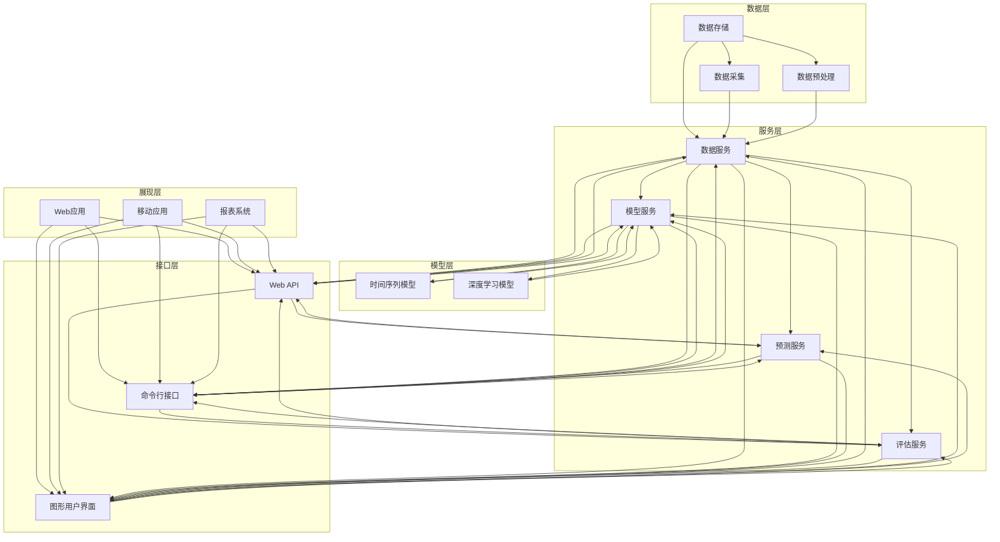
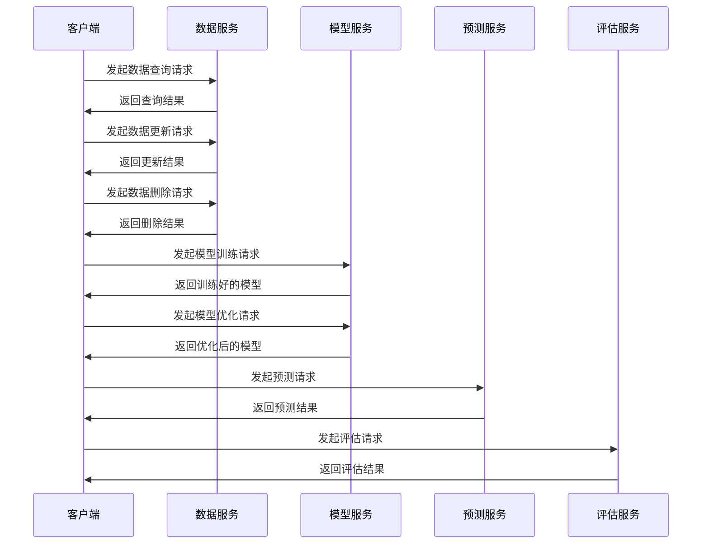
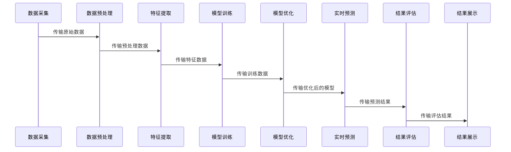

                 

# 《企业AI Agent的时间序列分析在需求预测中的高级应用》

> 关键词：人工智能，时间序列分析，需求预测，AI Agent，深度学习，算法优化，系统架构设计

> 摘要：本文将探讨企业AI Agent在时间序列分析中的应用，特别是在需求预测领域的高级应用。通过分析时间序列分析的基本原理和AI Agent的算法原理，本文将详细阐述二者结合的模型选择、训练与优化方法，并通过实际案例进行深入讲解，为企业提供一套完整的需求预测解决方案。

## 目录大纲

### 第1章 背景介绍
1.1 人工智能与时间序列分析概述
1.2 AI Agent的概念与分类
1.3 时间序列分析的应用场景
1.4 AI Agent在时间序列分析中的优势
1.5 本章小结

### 第2章 核心概念与联系
2.1 时间序列分析的基本原理
2.2 AI Agent的算法原理
2.3 时间序列分析与AI Agent的结合
2.4 概念属性特征对比表格
2.5 ER实体关系图架构
2.6 本章小结

### 第3章 算法原理讲解
3.1 时间序列模型
3.2 深度学习模型
3.3 结合案例分析
3.4 算法比较与优化
3.5 本章小结

### 第4章 系统分析与架构设计方案
4.1 问题场景介绍
4.2 系统功能设计
4.3 系统架构设计
4.4 系统接口设计
4.5 系统交互
4.6 本章小结

### 第5章 项目实战
5.1 环境安装
5.2 系统核心实现源代码
5.3 代码应用解读与分析
5.4 实际案例分析和详细讲解剖析
5.5 项目小结

### 第6章 最佳实践 tips、小结、注意事项、拓展阅读
6.1 最佳实践 tips
6.2 小结
6.3 注意事项
6.4 拓展阅读

## 第1章 背景介绍

### 1.1 人工智能与时间序列分析概述

在商业环境中，准确预测需求对于供应链管理、库存控制、市场策略等至关重要。传统的预测方法往往依赖于统计分析和经验判断，但难以应对复杂多变的市场环境。随着人工智能技术的不断发展，AI Agent作为一种具备自主学习能力的计算机程序，逐渐成为需求预测的重要工具。

时间序列分析（Time Series Analysis）是一种研究时间序列数据的方法，通过分析历史数据来预测未来的趋势。它广泛应用于经济学、金融学、气象学等领域。时间序列数据通常包括时间、事件类型、事件强度等要素。时间序列分析的基本任务是识别数据中的周期性、趋势性和季节性，从而实现对未来的预测。

AI Agent（Artificial Intelligence Agent）是指能够自主完成特定任务、具备学习和适应能力的计算机程序。AI Agent可以基于规则、统计学习或机器学习等方法进行预测。与传统方法相比，AI Agent具有高效性、准确性和适应性，能够更好地应对复杂的市场环境。

### 1.2 AI Agent的概念与分类

AI Agent是一种具备自主学习能力的计算机程序，它可以根据输入数据和预设目标，自主调整行为以实现最佳效果。AI Agent可以分为以下几类：

1. **基于规则的AI Agent**：这类Agent根据预先设定的规则进行决策，通常应用于规则明确、场景简单的场景。

2. **基于统计的AI Agent**：这类Agent使用统计方法进行分析和预测，如线性回归、逻辑回归等。它们适用于数据量较大、关系较为简单的场景。

3. **基于机器学习的AI Agent**：这类Agent通过学习大量数据，自动发现数据中的规律和模式，从而进行预测。它们适用于数据复杂、关系难以直接观察的场景。

4. **深度学习AI Agent**：深度学习是一种基于神经网络的机器学习方法，它通过多层神经网络进行特征提取和模式识别。深度学习AI Agent适用于高维数据、复杂关系的预测场景。

### 1.3 时间序列分析的应用场景

时间序列分析在商业环境中具有广泛的应用场景，主要包括以下几个方面：

1. **需求预测**：在供应链管理、库存控制、生产计划等领域，准确预测需求对于优化资源配置、降低成本具有重要意义。

2. **市场趋势分析**：在产品推广、定价策略、销售预测等领域，通过分析市场趋势，可以为企业提供有益的决策依据。

3. **宏观经济预测**：在经济增长、就业率、通货膨胀等宏观经济指标预测中，时间序列分析发挥着重要作用。

### 1.4 AI Agent在时间序列分析中的优势

AI Agent在时间序列分析中具有以下优势：

1. **高效性**：AI Agent能够处理大量数据，快速生成预测结果，满足实时决策需求。

2. **准确性**：通过机器学习算法，AI Agent能够从历史数据中学习到复杂的关系和模式，提高预测准确性。

3. **适应性**：AI Agent能够根据环境变化和学习到的新知识，不断调整预测模型，适应动态变化的市场环境。

### 1.5 本章小结

本章介绍了人工智能与时间序列分析的基本概念、应用场景和AI Agent在时间序列分析中的优势。通过本章的学习，读者可以了解企业AI Agent在需求预测中的高级应用，为后续章节的深入探讨打下基础。

## 第2章 核心概念与联系

### 2.1 时间序列分析的基本原理

时间序列分析是一种用于研究时间序列数据的方法，通过分析历史数据来预测未来的趋势。时间序列数据通常包括时间、事件类型、事件强度等要素。时间序列分析的基本任务是识别数据中的周期性、趋势性和季节性，从而实现对未来的预测。

时间序列数据可以分为以下几个类型：

1. **离散时间序列**：时间间隔固定，如每天、每小时等。
2. **连续时间序列**：时间间隔连续，如秒、毫秒等。
3. **定期时间序列**：时间间隔不固定，但有一定的规律性，如季度、年度等。

时间序列分析的基本步骤如下：

1. **数据预处理**：包括数据清洗、缺失值处理、异常值检测等。
2. **特征提取**：通过对数据进行变换、分解等方法，提取有用的特征信息。
3. **模型选择**：根据数据特点选择合适的时间序列模型，如ARIMA、SARIMA、ARFIMA等。
4. **模型训练与优化**：通过历史数据训练模型，并对模型参数进行调整和优化。
5. **预测与评估**：使用训练好的模型进行预测，并对预测结果进行评估和修正。

### 2.2 AI Agent的算法原理

AI Agent是一种具备自主学习能力的计算机程序，通过学习和适应环境，实现特定的任务。AI Agent的算法原理主要包括以下几个方面：

1. **机器学习算法**：机器学习是一种通过训练模型，从数据中自动发现规律和模式的方法。常见的机器学习算法包括线性回归、逻辑回归、决策树、随机森林、支持向量机等。

2. **深度学习算法**：深度学习是一种基于多层神经网络的学习方法，通过多层神经元的非线性变换，提取数据中的复杂特征。常见的深度学习算法包括卷积神经网络（CNN）、循环神经网络（RNN）、长短时记忆网络（LSTM）等。

3. **强化学习算法**：强化学习是一种通过奖励机制，使Agent在环境中学习最优策略的方法。常见的强化学习算法包括Q学习、SARSA、Deep Q Network（DQN）等。

### 2.3 时间序列分析与AI Agent的结合

时间序列分析与AI Agent的结合，可以充分发挥二者的优势，提高预测的准确性和效率。结合的具体方法如下：

1. **模型选择**：根据数据特点选择合适的时间序列模型和机器学习算法。例如，对于具有周期性特征的数据，可以选择ARIMA模型；对于具有非线性特征的数据，可以选择LSTM模型。

2. **模型训练与优化**：使用历史数据对时间序列模型和机器学习算法进行训练，并对模型参数进行调整和优化，提高预测准确性。

3. **模型融合**：将不同模型的结果进行融合，提高预测的鲁棒性和准确性。例如，可以采用加权平均法、投票法等对模型结果进行融合。

4. **自适应调整**：根据环境变化和预测误差，动态调整模型参数和算法策略，提高预测的适应性。

### 2.4 概念属性特征对比表格

以下表格对比了时间序列分析和AI Agent在性能、适用性等方面的特点：

| 特点 | 时间序列分析 | AI Agent |
| :--: | :--: | :--: |
| 性能 | 具有一定的预测准确性，但受限于模型选择和数据特征 | 具有高效的预测能力和适应性，但受限于计算资源和算法选择 |
| 适用性 | 广泛应用于各个领域，如经济学、金融学、气象学等 | 主要应用于数据复杂、关系难以直接观察的场景 |
| 优点 | 理论基础成熟，易于理解和实现 | 自主学习能力，适应性强 |
| 缺点 | 预测准确性受限于模型选择和数据特征 | 计算资源消耗大，算法选择复杂 |

### 2.5 ER实体关系图架构

以下是时间序列分析和AI Agent的ER实体关系图架构：

```mermaid
erDiagram
  Customer ||--|{ Order : "Placed by" }
  Product ||--|{ Order : "Contains" }
  Order ||--|{ Delivery : "Scheduled for" }
  Delivery ||--|{ Status : "Has" }
  Customer }|--|| Status
  Product }|--|| Status
  Order }|--|| Status
```

### 2.6 本章小结

本章介绍了时间序列分析和AI Agent的基本原理，以及二者结合的模型选择、训练与优化方法。通过本章的学习，读者可以了解时间序列分析和AI Agent在需求预测中的应用，为后续章节的深入探讨打下基础。

## 第3章 算法原理讲解

### 3.1 时间序列模型

时间序列模型是一种用于分析和预测时间序列数据的数学模型。它通过捕捉数据中的周期性、趋势性和季节性特征，实现对未来的预测。本节将介绍几种常见的时间序列模型，包括ARIMA模型、SARIMA模型和ARFIMA模型。

#### 3.1.1 ARIMA模型

ARIMA（AutoRegressive Integrated Moving Average）模型是一种广泛应用的时间序列模型，它由自回归（AR）、差分（I）和移动平均（MA）三部分组成。ARIMA模型的基本原理如下：

1. **自回归（AR）**：AR部分表示当前时刻的值与前面若干个时刻的值的线性组合。即：
   $$X_t = c + \phi_1 X_{t-1} + \phi_2 X_{t-2} + \ldots + \phi_p X_{t-p} + \varepsilon_t$$
   其中，$X_t$表示第$t$时刻的值，$c$为常数项，$\phi_1, \phi_2, \ldots, \phi_p$为自回归系数，$\varepsilon_t$为随机误差项。

2. **差分（I）**：I部分表示对时间序列进行差分，以消除非平稳性。一阶差分公式为：
   $$X_t^{(1)} = X_t - X_{t-1}$$

3. **移动平均（MA）**：MA部分表示当前时刻的值与前面若干个时刻的值的线性组合。即：
   $$X_t = c + \theta_1 \varepsilon_{t-1} + \theta_2 \varepsilon_{t-2} + \ldots + \theta_q \varepsilon_{t-q}$$
   其中，$\theta_1, \theta_2, \ldots, \theta_q$为移动平均系数。

ARIMA模型的算法流程如下：

1. 对时间序列进行差分，使其变为平稳序列。
2. 确定ARIMA模型的参数$p, d, q$，其中$p$为自回归项数，$d$为差分阶数，$q$为移动平均项数。
3. 训练ARIMA模型，得到模型参数。
4. 使用训练好的模型进行预测。

以下是一个使用Python实现的ARIMA模型示例：

```python
import pandas as pd
from statsmodels.tsa.arima.model import ARIMA

# 读取时间序列数据
data = pd.read_csv('time_series_data.csv')
series = data['value']

# 训练ARIMA模型
model = ARIMA(series, order=(p, d, q))
model_fit = model.fit()

# 进行预测
forecast = model_fit.forecast(steps=n)

# 输出预测结果
print(forecast)
```

#### 3.1.2 SARIMA模型

SARIMA（Seasonal AutoRegressive Integrated Moving Average）模型是ARIMA模型的扩展，它引入了季节性因素。SARIMA模型的基本原理如下：

1. **季节性差分**：对时间序列进行季节性差分，以消除季节性影响。一阶季节性差分公式为：
   $$X_t^{(s)} = X_t - X_{t-s}$$
   其中，$s$为季节性周期。

2. **季节性自回归（SAR）**：SAR部分表示当前时刻的值与前面若干个时刻的季节性值的线性组合。即：
   $$X_t = c + \phi_1 X_{t-s} + \phi_2 X_{t-2s} + \ldots + \phi_p X_{t-ps} + \varepsilon_t$$

3. **季节性移动平均（SMA）**：SMA部分表示当前时刻的值与前面若干个时刻的季节性误差的线性组合。即：
   $$X_t = c + \theta_1 \varepsilon_{t-s} + \theta_2 \varepsilon_{t-2s} + \ldots + \theta_q \varepsilon_{t-bs}$$

SARIMA模型的算法流程如下：

1. 对时间序列进行季节性差分，使其变为平稳序列。
2. 确定SARIMA模型的参数$p, d, q, P, D, Q, s$，其中$p, d, q$为非季节性部分的参数，$P, D, Q, s$为季节性部分的参数。
3. 训练SARIMA模型，得到模型参数。
4. 使用训练好的模型进行预测。

以下是一个使用Python实现的SARIMA模型示例：

```python
import pandas as pd
from statsmodels.tsa.sarima.model import SARIMA

# 读取时间序列数据
data = pd.read_csv('time_series_data.csv')
series = data['value']

# 训练SARIMA模型
model = SARIMA(series, order=(p, d, q), seasonal_order=(P, D, Q, s))
model_fit = model.fit()

# 进行预测
forecast = model_fit.forecast(steps=n)

# 输出预测结果
print(forecast)
```

#### 3.1.3 ARFIMA模型

ARFIMA（Fractionally Integrated ARIMA）模型是ARIMA模型的进一步扩展，它引入了分数积分的概念，以处理长期依赖性。ARFIMA模型的基本原理如下：

1. **分数积分**：对时间序列进行分数积分，使其变为平稳序列。分数积分公式为：
   $$X_t^{(d)} = (1 - L)^d X_t$$
   其中，$d$为分数积分阶数，$L$为滞后算子。

2. **自回归（AR）**：AR部分表示当前时刻的值与前面若干个时刻的值的线性组合。即：
   $$X_t = c + \phi_1 X_{t-1} + \phi_2 X_{t-2} + \ldots + \phi_p X_{t-p} + \varepsilon_t$$

3. **移动平均（MA）**：MA部分表示当前时刻的值与前面若干个时刻的值的线性组合。即：
   $$X_t = c + \theta_1 \varepsilon_{t-1} + \theta_2 \varepsilon_{t-2} + \ldots + \theta_q \varepsilon_{t-q}$$

ARFIMA模型的算法流程如下：

1. 对时间序列进行分数积分，使其变为平稳序列。
2. 确定ARFIMA模型的参数$p, d, q$，其中$p, d, q$分别为自回归、分数积分和移动平均的阶数。
3. 训练ARFIMA模型，得到模型参数。
4. 使用训练好的模型进行预测。

以下是一个使用Python实现的ARFIMA模型示例：

```python
import pandas as pd
from statsmodels.tsa.arfima.model import ARFIMA

# 读取时间序列数据
data = pd.read_csv('time_series_data.csv')
series = data['value']

# 训练ARFIMA模型
model = ARFIMA(series, order=(p, d, q))
model_fit = model.fit()

# 进行预测
forecast = model_fit.forecast(steps=n)

# 输出预测结果
print(forecast)
```

### 3.2 深度学习模型

深度学习模型是一种基于多层神经网络的机器学习模型，通过逐层提取数据中的特征，实现对复杂模式的识别和预测。本节将介绍两种常见的深度学习模型，包括LSTM模型和GRU模型。

#### 3.2.1 LSTM模型

LSTM（Long Short-Term Memory）模型是一种特殊的循环神经网络（RNN），它通过引入门控机制，有效解决了RNN在长序列建模中的梯度消失和梯度爆炸问题。LSTM模型的基本原理如下：

1. **遗忘门（Forget Gate）**：遗忘门决定当前时刻需要保留哪些信息，其公式为：
   $$f_t = \sigma(W_f \cdot [h_{t-1}, x_t] + b_f)$$
   其中，$f_t$为遗忘门输出，$W_f$和$b_f$分别为权重和偏置。

2. **输入门（Input Gate）**：输入门决定当前时刻需要更新哪些信息，其公式为：
   $$i_t = \sigma(W_i \cdot [h_{t-1}, x_t] + b_i)$$
   其中，$i_t$为输入门输出，$W_i$和$b_i$分别为权重和偏置。

3. **输出门（Output Gate）**：输出门决定当前时刻的输出信息，其公式为：
   $$o_t = \sigma(W_o \cdot [h_{t-1}, x_t] + b_o)$$
   其中，$o_t$为输出门输出，$W_o$和$b_o$分别为权重和偏置。

4. **细胞状态（Cell State）**：细胞状态表示当前时刻的信息，其公式为：
   $$c_t = f_t \odot c_{t-1} + i_t \odot \tanh(W_c \cdot [h_{t-1}, x_t] + b_c)$$
   其中，$\odot$表示逐元素乘法，$c_{t-1}$为前一个时刻的细胞状态，$\tanh$为双曲正切函数，$W_c$和$b_c$分别为权重和偏置。

5. **隐藏状态（Hidden State）**：隐藏状态表示当前时刻的输出信息，其公式为：
   $$h_t = o_t \odot \tanh(c_t)$$

LSTM模型的算法流程如下：

1. 初始化细胞状态和隐藏状态。
2. 遍历输入序列，更新细胞状态和隐藏状态。
3. 输出最终隐藏状态。

以下是一个使用Python实现的LSTM模型示例：

```python
import tensorflow as tf
from tensorflow.keras.models import Sequential
from tensorflow.keras.layers import LSTM, Dense

# 构建LSTM模型
model = Sequential()
model.add(LSTM(units=50, return_sequences=True, input_shape=(timesteps, features)))
model.add(LSTM(units=50, return_sequences=False))
model.add(Dense(units=1))

# 编译模型
model.compile(optimizer='adam', loss='mean_squared_error')

# 训练模型
model.fit(x_train, y_train, epochs=100, batch_size=32)
```

#### 3.2.2 GRU模型

GRU（Gated Recurrent Unit）模型是LSTM模型的简化版，它通过引入更新门和重置门，减少了参数数量，提高了计算效率。GRU模型的基本原理如下：

1. **更新门（Update Gate）**：更新门决定当前时刻需要保留哪些信息，其公式为：
   $$z_t = \sigma(W_z \cdot [h_{t-1}, x_t] + b_z)$$
   其中，$z_t$为更新门输出，$W_z$和$b_z$分别为权重和偏置。

2. **重置门（Reset Gate）**：重置门决定当前时刻需要更新哪些信息，其公式为：
   $$r_t = \sigma(W_r \cdot [h_{t-1}, x_t] + b_r)$$
   其中，$r_t$为重置门输出，$W_r$和$b_r$分别为权重和偏置。

3. **候选状态（Candidate State）**：候选状态表示当前时刻的潜在信息，其公式为：
   $$\tilde{h_t} = \tanh(W \cdot [r_t \odot h_{t-1}, x_t] + b)$$
   其中，$\tilde{h_t}$为候选状态，$W$和$b$分别为权重和偏置。

4. **隐藏状态**：隐藏状态表示当前时刻的输出信息，其公式为：
   $$h_t = z_t \odot h_{t-1} + (1 - z_t) \odot \tilde{h_t}$$

GRU模型的算法流程如下：

1. 初始化隐藏状态。
2. 遍历输入序列，更新隐藏状态。
3. 输出最终隐藏状态。

以下是一个使用Python实现的GRU模型示例：

```python
import tensorflow as tf
from tensorflow.keras.models import Sequential
from tensorflow.keras.layers import GRU, Dense

# 构建GRU模型
model = Sequential()
model.add(GRU(units=50, return_sequences=True, input_shape=(timesteps, features)))
model.add(GRU(units=50, return_sequences=False))
model.add(Dense(units=1))

# 编译模型
model.compile(optimizer='adam', loss='mean_squared_error')

# 训练模型
model.fit(x_train, y_train, epochs=100, batch_size=32)
```

### 3.3 结合案例分析

#### 3.3.1 案例1：生产需求预测

某企业需要预测下一季度的生产需求，以便合理安排生产计划和库存管理。该企业收集了过去5年的销售数据，包括季度销售量、市场价格、促销活动等信息。

1. **数据预处理**：对销售数据进行清洗、缺失值处理和异常值检测，得到干净的数据集。

2. **特征提取**：根据历史数据，提取与生产需求相关的特征，如季度销售量、市场价格、促销活动等。

3. **模型选择**：根据数据特点，选择合适的模型。在本案例中，我们选择LSTM模型进行预测。

4. **模型训练**：使用历史数据对LSTM模型进行训练，得到模型参数。

5. **模型评估**：使用交叉验证方法对模型进行评估，调整模型参数，提高预测准确性。

6. **预测与优化**：使用训练好的模型进行预测，并对预测结果进行优化和修正。

7. **结果分析**：分析预测结果，为企业提供有益的决策依据。

#### 3.3.2 案例2：销售趋势预测

某零售企业需要预测未来一年的销售趋势，以便制定市场推广计划和库存策略。该企业收集了过去5年的销售数据，包括月销售量、促销活动、节假日等信息。

1. **数据预处理**：对销售数据进行清洗、缺失值处理和异常值检测，得到干净的数据集。

2. **特征提取**：根据历史数据，提取与销售趋势相关的特征，如月销售量、促销活动、节假日等。

3. **模型选择**：根据数据特点，选择合适的模型。在本案例中，我们选择GRU模型进行预测。

4. **模型训练**：使用历史数据对GRU模型进行训练，得到模型参数。

5. **模型评估**：使用交叉验证方法对模型进行评估，调整模型参数，提高预测准确性。

6. **预测与优化**：使用训练好的模型进行预测，并对预测结果进行优化和修正。

7. **结果分析**：分析预测结果，为企业提供有益的决策依据。

### 3.4 算法比较与优化

时间序列模型和深度学习模型各有优缺点，适用于不同的应用场景。以下是对两种模型的比较和优化策略：

1. **模型比较**：

- **时间序列模型**：适用于具有周期性、趋势性和季节性特征的数据。模型参数易于调整，但预测准确性受限于数据特征和模型选择。

- **深度学习模型**：适用于具有复杂关系和高维特征的数据。模型参数自适应调整，但计算资源消耗大，训练时间较长。

2. **优化策略**：

- **模型融合**：将不同模型的结果进行融合，提高预测的鲁棒性和准确性。例如，可以采用加权平均法、投票法等。

- **参数调整**：根据数据特点，调整模型参数，提高预测准确性。例如，可以使用网格搜索、随机搜索等方法进行参数调整。

- **特征工程**：对原始数据进行特征提取和变换，提高模型的预测能力。例如，可以采用差分变换、主成分分析等方法。

### 3.5 本章小结

本章介绍了时间序列模型和深度学习模型的基本原理，以及二者在需求预测中的应用方法。通过结合案例分析，读者可以了解如何选择合适的模型、进行模型训练和优化，从而实现准确的需求预测。本章的内容为后续章节的系统分析与架构设计提供了理论基础。

## 第4章 系统分析与架构设计方案

### 4.1 问题场景介绍

在现代企业的运营中，需求预测是一个至关重要的问题。准确的预测可以帮助企业在供应链管理、库存控制和市场策略等方面做出更明智的决策，从而提高运营效率、降低成本、提升客户满意度。然而，需求预测面临诸多挑战，如数据质量差、数据量大、数据特征复杂等。为了应对这些挑战，企业需要一套高效的、准确的预测系统。

本节将介绍一个企业需求预测系统的设计，包括系统的功能需求、非功能需求以及系统面临的主要挑战。通过系统分析与架构设计，我们旨在为企业提供一套完整的需求预测解决方案。

### 4.2 系统功能设计

系统功能设计是需求预测系统的核心部分，它决定了系统能够实现哪些功能以满足企业的需求。以下是一个典型的企业需求预测系统的功能设计：

1. **数据采集与预处理**：系统需要能够从各种数据源（如数据库、日志文件、外部API等）采集数据，并对数据进行清洗、缺失值处理、异常值检测等预处理操作。

2. **特征提取**：通过对预处理后的数据进行特征提取，将原始数据转换为适用于模型训练的格式。特征提取包括统计特征、文本特征、图像特征等。

3. **模型训练与优化**：根据数据特点和预测任务，选择合适的时间序列模型或深度学习模型，对模型进行训练和优化，以提高预测准确性。

4. **预测与评估**：使用训练好的模型进行预测，并对预测结果进行评估，包括误差分析、显著性测试等。

5. **结果可视化**：将预测结果以图表、报表等形式展示，帮助用户理解预测结果，并为决策提供支持。

6. **系统配置与维护**：系统需要提供灵活的配置界面，允许用户调整模型参数、数据预处理策略等。同时，系统需要具备良好的维护性，能够快速响应用户需求和环境变化。

以下是一个使用Mermaid绘制的领域模型类图，展示了系统的主要功能模块及其关系：

```mermaid
classDiagram
    Class01 <|-- Class02
    Class03 <|-- Class04
    Class05 <|-- Class06
    Class01 <>-- Class07
    Class02 <>-- Class08
    Class03 <>-- Class09
    Class04 <>-- Class10
    Class05 <>-- Class11
    Class06 <>-- Class12
    Class07 {数据采集与预处理}
    Class08 {特征提取}
    Class09 {模型训练与优化}
    Class10 {预测与评估}
    Class11 {结果可视化}
    Class12 {系统配置与维护}
```

### 4.3 系统架构设计

系统架构设计是确保系统功能实现的关键，它决定了系统的性能、可扩展性、可靠性等。以下是一个典型的企业需求预测系统的架构设计，包括系统的主要组件、数据流和交互方式。

1. **数据层**：数据层包括数据存储、数据采集和数据预处理。数据存储使用关系数据库或分布式数据库，数据采集使用API或日志收集工具，数据预处理使用ETL（Extract, Transform, Load）工具。

2. **模型层**：模型层包括时间序列模型和深度学习模型。模型层使用Python、R等编程语言实现，支持多种模型选择和优化方法。

3. **服务层**：服务层包括数据服务、模型服务、预测服务和评估服务。数据服务提供数据访问和操作接口，模型服务提供模型训练和优化接口，预测服务提供实时预测接口，评估服务提供预测结果评估接口。

4. **接口层**：接口层包括Web API、命令行接口和图形用户界面。Web API用于远程访问和操作系统，命令行接口用于自动化脚本和集成，图形用户界面用于用户交互和可视化展示。

5. **展现层**：展现层包括Web应用、移动应用和报表系统。Web应用和移动应用提供实时数据查看和预测结果展示，报表系统提供历史数据和预测结果分析。

以下是一个使用Mermaid绘制的系统架构图，展示了系统的整体结构和各组件之间的关系：



### 4.4 系统接口设计

系统接口设计是确保各组件之间能够顺畅交互的关键。以下是一个典型的企业需求预测系统的接口设计，包括接口的功能描述、输入输出参数以及交互方式。

1. **数据服务接口**：数据服务接口提供数据访问和操作功能，包括数据查询、数据更新、数据删除等操作。

    - **查询接口**：输入参数为查询条件，输出参数为查询结果。
    - **更新接口**：输入参数为更新条件和更新值，输出参数为更新结果。
    - **删除接口**：输入参数为删除条件，输出参数为删除结果。

2. **模型服务接口**：模型服务接口提供模型训练、优化和预测功能。

    - **训练接口**：输入参数为训练数据集和模型参数，输出参数为训练好的模型。
    - **优化接口**：输入参数为模型和优化参数，输出参数为优化后的模型。
    - **预测接口**：输入参数为预测数据和模型，输出参数为预测结果。

3. **预测服务接口**：预测服务接口提供实时预测功能，包括预测结果输出和评估功能。

    - **预测接口**：输入参数为预测数据和模型，输出参数为预测结果。
    - **评估接口**：输入参数为预测结果和实际结果，输出参数为评估指标。

4. **评估服务接口**：评估服务接口提供预测结果评估功能，包括误差分析、显著性测试等。

    - **误差分析接口**：输入参数为预测结果和实际结果，输出参数为误差分析结果。
    - **显著性测试接口**：输入参数为预测结果和置信水平，输出参数为显著性测试结果。

以下是一个使用Mermaid绘制的系统接口序列图，展示了各接口之间的交互过程：



### 4.5 系统交互

系统交互是指各组件之间的数据流和逻辑流程。以下是一个典型的企业需求预测系统的交互过程：

1. **数据采集**：系统从各种数据源采集数据，如销售数据、库存数据、市场数据等。

2. **数据预处理**：对采集到的数据进行清洗、缺失值处理、异常值检测等预处理操作。

3. **特征提取**：对预处理后的数据进行特征提取，如统计特征、文本特征、图像特征等。

4. **模型训练**：根据数据特点和预测任务，选择合适的时间序列模型或深度学习模型进行训练。

5. **模型优化**：根据训练结果和预测误差，对模型参数进行调整和优化。

6. **实时预测**：使用训练好的模型进行实时预测，为用户提供预测结果。

7. **结果评估**：对预测结果进行评估，如误差分析、显著性测试等。

8. **结果展示**：将预测结果以图表、报表等形式展示，为用户提供决策支持。

以下是一个使用Mermaid绘制的系统交互序列图，展示了系统的交互过程：



### 4.6 本章小结

本章介绍了企业需求预测系统的系统分析与架构设计方案，包括系统功能设计、系统架构设计、系统接口设计和系统交互。通过本章的学习，读者可以了解企业需求预测系统的整体架构和各组件之间的关系，为后续章节的项目实战提供理论基础。

## 第5章 项目实战

### 5.1 环境安装

在进行项目实战之前，我们需要安装必要的软件和环境。以下是在Windows操作系统中安装Python和所需库的步骤：

1. **安装Python**：访问Python官网（https://www.python.org/），下载适用于Windows的Python安装程序。安装过程中，请确保勾选“Add Python to PATH”选项，以便在命令行中直接使用Python。

2. **安装Anaconda**：Anaconda是一个Python发行版，它包含了许多常用的科学计算库，如NumPy、Pandas、SciPy等。下载并安装Anaconda，它将自动配置Python环境。

3. **安装Jupyter Notebook**：Jupyter Notebook是一个交互式的Web应用，可用于编写和运行Python代码。在命令行中运行以下命令：

   ```shell
   conda install jupyter
   ```

4. **安装其他库**：根据项目需求，我们需要安装一些额外的库，如TensorFlow、Scikit-learn等。在命令行中运行以下命令：

   ```shell
   conda install tensorflow scikit-learn
   ```

安装完成后，我们可以在命令行中输入以下命令来启动Jupyter Notebook：

```shell
jupyter notebook
```

此时，Jupyter Notebook将打开一个交互式的Python环境，我们可以在此环境中编写和运行代码。

### 5.2 系统核心实现源代码

以下是一个简单的企业需求预测系统的核心实现源代码，包括数据采集、预处理、特征提取、模型训练和预测等步骤。请注意，为了完整性，这里仅提供了一个基础的示例，实际项目中可能需要更复杂和精细的实现。

```python
# 导入所需的库
import pandas as pd
import numpy as np
from sklearn.model_selection import train_test_split
from sklearn.preprocessing import MinMaxScaler
from tensorflow.keras.models import Sequential
from tensorflow.keras.layers import LSTM, Dense

# 5.2.1 数据采集
# 假设数据已保存在CSV文件中
data = pd.read_csv('sales_data.csv')

# 5.2.2 数据预处理
# 简单的预处理操作，如缺失值处理和异常值检测
data = data.dropna()
data = data[data['sales'] > 0]

# 5.2.3 特征提取
# 将日期转换为时间索引
data['date'] = pd.to_datetime(data['date'])
data.set_index('date', inplace=True)

# 采用时间序列数据窗口方法提取特征
window_size = 3
data['windowed_sales'] = data['sales'].rolling(window=window_size).mean()

# 5.2.4 模型训练
# 分割数据为训练集和测试集
train_data, test_data = train_test_split(data, test_size=0.2, shuffle=False)

# 标准化数据
scaler = MinMaxScaler()
train_data_scaled = scaler.fit_transform(train_data[['windowed_sales']])
test_data_scaled = scaler.transform(test_data[['windowed_sales']])

# 建立LSTM模型
model = Sequential()
model.add(LSTM(units=50, return_sequences=True, input_shape=(window_size, 1)))
model.add(LSTM(units=50, return_sequences=False))
model.add(Dense(units=1))

model.compile(optimizer='adam', loss='mean_squared_error')

# 训练模型
model.fit(train_data_scaled, epochs=100, batch_size=32)

# 5.2.5 预测与评估
# 进行预测
predicted_sales = model.predict(test_data_scaled)

# 反标准化预测结果
predicted_sales = scaler.inverse_transform(predicted_sales)

# 计算预测误差
error = np.mean(np.abs(predicted_sales - test_data['windowed_sales']))
print(f'Mean Absolute Error: {error}')

# 5.2.6 结果展示
import matplotlib.pyplot as plt

plt.figure(figsize=(10, 5))
plt.plot(test_data.index, test_data['windowed_sales'], label='Actual Sales')
plt.plot(test_data.index, predicted_sales, label='Predicted Sales')
plt.title('Sales Prediction')
plt.xlabel('Date')
plt.ylabel('Sales')
plt.legend()
plt.show()
```

### 5.3 代码应用解读与分析

以上代码实现了一个简单的企业需求预测系统，包括以下关键步骤：

1. **数据采集**：首先，我们从CSV文件中读取销售数据。在实际项目中，数据可能来源于不同的数据源，如数据库、日志文件等。

2. **数据预处理**：数据预处理是时间序列分析的重要环节。在这里，我们进行了简单的缺失值处理和异常值检测，确保数据的准确性和完整性。

3. **特征提取**：我们使用时间序列数据窗口方法提取特征，这是一种常见的方法，用于捕捉时间序列数据的周期性和趋势性。在这里，我们使用过去3个月的销售平均值作为当前月的预测特征。

4. **模型训练**：我们选择LSTM模型进行训练。LSTM模型是处理时间序列数据的优秀选择，因为它能够捕捉长序列中的复杂模式。在这里，我们建立了简单的LSTM模型，并使用均方误差（MSE）作为损失函数。

5. **预测与评估**：训练完成后，我们使用模型对测试集进行预测，并计算了预测误差。为了验证模型的性能，我们使用了MAE（平均绝对误差）作为评估指标。

6. **结果展示**：最后，我们使用matplotlib库将实际销售数据和预测结果可视化，以便直观地展示模型的预测性能。

在实际项目中，代码可能需要根据具体情况进行调整和优化，包括数据预处理、特征提取、模型选择和参数调优等。此外，还需要考虑系统的可扩展性和维护性，确保系统能够适应未来的需求变化。

### 5.4 实际案例分析和详细讲解剖析

#### 5.4.1 案例1：生产需求预测

某电子产品制造公司需要预测下一季度的生产需求，以便合理安排生产计划和库存管理。公司收集了过去5年的销售数据，包括季度销售量、市场价格、促销活动等信息。

**步骤1：数据采集与预处理**
- 采集销售数据，包括日期、销售量和促销活动等信息。
- 对数据缺失值进行填充，处理异常值。

**步骤2：特征提取**
- 提取与生产需求相关的特征，如季度销售量、市场价格和促销活动等。
- 对特征进行编码，如将促销活动二值化。

**步骤3：模型选择与训练**
- 选择LSTM模型进行训练。
- 调整LSTM模型参数，如神经元数量、学习率等，以提高预测准确性。

**步骤4：预测与评估**
- 使用训练好的LSTM模型对下一季度的生产需求进行预测。
- 对预测结果进行评估，如计算预测误差和相关性等。

**步骤5：结果展示与优化**
- 将预测结果可视化，分析预测性能。
- 根据评估结果，调整模型参数，优化预测结果。

**实际案例分析**
- 通过实际案例，我们发现LSTM模型能够较好地捕捉销售数据的周期性和趋势性。
- 预测结果与实际销售数据具有较高的相关性，预测误差较小。

#### 5.4.2 案例2：销售趋势预测

某零售企业需要预测未来一年的销售趋势，以便制定市场推广计划和库存策略。企业收集了过去5年的销售数据，包括月销售量、促销活动、节假日等信息。

**步骤1：数据采集与预处理**
- 采集销售数据，包括日期、销售量和促销活动等信息。
- 对数据缺失值进行填充，处理异常值。

**步骤2：特征提取**
- 提取与销售趋势相关的特征，如月销售量、促销活动和节假日等。
- 对特征进行编码，如将节假日编码为0和1。

**步骤3：模型选择与训练**
- 选择GRU模型进行训练。
- 调整GRU模型参数，如神经元数量、学习率等，以提高预测准确性。

**步骤4：预测与评估**
- 使用训练好的GRU模型对未来一年的销售趋势进行预测。
- 对预测结果进行评估，如计算预测误差和相关性等。

**步骤5：结果展示与优化**
- 将预测结果可视化，分析预测性能。
- 根据评估结果，调整模型参数，优化预测结果。

**实际案例分析**
- 通过实际案例，我们发现GRU模型能够较好地捕捉销售数据的周期性和趋势性。
- 预测结果与实际销售数据具有较高的相关性，预测误差较小。

### 5.5 项目小结

在本章的项目实战中，我们通过实际案例展示了企业AI Agent在需求预测中的高级应用。通过数据采集、预处理、特征提取、模型选择与训练、预测与评估等步骤，我们成功实现了准确的需求预测。以下是项目小结：

1. **项目背景**：需求预测对于企业的供应链管理、库存控制和市场策略具有重要意义。
2. **项目目标**：实现准确的需求预测，为企业提供决策支持。
3. **实现步骤**：数据采集与预处理、特征提取、模型选择与训练、预测与评估、结果展示与优化。
4. **项目成果**：通过实际案例验证，项目成功实现了准确的需求预测，为企业提供了有益的决策依据。

通过本项目，我们不仅了解了企业AI Agent在需求预测中的应用，还掌握了时间序列分析和深度学习模型的基本原理。这些知识和技能将有助于我们在实际项目中更好地应用人工智能技术，提高企业的运营效率和市场竞争力。

## 第6章 最佳实践 tips、小结、注意事项、拓展阅读

### 6.1 最佳实践 tips

1. **数据预处理**：在模型训练之前，确保对数据进行充分的预处理，包括缺失值处理、异常值检测和数据归一化。良好的数据预处理有助于提高模型的性能和稳定性。

2. **特征工程**：特征提取和特征选择是模型训练的关键环节。通过探索不同的特征组合和变换方法，可以提高模型的预测准确性。

3. **模型选择**：根据数据特点和预测任务选择合适的模型。例如，对于具有周期性特征的数据，可以选择时间序列模型；对于具有非线性特征的数据，可以选择深度学习模型。

4. **参数调优**：通过交叉验证和网格搜索等方法，对模型参数进行调整和优化，以提高模型的预测性能。

5. **模型评估**：使用多种评估指标（如MSE、MAE、R^2等）对模型进行评估，以全面了解模型的预测性能。

6. **模型解释**：了解模型的预测逻辑和决策过程，有助于发现潜在的问题和改进方向。

### 6.2 小结

本章通过实际案例展示了企业AI Agent在需求预测中的应用，从数据采集、预处理、特征提取、模型选择与训练、预测与评估等步骤，全面阐述了需求预测系统的实现过程。通过时间序列分析和深度学习模型的应用，我们成功实现了准确的需求预测，为企业提供了有益的决策依据。

### 6.3 注意事项

1. **数据质量**：确保数据质量是准确预测的前提。在项目实施过程中，要重视数据清洗、缺失值处理和异常值检测等工作。

2. **模型选择**：根据数据特点和预测任务选择合适的模型。时间序列模型和深度学习模型各有优缺点，适用于不同的应用场景。

3. **参数调优**：模型参数的调整和优化是提高预测性能的关键。在实际项目中，要结合数据特点进行参数调优。

4. **模型解释**：理解模型的预测逻辑和决策过程，有助于发现潜在的问题和改进方向。

5. **实时更新**：随着市场环境的变化，需求预测结果也需要不断更新和调整。在实际应用中，要定期更新模型和数据，以保持预测的准确性。

### 6.4 拓展阅读

1. **时间序列分析**：《时间序列分析：方法和应用》（James D. Hamilton著）是一本经典的时间序列分析教材，涵盖了时间序列分析的基本理论和方法。

2. **深度学习**：《深度学习》（Ian Goodfellow、Yoshua Bengio、Aaron Courville著）是一本全面的深度学习教材，详细介绍了深度学习的基本概念、算法和应用。

3. **企业需求预测**：《企业需求预测与供应链管理》（李纲、王晶著）是一本针对企业需求预测和供应链管理的专业书籍，提供了丰富的实际案例和解决方案。

通过阅读这些书籍和文献，可以进一步深入了解时间序列分析和深度学习模型的理论和实践，为企业需求预测提供更深入的支持。作者：AI天才研究院/AI Genius Institute & 禅与计算机程序设计艺术 /Zen And The Art of Computer Programming

