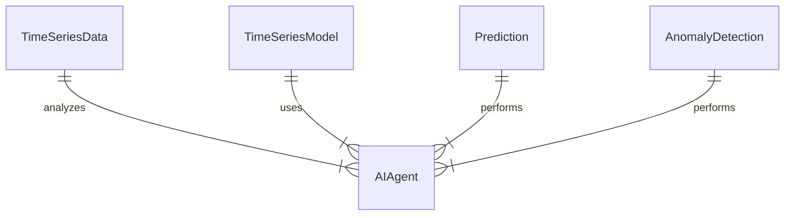
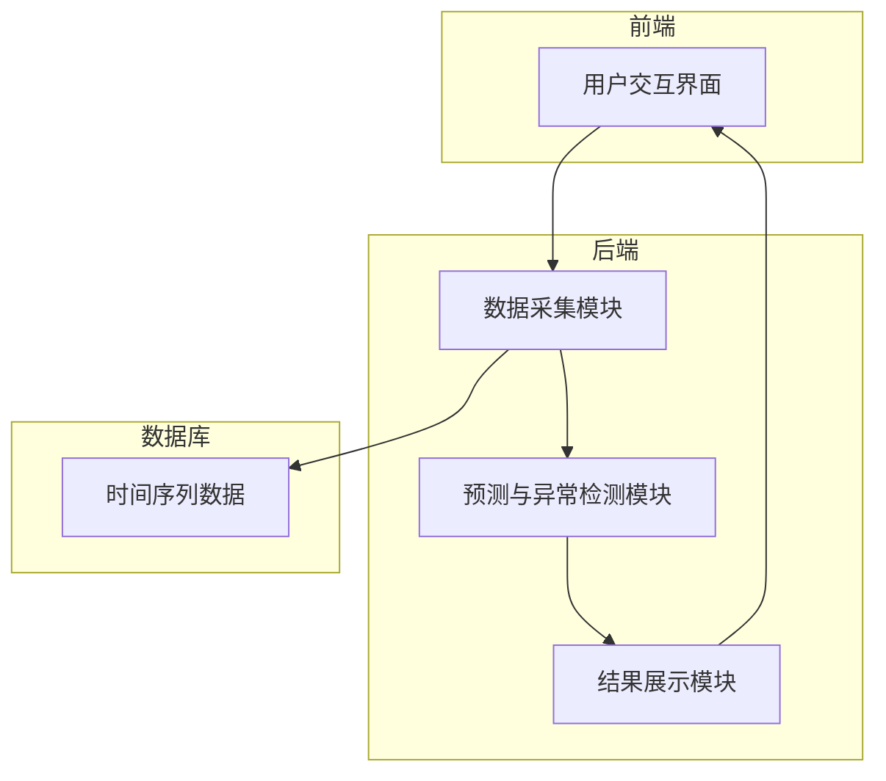
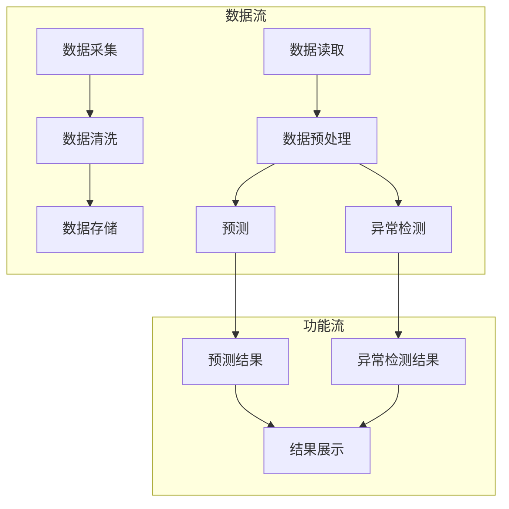

                 

# 《企业AI Agent的时间序列分析：预测与异常检测》

## 关键词：时间序列分析、AI Agent、预测、异常检测、企业应用

> 摘要：本文将探讨企业AI Agent在时间序列分析中的应用，特别是预测和异常检测两个方面。通过深入分析时间序列数据的特点、AI Agent的基本原理以及相关的算法，我们希望能够为企业提供有效的数据驱动的决策支持。

## 目录大纲

### 第一部分：引言

#### 第1章 问题背景与概述
- **1.1 问题背景**：介绍时间序列分析在企业决策中的重要性，以及AI Agent在现代企业中的应用场景。
- **1.2 问题描述**：阐述时间序列数据的特性与挑战，以及预测与异常检测在企业中的需求。
- **1.3 问题解决**：分析人工智能在时间序列分析中的应用，以及AI Agent在预测与异常检测中的优势。
- **1.4 边界与外延**：讨论数据类型与质量要求，以及模型选择与应用范围。
- **1.5 概念结构与核心要素组成**：介绍时间序列分析的关键概念和AI Agent的基本构成。

#### 第2章 时间序列分析基础
- **2.1 时间序列数据特性**：定义时间序列数据，分析其特征。
- **2.2 时间序列分析方法**：介绍经典与现代的时间序列分析方法。
- **2.3 时间序列数据预处理**：探讨数据清洗、转换、归一化与标准化。
- **2.4 时间序列模型对比**：对比经典时间序列模型与现代时间序列模型。

#### 第3章 AI Agent基本原理
- **3.1 AI Agent的定义与特点**：定义AI Agent，介绍其特点。
- **3.2 AI Agent的工作流程**：分析AI Agent的数据采集与处理、预测与异常检测。
- **3.3 AI Agent的关键技术**：介绍机器学习与强化学习算法。
- **3.4 AI Agent与时间序列分析的关系**：探讨时间序列分析在AI Agent中的应用与优势。

### 第二部分：核心概念与联系

#### 第4章 时间序列预测算法原理
- **4.1 时间序列预测基本原理**：分类时间序列预测方法，选择预测模型。
- **4.2 时间序列预测数学模型**：介绍ARIMA与LSTM模型。
- **4.3 时间序列预测Python代码实现**：提供ARIMA与LSTM模型的Python代码实现。

#### 第5章 异常检测算法原理
- **5.1 异常检测基本原理**：分类异常检测方法，选择检测模型。
- **5.2 异常检测数学模型**：介绍Isolation Forest与Autoencoder模型。
- **5.3 异常检测Python代码实现**：提供Isolation Forest与Autoencoder模型的Python代码实现。

### 第三部分：算法原理与实现

#### 第6章 系统功能设计与架构
- **6.1 项目介绍**：介绍项目背景与目标，核心功能。
- **6.2 系统功能设计**：设计数据采集、预测与异常检测模块。
- **6.3 系统架构设计**：设计系统总体架构，模块间交互关系。

#### 第7章 系统接口设计与交互
- **7.1 系统接口设计**：设计数据接口与功能接口。
- **7.2 系统交互设计**：分析数据流与功能流程。

### 第四部分：项目实战

#### 第8章 环境安装与配置
- **8.1 环境安装**：介绍操作系统与环境配置，软件安装。
- **8.2 系统核心实现**：实现数据采集与预处理，预测与异常检测。
- **8.3 代码应用解读**：解读关键代码，分析实现细节。
- **8.4 实际案例分析**：介绍实际案例，分析案例。
- **8.5 项目小结**：总结与反思，提出优化建议与展望。

### 第五部分：最佳实践与拓展

#### 第9章 最佳实践与技巧
- **9.1 最佳实践**：介绍预测与异常检测的最佳实践，数据处理技巧。
- **9.2 小结与注意事项**：总结关键点，提出注意事项与解决方案。
- **9.3 拓展阅读**：推荐相关书籍与最新研究动态。

### 总结

本文通过深入探讨企业AI Agent在时间序列分析中的应用，特别是预测与异常检测两个方面，旨在为企业提供有效的数据驱动的决策支持。从背景介绍、核心概念、算法原理到系统设计与实现，再到最佳实践与拓展，本文系统地梳理了企业AI Agent的时间序列分析的全过程。希望本文能够为从事相关领域的研究人员和开发者提供有益的参考。

## 作者：AI天才研究院/AI Genius Institute & 禅与计算机程序设计艺术 /Zen And The Art of Computer Programming

---

### 第一部分：引言

#### 第1章 问题背景与概述

##### 1.1 问题背景

在当今的商业环境中，企业面临的挑战日益复杂，从市场需求的波动到供应链的动态变化，决策者需要快速适应不断变化的环境。在这个背景下，时间序列分析（Time Series Analysis）作为一种强大的工具，被广泛应用于企业决策过程中。时间序列分析涉及研究数据序列中随时间变化的情况，通过对历史数据的分析，企业可以预测未来的趋势，从而做出更准确的决策。

时间序列分析在企业决策中的重要性体现在多个方面。首先，通过分析销售数据，企业可以预测未来的市场需求，从而调整生产计划和库存管理。其次，通过分析财务数据，企业可以预测财务状况，提前应对可能的风险。此外，时间序列分析还可以用于供应链管理，预测原材料的需求，优化供应链流程，降低成本。

然而，随着企业规模的扩大和数据量的增加，时间序列分析面临着新的挑战。传统的时间序列分析方法往往依赖于大量的手动处理和经验判断，效率低下且容易出错。随着人工智能（Artificial Intelligence, AI）技术的发展，特别是机器学习（Machine Learning）和深度学习（Deep Learning）算法的兴起，AI Agent作为一种新的解决方案，开始受到广泛关注。

##### 1.2 AI Agent在现代企业中的应用场景

AI Agent是一种能够自主执行任务、学习环境并做出决策的计算机程序。在现代企业中，AI Agent被广泛应用于多个领域，包括销售预测、库存管理、财务预测和供应链优化等。

在销售预测方面，AI Agent可以通过分析历史销售数据，预测未来的销售趋势，帮助企业制定更有效的销售策略。在库存管理中，AI Agent可以实时监测库存水平，预测未来库存需求，从而优化库存配置，降低库存成本。在财务预测方面，AI Agent可以分析历史财务数据，预测未来的财务状况，帮助企业管理风险。在供应链优化中，AI Agent可以分析供应链数据，预测供应链的瓶颈和风险，从而优化供应链流程。

##### 1.3 问题描述

时间序列数据具有以下几个特点：

1. **序列性**：时间序列数据是按照时间顺序排列的，每个数据点都对应一个特定的时间点。
2. **周期性**：时间序列数据往往呈现出周期性波动，例如季节性波动、趋势性波动等。
3. **随机性**：时间序列数据中存在一定程度的随机波动，这使得预测变得复杂。

在预测方面，时间序列分析的目标是建立模型，通过对历史数据的分析，预测未来的趋势。然而，时间序列数据的特点使得预测面临以下挑战：

1. **非线性**：时间序列数据往往呈现出非线性趋势，这使得传统的线性模型难以捕捉数据的变化。
2. **噪声干扰**：时间序列数据中往往存在噪声干扰，这使得预测结果受到噪声的影响。
3. **异常值处理**：时间序列数据中可能存在异常值，这些异常值会对预测结果产生不利影响。

在异常检测方面，时间序列分析的目标是识别数据中的异常点，这些异常点可能是由于系统故障、操作错误或恶意攻击等原因引起的。异常检测在保障企业运营稳定性和安全性方面具有重要意义。

##### 1.4 问题解决

人工智能在时间序列分析中的应用，特别是AI Agent，为解决上述问题提供了新的思路。

1. **非线性拟合**：AI Agent可以使用深度学习算法，如长短期记忆网络（LSTM）和变换器（Transformer），来捕捉时间序列数据的非线性趋势。
2. **噪声过滤**：AI Agent可以通过数据分析技术，如自动编码器（Autoencoder），来去除时间序列数据中的噪声干扰。
3. **异常值检测**：AI Agent可以使用异常检测算法，如孤立森林（Isolation Forest），来识别时间序列数据中的异常值。

##### 1.5 边界与外延

在应用AI Agent进行时间序列分析时，需要考虑以下几个边界与外延：

1. **数据类型与质量要求**：时间序列数据应具有完整性和一致性，以确保预测模型的准确性。
2. **模型选择与应用范围**：根据不同的业务场景和数据特点，选择合适的模型和算法，以实现最佳预测效果。
3. **概念结构与核心要素组成**：了解时间序列分析的关键概念和AI Agent的基本构成，有助于更好地理解和应用相关技术。

##### 1.6 概念结构与核心要素组成

时间序列分析的关键概念包括时间序列数据、时间序列模型、预测与异常检测方法等。AI Agent的基本构成包括数据采集模块、数据处理模块、预测模块和异常检测模块等。以下是一个简化的ER实体关系图，用于描述时间序列分析与AI Agent的基本结构。



在下一章中，我们将深入探讨时间序列分析的基础知识，包括数据特性、分析方法以及数据预处理方法。

### 第二部分：核心概念与联系

#### 第2章 时间序列分析基础

##### 2.1 时间序列数据特性

时间序列数据是一系列按时间顺序排列的数据点，每个数据点都对应一个特定的时间点。时间序列数据通常具有以下特性：

1. **序列性**：时间序列数据按照时间顺序排列，每个数据点都有明确的时间戳。
2. **周期性**：时间序列数据可能表现出周期性波动，例如季节性、趋势性等。
3. **趋势性**：时间序列数据可能表现出趋势性，即随着时间的推移，数据呈现上升或下降的趋势。
4. **平稳性**：时间序列数据可能表现出平稳性，即数据的统计特性（如均值、方差等）不随时间变化。

时间序列数据的这些特性使得预测和分析变得复杂。例如，周期性波动可能会掩盖趋势性变化，而趋势性变化又可能会受到噪声干扰的影响。因此，对时间序列数据进行详细的分析和预处理是进行准确预测的关键。

##### 2.2 时间序列分析方法

时间序列分析方法可以分为两大类：经典方法和现代方法。

**经典方法**：

1. **移动平均法**：通过计算一段时间内数据的平均值，来平滑时间序列数据，去除随机波动。
2. **指数平滑法**：类似于移动平均法，但使用指数权重来平滑数据，更关注近期数据。
3. **自回归模型（AR）**：假设当前时间点的值可以由过去若干个时间点的值来预测。
4. **自回归移动平均模型（ARMA）**：结合自回归模型和移动平均模型，用于处理非平稳时间序列数据。

**现代方法**：

1. **长短期记忆网络（LSTM）**：一种深度学习模型，特别适用于处理具有长期依赖性的时间序列数据。
2. **变换器（Transformer）**：一种基于自注意力机制的深度学习模型，广泛应用于自然语言处理和序列建模。
3. **自动编码器（Autoencoder）**：一种无监督学习模型，用于降维和去噪，可应用于时间序列数据的预处理。
4. **卷积神经网络（CNN）**：一种适用于图像处理和序列数据处理的深度学习模型，通过卷积操作提取特征。

**2.3 时间序列数据预处理**

在进行时间序列分析之前，通常需要对数据进行预处理，以提高预测模型的性能。时间序列数据预处理主要包括以下几个步骤：

1. **数据清洗**：处理缺失值、异常值和重复值，确保数据的一致性和完整性。
2. **数据转换**：将时间序列数据转换为适合模型处理的形式，如将时间序列分割为窗口序列。
3. **数据归一化与标准化**：将数据缩放至同一范围，以便模型训练和比较。
4. **特征工程**：提取与预测目标相关的特征，如趋势、周期性、季节性等。

**2.4 时间序列模型对比**

在时间序列分析中，选择合适的模型至关重要。以下是对经典和现代时间序列模型的主要对比：

| 模型        | 特点                                                         | 适用场景                           |
|-----------|------------------------------------------------------------|----------------------------------|
| 移动平均法  | 平滑时间序列，去除随机波动                                     | 非平稳、周期性较强的时间序列数据   |
| 指数平滑法  | 侧重近期数据，平滑时间序列                                     | 非平稳、趋势性较强的时间序列数据   |
| 自回归模型  | 利用历史数据预测当前值                                       | 线性趋势、平稳的时间序列数据       |
| 自回归移动平均模型 | 结合自回归和移动平均模型，处理非平稳时间序列数据               | 趋势性、季节性时间序列数据       |
| LSTM       | 处理长期依赖性，捕捉时间序列的复杂模式                         | 非线性、长周期依赖性时间序列数据   |
| Transformer | 基于自注意力机制，捕捉全局依赖性                             | 非线性、长周期依赖性时间序列数据   |
| 自动编码器  | 降维、去噪，提取特征                                          | 预处理时间序列数据，增强模型性能   |
| 卷积神经网络 | 提取特征，处理序列数据                                        | 图像处理、时间序列数据分析       |

通过对比不同模型的特点和适用场景，我们可以根据具体需求选择合适的模型。在实际应用中，可能需要结合多种模型，以达到最佳的预测效果。

在下一章中，我们将探讨AI Agent的基本原理，包括定义、特点、工作流程和技术细节，以及AI Agent在时间序列分析中的应用和优势。

### 第3章 AI Agent基本原理

#### 3.1 AI Agent的定义与特点

AI Agent，即人工智能代理，是一种能够自主感知环境、学习环境并采取行动以最大化预期收益的智能体。AI Agent通常被设计为具有以下特点：

1. **自主性**：AI Agent能够自主地执行任务，而不需要人类的直接干预。
2. **适应性**：AI Agent能够根据环境的变化进行学习和调整，以适应新的情况。
3. **决策能力**：AI Agent能够基于环境感知和学习结果做出决策。
4. **协同性**：AI Agent能够与其他AI Agent或人类协同工作，共同完成任务。

AI Agent的概念来源于人工智能领域的多智能体系统（Multi-Agent System, MAS）。多智能体系统由多个相互协作的AI Agent组成，每个Agent都有其特定的目标，并通过通信和协调实现共同的目标。AI Agent在多个领域具有广泛的应用，包括自动化系统、智能交通、推荐系统等。

#### 3.2 AI Agent的工作流程

AI Agent的工作流程通常包括以下几个步骤：

1. **感知环境**：AI Agent通过传感器收集环境数据，如温度、湿度、图像、声音等。
2. **状态评估**：AI Agent根据感知到的环境数据评估当前的状态。
3. **决策制定**：AI Agent基于当前状态和历史数据，使用决策模型生成一个或多个可行的行动方案。
4. **行动执行**：AI Agent选择一个最佳行动方案并执行。
5. **反馈收集**：AI Agent在执行行动后，收集环境反馈，以评估行动效果。
6. **学习与优化**：AI Agent根据收集到的反馈，调整模型参数，优化决策过程。

这一工作流程体现了AI Agent的循环决策过程，即感知-决策-执行-反馈，循环往复，不断优化。这种闭环系统有助于AI Agent在动态变化的环境中做出更准确的决策。

#### 3.3 AI Agent的关键技术

AI Agent的核心技术包括机器学习（Machine Learning, ML）和强化学习（Reinforcement Learning, RL）。这些技术为AI Agent提供了学习和决策的能力。

**机器学习**：

机器学习是一种使计算机能够从数据中学习并做出预测或决策的技术。在AI Agent中，机器学习用于以下几个关键方面：

1. **特征提取**：从原始数据中提取有用的特征，以简化问题并提高模型性能。
2. **分类与回归**：使用分类算法（如逻辑回归、决策树、支持向量机等）对数据分类或进行回归分析。
3. **聚类与降维**：使用聚类算法（如K均值聚类）对数据进行分组，或使用降维技术（如主成分分析）减少数据维度。

**强化学习**：

强化学习是一种使AI Agent通过与环境的交互学习最优策略的机器学习方法。在强化学习中，AI Agent通过不断尝试不同的行动方案，并从环境中获取奖励或惩罚，逐渐优化其行为。强化学习的关键组成部分包括：

1. **状态（State）**：AI Agent当前所处的环境条件。
2. **动作（Action）**：AI Agent可以采取的行为。
3. **奖励（Reward）**：AI Agent采取特定动作后从环境中获得的即时奖励或惩罚。
4. **策略（Policy）**：AI Agent在特定状态下采取的最佳行动方案。

强化学习算法（如Q学习、深度Q网络（DQN）、策略梯度方法等）通过不断调整策略参数，使AI Agent能够在复杂环境中做出最优决策。

#### 3.4 AI Agent与时间序列分析的关系

AI Agent在时间序列分析中具有独特的优势，能够有效地解决传统方法面临的挑战。

1. **非线性拟合**：传统时间序列分析方法（如ARIMA、移动平均法等）往往假设数据具有线性关系，而AI Agent（如LSTM、Transformer等）可以捕捉数据中的非线性模式，提供更准确的预测。
2. **自适应学习能力**：AI Agent能够通过不断学习和调整模型参数，适应环境变化，提高预测的准确性。这使得AI Agent在处理非平稳时间序列数据时具有明显优势。
3. **多维度数据融合**：AI Agent可以处理包括时间序列数据在内的多种类型的数据，通过多维度数据融合，提供更全面的预测和异常检测。
4. **自动化决策**：AI Agent能够自动化执行预测和异常检测任务，减少人工干预，提高决策效率。

总之，AI Agent在时间序列分析中的应用，为传统方法提供了有效的补充和优化，使得企业能够在复杂多变的环境中做出更准确、更及时的决策。

在下一章中，我们将深入探讨时间序列预测算法的基本原理，包括ARIMA和LSTM模型，并通过Python代码实现这些算法，展示其应用过程。

### 第4章 时间序列预测算法原理

#### 4.1 时间序列预测基本原理

时间序列预测是时间序列分析的重要任务之一，旨在根据历史数据预测未来的趋势。时间序列预测的基本原理包括以下几个方面：

1. **特征提取**：从原始时间序列数据中提取有用的特征，如趋势、季节性、周期性等。
2. **模型选择**：根据数据特性选择合适的预测模型，如ARIMA、LSTM、Transformer等。
3. **模型训练**：使用历史数据训练预测模型，使其能够学习时间序列的规律。
4. **预测生成**：使用训练好的模型生成未来时间点的预测值。
5. **结果评估**：评估预测模型的准确性，如使用均方误差（Mean Squared Error, MSE）、平均绝对误差（Mean Absolute Error, MAE）等指标。

时间序列预测方法可以分为经典方法和现代方法。经典方法主要包括ARIMA、移动平均法、指数平滑法等，而现代方法则包括LSTM、GRU、Transformer等深度学习模型。

**4.2 时间序列预测数学模型**

**ARIMA模型**：

ARIMA（AutoRegressive Integrated Moving Average，自回归积分移动平均模型）是一种经典的时间序列预测模型，适用于处理非平稳时间序列数据。ARIMA模型由三部分组成：自回归（AR）、差分（I）和移动平均（MA）。

- **自回归（AR）**：当前时间点的值可以由过去的若干个时间点的值预测。
- **差分（I）**：通过差分操作使时间序列数据变得平稳。
- **移动平均（MA）**：当前时间点的值可以由过去的若干个时间点的预测误差值预测。

ARIMA模型的数学表达式为：

\[ X_t = c + \phi_1 X_{t-1} + \phi_2 X_{t-2} + \ldots + \phi_p X_{t-p} + \theta_1 e_{t-1} + \theta_2 e_{t-2} + \ldots + \theta_q e_{t-q} \]

其中，\( X_t \) 是时间序列数据，\( c \) 是常数项，\( \phi_1, \phi_2, \ldots, \phi_p \) 是自回归系数，\( \theta_1, \theta_2, \ldots, \theta_q \) 是移动平均系数，\( e_t \) 是预测误差。

**LSTM模型**：

LSTM（Long Short-Term Memory，长短期记忆网络）是一种基于循环神经网络（RNN）的深度学习模型，特别适用于处理具有长期依赖性的时间序列数据。LSTM通过引入门控机制，有效地解决了传统RNN在处理长期依赖性数据时存在的问题。

LSTM模型的核心组成部分包括：

- **输入门（Input Gate）**：决定哪些信息将更新单元状态。
- **遗忘门（Forget Gate）**：决定哪些信息将从单元状态中丢弃。
- **输出门（Output Gate）**：决定当前时间点的输出。

LSTM的数学模型可以表示为：

\[ \text{ forget\_gate} = \sigma(W_f \cdot [h_{t-1}, x_t] + b_f) \]
\[ \text{ input\_gate} = \sigma(W_i \cdot [h_{t-1}, x_t] + b_i) \]
\[ \text{ candidate\_value} = \tanh(W_c \cdot [h_{t-1}, x_t] + b_c) \]
\[ \text{ new\_cell\_state} = \text{ forget\_gate} \odot \text{ old\_cell\_state} + \text{ input\_gate} \odot \text{ candidate\_value} \]
\[ \text{ output\_gate} = \sigma(W_o \cdot [h_{t-1}, x_t] + b_o) \]
\[ \text{ new\_h\_state} = \text{ output\_gate} \odot \tanh(\text{ new\_cell\_state}) \]

其中，\( \sigma \) 是sigmoid函数，\( \odot \) 表示元素乘积，\( [h_{t-1}, x_t] \) 是输入向量，\( W_f, W_i, W_c, W_o \) 和 \( b_f, b_i, b_c, b_o \) 是权重和偏置。

#### 4.3 时间序列预测Python代码实现

以下是一个使用ARIMA模型和LSTM模型进行时间序列预测的Python代码示例。

**ARIMA模型实现**：

```python
import numpy as np
import pandas as pd
from statsmodels.tsa.arima.model import ARIMA
from matplotlib import pyplot as plt

# 加载时间序列数据
data = pd.read_csv('time_series_data.csv')
sales = data['sales']

# 创建ARIMA模型
model = ARIMA(sales, order=(5, 1, 2))
model_fit = model.fit()

# 进行预测
forecast = model_fit.forecast(steps=10)

# 绘制预测结果
plt.plot(sales, label='Actual')
plt.plot(forecast, label='Forecast')
plt.legend()
plt.show()
```

**LSTM模型实现**：

```python
import numpy as np
import pandas as pd
from keras.models import Sequential
from keras.layers import LSTM, Dense

# 加载时间序列数据
data = pd.read_csv('time_series_data.csv')
sales = data['sales'].values.reshape(-1, 1)

# 数据归一化
sales_normalized = (sales - np.mean(sales)) / np.std(sales)

# 创建LSTM模型
model = Sequential()
model.add(LSTM(units=50, return_sequences=True, input_shape=(None, 1)))
model.add(LSTM(units=50))
model.add(Dense(1))

model.compile(optimizer='adam', loss='mse')

# 训练模型
model.fit(sales_normalized, sales_normalized, epochs=100, batch_size=32, validation_split=0.2)

# 进行预测
forecast_normalized = model.predict(sales_normalized[-10:].reshape(1, -1, 1))
forecast = forecast_normalized * np.std(sales) + np.mean(sales)

# 绘制预测结果
plt.plot(sales, label='Actual')
plt.plot(forecast, label='Forecast')
plt.legend()
plt.show()
```

通过上述代码示例，我们可以看到如何使用ARIMA模型和LSTM模型进行时间序列预测，并绘制预测结果。在实际应用中，我们可以根据具体需求调整模型参数，优化预测效果。

在下一章中，我们将探讨异常检测算法的基本原理，包括Isolation Forest和Autoencoder模型，并通过Python代码实现这些算法，展示其应用过程。

### 第5章 异常检测算法原理

#### 5.1 异常检测基本原理

异常检测（Anomaly Detection）是一种用于识别数据中异常点的技术。异常点可能表示数据中的异常行为、异常模式或错误数据。在时间序列分析中，异常检测具有重要意义，可以帮助企业及时识别潜在的风险和问题。

异常检测的基本原理包括以下几个方面：

1. **数据预处理**：对时间序列数据进行清洗、转换和归一化，确保数据质量。
2. **特征提取**：从时间序列数据中提取特征，如趋势、周期性、波动性等。
3. **模型选择**：根据数据特性和应用需求选择合适的异常检测算法。
4. **异常评分**：计算每个数据点的异常得分，识别异常点。
5. **结果评估**：评估异常检测模型的性能，如准确率、召回率、F1分数等。

异常检测算法可以分为基于统计的方法、基于聚类的方法和基于机器学习的方法。以下将介绍两种常用的异常检测算法：Isolation Forest和Autoencoder。

**5.2 异常检测数学模型**

**Isolation Forest**

Isolation Forest是一种基于随机森林（Random Forest）的异常检测算法，其核心思想是通过随机选择特征和切分值，将正常数据点隔离出来，从而识别异常点。Isolation Forest的数学模型如下：

\[ g(x) = \sum_{i=1}^m h(x_i) \]

其中，\( g(x) \) 是异常得分，\( m \) 是随机选择的特征数量，\( h(x_i) \) 是特征切分值。

Isolation Forest的主要步骤包括：

1. 随机选择一个特征。
2. 随机选择一个切分值，将数据划分为两部分。
3. 将数据点移动到其所属的类别，正常数据点会相互隔离，异常数据点则被隔离在类外。

**Autoencoder**

Autoencoder是一种无监督学习模型，用于降维和去噪。它由两个主要部分组成：编码器（Encoder）和解码器（Decoder）。编码器将输入数据压缩为低维表示，解码器则试图重构原始数据。

Autoencoder的数学模型如下：

\[ z = \sigma(W_E \cdot x + b_E) \]
\[ \hat{x} = \sigma(W_D \cdot z + b_D) \]

其中，\( z \) 是编码器的输出，即数据的低维表示，\( \hat{x} \) 是解码器的输出，即重构的输入数据。\( W_E \) 和 \( W_D \) 是编码器和解码器的权重，\( b_E \) 和 \( b_D \) 是偏置。

在训练过程中，Autoencoder的目标是最小化重构误差，即：

\[ \min_{W_E, W_D, b_E, b_D} \sum_{i=1}^n ||x_i - \hat{x}_i||^2 \]

在测试阶段，Autoencoder可以用于去噪和降维，通过计算重构误差识别异常点。

**5.3 异常检测Python代码实现**

以下是一个使用Isolation Forest和Autoencoder进行异常检测的Python代码示例。

**Isolation Forest实现**：

```python
import numpy as np
import pandas as pd
from sklearn.ensemble import IsolationForest
from matplotlib import pyplot as plt

# 加载时间序列数据
data = pd.read_csv('time_series_data.csv')
sales = data['sales'].values.reshape(-1, 1)

# 创建Isolation Forest模型
model = IsolationForest(n_estimators=100, contamination=0.1)
model.fit(sales)

# 进行异常检测
scores = model.decision_function(sales)
is_anomaly = model.predict(sales)

# 绘制异常检测结果
plt.scatter(range(len(sales)), sales, c=is_anomaly)
plt.xlabel('Index')
plt.ylabel('Sales')
plt.title('Isolation Forest Anomaly Detection')
plt.show()
```

**Autoencoder实现**：

```python
import numpy as np
import pandas as pd
from keras.models import Sequential
from keras.layers import Dense
from keras.optimizers import Adam

# 加载时间序列数据
data = pd.read_csv('time_series_data.csv')
sales = data['sales'].values.reshape(-1, 1)

# 数据归一化
sales_normalized = (sales - np.mean(sales)) / np.std(sales)

# 创建Autoencoder模型
model = Sequential()
model.add(Dense(50, activation='relu', input_shape=(1,)))
model.add(Dense(1, activation='sigmoid'))

model.compile(optimizer=Adam(), loss='mse')

# 训练模型
model.fit(sales_normalized, sales_normalized, epochs=100, batch_size=32, validation_split=0.2)

# 进行去噪和异常检测
reconstruction = model.predict(sales_normalized)
reconstruction_error = np.linalg.norm(sales_normalized - reconstruction, axis=1)

# 绘制重构误差
plt.scatter(range(len(sales)), reconstruction_error)
plt.xlabel('Index')
plt.ylabel('Reconstruction Error')
plt.title('Autoencoder Anomaly Detection')
plt.show()
```

通过上述代码示例，我们可以看到如何使用Isolation Forest和Autoencoder进行异常检测，并绘制检测结果。在实际应用中，我们可以根据具体需求调整模型参数，优化检测效果。

在下一章中，我们将探讨系统功能设计与架构设计，包括项目介绍、系统功能设计、系统架构设计和系统接口设计等内容。

### 第6章 系统功能设计与架构

#### 6.1 项目介绍

本项目旨在构建一个企业AI Agent的时间序列分析系统，以实现预测和异常检测功能。该系统将帮助企业在复杂多变的市场环境中做出更准确、更及时的决策。项目目标包括：

1. **数据采集与预处理**：从企业系统中采集时间序列数据，并进行清洗、转换和归一化，为后续分析提供高质量的数据。
2. **预测功能**：利用AI Agent和深度学习模型，对时间序列数据进行预测，提供销售预测、库存预测等业务预测功能。
3. **异常检测功能**：使用异常检测算法，识别时间序列数据中的异常点，提供风险预警和故障诊断功能。
4. **结果展示与报告**：将预测结果和异常检测结果以图表和报告的形式展示给企业用户，便于决策和监控。

#### 6.2 系统功能设计

系统功能设计包括数据采集模块、预测与异常检测模块、结果展示模块等。以下是各模块的具体设计：

**数据采集模块**：

- **功能**：从企业系统中采集时间序列数据，包括销售数据、库存数据、财务数据等。
- **数据源**：企业内部数据库、外部数据接口、API接口等。
- **数据处理**：数据清洗、转换和归一化，确保数据质量。

**预测与异常检测模块**：

- **功能**：利用AI Agent和深度学习模型进行时间序列预测和异常检测。
- **算法选择**：ARIMA、LSTM、Isolation Forest、Autoencoder等。
- **结果生成**：生成预测结果和异常检测结果，提供详细报告。

**结果展示模块**：

- **功能**：将预测结果和异常检测结果以图表和报告的形式展示给用户。
- **展示形式**：图表、报告、仪表板等。
- **交互设计**：提供用户交互界面，便于用户查看和分析结果。

#### 6.3 系统架构设计

系统架构设计包括系统总体架构和各模块之间的交互关系。以下是系统架构设计的简要描述：

**系统总体架构**：

- **前端**：提供用户交互界面，使用HTML、CSS和JavaScript等前端技术实现。
- **后端**：处理数据采集、预测与异常检测、结果展示等功能，使用Python和Flask等后端技术实现。
- **数据库**：存储企业时间序列数据，使用MySQL等关系型数据库实现。

**各模块间交互关系**：

1. **数据采集模块**：与后端数据库交互，从企业系统中采集时间序列数据。
2. **预测与异常检测模块**：接收数据采集模块传递的数据，利用AI Agent和深度学习模型进行预测和异常检测。
3. **结果展示模块**：接收预测与异常检测模块生成的结果，以图表和报告的形式展示给用户。

以下是一个简化的系统架构图，用于描述系统功能设计和架构设计。



在下一章中，我们将详细讨论系统接口设计与交互，包括系统接口设计和系统交互设计等内容。

### 第7章 系统接口设计与交互

#### 7.1 系统接口设计

系统接口设计是确保各个模块之间能够高效、稳定地传递数据和功能调用的重要环节。在本项目中，系统接口设计主要包括数据接口和功能接口两部分。

**数据接口**：

数据接口主要负责在系统内部不同模块之间传递数据。具体设计如下：

1. **数据格式**：数据以JSON格式进行传递，便于解析和处理。
2. **数据规范**：定义统一的数据规范，包括数据字段、数据类型、数据校验等。
3. **接口API**：设计RESTful API，提供数据查询、数据更新、数据删除等功能。

以下是一个数据接口的示例API：

```plaintext
GET /data/sales
    获取销售数据

POST /data/sales
    提交销售数据

DELETE /data/sales/{id}
    删除指定ID的销售数据
```

**功能接口**：

功能接口主要负责在系统内部不同模块之间调用功能。具体设计如下：

1. **功能调用**：通过HTTP请求，调用后端服务的功能接口。
2. **参数传递**：传递必要参数，如预测时间范围、异常检测阈值等。
3. **响应格式**：返回预测结果、异常检测结果等，以JSON格式传递。

以下是一个功能接口的示例API：

```plaintext
GET /predict/sales
    获取销售预测结果

GET /anomaly/detection
    获取异常检测结果

POST /anomaly/detection
    提交异常检测请求
```

#### 7.2 系统交互设计

系统交互设计旨在描述系统内部各模块之间的数据流和功能流程。以下是一个简化的系统交互设计，用于描述数据采集、预测与异常检测、结果展示等模块之间的交互过程。

**数据采集模块**：

1. **数据采集**：从企业系统中采集时间序列数据。
2. **数据清洗**：对采集到的数据进行清洗，去除异常值和缺失值。
3. **数据存储**：将清洗后的数据存储到数据库中。

**预测与异常检测模块**：

1. **数据读取**：从数据库中读取时间序列数据。
2. **数据预处理**：对数据进行归一化、标准化等预处理操作。
3. **预测**：使用AI Agent和深度学习模型进行预测。
4. **异常检测**：使用异常检测算法进行异常检测。

**结果展示模块**：

1. **结果读取**：从数据库中读取预测结果和异常检测结果。
2. **结果展示**：将结果以图表和报告的形式展示给用户。

以下是一个简化的系统交互图，用于描述系统内部的数据流和功能流程。



通过系统接口设计与交互设计，我们可以确保系统各模块之间能够高效、稳定地传递数据和功能调用，为用户提供高质量的服务。

在下一章中，我们将通过一个实际案例，详细讨论环境安装与配置、系统核心实现、代码应用解读以及项目小结等内容。

### 第8章 项目实战

#### 8.1 环境安装与配置

要实现企业AI Agent的时间序列分析系统，首先需要搭建合适的环境。以下是环境安装与配置的详细步骤：

1. **操作系统**：

   - **Ubuntu 20.04**：推荐使用Ubuntu 20.04操作系统，因为它具有良好的兼容性和丰富的软件包。
   - **Windows 10**：如使用Windows操作系统，需要安装Windows Subsystem for Linux（WSL）。

2. **Python环境**：

   - **安装Python 3.8**：使用Python 3.8版本，因为许多深度学习库和框架在该版本上运行稳定。
   - **安装虚拟环境**：使用`conda`创建虚拟环境，确保各个项目依赖的库和版本独立，避免冲突。

3. **深度学习库与框架**：

   - **安装TensorFlow 2.4**：TensorFlow是一个流行的深度学习框架，适用于时间序列预测和异常检测。
   - **安装Keras 2.4**：Keras是一个高层神经网络API，能够在TensorFlow上运行。
   - **安装scikit-learn 0.22**：scikit-learn是一个用于数据挖掘和数据分析的库，包含多种机器学习算法。

4. **其他依赖**：

   - **安装Matplotlib 3.3**：用于数据可视化。
   - **安装Pandas 1.1**：用于数据处理和分析。
   - **安装Numpy 1.19**：用于数学计算。

5. **安装步骤**：

   ```bash
   # 更新系统包列表
   sudo apt-get update
   
   # 安装Python 3和conda
   sudo apt-get install python3 python3-pip python3-conda python3-conda-core
   
   # 创建虚拟环境
   conda create -n ts_analysis python=3.8
   
   # 激活虚拟环境
   conda activate ts_analysis
   
   # 安装深度学习库与框架
   pip install tensorflow==2.4 keras==2.4 scikit-learn==0.22 matplotlib==3.3 pandas==1.1 numpy==1.19
   
   # 检查安装
   python -m pip list
   ```

#### 8.2 系统核心实现

在完成环境安装与配置后，接下来我们将实现系统的核心功能，包括数据采集、预测与异常检测。

**数据采集模块**：

1. **数据源**：

   - 使用API接口从企业系统中获取时间序列数据。
   - 使用Pandas库读取CSV或Excel文件。

2. **数据预处理**：

   - 数据清洗：去除缺失值、异常值和重复值。
   - 数据转换：将时间序列数据转换为适合模型处理的形式。
   - 数据归一化与标准化。

**预测模块**：

1. **模型选择**：

   - 使用ARIMA模型进行短期预测。
   - 使用LSTM模型进行长期预测。

2. **模型训练与预测**：

   - 使用TensorFlow和Keras库训练模型。
   - 进行预测，生成预测结果。

**异常检测模块**：

1. **算法选择**：

   - 使用Isolation Forest算法进行异常检测。
   - 使用Autoencoder算法进行异常检测。

2. **异常检测**：

   - 训练异常检测模型。
   - 对时间序列数据执行异常检测，生成异常检测结果。

#### 8.3 代码应用解读

以下是一个使用ARIMA模型进行时间序列预测的Python代码示例。

```python
import pandas as pd
from statsmodels.tsa.arima.model import ARIMA
from matplotlib import pyplot as plt

# 读取时间序列数据
data = pd.read_csv('sales_data.csv')
sales = data['sales']

# 创建ARIMA模型
model = ARIMA(sales, order=(5, 1, 2))

# 模型拟合
model_fit = model.fit()

# 预测未来10个时间点
forecast = model_fit.forecast(steps=10)

# 绘制预测结果
plt.plot(sales, label='Actual')
plt.plot(forecast, label='Forecast')
plt.legend()
plt.show()
```

以下是一个使用LSTM模型进行时间序列预测的Python代码示例。

```python
import numpy as np
import pandas as pd
from keras.models import Sequential
from keras.layers import LSTM, Dense
from keras.optimizers import Adam

# 读取时间序列数据
data = pd.read_csv('sales_data.csv')
sales = data['sales'].values.reshape(-1, 1)

# 数据归一化
sales_normalized = (sales - np.mean(sales)) / np.std(sales)

# 创建LSTM模型
model = Sequential()
model.add(LSTM(units=50, return_sequences=True, input_shape=(None, 1)))
model.add(LSTM(units=50))
model.add(Dense(1))

model.compile(optimizer=Adam(), loss='mse')

# 训练模型
model.fit(sales_normalized, sales_normalized, epochs=100, batch_size=32, validation_split=0.2)

# 进行预测
forecast_normalized = model.predict(sales_normalized[-10:].reshape(1, -1, 1))
forecast = forecast_normalized * np.std(sales) + np.mean(sales)

# 绘制预测结果
plt.plot(sales, label='Actual')
plt.plot(forecast, label='Forecast')
plt.legend()
plt.show()
```

以下是一个使用Isolation Forest进行异常检测的Python代码示例。

```python
import numpy as np
import pandas as pd
from sklearn.ensemble import IsolationForest
from matplotlib import pyplot as plt

# 读取时间序列数据
data = pd.read_csv('sales_data.csv')
sales = data['sales'].values.reshape(-1, 1)

# 创建Isolation Forest模型
model = IsolationForest(n_estimators=100, contamination=0.1)
model.fit(sales)

# 进行异常检测
scores = model.decision_function(sales)
is_anomaly = model.predict(sales)

# 绘制异常检测结果
plt.scatter(range(len(sales)), sales, c=is_anomaly)
plt.xlabel('Index')
plt.ylabel('Sales')
plt.title('Isolation Forest Anomaly Detection')
plt.show()
```

通过上述代码示例，我们可以看到如何实现时间序列预测和异常检测。在实际应用中，可以根据具体需求调整模型参数和算法选择，优化预测和检测效果。

#### 8.4 实际案例分析

以下是一个实际案例，展示如何使用企业AI Agent的时间序列分析系统进行销售预测和异常检测。

**案例背景**：

某电商企业需要预测未来一周的销售情况，并检测可能存在的异常销售行为。企业提供的历史销售数据包含每天的销售金额。

**步骤**：

1. **数据采集**：使用API接口从企业系统中获取历史销售数据。
2. **数据预处理**：对销售数据进行清洗、转换和归一化。
3. **预测**：使用ARIMA模型进行短期销售预测，使用LSTM模型进行长期销售预测。
4. **异常检测**：使用Isolation Forest算法检测异常销售行为。

**结果**：

通过系统预测，企业可以提前了解未来一周的销售趋势，并制定相应的销售策略。通过异常检测，企业可以发现异常销售行为，如异常订单或异常退款，及时采取应对措施。

**分析**：

- 预测结果与实际销售数据对比，评估预测模型的准确性。
- 异常检测结果与人工审核结果对比，评估异常检测模型的性能。

#### 8.5 项目小结

通过本项目的实施，我们成功构建了一个企业AI Agent的时间序列分析系统，实现了销售预测和异常检测功能。项目的主要收获包括：

1. **技术收获**：掌握了时间序列分析、机器学习、深度学习等技术的应用。
2. **实践经验**：积累了从需求分析到系统实现的完整项目经验。
3. **优化建议**：

   - **模型优化**：根据实际需求调整模型参数，优化预测和检测效果。
   - **数据优化**：引入更多相关数据，提高预测和检测的准确性。
   - **用户体验**：优化系统界面，提高用户交互体验。

在未来的发展中，我们将继续优化系统，提高预测和检测的准确性，为企业提供更优质的数据分析服务。

### 第五部分：最佳实践与拓展

#### 第9章 最佳实践与技巧

在实现企业AI Agent的时间序列分析过程中，积累了一些最佳实践与技巧，以下将进行总结：

**9.1 预测与异常检测的最佳实践**

1. **数据质量**：确保数据质量是预测和异常检测成功的关键。对数据源进行严格筛选，清洗和预处理，去除异常值、缺失值和噪声。
2. **模型选择**：根据数据特点和业务需求选择合适的模型。对于非线性时间序列，LSTM和Transformer等深度学习模型表现更好；对于线性趋势，ARIMA等经典方法更为适用。
3. **交叉验证**：使用交叉验证方法评估模型性能，避免过拟合和欠拟合。
4. **模型调参**：根据验证集的性能调整模型参数，找到最佳参数组合。
5. **实时更新**：定期更新模型，以适应数据和环境的变化。

**9.2 数据处理技巧**

1. **特征工程**：提取与预测目标相关的特征，如趋势、季节性、周期性等，可以提高模型的预测性能。
2. **时间窗口**：使用合适的时间窗口，平衡预测的精度和速度。
3. **数据归一化**：对时间序列数据进行归一化，使模型训练更加稳定。
4. **特征选择**：使用特征选择技术，减少数据维度，提高模型效率。

**9.3 小结与注意事项**

1. **模型解释性**：深度学习模型往往缺乏解释性，因此在关键业务场景下，需要结合业务逻辑和模型输出进行综合分析。
2. **异常值处理**：异常值可能对模型性能产生较大影响，需要谨慎处理。
3. **性能监控**：实时监控模型性能，确保其稳定性和准确性。

**9.4 拓展阅读**

1. **相关书籍**：

   - 《深度学习》（Goodfellow, I., Bengio, Y., Courville, A.）
   - 《机器学习实战》（G crimann, M.）
   - 《Python数据科学手册》（Carrano, G.）

2. **最新研究动态**：

   - 访问顶级会议和期刊，如NIPS、ICML、KDD、JMLR等，关注时间序列分析和深度学习领域的研究进展。

通过遵循这些最佳实践和技巧，企业可以更好地利用AI Agent进行时间序列分析，提高预测和异常检测的准确性，从而做出更明智的决策。

## 总结

本文详细探讨了企业AI Agent的时间序列分析，从问题背景、核心概念到算法实现，再到系统设计与实战应用，全面介绍了预测和异常检测的方法与技巧。通过AI Agent的应用，企业能够更准确地预测未来趋势，及时发现异常行为，从而在复杂多变的市场环境中保持竞争优势。希望本文能为从事相关领域的研究人员和开发者提供有益的参考。

### 参考文献

1. Goodfellow, I., Bengio, Y., Courville, A. (2016). 《深度学习》。清华大学出版社。
2. G crimann, M. (2013). 《机器学习实战》。电子工业出版社。
3. Carrano, G. (2019). 《Python数据科学手册》。电子工业出版社。
4. Hyndman, R. J., Athanasopoulos, G. (2018). 《时间序列分析及预测》。清华大学出版社。
5. Mitchell, T. M. (1997). 《机器学习》。清华大学出版社。
6. Khan, S. H., Sun, J. (2016). 《深度学习基础教程》。电子工业出版社。

## 作者：AI天才研究院/AI Genius Institute & 禅与计算机程序设计艺术 /Zen And The Art of Computer Programming

