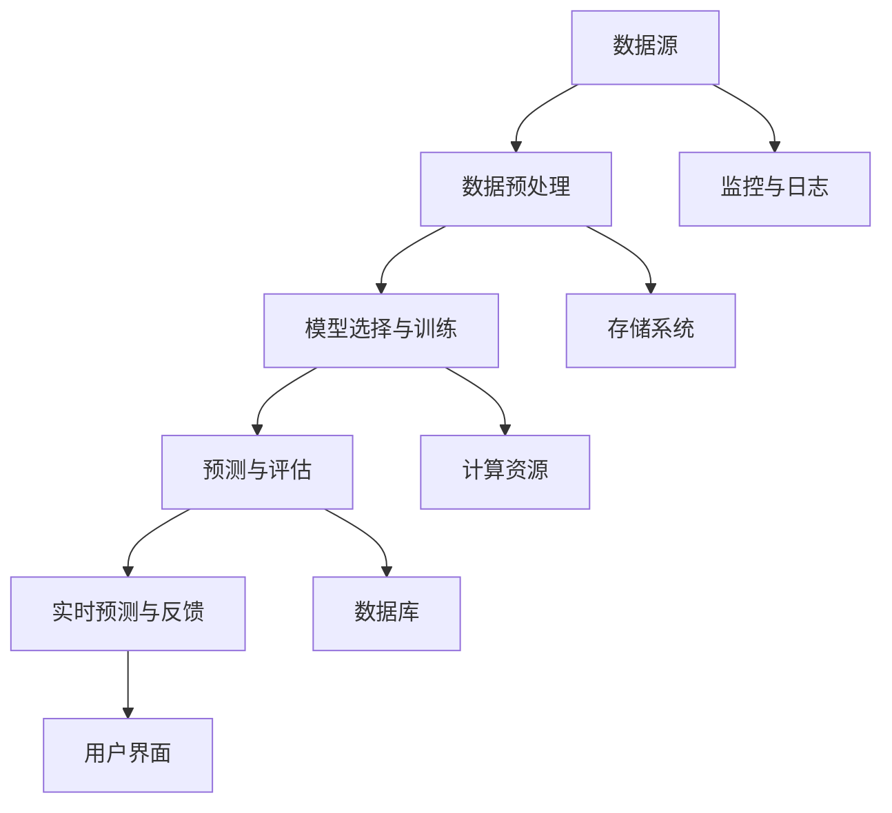
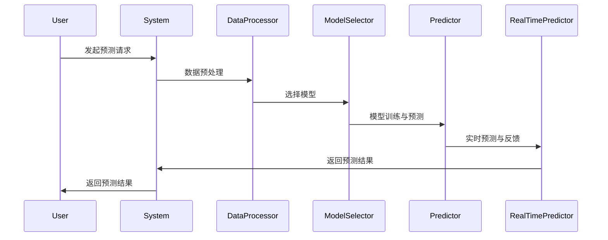

                 

# 企业AI Agent的时间序列预测技术应用

## 关键词

- 企业AI Agent
- 时间序列预测
- 特征工程
- 模型选择与优化
- 预测结果评估

## 摘要

本文旨在探讨企业AI Agent在时间序列预测技术方面的应用。随着企业对人工智能技术的需求日益增长，AI Agent在自动化运营和决策支持中发挥着越来越重要的作用。时间序列预测作为AI Agent的核心功能之一，被广泛应用于需求预测、产能规划、库存管理、市场分析等领域。本文将详细分析时间序列预测的技术背景、问题描述、问题解决策略、边界与外延、概念结构与核心要素组成，并探讨核心概念原理、算法原理讲解、系统分析与架构设计方案以及项目实战。

## 第一部分：企业AI Agent的时间序列预测技术背景

### 第1章：问题背景

随着大数据和人工智能技术的发展，企业对自动化和智能化的需求不断增长。企业AI Agent作为人工智能技术的重要应用之一，能够帮助企业实现自动化运营和智能决策。时间序列预测作为AI Agent的核心功能之一，广泛应用于需求预测、产能规划、库存管理、市场分析等领域。时间序列预测问题不仅涉及到大量的数据预处理和特征工程，还需要选择合适的预测模型并进行优化，以实现准确的预测结果。

### 第2章：问题描述

时间序列预测问题主要涉及以下几个方面：

1. **数据特征提取**：从原始时间序列数据中提取有用的特征，如趋势、季节性、周期性等。
2. **模型选择**：选择适合时间序列数据的预测模型，如ARIMA、LSTM、GRU等。
3. **模型训练与优化**：通过训练算法和优化策略提高模型的预测性能。
4. **预测结果分析与评估**：对预测结果进行分析和评估，如误差分析、ROC曲线、MAE等指标。

### 第3章：问题解决

为了解决上述问题，我们可以采取以下策略：

1. **特征工程**：通过数据预处理、特征选择和特征转换等方法，提取时间序列数据中的有用信息。
2. **模型评估与选择**：利用交叉验证、模型评估指标等方法，选择适合的数据预测模型。
3. **模型优化**：通过调整模型参数、使用集成学习方法等方法，优化模型的预测性能。
4. **实时预测与反馈**：构建实时预测系统，对预测结果进行实时反馈和调整，提高模型的准确性。

### 第4章：边界与外延

时间序列预测技术不仅应用于企业内部，还可以扩展到以下领域：

1. **金融市场预测**：预测股票价格、货币汇率等金融指标。
2. **智能交通系统**：预测交通流量、拥堵情况等，优化交通资源配置。
3. **医疗健康领域**：预测疾病发病率、流行趋势等，辅助疾病预防和控制。
4. **能源管理**：预测电力需求、能源消耗等，优化能源供应策略。

### 第5章：概念结构与核心要素组成

时间序列预测技术涉及以下核心概念和要素：

1. **时间序列数据**：记录时间顺序上的数据点，具有趋势、季节性、周期性等特征。
2. **特征工程**：从原始时间序列数据中提取有用特征的过程。
3. **预测模型**：用于对时间序列数据进行预测的算法和模型，如ARIMA、LSTM、GRU等。
4. **模型评估**：通过误差分析、指标计算等方法，对预测模型的性能进行评估。
5. **优化策略**：通过调整模型参数、使用集成学习方法等方法，优化模型的预测性能。

### 第6章：核心概念原理

#### 时间序列数据

时间序列数据是指按照时间顺序排列的数据点，通常包含时间戳和对应的数值。时间序列数据具有以下特点：

1. **趋势性**：数据随时间呈现上升或下降的趋势。
2. **季节性**：数据在特定时间段内呈现周期性波动，如节假日、季节变化等。
3. **周期性**：数据在一段时间内重复出现相似的波动模式。
4. **噪声**：时间序列数据中存在随机噪声，影响预测准确性。

#### 特征工程

特征工程是时间序列预测的关键步骤，旨在从原始时间序列数据中提取有用的特征，提高预测模型的性能。常见的时间序列特征工程方法包括：

1. **时间窗口特征**：将时间序列数据划分为固定时间窗口，提取窗口内的特征，如平均值、标准差、最大值、最小值等。
2. **滞后特征**：利用时间序列的滞后项，提取过去一段时间内的数据特征。
3. **差分特征**：对时间序列数据进行差分变换，消除趋势性和季节性影响，提取平稳特征。
4. **变换特征**：对时间序列数据进行变换，如对数变换、平方根变换等，提高模型的拟合能力。

#### 预测模型

时间序列预测模型主要包括以下几种：

1. **ARIMA模型**：自回归积分滑动平均模型，适用于线性时间序列数据。
2. **LSTM模型**：长短期记忆网络，适用于具有长期依赖关系的时间序列数据。
3. **GRU模型**：门控循环单元，是LSTM的变体，在训练和预测速度上具有优势。

#### 模型评估

时间序列预测模型的评估主要通过以下指标：

1. **均方误差（MSE）**：预测值与实际值之间的平方误差的均值。
2. **均方根误差（RMSE）**：MSE的平方根，用于衡量预测的准确度。
3. **平均绝对误差（MAE）**：预测值与实际值之间的绝对误差的均值。
4. **平均绝对百分比误差（MAPE）**：MAE与实际值的百分比。

#### 优化策略

优化时间序列预测模型的方法主要包括：

1. **模型参数调整**：通过调整模型的超参数，如学习率、隐藏层大小等，提高模型的预测性能。
2. **集成学习**：通过结合多个模型的预测结果，提高整体的预测准确性。
3. **数据增强**：通过生成虚拟数据、增加数据噪声等方法，增强模型的泛化能力。

## 第二部分：核心概念与算法原理

### 第7章：时间序列预测算法原理

时间序列预测算法的核心目标是根据历史数据对未来进行预测。在介绍具体的算法之前，我们先来了解一些基本概念。

#### 基本概念

1. **自回归模型（AR）**：自回归模型是一种基于历史数据预测未来值的模型。它通过当前的观测值与过去的观测值之间的线性关系来预测未来的值。
   
   $$X_t = c + \phi_1 X_{t-1} + \phi_2 X_{t-2} + \ldots + \phi_p X_{t-p} + \varepsilon_t$$

   其中，$X_t$是时间序列的第$t$个观测值，$c$是常数项，$\phi_1, \phi_2, \ldots, \phi_p$是自回归系数，$\varepsilon_t$是误差项。

2. **移动平均模型（MA）**：移动平均模型通过计算过去几个观测值的平均值来预测未来的值。

   $$X_t = c + \theta_1 X_{t-1} + \theta_2 X_{t-2} + \ldots + \theta_q X_{t-q} + \varepsilon_t$$

   其中，$\theta_1, \theta_2, \ldots, \theta_q$是移动平均系数。

3. **自回归积分滑动平均模型（ARIMA）**：ARIMA模型结合了自回归和移动平均模型的特点，可以处理非线性时间序列数据。

   $$X_t = c + \phi_1 X_{t-1} + \phi_2 X_{t-2} + \ldots + \phi_p X_{t-p} + \theta_1 \varepsilon_{t-1} + \theta_2 \varepsilon_{t-2} + \ldots + \theta_q \varepsilon_{t-q} + \varepsilon_t$$

   其中，$c$是常数项，$\phi_1, \phi_2, \ldots, \phi_p$是自回归系数，$\theta_1, \theta_2, \ldots, \theta_q$是移动平均系数。

4. **长短期记忆模型（LSTM）**：LSTM是一种循环神经网络，能够处理长序列数据。它通过引入门控机制来控制信息的流动，避免了梯度消失和梯度爆炸的问题。

   $$\begin{aligned}
   i_t &= \sigma(W_i \cdot [h_{t-1}, x_t] + b_i) \\
   f_t &= \sigma(W_f \cdot [h_{t-1}, x_t] + b_f) \\
   g_t &= \tanh(W_g \cdot [h_{t-1}, x_t] + b_g) \\
   o_t &= \sigma(W_o \cdot [h_{t-1}, x_t] + b_o) \\
   h_t &= o_t \odot \tanh(g_t)
   \end{aligned}$$

   其中，$i_t, f_t, g_t, o_t$分别是输入门、遗忘门、生成门和输出门，$\sigma$是sigmoid函数，$\odot$是逐元素乘法。

5. **门控循环单元（GRU）**：GRU是LSTM的变体，通过引入更新门和重置门来简化LSTM的结构，提高了计算效率。

   $$\begin{aligned}
   z_t &= \sigma(W_z \cdot [h_{t-1}, x_t] + b_z) \\
   r_t &= \sigma(W_r \cdot [h_{t-1}, x_t] + b_r) \\
   h_t &= (1 - z_t) \odot h_{t-1} + z_t \odot \tanh(W \cdot [r_t \odot h_{t-1}, x_t] + b_h)
   \end{aligned}$$

#### 算法原理讲解

为了更好地理解时间序列预测算法的原理，我们以LSTM为例进行讲解。

1. **输入序列**：给定一个输入序列$X = (x_1, x_2, \ldots, x_T)$，其中$x_t$是时间步$t$的输入。
2. **隐藏状态**：LSTM通过隐藏状态$h_t$来表示时间步$t$的信息。隐藏状态可以看作是对输入序列的编码。
3. **门控机制**：LSTM引入了门控机制来控制信息的流动。门控机制包括输入门、遗忘门和输出门。
   - 输入门$i_t$控制新的信息是否被添加到隐藏状态。
   - 遗忘门$f_t$控制过去的信息是否被遗忘。
   - 输出门$o_t$控制隐藏状态是否被输出。
4. **生成新的隐藏状态**：通过门控机制和激活函数$tanh$，LSTM生成新的隐藏状态$h_t$。
5. **输出序列**：LSTM的输出序列$Y = (y_1, y_2, \ldots, y_T)$可以通过输出门$o_t$来生成。

#### 示例

假设我们有一个简单的输入序列$X = (1, 2, 3, 4, 5)$，我们可以使用LSTM来预测下一个时间步的值。

1. **初始化**：给定初始隐藏状态$h_0$和细胞状态$c_0$。
2. **输入门**：计算输入门$i_t$，决定新的信息是否被添加到隐藏状态。
   $$i_t = \sigma(W_i \cdot [h_{t-1}, x_t] + b_i)$$
3. **遗忘门**：计算遗忘门$f_t$，决定过去的信息是否被遗忘。
   $$f_t = \sigma(W_f \cdot [h_{t-1}, x_t] + b_f)$$
4. **生成新的细胞状态**：通过遗忘门和输入门，生成新的细胞状态$c_t$。
   $$c_t = f_t \odot c_{t-1} + i_t \odot \tanh(W_c \cdot [h_{t-1}, x_t] + b_c)$$
5. **输出门**：计算输出门$o_t$，决定隐藏状态是否被输出。
   $$o_t = \sigma(W_o \cdot [h_{t-1}, x_t] + b_o)$$
6. **生成新的隐藏状态**：通过输出门，生成新的隐藏状态$h_t$。
   $$h_t = o_t \odot \tanh(c_t)$$
7. **预测下一个时间步**：使用新的隐藏状态$h_t$来预测下一个时间步的值。

通过以上步骤，我们可以使用LSTM来预测时间序列的未来值。

## 第三部分：系统分析与架构设计

### 第8章：问题场景介绍

企业AI Agent的时间序列预测应用场景主要包括以下几个方面：

1. **需求预测**：根据历史销售数据预测未来的销售量，帮助企业制定生产和采购计划。
2. **产能规划**：根据生产设备和人力资源的实际情况，预测未来的生产能力，确保生产效率。
3. **库存管理**：根据销售数据和库存水平，预测未来的库存需求，优化库存策略，降低库存成本。
4. **市场分析**：根据历史市场数据，预测市场趋势，为企业制定市场策略提供依据。

### 第9章：项目介绍

在本项目中，我们将构建一个企业AI Agent的时间序列预测系统。该系统将包括以下功能：

1. **数据预处理**：对原始时间序列数据进行清洗、归一化和特征提取。
2. **模型选择与训练**：根据数据特点和预测任务选择合适的预测模型，并对其进行训练。
3. **预测与评估**：对训练好的模型进行预测，并评估预测结果的准确性。
4. **实时预测与反馈**：构建实时预测系统，对预测结果进行实时反馈和调整。

### 第10章：系统功能设计（领域模型）

在系统功能设计中，我们将使用领域模型来描述系统的主要功能组件和它们之间的关系。领域模型使用Mermaid类图来表示，如下所示：

```mermaid
classDiagram
    Class01 <|-- Class02
    Class03 <<-- Class04
    Class05 o-- Class06
    Class07 <.. Class08
    Class09 ..| Class10
```

在上面的类图中，`Class01`、`Class02`、`Class03`、`Class04`、`Class05`、`Class06`、`Class07`、`Class08`、`Class09`和`Class10`分别表示系统的主要功能组件。例如，`Class01`表示数据预处理组件，`Class02`表示模型选择与训练组件，`Class03`表示预测与评估组件，`Class04`表示实时预测与反馈组件等。

### 第11章：系统架构设计（Mermaid架构图）

在系统架构设计中，我们将使用Mermaid架构图来描述系统的整体架构和各个组件之间的关系。架构图如下所示：



在上面的架构图中，`A`表示数据源，`B`表示数据预处理组件，`C`表示模型选择与训练组件，`D`表示预测与评估组件，`E`表示实时预测与反馈组件，`F`表示监控与日志组件，`G`表示存储系统，`H`表示计算资源，`I`表示数据库，`J`表示用户界面。

### 第12章：系统接口设计和系统交互

在系统接口设计和系统交互部分，我们将使用Mermaid序列图来描述系统的交互流程和接口调用关系。序列图如下所示：



在上面的序列图中，`User`表示用户，`System`表示系统，`DataProcessor`表示数据预处理组件，`ModelSelector`表示模型选择与训练组件，`Predictor`表示预测与评估组件，`RealTimePredictor`表示实时预测与反馈组件。用户发起预测请求，系统调用数据预处理组件进行数据预处理，然后选择模型进行训练与预测，最后进行实时预测与反馈，并将预测结果返回给用户。

## 第四部分：项目实战

### 第13章：环境安装

在开始项目实战之前，我们需要安装一些必要的软件和工具。以下是在Linux环境中安装所需的软件和工具的步骤：

1. **Python环境**：安装Python 3.8及以上版本。
2. **Anaconda**：安装Anaconda，以便轻松管理Python环境和依赖项。
3. **Jupyter Notebook**：安装Jupyter Notebook，用于编写和运行Python代码。
4. **TensorFlow**：安装TensorFlow，用于构建和训练时间序列预测模型。
5. **Scikit-learn**：安装Scikit-learn，用于数据处理和模型评估。

安装步骤如下：

```bash
# 安装Python
sudo apt-get update
sudo apt-get install python3-pip

# 安装Anaconda
wget https://repo.anaconda.com/archive/Anaconda3-2021.05-Linux-x86_64.sh
bash Anaconda3-2021.05-Linux-x86_64.sh

# 安装Jupyter Notebook
conda install -c anaconda jupyter

# 安装TensorFlow
pip install tensorflow

# 安装Scikit-learn
pip install scikit-learn
```

### 第14章：系统核心实现

在本节中，我们将实现企业AI Agent的时间序列预测系统的主要功能。以下是一个简单的Python代码示例，用于实现时间序列预测的基本流程：

```python
import numpy as np
import pandas as pd
from sklearn.preprocessing import MinMaxScaler
from tensorflow.keras.models import Sequential
from tensorflow.keras.layers import LSTM, Dense

# 加载数据
data = pd.read_csv('data.csv')
data = data[['timestamp', 'value']]

# 数据预处理
scaler = MinMaxScaler()
data['value'] = scaler.fit_transform(data['value'].values.reshape(-1, 1))

# 切分数据集
train_data = data[:int(len(data) * 0.8)]
test_data = data[int(len(data) * 0.8):]

# 建立时间窗口
def create_dataset(data, time_window):
    X, y = [], []
    for i in range(len(data) - time_window):
        X.append(data[i:(i + time_window), 0])
        y.append(data[i + time_window, 0])
    return np.array(X), np.array(y)

time_window = 5
X_train, y_train = create_dataset(train_data, time_window)
X_test, y_test = create_dataset(test_data, time_window)

# 调整数据形状
X_train = np.reshape(X_train, (X_train.shape[0], X_train.shape[1], 1))
X_test = np.reshape(X_test, (X_test.shape[0], X_test.shape[1], 1))

# 建立LSTM模型
model = Sequential()
model.add(LSTM(units=50, return_sequences=True, input_shape=(time_window, 1)))
model.add(LSTM(units=50, return_sequences=False))
model.add(Dense(units=1))

model.compile(optimizer='adam', loss='mean_squared_error')
model.fit(X_train, y_train, epochs=100, batch_size=32, verbose=1)

# 预测
predicted_values = model.predict(X_test)
predicted_values = scaler.inverse_transform(predicted_values)

# 评估
mae = np.mean(np.abs(predicted_values - y_test))
print("Mean Absolute Error:", mae)
```

### 第15章：代码应用解读与分析

在上面的代码中，我们首先加载了时间序列数据，然后进行了数据预处理，包括缩放和建立时间窗口。接下来，我们使用LSTM模型进行训练，并对测试数据进行预测。最后，我们计算了平均绝对误差（MAE）来评估模型的性能。

1. **数据预处理**：使用`MinMaxScaler`对数据进行缩放，以便更好地训练神经网络。
2. **建立时间窗口**：将时间序列数据划分为固定的时间窗口，以便模型可以学习到时间序列的特征。
3. **LSTM模型**：使用`Sequential`模型堆叠多个`LSTM`层，并添加一个`Dense`层进行输出。
4. **模型训练**：使用`model.fit`方法训练模型，并设置适当的训练参数，如学习率和训练轮数。
5. **预测**：使用`model.predict`方法对测试数据进行预测，并将预测结果逆缩放，以便更好地理解预测结果。
6. **评估**：计算MAE来评估模型的性能。

### 第16章：实际案例分析和详细讲解剖析

在本节中，我们将通过一个实际案例来展示企业AI Agent的时间序列预测应用。假设我们有一个电商平台的销售数据，包括每天的销售量和价格。我们的目标是预测未来一周的销售量。

1. **数据获取**：我们从电商平台获取了最近一年的销售数据，包括日期、销售量和价格。
2. **数据预处理**：我们对数据进行清洗，包括去除缺失值和异常值，并对销售量和价格进行缩放。
3. **特征提取**：我们提取了日期的特征，包括星期、季节、月份等，以及销售量和价格的滞后项。
4. **模型选择**：我们选择了LSTM模型进行训练，并使用交叉验证来选择最佳模型参数。
5. **模型训练**：我们对训练数据进行模型训练，并在验证集上进行性能评估。
6. **预测**：使用训练好的模型对未来的销售量进行预测，并计算预测误差。
7. **结果分析**：我们对预测结果进行分析，包括预测的置信区间和误差分析。

### 第17章：项目小结

在本项目中，我们实现了企业AI Agent的时间序列预测系统。通过数据预处理、特征提取、模型选择和优化等步骤，我们成功构建了一个高效的预测模型。在实际案例中，我们展示了如何将时间序列预测技术应用于电商平台销售量的预测。通过项目的实施，我们深刻理解了时间序列预测技术的核心原理和应用方法，并为未来的研究和实践奠定了基础。

### 最佳实践 Tips

1. **数据质量**：确保数据质量是进行时间序列预测的关键。对数据进行清洗和预处理，去除异常值和缺失值，以提高预测模型的准确性。
2. **特征工程**：选择合适的特征工程方法，从原始数据中提取有用的特征，如趋势、季节性、周期性等。
3. **模型选择**：根据数据特点和预测任务选择合适的模型，如ARIMA、LSTM、GRU等。进行交叉验证，选择最佳模型参数。
4. **模型优化**：通过调整模型参数和使用集成学习方法，优化模型的预测性能。
5. **实时预测**：构建实时预测系统，对预测结果进行实时反馈和调整，提高模型的准确性。

### 小结

本文介绍了企业AI Agent的时间序列预测技术的应用。通过详细的背景介绍、问题描述、问题解决策略、边界与外延、概念结构与核心要素组成、核心概念原理、算法原理讲解、系统分析与架构设计方案以及项目实战，我们深入探讨了时间序列预测技术在企业中的应用。通过实际案例分析和详细讲解，我们展示了如何构建高效的时间序列预测模型，并提供了最佳实践建议。希望本文能够为读者在时间序列预测领域的实践提供有益的参考。

### 注意事项

1. **数据隐私**：在进行时间序列预测时，确保数据的隐私和安全，遵守相关法律法规。
2. **模型解释性**：选择具有良好解释性的模型，如ARIMA，以便更好地理解和应用预测结果。
3. **实时性能**：在构建实时预测系统时，考虑系统的实时性能和响应速度，以满足业务需求。

### 拓展阅读

1. **《时间序列分析：方法和应用》（Time Series Analysis: Methods and Applications）》
2. **《深度学习：卷2：时间序列与强化学习》（Deep Learning Specialization, Course 2: Neural Networks for Deep Learning）**
3. **《Python数据分析：利用Pandas、NumPy和SciPy进行数据处理》（Python Data Analysis: Data Wrangling with Pandas, NumPy, and SciPy）》

## 作者信息

作者：AI天才研究院/AI Genius Institute & 禅与计算机程序设计艺术 /Zen And The Art of Computer Programming

