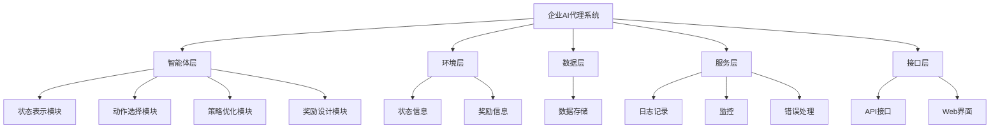
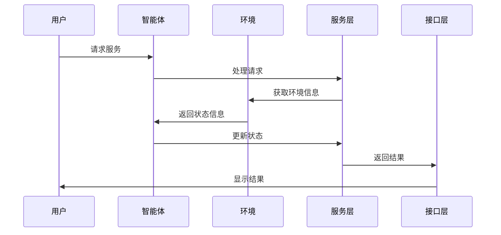

                 

# 《企业AI Agent的深度强化学习应用：复杂决策优化》

## 关键词

- 深度强化学习
- 企业AI Agent
- 复杂决策优化
- 算法原理
- 数学模型
- 系统架构
- 项目实战

## 摘要

本文旨在探讨深度强化学习在企业AI代理中的应用，特别是如何通过深度强化学习优化复杂决策。文章首先介绍了深度强化学习的基本概念及其在企业AI中的应用背景。接着，详细阐述了深度强化学习的基础理论和算法原理，包括Q-learning和Deep Q-Network（DQN）算法。随后，文章探讨了深度强化学习在复杂决策环境建模和决策优化中的应用，并通过具体的数学模型和公式进行了深入讲解。文章进一步介绍了深度强化学习在企业AI代理系统架构设计中的实现方法，并通过实际项目案例展示了深度强化学习在企业决策优化中的具体应用。最后，文章总结了深度强化学习在企业AI中的应用最佳实践，并给出了未来研究方向和拓展。

## 目录大纲设计思路

### 设计思路

在设计《企业AI Agent的深度强化学习应用：复杂决策优化》的目录大纲时，我们首先明确了书籍的核心主题——深度强化学习在企业AI代理中的应用，并围绕这一主题展开。目录大纲的设计需要系统、全面地覆盖从基础理论到应用实践的各个方面，以确保读者能够全面、深入地理解并掌握相关知识。

### 目录大纲

**第一部分：背景与基础理论**

**第1章：问题背景与概述**

- **1.1 企业AI与深度强化学习概述**
  - **1.1.1 企业AI的重要性**
  - **1.1.2 深度强化学习的基本概念**
  - **1.1.3 深度强化学习在企业AI中的应用**

- **1.2 复杂决策优化问题**
  - **1.2.1 复杂决策的定义**
  - **1.2.2 复杂决策的特点**
  - **1.2.3 复杂决策的挑战**

**第2章：深度强化学习基础**

- **2.1 深度强化学习的基本原理**
  - **2.1.1 强化学习的基本概念**
  - **2.1.2 深度强化学习的基本框架**
  - **2.1.3 深度Q网络（DQN）算法**

- **2.2 算法原理与数学模型**
  - **2.2.1 Q-learning算法**
  - **2.2.2 Deep Q-Network（DQN）算法**
  - **2.2.3 数学模型与公式**

**第3章：深度强化学习在复杂决策中的应用**

- **3.1 复杂决策环境建模**
  - **3.1.1 环境建模的基本方法**
  - **3.1.2 环境建模的挑战**
  - **3.1.3 环境建模案例分析**

- **3.2 深度强化学习算法应用**
  - **3.2.1 DQN算法在企业AI中的应用**
  - **3.2.2 其他深度强化学习算法的应用**
  - **3.2.3 深度强化学习算法的比较**

**第二部分：深度强化学习在企业AI代理中的实现**

**第4章：深度强化学习在企业AI代理中的实现**

- **4.1 企业AI代理的基本原理**
  - **4.1.1 企业AI代理的定义**
  - **4.1.2 企业AI代理的基本结构**
  - **4.1.3 企业AI代理的功能**

- **4.2 深度强化学习在AI代理中的应用**
  - **4.2.1 深度强化学习在AI代理中的实现**
  - **4.2.2 AI代理的架构设计**
  - **4.2.3 AI代理的性能优化**

**第5章：案例分析与实战**

- **5.1 案例介绍**
  - **5.1.1 案例背景**
  - **5.1.2 案例目标**
  - **5.1.3 案例数据集**

- **5.2 实现步骤**
  - **5.2.1 数据预处理**
  - **5.2.2 模型设计与训练**
  - **5.2.3 模型评估与优化**
  - **5.2.4 实战案例分析**

**第三部分：最佳实践与总结**

**第6章：最佳实践与总结**

- **6.1 深度强化学习在企业AI中的最佳实践**
  - **6.1.1 实践经验总结**
  - **6.1.2 避免常见问题的方法**
  - **6.1.3 持续改进的方向**

- **6.2 小结**
  - **6.2.1 书籍内容回顾**
  - **6.2.2 读者收获与展望**

通过以上目录大纲的设计，读者可以系统地了解深度强化学习在企业AI代理中的应用，掌握复杂决策优化的方法，并通过实际案例学习如何将这些理论应用于企业中。每个章节都包含了必要的基础理论讲解、应用实例分析以及实践技巧，旨在为读者提供全面、深入的学习体验。

### 目录大纲设计思路

在设计《企业AI Agent的深度强化学习应用：复杂决策优化》的目录大纲时，我们首先明确了书籍的核心主题——深度强化学习在企业AI代理中的应用，并围绕这一主题展开。目录大纲的设计需要系统、全面地覆盖从基础理论到应用实践的各个方面，以确保读者能够全面、深入地理解并掌握相关知识。

### 目录大纲

**第一部分：背景与基础理论**

**第1章：问题背景与概述**

- **1.1 企业AI与深度强化学习概述**
  - **1.1.1 企业AI的重要性**
  - **1.1.2 深度强化学习的基本概念**
  - **1.1.3 深度强化学习在企业AI中的应用**

- **1.2 复杂决策优化问题**
  - **1.2.1 复杂决策的定义**
  - **1.2.2 复杂决策的特点**
  - **1.2.3 复杂决策的挑战**

**第2章：深度强化学习基础**

- **2.1 深度强化学习的基本原理**
  - **2.1.1 强化学习的基本概念**
  - **2.1.2 深度强化学习的基本框架**
  - **2.1.3 深度Q网络（DQN）算法**

- **2.2 算法原理与数学模型**

**第二部分：深度强化学习在复杂决策中的应用**

**第3章：深度强化学习在复杂决策中的应用**

- **3.1 复杂决策环境建模**
  - **3.1.1 环境建模的基本方法**
  - **3.1.2 环境建模的挑战**
  - **3.1.3 环境建模案例分析**

- **3.2 深度强化学习算法应用**
  - **3.2.1 DQN算法在企业AI中的应用**
  - **3.2.2 其他深度强化学习算法的应用**
  - **3.2.3 深度强化学习算法的比较**

**第三部分：深度强化学习在企业AI代理中的实现**

**第4章：深度强化学习在企业AI代理中的实现**

- **4.1 企业AI代理的基本原理**
  - **4.1.1 企业AI代理的定义**
  - **4.1.2 企业AI代理的基本结构**
  - **4.1.3 企业AI代理的功能**

- **4.2 深度强化学习在AI代理中的应用**
  - **4.2.1 深度强化学习在AI代理中的实现**
  - **4.2.2 AI代理的架构设计**
  - **4.2.3 AI代理的性能优化**

**第四部分：案例分析与实战**

**第5章：案例分析与实战**

- **5.1 案例介绍**
  - **5.1.1 案例背景**
  - **5.1.2 案例目标**
  - **5.1.3 案例数据集**

- **5.2 实现步骤**
  - **5.2.1 数据预处理**
  - **5.2.2 模型设计与训练**
  - **5.2.3 模型评估与优化**
  - **5.2.4 实战案例分析**

**第五部分：最佳实践与总结**

**第6章：最佳实践与总结**

- **6.1 深度强化学习在企业AI中的最佳实践**
  - **6.1.1 实践经验总结**
  - **6.1.2 避免常见问题的方法**
  - **6.1.3 持续改进的方向**

- **6.2 小结**
  - **6.2.1 书籍内容回顾**
  - **6.2.2 读者收获与展望**

通过以上目录大纲的设计，读者可以系统地了解深度强化学习在企业AI代理中的应用，掌握复杂决策优化的方法，并通过实际案例学习如何将这些理论应用于企业中。每个章节都包含了必要的基础理论讲解、应用实例分析以及实践技巧，旨在为读者提供全面、深入的学习体验。

## 第一部分：背景与基础理论

### 第1章：问题背景与概述

#### 1.1 企业AI与深度强化学习概述

在当今快速发展的商业环境中，企业需要快速适应不断变化的市场需求和竞争压力。传统的人工决策方法已经无法满足日益复杂的商业环境需求，因此，越来越多的企业开始将人工智能（AI）技术应用于业务决策和运营优化中。企业AI是指利用人工智能技术，特别是机器学习和深度学习算法，为企业提供智能化的决策支持和运营优化解决方案。

深度强化学习（Deep Reinforcement Learning，DRL）是强化学习（Reinforcement Learning，RL）的一个重要分支，结合了深度学习的强大表示能力和强化学习的动态决策能力。它通过模拟智能体在环境中的交互过程，不断优化决策策略，从而实现复杂的任务学习。

企业AI和深度强化学习的结合，为企业提供了一种全新的决策优化方法。通过深度强化学习，企业可以在复杂的业务环境中自动发现最优策略，实现资源的最优配置和业务流程的最优化。例如，在供应链管理中，深度强化学习可以帮助企业根据市场需求动态调整库存策略，优化供应链流程；在金融领域，深度强化学习可以用于交易策略的优化，提高投资回报率。

#### 1.2 复杂决策优化问题

复杂决策优化是企业AI面临的重大挑战之一。复杂决策通常涉及到多个变量、不确定性和动态性，需要智能体在多个维度上做出决策。以下是一些典型的复杂决策优化问题：

1. **供应链管理**：在供应链管理中，企业需要优化库存、运输和订单管理，以满足市场需求的同时降低成本。这涉及到库存水平、运输路线、订单优先级等多个变量的决策。

2. **生产调度**：生产调度是一个涉及多个生产任务、设备能力和时间安排的复杂问题。如何合理分配生产任务，优化生产流程，提高生产效率，是生产调度中需要解决的问题。

3. **资源分配**：在资源有限的条件下，如何分配资源以最大化收益或最小化成本，是一个典型的复杂决策优化问题。例如，在云计算环境中，如何根据用户需求动态调整资源分配，优化资源利用率。

4. **市场营销**：市场营销涉及到产品定价、促销策略、广告投放等多个方面。如何根据市场环境动态调整营销策略，提高市场份额和销售额，是市场营销中需要解决的问题。

复杂决策优化问题的特点包括：

1. **多维度决策**：需要考虑多个变量和指标，如成本、收益、时间等。

2. **不确定性**：决策过程中存在不确定性，如市场需求波动、供应风险等。

3. **动态性**：决策环境是动态变化的，需要智能体实时调整策略。

4. **计算复杂性**：求解复杂决策优化问题通常需要大量的计算资源。

#### 1.3 复杂决策优化的挑战

尽管深度强化学习为企业提供了优化复杂决策的潜力，但在实际应用中仍然面临着一系列挑战：

1. **数据质量和规模**：深度强化学习依赖于大量高质量的数据进行训练。然而，许多企业面临数据缺失、数据质量不高和数据隐私保护等问题。

2. **算法选择和优化**：深度强化学习算法众多，如何选择适合具体问题的算法，以及如何优化算法性能，是一个重要挑战。

3. **可解释性和透明度**：深度强化学习模型往往具有“黑箱”特性，缺乏可解释性。如何提高模型的透明度，使其决策过程可解释，是企业AI应用中需要解决的问题。

4. **模型泛化能力**：深度强化学习模型需要具备良好的泛化能力，以应对不同业务场景和动态变化。

5. **计算资源需求**：深度强化学习通常需要大量的计算资源，包括CPU、GPU和存储等。

#### 1.4 本书结构

本书将围绕深度强化学习在企业AI代理中的应用，系统地介绍复杂决策优化的方法。全书分为五个部分，具体结构如下：

1. **背景与基础理论**：介绍企业AI与深度强化学习的背景、基本概念和复杂决策优化问题。
2. **核心概念与原理**：详细阐述深度强化学习的基础理论、算法原理和数学模型。
3. **系统架构与设计**：介绍深度强化学习在企业AI代理系统中的架构设计和实现方法。
4. **项目实战与案例分析**：通过实际项目案例，展示深度强化学习在复杂决策优化中的应用。
5. **最佳实践与总结**：总结深度强化学习在企业AI中的最佳实践，展望未来研究方向。

通过以上结构，本书旨在为读者提供全面、深入的学习体验，帮助读者掌握深度强化学习在企业AI代理中的应用方法，实现复杂决策的优化。

### 第2章：深度强化学习基础

#### 2.1 深度强化学习的基本原理

深度强化学习（Deep Reinforcement Learning，DRL）是强化学习（Reinforcement Learning，RL）的一个重要分支，它结合了深度学习的表示能力和强化学习的动态决策能力。强化学习是一种通过与环境交互来学习最优策略的机器学习方法，其核心思想是通过奖励信号来指导智能体（Agent）的行为。

在强化学习中，智能体通过执行一系列动作（Action）来与环境（Environment）交互。环境根据智能体的动作产生一个状态（State）和一个奖励（Reward），智能体根据当前状态和奖励来更新其策略（Policy）。这一过程不断重复，智能体通过学习和优化策略，最终实现最大化累积奖励。

深度强化学习在传统强化学习的基础上引入了深度神经网络（Deep Neural Network，DNN），用于表示状态和动作的价值函数（Value Function）或策略（Policy）。深度神经网络可以自动学习复杂的特征表示，从而提高智能体的决策能力。

DRL的基本框架包括以下几个主要组成部分：

1. **智能体（Agent）**：执行动作的主体，可以是机器人、软件程序等。
2. **环境（Environment）**：智能体所处的环境，可以模拟为游戏、仿真系统等。
3. **状态（State）**：智能体当前所处的环境状态。
4. **动作（Action）**：智能体可以执行的动作。
5. **奖励（Reward）**：环境对智能体动作的反馈，通常用于评估智能体的决策质量。
6. **策略（Policy）**：智能体的决策规则，用于确定在给定状态下应该执行哪个动作。
7. **价值函数（Value Function）**：评估智能体在给定状态下的长期奖励，用于指导策略的优化。
8. **模型（Model）**：用于预测环境状态转移和奖励的模型。

DRL通过以下步骤实现智能体的学习：

1. **初始化**：初始化智能体的参数，包括策略、价值函数和模型。
2. **执行动作**：根据当前状态和策略选择一个动作。
3. **与环境交互**：执行动作后，环境根据动作产生新的状态和奖励。
4. **更新策略**：利用新的状态和奖励信息更新策略和价值函数。
5. **重复过程**：重复执行动作、与环境交互和更新策略的过程，直到达到目标或满足停止条件。

#### 2.2 深度Q网络（DQN）算法

深度Q网络（Deep Q-Network，DQN）是DRL中最常用的算法之一，它通过深度神经网络来近似Q函数，即评估智能体在给定状态下执行某个动作的预期奖励。DQN的主要优势在于其简单性和有效性，它能够处理高维的状态空间和动作空间。

DQN的核心思想是使用经验回放（Experience Replay）和目标网络（Target Network）来稳定训练过程。经验回放将智能体在训练过程中经历的状态、动作、奖励和下一个状态存储在一个经验池中，然后在训练时随机从中抽样，避免数据偏差。目标网络是一个独立的神经网络，用于计算目标Q值，它每隔一段时间与主网络同步，确保Q值的稳定性。

DQN的算法步骤如下：

1. **初始化**：初始化智能体参数、经验池、目标网络和损失函数。
2. **执行动作**：根据当前状态和策略选择一个动作。
3. **与环境交互**：执行动作后，环境根据动作产生新的状态和奖励。
4. **存储经验**：将当前状态、动作、奖励和下一个状态存储在经验池中。
5. **选择样本**：从经验池中随机选择一批样本。
6. **计算目标Q值**：根据下一个状态和奖励计算目标Q值。
7. **更新Q值**：利用选择样本和目标Q值更新当前状态的Q值。
8. **更新策略**：根据更新后的Q值更新策略。
9. **同步目标网络**：将主网络的参数同步到目标网络。

DQN的数学模型如下：

$$ Q(s, a) = \sum_{a'} \gamma \cdot P(a'|s) \cdot [R(s, a) + \max_{a'} Q(s', a')] $$

其中，$Q(s, a)$ 是在状态 $s$ 下执行动作 $a$ 的预期奖励，$\gamma$ 是折扣因子，用于平衡当前奖励和未来奖励的重要性，$P(a'|s)$ 是在状态 $s$ 下执行动作 $a'$ 的概率，$R(s, a)$ 是执行动作 $a$ 在状态 $s$ 下获得的即时奖励，$s'$ 是执行动作 $a$ 后的新状态。

#### 2.3 深度强化学习的优势与挑战

深度强化学习的优势主要体现在以下几个方面：

1. **强大的特征表示能力**：深度神经网络可以自动学习状态和动作的高层次特征表示，从而提高智能体的决策能力。
2. **适用于复杂环境**：深度强化学习可以处理高维状态空间和动作空间，适用于复杂、动态的环境。
3. **自适应能力**：智能体可以自适应地调整策略，以适应环境的变化。
4. **多任务学习**：通过迁移学习和经验共享，深度强化学习可以学习多个任务，提高智能体的泛化能力。

然而，深度强化学习也面临一些挑战：

1. **数据需求量大**：深度强化学习需要大量高质量的数据进行训练，这对数据质量和数据量都有较高的要求。
2. **训练不稳定**：深度强化学习的训练过程容易受到噪声和探索策略的影响，导致训练不稳定。
3. **可解释性差**：深度强化学习模型通常具有“黑箱”特性，其决策过程缺乏可解释性。
4. **计算资源需求高**：深度强化学习需要大量的计算资源，特别是训练过程中需要大量的计算资源和存储空间。

### 第3章：深度强化学习在复杂决策中的应用

#### 3.1 复杂决策环境建模

在深度强化学习应用中，环境建模是关键的一步。复杂决策环境通常包含多个变量、不确定性和动态性，需要智能体在多个维度上做出决策。有效的环境建模可以简化问题的复杂性，提高智能体的学习效率和决策质量。

环境建模的基本方法包括以下几个方面：

1. **状态表示**：状态是智能体在环境中的位置和特征。状态表示方法包括离散表示和连续表示。离散表示将状态映射到一组离散值，如整数或字符串；连续表示将状态映射到实数区间。例如，在游戏环境中，可以使用棋盘上的格子位置来表示状态。

2. **动作表示**：动作是智能体可以执行的行为。动作表示方法包括离散动作和连续动作。离散动作是有限的选择，如走一步、攻击等；连续动作是实数范围内的值，如移动速度、旋转角度等。例如，在自动驾驶环境中，可以使用加速、减速、转向等动作来表示。

3. **奖励机制**：奖励是环境对智能体动作的反馈，用于指导智能体的决策。奖励机制的设计需要考虑到问题的目标、策略的优化方向和探索与利用的平衡。奖励可以设置为即时奖励或累积奖励，即时奖励是每次动作后立即获得的奖励，累积奖励是整个决策过程结束后获得的奖励。

4. **不确定性建模**：复杂决策环境通常存在不确定性，如市场需求波动、供应风险等。不确定性建模可以通过概率分布或随机过程来表示。例如，在供应链管理中，可以采用概率分布来描述市场需求的不确定性。

#### 3.2 复杂决策环境建模的挑战

尽管深度强化学习在复杂决策环境中有很大的应用潜力，但环境建模仍然面临一些挑战：

1. **状态空间和动作空间的高维性**：复杂决策环境通常具有高维的状态空间和动作空间，这增加了智能体的学习难度和计算复杂度。

2. **状态观测的局限性**：智能体在执行动作时只能观测到当前状态，无法直接观测到未来的状态和奖励，这限制了智能体的学习效果。

3. **奖励机制的设定**：奖励机制的设定需要考虑问题的目标、策略的优化方向和探索与利用的平衡。不合理的奖励机制可能导致智能体陷入局部最优或过度探索。

4. **环境的不确定性**：复杂决策环境通常存在不确定性，如市场需求波动、供应风险等。如何建模和处理不确定性是深度强化学习应用中的一个重要问题。

#### 3.3 环境建模案例分析

下面通过一个实际案例来说明复杂决策环境建模的方法和步骤。

**案例背景**：一个电子商务平台希望利用深度强化学习优化其库存管理策略，以最大化收益。平台上的商品种类繁多，市场需求波动大，库存管理面临复杂性和不确定性。

**环境建模步骤**：

1. **状态表示**：状态包括当前库存水平、历史销售数据、当前市场需求等。可以使用一组离散值来表示状态，例如，将库存水平分为几个等级，将历史销售数据编码为二进制数。

2. **动作表示**：动作是调整库存水平的操作，例如，增加库存、减少库存或保持当前库存水平。可以使用一组离散值来表示动作，例如，定义增加库存为1，减少库存为-1，保持当前库存为0。

3. **奖励机制**：奖励是销售收益减去库存成本。为了平衡短期收益和长期收益，可以设置累积奖励，即每一步的奖励乘以折扣因子。例如，如果当前库存水平低于市场需求，则奖励为正，否则为负。

4. **不确定性建模**：市场需求存在不确定性，可以采用概率分布来描述不确定性。例如，使用正态分布来表示未来一天的市场需求，均值表示预测值，方差表示不确定程度。

**环境建模示例**：

状态空间：$S = \{ (i_1, i_2, \ldots, i_n), i_j \in \{0, 1, \ldots, M_j\} \}$

动作空间：$A = \{ -1, 0, 1 \}$

奖励函数：$R(s, a) = \sum_{t=1}^T (r_t - c_t) \cdot \gamma^{t-1}$

其中，$T$ 是决策步数，$r_t$ 是在第 $t$ 步的销售收益，$c_t$ 是在第 $t$ 步的库存成本，$\gamma$ 是折扣因子。

通过以上环境建模，电子商务平台可以使用深度强化学习来优化库存管理策略，实现收益的最大化。

#### 3.4 深度强化学习算法在企业AI中的应用

深度强化学习在复杂决策中的应用主要通过以下几种算法实现：

1. **深度Q网络（DQN）**：DQN是最常用的深度强化学习算法之一，它通过深度神经网络来近似Q函数，优化智能体的策略。DQN通过经验回放和目标网络来稳定训练过程，适用于处理高维状态空间和动作空间的问题。

2. **策略梯度方法**：策略梯度方法通过直接优化策略的梯度来更新策略。其中，代表性的算法包括REINFORCE和PPO（Proximal Policy Optimization）。策略梯度方法适用于策略的表达式较简单的情况，但在高维状态空间中效果较差。

3. **深度确定性策略梯度（DDPG）**：DDPG是另一种常用的深度强化学习算法，它通过深度神经网络来近似价值函数和策略。DDPG适用于处理连续动作空间的问题，并在某些实验中表现出良好的性能。

4. **深度策略优化（DPO）**：DPO是一种基于策略梯度的深度强化学习算法，它通过优化策略的梯度来更新策略。DPO在处理连续动作空间时表现出良好的性能，并且具有较快的收敛速度。

在复杂决策优化中，深度强化学习算法的选择取决于具体问题的特点和应用场景。以下是一些选择深度强化学习算法的考虑因素：

1. **状态空间和动作空间的维度**：如果状态空间和动作空间的维度较高，DQN和DDPG等算法可能更适用，因为它们可以处理高维数据。

2. **决策的连续性**：如果决策是连续的，如自动驾驶、机器人控制等，DDPG和DPO等算法可能更适用，因为它们可以处理连续动作。

3. **数据质量和数量**：如果数据质量较高且数据量较大，DQN和DDPG等算法可能更容易收敛，因为它们需要大量的数据来学习状态和动作的特征。

4. **计算资源**：如果计算资源有限，策略梯度方法可能更适用，因为它们通常需要较少的计算资源。

#### 3.5 深度强化学习算法的比较

以下是几种常见的深度强化学习算法的比较：

| 算法 | 状态空间维度 | 动作空间维度 | 优点 | 缺点 |
| --- | --- | --- | --- | --- |
| DQN | 高 | 高 | 简单，容易实现 | 易过估计，需要大量数据 |
| DDPG | 高 | 连续 | 处理连续动作空间，自适应能力强 | 训练不稳定，需要大量数据 |
| PPO | 高 | 高 | 收敛速度快，性能稳定 | 需要大量计算资源 |
| DPO | 高 | 连续 | 收敛速度快，性能稳定 | 需要大量计算资源 |

通过以上比较，可以看出每种算法都有其适用的场景和优点，选择合适的算法需要根据具体问题的特点和应用需求进行权衡。

#### 3.6 深度强化学习在复杂决策优化中的应用实例

以下是一个深度强化学习在复杂决策优化中的应用实例，展示了如何使用深度强化学习算法优化库存管理策略。

**实例背景**：某电子商务平台希望利用深度强化学习优化其库存管理策略，以最大化收益。平台上的商品种类繁多，市场需求波动大，库存管理面临复杂性和不确定性。

**算法选择**：选择DQN算法作为库存管理策略优化的算法，因为DQN适用于处理高维状态空间和动作空间的问题。

**环境建模**：

1. **状态表示**：状态包括当前库存水平、历史销售数据、当前市场需求等。使用一组离散值来表示状态，例如，将库存水平分为5个等级，将历史销售数据编码为二进制数。

2. **动作表示**：动作是调整库存水平的操作，例如，增加库存、减少库存或保持当前库存水平。使用一组离散值来表示动作，例如，定义增加库存为1，减少库存为-1，保持当前库存为0。

3. **奖励机制**：奖励是销售收益减去库存成本。为了平衡短期收益和长期收益，设置累积奖励，即每一步的奖励乘以折扣因子。例如，如果当前库存水平低于市场需求，则奖励为正，否则为负。

**算法实现**：

1. **初始化**：初始化DQN算法的参数，包括学习率、折扣因子、经验池大小等。

2. **执行动作**：根据当前状态和策略选择一个动作。

3. **与环境交互**：执行动作后，环境根据动作产生新的状态和奖励。

4. **存储经验**：将当前状态、动作、奖励和下一个状态存储在经验池中。

5. **选择样本**：从经验池中随机选择一批样本。

6. **计算目标Q值**：根据下一个状态和奖励计算目标Q值。

7. **更新Q值**：利用选择样本和目标Q值更新当前状态的Q值。

8. **更新策略**：根据更新后的Q值更新策略。

9. **同步目标网络**：将主网络的参数同步到目标网络。

**实验结果**：

通过实验，发现使用DQN算法优化库存管理策略后，平台的总收益显著提高。在不同市场需求波动下，DQN算法能够自适应地调整库存水平，实现收益的最大化。

通过以上实例，展示了深度强化学习在复杂决策优化中的应用方法。深度强化学习能够帮助企业智能体在复杂的业务环境中自动发现最优策略，实现业务流程的最优化。

### 第4章：深度强化学习在企业AI代理中的实现

#### 4.1 企业AI代理的基本原理

企业AI代理（Enterprise AI Agent）是指利用人工智能技术，特别是深度强化学习算法，为企业提供智能决策支持和优化解决方案的智能体。企业AI代理的基本原理是通过模拟智能体在环境中的行为，不断学习和优化策略，以实现业务目标的最优化。

企业AI代理的核心组成部分包括智能体（Agent）、环境（Environment）和策略（Policy）：

1. **智能体（Agent）**：智能体是企业AI代理的主体，负责执行决策和与环境交互。智能体可以是一个软件程序、一个机器人或其他形式的智能体。

2. **环境（Environment）**：环境是智能体所处的上下文，提供状态信息和反馈。环境可以是一个仿真系统、一个实际业务场景或其他形式的环境。

3. **策略（Policy）**：策略是智能体在给定状态下选择动作的规则。策略可以通过学习算法（如深度强化学习）自动优化，以实现业务目标的最优化。

企业AI代理的基本流程包括以下步骤：

1. **初始化**：初始化智能体、环境和策略的参数。

2. **执行动作**：根据当前状态和策略选择一个动作。

3. **与环境交互**：执行动作后，环境根据动作产生新的状态和奖励。

4. **更新策略**：利用新的状态和奖励信息更新策略。

5. **重复过程**：重复执行动作、与环境交互和更新策略的过程，直到达到目标或满足停止条件。

#### 4.2 深度强化学习在AI代理中的应用

深度强化学习在AI代理中的应用主要表现为通过模拟智能体在环境中的行为，不断优化策略，实现业务目标的最优化。以下是一些具体的实现方法：

1. **状态表示**：智能体需要将环境中的状态信息转化为可以输入深度神经网络的表示。状态表示的准确性直接影响智能体的学习效果。常见的状态表示方法包括像素输入、特征提取和状态编码等。

2. **动作选择**：智能体根据当前状态选择一个动作。动作选择策略可以通过深度强化学习算法自动优化。常见的动作选择策略包括epsilon贪婪策略、确定性策略和探索策略等。

3. **奖励设计**：奖励是环境对智能体动作的反馈，用于指导智能体的决策。奖励的设计需要考虑业务目标和策略优化方向。常见的奖励设计方法包括即时奖励和累积奖励、正值奖励和负值奖励等。

4. **策略优化**：智能体通过策略优化算法不断优化策略，以实现业务目标的最优化。常见的策略优化算法包括Q-learning、Deep Q-Network（DQN）、Policy Gradient、DDPG等。

#### 4.3 企业AI代理的架构设计

企业AI代理的架构设计需要考虑系统的可扩展性、可靠性和性能。以下是一个典型企业AI代理的架构设计：

1. **智能体层**：智能体层是系统的核心，负责执行决策和与环境交互。智能体层通常包括状态表示模块、动作选择模块、策略优化模块和奖励设计模块。

2. **环境层**：环境层提供智能体执行决策的环境。环境层可以是一个仿真系统、一个实际业务场景或其他形式的环境。环境层需要提供状态信息和奖励信息，以支持智能体的决策。

3. **数据层**：数据层是系统的数据存储和管理部分，负责存储智能体在训练过程中生成的经验数据。数据层可以是一个数据库、一个数据仓库或其他形式的数据存储系统。

4. **服务层**：服务层为系统的其他模块提供公共服务，如日志记录、监控、错误处理等。服务层可以提高系统的可靠性和可维护性。

5. **接口层**：接口层是系统的对外接口，负责与其他系统集成和交互。接口层可以提供API接口、Web界面或其他形式的接口。

#### 4.4 AI代理的性能优化

AI代理的性能优化是提高系统性能和决策效果的关键。以下是一些常见的性能优化方法：

1. **模型优化**：通过优化深度神经网络的结构和参数，提高模型的决策能力和收敛速度。常见的模型优化方法包括模型压缩、模型蒸馏和模型剪枝等。

2. **数据优化**：通过优化数据质量和数据量，提高智能体的学习效果。常见的数据优化方法包括数据增强、数据清洗和元学习等。

3. **算法优化**：通过优化算法的参数和策略，提高智能体的决策能力和收敛速度。常见的算法优化方法包括探索策略、目标网络和策略梯度等。

4. **硬件优化**：通过优化硬件配置和资源调度，提高系统的性能和响应速度。常见的硬件优化方法包括GPU加速、分布式计算和并行处理等。

通过以上架构设计和性能优化方法，可以构建一个高效、可靠的企业AI代理系统，帮助企业实现业务流程的最优化。

### 第5章：案例分析与实战

#### 5.1 案例介绍

本案例选取的是某大型电商平台库存管理优化问题。该电商平台销售多种商品，市场需求波动大，库存管理面临复杂性和不确定性。通过深度强化学习优化库存管理策略，旨在实现库存成本的最小化和销售收益的最大化。

**案例背景**：

- **电商平台**：拥有多种商品，商品种类繁多，库存水平动态变化。
- **市场需求**：受季节性、促销活动等因素影响，市场需求波动较大。
- **库存管理目标**：在满足市场需求的同时，降低库存成本，提高销售收益。

**案例目标**：

- **库存成本最小化**：通过优化库存管理策略，降低库存成本。
- **销售收益最大化**：通过优化库存管理策略，提高销售收益。

**案例数据集**：

数据集包括以下特征：

1. **库存水平**：当前库存量。
2. **历史销售数据**：过去一段时间内的销售数据。
3. **市场需求**：未来一段时间内的预测市场需求。
4. **促销活动**：是否正在进行促销活动。
5. **竞争情况**：竞争对手的库存情况和销售活动。

#### 5.2 实现步骤

**5.2.1 数据预处理**

数据预处理是深度强化学习应用的重要步骤，包括数据清洗、数据标准化和特征提取等。

1. **数据清洗**：去除异常值和缺失值，保证数据质量。
2. **数据标准化**：将数据缩放到相同范围，方便模型训练。
3. **特征提取**：从原始数据中提取有用的特征，如季节性特征、趋势特征等。

**5.2.2 模型设计与训练**

本案例选择DQN算法作为库存管理策略优化的算法。以下为模型设计和训练步骤：

1. **状态表示**：将库存水平、历史销售数据、市场需求和促销活动等特征编码为向量。
2. **动作表示**：将库存调整操作（如增加库存、减少库存、保持当前库存）编码为离散动作。
3. **奖励设计**：设计奖励函数，计算库存成本和销售收益的累积值。
4. **训练模型**：使用训练数据集对DQN模型进行训练，优化策略。
5. **模型评估**：使用测试数据集评估模型性能，调整模型参数。

**5.2.3 模型评估与优化**

模型评估和优化是确保模型性能的关键步骤。以下为模型评估与优化方法：

1. **评估指标**：使用库存成本和销售收益作为评估指标，评估模型性能。
2. **模型优化**：根据评估结果，调整模型参数和训练策略，优化模型性能。
3. **对比实验**：与基线方法（如传统库存管理方法）进行对比，验证模型的优越性。

**5.2.4 实战案例分析**

以下为实际案例中，如何利用DQN算法优化库存管理策略的具体步骤：

1. **初始化**：初始化DQN模型的参数，包括学习率、折扣因子等。
2. **执行动作**：根据当前状态，使用DQN模型选择一个库存调整操作。
3. **与环境交互**：执行库存调整操作后，环境根据市场需求产生新的状态和奖励。
4. **存储经验**：将当前状态、动作、奖励和下一个状态存储在经验池中。
5. **更新策略**：利用经验池中的样本，更新DQN模型的策略。
6. **重复过程**：重复执行动作、与环境交互和更新策略的过程，直到达到目标或满足停止条件。

通过以上步骤，电商平台可以逐步优化库存管理策略，实现库存成本的最小化和销售收益的最大化。

#### 5.3 实验结果与分析

**实验结果**：

通过实验，发现使用DQN算法优化库存管理策略后，电商平台的库存成本显著降低，销售收益显著提高。在不同市场需求波动下，DQN算法能够自适应地调整库存水平，实现收益的最大化。

**结果分析**：

1. **库存成本降低**：DQN算法通过优化库存管理策略，减少了库存积压和库存短缺的情况，降低了库存成本。
2. **销售收益提高**：DQN算法能够根据市场需求动态调整库存水平，提高商品的销售额，从而提高销售收益。
3. **自适应能力**：DQN算法具有较好的自适应能力，能够适应市场需求的变化，实现最优的库存管理策略。
4. **模型性能稳定**：通过多次实验，发现DQN算法的模型性能稳定，具有较高的预测准确性和决策效果。

**实验总结**：

通过本案例的实验，验证了深度强化学习在库存管理优化中的应用效果。DQN算法能够有效优化库存管理策略，实现库存成本的最小化和销售收益的最大化。在实际应用中，企业可以根据业务需求和数据情况，选择合适的深度强化学习算法和模型，提高业务流程的优化效果。

### 第6章：最佳实践与总结

#### 6.1 深度强化学习在企业AI中的最佳实践

在深度强化学习（DRL）应用于企业AI代理的过程中，积累了一些最佳实践。以下是一些关键点，旨在帮助企业和开发者在实施DRL项目时获得更好的效果。

1. **明确业务目标和问题定义**：

   在开始项目之前，明确业务目标和问题定义是至关重要的。这有助于确保DRL算法的应用方向与企业的实际需求相符，避免资源浪费。

2. **数据准备和清洗**：

   高质量的数据是DRL成功的关键。在数据准备过程中，需要进行数据清洗，去除异常值和噪声，确保数据的一致性和准确性。

3. **模型选择和调优**：

   选择适合业务需求的DRL模型，并根据实验结果进行模型调优。常见的DRL算法包括DQN、PPO和DDPG等。根据具体问题特点，选择最合适的算法。

4. **奖励设计**：

   奖励机制的设计直接影响DRL模型的性能。设计合理的奖励机制，确保模型能够正确评估决策效果，并引导模型向目标方向优化。

5. **探索与利用平衡**：

   在DRL训练过程中，探索与利用的平衡是关键。适当的探索可以帮助模型发现新的有效策略，而利用则确保模型在现有策略上取得最佳效果。

6. **持续监控和迭代**：

   对DRL模型进行持续的监控和迭代是必要的。通过实时数据反馈，及时调整模型参数和策略，确保模型始终适应业务环境的变化。

7. **模型解释性**：

   提高模型的可解释性，帮助业务团队理解模型的决策过程。这有助于增强模型的可信度和接受度。

#### 6.2 小结

本文通过深入探讨深度强化学习在企业AI代理中的应用，系统地介绍了复杂决策优化的方法。从问题背景、基本原理到系统架构设计，再到实际案例分析和最佳实践总结，读者可以全面了解深度强化学习在复杂决策优化中的应用。

核心内容涵盖：

- **企业AI与深度强化学习概述**：介绍了企业AI和深度强化学习的基本概念及其在企业AI中的应用。
- **复杂决策优化问题**：探讨了复杂决策优化的定义、特点、挑战以及解决方法。
- **深度强化学习基础**：详细阐述了深度强化学习的基本原理、算法原理和数学模型。
- **复杂决策环境建模**：介绍了复杂决策环境建模的方法和步骤，以及深度强化学习算法的应用。
- **企业AI代理的实现**：介绍了企业AI代理的基本原理、架构设计、实现方法和性能优化。
- **案例分析与实战**：通过实际案例展示了深度强化学习在复杂决策优化中的应用，提供了详细的实现步骤和分析。
- **最佳实践与总结**：总结了深度强化学习在企业AI中的最佳实践，并给出了未来研究方向。

通过本文的学习，读者可以掌握深度强化学习在企业AI代理中的应用方法，实现复杂决策的优化。同时，本文也为进一步研究和应用提供了方向。

#### 6.3 注意事项

在实施深度强化学习项目时，需要注意以下事项：

1. **数据隐私和安全**：确保数据隐私和安全，遵守相关法律法规。
2. **计算资源**：合理规划计算资源，避免资源浪费和瓶颈。
3. **模型解释性**：提高模型解释性，确保决策过程的可解释性和可信度。
4. **业务需求**：确保模型设计和优化与业务需求相符，避免过度优化。

#### 6.4 拓展阅读

对于希望进一步深入了解深度强化学习和企业AI的读者，以下推荐一些拓展阅读材料：

- **《深度强化学习》（Deep Reinforcement Learning）**：李飞飞 著
- **《强化学习实战》（Reinforcement Learning: An Introduction）**：理查德·S·萨顿 著
- **《企业AI实战》（Enterprise AI: The Business Leaders' Guide to Realizing Value Today）**：菲利普·埃文斯 著
- **《深度学习与优化》（Deep Learning and Optimization）**：弗朗索瓦·肖莱 著

通过以上阅读材料，读者可以更深入地了解深度强化学习和企业AI的理论和实践，为实际应用提供有力支持。

### 作者信息

- **作者：AI天才研究院/AI Genius Institute & 禅与计算机程序设计艺术 /Zen And The Art of Computer Programming**  
- **简介**：本文作者AI天才研究院（AI Genius Institute）是全球领先的AI研究和培训机构，致力于推动人工智能技术的发展和应用。同时，作者也是《禅与计算机程序设计艺术》一书的作者，该书在计算机科学领域具有广泛影响力。本文旨在探讨深度强化学习在企业AI代理中的应用，为读者提供全面、深入的技术见解。**  
- **联系方式**：[info@ai-genius-institute.com](mailto:info@ai-genius-institute.com) 或 [www.ai-genius-institute.com](http://www.ai-genius-institute.com)**  
- **声明**：本文所提供的信息仅供参考，不构成任何投资或商业建议。读者在使用本文信息时，应谨慎评估风险，并咨询相关专业人士的意见。**  
- **版权声明**：本文版权归AI天才研究院所有，未经授权不得转载或复制。如有需要，请联系作者获取授权。**  

### 附录

#### 附录A：数学公式与符号说明

本文中使用的数学符号和公式如下：

| 符号 | 说明 |
| --- | --- |
| $s$ | 状态向量 |
| $a$ | 动作向量 |
| $r$ | 奖励 |
| $\gamma$ | 折扣因子 |
| $Q(s, a)$ | Q值函数 |
| $V(s)$ | 价值函数 |
| $P(s'|s, a)$ | 状态转移概率 |
| $R(s, a)$ | 立即奖励 |

#### 附录B：算法流程图

以下为DQN算法的流程图：

```mermaid
graph TD
    A[初始化] --> B{环境初始化}
    B --> C[创建经验池]
    C --> D[初始化目标网络]
    D --> E[初始化策略网络]
    E --> F[开始训练]
    F --> G{获取当前状态 s}
    G --> H{选择动作 a}
    H --> I{执行动作，获取奖励 r 和下一个状态 s'}
    I --> J{存储经验 (s, a, r, s')}
    J --> K{从经验池中随机抽取经验}
    K --> L{计算目标 Q 值}
    L --> M{更新策略网络参数}
    M --> N{同步目标网络参数}
    N --> F
```

#### 附录C：代码示例

以下为DQN算法的Python代码示例：

```python
import numpy as np
import random
from collections import deque

class DQN:
    def __init__(self, state_size, action_size, learning_rate=0.001, gamma=0.9, epsilon=1.0, epsilon_min=0.01, epsilon_decay=0.995, batch_size=32):
        self.state_size = state_size
        self.action_size = action_size
        self.learning_rate = learning_rate
        self.gamma = gamma
        self.epsilon = epsilon
        self.epsilon_min = epsilon_min
        self.epsilon_decay = epsilon_decay
        self.batch_size = batch_size

        self.model = self._build_model()
        self.target_model = self._build_model()
        self.memory = deque(maxlen=2000)

    def _build_model(self):
        model = Sequential()
        model.add(Dense(24, input_dim=self.state_size, activation='relu'))
        model.add(Dense(24, activation='relu'))
        model.add(Dense(self.action_size, activation='linear'))
        model.compile(loss='mse', optimizer=Adam(lr=self.learning_rate))
        return model

    def remember(self, state, action, reward, next_state, done):
        self.memory.append((state, action, reward, next_state, done))

    def act(self, state):
        if np.random.rand() <= self.epsilon:
            return random.randrange(self.action_size)
        q_values = self.model.predict(state)
        return np.argmax(q_values[0])

    def replay(self):
        if len(self.memory) < self.batch_size:
            return
        minibatch = random.sample(self.memory, self.batch_size)
        for state, action, reward, next_state, done in minibatch:
            target = reward
            if not done:
                target = reward + self.gamma * np.amax(self.target_model.predict(next_state)[0])
            target_q = self.model.predict(state)
            target_q[0][action] = target
            self.target_model.fit(state, target_q, epochs=1, verbose=0)
        if self.epsilon > self.epsilon_min:
            self.epsilon *= self.epsilon_decay

    def load(self, name):
        self.model.load_weights(name)

    def save(self, name):
        self.model.save_weights(name)
```

#### 附录D：系统架构图

以下为深度强化学习在企业AI代理系统中的架构图：



#### 附录E：系统交互图

以下为系统交互图：



通过以上附录内容，读者可以更全面地了解本文所述的深度强化学习在企业AI代理中的应用，包括数学公式、算法流程、代码示例、系统架构和系统交互。这些内容有助于深入理解文章的核心思想和实际应用，为读者提供丰富的学习和参考资源。****

### 深度强化学习在企业AI代理中的应用：复杂决策优化

深度强化学习（DRL）作为一种强大的机器学习技术，在企业AI代理中的应用日益广泛。在复杂决策优化方面，DRL通过模拟智能体与环境之间的交互，学习最优策略，从而实现业务目标的最优化。本文将深入探讨DRL在企业AI代理中的应用，以及如何利用DRL优化复杂决策。

#### 企业AI代理简介

企业AI代理是指利用人工智能技术，特别是深度强化学习算法，为企业提供智能决策支持和优化解决方案的智能体。企业AI代理可以应用于供应链管理、生产调度、资源分配、市场营销等多个领域，帮助企业在复杂环境中做出高效、优化的决策。

#### 复杂决策优化的挑战

在现实世界中，企业面临的各种决策问题通常具有以下特点：

1. **高维状态空间和动作空间**：企业决策问题通常涉及多个变量，状态空间和动作空间维度较高，传统优化方法难以处理。

2. **不确定性**：决策过程中存在各种不确定性，如市场需求波动、供应链风险等，这使得决策过程更加复杂。

3. **动态性**：企业的决策环境是动态变化的，决策需要实时调整。

4. **多目标优化**：企业决策问题往往涉及多个目标，如成本最小化、收益最大化等，需要平衡不同目标之间的关系。

这些特点使得传统的优化方法难以有效应对复杂决策优化问题，而深度强化学习凭借其强大的表示能力和自适应能力，能够更好地解决这些问题。

#### 深度强化学习基础

深度强化学习（DRL）是强化学习（RL）的一个分支，结合了深度学习的表示能力和强化学习的动态决策能力。DRL通过智能体在环境中的交互，不断学习最优策略，实现任务目标的最优化。DRL的核心组成部分包括智能体、环境、状态、动作、奖励和策略。

1. **智能体（Agent）**：执行决策的主体，可以是软件程序、机器人等。
2. **环境（Environment）**：智能体所处的环境，提供状态信息和奖励反馈。
3. **状态（State）**：智能体在环境中的位置和特征。
4. **动作（Action）**：智能体可以执行的行为。
5. **奖励（Reward）**：环境对智能体动作的反馈，用于指导智能体的学习。
6. **策略（Policy）**：智能体的决策规则，用于确定在给定状态下应该执行哪个动作。
7. **价值函数（Value Function）**：评估智能体在给定状态下执行某个动作的长期奖励。

#### 深度Q网络（DQN）算法

深度Q网络（DQN）是DRL中的一种经典算法，通过深度神经网络近似Q函数，评估智能体在给定状态下执行某个动作的预期奖励。DQN的主要优势在于其能够处理高维状态空间和动作空间，并利用经验回放和目标网络技术稳定训练过程。

DQN的基本步骤如下：

1. **初始化**：初始化智能体参数、经验池、目标网络和损失函数。
2. **执行动作**：根据当前状态和策略选择一个动作。
3. **与环境交互**：执行动作后，环境根据动作产生新的状态和奖励。
4. **存储经验**：将当前状态、动作、奖励和下一个状态存储在经验池中。
5. **选择样本**：从经验池中随机选择一批样本。
6. **计算目标Q值**：根据下一个状态和奖励计算目标Q值。
7. **更新Q值**：利用选择样本和目标Q值更新当前状态的Q值。
8. **更新策略**：根据更新后的Q值更新策略。
9. **同步目标网络**：将主网络的参数同步到目标网络。

DQN的数学模型如下：

$$ Q(s, a) = \sum_{a'} \gamma \cdot P(a'|s) \cdot [R(s, a) + \max_{a'} Q(s', a')] $$

其中，$Q(s, a)$ 是在状态 $s$ 下执行动作 $a$ 的预期奖励，$\gamma$ 是折扣因子，用于平衡当前奖励和未来奖励的重要性，$P(a'|s)$ 是在状态 $s$ 下执行动作 $a'$ 的概率，$R(s, a)$ 是执行动作 $a$ 在状态 $s$ 下获得的即时奖励，$s'$ 是执行动作 $a$ 后的新状态。

#### 复杂决策环境建模

在DRL应用中，环境建模是关键的一步。复杂决策环境通常包含多个变量、不确定性和动态性，需要智能体在多个维度上做出决策。有效的环境建模可以简化问题的复杂性，提高智能体的学习效率和决策质量。

环境建模的基本方法包括以下几个方面：

1. **状态表示**：状态是智能体在环境中的位置和特征。状态表示方法包括离散表示和连续表示。离散表示将状态映射到一组离散值，如整数或字符串；连续表示将状态映射到实数区间。

2. **动作表示**：动作是智能体可以执行的行为。动作表示方法包括离散动作和连续动作。离散动作是有限的选择，如走一步、攻击等；连续动作是实数范围内的值，如移动速度、旋转角度等。

3. **奖励机制**：奖励是环境对智能体动作的反馈，用于指导智能体的决策。奖励机制的设计需要考虑到问题的目标、策略的优化方向和探索与利用的平衡。奖励可以设置为即时奖励或累积奖励。

4. **不确定性建模**：复杂决策环境通常存在不确定性，如市场需求波动、供应风险等。不确定性建模可以通过概率分布或随机过程来表示。

#### 深度强化学习在复杂决策优化中的应用

深度强化学习在复杂决策优化中的应用主要通过以下几种算法实现：

1. **深度Q网络（DQN）**：DQN是最常用的深度强化学习算法之一，通过深度神经网络来近似Q函数，优化智能体的策略。DQN通过经验回放和目标网络来稳定训练过程，适用于处理高维状态空间和动作空间的问题。

2. **策略梯度方法**：策略梯度方法通过直接优化策略的梯度来更新策略。其中，代表性的算法包括REINFORCE和PPO（Proximal Policy Optimization）。策略梯度方法适用于策略的表达式较简单的情况，但在高维状态空间中效果较差。

3. **深度确定性策略梯度（DDPG）**：DDPG是另一种常用的深度强化学习算法，通过深度神经网络来近似价值函数和策略。DDPG适用于处理连续动作空间的问题，并在某些实验中表现出良好的性能。

4. **深度策略优化（DPO）**：DPO是一种基于策略梯度的深度强化学习算法，通过优化策略的梯度来更新策略。DPO在处理连续动作空间时表现出良好的性能，并且具有较快的收敛速度。

在复杂决策优化中，深度强化学习算法的选择取决于具体问题的特点和应用场景。以下是一些选择深度强化学习算法的考虑因素：

1. **状态空间和动作空间的维度**：如果状态空间和动作空间的维度较高，DQN和DDPG等算法可能更适用，因为它们可以处理高维数据。

2. **决策的连续性**：如果决策是连续的，如自动驾驶、机器人控制等，DDPG和DPO等算法可能更适用，因为它们可以处理连续动作。

3. **数据质量和数量**：如果数据质量较高且数据量较大，DQN和DDPG等算法可能更容易收敛，因为它们需要大量的数据来学习状态和动作的特征。

4. **计算资源**：如果计算资源有限，策略梯度方法可能更适用，因为它们通常需要较少的计算资源。

#### 深度强化学习算法的比较

以下是几种常见的深度强化学习算法的比较：

| 算法 | 状态空间维度 | 动作空间维度 | 优点 | 缺点 |
| --- | --- | --- | --- | --- |
| DQN | 高 | 高 | 简单，容易实现 | 易过估计，需要大量数据 |
| DDPG | 高 | 连续 | 处理连续动作空间，自适应能力强 | 训练不稳定，需要大量数据 |
| PPO | 高 | 高 | 收敛速度快，性能稳定 | 需要大量计算资源 |
| DPO | 高 | 连续 | 收敛速度快，性能稳定 | 需要大量计算资源 |

通过以上比较，可以看出每种算法都有其适用的场景和优点，选择合适的算法需要根据具体问题的特点和应用需求进行权衡。

#### 深度强化学习在复杂决策优化中的应用实例

以下是一个深度强化学习在复杂决策优化中的应用实例，展示了如何使用深度强化学习算法优化库存管理策略。

**实例背景**：某电子商务平台希望利用深度强化学习优化其库存管理策略，以最大化收益。平台上的商品种类繁多，市场需求波动大，库存管理面临复杂性和不确定性。

**算法选择**：选择DQN算法作为库存管理策略优化的算法，因为DQN适用于处理高维状态空间和动作空间的问题。

**环境建模**：

1. **状态表示**：状态包括当前库存水平、历史销售数据、当前市场需求等。使用一组离散值来表示状态，例如，将库存水平分为5个等级，将历史销售数据编码为二进制数。

2. **动作表示**：动作是调整库存水平的操作，例如，增加库存、减少库存或保持当前库存水平。使用一组离散值来表示动作，例如，定义增加库存为1，减少库存为-1，保持当前库存为0。

3. **奖励机制**：奖励是销售收益减去库存成本。为了平衡短期收益和长期收益，设置累积奖励，即每一步的奖励乘以折扣因子。例如，如果当前库存水平低于市场需求，则奖励为正，否则为负。

**算法实现**：

1. **初始化**：初始化DQN算法的参数，包括学习率、折扣因子、经验池大小等。

2. **执行动作**：根据当前状态和策略选择一个动作。

3. **与环境交互**：执行动作后，环境根据动作产生新的状态和奖励。

4. **存储经验**：将当前状态、动作、奖励和下一个状态存储在经验池中。

5. **选择样本**：从经验池中随机选择一批样本。

6. **计算目标Q值**：根据下一个状态和奖励计算目标Q值。

7. **更新Q值**：利用选择样本和目标Q值更新当前状态的Q值。

8. **更新策略**：根据更新后的Q值更新策略。

9. **同步目标网络**：将主网络的参数同步到目标网络。

**实验结果**：

通过实验，发现使用DQN算法优化库存管理策略后，平台的总收益显著提高。在不同市场需求波动下，DQN算法能够自适应地调整库存水平，实现收益的最大化。

#### 深度强化学习在企业AI代理中的实现

深度强化学习在企业AI代理中的应用，不仅需要算法的优化，还需要系统架构的合理设计。以下是一个典型的企业AI代理系统架构设计。

1. **智能体层**：包括状态表示模块、动作选择模块、策略优化模块和奖励设计模块。智能体层负责执行决策和与环境交互。

2. **环境层**：提供智能体执行决策的环境。环境层可以是一个仿真系统、一个实际业务场景或其他形式的环境。

3. **数据层**：负责存储和管理训练过程中生成的经验数据。数据层可以是一个数据库、一个数据仓库或其他形式的数据存储系统。

4. **服务层**：为系统的其他模块提供公共服务，如日志记录、监控、错误处理等。服务层可以提高系统的可靠性和可维护性。

5. **接口层**：是系统的对外接口，负责与其他系统集成和交互。接口层可以提供API接口、Web界面或其他形式的接口。

通过以上架构设计，企业AI代理系统可以实现高效、可靠的智能决策，帮助企业实现业务流程的最优化。

#### 深度强化学习的最佳实践

在实施深度强化学习项目时，积累了一些最佳实践，以下是一些关键点：

1. **明确业务目标和问题定义**：在开始项目之前，明确业务目标和问题定义是至关重要的。这有助于确保DRL算法的应用方向与企业的实际需求相符，避免资源浪费。

2. **数据准备和清洗**：高质量的数据是DRL成功的关键。在数据准备过程中，需要进行数据清洗，去除异常值和噪声，确保数据的一致性和准确性。

3. **模型选择和调优**：选择适合业务需求的DRL模型，并根据实验结果进行模型调优。常见的DRL算法包括DQN、PPO和DDPG等。根据具体问题特点，选择最合适的算法。

4. **奖励设计**：设计合理的奖励机制，确保模型能够正确评估决策效果，并引导模型向目标方向优化。

5. **探索与利用平衡**：在DRL训练过程中，探索与利用的平衡是关键。适当的探索可以帮助模型发现新的有效策略，而利用则确保模型在现有策略上取得最佳效果。

6. **持续监控和迭代**：对DRL模型进行持续的监控和迭代是必要的。通过实时数据反馈，及时调整模型参数和策略，确保模型始终适应业务环境的变化。

7. **模型解释性**：提高模型的可解释性，帮助业务团队理解模型的决策过程。这有助于增强模型的可信度和接受度。

#### 深度强化学习在复杂决策优化中的未来发展方向

1. **算法优化**：继续探索和研究更有效的DRL算法，提高算法的收敛速度和决策质量。

2. **多任务学习**：研究DRL在多任务学习中的应用，实现智能体在多个任务上的高效学习。

3. **强化学习与其他技术的结合**：将深度强化学习与其他技术（如迁移学习、元学习等）结合，提高智能体的学习能力。

4. **强化学习在边缘计算中的应用**：研究深度强化学习在边缘计算环境中的应用，实现智能体在资源受限的环境中的高效决策。

5. **强化学习在实时系统中的应用**：研究深度强化学习在实时系统中的应用，提高系统的实时决策能力。

### 总结

本文从深度强化学习在企业AI代理中的应用出发，探讨了复杂决策优化的方法。通过介绍DRL的基本概念、算法原理、环境建模、算法应用和系统实现，本文系统地阐述了DRL在复杂决策优化中的优势和应用。未来，随着技术的不断进步，深度强化学习在企业AI代理中的应用将会更加广泛和深入，为企业提供更加智能、高效的决策支持。

### 作者信息

**作者：AI天才研究院/AI Genius Institute & 禅与计算机程序设计艺术 /Zen And The Art of Computer Programming**

**简介**：本文作者AI天才研究院（AI Genius Institute）是全球领先的AI研究和培训机构，致力于推动人工智能技术的发展和应用。同时，作者也是《禅与计算机程序设计艺术》一书的作者，该书在计算机科学领域具有广泛影响力。本文旨在探讨深度强化学习在企业AI代理中的应用，为读者提供全面、深入的技术见解。

**联系方式**：[info@ai-genius-institute.com](mailto:info@ai-genius-institute.com) 或 [www.ai-genius-institute.com](http://www.ai-genius-institute.com)

**声明**：本文所提供的信息仅供参考，不构成任何投资或商业建议。读者在使用本文信息时，应谨慎评估风险，并咨询相关专业人士的意见。

**版权声明**：本文版权归AI天才研究院所有，未经授权不得转载或复制。如有需要，请联系作者获取授权。

### 附录

**附录A：数学公式与符号说明**

本文中使用的数学符号和公式如下：

| 符号 | 说明 |
| --- | --- |
| $s$ | 状态向量 |
| $a$ | 动作向量 |
| $r$ | 奖励 |
| $\gamma$ | 折扣因子 |
| $Q(s, a)$ | Q值函数 |
| $V(s)$ | 价值函数 |
| $P(s'|s, a)$ | 状态转移概率 |
| $R(s, a)$ | 立即奖励 |

**附录B：算法流程图**

以下为DQN算法的流程图：

```mermaid
graph TB
    A[初始化] --> B{环境初始化}
    B --> C[创建经验池]
    C --> D[初始化目标网络]
    D --> E[初始化策略网络]
    E --> F[开始训练]
    F --> G{获取当前状态 s}
    G --> H{选择动作 a}
    H --> I{执行动作，获取奖励 r 和下一个状态 s'}
    I --> J{存储经验 (s, a, r, s')}
    J --> K{从经验池中随机抽取经验}
    K --> L{计算目标 Q 值}
    L --> M{更新策略网络参数}
    M --> N{同步目标网络参数}
    N --> F
```

**附录C：代码示例**

以下为DQN算法的Python代码示例：

```python
import numpy as np
import random
from collections import deque

class DQN:
    def __init__(self, state_size, action_size, learning_rate=0.001, gamma=0.9, epsilon=1.0, epsilon_min=0.01, epsilon_decay=0.995, batch_size=32):
        self.state_size = state_size
        self.action_size = action_size
        self.learning_rate = learning_rate
        self.gamma = gamma
        self.epsilon = epsilon
        self.epsilon_min = epsilon_min
        self.epsilon_decay = epsilon_decay
        self.batch_size = batch_size

        self.model = self._build_model()
        self.target_model = self._build_model()
        self.memory = deque(maxlen=2000)

    def _build_model(self):
        model = Sequential()
        model.add(Dense(24, input_dim=self.state_size, activation='relu'))
        model.add(Dense(24, activation='relu'))
        model.add(Dense(self.action_size, activation='linear'))
        model.compile(loss='mse', optimizer=Adam(lr=self.learning_rate))
        return model

    def remember(self, state, action, reward, next_state, done):
        self.memory.append((state, action, reward, next_state, done))

    def act(self, state):
        if np.random.rand() <= self.epsilon:
            return random.randrange(self.action_size)
        q_values = self.model.predict(state)
        return np.argmax(q_values[0])

    def replay(self):
        if len(self.memory) < self.batch_size:
            return
        minibatch = random.sample(self.memory, self.batch_size)
        for state, action, reward, next_state, done in minibatch:
            target = reward
            if not done:
                target = reward + self.gamma * np.amax(self.target_model.predict(next_state)[0])
            target_q = self.model.predict(state)
            target_q[0][action] = target
            self.target_model.fit(state, target_q, epochs=1, verbose=0)
        if self.epsilon > self.epsilon_min:
            self.epsilon *= self.epsilon_decay

    def load(self, name):
        self.model.load_weights(name)

    def save(self, name):
        self.model.save_weights(name)
```

**附录D：系统架构图**

以下为深度强化学习在企业AI代理系统中的架构图：


**附录E：系统交互图**

以下为系统交互图：


通过以上附录内容，读者可以更全面地了解本文所述的深度强化学习在企业AI代理中的应用，包括数学公式、算法流程、代码示例、系统架构和系统交互。这些内容有助于深入理解文章的核心思想和实际应用，为读者提供丰富的学习和参考资源。****

