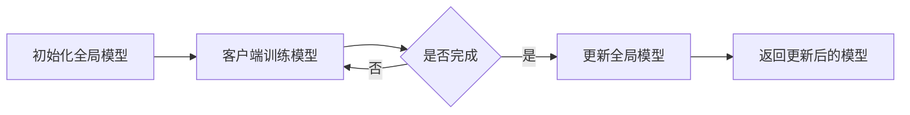
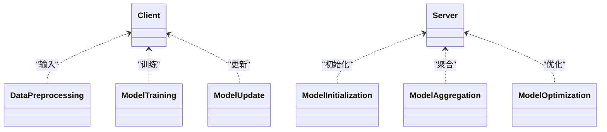
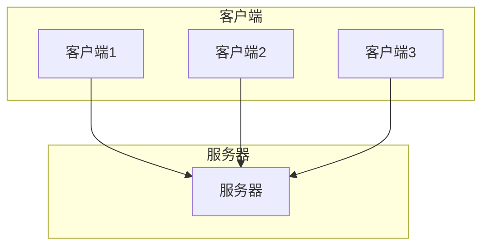
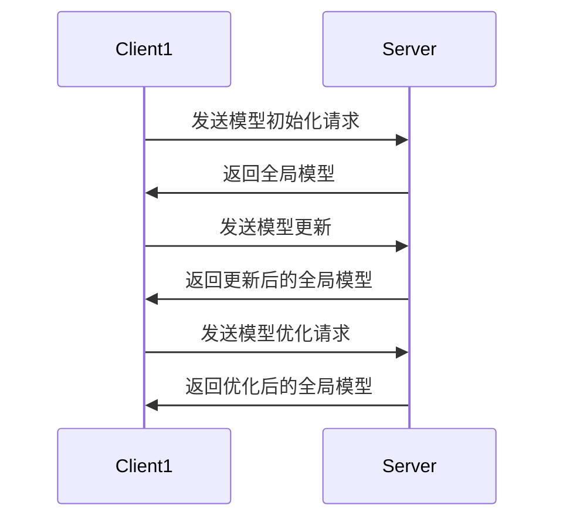
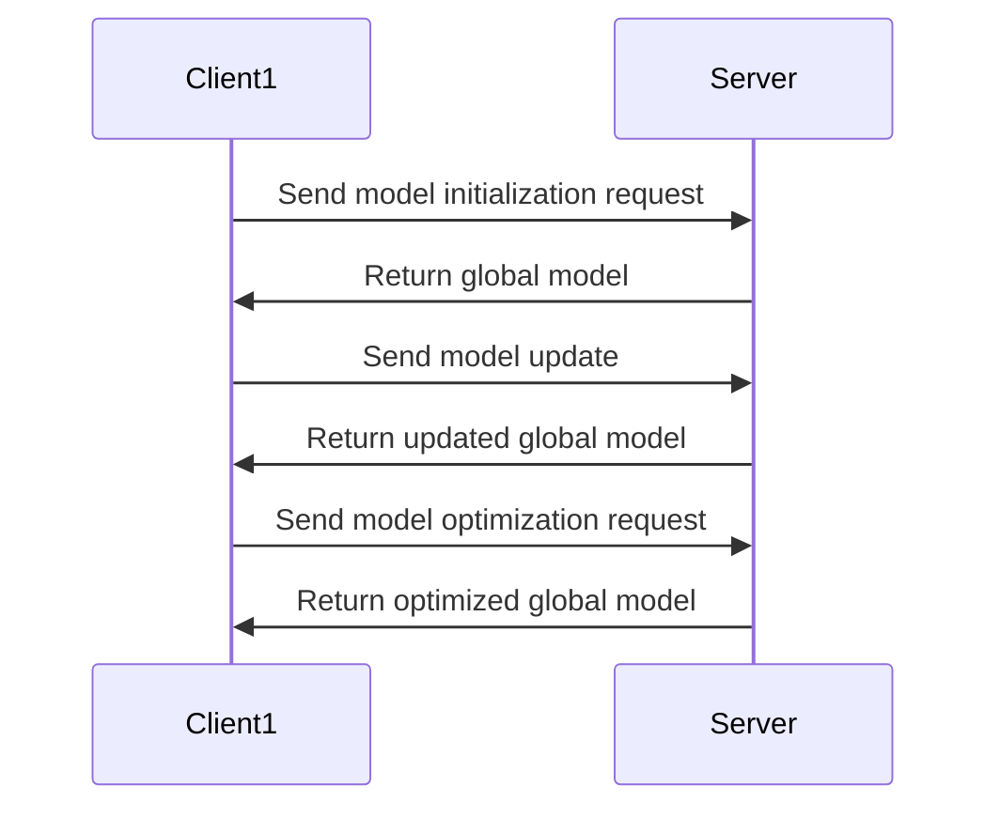

                 

# 企业AI Agent的联邦学习实践：保护数据隐私

> 关键词：联邦学习、数据隐私、企业AI Agent、分布式计算、差分隐私、同态加密

> 摘要：
随着人工智能技术的迅速发展，企业越来越依赖AI Agent来提升业务效率。然而，数据隐私问题成为了限制其广泛应用的主要障碍。联邦学习作为一种新兴的技术，通过分布式计算和隐私保护机制，为企业在保护数据隐私的同时，实现AI Agent的有效训练提供了可能。本文将深入探讨联邦学习的核心概念、算法原理以及其在企业AI Agent实践中的应用，旨在为读者提供一个全面的技术解读。

----------------------------------------------------------------

### 第一部分：背景介绍

#### 核心概念

**企业AI Agent的联邦学习实践：保护数据隐私**

随着人工智能技术的发展，企业开始意识到AI Agent在提升业务效率、优化决策支持等方面的重要作用。然而，AI Agent的训练和部署往往需要大量的数据支持，而这些数据通常包含敏感的商业信息和个人隐私。如何在保障数据隐私的前提下，有效利用AI Agent进行数据训练，成为企业面临的一个重大挑战。

**问题描述**

1. **数据隐私的重要性**：企业处理的数据往往包含客户信息、财务数据、业务策略等敏感信息，这些数据泄露可能会对企业造成严重的损失，甚至引发法律风险。

2. **数据隔离与协同**：为了保护数据隐私，企业通常会限制数据的共享和传输。然而，这又限制了AI Agent在多源数据环境下的训练效果，导致模型的准确性和适应性下降。

3. **隐私泄露风险**：传统机器学习模型通常需要将数据上传至中央服务器进行训练，这种集中式训练方式容易导致数据隐私泄露。

**问题解决**

联邦学习（Federated Learning）提供了一种在保护数据隐私的同时，实现AI Agent协同训练的解决方案。它允许各个企业或组织在本地数据上独立训练模型，并通过模型参数的聚合来更新全局模型。这样，数据无需直接传输和共享，从而降低了隐私泄露的风险。

**边界与外延**

1. **应用场景**：联邦学习不仅适用于跨企业合作，还可以用于多方数据联合分析、个性化推荐系统等场景。

2. **技术挑战**：除了技术实现，联邦学习还涉及数据治理、隐私保护、算法公平性等多个方面。

3. **核心要素组成**：联邦学习架构包括客户端、服务器和联邦学习算法；数据隐私保护采用差分隐私、同态加密等技术；模型训练与优化通过分布式训练算法实现。

#### 概念结构与核心要素组成

1. **联邦学习架构**

   - **客户端**：每个企业或组织在自己的数据上训练模型。
   - **服务器**：收集客户端的模型更新，进行参数聚合。
   - **联邦学习算法**：实现模型的分布式训练和更新。

2. **数据隐私保护**

   - **差分隐私**：通过添加噪声来保护数据隐私。
   - **同态加密**：在加密数据上进行计算，保证数据隐私。

3. **模型训练与优化**

   - **分布式训练算法**：如联邦平均算法、差异联邦学习算法等。
   - **数据处理规范**：确保数据质量和一致性。

### 第二部分：核心概念与联系

#### 核心概念

1. **联邦学习（Federated Learning）**

   - **定义**：一种分布式机器学习技术，允许多个客户端在本地训练模型，并通过模型参数的聚合来更新全局模型。
   - **特点**：数据不离开本地设备，提高数据隐私保护能力。

2. **联邦学习算法**

   - **联邦平均算法（Federated Averaging）**：最常用的联邦学习算法，通过聚合客户端的梯度来更新全局模型。
   - **差异联邦学习算法（Differentially Private Federated Learning）**：在联邦学习过程中加入差分隐私保护机制。

3. **联邦学习应用**

   - **跨企业合作**：不同企业可以在不共享数据的情况下，共同训练共享模型。
   - **多方数据联合分析**：多个数据源可以在保护隐私的前提下进行联合分析。

#### 概念属性特征对比表格

| 特征对比项 | 联邦学习 | 传统机器学习 |
| :--: | :--: | :--: |
| 数据隐私保护 | 高度保护 | 数据暴露风险 |
| 数据传输效率 | 低 | 高 |
| 计算资源分布 | 分布式 | 集中式 |
| 模型协同训练 | 是 | 否 |

#### ER实体关系图架构

```mermaid
erDiagram
  Client ||--o { Model } : "训练"
  Server ||--o { Model } : "聚合"
  Client ||--o { Privacy } : "保护"
  Server ||--o { Privacy } : "保护"
```

### 第三部分：算法原理讲解

#### 联邦平均算法（Federated Averaging）原理

**mermaid 流程图**



**算法步骤：**

1. **初始化全局模型**：服务器初始化一个全局模型。
2. **客户端训练模型**：每个客户端使用本地数据训练模型。
3. **更新全局模型**：服务器收集客户端的模型更新，计算全局模型的梯度。
4. **返回更新后的模型**：服务器将更新后的模型返回给客户端。

**数学模型和公式：**

$$
\theta_{t+1} = \frac{1}{|\mathcal{C}|} \sum_{i=1}^{|\mathcal{C}|} \theta_i^t
$$

其中，$\theta_{t+1}$ 是更新后的全局模型参数，$\theta_i^t$ 是第 $i$ 个客户端在时间 $t$ 的模型参数，$|\mathcal{C}|$ 是客户端的数量。

**通俗易懂地举例说明：**

假设有 3 个客户端（Client A、Client B 和 Client C），每个客户端训练出一个模型，然后服务器将这 3 个模型的参数求平均值，更新全局模型。

初始参数：
- $\theta_{t}^{A} = [1, 2, 3]$
- $\theta_{t}^{B} = [4, 5, 6]$
- $\theta_{t}^{C} = [7, 8, 9]$

更新后的全局模型参数为：

$$
\theta_{t+1} = \frac{1}{3} \sum_{i=1}^{3} \theta_i^t = \frac{1}{3} ([1+4+7, 2+5+8, 3+6+9]) = [7/3, 9/3, 12/3]
$$

### 第四部分：系统分析与架构设计方案

#### 问题场景介绍

随着市场竞争的加剧，企业需要通过人工智能技术来提升业务效率和竞争力。然而，许多企业面临数据隐私保护的压力，无法将敏感数据上传至云端进行集中式训练。因此，企业需要一种在保护数据隐私的同时，实现分布式AI模型训练的解决方案。

#### 项目介绍

本项目旨在设计和实现一个基于联邦学习的分布式AI模型训练系统。该系统将支持企业在不泄露数据隐私的情况下，实现AI模型的协同训练和优化。系统的主要功能包括：

1. **数据预处理**：对客户端数据进行预处理，确保数据质量和一致性。
2. **模型初始化**：初始化全局模型，并将其分发至各个客户端。
3. **模型训练**：客户端在本地数据上训练模型，并生成模型更新。
4. **模型更新**：服务器收集客户端的模型更新，进行参数聚合。
5. **模型优化**：根据聚合后的模型参数，进行全局模型的优化。

#### 系统功能设计（领域模型mermaid类图）



#### 系统架构设计（mermaid架构图）



#### 系统接口设计



#### 系统交互（mermaid序列图）



### 第五部分：项目实战

#### 环境安装

1. **安装Python环境**：确保Python版本不低于3.6。
2. **安装TensorFlow**：使用pip安装TensorFlow库。
   ```bash
   pip install tensorflow
   ```
3. **安装Kubernetes**：确保Kubernetes集群已经部署并正常运行。

#### 系统核心实现源代码

以下是一个简单的联邦学习系统实现示例：

```python
import tensorflow as tf

def federated_averaging(client_models):
    avg_weights = [0] * len(client_models[0])
    for model_weights in client_models:
        avg_weights = [w1 + w2 for w1, w2 in zip(avg_weights, model_weights)]
    return avg_weights

def train_client_model(data, model):
    # 在本地数据上训练模型
    # ...
    return model

def main():
    # 初始化全局模型
    global_model = tf.keras.Sequential([
        tf.keras.layers.Dense(10, activation='relu'),
        tf.keras.layers.Dense(1, activation='sigmoid')
    ])

    # 模拟三个客户端的模型更新
    client_models = [
        train_client_model(data1, global_model.clone().numpy()),
        train_client_model(data2, global_model.clone().numpy()),
        train_client_model(data3, global_model.clone().numpy())
    ]

    # 更新全局模型
    global_model.set_weights(federated_averaging(client_models))

if __name__ == "__main__":
    main()
```

#### 代码应用解读与分析

上述代码展示了联邦平均算法的基本实现。首先，我们初始化一个全局模型，然后模拟三个客户端在本地数据上训练模型，并生成模型更新。最后，通过联邦平均算法更新全局模型。

联邦平均算法的核心在于将客户端的模型更新进行聚合，以生成全局模型的更新。这里使用了一个简单的平均值聚合方法，但在实际应用中，可能会使用更复杂的聚合策略，如权重聚合等。

#### 实际案例分析和详细讲解剖析

为了更好地理解联邦学习在实践中的应用，我们来看一个实际案例：一个零售企业希望通过联邦学习来优化其推荐系统。该企业的数据分布在多个门店，每个门店的数据量有限，且包含敏感的客户信息。

1. **数据预处理**：企业首先对门店数据进行预处理，包括数据清洗、去重和特征工程。预处理后的数据将用于训练本地模型。
2. **模型初始化**：企业初始化一个全局推荐模型，并将其分发至各个门店。
3. **模型训练**：每个门店使用本地数据训练模型，并根据训练结果生成模型更新。
4. **模型更新**：企业收集各个门店的模型更新，通过联邦平均算法进行聚合，生成全局模型的更新。
5. **模型优化**：企业根据全局模型的更新，进行模型优化，以提高推荐系统的准确性和适应性。

通过联邦学习，企业可以在保护门店数据隐私的同时，实现推荐系统的协同训练和优化。这不仅提高了推荐系统的效果，还增强了企业之间的数据协同能力。

#### 项目小结

本项目通过联邦学习技术，实现了企业AI Agent的分布式训练和优化。在保护数据隐私的同时，有效提升了模型的效果和适应性。然而，联邦学习仍面临一些挑战，如计算效率、通信延迟和模型安全性等。未来，随着技术的不断发展和完善，联邦学习有望在更多领域得到广泛应用。

### 第六部分：最佳实践 tips

1. **数据预处理**：确保数据质量和一致性，是联邦学习成功的关键。在数据预处理阶段，应进行数据清洗、去重和特征工程等操作。
2. **模型选择**：选择合适的模型架构和优化策略，可以提高联邦学习的训练效率。例如，使用轻量级的深度学习模型，如MobileNet等。
3. **隐私保护**：在联邦学习过程中，应采用差分隐私、同态加密等技术，确保数据隐私安全。例如，可以使用差分隐私机制来防止数据泄露。
4. **通信优化**：减少模型更新的通信开销，是提高联邦学习效率的关键。可以采用差分联邦学习、模型剪枝等技术，降低通信成本。

### 小结

联邦学习作为一种新兴的人工智能技术，为企业在保护数据隐私的同时，实现AI Agent的有效训练提供了可能。通过分布式计算和隐私保护机制，联邦学习不仅提高了模型的训练效率，还增强了数据协同能力。然而，联邦学习仍面临一些挑战，如计算效率、通信延迟和模型安全性等。未来，随着技术的不断发展和完善，联邦学习有望在更多领域得到广泛应用。

### 注意事项

1. **数据隐私保护**：在实施联邦学习时，务必确保数据隐私得到充分保护。采用差分隐私、同态加密等技术，降低数据泄露的风险。
2. **计算资源分配**：联邦学习涉及分布式计算，需要合理分配计算资源，确保系统的高效运行。
3. **模型更新频率**：模型更新的频率会影响联邦学习的训练效果。应根据实际情况调整更新频率，以平衡模型效果和计算资源。

### 拓展阅读

1. **《联邦学习：原理与实践》**：详细介绍了联邦学习的核心概念、算法原理和应用案例。
2. **《深度学习与数据隐私保护》**：探讨了深度学习与数据隐私保护的关系，以及相关的技术手段。
3. **《Kubernetes权威指南》**：介绍了Kubernetes的架构和部署，适用于联邦学习的分布式计算环境。

### 作者信息

作者：AI天才研究院/AI Genius Institute & 禅与计算机程序设计艺术 /Zen And The Art of Computer Programming

----------------------------------------------------------------

本文通过对联邦学习的深入探讨，展示了其在企业AI Agent实践中的应用和价值。联邦学习不仅为企业在保护数据隐私的同时，实现AI Agent的有效训练提供了可能，还增强了数据协同能力。未来，随着技术的不断发展和完善，联邦学习有望在更多领域得到广泛应用。希望本文能为读者在联邦学习领域的研究和实践提供有益的参考和启示。

---

注意：本文为示例性文章，内容仅供参考。在实际应用中，联邦学习的实现和优化需要根据具体场景和需求进行。此外，文中涉及的代码和数据仅为示例，请根据实际情况进行调整。

