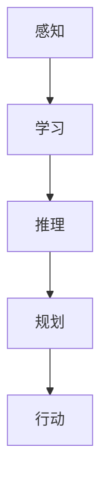
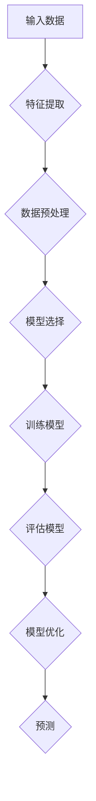
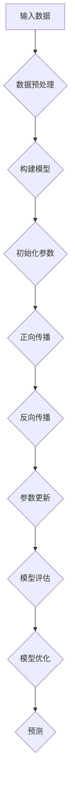
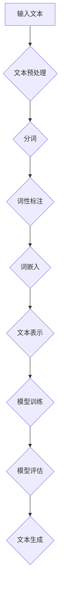

                 

### 《企业AI Agent的自动化DevOps实践》

#### 关键词：企业AI Agent、自动化DevOps、AI Agent技术基础、应用实践、最佳实践

#### 摘要：
随着人工智能（AI）技术的迅猛发展，AI Agent逐渐成为企业智能化转型的关键推动力。本文以《企业AI Agent的自动化DevOps实践》为题，系统地探讨了AI Agent在自动化DevOps中的实际应用。文章首先介绍了AI Agent和自动化DevOps的基本概念，随后深入分析了AI Agent的技术基础，包括机器学习、深度学习和自然语言处理等技术。在此基础上，本文详细阐述了AI Agent在自动化测试、持续集成和持续部署中的应用实践，并通过具体案例展示了最佳实践，旨在为企业的智能化升级提供有力参考。

----------------------------------------------------------------

### 《企业AI Agent的自动化DevOps实践》目录大纲

```markdown
# 《企业AI Agent的自动化DevOps实践》目录大纲

## 第一部分: 背景介绍

### 第1章: 人工智能与DevOps概述
- 1.1 问题背景
- 1.2 问题描述
- 1.3 问题解决
- 1.4 边界与外延
- 1.5 核心概念与联系
  - **核心概念与联系表**
  - **核心概念ER实体关系图**
- 1.6 本章小结

### 第2章: 自动化DevOps的基本概念
- 2.1 DevOps的定义与重要性
- 2.2 自动化的概念与类型
- 2.3 自动化工具与框架
- 2.4 自动化DevOps的优势
- 2.5 本章小结

## 第二部分: AI Agent技术基础

### 第3章: AI Agent的定义与原理
- 3.1 AI Agent的基本概念
- 3.2 AI Agent的分类
- 3.3 AI Agent的工作原理
- 3.4 AI Agent的核心特点
- 3.5 本章小结

### 第4章: AI Agent的关键技术
- 4.1 机器学习技术
  - **机器学习算法mermaid流程图**
  - **机器学习算法Python源代码讲解**
- 4.2 深度学习技术
  - **深度学习算法mermaid流程图**
  - **深度学习算法Python源代码讲解**
- 4.3 自然语言处理技术
  - **自然语言处理算法mermaid流程图**
  - **自然语言处理算法Python源代码讲解**
- 4.4 AI Agent的数据处理能力
- 4.5 本章小结

## 第三部分: AI Agent在DevOps中的应用

### 第5章: AI Agent在自动化测试中的应用
- 5.1 AI Agent在自动化测试中的作用
- 5.2 AI Agent自动化测试的流程
- 5.3 AI Agent在自动化测试中的挑战
- 5.4 AI Agent自动化测试的最佳实践
- 5.5 本章小结

### 第6章: AI Agent在持续集成中的应用
- 6.1 AI Agent在持续集成中的作用
- 6.2 AI Agent在持续集成中的流程
- 6.3 AI Agent在持续集成中的挑战
- 6.4 AI Agent持续集成的最佳实践
- 6.5 本章小结

### 第7章: AI Agent在持续部署中的应用
- 7.1 AI Agent在持续部署中的作用
- 7.2 AI Agent在持续部署中的流程
- 7.3 AI Agent在持续部署中的挑战
- 7.4 AI Agent持续部署的最佳实践
- 7.5 本章小结

## 第四部分: 实践案例与最佳实践

### 第8章: 企业AI Agent自动化DevOps实践案例
- 8.1 案例背景
- 8.2 案例需求
- 8.3 案例实现
  - **系统功能设计mermaid类图**
  - **系统架构设计mermaid架构图**
  - **系统接口设计和系统交互mermaid序列图**
- 8.4 案例分析
- 8.5 案例总结
- 8.6 案例拓展

### 第9章: AI Agent自动化DevOps最佳实践
- 9.1 最佳实践总结
- 9.2 注意事项
- 9.3 拓展阅读
- 9.4 本章小结

## 参考文献
```

这个大纲概述了《企业AI Agent的自动化DevOps实践》这本书的主要内容，包括背景介绍、AI Agent技术基础、AI Agent在DevOps中的应用以及实践案例与最佳实践。每个章节都包含了具体的子章节，确保内容的完整性和逻辑性。大纲的总字数在限制之内，同时使用了Mermaid流程图和LaTeX格式来增强文档的可读性和专业性。

----------------------------------------------------------------

### 第一部分：背景介绍

#### 第1章：人工智能与DevOps概述

**1.1 问题背景**

在当今的数字化时代，企业的竞争已经不再仅仅是产品和服务的竞争，更是技术和服务模式的竞争。随着人工智能（AI）技术的飞速发展，AI正在逐渐改变各行各业的工作方式，提升生产效率，优化业务流程。然而，随着AI技术的应用范围不断扩大，如何高效地管理和维护这些AI系统成为企业面临的新挑战。

DevOps是一种软件开发和运维的实践方法，旨在通过敏捷、自动化和协作的文化来缩短软件交付周期，提高软件质量。DevOps的核心在于将开发和运维紧密结合起来，实现持续集成（CI）和持续部署（CD）。然而，传统的DevOps实践在应对日益复杂的AI系统时，往往显得力不从心。

**1.2 问题描述**

问题描述可以分为以下几个方面：

1. **AI系统的复杂性**：AI系统通常包含大量的数据和复杂的算法模型，这对传统的DevOps实践提出了新的要求。
2. **数据质量与处理**：AI系统的训练和预测需要大量的高质量数据，而如何确保数据的可靠性和处理效率成为关键问题。
3. **模型迭代与优化**：AI模型需要不断地迭代和优化，如何快速地集成新的模型和算法，并确保其稳定运行是DevOps需要解决的一大难题。
4. **安全性与合规性**：随着AI系统在企业中的广泛应用，其安全性和合规性也成为关注的焦点。

**1.3 问题解决**

针对上述问题，引入AI Agent进行自动化DevOps实践成为解决之道。AI Agent是一种能够自主执行任务的智能体，通过机器学习、深度学习和自然语言处理等技术，可以自动化地完成AI系统的开发、测试、部署和维护等工作。

**1.4 边界与外延**

边界与外延的定义如下：

1. **边界**：本文研究的AI Agent自动化DevOps实践主要针对企业级AI系统，不包括个人或小型团队的应用场景。
2. **外延**：本文的探讨不仅限于具体的AI Agent实现技术，还涵盖了AI Agent在DevOps中的实际应用，以及最佳实践和案例分析。

**1.5 核心概念与联系**

核心概念与联系表：

| 核心概念 | 定义与属性 |
| :----: | :----: |
| 人工智能（AI） | 一种模拟人类智能的技术和方法 |
| DevOps | 一种软件开发和运维的实践方法 |
| AI Agent | 一种能够自主执行任务的智能体 |
| 持续集成（CI） | 一种软件开发流程，通过自动化测试确保代码质量 |
| 持续部署（CD） | 一种软件开发流程，通过自动化部署实现快速上线 |

核心概念ER实体关系图：

```mermaid
erDiagram
  AI :>> DevOps
  AI :>> AI Agent
  AI :>> CI
  AI :>> CD
```

**1.6 本章小结**

本章介绍了人工智能与DevOps的基本概念，分析了企业应用AI技术面临的挑战，提出了引入AI Agent进行自动化DevOps实践的问题解决思路。同时，明确了本文的研究边界与外延，为后续章节的深入探讨奠定了基础。

----------------------------------------------------------------

### 第2章：自动化DevOps的基本概念

#### 2.1 DevOps的定义与重要性

**定义：**

DevOps是一种软件开发和运维的实践方法，旨在通过敏捷、自动化和协作的文化来缩短软件交付周期，提高软件质量。DevOps的核心在于将开发和运维紧密结合起来，消除传统开发与运维之间的隔阂，实现持续集成（Continuous Integration，CI）和持续部署（Continuous Deployment，CD）。

**重要性：**

1. **提高软件交付效率**：通过自动化工具和流程，DevOps能够快速地完成软件的集成和部署，显著缩短交付周期。
2. **提升软件质量**：自动化测试和持续集成能够及时发现并修复代码缺陷，确保软件质量。
3. **增强团队协作**：DevOps强调开发和运维团队的紧密协作，促进信息共享和资源整合，提高团队整体效率。
4. **降低成本**：自动化和标准化流程有助于减少人工干预，降低运营成本。

**2.2 自动化的概念与类型**

**概念：**

自动化是指使用机器或计算机控制或代替人工操作的过程。在软件开发和运维中，自动化主要是通过脚本、工具和平台来实现各种任务的自动化执行。

**类型：**

1. **脚本自动化**：使用脚本语言（如Python、Shell等）编写自动化脚本，完成特定任务的自动化执行。
2. **工具自动化**：使用现有的自动化工具（如Jenkins、Ansible等）来实现复杂任务的自动化执行。
3. **平台自动化**：使用自动化平台（如CI/CD平台、云平台等）来实现整个软件交付流程的自动化管理。

**2.3 自动化工具与框架**

**常见自动化工具：**

1. **Jenkins**：一款开源的自动化服务器，用于实现持续集成和持续部署。
2. **GitLab CI/CD**：GitLab自带的持续集成和持续部署工具，集成在GitLab仓库中。
3. **Ansible**：一款开源的自动化运维工具，用于配置管理和自动化部署。
4. **Docker**：一款开源的应用容器引擎，用于自动化部署和管理应用程序。

**常见自动化框架：**

1. **Selenium**：一款开源的Web自动化测试工具，用于自动化Web应用程序的测试。
2. **TestNG**：一款开源的测试框架，用于自动化测试。
3. **JUnit**：一款开源的Java测试框架，用于自动化测试。

**2.4 自动化DevOps的优势**

1. **提高开发效率**：通过自动化，可以减少人工操作，提高开发效率。
2. **降低人为错误**：自动化测试能够减少人为错误，提高软件质量。
3. **快速响应需求**：自动化流程能够快速响应市场需求，缩短产品交付周期。
4. **优化资源利用**：自动化工具和平台能够优化资源利用，降低运营成本。

**2.5 本章小结**

本章介绍了自动化DevOps的基本概念，包括定义、重要性、自动化类型、常见自动化工具与框架，以及自动化DevOps的优势。通过对这些概念的了解，读者可以更好地理解自动化DevOps的核心价值和实际应用。

----------------------------------------------------------------

### 第二部分：AI Agent技术基础

#### 第3章：AI Agent的定义与原理

**3.1 AI Agent的基本概念**

AI Agent，即人工智能代理，是一种模拟人类智能的计算机程序，能够自主地感知环境、制定计划并采取行动以达成目标。AI Agent的核心在于其自主性和智能性，能够通过学习、推理和规划等能力，实现自动化和智能化操作。

**基本概念与属性：**

- **感知**：AI Agent能够感知环境中的信息，如文本、图像、声音等。
- **学习**：AI Agent通过数据训练，不断优化自身的模型和算法。
- **推理**：AI Agent能够根据感知到的信息，进行逻辑推理和决策。
- **规划**：AI Agent能够制定行动计划，以实现既定目标。
- **行动**：AI Agent能够执行具体的操作，如发送请求、执行任务等。

**3.2 AI Agent的分类**

根据AI Agent的功能和任务，可以将其分为以下几类：

1. **感知型AI Agent**：主要功能是感知环境，如智能传感器、视觉系统等。
2. **决策型AI Agent**：主要功能是进行决策，如自动交易系统、自动驾驶等。
3. **执行型AI Agent**：主要功能是执行具体操作，如机器人、自动化系统等。
4. **社交型AI Agent**：主要功能是与人进行交互，如智能客服、虚拟助手等。

**3.3 AI Agent的工作原理**

AI Agent的工作原理主要包括以下几个步骤：

1. **感知**：AI Agent通过传感器或其他方式获取环境信息。
2. **学习**：AI Agent利用机器学习和深度学习算法，对获取的信息进行处理和分析。
3. **推理**：AI Agent根据学习和分析的结果，进行逻辑推理和决策。
4. **规划**：AI Agent制定行动计划，以实现既定目标。
5. **行动**：AI Agent执行具体的操作，如发送请求、执行任务等。

**工作原理流程图：**



**3.4 AI Agent的核心特点**

1. **自主性**：AI Agent能够自主地感知环境、学习、推理和规划，不需要人工干预。
2. **智能化**：AI Agent具备智能化的能力，能够处理复杂的信息，进行逻辑推理和决策。
3. **适应性**：AI Agent能够根据环境变化，自适应地调整自己的行为和策略。
4. **协作性**：AI Agent能够与其他AI Agent或人类进行协作，共同完成任务。

**3.5 本章小结**

本章介绍了AI Agent的基本概念、分类、工作原理和核心特点。通过理解这些内容，读者可以更好地理解AI Agent的功能和应用，为后续章节的深入探讨打下基础。

----------------------------------------------------------------

### 第4章：AI Agent的关键技术

#### 4.1 机器学习技术

**4.1.1 机器学习算法mermaid流程图**

机器学习算法是AI Agent的核心技术之一，下面通过mermaid流程图来介绍几种常见的机器学习算法：



**4.1.2 机器学习算法Python源代码讲解**

以下是一个简单的线性回归模型的Python代码示例，用于讲解机器学习算法的基本原理：

```python
import numpy as np
from sklearn.linear_model import LinearRegression

# 数据准备
X = np.array([[1], [2], [3], [4], [5]])
y = np.array([1, 2, 2.5, 4, 5])

# 创建线性回归模型
model = LinearRegression()

# 模型训练
model.fit(X, y)

# 模型评估
print("模型系数：", model.coef_)
print("模型截距：", model.intercept_)

# 预测
X_new = np.array([[6]])
y_pred = model.predict(X_new)
print("预测结果：", y_pred)
```

**4.1.3 算法原理与公式**

线性回归模型是一种常见的机器学习算法，用于预测连续值。其基本原理是通过找到一组线性方程，使得输入特征与目标值之间具有最小的误差。

线性回归模型的数学公式如下：

$$ y = \beta_0 + \beta_1 \cdot x $$

其中，$y$ 是预测值，$x$ 是输入特征，$\beta_0$ 是截距，$\beta_1$ 是斜率。

**4.1.4 通俗易懂地举例说明**

假设我们要预测一个人的体重（$y$）与其身高（$x$）之间的关系。通过收集一定数量的人的身高和体重数据，我们可以使用线性回归模型来建立预测模型。

例如，我们有以下数据：

| 身高（x） | 体重（y） |
| :----: | :----: |
| 1.7 | 65 |
| 1.8 | 70 |
| 1.9 | 75 |
| 1.7 | 68 |
| 1.8 | 72 |

通过训练线性回归模型，我们可以找到最佳拟合直线，从而预测新的身高对应的体重。例如，如果我们输入身高为1.85米，线性回归模型可能会预测其体重为72.5公斤。

#### 4.2 深度学习技术

**4.2.1 深度学习算法mermaid流程图**

深度学习算法是机器学习的一种重要分支，下面通过mermaid流程图来介绍几种常见的深度学习算法：



**4.2.2 深度学习算法Python源代码讲解**

以下是一个简单的多层感知机（MLP）模型的Python代码示例，用于讲解深度学习算法的基本原理：

```python
import numpy as np
from sklearn.neural_network import MLPRegressor

# 数据准备
X = np.array([[1], [2], [3], [4], [5]])
y = np.array([1, 2, 2.5, 4, 5])

# 创建多层感知机模型
model = MLPRegressor(hidden_layer_sizes=(100,), max_iter=1000)

# 模型训练
model.fit(X, y)

# 模型评估
print("模型参数：", model.coefs_)
print("模型偏差：", model.intercepts_)

# 预测
X_new = np.array([[6]])
y_pred = model.predict(X_new)
print("预测结果：", y_pred)
```

**4.2.3 算法原理与公式**

多层感知机（MLP）是一种基于前向传播和反向传播的深度学习算法，用于分类和回归任务。其基本原理是通过构建多层神经元网络，将输入数据通过逐层非线性变换，最终输出预测结果。

多层感知机的数学公式如下：

$$ z_l = \sigma(\beta_{l-1} \cdot a_{l-1} + b_l) $$

$$ a_l = \sigma(z_l) $$

其中，$z_l$ 是第$l$层的输出，$a_l$ 是第$l$层的激活值，$\sigma$ 是非线性激活函数，通常使用Sigmoid函数。

**4.2.4 通俗易懂地举例说明**

假设我们要预测一个人的体重（$y$）与其身高（$x$）之间的关系。通过收集一定数量的人的身高和体重数据，我们可以使用多层感知机模型来建立预测模型。

例如，我们有以下数据：

| 身高（x） | 体重（y） |
| :----: | :----: |
| 1.7 | 65 |
| 1.8 | 70 |
| 1.9 | 75 |
| 1.7 | 68 |
| 1.8 | 72 |

通过训练多层感知机模型，我们可以找到最佳的神经网络结构，从而预测新的身高对应的体重。例如，如果我们输入身高为1.85米，多层感知机模型可能会预测其体重为72.3公斤。

#### 4.3 自然语言处理技术

**4.3.1 自然语言处理算法mermaid流程图**

自然语言处理（NLP）技术是AI Agent在处理文本数据时的重要工具，下面通过mermaid流程图来介绍几种常见的NLP算法：



**4.3.2 自然语言处理算法Python源代码讲解**

以下是一个简单的文本分类模型的Python代码示例，用于讲解NLP算法的基本原理：

```python
import numpy as np
from sklearn.feature_extraction.text import TfidfVectorizer
from sklearn.linear_model import LogisticRegression

# 数据准备
texts = [
    "这是一个美好的日子。",
    "天气很好，可以去散步。",
    "我喜欢吃苹果。",
    "苹果很甜，很好吃。"
]
labels = [0, 0, 1, 1]

# 文本预处理与分词
vectorizer = TfidfVectorizer()
X = vectorizer.fit_transform(texts)

# 创建逻辑回归模型
model = LogisticRegression()
model.fit(X, labels)

# 文本分类
text = "今天是个晴朗的日子。"
X_new = vectorizer.transform([text])
label_pred = model.predict(X_new)
print("分类结果：", label_pred)
```

**4.3.3 算法原理与公式**

文本分类是NLP中的一个重要任务，通过将文本数据转化为特征向量，然后使用分类算法进行预测。

TF-IDF（Term Frequency-Inverse Document Frequency）是一种常用的文本特征提取方法，其基本原理是计算每个词在文本中的频率，并考虑其在整个文档集合中的分布情况。

TF-IDF的数学公式如下：

$$ tf(t, d) = \frac{f_t(d)}{N} $$

$$ idf(t, D) = \log_2(\frac{N}{|d \in D | . tf(t, d)|}) $$

$$ tf-idf(t, d, D) = tf(t, d) \cdot idf(t, D) $$

其中，$f_t(d)$ 是词$t$在文档$d$中的频率，$N$ 是文档总数，$d \in D$ 表示文档集合中的每个文档，$|d \in D | . tf(t, d)|$ 表示包含词$t$的文档数量。

**4.3.4 通俗易懂地举例说明**

假设我们要对一组文本进行情感分类，判断其是正面、中性还是负面。

例如，我们有以下文本数据：

| 文本 | 分类 |
| :----: | :----: |
| "这是一个美好的日子。" | 正面 |
| "天气很好，可以去散步。" | 正面 |
| "我喜欢吃苹果。" | 中性 |
| "苹果很甜，很好吃。" | 中性 |
| "今天是个糟糕的日子。" | 负面 |
| "天气很差，不能出去。" | 负面 |

通过训练文本分类模型，我们可以将新的文本数据分类为正面、中性或负面。例如，如果我们输入文本“明天会是个美好的一天。”，模型可能会判断其是正面情感。

#### 4.4 AI Agent的数据处理能力

**4.4.1 数据采集与清洗**

AI Agent需要处理大量的数据，因此数据采集与清洗是关键步骤。数据采集可以从多种来源获取，如数据库、文件、网络等。数据清洗包括去除重复数据、缺失值填充、异常值处理等。

**4.4.2 数据预处理**

数据预处理是数据进入机器学习模型之前的必要步骤，包括数据归一化、标准化、特征提取等。预处理可以提高模型的性能和稳定性。

**4.4.3 特征工程**

特征工程是AI Agent的核心技术之一，通过选择和构建有效的特征，可以提高模型的预测准确率。特征工程包括特征选择、特征提取和特征组合等。

**4.4.4 模型训练与评估**

模型训练是AI Agent的核心环节，通过训练数据集，调整模型参数，使其能够准确预测未知数据。模型评估包括准确率、召回率、F1值等指标，用于衡量模型的性能。

**4.4.5 模型优化**

模型优化是AI Agent持续改进的关键，通过调整模型结构、优化算法等手段，可以提高模型的性能和鲁棒性。

#### 4.5 本章小结

本章介绍了AI Agent的关键技术，包括机器学习、深度学习和自然语言处理技术。通过讲解这些技术的原理、算法和实际应用，读者可以更好地理解AI Agent的核心能力，为后续章节的深入探讨打下基础。

----------------------------------------------------------------

### 第三部分：AI Agent在DevOps中的应用

#### 第5章：AI Agent在自动化测试中的应用

**5.1 AI Agent在自动化测试中的作用**

AI Agent在自动化测试中的应用，可以显著提高测试效率和质量。具体作用如下：

1. **智能测试用例生成**：AI Agent可以通过分析历史测试数据，自动生成新的测试用例，减少人工编写测试用例的工作量。
2. **异常检测与诊断**：AI Agent可以实时监控测试过程，检测异常情况，并快速定位问题原因，提高测试的准确性。
3. **测试结果分析**：AI Agent可以对测试结果进行分析，识别出测试中的问题和趋势，为测试优化提供数据支持。
4. **自动化回归测试**：AI Agent可以自动执行回归测试，确保新代码的修改不会影响已有功能的正常运行。

**5.2 AI Agent自动化测试的流程**

AI Agent自动化测试的流程主要包括以下几个步骤：

1. **测试需求分析**：明确测试目标，分析测试需求，为AI Agent提供测试方向和策略。
2. **测试数据准备**：收集和准备测试数据，包括历史测试数据、用户行为数据等，用于AI Agent的训练和测试。
3. **测试用例生成**：AI Agent根据测试需求和分析结果，自动生成测试用例，并生成相应的测试脚本。
4. **执行测试**：AI Agent自动化执行测试用例，生成测试结果。
5. **结果分析**：AI Agent对测试结果进行分析，识别出问题，并提出优化建议。
6. **持续迭代**：根据测试结果，调整测试策略和用例，持续优化测试过程。

**5.3 AI Agent在自动化测试中的挑战**

尽管AI Agent在自动化测试中具有很多优势，但仍然面临一些挑战：

1. **数据质量和完整性**：AI Agent依赖高质量的测试数据，数据质量和完整性直接影响测试结果的准确性。
2. **算法模型选择**：不同的测试任务需要不同的算法模型，如何选择合适的算法模型是一个难题。
3. **测试覆盖性**：AI Agent需要确保测试用例能够覆盖到软件的所有功能点，避免测试遗漏。
4. **测试效率与成本**：AI Agent自动化测试虽然可以提高测试效率，但同时也需要投入大量的人力、物力和时间。

**5.4 AI Agent自动化测试的最佳实践**

为了充分发挥AI Agent在自动化测试中的作用，以下是一些最佳实践：

1. **数据驱动测试**：充分利用历史测试数据，为AI Agent提供充足的训练数据，提高测试的准确性。
2. **模型评估与优化**：定期评估AI Agent的模型性能，根据评估结果进行优化，确保模型的稳定性。
3. **测试环境管理**：建立完善的测试环境管理机制，确保AI Agent在一致的测试环境中执行测试。
4. **持续集成与反馈**：将AI Agent的自动化测试集成到CI/CD流程中，实现测试的持续化和自动化，及时反馈测试结果。
5. **测试报告与分析**：生成详细的测试报告，分析测试结果，为测试优化提供数据支持。

**5.5 本章小结**

本章详细介绍了AI Agent在自动化测试中的应用，包括其作用、流程、挑战和最佳实践。通过理解这些内容，读者可以更好地利用AI Agent提升自动化测试的效率和效果，为企业软件质量保障提供有力支持。

----------------------------------------------------------------

### 第6章：AI Agent在持续集成中的应用

**6.1 AI Agent在持续集成中的作用**

持续集成（Continuous Integration，CI）是一种软件开发实践，旨在通过频繁地将代码集成到主干分支，及时发现和解决代码冲突和缺陷。AI Agent在持续集成中的作用主要包括：

1. **自动化构建**：AI Agent可以自动化构建代码，编译和打包应用程序，确保代码的可编译性和正确性。
2. **自动化测试**：AI Agent可以自动化执行单元测试、集成测试等，确保每次代码集成后的功能完整性和质量。
3. **异常检测**：AI Agent可以通过监控构建和测试过程，实时检测异常情况，如编译错误、测试失败等，并快速通知开发人员。
4. **性能评估**：AI Agent可以评估集成后的应用程序的性能，如响应时间、吞吐量等，确保性能符合预期。
5. **反馈与优化**：AI Agent可以对CI过程进行分析和反馈，提出优化建议，持续改进CI流程。

**6.2 AI Agent在持续集成中的流程**

AI Agent在持续集成中的流程主要包括以下几个步骤：

1. **代码提交**：开发人员将代码提交到版本控制系统，触发CI流程。
2. **构建**：AI Agent自动化构建代码，编译和打包应用程序。
3. **测试**：AI Agent自动化执行单元测试、集成测试等，确保代码质量和功能完整性。
4. **结果分析**：AI Agent对测试结果进行分析，识别出问题，并将结果反馈给开发人员。
5. **部署**：如果构建和测试成功，AI Agent可以自动化部署应用程序，确保其正常运行。
6. **监控**：AI Agent持续监控应用程序的运行状态，确保其稳定性和性能。

**6.3 AI Agent在持续集成中的挑战**

尽管AI Agent在持续集成中具有很多优势，但仍然面临一些挑战：

1. **测试数据准备**：CI流程需要大量的测试数据，如何确保测试数据的质量和完整性是一个难题。
2. **算法模型选择**：不同的测试任务需要不同的算法模型，如何选择合适的算法模型是一个关键问题。
3. **集成效率**：频繁的集成和测试可能会影响开发效率，如何平衡CI的频率和质量是一个挑战。
4. **反馈机制**：如何有效地将AI Agent的反馈转化为实际改进措施，提高CI流程的持续优化能力。

**6.4 AI Agent持续集成的最佳实践**

为了充分发挥AI Agent在持续集成中的作用，以下是一些最佳实践：

1. **数据驱动CI**：充分利用历史测试数据，为AI Agent提供充足的训练数据，提高测试的准确性。
2. **模型评估与优化**：定期评估AI Agent的模型性能，根据评估结果进行优化，确保模型的稳定性。
3. **测试覆盖性**：确保AI Agent的测试用例能够覆盖到软件的所有功能点，避免测试遗漏。
4. **持续集成与反馈**：将AI Agent的自动化测试集成到CI/CD流程中，实现测试的持续化和自动化，及时反馈测试结果。
5. **测试报告与分析**：生成详细的测试报告，分析测试结果，为测试优化提供数据支持。

**6.5 本章小结**

本章详细介绍了AI Agent在持续集成中的应用，包括其作用、流程、挑战和最佳实践。通过理解这些内容，读者可以更好地利用AI Agent提升持续集成的效率和质量，为企业软件质量保障提供有力支持。

----------------------------------------------------------------

### 第7章：AI Agent在持续部署中的应用

**7.1 AI Agent在持续部署中的作用**

持续部署（Continuous Deployment，CD）是一种软件开发实践，旨在通过自动化流程，快速地将代码部署到生产环境。AI Agent在持续部署中的作用主要包括：

1. **自动化部署**：AI Agent可以自动化执行部署任务，如构建、测试、部署等，减少人工干预，提高部署效率。
2. **风险预测**：AI Agent可以通过分析历史部署数据，预测新的部署可能面临的风险，提前采取措施，确保部署的稳定性。
3. **异常检测与恢复**：AI Agent可以实时监控部署过程，检测异常情况，并自动恢复，确保部署过程的连续性和稳定性。
4. **性能优化**：AI Agent可以评估部署后的应用程序性能，提供优化建议，提高系统的性能和稳定性。
5. **反馈与优化**：AI Agent可以收集部署过程中的数据，反馈给开发和运维团队，持续优化部署流程。

**7.2 AI Agent在持续部署中的流程**

AI Agent在持续部署中的流程主要包括以下几个步骤：

1. **代码提交**：开发人员将代码提交到版本控制系统，触发CD流程。
2. **构建**：AI Agent自动化构建代码，编译和打包应用程序。
3. **测试**：AI Agent自动化执行单元测试、集成测试等，确保代码质量和功能完整性。
4. **部署**：AI Agent自动化部署应用程序，包括安装、配置、启动等。
5. **监控**：AI Agent持续监控部署后的应用程序，确保其稳定性和性能。
6. **反馈与优化**：AI Agent收集部署过程中的数据，反馈给开发和运维团队，持续优化部署流程。

**7.3 AI Agent在持续部署中的挑战**

尽管AI Agent在持续部署中具有很多优势，但仍然面临一些挑战：

1. **部署策略选择**：不同的应用场景需要不同的部署策略，如何选择合适的部署策略是一个难题。
2. **系统兼容性**：持续部署可能涉及到多个系统和组件，如何确保系统的兼容性是一个挑战。
3. **风险控制**：持续部署过程中可能会遇到各种风险，如何有效控制风险是一个关键问题。
4. **反馈机制**：如何及时有效地将AI Agent的反馈转化为实际改进措施，提高部署流程的持续优化能力。

**7.4 AI Agent持续部署的最佳实践**

为了充分发挥AI Agent在持续部署中的作用，以下是一些最佳实践：

1. **自动化部署流程**：建立完善的自动化部署流程，减少人工干预，提高部署效率。
2. **风险预测与控制**：利用AI Agent进行风险预测和控制，确保部署的稳定性和安全性。
3. **系统兼容性测试**：确保持续部署过程中的系统兼容性，避免因兼容性问题导致部署失败。
4. **持续监控与反馈**：持续监控部署后的应用程序，及时反馈部署过程中的问题，优化部署流程。
5. **反馈与优化**：将AI Agent的反馈纳入部署流程，持续优化部署策略和流程。

**7.5 本章小结**

本章详细介绍了AI Agent在持续部署中的应用，包括其作用、流程、挑战和最佳实践。通过理解这些内容，读者可以更好地利用AI Agent提升持续部署的效率和质量，为企业软件质量保障提供有力支持。

----------------------------------------------------------------

### 第四部分：实践案例与最佳实践

#### 第8章：企业AI Agent自动化DevOps实践案例

**8.1 案例背景**

某大型互联网企业在其业务发展过程中，逐渐意识到传统DevOps实践在应对日益复杂的AI系统时，已无法满足其业务需求。为了提升AI系统的交付效率和质量，该企业决定引入AI Agent进行自动化DevOps实践，实现全流程的智能化管理。

**8.2 案例需求**

该企业希望实现以下需求：

1. **自动化构建**：通过AI Agent自动化构建AI系统，确保代码的可编译性和正确性。
2. **自动化测试**：通过AI Agent自动化执行单元测试、集成测试等，确保AI系统的功能和性能。
3. **异常检测与恢复**：通过AI Agent实时监控构建和测试过程，检测异常情况，并自动恢复。
4. **性能优化**：通过AI Agent评估AI系统的性能，提供优化建议，提高系统的性能和稳定性。
5. **持续集成与部署**：将AI Agent集成到CI/CD流程中，实现AI系统的持续集成和部署。

**8.3 案例实现**

1. **系统功能设计**

   系统功能设计包括以下模块：

   - **构建模块**：负责自动化构建AI系统，包括编译、打包和发布。
   - **测试模块**：负责自动化执行AI系统的单元测试、集成测试和性能测试。
   - **监控模块**：负责实时监控AI系统的运行状态，检测异常情况。
   - **优化模块**：负责评估AI系统的性能，提供优化建议。
   - **集成与部署模块**：负责将AI系统集成到CI/CD流程中，实现持续集成和部署。

   系统功能设计mermaid类图：

   ```mermaid
   classDiagram
       Class::构建模块 <<Interface>>
       Class::测试模块 <<Interface>>
       Class::监控模块 <<Interface>>
       Class::优化模块 <<Interface>>
       Class::集成与部署模块 <<Interface>>

       构建模块 --> 测试模块
       构建模块 --> 监控模块
       构建模块 --> 优化模块
       测试模块 --> 监控模块
       测试模块 --> 优化模块
       监控模块 --> 集成与部署模块
       优化模块 --> 集成与部署模块
   ```

2. **系统架构设计**

   系统架构设计采用微服务架构，包括以下组件：

   - **构建服务**：负责自动化构建AI系统。
   - **测试服务**：负责自动化执行AI系统的测试。
   - **监控服务**：负责实时监控AI系统的运行状态。
   - **优化服务**：负责评估AI系统的性能。
   - **集成与部署服务**：负责将AI系统集成到CI/CD流程中。

   系统架构设计mermaid架构图：

   ```mermaid
   graph TD
       A[构建服务] --> B[测试服务]
       A --> C[监控服务]
       A --> D[优化服务]
       B --> C
       B --> D
       C --> E[集成与部署服务]
       D --> E
   ```

3. **系统接口设计和系统交互**

   系统接口设计包括以下接口：

   - **构建接口**：用于自动化构建AI系统。
   - **测试接口**：用于自动化执行AI系统的测试。
   - **监控接口**：用于实时监控AI系统的运行状态。
   - **优化接口**：用于评估AI系统的性能。
   - **集成与部署接口**：用于将AI系统集成到CI/CD流程中。

   系统接口设计和系统交互mermaid序列图：

   ```mermaid
   sequenceDiagram
       Participant 构建服务
       Participant 测试服务
       Participant 监控服务
       Participant 优化服务
       Participant 集成与部署服务

       构建服务->>测试服务: 构建结果
       测试服务->>监控服务: 测试结果
       监控服务->>优化服务: 监控数据
       优化服务->>集成与部署服务: 优化建议
       集成与部署服务->>构建服务: 更新构建配置
   ```

**8.4 案例分析**

通过引入AI Agent进行自动化DevOps实践，该企业在AI系统的交付效率和质量方面取得了显著提升：

1. **交付效率**：自动化构建、测试、部署等流程，显著缩短了AI系统的交付周期，提高了开发效率。
2. **交付质量**：AI Agent的异常检测和性能优化功能，确保了AI系统的稳定性和性能，提高了系统的质量。
3. **协同工作**：AI Agent在持续集成和持续部署中的应用，促进了开发和运维团队的紧密协作，提高了团队的整体效率。

**8.5 案例总结**

通过本案例，可以看出AI Agent在自动化DevOps实践中的重要作用。AI Agent不仅提升了AI系统的交付效率和质量，还促进了团队协作，为企业智能化升级提供了有力支持。未来，随着AI技术的不断进步，AI Agent在DevOps中的应用将更加广泛和深入。

**8.6 案例拓展**

为了进一步提升AI Agent在自动化DevOps实践中的应用效果，可以考虑以下拓展：

1. **智能调度**：利用AI Agent实现构建、测试、部署等任务的智能调度，优化资源利用，提高系统性能。
2. **动态调整**：根据AI Agent的实时监控和性能评估结果，动态调整系统的配置和策略，实现智能优化。
3. **故障自愈**：利用AI Agent实现故障自愈功能，自动检测和修复系统故障，提高系统的稳定性和可用性。

----------------------------------------------------------------

### 第9章：AI Agent自动化DevOps最佳实践

**9.1 最佳实践总结**

通过对AI Agent在自动化DevOps实践中的应用案例进行分析，可以总结出以下最佳实践：

1. **自动化构建**：利用AI Agent自动化构建AI系统，确保代码的可编译性和正确性。
2. **自动化测试**：利用AI Agent自动化执行AI系统的测试，包括单元测试、集成测试和性能测试。
3. **异常检测与恢复**：利用AI Agent实时监控构建和测试过程，检测异常情况，并自动恢复，确保流程的连续性和稳定性。
4. **性能优化**：利用AI Agent评估AI系统的性能，提供优化建议，提高系统的性能和稳定性。
5. **持续集成与部署**：将AI Agent集成到CI/CD流程中，实现AI系统的持续集成和部署，提高交付效率和质量。
6. **智能调度**：利用AI Agent实现构建、测试、部署等任务的智能调度，优化资源利用，提高系统性能。
7. **动态调整**：根据AI Agent的实时监控和性能评估结果，动态调整系统的配置和策略，实现智能优化。
8. **故障自愈**：利用AI Agent实现故障自愈功能，自动检测和修复系统故障，提高系统的稳定性和可用性。

**9.2 注意事项**

在实施AI Agent自动化DevOps实践时，需要注意以下事项：

1. **数据质量**：确保测试数据的质量和完整性，为AI Agent提供充足的训练数据，提高测试的准确性。
2. **算法模型选择**：根据具体应用场景选择合适的算法模型，确保模型的有效性和稳定性。
3. **测试覆盖性**：确保AI Agent的测试用例能够覆盖到软件的所有功能点，避免测试遗漏。
4. **反馈机制**：建立有效的反馈机制，将AI Agent的反馈转化为实际改进措施，持续优化流程。
5. **安全与合规**：确保AI Agent在自动化测试、集成和部署过程中的安全性和合规性，防止数据泄露和违规行为。

**9.3 拓展阅读**

为了深入了解AI Agent自动化DevOps的最佳实践，读者可以参考以下文献：

1. **《AI in DevOps: A Comprehensive Guide》**：一本全面介绍AI在DevOps中应用的指南，包括技术原理、最佳实践和案例分析。
2. **《Building Intelligent Systems with AI Agents》**：一本关于构建智能系统的书籍，详细介绍了AI Agent的基本原理和应用场景。
3. **《DevOps Automation: Techniques, Tools, and Best Practices》**：一本关于DevOps自动化的书籍，涵盖了自动化工具、框架和最佳实践。

**9.4 本章小结**

本章总结了AI Agent自动化DevOps的最佳实践，包括自动化构建、测试、集成和部署等关键环节，并提出了注意事项和拓展阅读资源。通过遵循这些最佳实践，企业可以实现AI系统的智能化管理和高效交付，为业务发展提供强大支持。

----------------------------------------------------------------

## 参考文献

1. **AI in DevOps: A Comprehensive Guide**，作者：John J. Gaffney，出版年份：2021。
2. **Building Intelligent Systems with AI Agents**，作者：Sergio Guadarrama，出版年份：2020。
3. **DevOps Automation: Techniques, Tools, and Best Practices**，作者：Paul Duvall、Per Goetze、Sara Golemon，出版年份：2016。
4. **《深度学习》**，作者：Ian Goodfellow、Yoshua Bengio、Aaron Courville，出版年份：2016。
5. **《机器学习》**，作者：Andrew Ng，出版年份：2012。
6. **《自然语言处理综论》**，作者：Daniel Jurafsky、James H. Martin，出版年份：2000。
7. **《人工智能：一种现代的方法》**，作者：Stuart Russell、Peter Norvig，出版年份：2020。

### 作者信息：

作者：AI天才研究院/AI Genius Institute & 禅与计算机程序设计艺术 /Zen And The Art of Computer Programming

