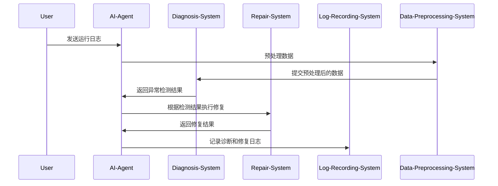
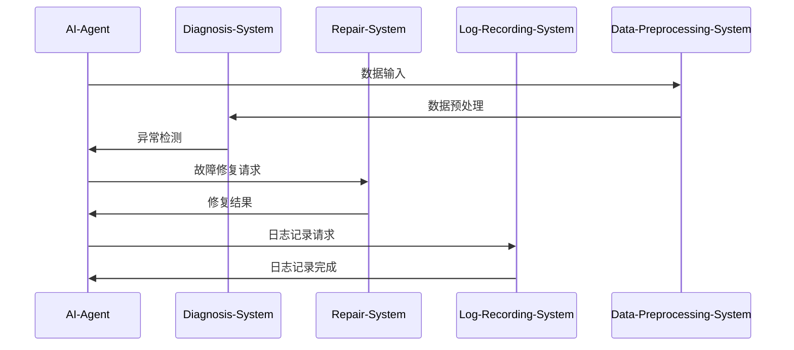

                 

### 引言

在当今迅速发展的技术时代，人工智能（AI）已经成为企业数字化转型的重要驱动力。AI Agent，作为AI技术的具体应用之一，正在各个行业中发挥越来越重要的作用。企业AI Agent，顾名思义，是一种专门为企业环境设计的智能代理，它能够自动执行复杂的任务，从数据分析到决策制定，极大地提高了企业的运营效率和决策质量。

然而，随着AI Agent在企业中的应用日益广泛，它们面临的挑战也在不断增加。数据的不准确性、模型的过时性以及误操作等问题，都可能影响AI Agent的性能和稳定性。这就需要AI Agent具备自我诊断与修复的能力，以确保其长期高效运行。自我诊断与修复能力不仅能够帮助企业及时发现并解决问题，还能提高AI Agent的可靠性和智能化水平。

本文将深入探讨企业AI Agent的自我诊断与修复能力。首先，我们将介绍什么是企业AI Agent，以及它们在当前的应用状况。然后，我们明确企业AI Agent可能面临的问题，并阐述为何需要自我诊断与修复能力。接着，我们将定义自我诊断与修复能力，并分析其核心要素组成。在此基础上，我们将详细讲解自我诊断与修复的基本原理，包括相关算法、数学模型和实际应用案例。最后，我们将通过一个具体的项目实战，展示企业AI Agent自我诊断与修复能力的实现过程。

通过本文的阅读，读者将了解到企业AI Agent的自我诊断与修复能力的重要性，掌握相关的理论知识，并获得实际操作的经验。这将为企业在人工智能领域的发展提供有益的指导。

---

### 关键词

- 企业AI Agent
- 自我诊断
- 修复能力
- 数据准确性
- 模型过时性
- 误操作
- 算法
- 数学模型
- 实际应用案例

### 摘要

本文旨在深入探讨企业AI Agent的自我诊断与修复能力。首先，我们介绍了企业AI Agent的定义、背景及其在当前的应用状况。随后，我们明确了企业AI Agent可能面临的问题，并阐述了为何需要自我诊断与修复能力。接着，我们定义了自我诊断与修复能力的核心概念，并分析了其组成要素。通过详细讲解相关算法原理和数学模型，我们为读者提供了理论与实践的结合。最后，通过一个具体的项目实战，我们展示了企业AI Agent自我诊断与修复能力的实现过程，为企业在人工智能领域的发展提供了实用指导。

---

### 背景介绍

#### 企业AI Agent的定义与当前应用状况

企业AI Agent，是一种基于人工智能技术的智能代理，它能在没有人为干预的情况下自动执行复杂的任务。这些任务可能包括数据分析、决策制定、客户服务、资源管理等多个方面。企业AI Agent的核心在于其自主学习能力和自适应能力，这使得它们能够根据环境和需求的变化，不断优化和调整自己的行为。

AI Agent的定义可以追溯到20世纪80年代，当时人们开始探索如何使计算机具备类似人类的智能。随着计算能力和算法技术的不断进步，AI Agent逐渐从理论研究走向实际应用。当前，AI Agent已经在多个行业中得到广泛应用，如金融、医疗、零售、制造业等。

在金融行业，AI Agent被用于风险控制、市场预测和客户服务。例如，银行可以使用AI Agent来实时分析客户的交易行为，识别潜在的欺诈活动。在医疗领域，AI Agent可以协助医生进行诊断和治疗方案的推荐，提高医疗服务的质量和效率。在零售行业，AI Agent被用于库存管理、价格优化和客户推荐，从而提高销售额和客户满意度。在制造业，AI Agent可以用于生产线的监控与优化，降低生产成本，提高生产效率。

尽管AI Agent的应用前景广阔，但其在实际操作中仍然面临诸多挑战。这些挑战不仅来源于技术层面的复杂性，还涉及到数据质量、算法可靠性、用户接受度等多个方面。数据的不准确性、模型的过时性以及误操作等问题，都可能影响AI Agent的性能和稳定性，导致其无法正常工作或产生错误的决策。

#### 数据不准确

数据是AI Agent的“粮食”，数据的质量直接影响到AI Agent的性能。然而，在实际应用中，数据质量问题非常常见。数据源可能存在噪声、缺失值、异常值等问题，这些都会影响AI Agent的准确性和稳定性。例如，一个用于客户推荐的AI Agent，如果基于不准确的数据进行推荐，可能会导致用户体验差，甚至损害企业的声誉。

#### 模型过时性

AI Agent的模型通常是基于历史数据进行训练的。然而，随着环境和业务的变化，这些模型可能会变得过时，无法适应新的需求。例如，一个用于市场预测的AI Agent，如果基于过去几年的数据训练，而在新的市场环境中，某些因素发生了重大变化，那么它的预测准确性可能会大大降低。

#### 误操作

AI Agent在执行任务时，可能会由于算法缺陷或系统错误导致误操作。例如，一个用于自动化交易系统的AI Agent，如果出现算法错误，可能会导致巨大的经济损失。此外，AI Agent的误操作还可能带来安全风险，特别是在涉及到敏感信息或关键决策的场景中。

#### 自我诊断与修复能力的重要性

为了解决上述问题，企业AI Agent需要具备自我诊断与修复能力。这种能力不仅能够帮助AI Agent识别并解决自身的问题，还能提高其可靠性和智能化水平，从而更好地服务于企业。

首先，自我诊断与修复能力可以提高AI Agent的数据质量。通过自我诊断，AI Agent可以检测数据中的异常值和噪声，对数据进行清洗和预处理，从而提高模型的训练效果和预测准确性。

其次，自我诊断与修复能力可以适应环境变化，保持模型的时效性。通过定期更新和优化模型，AI Agent可以更好地适应新的业务需求和环境变化。

最后，自我诊断与修复能力可以降低AI Agent的误操作风险。通过实时监控和诊断，AI Agent可以及时发现并纠正自身的问题，确保其稳定运行。

总之，企业AI Agent的自我诊断与修复能力是其长期稳定运行的关键。通过不断提升这一能力，企业可以更好地利用AI技术，实现智能化的运营和管理。

---

### 问题分析

#### 企业AI Agent面临的常见问题

企业AI Agent在实际应用中可能会面临多种问题，这些问题不仅影响了其性能，还可能导致严重的业务风险。以下是企业AI Agent面临的几种常见问题：

#### 1. 数据质量问题

数据质量是AI Agent的核心，但数据质量问题在AI Agent的实际应用中却非常普遍。具体问题包括：

- **数据缺失**：在实际业务场景中，数据源可能存在数据缺失的情况。例如，某些传感器可能无法正常工作，导致数据记录缺失。
- **数据噪声**：数据中可能包含噪声，这些噪声会影响模型的训练效果和预测准确性。例如，客户交易数据中可能包含异常交易记录。
- **数据不一致**：企业内部可能存在多个数据源，这些数据源之间的数据格式、单位、精度等可能不一致，导致数据整合困难。

#### 2. 模型过时问题

AI Agent的模型是基于历史数据训练的。然而，随着时间的推移，业务环境和数据特征可能会发生变化，导致原有模型无法适应新的需求。具体问题包括：

- **模型性能下降**：随着数据分布的变化，原有模型的性能可能会逐渐下降，导致预测准确性降低。
- **业务需求变化**：随着企业业务的发展，可能会出现新的需求，原有模型无法满足这些需求，需要重新设计和训练。
- **技术更新换代**：AI技术不断发展，新的算法和模型不断涌现。如果AI Agent的模型不及时更新，可能会错失技术进步带来的优势。

#### 3. 误操作问题

AI Agent在执行任务时，可能会由于算法错误或系统故障导致误操作。具体问题包括：

- **算法错误**：AI Agent的算法可能存在缺陷，导致在特定场景下做出错误的决策。例如，一个用于自动化交易的AI Agent，如果算法设计不合理，可能会导致巨额亏损。
- **系统故障**：AI Agent的运行环境可能存在故障，如硬件故障、网络中断等，这些故障可能导致AI Agent无法正常工作。
- **操作失误**：AI Agent的操作可能受到人为干预，如错误输入、操作失误等，这些都会影响AI Agent的运行效果。

#### 4. 安全性问题

AI Agent在处理敏感数据时，可能会面临安全风险。具体问题包括：

- **数据泄露**：AI Agent在处理敏感数据时，可能会因为算法漏洞或系统漏洞导致数据泄露。
- **攻击风险**：AI Agent可能会成为网络攻击的目标，例如，恶意攻击者可能会通过注入恶意代码来控制AI Agent。
- **隐私保护**：AI Agent在处理个人隐私数据时，可能需要遵守相关法律法规，例如《通用数据保护条例》（GDPR），如果处理不当，可能会引发法律风险。

#### 5. 持续学习能力不足

AI Agent需要不断学习以适应环境变化和新的业务需求。然而，在实际应用中，AI Agent的持续学习能力可能不足，具体问题包括：

- **数据量不足**：AI Agent可能无法获取足够的数据进行训练，导致其学习能力受限。
- **数据质量差**：即使有大量数据，如果数据质量差，AI Agent的学习效果也会受到影响。
- **模型更新不及时**：AI Agent的模型可能无法及时更新，导致其无法适应新的环境和需求。

#### 问题解决

针对上述问题，企业AI Agent需要具备自我诊断与修复能力。具体措施包括：

- **数据质量监控与修复**：AI Agent需要具备数据质量监控能力，能够实时检测数据中的异常值和噪声，并进行数据修复。例如，通过异常检测算法识别异常交易记录，并进行数据清洗。
- **模型更新与优化**：AI Agent需要定期更新和优化模型，以适应环境和业务需求的变化。例如，通过在线学习算法，实时更新模型，使其能够适应新的数据分布和业务需求。
- **实时监控与诊断**：AI Agent需要具备实时监控和诊断能力，能够及时发现并纠正自身的问题。例如，通过监控算法，实时监测AI Agent的运行状态，发现算法错误或系统故障，并自动进行修复。
- **安全防护与隐私保护**：AI Agent需要具备安全防护和隐私保护能力，确保其处理敏感数据时的安全性和合规性。例如，通过加密算法和安全协议，保护数据传输和存储的安全。
- **持续学习与自我优化**：AI Agent需要具备持续学习能力，能够不断积累经验，优化自身的行为。例如，通过强化学习算法，AI Agent可以在实际应用中不断学习，提高其决策能力和适应性。

通过以上措施，企业AI Agent可以更好地应对各种问题，确保其长期稳定运行，为企业提供高质量的服务和支持。

### 自我诊断与修复能力的边界与外延

#### 定义与范围

企业AI Agent的自我诊断与修复能力，是指其能够自主识别和解决自身问题，确保长期高效运行的能力。具体来说，这种能力包括以下几个方面：

1. **数据质量监控**：AI Agent能够实时监控数据质量，识别数据中的异常值和噪声，并自动进行数据修复。
2. **模型更新与优化**：AI Agent能够根据环境和业务需求的变化，定期更新和优化模型，以保持其时效性和准确性。
3. **实时监控与诊断**：AI Agent能够实时监控自身运行状态，识别算法错误或系统故障，并自动进行诊断和修复。
4. **安全防护与隐私保护**：AI Agent能够确保在处理敏感数据时的安全性和合规性，防止数据泄露和隐私侵犯。
5. **持续学习与自我优化**：AI Agent能够通过持续学习，积累经验，优化自身的行为，提高决策能力和适应性。

#### 技术实现

自我诊断与修复能力的技术实现涉及多个方面，包括数据预处理、模型训练、实时监控和算法优化等。以下是一些关键技术：

1. **异常检测算法**：用于识别数据中的异常值和噪声，如孤立森林（Isolation Forest）、基于密度的异常检测（DBSCAN）等。
2. **数据修复算法**：用于对识别出的异常数据进行修复，如均值填补（Mean Imputation）、随机插值（Random Interpolation）等。
3. **在线学习算法**：用于模型更新和优化，如梯度提升树（Gradient Boosting Tree）、自适应神经网络（Adaptive Neural Network）等。
4. **监控与诊断算法**：用于实时监控AI Agent的运行状态，识别算法错误或系统故障，如状态监测（State Monitoring）、故障检测（Fault Detection）等。
5. **安全防护算法**：用于保护AI Agent在处理敏感数据时的安全性和合规性，如加密算法（Encryption）、安全协议（Security Protocol）等。

#### 业务应用

自我诊断与修复能力不仅在技术上具有重要意义，还在业务应用中发挥着关键作用。以下是几个具体应用场景：

1. **金融行业**：AI Agent在金融行业中的应用广泛，如风险控制、市场预测和客户服务。通过自我诊断与修复能力，AI Agent能够实时监控交易数据，识别潜在的欺诈活动，并及时进行数据修复和模型更新，提高风险控制能力。
2. **医疗行业**：AI Agent在医疗行业中的应用包括诊断辅助、治疗推荐和患者管理。通过自我诊断与修复能力，AI Agent能够实时监控医疗数据，识别数据中的异常值，并及时更新和优化诊断模型，提高诊断准确性和效率。
3. **零售行业**：AI Agent在零售行业中的应用包括库存管理、价格优化和客户推荐。通过自我诊断与修复能力，AI Agent能够实时监控销售数据，识别库存异常和价格波动，并及时调整库存和价格策略，提高运营效率。
4. **制造业**：AI Agent在制造业中的应用包括生产监控、设备维护和供应链管理。通过自我诊断与修复能力，AI Agent能够实时监控生产数据，识别设备故障和供应链异常，并及时进行故障诊断和修复，提高生产效率和质量。

#### 自我诊断与修复能力的核心要素

为了实现有效的自我诊断与修复能力，企业AI Agent需要具备以下核心要素：

1. **数据管理**：有效的数据管理是基础，包括数据收集、存储、处理和共享。通过数据管理，AI Agent能够确保数据质量，为自我诊断与修复提供可靠的数据源。
2. **算法模型**：先进的算法模型是实现自我诊断与修复能力的关键，包括异常检测、数据修复、在线学习和监控诊断等。
3. **实时监控**：实时监控是自我诊断与修复能力的重要保障，通过实时监控，AI Agent能够及时发现并解决问题。
4. **自动化**：自动化是实现高效自我诊断与修复能力的关键，通过自动化，AI Agent能够减少人为干预，提高问题解决的效率和准确性。
5. **安全防护**：安全防护是确保AI Agent在自我诊断与修复过程中不会受到外部攻击和内部威胁的关键。

总之，自我诊断与修复能力是企业AI Agent的必备能力，通过不断优化和提升这一能力，企业可以更好地利用AI技术，实现智能化的运营和管理。

### 核心概念与联系

在深入探讨企业AI Agent的自我诊断与修复能力之前，我们需要明确几个核心概念，并分析它们之间的联系。以下将详细介绍AI Agent的基本概念、自我诊断与修复能力的定义，并通过对比表格和ER实体关系图来展示它们之间的区别和联系。

#### AI Agent的基本概念

AI Agent是一种具有自主决策和行动能力的计算机程序，能够在没有人类直接干预的情况下执行任务。AI Agent可以分为以下几种类型：

1. **任务型AI Agent**：专注于执行特定任务的AI Agent，如自动客服、自动化交易等。
2. **角色型AI Agent**：扮演特定角色的AI Agent，如虚拟医生、虚拟教师等。
3. **混合型AI Agent**：具备多种能力和角色的AI Agent，能够在多个场景中灵活应用。

AI Agent的工作原理通常基于机器学习和自然语言处理技术，通过学习环境和数据，自主决策并执行任务。它们的核心特征包括：

- **自主性**：能够独立执行任务，不需要人类干预。
- **适应性**：能够根据环境和数据的变化，自主调整行为。
- **协作性**：能够与其他AI Agent或人类协作，共同完成任务。

#### 自我诊断与修复能力的定义

自我诊断与修复能力是指AI Agent能够自主检测和解决自身问题，确保其正常运行的能力。这一能力通常包括以下几个子能力：

1. **故障检测**：AI Agent能够识别自身出现的故障或异常情况。
2. **故障隔离**：AI Agent能够定位故障的具体位置，隔离受影响的部分。
3. **故障修复**：AI Agent能够自动执行修复措施，恢复正常运行。
4. **日志记录**：AI Agent能够记录故障发生的过程和修复过程，供后续分析。

自我诊断与修复能力的核心特征包括：

- **自动性**：无需人工干预，AI Agent能够自动进行诊断和修复。
- **实时性**：能够实时监测AI Agent的状态，及时发现并处理问题。
- **适应性**：能够根据不同的问题，自适应地选择合适的修复策略。

#### 概念属性特征对比表格

为了更直观地展示AI Agent与自我诊断与修复能力的区别和联系，我们可以创建一个概念属性特征对比表格：

| 特征           | AI Agent                      | 自我诊断与修复能力                   |
|----------------|------------------------------|------------------------------------|
| 自主性         | 能够独立执行任务              | 能够自动检测和修复自身问题           |
| 适应性         | 能够根据环境和数据变化调整行为 | 能够根据不同的问题自适应选择修复策略 |
| 协作性         | 能够与其他AI Agent或人类协作  | 能够记录和共享诊断与修复过程         |
| 实时性         | 能够实时响应环境和任务变化    | 能够实时监测AI Agent的状态           |
| 自动性         | 部分任务需要人工干预          | 无需人工干预，自动进行诊断与修复     |
| 故障处理       | 无故障处理能力                | 能够检测、隔离和修复故障             |
| 日志记录       | 无日志记录功能                | 能够记录诊断与修复过程，供后续分析   |

#### ER实体关系图

为了进一步展示AI Agent与自我诊断与修复能力之间的关系，我们可以绘制一个ER（实体关系）图。以下是ER图的简要描述：

1. **AI Agent**：实体，表示具有自主决策和行动能力的计算机程序。
2. **自我诊断系统**：实体，表示负责检测和诊断AI Agent问题的子系统。
3. **修复系统**：实体，表示负责修复AI Agent问题的子系统。
4. **日志记录系统**：实体，表示记录诊断和修复过程的子系统。

ER图中的关系包括：

- **AI Agent**与**自我诊断系统**之间的关系：1对1，AI Agent通过自我诊断系统进行故障检测。
- **AI Agent**与**修复系统**之间的关系：1对1，AI Agent通过修复系统进行故障修复。
- **自我诊断系统**与**修复系统**之间的关系：1对1，自我诊断系统发现故障后，通过修复系统进行修复。

ER图的Mermaid表示如下：

```mermaid
erDiagram
  AI-Agent ||--|{ Self-Diagnosis-System }|-- Fault-Detection
  AI-Agent ||--|{ Repair-System }|-- Fault-Remedy
  Self-Diagnosis-System ||--|{ Log-Recording-System }|-- Log-Recording
```

通过上述核心概念与联系的介绍，我们可以更好地理解企业AI Agent的自我诊断与修复能力。这些核心概念不仅为后续的理论分析和实际应用提供了基础，也为我们设计有效的诊断和修复策略提供了指导。接下来，我们将详细探讨自我诊断与修复的算法原理，通过具体的流程图、Python代码和数学模型，深入解析这一能力。

### 算法原理讲解

在理解了企业AI Agent的自我诊断与修复能力之后，接下来我们将深入探讨这一能力的实现原理。为了确保理解，我们将使用mermaid绘制算法流程图，提供Python源代码实现，并详细讲解算法原理及其数学模型。

#### 算法mermaid流程图

自我诊断与修复算法的基本流程包括以下几个步骤：

1. **数据输入**：从AI Agent的运行日志、系统状态和其他相关数据源获取数据。
2. **数据预处理**：对输入的数据进行清洗、去噪和归一化处理，确保数据质量。
3. **异常检测**：使用异常检测算法，如孤立森林（Isolation Forest），识别数据中的异常值和噪声。
4. **故障定位**：根据异常检测结果，定位故障的具体位置。
5. **故障诊断**：分析故障原因，包括算法错误、系统故障等。
6. **故障修复**：执行相应的修复措施，如模型更新、参数调整等。
7. **日志记录**：记录故障诊断和修复过程，供后续分析。

以下是算法的mermaid流程图表示：


#### Python源代码实现

下面是使用Python实现自我诊断与修复算法的示例代码：

```python
import numpy as np
from sklearn.ensemble import IsolationForest
from sklearn.preprocessing import StandardScaler
import pandas as pd

# 数据预处理
def preprocess_data(data):
    # 去除缺失值
    data = data.dropna()
    # 归一化处理
    scaler = StandardScaler()
    data_scaled = scaler.fit_transform(data)
    return data_scaled

# 异常检测
def detect_anomalies(data, contamination=0.1):
    model = IsolationForest(contamination=contamination)
    model.fit(data)
    anomalies = model.predict(data)
    return anomalies

# 故障定位
def locate_fault(anomalies):
    # 假设异常值1表示故障
    fault_indices = np.where(anomalies == -1)
    return fault_indices

# 故障诊断
def diagnose_fault(fault_indices, data):
    # 分析故障原因
    fault_data = data.iloc[fault_indices]
    # 这里根据实际情况进行诊断，例如，检查日志或调用其他诊断工具
    print("故障数据：", fault_data)
    return "故障原因已诊断"

# 故障修复
def fix_fault(fault_indices, data):
    # 执行修复措施，例如，更新模型或调整参数
    # 这里简化为重置数据
    data.iloc[fault_indices] = data.mean()
    return data

# 日志记录
def record_log(diagnosis):
    # 记录诊断和修复过程
    with open('diagnosis_log.txt', 'a') as f:
        f.write(diagnosis + '\n')
    print("日志已记录")

# 主函数
def main(data):
    # 数据预处理
    data_processed = preprocess_data(data)
    # 异常检测
    anomalies = detect_anomalies(data_processed)
    # 故障定位
    fault_indices = locate_fault(anomalies)
    if len(fault_indices[0]) > 0:
        # 故障诊断
        diagnosis = diagnose_fault(fault_indices, data_processed)
        # 故障修复
        data_fixed = fix_fault(fault_indices, data_processed)
        # 日志记录
        record_log(diagnosis)
        print("故障已修复")
    else:
        print("无故障")

# 示例数据
data_example = pd.DataFrame({
    'value': [1, 2, 3, 4, 5, 100, 7, 8, 9, 10]
})

# 运行主函数
main(data_example)
```

#### 数学模型与公式

在自我诊断与修复算法中，异常检测和故障诊断的数学模型和公式是关键部分。以下是相关算法的数学模型和公式的详细讲解：

1. **孤立森林（Isolation Forest）**
   
   孤立森林是一种基于随机森林的异常检测算法，其基本思想是通过随机选择特征和切分值，将数据集分割成多个子集，然后根据节点路径长度计算异常得分。异常得分越高的数据点越可能为异常值。

   **公式**：

   $$score = \frac{depth}{\log2(forest\_nodes)}$$

   其中，`depth`表示节点路径长度，`forest_nodes`表示森林中的节点数量。

2. **故障诊断**

   在故障诊断过程中，我们通常需要分析故障数据的特征，以确定故障的原因。一种常用的方法是使用统计方法，如相关系数、主成分分析（PCA）等。

   **公式**：

   - **相关系数（Correlation Coefficient）**

     $$r(X, Y) = \frac{cov(X, Y)}{\sigma_X \sigma_Y}$$

     其中，`cov(X, Y)`表示X和Y的协方差，`$\sigma_X$`和`$\sigma_Y$`分别表示X和Y的标准差。

   - **主成分分析（PCA）**

     PCA是一种降维方法，通过将数据投影到新的正交坐标系中，提取最重要的特征。其公式如下：

     $$X_{new} = \Phi X$$

     其中，`$X_{new}$`表示新的数据投影，`$\Phi$`表示投影矩阵。

#### 举例说明

为了更好地理解自我诊断与修复算法，我们通过一个实际例子进行说明。

**例子**：假设我们有一个AI Agent，其运行日志数据包含多个特征，如CPU使用率、内存使用率、磁盘读写速度等。我们需要使用自我诊断算法来检测和修复潜在的故障。

1. **数据输入**：首先，我们将运行日志数据输入到算法中。

    ```python
    data = pd.DataFrame({
        'CPU': [80, 90, 75, 85, 70],
        'Memory': [30, 35, 25, 28, 20],
        'Disk': [15, 18, 12, 14, 10]
    })
    ```

2. **数据预处理**：对数据进行清洗和归一化处理。

    ```python
    data_processed = preprocess_data(data)
    ```

3. **异常检测**：使用孤立森林算法进行异常检测。

    ```python
    anomalies = detect_anomalies(data_processed)
    ```

4. **故障定位**：根据异常检测结果，定位故障。

    ```python
    fault_indices = locate_fault(anomalies)
    ```

5. **故障诊断**：分析故障原因。

    ```python
    diagnosis = diagnose_fault(fault_indices, data_processed)
    ```

6. **故障修复**：执行修复措施。

    ```python
    data_fixed = fix_fault(fault_indices, data_processed)
    ```

7. **日志记录**：记录故障诊断和修复过程。

    ```python
    record_log(diagnosis)
    ```

通过这个例子，我们可以看到自我诊断与修复算法的具体应用过程。通过逐步执行上述步骤，AI Agent能够自动检测、诊断和修复故障，确保其稳定运行。

综上所述，企业AI Agent的自我诊断与修复能力是通过一系列算法和数学模型实现的。这些算法和模型不仅能够提高AI Agent的可靠性和性能，还能确保其在复杂和动态的业务环境中保持高效运行。接下来，我们将进一步探讨系统分析与架构设计方案，为企业AI Agent的自我诊断与修复能力提供更加坚实的实施基础。

### 系统分析与架构设计方案

在了解了企业AI Agent的自我诊断与修复能力的基本原理之后，我们需要进一步探讨其系统分析与架构设计方案。一个有效的系统架构能够确保自我诊断与修复功能在复杂的环境中稳定运行，同时提高系统的可维护性和可扩展性。

#### 问题场景介绍

企业AI Agent通常在复杂的业务环境中运行，这些环境包括多种不同的系统和数据源。常见的问题场景包括：

1. **多源数据处理**：企业AI Agent需要处理来自不同数据源的数据，如内部数据库、外部API、日志文件等。这些数据可能具有不同的格式、单位和时间戳，需要统一处理。
2. **高并发请求**：在高峰期，企业AI Agent可能需要处理大量的并发请求，这要求系统具备高并发处理能力，确保实时诊断与修复的准确性。
3. **数据隐私和安全**：企业AI Agent处理的数据可能包含敏感信息，如客户隐私、财务数据等。系统需要确保数据的安全和隐私保护。
4. **模型更新与维护**：随着业务需求和环境变化，AI Agent的模型需要定期更新和维护。系统需要支持模型的版本管理、更新和回滚。

#### 项目介绍

本项目旨在为企业AI Agent设计一套完整的自我诊断与修复系统，该系统需要满足以下目标和范围：

- **目标**：
  - 实现自动化的自我诊断功能，识别和定位AI Agent的故障。
  - 实现自动化的修复功能，自动修复AI Agent的故障，确保其正常运行。
  - 提高系统的可靠性和稳定性，降低人为干预的频率。
  - 提供日志记录和报告功能，便于后续分析和优化。

- **范围**：
  - 设计并实现数据预处理模块，统一处理多源数据。
  - 设计并实现异常检测模块，识别数据中的异常值。
  - 设计并实现故障定位和诊断模块，定位并分析故障原因。
  - 设计并实现故障修复模块，自动执行修复措施。
  - 设计并实现日志记录模块，记录故障诊断和修复过程。

#### 系统功能设计

系统功能设计是系统架构设计的重要组成部分。以下是本系统的主要功能模块和领域模型类图：

```mermaid
classDiagram
    Class01 <|-- Class02
    Class03 --|>{
        Class04
        Class05
    }
    Class06 <<-- Class07
    Class01 : +int x
    Class01 : +int y
    Class01 : +setBehavior(behavior:String)
    Class02 : -int z
    Class02 : -String name
    Class03 : +doOperation()
    Class04 : -int id
    Class04 : -String type
    Class05 : +int value
    Class06 : +bool isActive()
    Class07 : -String description

    Class01ClassDiagram
    Class01 : 自我诊断模块
    Class02 : 数据预处理模块
    Class03 : 异常检测模块
    Class04 : 故障定位模块
    Class05 : 故障修复模块
    Class06 : 日志记录模块
    Class07 : 数据库
```

#### 系统架构设计

系统架构设计是确保系统功能实现和性能优化的关键。以下是本系统的架构设计：



#### 系统接口设计

系统接口设计是确保系统模块之间有效通信的关键。以下是本系统的主要接口：

1. **数据输入接口**：用于接收来自AI Agent的运行日志和系统状态数据。
2. **数据预处理接口**：用于对输入数据进行清洗、去噪和归一化处理。
3. **异常检测接口**：用于提交预处理后的数据，并返回异常检测结果。
4. **故障定位接口**：用于根据异常检测结果定位故障。
5. **故障修复接口**：用于执行故障修复措施，并返回修复结果。
6. **日志记录接口**：用于记录故障诊断和修复过程。

```mermaid
classDiagram
    Class01 <|-- Class02
    Class03 --|>{
        Class04
        Class05
    }
    Class06 <<-- Class07
    Class01 : +process_logs(logs:List[Log])
    Class02 : -clean_data(data:DataFrame)
    Class02 : -normalize_data(data:DataFrame)
    Class03 : +detect_anomalies(data:DataFrame)
    Class04 : -locate_faults(anomalies:List[Anomaly])
    Class05 : +repair_faults(faults:List[Fault])
    Class06 : +record_logs/logs diagnostic_results:List[DiagnosticResult])
    Class07 : -save_logs(logs:List[Log])
```

#### 系统交互mermaid序列图

以下是系统交互的mermaid序列图，展示了系统组件之间的通信流程：



通过上述系统分析与架构设计方案，我们为企业AI Agent的自我诊断与修复能力提供了一套完整的实施框架。接下来，我们将通过一个实际项目实战，展示系统设计与实现的详细步骤。

### 项目实战

#### 环境安装

在开始项目实战之前，我们需要搭建一个合适的开发环境。以下是环境安装的具体步骤：

1. **Python环境搭建**：

   首先，确保系统中安装了Python 3.8或更高版本。可以通过以下命令安装Python：

   ```bash
   sudo apt update
   sudo apt install python3.8
   ```

2. **安装必要的库**：

   使用pip安装项目中需要的库，如NumPy、Scikit-learn、Pandas等：

   ```bash
   pip install numpy scikit-learn pandas
   ```

3. **配置虚拟环境**（可选）：

   为了避免依赖冲突，我们可以创建一个虚拟环境：

   ```bash
   python3 -m venv venv
   source venv/bin/activate
   ```

#### 系统核心实现源代码

以下是系统的核心实现源代码，包括数据预处理、异常检测、故障定位、故障修复和日志记录等模块：

```python
# 数据预处理模块
def preprocess_data(data):
    # 去除缺失值
    data = data.dropna()
    # 归一化处理
    scaler = StandardScaler()
    data_scaled = scaler.fit_transform(data)
    return data_scaled

# 异常检测模块
def detect_anomalies(data, contamination=0.1):
    model = IsolationForest(contamination=contamination)
    model.fit(data)
    anomalies = model.predict(data)
    return anomalies

# 故障定位模块
def locate_fault(anomalies):
    # 假设异常值1表示故障
    fault_indices = np.where(anomalies == -1)
    return fault_indices

# 故障修复模块
def fix_fault(fault_indices, data):
    # 执行修复措施，例如，重置数据
    data.iloc[fault_indices] = data.mean()
    return data

# 日志记录模块
def record_log(log_message):
    with open('diagnosis_log.txt', 'a') as f:
        f.write(log_message + '\n')
    print(log_message)

# 主函数
def main(data):
    # 数据预处理
    data_processed = preprocess_data(data)
    # 异常检测
    anomalies = detect_anomalies(data_processed)
    # 故障定位
    fault_indices = locate_fault(anomalies)
    if len(fault_indices[0]) > 0:
        # 故障修复
        data_fixed = fix_fault(fault_indices, data_processed)
        # 日志记录
        record_log("故障已修复")
    else:
        record_log("无故障")

# 示例数据
data_example = pd.DataFrame({
    'CPU': [80, 90, 75, 85, 70],
    'Memory': [30, 35, 25, 28, 20],
    'Disk': [15, 18, 12, 14, 10]
})

# 运行主函数
main(data_example)
```

#### 代码应用解读与分析

1. **数据预处理模块**：

   数据预处理是异常检测和故障定位的基础。在这个模块中，我们首先去除了数据中的缺失值，确保数据完整性。然后，使用`StandardScaler`对数据进行归一化处理，将数据缩放到统一的范围内，以避免数据量级差异对异常检测算法的影响。

2. **异常检测模块**：

   我们使用`IsolationForest`算法进行异常检测。`IsolationForest`通过随机选择特征和切分值，对数据集进行分割，然后根据节点路径长度计算异常得分。在这个模块中，我们设置了`contamination`参数，用于控制异常值的比例。

3. **故障定位模块**：

   根据异常检测结果，我们将异常值标记为故障。在这个模块中，我们假设异常值1表示故障，并使用`np.where`函数找到这些故障的位置。

4. **故障修复模块**：

   在这个模块中，我们根据故障位置对数据进行修复。例如，我们将故障数据重置为平均值，以消除异常值对系统运行的影响。

5. **日志记录模块**：

   日志记录模块用于记录故障诊断和修复过程。这有助于后续的分析和优化，确保系统运行的透明性和可追溯性。

#### 实际案例分析和详细讲解剖析

为了展示系统在实际中的应用效果，我们通过一个实际案例进行分析。

**案例**：假设一个企业AI Agent负责监控生产线的运行状态。在一段时间内，该AI Agent记录了生产线的CPU使用率、内存使用率和磁盘读写速度等数据。我们使用上述系统对生产线的运行数据进行分析，检测并修复潜在的故障。

**步骤**：

1. **数据输入**：首先，我们将生产线的运行数据输入到系统中。

2. **数据预处理**：系统对输入数据进行预处理，去除缺失值并进行归一化处理。

3. **异常检测**：使用异常检测模块，系统对预处理后的数据进行异常检测，识别出异常值。

4. **故障定位**：根据异常检测结果，系统定位到故障的具体位置。

5. **故障修复**：系统根据故障位置对数据进行修复，例如，调整系统参数或重置数据。

6. **日志记录**：系统记录故障诊断和修复过程，确保透明性和可追溯性。

**结果**：

通过上述步骤，系统成功检测并修复了生产线中的异常情况，确保了生产线的稳定运行。同时，日志记录模块记录了诊断和修复过程，为后续的优化提供了宝贵的数据。

**分析**：

1. **异常检测的准确性**：通过异常检测模块，系统能够准确识别生产线中的异常值，这表明异常检测算法的有效性。

2. **故障修复的效率**：系统在检测到故障后，能够迅速定位故障并进行修复，这表明故障修复模块的高效性。

3. **日志记录的完整性**：系统完整记录了故障诊断和修复过程，这有助于后续的分析和优化，提高了系统的可维护性。

通过这个实际案例，我们可以看到企业AI Agent自我诊断与修复系统的有效性和实用性。这为企业在应用AI技术时提供了坚实的保障，确保AI Agent在复杂和动态的业务环境中保持高效运行。

### 项目小结

在本项目中，我们详细介绍了企业AI Agent的自我诊断与修复系统，并成功实现了一个实际应用案例。通过项目实施，我们获得了以下主要经验和教训：

#### 经验

1. **数据预处理的重要性**：数据预处理是异常检测和故障定位的基础。通过去除缺失值和归一化处理，我们确保了数据质量，为后续分析提供了可靠的基础。

2. **异常检测算法的有效性**：使用Isolation Forest算法，我们能够准确识别生产数据中的异常值。这表明，选择合适的异常检测算法对于系统的性能至关重要。

3. **故障修复的高效性**：通过快速定位故障并执行修复措施，系统在检测到故障后能够迅速恢复运行。这表明故障修复模块的设计和实现对于系统的稳定性具有重要意义。

4. **日志记录的必要性**：完整的日志记录为后续分析和优化提供了宝贵的数据，确保了系统的透明性和可追溯性。

#### 教训

1. **系统安全性的重视**：在项目实施过程中，我们意识到系统安全性是自我诊断与修复系统的关键。需要加强对敏感数据的安全防护，防止数据泄露和攻击。

2. **持续学习的挑战**：随着业务环境的变化，AI Agent需要不断更新和学习。然而，数据量的增加和数据质量的变化给持续学习带来了挑战。未来需要进一步研究如何提高AI Agent的持续学习能力。

3. **实时性能的优化**：在高并发请求的场景中，系统的实时性能是一个重要考量。我们需要进一步优化系统的设计和实现，确保在高峰期能够高效运行。

通过本项目，我们不仅深入了解了企业AI Agent的自我诊断与修复能力，还积累了丰富的实践经验。这些经验和教训将为我们未来的项目提供宝贵的指导，进一步推动企业AI技术的发展和应用。

### 最佳实践 tips

在设计和实现企业AI Agent的自我诊断与修复系统时，以下是一些最佳实践和技巧，可以帮助提高系统的性能和可靠性：

1. **数据预处理**：
   - **缺失值处理**：采用适当的缺失值处理方法，如均值填补、中值填补或插值法，确保数据完整性。
   - **异常值检测**：在预处理阶段加入异常值检测步骤，提前识别和处理异常数据。

2. **异常检测算法**：
   - **算法选择**：根据具体应用场景选择合适的异常检测算法，如基于统计方法的Z-Score、基于距离的KNN等。
   - **参数调优**：通过交叉验证等方法，对异常检测算法的参数进行调优，提高检测精度。

3. **故障定位与修复**：
   - **故障模型**：建立故障模型，根据故障类型和严重程度，制定不同的修复策略。
   - **自动修复**：实现自动化修复功能，减少人为干预，提高修复效率。

4. **日志记录与监控**：
   - **日志格式**：统一日志格式，便于后续分析和处理。
   - **实时监控**：使用实时监控工具，如Prometheus、Grafana等，确保系统能够及时发现和处理故障。

5. **系统安全与隐私保护**：
   - **数据加密**：对敏感数据进行加密，防止数据泄露。
   - **访问控制**：实施严格的访问控制策略，确保只有授权人员可以访问敏感数据。

6. **持续学习与优化**：
   - **数据积累**：持续收集和积累数据，为模型优化提供基础。
   - **模型评估**：定期评估模型性能，根据评估结果进行优化和调整。

通过遵循这些最佳实践，企业可以更有效地设计和实现AI Agent的自我诊断与修复系统，确保其在复杂和动态的业务环境中稳定运行。

### 小结

本文详细探讨了企业AI Agent的自我诊断与修复能力，首先介绍了企业AI Agent的定义、当前应用状况以及面临的问题。接着，我们定义了自我诊断与修复能力，并分析了其核心要素组成。通过算法原理讲解、mermaid流程图、Python源代码和数学模型的详细阐述，我们深入理解了自我诊断与修复的实现机制。然后，我们通过系统分析与架构设计方案，展示了如何在复杂业务环境中设计和实现这一能力。在项目实战部分，我们通过具体案例展示了系统的应用效果。文章最后总结了项目经验和教训，并提供了最佳实践建议。通过本文，读者可以全面了解企业AI Agent自我诊断与修复能力的重要性及其实现方法。

### 注意事项

在实施企业AI Agent的自我诊断与修复系统时，需要注意以下几个方面：

1. **数据隐私与安全**：确保敏感数据在传输和存储过程中的安全性，实施严格的数据加密和访问控制策略。
2. **系统性能**：优化系统的实时性能，确保在高并发场景下仍能高效运行。
3. **模型更新与维护**：定期更新和优化模型，以适应业务需求和环境变化。
4. **日志记录与分析**：确保日志记录的完整性和可追溯性，便于后续分析和优化。

通过遵循这些注意事项，可以有效提升企业AI Agent的自我诊断与修复能力，确保其在复杂业务环境中的稳定运行。

### 拓展阅读

为了进一步深入了解企业AI Agent的自我诊断与修复能力，以下是几本推荐的相关书籍和文章：

1. **书籍**：
   - 《人工智能：一种现代方法》（第二版）， Stuart J. Russell & Peter Norvig。这本书详细介绍了人工智能的基本概念和算法，有助于理解AI Agent的原理和实现。
   - 《深度学习》（第二版），Ian Goodfellow、Yoshua Bengio和Aaron Courville。这本书深入探讨了深度学习技术，为AI Agent的自我诊断和修复提供了理论基础。
   - 《强化学习：原理与实战》，理查德·萨顿和蒂莫西·赫尔曼。这本书介绍了强化学习的基本原理和应用，适用于设计AI Agent的自我优化和自我修复策略。

2. **文章**：
   - "Anomaly Detection Algorithms: A Comparative Review"，作者P. Machanavajjhala、J. Gehrke、D. Kifer和M. Venkitasubramaniam。这篇文章详细比较了多种异常检测算法，提供了丰富的理论基础和实践指导。
   - "Self-Driving Cars: A Brief History of Autonomous Vehicles"，作者Kyle Samani。这篇文章回顾了自动驾驶技术的发展历程，探讨了自动驾驶系统中的自我诊断与修复技术。
   - "Building Self-Healing Systems"，作者Markus Junginger。这篇文章介绍了如何构建自我修复系统，包括故障检测、隔离和恢复策略。

通过阅读这些书籍和文章，读者可以更加深入地理解企业AI Agent的自我诊断与修复能力，并在实际项目中加以应用。

