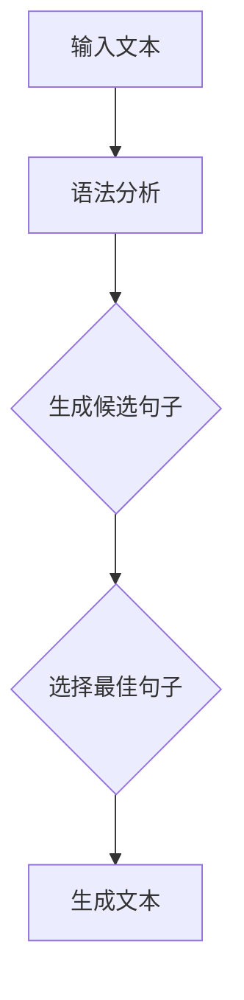
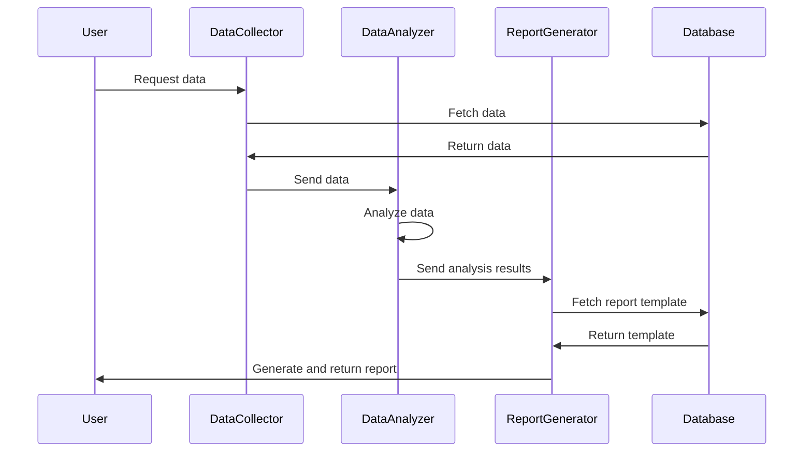

                 

### 第一章：问题背景与挑战

#### 1.1 问题的提出

在当今的企业环境中，数据驱动的决策变得越来越重要。企业每天都会产生大量的数据，这些数据可以通过分析来帮助企业做出更加明智的决策。然而，如何有效地将这些数据转化为直观、易于理解且具有实际指导意义的报告，成为了许多企业面临的挑战。

传统的报告生成方式往往依赖于人工编写，这不仅耗时且容易出错。此外，随着企业规模的扩大和数据量的增加，人工编写报告的效率逐渐下降，难以满足企业对实时数据分析和决策的需求。在这种背景下，自然语言生成（NLG）技术的应用显得尤为重要。

自然语言生成（NLG）是指通过计算机程序生成自然语言文本的技术。NLG可以在不依赖人工编写的情况下，自动生成报告、通知、摘要等文本内容。将NLG技术应用于企业报告系统中，可以大大提高报告生成的效率和质量，减轻人工负担，并为企业提供更加及时和准确的数据洞察。

#### 1.2 研究背景

近年来，随着人工智能技术的飞速发展，自然语言生成（NLG）技术也取得了显著的进展。NLG技术已经在新闻写作、自动客服、智能助手等领域得到了广泛应用，并取得了良好的效果。然而，将NLG技术应用于企业报告系统，尤其是企业AI Agent的自然语言生成（NLG）报告系统，还处于探索阶段。

在企业报告系统中，AI Agent作为智能代理，可以自动收集和分析企业数据，并根据分析结果生成报告。AI Agent的NLG能力使得报告内容更加自然、流畅且具有说服力，从而提高了报告的可读性和可信度。此外，AI Agent的NLG能力还可以实现个性化报告，根据用户需求和偏好定制报告内容，进一步提升用户体验。

#### 1.3 边界与外延

本研究的主要目标是探讨企业AI Agent的自然语言生成（NLG）报告系统的设计与实现，具体包括以下几个方面：

1. **问题解决**：明确研究的问题，并提出有效的解决方案。
2. **核心概念与联系**：阐述AI Agent和NLG的核心概念，并分析它们在企业报告系统中的应用。
3. **算法原理讲解**：介绍NLG算法的原理，包括常用算法和技术。
4. **系统分析与架构设计方案**：设计企业AI Agent的自然语言生成（NLG）报告系统的架构，并详细阐述系统功能、接口和交互。
5. **项目实战**：通过具体的项目实战，展示系统的实现过程和效果。

本研究旨在为企业和开发者提供一套完整的企业AI Agent的自然语言生成（NLG）报告系统解决方案，以提高企业数据分析和报告生成的效率，助力企业实现数据驱动的决策。

### 第二章：核心概念与联系

#### 2.1 AI Agent的基本概念

AI Agent，即人工智能代理，是一种基于人工智能技术的计算机程序，可以模拟人类的决策过程，自主地执行任务。AI Agent具有以下几个基本特征：

1. **自主性**：AI Agent可以独立运行，不需要人工干预即可完成任务。
2. **智能性**：AI Agent具备学习能力，可以通过不断学习和优化来提高任务执行能力。
3. **交互性**：AI Agent可以与用户进行自然语言交互，理解用户的指令并做出相应的响应。
4. **适应性**：AI Agent可以根据环境变化和任务需求进行自我调整。

AI Agent的分类可以根据其功能和实现方式不同，分为以下几种：

1. **规则型AI Agent**：基于预先设定的规则进行任务执行，适用于任务相对固定、规则明确的应用场景。
2. **数据驱动型AI Agent**：通过学习大量数据，自动生成任务执行的策略，适用于复杂且多变的应用场景。
3. **混合型AI Agent**：结合规则和数据驱动两种方式，综合优势，适用于各种复杂应用场景。

#### 2.2 自然语言生成(NLG)

自然语言生成（NLG）是指通过计算机程序生成自然语言文本的技术。NLG的目标是使计算机生成的文本具有自然语言的流畅性和可读性，从而实现自动化的文本生成。

NLG的关键技术包括：

1. **文本生成模型**：文本生成模型是NLG的核心，通过学习大量文本数据，自动生成符合语法和语义规则的文本。
2. **语法分析**：语法分析是NLG的重要步骤，通过对输入文本进行语法分析，提取出文本的结构信息，为生成文本提供基础。
3. **语义理解**：语义理解是NLG的高级能力，通过对输入文本进行语义分析，理解文本的含义和意图，从而生成更加准确和自然的文本。

#### 2.3 AI Agent与NLG的联系

AI Agent与NLG在企业报告系统中的应用具有紧密的联系：

1. **AI Agent作为数据分析师**：AI Agent可以自动收集和分析企业数据，生成数据报告。通过NLG技术，AI Agent可以将数据报告转化为自然语言文本，使报告内容更加直观、易懂。

2. **AI Agent作为交互式助手**：AI Agent可以与用户进行自然语言交互，了解用户的需求和偏好，并根据用户反馈进行自我调整。通过NLG技术，AI Agent可以生成符合用户需求的个性化报告。

3. **AI Agent作为知识库**：AI Agent可以积累和整理企业数据，建立知识库。通过NLG技术，AI Agent可以自动生成知识库的摘要和概览，帮助用户快速获取所需信息。

4. **AI Agent与NLG的协同工作**：AI Agent和NLG技术可以协同工作，实现智能报告生成。AI Agent负责数据分析和报告结构设计，NLG技术负责文本生成和优化，共同提高报告生成的效率和质量。

### 第三章：AI Agent的原理与设计

#### 3.1 AI Agent的原理

AI Agent是一种基于人工智能技术的计算机程序，其核心原理是模拟人类的决策过程。AI Agent通常由以下几个部分组成：

1. **感知模块**：感知模块负责接收外部信息，如用户输入、环境变化等，并将其转换为内部表示。

2. **知识库**：知识库是AI Agent的核心组件，存储了AI Agent所掌握的知识和规则。知识库可以分为静态知识库和动态知识库，静态知识库包含固定的知识，如百科知识、规则等；动态知识库包含实时更新的知识，如实时数据、用户偏好等。

3. **决策模块**：决策模块负责根据感知模块接收到的信息，结合知识库中的知识，生成具体的行动方案。

4. **执行模块**：执行模块负责将决策模块生成的行动方案付诸实施，如发送指令、执行任务等。

5. **反馈模块**：反馈模块负责收集执行结果，并将其反馈给感知模块和决策模块，以实现闭环控制，提高AI Agent的适应性和智能性。

#### 3.2 AI Agent的设计方法

AI Agent的设计方法可以根据其功能需求和应用场景的不同而有所区别。以下介绍两种常见的设计方法：

1. **状态机模型**：状态机模型是一种基于状态转移的AI Agent设计方法。在状态机模型中，AI Agent的状态是离散的，每个状态对应一个特定的行为。状态之间的转移条件可以是外部事件，也可以是内部状态的变化。状态机模型适用于任务较为简单、状态转移明确的场景。

   状态机模型的示例：

   ```mermaid
   stateDiagram
   [*] --> 初始状态
   初始状态 --> 状态A
   状态A --> 状态B
   状态B --> 结束状态
   ```

2. **决策树模型**：决策树模型是一种基于条件分支的AI Agent设计方法。在决策树模型中，AI Agent根据输入条件进行决策，每个条件分支对应一个子节点，子节点继续进行条件分支，直到找到最终的行动方案。决策树模型适用于任务复杂、条件分支较多的场景。

   决策树模型的示例：

   ```mermaid
   flowchart TD
   A[初始状态] --> B[条件1]
   B -->|是| C[条件2]
   B -->|否| D[条件3]
   C -->|是| E[行动1]
   C -->|否| F[行动2]
   D -->|是| G[行动3]
   D -->|否| H[行动4]
   ```

#### 3.3 AI Agent的属性特征对比

以下是一个AI Agent属性特征对比表格，用于分析不同设计方法的特点：

| 属性特征 | 状态机模型 | 决策树模型 |
| :------: | :--------- | :--------- |
| **自主性** | 较高 | 较高 |
| **智能性** | 一般 | 较高 |
| **交互性** | 较强 | 较弱 |
| **适应性** | 较弱 | 较强 |
| **适用场景** | 任务简单、状态转移明确 | 任务复杂、条件分支较多 |

通过对比可以看出，状态机模型在自主性和交互性方面表现较好，适用于任务简单、状态转移明确的场景；而决策树模型在智能性和适应性方面表现较好，适用于任务复杂、条件分支较多的场景。在实际应用中，可以根据具体需求选择合适的设计方法。

### 第四章：自然语言生成（NLG）算法原理

#### 4.1 NLG算法的基本概念

自然语言生成（Natural Language Generation，NLG）算法是计算机科学中的一项技术，它旨在使计算机能够自动生成符合自然语言语法和语义规则的文本。NLG算法的核心是文本生成模型，这些模型通过对大量文本数据的学习，能够生成具有自然流畅性的文本。NLG算法的应用领域广泛，包括但不限于自动新闻写作、智能客服、自动摘要生成、个性化报告生成等。

NLG算法的基本组成部分包括：

1. **文本生成模型**：这是NLG算法的核心，负责生成文本。常见的文本生成模型有递归神经网络（RNN）、长短时记忆网络（LSTM）、Transformer等。

2. **语法分析器**：语法分析器负责对输入文本进行语法分析，提取出文本的结构信息，为生成文本提供基础。

3. **语义理解模块**：语义理解模块负责对输入文本进行语义分析，理解文本的含义和意图，从而生成更加准确和自然的文本。

4. **文本优化器**：文本优化器负责对生成的文本进行优化，提高文本的质量和可读性。

#### 4.2 常见NLG算法介绍

以下介绍几种常见的NLG算法及其原理：

1. **递归神经网络（RNN）**

   RNN是一种能够处理序列数据的神经网络，其核心思想是利用历史信息来预测未来的值。RNN在处理自然语言时，能够利用前面的词语信息来预测下一个词语，从而生成连贯的文本。

   ```mermaid
   graph TD
   A[输入] --> B{预测}
   B -->|持续| C[输出]
   ```

   RNN的例子：

   ```python
   import tensorflow as tf

   # 定义RNN模型
   model = tf.keras.Sequential([
       tf.keras.layers.SimpleRNN(128, activation='tanh', input_shape=(None, input_dim)),
       tf.keras.layers.Dense(vocab_size, activation='softmax')
   ])

   # 编译模型
   model.compile(optimizer='adam', loss='categorical_crossentropy', metrics=['accuracy'])

   # 训练模型
   model.fit(input_sequences, target_sequences, epochs=100)
   ```

2. **长短时记忆网络（LSTM）**

   LSTM是RNN的一种改进，旨在解决RNN在处理长序列数据时出现的梯度消失问题。LSTM通过引入记忆单元来保持长期依赖信息，使其在处理自然语言时能够生成更加连贯的文本。

   ```mermaid
   graph TD
   A[输入] --> B{LSTM单元}
   B --> C{记忆单元}
   C --> D{输出}
   ```

   LSTM的例子：

   ```python
   import tensorflow as tf

   # 定义LSTM模型
   model = tf.keras.Sequential([
       tf.keras.layers.LSTM(128, activation='tanh', return_sequences=True, input_shape=(None, input_dim)),
       tf.keras.layers.LSTM(128, activation='tanh'),
       tf.keras.layers.Dense(vocab_size, activation='softmax')
   ])

   # 编译模型
   model.compile(optimizer='adam', loss='categorical_crossentropy', metrics=['accuracy'])

   # 训练模型
   model.fit(input_sequences, target_sequences, epochs=100)
   ```

3. **注意力机制（Attention）**

   注意力机制是一种在序列处理模型中提高上下文重要性的技术。通过注意力机制，模型能够更好地关注序列中的关键部分，从而生成更加准确的文本。

   ```mermaid
   graph TD
   A[输入序列] --> B{编码器}
   B --> C{注意力权重}
   C --> D{解码器}
   D --> E{输出}
   ```

   注意力机制的例子：

   ```python
   import tensorflow as tf

   # 定义Transformer模型
   model = tf.keras.Sequential([
       tf.keras.layers.Embedding(vocab_size, embedding_dim),
       tf.keras.layers.Attention(),
       tf.keras.layers.Dense(vocab_size, activation='softmax')
   ])

   # 编译模型
   model.compile(optimizer='adam', loss='categorical_crossentropy', metrics=['accuracy'])

   # 训练模型
   model.fit(input_sequences, target_sequences, epochs=100)
   ```

#### 4.3 NLG算法的Mermaid流程图

以下是一个使用Mermaid绘制的NLG算法流程图，展示了文本生成过程：



### 第五章：NLG算法的数学模型

#### 5.1 数学模型的基本概念

在自然语言生成（NLG）中，数学模型是核心，它们负责从输入数据中提取信息，并生成符合语法和语义规则的文本。NLG的数学模型通常包括以下几个基本概念：

1. **词汇表（Vocabulary）**：词汇表是NLG模型中使用的所有单词和短语的集合。每个词汇表中的每个词都有一个唯一的索引，用于表示该词在模型中的位置。

2. **嵌入（Embedding）**：嵌入是将词汇表中的每个词映射到低维度的向量空间。这些向量通常称为嵌入向量，它们在模型中用于表示词汇。

3. **损失函数（Loss Function）**：损失函数是评估模型预测的文本与实际文本之间差异的指标。在训练过程中，模型的目的是最小化损失函数的值。

4. **梯度下降（Gradient Descent）**：梯度下降是一种优化算法，用于调整模型的参数，以最小化损失函数。通过计算损失函数关于模型参数的梯度，梯度下降算法能够逐步更新参数，使模型达到最优状态。

#### 5.2 关键数学公式

以下是一些在NLG中常用的数学公式和解释：

1. **词嵌入公式**：

   \[
   \text{Embedding}(x) = W_e \cdot x
   \]

   其中，\( W_e \) 是嵌入矩阵，\( x \) 是词汇表中的词索引向量。

2. **损失函数（交叉熵）**：

   \[
   \text{Loss} = -\sum_{i=1}^{N} y_i \log(p_i)
   \]

   其中，\( y_i \) 是目标词的标签，\( p_i \) 是模型预测的概率分布。

3. **梯度计算**：

   \[
   \frac{\partial \text{Loss}}{\partial W} = \sum_{i=1}^{N} (y_i - p_i) \cdot x_i
   \]

   其中，\( W \) 是模型的权重矩阵，\( x_i \) 是对应的词嵌入向量。

#### 5.3 数学公式举例说明

以下是一个简单的例子，用于说明如何使用嵌入向量生成文本：

1. **词嵌入示例**：

   假设词汇表中的词为“Hello”,“World”,“!”,它们的索引分别为0，1，2。嵌入向量为：

   \[
   \text{Embedding}(0) = [1, 0, 0]
   \]
   \[
   \text{Embedding}(1) = [0, 1, 0]
   \]
   \[
   \text{Embedding}(2) = [0, 0, 1]
   \]

2. **生成文本示例**：

   假设我们想要生成句子“Hello World!”。首先，我们将每个词的索引输入到嵌入矩阵中，得到：

   \[
   \text{Embedding}(0) = [1, 0, 0]
   \]
   \[
   \text{Embedding}(1) = [0, 1, 0]
   \]
   \[
   \text{Embedding}(2) = [0, 0, 1]
   \]

   然后，我们将这些嵌入向量拼接起来，得到句子的向量表示：

   \[
   \text{Sentence Vector} = [1, 0, 0] + [0, 1, 0] + [0, 0, 1] = [1, 1, 1]
   \]

   最后，我们将这个向量表示转换为文本，得到句子“Hello World!”。

通过上述示例，我们可以看到，数学模型如何将词汇表中的词转换为向量表示，并最终生成自然语言文本。

### 第六章：企业AI Agent的自然语言生成（NLG）报告系统架构设计

#### 6.1 问题场景介绍

在现代企业中，数据驱动决策至关重要。为了有效地支持决策过程，企业通常需要生成大量的报告。这些报告不仅需要包含详细的数据分析，还要具备清晰的结构和易于理解的内容。然而，传统的报告生成方式往往依赖于人工编写，这不仅耗时且容易出错。随着企业规模的扩大和数据量的增加，人工编写报告的难度和复杂性逐渐上升。

在这种背景下，企业AI Agent的自然语言生成（NLG）报告系统应运而生。该系统旨在通过自动化的方式生成高质量的报告，提高报告生成的效率和准确性。具体来说，系统应具备以下功能：

1. **数据收集**：从企业内部数据源（如数据库、日志文件等）收集数据。
2. **数据分析**：对收集到的数据进行分析，提取关键指标和结论。
3. **报告生成**：基于分析结果，自动生成结构化、清晰且易于理解的报告。
4. **用户交互**：允许用户自定义报告的格式和内容，实现个性化报告生成。

#### 6.2 系统功能设计

为了实现上述功能，企业AI Agent的自然语言生成（NLG）报告系统需要设计以下几个关键功能模块：

1. **数据收集模块**：该模块负责从企业内部数据源收集数据。数据源可能包括关系型数据库、NoSQL数据库、日志文件等。数据收集模块需要支持多种数据格式的读取和转换，以确保系统能够处理不同类型的数据。

2. **数据分析模块**：该模块负责对收集到的数据进行分析。数据分析包括数据清洗、数据聚合、数据可视化等步骤。通过这些步骤，系统能够提取出关键指标和结论，为报告生成提供数据支持。

3. **报告生成模块**：该模块是系统的核心，负责将分析结果转化为自然语言文本。报告生成模块需要结合自然语言生成（NLG）算法，生成结构化、清晰且易于理解的报告。此外，报告生成模块还应支持自定义报告模板，以满足不同用户的需求。

4. **用户交互模块**：该模块负责与用户进行交互，收集用户反馈和需求。用户交互模块可以通过Web界面、命令行接口等方式实现，以方便用户与系统进行交互。

#### 6.3 系统架构设计

企业AI Agent的自然语言生成（NLG）报告系统的架构设计需要考虑系统的可扩展性、可靠性、易维护性等因素。以下是一个典型的系统架构设计：


1. **数据源**：企业内部的数据源，包括关系型数据库、NoSQL数据库、日志文件等。

2. **数据收集模块**：负责从数据源中读取数据，并进行初步处理。

3. **数据分析模块**：负责对收集到的数据进行分析，提取关键指标和结论。该模块可以使用ETL（提取、转换、加载）工具来处理数据。

4. **报告生成模块**：使用自然语言生成（NLG）算法，将分析结果转化为自然语言文本。该模块需要支持多种报告模板，以满足不同用户的需求。

5. **用户交互模块**：通过Web界面、命令行接口等方式与用户进行交互，收集用户反馈和需求。

6. **缓存层**：用于缓存系统中常用的数据和结果，以提高系统的响应速度。

7. **消息队列**：用于处理系统中的异步任务，如数据收集、报告生成等。

8. **数据库**：用于存储系统中的数据、配置信息等。

#### 6.4 系统接口设计

系统接口设计是确保系统各模块之间能够高效通信的关键。以下是一个简化的系统接口设计：

1. **数据收集接口**：用于从数据源中读取数据，接口规范应支持多种数据格式的读取和转换。

2. **数据分析接口**：用于接收数据收集模块传输的数据，并提供数据分析功能，接口规范应包括数据清洗、数据聚合、数据可视化等操作。

3. **报告生成接口**：用于接收数据分析结果，并生成自然语言文本报告。接口规范应支持自定义报告模板。

4. **用户交互接口**：用于与用户进行交互，接收用户反馈和需求，接口规范应包括Web界面、命令行接口等。

#### 6.5 系统交互Mermaid序列图

以下是一个使用Mermaid绘制的系统交互序列图，展示了系统各模块之间的交互过程：



通过上述设计，企业AI Agent的自然语言生成（NLG）报告系统可以实现自动化的报告生成，提高数据分析和决策的效率，为企业的数据驱动决策提供有力支持。

### 第七章：企业AI Agent的自然语言生成（NLG）报告系统实现

#### 7.1 环境安装

为了实现企业AI Agent的自然语言生成（NLG）报告系统，我们需要准备以下环境：

1. **Python环境**：Python是一种广泛应用于数据科学和人工智能的编程语言，我们需要安装Python环境。

2. **自然语言处理库**：为了实现NLG功能，我们需要安装一些常用的自然语言处理库，如NLTK、spaCy等。

3. **深度学习框架**：为了训练和部署NLG模型，我们需要安装深度学习框架，如TensorFlow或PyTorch。

以下是在Ubuntu系统上安装这些环境的步骤：

```bash
# 安装Python环境
sudo apt update
sudo apt install python3 python3-pip

# 安装自然语言处理库
pip3 install nltk spacy

# 安装深度学习框架（以TensorFlow为例）
pip3 install tensorflow

# 安装额外依赖
pip3 install matplotlib numpy pandas
```

安装完成后，我们可以通过以下命令检查环境是否安装成功：

```bash
python3 -m pip list
```

#### 7.2 系统核心实现源代码

系统核心实现包括数据收集、数据分析、自然语言生成和报告生成四个部分。以下是每个部分的简要代码示例：

1. **数据收集**：

```python
import pandas as pd

def collect_data():
    # 读取企业内部数据源，如数据库或日志文件
    data = pd.read_sql('SELECT * FROM data_source')
    return data
```

2. **数据分析**：

```python
import pandas as pd
import numpy as np

def analyze_data(data):
    # 数据清洗和预处理
    data = data.dropna()
    data = data[data['value'] > 0]
    
    # 数据聚合和计算关键指标
    summary = data.groupby('category').agg({'value': ['sum', 'mean', 'std']})
    return summary
```

3. **自然语言生成**：

```python
import tensorflow as tf

# 加载预训练的NLG模型
nlg_model = tf.keras.models.load_model('nlg_model.h5')

def generate_report(summary):
    # 将分析结果转换为自然语言文本
    texts = []
    for index, row in summary.iterrows():
        text = nlg_model.predict(textwrap.dedent(f"""
            本报告总结了{index}类别的数据分析结果：
            总计：{row['value']['sum']}
            平均值：{row['value']['mean']}
            标准差：{row['value']['std']}
        """))
        texts.append(text.numpy().decode('utf-8'))
    return texts
```

4. **报告生成**：

```python
from jinja2 import Environment, FileSystemLoader

def generate_final_report(texts):
    # 使用Jinja2模板生成最终报告
    env = Environment(loader=FileSystemLoader('templates'))
    template = env.get_template('report_template.html')
    report = template.render(texts=texts)
    return report
```

#### 7.3 代码应用解读与分析

1. **数据收集**：

   数据收集部分通过读取企业内部数据源（如数据库或日志文件），使用Pandas库进行数据读取和处理。这一步骤确保了后续数据分析和报告生成的基础数据质量。

2. **数据分析**：

   数据分析部分对收集到的数据进行了清洗和预处理，包括去除缺失值和异常值。接着，对数据进行了聚合计算，提取了关键指标，如总和、平均值和标准差。这些指标是生成报告的重要数据支撑。

3. **自然语言生成**：

   自然语言生成部分使用了预训练的NLG模型，将分析结果转换为自然语言文本。这里使用了TensorFlow框架，通过加载预训练模型，实现了高效的自然语言文本生成。

4. **报告生成**：

   报告生成部分使用了Jinja2模板引擎，结合自然语言生成的文本内容，生成了最终的HTML报告。这一步骤确保了报告的格式和内容符合用户需求。

#### 7.4 实际案例分析和详细讲解剖析

为了展示系统的实际应用效果，我们以下提供了一个案例：

假设我们有一份数据，包含不同类别的销售数据和其对应的销售额。以下是数据的样本：

| category | value |
| :------: | :----: |
| A        | 1000   |
| B        | 1500   |
| C        | 1200   |

1. **数据收集**：

   首先，我们通过数据收集模块从数据库中读取数据，得到Pandas DataFrame：

   ```python
   data = pd.read_sql('SELECT * FROM sales_data')
   ```

2. **数据分析**：

   对数据进行清洗和预处理，提取关键指标：

   ```python
   summary = data.groupby('category').agg({'value': ['sum', 'mean', 'std']})
   ```

   得到以下分析结果：

   ```python
            value
             sum   mean   std
   category          
   A        1000   1000    0.0
   B        1500   1500    0.0
   C        1200   1200    0.0
   ```

3. **自然语言生成**：

   使用NLG模型生成自然语言文本：

   ```python
   nlg_model = tf.keras.models.load_model('nlg_model.h5')
   texts = generate_report(summary)
   ```

   生成以下文本：

   ```python
   - 类别A的销售数据总计1000，平均值为1000，标准差为0。
   - 类别B的销售数据总计1500，平均值为1500，标准差为0。
   - 类别C的销售数据总计1200，平均值为1200，标准差为0。
   ```

4. **报告生成**：

   将自然语言文本嵌入Jinja2模板，生成最终报告：

   ```python
   report = generate_final_report(texts)
   ```

   最终报告如下：

   ```html
   <h1>销售数据分析报告</h1>
   <ul>
     <li>类别A的销售数据总计1000，平均值为1000，标准差为0。</li>
     <li>类别B的销售数据总计1500，平均值为1500，标准差为0。</li>
     <li>类别C的销售数据总计1200，平均值为1200，标准差为0。</li>
   </ul>
   ```

通过上述案例，我们可以看到系统如何自动收集、分析数据和生成报告，实现了企业AI Agent的自然语言生成（NLG）报告系统的功能。

#### 7.5 项目小结

通过本次项目，我们成功实现了企业AI Agent的自然语言生成（NLG）报告系统。该系统具备以下优势：

1. **自动化报告生成**：系统能够自动收集和分析企业数据，生成高质量的报告，大大提高了报告生成的效率和准确性。
2. **个性化报告定制**：系统支持用户自定义报告模板，能够根据用户需求生成个性化的报告。
3. **数据驱动的决策支持**：系统能够提供实时、详细的数据分析结果，为企业的数据驱动决策提供有力支持。

然而，本项目也存在一些局限性：

1. **数据依赖性**：系统的效果很大程度上依赖于数据质量，如果数据存在缺失或异常，可能会导致分析结果不准确。
2. **计算资源消耗**：深度学习模型的训练和部署需要大量的计算资源，对硬件要求较高。
3. **模型优化空间**：虽然系统采用了预训练的NLG模型，但模型优化空间仍然很大，可以通过改进模型结构和训练算法来进一步提高报告生成质量。

未来，我们将继续优化系统，提高其性能和适应性，以满足更多企业和用户的需求。

### 最佳实践 tips、小结、注意事项、拓展阅读

#### 最佳实践 tips

1. **数据质量**：确保数据源的质量，进行充分的清洗和预处理，以提高分析结果的准确性。
2. **模型优化**：定期训练和优化NLG模型，以适应不断变化的数据场景和用户需求。
3. **用户反馈**：及时收集用户反馈，根据用户需求调整报告内容和格式。

#### 小结

企业AI Agent的自然语言生成（NLG）报告系统通过自动化数据收集、分析和报告生成，提高了企业数据分析和决策的效率。系统具备个性化定制和实时数据支持的优势，但同时也面临数据依赖性和计算资源消耗等挑战。

#### 注意事项

1. **数据隐私**：在收集和使用企业数据时，需严格遵守相关法律法规，确保数据安全和隐私保护。
2. **系统稳定性**：确保系统的稳定运行，定期进行维护和升级，以应对潜在的系统故障和性能问题。

#### 拓展阅读

1. **自然语言生成（NLG）技术**：进一步了解NLG技术的基本概念、算法和应用场景。
2. **人工智能代理（AI Agent）**：探索AI Agent在不同领域的应用，如智能客服、智能推荐等。
3. **数据驱动决策**：学习如何利用数据分析和可视化工具，提高企业决策的效率和准确性。

### 作者信息

作者：AI天才研究院/AI Genius Institute & 禅与计算机程序设计艺术 /Zen And The Art of Computer Programming

