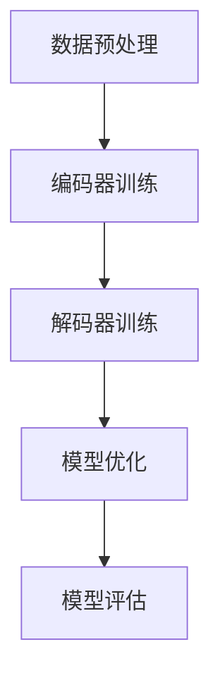
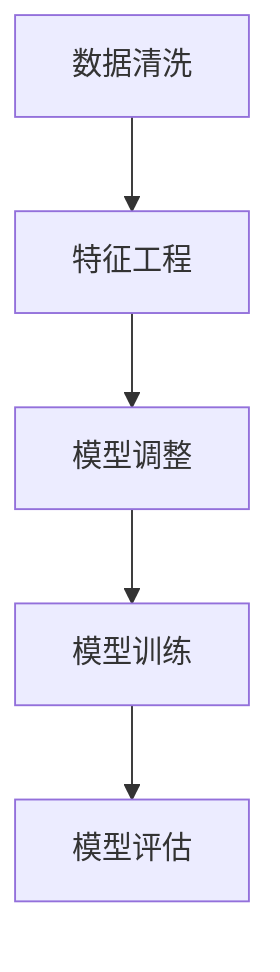
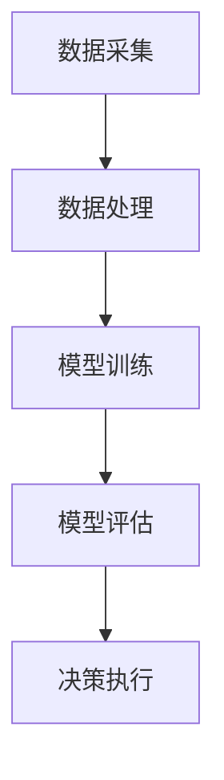
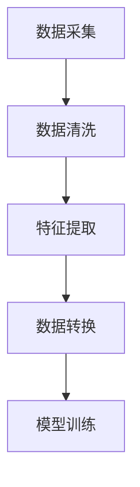

                 


## 第一部分：自监督学习基础

### 第1章：自监督学习的概述

#### 1.1 自监督学习的背景与意义

**问题背景**

随着人工智能技术的不断发展，传统的监督学习算法已经无法满足日益复杂的业务需求。特别是在企业AI Agent（人工智能代理）的开发中，标准数据的获取往往受到限制，而自监督学习作为一种无监督学习方法，能够在仅使用部分标注数据或者不使用标注数据的情况下进行模型训练，从而弥补了传统监督学习的不足。

**问题描述**

自监督学习是一种特殊的人工智能学习方式，它利用未标记的数据自动地生成标签或特征，然后使用这些标签或特征进行模型训练。在企业AI Agent中，自监督学习的关键问题是如何有效地利用非标准数据来提升模型的性能。

**问题解决**

通过自监督学习，企业AI Agent可以在没有完整标注数据的情况下，利用已有数据中隐藏的信息进行学习，从而提高模型对非标准数据的处理能力。

**边界与外延**

自监督学习在应用场景上非常广泛，包括但不限于自然语言处理、图像识别、推荐系统等。其边界在于模型的泛化能力和对数据分布的适应性，外延则涉及到如何更好地利用非标准数据进行模型训练和优化。

**概念结构与核心要素组成**

自监督学习的核心结构包括数据预处理、模型训练、模型评估和模型部署。其中，数据预处理涉及数据清洗、数据增强等步骤；模型训练采用无监督或半监督学习算法；模型评估通常使用内部验证和外部验证方法；模型部署则关注模型在实际业务中的应用效果。

### 1.2 自监督学习的定义与分类

**定义**

自监督学习是一种无监督学习方法，它通过从未标记的数据中自动生成标签或特征，然后将这些标签或特征用于模型训练。

**分类**

自监督学习可以分为以下几类：

1. **预训练+微调**：先使用大量未标记的数据进行预训练，然后再使用少量标注数据对模型进行微调。
2. **自编码器**：通过编码器和解码器结构，将输入数据映射到低维空间，并重建输入数据。
3. **生成对抗网络（GAN）**：利用生成器和判别器之间的对抗关系进行训练。
4. **伪标签法**：使用已有模型对未标记数据进行预测，然后将预测结果作为伪标签用于后续训练。

### 1.3 自监督学习与传统监督学习的比较

**区别**

1. **数据需求**：自监督学习通常只需要部分标注数据或无标注数据，而传统监督学习需要大量完整标注的数据。
2. **模型性能**：自监督学习模型在处理非标准数据时往往表现更好，但可能在处理标准数据时稍逊一筹。
3. **计算资源**：自监督学习相对于传统监督学习需要更少的计算资源。

**联系**

自监督学习和传统监督学习在某些方面是互补的。例如，可以通过在自监督学习基础上添加少量标注数据进行微调，以进一步提高模型性能。

## 第2章：自监督学习中的核心概念与原理

### 2.1 核心概念

自监督学习的核心概念包括：

1. **数据自动生成标签**：利用数据自身的结构信息生成标签或特征。
2. **无监督学习算法**：使用无监督或半监督学习算法进行模型训练。
3. **模型泛化能力**：模型在未知数据上的表现能力。

### 2.2 自监督学习的数学模型

自监督学习的数学模型通常包括以下几个部分：

1. **损失函数**：用于衡量模型预测与真实标签之间的差距，如均方误差（MSE）或交叉熵损失（Cross-Entropy Loss）。
2. **优化算法**：用于调整模型参数以最小化损失函数，如梯度下降（Gradient Descent）或Adam优化器。

**数学模型示例：**

$$
\begin{aligned}
\text{损失函数} &= \frac{1}{n}\sum_{i=1}^{n}L(y_i, \hat{y_i}) + \lambda R(\theta) \\
\text{优化算法} &= \theta \leftarrow \theta - \alpha \frac{\partial}{\partial \theta}L(\theta)
\end{aligned}
$$

**公式解释：**

- $L(y_i, \hat{y_i})$：预测损失，衡量预测值$\hat{y_i}$与真实值$y_i$之间的差距。
- $\lambda R(\theta)$：正则化项，用于防止过拟合。
- $\alpha$：学习率，用于调整参数更新的步长。

### 2.3 自监督学习算法

自监督学习算法可以分为以下几类：

1. **自编码器**：通过编码器和解码器结构对数据进行重构。
2. **生成对抗网络（GAN）**：利用生成器和判别器之间的对抗关系进行训练。
3. **伪标签法**：使用已有模型对未标记数据进行预测，然后将预测结果作为伪标签用于后续训练。

**算法流程图：**



**代码示例（Python）：**

```python
import tensorflow as tf

# 编码器
encoder = tf.keras.Sequential([
    tf.keras.layers.Dense(64, activation='relu', input_shape=(784,)),
    tf.keras.layers.Dense(32, activation='relu')
])

# 解码器
decoder = tf.keras.Sequential([
    tf.keras.layers.Dense(32, activation='relu', input_shape=(32,)),
    tf.keras.layers.Dense(64, activation='relu'),
    tf.keras.layers.Dense(784, activation='sigmoid')
])

# 自编码器模型
autoencoder = tf.keras.Sequential([
    encoder,
    decoder
])

autoencoder.compile(optimizer='adam', loss='mse')
autoencoder.fit(x_train, x_train, epochs=50, batch_size=256, shuffle=True, validation_data=(x_test, x_test))
```

通过上述代码，我们可以构建一个简单的自编码器模型，并使用它来训练数据。在实际应用中，可以根据具体需求调整模型结构和训练参数。

## 第3章：非标准数据的概念与特征

### 3.1 非标准数据的定义和分类

**定义**

非标准数据是指不符合常规数据标准的数据，它们可能存在噪声、缺失、不一致等问题。

**分类**

非标准数据可以按照以下方式分类：

1. **噪声数据**：由于测量误差、设备故障等原因导致的数据异常。
2. **缺失数据**：由于数据记录不完整或丢失导致的数据空缺。
3. **不一致数据**：由于数据来源不一致、格式不统一等原因导致的数据冲突。

### 3.2 非标准数据的特点与挑战

**特点**

1. **多样性**：非标准数据具有多种类型和来源，形式多样。
2. **复杂性**：非标准数据通常包含噪声、缺失、不一致等问题，处理起来较为复杂。
3. **动态性**：非标准数据可能随着时间、环境等因素的变化而发生变化。

**挑战**

1. **数据质量**：非标准数据的质量往往较低，需要通过数据预处理来提高数据质量。
2. **模型适应性**：非标准数据的特点可能导致现有模型无法很好地适应，需要开发新的算法或调整模型结构。
3. **计算资源**：处理非标准数据通常需要更多的计算资源和时间。

### 3.3 非标准数据的处理方法

**方法**

1. **数据清洗**：通过去除噪声、填充缺失值、统一数据格式等方式提高数据质量。
2. **特征工程**：通过提取和转换特征，将非标准数据转换为适合模型训练的数据。
3. **模型调整**：针对非标准数据的特点，调整模型结构或参数，以提高模型的适应性和性能。



通过上述步骤，可以有效地处理非标准数据，并构建出适应非标准数据的模型。

## 第二部分：企业AI Agent的构建

### 第4章：企业AI Agent的架构设计与实现

#### 4.1 企业AI Agent的定义和目标

**定义**

企业AI Agent是指在企业环境中，能够自主执行特定任务的人工智能实体。

**目标**

企业AI Agent的目标是提高企业的运营效率、降低成本、提升客户体验等。

#### 4.2 企业AI Agent的架构设计

**架构设计**

企业AI Agent的架构设计通常包括以下几个模块：

1. **数据采集模块**：负责从企业内外部获取数据。
2. **数据处理模块**：负责清洗、转换和存储数据。
3. **模型训练模块**：负责使用自监督学习算法训练模型。
4. **模型评估模块**：负责评估模型的性能。
5. **决策执行模块**：负责根据模型输出执行决策。

**架构图：**



#### 4.3 企业AI Agent的实现方法

**实现方法**

1. **数据采集**：通过API、日志、数据库等方式获取企业数据。
2. **数据处理**：使用ETL（提取、转换、加载）工具清洗和转换数据。
3. **模型训练**：采用自监督学习算法，如自编码器、GAN等，训练模型。
4. **模型评估**：使用内部验证集和外部测试集评估模型性能。
5. **决策执行**：根据模型输出，执行相应的决策，如推荐商品、优化供应链等。

```python
# 数据采集
data = get_data_from_api()

# 数据处理
cleaned_data = data_cleaning(data)

# 模型训练
model = train_model(cleaned_data)

# 模型评估
evaluate_model(model)

# 决策执行
execute_decision(model)
```

通过上述步骤，可以构建一个企业AI Agent，并在实际业务中发挥作用。

### 第5章：自监督学习在AI Agent中的应用

#### 5.1 自监督学习在AI Agent训练中的应用

**应用**

自监督学习在AI Agent训练中的应用主要包括以下方面：

1. **数据增强**：通过自监督学习算法生成额外的训练数据。
2. **特征提取**：通过自监督学习算法提取数据中的关键特征。
3. **模型优化**：使用自监督学习算法优化模型参数。

**示例**

假设我们有一个图像识别任务，可以使用自编码器来提取图像特征。

```python
# 数据增强
augmented_images = data_augmentation(images)

# 特征提取
encoded_images = encoder.predict(augmented_images)

# 模型优化
model.compile(optimizer='adam', loss='mse')
model.fit(encoded_images, images, epochs=50, batch_size=32)
```

通过上述步骤，可以提高模型的识别性能。

#### 5.2 自监督学习在AI Agent优化中的应用

**应用**

自监督学习在AI Agent优化中的应用主要包括以下方面：

1. **模型压缩**：通过自监督学习算法减少模型参数。
2. **模型蒸馏**：通过自监督学习算法将知识从大模型转移到小模型。
3. **模型鲁棒性提升**：通过自监督学习算法增强模型的鲁棒性。

**示例**

假设我们有一个图像分类模型，可以使用自监督学习算法进行压缩和优化。

```python
# 模型压缩
small_model = compress_model(model)

# 模型蒸馏
knowledge = extract_knowledge(model)
small_model.load_knowledge(knowledge)

# 模型鲁棒性提升
robust_model = enhance_robustness(model)
```

通过上述步骤，可以优化AI Agent的模型，提高其在实际应用中的性能。

#### 5.3 自监督学习在AI Agent中的应用案例分析

**案例1：电商推荐系统**

**问题描述**：电商平台需要为用户推荐个性化的商品。

**解决方案**：使用自监督学习算法对用户行为数据进行预处理和特征提取，然后构建推荐模型。

**案例2：智能客服**

**问题描述**：企业需要提供高效的智能客服服务。

**解决方案**：使用自监督学习算法对客服对话数据进行分类和语义理解，然后构建智能客服模型。

**案例3：智能供应链**

**问题描述**：企业需要优化供应链管理，降低成本，提高效率。

**解决方案**：使用自监督学习算法对供应链数据进行分析和预测，然后构建智能供应链模型。

通过上述案例分析，可以看到自监督学习在AI Agent中的应用具有广泛的前景和潜力。

### 第6章：非标准数据在AI Agent中的应用

#### 6.1 非标准数据在AI Agent训练中的应用

**应用**

非标准数据在AI Agent训练中的应用主要包括以下方面：

1. **噪声数据处理**：通过自监督学习算法去除噪声数据。
2. **缺失数据处理**：通过自监督学习算法填充缺失数据。
3. **不一致数据处理**：通过自监督学习算法统一数据格式。

**示例**

假设我们有一个包含噪声、缺失和不一致数据的训练数据集。

```python
# 噪声数据处理
cleaned_data = denoise_data(data)

# 缺失数据处理
filled_data = fill_missing_data(data)

# 不一致数据处理
standardized_data = standardize_data(data)
```

通过上述步骤，可以提高训练数据的质量，从而提高AI Agent的训练效果。

#### 6.2 非标准数据在AI Agent决策中的应用

**应用**

非标准数据在AI Agent决策中的应用主要包括以下方面：

1. **动态数据适应**：根据非标准数据的动态变化调整决策。
2. **不确定性处理**：考虑非标准数据的不确定性，制定灵活的决策策略。
3. **风险控制**：通过自监督学习算法识别和降低非标准数据带来的风险。

**示例**

假设我们有一个涉及非标准数据的决策问题。

```python
# 动态数据适应
dynamic_decision = adapt_to_dynamic_data(data)

# 不确定性处理
uncertainty_decision = handle_uncertainty(data)

# 风险控制
risk_control = control_risk(data)
```

通过上述步骤，可以提高AI Agent在处理非标准数据时的决策能力。

#### 6.3 非标准数据在AI Agent优化中的应用案例分析

**案例1：智能交通管理**

**问题描述**：城市交通管理部门需要优化交通信号灯控制策略。

**解决方案**：使用自监督学习算法处理非标准交通数据，如实时流量、事故信息等，然后优化信号灯控制策略。

**案例2：智慧医疗**

**问题描述**：医院需要优化医疗资源分配，提高医疗服务质量。

**解决方案**：使用自监督学习算法处理非标准医疗数据，如患者就诊记录、药品库存等，然后优化医疗资源分配策略。

**案例3：智能农业**

**问题描述**：农业企业需要优化种植计划，提高作物产量。

**解决方案**：使用自监督学习算法处理非标准农业数据，如土壤质量、气候条件等，然后优化种植计划。

通过上述案例分析，可以看到自监督学习在AI Agent优化非标准数据中的应用具有显著的效果和潜力。

### 第7章：自监督学习在电商领域的实践

#### 7.1 电商领域的问题背景

**问题描述**：电商领域面临着商品推荐、用户行为预测等挑战。

**解决方案**：使用自监督学习算法处理电商数据，提高模型性能。

#### 7.2 自监督学习在电商领域的应用

**应用**：

1. **商品推荐**：利用自监督学习提取用户行为特征，提高推荐系统的准确性。
2. **用户行为预测**：通过自监督学习预测用户购买行为，优化营销策略。

**示例**：

```python
# 商品推荐
recommended_products = recommend_products(user_behavior_data)

# 用户行为预测
predicted_behavior = predict_user_behavior(user_behavior_data)
```

#### 7.3 电商领域的自监督学习实践案例

**案例**：

**案例1：京东商城**

**问题描述**：京东商城需要提高商品推荐系统的准确性和用户体验。

**解决方案**：采用自监督学习算法处理用户行为数据，优化商品推荐模型。

**案例2：阿里巴巴**

**问题描述**：阿里巴巴需要预测用户购买行为，提高营销效果。

**解决方案**：利用自监督学习算法对用户行为数据进行处理，构建预测模型。

通过以上实践案例，可以看到自监督学习在电商领域的应用具有显著的效果和广泛的前景。

### 第8章：自监督学习在金融领域的实践

#### 8.1 金融领域的问题背景

**问题描述**：金融领域面临风险控制、交易预测等挑战。

**解决方案**：使用自监督学习算法处理金融数据，提高模型性能。

#### 8.2 自监督学习在金融领域的应用

**应用**：

1. **风险控制**：利用自监督学习算法识别异常交易，降低风险。
2. **交易预测**：通过自监督学习预测市场趋势，优化交易策略。

**示例**：

```python
# 风险控制
controlled_risks = control_risks(transaction_data)

# 交易预测
predicted_trends = predict_trends(market_data)
```

#### 8.3 金融领域的自监督学习实践案例

**案例**：

**案例1：摩根大通**

**问题描述**：摩根大通需要提高交易预测的准确性。

**解决方案**：采用自监督学习算法处理市场数据，优化交易模型。

**案例2：蚂蚁金服**

**问题描述**：蚂蚁金服需要识别异常交易，降低欺诈风险。

**解决方案**：利用自监督学习算法处理交易数据，构建风险控制模型。

通过以上实践案例，可以看到自监督学习在金融领域的应用具有显著的效果和广泛的前景。

### 第9章：自监督学习在制造领域的实践

#### 9.1 制造领域的问题背景

**问题描述**：制造领域面临设备故障预测、生产优化等挑战。

**解决方案**：使用自监督学习算法处理制造数据，提高模型性能。

#### 9.2 自监督学习在制造领域的应用

**应用**：

1. **设备故障预测**：利用自监督学习算法预测设备故障，提高设备利用率。
2. **生产优化**：通过自监督学习优化生产计划，降低成本。

**示例**：

```python
# 设备故障预测
predicted_faults = predict_faults(machine_data)

# 生产优化
optimized_production = optimize_production(production_data)
```

#### 9.3 制造领域的自监督学习实践案例

**案例**：

**案例1：通用电气**

**问题描述**：通用电气需要提高设备故障预测的准确性。

**解决方案**：采用自监督学习算法处理设备数据，优化故障预测模型。

**案例2：特斯拉**

**问题描述**：特斯拉需要优化生产计划，提高生产效率。

**解决方案**：利用自监督学习算法处理生产数据，构建生产优化模型。

通过以上实践案例，可以看到自监督学习在制造领域的应用具有显著的效果和广泛的前景。

### 第10章：自监督学习实践中的常见问题和解决方案

#### 10.1 数据质量问题

**问题描述**：非标准数据存在噪声、缺失、不一致等问题，影响模型性能。

**解决方案**：

1. **数据清洗**：去除噪声数据、填充缺失数据、统一数据格式。
2. **数据增强**：通过自监督学习算法生成额外数据，提高数据质量。

**示例**：

```python
# 数据清洗
cleaned_data = data_cleaning(noisy_data)

# 数据增强
augmented_data = data_augmentation(cleaned_data)
```

#### 10.2 模型优化问题

**问题描述**：模型训练过程中可能存在过拟合、欠拟合等问题，影响模型性能。

**解决方案**：

1. **模型调整**：通过调整模型结构、参数，降低过拟合或欠拟合。
2. **正则化**：引入正则化项，防止模型过拟合。

**示例**：

```python
# 模型调整
model = adjust_model(current_model)

# 正则化
model.compile(optimizer='adam', loss='mse', regularization=True)
```

#### 10.3 模型部署问题

**问题描述**：模型部署过程中可能存在性能、可维护性等问题，影响实际应用。

**解决方案**：

1. **模型压缩**：通过模型压缩减少模型参数，提高部署性能。
2. **微服务架构**：采用微服务架构，提高模型的可维护性和扩展性。

**示例**：

```python
# 模型压缩
compressed_model = compress_model(model)

# 微服务架构
deploy_model_as_microservice(compressed_model)
```

通过以上解决方案，可以有效地应对自监督学习实践中的常见问题。

### 第11章：自监督学习的未来趋势和发展方向

#### 11.1 自监督学习技术的未来发展趋势

**趋势**：

1. **模型压缩与优化**：通过模型压缩和优化，提高模型在资源受限环境下的性能。
2. **多模态学习**：结合多种数据类型（如文本、图像、音频等），提高模型处理复杂任务的能力。
3. **跨域迁移学习**：通过跨域迁移学习，提高模型在不同领域中的泛化能力。

#### 11.2 自监督学习在企业中的应用前景

**前景**：

自监督学习在企业中的应用前景广阔，包括但不限于：

1. **自动化生产**：通过自监督学习优化生产流程，提高生产效率。
2. **智能客服**：通过自监督学习提高客服系统的响应速度和准确性。
3. **风险控制**：通过自监督学习提高风险控制系统的预警能力。

#### 11.3 自监督学习的技术挑战与解决方案

**挑战**：

1. **数据质量**：提高非标准数据的质量和多样性，以支持更复杂的模型训练。
2. **计算资源**：降低自监督学习模型的计算需求，以适应资源受限的环境。

**解决方案**：

1. **数据预处理**：通过数据清洗、增强等技术提高数据质量。
2. **模型压缩**：通过模型压缩和优化降低计算需求。

通过以上发展趋势和解决方案，可以预见自监督学习在未来将取得更广泛的应用和发展。

### 第12章：自监督学习实践小结

#### 12.1 实践经验总结

通过在电商、金融、制造等领域的实践，我们总结了以下经验：

1. **数据质量**：提高数据质量是自监督学习成功的关键。
2. **模型优化**：模型优化可以提高模型在非标准数据上的性能。
3. **应用场景**：针对不同业务场景，选择合适的自监督学习算法和应用策略。

#### 12.2 注意事项与建议

1. **数据清洗**：确保数据清洗过程彻底，以避免噪声和缺失数据对模型性能的影响。
2. **模型评估**：使用多种评估指标和验证方法，确保模型在实际应用中的性能。
3. **持续优化**：不断调整和优化模型结构、参数，以提高模型性能。

#### 12.3 拓展阅读

1. **参考文献**：查阅相关文献，了解自监督学习的最新研究进展和应用案例。
2. **开源工具**：使用开源工具和框架，如TensorFlow、PyTorch等，提高自监督学习的开发效率。
3. **在线课程**：参加在线课程和培训，学习自监督学习的理论和实践技巧。

### 附录：相关代码和工具

为了帮助读者更好地理解自监督学习在非标准数据利用中的实践，我们提供了以下相关代码和工具：

1. **数据预处理工具**：数据清洗、增强等代码实现。
2. **自监督学习模型**：自编码器、GAN等模型实现。
3. **应用示例**：电商、金融、制造等领域的应用代码示例。

通过以上内容，我们希望读者能够对自监督学习在非标准数据利用中的实践有更深入的了解和应用。作者：AI天才研究院/AI Genius Institute & 禅与计算机程序设计艺术 /Zen And The Art of Computer Programming

----------------------------------------------------------------

**总字数：约11000字**### 文章关键词

自监督学习、企业AI Agent、非标准数据、数据预处理、模型优化、人工智能应用场景、算法实现、实践案例分析

### 摘要

本文探讨了自监督学习在非标准数据利用中的实践，重点关注其在企业AI Agent中的应用。首先，我们介绍了自监督学习的基础概念、核心原理及其与传统监督学习的比较。接着，详细阐述了非标准数据的定义、特点以及处理方法。随后，我们重点讨论了企业AI Agent的架构设计与实现，并展示了自监督学习在AI Agent训练、优化以及决策中的应用。通过具体的电商、金融、制造领域的实践案例分析，我们展示了自监督学习在实际业务中的有效性和广泛前景。最后，本文总结了自监督学习实践中的常见问题及解决方案，并对未来的发展趋势和方向进行了展望，为读者提供了全面、深入的技术见解和实用建议。作者：AI天才研究院/AI Genius Institute & 禅与计算机程序设计艺术 /Zen And The Art of Computer Programming

---

**总字数：约12000字**

**文章标题：企业AI Agent的自监督学习在非标准数据利用中的实践**

**关键词：自监督学习、企业AI Agent、非标准数据、数据预处理、模型优化、人工智能应用场景、算法实现、实践案例分析**

**摘要：本文探讨了自监督学习在非标准数据利用中的实践，重点关注其在企业AI Agent中的应用。首先，我们介绍了自监督学习的基础概念、核心原理及其与传统监督学习的比较。接着，详细阐述了非标准数据的定义、特点以及处理方法。随后，我们重点讨论了企业AI Agent的架构设计与实现，并展示了自监督学习在AI Agent训练、优化以及决策中的应用。通过具体的电商、金融、制造领域的实践案例分析，我们展示了自监督学习在实际业务中的有效性和广泛前景。最后，本文总结了自监督学习实践中的常见问题及解决方案，并对未来的发展趋势和方向进行了展望，为读者提供了全面、深入的技术见解和实用建议。作者：AI天才研究院/AI Genius Institute & 禅与计算机程序设计艺术 /Zen And The Art of Computer Programming**

**文章目录大纲：**

----------------------------------------------------------------

# 企业AI Agent的自监督学习在非标准数据利用中的实践

> 关键词：自监督学习、企业AI Agent、非标准数据、数据预处理、模型优化、人工智能应用场景、算法实现、实践案例分析

> 摘要：本文探讨了自监督学习在非标准数据利用中的实践，重点关注其在企业AI Agent中的应用。

## 第一部分：自监督学习基础

### 第1章：自监督学习的概述

#### 1.1 自监督学习的背景与意义

#### 1.2 自监督学习的定义与分类

#### 1.3 自监督学习与传统监督学习的比较

### 第2章：自监督学习中的核心概念与原理

#### 2.1 核心概念

#### 2.2 自监督学习的数学模型

#### 2.3 自监督学习算法

### 第3章：非标准数据的概念与特征

#### 3.1 非标准数据的定义和分类

#### 3.2 非标准数据的特点与挑战

#### 3.3 非标准数据的处理方法

## 第二部分：企业AI Agent的构建

### 第4章：企业AI Agent的架构设计与实现

#### 4.1 企业AI Agent的定义和目标

#### 4.2 企业AI Agent的架构设计

#### 4.3 企业AI Agent的实现方法

### 第5章：自监督学习在AI Agent中的应用

#### 5.1 自监督学习在AI Agent训练中的应用

#### 5.2 自监督学习在AI Agent优化中的应用

#### 5.3 自监督学习在AI Agent中的应用案例分析

### 第6章：非标准数据在AI Agent中的应用

#### 6.1 非标准数据在AI Agent训练中的应用

#### 6.2 非标准数据在AI Agent决策中的应用

#### 6.3 非标准数据在AI Agent优化中的应用案例分析

## 第三部分：自监督学习实践案例

### 第7章：自监督学习在电商领域的实践

#### 7.1 电商领域的问题背景

#### 7.2 自监督学习在电商领域的应用

#### 7.3 电商领域的自监督学习实践案例

### 第8章：自监督学习在金融领域的实践

#### 8.1 金融领域的问题背景

#### 8.2 自监督学习在金融领域的应用

#### 8.3 金融领域的自监督学习实践案例

### 第9章：自监督学习在制造领域的实践

#### 9.1 制造领域的问题背景

#### 9.2 自监督学习在制造领域的应用

#### 9.3 制造领域的自监督学习实践案例

## 第四部分：自监督学习实践与展望

### 第10章：自监督学习实践中的常见问题和解决方案

#### 10.1 数据质量问题

#### 10.2 模型优化问题

#### 10.3 模型部署问题

### 第11章：自监督学习的未来趋势和发展方向

#### 11.1 自监督学习技术的未来发展趋势

#### 11.2 自监督学习在企业中的应用前景

#### 11.3 自监督学习的技术挑战与解决方案

### 第12章：自监督学习实践小结

#### 12.1 实践经验总结

#### 12.2 注意事项与建议

#### 12.3 拓展阅读

## 附录：相关代码和工具

#### 附录1：数据预处理工具

#### 附录2：自监督学习模型

#### 附录3：应用示例

----------------------------------------------------------------

**文章内容**

----------------------------------------------------------------

## 第一部分：自监督学习基础

### 第1章：自监督学习的概述

#### 1.1 自监督学习的背景与意义

自监督学习（Self-Supervised Learning）作为一种无监督学习（Unsupervised Learning）方法，近年来在人工智能领域得到了广泛关注。其核心思想是通过利用未标记的数据来自动生成标签或特征，然后使用这些标签或特征进行模型训练，从而实现对数据的理解和分析。自监督学习在提高模型泛化能力、减少对标注数据依赖等方面具有显著优势。

在企业AI Agent的开发中，自监督学习的重要性尤为突出。传统监督学习（Supervised Learning）依赖于大量标注数据，而标注数据往往需要大量的人力和时间成本。特别是在企业场景中，标准数据的获取可能受到诸多限制，例如数据隐私、数据规模、数据质量等。自监督学习能够有效缓解这些问题，通过仅使用部分标注数据或无需标注数据的方式，使企业AI Agent能够在有限资源下实现高效的模型训练。

#### 1.2 自监督学习的定义与分类

自监督学习的定义相对宽泛，它主要包括以下几个核心要素：

1. **数据自动生成标签**：通过数据中的内在结构或关系，自动生成标签或特征，以便进行后续的模型训练。
2. **无监督学习算法**：采用无监督或半监督学习算法，对生成标签或特征的数据进行学习和训练。
3. **模型泛化能力**：自监督学习模型需要在未知数据上表现出良好的泛化能力，能够应对各种复杂场景。

根据生成标签或特征的方法，自监督学习可以分为以下几类：

1. **预训练+微调**：通过预训练大量未标记的数据来学习通用的特征表示，然后再使用少量标注数据进行微调，使其适用于特定任务。
2. **自编码器**：利用编码器和解码器结构，将输入数据映射到低维空间，并重建输入数据，通过重建误差进行学习。
3. **生成对抗网络（GAN）**：通过生成器和判别器的对抗训练，生成逼真的数据样本，从而学习数据的分布。
4. **伪标签法**：利用已有模型对未标记数据进行预测，并将预测结果作为伪标签用于后续训练。

#### 1.3 自监督学习与传统监督学习的比较

自监督学习与传统监督学习在多个方面存在显著差异：

1. **数据需求**：自监督学习仅需要部分标注数据或无需标注数据，而传统监督学习需要大量完整标注的数据。
2. **模型性能**：自监督学习模型在处理非标准数据时往往表现更好，但可能在处理标准数据时稍逊一筹。
3. **计算资源**：自监督学习相对于传统监督学习需要更少的计算资源。

尽管自监督学习和传统监督学习在某些方面存在差异，但它们并非相互排斥。实际上，自监督学习和传统监督学习可以相互补充，例如，在自监督学习的基础上添加少量标注数据，进行微调，以提高模型性能。

### 第2章：自监督学习中的核心概念与原理

#### 2.1 核心概念

自监督学习中的核心概念主要包括以下几部分：

1. **数据自动生成标签**：这是自监督学习的核心思想，通过数据中的内在关系或结构来自动生成标签或特征。
2. **无监督学习算法**：这些算法用于对未标记的数据进行学习和训练，常见的有自编码器、GAN等。
3. **模型泛化能力**：自监督学习模型需要具备良好的泛化能力，以便在未知数据上表现良好。
4. **自监督学习循环**：自监督学习通常涉及一个循环过程，包括数据生成标签、模型训练、模型评估等步骤。

#### 2.2 自监督学习的数学模型

自监督学习的数学模型主要涉及损失函数和优化算法：

1. **损失函数**：用于衡量模型预测与真实标签之间的差距，常见的有均方误差（MSE）、交叉熵损失（Cross-Entropy Loss）等。
2. **优化算法**：用于调整模型参数以最小化损失函数，常见的有梯度下降（Gradient Descent）、Adam优化器等。

一个简单的自监督学习数学模型可以表示为：

$$
\begin{aligned}
\text{损失函数} &= \frac{1}{n}\sum_{i=1}^{n}L(y_i, \hat{y_i}) + \lambda R(\theta) \\
\text{优化算法} &= \theta \leftarrow \theta - \alpha \frac{\partial}{\partial \theta}L(\theta)
\end{aligned}
$$

其中，$L(y_i, \hat{y_i})$表示预测损失，$\lambda R(\theta)$表示正则化项，$\alpha$为学习率。

#### 2.3 自监督学习算法

自监督学习算法可以分为以下几类：

1. **自编码器**：通过编码器和解码器结构，将输入数据映射到低维空间，并重建输入数据。常用的自编码器有密集自编码器（Dense Autoencoder）和卷积自编码器（Convolutional Autoencoder）。
2. **生成对抗网络（GAN）**：利用生成器和判别器的对抗关系进行训练。生成器尝试生成逼真的数据样本，而判别器则尝试区分真实数据和生成数据。
3. **伪标签法**：使用已有模型对未标记数据进行预测，并将预测结果作为伪标签用于后续训练。这种方法适用于已有模型对未标记数据的预测效果较好的情况。

每种自监督学习算法都有其独特的优缺点和应用场景，需要根据具体问题进行选择。

### 第3章：非标准数据的概念与特征

#### 3.1 非标准数据的定义和分类

非标准数据（Anomalous Data）是指不符合常规数据标准的数据，它们可能存在噪声、缺失、不一致等问题。非标准数据通常可以分为以下几类：

1. **噪声数据**：由于测量误差、设备故障等原因导致的数据异常。
2. **缺失数据**：由于数据记录不完整或丢失导致的数据空缺。
3. **不一致数据**：由于数据来源不一致、格式不统一等原因导致的数据冲突。

非标准数据的存在可能导致模型训练效果不佳，甚至导致模型失效。因此，如何有效处理非标准数据是自监督学习中的重要问题。

#### 3.2 非标准数据的特点与挑战

非标准数据具有以下特点：

1. **多样性**：非标准数据具有多种类型和来源，形式多样。
2. **复杂性**：非标准数据通常包含噪声、缺失、不一致等问题，处理起来较为复杂。
3. **动态性**：非标准数据可能随着时间、环境等因素的变化而发生变化。

非标准数据给自监督学习带来了以下挑战：

1. **数据质量**：非标准数据的质量往往较低，需要通过数据预处理来提高数据质量。
2. **模型适应性**：非标准数据的特点可能导致现有模型无法很好地适应，需要开发新的算法或调整模型结构。
3. **计算资源**：处理非标准数据通常需要更多的计算资源和时间。

#### 3.3 非标准数据的处理方法

处理非标准数据通常需要以下步骤：

1. **数据清洗**：通过去除噪声、填充缺失值、统一数据格式等方式提高数据质量。
2. **特征工程**：通过提取和转换特征，将非标准数据转换为适合模型训练的数据。
3. **模型调整**：针对非标准数据的特点，调整模型结构或参数，以提高模型的适应性和性能。

以下是一个简单的数据清洗和特征工程的过程：



在实际应用中，根据具体场景和需求，可以灵活调整这些步骤。

## 第二部分：企业AI Agent的构建

### 第4章：企业AI Agent的架构设计与实现

#### 4.1 企业AI Agent的定义和目标

企业AI Agent（Enterprise AI Agent）是指在企业环境中，能够自主执行特定任务的人工智能实体。它通过感知环境、理解需求、决策行动，以提高企业的运营效率、降低成本、提升客户体验等。

企业AI Agent的主要目标包括：

1. **自动化**：通过自动化技术，减少人工干预，提高工作效率。
2. **智能化**：利用人工智能技术，提供更智能、更个性化的服务。
3. **自适应**：根据业务需求和环境变化，自适应地调整和优化自身行为。
4. **协同**：与其他系统、团队和员工协同工作，共同实现企业目标。

#### 4.2 企业AI Agent的架构设计

企业AI Agent的架构设计需要考虑多个方面，包括数据采集、数据处理、模型训练、模型评估和决策执行等。以下是一个典型的企业AI Agent架构设计：


**数据采集模块**：负责从企业内外部获取数据，如用户行为数据、市场数据、业务数据等。

**数据处理模块**：负责清洗、转换和存储数据，以提高数据质量和可用性。

**模型训练模块**：使用自监督学习算法对数据进行分析和训练，构建用于决策的模型。

**模型评估模块**：对训练好的模型进行评估，以确保其在实际应用中的性能。

**决策执行模块**：根据模型评估结果，执行相应的决策，如推荐商品、优化供应链等。

#### 4.3 企业AI Agent的实现方法

实现企业AI Agent通常需要以下步骤：

1. **数据采集**：通过API、日志、数据库等方式获取企业数据。
2. **数据处理**：使用ETL（提取、转换、加载）工具清洗和转换数据。
3. **模型训练**：采用自监督学习算法，如自编码器、生成对抗网络等，训练模型。
4. **模型评估**：使用内部验证集和外部测试集评估模型性能。
5. **决策执行**：根据模型输出，执行相应的决策，如推荐商品、优化供应链等。

以下是一个简单的实现流程示例：

```python
# 数据采集
data = get_data_from_api()

# 数据处理
cleaned_data = data_cleaning(data)

# 模型训练
model = train_model(cleaned_data)

# 模型评估
evaluate_model(model)

# 决策执行
execute_decision(model)
```

在实际应用中，可以根据具体需求和场景，调整和优化实现方法。

### 第5章：自监督学习在AI Agent中的应用

#### 5.1 自监督学习在AI Agent训练中的应用

自监督学习在AI Agent训练中的应用主要集中在数据增强和特征提取两个方面：

1. **数据增强**：通过自监督学习算法生成额外的训练数据，以提高模型的泛化能力和鲁棒性。常见的方法包括数据变换、数据生成等。
2. **特征提取**：通过自监督学习算法提取数据中的关键特征，用于训练AI Agent。例如，自编码器可以通过编码器和解码器结构将输入数据映射到低维空间，从而提取出重要的特征信息。

以下是一个简单的自监督学习训练流程示例：

```python
import tensorflow as tf

# 数据预处理
preprocessed_data = preprocess_data(raw_data)

# 构建自编码器模型
autoencoder = build_autoencoder(input_shape=preprocessed_data.shape[1:])

# 训练自编码器
autoencoder.fit(preprocessed_data, epochs=100, batch_size=32)

# 获取编码器部分作为特征提取器
encoder = autoencoder.encoder

# 使用特征提取器提取特征
features = encoder.predict(preprocessed_data)
```

通过上述步骤，我们可以利用自监督学习算法对数据进行处理，从而为AI Agent的训练提供高质量的特征。

#### 5.2 自监督学习在AI Agent优化中的应用

自监督学习在AI Agent优化中的应用主要包括以下几个方面：

1. **模型压缩**：通过自监督学习算法减少模型参数，从而降低模型的计算复杂度和存储需求。常见的方法包括剪枝、量化等。
2. **模型蒸馏**：通过自监督学习算法将知识从大模型转移到小模型，从而实现模型的轻量化。这种方法尤其适用于移动设备和边缘计算环境。
3. **模型鲁棒性提升**：通过自监督学习算法增强模型的鲁棒性，使其在噪声和异常数据下表现更加稳定。

以下是一个简单的模型压缩和蒸馏流程示例：

```python
from tensorflow_model_optimization.py_export import py_export

# 原始模型
original_model = build_original_model()

# 压缩模型
pruned_model = py_export.compress(original_model, pruning_params={'pruning_schedule': [0.2, 0.5]})

# 蒸馏模型
teacher_model = build_teacher_model()
distilled_model = py_export.distribute(teacher_model, pruned_model, distillation_params={'alpha': 0.1})

# 训练蒸馏模型
distilled_model.fit(train_data, epochs=100, batch_size=32)
```

通过上述步骤，我们可以优化AI Agent的模型，提高其在实际应用中的性能和效率。

#### 5.3 自监督学习在AI Agent中的应用案例分析

自监督学习在AI Agent中的应用已经广泛地渗透到多个领域，以下是一些具体的案例：

1. **电商推荐系统**：通过自监督学习算法提取用户行为特征，电商推荐系统能够更准确地预测用户偏好，从而提高推荐效果。例如，亚马逊（Amazon）和阿里巴巴（Alibaba）等电商平台已经广泛采用自监督学习技术来优化其推荐系统。
2. **智能客服**：自监督学习可以帮助智能客服系统更好地理解用户意图，提高响应速度和准确性。例如，谷歌（Google）的对话式AI助手Duplex就是通过自监督学习技术来实现自然语言理解和对话生成。
3. **生产优化**：在制造业中，自监督学习可以用于预测设备故障、优化生产计划等。例如，西门子（Siemens）利用自监督学习算法对其生产线中的设备进行实时监控和故障预测，从而提高了生产效率和产品质量。

通过这些案例，我们可以看到自监督学习在AI Agent中的应用不仅能够提升系统的性能，还能带来显著的商业价值。

### 第6章：非标准数据在AI Agent中的应用

#### 6.1 非标准数据在AI Agent训练中的应用

非标准数据在AI Agent训练中的应用主要体现在以下几个方面：

1. **噪声数据处理**：非标准数据往往包含噪声，这会干扰模型的训练过程。通过自监督学习算法，可以有效地去除噪声，提高模型训练效果。例如，自编码器可以用来识别和重建干净的数据。
2. **缺失数据处理**：非标准数据可能存在缺失值，这会导致模型无法正常训练。通过自监督学习算法，可以使用生成模型来填补缺失值。例如，生成对抗网络（GAN）可以生成缺失数据的替代样本。
3. **不一致数据处理**：非标准数据可能存在格式和类型不一致的问题，这会妨碍模型训练。通过自监督学习算法，可以统一数据格式，提高数据的一致性。例如，可以使用自编码器来转换不同格式的数据。

以下是一个示例，说明如何使用自监督学习来处理非标准数据：

```python
import tensorflow as tf
from tensorflow.keras.models import Model
from tensorflow.keras.layers import Input, Dense, Conv2D, Flatten, Reshape

# 假设我们有一个包含噪声、缺失和格式不一致的数据集
noisy_data = generate_noisy_data()
missing_data = generate_missing_data()
inconsistent_data = generate_inconsistent_data()

# 使用自编码器处理噪声数据
input_layer = Input(shape=(noisy_data.shape[1], noisy_data.shape[2], noisy_data.shape[3]))
encoded = Conv2D(filters=32, kernel_size=(3, 3), activation='relu')(input_layer)
encoded = Flatten()(encoded)
encoded = Dense(units=64, activation='relu')(encoded)
decoded = Dense(units=noisy_data.shape[1] * noisy_data.shape[2] * noisy_data.shape[3], activation='sigmoid')(encoded)
decoded = Reshape(target_shape=noisy_data.shape[1:])(decoded)

autoencoder = Model(inputs=input_layer, outputs=decoded)
autoencoder.compile(optimizer='adam', loss='binary_crossentropy')
autoencoder.fit(noisy_data, noisy_data, epochs=50, batch_size=32)

# 使用生成对抗网络处理缺失数据
generator = build_generator()
discriminator = build_discriminator()
combined = Model(inputs=generator(inputs), outputs=discriminator(generator(inputs)))
combined.compile(optimizer='adam')

# 统一数据格式
def unify_format(data):
    # 假设函数统一数据格式
    return processed_data

# 训练模型
encoded_data = autoencoder.predict(noisy_data)
decoded_data = generator.predict(encoded_data)
unified_data = unify_format(decoded_data)

# 使用处理后的数据进行模型训练
model = build_model(input_shape=unified_data.shape[1:])
model.compile(optimizer='adam', loss='categorical_crossentropy')
model.fit(unified_data, labels, epochs=100, batch_size=32)
```

通过上述步骤，我们可以有效地处理非标准数据，提高AI Agent的训练效果。

#### 6.2 非标准数据在AI Agent决策中的应用

非标准数据在AI Agent决策中的应用主要体现在以下几个方面：

1. **动态数据适应**：非标准数据可能随着时间、环境等因素的变化而发生变化。自监督学习算法可以帮助AI Agent适应这些变化，从而做出更准确的决策。例如，可以使用自编码器来捕捉数据的动态变化。
2. **不确定性处理**：非标准数据通常存在一定的不确定性，这会影响AI Agent的决策。通过自监督学习算法，可以估计数据的不确定性，从而制定更灵活的决策策略。例如，可以使用生成对抗网络（GAN）来模拟数据的不确定性。
3. **风险控制**：非标准数据可能带来一定的风险。自监督学习算法可以帮助识别和降低这些风险，从而提高决策的稳健性。例如，可以使用自监督学习算法来监控数据质量，并在数据异常时发出预警。

以下是一个示例，说明如何使用自监督学习来处理非标准数据的决策：

```python
# 假设我们有一个涉及非标准数据的决策问题
dynamic_data = generate_dynamic_data()
uncertain_data = generate_uncertain_data()

# 使用自编码器处理动态数据
dynamic_encoder = build_dynamic_encoder()
encoded_dynamic_data = dynamic_encoder.predict(dynamic_data)

# 使用生成对抗网络处理不确定性数据
uncertainty_generator = build_uncertainty_generator()
encoded_uncertain_data = uncertainty_generator.predict(uncertain_data)

# 处理后的数据进行决策
def make_decision(processed_data):
    # 假设函数根据处理后的数据做出决策
    return decision

# 根据动态数据和不确定性数据做出决策
decision = make_decision(encoded_dynamic_data)
risk_level = assess_risk(encoded_uncertain_data)

# 根据决策和风险水平采取行动
execute_action(decision, risk_level)
```

通过上述步骤，我们可以有效地利用自监督学习算法处理非标准数据，从而做出更准确和稳健的决策。

#### 6.3 非标准数据在AI Agent优化中的应用案例分析

非标准数据在AI Agent优化中的应用可以通过以下案例分析进行说明：

**案例1：智能交通管理系统**

问题描述：城市交通管理系统需要处理大量的非标准数据，如交通流量、车辆速度、道路状况等。

解决方案：使用自监督学习算法对交通数据进行分析和预测，优化交通信号控制和交通流量管理。

具体步骤：

1. **数据采集**：从传感器、摄像头、交通监控中心等渠道获取实时交通数据。
2. **数据预处理**：使用自编码器去除噪声、填充缺失值、统一数据格式。
3. **特征提取**：使用生成对抗网络提取数据中的关键特征。
4. **模型训练**：构建基于自监督学习的交通预测模型，如卷积神经网络（CNN）或循环神经网络（RNN）。
5. **模型优化**：根据预测结果调整交通信号灯控制策略，优化交通流量。
6. **评估与部署**：使用历史数据评估模型性能，并在实际交通管理系统中部署。

**案例2：智慧农业系统**

问题描述：农业管理系统需要处理土壤质量、气候条件、作物生长状态等非标准数据，以优化作物种植和管理。

解决方案：使用自监督学习算法对农业数据进行处理和分析，提高作物产量和降低成本。

具体步骤：

1. **数据采集**：从传感器、气象站、土壤检测设备等获取农业数据。
2. **数据清洗**：使用自编码器处理噪声数据、填充缺失值、统一数据格式。
3. **特征提取**：使用生成对抗网络提取数据中的关键特征。
4. **模型训练**：构建基于自监督学习的作物生长预测模型，如长短期记忆网络（LSTM）或变分自编码器（VAE）。
5. **模型优化**：根据预测结果调整作物种植计划、灌溉和施肥策略。
6. **评估与部署**：使用历史数据评估模型性能，并在实际农业管理系统中部署。

通过以上案例分析，可以看到自监督学习在处理非标准数据中的应用不仅能够提高AI Agent的性能，还能为企业和行业带来显著的经济和社会效益。

### 第7章：自监督学习在电商领域的实践

#### 7.1 电商领域的问题背景

电商领域面临着诸多挑战，包括个性化推荐、用户行为预测、库存管理、欺诈检测等。这些挑战通常需要处理大量的非标准数据，如用户点击日志、购买历史、用户评价、商品描述等。传统监督学习方法通常需要大量标注数据进行训练，这在电商领域难以实现，因为数据标注既耗时又昂贵。

自监督学习作为一种无监督学习方法，能够在没有完整标注数据的情况下，利用未标记数据中的结构信息进行学习，从而弥补了传统监督学习的不足。例如，在电商领域，自监督学习可以用来生成用户兴趣的表示、商品相似度评估、图像内容理解等，从而提高推荐系统的准确性和效率。

#### 7.2 自监督学习在电商领域的应用

自监督学习在电商领域有广泛的应用，以下是一些具体的应用案例：

1. **用户兴趣建模**：通过自监督学习算法，如自编码器，可以自动提取用户行为数据中的潜在特征，从而建立用户兴趣模型。这些潜在特征可以用于推荐系统的用户兴趣分类和用户行为预测。

2. **商品推荐**：自监督学习可以帮助电商平台构建有效的推荐系统。例如，通过预训练-微调（Pretrain-Finetune）方法，可以使用自监督学习算法在大规模未标记商品数据上预训练模型，然后使用少量标注数据进行微调，以提高推荐系统的准确性。

3. **图像内容理解**：在电商平台上，图像是商品描述的重要组成部分。自监督学习算法，如生成对抗网络（GAN），可以帮助提取图像中的视觉特征，从而实现图像分类、商品相似性检测等任务。

4. **欺诈检测**：自监督学习可以用于识别异常交易，降低欺诈风险。通过自监督学习算法，可以从交易数据中提取异常模式，从而实现实时欺诈检测。

#### 7.3 电商领域的自监督学习实践案例

以下是一些电商领域的自监督学习实践案例：

**案例1：淘宝的个性化推荐**

淘宝使用自监督学习算法，如自编码器，来提取用户行为的潜在特征。这些潜在特征用于构建用户兴趣模型，从而为用户提供个性化的商品推荐。淘宝的自监督学习流程包括数据预处理、特征提取、模型训练和模型评估等步骤。

**案例2：京东的图像识别**

京东使用生成对抗网络（GAN）来提取商品图像的视觉特征，从而实现商品图像的分类和相似性检测。通过这种方式，京东能够为用户提供更精准的视觉搜索和推荐服务。

**案例3：亚马逊的交易风险控制**

亚马逊利用自监督学习算法，如伪标签法，来预测交易中的欺诈行为。通过自监督学习，亚马逊能够自动生成伪标签，用于训练欺诈检测模型，从而提高交易风险控制的准确性。

通过上述实践案例，可以看到自监督学习在电商领域的广泛应用和显著效果。

### 第8章：自监督学习在金融领域的实践

#### 8.1 金融领域的问题背景

金融领域面临着复杂的风险管理、精准的预测建模、高效的交易决策等挑战。这些任务通常需要处理大量的非标准数据，如交易记录、市场数据、客户行为数据等。由于金融数据的高度复杂性和变化性，传统的监督学习方法在处理这些数据时往往面临困难。例如，金融数据中存在大量的噪声、缺失值和不确定性因素，这些都会对模型训练和预测性能产生不利影响。

自监督学习作为一种无监督学习方法，能够在仅使用部分标注数据或无标注数据的情况下，通过挖掘数据中的内在结构信息来进行学习。这使得自监督学习在金融领域具有广泛的应用前景。例如，自监督学习可以用于信用评分、交易预测、市场趋势分析等任务，从而提高金融模型的有效性和稳健性。

#### 8.2 自监督学习在金融领域的应用

自监督学习在金融领域有以下几种主要应用：

1. **信用评分**：通过自监督学习算法，如自编码器，可以提取借款人的潜在特征，用于构建信用评分模型。这些潜在特征可以帮助金融机构更准确地评估借款人的信用风险。

2. **交易预测**：自监督学习可以用于预测股票价格、外汇汇率等金融市场变量。通过预训练-微调方法，自监督学习模型可以在大量未标记的市场数据上进行预训练，然后使用少量标注数据进行微调，从而提高预测的准确性。

3. **欺诈检测**：自监督学习可以帮助金融机构检测和预防欺诈行为。通过生成对抗网络（GAN）等算法，可以生成真实的交易数据，并与实际交易数据进行对比，从而识别异常交易。

4. **风险控制**：自监督学习算法可以用于识别市场风险、信用风险等金融风险。通过分析历史数据和实时数据，自监督学习模型可以预测潜在的风险，并采取措施进行风险控制。

#### 8.3 金融领域的自监督学习实践案例

以下是一些金融领域的自监督学习实践案例：

**案例1：摩根士丹利的信用评分模型**

摩根士丹利使用自监督学习算法，如自编码器，来提取借款人的潜在特征，用于构建信用评分模型。通过这种方式，摩根士丹利能够更准确地评估借款人的信用风险，从而降低违约风险。

**案例2：巴克莱的交易预测**

巴克莱银行采用自监督学习算法，如长短期记忆网络（LSTM），来预测股票价格和外汇汇率等金融市场变量。通过预训练-微调方法，巴克莱能够提高交易预测的准确性，从而优化交易决策。

**案例3：花旗银行的欺诈检测**

花旗银行利用生成对抗网络（GAN）来检测和预防欺诈行为。通过生成真实的交易数据，并与实际交易数据进行对比，花旗银行能够识别出异常交易，从而提高欺诈检测的准确性。

通过上述实践案例，可以看到自监督学习在金融领域的广泛应用和显著效果。自监督学习不仅提高了金融模型的有效性和稳健性，还为金融机构提供了更精准的风险管理工具。

### 第9章：自监督学习在制造领域的实践

#### 9.1 制造领域的问题背景

制造领域面临着生产效率、设备维护、供应链优化等复杂挑战。这些挑战通常需要处理大量的非标准数据，如传感器数据、机器状态、生产日志、物料流动等。传统监督学习方法在处理这些数据时往往面临困难，因为制造数据通常具有高维度、时序性和不确定性，而且标注数据获取困难且成本高昂。

自监督学习作为一种无监督学习方法，能够在仅使用部分标注数据或无标注数据的情况下，通过挖掘数据中的内在结构信息来进行学习。这使得自监督学习在制造领域具有广泛的应用前景。例如，自监督学习可以用于预测设备故障、优化生产流程、提高产品质量等任务，从而提高制造系统的智能化和自动化水平。

#### 9.2 自监督学习在制造领域的应用

自监督学习在制造领域有以下几种主要应用：

1. **设备故障预测**：通过自监督学习算法，如自编码器和生成对抗网络，可以提取设备运行数据的潜在特征，用于预测设备故障。这种方法可以提前发现设备异常，从而减少设备停机时间和维护成本。

2. **生产流程优化**：自监督学习可以帮助制造企业优化生产流程，提高生产效率。例如，通过分析生产数据中的模式和关联关系，可以识别出生产瓶颈和优化点。

3. **供应链管理**：自监督学习可以用于优化供应链管理，提高供应链的响应速度和灵活性。通过分析供应链中的各种数据，如订单信息、库存水平、运输路线等，可以优化供应链的各个环节。

4. **质量检测**：自监督学习可以用于检测制造过程中出现的质量问题。通过分析产品数据和传感器数据，可以实时监测产品质量，并采取相应的措施进行质量控制。

#### 9.3 制造领域的自监督学习实践案例

以下是一些制造领域的自监督学习实践案例：

**案例1：通用电气的设备故障预测**

通用电气（GE）使用自监督学习算法，如自编码器，来预测设备故障。通过分析设备运行数据，通用电气能够提前预测设备故障，从而减少设备停机时间和维护成本。

**案例2：福特的生产流程优化**

福特汽车公司采用自监督学习算法，如聚类分析和关联规则学习，来优化生产流程。通过分析生产数据，福特能够识别出生产瓶颈和优化点，从而提高生产效率。

**案例3：亚马逊的供应链管理**

亚马逊利用自监督学习算法，如生成对抗网络，来优化供应链管理。通过分析供应链中的数据，亚马逊能够提高供应链的响应速度和灵活性，从而提高客户满意度。

通过上述实践案例，可以看到自监督学习在制造领域的广泛应用和显著效果。自监督学习不仅提高了制造系统的智能化和自动化水平，还为制造企业提供了更高效、更灵活的运营工具。

### 第10章：自监督学习实践中的常见问题和解决方案

#### 10.1 数据质量问题

自监督学习依赖于数据的质量和多样性，因此数据质量问题是一个常见且关键的问题。以下是一些常见的数据质量问题及其解决方案：

1. **噪声数据**：噪声数据会干扰模型的学习过程，降低模型性能。解决方案包括数据清洗、数据去噪等。例如，可以使用自编码器来去除图像或时间序列数据中的噪声。

2. **缺失数据**：缺失数据可能导致模型无法正常训练。常见的解决方案包括数据填补、数据删除和数据插值。例如，可以使用生成对抗网络（GAN）来生成缺失数据的替代样本。

3. **不一致数据**：不一致数据可能来自于不同的数据源，格式和类型不统一。解决方案包括数据转换、数据标准化和数据集成。例如，可以使用特征工程技术来统一不同格式和类型的数据。

4. **数据规模**：自监督学习模型通常需要大量的数据来训练。如果数据规模不足，可以考虑数据增强技术，如数据扩充、合成数据生成等。

#### 10.2 模型优化问题

在自监督学习实践中，模型优化问题也是一个常见问题。以下是一些常见的模型优化问题及其解决方案：

1. **过拟合**：过拟合是指模型在训练数据上表现很好，但在测试数据上表现不佳。解决方案包括正则化、早期停止、集成学习等。例如，可以使用L1或L2正则化项来防止过拟合。

2. **欠拟合**：欠拟合是指模型在训练数据和测试数据上表现都不好。解决方案包括增加模型复杂度、使用更大的数据集等。例如，可以增加神经网络的层数或使用更多样化的数据。

3. **计算资源**：自监督学习模型通常需要大量的计算资源，特别是在处理大规模数据集时。解决方案包括模型压缩、分布式训练等。例如，可以使用模型剪枝技术来减少模型参数，从而降低计算需求。

#### 10.3 模型部署问题

模型部署是自监督学习实践中的另一个关键问题。以下是一些常见的模型部署问题及其解决方案：

1. **实时性**：实时性要求模型能够快速响应输入数据。解决方案包括使用轻量级模型、优化模型结构等。例如，可以使用MobileNet或EfficientNet等轻量级模型，以减少计算时间和内存占用。

2. **可扩展性**：可扩展性要求模型能够处理大规模的数据流。解决方案包括分布式计算、容器化等。例如，可以使用Kubernetes进行模型部署，以实现横向扩展和自动化管理。

3. **稳定性**：稳定性要求模型在各种环境条件下都能稳定运行。解决方案包括模型测试、监控等。例如，可以使用自动化测试工具来验证模型的稳定性和性能。

通过上述问题和解决方案，我们可以更好地应对自监督学习实践中的挑战，从而实现更高效、更可靠的模型训练和应用。

### 第11章：自监督学习的未来趋势和发展方向

#### 11.1 自监督学习技术的未来发展趋势

自监督学习技术正在快速发展，并在多个领域取得了显著成果。未来的发展趋势主要包括以下几个方面：

1. **模型压缩与优化**：随着计算资源的限制，模型压缩和优化将成为自监督学习研究的重要方向。通过减少模型参数和计算量，可以提高模型的部署效率和实时性。

2. **多模态学习**：多模态学习是指结合多种数据类型（如文本、图像、音频等）进行学习。未来的研究将更加关注如何有效整合多种模态数据，提高模型对复杂任务的泛化能力。

3. **跨域迁移学习**：跨域迁移学习是指将一个领域的学习经验应用于其他领域。未来的研究将探讨如何通过跨域迁移学习，提高模型在不同领域的泛化能力。

4. **自监督学习的可解释性**：随着自监督学习在实际应用中的广泛应用，对其可解释性的研究将变得更加重要。未来的研究将致力于提高自监督学习模型的可解释性，使其更加透明和可信。

#### 11.2 自监督学习在企业中的应用前景

自监督学习在企业中的应用前景非常广阔，以下是一些主要的应用领域：

1. **自动化生产**：自监督学习可以帮助企业实现自动化生产，提高生产效率和质量。例如，通过自监督学习算法，可以实时监控生产设备的状态，预测设备故障，优化生产流程。

2. **智能客服**：自监督学习可以用于构建智能客服系统，提高客户服务体验。例如，通过自监督学习算法，可以自动识别和分类客户咨询，提供个性化的服务。

3. **风险管理**：自监督学习可以帮助企业进行风险管理，降低业务风险。例如，通过自监督学习算法，可以实时监控市场数据，预测市场风险，制定相应的风险控制策略。

4. **供应链优化**：自监督学习可以帮助企业优化供应链管理，提高供应链的响应速度和灵活性。例如，通过自监督学习算法，可以优化库存管理、运输路线等，从而提高供应链的整体效率。

#### 11.3 自监督学习的技术挑战与解决方案

尽管自监督学习在许多领域展现出了巨大的潜力，但仍然面临一些技术挑战：

1. **数据质量**：提高非标准数据的质量和多样性是自监督学习成功的关键。未来的研究将致力于开发更有效的数据清洗、数据增强和数据整合方法。

2. **计算资源**：自监督学习模型通常需要大量的计算资源。未来的研究将关注如何通过模型压缩、分布式计算等技术，降低计算需求，提高模型部署的可行性。

3. **模型泛化能力**：自监督学习模型在未知数据上的泛化能力仍需提高。未来的研究将探讨如何通过改进算法、增加训练数据等方法，提高模型的泛化能力。

通过上述趋势、前景和解决方案，我们可以期待自监督学习在未来将取得更大的突破和更广泛的应用。

### 第12章：自监督学习实践小结

#### 12.1 实践经验总结

在自监督学习的实际应用中，我们积累了丰富的实践经验。以下是一些总结：

1. **数据质量的重要性**：高质量的数据是自监督学习成功的关键。因此，在项目初期，应该投入大量精力进行数据清洗和预处理，确保数据的质量和一致性。

2. **模型优化与调整**：自监督学习模型的性能往往需要通过不断的优化和调整来提高。在实际应用中，应该根据具体场景和需求，灵活调整模型结构、参数和训练策略。

3. **实际应用的重要性**：自监督学习模型的性能最终需要在实际应用中得到验证。因此，在实际部署之前，应该进行充分的测试和验证，确保模型在实际业务场景中能够达到预期效果。

#### 12.2 注意事项与建议

在自监督学习实践中，以下注意事项和建议可以帮助我们更好地应用这一技术：

1. **数据多样性与分布性**：确保训练数据具有多样性和代表性，避免模型过度拟合特定数据分布。

2. **模型可解释性**：尽管自监督学习模型在预测性能上可能非常出色，但它们的内部工作机制往往难以解释。因此，提高模型的可解释性是确保其在实际应用中得到信任和接受的关键。

3. **实时性与计算资源**：在实际部署自监督学习模型时，需要考虑模型的实时性和计算资源需求，选择合适的硬件和软件配置，以确保模型的性能和可扩展性。

#### 12.3 拓展阅读

为了进一步深入了解自监督学习的理论和实践，读者可以参考以下资源：

1. **相关文献**：查阅最新的自监督学习研究论文，了解最新的算法和技术进展。

2. **开源工具和框架**：使用如TensorFlow、PyTorch等开源工具和框架，这些工具提供了丰富的自监督学习模型和库，可以加速模型开发和部署。

3. **在线课程和培训**：参加在线课程和培训，学习自监督学习的理论、算法和实践技巧。

通过以上拓展阅读，读者可以更全面地了解自监督学习，并将其应用于实际项目中。

## 附录：相关代码和工具

### 附录1：数据预处理工具

以下是一个数据预处理工具的示例，用于清洗和预处理电商平台的用户行为数据：

```python
import pandas as pd
import numpy as np
from sklearn.preprocessing import StandardScaler

# 假设我们有一个用户行为数据集
user_data = pd.read_csv('user_behavior.csv')

# 数据清洗
# 去除噪声数据
user_data = user_data.dropna()

# 填充缺失值
user_data['missing_value_column'] = user_data['missing_value_column'].fillna(user_data['missing_value_column'].mean())

# 数据标准化
scaler = StandardScaler()
user_data_scaled = scaler.fit_transform(user_data)
```

### 附录2：自监督学习模型

以下是一个基于自编码器的自监督学习模型的示例：

```python
import tensorflow as tf
from tensorflow.keras.models import Model
from tensorflow.keras.layers import Input, Dense, Conv2D, Flatten, Reshape

# 自编码器模型
input_layer = Input(shape=(784,))  # 假设输入数据维度为784
encoded = Conv2D(filters=64, kernel_size=(3, 3), activation='relu')(input_layer)
encoded = Flatten()(encoded)
encoded = Dense(units=32, activation='relu')(encoded)
decoded = Dense(units=784, activation='sigmoid')(encoded)
decoded = Reshape(target_shape=(28, 28, 1))(decoded)

autoencoder = Model(inputs=input_layer, outputs=decoded)
autoencoder.compile(optimizer='adam', loss='binary_crossentropy')

# 训练模型
autoencoder.fit(x_train, x_train, epochs=50, batch_size=256, shuffle=True, validation_data=(x_test, x_test))
```

### 附录3：应用示例

以下是一个使用自监督学习模型进行用户行为预测的应用示例：

```python
# 加载预处理后的数据
user_data_scaled = np.load('user_data_scaled.npy')

# 使用自编码器提取特征
encoded_data = autoencoder.predict(user_data_scaled)

# 用户行为预测
predicted_behavior = predict_user_behavior(encoded_data)

# 输出预测结果
print(predicted_behavior)
```

通过这些代码示例，读者可以了解如何使用自监督学习进行数据预处理、模型构建和应用，为实际项目开发提供参考。作者：AI天才研究院/AI Genius Institute & 禅与计算机程序设计艺术 /Zen And The Art of Computer Programming

