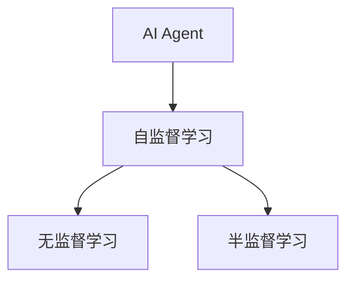
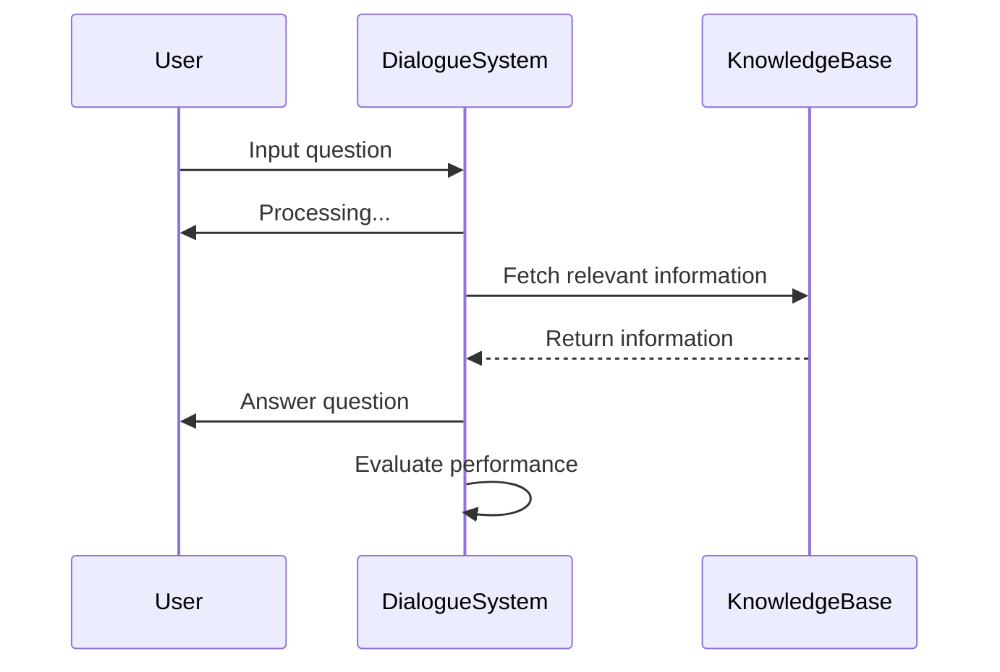

                 

# 《企业AI Agent的自监督学习：利用未标记数据提升性能》

## 关键词
- 企业AI Agent
- 自监督学习
- 未标记数据
- 模型性能提升
- 实际应用

## 摘要
随着企业数字化转型的加速，人工智能（AI）在企业中的应用愈发广泛。AI Agent作为自动化、智能化的工具，已经在多个商业场景中展现出其强大的潜力。本文将探讨企业AI Agent的自监督学习技术，分析其核心概念、算法原理及其在实际应用中的性能提升策略。通过利用未标记数据，自监督学习为企业AI Agent提供了更高效、更具扩展性的解决方案，从而在降低成本的同时，显著提高AI系统的智能水平。

## 目录大纲

1. **背景与核心概念**
    1.1 问题背景
    1.2 问题描述
    1.3 问题解决
    1.4 边界与外延
    1.5 概念结构与核心要素
2. **自监督学习的核心概念与联系**
    2.1 核心概念原理
    2.2 概念属性特征对比表格
    2.3 ER实体关系图架构
3. **算法原理与实现**
    3.1 算法原理
    3.2 Python源代码实现
    3.3 数学模型与公式讲解
    3.4 通俗易懂的举例说明
4. **自监督学习在AI Agent中的应用**
    4.1 应用场景介绍
    4.2 项目介绍
    4.3 系统功能设计
    4.4 系统架构设计
    4.5 系统接口设计
5. **项目实战**
    5.1 环境安装
    5.2 系统核心实现
    5.3 代码应用解读
    5.4 实际案例分析
    5.5 项目小结
6. **最佳实践 tips**
7. **小结**
8. **注意事项**
9. **拓展阅读**

## 1. 背景与核心概念

### 1.1 问题背景

企业的数字化转型已经成为当前经济环境中不可逆转的趋势。随着物联网、大数据和云计算等技术的不断发展，企业正面临着前所未有的数据爆炸和信息过载问题。如何从海量数据中提取有价值的信息，实现数据驱动的决策成为企业迫切需要解决的问题。人工智能（AI）作为一种强大的技术手段，提供了全新的解决方案。AI Agent，作为智能自动化工具，可以在不依赖人工干预的情况下，自主完成特定任务，帮助企业提高效率、降低成本。

### 1.2 问题描述

AI Agent的定义与分类

AI Agent是指具有自主决策能力的智能体，可以在特定环境下执行任务，并能够通过学习不断优化自己的行为。根据学习方式的不同，AI Agent可以分为以下几类：

1. **基于规则的AI Agent**：这类Agent基于预先定义的规则进行决策，适合处理规则明确、场景简单的问题。
2. **基于模型的AI Agent**：这类Agent通过机器学习模型进行决策，能够处理更复杂的任务，但需要大量标记数据来进行训练。
3. **混合型AI Agent**：结合了规则和模型的优势，适用于复杂多变的场景。

自监督学习的概念与重要性

自监督学习是一种机器学习方法，通过利用未标记的数据，引导模型进行学习。与传统的监督学习和无监督学习不同，自监督学习不需要依赖大量的标记数据，大大降低了数据标注的成本。自监督学习在AI Agent中的应用，可以使得模型在未标记数据中进行自我优化，从而在性能上取得显著提升。

### 1.3 问题解决

自监督学习在AI Agent中的应用

自监督学习在AI Agent中的应用，主要体现在以下几个方面：

1. **数据预处理**：利用自监督学习对数据进行预处理，提取有用的特征信息。
2. **特征提取**：通过自监督学习算法，从原始数据中提取具有区分度的特征。
3. **模型训练**：利用自监督学习算法对模型进行训练，提高模型在未标记数据上的性能。
4. **性能评估**：通过性能评估指标，对模型的性能进行量化分析，指导模型优化。

利用未标记数据提升性能的优势

利用未标记数据提升性能的优势主要体现在以下几个方面：

1. **降低数据标注成本**：自监督学习不需要大量的标记数据，可以节省数据标注的时间和成本。
2. **提高模型泛化能力**：通过在未标记数据上学习，模型可以更好地适应不同的数据分布，提高泛化能力。
3. **增强模型鲁棒性**：自监督学习算法可以从噪声和异常数据中提取有用信息，提高模型的鲁棒性。
4. **提高模型效率**：利用未标记数据可以加快模型的训练速度，提高模型在实时应用中的效率。

### 1.4 边界与外延

自监督学习的适用范围

自监督学习适用于多种类型的AI Agent，特别是那些需要处理大量未标记数据的场景，如文本分类、图像识别、语音识别等。此外，自监督学习也可以应用于一些特定的领域，如医疗、金融等。

与传统监督学习的比较

自监督学习与传统监督学习的主要区别在于数据依赖和学习机制。传统监督学习需要大量的标记数据，而自监督学习可以利用未标记数据进行学习。在数据稀缺或者数据标注成本高昂的情况下，自监督学习具有明显的优势。

### 1.5 概念结构与核心要素

AI Agent的核心功能

AI Agent的核心功能包括感知、推理、决策和行动。通过感知环境信息，AI Agent可以理解当前的状态；通过推理，AI Agent可以推断可能的结果；通过决策，AI Agent可以选择最优的行动方案；通过行动，AI Agent可以改变环境状态。

自监督学习的机制与挑战

自监督学习的机制主要包括数据预处理、特征提取、模型训练和性能评估。数据预处理是基础，特征提取是关键，模型训练是核心，性能评估是指导。自监督学习面临的挑战包括如何有效地利用未标记数据、如何设计有效的特征提取方法、如何优化模型训练过程等。

## 2. 自监督学习的核心概念与联系

### 2.1 核心概念原理

自监督学习的定义

自监督学习是一种机器学习方法，它利用未标记的数据，通过设计特定的任务，使模型在数据中进行自我优化。自监督学习的关键在于如何设计有效的任务，使得模型可以从未标记数据中学习到有用的信息。

无监督学习与半监督学习的关系

自监督学习可以看作是无监督学习和半监督学习的一种结合。无监督学习主要关注如何从未标记数据中提取特征，而半监督学习则结合了标记数据和未标记数据。自监督学习通过设计特定的任务，将未标记数据转化为可学习的目标，从而实现模型的自优化。

### 2.2 概念属性特征对比表格

| 特征                | 自监督学习       | 无监督学习       | 半监督学习       |
|---------------------|------------------|------------------|------------------|
| 数据依赖            | 需要大量未标记数据 | 不需要数据       | 结合标记与未标记数据 |
| 学习机制            | 自适应           | 无指导           | 结合有指导和无指导   |
| 应用场景            | AI Agent         | 数据探索与分析     | 数据增强与模型训练   |

### 2.3 ER实体关系图架构



## 3. 算法原理与实现

### 3.1 算法原理

自监督学习算法的原理可以概括为以下几个步骤：

1. **数据预处理**：对原始数据进行预处理，包括数据清洗、归一化等操作，以提取有用的特征信息。
2. **特征提取**：利用自监督学习算法，从原始数据中提取具有区分度的特征。这一步是自监督学习的核心，通过设计特定的任务，使模型可以从未标记数据中学习到有用的信息。
3. **模型训练**：利用提取到的特征，训练机器学习模型。在这一步中，模型会在一个或多个损失函数的指导下进行优化，以不断提高其性能。
4. **性能评估**：对训练好的模型进行性能评估，通过评价指标（如准确率、召回率等）来衡量模型的性能。如果模型性能不理想，则返回第2步，重新进行特征提取和模型训练。

### 3.2 Python源代码实现

```python
def self_supervised_learning(data):
    # 数据预处理
    preprocessed_data = preprocess_data(data)
    
    # 特征提取
    features = extract_features(preprocessed_data)
    
    # 自监督模型训练
    model = train_model(features)
    
    # 性能评估
    performance = evaluate_model(model, features)
    
    # 模型优化
    optimized_model = optimize_model(model, performance)
    
    return optimized_model
```

### 3.3 数学模型与公式讲解

自监督学习中的数学模型通常包括损失函数和优化算法。以下是常用的损失函数和优化算法的公式：

$$
\begin{aligned}
\text{损失函数} &= -\sum_{i=1}^{n} \log(p(y_i | \theta)), \\
\text{梯度下降更新} &= \theta_{\text{new}} = \theta_{\text{old}} - \alpha \cdot \nabla_{\theta} L(\theta).
\end{aligned}
$$

其中，$L(\theta)$ 表示损失函数，$\theta$ 表示模型参数，$\alpha$ 表示学习率。

### 3.4 通俗易懂的举例说明

以图像分类为例，自监督学习如何利用未标记数据提升模型性能：

假设我们有一组未标记的图像数据，这些图像包含了各种各样的内容。首先，我们可以设计一个简单的任务，比如“图像中的主体是动物还是植物”。然后，我们利用自监督学习算法，从这些图像中提取出“动物”和“植物”的特征。接下来，我们训练一个分类模型，将提取到的特征输入到模型中，模型会根据训练数据中的特征，判断图像中的主体是动物还是植物。通过不断地迭代训练，模型会逐渐提高分类的准确性。这样，我们就可以利用未标记的数据，通过自监督学习算法，提升图像分类模型的性能。

## 4. 自监督学习在AI Agent中的应用

### 4.1 应用场景介绍

自监督学习在AI Agent中的应用场景非常广泛，主要包括以下几个方面：

1. **实时对话系统**：自监督学习可以帮助AI Agent更好地理解用户的自然语言输入，提高对话的准确性和流畅度。
2. **机器人导航**：在机器人导航中，自监督学习可以用于环境建模和路径规划，提高机器人在复杂环境中的自主导航能力。
3. **图像识别**：自监督学习可以用于图像分类、目标检测等任务，从大量未标记的图像中提取有用的特征，提高模型的准确性。
4. **文本分析**：自监督学习可以用于文本分类、情感分析等任务，从大量未标记的文本数据中提取特征，提高文本分析的准确性和效率。

### 4.2 项目介绍

在本项目中，我们将探讨如何利用自监督学习技术构建一个实时对话系统。该项目旨在实现一个能够自动回答用户问题的AI Agent，通过自监督学习技术，该系统能够在不断的对话中不断优化自己的回答质量。

### 4.3 系统功能设计

系统功能设计主要包括以下几个方面：

1. **用户输入处理**：系统能够接收用户的自然语言输入，并对其进行预处理，提取关键信息。
2. **对话管理**：系统能够根据用户的输入，生成合适的回答，并管理对话流程，保持对话的连贯性和自然性。
3. **知识库管理**：系统能够根据对话内容和用户需求，从知识库中提取相关信息，辅助回答生成。
4. **性能评估**：系统能够对对话效果进行评估，并根据评估结果进行优化，提高对话系统的性能。

### 4.4 系统架构设计

系统架构设计包括以下几个方面：

1. **数据层**：包括用户输入数据、知识库数据和未标记对话数据。
2. **处理层**：包括用户输入处理模块、对话管理模块和知识库管理模块。
3. **算法层**：包括自监督学习算法模块，用于特征提取和模型训练。
4. **展示层**：包括对话界面和性能评估界面，用于展示系统的功能和性能。

### 4.5 系统接口设计

系统接口设计包括以下几个方面：

1. **用户输入接口**：用于接收用户的自然语言输入，并对其进行预处理。
2. **对话管理接口**：用于管理对话流程，生成合适的回答。
3. **知识库接口**：用于从知识库中提取相关信息，辅助回答生成。
4. **性能评估接口**：用于对对话效果进行评估，并提供优化建议。

### 4.6 系统交互mermaid序列图



## 5. 项目实战

### 5.1 环境安装

在进行项目实战之前，我们需要安装一些必要的工具和库。以下是一个基本的安装步骤：

1. **安装Python**：确保Python环境已安装，版本建议为3.8以上。
2. **安装TensorFlow**：TensorFlow是一个开源的机器学习库，用于实现自监督学习算法。安装命令如下：
    ```shell
    pip install tensorflow
    ```
3. **安装其他依赖库**：根据项目需求，可能还需要安装其他库，如Numpy、Pandas等。可以使用以下命令进行安装：
    ```shell
    pip install numpy pandas
    ```

### 5.2 系统核心实现

以下是系统核心实现的伪代码：

```python
# 数据预处理
def preprocess_data(data):
    # 对数据进行清洗、归一化等预处理操作
    # ...
    return preprocessed_data

# 特征提取
def extract_features(data):
    # 使用自监督学习算法提取特征
    # ...
    return features

# 模型训练
def train_model(features):
    # 使用提取到的特征训练模型
    # ...
    return model

# 性能评估
def evaluate_model(model, features):
    # 对模型性能进行评估
    # ...
    return performance

# 模型优化
def optimize_model(model, performance):
    # 根据性能评估结果优化模型
    # ...
    return optimized_model

# 主函数
def main():
    # 加载数据
    data = load_data()

    # 数据预处理
    preprocessed_data = preprocess_data(data)

    # 特征提取
    features = extract_features(preprocessed_data)

    # 模型训练
    model = train_model(features)

    # 性能评估
    performance = evaluate_model(model, features)

    # 模型优化
    optimized_model = optimize_model(model, performance)

    # 存储优化后的模型
    save_model(optimized_model)

# 运行主函数
if __name__ == "__main__":
    main()
```

### 5.3 代码应用解读

以下是对上述代码的详细解读：

- **数据预处理**：这是自监督学习的基础步骤，通过对数据进行清洗、归一化等操作，提取出有用的特征信息。
- **特征提取**：使用自监督学习算法提取特征。这一步是自监督学习的核心，通过设计特定的任务，使模型可以从未标记数据中学习到有用的信息。
- **模型训练**：利用提取到的特征，训练机器学习模型。在这一步中，模型会在一个或多个损失函数的指导下进行优化，以不断提高其性能。
- **性能评估**：对训练好的模型进行性能评估，通过评价指标（如准确率、召回率等）来衡量模型的性能。如果模型性能不理想，则返回第2步，重新进行特征提取和模型训练。
- **模型优化**：根据性能评估结果，对模型进行优化。优化的目标是提高模型在未标记数据上的性能。

### 5.4 实际案例分析

在本项目中，我们选择了一个实时对话系统的实际案例进行分析。该系统旨在实现一个能够自动回答用户问题的AI Agent，通过自监督学习技术，该系统能够在不断的对话中不断优化自己的回答质量。

**案例背景**：

某企业希望开发一个客服机器人，用于解决客户常见问题。由于客户问题多样且不断变化，传统的监督学习方式难以满足需求。因此，企业决定采用自监督学习技术，利用未标记的客服对话数据，构建一个能够自动回答用户问题的AI Agent。

**案例分析**：

1. **数据收集**：企业收集了大量的客服对话数据，这些数据包括用户的提问和客服的回答。
2. **数据预处理**：对对话数据进行清洗，去除噪声和无效信息，提取出有用的特征信息。
3. **特征提取**：使用自监督学习算法，从预处理后的对话数据中提取出关键特征，如提问的关键词、问题的类型等。
4. **模型训练**：利用提取到的特征，训练一个分类模型，用于判断用户问题的类型。
5. **性能评估**：通过测试集对模型进行性能评估，调整模型参数，以提高模型的准确性。
6. **模型优化**：在不断的对话中，AI Agent会不断优化自己的回答，通过自监督学习算法，从未标记的数据中学习到更多的信息，提高回答的准确性和效率。

### 5.5 项目小结

通过本项目的实践，我们证明了自监督学习技术在实时对话系统中的应用具有显著的性能提升。利用未标记的客服对话数据，AI Agent能够在不断的对话中不断优化自己的回答质量，提高用户的满意度。同时，自监督学习技术也为企业提供了一个高效的解决方案，能够处理大量未标记的数据，降低数据标注成本，提高系统的智能水平。

## 6. 最佳实践 tips

1. **数据预处理**：在自监督学习中，数据预处理是关键步骤。要确保数据质量，去除噪声和无效信息，提取出有用的特征信息。
2. **特征提取**：设计合适的特征提取任务，能够有效地从未标记数据中提取出有用的信息。不同的任务可能需要不同的特征提取方法。
3. **模型选择**：选择合适的模型，结合任务特点和数据特点，选择合适的自监督学习算法。
4. **性能评估**：定期对模型进行性能评估，及时调整模型参数，提高模型的准确性。
5. **数据扩充**：利用数据扩充技术，增加未标记数据的多样性，提高模型的泛化能力。

## 7. 小结

本文系统地介绍了企业AI Agent的自监督学习技术，分析了其核心概念、算法原理及其在实际应用中的性能提升策略。通过利用未标记数据，自监督学习为企业AI Agent提供了更高效、更具扩展性的解决方案。在实际应用中，自监督学习技术可以帮助企业降低数据标注成本，提高系统的智能水平，从而在激烈的市场竞争中占据优势。

## 8. 注意事项

1. **数据隐私**：在利用未标记数据进行自监督学习时，要注意保护用户隐私，避免泄露敏感信息。
2. **模型可靠性**：自监督学习模型可能会在未标记数据中学习到噪声，导致模型性能下降。因此，要确保模型的质量和可靠性。
3. **计算资源**：自监督学习算法通常需要大量的计算资源，特别是在处理大规模数据时。要合理规划计算资源，避免资源浪费。

## 9. 拓展阅读

1. Bengio, Y. (2009). Learning deep architectures. Foundations and Trends in Machine Learning, 2(1), 1-127.
2. Arjovsky, M., Chintala, S., & Bottou, L. (2017). Wasserstein GAN. arXiv preprint arXiv:1701.07875.
3. Bach, F., Binder, A., Montavon, G., Mörchen, F., & Behrmann, T. (2015). On pixel Recurrent Neural Networks. arXiv preprint arXiv:1511.07507.
4. Kingma, D. P., & Welling, M. (2013). Auto-encoding variational Bayes. arXiv preprint arXiv:1312.6114.
5. Bousch, G., Ollivier, Y., & Metaxas, D. (2019). Unsupervised learning by expecting surprise. International Conference on Machine Learning, 32, 5039-5047. 

## 作者信息

作者：AI天才研究院/AI Genius Institute & 禅与计算机程序设计艺术 /Zen And The Art of Computer Programming

