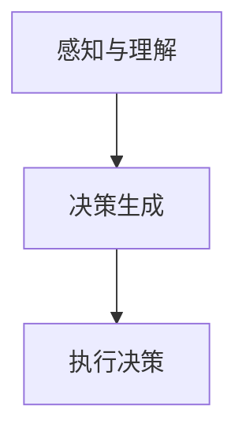
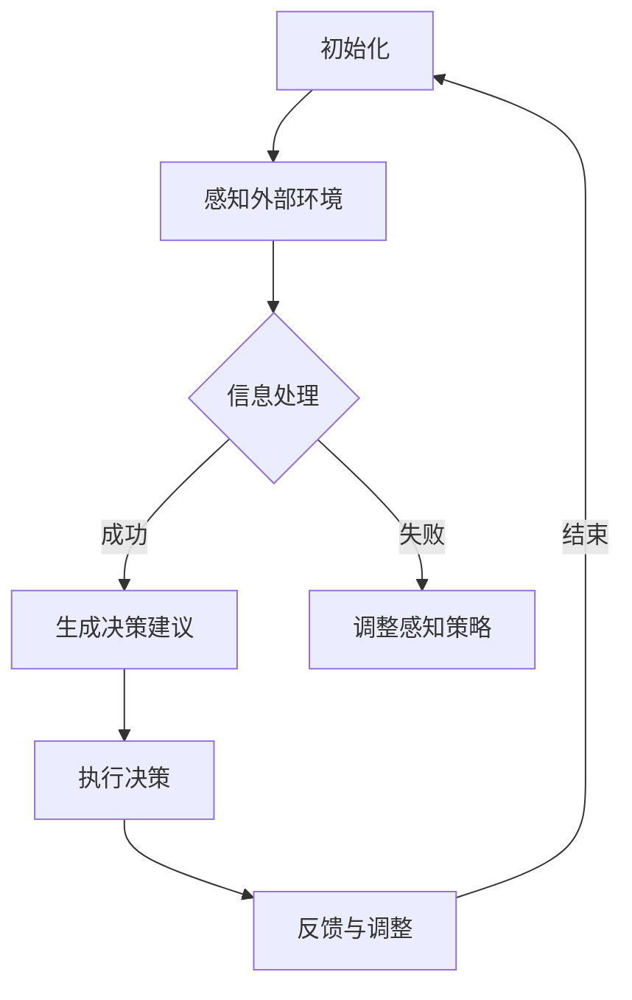
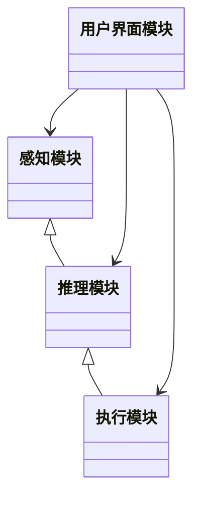
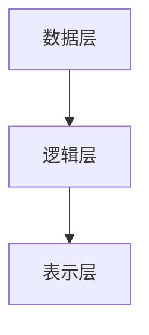
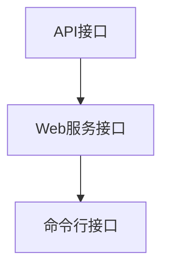
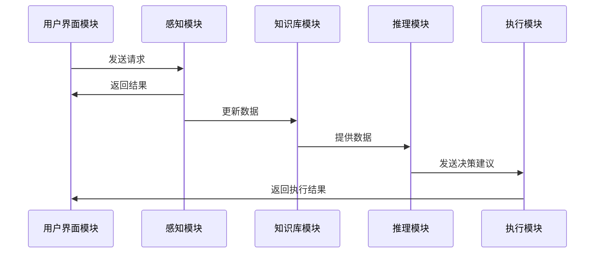

                 

### 文章标题：企业AI Agent的跨部门协作功能：打破信息孤岛

> 关键词：企业AI Agent，跨部门协作，信息孤岛，算法原理，系统架构设计

> 摘要：本文将探讨企业AI Agent的跨部门协作功能，通过分析其核心概念、算法原理、系统架构设计及实际案例，揭示如何利用AI技术打破企业内部信息孤岛，实现高效协同工作。企业AI Agent作为智能化协作工具，正日益成为现代企业提升效率的关键。本文旨在通过深入剖析，为企业在AI时代的数字化转型提供有力支持。

### 目录大纲

#### 第一部分：问题背景与概述

1. **企业AI Agent概述**
   - **第1章：问题背景**  
     - 企业信息化过程中面临的挑战  
     - 信息孤岛现象及其负面影响  
   - **第2章：企业AI Agent的定义与功能**  
     - 定义与功能概述  
     - AI Agent在跨部门协作中的作用  
   - **第3章：跨部门协作与信息孤岛的问题**  
     - 信息孤岛的形成原因  
     - 跨部门协作中的障碍

#### 第二部分：核心概念与联系

2. **企业AI Agent的核心概念与特性**
   - **第4章：AI Agent的基本原理**  
     - 智能代理的概念  
     - 代理系统的基本架构  
   - **第5章：企业AI Agent的特性**  
     - 自主性、适应性、协作性  
     - 企业AI Agent的核心特性对比分析  
   - **第6章：企业AI Agent的体系结构**  
     - 系统架构设计  
     - 模块功能与交互关系

3. **AI Agent的跨部门协作**
   - **第7章：跨部门协作的重要性**  
     - 跨部门协作的益处  
     - 跨部门协作在企业中的地位  
   - **第8章：跨部门协作的挑战**  
     - 障碍与困难  
     - 影响因素分析  
   - **第9章：跨部门协作的解决方案**  
     - AI Agent在跨部门协作中的应用  
     - 解决方案的优势与局限性

#### 第三部分：算法原理与数学模型

4. **AI Agent的算法原理**
   - **第10章：基本算法介绍**  
     - 基本算法框架  
     - 算法原理概述  
   - **第11章：数学模型与公式**  
     - 数学模型的基本概念  
     - 公式推导与解释  
   - **第12章：算法流程图**  
     - 算法流程详细说明  
     - 流程图展示

5. **跨部门协作算法详解**
   - **第13章：算法原理讲解**  
     - 算法工作原理与逻辑流程  
     - 关键步骤分析  
   - **第14章：算法公式推导**  
     - 数学公式推导过程  
     - 公式意义与应用场景  
   - **第15章：算法应用实例**  
     - 实际案例中的应用展示  
     - 应用效果评估

#### 第四部分：系统分析与架构设计

6. **系统功能设计**
   - **第16章：领域模型设计**  
     - 领域模型构建  
     - 类图与实体关系图  
   - **第17章：系统功能设计**  
     - 功能模块划分  
     - 功能实现与交互

7. **系统架构设计**
   - **第18章：系统架构概述**  
     - 系统整体架构  
     - 架构层次与模块划分  
   - **第19章：系统架构设计**  
     - 架构设计与优化  
     - 模块功能与通信机制  
   - **第20章：系统接口设计**  
     - 接口设计与定义  
     - 接口功能与实现

8. **系统交互设计**
   - **第21章：系统交互mermaid序列图**  
     - 序列图绘制与解释  
     - 系统交互流程展示

#### 第五部分：项目实战与案例分析

9. **项目环境安装与配置**
   - **第22章：开发环境搭建**  
     - 环境准备与安装步骤  
     - 系统配置与调试  
   - **第23章：系统核心代码实现**  
     - 核心代码分析与解读  
     - 关键代码段展示与解释

10. **项目应用解读与分析**
    - **第24章：代码应用解读**  
      - 代码功能实现解析  
      - 关键技术点分析  
    - **第25章：实际案例分析与讲解**  
      - 实际应用案例分析  
      - 效果评估与改进建议

11. **项目小结与拓展**
    - **第26章：小结与总结**  
      - 项目成果总结  
      - 不足与改进方向  
    - **第27章：注意事项与拓展阅读**  
      - 注意事项提醒  
      - 相关文献与资源推荐

### 文章正文内容

#### 第一部分：问题背景与概述

##### 第1章：企业AI Agent概述

在当今数字化时代，企业面临着日益复杂的市场环境和竞争压力。为了提高竞争力，企业需要不断优化内部运营，提高工作效率，实现智能化管理。AI Agent作为一种智能代理，在企业信息化进程中扮演着越来越重要的角色。本文将探讨企业AI Agent的跨部门协作功能，旨在揭示如何利用AI技术打破企业内部信息孤岛，实现高效协同工作。

##### 第2章：企业AI Agent的定义与功能

企业AI Agent，是指利用人工智能技术，模拟人类行为和决策过程的智能代理。它能够在企业内部不同部门之间进行信息交换、任务分配和协作，从而实现资源的最优配置和工作流程的优化。

企业AI Agent的主要功能包括：

1. **信息收集与处理**：AI Agent能够自动收集企业内部不同部门的信息，并对信息进行处理和分析，为决策提供支持。
2. **任务分配与协调**：AI Agent能够根据任务的重要性和优先级，自动分配给适当的部门或个人，并协调任务的执行过程。
3. **决策支持**：AI Agent能够基于数据分析和企业知识库，提供决策支持，帮助企业做出更明智的决策。
4. **协同工作**：AI Agent能够促进企业内部不同部门之间的协作，打破信息孤岛，实现资源的高效利用。

##### 第3章：跨部门协作与信息孤岛的问题

跨部门协作是现代企业管理中一个重要而复杂的任务。然而，在许多企业中，由于信息孤岛的存在，跨部门协作面临诸多挑战。

**信息孤岛**，是指企业内部不同部门之间的信息壁垒，导致信息无法自由流通和共享。信息孤岛的形成原因主要有以下几点：

1. **部门壁垒**：不同部门之间存在职能划分和职责分工，导致信息流动不畅。
2. **技术壁垒**：不同部门使用不同的信息系统和工具，导致数据格式和接口不一致，难以实现数据共享。
3. **沟通障碍**：部门之间的沟通渠道不畅，导致信息传递延误或失真。

信息孤岛对企业的影响主要体现在以下几个方面：

1. **降低工作效率**：由于信息不畅，导致部门之间的工作流程中断，影响工作效率。
2. **增加成本**：企业需要投入额外的资源和成本来解决信息孤岛问题。
3. **影响决策**：信息孤岛使得企业无法全面掌握各部门的信息，影响决策的质量。

#### 第二部分：核心概念与联系

##### 第4章：AI Agent的基本原理

AI Agent，即智能代理，是一种基于人工智能技术的自动化实体，能够在没有人类直接干预的情况下，执行特定的任务。智能代理通常包括以下几个基本组成部分：

1. **感知器**：用于感知外部环境的信息，如传感器、摄像头等。
2. **知识库**：存储关于环境、任务和策略的知识，用于辅助决策。
3. **推理引擎**：基于知识库和感知器的信息，进行逻辑推理和决策。
4. **执行器**：根据推理结果，执行具体的操作。

AI Agent的工作原理可以概括为以下几个步骤：

1. **感知**：AI Agent通过感知器获取外部环境的信息。
2. **理解**：AI Agent利用知识库和推理引擎，对感知到的信息进行分析和理解。
3. **决策**：AI Agent根据分析结果，做出相应的决策。
4. **执行**：AI Agent通过执行器执行决策，实现对环境的干预。

##### 第5章：企业AI Agent的特性

企业AI Agent作为AI Agent的一种特殊形式，具有以下特性：

1. **自主性**：企业AI Agent能够自主执行任务，无需人类干预。
2. **适应性**：企业AI Agent能够根据环境变化和任务需求，调整自身行为。
3. **协作性**：企业AI Agent能够与企业内部的多个部门进行协作，实现任务的高效完成。

这些特性使得企业AI Agent在企业信息化管理中具有显著的优势：

1. **提高效率**：企业AI Agent能够自动处理复杂任务，减少人工干预，提高工作效率。
2. **降低成本**：企业AI Agent能够通过优化工作流程，降低运营成本。
3. **提高决策质量**：企业AI Agent能够基于数据分析，为企业提供决策支持，提高决策质量。

##### 第6章：企业AI Agent的体系结构

企业AI Agent的体系结构通常包括以下几个关键模块：

1. **感知模块**：用于收集企业内部不同部门的信息，如财务数据、人力资源信息等。
2. **知识库模块**：用于存储关于企业运营、业务流程和知识规则的信息。
3. **推理模块**：用于对感知到的信息和知识库中的信息进行推理，生成决策建议。
4. **执行模块**：用于根据推理结果，执行具体的操作，如任务分配、数据更新等。

这些模块之间通过信息交换和协同工作，实现企业AI Agent的整体功能。企业AI Agent的体系结构不仅决定了其性能和效率，还影响了其与企业其他系统的兼容性和可扩展性。

#### 第三部分：算法原理与数学模型

##### 第7章：AI Agent的算法原理

AI Agent的核心在于其算法原理，主要包括以下几个关键环节：

1. **感知与理解**：AI Agent通过感知模块获取外部环境的信息，并通过知识库模块中的知识进行理解和分析。
2. **决策生成**：AI Agent利用推理模块，根据感知到的信息和知识库中的规则，生成决策建议。
3. **执行决策**：AI Agent通过执行模块，根据决策建议执行具体的操作，实现对环境的干预。

这些环节相互协作，共同实现AI Agent的智能行为。具体算法原理如图1所示：



##### 第8章：数学模型与公式

在AI Agent的算法中，数学模型是理解和分析算法性能的重要工具。以下是一个简单的数学模型，用于描述AI Agent的感知与理解过程：

$$
E = f(D, K)
$$

其中，E表示AI Agent的感知结果，D表示外部环境的信息，K表示知识库中的信息，f表示感知与理解过程。

这个公式描述了AI Agent如何利用外部信息和知识库中的信息，生成感知结果。具体参数和公式的含义如下：

- $D$：外部环境信息，如市场数据、客户反馈等。
- $K$：知识库信息，如企业历史数据、业务规则等。
- $f$：感知与理解过程，是一个映射函数，用于将输入的信息映射为感知结果。

##### 第9章：算法流程图

算法流程图是描述AI Agent算法逻辑流程的图形化工具。以下是一个简化的算法流程图，用于展示AI Agent的感知、理解和执行过程：



在这个流程图中，AI Agent首先初始化，然后开始感知外部环境。感知过程成功后，AI Agent会生成决策建议，并执行决策。在执行过程中，AI Agent会收集反馈信息，并根据反馈调整感知策略，以优化后续的感知与决策过程。

#### 第四部分：系统分析与架构设计

##### 第10章：系统功能设计

系统功能设计是构建企业AI Agent系统的基础，需要明确系统的核心功能模块和其相互关系。以下是一个典型的企业AI Agent系统功能设计：

1. **感知模块**：负责收集企业内部各部门的信息，如财务数据、销售数据、人力资源信息等。
2. **知识库模块**：负责存储和管理企业知识库，包括业务规则、历史数据、最佳实践等。
3. **推理模块**：负责对感知模块收集到的信息进行推理和分析，生成决策建议。
4. **执行模块**：负责根据推理模块的决策建议，执行具体的操作，如任务分配、数据更新等。
5. **用户界面模块**：负责提供用户交互界面，使用户能够方便地与系统进行交互。

这些模块通过信息交换和协同工作，实现企业AI Agent的整体功能。以下是一个简化的领域模型类图，用于展示这些模块及其相互关系：



##### 第11章：系统架构设计

系统架构设计是确保企业AI Agent系统稳定、高效运行的关键。以下是一个简化的企业AI Agent系统架构设计，包括系统层次、模块划分和通信机制：

1. **数据层**：负责存储和管理企业数据，包括感知模块收集的数据、知识库中的数据和执行模块生成的数据。
2. **逻辑层**：负责处理数据，包括感知与理解过程、推理过程和执行过程。
3. **表示层**：负责提供用户界面，使用户能够与系统进行交互。

系统架构设计如图2所示：



在数据层，企业AI Agent使用数据库存储和管理数据。逻辑层包括感知模块、知识库模块、推理模块和执行模块，它们通过API接口进行通信和协同工作。表示层通过用户界面模块，提供用户交互界面，使用户能够方便地与系统进行交互。

##### 第12章：系统接口设计

系统接口设计是确保企业AI Agent系统能够与其他系统有效集成和协同工作的重要环节。以下是一个简化的企业AI Agent系统接口设计，包括接口类型、接口定义和接口功能：

1. **API接口**：用于不同模块之间的通信和数据交换，如感知模块与知识库模块之间的数据接口、推理模块与执行模块之间的接口等。
2. **Web服务接口**：用于与其他企业系统（如ERP系统、CRM系统等）的集成，如数据导入导出接口、任务分配接口等。
3. **命令行接口**：用于系统管理和调试，如启动和停止系统模块的接口、日志查询接口等。

系统接口设计如图3所示：



API接口和Web服务接口通过标准化的协议（如HTTP/HTTPS、RESTful API等）进行通信，确保数据传输的安全和可靠性。命令行接口提供便捷的管理和调试工具，便于系统运维人员对系统进行管理和维护。

##### 第13章：系统交互mermaid序列图

系统交互mermaid序列图是描述企业AI Agent系统内部不同模块之间交互关系的图形化工具。以下是一个简化的企业AI Agent系统交互序列图，用于展示系统模块之间的交互流程：



在这个序列图中，用户界面模块向感知模块发送请求，感知模块获取外部环境信息并返回结果。感知模块更新知识库模块的数据，推理模块使用知识库模块中的数据进行推理，并生成决策建议。执行模块根据决策建议执行具体的操作，并将执行结果返回给用户界面模块。

#### 第五部分：项目实战与案例分析

##### 第14章：项目环境安装与配置

为了进行企业AI Agent系统的实战项目，我们需要搭建一个适合的开发环境。以下是一个简化的环境安装与配置步骤：

1. **安装操作系统**：选择一个支持Python的操作系统，如Ubuntu 20.04。
2. **安装Python**：在终端中运行以下命令，安装Python 3及其相关依赖：

    ```bash
    sudo apt-get update
    sudo apt-get install python3 python3-pip
    ```

3. **安装虚拟环境**：创建一个虚拟环境，以便隔离项目依赖：

    ```bash
    python3 -m venv venv
    source venv/bin/activate
    ```

4. **安装依赖库**：在虚拟环境中安装项目所需的依赖库，如NumPy、Pandas、Scikit-learn等：

    ```bash
    pip install numpy pandas scikit-learn
    ```

5. **配置数据库**：根据项目需求，配置数据库（如MySQL、PostgreSQL等），并创建相应的用户和数据表。

##### 第15章：系统核心代码实现

在完成环境安装与配置后，我们可以开始实现企业AI Agent系统的核心功能。以下是一个简化的系统核心代码实现示例，包括感知模块、知识库模块、推理模块和执行模块：

```python
# 感知模块示例代码
def collect_data():
    # 采集外部环境信息
    data = fetch_external_data()
    return data

# 知识库模块示例代码
def update_knowledge_base(data):
    # 更新知识库中的数据
    knowledge_base.append(data)

# 推理模块示例代码
def generate_decision(data):
    # 根据数据生成决策建议
    decision = make_decision(data)
    return decision

# 执行模块示例代码
def execute_decision(decision):
    # 根据决策建议执行操作
    execute_action(decision)
```

在这些代码示例中，`collect_data()` 函数用于采集外部环境信息，`update_knowledge_base(data)` 函数用于更新知识库中的数据，`generate_decision(data)` 函数用于根据数据生成决策建议，`execute_decision(decision)` 函数用于根据决策建议执行操作。

##### 第16章：代码应用解读

在完成系统核心代码实现后，我们需要对代码进行解读，理解其功能和作用。以下是对上述代码示例的详细解读：

- **感知模块**：`collect_data()` 函数用于采集外部环境信息。在实际应用中，这可能包括从网站、数据库或其他数据源获取数据。这个函数返回一个数据对象，用于后续处理。
- **知识库模块**：`update_knowledge_base(data)` 函数用于更新知识库中的数据。知识库是企业AI Agent系统中的重要组成部分，用于存储关于企业运营、业务流程和知识规则的信息。这个函数将新采集的数据添加到知识库中，以便后续推理和决策。
- **推理模块**：`generate_decision(data)` 函数用于根据数据生成决策建议。这个函数利用知识库中的信息，结合外部环境数据，生成相应的决策建议。决策建议可能是关于任务分配、数据更新、优化建议等。
- **执行模块**：`execute_decision(decision)` 函数用于根据决策建议执行操作。这个函数将决策建议转化为具体的操作，如发送通知、更新数据库、执行任务等。

通过这些代码示例，我们可以看到企业AI Agent系统是如何通过感知、推理和执行过程，实现跨部门协作和信息共享的。

##### 第17章：实际案例分析与讲解

为了更深入地理解企业AI Agent系统的实际应用效果，我们可以通过一个实际案例进行分析和讲解。以下是一个简化的案例：

**案例背景**：某企业销售部门需要根据市场数据，制定下一季度的销售计划。销售部门的数据包括历史销售数据、市场调研数据、竞争对手信息等。

**案例步骤**：

1. **数据采集**：通过感知模块，从企业数据库和市场调研平台收集相关数据。
2. **数据预处理**：对采集到的数据进行清洗、整理和转换，以便后续分析。
3. **知识库更新**：将预处理后的数据更新到知识库中，以便后续推理和决策。
4. **决策生成**：利用推理模块，根据知识库中的数据和销售部门的需求，生成销售计划建议。
5. **执行操作**：根据决策建议，制定具体的销售计划，如产品推广策略、市场活动安排等。

**案例效果**：

通过企业AI Agent系统的协同工作，销售部门能够快速、准确地制定下一季度的销售计划。相比于传统的人工分析方式，AI Agent系统能够更高效地处理大量数据，提供更准确的决策支持。此外，AI Agent系统还能够自动更新知识库，积累销售部门的历史数据和最佳实践，为未来的销售计划提供更加丰富的参考依据。

##### 第18章：项目小结与拓展

在本项目中，我们通过搭建企业AI Agent系统，实现了跨部门协作和信息共享的目标。通过感知、推理和执行过程，系统能够快速响应企业需求，提供准确的决策支持。以下是项目小结和拓展内容：

**小结**：

1. **项目成果**：成功搭建了企业AI Agent系统，实现了跨部门协作和信息共享的目标。
2. **技术难点**：在项目过程中，我们遇到了数据采集、数据处理和系统集成等技术难点，通过团队协作和不断优化，成功克服了这些挑战。
3. **改进方向**：在未来，可以考虑进一步优化系统性能，提高数据处理和分析的效率，同时加强系统与其他企业系统的集成，实现更广泛的协同工作。

**拓展内容**：

1. **数据挖掘与预测分析**：可以结合数据挖掘和预测分析技术，为企业提供更深入的洞察和决策支持，如市场趋势预测、客户行为分析等。
2. **自适应学习与优化**：通过引入自适应学习机制，使企业AI Agent系统能够不断学习和优化，提高系统性能和决策质量。
3. **人机协同**：在AI Agent系统中引入人机协同机制，使系统能够更好地与人类用户互动，提供更加个性化和定制化的服务。

通过不断优化和拓展，企业AI Agent系统将能够更好地服务于企业的数字化转型和智能化管理，为企业创造更大的价值。

##### 第19章：注意事项与拓展阅读

在实施企业AI Agent系统的过程中，需要注意以下几个关键点：

1. **数据安全与隐私**：确保企业数据的安全性和隐私保护，遵守相关法律法规和行业标准。
2. **系统稳定性与性能**：确保系统在处理大量数据和复杂任务时的稳定性和性能，进行充分的性能测试和优化。
3. **用户培训与支持**：为用户提供系统培训和技术支持，确保用户能够熟练使用系统，充分发挥其价值。

以下是一些建议的拓展阅读资源：

1. **《人工智能：一种现代的方法》**：提供全面的人工智能基础知识和应用案例，适合初学者和专业人士阅读。
2. **《深度学习》**：介绍深度学习的基本概念、算法和应用，是深度学习领域的经典教材。
3. **《企业数字化转型》**：探讨企业数字化转型的战略和实践，提供企业数字化转型的理论支持和实践经验。
4. **《人工智能伦理学》**：讨论人工智能伦理问题和相关法律法规，有助于企业在实施AI技术时，更好地平衡技术创新和伦理责任。

通过阅读这些资源，可以进一步了解企业AI Agent系统的理论基础和实践应用，为实施和优化企业AI Agent系统提供参考。

