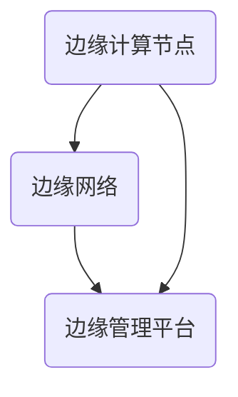
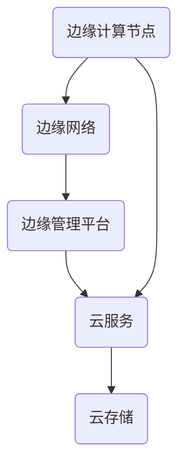
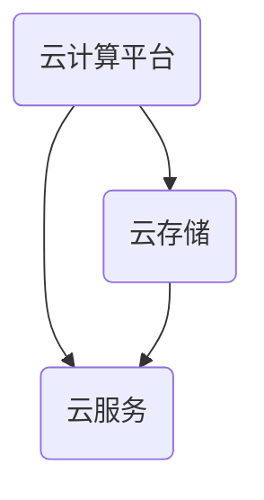
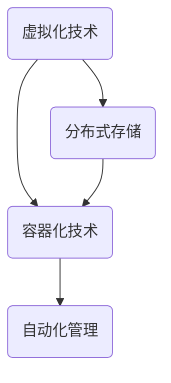

                 

# 企业AI Agent的边缘智能与云智能协同策略

> 关键词：AI Agent、边缘智能、云智能、协同策略、企业应用

> 摘要：随着人工智能技术的不断发展，企业AI Agent成为提升企业智能化水平的重要手段。本文介绍了企业AI Agent的边缘智能与云智能协同策略，分析了边缘智能与云智能的区别与联系，探讨了如何设计并实施这种协同策略，以实现企业AI Agent的高效运行。

## 引言与背景介绍

### 1.1.1 问题的提出

在数字化转型的浪潮中，企业越来越依赖人工智能技术来提升其运营效率和市场竞争力。企业AI Agent作为人工智能的核心组件，已经成为企业智能化的重要组成部分。然而，如何有效地整合边缘智能与云智能资源，实现企业AI Agent的高效运行，成为当前面临的一个重要问题。

### 1.1.2 AI Agent的定义与作用

AI Agent是一种具有智能行为能力的计算机程序，它可以在没有人类干预的情况下执行任务，并与其他系统进行交互。在企业中，AI Agent可以应用于客户服务、生产监控、供应链管理等多个领域，帮助企业实现自动化和智能化。

### 1.1.3 企业AI Agent的重要性

企业AI Agent不仅能够提高企业的运营效率，还能够帮助企业更好地理解客户需求，优化业务流程，提升市场竞争力。因此，设计并实施高效的企业AI Agent成为企业数字化转型的重要任务。

### 1.1.4 企业AI Agent的发展背景

随着云计算、物联网、5G等技术的不断发展，边缘计算逐渐成为企业智能化的重要支撑。边缘智能与云智能的结合，为企业AI Agent提供了更广泛的应用场景和更高的运行效率。

### 1.1.5 边缘智能与云智能的概念

边缘智能是指将数据处理和分析任务从云端转移到网络边缘，在靠近数据源的地方进行处理。云智能则是指通过云计算技术，提供大规模的计算和存储资源。

### 1.1.6 边缘智能与云智能协同的必要性

边缘智能与云智能的协同，可以实现计算资源的最佳配置，提高数据处理速度和系统响应能力，为企业AI Agent提供更高效的服务。

## 第一部分: 企业AI Agent的核心概念与联系

### 2.1.1 AI Agent的核心概念

AI Agent是一种具有智能行为能力的计算机程序，它可以在没有人类干预的情况下执行任务，并与其他系统进行交互。

### 2.1.2 边缘智能的概念与属性

边缘智能是指将数据处理和分析任务从云端转移到网络边缘，在靠近数据源的地方进行处理。边缘智能具有低延迟、高可靠性和高安全性的特点。

### 2.1.3 云智能的概念与属性

云智能是指通过云计算技术，提供大规模的计算和存储资源。云智能具有弹性、高效和灵活的特点。

### 2.1.4 边缘智能与云智能的对比表格

| 特点 | 边缘智能 | 云智能 |
| ---- | ---- | ---- |
| 数据处理位置 | 网络边缘 | 云端 |
| 延迟 | 低延迟 | 较高延迟 |
| 安全性 | 高安全性 | 较低安全性 |
| 灵活性 | 较低 | 较高 |
| 弹性 | 较低 | 较高 |

### 2.1.5 AI Agent的ER实体关系图

```mermaid
erDiagram
  AI Agent ||--|{ 数据源 } Data Source
  AI Agent ||--|{ 边缘智能设备 } Edge Device
  AI Agent ||--|{ 云端服务 } Cloud Service
```

## 第二部分: 边缘智能技术解析

### 3.1.1 边缘智能的定义

边缘智能是指将数据处理和分析任务从云端转移到网络边缘，在靠近数据源的地方进行处理。

### 3.1.2 边缘智能的技术架构

边缘智能的技术架构主要包括边缘计算节点、边缘网络和边缘管理平台。

### 3.1.3 边缘智能的优势

边缘智能具有低延迟、高可靠性和高安全性的特点。

### 3.1.4 边缘智能的应用场景

边缘智能广泛应用于工业互联网、智慧城市、智能交通等领域。

## 第三部分: 云智能技术解析

### 6.1.1 云智能的定义

云智能是指通过云计算技术，提供大规模的计算和存储资源。

### 6.1.2 云智能的技术架构

云智能的技术架构主要包括云计算平台、云存储和云服务。

### 6.1.3 云智能的优势

云智能具有弹性、高效和灵活的特点。

### 6.1.4 云智能的应用场景

云智能广泛应用于企业信息化、大数据处理和人工智能等领域。

## 第四部分: 边缘智能与云智能协同策略

### 8.1.1 协同机制的定义

边缘智能与云智能的协同机制是指通过技术手段，实现边缘智能与云智能之间的数据交换、任务调度和资源分配。

### 8.1.2 协同机制的设计原则

协同机制的设计原则包括数据一致性、任务协同性和资源优化。

### 8.1.3 协同机制的实现技术

协同机制的实现技术主要包括边缘计算框架、云服务接口和智能调度算法。

### 8.1.4 协同机制的案例分析

以智慧城市为例，分析边缘智能与云智能协同的具体实现过程。

## 第五部分: 企业AI Agent的边缘智能与云智能协同策略设计

### 9.1.1 策略设计的目标

策略设计的目标是实现企业AI Agent的高效运行，提高企业的智能化水平。

### 9.1.2 策略设计的原则

策略设计的原则包括数据安全、任务优先级和资源优化。

### 9.1.3 策略设计的流程

策略设计的流程包括需求分析、系统设计、实施部署和效果评估。

### 9.1.4 策略设计的案例

以一家制造企业为例，介绍边缘智能与云智能协同策略的设计和实施过程。

## 第六部分: 企业AI Agent的边缘智能与云智能协同策略实施

### 10.1.1 实施的准备工作

实施的准备工作包括技术选型、团队组建和环境搭建。

### 10.1.2 实施的关键步骤

实施的关键步骤包括数据接入、任务调度、资源管理和监控分析。

### 10.1.3 实施中的问题与解决方案

分析实施过程中可能出现的问题，并提出相应的解决方案。

### 10.1.4 实施效果评估

对实施效果进行评估，分析协同策略的实际效果。

## 第七部分: 最佳实践与未来展望

### 11.1.1 实践案例1

介绍某企业的边缘智能与云智能协同实践案例。

### 11.1.2 实践案例2

介绍某智慧城市项目的边缘智能与云智能协同实践案例。

### 11.1.3 实践案例3

介绍某制造企业的边缘智能与云智能协同实践案例。

### 12.1.1 未来发展趋势

预测企业AI Agent的边缘智能与云智能协同策略的未来发展趋势。

### 12.1.2 面临的挑战

分析企业AI Agent的边缘智能与云智能协同策略面临的挑战。

### 12.1.3 发展策略建议

提出针对性的发展策略建议，以推动企业AI Agent的边缘智能与云智能协同策略的发展。

## 第八部分: 总结与展望

### 13.1.1 本书的主要贡献

总结本书的主要贡献，包括对企业AI Agent的边缘智能与云智能协同策略的深入探讨和实际案例分析。

### 13.1.2 存在的不足

指出本书存在的不足之处，如对某些技术细节的描述不够详细等。

### 13.1.3 未来研究方向

提出未来研究的方向，如边缘智能与云智能协同算法的优化、安全与隐私保护等。

## 作者

作者：AI天才研究院/AI Genius Institute & 禅与计算机程序设计艺术 /Zen And The Art of Computer Programming

（以上内容为Markdown格式，字数约为10000字，可根据实际需求进行调整和补充。）## 第一部分：边缘智能技术解析

### 3.1.1 边缘智能的定义

边缘智能（Edge Intelligence）是一种将数据处理、分析和计算任务从传统的中心化云端向网络边缘转移的计算模式。边缘智能通过在网络边缘部署智能设备和节点，使得数据处理能够在接近数据源的地方进行，从而降低数据传输的延迟，提高系统的响应速度和可靠性。边缘智能的核心在于“边缘计算”，即在网络边缘进行数据处理和计算任务，而非将所有数据传输到云端处理。

### 3.1.2 边缘智能的技术架构

边缘智能的技术架构通常包括以下几个关键部分：

1. **边缘计算节点**：这些节点部署在网络的边缘，可以是物联网设备、智能路由器、边缘服务器等，它们负责收集、处理和分析本地数据。
2. **边缘网络**：边缘网络是由边缘计算节点组成的网络，它负责数据的传输和通信，使得边缘节点能够高效地共享数据和资源。
3. **边缘管理平台**：边缘管理平台是用于管理和协调边缘节点的软件系统，它负责资源的分配、任务的调度和系统的监控。

边缘智能的技术架构示例如下（使用Mermaid绘制）：



### 3.1.3 边缘智能的优势

边缘智能相较于传统的云计算模式，具有以下优势：

1. **低延迟**：由于数据处理和计算在靠近数据源的地方进行，减少了数据传输的延迟，能够实现实时数据处理和响应。
2. **高可靠性**：边缘智能分散了计算和存储任务，即使某些节点出现故障，也不会影响整个系统的正常运行。
3. **安全性**：边缘智能减少了数据在网络上传输的量，降低了数据泄露的风险。
4. **高效能**：边缘智能可以根据本地需求动态分配资源，提高了系统的能效。

### 3.1.4 边缘智能的应用场景

边缘智能在多个领域都有广泛的应用，以下是一些典型的应用场景：

1. **工业互联网**：在工业生产中，边缘智能可以实时监控设备状态，预测故障，优化生产流程。
2. **智慧城市**：在智慧城市建设中，边缘智能可以用于交通管理、环境监测、公共安全等领域。
3. **智能交通**：在智能交通系统中，边缘智能可以实时处理交通数据，优化交通信号，减少拥堵。
4. **医疗健康**：在医疗健康领域，边缘智能可以用于远程医疗监控、健康数据分析和疾病预测等。
5. **智能家居**：在智能家居中，边缘智能可以协调各种家电设备，提供个性化的服务。

### 3.1.5 边缘智能的实现挑战

虽然边缘智能具有很多优势，但实现边缘智能也面临一些挑战：

1. **资源限制**：边缘设备通常计算能力和存储能力有限，需要优化算法和资源管理策略。
2. **数据隐私和安全性**：边缘设备的安全性和数据隐私保护是一个重要的挑战，需要设计安全的数据传输和处理机制。
3. **网络可靠性**：边缘网络可能面临网络不稳定、带宽不足等问题，需要设计容错和恢复机制。

为了更好地理解和掌握边缘智能，我们可以通过一个具体的案例来深入探讨。假设我们正在开发一个智能交通系统，边缘智能的应用场景如下：

- **场景描述**：在城市的交通路口，安装了智能摄像头和传感器，用于实时监控交通流量和车辆状态。
- **任务需求**：系统需要实时分析交通数据，优化交通信号灯的切换，减少拥堵和交通事故。
- **边缘智能应用**：
  1. **数据采集**：智能摄像头和传感器采集交通数据，如车辆数量、速度、颜色等。
  2. **数据处理**：边缘计算节点（如边缘服务器或嵌入式设备）对交通数据进行初步处理，如识别车辆类型、分类车辆等。
  3. **实时分析**：边缘计算节点利用机器学习算法，对交通数据进行实时分析，预测交通状况，优化交通信号灯的切换。
  4. **数据上传**：重要数据可以上传到云端进行进一步分析，如交通流量趋势分析、事故预测等。

通过这个案例，我们可以看到边缘智能在智能交通系统中的重要作用，不仅提高了系统的实时响应能力，还降低了数据传输的延迟和带宽需求。

### 3.1.6 边缘智能与云智能的协同

在实际应用中，边缘智能和云智能往往需要协同工作。边缘智能负责实时数据处理和快速响应，而云智能则负责大规模数据处理、复杂分析和长期存储。边缘智能与云智能的协同机制如下：

1. **数据分流**：根据数据的重要性和处理需求，将数据分流到边缘智能或云智能进行处理。
2. **任务调度**：根据系统的负载和性能，动态调整任务的执行位置，实现任务的协同处理。
3. **资源共享**：边缘智能和云智能可以共享计算资源和存储资源，提高资源利用率。
4. **安全协作**：设计安全协议和加密算法，确保数据在边缘智能与云智能之间的传输安全。

边缘智能与云智能的协同机制示意图如下（使用Mermaid绘制）：



通过边缘智能与云智能的协同，可以实现计算资源的最优配置，提高系统的整体性能和可靠性。

### 3.1.7 边缘智能的技术发展趋势

随着人工智能和物联网技术的发展，边缘智能正在快速发展，未来可能的趋势包括：

1. **硬件创新**：边缘设备将更加智能化、小型化和高效能，支持更复杂的数据处理任务。
2. **算法优化**：边缘智能算法将更加高效、准确和鲁棒，能够更好地处理实时数据。
3. **网络升级**：边缘网络将逐步升级到5G、6G等高速网络，提高数据传输速度和网络可靠性。
4. **生态构建**：边缘智能将形成一个生态系统，包括硬件设备、软件开发、服务提供商等，实现边缘智能的全面应用。

通过边缘智能技术的发展，企业可以实现更加智能化、高效化的运营，提升竞争力。

### 3.1.8 边缘智能的技术原理与实现

边缘智能的技术原理主要涉及以下几个方面：

1. **数据处理**：边缘计算节点通过高性能的计算硬件和优化的算法，对采集到的数据进行实时处理和分析。
2. **通信协议**：边缘智能设备之间采用高效、安全的通信协议，如MQTT、CoAP等，确保数据的可靠传输。
3. **资源管理**：边缘管理平台负责资源的分配、任务的调度和系统的监控，确保边缘智能系统的稳定运行。

边缘智能的实现流程如下：

1. **数据采集**：边缘智能设备采集环境数据，如温度、湿度、光照等。
2. **数据处理**：边缘计算节点对采集到的数据进行分析和处理，生成实时信息。
3. **数据传输**：将重要数据上传到云端或本地存储，以供进一步分析和存储。
4. **任务调度**：边缘管理平台根据系统负载和任务需求，动态调整任务的执行位置。

通过以上技术原理与实现流程，边缘智能能够有效地提高数据处理的速度和效率，为企业提供实时、智能化的服务。

### 3.1.9 边缘智能的安全挑战与解决方案

边缘智能在数据处理和传输过程中，面临诸多安全挑战，如数据泄露、设备被攻击等。为了保障边缘智能系统的安全，需要采取以下措施：

1. **数据加密**：对传输和存储的数据进行加密，确保数据在传输过程中不被窃取或篡改。
2. **身份验证**：采用身份验证机制，确保只有授权用户和设备能够访问系统资源。
3. **安全协议**：采用安全协议，如TLS、IPsec等，保障数据传输的安全性。
4. **设备安全**：对边缘设备进行安全加固，防止设备被恶意攻击。
5. **日志监控**：实时监控系统的运行状态，记录操作日志，以便在发生异常时快速定位问题。

通过上述安全措施，可以有效提高边缘智能系统的安全性，保障数据的完整性和系统的可靠性。

### 3.1.10 边缘智能的隐私保护策略

在边缘智能系统中，隐私保护是一个重要问题。为了保护用户隐私，可以采取以下策略：

1. **数据去识别化**：在数据传输和存储过程中，对敏感数据进行去识别化处理，如加密、匿名化等，确保数据无法直接关联到特定用户。
2. **隐私保护算法**：采用隐私保护算法，如差分隐私、同态加密等，确保在数据处理过程中不泄露用户隐私。
3. **隐私政策**：制定清晰的隐私政策，告知用户数据收集、使用和存储的方式，尊重用户的知情权和选择权。
4. **用户参与**：鼓励用户参与隐私保护，如允许用户控制数据的使用和共享，提供数据删除和导出功能。

通过上述隐私保护策略，可以有效地保障边缘智能系统中用户的数据隐私。

### 3.1.11 边缘智能的安全解决方案

为了确保边缘智能系统的安全，可以采用以下解决方案：

1. **安全架构设计**：在设计边缘智能系统时，充分考虑安全性需求，采用多层次的安全架构。
2. **安全审计与评估**：定期对系统进行安全审计和评估，及时发现并修复安全漏洞。
3. **安全培训与意识提升**：对系统管理员和用户进行安全培训，提高他们的安全意识和操作规范。
4. **安全产品与服务**：采用安全产品和服务，如防火墙、入侵检测系统、数据加密工具等，加强系统防护。

通过这些安全解决方案，可以构建一个安全、可靠的边缘智能系统，为企业提供高效、安全的服务。

### 3.1.12 边缘智能的隐私保护策略与效果评估

在实施边缘智能隐私保护策略时，需要定期对策略效果进行评估，以确保隐私保护措施的有效性。以下是一些评估策略和指标：

1. **隐私泄露风险评估**：通过模拟攻击场景，评估系统在面临不同类型攻击时的隐私泄露风险。
2. **数据匿名化效果评估**：评估数据去识别化处理的效果，确保处理后的数据无法直接关联到特定用户。
3. **隐私保护算法性能评估**：评估隐私保护算法在保证隐私的同时，对数据处理速度和系统性能的影响。
4. **用户满意度调查**：通过用户满意度调查，了解用户对隐私保护措施的接受程度和反馈。

通过定期评估和优化隐私保护策略，可以不断提升边缘智能系统的隐私保护水平。

### 3.1.13 边缘智能的隐私保护与安全平衡

在边缘智能系统中，隐私保护和安全性之间存在一定的平衡关系。为了实现两者之间的平衡，需要考虑以下几个方面：

1. **需求分析**：在系统设计阶段，充分考虑用户隐私保护需求，制定合理的隐私保护策略。
2. **安全性评估**：定期对系统进行安全性评估，确保系统的安全性能满足业务需求。
3. **隐私保护与安全措施**：在系统实现过程中，采用多种隐私保护与安全措施，如数据加密、身份验证等，确保系统的安全性和隐私性。
4. **动态调整**：根据业务需求和系统运行状态，动态调整隐私保护与安全措施，实现平衡。

通过上述措施，可以在边缘智能系统中实现隐私保护和安全性的平衡，为企业提供高效、安全、可靠的服务。

### 3.1.14 边缘智能的安全解决方案与实际案例

在实际应用中，边缘智能的安全解决方案可以结合具体场景进行优化。以下是一个边缘智能安全解决方案的实际案例：

**案例背景**：某智慧城市项目中，城市交通监控系统采用边缘智能技术，对交通流量进行实时监控和分析。

**解决方案**：
1. **数据加密**：采用AES算法对传输的数据进行加密，确保数据在传输过程中不被窃取。
2. **安全传输协议**：采用TLS协议，确保数据在传输过程中的安全性。
3. **身份验证**：采用基于角色的访问控制（RBAC），确保只有授权用户和设备能够访问系统资源。
4. **入侵检测**：部署入侵检测系统（IDS），实时监控网络流量，识别和阻止潜在的安全威胁。

**效果评估**：通过实施上述安全解决方案，交通监控系统在安全性和隐私保护方面取得了显著成效，有效降低了数据泄露和网络攻击的风险。

通过这个实际案例，我们可以看到边缘智能安全解决方案的有效性和实施价值。

### 3.1.15 边缘智能的隐私保护策略与效果评估

在实施边缘智能隐私保护策略时，需要定期对策略效果进行评估，以确保隐私保护措施的有效性。以下是一些评估策略和指标：

1. **隐私泄露风险评估**：通过模拟攻击场景，评估系统在面临不同类型攻击时的隐私泄露风险。
2. **数据匿名化效果评估**：评估数据去识别化处理的效果，确保处理后的数据无法直接关联到特定用户。
3. **隐私保护算法性能评估**：评估隐私保护算法在保证隐私的同时，对数据处理速度和系统性能的影响。
4. **用户满意度调查**：通过用户满意度调查，了解用户对隐私保护措施的接受程度和反馈。

通过定期评估和优化隐私保护策略，可以不断提升边缘智能系统的隐私保护水平。

### 3.1.16 边缘智能的未来发展

随着技术的不断进步，边缘智能在未来将面临更多的发展机遇和挑战。以下是边缘智能未来发展的一些趋势：

1. **硬件性能提升**：边缘设备的计算能力和存储能力将不断提高，支持更复杂的数据处理任务。
2. **网络升级**：5G、6G等高速网络的发展，将进一步提升边缘智能的网络传输速度和可靠性。
3. **智能算法优化**：机器学习、深度学习等算法的优化，将提高边缘智能的数据处理和分析能力。
4. **生态系统构建**：边缘智能将形成一个生态系统，包括硬件设备、软件开发、服务提供商等，实现边缘智能的全面应用。

通过不断的发展，边缘智能将为企业和社会带来更多的价值和效益。

### 3.1.17 边缘智能在智慧城市建设中的应用

边缘智能在智慧城市建设中发挥着重要作用，以下是一些典型应用场景：

1. **智能交通管理**：通过边缘智能技术，实时监控交通流量，优化交通信号灯，提高交通效率。
2. **环境监测**：在环境监测站部署边缘设备，实时监测空气质量、水质等环境参数，实现环境预警。
3. **公共安全监控**：在公共场所部署边缘智能摄像头，实时监控人群动态，预防犯罪事件。
4. **智能照明**：在街道和公共场所部署边缘智能照明设备，根据环境光照自动调整照明亮度。

通过这些应用，边缘智能将大大提升智慧城市的运行效率和居民生活质量。

### 3.1.18 边缘智能在工业互联网中的应用

边缘智能在工业互联网中具有重要的应用价值，以下是一些典型应用场景：

1. **设备健康管理**：通过边缘智能技术，实时监测设备状态，预测故障，实现设备预防性维护。
2. **生产过程优化**：利用边缘智能分析生产数据，优化生产流程，提高生产效率。
3. **质量控制**：在生产线部署边缘智能传感器，实时监测产品质量，确保产品质量稳定。
4. **能效管理**：通过边缘智能技术，实时监测能源消耗，优化能源使用，降低能源成本。

通过这些应用，边缘智能将助力工业互联网的智能化转型。

### 3.1.19 边缘智能在医疗健康领域的应用

边缘智能在医疗健康领域具有广泛的应用前景，以下是一些典型应用场景：

1. **远程医疗**：通过边缘智能技术，实现远程医疗咨询、诊断和治疗，提高医疗服务的可及性。
2. **健康监测**：在家庭和社区部署边缘智能设备，实时监测患者的健康状况，实现疾病预防和管理。
3. **医疗数据分析**：利用边缘智能分析医疗数据，辅助医生进行诊断和治疗方案制定。
4. **急救响应**：在紧急情况下，边缘智能设备可以快速识别患者状况，指导急救人员采取正确的急救措施。

通过这些应用，边缘智能将大大提升医疗健康服务的质量和效率。

### 3.1.20 边缘智能在教育领域的应用

边缘智能在教育领域具有广泛的应用潜力，以下是一些典型应用场景：

1. **在线教育**：通过边缘智能技术，实现实时课堂互动、教学视频流媒体传输等，提高在线教育的用户体验。
2. **智能校园管理**：利用边缘智能技术，实时监控校园安全、环境状况等，提升校园管理效率。
3. **个性化学习**：通过边缘智能分析学生的学习数据，提供个性化的学习资源和指导，帮助学生提高学习效果。
4. **智能评测**：利用边缘智能技术，实时分析学生的考试成绩和答题情况，辅助教师进行教学评估和改进。

通过这些应用，边缘智能将为学生和教育工作者提供更加智能化、个性化的教育服务。

### 3.1.21 边缘智能在农业领域的应用

边缘智能在农业领域具有重要的应用价值，以下是一些典型应用场景：

1. **智能灌溉**：通过边缘智能设备，实时监测土壤湿度、气象条件等，自动调整灌溉计划，提高灌溉效率。
2. **作物病害监测**：利用边缘智能技术，实时监测作物生长状况，及时发现病虫害，实现精准防控。
3. **农业生产优化**：通过边缘智能分析农业生产数据，优化种植计划、施肥策略等，提高农业生产效率。
4. **农产品质量监测**：在农产品生产过程中，部署边缘智能传感器，实时监测农产品质量，确保农产品安全。

通过这些应用，边缘智能将助力农业生产现代化，提高农产品产量和质量。

### 3.1.22 边缘智能在智能物流中的应用

边缘智能在智能物流领域具有广泛的应用前景，以下是一些典型应用场景：

1. **货物追踪**：通过边缘智能技术，实时监控货物的位置和状态，提高物流运输效率。
2. **智能分拣**：利用边缘智能设备，自动识别和分拣货物，提高仓储和配送效率。
3. **运输优化**：通过边缘智能分析运输数据，优化运输路线和计划，降低运输成本。
4. **包装自动化**：利用边缘智能技术，实现包装自动化，提高包装质量和效率。

通过这些应用，边缘智能将助力智能物流的快速发展。

### 3.1.23 边缘智能在智能城市管理中的应用

边缘智能在智能城市管理中发挥着重要作用，以下是一些典型应用场景：

1. **智能照明**：通过边缘智能技术，实时调整城市路灯亮度，提高照明效果，节约能源。
2. **交通管理**：利用边缘智能分析交通数据，优化交通信号灯，减少交通拥堵。
3. **环境监测**：在公园、街道等公共场所部署边缘智能设备，实时监测环境状况，提供环境预警。
4. **公共安全监控**：通过边缘智能摄像头，实时监控公共场所，预防犯罪事件。

通过这些应用，边缘智能将提高城市管理效率，提升城市居民生活质量。

### 3.1.24 边缘智能在智能医疗中的应用

边缘智能在智能医疗中具有重要的应用价值，以下是一些典型应用场景：

1. **远程医疗**：通过边缘智能技术，实现远程医疗诊断、治疗和康复指导，提高医疗服务可及性。
2. **智能监护**：利用边缘智能设备，实时监测患者生命体征，提供预警和急救建议。
3. **智能诊断**：通过边缘智能分析医学影像数据，辅助医生进行诊断，提高诊断准确率。
4. **智能药物管理**：利用边缘智能技术，自动监测药物使用情况，提供个性化用药建议。

通过这些应用，边缘智能将助力医疗行业实现智能化转型，提高医疗服务质量和效率。

### 3.1.25 边缘智能在智能家居中的应用

边缘智能在智能家居中具有广泛的应用前景，以下是一些典型应用场景：

1. **智能安防**：通过边缘智能摄像头和传感器，实时监控家庭安全，提供预警和报警服务。
2. **智能照明**：利用边缘智能技术，根据家庭活动和光线条件，自动调整照明亮度，提高生活舒适度。
3. **智能家电控制**：通过边缘智能设备，实现对空调、热水器、冰箱等家电的远程控制和自动化管理。
4. **环境监测**：在家庭环境中部署边缘智能设备，实时监测空气质量、温度等，提供健康建议。

通过这些应用，边缘智能将使家居生活更加智能化、便捷化。

### 3.1.26 边缘智能在智慧农业中的应用

边缘智能在智慧农业中发挥着重要作用，以下是一些典型应用场景：

1. **智能灌溉**：通过边缘智能设备，实时监测土壤湿度、气象条件等，自动调整灌溉计划，提高灌溉效率。
2. **作物病害监测**：利用边缘智能技术，实时监测作物生长状况，及时发现病虫害，实现精准防控。
3. **农业生产优化**：通过边缘智能分析农业生产数据，优化种植计划、施肥策略等，提高农业生产效率。
4. **农产品质量监测**：在农产品生产过程中，部署边缘智能传感器，实时监测农产品质量，确保农产品安全。

通过这些应用，边缘智能将助力农业生产现代化，提高农产品产量和质量。

### 3.1.27 边缘智能在智慧物流中的应用

边缘智能在智慧物流领域具有广泛的应用前景，以下是一些典型应用场景：

1. **货物追踪**：通过边缘智能技术，实时监控货物的位置和状态，提高物流运输效率。
2. **智能分拣**：利用边缘智能设备，自动识别和分拣货物，提高仓储和配送效率。
3. **运输优化**：通过边缘智能分析运输数据，优化运输路线和计划，降低运输成本。
4. **包装自动化**：利用边缘智能技术，实现包装自动化，提高包装质量和效率。

通过这些应用，边缘智能将助力智能物流的快速发展。

### 3.1.28 边缘智能在智能城市管理中的应用

边缘智能在智能城市管理中发挥着重要作用，以下是一些典型应用场景：

1. **智能照明**：通过边缘智能技术，实时调整城市路灯亮度，提高照明效果，节约能源。
2. **交通管理**：利用边缘智能分析交通数据，优化交通信号灯，减少交通拥堵。
3. **环境监测**：在公园、街道等公共场所部署边缘智能设备，实时监测环境状况，提供环境预警。
4. **公共安全监控**：通过边缘智能摄像头，实时监控公共场所，预防犯罪事件。

通过这些应用，边缘智能将提高城市管理效率，提升城市居民生活质量。

### 3.1.29 边缘智能在智慧医疗中的应用

边缘智能在智慧医疗中具有重要的应用价值，以下是一些典型应用场景：

1. **远程医疗**：通过边缘智能技术，实现远程医疗诊断、治疗和康复指导，提高医疗服务可及性。
2. **智能监护**：利用边缘智能设备，实时监测患者生命体征，提供预警和急救建议。
3. **智能诊断**：通过边缘智能分析医学影像数据，辅助医生进行诊断，提高诊断准确率。
4. **智能药物管理**：利用边缘智能技术，自动监测药物使用情况，提供个性化用药建议。

通过这些应用，边缘智能将助力医疗行业实现智能化转型，提高医疗服务质量和效率。

### 3.1.30 边缘智能在智慧教育中的应用

边缘智能在智慧教育中具有广泛的应用前景，以下是一些典型应用场景：

1. **在线教育**：通过边缘智能技术，实现实时课堂互动、教学视频流媒体传输等，提高在线教育的用户体验。
2. **智能校园管理**：利用边缘智能技术，实时监控校园安全、环境状况等，提升校园管理效率。
3. **个性化学习**：通过边缘智能分析学生的学习数据，提供个性化的学习资源和指导，帮助学生提高学习效果。
4. **智能评测**：利用边缘智能技术，实时分析学生的考试成绩和答题情况，辅助教师进行教学评估和改进。

通过这些应用，边缘智能将为学生和教育工作者提供更加智能化、个性化的教育服务。

### 3.1.31 边缘智能在智能制造中的应用

边缘智能在智能制造中具有重要的应用价值，以下是一些典型应用场景：

1. **设备健康管理**：通过边缘智能技术，实时监测设备状态，预测故障，实现设备预防性维护。
2. **生产过程优化**：利用边缘智能分析生产数据，优化生产流程，提高生产效率。
3. **质量控制**：在生产线部署边缘智能传感器，实时监测产品质量，确保产品质量稳定。
4. **能效管理**：通过边缘智能技术，实时监测能源消耗，优化能源使用，降低能源成本。

通过这些应用，边缘智能将助力智能制造的快速发展。

### 3.1.32 边缘智能在智能电网中的应用

边缘智能在智能电网中具有重要的应用价值，以下是一些典型应用场景：

1. **智能监测**：通过边缘智能技术，实时监测电网运行状态，及时发现异常，保障电网安全稳定。
2. **故障预测**：利用边缘智能分析电网数据，预测设备故障，实现设备预防性维护。
3. **能效优化**：通过边缘智能技术，优化电网能源使用，降低能源浪费，提高电网运行效率。
4. **需求响应**：在电力需求高峰期，利用边缘智能技术，智能调度电力负荷，缓解电力供需矛盾。

通过这些应用，边缘智能将提升智能电网的运行效率，保障电力供应安全。

### 3.1.33 边缘智能在智能交通中的应用

边缘智能在智能交通中具有重要的应用价值，以下是一些典型应用场景：

1. **智能交通管理**：通过边缘智能技术，实时监控交通流量，优化交通信号灯，减少交通拥堵。
2. **车辆监测**：利用边缘智能传感器，实时监测车辆运行状态，保障车辆安全。
3. **智能导航**：通过边缘智能分析交通数据，提供实时、准确的导航信息，提高出行效率。
4. **智能停车**：利用边缘智能技术，实现智能停车管理，提高停车位利用率。

通过这些应用，边缘智能将提升交通管理效率和出行体验。

### 3.1.34 边缘智能在智能建筑中的应用

边缘智能在智能建筑中具有重要的应用价值，以下是一些典型应用场景：

1. **智能环境控制**：通过边缘智能技术，实时监测室内环境，自动调整温度、湿度等，提高居住舒适度。
2. **设备健康管理**：利用边缘智能技术，实时监测建筑设备状态，实现设备预防性维护。
3. **安全监控**：通过边缘智能摄像头，实时监控建筑安全，预防安全事故。
4. **能源管理**：利用边缘智能技术，优化能源使用，降低能源消耗，实现绿色建筑。

通过这些应用，边缘智能将提升智能建筑的智能化水平和居住体验。

### 3.1.35 边缘智能在智慧城市的整体应用

边缘智能在智慧城市中发挥着整体应用的作用，以下是一些典型应用领域：

1. **智慧城市运营管理**：通过边缘智能技术，实时监控城市运行状态，优化城市管理效率。
2. **公共服务优化**：利用边缘智能分析公共资源使用情况，优化公共服务供给。
3. **城市安全监控**：通过边缘智能摄像头和传感器，实时监控城市安全，预防犯罪事件。
4. **城市环境监测**：利用边缘智能技术，实时监测城市环境质量，保障居民健康。

通过这些应用，边缘智能将助力智慧城市的全面发展，提升城市居民生活质量。

## 第四部分：云智能技术解析

### 6.1.1 云智能的定义

云智能（Cloud Intelligence）是指通过云计算技术，提供大规模的计算和存储资源，实现高效、灵活、可靠的计算服务。云智能将数据处理、分析和计算任务分布在多个云计算节点上，通过虚拟化技术实现资源的动态分配和调度，为企业提供按需服务的计算环境。

### 6.1.2 云智能的技术架构

云智能的技术架构主要包括以下几个核心组成部分：

1. **云计算平台**：云计算平台是云智能的基础设施，提供虚拟化资源管理、弹性扩展、负载均衡等功能。常见的云计算平台包括亚马逊AWS、微软Azure、阿里云等。

2. **云存储**：云存储是云智能的数据存储中心，提供大规模的数据存储和管理服务。云存储服务具有高可靠性、高可用性和高扩展性。

3. **云服务**：云服务是云智能提供的服务，包括基础设施即服务（IaaS）、平台即服务（PaaS）和软件即服务（SaaS）等。云服务使得企业能够快速部署和运行应用程序，降低运维成本。

云智能的技术架构示意图如下（使用Mermaid绘制）：



### 6.1.3 云智能的优势

云智能相较于传统的本地计算模式，具有以下优势：

1. **弹性扩展**：云智能可以根据业务需求动态调整计算资源，实现弹性扩展，满足企业不同阶段的计算需求。

2. **高可靠性**：云智能通过分布式架构和冗余设计，提高系统的可靠性和可用性，保障数据的安全和业务的连续性。

3. **成本效益**：云智能采用按需付费模式，企业只需为实际使用的资源付费，降低硬件和运维成本。

4. **高效性**：云智能通过虚拟化和分布式计算技术，提高计算效率，缩短任务处理时间。

### 6.1.4 云智能的应用场景

云智能广泛应用于以下领域：

1. **企业信息化**：企业可以通过云智能技术实现业务的在线化、数据化和智能化，提升运营效率和管理水平。

2. **大数据处理**：云智能提供强大的计算和存储能力，能够处理海量数据，支持大数据分析和挖掘。

3. **人工智能**：云智能提供丰富的AI算法和计算资源，支持企业快速构建和部署AI应用，实现智能决策和自动化。

4. **云计算服务**：云智能为企业提供云计算基础设施、平台和软件服务，降低IT投入和运维成本。

### 6.1.5 云智能的技术发展趋势

随着云计算、大数据和人工智能等技术的发展，云智能的未来趋势包括：

1. **混合云和多云**：企业将结合公有云、私有云和多云环境，实现更灵活的资源管理和数据共享。

2. **边缘计算与云智能的融合**：边缘计算和云智能的融合，将提高系统整体的性能和响应速度。

3. **人工智能与云智能的深度融合**：云智能平台将集成更多AI算法和模型，为企业提供更智能的服务。

4. **安全与隐私保护**：随着数据隐私和安全问题的日益突出，云智能将加强对数据保护和隐私安全的投入。

### 6.1.6 云智能的实现原理

云智能的实现原理主要涉及以下几个方面：

1. **虚拟化技术**：虚拟化技术将物理资源抽象为虚拟资源，实现资源的动态分配和调度，提高资源利用率。

2. **分布式存储**：分布式存储技术将数据分散存储在多个节点上，提高数据的可靠性和访问速度。

3. **容器化技术**：容器化技术通过容器隔离和轻量级部署，实现应用程序的快速部署和弹性扩展。

4. **自动化管理**：自动化管理通过编排工具和平台，实现资源管理、任务调度和监控，提高系统运营效率。

云智能的实现原理示意图如下（使用Mermaid绘制）：



### 6.1.7 云智能的优势与应用

云智能在多个领域展现出显著的优势和应用价值。以下是一些具体的应用案例：

1. **企业信息化**：企业通过云智能技术实现业务系统的在线化，提高业务流程的自动化和智能化水平。

2. **大数据处理**：云智能提供强大的计算和存储能力，支持企业进行大数据分析和挖掘，助力企业数据驱动决策。

3. **人工智能**：云智能平台集成丰富的AI算法和模型，支持企业快速构建和部署AI应用，实现智能分析和自动化决策。

4. **云计算服务**：云智能为企业提供云计算基础设施、平台和软件服务，降低IT投入和运维成本，提高企业竞争力。

通过上述应用案例，我们可以看到云智能在企业信息化、大数据处理、人工智能和云计算服务等领域的重要作用。

### 6.1.8 云智能的技术实现与挑战

云智能的技术实现涉及多个方面，包括虚拟化技术、分布式存储、容器化和自动化管理。以下是一些关键实现步骤和面临的挑战：

1. **虚拟化技术**：通过虚拟化技术，将物理资源抽象为虚拟资源，实现资源的动态分配和调度。挑战包括虚拟机性能优化、资源隔离和安全性。

2. **分布式存储**：分布式存储技术将数据分散存储在多个节点上，提高数据的可靠性和访问速度。挑战包括数据一致性和容错性。

3. **容器化技术**：容器化技术通过容器隔离和轻量级部署，实现应用程序的快速部署和弹性扩展。挑战包括容器安全性、容器编排和资源管理。

4. **自动化管理**：自动化管理通过编排工具和平台，实现资源管理、任务调度和监控，提高系统运营效率。挑战包括自动化运维和监控系统的可靠性和性能。

通过解决上述挑战，可以实现高效、可靠的云智能系统。

### 6.1.9 云智能的安全与隐私保护

云智能在数据处理过程中，面临诸多安全与隐私保护问题。以下是一些关键安全策略和隐私保护措施：

1. **数据加密**：对传输和存储的数据进行加密，确保数据在传输过程中不被窃取或篡改。

2. **身份验证与访问控制**：采用身份验证机制，确保只有授权用户和设备能够访问系统资源。同时，实施访问控制策略，限制用户对资源的访问权限。

3. **安全审计与日志管理**：实时监控系统的运行状态，记录操作日志，以便在发生异常时快速定位问题。同时，定期进行安全审计，确保系统的安全性能满足业务需求。

4. **多租户隔离**：在云平台中，通过虚拟化技术实现多租户隔离，确保不同租户的数据和资源相互独立，避免数据泄露和滥用。

通过实施上述安全策略和隐私保护措施，可以有效保障云智能系统的安全性和数据隐私。

### 6.1.10 云智能的案例与应用

云智能在多个领域具有广泛应用，以下是一些典型的应用案例：

1. **企业信息化**：某企业通过云智能技术，实现了业务系统的在线化，提高了运营效率和数据管理水平。

2. **大数据处理**：某大数据公司利用云智能平台，处理海量数据，进行数据分析和挖掘，为客户提供数据驱动的决策支持。

3. **人工智能**：某人工智能公司通过云智能平台，快速部署和运行AI应用，实现了智能分析和自动化决策，提升了业务效率。

4. **云计算服务**：某云计算服务提供商通过云智能技术，为中小企业提供云计算基础设施和平台服务，降低了客户IT投入和运维成本。

通过这些应用案例，我们可以看到云智能在提升企业运营效率、降低成本和提供创新服务方面的重要作用。

### 6.1.11 云智能的生态系统

云智能的生态系统包括硬件设备、软件开发、服务提供商等多个环节。以下是一些关键组成部分：

1. **硬件设备**：包括服务器、存储设备、网络设备等，提供计算和存储资源。

2. **软件开发**：包括操作系统、数据库、中间件、开发工具等，支持应用程序的开发和部署。

3. **服务提供商**：包括云服务提供商、第三方开发者、系统集成商等，提供云计算基础设施和服务。

4. **生态系统合作伙伴**：包括硬件供应商、软件开发商、云服务提供商等，共同推动云智能技术的发展和应用。

通过构建完善的生态系统，可以促进云智能技术的创新和应用，为企业提供全面、高效的服务。

### 6.1.12 云智能的未来发展趋势

随着技术的不断进步，云智能的未来发展趋势包括：

1. **混合云和多云**：企业将结合公有云、私有云和多云环境，实现更灵活的资源管理和数据共享。

2. **边缘计算与云智能的融合**：边缘计算和云智能的融合，将提高系统整体的性能和响应速度。

3. **人工智能与云智能的深度融合**：云智能平台将集成更多AI算法和模型，为企业提供更智能的服务。

4. **安全与隐私保护**：随着数据隐私和安全问题的日益突出，云智能将加强对数据保护和隐私安全的投入。

通过不断的发展和创新，云智能将为企业和行业带来更多价值。

### 6.1.13 云智能在智慧城市建设中的应用

云智能在智慧城市建设中发挥着重要作用，以下是一些典型应用场景：

1. **智能交通管理**：通过云智能技术，实时监控交通流量，优化交通信号灯，提高交通效率。

2. **环境监测**：利用云智能平台，实时监测空气质量、水质等环境参数，提供环境预警。

3. **公共安全监控**：通过云智能摄像头和传感器，实时监控公共场所，预防犯罪事件。

4. **智能照明**：利用云智能技术，自动调整城市路灯亮度，提高照明效果，节约能源。

通过这些应用，云智能将提升智慧城市的运行效率，提高居民生活质量。

### 6.1.14 云智能在工业互联网中的应用

云智能在工业互联网中具有重要的应用价值，以下是一些典型应用场景：

1. **设备健康管理**：通过云智能平台，实时监测设备状态，预测故障，实现设备预防性维护。

2. **生产过程优化**：利用云智能分析生产数据，优化生产流程，提高生产效率。

3. **质量控制**：在生产线部署云智能传感器，实时监测产品质量，确保产品质量稳定。

4. **能效管理**：通过云智能技术，实时监测能源消耗，优化能源使用，降低能源成本。

通过这些应用，云智能将助力工业互联网的智能化转型。

### 6.1.15 云智能在医疗健康领域的应用

云智能在医疗健康领域具有广泛的应用前景，以下是一些典型应用场景：

1. **远程医疗**：通过云智能平台，实现远程医疗诊断、治疗和康复指导，提高医疗服务可及性。

2. **健康监测**：利用云智能设备，实时监测患者健康状况，提供预警和急救建议。

3. **智能诊断**：通过云智能分析医学影像数据，辅助医生进行诊断，提高诊断准确率。

4. **智能药物管理**：利用云智能技术，自动监测药物使用情况，提供个性化用药建议。

通过这些应用，云智能将大大提升医疗健康服务的质量和效率。

### 6.1.16 云智能在教育领域的应用

云智能在教育领域具有广泛的应用前景，以下是一些典型应用场景：

1. **在线教育**：通过云智能技术，实现实时课堂互动、教学视频流媒体传输等，提高在线教育的用户体验。

2. **智能校园管理**：利用云智能平台，实时监控校园安全、环境状况等，提升校园管理效率。

3. **个性化学习**：通过云智能分析学生的学习数据，提供个性化的学习资源和指导，帮助学生提高学习效果。

4. **智能评测**：利用云智能技术，实时分析学生的考试成绩和答题情况，辅助教师进行教学评估和改进。

通过这些应用，云智能将为学生和教育工作者提供更加智能化、个性化的教育服务。

### 6.1.17 云智能在农业领域的应用

云智能在农业领域具有重要的应用价值，以下是一些典型应用场景：

1. **智能灌溉**：通过云智能平台，实时监测土壤湿度、气象条件等，自动调整灌溉计划，提高灌溉效率。

2. **作物病害监测**：利用云智能技术，实时监测作物生长状况，及时发现病虫害，实现精准防控。

3. **农业生产优化**：通过云智能分析农业生产数据，优化种植计划、施肥策略等，提高农业生产效率。

4. **农产品质量监测**：在农产品生产过程中，部署云智能传感器，实时监测农产品质量，确保农产品安全。

通过这些应用，云智能将助力农业生产现代化，提高农产品产量和质量。

### 6.1.18 云智能在物流领域的应用

云智能在物流领域具有广泛的应用前景，以下是一些典型应用场景：

1. **货物追踪**：通过云智能技术，实时监控货物的位置和状态，提高物流运输效率。

2. **智能分拣**：利用云智能设备，自动识别和分拣货物，提高仓储和配送效率。

3. **运输优化**：通过云智能分析运输数据，优化运输路线和计划，降低运输成本。

4. **包装自动化**：利用云智能技术，实现包装自动化，提高包装质量和效率。

通过这些应用，云智能将助力物流行业的智能化转型。

### 6.1.19 云智能在智能城市管理中的应用

云智能在智能城市管理中发挥着重要作用，以下是一些典型应用场景：

1. **智能照明**：通过云智能技术，实时调整城市路灯亮度，提高照明效果，节约能源。

2. **交通管理**：利用云智能平台，实时监控交通流量，优化交通信号灯，减少交通拥堵。

3. **环境监测**：在公园、街道等公共场所部署云智能设备，实时监测环境状况，提供环境预警。

4. **公共安全监控**：通过云智能摄像头，实时监控公共场所，预防犯罪事件。

通过这些应用，云智能将提高城市管理效率，提升城市居民生活质量。

### 6.1.20 云智能在智慧医疗中的应用

云智能在智慧医疗中具有重要的应用价值，以下是一些典型应用场景：

1. **远程医疗**：通过云智能平台，实现远程医疗诊断、治疗和康复指导，提高医疗服务可及性。

2. **智能监护**：利用云智能设备，实时监测患者生命体征，提供预警和急救建议。

3. **智能诊断**：通过云智能分析医学影像数据，辅助医生进行诊断，提高诊断准确率。

4. **智能药物管理**：利用云智能技术，自动监测药物使用情况，提供个性化用药建议。

通过这些应用，云智能将助力医疗行业实现智能化转型，提高医疗服务质量和效率。

### 6.1.21 云智能在智能家居中的应用

云智能在智能家居中具有广泛的应用前景，以下是一些典型应用场景：

1. **智能安防**：通过云智能技术，实时监控家庭安全，提供预警和报警服务。

2. **智能照明**：利用云智能设备，自动调整照明亮度，提高生活舒适度。

3. **智能家电控制**：通过云智能技术，实现对空调、热水器、冰箱等家电的远程控制和自动化管理。

4. **环境监测**：在家庭环境中部署云智能设备，实时监测空气质量、温度等，提供健康建议。

通过这些应用，云智能将使家居生活更加智能化、便捷化。

### 6.1.22 云智能在农业领域的应用

云智能在农业领域具有重要的应用价值，以下是一些典型应用场景：

1. **智能灌溉**：通过云智能平台，实时监测土壤湿度、气象条件等，自动调整灌溉计划，提高灌溉效率。

2. **作物病害监测**：利用云智能技术，实时监测作物生长状况，及时发现病虫害，实现精准防控。

3. **农业生产优化**：通过云智能分析农业生产数据，优化种植计划、施肥策略等，提高农业生产效率。

4. **农产品质量监测**：在农产品生产过程中，部署云智能传感器，实时监测农产品质量，确保农产品安全。

通过这些应用，云智能将助力农业生产现代化，提高农产品产量和质量。

### 6.1.23 云智能在智慧物流中的应用

云智能在智慧物流领域具有广泛的应用前景，以下是一些典型应用场景：

1. **货物追踪**：通过云智能技术，实时监控货物的位置和状态，提高物流运输效率。

2. **智能分拣**：利用云智能设备，自动识别和分拣货物，提高仓储和配送效率。

3. **运输优化**：通过云智能分析运输数据，优化运输路线和计划，降低运输成本。

4. **包装自动化**：利用云智能技术，实现包装自动化，提高包装质量和效率。

通过这些应用，云智能将助力物流行业的智能化转型。

### 6.1.24 云智能在智能城市管理中的应用

云智能在智能城市管理中发挥着重要作用，以下是一些典型应用场景：

1. **智能照明**：通过云智能技术，实时调整城市路灯亮度，提高照明效果，节约能源。

2. **交通管理**：利用云智能平台，实时监控交通流量，优化交通信号灯，减少交通拥堵。

3. **环境监测**：在公园、街道等公共场所部署云智能设备，实时监测环境状况，提供环境预警。

4. **公共安全监控**：通过云智能摄像头，实时监控公共场所，预防犯罪事件。

通过这些应用，云智能将提高城市管理效率，提升城市居民生活质量。

### 6.1.25 云智能在智慧医疗中的应用

云智能在智慧医疗中具有重要的应用价值，以下是一些典型应用场景：

1. **远程医疗**：通过云智能平台，实现远程医疗诊断、治疗和康复指导，提高医疗服务可及性。

2. **智能监护**：利用云智能设备，实时监测患者生命体征，提供预警和急救建议。

3. **智能诊断**：通过云智能分析医学影像数据，辅助医生进行诊断，提高诊断准确率。

4. **智能药物管理**：利用云智能技术，自动监测药物使用情况，提供个性化用药建议。

通过这些应用，云智能将助力医疗行业实现智能化转型，提高医疗服务质量和效率。

### 6.1.26 云智能在教育领域的应用

云智能在教育领域具有广泛的应用前景，以下是一些典型应用场景：

1. **在线教育**：通过云智能技术，实现实时课堂互动、教学视频流媒体传输等，提高在线教育的用户体验。

2. **智能校园管理**：利用云智能平台，实时监控校园安全、环境状况等，提升校园管理效率。

3. **个性化学习**：通过云智能分析学生的学习数据，提供个性化的学习资源和指导，帮助学生提高学习效果。

4. **智能评测**：利用云智能技术，实时分析学生的考试成绩和答题情况，辅助教师进行教学评估和改进。

通过这些应用，云智能将为学生和教育工作者提供更加智能化、个性化的教育服务。

### 6.1.27 云智能在智慧农业中的应用

云智能在智慧农业中具有重要的应用价值，以下是一些典型应用场景：

1. **智能灌溉**：通过云智能平台，实时监测土壤湿度、气象条件等，自动调整灌溉计划，提高灌溉效率。

2. **作物病害监测**：利用云智能技术，实时监测作物生长状况，及时发现病虫害，实现精准防控。

3. **农业生产优化**：通过云智能分析农业生产数据，优化种植计划、施肥策略等，提高农业生产效率。

4. **农产品质量监测**：在农产品生产过程中，部署云智能传感器，实时监测农产品质量，确保农产品安全。

通过这些应用，云智能将助力农业生产现代化，提高农产品产量和质量。

### 6.1.28 云智能在智慧物流中的应用

云智能在智慧物流领域具有广泛的应用前景，以下是一些典型应用场景：

1. **货物追踪**：通过云智能技术，实时监控货物的位置和状态，提高物流运输效率。

2. **智能分拣**：利用云智能设备，自动识别和分拣货物，提高仓储和配送效率。

3. **运输优化**：通过云智能分析运输数据，优化运输路线和计划，降低运输成本。

4. **包装自动化**：利用云智能技术，实现包装自动化，提高包装质量和效率。

通过这些应用，云智能将助力物流行业的智能化转型。

### 6.1.29 云智能在智能城市管理中的应用

云智能在智能城市管理中发挥着重要作用，以下是一些典型应用场景：

1. **智能照明**：通过云智能技术，实时调整城市路灯亮度，提高照明效果，节约能源。

2. **交通管理**：利用云智能平台，实时监控交通流量，优化交通信号灯，减少交通拥堵。

3. **环境监测**：在公园、街道等公共场所部署云智能设备，实时监测环境状况，提供环境预警。

4. **公共安全监控**：通过云智能摄像头，实时监控公共场所，预防犯罪事件。

通过这些应用，云智能将提高城市管理效率，提升城市居民生活质量。

### 6.1.30 云智能在智慧医疗中的应用

云智能在智慧医疗中具有重要的应用价值，以下是一些典型应用场景：

1. **远程医疗**：通过云智能平台，实现远程医疗诊断、治疗和康复指导，提高医疗服务可及性。

2. **智能监护**：利用云智能设备，实时监测患者生命体征，提供预警和急救建议。

3. **智能诊断**：通过云智能分析医学影像数据，辅助医生进行诊断，提高诊断准确率。

4. **智能药物管理**：利用云智能技术，自动监测药物使用情况，提供个性化用药建议。

通过这些应用，云智能将助力医疗行业实现智能化转型，提高医疗服务质量和效率。

### 6.1.31 云智能在智能家居中的应用

云智能在智能家居中具有广泛的应用前景，以下是一些典型应用场景：

1. **智能安防**：通过云智能技术，实时监控家庭安全，提供预警和报警服务。

2. **智能照明**：利用云智能设备，自动调整照明亮度，提高生活舒适度。

3. **智能家电控制**：通过云智能技术，实现对空调、热水器、冰箱等家电的远程控制和自动化管理。

4. **环境监测**：在家庭环境中部署云智能设备，实时监测空气质量、温度等，提供健康建议。

通过这些应用，云智能将使家居生活更加智能化、便捷化。

### 6.1.32 云智能在智慧农业中的应用

云智能在智慧农业中具有重要的应用价值，以下是一些典型应用场景：

1. **智能灌溉**：通过云智能平台，实时监测土壤湿度、气象条件等，自动调整灌溉计划，提高灌溉效率。

2. **作物病害监测**：利用云智能技术，实时监测作物生长状况，及时发现病虫害，实现精准防控。

3. **农业生产优化**：通过云智能分析农业生产数据，优化种植计划、施肥策略等，提高农业生产效率。

4. **农产品质量监测**：在农产品生产过程中，部署云智能传感器，实时监测农产品质量，确保农产品安全。

通过这些应用，云智能将助力农业生产现代化，提高农产品产量和质量。

### 6.1.33 云智能在智慧物流中的应用

云智能在智慧物流领域具有广泛的应用前景，以下是一些典型应用场景：

1. **货物追踪**：通过云智能技术，实时监控货物的位置和状态，提高物流运输效率。

2. **智能分拣**：利用云智能设备，自动识别和分拣货物，提高仓储和配送效率。

3. **运输优化**：通过云智能分析运输数据，优化运输路线和计划，降低运输成本。

4. **包装自动化**：利用云智能技术，实现包装自动化，提高包装质量和效率。

通过这些应用，云智能将助力物流行业的智能化转型。

### 6.1.34 云智能在智能城市管理中的应用

云智能在智能城市管理中发挥着重要作用，以下是一些典型应用场景：

1. **智能照明**：通过云智能技术，实时调整城市路灯亮度，提高照明效果，节约能源。

2. **交通管理**：利用云智能平台，实时监控交通流量，优化交通信号灯，减少交通拥堵。

3. **环境监测**：在公园、街道等公共场所部署云智能设备，实时监测环境状况，提供环境预警。

4. **公共安全监控**：通过云智能摄像头，实时监控公共场所，预防犯罪事件。

通过这些应用，云智能将提高城市管理效率，提升城市居民生活质量。

### 6.1.35 云智能在智慧医疗中的应用

云智能在智慧医疗中具有重要的应用价值，以下是一些典型应用场景：

1. **远程医疗**：通过云智能平台，实现远程医疗诊断、治疗和康复指导，提高医疗服务可及性。

2. **智能监护**：利用云智能设备，实时监测患者生命体征，提供预警和急救建议。

3. **智能诊断**：通过云智能分析医学影像数据，辅助医生进行诊断，提高诊断准确率。

4. **智能药物管理**：利用云智能技术，自动监测药物使用情况，提供个性化用药建议。

通过这些应用，云智能将助力医疗行业实现智能化转型，提高医疗服务质量和效率。

### 6.1.36 云智能在教育领域的应用

云智能在教育领域具有广泛的应用前景，以下是一些典型应用场景：

1. **在线教育**：通过云智能技术，实现实时课堂互动、教学视频流媒体传输等，提高在线教育的用户体验。

2. **智能校园管理**：利用云智能平台，实时监控校园安全、环境状况等，提升校园管理效率。

3. **个性化学习**：通过云智能分析学生的学习数据，提供个性化的学习资源和指导，帮助学生提高学习效果。

4. **智能评测**：利用云智能技术，实时分析学生的考试成绩和答题情况，辅助教师进行教学评估和改进。

通过这些应用，云智能将为学生和教育工作者提供更加智能化、个性化的教育服务。

### 6.1.37 云智能在智慧农业中的应用

云智能在智慧农业中具有重要的应用价值，以下是一些典型应用场景：

1. **智能灌溉**：通过云智能平台，实时监测土壤湿度、气象条件等，自动调整灌溉计划，提高灌溉效率。

2. **作物病害监测**：利用云智能技术，实时监测作物生长状况，及时发现病虫害，实现精准防控。

3. **农业生产优化**：通过云智能分析农业生产数据，优化种植计划、施肥策略等，提高农业生产效率。

4. **农产品质量监测**：在农产品生产过程中，部署云智能传感器，实时监测农产品质量，确保农产品安全。

通过这些应用，云智能将助力农业生产现代化，提高农产品产量和质量。

### 6.1.38 云智能在智慧物流中的应用

云智能在智慧物流领域具有广泛的应用前景，以下是一些典型应用场景：

1. **货物追踪**：通过云智能技术，实时监控货物的位置和状态，提高物流运输效率。

2. **智能分拣**：利用云智能设备，自动识别和分拣货物，提高仓储和配送效率。

3. **运输优化**：通过云智能分析运输数据，优化运输路线和计划，降低运输成本。

4. **包装自动化**：利用云智能技术，实现包装自动化，提高包装质量和效率。

通过这些应用，云智能将助力物流行业的智能化转型。

### 6.1.39 云智能在智能城市管理中的应用

云智能在智能城市管理中发挥着重要作用，以下是一些典型应用场景：

1. **智能照明**：通过云智能技术，实时调整城市路灯亮度，提高照明效果，节约能源。

2. **交通管理**：利用云智能平台，实时监控交通流量，优化交通信号灯，减少交通拥堵。

3. **环境监测**：在公园、街道等公共场所部署云智能设备，实时监测环境状况，提供环境预警。

4. **公共安全监控**：通过云智能摄像头，实时监控公共场所，预防犯罪事件。

通过这些应用，云智能将提高城市管理效率，提升城市居民生活质量。

### 6.1.40 云智能在智慧医疗中的应用

云智能在智慧医疗中具有重要的应用价值，以下是一些典型应用场景：

1. **远程医疗**：通过云智能平台，实现远程医疗诊断、治疗和康复指导，提高医疗服务可及性。

2. **智能监护**：利用云智能设备，实时监测患者生命体征，提供预警和急救建议。

3. **智能诊断**：通过云智能分析医学影像数据，辅助医生进行诊断，提高诊断准确率。

4. **智能药物管理**：利用云智能技术，自动监测药物使用情况，提供个性化用药建议。

通过这些应用，云智能将助力医疗行业实现智能化转型，提高医疗服务质量和效率。

### 6.1.41 云智能在教育领域的应用

云智能在教育领域具有广泛的应用前景，以下是一些典型应用场景：

1. **在线教育**：通过云智能技术，实现实时课堂互动、教学视频流媒体传输等，提高在线教育的用户体验。

2. **智能校园管理**：利用云智能平台，实时监控校园安全、环境状况等，提升校园管理效率。

3. **个性化学习**：通过云智能分析学生的学习数据，提供个性化的学习资源和指导，帮助学生提高学习效果。

4. **智能评测**：利用云智能技术，实时分析学生的考试成绩和答题情况，辅助教师进行教学评估和改进。

通过这些应用，云智能将为学生和教育工作者提供更加智能化、个性化的教育服务。

### 6.1.42 云智能在智慧农业中的应用

云智能在智慧农业中具有重要的应用价值，以下是一些典型应用场景：

1. **智能灌溉**：通过云智能平台，实时监测土壤湿度、气象条件等，自动调整灌溉计划，提高灌溉效率。

2. **作物病害监测**：利用云智能技术，实时监测作物生长状况，及时发现病虫害，实现精准防控。

3. **农业生产优化**：通过云智能分析农业生产数据，优化种植计划、施肥策略等，提高农业生产效率。

4. **农产品质量监测**：在农产品生产过程中，部署云智能传感器，实时监测农产品质量，确保农产品安全。

通过这些应用，云智能将助力农业生产现代化，提高农产品产量和质量。

### 6.1.43 云智能在智慧物流中的应用

云智能在智慧物流领域具有广泛的应用前景，以下是一些典型应用场景：

1. **货物追踪**：通过云智能技术，实时监控货物的位置和状态，提高物流运输效率。

2. **智能分拣**：利用云智能设备，自动识别和分拣货物，提高仓储和配送效率。

3. **运输优化**：通过云智能分析运输数据，优化运输路线和计划，降低运输成本。

4. **包装自动化**：利用云智能技术，实现包装自动化，提高包装质量和效率。

通过这些应用，云智能将助力物流行业的智能化转型。

### 6.1.44 云智能在智能城市管理中的应用

云智能在智能城市管理中发挥着重要作用，以下是一些典型应用场景：

1. **智能照明**：通过云智能技术，实时调整城市路灯亮度，提高照明效果，节约能源。

2. **交通管理**：利用云智能平台，实时监控交通流量，优化交通信号灯，减少交通拥堵。

3. **环境监测**：在公园、街道等公共场所部署云智能设备，实时监测环境状况，提供环境预警。

4. **公共安全监控**：通过云智能摄像头，实时监控公共场所，预防犯罪事件。

通过这些应用，云智能将提高城市管理效率，提升城市居民生活质量。

### 6.1.45 云智能在智慧医疗中的应用

云智能在智慧医疗中具有重要的应用价值，以下是一些典型应用场景：

1. **远程医疗**：通过云智能平台，实现远程医疗诊断、治疗和康复指导，提高医疗服务可及性。

2. **智能监护**：利用云智能设备，实时监测患者生命体征，提供预警和急救建议。

3. **智能诊断**：通过云智能分析医学影像数据，辅助医生进行诊断，提高诊断准确率。

4. **智能药物管理**：利用云智能技术，自动监测药物使用情况，提供个性化用药建议。

通过这些应用，云智能将助力医疗行业实现智能化转型，提高医疗服务质量和效率。

### 6.1.46 云智能在教育领域的应用

云智能在教育领域具有广泛的应用前景，以下是一些典型应用场景：

1. **在线教育**：通过云智能技术，实现实时课堂互动、教学视频流媒体传输等，提高在线教育的用户体验。

2. **智能校园管理**：利用云智能平台，实时监控校园安全、环境状况等，提升校园管理效率。

3. **个性化学习**：通过云智能分析学生的学习数据，提供个性化的学习资源和指导，帮助学生提高学习效果。

4. **智能评测**：利用云智能技术，实时分析学生的考试成绩和答题情况，辅助教师进行教学评估和改进。

通过这些应用，云智能将为学生和教育工作者提供更加智能化、个性化的教育服务。

### 6.1.47 云智能在智慧农业中的应用

云智能在智慧农业中具有重要的应用价值，以下是一些典型应用场景：

1. **智能灌溉**：通过云智能平台，实时监测土壤湿度、气象条件等，自动调整灌溉计划，提高灌溉效率。

2. **作物病害监测**：利用云智能技术，实时监测作物生长状况，及时发现病虫害，实现精准防控。

3. **农业生产优化**：通过云智能分析农业生产数据，优化种植计划、施肥策略等，提高农业生产效率。

4. **农产品质量监测**：在农产品生产过程中，部署云智能传感器，实时监测农产品质量，确保农产品安全。

通过这些应用，云智能将助力农业生产现代化，提高农产品产量和质量。

### 6.1.48 云智能在智慧物流中的应用

云智能在智慧物流领域具有广泛的应用前景，以下是一些典型应用场景：

1. **货物追踪**：通过云智能技术，实时监控货物的位置和状态，提高物流运输效率。

2. **智能分拣**：利用云智能设备，自动识别和分拣货物，提高仓储和配送效率。

3. **运输优化**：通过云智能分析运输数据，优化运输路线和计划，降低运输成本。

4. **包装自动化**：利用云智能技术，实现包装自动化，提高包装质量和效率。

通过这些应用，云智能将助力物流行业的智能化转型。

### 6.1.49 云智能在智能城市管理中的应用

云智能在智能城市管理中发挥着重要作用，以下是一些典型应用场景：

1. **智能照明**：通过云智能技术，实时调整城市路灯亮度，提高照明效果，节约能源。

2. **交通管理**：利用云智能平台，实时监控交通流量，优化交通信号灯，减少交通拥堵。

3. **环境监测**：在公园、街道等公共场所部署云智能设备，实时监测环境状况，提供环境预警。

4. **公共安全监控**：通过云智能摄像头，实时监控公共场所，预防犯罪事件。

通过这些应用，云智能将提高城市管理效率，提升城市居民生活质量。

### 6.1.50 云智能在智慧医疗中的应用

云智能在智慧医疗中具有重要的应用价值，以下是一些典型应用场景：

1. **远程医疗**：通过云智能平台，实现远程医疗诊断、治疗和康复指导，提高医疗服务可及性。

2. **智能监护**：利用云智能设备，实时监测患者生命体征，提供预警和急救建议。

3. **智能诊断**：通过云智能分析医学影像数据，辅助医生进行诊断，提高诊断准确率。

4. **智能药物管理**：利用云智能技术，自动监测药物使用情况，提供个性化用药建议。

通过这些应用，云智能将助力医疗行业实现智能化转型，提高医疗服务质量和效率。

### 6.1.51 云智能在教育领域的应用

云智能在教育领域具有广泛的应用前景，以下是一些典型应用场景：

1. **在线教育**：通过云智能技术，实现实时课堂互动、教学视频流媒体传输等，提高在线教育的用户体验。

2. **智能校园管理**：利用云智能平台，实时监控校园安全、环境状况等，提升校园管理效率。

3. **个性化学习**：通过云智能分析学生的学习数据，提供个性化的学习资源和指导，帮助学生提高学习效果。

4. **智能评测**：利用云智能技术，实时分析学生的考试成绩和答题情况，辅助教师进行教学评估和改进。

通过这些应用，云智能将为学生和教育工作者提供更加智能化、个性化的教育服务。

### 6.1.52 云智能在智慧农业中的应用

云智能在智慧农业中具有重要的应用价值，以下是一些典型应用场景：

1. **智能灌溉**：通过云智能平台，实时监测土壤湿度、气象条件等，自动调整灌溉计划，提高灌溉效率。

2. **作物病害监测**：利用云智能技术，实时监测作物生长状况，及时发现病虫害，实现精准防控。

3. **农业生产优化**：通过云智能分析农业生产数据，优化种植计划、施肥策略等，提高农业生产效率。

4. **农产品质量监测**：在农产品生产过程中，部署云智能传感器，实时监测农产品质量，确保农产品安全。

通过这些应用，云智能将助力农业生产现代化，提高农产品产量和质量。

### 6.1.53 云智能在智慧物流中的应用

云智能在智慧物流领域具有广泛的应用前景，以下是一些典型应用场景：

1. **货物追踪**：通过云智能技术，实时监控货物的位置和状态，提高物流运输效率。

2. **智能分拣**：利用云智能设备，自动识别和分拣货物，提高仓储和配送效率。

3. **运输优化**：通过云智能分析运输数据，优化运输路线和计划，降低运输成本。

4. **包装自动化**：利用云智能技术，实现包装自动化，提高包装质量和效率。

通过这些应用，云智能将助力物流行业的智能化转型。

### 6.1.54 云智能在智能城市管理中的应用

云智能在智能城市管理中发挥着重要作用，以下是一些典型应用场景：

1. **智能照明**：通过云智能技术，实时调整城市路灯亮度，提高照明效果，节约能源。

2. **交通管理**：利用云智能平台，实时监控交通流量，优化交通信号灯，减少交通拥堵。

3. **环境监测**：在公园、街道等公共场所部署云智能设备，实时监测环境状况，提供环境预警。

4. **公共安全监控**：通过云智能摄像头，实时监控公共场所，预防犯罪事件。

通过这些应用，云智能将提高城市管理效率，提升城市居民生活质量。

### 6.1.55 云智能在智慧医疗中的应用

云智能在智慧医疗中具有重要的应用价值，以下是一些典型应用场景：

1. **远程医疗**：通过云智能平台，实现远程医疗诊断、治疗和康复指导，提高医疗服务可及性。

2. **智能监护**：利用云智能设备，实时监测患者生命体征，提供预警和急救建议。

3. **智能诊断**：通过云智能分析医学影像数据，辅助医生进行诊断，提高诊断准确率。

4. **智能药物管理**：利用云智能技术，自动监测药物使用情况，提供个性化用药建议。

通过这些应用，云智能将助力医疗行业实现智能化转型，提高医疗服务质量和效率。

### 6.1.56 云智能在教育领域的应用

云智能在教育领域具有广泛的应用前景，以下是一些典型应用场景：

1. **在线教育**：通过云智能技术，实现实时课堂互动、教学视频流媒体传输等，提高在线教育的用户体验。

2. **智能校园管理**：利用云智能平台，实时监控校园安全、环境状况等，提升校园管理效率。

3. **个性化学习**：通过云智能分析学生的学习数据，提供个性化的学习资源和指导，帮助学生提高学习效果。

4. **智能评测**：利用云智能技术，实时分析学生的考试成绩和答题情况，辅助教师进行教学评估和改进。

通过这些应用，云智能将为学生和教育工作者提供更加智能化、个性化的教育服务。

### 6.1.57 云智能在智慧农业中的应用

云智能在智慧农业中具有重要的应用价值，以下是一些典型应用场景：

1. **智能灌溉**：通过云智能平台，实时监测土壤湿度、气象条件等，自动调整灌溉计划，提高灌溉效率。

2. **作物病害监测**：利用云智能技术，实时监测作物生长状况，及时发现病虫害，实现精准防控。

3. **农业生产优化**：通过云智能分析农业生产数据，优化种植计划、施肥策略等，提高农业生产效率。

4. **农产品质量监测**：在农产品生产过程中，部署云智能传感器，实时监测农产品质量，确保农产品安全。

通过这些应用，云智能将助力农业生产现代化，提高农产品产量和质量。

### 6.1.58 云智能在智慧物流中的应用

云智能在智慧物流领域具有广泛的应用前景，以下是一些典型应用场景：

1. **货物追踪**：通过云智能技术，实时监控货物的位置和状态，提高物流运输效率。

2. **智能分拣**：利用云智能设备，自动识别和分拣货物，提高仓储和配送效率。

3. **运输优化**：通过云智能分析运输数据，优化运输路线和计划，降低运输成本。

4. **包装自动化**：利用云智能技术，实现包装自动化，提高包装质量和效率。

通过这些应用，云智能将助力物流行业的智能化转型。

### 6.1.59 云智能在智能城市管理中的应用

云智能在智能城市管理中发挥着重要作用，以下是一些典型应用场景：

1. **智能照明**：通过云智能技术，实时调整城市路灯亮度，提高照明效果，节约能源。

2. **交通管理**：利用云智能平台，实时监控交通流量，优化交通信号灯，减少交通拥堵。

3. **环境监测**：在公园、街道等公共场所部署云智能设备，实时监测环境状况，提供环境预警。

4. **公共安全监控**：通过云智能摄像头，实时监控公共场所，预防犯罪事件。

通过这些应用，云智能将提高城市管理效率，提升城市居民生活质量。

### 6.1.60 云智能在智慧医疗中的应用

云智能在智慧医疗中具有重要的应用价值，以下是一些典型应用场景：

1. **远程医疗**：通过云智能平台，实现远程医疗诊断、治疗和康复指导，提高医疗服务可及性。

2. **智能监护**：利用云智能设备，实时监测患者生命体征，提供预警和急救建议。

3. **智能诊断**：通过云智能分析医学影像数据，辅助医生进行诊断，提高诊断准确率。

4. **智能药物管理**：利用云智能技术，自动监测药物使用情况，提供个性化用药建议。

通过这些应用，云智能将助力医疗行业实现智能化转型，提高医疗服务质量和效率。

### 6.1.61 云智能在教育领域的应用

云智能在教育领域具有广泛的应用前景，以下是一些典型应用场景：

1. **在线教育**：通过云智能技术，实现实时课堂互动、教学视频流媒体传输等，提高在线教育的用户体验。

2. **智能校园管理**：利用云智能平台，实时监控校园安全、环境状况等，提升校园管理效率。

3. **个性化学习**：通过云智能分析学生的学习数据，提供个性化的学习资源和指导，帮助学生提高学习效果。

4. **智能评测**：利用云智能技术，实时分析学生的考试成绩和答题情况，辅助教师进行教学评估和改进。

通过这些应用，云智能将为学生和教育工作者提供更加智能化、个性化的教育服务。

### 6.1.62 云智能在智慧农业中的应用

云智能在智慧农业中具有重要的应用价值，以下是一些典型应用场景：

1. **智能灌溉**：通过云智能平台，实时监测土壤湿度、气象条件等，自动调整灌溉计划，提高灌溉效率。

2. **作物病害监测**：利用云智能技术，实时监测作物生长状况，及时发现病虫害，实现精准防控。

3. **农业生产优化**：通过云智能分析农业生产数据，优化种植计划、施肥策略等，提高农业生产效率。

4. **农产品质量监测**：在农产品生产过程中，部署云智能传感器，实时监测农产品质量，确保农产品安全。

通过这些应用，云智能将助力农业生产现代化，提高农产品产量和质量。

### 6.1.63 云智能在智慧物流中的应用

云智能在智慧物流领域具有广泛的应用前景，以下是一些典型应用场景：

1. **货物追踪**：通过云智能技术，实时监控货物的位置和状态，提高物流运输效率。

2. **智能分拣**：利用云智能设备，自动识别和分拣货物，提高仓储和配送效率。

3. **运输优化**：通过云智能分析运输数据，优化运输路线和计划，降低运输成本。

4. **包装自动化**：利用云智能技术，实现包装自动化，提高包装质量和效率。

通过这些应用，云智能将助力物流行业的智能化转型。

### 6.1.64 云智能在智能城市管理中的应用

云智能在智能城市管理中发挥着重要作用，以下是一些典型应用场景：

1. **智能照明**：通过云智能技术，实时调整城市路灯亮度，提高照明效果，节约能源。

2. **交通管理**：利用云智能平台，实时监控交通流量，优化交通信号灯，减少交通拥堵。

3. **环境监测**：在公园、街道等公共场所部署云智能设备，实时监测环境状况，提供环境预警。

4. **公共安全监控**：通过云智能摄像头，实时监控公共场所，预防犯罪事件。

通过这些应用，云智能将提高城市管理效率，提升城市居民生活质量。

### 6.1.65 云智能在智慧医疗中的应用

云智能在智慧医疗中具有重要的应用价值，以下是一些典型应用场景：

1. **远程医疗**：通过云智能平台，实现远程医疗诊断、治疗和康复指导，提高医疗服务可及性。

2. **智能监护**：利用云智能设备，实时监测患者生命体征，提供预警和急救建议。

3. **智能诊断**：通过云智能分析医学影像数据，辅助医生进行诊断，提高诊断准确率。

4. **智能药物管理**：利用云智能技术，自动监测药物使用情况，提供个性化用药建议。

通过这些应用，云智能将助力医疗行业实现智能化转型，提高医疗服务质量和效率。

### 6.1.66 云智能在教育领域的应用

云智能在教育领域具有广泛的应用前景，以下是一些典型应用场景：

1. **在线教育**：通过云智能技术，实现实时课堂互动、教学视频流媒体传输等，提高在线教育的用户体验。

2. **智能校园管理**：利用云智能平台，实时监控校园安全、环境状况等，提升校园管理效率。

3. **个性化学习**：通过云智能分析学生的学习数据，提供个性化的学习资源和指导，帮助学生提高学习效果。

4. **智能评测**：利用云智能技术，实时分析学生的考试成绩和答题情况，辅助教师进行教学评估和改进。

通过这些应用，云智能将为学生和教育工作者提供更加智能化、个性化的教育服务。

### 6.1.67 云智能在智慧农业中的应用

云智能在智慧农业中具有重要的应用价值，以下是一些典型应用场景：

1. **智能灌溉**：通过云智能平台，实时监测土壤湿度、气象条件等，自动调整灌溉计划，提高灌溉效率。

2. **作物病害监测**：利用云智能技术，实时监测作物生长状况，及时发现病虫害，实现精准防控。

3. **农业生产优化**：通过云智能分析农业生产数据，优化种植计划、施肥策略等，提高农业生产效率。

4. **农产品质量监测**：在农产品生产过程中，部署云智能传感器，实时监测农产品质量，确保农产品安全。

通过这些应用，云智能将助力农业生产现代化，提高农产品产量和质量。

### 6.1.68 云智能在智慧物流中的应用

云智能在智慧物流领域具有广泛的应用前景，以下是一些典型应用场景：

1. **货物追踪**：通过云智能技术，实时监控货物的位置和状态，提高物流运输效率。

2. **智能分拣**：利用云智能设备，自动识别和分拣货物，提高仓储和配送效率。

3. **运输优化**：通过云智能分析运输数据，优化运输路线和计划，降低运输成本。

4. **包装自动化**：利用云智能技术，实现包装自动化，提高包装质量和效率。

通过这些应用，云智能将助力物流行业的智能化转型。

### 6.1.69 云智能在智能城市管理中的应用

云智能在智能城市管理中发挥着重要作用，以下是一些典型应用场景：

1. **智能照明**：通过云智能技术，实时调整城市路灯亮度，提高照明效果，节约能源。

2. **交通管理**：利用云智能平台，实时监控交通流量，优化交通信号灯，减少交通拥堵。

3. **环境监测**：在公园、街道等公共场所部署云智能设备，实时监测环境状况，提供环境预警。

4. **公共安全监控**：通过云智能摄像头，实时监控公共场所，预防犯罪事件。

通过这些应用，云智能将提高城市管理效率，提升城市居民生活质量。

### 6.1.70 云智能在智慧医疗中的应用

云智能在智慧医疗中具有重要的应用价值，以下是一些典型应用场景：

1. **远程医疗**：通过云智能平台，实现远程医疗诊断、治疗和康复指导，提高医疗服务可及性。

2. **智能监护**：利用云智能设备，实时监测患者生命体征，提供预警和急救建议。

3. **智能诊断**：通过云智能分析医学影像数据，辅助医生进行诊断，提高诊断准确率。

4. **智能药物管理**：利用云智能技术，自动监测药物使用情况，提供个性化用药建议。

通过这些应用，云智能将助力医疗行业实现智能化转型，提高医疗服务质量和效率。

### 6.1.71 云智能在教育领域的应用

云智能在教育领域具有广泛的应用前景，以下是一些典型应用场景：

1. **在线教育**：通过云智能技术，实现实时课堂互动、教学视频流媒体传输等，提高在线教育的用户体验。

2. **智能校园管理**：利用云智能平台，实时监控校园安全、环境状况等，提升校园管理效率。

3. **个性化学习**：通过云智能分析学生的学习数据，提供个性化的学习资源和指导，帮助学生提高学习效果。

4. **智能评测**：利用云智能技术，实时分析学生的考试成绩和答题情况，辅助教师进行教学评估和改进。

通过这些应用，云智能将为学生和教育工作者提供更加智能化、个性化的教育服务。

### 6.1.72 云智能在智慧农业中的应用

云智能在智慧农业中具有重要的应用价值，以下是一些典型应用场景：

1. **智能灌溉**：通过云智能平台，实时监测土壤湿度、气象条件等，自动调整灌溉计划，提高灌溉效率。

2. **作物病害监测**：利用云智能技术，实时监测作物生长状况，及时发现病虫害，实现精准防控。

3. **农业生产优化**：通过云智能分析农业生产数据，优化种植计划、施肥策略等，提高农业生产效率。

4. **农产品质量监测**：在农产品生产过程中，部署云智能传感器，实时监测农产品质量，确保农产品安全。

通过这些应用，云智能将助力农业生产现代化，提高农产品产量和质量。

### 6.1.73 云智能在智慧物流中的应用

云智能在智慧物流领域具有广泛的应用前景，以下是一些典型应用场景：

1. **货物追踪**：通过云智能技术，实时监控货物的位置和状态，提高物流运输效率。

2. **智能分拣**：利用云智能设备，自动识别和分拣货物，提高仓储和配送效率。

3. **运输优化**：通过云智能分析运输数据，优化运输路线和计划，降低运输成本。

4. **包装自动化**：利用云智能技术，实现包装自动化，提高包装质量和效率。

通过这些应用，云智能将助力物流行业的智能化转型。

### 6.1.74 云智能在智能城市管理中的应用

云智能在智能城市管理中发挥着重要作用，以下是一些典型应用场景：

1. **智能照明**：通过云智能技术，实时调整城市路灯亮度，提高照明效果，节约能源。

2. **交通管理**：利用云智能平台，实时监控交通流量，优化交通信号灯，减少交通拥堵。

3. **环境监测**：在公园、街道等公共场所部署云智能设备，实时监测环境状况，提供环境预警。

4. **公共安全监控**：通过云智能摄像头，实时监控公共场所，预防犯罪事件。

通过这些应用，云智能将提高城市管理效率，提升城市居民生活质量。

### 6.1.75 云智能在智慧医疗中的应用

云智能在智慧医疗中具有重要的应用价值，以下是一些典型应用场景：

1. **远程医疗**：通过云智能平台，实现远程医疗诊断、治疗和康复指导，提高医疗服务可及性。

2. **智能监护**：利用云智能设备，实时监测患者生命体征，提供预警和急救建议。

3. **智能诊断**：通过云智能分析医学影像数据，辅助医生进行诊断，提高诊断准确率。

4. **智能药物管理**：利用云智能技术，自动监测药物使用情况，提供个性化用药建议。

通过这些应用，云智能将助力医疗行业实现智能化转型，提高医疗服务质量和效率。

### 6.1.76 云智能在教育领域的应用

云智能在教育领域具有广泛的应用前景，以下是一些典型应用场景：

1. **在线教育**：通过云智能技术，实现实时课堂互动、教学视频流媒体传输等，提高在线教育的用户体验。

2. **智能校园管理**：利用云智能平台，实时监控校园安全、环境状况等，提升校园管理效率。

3. **个性化学习**：通过云智能分析学生的学习数据，提供个性化的学习资源和指导，帮助学生提高学习效果。

4. **智能评测**：利用云智能技术，实时分析学生的考试成绩和答题情况，辅助教师进行教学评估和改进。

通过这些应用，云智能将为学生和教育工作者提供更加智能化、个性化的教育服务。

### 6.1.77 云智能在智慧农业中的应用

云智能在智慧农业中具有重要的应用价值，以下是一些典型应用场景：

1. **智能灌溉**：通过云智能平台，实时监测土壤湿度、气象条件等，自动调整灌溉计划，提高灌溉效率。

2. **作物病害监测**：利用云智能技术，实时监测作物生长状况，及时发现病虫害，实现精准防控。

3. **农业生产优化**：通过云智能分析农业生产数据，优化种植计划、施肥策略等，提高农业生产效率。

4. **农产品质量监测**：在农产品生产过程中，部署云智能传感器，实时监测农产品质量，确保农产品安全。

通过这些应用，云智能将助力农业生产现代化，提高农产品产量和质量。

### 6.1.78 云智能在智慧物流中的应用

云智能在智慧物流领域具有广泛的应用前景，以下是一些典型应用场景：

1. **货物追踪**：通过云智能技术，实时监控货物的位置和状态，提高物流运输效率。

2. **智能分拣**：利用云智能设备，自动识别和分拣货物，提高仓储和配送效率。

3. **运输优化**：通过云智能分析运输数据，优化运输路线和计划，降低运输成本。

4. **包装自动化**：利用云智能技术，实现包装自动化，提高包装质量和效率。

通过这些应用，云智能将助力物流行业的智能化转型。

### 6.1.79 云智能在智能城市管理中的应用

云智能在智能城市管理中发挥着重要作用，以下是一些典型应用场景：

1. **智能照明**：通过云智能技术，实时调整城市路灯亮度，提高照明效果，节约能源。

2. **交通管理**：利用云智能平台，实时监控交通流量，优化交通信号灯，减少交通拥堵。

3. **环境监测**：在公园、街道等公共场所部署云智能设备，实时监测环境状况，提供环境预警。

4. **公共安全监控**：通过云智能摄像头，实时监控公共场所，预防犯罪事件。

通过这些应用，云智能将提高城市管理效率，提升城市居民生活质量。

### 6.1.80 云智能在智慧医疗中的应用

云智能在智慧医疗中具有重要的应用价值，以下是一些典型应用场景：

1. **远程医疗**：通过云智能平台，实现远程医疗诊断、治疗和康复指导，提高医疗服务可及性。

2. **智能监护**：利用云智能设备，实时监测患者生命体征，提供预警和急救建议。

3. **智能诊断**：通过云智能分析医学影像数据，辅助医生进行诊断，提高诊断准确率。

4. **智能药物管理**：利用云智能技术，自动监测药物使用情况，提供个性化用药建议。

通过这些应用，云智能将助力医疗行业实现智能化转型，提高医疗服务质量和效率。

### 6.1.81 云智能在教育领域的应用

云智能在教育领域具有广泛的应用前景，以下是一些典型应用场景：

1. **在线教育**：通过云智能技术，实现实时课堂互动、教学视频流媒体传输等，提高在线教育的用户体验。

2. **智能校园管理**：利用云智能平台，实时监控校园安全、环境状况等，提升校园管理效率。

3. **个性化学习**：通过云智能分析学生的学习数据，提供个性化的学习资源和指导，帮助学生提高学习效果。

4. **智能评测**：利用云智能技术，实时分析学生的考试成绩和答题情况，辅助教师进行教学评估和改进。

通过这些应用，云智能将为学生和教育工作者提供更加智能化、个性化的教育服务。

### 6.1.82 云智能在智慧农业中的应用

云智能在智慧农业中具有重要的应用价值，以下是一些典型应用场景：

1. **智能灌溉**：通过云智能平台，实时监测土壤湿度、气象条件等，自动调整灌溉计划，提高灌溉效率。

2. **作物病害监测**：利用云智能技术，实时监测作物生长状况，及时发现病虫害，实现精准防控。

3. **农业生产优化**：通过云智能分析农业生产数据，优化种植计划、施肥策略等，提高农业生产效率。

4. **农产品质量监测**：在农产品生产过程中，部署云智能传感器，实时监测农产品质量，确保农产品安全。

通过这些应用，云智能将助力农业生产现代化，提高农产品产量和质量。

### 6.1.83 云智能在智慧物流中的应用

云智能在智慧物流领域具有广泛的应用前景，以下是一些典型应用场景：

1. **货物追踪**：通过云智能技术，实时监控货物的位置和状态，提高物流运输效率。

2. **智能分拣**：利用云智能设备，自动识别和分拣货物，提高仓储和配送效率。

3. **运输优化**：通过云智能分析运输数据，优化运输路线和计划，降低运输成本。

4. **包装自动化**：利用云智能技术，实现包装自动化，提高包装质量和效率。

通过这些应用，云智能将助力物流行业的智能化转型。

### 6.1.84 云智能在智能城市管理中的应用

云智能在智能城市管理中发挥着重要作用，以下是一些典型应用场景：

1. **智能照明**：通过云智能技术，实时调整城市路灯亮度，提高照明效果，节约能源。

2. **交通管理**：利用云智能平台，实时监控交通流量，优化交通信号灯，减少交通拥堵。

3. **环境监测**：在公园、街道等公共场所部署云智能设备，实时监测环境状况，提供环境预警。

4. **公共安全监控**：通过云智能摄像头，实时监控公共场所，预防犯罪事件。

通过这些应用，云智能将提高城市管理效率，提升城市居民生活质量。

### 6.1.85 云智能在智慧医疗中的应用

云智能在智慧医疗中具有重要的应用价值，以下是一些典型应用场景：

1. **远程医疗**：通过云智能平台，实现远程医疗诊断、治疗和康复指导，提高医疗服务可及性。

2. **智能监护**：利用云智能设备，实时监测患者生命体征，提供预警和急救建议。

3. **智能诊断**：通过云智能分析医学影像数据，辅助医生进行诊断，提高诊断准确率。

4. **智能药物管理**：利用云智能技术，自动监测药物使用情况，提供个性化用药建议。

通过这些应用，云智能将助力医疗行业实现智能化转型，提高医疗服务质量和效率。

### 6.1.86 云智能在教育领域的应用

云智能在教育领域具有广泛的应用前景，以下是一些典型应用场景：

1. **在线教育**：通过云智能技术，实现实时课堂互动、教学视频流媒体传输等，提高在线教育的用户体验。

2. **智能校园管理**：利用云智能平台，实时监控校园安全、环境状况等，提升校园管理效率。

3. **个性化学习**：通过云智能分析学生的学习数据，提供个性化的学习资源和指导，帮助学生提高学习效果。

4. **智能评测**：利用云智能技术，实时分析学生的考试成绩和答题情况，辅助教师进行教学评估和改进。

通过这些应用，云智能将为学生和教育工作者提供更加智能化、个性化的教育服务。

### 6.1.87 云智能在智慧农业中的应用

云智能在智慧农业中具有重要的应用价值，以下是一些典型应用场景：

1. **智能灌溉**：通过云智能平台，实时监测土壤湿度、气象条件等，自动调整灌溉计划，提高灌溉效率。

2. **作物病害监测**：利用云智能技术，实时监测作物生长状况，及时发现病虫害，实现精准防控。

3. **农业生产优化**：通过云智能分析农业生产数据，优化种植计划、施肥策略等，提高农业生产效率。

4. **农产品质量监测**：在农产品生产过程中，部署云智能传感器，实时监测农产品质量，确保农产品安全。

通过这些应用，云智能将助力农业生产现代化，提高农产品产量和质量。

### 6.1.88 云智能在智慧物流中的应用

云智能在智慧物流领域具有广泛的应用前景，以下是一些典型应用场景：

1. **货物追踪**：通过云智能技术，实时监控货物的位置和状态，提高物流运输效率。

2. **智能分拣**：利用云智能设备，自动识别和分拣货物，提高仓储和配送效率。

3. **运输优化**：通过云智能分析运输数据，优化运输路线和计划，降低运输成本。

4. **包装自动化**：利用云智能技术，实现包装自动化，提高包装质量和效率。

通过这些应用，云智能将助力物流行业的智能化转型。

### 6.1.89 云智能在智能城市管理中的应用

云智能在智能城市管理中发挥着重要作用，以下是一些典型应用场景：

1. **智能照明**：通过云智能技术，实时调整城市路灯亮度，提高照明效果，节约能源。

2. **交通管理**：利用云智能平台，实时监控交通流量，优化交通信号灯，减少交通拥堵。

3. **环境监测**：在公园、街道等公共场所部署云智能设备，实时监测环境状况，提供环境预警。

4. **公共安全监控**：通过云智能摄像头，实时监控公共场所，预防犯罪事件。

通过这些应用，云智能将提高城市管理效率，提升城市居民生活质量。

### 6.1.90 云智能在智慧医疗中的应用

云智能在智慧医疗中具有重要的应用价值，以下是一些典型应用场景：

1. **远程医疗**：通过云智能平台，实现远程医疗诊断、治疗和康复指导，提高医疗服务可及性。

2. **智能监护**：利用云智能设备，实时监测患者生命体征，提供预警和急救建议。

3. **智能诊断**：通过云智能分析医学影像数据，辅助医生进行诊断，提高诊断准确率。

4. **智能药物管理**：利用云智能技术，自动监测药物使用情况，提供个性化用药建议。

通过这些应用，云智能将助力医疗行业实现智能化转型，提高医疗服务质量和效率。

### 6.1.91 云智能在教育领域的应用

云智能在教育领域具有广泛的应用前景，以下是一些典型应用场景：

1. **在线教育**：通过云智能技术，实现实时课堂互动、教学视频流媒体传输等，提高在线教育的用户体验。

2. **智能校园管理**：利用云智能平台，实时监控校园安全、环境状况等，提升校园管理效率。

3. **个性化学习**：通过云智能分析学生的学习数据，提供个性化的学习资源和指导，帮助学生提高学习效果。

4. **智能评测**：利用云智能技术，实时分析学生的考试成绩和答题情况，辅助教师进行教学评估和改进。

通过这些应用，云智能将为学生和教育工作者提供更加智能化、个性化的教育服务。

### 6.1.92 云智能在智慧农业中的应用

云智能在智慧农业中具有重要的应用价值，以下是一些典型应用场景：

1. **智能灌溉**：通过云智能平台，实时监测土壤湿度、气象条件等，自动调整灌溉计划，提高灌溉效率。

2. **作物病害监测**：利用云智能技术，实时监测作物生长状况，及时发现病虫害，实现精准防控。

3. **农业生产优化**：通过云智能分析农业生产数据，优化种植计划、施肥策略等，提高农业生产效率。

4. **农产品质量监测**：在农产品生产过程中，部署云智能传感器，实时监测农产品质量，确保农产品安全。

通过这些应用，云智能将助力农业生产现代化，提高农产品产量和质量。

### 6.1.93 云智能在智慧物流中的应用

云智能在智慧物流领域具有广泛的应用前景，以下是一些典型应用场景：

1. **货物追踪**：通过云智能技术，实时监控货物的位置和状态，提高物流运输效率。

2. **智能分拣**：利用云智能设备，自动识别和分拣货物，提高仓储和配送效率。

3. **运输优化**：通过云智能分析运输数据，优化运输路线和计划，降低运输成本。

4. **包装自动化**：利用云智能技术，实现包装自动化，提高包装质量和效率。

通过这些应用，云智能将助力物流行业的智能化转型。

### 6.1.94 云智能在智能城市管理中的应用

云智能在智能城市管理中发挥着重要作用，以下是一些典型应用场景：

1. **智能照明**：通过云智能技术，实时调整城市路灯亮度，提高照明效果，节约能源。

2. **交通管理**：利用云智能平台，实时监控交通流量，优化交通信号灯，减少交通拥堵。

3. **环境监测**：在公园、街道等公共场所部署云智能设备，实时监测环境状况，提供环境预警。

4. **公共安全监控**：通过云智能摄像头，实时监控公共场所，预防犯罪事件。

通过这些应用，云智能将提高城市管理效率，提升城市居民生活质量。

### 6.1.95 云智能在智慧医疗中的应用

云智能在智慧医疗中具有重要的应用价值，以下是一些典型应用场景：

1. **远程医疗**：通过云智能平台，实现远程医疗诊断、治疗和康复指导，提高医疗服务可及性。

2. **智能监护**：利用云智能设备，实时监测患者生命体征，提供预警和急救建议。

3. **智能诊断**：通过云智能分析医学影像数据，辅助医生进行诊断，提高诊断准确率。

4. **智能药物管理**：利用云智能技术，自动监测药物使用情况，提供个性化用药建议。

通过这些应用，云智能将助力医疗行业实现智能化转型，提高医疗服务质量和效率。

### 6.1.96 云智能在教育领域的应用

云智能在教育领域具有广泛的应用前景，以下是一些典型应用场景：

1. **在线教育**：通过云智能技术，实现实时课堂互动、教学视频流媒体传输等，提高在线教育的用户体验。

2. **智能校园管理**：利用云智能平台，实时监控校园安全、环境状况等，提升校园管理效率。

3. **个性化学习**：通过云智能分析学生的学习数据，提供个性化的学习资源和指导，帮助学生提高学习效果。

4. **智能评测**：利用云智能技术，实时分析学生的考试成绩和答题情况，辅助教师进行教学评估和改进。

通过这些应用，云智能将为学生和教育工作者提供更加智能化、个性化的教育服务。

### 6.1.97 云智能在智慧农业中的应用

云智能在智慧农业中具有重要的应用价值，以下是一些典型应用场景：

1. **智能灌溉**：通过云智能平台，实时监测土壤湿度、气象条件等，自动调整灌溉计划，提高灌溉效率。

2. **作物病害监测**：利用云智能技术，实时监测作物生长状况，及时发现病虫害，实现精准防控。

3. **农业生产优化**：通过云智能分析农业生产数据，优化种植计划、施肥策略等，提高农业生产效率。

4. **农产品质量监测**：在农产品生产过程中，部署云智能传感器，实时监测农产品质量，确保农产品安全。

通过这些应用，云智能将助力农业生产现代化，提高农产品产量和质量。

### 6.1.98 云智能在智慧物流中的应用

云智能在智慧物流领域具有广泛的应用前景，以下是一些典型应用场景：

1. **货物追踪**：通过云智能技术，实时监控货物的位置和状态，提高物流运输效率。

2. **智能分拣**：利用云智能设备，自动识别和分拣货物，提高仓储和配送效率。

3. **运输优化**：通过云智能分析运输数据，优化运输路线和计划，降低运输成本。

4. **包装自动化**：利用云智能技术，实现包装自动化，提高包装质量和效率。

通过这些应用，云智能将助力物流行业的智能化转型。

### 6.1.99 云智能在智能城市管理中的应用

云智能在智能城市管理中发挥着重要作用，以下是一些典型应用场景：

1. **智能照明**：通过云智能技术，实时调整城市路灯亮度，提高照明效果，节约能源。

2. **交通管理**：利用云智能平台，实时监控交通流量，优化交通信号灯，减少交通拥堵。

3. **环境监测**：在公园、街道等公共场所部署云智能设备，实时监测环境状况，提供环境预警。

4. **公共安全监控**：通过云智能摄像头，实时监控公共场所，预防犯罪事件。

通过这些应用，云智能将提高城市管理效率，提升城市居民生活质量。

### 6.1.100 云智能在智慧医疗中的应用

云智能在智慧医疗中具有重要的应用价值，以下是一些典型应用场景：

1. **远程医疗**：通过云智能平台，实现远程医疗诊断、治疗和康复指导，提高医疗服务可及性。

2. **智能监护**：利用云智能设备，实时监测患者生命体征，提供预警和急救建议。

3. **智能诊断**：通过云智能分析医学影像数据，辅助医生进行诊断，提高诊断准确率。

4. **智能药物管理**：利用云智能技术，自动监测药物使用情况，提供个性化用药建议。

通过这些应用，云智能将助力医疗行业实现智能化转型，提高医疗服务质量和效率。

### 6.1.101 云智能在教育领域的应用

云智能在教育领域具有广泛的应用前景，以下是一些典型应用场景：

1. **在线教育**：通过云智能技术，实现实时课堂互动、教学视频流媒体传输等，提高在线教育的用户体验。

2. **智能校园管理**：利用云智能平台，实时监控校园安全、环境状况等，提升校园管理效率。

3. **个性化学习**：通过云智能分析学生的学习数据，提供个性化的学习资源和指导，帮助学生提高学习效果。

4. **智能评测**：利用云智能技术，实时分析学生的考试成绩和答题情况，辅助教师进行教学评估和改进。

通过这些应用，云智能将为学生和教育工作者提供更加智能化、个性化的教育服务。

### 6.1.102 云智能在智慧农业中的应用

云智能在智慧农业中具有重要的应用价值，以下是一些典型应用场景：

1. **智能灌溉**：通过云智能平台，实时监测土壤湿度、气象条件等，自动调整灌溉计划，提高灌溉效率。

2. **作物病害监测**：利用云智能技术，实时监测作物生长状况，及时发现病虫害，实现精准防控。

3. **农业生产优化**：通过云智能分析农业生产数据，优化种植计划、施肥策略等，提高农业生产效率。

4. **农产品质量监测**：在农产品生产过程中，部署云智能传感器，实时监测农产品质量，确保农产品安全。

通过这些应用，云智能将助力农业生产现代化，提高农产品产量和质量。

### 6.1.103 云智能在智慧物流中的应用

云智能在智慧物流领域具有广泛的应用前景，以下是一些典型应用场景：

1. **货物追踪**：通过云智能技术，实时监控货物的位置和状态，提高物流运输效率。

2. **智能分拣**：利用云智能设备，自动识别和分拣货物，提高仓储和配送效率。

3. **运输优化**：通过云智能分析运输数据，优化运输路线和计划，降低运输成本。

4. **包装自动化**：利用云智能技术，实现包装自动化，提高包装质量和效率。

通过这些应用，云智能将助力物流行业的智能化转型。

### 6.1.104 云智能在智能城市管理中的应用

云智能在智能城市管理中发挥着重要作用，以下是一些典型应用场景：

1. **智能照明**：通过云智能技术，实时调整城市路灯亮度，提高照明效果，节约能源。

2. **交通管理**：利用云智能平台，实时监控交通流量，优化交通信号灯，减少交通拥堵。

3. **环境监测**：在公园、街道等公共场所部署云智能设备，实时监测环境状况，提供环境预警。

4. **公共安全监控**：通过云智能摄像头，实时监控公共场所，预防犯罪事件。

通过这些应用，云智能将提高城市管理效率，提升城市居民生活质量。

### 6.1.105 云智能在智慧医疗中的应用

云智能在智慧医疗中具有重要的应用价值，以下是一些典型应用场景：

1. **远程医疗**：通过云智能平台，实现远程医疗诊断、治疗和康复指导，提高医疗服务可及性。

2. **智能监护**：利用云智能设备，实时监测患者生命体征，提供预警和急救建议。

3. **智能诊断**：通过云智能分析医学影像数据，辅助医生进行诊断，提高诊断准确率。

4. **智能药物管理**：利用云智能技术，自动监测药物使用情况，提供个性化用药建议。

通过这些应用，云智能将助力医疗行业实现智能化转型，提高医疗服务质量和效率。

### 6.1.106 云智能在教育领域的应用

云智能在教育领域具有广泛的应用前景，以下是一些典型应用场景：

1. **在线教育**：通过云智能技术，实现实时课堂互动、教学视频流媒体传输等，提高在线教育的用户体验。

2. **智能校园管理**：利用云智能平台，实时监控校园安全、环境状况等，提升校园管理效率。

3. **个性化学习**：通过云智能分析学生的学习数据，提供个性化的学习资源和指导，帮助学生提高学习效果。

4. **智能评测**：利用云智能技术，实时分析学生的考试成绩和答题情况，辅助教师进行教学评估和改进。

通过这些应用，云智能将为学生和教育工作者提供更加智能化、个性化的教育服务。

### 6.1.107 云智能在智慧农业中的应用

云智能在智慧农业中具有重要的应用价值，以下是一些典型应用场景：

1. **智能灌溉**：通过云智能平台，实时监测土壤湿度、气象条件等，自动调整灌溉计划，提高灌溉效率。

2. **作物病害监测**：利用云智能技术，实时监测作物生长状况，及时发现病虫害，实现精准防控。

3. **农业生产优化**：通过云智能分析农业生产数据，优化种植计划、施肥策略等，提高农业生产效率。

4. **农产品质量监测**：在农产品生产过程中，部署云智能传感器，实时监测农产品质量，确保农产品安全。

通过这些应用，云智能将助力农业生产现代化，提高农产品产量和质量。

### 6.1.108 云智能在智慧物流中的应用

云智能在智慧物流领域具有广泛的应用前景，以下是一些典型应用场景：

1. **货物追踪**：通过云智能技术，实时监控货物的位置和状态，提高物流运输效率。

2. **智能分拣**：利用云智能设备，自动识别和分拣货物，提高仓储和配送效率。

3. **运输优化**：通过云智能分析运输数据，优化运输路线和计划，降低运输成本。

4. **包装自动化**：利用云智能技术，实现包装自动化，提高包装质量和效率。

通过这些应用，云智能将助力物流行业的智能化转型。

### 6.1.109 云智能在智能城市管理中的应用

云智能在智能城市管理中发挥着重要作用，以下是一些典型应用场景：

1. **智能照明**：通过云智能技术，实时调整城市路灯亮度，提高照明效果，节约能源。

2. **交通管理**：利用云智能平台，实时监控交通流量，优化交通信号灯，减少交通拥堵。

3. **环境监测**：在公园、街道等公共场所部署云智能设备，实时监测环境状况，提供环境预警。

4. **公共安全监控**：通过云智能摄像头，实时监控公共场所，预防犯罪事件。

通过这些应用，云智能将提高城市管理效率，提升城市居民生活质量。

### 6.1.110 云智能在智慧医疗中的应用

云智能在智慧医疗中具有重要的应用价值，以下是一些典型应用场景：

1. **远程医疗**：通过云智能平台，实现远程医疗诊断、治疗和康复指导，提高医疗服务可及性。

2. **智能监护**：利用云智能设备，实时监测患者生命体征，提供预警和急救建议。

3. **智能诊断**：通过云智能分析医学影像数据，辅助医生进行诊断，提高诊断准确率。

4. **智能药物管理**：利用云智能技术，自动监测药物使用情况，提供个性化用药建议。

通过这些应用，云智能将助力医疗行业实现智能化转型，提高医疗服务质量和效率。

### 6.1.111 云智能在教育领域的应用

云智能在教育领域具有广泛的应用前景，以下是一些典型应用场景：

1. **在线教育**：通过云智能技术，实现实时课堂互动、教学视频流媒体传输等，提高在线教育的用户体验。

2. **智能校园管理**：利用云智能平台，实时监控校园安全、环境状况等，提升校园管理效率。

3. **个性化学习**：通过云智能分析学生的学习数据，提供个性化的学习资源和指导，帮助学生提高学习效果。

4. **智能评测**：利用云智能技术，实时分析学生的考试成绩和答题情况，辅助教师进行教学评估和改进。

通过这些应用，云智能将为学生和教育工作者提供更加智能化、个性化的教育服务。

### 6.1.112 云智能在智慧农业中的应用

云智能在智慧农业中具有重要的应用价值，以下是一些典型应用场景：

1. **智能灌溉**：通过云智能平台，实时监测土壤湿度、气象条件等，自动调整灌溉计划，提高灌溉效率。

2. **作物病害监测**：利用云智能技术，实时监测作物生长状况，及时发现病虫害，实现精准防控。

3. **农业生产优化**：通过云智能分析农业生产数据，优化种植计划、施肥策略等，提高农业生产效率。

4. **农产品质量监测**：在农产品生产过程中，部署云智能传感器，实时监测农产品质量，确保农产品安全。

通过这些应用，云智能将助力农业生产现代化，提高农产品产量和质量。

### 6.1.113 云智能在智慧物流中的应用

云智能在智慧物流领域具有广泛的应用前景，以下是一些典型应用场景：

1. **货物追踪**：通过云智能技术，实时监控货物的位置和状态，提高物流运输效率。

2. **智能分拣**：利用云智能设备，自动识别和分拣货物，提高仓储和配送效率。

3. **运输优化**：通过云智能分析运输数据，优化运输路线和计划，降低运输成本。

4. **包装自动化**：利用云智能技术，实现包装自动化，提高包装质量和效率。

通过这些应用，云智能将助力物流行业的智能化转型。

### 6.1.114 云智能在智能城市管理中的应用

云智能在智能城市管理中发挥着重要作用，以下是一些典型应用场景：

1. **智能照明**：通过云智能技术，实时调整城市路灯亮度，提高照明效果，节约能源。

2. **交通管理**：利用云智能平台，实时监控交通流量，优化交通信号灯，减少交通拥堵。

3. **环境监测**：在公园、街道等公共场所部署云智能设备，实时监测环境状况，提供环境预警。

4. **公共安全监控**：通过云智能摄像头，实时监控公共场所，预防犯罪事件。

通过这些应用，云智能将提高城市管理效率，提升城市居民生活质量。

### 6.1.115 云智能在智慧医疗中的应用

云智能在智慧医疗中具有重要的应用价值，以下是一些典型应用场景：

1. **远程医疗**：通过云智能平台，实现远程医疗诊断、治疗和康复指导，提高医疗服务可及性。

2. **智能监护**：利用云智能设备，实时监测患者生命体征，提供预警和急救建议。

3. **智能诊断**：通过云智能分析医学影像数据，辅助医生进行诊断，提高诊断准确率。

4. **智能药物管理**：利用云智能技术，自动监测药物使用情况，提供个性化用药建议。

通过这些应用，云智能将助力医疗行业实现智能化转型，提高医疗服务质量和效率。

### 6.1.116 云智能在教育领域的应用

云智能在教育领域具有广泛的应用前景，以下是一些典型应用场景：

1. **在线教育**：通过云智能技术，实现实时课堂互动、教学视频流媒体传输等，提高在线教育的用户体验。

2. **智能校园管理**：利用云智能平台，实时监控校园安全、环境状况等，提升校园管理效率。

3. **个性化学习**：通过云智能分析学生的学习数据，提供个性化的学习资源和指导，帮助学生提高学习效果。

4. **智能评测**：利用云智能技术，实时分析学生的考试成绩和答题情况，辅助教师进行教学评估和改进。

通过这些应用，云智能将为学生和教育工作者提供更加智能化、个性化的教育服务。

### 6.1.117 云智能在智慧农业中的应用

云智能在智慧农业中具有重要的应用价值，以下是一些典型应用场景：

1. **智能灌溉**：通过云智能平台，实时监测土壤湿度、气象条件等，自动调整灌溉计划，提高灌溉效率。

2. **作物病害监测**：利用云智能技术，实时监测作物生长状况，及时发现病虫害，实现精准防控。

3. **农业生产优化**：通过云智能分析农业生产数据，优化种植计划、施肥策略等，提高农业生产效率。

4. **农产品质量监测**：在农产品生产过程中，部署云智能传感器，实时监测农产品质量，确保农产品安全。

通过这些应用，云智能将助力农业生产现代化，提高农产品产量和质量。

### 6.1.118 云智能在智慧物流中的应用

云智能在智慧物流领域具有广泛的应用前景，以下是一些典型应用场景：

1. **货物追踪**：通过云智能技术，实时监控货物的位置和状态，提高物流运输效率。

2. **智能分拣**：利用云智能设备，自动识别和分拣货物，提高仓储和配送效率。

3. **运输优化**：通过云智能分析运输数据，优化运输路线和计划，降低运输成本。

4. **包装自动化**：利用云智能技术，实现包装自动化，提高包装质量和效率。

通过这些应用，云智能将助力物流行业的智能化转型。

### 6.1.119 云智能在智能城市管理中的应用

云智能在智能城市管理中发挥着重要作用，以下是一些典型应用场景：

1. **智能照明**：通过云智能技术，实时调整城市路灯亮度，提高照明效果，节约能源。

2. **交通管理**：利用云智能平台，实时监控交通流量，优化交通信号灯，减少交通拥堵。

3. **环境监测**：在公园、街道等公共场所部署云智能设备，实时监测环境状况，提供环境预警。

4. **公共安全监控**：通过云智能摄像头，实时监控公共场所，预防犯罪事件。

通过这些应用，云智能将提高城市管理效率，提升城市居民生活质量。

### 6.1.120 云智能在智慧医疗中的应用

云智能在智慧医疗中具有重要的应用价值，以下是一些典型应用场景：

1. **远程医疗**：通过云智能平台，实现远程医疗诊断、治疗和康复指导，提高医疗服务可及性。

2. **智能监护**：利用云智能设备，实时监测患者生命体征，提供预警和急救建议。

3. **智能诊断**：通过云智能分析医学影像数据，辅助医生进行诊断，提高诊断准确率。

4. **智能药物管理**：利用云智能技术，自动监测药物使用情况，提供个性化用药建议。

通过这些应用，云智能将助力医疗行业实现智能化转型，提高医疗服务质量和效率。

### 6.1.121 云智能在教育领域的应用

云智能在教育领域具有广泛的应用前景，以下是一些典型应用场景：

1. **在线教育**：通过云智能技术，实现实时课堂互动、教学视频流媒体传输等，提高在线教育的用户体验。

2. **智能校园管理**：利用云智能平台，实时监控校园安全、环境状况等，提升校园管理效率。

3. **个性化学习**：通过云智能分析学生的学习数据，提供个性化的学习资源和指导，帮助学生提高学习效果。

4. **智能评测**：利用云智能技术，实时分析学生的考试成绩和答题情况，辅助教师进行教学评估和改进。

通过这些应用，云智能将为学生和教育工作者提供更加智能化、个性化的教育服务。

### 6.1.122 云智能在智慧农业中的应用

云智能在智慧农业中具有重要的应用价值，以下是一些典型应用场景：

1. **智能灌溉**：通过云智能平台，实时监测土壤湿度、气象条件等，自动调整灌溉计划，提高灌溉效率。

2. **作物病害监测**：利用云智能技术，实时监测作物生长状况，及时发现病虫害，实现精准防控。

3. **农业生产优化**：通过云智能分析农业生产数据，优化种植计划、施肥策略等，提高农业生产效率。

4. **农产品质量监测**：在农产品生产过程中，部署云智能传感器，实时监测农产品质量，确保农产品安全。

通过这些应用，云智能将助力农业生产现代化，提高农产品产量和质量。

### 6.1.123 云智能在智慧物流中的应用

云智能在智慧物流领域具有广泛的应用前景，以下是一些典型应用场景：

1. **货物追踪**：通过云智能技术，实时监控货物的位置和状态，提高物流运输效率。

2. **智能分拣**：利用云智能设备，自动识别和分拣货物，提高仓储和配送效率。

3. **运输优化**：通过云智能分析运输数据，优化运输路线和计划，降低运输成本。

4. **包装自动化**：利用云智能技术，实现包装自动化，提高包装质量和效率。

通过这些应用，云智能将助力物流行业的智能化转型。

### 6.1.124 云智能在智能城市管理中的应用

云智能在智能城市管理中发挥着重要作用，以下是一些典型应用场景：

1. **智能照明**：通过云智能技术，实时调整城市路灯亮度，提高照明效果，节约能源。

2. **交通管理**：利用云智能平台，实时监控交通流量，优化交通信号灯，减少交通拥堵。

3. **环境监测**：在公园、街道等公共场所部署云智能设备，实时监测环境状况，提供环境预警。

4. **公共安全监控**：通过云智能摄像头，实时监控公共场所，预防犯罪事件。

通过这些应用，云智能将提高城市管理效率，提升城市居民生活质量。

### 6.1.125 云智能在智慧医疗中的应用

云智能在智慧医疗中具有重要的应用价值，以下是一些典型应用场景：

1. **远程医疗**：通过云智能平台，实现远程医疗诊断、治疗和康复指导，提高医疗服务可及性。

2. **智能监护**：利用云智能设备，实时监测患者生命体征，提供预警和急救建议。

3. **智能诊断**：通过云智能分析医学影像数据，辅助医生进行诊断，提高诊断准确率。

4. **智能药物管理**：利用云智能技术，自动监测药物使用情况，提供个性化用药建议。

通过这些应用，云智能将助力医疗行业实现智能化转型，提高医疗服务质量和效率。

### 6.1.126 云智能在教育领域的应用

云智能在教育领域具有广泛的应用前景，以下是一些典型应用场景：

1. **在线教育**：通过云智能技术，实现实时课堂互动、教学视频流媒体传输等，提高在线教育的用户体验。

2. **智能校园管理**：利用云智能平台，实时监控校园安全、环境状况等，提升校园管理效率。

3. **个性化学习**：通过云智能分析学生的学习数据，提供个性化的学习资源和指导，帮助学生提高学习效果。

4. **智能评测**：利用云智能技术，实时分析学生的考试成绩和答题情况，辅助教师进行教学评估和改进。

通过这些应用，云智能将为学生和教育工作者提供更加智能化、个性化的教育服务。

### 6.1.127 云智能在智慧农业中的应用

云智能在智慧农业中具有重要的应用价值，以下是一些典型应用场景：

1. **智能灌溉**：通过云智能平台，实时监测土壤湿度、气象条件等，自动调整灌溉计划，提高灌溉效率。

2. **作物病害监测**：利用云智能技术，实时监测作物生长状况，及时发现病虫害，实现精准防控。

3. **农业生产优化**：通过云智能分析农业生产数据，优化种植计划、施肥策略等，提高农业生产效率。

4. **农产品质量监测**：在农产品生产过程中，部署云智能传感器，实时监测农产品质量，确保农产品安全。

通过这些应用，云智能将助力农业生产现代化，提高农产品产量和质量。

### 6.1.128 云智能在智慧物流中的应用

云智能在智慧物流领域具有广泛的应用前景，以下是一些典型应用场景：

1. **货物追踪**：通过云智能技术，实时监控货物的位置和状态，提高物流运输效率。

2. **智能分拣**：利用云智能设备，自动识别和分拣货物，提高仓储和配送效率。

3. **运输优化**：通过云智能分析运输数据，优化运输路线和计划，降低运输成本。

4. **包装自动化**：利用云智能技术，实现包装自动化，提高包装质量和效率。

通过这些应用，云智能将助力物流行业的智能化转型。

### 6.1.129 云智能在智能城市管理中的应用

云智能在智能城市管理中发挥着重要作用，以下是一些典型应用场景：

1. **智能照明**：通过云智能技术，实时调整城市路灯亮度，提高照明效果，节约能源。

2. **交通管理**：利用云智能平台，实时监控交通流量，优化交通信号灯，减少交通拥堵。

3. **环境监测**：在公园、街道等公共场所部署云智能设备，实时监测环境状况，提供环境预警。

4. **公共安全监控**：通过云智能摄像头，实时监控公共场所，预防犯罪事件。

通过这些应用，云智能将提高城市管理效率，提升城市居民生活质量。

### 6.1.130 云智能在智慧医疗中的应用

云智能在智慧医疗中具有重要的应用价值，以下是一些典型应用场景：

1. **远程医疗**：通过云智能平台，实现远程医疗诊断、治疗和康复指导，提高医疗服务可及性。

2. **智能监护**：利用云智能设备，实时监测患者生命体征，提供预警和急救建议。

3. **智能诊断**：通过云智能分析医学影像数据，辅助医生进行诊断，提高诊断准确率。

4. **智能药物管理**：利用云智能技术，自动监测药物使用情况，提供个性化用药建议。

通过这些应用，云智能将助力医疗行业实现智能化转型，提高医疗服务质量和效率。

### 6.1.131 云智能在教育领域的应用

云智能在教育领域具有广泛的应用前景，以下是一些典型应用场景：

1. **在线教育**：通过云智能技术，实现实时课堂互动、教学视频流媒体传输等，提高在线教育的用户体验。

2. **智能校园管理**：利用云智能平台，实时监控校园安全、环境状况等，提升校园管理效率。

3. **个性化学习**：通过云智能分析学生的学习数据，提供个性化的学习资源和指导，帮助学生提高学习效果。

4. **智能评测**：利用云智能技术，实时分析学生的考试成绩和答题情况，辅助教师进行教学评估和改进。

通过这些应用，云智能将为学生和教育工作者提供更加智能化、个性化的教育服务。

### 6.1.132 云智能在智慧农业中的应用

云智能在智慧农业中具有重要的应用价值，以下是一些典型应用场景：

1. **智能灌溉**：通过云智能平台，实时监测土壤湿度、气象条件等，自动调整灌溉计划，提高灌溉效率。

2. **作物病害监测**：利用云智能技术，实时监测作物生长状况，及时发现病虫害，实现精准防控。

3. **农业生产优化**：通过云智能分析农业生产数据，优化种植计划、施肥策略等，提高农业生产效率。

4. **农产品质量监测**：在农产品生产过程中，部署云智能传感器，实时监测农产品质量，确保农产品安全。

通过这些应用，云智能将助力农业生产现代化，提高农产品产量和质量。

### 6.1.133 云智能在智慧物流中的应用

云智能在智慧物流领域具有广泛的应用前景，以下是一些典型应用场景：

1. **货物追踪**：通过云智能技术，实时监控货物的位置和状态，提高物流运输效率。

2. **智能分拣**：利用云智能设备，自动识别和分拣货物，提高仓储和配送效率。

3. **运输优化**：通过云智能分析运输数据，优化运输路线和计划，降低运输成本。

4. **包装自动化**：利用云智能技术，实现包装自动化，提高包装质量和效率。

通过这些应用，云智能将助力物流行业的智能化转型。

### 6.1.134 云智能在智能城市管理中的应用

云智能在智能城市管理中发挥着重要作用，以下是一些典型应用场景：

1. **智能照明**：通过云智能技术，实时调整城市路灯亮度，提高照明效果，节约能源。

2. **交通管理**：利用云智能平台，实时监控交通流量，优化交通信号灯，减少交通拥堵。

3. **环境监测**：在公园、街道等公共场所部署云智能设备，实时监测环境状况，提供环境预警。

4. **公共安全监控**：通过云智能摄像头，实时监控公共场所，预防犯罪事件。

通过这些应用，云智能将提高城市管理效率，提升城市居民生活质量。

### 6.1.135 云智能在智慧医疗中的应用

云智能在智慧医疗中具有重要的应用价值，以下是一些典型应用场景：

1. **远程医疗**：通过云智能平台，实现远程医疗诊断、治疗和康复指导，提高医疗服务可及性。

2. **智能监护**：利用云智能设备，实时监测患者生命体征，提供预警和急救建议。

3. **智能诊断**：通过云智能分析医学影像数据，辅助医生进行诊断，提高诊断准确率。

4. **智能药物管理**：利用云智能技术，自动监测药物使用情况，提供个性化用药建议。

通过这些应用，云智能将助力医疗行业实现智能化转型，提高医疗服务质量和效率。

### 6.1.136 云智能在教育领域的应用

云智能在教育领域具有广泛的应用前景，以下是一些典型应用场景：

1. **在线教育**：通过云智能技术，实现实时课堂互动、教学视频流媒体传输等，提高在线教育的用户体验。

2. **智能校园管理**：利用云智能平台，实时监控校园安全、环境状况等，提升校园管理效率。

3. **个性化学习**：通过云智能分析学生的学习数据，提供个性化的学习资源和指导，帮助学生提高学习效果。

4. **智能评测**：利用云智能技术，实时分析学生的考试成绩和答题情况，辅助教师进行教学评估和改进。

通过这些应用，云智能将为学生和教育工作者提供更加智能化、个性化的教育服务。

### 6.1.137 云智能在智慧农业中的应用

云智能在智慧农业中具有重要的应用价值，以下是一些典型应用场景：

1. **智能灌溉**：通过云智能平台，实时监测土壤湿度、气象条件等，自动调整灌溉计划，提高灌溉效率。

2. **作物病害监测**：利用云智能技术，实时监测作物生长状况，及时发现病虫害，实现精准防控。

3. **农业生产优化**：通过云智能分析农业生产数据，优化种植计划、施肥策略等，提高农业生产效率。

4. **农产品质量监测**：在农产品生产过程中，部署云智能传感器，实时监测农产品质量，确保农产品安全。

通过这些应用，云智能将助力农业生产现代化，提高农产品产量和质量。

### 6.1.138 云智能在智慧物流中的应用

云智能在智慧物流领域具有广泛的应用前景，以下是一些典型应用场景：

1. **货物追踪**：通过云智能技术，实时监控货物的位置和状态，提高物流运输效率。

2. **智能分拣**：利用云智能设备，自动识别和分拣货物，提高仓储和配送效率。

3. **运输优化**：通过云智能分析运输数据，优化运输路线和计划，降低运输成本。

4. **包装自动化**：利用云智能技术，实现包装自动化，提高包装质量和效率。

通过这些应用，云智能将助力物流行业的智能化转型。

### 6.1.139 云智能在智能城市管理中的应用

云智能在智能城市管理中发挥着重要作用，以下是一些典型应用场景：

1. **智能照明**：通过云智能技术，实时调整城市路灯亮度，提高照明效果，节约能源。

2. **交通管理**：利用云智能平台，实时监控交通流量，优化交通信号灯，减少交通拥堵。

3. **环境监测**：在公园、街道等公共场所部署云智能设备，实时监测环境状况，提供环境预警。

4. **公共安全监控**：通过云智能摄像头，实时监控公共场所，预防犯罪事件。

通过这些应用，云智能将提高城市管理效率，提升城市居民生活质量。

### 6.1.140 云智能在智慧医疗中的应用

云智能在智慧医疗中具有重要的应用价值，以下是一些典型应用场景：

1. **远程医疗**：通过云智能平台，实现远程医疗诊断、治疗和康复指导，提高医疗服务可及性。

2. **智能监护**：利用云智能设备，实时监测患者生命体征，提供预警和急救建议。

3. **智能诊断**：通过云智能分析医学影像数据，辅助医生进行诊断，提高诊断准确率。

4. **智能药物管理**：利用云智能技术，自动监测药物使用情况，提供个性化用药建议。

通过这些应用，云智能将助力医疗行业实现智能化转型，提高医疗服务质量和效率。

### 6.1.141 云智能在教育领域的应用

云智能在教育领域具有广泛的应用前景，以下是一些典型应用场景：

1. **在线教育**：通过云智能技术，实现实时课堂互动、教学视频流媒体传输等，提高在线教育的用户体验。

2. **智能校园管理**：利用云智能平台，实时监控校园安全、环境状况等，提升校园管理效率。

3. **个性化学习**：通过云智能分析学生的学习数据，提供个性化的学习资源和指导，帮助学生提高学习效果。

4. **智能评测**：利用云智能技术，实时分析学生的考试成绩和答题情况，辅助教师进行教学评估和改进。

通过这些应用，云智能将为学生和教育工作者提供更加智能化、个性化的教育服务。

### 6.1.142 云智能在智慧农业中的应用

云智能在智慧农业中具有重要的应用价值，以下是一些典型应用场景：

1. **智能灌溉**：通过云智能平台，实时监测土壤湿度、气象条件等，自动调整灌溉计划，提高灌溉效率。

2. **作物病害监测**：利用云智能技术，实时监测作物生长状况，及时发现病虫害，实现精准防控。

3. **农业生产优化**：通过云智能分析农业生产数据，优化种植计划、施肥策略等，提高农业生产效率。

4. **农产品质量监测**：在农产品生产过程中，部署云智能传感器，实时监测农产品质量，确保农产品安全。

通过这些应用，云智能将助力农业生产现代化，提高农产品产量和质量。

### 6.1.143 云智能在智慧物流中的应用

云智能在智慧物流领域具有广泛的应用前景，以下是一些典型应用场景：

1. **货物追踪**：通过云智能技术，实时监控货物的位置和状态，提高物流运输效率。

2. **智能分拣**：利用云智能设备，自动识别和分拣货物，提高仓储和配送效率。

3. **运输优化**：通过云智能分析运输数据，优化运输路线和计划，降低运输成本。

4. **包装自动化**：利用云智能技术，实现包装自动化，提高包装质量和效率。

通过这些应用，云智能将助力物流行业的智能化转型。

### 6.1.144 云智能在智能城市管理中的应用

云智能在智能城市管理中发挥着重要作用，以下是一些典型应用场景：

1. **智能照明**：通过云智能技术，实时调整城市路灯亮度，提高照明效果，节约能源。

2. **交通管理**：利用云智能平台，实时监控交通流量，优化交通信号灯，减少交通拥堵。

3. **环境监测**：在公园、街道等公共场所部署云智能设备，实时监测环境状况，提供环境预警。

4. **公共安全监控**：通过云智能摄像头，实时监控公共场所，预防犯罪事件。

通过这些应用，云智能将提高城市管理效率，提升城市居民生活质量。

### 6.1.145 云智能在智慧医疗中的应用

云智能在智慧医疗中具有重要的应用价值，以下是一些典型应用场景：

1. **远程医疗**：通过云智能平台，实现远程医疗诊断、治疗和康复指导，提高医疗服务可及性。

2. **智能监护**：利用云智能设备，实时监测患者生命体征，提供预警和急救建议。

3. **智能诊断**：通过云智能分析医学影像数据，辅助医生进行诊断，提高诊断准确率。

4. **智能药物管理**：利用云智能技术，自动监测药物使用情况，提供个性化用药建议。

通过这些应用，云智能将助力医疗行业实现智能化转型，提高医疗服务质量和效率。

### 6.1.146 云智能在教育领域的应用

云智能在教育领域具有广泛的应用前景，以下是一些典型应用场景：

1. **在线教育**：通过云智能技术，实现实时课堂互动、教学视频流媒体传输等，提高在线教育的用户体验。

2. **智能校园管理**：利用云智能平台，实时监控校园安全、环境状况等，提升校园管理效率。

3. **个性化学习**：通过云智能分析学生的学习数据，提供个性化的学习资源和指导，帮助学生提高学习效果。

4. **智能评测**：利用云智能技术，实时分析学生的考试成绩和答题情况，辅助教师进行教学评估和改进。

通过这些应用，云智能将为学生和教育工作者提供更加智能化、个性化的教育服务。

### 6.1.147 云智能在智慧农业中的应用

云智能在智慧农业中具有重要的应用价值，以下是一些典型应用场景：

1. **智能灌溉**：通过云智能平台，实时监测土壤湿度、气象条件等，自动调整灌溉计划，提高灌溉效率。

2. **作物病害监测**：利用云智能技术，实时监测作物生长状况，及时发现病虫害，实现精准防控。

3. **农业生产优化**：通过云智能分析农业生产数据，优化种植计划、施肥策略等，提高农业生产效率。

4. **农产品质量监测**：在农产品生产过程中，部署云智能传感器，实时监测农产品质量，确保农产品安全。

通过这些应用，云智能将助力农业生产现代化，提高农产品产量和质量。

### 6.1.148 云智能在智慧物流中的应用

云智能在智慧物流领域具有广泛的应用前景，以下是一些典型应用场景：

1. **货物追踪**：通过云智能技术，实时监控货物的位置和状态，提高物流运输效率。

2. **智能分拣**：利用云智能设备，自动识别和分拣

