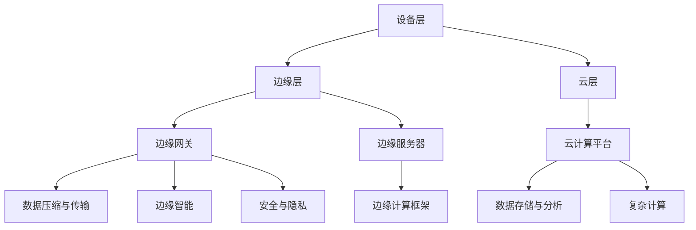
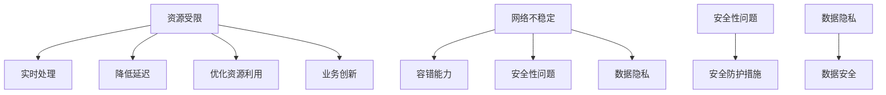
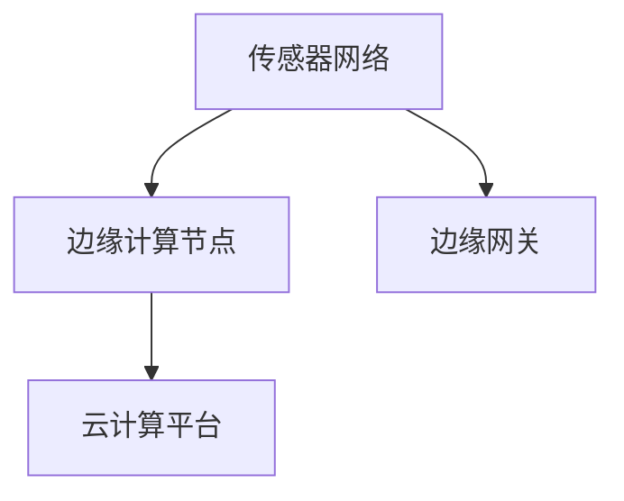
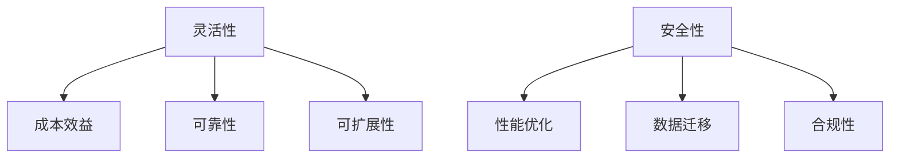
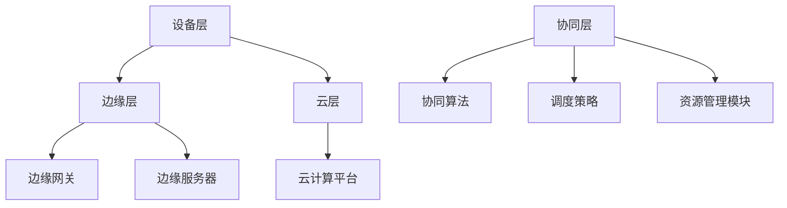
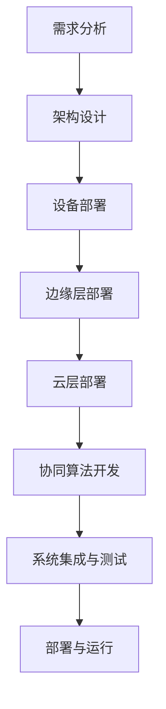
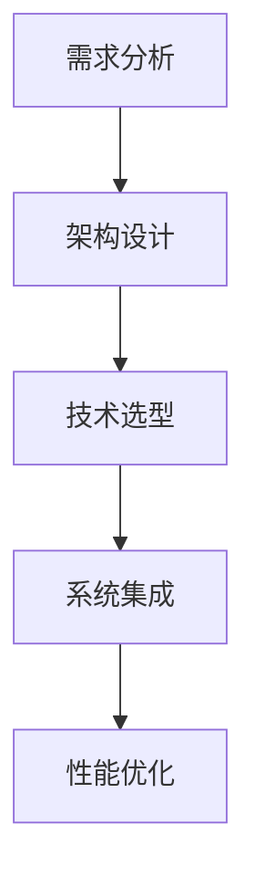
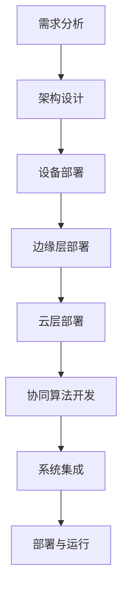
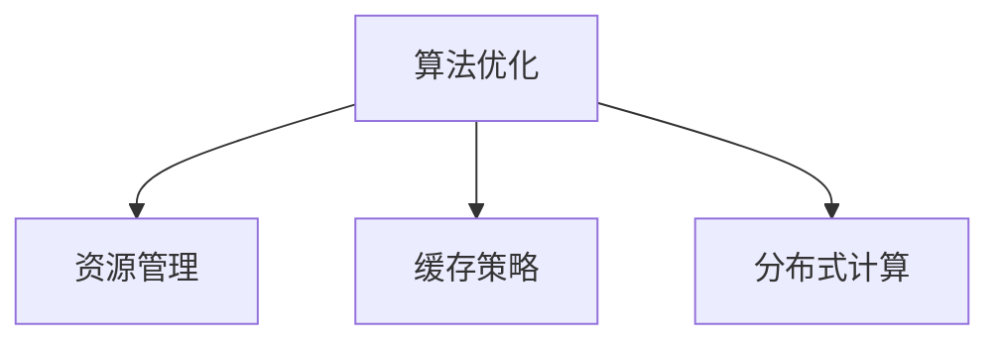
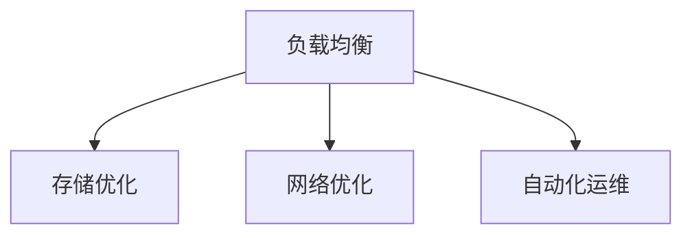

                 

**企业AI Agent的边缘计算与云计算协同策略**

---

**关键词：企业AI Agent、边缘计算、云计算、协同策略、性能优化**

**摘要：**
本文围绕企业AI Agent的边缘计算与云计算协同策略展开，通过深入探讨边缘计算与云计算的基础知识、协同机制以及实际应用，为企业AI Agent的设计与实现提供了系统性指导。本文旨在分析边缘计算与云计算在AI Agent中的应用价值，阐述协同策略的设计原则与实现方法，探讨性能优化策略，并对未来发展趋势进行展望。希望通过本文的讨论，能够为读者提供对边缘计算与云计算协同策略的深刻理解，为企业AI技术的发展和应用提供有益的参考。

---

## 第一部分：引言

### 第1章：企业AI Agent概述

#### 1.1 什么是企业AI Agent

**背景介绍：**
随着人工智能技术的快速发展，AI Agent作为一种智能化实体，正在逐步渗透到各个行业，为企业提供智能化解决方案。企业AI Agent，即人工智能代理，是一种能够自主执行任务、适应环境变化并具备一定程度智能决策能力的系统。它通过模拟人类思维过程，帮助企业提高效率、降低成本，实现智能化运营。

**问题背景与问题描述：**
企业运营过程中，面临着大量重复性任务和数据处理的挑战。传统的手动操作不仅效率低下，而且容易出现错误。如何利用人工智能技术，实现自动化和智能化，成为企业亟待解决的问题。企业AI Agent正是为解决这一问题而诞生的。

**问题解决与边界与外延：**
企业AI Agent通过学习大量数据，掌握业务规则，能够自主执行任务，如数据分析、预测、决策等。它不仅能够处理结构化数据，还能够处理非结构化数据，如文本、图像、语音等。此外，企业AI Agent还可以与其他系统进行集成，实现跨系统的数据交互和业务协同。

**核心要素组成：**
企业AI Agent的核心要素包括数据采集与处理、智能决策、任务执行、自主学习与优化等。通过这些核心要素的协同工作，企业AI Agent能够实现高效、智能的运营。

#### 1.2 AI Agent在企业中的应用价值

**核心概念与联系：**
AI Agent在企业中的应用价值主要体现在以下几个方面：

1. **自动化与效率提升：** AI Agent能够自动执行重复性任务，提高工作效率，减少人力成本。
2. **决策支持与风险管理：** AI Agent通过数据分析，为企业提供决策支持，降低运营风险。
3. **客户服务与体验优化：** AI Agent能够提供智能客服服务，提升客户体验，增强客户满意度。
4. **业务流程优化与创新：** AI Agent能够帮助企业优化业务流程，推动业务模式创新。

**概念属性特征对比表格：**

| 概念         | 特征                                  | 应用价值                                         |
| ------------ | ------------------------------------- | ---------------------------------------------- |
| 自动化与效率 | 自动执行任务，减少人力成本               | 提高工作效率，降低运营成本                     |
| 决策支持     | 基于数据分析提供决策建议                 | 降低运营风险，提高决策质量                     |
| 客户服务     | 提供智能客服服务，提升客户体验           | 增强客户满意度，提高客户粘性                   |
| 业务流程优化 | 优化业务流程，推动业务模式创新           | 提高运营效率，降低运营成本                     |

**ER实体关系图架构：**

```mermaid
erDiagram
  AI Agent ||--|{ 数据采集与处理 }|
  AI Agent ||--|{ 智能决策 }|
  AI Agent ||--|{ 任务执行 }|
  AI Agent ||--|{ 自主学习与优化 }|
```

#### 1.3 边缘计算与云计算的协同策略

**背景介绍：**
边缘计算与云计算作为人工智能技术的重要支撑，分别具有不同的优势和局限性。边缘计算靠近数据源，能够实现实时数据处理和分析；云计算则提供强大的计算能力和海量数据存储。如何将两者协同起来，为企业AI Agent提供最佳的运行环境，是当前研究的一个重要方向。

**问题背景与问题描述：**
边缘计算与云计算在AI Agent中的应用，涉及到数据传输、计算资源分配、任务调度等问题。如何实现两者的高效协同，提高AI Agent的性能和可靠性，成为亟待解决的问题。

**问题解决与边界与外延：**
通过构建协同框架，将边缘计算与云计算的优势结合起来，实现数据的高效传输、计算资源的高效利用和任务的高效调度。边界与外延包括网络延迟、数据隐私和安全等问题。

**核心要素组成：**
协同策略的核心要素包括数据传输机制、计算资源管理、任务调度策略、安全与隐私保护等。通过这些核心要素的协同工作，实现边缘计算与云计算的有机结合，为企业AI Agent提供高效、可靠的运行环境。

#### 1.4 本书结构安排

**文章结构安排：**
本书分为五个部分：

1. **引言：** 介绍企业AI Agent的边缘计算与云计算协同策略的背景、应用价值和协同策略的重要性。
2. **边缘计算与云计算基础：** 深入探讨边缘计算与云计算的基础知识、架构和关键技术。
3. **企业AI Agent的边缘计算实践：** 分析企业AI Agent的边缘计算设计与实现、边缘计算与云计算的协同应用和性能优化。
4. **边缘计算与云计算协同的未来发展趋势：** 探讨边缘计算与云计算协同的未来趋势、技术发展与应用趋势。
5. **总结与展望：** 总结本书的主要内容和学习到的知识，展望边缘计算与云计算协同的新应用领域和未来的研究方向。

#### 1.5 阅读指南

**阅读指南：**
为了更好地理解企业AI Agent的边缘计算与云计算协同策略，建议读者遵循以下阅读步骤：

1. **逐步阅读：** 按照书的章节结构，逐步阅读，确保对每个部分的内容都有深入理解。
2. **实践结合：** 结合实际案例，将理论知识与实践相结合，加深对边缘计算与云计算协同策略的理解。
3. **问题引导：** 在阅读过程中，遇到不理解的问题，可以通过查阅相关资料、进行讨论或寻求帮助来解决。
4. **总结归纳：** 阅读结束后，对书中的知识点进行总结归纳，形成自己的知识体系。

---

**第二部分：边缘计算与云计算基础**

### 第2章：边缘计算基础

#### 2.1 边缘计算的概念与背景

**背景介绍：**
边缘计算是近年来兴起的一种新型计算模式，旨在将计算能力从云端转移到网络边缘，实现数据的实时处理和分析。边缘计算的概念起源于物联网（IoT）的发展，随着物联网设备的激增，数据量呈爆炸性增长，传统的云计算模式已经无法满足实时处理的需求。

**核心概念与联系：**
边缘计算的核心概念包括：

1. **数据边缘：** 数据边缘指的是数据生成的源头，如智能设备、传感器等。
2. **计算边缘：** 计算边缘指的是靠近数据源的边缘设备或服务器，用于处理和存储数据。
3. **边缘网关：** 边缘网关是连接云计算和边缘计算的关键设备，负责数据传输和协议转换。

**概念属性特征对比表格：**

| 概念        | 特征                                  | 应用场景                                       |
| ----------- | ------------------------------------- | -------------------------------------------- |
| 数据边缘    | 数据生成源头，如智能设备、传感器       | 实时数据采集与处理                           |
| 计算边缘    | 靠近数据源的边缘设备或服务器           | 实时数据分析和处理                           |
| 边缘网关    | 负责数据传输和协议转换的关键设备       | 云计算与边缘计算的连接桥梁                   |

**ER实体关系图架构：**

```mermaid
erDiagram
  数据边缘 ||--|{ 计算边缘 }|
  计算边缘 ||--|{ 边缘网关 }|
```

#### 2.2 边缘计算的架构与关键技术

**架构设计：**
边缘计算架构通常包括以下几个层次：

1. **设备层：** 包括各种物联网设备、传感器等，用于数据采集。
2. **边缘层：** 包括边缘网关、边缘服务器等，用于数据预处理和初步分析。
3. **云层：** 包括云计算平台，用于数据存储、分析和复杂计算。

**关键技术：**
边缘计算的关键技术包括：

1. **数据压缩与传输：** 为了降低带宽消耗，需要采用高效的数据压缩技术和传输协议。
2. **边缘智能：** 通过在边缘设备上部署智能算法，实现实时数据分析和决策。
3. **安全与隐私：** 由于边缘计算涉及到大量敏感数据，需要采用安全防护措施，确保数据安全。
4. **边缘计算框架：** 如Kubernetes、EdgeX Foundry等，用于管理和调度边缘计算资源。

**架构设计与关键技术联系：**



#### 2.3 边缘计算的挑战与机遇

**挑战：**
边缘计算面临着以下挑战：

1. **资源受限：** 边缘设备通常资源有限，需要在有限的资源下实现高效计算。
2. **网络不稳定：** 边缘设备可能处于网络不稳定的环境中，需要具备容错能力。
3. **安全性问题：** 边缘设备容易被攻击，需要加强安全防护措施。
4. **数据隐私：** 边缘计算涉及到大量敏感数据，需要确保数据隐私。

**机遇：**
边缘计算带来的机遇包括：

1. **实时处理：** 能够实现实时数据分析和处理，满足对实时性的高需求。
2. **降低延迟：** 减少数据传输延迟，提高用户体验。
3. **优化资源利用：** 通过边缘计算，实现计算资源的优化利用。
4. **业务创新：** 拓展新的业务模式，推动产业升级。

**挑战与机遇联系：**



#### 2.4 边缘计算的应用案例

**应用场景：**
边缘计算在多个领域得到广泛应用，以下是一些典型应用案例：

1. **智能制造：** 通过边缘计算，实现工厂设备的实时监控、故障诊断和生产线的智能调度。
2. **智能交通：** 通过边缘计算，实现交通信号控制、路况监测和车辆管理，提高交通效率和安全性。
3. **智慧医疗：** 通过边缘计算，实现医疗设备的实时监控、数据分析和远程诊断。
4. **智能农业：** 通过边缘计算，实现农作物的实时监测、环境控制和智能灌溉。

**案例描述：**
以智能制造为例，边缘计算在智能制造中的应用主要体现在以下几个方面：

1. **设备监控：** 通过边缘计算，实时监控工厂设备的工作状态，实现故障预测和维护。
2. **生产调度：** 通过边缘计算，优化生产流程，提高生产效率。
3. **质量检测：** 通过边缘计算，对生产过程进行质量检测，确保产品质量。
4. **数据整合：** 通过边缘计算，将各类生产数据进行整合和分析，为企业决策提供支持。

**技术架构：**
边缘计算在智能制造中的应用技术架构主要包括：

1. **传感器网络：** 在工厂设备上部署各种传感器，实现数据的实时采集。
2. **边缘计算节点：** 在边缘设备上部署计算节点，实现数据的初步处理和分析。
3. **云计算平台：** 在云端部署计算资源，用于数据的进一步分析和存储。
4. **边缘网关：** 负责边缘设备与云计算平台之间的数据传输和协议转换。

**架构图：**



---

**第3章：云计算基础**

#### 3.1 云计算的概念与模式

**概念介绍：**
云计算是一种通过互联网提供计算资源的服务模式，用户可以根据需求租用计算资源，如服务器、存储、网络等。云计算分为三种主要服务模式：IaaS、PaaS和SaaS。

**IaaS（基础设施即服务）：**
IaaS提供基础计算资源，如虚拟机、存储和网络等，用户可以根据需要配置和管理这些资源。IaaS的主要优势是提供灵活的计算资源，用户可以根据需求进行动态扩展。

**PaaS（平台即服务）：**
PaaS提供一个开发平台，包括应用程序框架、开发工具和数据库等，用户可以在平台上开发、测试和部署应用程序。PaaS的主要优势是简化开发过程，提高开发效率。

**SaaS（软件即服务）：**
SaaS提供完整的软件解决方案，用户可以通过互联网访问和使用这些软件。SaaS的主要优势是降低软件成本，提高用户的使用便捷性。

**模式对比表格：**

| 服务模式 | 概念 | 优势 |
| --- | --- | --- |
| IaaS | 基础设施即服务 | 灵活的计算资源，按需扩展 |
| PaaS | 平台即服务 | 简化开发过程，提高效率 |
| SaaS | 软件即服务 | 降低软件成本，提高便捷性 |

#### 3.2 云计算的服务类型

**IaaS：**
IaaS的服务类型包括虚拟机、容器、块存储、对象存储等。虚拟机提供虚拟化的计算资源，用户可以自定义操作系统和应用程序。容器提供轻量级的虚拟化技术，提高资源利用率和部署灵活性。块存储和对象存储提供持久化存储解决方案，满足不同数据类型的需求。

**PaaS：**
PaaS的服务类型包括应用程序框架、开发工具、数据库、消息队列等。应用程序框架提供开发平台，如Java EE、.NET等。开发工具包括集成开发环境（IDE）、版本控制系统等。数据库提供关系型数据库、非关系型数据库、时序数据库等，满足不同数据管理需求。消息队列提供异步消息传递功能，实现系统之间的解耦和协作。

**SaaS：**
SaaS的服务类型包括电子邮件、文档编辑、客户关系管理（CRM）、企业资源规划（ERP）等。电子邮件提供企业级的邮件服务，支持邮件收发、邮件组管理等。文档编辑提供在线文档编辑和协作功能，支持多人实时编辑。CRM提供客户管理功能，包括客户信息管理、销售机会管理、营销活动管理等。ERP提供企业级的资源管理功能，包括财务管理、人力资源管理、供应链管理等。

#### 3.3 云计算的优势与挑战

**优势：**
云计算具有以下优势：

1. **灵活性：** 用户可以根据需求灵活配置计算资源，实现按需扩展。
2. **成本效益：** 通过租用计算资源，用户可以降低IT成本，提高资源利用率。
3. **可靠性：** 云服务提供商通常提供高可用性和故障恢复能力，保证服务的连续性。
4. **可扩展性：** 云服务提供商可以快速扩展计算资源，满足用户的需求增长。

**挑战：**
云计算面临以下挑战：

1. **安全性：** 云计算涉及到大量敏感数据，需要确保数据安全和用户隐私。
2. **性能优化：** 云服务的性能受到网络延迟和负载均衡等因素的影响，需要优化性能。
3. **数据迁移：** 从传统IT环境迁移到云计算环境，需要处理数据迁移和兼容性问题。
4. **合规性：** 不同国家和地区的法律法规对云计算有不同的要求，需要确保合规性。

**优势与挑战联系：**



---

**第4章：边缘计算与云计算协同策略**

#### 4.1 协同策略的重要性

**背景介绍：**
边缘计算与云计算协同策略的核心目的是充分利用两者的优势，实现高效的数据处理和分析。边缘计算靠近数据源，可以实现实时数据处理，降低网络延迟；云计算则具备强大的计算能力和海量数据存储能力。通过协同策略，可以实现计算资源的优化利用，提高系统性能和可靠性。

**问题背景与问题描述：**
在当前的信息化时代，数据量呈指数级增长，传统的云计算模式已经无法满足实时数据处理的需求。边缘计算虽然能够实现实时数据处理，但计算能力和存储能力有限。如何将边缘计算与云计算的优势结合起来，实现协同处理，成为当前研究的热点问题。

**问题解决与边界与外延：**
通过构建协同策略，可以实现以下目标：

1. **数据传输优化：** 通过边缘计算，实现数据在近源处理，减少数据传输量，降低网络延迟。
2. **计算资源优化：** 通过云计算，实现大规模计算资源的调度和优化，提高计算效率。
3. **任务调度优化：** 通过协同策略，实现任务在边缘计算和云计算之间的合理调度，提高系统整体性能。

**核心要素组成：**
协同策略的核心要素包括：

1. **数据传输机制：** 包括数据压缩、加密、传输协议等，确保数据传输的高效和安全。
2. **计算资源管理：** 包括资源调度、负载均衡、资源监控等，实现计算资源的优化利用。
3. **任务调度策略：** 包括任务分配、调度、执行监控等，实现任务的高效执行。
4. **安全与隐私保护：** 包括数据安全、隐私保护、访问控制等，确保系统安全运行。

#### 4.2 边缘计算与云计算的协同框架

**框架设计：**
边缘计算与云计算的协同框架通常包括以下几个层次：

1. **设备层：** 包括各种物联网设备、传感器等，用于数据采集。
2. **边缘层：** 包括边缘网关、边缘服务器等，用于数据预处理和初步分析。
3. **云层：** 包括云计算平台，用于数据存储、分析和复杂计算。
4. **协同层：** 包括协同算法、调度策略、资源管理模块等，实现边缘计算与云计算的协同处理。

**架构设计联系：**



#### 4.3 协同策略的实施方法

**实施步骤：**
1. **需求分析：** 分析业务需求，确定边缘计算与云计算协同的目标和任务。
2. **架构设计：** 根据需求分析结果，设计边缘计算与云计算的协同架构。
3. **设备部署：** 在设备层部署物联网设备、传感器等，实现数据采集。
4. **边缘层部署：** 在边缘层部署边缘网关、边缘服务器等，实现数据预处理和初步分析。
5. **云层部署：** 在云层部署云计算平台，实现数据存储、分析和复杂计算。
6. **协同算法开发：** 开发协同算法，实现边缘计算与云计算之间的数据传输、计算资源管理和任务调度。
7. **系统集成与测试：** 完成边缘计算与云计算的协同系统，进行集成测试和性能优化。
8. **部署与运行：** 将协同系统部署到生产环境，进行实际运行，并根据运行情况不断优化和调整。

**实施方法联系：**



---

**第5章：边缘AI Agent的设计与实现**

#### 5.1 边缘AI Agent的设计原则

**设计原则：**
边缘AI Agent的设计原则主要包括：

1. **模块化设计：** 将边缘AI Agent划分为多个模块，如数据采集模块、数据处理模块、智能决策模块等，实现系统的可扩展性和可维护性。
2. **适应性设计：** 考虑到边缘设备的资源限制，边缘AI Agent需要具备适应不同硬件环境和网络条件的能力。
3. **实时性设计：** 边缘AI Agent需要能够快速响应和处理数据，确保实时性。
4. **安全性设计：** 考虑到边缘设备的安全风险，边缘AI Agent需要具备安全防护能力，确保数据安全和系统稳定运行。

**原则对比表格：**

| 设计原则 | 描述 | 目的 |
| --- | --- | --- |
| 模块化设计 | 将系统划分为多个模块 | 提高系统的可扩展性和可维护性 |
| 适应性设计 | 适应不同硬件环境和网络条件 | 提高系统的灵活性和适应性 |
| 实时性设计 | 快速响应和处理数据 | 确保实时性 |
| 安全性设计 | 提高数据安全和系统稳定运行 | 确保数据安全和系统安全 |

#### 5.2 边缘AI Agent的关键技术

**核心技术：**
边缘AI Agent的关键技术包括：

1. **边缘智能算法：** 边缘AI Agent需要具备边缘智能算法，如机器学习、深度学习等，实现数据的实时分析和智能决策。
2. **数据预处理技术：** 包括数据清洗、数据整合等，确保数据的质量和一致性。
3. **边缘计算框架：** 如TensorFlow Lite、PyTorch Mobile等，用于在边缘设备上部署和运行智能算法。
4. **安全防护技术：** 包括数据加密、访问控制等，确保数据安全和系统安全。

**技术对比表格：**

| 技术名称 | 描述 | 主要应用 |
| --- | --- | --- |
| 边缘智能算法 | 实现边缘设备的智能决策 | 数据分析、智能控制、实时预测 |
| 数据预处理技术 | 数据清洗、数据整合 | 提高数据质量，确保数据一致性 |
| 边缘计算框架 | 用于在边缘设备上部署和运行智能算法 | 智能应用开发、边缘服务部署 |
| 安全防护技术 | 数据加密、访问控制 | 确保数据安全和系统安全 |

#### 5.3 边缘AI Agent的应用案例

**应用场景：**
边缘AI Agent在多个领域得到广泛应用，以下是一些典型应用案例：

1. **智能交通：** 边缘AI Agent可以用于交通信号控制、路况监测和车辆管理，提高交通效率和安全性。
2. **智能制造：** 边缘AI Agent可以用于设备监控、生产调度和质量检测，提高生产效率和产品质量。
3. **智慧医疗：** 边缘AI Agent可以用于医疗设备的实时监控、数据分析和远程诊断，提高医疗服务质量。
4. **智能农业：** 边缘AI Agent可以用于农作物的实时监测、环境控制和智能灌溉，提高农业生产效率。

**案例描述：**
以智能交通为例，边缘AI Agent在智能交通中的应用主要体现在以下几个方面：

1. **交通信号控制：** 通过边缘AI Agent，实时监测交通流量，实现智能交通信号控制，提高交通效率。
2. **路况监测：** 通过边缘AI Agent，实时监测路况信息，包括道路拥堵、交通事故等，为交通管理部门提供实时数据支持。
3. **车辆管理：** 通过边缘AI Agent，实时监测车辆状态，包括车速、车距等，确保行车安全。

**技术架构：**
边缘AI Agent在智能交通中的应用技术架构主要包括：

1. **传感器网络：** 在交通信号灯、道路摄像头等设备上部署传感器，实现交通数据的实时采集。
2. **边缘计算节点：** 在边缘设备上部署边缘计算节点，实现交通数据的预处理和初步分析。
3. **云计算平台：** 在云端部署计算资源，用于交通数据的进一步分析和存储。
4. **边缘网关：** 负责边缘设备与云计算平台之间的数据传输和协议转换。

**架构图：**


---

**第6章：边缘计算与云计算的协同应用**

#### 6.1 协同应用的设计思路

**设计思路：**
边缘计算与云计算的协同应用设计思路主要包括以下几个方面：

1. **需求分析：** 分析业务需求，确定协同应用的目标和功能。
2. **架构设计：** 设计边缘计算与云计算的协同架构，确定数据传输、计算资源管理和任务调度的策略。
3. **技术选型：** 根据业务需求和技术要求，选择合适的边缘计算框架、云计算平台和协同算法。
4. **系统集成：** 将边缘计算与云计算的系统集成到一起，实现协同处理和协同服务。
5. **性能优化：** 根据实际运行情况，不断优化和调整系统性能。

**设计思路流程图：**



#### 6.2 协同应用的实现步骤

**实现步骤：**
1. **需求分析：** 分析业务需求，确定协同应用的目标和功能。
2. **架构设计：** 设计边缘计算与云计算的协同架构，包括设备层、边缘层、云层和协同层。
3. **设备部署：** 在设备层部署物联网设备、传感器等，实现数据的实时采集。
4. **边缘层部署：** 在边缘层部署边缘网关、边缘服务器等，实现数据预处理和初步分析。
5. **云层部署：** 在云层部署云计算平台，实现数据的存储、分析和复杂计算。
6. **协同算法开发：** 开发协同算法，实现边缘计算与云计算之间的数据传输、计算资源管理和任务调度。
7. **系统集成：** 完成边缘计算与云计算的协同系统，进行集成测试和性能优化。
8. **部署与运行：** 将协同系统部署到生产环境，进行实际运行，并根据运行情况不断优化和调整。

**实现步骤流程图：**



#### 6.3 协同应用的案例研究

**案例描述：**
以智能交通为例，边缘计算与云计算协同应用的案例研究包括以下几个方面：

1. **交通信号控制：** 通过边缘计算，实时监测交通流量，实现智能交通信号控制，提高交通效率。
2. **路况监测：** 通过边缘计算，实时监测路况信息，包括道路拥堵、交通事故等，为交通管理部门提供实时数据支持。
3. **车辆管理：** 通过边缘计算，实时监测车辆状态，包括车速、车距等，确保行车安全。

**技术架构：**
智能交通协同应用的技术架构主要包括以下几个层次：

1. **设备层：** 包括各种物联网设备、传感器等，用于数据采集。
2. **边缘层：** 包括边缘网关、边缘服务器等，用于数据预处理和初步分析。
3. **云层：** 包括云计算平台，用于数据存储、分析和复杂计算。
4. **协同层：** 包括协同算法、调度策略、资源管理模块等，实现边缘计算与云计算的协同处理。

**架构图：**


**实施效果：**
通过边缘计算与云计算的协同应用，实现了以下效果：

1. **交通信号控制优化：** 实现了智能交通信号控制，提高了交通效率，减少了交通拥堵。
2. **路况信息实时监测：** 实现了实时路况信息的监测，提高了交通管理部门的决策能力。
3. **车辆状态实时监控：** 实现了车辆状态的实时监控，提高了行车安全。

**案例总结：**
智能交通协同应用的案例研究表明，边缘计算与云计算的协同策略在智能交通领域具有显著的应用价值，能够实现实时数据处理和高效协同，提高交通效率和安全性。

---

**第7章：AI Agent的性能优化**

#### 7.1 性能优化的重要性

**背景介绍：**
在边缘计算与云计算协同的背景下，AI Agent的性能优化变得尤为重要。AI Agent作为智能化的核心组件，其性能直接影响企业的运营效率和服务质量。性能优化旨在提高AI Agent的响应速度、准确性和稳定性，从而满足不断增长的业务需求。

**核心概念与联系：**
性能优化的重要性体现在以下几个方面：

1. **响应速度：** 边缘计算的特点是靠近数据源，实时性要求高。优化AI Agent的响应速度，能够确保系统在边缘环境中快速响应用户请求。
2. **准确性：** AI Agent的准确性直接关系到决策的正确性。优化算法性能，提高模型准确性，能够减少错误决策，提高业务价值。
3. **稳定性：** 在边缘环境中，AI Agent需要面临各种复杂和不可预测的工况。优化系统稳定性，能够提高AI Agent的可靠性和可用性。

**概念属性特征对比表格：**

| 概念 | 特征 | 应用场景 |
| --- | --- | --- |
| 响应速度 | 快速响应 | 边缘计算 |
| 准确性 | 高准确性 | 决策支持 |
| 稳定性 | 高稳定性 | 稳定运行 |

**ER实体关系图架构：**

```mermaid
erDiagram
  响应速度 ||--|{ 边缘计算 }|
  准确性 ||--|{ 决策支持 }|
  稳定性 ||--|{ 稳定运行 }|
```

#### 7.2 边缘计算端的优化策略

**优化策略：**
边缘计算端的优化策略主要包括以下几个方面：

1. **算法优化：** 采用高效算法和模型压缩技术，减少计算复杂度，提高执行效率。
2. **资源管理：** 优化边缘设备的资源分配，包括CPU、内存、网络等，确保关键任务的优先执行。
3. **缓存策略：** 实施有效的缓存策略，减少数据读取和传输的次数，提高数据处理速度。
4. **分布式计算：** 利用边缘设备的分布式计算能力，实现并行处理，提高系统整体性能。

**优化策略联系：**



#### 7.3 云计算端的优化策略

**优化策略：**
云计算端的优化策略主要包括以下几个方面：

1. **负载均衡：** 实现负载均衡，合理分配计算任务，避免单点过载，提高系统整体性能。
2. **存储优化：** 采用高效的存储方案，包括数据压缩、存储分层等，减少存储空间占用和访问延迟。
3. **网络优化：** 优化网络传输路径，减少数据传输延迟，提高数据传输效率。
4. **自动化运维：** 引入自动化运维工具，实现系统的自动化部署、监控和故障恢复，提高运维效率。

**优化策略联系：**



#### 7.4 性能优化案例分析

**案例背景：**
以智能工厂为例，智能工厂通过边缘计算与云计算协同，实现生产过程的智能化监控和优化。随着生产数据的不断增长，AI Agent的性能优化变得尤为重要。

**优化过程：**
1. **需求分析：** 分析智能工厂的生产需求，确定AI Agent的性能优化目标。
2. **算法优化：** 对AI Agent的算法进行优化，采用更高效的模型和算法，提高响应速度和准确性。
3. **资源管理：** 优化边缘设备的资源分配，确保关键任务的优先执行，提高系统稳定性。
4. **缓存策略：** 实施缓存策略，减少数据读取和传输的次数，提高数据处理速度。
5. **分布式计算：** 利用边缘设备的分布式计算能力，实现并行处理，提高系统整体性能。
6. **云计算端优化：** 实施负载均衡、存储优化和网络优化，提高云计算端的性能。

**优化效果：**
通过上述优化策略，智能工厂的AI Agent实现了以下效果：

1. **响应速度提高：** AI Agent的响应速度显著提高，能够更快地响应用户请求，提高生产效率。
2. **准确性提升：** AI Agent的准确性提升，减少错误决策，提高生产质量和安全性。
3. **稳定性增强：** 系统稳定性增强，降低了故障率，提高了系统的可靠性和可用性。

**案例总结：**
智能工厂的案例研究表明，通过边缘计算与云计算的协同优化，AI Agent的性能得到了显著提升，为企业生产提供了强大的支持。这一案例为其他企业提供了宝贵的经验，证明了性能优化在智能系统中的重要性。

---

**第8章：边缘计算与云计算协同的未来发展趋势**

#### 8.1 技术发展趋势

**边缘计算与云计算的融合：**
随着5G技术的普及，边缘计算与云计算将进一步融合，实现更高带宽、更低延迟的网络连接。这将使得边缘计算能够更好地发挥实时数据处理的能力，而云计算则提供更强的计算能力和存储资源，两者结合将形成强大的计算生态系统。

**智能边缘计算：**
未来边缘计算将不仅仅局限于数据处理，还将融入更多的智能元素，如机器学习、深度学习等。智能边缘计算将使得边缘设备具备更强大的自主决策能力，能够更好地应对复杂场景。

**区块链技术：**
区块链技术的引入将为边缘计算与云计算的协同提供更加安全、可靠的数据处理方式。通过区块链技术，可以实现数据的分布式存储和加密传输，确保数据的安全性和隐私性。

**硬件加速：**
随着硬件技术的发展，如GPU、TPU等加速卡的应用，边缘计算与云计算的性能将进一步提升。硬件加速将使得边缘设备和云计算平台能够更快地处理大规模数据和高复杂度的计算任务。

#### 8.2 应用发展趋势

**智能制造：**
边缘计算与云计算的协同将在智能制造中发挥重要作用，实现生产过程的智能化监控、优化和自动化。通过边缘计算，实现实时数据采集和初步分析，而云计算则提供大规模数据处理和复杂算法支持，提高生产效率和产品质量。

**智慧城市：**
智慧城市是边缘计算与云计算协同应用的另一个重要领域。通过边缘计算，实现实时交通管理、环境监测、公共安全等领域的智能化应用，而云计算则提供大数据分析和云计算服务，提升城市管理的智能化水平。

**智慧医疗：**
边缘计算与云计算协同将推动智慧医疗的发展。通过边缘计算，实现医疗设备的实时监控和数据分析，而云计算则提供远程诊断、患者管理系统等高级服务，提升医疗服务的质量和效率。

**智能家居：**
智能家居是边缘计算与云计算协同应用的另一个重要场景。通过边缘计算，实现家居设备的实时监控和控制，而云计算则提供智能推荐、数据分析等高级服务，提升家居生活的智能化水平。

#### 8.3 未来挑战与机遇

**数据安全与隐私保护：**
随着边缘计算与云计算协同应用的发展，数据安全与隐私保护将面临更大的挑战。如何确保数据在传输、存储和处理过程中的安全性，以及如何保护用户隐私，将成为重要的研究课题。

**网络延迟与带宽限制：**
边缘计算与云计算的协同应用往往依赖于高效的网络连接。然而，网络延迟和带宽限制仍然是制约边缘计算与云计算协同应用的重要因素。如何优化网络传输，提高数据传输效率，仍需进一步研究。

**计算资源分配与管理：**
边缘计算与云计算协同应用中的计算资源分配和管理也是一个挑战。如何合理分配计算资源，优化任务调度，提高系统整体性能，仍需不断探索和创新。

**技术标准化与兼容性：**
边缘计算与云计算的协同应用需要各种技术的标准化和兼容性。如何确保不同平台、不同设备之间的互操作性和兼容性，也是未来需要解决的重要问题。

#### 8.4 发展策略建议

**加强技术研发：**
政府和企业应加大投入，加强边缘计算与云计算协同技术的研发，推动技术创新和应用。

**推动标准化进程：**
推动边缘计算与云计算的标准化进程，制定统一的技术标准和协议，提高系统的互操作性和兼容性。

**人才培养与引进：**
加强人才培养，培养一批具有边缘计算与云计算协同应用能力的专业人才。同时，积极引进国际顶尖人才，推动技术创新和应用。

**政策支持与引导：**
政府应出台相关政策，支持边缘计算与云计算协同技术的发展和应用，为产业发展提供良好的政策环境。

**产业合作与生态构建：**
鼓励产业合作，构建边缘计算与云计算协同应用的生态体系，实现资源共享和优势互补，推动产业的健康发展。

---

**第五部分：总结与展望**

### 第9章：总结

#### 9.1 主要内容回顾

本文围绕企业AI Agent的边缘计算与云计算协同策略进行了深入探讨。首先，介绍了企业AI Agent的基本概念和应用价值，然后详细阐述了边缘计算与云计算的基础知识、协同策略和实际应用。接着，分析了边缘AI Agent的设计与实现，以及边缘计算与云计算协同应用的性能优化策略。最后，展望了边缘计算与云计算协同的未来发展趋势，并提出了相关的发展策略。

#### 9.2 学到的知识与应用

通过本文的学习，读者可以了解到：

1. **边缘计算与云计算的基本概念和架构：** 包括边缘计算、云计算的概念、服务模式、技术优势与挑战等。
2. **协同策略的设计与实现：** 了解如何通过边缘计算与云计算的协同，实现高效的数据处理和分析。
3. **边缘AI Agent的设计与实现：** 学习边缘AI Agent的设计原则、关键技术以及应用案例。
4. **性能优化策略：** 了解如何通过优化策略，提升AI Agent的响应速度、准确性和稳定性。

这些知识可以应用于：

1. **企业智能化转型：** 通过边缘计算与云计算协同，实现企业运营的智能化，提高效率和降低成本。
2. **创新应用场景：** 在智能制造、智慧城市、智慧医疗等领域，通过边缘计算与云计算的协同，开发创新的智能应用。
3. **项目实践：** 在实际项目中，通过边缘计算与云计算的协同策略，提升系统的性能和可靠性。

### 第10章：展望

#### 10.1 边缘计算与云计算协同的新应用领域

未来，边缘计算与云计算协同将在以下新应用领域发挥重要作用：

1. **智慧农业：** 通过边缘计算，实现农作物的实时监控和智能管理，提高农业生产效率和产品质量。
2. **智能物流：** 通过边缘计算，实时监测物流运输过程中的各项指标，优化运输路线和资源配置。
3. **智能能源：** 通过边缘计算，实现能源设备的实时监控和优化管理，提高能源利用效率和可再生能源的比例。
4. **智能教育：** 通过边缘计算，实现个性化教育资源的实时推送和智能学习评估，提高教育质量和学习效果。

#### 10.2 未来的研究方向

未来的研究方向包括：

1. **边缘计算与云计算的深度融合：** 研究如何进一步融合边缘计算与云计算，实现更高效、更可靠的数据处理和分析。
2. **智能边缘计算：** 研究如何将更多的智能元素融入边缘计算，提升边缘设备的自主决策能力。
3. **数据安全与隐私保护：** 研究如何在边缘计算与云计算协同应用中，确保数据的安全和用户隐私。
4. **硬件加速技术：** 研究如何利用硬件加速技术，提高边缘计算与云计算的协同性能。

#### 10.3 对企业和开发者的建议

对于企业和开发者，以下是一些建议：

1. **积极拥抱新技术：** 关注边缘计算与云计算的最新技术和发展趋势，及时将新技术应用于实际项目中。
2. **加强技术积累：** 通过实践和理论学习，积累边缘计算与云计算相关的技术知识和实践经验。
3. **重视团队建设：** 培养一批具有边缘计算与云计算协同应用能力的专业团队，提升企业的技术竞争力。
4. **加强合作与交流：** 与行业内的领先企业和研究机构建立合作关系，共享技术资源，共同推进技术创新。

---

**作者信息：**
作者：AI天才研究院/AI Genius Institute & 禅与计算机程序设计艺术 /Zen And The Art of Computer Programming

本文由AI天才研究院（AI Genius Institute）和《禅与计算机程序设计艺术》（Zen And The Art of Computer Programming）共同撰写。AI天才研究院致力于推动人工智能技术的发展和创新应用，致力于培养下一代人工智能领域的专家。而《禅与计算机程序设计艺术》则是一部经典的计算机科学著作，以其深刻的思想和独特的视角，为计算机科学领域的发展提供了宝贵的启示。本文旨在通过深入探讨企业AI Agent的边缘计算与云计算协同策略，为人工智能技术的实际应用提供理论指导和实践参考。

