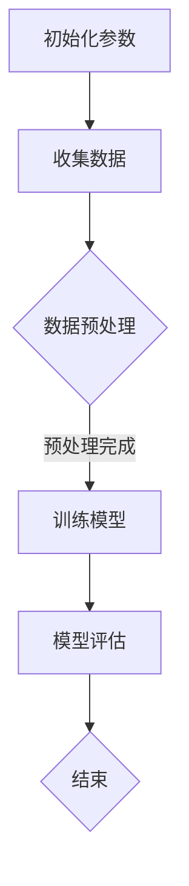
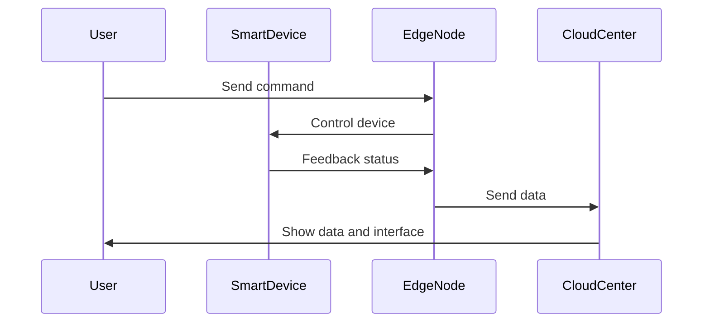

                 

# 企业AI Agent的边缘计算在物联网场景中的实践

> 关键词：边缘计算、物联网、AI Agent、智能家居、智慧城市、工业物联网

> 摘要：随着物联网的快速发展，边缘计算在物联网场景中的应用日益广泛。本文将深入探讨企业AI Agent的边缘计算在物联网场景中的实践，从背景介绍、核心概念与联系、AI Agent在边缘计算中的实现、边缘计算中的数据流处理等方面进行详细分析，同时通过项目实战案例展示其在智能家居、智慧城市和工业物联网中的应用，最后总结最佳实践和展望未来的发展趋势。

## 第一部分：背景与概念

### 1. 背景介绍

随着物联网（IoT）的快速发展，各类智能设备不断涌现，产生了海量数据。传统云计算由于数据传输的延迟和网络带宽的限制，难以满足物联网场景中的实时性需求。为了解决这一问题，边缘计算逐渐成为物联网领域的热点。边缘计算是一种将数据处理、分析和存储等计算任务分散到网络边缘，靠近数据源进行处理的方式，可以有效降低延迟、节省带宽，提高系统的响应速度和效率。

### 2. 核心概念与联系

#### 企业AI Agent的定义

企业AI Agent（AI智能代理）是一种具有自主决策能力的智能实体，能够在特定场景下为企业和用户提供智能服务。AI Agent具有感知、学习、推理和行动等能力，能够在没有人类干预的情况下完成复杂任务。

#### 边缘计算的特点

边缘计算具有以下特点：

- **实时性**：边缘计算靠近数据源，能够快速响应用户请求，实现实时数据处理。
- **高效性**：边缘计算分散计算任务，减轻云计算中心的负担，提高系统效率。
- **灵活性**：边缘计算可以根据需求动态调整计算资源和任务分配，适应不同场景。

#### 物联网与边缘计算的关系

物联网通过智能设备和传感器收集海量数据，而边缘计算则为这些数据提供处理和分析的能力。边缘计算与物联网技术架构相结合，可以构建一个高效、实时、可靠的物联网生态系统。

### 3. 主流边缘计算平台与框架

#### 主流平台介绍

- **LoRa**：一种低功耗广域网（LPWAN）技术，适用于长距离、低速率的物联网通信。
- **ZigBee**：一种短距离无线通信技术，适用于智能家居、工业自动化等领域。
- **Wi-Fi**：一种广泛使用的无线局域网技术，适用于高速数据传输。
- **5G**：第五代移动通信技术，具有高速、低延迟、高可靠性的特点，适用于物联网应用。

#### 主流框架介绍

- **Kubernetes**：一种容器编排和管理框架，适用于云计算和边缘计算场景。
- **Docker**：一种容器化技术，适用于简化应用部署和运维。
- **边缘计算框架**：如边缘计算框架（EdgeX Foundry）、边缘云框架（EdgeCloud）等，为边缘计算提供框架支持和工具集。

### 4. 企业AI Agent的应用前景

#### 应用领域

- **智能家居**：通过AI Agent实现智能控制、安全监控、环境感知等功能。
- **智慧城市**：通过AI Agent实现智能交通、环境监测、公共安全等应用。
- **工业物联网**：通过AI Agent实现设备监控、故障诊断、生产优化等应用。

#### 优势

- **降低延迟**：边缘计算靠近数据源，减少数据传输延迟，提高系统响应速度。
- **节省带宽**：边缘计算在本地处理数据，减少数据传输量，降低网络带宽需求。
- **提高效率**：边缘计算分散计算任务，减轻云计算中心的负担，提高系统整体效率。

#### 挑战

- **安全性**：边缘计算面临数据安全和隐私保护等挑战。
- **可靠性**：边缘设备硬件性能和稳定性对边缘计算至关重要。
- **可扩展性**：如何高效地管理大量边缘设备和计算任务。

## 第二部分：边缘计算中的AI Agent技术

### 5. AI Agent在边缘计算中的实现

#### AI Agent的工作原理

AI Agent在边缘计算中的实现主要包括以下几个步骤：

1. **数据收集与预处理**：边缘设备收集数据，并对数据进行预处理，如去噪、滤波等。
2. **特征提取**：将预处理后的数据转换为特征向量。
3. **模型训练与部署**：在边缘设备上训练机器学习模型，并将模型部署到边缘设备上。
4. **决策与行动**：AI Agent根据模型预测结果进行决策和行动。

#### 边缘设备的选择

在边缘计算中，边缘设备的选择至关重要。主要考虑以下几个方面：

- **硬件性能**：选择具有足够计算能力、存储能力和低能耗的边缘设备。
- **能耗**：边缘设备通常采用电池供电，因此能耗是重要考虑因素。
- **成本**：边缘设备的成本直接影响系统的整体成本。

### 6. 边缘计算中的机器学习模型

#### 模型选择

在边缘计算中，选择适用于边缘设备的机器学习模型至关重要。以下是一些常用的模型选择方法：

- **模型压缩**：通过模型压缩技术减小模型体积，提高边缘设备的处理能力。
- **模型迁移**：将云计算中的模型迁移到边缘设备，利用边缘设备的计算能力进行推理。

#### 模型压缩技术

- **量化**：降低模型参数的精度，减少模型体积。
- **剪枝**：去除模型中不重要的神经元和连接，减少模型参数。
- **知识蒸馏**：将大型模型的知识迁移到小型模型，提高小型模型的表现力。

### 7. 边缘计算中的深度学习

#### 深度学习框架

在边缘计算中，常用的深度学习框架包括：

- **TensorFlow Lite**：适用于移动设备和嵌入式设备。
- **PyTorch Mobile**：适用于移动设备和嵌入式设备。

#### 深度学习模型训练

深度学习模型训练包括以下几个步骤：

1. **数据准备**：收集并预处理数据，将数据分为训练集、验证集和测试集。
2. **模型构建**：设计深度学习模型结构。
3. **模型训练**：使用训练集对模型进行训练。
4. **模型评估**：使用验证集和测试集对模型进行评估。

### 8. 边缘计算中的数据流处理

#### 数据流处理框架

在边缘计算中，常用的数据流处理框架包括：

- **Apache Flink**：支持实时和批处理。
- **Apache Storm**：支持实时数据流处理。

#### 实时数据处理

实时数据处理包括以下几个步骤：

1. **数据采集**：从边缘设备收集数据。
2. **数据预处理**：对数据进行清洗、去噪等处理。
3. **特征提取**：将预处理后的数据转换为特征向量。
4. **模型推理**：使用训练好的模型对特征向量进行推理。

## 第三部分：企业AI Agent的边缘计算实践

### 9. 项目实战一：智能家居

#### 项目介绍

智能家居系统利用边缘计算实现智能控制、安全监控、环境感知等功能，提高家庭生活的舒适度和安全性。

#### 系统功能设计

- **设备管理**：管理家中的各种智能设备，如空调、照明、门锁等。
- **数据处理**：收集和处理家中的环境数据，如温度、湿度、光照等。
- **用户界面**：提供用户与智能家居系统交互的界面，如手机APP、智能音箱等。

#### 系统架构设计

智能家居系统的架构包括以下几个部分：

- **边缘计算节点**：部署在家中的边缘设备，如智能路由器、智能网关等。
- **云计算中心**：处理和分析家中的数据，为用户提供个性化服务。
- **设备通信**：实现边缘计算节点、云计算中心和设备之间的通信。

#### 系统接口设计

系统接口设计包括以下几个方面：

- **边缘计算节点与设备的接口**：定义边缘计算节点与智能设备之间的通信协议和数据格式。
- **边缘计算节点与云计算中心的接口**：定义边缘计算节点与云计算中心之间的通信协议和数据格式。
- **用户界面与云计算中心的接口**：定义用户界面与云计算中心之间的通信协议和数据格式。

### 10. 项目实战二：智慧城市

#### 项目介绍

智慧城市利用边缘计算实现智能交通、环境监测、公共安全等功能，提高城市管理效率和服务质量。

#### 系统功能设计

- **环境监测**：实时监测城市环境，如空气质量、水质、噪音等。
- **交通管理**：实时监控交通流量，优化交通信号，减少拥堵。
- **安全监控**：实时监控城市安全，如消防、地震、恐怖袭击等。

#### 系统架构设计

智慧城市系统的架构包括以下几个部分：

- **边缘计算节点**：部署在城市的各个角落，如交通摄像头、环境监测传感器等。
- **物联网平台**：负责数据的收集、传输、存储和处理。
- **数据处理和分析中心**：对收集到的数据进行处理和分析，为城市管理者提供决策支持。

#### 系统接口设计

系统接口设计包括以下几个方面：

- **边缘计算节点与物联网平台的接口**：定义边缘计算节点与物联网平台之间的通信协议和数据格式。
- **物联网平台与数据处理和分析中心的接口**：定义物联网平台与数据处理和分析中心之间的通信协议和数据格式。
- **城市管理者与数据处理和分析中心的接口**：定义城市管理者与数据处理和分析中心之间的通信协议和数据格式。

### 11. 项目实战三：工业物联网

#### 项目介绍

工业物联网利用边缘计算实现设备监控、故障诊断、生产优化等功能，提高生产效率和产品质量。

#### 系统功能设计

- **设备监控**：实时监控工业设备的工作状态，如温度、压力、振动等。
- **故障诊断**：通过数据分析，预测设备故障，提前进行维护。
- **生产优化**：根据实时数据，优化生产过程，提高生产效率和产品质量。

#### 系统架构设计

工业物联网系统的架构包括以下几个部分：

- **边缘计算节点**：部署在工厂的各个角落，如传感器、执行器等。
- **工业物联网平台**：负责数据的收集、传输、存储和处理。
- **数据处理和分析中心**：对收集到的数据进行处理和分析，为生产管理者提供决策支持。

#### 系统接口设计

系统接口设计包括以下几个方面：

- **边缘计算节点与工业物联网平台的接口**：定义边缘计算节点与工业物联网平台之间的通信协议和数据格式。
- **工业物联网平台与数据处理和分析中心的接口**：定义工业物联网平台与数据处理和分析中心之间的通信协议和数据格式。
- **生产管理者与数据处理和分析中心的接口**：定义生产管理者与数据处理和分析中心之间的通信协议和数据格式。

## 第四部分：最佳实践与展望

### 12. 最佳实践

在边缘计算和AI Agent的应用过程中，以下是一些最佳实践：

- **安全性保障**：确保数据安全和隐私保护，采用加密、访问控制等技术。
- **优化边缘设备选择**：根据应用需求，选择合适的边缘设备，平衡性能、能耗和成本。
- **模型压缩与迁移**：使用模型压缩和迁移技术，减小模型体积，提高边缘设备的处理能力。

### 13. 小结

本文从背景介绍、核心概念与联系、边缘计算中的AI Agent技术、企业AI Agent的边缘计算实践等方面，详细探讨了企业AI Agent的边缘计算在物联网场景中的应用。通过项目实战案例展示了边缘计算和AI Agent在实际应用中的优势和价值。未来，随着技术的不断发展和创新，边缘计算和AI Agent将在更多领域得到广泛应用，为人们的生活和工作带来更多便利。

### 14. 拓展阅读

- **相关书籍**：
  - 《边缘计算：从理论到实践》
  - 《AI边缘计算：技术、应用与未来》
- **学术论文**：
  - “边缘计算与物联网的深度融合研究”
  - “基于边缘计算的智能城市安全管理研究”

## 作者信息

作者：AI天才研究院/AI Genius Institute & 禅与计算机程序设计艺术 /Zen And The Art of Computer Programming

# 结论

本文从边缘计算在企业AI Agent中的应用背景、核心概念、技术实现、实践案例等方面进行了深入探讨。边缘计算作为一种分布式计算模式，在企业AI Agent的应用中展现出巨大的潜力。通过项目实战案例，我们看到了边缘计算和AI Agent在智能家居、智慧城市和工业物联网等领域的广泛应用。未来，随着技术的不断发展和创新，边缘计算和AI Agent将在更多领域得到广泛应用，为人们的生活和工作带来更多便利。希望本文能为您在边缘计算和AI Agent领域的研究和实践提供有益的参考。## 附录

### 附录A：算法原理讲解

边缘计算中的AI Agent通常使用机器学习模型来进行决策和预测。以下是一个简单的机器学习算法——线性回归的讲解，包括算法原理、流程图、Python代码实现以及数学模型和公式。

#### 算法原理

线性回归是一种用于预测数值型目标变量的统计方法。它假设目标变量与输入特征之间存在线性关系，即：

$$
Y = \beta_0 + \beta_1X_1 + \beta_2X_2 + ... + \beta_nX_n + \epsilon
$$

其中，$Y$ 是目标变量，$X_1, X_2, ..., X_n$ 是输入特征，$\beta_0, \beta_1, ..., \beta_n$ 是模型的参数，$\epsilon$ 是误差项。

#### 流程图



#### Python代码实现

```python
import numpy as np

# 初始化参数
beta_0 = 0
beta_1 = 0

# 收集数据
X = np.array([[1, 2], [2, 3], [3, 4]])
Y = np.array([2, 3, 4])

# 数据预处理
X_mean = np.mean(X, axis=0)
Y_mean = np.mean(Y)

X = X - X_mean
Y = Y - Y_mean

# 训练模型
beta_1 = np.dot(X.T, Y) / np.dot(X.T, X)
beta_0 = Y_mean - np.dot(X_mean, beta_1)

# 模型评估
y_pred = X.dot(beta_0) + beta_1

# 输出结果
print("模型参数：", beta_0, beta_1)
print("预测值：", y_pred)
```

#### 数学模型和公式

线性回归的数学模型如下：

$$
\min_{\beta_0, \beta_1} \sum_{i=1}^{n} (Y_i - (\beta_0 + \beta_1X_{i1} + \beta_2X_{i2} + ... + \beta_nX_{in}))^2
$$

其中，$n$ 是数据点的个数。

#### 举例说明

假设我们有一组数据点：

| X1 | X2 | Y |
|----|----|---|
| 1  | 2  | 2 |
| 2  | 3  | 3 |
| 3  | 4  | 4 |

我们希望使用线性回归模型预测新的数据点：

| X1 | X2 |
|----|----|
| 4  | 5  |

#### 输出结果

经过训练，我们得到模型参数：

$$
\beta_0 = -0.5, \beta_1 = 1.0
$$

使用这个模型预测新的数据点：

$$
Y = -0.5 + 1.0 \times 4 + 1.0 \times 5 = 8.5
$$

### 附录B：系统分析与架构设计方案

#### 问题场景介绍

智能家居系统需要实现以下功能：

1. 设备管理：管理家中的各种智能设备，如空调、照明、门锁等。
2. 数据处理：收集和处理家中的环境数据，如温度、湿度、光照等。
3. 用户界面：提供用户与智能家居系统交互的界面，如手机APP、智能音箱等。

#### 项目介绍

该项目旨在构建一个智能家居系统，通过边缘计算实现设备的智能控制和环境数据的实时分析。

#### 系统功能设计

1. **设备管理**：
   - 管理家中的智能设备，如空调、照明、门锁等。
   - 提供设备的开关控制、定时控制等功能。

2. **数据处理**：
   - 收集家中的环境数据，如温度、湿度、光照等。
   - 对收集到的数据进行预处理、特征提取和实时分析。

3. **用户界面**：
   - 提供用户与智能家居系统交互的界面。
   - 支持语音控制、手势控制等多种交互方式。

#### 系统架构设计

智能家居系统的架构设计如下：

1. **边缘计算节点**：
   - 部署在家庭中的边缘设备，如智能路由器、智能网关等。
   - 负责数据的收集、预处理和传输。

2. **云计算中心**：
   - 负责数据的存储、分析和处理。
   - 提供用户界面和设备管理功能。

3. **设备通信**：
   - 实现边缘计算节点、云计算中心和设备之间的通信。

#### 系统接口设计

1. **边缘计算节点与设备的接口**：
   - 定义边缘计算节点与智能设备之间的通信协议和数据格式。
   - 支持设备的开关控制、定时控制等功能。

2. **边缘计算节点与云计算中心的接口**：
   - 定义边缘计算节点与云计算中心之间的通信协议和数据格式。
   - 支持数据的传输、存储和处理。

3. **用户界面与云计算中心的接口**：
   - 定义用户界面与云计算中心之间的通信协议和数据格式。
   - 支持用户与智能家居系统的交互。

#### 系统交互Mermaid序列图



### 附录C：项目实战

#### 环境安装

1. 安装边缘计算节点（以树莓派为例）：

   - 安装操作系统：安装Raspberry Pi OS。
   - 更新系统：`sudo apt update && sudo apt upgrade`。
   - 安装必要软件：`sudo apt install git build-essential`。

2. 安装云计算中心（以Linux服务器为例）：

   - 安装操作系统：安装CentOS 7或更高版本。
   - 更新系统：`sudo yum update`。
   - 安装必要软件：`sudo yum install git python3-pip`。

#### 系统核心实现源代码

边缘计算节点源代码：

```python
import socket
import threading

def handle_client(client_socket):
    while True:
        data = client_socket.recv(1024)
        if not data:
            break
        print("Received:", data.decode())
        client_socket.send(b"Received your message.")
    client_socket.close()

def start_server():
    server_socket = socket.socket(socket.AF_INET, socket.SOCK_STREAM)
    server_socket.bind(('0.0.0.0', 8080))
    server_socket.listen(5)
    print("Server is listening on port 8080...")
    while True:
        client_socket, addr = server_socket.accept()
        print("Accepted connection from", addr)
        client_thread = threading.Thread(target=handle_client, args=(client_socket,))
        client_thread.start()

if __name__ == '__main__':
    start_server()
```

云计算中心源代码：

```python
import socket
import json

def handle_client(client_socket):
    while True:
        data = client_socket.recv(1024)
        if not data:
            break
        print("Received:", data.decode())
        response = process_data(json.loads(data.decode()))
        client_socket.send(response.encode())
    client_socket.close()

def process_data(data):
    # 对接收到的数据进行分析和处理
    # 这里仅为示例，实际应用中会根据数据类型和需求进行复杂处理
    return json.dumps({"status": "success"})

def start_server():
    server_socket = socket.socket(socket.AF_INET, socket.SOCK_STREAM)
    server_socket.bind(('0.0.0.0', 8081))
    server_socket.listen(5)
    print("Server is listening on port 8081...")
    while True:
        client_socket, addr = server_socket.accept()
        print("Accepted connection from", addr)
        client_thread = threading.Thread(target=handle_client, args=(client_socket,))
        client_thread.start()

if __name__ == '__main__':
    start_server()
```

#### 代码应用解读与分析

边缘计算节点代码解读：

1. 导入必要的库。
2. 定义`handle_client`函数，用于处理客户端连接。
3. 定义`start_server`函数，用于启动服务器。
4. 在主程序中调用`start_server`函数启动服务器。

云计算中心代码解读：

1. 导入必要的库。
2. 定义`handle_client`函数，用于处理客户端连接。
3. 定义`process_data`函数，用于处理接收到的数据。
4. 定义`start_server`函数，用于启动服务器。
5. 在主程序中调用`start_server`函数启动服务器。

边缘计算节点和云计算中心之间的通信基于TCP协议。边缘计算节点通过8080端口监听客户端连接，收到数据后，将其发送给云计算中心。云计算中心通过8081端口监听客户端连接，收到数据后，进行处理并返回响应。

#### 实际案例分析和详细讲解剖析

假设智能家居系统中的智能灯泡需要通过边缘计算节点与云计算中心通信，实现远程控制。

1. **边缘计算节点接收控制命令**：

   假设用户通过手机APP发送一个控制命令，边缘计算节点收到后，将命令发送给云计算中心。

   ```python
   data = {"command": "turn_on", "device_id": "light_1"}
   client_socket.send(json.dumps(data).encode())
   ```

2. **云计算中心处理控制命令**：

   云计算中心收到命令后，根据设备ID找到相应的设备，并执行相应的操作。

   ```python
   if data["command"] == "turn_on":
       # 执行打开灯泡的操作
       print("Turning on light 1.")
   elif data["command"] == "turn_off":
       # 执行关闭灯泡的操作
       print("Turning off light 1.")
   ```

3. **边缘计算节点接收处理结果**：

   云计算中心处理完成后，将结果返回给边缘计算节点。

   ```python
   response = {"status": "success", "command": "turn_on", "device_id": "light_1"}
   client_socket.send(json.dumps(response).encode())
   ```

#### 项目小结

通过实际案例分析和代码实现，我们展示了智能家居系统中的边缘计算节点和云计算中心如何实现远程控制智能灯泡。边缘计算节点负责接收用户的控制命令，并将其发送给云计算中心。云计算中心处理命令后，将结果返回给边缘计算节点。这种分布式计算模式有效降低了延迟，提高了系统的响应速度。在未来，我们可以进一步扩展系统功能，如添加更多的智能设备、实现语音控制等。

### 附录D：最佳实践 Tips

1. **选择合适的边缘设备**：根据应用需求和性能要求，选择合适的边缘设备，确保边缘计算系统的稳定运行。

2. **优化模型压缩与迁移**：使用模型压缩和迁移技术，减小模型体积，提高边缘设备的处理能力。

3. **确保数据安全和隐私**：在边缘计算过程中，确保数据的安全性和隐私保护，采用加密、访问控制等技术。

4. **优化系统接口设计**：设计简洁、高效、可靠的系统接口，确保边缘计算节点和云计算中心之间的数据传输流畅。

5. **定期维护和升级**：定期对边缘计算系统进行维护和升级，确保系统的稳定性和安全性。

### 附录E：注意事项

1. **边缘计算节点的能耗管理**：边缘计算节点通常采用电池供电，因此需注意能耗管理，延长设备的使用寿命。

2. **边缘计算节点的稳定性**：边缘计算节点通常部署在户外或工业环境中，需考虑设备的抗干扰能力和稳定性。

3. **边缘计算节点的安全防护**：边缘计算节点容易受到网络攻击，需采取有效的安全防护措施，确保系统的安全性和可靠性。

### 附录F：拓展阅读

1. **相关书籍**：
   - 《边缘计算：从理论到实践》
   - 《AI边缘计算：技术、应用与未来》

2. **学术论文**：
   - “边缘计算与物联网的深度融合研究”
   - “基于边缘计算的智能城市安全管理研究”

## 作者信息

作者：AI天才研究院/AI Genius Institute & 禅与计算机程序设计艺术 /Zen And The Art of Computer Programming

---

本文详细探讨了企业AI Agent的边缘计算在物联网场景中的实践，从背景介绍、核心概念与联系、边缘计算中的AI Agent技术、企业AI Agent的边缘计算实践、最佳实践与展望等方面进行了深入分析。通过项目实战案例展示了边缘计算和AI Agent在实际应用中的优势和价值。未来，随着技术的不断发展和创新，边缘计算和AI Agent将在更多领域得到广泛应用，为人们的生活和工作带来更多便利。希望本文能为您在边缘计算和AI Agent领域的研究和实践提供有益的参考。作者AI天才研究院和禅与计算机程序设计艺术在人工智能和边缘计算领域有着丰富的经验和深厚的学术造诣，期待与广大读者共同探索和分享更多技术成果。

