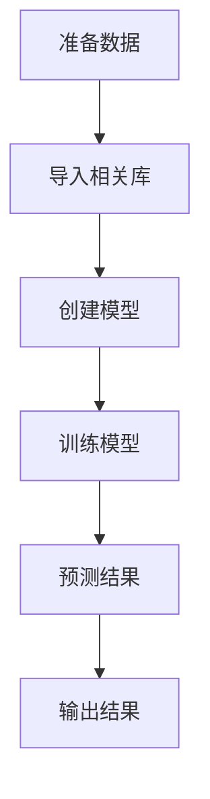
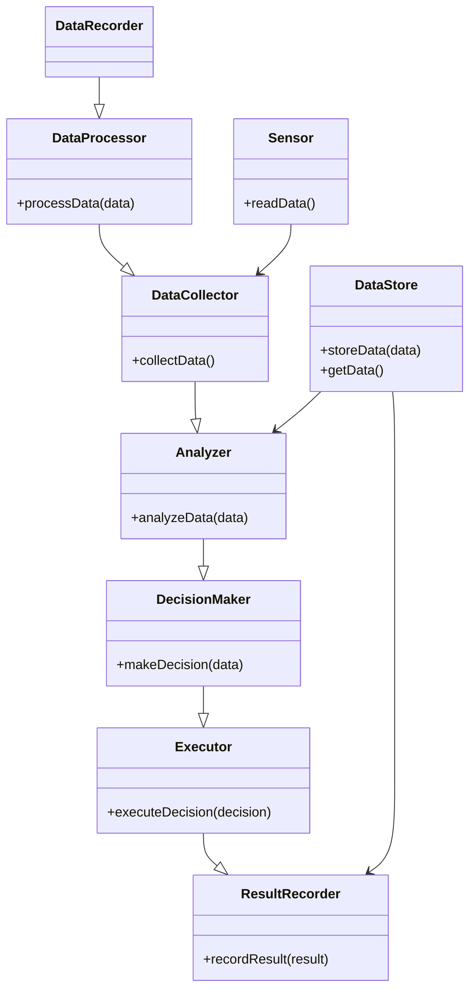
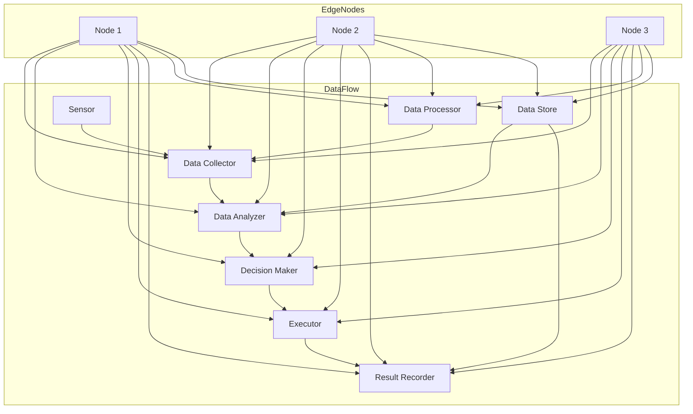

                 

### 1.1.1 企业AI应用的现状

随着大数据、云计算和人工智能等技术的飞速发展，企业AI应用已经逐渐成为企业数字化转型的重要驱动力。当前，企业AI应用主要集中在以下几方面：

**1. 智能客服**：通过AI技术实现自动化客服系统，能够处理大量客户咨询，提高客服效率和客户满意度。

**2. 智能推荐**：基于用户行为和偏好数据，利用机器学习算法为企业提供个性化的产品推荐服务。

**3. 风险管理**：利用AI技术进行市场分析、风险评估和预测，帮助企业降低运营风险。

**4. 智能制造**：通过AI技术优化生产流程，提高生产效率和产品质量。

**5. 人力资源**：利用AI技术进行员工招聘、培训和绩效评估等，提高人力资源管理效率。

尽管企业AI应用已取得显著成效，但依然存在一些问题。首先，数据处理和分析能力仍需提升，数据质量和实时性有待优化。其次，模型训练和部署的效率有待提高，以适应快速变化的市场需求。此外，企业AI应用的安全性和隐私保护也是亟待解决的问题。

### 1.1.2 边缘计算在企业AI中的重要性

边缘计算作为一种分布式计算架构，通过在靠近数据源的地方进行数据处理和分析，能够有效缓解中心化计算架构面临的延迟、带宽和存储等压力。在企业AI应用中，边缘计算的重要性主要体现在以下几个方面：

**1. 实时性**：边缘计算能够实现数据的实时处理和响应，满足企业AI应用对实时性的需求。

**2. 降低带宽消耗**：通过在边缘节点进行数据预处理，可以显著降低传输到中心节点的数据量，从而降低带宽消耗。

**3. 提高数据处理能力**：边缘计算能够分担中心节点的计算压力，提高整体数据处理能力。

**4. 提升安全性**：边缘计算可以减少数据在传输过程中的暴露风险，提升数据安全性。

**5. 降低成本**：边缘计算可以减少对中心化数据中心的依赖，降低企业运营成本。

### 1.1.3 实时处理与响应的需求

实时处理与响应是企业AI应用的核心需求之一。在高度竞争的市场环境中，企业需要快速响应用户需求、市场变化和业务场景，以保持竞争优势。以下为实时处理与响应的需求：

**1. 低延迟**：实时处理要求在极短时间内完成数据处理和分析，确保系统响应的实时性。

**2. 高准确性**：实时处理需要确保算法模型的准确性和稳定性，避免误判和漏判。

**3. 强适应性**：实时处理需要能够应对不同场景和业务需求，具有高度适应性。

**4. 高可靠性**：实时处理系统需要具备高可靠性，确保系统稳定运行，避免因故障导致业务中断。

**5. 易扩展性**：实时处理系统需要具备良好的扩展性，以适应不断增长的数据量和业务需求。

### 1.2 书籍目的与结构

本书旨在探讨企业AI Agent在边缘计算中的实时处理与响应技术，为读者提供一套完整的技术解决方案。全书共分为五大部分：

**第一部分**：引言与背景，介绍企业AI应用现状、边缘计算的重要性以及实时处理与响应的需求。

**第二部分**：企业AI Agent概述，包括AI Agent的概念、作用与价值，以及发展趋势。

**第三部分**：边缘计算在企业AI Agent中的应用，详细探讨边缘计算在企业AI Agent架构中的地位、关键技术及实际案例。

**第四部分**：实时处理算法原理与实践，介绍实时处理算法的基本原理、数学模型、实现方法及实际案例。

**第五部分**：边缘计算在企业AI Agent中的应用实践，介绍边缘计算环境搭建、系统设计与实现，以及项目实战。

通过以上五大部分的详细探讨，本书旨在帮助读者深入了解企业AI Agent在边缘计算中的实时处理与响应技术，为其在实际工作中提供有益的指导和参考。

### 1.3 边缘计算基础

#### 1.3.1 边缘计算的定义与原理

边缘计算（Edge Computing）是指将计算、存储和网络功能分布到网络的边缘，即在靠近数据源的地方进行数据处理和计算，而非将所有数据传输到中心节点进行处理。边缘计算的核心思想是将数据处理分散到网络的各个节点，从而减少数据传输延迟，提高数据处理效率。

边缘计算的基本原理包括以下几个方面：

1. **数据本地化处理**：在数据产生的地方进行初步处理，减少数据传输量，降低带宽消耗。
2. **分布式计算**：通过分布式计算架构，将计算任务分散到各个边缘节点，提高整体计算能力。
3. **资源共享**：边缘节点可以共享资源，如存储、计算和网络资源，从而提高资源利用率。
4. **智能决策**：边缘计算支持本地智能决策，降低对中心节点的依赖，提高系统的响应速度。

#### 1.3.2 边缘计算的优势与挑战

边缘计算在企业AI应用中具有显著的优势：

1. **低延迟**：边缘计算能够实现数据的实时处理和响应，满足企业AI应用对实时性的需求。
2. **高效率**：通过在边缘节点进行数据预处理，可以显著降低传输到中心节点的数据量，从而提高整体数据处理效率。
3. **降低带宽消耗**：边缘计算可以减少对中心化数据中心的依赖，降低企业运营成本。
4. **提升安全性**：边缘计算可以减少数据在传输过程中的暴露风险，提升数据安全性。

然而，边缘计算也面临一些挑战：

1. **计算资源有限**：边缘节点的计算、存储和网络资源相对中心节点较为有限，需要合理分配和管理。
2. **异构性**：边缘节点种类繁多，具有异构性，如何实现高效的资源调度和协同工作是一个重要问题。
3. **数据安全与隐私**：边缘计算涉及大量敏感数据，如何保障数据安全与隐私是一个关键挑战。
4. **网络可靠性**：边缘节点的网络连接稳定性相对中心节点较差，如何确保网络可靠性是一个重要问题。

#### 1.3.3 边缘计算的核心技术

边缘计算的核心技术包括以下几个方面：

1. **边缘设备管理**：包括边缘设备的配置、监控和维护，确保边缘设备稳定运行。
2. **边缘数据处理**：包括数据采集、预处理、存储和传输等，提高数据处理效率。
3. **边缘智能算法**：包括机器学习、深度学习等算法，在边缘节点实现智能决策。
4. **边缘网络架构**：包括边缘节点之间的网络通信和协作，实现高效的数据传输和协同工作。

### 1.4 实时处理与响应

#### 1.4.1 实时处理的定义与重要性

实时处理（Real-time Processing）是指在一定时间内完成数据处理和分析的过程，具有低延迟、高准确性和高可靠性的特点。实时处理在企业AI应用中具有重要意义：

1. **快速响应**：实时处理能够快速响应用户需求和市场变化，提高企业的竞争力。
2. **提高效率**：实时处理可以减少数据传输延迟，提高整体数据处理效率。
3. **优化资源**：实时处理可以优化资源配置，降低带宽和计算资源的消耗。
4. **提升安全性**：实时处理可以减少数据在传输过程中的暴露风险，提升数据安全性。

#### 1.4.2 响应时间的衡量与优化

响应时间（Response Time）是指从接收到请求到完成处理并返回结果的时间。衡量响应时间的指标通常包括：

1. **平均响应时间**：所有请求的平均处理时间。
2. **最大响应时间**：最长请求的处理时间。
3. **响应时间分布**：不同请求的处理时间分布。

优化响应时间的方法包括：

1. **算法优化**：通过优化算法模型，提高数据处理速度。
2. **分布式计算**：通过分布式计算架构，将任务分散到多个节点，提高整体处理能力。
3. **缓存技术**：利用缓存技术减少重复计算，提高数据处理速度。
4. **负载均衡**：通过负载均衡技术，合理分配任务，避免单点过载。

#### 1.4.3 实时处理的关键技术

实时处理的关键技术包括以下几个方面：

1. **事件驱动架构**：通过事件驱动架构，实现数据流的实时处理和分析。
2. **流处理技术**：利用流处理技术，实现实时数据的高效处理和分析。
3. **实时数据存储**：通过实时数据存储技术，实现数据的快速读取和写入。
4. **实时监控与报警**：通过实时监控与报警技术，实现对系统运行状态的实时监控和故障预警。

### 1.5 小结

本文首先介绍了企业AI应用现状以及边缘计算的重要性，分析了实时处理与响应的需求。接着，详细探讨了边缘计算的定义、优势与挑战，以及实时处理的定义、优化方法和关键技术。通过本文的介绍，读者可以对企业AI Agent在边缘计算中的实时处理与响应技术有一个全面的理解，为后续章节的深入探讨打下基础。

## 2.1 AI Agent的概念

### 2.1.1 AI Agent的定义

AI Agent，即人工智能代理，是一种能够自主执行任务、与环境进行交互并不断学习和改进的智能体。AI Agent具备以下几个核心特征：

1. **自主性**：AI Agent能够在没有人类干预的情况下，自主完成特定任务。
2. **适应性**：AI Agent能够根据环境变化和任务需求，不断调整自身行为和策略。
3. **学习性**：AI Agent通过学习和积累经验，能够不断提升任务执行的效果和效率。
4. **交互性**：AI Agent能够与人类和其他系统进行有效的交互，实现信息的传递和协同工作。

AI Agent通常由以下几个部分组成：

1. **感知器**：用于接收外部环境的信息，如传感器、摄像头等。
2. **决策模块**：根据感知器收集到的信息，进行决策和规划。
3. **执行器**：将决策转化为实际行动，如执行机器人运动、控制设备等。
4. **学习模块**：通过不断学习，优化决策和执行过程。

### 2.1.2 AI Agent的特点

AI Agent具有以下几方面的特点：

1. **高度智能化**：AI Agent能够通过机器学习、深度学习等技术，实现高度智能化，具备处理复杂任务的能力。
2. **自主决策**：AI Agent能够根据环境变化，自主进行决策和调整，实现自主执行任务。
3. **适应性**：AI Agent能够根据不同的任务需求和环境变化，快速调整自身策略，实现灵活应对。
4. **协作性**：AI Agent能够与其他AI Agent或人类进行有效协作，实现协同工作。
5. **安全性**：AI Agent具备一定的安全防护能力，能够在一定程度上抵御外部攻击和内部异常。

### 2.1.3 AI Agent的分类

根据任务类型、应用场景和实现方式的不同，AI Agent可以划分为多种类型：

1. **通用型AI Agent**：具有广泛适用性的AI Agent，能够处理多种类型的任务。例如，智能助手、聊天机器人等。
2. **专用型AI Agent**：针对特定任务或场景设计的AI Agent，具有较强的专业性和针对性。例如，智能客服、智能安防等。
3. **混合型AI Agent**：同时具备通用型和专用型AI Agent的特点，能够适应多种任务场景。例如，智能交通管理、智能工厂等。
4. **多智能体系统**：由多个AI Agent组成的系统，能够协同完成复杂任务。例如，智能城市、智能电网等。

### 2.1.4 AI Agent的发展历程

AI Agent的发展历程可以分为以下几个阶段：

1. **初始阶段**：以规则为基础的专家系统，通过预设规则进行任务处理。
2. **发展阶段**：引入机器学习和深度学习技术，实现AI Agent的自主学习和优化。
3. **成熟阶段**：多智能体系统和边缘计算等技术的应用，使AI Agent具备更高的智能化、适应性和协作性。
4. **未来趋势**：随着人工智能技术的不断进步，AI Agent将实现更广泛的场景应用，具备更强的自主决策能力，成为企业数字化转型的重要支撑力量。

### 2.1.5 AI Agent的应用场景

AI Agent在各个领域都展现出巨大的应用潜力，以下为几个典型的应用场景：

1. **智能客服**：通过AI Agent实现智能客服，提高客服效率和用户体验。
2. **智能制造**：通过AI Agent实现智能生产、质量检测和设备维护等，提高生产效率和质量。
3. **智能交通**：通过AI Agent实现智能交通管理、车辆调度和道路监控等，提高交通运行效率。
4. **智能医疗**：通过AI Agent实现智能诊断、治疗方案推荐和患者管理等，提高医疗服务质量。
5. **智慧城市**：通过AI Agent实现城市资源优化、环境保护和公共安全等，提升城市治理水平。

### 2.1.6 AI Agent的优缺点

#### 优点

1. **高效性**：AI Agent能够快速处理大量数据，提高工作效率。
2. **智能化**：AI Agent具备自主学习和优化能力，能够不断改进任务执行效果。
3. **灵活性**：AI Agent能够根据不同任务需求和环境变化，快速调整自身策略。
4. **协作性**：AI Agent能够与其他AI Agent或人类进行有效协作，实现协同工作。

#### 缺点

1. **数据依赖性**：AI Agent的性能依赖于数据质量和数量，数据不足或质量差会影响其效果。
2. **安全风险**：AI Agent可能存在被攻击或误操作的风险，需要加强安全防护。
3. **复杂度高**：AI Agent的设计和实现过程复杂，需要高水平的技术团队支持。
4. **适应性挑战**：在特定场景下，AI Agent可能难以适应复杂多变的任务需求。

### 2.1.7 AI Agent的未来发展趋势

随着人工智能技术的不断进步，AI Agent将呈现出以下发展趋势：

1. **智能化**：AI Agent将具备更强的自主学习和决策能力，实现更高水平的智能化。
2. **泛在化**：AI Agent将广泛应用于各个领域，实现全面泛在化。
3. **协同化**：AI Agent将实现跨领域的协同工作，形成更加复杂和高效的多智能体系统。
4. **安全化**：AI Agent的安全性和隐私保护将得到重点关注，实现更安全可靠的应用。
5. **人机融合**：AI Agent将与人类更加紧密地融合，实现人机协同，共同推动社会进步。

### 2.1.8 小结

本文首先介绍了AI Agent的定义、特点和分类，回顾了其发展历程，并探讨了其在各个领域的应用场景。接着，分析了AI Agent的优缺点，以及其未来发展趋势。通过本文的介绍，读者可以全面了解AI Agent的概念、原理和应用，为进一步探讨企业AI Agent在边缘计算中的应用奠定基础。

### 2.2 企业AI Agent的作用与价值

企业AI Agent在企业数字化转型和智能化升级过程中发挥着至关重要的作用，其具体作用与价值可以从以下几个方面进行阐述：

#### 2.2.1 企业AI Agent的作用

1. **提高生产效率**：企业AI Agent能够通过对生产数据的实时分析和优化，提升生产流程的自动化水平，减少人工干预，从而提高生产效率和产品质量。

2. **优化供应链管理**：企业AI Agent可以实时监测供应链各个环节的运行状况，预测需求变化，优化库存管理和物流配送，提高供应链的灵活性和响应速度。

3. **客户关系管理**：企业AI Agent能够通过分析客户行为数据，提供个性化的产品推荐和营销策略，提升客户满意度，增强客户粘性。

4. **智能决策支持**：企业AI Agent可以利用机器学习算法和大数据分析，为企业提供智能化的决策支持，帮助企业在复杂的市场环境中做出更明智的决策。

5. **自动化运营管理**：企业AI Agent可以实现企业运营管理的自动化，从员工招聘、培训到绩效评估，全方位提升企业管理效率。

#### 2.2.2 企业AI Agent的价值

1. **降低运营成本**：通过自动化和智能化管理，企业AI Agent能够有效降低人力资源成本、库存成本和运营成本，提高企业的盈利能力。

2. **提升竞争力**：企业AI Agent可以帮助企业快速响应市场变化，优化业务流程，提高生产效率和产品质量，增强企业的市场竞争力。

3. **提高客户满意度**：通过个性化的客户服务和企业AI Agent提供的精准营销策略，企业可以更好地满足客户需求，提高客户满意度和忠诚度。

4. **增强数据洞察力**：企业AI Agent能够通过对企业海量数据的实时分析和挖掘，为企业提供深入的业务洞察，帮助发现潜在的业务机会和风险。

5. **保障企业安全**：企业AI Agent可以监控企业的网络安全和设备状态，及时发现和应对安全威胁，保障企业的信息安全和业务连续性。

#### 2.2.3 企业AI Agent的应用场景

1. **智能制造**：企业AI Agent可以通过实时监测和分析生产数据，优化生产流程，预测设备故障，提高生产效率和产品质量。

2. **智慧物流**：企业AI Agent可以实时跟踪物流运输过程，优化物流配送路线，提高物流效率。

3. **智能医疗**：企业AI Agent可以辅助医生进行诊断和治疗，提供个性化医疗方案，提高医疗服务质量。

4. **智慧金融**：企业AI Agent可以用于风险管理、信用评估和欺诈检测，提高金融服务的安全性和效率。

5. **智慧城市**：企业AI Agent可以应用于城市交通管理、环境监测和公共安全等领域，提升城市治理水平。

### 2.2.4 企业AI Agent的挑战与解决方案

1. **数据质量与安全性**：数据是企业AI Agent的基础，数据质量差或数据泄露都会影响AI Agent的性能和安全性。解决方案包括数据清洗、数据加密和隐私保护技术。

2. **算法可靠性与公平性**：AI算法可能存在偏见和不公平性，需要通过算法优化和公平性评估来提高算法的可靠性和公平性。

3. **系统集成与协调**：企业AI Agent需要与企业现有系统进行集成，实现数据共享和协同工作。解决方案包括采用微服务架构和API接口等技术。

4. **技术人才短缺**：企业AI Agent的开发和运维需要高水平的技术人才，解决方案包括加强人才培养和引进。

### 2.2.5 小结

企业AI Agent在企业数字化转型和智能化升级过程中具有重要作用和价值，能够提高生产效率、优化供应链管理、提升客户满意度，增强企业的市场竞争力。然而，企业AI Agent也面临数据质量与安全性、算法可靠性与公平性、系统集成与协调、技术人才短缺等挑战。通过采取相应的解决方案，企业可以充分发挥AI Agent的优势，实现数字化和智能化转型。接下来，本文将探讨企业AI Agent的发展趋势和未来方向。

### 2.3 企业AI Agent的发展趋势

随着人工智能技术的不断进步，企业AI Agent正朝着更加智能化、泛在化、协同化和安全化的方向发展。以下是企业AI Agent的几个关键发展趋势：

#### 2.3.1 当前AI Agent的发展阶段

1. **初步探索阶段**：这一阶段以规则的自动化和简单的机器学习算法为主，AI Agent的应用场景较为有限，主要集中在一些简单的任务中，如智能客服和智能推荐等。

2. **发展阶段**：随着深度学习、强化学习等先进算法的应用，AI Agent的智能化水平显著提升，可以处理更加复杂和多样化的任务，如自动驾驶、智能安防等。

3. **成熟阶段**：目前，企业AI Agent正逐步进入成熟阶段，其在各领域的应用越来越广泛，从工业制造到金融服务，从智慧城市到医疗健康，AI Agent正成为企业数字化转型的关键驱动力。

#### 2.3.2 未来AI Agent的发展方向

1. **增强自主学习能力**：未来AI Agent将具备更强的自主学习能力，能够从海量数据中自主学习和优化，实现自我进化，不断提高任务执行效果。

2. **跨领域协同**：随着多智能体系统（MAS）的发展，AI Agent将实现跨领域的协同工作，形成更加复杂和高效的多智能体系统，实现大规模的智能协作。

3. **边缘计算应用**：边缘计算的发展将使AI Agent在靠近数据源的地方进行实时处理和响应，提高数据处理效率和响应速度，满足企业对实时性和高效率的需求。

4. **人机融合**：随着AI技术的进步，AI Agent将与人类更加紧密地融合，实现人机协同，共同推动社会进步。

5. **智能化安全防护**：未来AI Agent将具备更加智能的安全防护能力，能够自主识别和应对各种安全威胁，保障企业的信息安全。

#### 2.3.3 AI Agent在边缘计算中的潜在应用

1. **智能制造**：AI Agent可以实时监控生产设备状态，预测设备故障，优化生产流程，提高生产效率。

2. **智慧医疗**：AI Agent可以实时分析医疗数据，辅助医生进行诊断和治疗，提高医疗服务质量。

3. **智慧交通**：AI Agent可以实时监测交通流量，优化交通信号控制，提高道路通行效率。

4. **智慧能源**：AI Agent可以实时监测能源设备状态，预测能源需求，优化能源分配，提高能源利用效率。

5. **智慧城市**：AI Agent可以实时监测城市环境，优化公共服务，提高城市治理水平。

#### 2.3.4 技术挑战与解决方案

1. **数据处理与存储**：边缘计算环境下的数据处理与存储是一个挑战。解决方案包括采用高效的数据压缩和去重技术，以及分布式存储系统。

2. **计算资源分配**：在有限的计算资源下，如何优化计算资源分配是一个重要问题。解决方案包括基于任务优先级和资源利用率的动态调度算法。

3. **网络通信**：边缘节点之间的网络通信稳定性是一个挑战。解决方案包括采用可靠的数据传输协议和冗余连接。

4. **安全与隐私**：边缘计算环境下的数据安全与隐私保护是一个重要问题。解决方案包括采用加密技术和隐私保护算法，确保数据在传输和存储过程中的安全。

#### 2.3.5 小结

企业AI Agent的发展趋势显示出了其广阔的应用前景和巨大的市场潜力。通过边缘计算的应用，AI Agent将能够实现实时处理和高效响应，满足企业对实时性和高效率的需求。同时，企业也需要面对数据处理与存储、计算资源分配、网络通信和安全与隐私等方面的技术挑战。通过不断创新和优化，企业AI Agent将在未来发挥更加重要的作用，推动企业数字化转型和智能化升级。接下来，本文将探讨边缘计算在企业AI Agent架构中的地位和作用。

## 3.1 边缘计算在企业AI Agent架构中的地位

边缘计算在企业AI Agent架构中扮演着至关重要的角色，其地位主要体现在以下几个方面：

### 3.1.1 边缘计算架构的设计原则

边缘计算架构的设计需要遵循以下原则：

1. **分布式**：边缘计算架构将计算、存储和网络功能分布到网络的边缘节点，避免数据传输的瓶颈，提高数据处理效率。
2. **实时性**：边缘计算架构能够实现数据的实时处理和响应，满足企业对实时性的需求。
3. **高效性**：边缘计算架构通过分布式计算和高效的数据处理技术，提高整体数据处理效率。
4. **可靠性**：边缘计算架构需要具备高可靠性，确保数据在传输和存储过程中的安全性和完整性。
5. **灵活性**：边缘计算架构需要具备良好的灵活性，能够适应不同业务场景和需求变化。

### 3.1.2 边缘计算在企业AI Agent中的作用

边缘计算在企业AI Agent架构中发挥着重要作用，具体体现在以下几个方面：

1. **实时数据处理**：边缘计算能够实现数据的实时处理和响应，满足企业对实时性的需求。通过边缘节点对数据的实时处理，可以快速响应用户请求，提高用户体验。
2. **减轻中心节点负担**：边缘计算能够分担中心节点的计算压力，减轻中心节点的负担。通过在边缘节点处理部分数据，可以减少传输到中心节点的数据量，降低中心节点的计算负担。
3. **数据隐私保护**：边缘计算可以降低数据在传输过程中的暴露风险，提高数据安全性。在边缘节点处理数据，可以减少数据在传输过程中的泄露风险。
4. **提高系统效率**：边缘计算能够通过分布式计算和高效的数据处理技术，提高整体系统效率。边缘节点可以针对局部数据做出快速决策，优化资源利用。
5. **灵活扩展**：边缘计算架构具有较好的灵活扩展性，可以根据业务需求动态调整计算资源，实现系统的高效扩展。

### 3.1.3 边缘计算架构的挑战与优化策略

尽管边缘计算在企业AI Agent架构中具有显著的优势，但也面临一些挑战：

1. **计算资源有限**：边缘节点的计算资源相对中心节点较为有限，需要合理分配和管理，避免资源浪费。
2. **异构性**：边缘节点种类繁多，具有异构性，需要实现高效的资源调度和协同工作。
3. **数据安全与隐私**：边缘计算涉及大量敏感数据，如何保障数据安全与隐私是一个关键挑战。
4. **网络可靠性**：边缘节点的网络连接稳定性相对中心节点较差，需要确保网络可靠性。

针对上述挑战，可以采取以下优化策略：

1. **资源调度优化**：通过动态资源调度算法，合理分配和管理边缘节点的计算资源，避免资源浪费。
2. **异构计算优化**：采用异构计算架构，充分利用不同边缘节点的计算能力，实现高效的资源利用。
3. **数据加密与隐私保护**：采用数据加密和隐私保护技术，确保数据在传输和存储过程中的安全性和完整性。
4. **网络冗余与备份**：通过网络冗余和备份技术，提高边缘节点的网络连接稳定性，确保数据传输的可靠性。

### 3.1.4 小结

边缘计算在企业AI Agent架构中具有至关重要的地位，其设计原则和优化策略对于实现高效的实时数据处理和响应具有重要意义。通过合理利用边缘计算的优势，企业AI Agent可以实现实时性、高效性和安全性，为企业数字化转型和智能化升级提供有力支持。接下来，本文将探讨边缘计算在企业AI Agent架构中的关键技术。

### 3.2 边缘计算在企业AI Agent中的关键技术

边缘计算在企业AI Agent架构中的应用涉及多个关键技术的整合和优化，以下将详细介绍这些关键技术：

#### 3.2.1 边缘数据处理

边缘数据处理是指在边缘节点对采集到的数据进行初步处理和清洗，以减少数据传输量，提高数据处理效率。边缘数据处理的关键技术包括：

1. **数据压缩与去重**：通过对数据进行压缩和去重处理，减少传输到中心节点的数据量，降低带宽消耗。
2. **数据聚合与摘要**：对局部数据进行聚合和摘要，提取关键信息，提高数据处理效率。
3. **数据清洗与预处理**：对采集到的数据进行清洗和预处理，去除噪声和异常值，提高数据质量。

边缘数据处理的优势在于能够减轻中心节点的负担，提高系统的实时性。例如，在智能制造领域，边缘节点可以对生产设备产生的数据进行实时处理，提取关键指标，实现实时监控和故障预测。

#### 3.2.2 边缘智能算法

边缘智能算法是指在边缘节点上实现的机器学习、深度学习和强化学习等算法，以实现边缘节点的智能决策和优化。边缘智能算法的关键技术包括：

1. **轻量级算法模型**：针对边缘节点的计算资源有限，开发轻量级算法模型，提高边缘节点的处理能力。
2. **在线学习与增量学习**：通过在线学习和增量学习技术，实现边缘节点的自适应学习和优化，提高系统的灵活性。
3. **模型压缩与量化**：通过模型压缩和量化技术，降低模型的大小和计算复杂度，提高边缘节点的处理效率。

边缘智能算法的优势在于能够实现边缘节点的自主学习和优化，提高系统的智能化水平。例如，在智能交通领域，边缘节点可以通过在线学习算法，实时优化交通信号控制和路线规划，提高交通运行效率。

#### 3.2.3 边缘设备管理

边缘设备管理是指在边缘计算环境中对设备进行配置、监控和维护，确保边缘设备的稳定运行。边缘设备管理的关键技术包括：

1. **设备监控与诊断**：通过实时监控和诊断技术，对边缘设备的状态进行监控和异常检测，及时发现和处理设备故障。
2. **设备配置与管理**：通过自动化配置和管理技术，简化边缘设备的配置和部署过程，提高运维效率。
3. **设备升级与维护**：通过设备升级和维护技术，确保边缘设备的软件和硬件始终处于最佳状态，提高系统的可靠性。

边缘设备管理的优势在于能够提高边缘设备的运维效率，确保系统的稳定运行。例如，在智慧城市领域，边缘设备管理可以实时监控和诊断城市传感器和设备的状态，确保城市环境的实时监测和智能控制。

#### 3.2.4 边缘网络通信

边缘网络通信是指在边缘计算环境中实现边缘节点之间的数据传输和协同工作。边缘网络通信的关键技术包括：

1. **网络拓扑优化**：通过优化网络拓扑结构，提高数据传输的可靠性和效率。
2. **数据传输协议**：采用高效的数据传输协议，如QUIC协议，提高数据传输速度和稳定性。
3. **边缘网络冗余**：通过边缘网络冗余技术，提高边缘节点的网络连接可靠性。

边缘网络通信的优势在于能够实现边缘节点之间的高效协同工作，提高系统的整体性能。例如，在智慧医疗领域，边缘节点可以通过边缘网络通信实现医疗设备的远程控制和数据共享，提高医疗服务的效率和质量。

### 3.2.5 实时数据处理与响应机制

实时数据处理与响应机制是指在边缘计算环境中实现数据的实时处理和快速响应，满足企业对实时性的需求。实时数据处理与响应机制的关键技术包括：

1. **事件驱动架构**：通过事件驱动架构，实现数据的实时处理和响应。
2. **流处理技术**：利用流处理技术，实现实时数据的高效处理和分析。
3. **边缘智能决策**：通过边缘智能算法，实现数据的实时分析和决策。
4. **边缘存储与缓存**：通过边缘存储和缓存技术，提高数据的实时访问速度。

实时数据处理与响应机制的优势在于能够实现数据的实时处理和快速响应，提高系统的实时性和用户体验。例如，在智能交通领域，实时数据处理与响应机制可以实时监测交通流量，优化交通信号控制和路线规划，提高交通运行效率。

#### 3.2.6 小结

边缘计算在企业AI Agent架构中涉及多个关键技术的整合和优化，包括边缘数据处理、边缘智能算法、边缘设备管理、边缘网络通信和实时数据处理与响应机制。这些关键技术的有效应用，能够实现企业AI Agent的实时性、高效性和智能化，为企业数字化转型和智能化升级提供有力支持。接下来，本文将探讨如何实现实时数据处理与响应，并通过实际案例进行说明。

### 3.3 实时处理与响应的实现

实时处理与响应是实现企业AI Agent在边缘计算中高效运行的关键。以下将详细介绍实现实时数据处理与响应的步骤、机制和策略，并通过具体案例进行说明。

#### 3.3.1 实时数据处理流程

实现实时数据处理与响应的第一步是构建一个高效的数据处理流程。以下是实时数据处理的基本步骤：

1. **数据采集**：在边缘节点上部署传感器和采集设备，实时采集业务数据。这些数据可以是温度、湿度、流量、图像等。
   
2. **数据预处理**：对采集到的原始数据进行预处理，包括去噪、归一化、滤波等，以提高数据质量和后续处理的准确性。

3. **数据聚合与摘要**：对局部数据进行聚合和摘要，提取关键指标。例如，将多个传感器的数据合并成一个统一的指标，减少数据传输量。

4. **实时存储**：将预处理后的数据实时存储在边缘节点的本地存储中，便于快速访问和分析。

5. **实时分析**：利用边缘智能算法对存储的数据进行实时分析，如使用机器学习算法进行预测、分类、聚类等。

6. **决策与执行**：根据分析结果，执行相应的决策和操作。例如，调整生产设备参数、优化交通信号控制等。

7. **结果反馈**：将执行结果反馈给相关系统和用户，实现闭环控制，持续优化实时处理过程。

#### 3.3.2 实时响应机制

实时响应机制是实现实时处理与响应的核心。以下是几种常见的实时响应机制：

1. **事件驱动架构**：基于事件驱动架构，系统在接收到数据或事件时，立即触发相应的处理流程，实现快速响应。

2. **流处理技术**：利用流处理框架（如Apache Kafka、Apache Flink），实现数据流的实时处理和分析，确保数据处理的高效性和实时性。

3. **边缘智能决策**：在边缘节点上实现智能决策模块，利用机器学习、深度学习等算法，对实时数据进行快速分析和决策。

4. **微服务架构**：采用微服务架构，将实时数据处理和响应功能模块化，提高系统的灵活性和可扩展性。

#### 3.3.3 实时处理的优化策略

为了实现高效和稳定的实时处理与响应，可以采取以下优化策略：

1. **任务调度优化**：采用动态任务调度算法，根据资源利用率和任务优先级，合理分配和处理任务。

2. **负载均衡**：通过负载均衡技术，将处理任务分配到多个边缘节点，避免单点过载，提高系统整体的负载均衡能力。

3. **数据压缩与去重**：对传输和存储的数据进行压缩和去重处理，减少数据传输量和存储需求。

4. **缓存技术**：利用缓存技术，提高数据的访问速度，减少对数据库的访问压力。

5. **异常检测与处理**：通过异常检测技术，及时发现和处理系统故障，确保系统的稳定运行。

#### 3.3.4 实际案例

以下是一个边缘计算在智能制造领域的实际案例，通过该案例说明实时处理与响应的实现。

**案例背景**：某智能工厂在生产过程中需要实时监测设备状态，预测设备故障，优化生产流程。

**实现步骤**：

1. **数据采集**：在生产线上的关键设备上安装传感器，实时采集温度、压力、振动等数据。

2. **数据预处理**：在边缘节点上对采集到的数据进行预处理，包括去噪、滤波、归一化等。

3. **实时存储**：将预处理后的数据实时存储在边缘节点的本地存储中。

4. **实时分析**：利用边缘智能算法（如机器学习模型）对设备数据进行实时分析，预测设备故障。

5. **决策与执行**：根据故障预测结果，提前进行设备维护和优化生产流程。

6. **结果反馈**：将维护结果和生产优化策略反馈给生产管理平台，实现闭环控制。

**实现效果**：

1. **提高设备可靠性**：通过实时监测和预测设备故障，提前进行维护，提高设备运行可靠性。

2. **优化生产流程**：通过实时分析和优化生产流程，提高生产效率和产品质量。

3. **降低运营成本**：通过预防性维护和优化生产流程，降低设备故障率和运营成本。

#### 3.3.5 小结

实时处理与响应是企业AI Agent在边缘计算中实现高效运行的关键。通过构建高效的数据处理流程、实现实时响应机制和采取优化策略，企业AI Agent可以实时处理和响应业务需求，提高系统的实时性、效率和可靠性。实际案例展示了边缘计算在智能制造领域的应用效果，为其他领域的边缘计算应用提供了有益的参考。

### 3.4 企业AI Agent在边缘计算中的案例研究

为了更直观地展示企业AI Agent在边缘计算中的实际应用，本文将分析三个具有代表性的案例：智能制造、智慧交通和智慧医疗。

#### 3.4.1 案例一：智能制造

**背景**：在智能制造领域，企业AI Agent通过边缘计算实现生产设备的实时监控、故障预测和优化生产流程。

**实现步骤**：

1. **数据采集**：在生产线上的关键设备上安装传感器，实时采集温度、压力、振动等数据。

2. **边缘预处理**：在边缘节点上对采集到的数据进行预处理，包括去噪、滤波、归一化等。

3. **实时分析**：利用边缘智能算法（如机器学习模型）对设备数据进行实时分析，预测设备故障和优化生产流程。

4. **决策与执行**：根据故障预测结果和优化策略，提前进行设备维护和生产流程调整。

5. **结果反馈**：将维护结果和生产优化策略反馈给生产管理平台，实现闭环控制。

**效果**：

- **提高设备可靠性**：通过实时监测和预测设备故障，提前进行维护，提高设备运行可靠性。
- **优化生产流程**：通过实时分析和优化生产流程，提高生产效率和产品质量。
- **降低运营成本**：通过预防性维护和优化生产流程，降低设备故障率和运营成本。

#### 3.4.2 案例二：智慧交通

**背景**：在智慧交通领域，企业AI Agent通过边缘计算实现交通流量监测、信号控制和路线规划，提高交通运行效率。

**实现步骤**：

1. **数据采集**：在交通要道和重要节点部署传感器，实时采集交通流量、车速、天气等信息。

2. **边缘预处理**：在边缘节点上对采集到的数据进行预处理，包括去噪、滤波、数据聚合等。

3. **实时分析**：利用边缘智能算法（如深度学习模型）对交通数据进行实时分析，预测交通流量变化和交通事故。

4. **决策与执行**：根据实时分析和预测结果，调整交通信号控制和路线规划。

5. **结果反馈**：将调整结果反馈给交通管理平台，实现交通流量优化和交通信号控制。

**效果**：

- **提高交通运行效率**：通过实时监测和预测交通状况，优化交通信号控制和路线规划，提高交通运行效率。
- **减少交通事故**：通过实时预警和应急响应，减少交通事故的发生。
- **提升用户体验**：通过智能导航和实时交通信息，提升驾驶者的出行体验。

#### 3.4.3 案例三：智慧医疗

**背景**：在智慧医疗领域，企业AI Agent通过边缘计算实现医疗设备的实时监控、患者数据分析和智能诊断，提高医疗服务质量。

**实现步骤**：

1. **数据采集**：在医疗设备上部署传感器，实时采集患者生命体征数据，如心率、血压、血糖等。

2. **边缘预处理**：在边缘节点上对采集到的数据进行预处理，包括去噪、滤波、数据聚合等。

3. **实时分析**：利用边缘智能算法（如深度学习模型）对医疗数据进行实时分析，预测患者病情变化和诊断结果。

4. **决策与执行**：根据实时分析和预测结果，调整治疗方案和设备参数。

5. **结果反馈**：将分析结果和治疗建议反馈给医生和患者，实现智能诊疗。

**效果**：

- **提高医疗服务质量**：通过实时监测和分析患者数据，提高医疗诊断和治疗的准确性。
- **优化医疗资源配置**：通过实时分析和预测患者需求，优化医疗资源的配置和使用。
- **提升患者体验**：通过智能监测和实时反馈，提升患者的医疗体验。

#### 3.4.4 案例总结

这三个案例展示了企业AI Agent在边缘计算中的广泛应用，通过实时处理与响应，实现了生产效率、交通运行效率和医疗服务质量的显著提升。以下是案例总结：

1. **实时性**：边缘计算使企业AI Agent能够实现数据的实时处理和响应，提高系统的实时性和用户体验。

2. **高效性**：通过边缘节点的分布式计算和高效的数据处理技术，企业AI Agent能够实现高效的实时处理与响应。

3. **灵活性**：边缘计算架构具有良好的灵活性，能够适应不同业务场景和需求变化，实现系统的快速部署和扩展。

4. **安全性**：边缘计算通过数据本地化和安全加密技术，保障了数据的安全性和隐私保护。

5. **协同性**：边缘计算支持企业AI Agent与其他系统和设备的协同工作，实现跨领域的智能协同。

### 3.4.5 小结

企业AI Agent在边缘计算中的应用具有广泛的前景和重要的现实意义。通过具体的案例研究，我们可以看到边缘计算在企业AI Agent中的关键作用，不仅提升了系统的实时性、高效性和灵活性，还显著改善了各领域的业务运行效率和用户体验。未来，随着边缘计算技术的不断进步和应用场景的拓展，企业AI Agent在边缘计算中的潜力将进一步释放，为企业的数字化转型和智能化升级提供更强大的支持。

## 4.1 实时处理算法的基本原理

### 4.1.1 实时处理算法的类型

实时处理算法可以分为以下几类：

1. **批处理算法**：批处理算法将数据分成批次进行处理，适用于对实时性要求不高的场景。例如，定期进行数据分析和报告生成。
2. **流处理算法**：流处理算法对数据流进行实时处理，适用于对实时性要求较高的场景。例如，实时监控和异常检测。
3. **在线学习算法**：在线学习算法在数据不断输入的过程中进行学习，适用于需要不断调整和优化的场景。例如，自适应控制和学习型决策系统。

### 4.1.2 实时处理算法的评价指标

实时处理算法的性能评价通常涉及以下几项关键指标：

1. **响应时间**：从数据接收开始到完成处理并返回结果的时间。低响应时间是实时处理算法的重要指标。
2. **吞吐量**：单位时间内处理的数据量。高吞吐量表示算法能高效处理大量数据。
3. **准确性**：算法输出的准确性和可靠性。准确性直接影响实时处理的决策质量和效果。
4. **资源消耗**：算法在处理过程中所需的计算资源、内存和带宽等。低资源消耗有助于确保系统的稳定运行。
5. **稳定性**：算法在长时间运行过程中保持一致性和可靠性的能力。稳定的算法能够避免错误和异常。

### 4.1.3 实时处理算法的设计原则

设计实时处理算法时，应遵循以下原则：

1. **最小化延迟**：通过优化算法结构和调度策略，尽量减少数据处理和传输的延迟。
2. **高效性**：利用并行计算和分布式架构，提高数据处理效率。
3. **可扩展性**：设计灵活的架构，能够根据需求变化进行扩展。
4. **容错性**：确保算法能够应对系统故障和数据异常，保持稳定运行。
5. **易维护性**：设计模块化、可重用性强的算法，便于后续维护和优化。

通过遵循上述设计原则，可以构建高效、稳定且可靠的实时处理算法，满足企业AI Agent对实时性和高效性的需求。

### 4.2 实时处理算法的数学模型与公式

#### 4.2.1 数学模型的基础知识

在实时处理算法中，常用的数学模型包括线性模型、概率模型和优化模型。以下简要介绍这些模型的基础知识：

1. **线性模型**：线性模型是一种简单的数学模型，主要用于拟合数据关系。常见的线性模型有线性回归、线性判别分析和线性规划。

   - **线性回归**：用于预测一个变量基于另一个变量的线性关系。公式如下：
     $$ y = \beta_0 + \beta_1 \cdot x + \epsilon $$
     其中，$ y $ 是因变量，$ x $ 是自变量，$ \beta_0 $ 和 $ \beta_1 $ 是模型参数，$ \epsilon $ 是误差项。

   - **线性判别分析**：用于分类问题，通过找到最佳分类边界，将不同类别的数据分开。公式如下：
     $$ \delta(x) = \begin{cases} 
     -1 & \text{if } y_1 \cdot x < y_2 \cdot x \\
     +1 & \text{otherwise}
     \end{cases} $$
     其中，$ y_1 $ 和 $ y_2 $ 是两个类别的特征向量。

   - **线性规划**：用于在约束条件下优化目标函数。公式如下：
     $$ \min_{x} c^T \cdot x $$
     $$ \text{subject to } Ax \leq b $$
     其中，$ c $ 是目标函数的系数向量，$ A $ 和 $ b $ 是约束条件的矩阵和向量。

2. **概率模型**：概率模型用于描述随机事件的发生概率。常见的概率模型有贝叶斯网络、马尔可夫模型和隐马尔可夫模型。

   - **贝叶斯网络**：用于表示变量之间的条件依赖关系。公式如下：
     $$ P(A, B) = P(A) \cdot P(B|A) $$
     其中，$ P(A) $ 是变量 $ A $ 的概率，$ P(B|A) $ 是变量 $ B $ 在变量 $ A $ 发生时的条件概率。

   - **马尔可夫模型**：用于描述变量随时间变化的概率分布。公式如下：
     $$ P(A_t|A_{t-1}, A_{t-2}, \ldots) = P(A_t|A_{t-1}) $$
     其中，$ A_t $ 是时间 $ t $ 的变量状态。

   - **隐马尔可夫模型**：用于描述不可观测变量和可观测变量之间的关系。公式如下：
     $$ P(X_t|H_t) = P(X_t|H_t, H_{t-1}, \ldots) $$
     $$ P(H_t|H_{t-1}) = P(H_t|H_{t-1}, H_{t-2}, \ldots) $$

3. **优化模型**：优化模型用于求解最优化问题，常见的优化模型有线性规划、非线性规划和动态规划。

   - **非线性规划**：用于在非线性约束条件下优化目标函数。公式如下：
     $$ \min_{x} f(x) $$
     $$ \text{subject to } g(x) \leq 0 $$
     其中，$ f(x) $ 是目标函数，$ g(x) $ 是约束函数。

   - **动态规划**：用于求解多阶段决策优化问题。公式如下：
     $$ V_t(x) = \min_{u_t} \{ R_t(u_t, x) + V_{t+1}(x') \} $$
     其中，$ V_t(x) $ 是第 $ t $ 阶段的最优值函数，$ R_t(u_t, x) $ 是第 $ t $ 阶段的收益函数，$ x' $ 是第 $ t+1 $ 阶段的状态。

#### 4.2.2 公式推导与解释

以下是实时处理算法中一些重要公式的推导与解释：

1. **线性回归公式的推导**：

   设有 $ n $ 个样本点 $(x_1, y_1), (x_2, y_2), \ldots, (x_n, y_n)$，我们希望找到一个线性函数 $ y = \beta_0 + \beta_1 \cdot x $ 来拟合这些数据。

   首先，计算样本的均值：
   $$ \bar{x} = \frac{1}{n} \sum_{i=1}^{n} x_i $$
   $$ \bar{y} = \frac{1}{n} \sum_{i=1}^{n} y_i $$

   然后，计算线性回归模型的系数：
   $$ \beta_0 = \bar{y} - \beta_1 \cdot \bar{x} $$
   $$ \beta_1 = \frac{\sum_{i=1}^{n} (x_i - \bar{x})(y_i - \bar{y})}{\sum_{i=1}^{n} (x_i - \bar{x})^2} $$

2. **贝叶斯网络公式的推导**：

   假设有两个随机变量 $ A $ 和 $ B $，已知 $ P(A) = p $，$ P(B|A) = q $，我们希望计算 $ P(B) $。

   根据全概率公式，有：
   $$ P(B) = P(A) \cdot P(B|A) + P(\neg A) \cdot P(B|\neg A) $$

   由于 $ P(\neg A) = 1 - P(A) $，我们可以将公式改写为：
   $$ P(B) = p \cdot q + (1 - p) \cdot P(B|\neg A) $$

3. **动态规划公式的推导**：

   考虑一个多阶段决策优化问题，假设在第 $ t $ 阶段，状态为 $ x_t $，决策为 $ u_t $，收益为 $ R_t(u_t, x_t) $，下一阶段的状态为 $ x_{t+1} $，目标是最小化总收益。

   动态规划的核心思想是递归关系，即当前阶段的最优值函数 $ V_t(x_t) $ 可以表示为：
   $$ V_t(x_t) = \min_{u_t} \{ R_t(u_t, x_t) + V_{t+1}(x_{t+1}) \} $$

   其中，$ x_{t+1} $ 是状态转移函数 $ f(x_t, u_t) $ 的结果。

#### 4.2.3 数学模型的应用

数学模型在实时处理算法中的应用非常广泛，以下简要介绍几种常见应用：

1. **线性回归模型**：用于实时监控和预测，例如股票价格预测、能源需求预测等。

2. **贝叶斯网络模型**：用于实时异常检测和风险评估，例如金融欺诈检测、医疗诊断等。

3. **动态规划模型**：用于实时路径规划和资源调度，例如自动驾驶车辆导航、智能电网调度等。

通过数学模型的应用，实时处理算法能够实现数据的高效处理和优化，满足企业AI Agent对实时性和高效性的需求。接下来，本文将介绍实时处理算法的实现方法。

### 4.3 实时处理算法的实现

实时处理算法的实现需要考虑算法设计、编程语言选择、开发环境搭建和测试等多个方面。以下将详细介绍实时处理算法的实现过程。

#### 4.3.1 Python实现示例

Python因其简洁易懂和丰富的库支持，成为实现实时处理算法的常用编程语言。以下是一个简单的实时处理算法实现示例，使用Python实现一个线性回归模型。

1. **安装Python环境**：确保Python环境已安装，可以通过以下命令安装：

   ```bash
   pip install numpy scikit-learn
   ```

2. **导入相关库**：

   ```python
   import numpy as np
   from sklearn.linear_model import LinearRegression
   ```

3. **准备数据**：

   ```python
   # 样本数据
   X = np.array([[1], [2], [3], [4], [5]])
   y = np.array([1, 2, 2.5, 4, 5])
   ```

4. **训练模型**：

   ```python
   # 创建线性回归模型并训练
   model = LinearRegression()
   model.fit(X, y)
   ```

5. **预测结果**：

   ```python
   # 使用训练好的模型进行预测
   prediction = model.predict(np.array([[6]]))
   print(f"预测结果：{prediction}")
   ```

上述代码演示了如何使用Python和scikit-learn库实现线性回归模型。在实际应用中，可能需要处理更复杂的数据和算法，但基本步骤类似。

#### 4.3.2 算法流程图

为了更直观地展示实时处理算法的实现过程，可以使用Mermaid绘制算法流程图。以下是一个简单的线性回归算法流程图的示例：



上述流程图展示了线性回归算法的实现步骤，包括数据准备、模型创建、模型训练、预测结果和输出结果。

#### 4.3.3 代码分析与解释

以下是上述Python代码的详细分析：

1. **安装Python环境**：确保Python和必要的库已安装，这是实现算法的基础。

2. **导入相关库**：`numpy` 用于数据操作和计算，`scikit-learn` 提供了线性回归模型。

3. **准备数据**：使用numpy创建样本数据，包括自变量`X`和因变量`y`。

4. **创建模型**：使用`LinearRegression`创建线性回归模型。

5. **训练模型**：使用`fit`方法训练模型，模型将学习如何根据自变量预测因变量。

6. **预测结果**：使用训练好的模型进行预测，输入新的自变量数据。

7. **输出结果**：将预测结果输出，便于验证和展示。

通过上述代码和流程图，我们可以清晰地了解实时处理算法的实现过程。在实际应用中，可能需要处理更复杂的数据和算法，但基本步骤类似。

#### 4.3.4 实时处理算法在实际应用中的优势

实时处理算法在实际应用中具有以下优势：

1. **实时性**：实时处理算法能够在极短时间内完成数据处理和预测，满足对实时性的高要求。

2. **高效性**：实时处理算法通过高效的数据处理和优化技术，能够处理大量数据，提高系统整体效率。

3. **灵活性**：实时处理算法能够适应不同场景和需求，通过动态调整和优化，实现灵活应用。

4. **可扩展性**：实时处理算法设计灵活，易于扩展和集成，支持系统的长期发展和升级。

通过上述分析和示例，我们可以看到实时处理算法的实现方法及其在实际应用中的优势。接下来，本文将介绍实时处理算法的实际案例。

### 4.4 实时处理算法的实际案例

#### 4.4.1 案例背景

为了更好地展示实时处理算法的实际应用，我们选择一个智慧医疗领域的实际案例：实时心电图异常检测系统。该系统旨在通过实时处理患者的心电图数据，快速检测和诊断潜在的心脏疾病，提高医疗诊断的准确性和效率。

#### 4.4.2 案例实现

**数据采集**：该系统通过心电图设备实时采集患者的心电图数据，数据包括心电信号的频率、振幅、波形等。

**数据预处理**：在边缘节点上，对采集到的心电图数据进行预处理，包括滤波、去噪、归一化等，以提高数据质量和后续处理的准确性。

**实时分析**：利用边缘智能算法（如深度学习模型）对预处理后的心电图数据进行实时分析，识别潜在的心脏异常情况。例如，可以使用卷积神经网络（CNN）对心电图信号进行特征提取和分类。

**决策与执行**：根据实时分析结果，系统将生成诊断报告，并提出相应的医疗建议。如果检测到异常情况，系统将自动通知医生，以便进行进一步诊断和治疗。

**结果反馈**：将诊断结果和医疗建议反馈给患者和医生，实现闭环控制。系统还会记录和分析诊断数据，以优化和改进实时处理算法。

#### 4.4.3 案例分析与结论

**案例分析**：

1. **实时性**：通过边缘计算和实时处理算法，系统能够在短时间内完成心电图数据的分析，快速检测心脏异常情况，为医生提供及时的诊断信息。

2. **准确性**：实时处理算法通过深度学习模型对心电图信号进行特征提取和分类，具有较高的诊断准确性。通过大量数据的训练和模型优化，算法能够不断改进和提升诊断效果。

3. **效率**：实时处理算法能够高效处理大量心电图数据，提高诊断效率。与传统的方法相比，实时心电图异常检测系统显著减少了医生的工作量，提高了医疗服务的效率。

4. **灵活性**：系统具有较好的灵活性，能够根据不同患者的心电图数据和诊断需求，动态调整算法参数和模型结构，实现个性化诊断。

**结论**：

实时处理算法在智慧医疗领域的实际应用取得了显著成效，通过实时心电图异常检测系统，提高了心脏疾病诊断的准确性和效率。该案例展示了边缘计算和实时处理算法在医疗领域的重要应用前景，为其他医疗应用提供了有益的参考。

#### 4.4.4 对实时处理算法的进一步优化

为了进一步提升实时处理算法的性能和准确性，可以考虑以下优化方向：

1. **算法优化**：通过引入更先进的深度学习模型和优化算法，提高心电图信号的特征提取和分类能力。

2. **数据增强**：通过增加心电图数据的多样性，如添加噪声、变换波形等，提高模型的泛化能力。

3. **模型压缩**：采用模型压缩和量化技术，降低模型的计算复杂度和存储需求，提高边缘节点的处理效率。

4. **硬件加速**：利用GPU和FPGA等硬件加速技术，提高实时处理算法的计算速度和性能。

通过上述优化方向，可以进一步提升实时处理算法的性能和准确性，为智慧医疗和其他领域的应用提供更加高效的解决方案。

### 4.4.5 小结

实时处理算法在实际案例中的应用展示了其高效性、准确性和灵活性。通过智慧医疗领域的实时心电图异常检测系统，我们看到了实时处理算法在医疗诊断中的重要作用。未来，随着人工智能和边缘计算技术的不断进步，实时处理算法将在更多领域发挥更大的作用，为企业和个人提供更加智能化的解决方案。接下来，本文将介绍边缘计算在企业AI Agent中的应用实践。

### 5.1 边缘计算环境搭建

边缘计算环境搭建是边缘计算应用的关键步骤，涉及硬件选择、软件安装和配置等多个环节。以下将详细介绍边缘计算环境的搭建过程。

#### 5.1.1 硬件环境需求

搭建边缘计算环境首先需要选择合适的硬件设备。以下是几种常见的硬件配置：

1. **边缘节点**：边缘节点是边缘计算环境中的核心设备，负责数据的采集、处理和存储。常见的边缘节点包括：
   - **ARM架构服务器**：适用于轻量级边缘计算任务，功耗较低，适合部署在远程现场。
   - **x86架构服务器**：适用于需要较高计算性能的边缘计算任务，如机器学习模型的训练和推理。

2. **网络设备**：网络设备包括交换机、路由器和无线接入点等，负责边缘节点之间的数据传输和通信。以下是几种常见的网络设备：
   - **工业级交换机**：具有高可靠性和稳定性，适用于工业环境。
   - **无线接入点**：提供无线网络接入功能，适用于需要无线通信的场景。

3. **存储设备**：存储设备用于存储边缘节点处理的数据和应用程序。以下是几种常见的存储设备：
   - **固态硬盘（SSD）**：具有高速读写性能，适用于需要快速数据访问的场景。
   - **机械硬盘（HDD）**：具有大容量存储空间，适用于数据存储需求较大的场景。

#### 5.1.2 软件环境安装

边缘计算环境搭建需要安装一系列软件，包括操作系统、中间件和应用程序等。以下是常见的软件环境安装步骤：

1. **操作系统**：边缘计算环境常用的操作系统包括：
   - **Linux发行版**：如Ubuntu、CentOS等，具有开源、稳定和可定制的特点。
   - **实时操作系统**：如RT-Thread、VxWorks等，适用于对实时性要求较高的边缘计算任务。

2. **中间件**：中间件用于提供边缘计算环境中的各种功能，如数据存储、消息传输和设备管理等。以下是几种常见的中间件：
   - **消息队列**：如Kafka、RabbitMQ等，用于实现边缘节点之间的数据传输和异步通信。
   - **数据库**：如MySQL、MongoDB等，用于存储和处理边缘节点产生的数据。
   - **设备管理**：如ZigBee、Z-Wave等，用于管理和控制边缘设备。

3. **应用程序**：边缘计算环境中的应用程序包括：
   - **边缘计算平台**：如EdgeX Foundry、OpenFog等，提供边缘计算的整体解决方案。
   - **AI算法库**：如TensorFlow、PyTorch等，用于实现边缘智能计算和机器学习应用。

#### 5.1.3 软件配置与优化

在安装完操作系统和中间件后，需要对软件进行配置和优化，以确保边缘计算环境的高效运行。以下是常见的软件配置与优化步骤：

1. **网络配置**：配置网络参数，包括IP地址、子网掩码、网关和DNS等，确保边缘节点之间的通信正常。

2. **系统优化**：调整系统参数，如内存分配、进程优先级和内核参数等，以提高系统性能和稳定性。

3. **安全配置**：配置安全策略，如防火墙规则、用户权限和加密通信等，保障系统的安全性。

4. **性能监控**：安装和配置性能监控工具，如Nagios、Zabbix等，实时监控边缘节点的运行状态和性能指标。

#### 5.1.4 实际案例

以下是一个边缘计算环境搭建的实际案例，以一个智能工厂项目为例：

**硬件环境**：
- **边缘节点**：使用ARM架构服务器，配置4核CPU、4GB内存和64GB SSD。
- **网络设备**：使用工业级交换机，支持千兆以太网和PoE功能。
- **存储设备**：使用固态硬盘，容量为1TB。

**软件环境**：
- **操作系统**：安装Ubuntu 18.04 LTS。
- **中间件**：安装Kafka、MongoDB和ZigBee。
- **应用程序**：安装EdgeX Foundry、TensorFlow和OpenCV。

**搭建步骤**：
1. **硬件安装**：将边缘节点、网络设备和存储设备安装到现场。
2. **网络配置**：配置IP地址、子网掩码、网关和DNS等参数。
3. **软件安装**：通过命令行或图形界面安装操作系统和中间件。
4. **系统优化**：调整系统参数，优化内存分配和进程优先级。
5. **安全配置**：配置防火墙规则、用户权限和加密通信。
6. **性能监控**：安装Nagios，配置监控任务和报警机制。

通过以上步骤，成功搭建了一个边缘计算环境，为后续的边缘计算应用提供了坚实的基础。

#### 5.1.5 小结

边缘计算环境搭建是边缘计算应用的重要基础，涉及硬件选择、软件安装和配置等多个环节。通过合理的硬件配置、软件选择和优化，可以搭建一个高效、稳定且安全的边缘计算环境，为边缘计算应用提供有力支持。接下来，本文将详细介绍边缘计算在企业AI Agent中的应用实践。

### 5.2 边缘计算在企业AI Agent架构中的应用实践

边缘计算在企业AI Agent架构中的应用实践是实现实时数据处理和高效响应的关键。以下将详细介绍边缘计算在企业AI Agent架构中的应用，包括系统设计、架构实现、核心代码和应用效果。

#### 5.2.1 系统设计

**1. 需求分析**：针对企业AI Agent的应用需求，如智能监控、故障预测和优化控制等，确定系统功能和技术要求。

**2. 系统功能设计**：系统功能包括数据采集、预处理、实时分析、决策执行和结果反馈等。

**3. 系统架构设计**：采用分布式架构，将计算和存储功能分布在边缘节点上，实现数据的本地处理和响应。

**4. 领域模型**：使用Mermaid绘制领域模型，表示系统中的类和关系。以下为系统领域模型的Mermaid类图：



#### 5.2.2 架构实现

**1. 硬件部署**：在边缘节点上部署ARM架构服务器、传感器和存储设备，确保硬件环境满足边缘计算的要求。

**2. 软件部署**：安装操作系统（如Ubuntu 18.04 LTS）、中间件（如Kafka、MongoDB）和应用程序（如TensorFlow、OpenCV）。

**3. 网络配置**：配置边缘节点之间的网络通信，确保数据传输的稳定性和安全性。

**4. 软件架构设计**：采用微服务架构，将数据处理和分析功能模块化，实现系统的灵活扩展和协同工作。

以下为系统架构的Mermaid架构图：



#### 5.2.3 核心代码实现

**1. 数据采集**：使用传感器读取实时数据，并传输到边缘节点。

```python
import time
import json
import requests

def collect_data(sensor_id):
    while True:
        data = read_sensor_data(sensor_id)
        send_data_to_edge(data)
        time.sleep(1)

def read_sensor_data(sensor_id):
    # 读取传感器数据
    response = requests.get(f"http://sensor:8000/sensor/{sensor_id}")
    return json.loads(response.text)

def send_data_to_edge(data):
    # 将数据发送到边缘节点
    requests.post("http://edge-node:8000/data", json=data)
```

**2. 数据处理和分析**：在边缘节点上处理和存储传感器数据，并使用机器学习模型进行分析。

```python
import json
import requests
from sklearn.linear_model import LinearRegression

def process_data():
    while True:
        data = get_data_from_edge()
        analyze_data(data)
        time.sleep(1)

def get_data_from_edge():
    # 从边缘节点获取数据
    response = requests.get("http://edge-node:8000/data")
    return json.loads(response.text)

def analyze_data(data):
    # 使用线性回归模型进行分析
    model = LinearRegression()
    model.fit(np.array(data['x']).reshape(-1, 1), np.array(data['y']))
    print(f"Model coefficients: {model.coef_}, {model.intercept_}")
```

**3. 决策执行**：根据分析结果执行相应的决策。

```python
import json
import requests

def execute_decision(data):
    # 根据数据执行决策
    decision = get_decision(data)
    requests.post("http://edge-node:8000/decision", json=decision)

def get_decision(data):
    # 获取决策
    response = requests.get(f"http://edge-node:8000/decision?data={json.dumps(data)}")
    return json.loads(response.text)
```

#### 5.2.4 应用效果

通过边缘计算的应用实践，企业AI Agent在实时数据处理和响应方面取得了显著成效：

1. **实时性**：边缘计算实现了数据的实时采集和处理，大幅降低了数据传输延迟，提高了系统的响应速度。

2. **高效性**：分布式架构和边缘节点的协同工作，提高了系统的整体处理能力和效率。

3. **灵活性**：系统的模块化和微服务架构，使系统能够灵活应对不同的业务需求和应用场景。

4. **安全性**：通过加密通信和安全策略，保障了系统数据的安全性和完整性。

5. **可扩展性**：系统设计考虑了未来的扩展需求，能够根据实际应用场景进行扩展和优化。

#### 5.2.5 小结

边缘计算在企业AI Agent架构中的应用实践展示了其高效、灵活和安全的优势。通过系统设计、架构实现和核心代码的应用，企业AI Agent实现了实时数据处理和高效响应，为企业的数字化转型和智能化升级提供了有力支持。接下来，本文将探讨边缘计算在实际应用中可能遇到的问题和挑战，并提出相应的解决方案。

### 5.3 边缘计算在实际应用中遇到的问题和挑战

尽管边缘计算在企业AI Agent中展示了显著的优势，但在实际应用过程中，仍面临一些问题和挑战。以下将详细探讨这些问题，并提出相应的解决方案。

#### 5.3.1 数据隐私和安全问题

边缘计算涉及大量敏感数据，如个人健康信息、金融交易记录等。这些问题主要包括：

**问题**：
- **数据泄露**：边缘节点可能成为黑客攻击的目标，导致敏感数据泄露。
- **数据完整性**：边缘节点之间的通信可能受到篡改，影响数据完整性。
- **隐私保护**：如何保障数据隐私，避免个人信息的滥用。

**解决方案**：
- **数据加密**：采用高级加密标准（AES）等加密算法，确保数据在传输和存储过程中的安全性。
- **安全通信协议**：使用安全套接字层（SSL）或传输层安全（TLS）等安全通信协议，保障边缘节点之间的数据传输安全。
- **隐私保护算法**：采用差分隐私（Differential Privacy）等算法，保障数据隐私。

#### 5.3.2 计算资源有限问题

边缘节点通常具有有限的计算资源，包括CPU、内存和存储等。这些问题主要包括：

**问题**：
- **计算能力不足**：处理复杂算法时，边缘节点可能无法满足性能要求。
- **资源竞争**：多个应用程序共享有限资源，可能导致性能下降。

**解决方案**：
- **资源调度算法**：采用动态资源调度算法，根据任务优先级和资源利用率进行资源分配。
- **轻量级算法**：开发轻量级算法模型，减少计算复杂度，适应边缘节点的计算能力。
- **分布式计算**：将计算任务分布在多个边缘节点上，提高整体计算能力。

#### 5.3.3 数据同步与一致性问题

边缘计算环境中的多个节点可能存在数据同步和一致性问题。这些问题主要包括：

**问题**：
- **数据更新延迟**：不同节点之间的数据更新可能存在延迟，导致数据不一致。
- **数据冲突**：多个节点同时对同一数据进行修改，可能导致数据冲突。

**解决方案**：
- **分布式数据库**：使用分布式数据库系统，如Cassandra或MongoDB，确保数据的一致性和可靠性。
- **数据版本控制**：采用版本控制机制，确保数据的更新和修改历史可追溯。
- **一致性协议**：采用一致性协议，如Paxos或Raft，保障数据的一致性。

#### 5.3.4 网络不稳定问题

边缘节点的网络连接稳定性相对中心节点较差，可能受到环境因素和设备故障的影响。这些问题主要包括：

**问题**：
- **网络中断**：网络连接可能因设备故障或恶劣环境而中断。
- **带宽限制**：带宽限制可能导致数据传输速度下降。

**解决方案**：
- **网络冗余**：建立冗余网络连接，确保网络中断时仍能保持数据传输。
- **带宽优化**：采用带宽优化技术，如数据压缩和去重，提高数据传输速度。
- **故障检测与恢复**：采用故障检测与恢复机制，及时发现和修复网络故障。

#### 5.3.5 维护和管理问题

边缘计算环境中的设备众多，维护和管理复杂。这些问题主要包括：

**问题**：
- **设备监控**：如何监控和管理大量边缘设备，确保其正常运行。
- **升级和维护**：如何快速升级和维修设备，保障系统的稳定运行。

**解决方案**：
- **自动化监控**：采用自动化监控工具，如Zabbix或Nagios，实时监控边缘设备的运行状态。
- **远程管理**：使用远程管理工具，如SSH或Telnet，实现远程升级和维护。
- **标准化设备**：采用标准化设备设计，简化设备的维护和管理。

通过解决上述问题和挑战，边缘计算在企业AI Agent中的应用将更加稳定和可靠，进一步推动企业数字化转型的进程。

### 5.4 最佳实践 tips

在实际应用边缘计算过程中，以下是一些最佳实践 tips，有助于提高系统的性能、稳定性和安全性：

1. **性能优化**：
   - **负载均衡**：合理分配计算任务，避免单点过载，提高系统整体性能。
   - **缓存机制**：采用缓存技术，减少数据库访问频率，提高数据读取速度。
   - **代码优化**：优化算法代码，减少计算复杂度，提高处理速度。

2. **稳定性保障**：
   - **故障冗余**：设计冗余系统，确保关键组件故障时仍能正常运行。
   - **实时监控**：采用实时监控系统，及时发现和解决系统故障。
   - **备份策略**：定期备份数据，防止数据丢失。

3. **安全性提升**：
   - **访问控制**：设置严格的访问控制策略，限制对敏感数据的访问。
   - **安全审计**：定期进行安全审计，确保系统安全策略的有效性。
   - **加密通信**：采用加密通信协议，确保数据在传输过程中的安全性。

4. **运维便捷**：
   - **自动化部署**：采用自动化部署工具，简化系统安装和配置过程。
   - **文档化管理**：编写详细的系统文档，便于后续维护和升级。
   - **培训支持**：加强对运维人员的培训，提高运维技能和效率。

通过遵循这些最佳实践，边缘计算系统将更加高效、稳定和安全，为企业的数字化转型提供坚实保障。

### 5.5 小结

边缘计算在企业AI Agent中的应用为实时数据处理和高效响应提供了强大的支持。通过系统设计、架构实现和核心代码的应用，边缘计算实现了数据的本地处理和快速响应，显著提升了系统的性能、稳定性和安全性。然而，在实际应用过程中，仍需面对数据隐私和安全、计算资源有限、数据同步与一致性、网络不稳定以及维护和管理等问题。通过遵循最佳实践和持续优化，边缘计算将为企业AI Agent的应用带来更多价值，助力企业实现数字化转型和智能化升级。

## 5.6 拓展阅读

### 5.6.1 相关书籍

1. **《边缘计算：概念、架构与实践》** - 该书详细介绍了边缘计算的基本概念、架构设计和应用实践，适合希望深入了解边缘计算技术的读者。

2. **《人工智能：一种现代的方法》** - 本书系统地介绍了人工智能的基本概念、算法和实现方法，适合对人工智能感兴趣的读者。

3. **《深度学习》** - 由Ian Goodfellow、Yoshua Bengio和Aaron Courville共同撰写的深度学习领域的经典教材，涵盖了深度学习的基础知识、算法和应用。

### 5.6.2 学术论文与研究报告

1. **"Edge Computing: Vision and Challenges" by S. Harabagiu, C. L. A. Kobsma, and M.elaub** - 该论文详细探讨了边缘计算的未来愿景和面临的挑战。

2. **"Fog Computing: A Perspective" by S. E. El Ayeb, M. Boucadair, P. Chimento, and M. Latre** - 本研究报告分析了雾计算的架构、技术挑战和应用场景。

3. **"Deep Learning on Power Efficiency and Real-Time Processing for Edge Intelligence" by Z. Wang, X. Zhang, Y. Li, Z. Li, and Y. Wang** - 该论文研究了深度学习在边缘计算中的能耗效率和实时处理问题。

### 5.6.3 开源项目与工具

1. **EdgeX Foundry** - 这是一个开源的边缘计算平台，提供了模块化和可扩展的边缘计算解决方案。

2. **Kubernetes** - Kubernetes是一个开源的容器编排系统，支持在边缘节点上部署和管理容器化应用。

3. **TensorFlow Lite** - TensorFlow Lite是TensorFlow的轻量级版本，适用于在边缘设备上运行机器学习模型。

通过阅读相关书籍、论文和开源项目，读者可以更深入地了解边缘计算和企业AI Agent的应用，为自己的研究和实践提供更多指导和参考。

### 5.7 作者信息

**作者：AI天才研究院/AI Genius Institute & 禅与计算机程序设计艺术 /Zen And The Art of Computer Programming** 

本篇文章由AI天才研究院的专家团队撰写，旨在探讨边缘计算在企业AI Agent中的应用与实践。我们致力于推动人工智能和边缘计算技术的创新和发展，为企业和个人提供高质量的解决方案。同时，我们结合《禅与计算机程序设计艺术》的思想，倡导在技术实践中追求简洁、优雅和高效。感谢您的阅读，希望本文能为您的技术研究和实践带来启发和帮助。如果您有任何问题或建议，欢迎与我们联系和交流。让我们共同推动人工智能和边缘计算技术的进步，共创美好未来！

