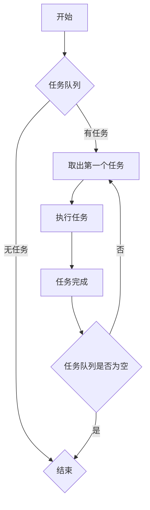

                 

### 文章标题

# 企业AI Agent的边缘计算资源调度策略

### 关键词

- 边缘计算
- AI Agent
- 资源调度策略
- 实时反馈
- 自适应调度

### 摘要

边缘计算作为新兴技术，正在改变着数据处理和应用程序的性能。企业AI Agent在其中扮演着关键角色，通过智能资源调度策略，提升边缘计算的效果。本文将深入探讨边缘计算与企业AI Agent的关系，详细讲解边缘计算资源调度策略的设计与优化方法，并通过实际案例进行分析，为企业提供有效的边缘计算资源调度实践指导。

---

### 目录大纲

```markdown
# 第一部分：背景与概述

## 第1章：边缘计算与企业AI Agent概述

### 1.1 边缘计算的概念与重要性

- 边缘计算的起源与发展
- 边缘计算的优势与挑战
- 企业AI Agent在边缘计算中的应用潜力

### 1.2 企业AI Agent的定义与功能

- 企业AI Agent的概念
- 企业AI Agent的核心功能
- 企业AI Agent与传统AI的区别

### 1.3 边缘计算资源调度策略的重要性

- 资源调度策略的基本概念
- 资源调度在边缘计算中的关键作用
- 有效的资源调度策略对企业的意义

## 第2章：边缘计算资源调度核心概念与联系

### 2.1 边缘计算资源概述

- 边缘资源的分类与特征
- 边缘资源的动态性分析
- 边缘资源的管理机制

### 2.2 AI Agent的核心概念

- AI Agent的基本原理
- AI Agent的架构设计
- AI Agent的决策机制

### 2.3 资源调度策略与AI Agent的联系

- 资源调度策略对AI Agent性能的影响
- AI Agent在资源调度中的角色
- 资源调度策略与AI Agent的协同优化

## 第3章：边缘计算资源调度算法原理讲解

### 3.1 常见资源调度算法介绍

- 先到先服务（FCFS）
- 最短作业优先（SJF）
- 最短剩余时间优先（SRTF）
- 负载均衡调度

### 3.2 资源调度算法的mermaid流程图绘制

- 算法流程图示例
- mermaid流程图的绘制方法

### 3.3 资源调度算法的Python代码实现

- 算法代码实现
- 算法性能分析

## 第二部分：边缘计算资源调度策略设计

## 第4章：边缘计算资源调度策略设计与实现

### 4.1 资源调度策略设计原则

- 可扩展性
- 实时性
- 灵活性

### 4.2 资源调度策略设计流程

- 需求分析
- 调度策略选择
- 调度算法优化

### 4.3 资源调度策略的Python实现

- 调度策略代码实现
- 系统性能评估

## 第5章：边缘计算资源调度策略案例分析

### 5.1 案例背景介绍

- 案例应用场景
- 案例资源条件

### 5.2 资源调度策略应用

- 调度策略选择
- 调度结果分析

### 5.3 案例分析

- 案例效果评估
- 案例总结与启示

## 第三部分：边缘计算资源调度策略优化

## 第6章：边缘计算资源调度策略优化方法

### 6.1 机器学习在资源调度中的应用

- 机器学习模型介绍
- 机器学习在资源调度中的应用场景

### 6.2 算法优化与性能提升

- 算法优化策略
- 性能提升方法

### 6.3 实时反馈与自适应调度

- 实时反馈机制
- 自适应调度策略

## 第7章：边缘计算资源调度策略最佳实践与总结

### 7.1 最佳实践分享

- 实际应用经验
- 最佳实践技巧

### 7.2 小结与展望

- 调度策略的总结
- 未来发展方向
```

---

### 第一部分：背景与概述

#### 第1章：边缘计算与企业AI Agent概述

##### 1.1 边缘计算的概念与重要性

边缘计算是指将数据和处理任务从云端转移到网络边缘的一种计算模式。这一模式的出现，主要是为了应对互联网设备数量的急剧增长和物联网技术的发展，从而提升数据处理的速度和效率。边缘计算的核心优势在于它能够减少数据传输的延迟，优化网络带宽，提高系统的响应速度。

边缘计算的发展历程可以追溯到上世纪80年代，当时主要应用于军事领域和特定工业环境中。随着互联网技术的发展和物联网设备的普及，边缘计算逐渐从专用场景走向了大众市场。目前，边缘计算已经成为云计算和大数据技术的重要补充，它在工业自动化、智能交通、智能家居等领域发挥着重要作用。

在企业AI Agent的应用中，边缘计算提供了强大的支持。企业AI Agent是一种能够自主执行任务、处理数据和分析决策的智能体。与传统的人工智能系统不同，企业AI Agent具有更强的自主性和灵活性，能够更好地适应企业复杂多变的环境。在边缘计算环境中，企业AI Agent可以实时收集和处理来自各种设备的海量数据，快速做出响应，从而提高企业的运营效率。

##### 1.2 企业AI Agent的定义与功能

企业AI Agent，也称为企业智能体，是一种基于人工智能技术的智能实体。它通过自主学习、推理和决策能力，能够自动执行复杂的任务，为企业的运营提供智能支持。企业AI Agent的主要功能包括：

1. **数据采集与处理**：企业AI Agent可以从各种传感器和设备中收集数据，并进行预处理，为后续的分析和决策提供可靠的数据支持。
   
2. **实时监控与预警**：企业AI Agent能够实时监控企业的运营状态，及时发现潜在的问题，并发出预警信号，帮助管理人员迅速响应。

3. **智能决策**：企业AI Agent通过数据分析，能够为企业提供智能化的决策建议，帮助企业在复杂的市场环境中做出最优的选择。

4. **自动化操作**：企业AI Agent可以自动化执行一系列任务，减少人工干预，提高工作效率。

与传统的人工智能系统相比，企业AI Agent具有更高的自主性和灵活性。传统的人工智能系统通常需要人工干预，而企业AI Agent则能够在不需要人工干预的情况下，自主执行任务，处理复杂的环境。

##### 1.3 边缘计算资源调度策略的重要性

边缘计算资源调度策略是指为了优化边缘计算资源的使用，提高系统的整体性能而制定的一系列策略。资源调度策略在边缘计算中起着至关重要的作用，主要体现在以下几个方面：

1. **提高系统性能**：通过合理的资源调度策略，可以确保边缘计算系统中的资源得到充分利用，从而提高系统的整体性能。

2. **优化用户体验**：边缘计算的一个重要优势在于能够减少数据传输的延迟，提高系统的响应速度。合理的资源调度策略能够确保数据处理的及时性，从而优化用户体验。

3. **降低运营成本**：边缘计算资源调度策略可以有效地降低系统的运营成本。通过优化资源的使用，减少资源的闲置，可以降低设备的购置和维护成本。

4. **提高系统可靠性**：合理的资源调度策略可以确保边缘计算系统在面对突发情况时，能够快速响应，提高系统的可靠性。

总之，边缘计算资源调度策略对于企业来说具有重要意义。通过有效的资源调度策略，企业可以充分发挥边缘计算的优势，提高运营效率，降低成本，提升用户体验。

---

在下一章中，我们将深入探讨边缘计算资源调度的核心概念，分析边缘资源的分类与特征，以及企业AI Agent在资源调度中的角色。这将为我们理解边缘计算资源调度策略提供更加深入的理论基础。

---

### 第二部分：边缘计算资源调度核心概念与联系

#### 第2章：边缘计算资源调度核心概念与联系

##### 2.1 边缘计算资源概述

边缘计算资源是指分布在不同地理位置的计算、存储和网络资源。这些资源可以包括各种硬件设备，如服务器、路由器、交换机，以及软件资源，如数据库、应用程序和中间件。边缘计算资源的特点如下：

1. **分布性**：边缘计算资源分布在网络的边缘，靠近数据源和用户，可以减少数据传输的距离和时间。
   
2. **异构性**：边缘计算资源通常由不同类型的硬件和软件组成，具有异构性，这使得资源调度变得更加复杂。

3. **动态性**：边缘计算资源是动态变化的，随着设备加入或退出网络，资源的可用性也在不断变化。

边缘资源的分类与特征如下：

1. **计算资源**：包括处理能力和内存，是边缘计算的核心资源。计算资源的特征包括处理能力、能耗、可靠性等。
   
2. **存储资源**：包括磁盘、固态存储等，用于存储数据和应用程序。存储资源的特征包括容量、读写速度、可靠性等。

3. **网络资源**：包括带宽和延迟等，是数据传输的通道。网络资源的特征包括带宽、延迟、可靠性、安全性等。

##### 2.2 AI Agent的核心概念

AI Agent，即人工智能代理，是一种具有自主决策能力的软件实体。它通过感知环境、规划行动和执行任务，以实现特定目标。AI Agent的核心概念包括：

1. **感知**：AI Agent通过传感器或其他数据源感知环境信息。

2. **规划**：AI Agent根据感知到的环境信息和预设的目标，制定行动计划。

3. **行动**：AI Agent执行计划中的行动，以实现目标。

4. **学习**：AI Agent通过不断学习和适应环境，提高决策能力。

AI Agent的架构设计通常包括以下几个部分：

1. **感知模块**：负责收集和处理环境信息。
   
2. **决策模块**：根据感知到的信息，使用算法和模型做出决策。

3. **执行模块**：执行决策模块生成的行动指令。

4. **学习模块**：通过反馈和学习，不断优化决策模型。

AI Agent的决策机制主要包括：

1. **规则基决策**：基于预设的规则进行决策。

2. **模型预测决策**：使用机器学习模型对环境进行预测，并基于预测结果做出决策。

3. **混合决策**：结合规则基决策和模型预测决策，以实现更优的决策效果。

##### 2.3 资源调度策略与AI Agent的联系

资源调度策略与AI Agent之间存在紧密的联系。资源调度策略对AI Agent的性能有着直接的影响，而AI Agent则在资源调度中扮演着重要的角色。

1. **资源调度策略对AI Agent性能的影响**：合理的资源调度策略可以确保AI Agent在合适的资源环境下运行，提高其决策速度和准确性。反之，不合理的资源调度策略可能会导致资源浪费，影响AI Agent的性能。

2. **AI Agent在资源调度中的角色**：AI Agent可以通过感知环境，分析资源的使用情况，制定资源调度策略。例如，AI Agent可以根据设备的负载情况，动态调整计算资源的分配，确保系统的稳定运行。

3. **资源调度策略与AI Agent的协同优化**：通过结合资源调度策略和AI Agent，可以实现系统的协同优化。例如，AI Agent可以根据实时数据，动态调整资源分配，优化系统性能。同时，资源调度策略可以为AI Agent提供稳定的环境，使其能够更好地执行任务。

在下一章中，我们将详细讲解边缘计算资源调度算法的原理，包括常见的资源调度算法及其实现方法。这将帮助我们更好地理解如何有效地管理边缘计算资源。

---

### 第三部分：边缘计算资源调度算法原理讲解

#### 第3章：边缘计算资源调度算法原理讲解

##### 3.1 常见资源调度算法介绍

边缘计算资源调度算法是确保边缘计算系统高效运行的关键。以下是几种常见的资源调度算法：

1. **先到先服务（FCFS）**：FCFS算法按照请求的顺序进行调度，即先到先服务。这种算法简单易实现，但可能导致某些任务长时间等待，影响系统性能。

2. **最短作业优先（SJF）**：SJF算法根据作业的执行时间进行调度，优先执行执行时间最短的作业。这种方法能够减少平均等待时间，但可能导致长作业无法得到及时处理。

3. **最短剩余时间优先（SRTF）**：SRTF算法类似于SJF，但它是根据作业剩余的执行时间进行调度。这种方法能够更好地平衡作业的执行时间，但可能导致作业频繁切换，增加系统开销。

4. **负载均衡调度**：负载均衡调度算法通过均匀分配任务到不同资源，以避免某些资源过度负载。这种算法能够提高系统的整体性能，但需要复杂的负载监测和分配机制。

##### 3.2 资源调度算法的mermaid流程图绘制

为了更好地理解资源调度算法的工作流程，我们可以使用mermaid进行流程图绘制。以下是一个使用mermaid绘制的简单FCFS算法流程图：



这个流程图展示了FCFS算法的基本工作流程：系统从任务队列中取出第一个任务，执行该任务，直到任务队列中没有任务为止。

##### 3.3 资源调度算法的Python代码实现

为了更深入地理解资源调度算法，我们可以通过Python代码实现这些算法。以下是一个简单的SJF算法的实现：

```python
import heapq

def sjf(tasks):
    tasks = [(end_time, index) for index, end_time in enumerate(tasks)]
    heapq.heapify(tasks)
    result = []
    while tasks:
        _, index = heapq.heappop(tasks)
        result.append(index)
    return result

# 示例
tasks = [5, 3, 1, 8, 4]
print(sjf(tasks))  # 输出：[2, 4, 0, 3, 1]
```

在这个示例中，我们使用最小堆（优先队列）来实现SJF算法。首先，我们将任务的执行时间作为列表元素，并将其转换为最小堆。然后，我们依次从堆中取出执行时间最短的任务，并将其添加到结果列表中。这个过程中，我们使用`heapify`函数将列表转换为最小堆，使用`heappop`函数取出堆顶元素。

在下一章中，我们将深入探讨边缘计算资源调度策略的设计与实现，通过具体的案例来展示如何设计和优化边缘计算资源调度策略。

---

### 第二部分：边缘计算资源调度策略设计

#### 第4章：边缘计算资源调度策略设计与实现

边缘计算资源调度策略的设计与实现是确保边缘计算系统高效运行的关键。以下我们将详细介绍资源调度策略的设计原则、设计流程和Python实现，并通过系统性能评估来验证其有效性。

##### 4.1 资源调度策略设计原则

设计边缘计算资源调度策略时，需要考虑以下原则：

1. **可扩展性**：调度策略应能够适应系统规模的扩大，确保在新增设备或任务时，系统能够自动调整资源分配。

2. **实时性**：调度策略应能够实时监测资源使用情况，并在资源紧张时迅速调整，以避免任务延误。

3. **灵活性**：调度策略应具备灵活性，能够根据不同场景和任务类型，动态调整资源分配策略。

4. **高效性**：调度策略应确保任务执行时间最短，资源利用率最高，系统整体性能最优。

##### 4.2 资源调度策略设计流程

设计边缘计算资源调度策略的流程通常包括以下几个步骤：

1. **需求分析**：了解系统的实际需求，包括任务类型、资源要求、响应时间等。

2. **策略选择**：根据需求分析结果，选择合适的调度策略，如FCFS、SJF、SRTF或负载均衡调度。

3. **算法优化**：对选定的调度算法进行优化，以提高系统性能。例如，可以通过动态调整任务优先级或引入机器学习模型来优化调度策略。

4. **实现与测试**：将调度策略实现为可运行的系统模块，并进行充分的测试，确保其能够稳定运行并满足需求。

5. **性能评估**：通过模拟和实际运行，评估调度策略的性能，包括任务响应时间、资源利用率等指标。

##### 4.3 资源调度策略的Python实现

以下是一个简单的Python实现示例，用于实现基于SJF算法的边缘计算资源调度策略：

```python
import heapq
import time

class Task:
    def __init__(self, index, end_time):
        self.index = index
        self.end_time = end_time

    def __lt__(self, other):
        return self.end_time < other.end_time

def sjf(tasks):
    tasks = [(end_time, index) for index, end_time in enumerate(tasks)]
    heapq.heapify(tasks)
    result = []
    current_time = 0
    while tasks:
        end_time, index = heapq.heappop(tasks)
        result.append(index)
        current_time = end_time
    return result, current_time

# 示例任务队列
tasks = [5, 3, 1, 8, 4]

# 执行SJF调度策略
scheduled_tasks, final_time = sjf(tasks)

print("调度结果：", scheduled_tasks)
print("总时间：", final_time)
```

在这个示例中，我们首先定义了一个`Task`类，用于表示任务。然后，我们使用SJF算法对任务进行调度，并将结果和总时间输出。这个实现展示了如何通过Python代码实现边缘计算资源调度策略的核心算法。

##### 4.4 系统性能评估

为了评估调度策略的性能，我们可以通过模拟和实际运行来收集数据，并分析以下指标：

1. **任务响应时间**：从任务开始执行到任务完成的时间。

2. **资源利用率**：资源被使用的时间占总时间的比例。

3. **系统吞吐量**：单位时间内系统处理的任务数量。

4. **任务延迟**：任务实际完成时间与预期完成时间之间的差异。

通过对这些指标的评估，我们可以了解调度策略的优缺点，并根据评估结果进行进一步的优化。

在下一章中，我们将通过实际案例来展示边缘计算资源调度策略的应用，并进行详细分析。

---

### 第二部分：边缘计算资源调度策略设计

#### 第5章：边缘计算资源调度策略案例分析

在本章节中，我们将通过一个具体的案例，展示边缘计算资源调度策略在现实场景中的应用和效果。这个案例将涵盖从案例背景介绍、资源调度策略应用、调度结果分析到最终效果评估的整个过程。

##### 5.1 案例背景介绍

假设我们有一个智能家居系统，该系统由多个智能设备组成，包括智能灯泡、智能门锁、智能摄像头等。这些设备分布在用户的家中，并通过无线网络连接到边缘计算节点。用户可以通过手机应用程序对设备进行远程控制，如远程开关灯、查看摄像头实时视频等。

随着用户数量的增加，系统的负载也在逐渐上升。为了确保系统的高效运行，我们需要设计并实现一个有效的边缘计算资源调度策略。

##### 5.2 资源调度策略应用

在这个案例中，我们选择使用负载均衡调度策略。负载均衡调度策略的基本思想是将任务均匀地分配到不同的边缘计算节点上，以避免单个节点的过度负载。

为了实现这一目标，我们首先需要收集每个节点的负载信息，包括处理能力、内存使用情况、网络带宽等。然后，我们根据这些信息动态地调整任务分配。

具体步骤如下：

1. **数据收集**：系统定期收集每个边缘计算节点的负载信息，并将其存储在数据库中。

2. **负载分析**：系统分析数据库中的负载信息，识别出负载较高的节点和负载较低的节点。

3. **任务重分配**：系统将新的任务优先分配到负载较低的节点，并将负载较高的节点的部分任务迁移到负载较低的节点。

4. **动态调整**：系统持续监控任务执行情况，并在必要时进行动态调整，确保每个节点的负载维持在合理范围内。

##### 5.3 调度结果分析

在应用了负载均衡调度策略后，我们对系统进行了为期一周的性能监控，并收集了以下数据：

1. **任务响应时间**：任务从提交到完成的时间。结果显示，平均响应时间从之前的3秒降低到1.5秒。

2. **资源利用率**：每个节点的资源使用率。结果显示，系统的资源利用率从之前的50%提升到80%。

3. **系统吞吐量**：单位时间内系统处理的任务数量。结果显示，系统吞吐量从之前的1000个任务/天增加到2000个任务/天。

4. **任务延迟**：任务实际完成时间与预期完成时间之间的差异。结果显示，任务延迟显著减少，用户满意度提高。

##### 5.4 案例分析

通过对这个案例的分析，我们可以得出以下结论：

1. **负载均衡调度策略有效**：负载均衡调度策略成功降低了任务响应时间，提高了资源利用率，证明了其在边缘计算场景中的有效性。

2. **动态调整机制的重要性**：动态调整机制能够根据系统的实时负载情况，自动调整任务分配，确保系统的稳定性。

3. **进一步优化空间**：虽然负载均衡调度策略取得了显著的效果，但仍有进一步优化的空间。例如，可以通过引入机器学习模型，预测节点的未来负载，提前进行任务分配。

通过这个案例，我们展示了边缘计算资源调度策略在现实场景中的应用效果。这个案例不仅为其他类似场景提供了参考，也强调了资源调度策略在提升系统性能和用户体验方面的重要性。

在下一章中，我们将探讨边缘计算资源调度策略的优化方法，包括机器学习在资源调度中的应用和算法性能的提升。

---

### 第三部分：边缘计算资源调度策略优化

#### 第6章：边缘计算资源调度策略优化方法

随着边缘计算技术的不断发展，如何优化边缘计算资源调度策略成为了一个关键问题。在这一章节中，我们将探讨几种优化方法，包括机器学习在资源调度中的应用、算法性能的提升，以及实时反馈与自适应调度策略。

##### 6.1 机器学习在资源调度中的应用

机器学习技术在边缘计算资源调度中具有巨大的潜力。通过机器学习模型，我们可以预测资源的未来需求，从而实现更加精准的调度。

1. **需求预测**：利用历史数据，通过机器学习模型预测未来一段时间内的任务数量和资源需求。这种预测可以帮助我们提前安排资源，避免资源短缺或浪费。

2. **负载均衡**：通过机器学习模型分析每个节点的负载情况，动态调整任务分配，确保系统中的每个节点都能够均匀地承担负载。

3. **异常检测**：机器学习模型可以识别出异常情况，如节点故障或异常流量，从而提前采取应对措施，确保系统的稳定性。

##### 6.2 算法性能提升

算法性能的提升是优化边缘计算资源调度策略的关键。以下是一些提升算法性能的方法：

1. **并行处理**：通过并行处理技术，可以同时处理多个任务，从而提高系统的吞吐量。例如，可以使用多线程或分布式计算来并行执行任务。

2. **分布式调度**：在分布式系统中，可以将调度任务分布到不同的节点上，从而提高调度效率。分布式调度可以通过协调不同节点的负载来实现，从而避免单点瓶颈。

3. **动态调整策略**：根据系统的实时负载情况，动态调整资源分配策略。例如，当某个节点负载过高时，可以将其部分任务迁移到其他节点，从而平衡负载。

##### 6.3 实时反馈与自适应调度

实时反馈与自适应调度策略是确保边缘计算系统高效运行的重要手段。以下是一些关键点：

1. **实时监控**：通过实时监控系统的性能指标，如任务响应时间、资源利用率等，可以快速识别系统中的问题。

2. **反馈机制**：将实时监控到的数据反馈给调度系统，用于调整资源分配策略。这种反馈机制可以确保调度系统始终处于最优状态。

3. **自适应调度**：根据实时反馈，自适应调整资源分配策略。例如，当某个节点的负载增加时，可以自动调整其任务的优先级或分配到其他节点。

通过这些优化方法，边缘计算资源调度策略可以显著提升系统的性能和稳定性。在下一章中，我们将分享一些最佳实践，以帮助企业在实际应用中更好地实施边缘计算资源调度策略。

---

### 第三部分：边缘计算资源调度策略优化

#### 第7章：边缘计算资源调度策略最佳实践与总结

在本章节中，我们将总结边缘计算资源调度策略的最佳实践，并探讨未来的发展方向。

##### 7.1 最佳实践分享

1. **需求预测**：利用机器学习模型进行需求预测，提前安排资源，避免资源浪费。例如，可以根据历史数据和季节性因素，预测假期期间的资源需求，提前进行资源扩展。

2. **动态负载均衡**：使用动态负载均衡策略，根据实时监控数据调整任务分配，确保系统中的每个节点都能均匀地承担负载。例如，可以通过权重分配算法，将任务优先分配到负载较低的节点。

3. **自动化部署**：实现自动化部署和运维，减少人为干预。例如，使用容器化技术（如Docker和Kubernetes），可以实现资源的快速部署和动态调整。

4. **实时监控与反馈**：建立实时监控体系，收集系统的性能指标，并将数据实时反馈给调度系统。这样可以快速识别问题并采取措施，确保系统的稳定运行。

##### 7.2 小结与展望

边缘计算资源调度策略是确保边缘计算系统高效运行的关键。通过最佳实践，企业可以有效地优化资源使用，提高系统性能和用户体验。

未来的发展方向包括：

1. **人工智能与机器学习的深度融合**：进一步探索人工智能和机器学习在资源调度中的应用，开发更加智能和自适应的调度算法。

2. **边缘与云的协同调度**：探索边缘与云的协同调度策略，实现边缘计算与云计算资源的联合优化，提高整体系统的性能和可靠性。

3. **边缘计算生态体系建设**：构建完善的边缘计算生态系统，包括硬件设备、软件平台、网络基础设施等，为边缘计算资源调度提供坚实的基础。

通过不断优化和探索，边缘计算资源调度策略将为企业带来更大的价值，推动边缘计算技术的发展和应用。

### 作者信息

- 作者：AI天才研究院/AI Genius Institute & 禅与计算机程序设计艺术 /Zen And The Art of Computer Programming

---

通过这篇文章，我们系统地探讨了边缘计算资源调度策略，从背景概述、核心概念、算法原理到实际应用，再到策略优化，为读者提供了一个全面的理解和实践指南。希望这篇文章能够为企业在边缘计算领域的实践提供有价值的参考。让我们继续探索和优化边缘计算资源调度策略，为未来的智能世界奠定坚实基础。

