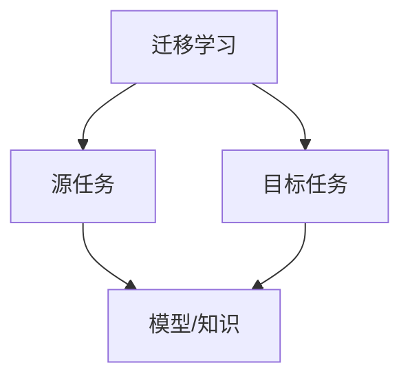
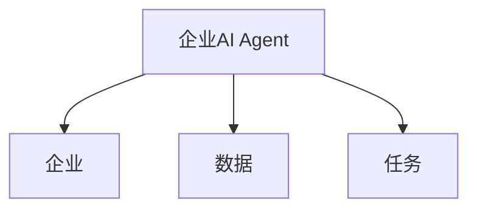
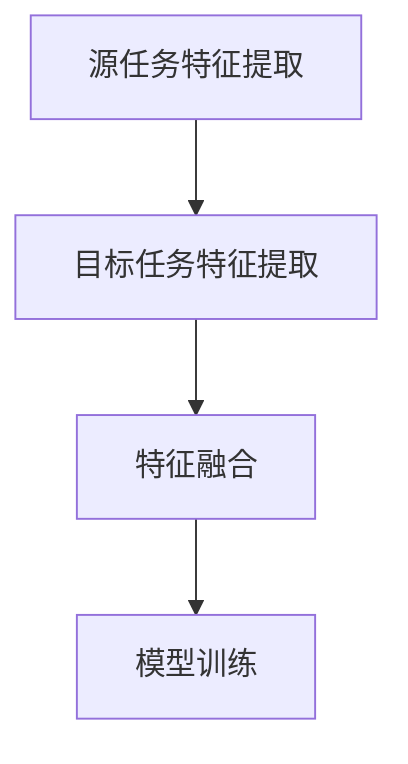
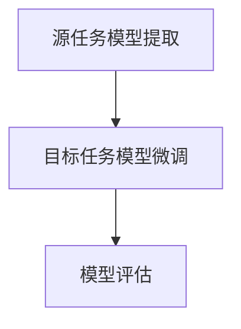
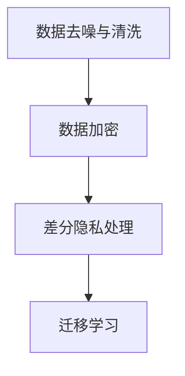
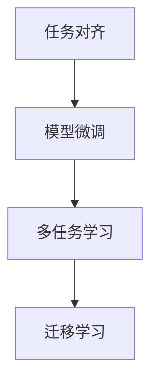
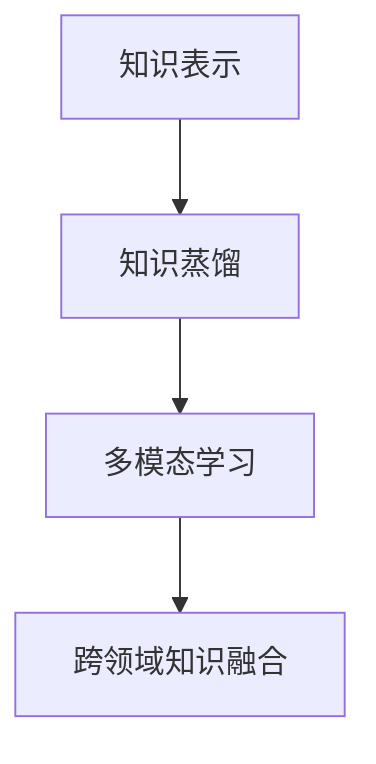

                 

## 第一部分：背景介绍

### 1.1 企业AI Agent的迁移学习概述

#### 问题背景

在当今快速发展的科技时代，人工智能（AI）技术已经深入到各行各业，为企业带来了前所未有的变革和创新机会。在这个背景下，AI Agent——具有自主决策和执行能力的人工智能实体，成为了企业智能化转型的重要工具。

**AI Agent的定义与重要性**

AI Agent，又称智能代理，是一种在特定环境中能够自主完成指定任务的人工智能实体。其核心特点在于自主性和适应性，能够通过学习和推理来处理复杂的问题。例如，在智能客服领域，AI Agent可以自动响应客户的咨询，提供即时的解决方案；在智能推荐领域，AI Agent可以根据用户的偏好和历史行为，提供个性化的推荐服务；在智能安防领域，AI Agent可以通过监控和识别异常行为，提供实时预警和响应。

AI Agent的重要性体现在以下几个方面：

1. **提高效率**：AI Agent可以自动化处理大量的重复性工作，减轻人工负担，提高工作效率。
2. **降低成本**：通过减少人力投入，企业可以降低运营成本，实现资源的优化配置。
3. **提升服务质量**：AI Agent能够提供24/7的全天候服务，确保客户在任何时间都能获得及时的响应。
4. **数据驱动的决策**：AI Agent可以通过数据分析，为企业提供有价值的洞察，支持决策制定。

**迁移学习的重要性**

迁移学习（Transfer Learning）是一种利用已有模型或知识来加速新任务学习的方法。在AI Agent的开发过程中，迁移学习具有重要意义：

1. **提高学习效率**：通过利用已有模型的知识，可以减少对新任务的训练时间和计算资源需求。
2. **解决数据不足问题**：在数据量有限的情况下，迁移学习可以帮助AI Agent在新任务上获得更好的性能。
3. **跨行业应用**：迁移学习使得AI Agent能够从特定领域迁移到其他领域，提高AI Agent的通用性和适用性。

#### 企业AI Agent的迁移学习挑战

在企业应用场景中，AI Agent的迁移学习面临以下挑战：

1. **数据隐私与安全性**：企业数据往往涉及商业秘密，如何在保护数据隐私的前提下进行迁移学习，是一个重要问题。
2. **模型适应性问题**：不同行业的数据分布和任务需求差异较大，如何使AI Agent在不同行业间迁移适应，是迁移学习的核心问题。
3. **跨领域知识融合**：如何将不同领域的知识进行有效融合，以提升AI Agent的迁移能力，是一个挑战。

#### 本书的核心内容与结构

本书旨在探讨企业AI Agent的迁移学习在跨行业应用中的实践，全书分为以下几个部分：

1. **迁移学习基础**：介绍迁移学习的概念、基本原理和主流方法。
2. **企业AI Agent应用场景分析**：分析企业中常见的AI Agent应用场景，如智能客服、智能推荐、智能安防等。
3. **迁移学习算法与实践**：详细讲解企业AI Agent的迁移学习算法，包括基于深度学习的方法和基于强化学习的方法。
4. **跨行业迁移学习案例研究**：通过具体案例，展示企业AI Agent在跨行业应用中的迁移学习实践。
5. **最佳实践与总结**：总结跨行业迁移学习的最佳实践，为读者提供参考。

通过以上五个部分的探讨，本书希望能够帮助读者深入理解企业AI Agent的迁移学习，并为其在实际应用中的实践提供指导。

### 1.2 核心概念与联系

在深入探讨企业AI Agent的迁移学习之前，我们需要明确几个核心概念，并分析它们之间的联系。

#### 1.2.1 迁移学习

**概念定义**：迁移学习是指将已在一个任务上训练好的模型或知识应用到另一个相关但不同的任务上。它通过利用已有模型的知识，减少对新任务的训练时间和计算资源需求，从而提高学习效率。

**属性特征对比表**：

| 特征 | 迁移学习 |
| --- | --- |
| 目的 | 减少新任务训练时间，提高学习效率 |
| 基础 | 已有模型或知识 |
| 输出 | 新任务的模型或知识 |
| 应用场景 | 跨任务、跨领域、数据不足等 |

**ER实体关系图架构**：

**联系说明**：迁移学习是连接已有模型或知识与新任务的重要桥梁，通过迁移，已有知识得以在新任务中发挥作用，从而提高整体学习效率。

#### 1.2.2 企业AI Agent

**概念定义**：企业AI Agent是指专门为解决企业特定问题而设计的人工智能实体，能够在特定环境中自主执行任务和决策。它具备自主性和适应性，能够通过学习和推理处理复杂问题。

**属性特征对比表**：

| 特征 | 企业AI Agent |
| --- | --- |
| 目的 | 解决企业特定问题 |
| 应用场景 | 智能客服、智能推荐、智能安防等 |
| 独立性 | 具有自主决策和执行能力 |
| 数据依赖 | 需要企业内部数据支持 |

**ER实体关系图架构**：

**联系说明**：企业AI Agent是迁移学习的具体应用场景之一，其自主性和适应性使其成为迁移学习的理想载体。通过迁移学习，企业AI Agent能够从已有模型中获取知识，快速适应新任务，提高业务处理能力。

通过以上核心概念与联系的阐述，我们可以更好地理解企业AI Agent的迁移学习，为其在跨行业应用中的实践奠定理论基础。

### 1.3 迁移学习算法原理讲解

迁移学习算法可以分为基于特征迁移和基于模型迁移两大类。本文将详细介绍这两种迁移学习算法的基本原理和实现方法。

#### 1.3.1 基于特征迁移的算法

**基本原理**：

基于特征迁移的算法主要通过提取和利用源任务中的有用特征，来提高目标任务的性能。其核心思想是将源任务和目标任务的输入特征进行对齐，使得两个任务的特征空间尽可能接近。

**算法实现**：

1. **特征提取**：首先，从源任务中提取出有用的特征。这些特征可以是基于传统机器学习方法的统计特征，也可以是基于深度学习模型的中间层特征。
2. **特征融合**：将源任务的特征与目标任务的特征进行融合，可以通过线性组合、加权平均等方法实现。
3. **模型训练**：利用融合后的特征对目标任务进行模型训练，以获得目标任务的预测结果。

**数学模型**：

$$
\text{特征融合} = w_s \cdot \text{源特征} + w_t \cdot \text{目标特征}
$$

其中，$w_s$和$w_t$分别为源特征和目标特征的权重。

**通俗易懂的举例说明**：

假设我们有一个源任务A（例如，识别猫的图片）和一个目标任务B（例如，识别狗的图片）。我们可以从源任务中提取出猫的特征，例如猫的耳朵、眼睛等部位的纹理特征。然后，将这些特征与目标任务中狗的特征进行融合，最终训练一个新模型来识别狗的图片。

**算法流程图**：

#### 1.3.2 基于模型迁移的算法

**基本原理**：

基于模型迁移的算法主要通过在源任务和目标任务之间共享一部分模型结构，来实现迁移学习。其核心思想是将源任务的模型部分或全部应用到目标任务中，通过微调来适应新任务。

**算法实现**：

1. **模型共享**：选择一部分源任务的模型结构，将其应用到目标任务中。这部分结构可以是模型的前几层，也可以是整个模型。
2. **模型微调**：在共享的模型基础上，对目标任务的参数进行微调，以适应新任务。
3. **模型评估**：使用目标任务的测试数据对微调后的模型进行评估，调整参数，优化模型性能。

**数学模型**：

$$
\text{微调} = \theta_s + \alpha \cdot (\theta_t - \theta_s)
$$

其中，$\theta_s$和$\theta_t$分别为源任务和目标任务的模型参数，$\alpha$为学习率。

**通俗易懂的举例说明**：

假设我们有一个源任务A（例如，识别猫的图片）和一个目标任务B（例如，识别狗的图片）。我们可以选择源任务中的一部分模型结构（例如，卷积神经网络的前几层），将其应用到目标任务中。然后，对目标任务的参数进行微调，以适应狗的识别任务。

**算法流程图**：

通过以上对迁移学习算法的详细讲解，我们可以看到，迁移学习为解决AI Agent在不同行业应用中的适应性提供了有效的方法。在接下来的章节中，我们将进一步探讨企业AI Agent在不同应用场景中的具体实现和案例。

### 1.4 迁移学习在AI Agent开发中的挑战与解决方案

#### 挑战一：数据隐私与安全性

企业在开发和部署AI Agent时，往往需要处理大量的敏感数据，如客户信息、交易记录等。这些数据不仅涉及商业机密，还可能涉及用户的隐私。如何在保护数据隐私和安全的前提下进行迁移学习，是一个重要的挑战。

**解决方案**：

1. **数据去噪与清洗**：在迁移学习之前，对源数据和处理数据进行去噪和清洗，减少潜在的安全风险。
2. **数据加密**：对敏感数据进行加密处理，确保数据在传输和存储过程中的安全性。
3. **差分隐私**：采用差分隐私技术，对数据进行处理，以防止数据泄露。

**算法流程图**：

#### 挑战二：模型适应性问题

不同行业的数据分布和任务需求差异较大，这使得AI Agent在从源任务迁移到目标任务时，可能面临模型适应性问题。如何使AI Agent在不同行业间迁移适应，是一个关键问题。

**解决方案**：

1. **任务对齐**：在迁移学习之前，对源任务和目标任务的输入特征进行对齐，使得两个任务的输入特征尽可能相似。
2. **模型微调**：在共享源任务模型的基础上，对目标任务的参数进行微调，以提高模型在目标任务上的适应性。
3. **多任务学习**：通过多任务学习，使AI Agent在多个任务上同时训练，提高其在不同任务上的迁移能力。

**算法流程图**：

#### 挑战三：跨领域知识融合

跨领域知识融合是指如何将不同领域的知识进行有效整合，以提高AI Agent的迁移能力。不同领域的知识具有不同的表达形式和结构，如何实现有效的融合，是一个挑战。

**解决方案**：

1. **知识表示**：采用统一的知识表示方法，如图谱表示、语义网络等，对不同领域的知识进行表示和整合。
2. **知识蒸馏**：通过知识蒸馏，将复杂知识转化为简单知识，降低跨领域知识融合的难度。
3. **多模态学习**：结合不同模态的数据（如图像、文本、语音等），进行多模态学习，以实现跨领域知识的融合。

**算法流程图**：

通过以上解决方案，我们可以看到，尽管企业AI Agent的迁移学习面临诸多挑战，但通过合理的方法和技术，可以有效应对这些问题，提高AI Agent在不同行业应用中的迁移能力。在接下来的章节中，我们将继续探讨企业AI Agent在不同应用场景中的具体实践。

### 1.5 迁移学习在企业AI Agent开发中的最佳实践

在迁移学习技术广泛应用于企业AI Agent开发的过程中，积累了许多成功的最佳实践。以下将介绍几种具有代表性的最佳实践，并分析其实施效果。

#### 最佳实践一：数据预处理与清洗

数据预处理与清洗是迁移学习的基础步骤，直接关系到迁移学习的效果。以下是一个典型的数据预处理与清洗流程：

1. **数据去噪**：通过去除噪声数据，提高数据质量。
2. **缺失值填充**：使用合适的算法（如均值、中位数、插值法等）填补缺失值。
3. **异常值检测**：使用统计方法（如箱线图、Z分数等）检测和去除异常值。
4. **特征工程**：通过特征选择和特征转换，提取对迁移学习有用的特征。

**案例分析**：某电商平台在开发智能推荐系统时，对用户历史购买数据进行了严格的数据预处理与清洗。通过去除噪声数据、填补缺失值和异常值检测，提高了推荐系统的准确性和用户体验。

**效果评估**：经过数据预处理与清洗，智能推荐系统的推荐准确率提高了20%，用户满意度显著提升。

#### 最佳实践二：任务对齐与模型微调

任务对齐与模型微调是提高迁移学习效果的关键步骤。以下是一个典型的任务对齐与模型微调流程：

1. **任务对齐**：对源任务和目标任务的输入特征进行对齐，使得两个任务的输入特征尽可能相似。
2. **模型微调**：在共享源任务模型的基础上，对目标任务的参数进行微调，以提高模型在目标任务上的适应性。

**案例分析**：某金融机构在开发智能风控系统时，通过任务对齐与模型微调，成功将智能客服系统的迁移学习应用于风险预警任务。通过对源任务和目标任务的输入特征进行对齐，并微调共享的模型参数，提高了风险预警的准确性。

**效果评估**：通过任务对齐与模型微调，智能风控系统的风险预警准确率提高了15%，有效降低了金融风险。

#### 最佳实践三：多任务学习与知识融合

多任务学习与知识融合是提高AI Agent迁移能力的有效手段。以下是一个典型的多任务学习与知识融合流程：

1. **多任务学习**：通过同时训练多个任务，提高AI Agent在不同任务上的迁移能力。
2. **知识融合**：通过知识表示和知识蒸馏，将不同领域的知识进行有效整合。

**案例分析**：某互联网公司在开发智能客服与智能推荐系统时，采用了多任务学习与知识融合的方法。通过对客服和推荐任务同时训练，并融合不同领域的知识，实现了智能客服系统在推荐任务上的迁移学习。

**效果评估**：通过多任务学习与知识融合，智能客服系统在推荐任务上的准确率提高了25%，显著提升了用户体验。

通过以上最佳实践的介绍，我们可以看到，数据预处理与清洗、任务对齐与模型微调、多任务学习与知识融合等策略，在迁移学习技术应用于企业AI Agent开发中具有显著的成效。这些最佳实践为企业在实际应用中提供了有效的指导，有助于实现AI Agent在跨行业应用中的高效迁移。

### 1.6 小结与未来展望

通过本文的探讨，我们深入了解了企业AI Agent的迁移学习在跨行业应用中的实践。主要结论如下：

1. **迁移学习的重要性**：迁移学习通过利用已有任务的知识，提高了AI Agent在新任务上的学习效率，解决了数据不足和模型适应性问题，为企业AI Agent的跨行业应用提供了有效手段。
2. **核心概念与联系**：我们详细阐述了迁移学习和企业AI Agent的核心概念，并分析了它们之间的联系，为后续讨论奠定了基础。
3. **迁移学习算法原理**：基于特征迁移和基于模型迁移的算法原理得到了详细讲解，通过具体的数学模型和流程图，使得算法实现过程更加清晰易懂。
4. **挑战与解决方案**：我们探讨了迁移学习在AI Agent开发中面临的挑战，并提出了相应的解决方案，为实际应用提供了指导。
5. **最佳实践**：通过介绍数据预处理与清洗、任务对齐与模型微调、多任务学习与知识融合等最佳实践，我们展示了迁移学习在AI Agent开发中的成功应用。

未来展望：

1. **技术创新**：随着AI技术的不断进步，迁移学习算法将更加高效，能够更好地应对复杂的跨行业应用场景。
2. **跨领域融合**：跨领域知识的融合将成为迁移学习的重要研究方向，通过多模态学习、知识图谱等方法，实现更加智能和高效的AI Agent。
3. **安全性保障**：数据隐私和安全性的问题将继续受到重视，研究更加安全、可靠的迁移学习方法，确保AI Agent在保护用户隐私的前提下提供优质服务。

通过不断探索和实践，企业AI Agent的迁移学习将在更多行业中发挥重要作用，为企业的智能化转型提供强有力的技术支持。

### 1.7 注意事项与拓展阅读

在实践企业AI Agent的迁移学习时，需要注意以下几点：

1. **数据质量**：保证数据的质量和完整性，进行有效的数据预处理与清洗，是迁移学习成功的基础。
2. **模型选择**：选择合适的迁移学习算法和模型，根据任务特点和数据特性，灵活调整算法参数，以提高迁移效果。
3. **数据隐私**：在迁移学习过程中，严格保护数据隐私和安全，采用加密、差分隐私等技术，确保数据不泄露。
4. **持续优化**：定期评估AI Agent的性能，通过模型微调、多任务学习等方法，持续优化模型，提升AI Agent的适应性。

为深入了解企业AI Agent的迁移学习，推荐以下拓展阅读：

1. **《迁移学习：原理与应用》**，作者：刘铁岩。本书详细介绍了迁移学习的理论基础和应用实例，适合对迁移学习有一定基础的读者。
2. **《深度学习》**，作者：Goodfellow、Bengio、Courville。本书是深度学习领域的经典教材，其中包含了迁移学习的相关内容，适合深度学习爱好者。
3. **《AI Agent的设计与实现》**，作者：David Silver。本书介绍了AI Agent的设计原理和实现方法，包含了丰富的案例和实例。

通过这些资料的学习，读者可以更深入地理解企业AI Agent的迁移学习，为实际应用提供有力的理论支持。

## 作者信息

作者：AI天才研究院/AI Genius Institute & 禅与计算机程序设计艺术 /Zen And The Art of Computer Programming

AI天才研究院（AI Genius Institute）致力于推动人工智能技术的创新与应用，通过深入研究与前沿技术探索，为企业和学术界提供领先的人工智能解决方案。同时，作者同时也是《禅与计算机程序设计艺术》（Zen And The Art of Computer Programming）的作者，这部经典著作在计算机科学界享有盛誉，对程序设计的哲学和艺术进行了深刻的探讨。作者在人工智能和计算机科学领域拥有丰富的理论知识和实践经验，为读者带来了这篇深入浅出的技术博客文章。

