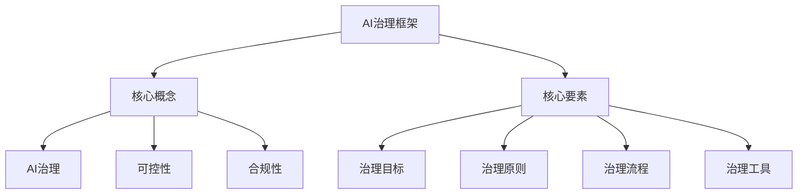
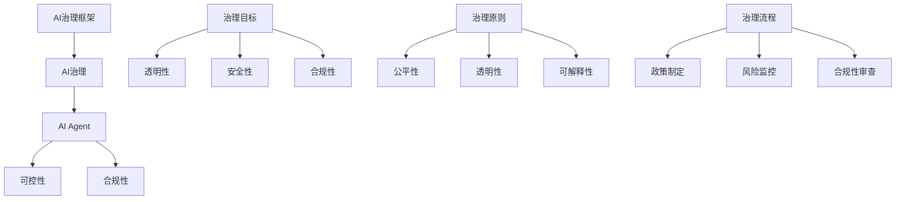
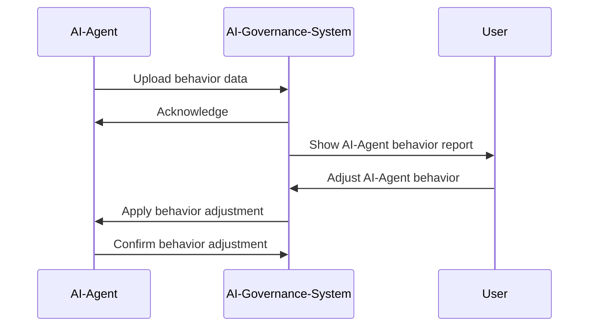

                 


# 企业AI治理框架：确保AI Agent的可控与合规

> 关键词：AI治理、AI Agent、可控性、合规性、系统架构、算法原理

> 摘要：随着人工智能技术的迅猛发展，企业开始广泛应用AI Agent来提升运营效率。然而，随之而来的是AI治理的挑战，如何确保AI Agent的可控性与合规性成为关键问题。本文将探讨企业AI治理框架的构建，通过分析核心概念、数学模型与算法原理、系统架构设计以及项目实战，为企业提供一套有效的治理解决方案。

----------------------------------------------------------------

## 第一部分：引言与背景

### 第1章：企业AI治理框架的提出与重要性

#### 1.1.1 问题背景
随着人工智能（AI）技术的快速发展，企业开始广泛应用AI Agent来提高运营效率、优化决策过程。然而，AI技术的广泛应用也带来了新的挑战，如AI Agent的可控性与合规性。如何确保AI Agent在执行任务时符合企业的业务目标和法律法规，成为企业亟需解决的问题。

#### 1.1.2 问题描述
AI Agent的可控性指的是AI Agent在执行任务时，其行为是否在预设范围内，能否被有效监控和调整。而合规性则是指AI Agent在执行任务时，是否遵循相关法律法规和公司政策。确保AI Agent的可控性与合规性，对于企业的长远发展和风险控制具有重要意义。

#### 1.1.3 问题解决
为了解决AI Agent的可控性与合规性问题，企业需要建立一套AI治理框架。AI治理框架是企业管理AI技术、确保AI Agent可控与合规的一系列原则、方法和工具。通过构建AI治理框架，企业可以明确治理目标、制定相关政策和标准，从而有效管理和控制AI Agent的行为。

#### 1.1.4 边界与外延
AI治理框架的适用范围主要包括企业的内部AI应用，如客户服务、供应链管理、财务分析等。此外，AI治理框架还应关注AI Agent与外部系统的交互，确保AI Agent在与其他系统合作时，仍能保持可控性与合规性。

#### 1.1.5 概念结构与核心要素组成
AI治理框架的概念结构包括核心概念、核心要素和关系。核心概念主要包括AI治理、可控性、合规性等。核心要素包括治理目标、治理原则、治理流程、治理工具等。概念结构与核心要素组成的关系如图1-1所示。



### 1.2 AI治理框架的核心概念与联系

#### 1.2.1 AI治理的核心概念
AI治理是指企业对人工智能技术的管理，包括制定相关政策和标准、确保AI技术应用的合理性和合规性、监控AI技术的影响和风险等。

#### 1.2.2 AI治理的目标
AI治理的目标包括：确保AI Agent的可控性、提高AI技术的透明度、降低AI技术带来的风险、保障企业合规运营等。

#### 1.2.3 AI治理的原则
AI治理的原则主要包括：公平性、透明性、可解释性、安全性、合规性等。这些原则旨在确保AI技术在企业中的应用能够符合道德和法律法规要求，保护用户权益，降低风险。

#### 1.2.4 核心概念属性特征对比表格

| 核心概念 | 属性特征 | 对比关系 |
| :---: | :---: | :---: |
| AI治理 | 包括政策制定、风险监控、合规性审查等 | AI治理是AI Agent可控性与合规性的基础 |
| 可控性 | 指AI Agent在执行任务时，行为是否在预设范围内 | 可控性是AI治理的重要目标 |
| 合规性 | 指AI Agent在执行任务时，是否遵循相关法律法规和公司政策 | 合规性是AI治理的基本要求 |

### 1.3 AI治理框架的ER实体关系图架构

#### 1.3.1 ER实体关系图介绍
ER（Entity-Relationship）实体关系图是数据库设计的一种常用工具，用于描述实体之间的关系。在AI治理框架中，ER实体关系图用于描述核心概念、核心要素之间的关系。

#### 1.3.2 AI治理框架的ER实体关系图



### 1.4 AI治理框架的数学模型与算法原理讲解

#### 1.4.1 数学模型

治理指标 = f（可控性，合规性）

其中，f 是一个复合函数，可控性和合规性分别代表AI Agent的两种属性。

#### 1.4.2 算法原理讲解

- **可控性分析算法**

  步骤1：收集AI Agent的操作记录。

  步骤2：分析操作记录，判断AI Agent的行为是否超出预设范围。

  步骤3：根据分析结果，调整AI Agent的行为。

- **合规性分析算法**

  步骤1：获取AI Agent执行任务的相关数据。

  步骤2：根据法律法规和公司政策，对数据进行合规性检查。

  步骤3：根据检查结果，对AI Agent的行为进行合规调整。

#### 1.4.3 举例说明

假设一个AI Agent在执行任务时，其可控性和合规性分析的结果如下：

- **可控性**：AI Agent的行为在预设范围内，可控性较高。
- **合规性**：AI Agent的行为符合法律法规和公司政策，合规性较好。

根据上述结果，可以认为该AI Agent的治理指标较高。

### 1.5 系统分析与架构设计

#### 1.5.1 问题场景介绍

企业在日常运营中，不断应用AI技术，以提高效率和服务质量。随着AI应用的增加，AI治理问题逐渐凸显，需要建立一套有效的治理框架。

#### 1.5.2 项目介绍

项目名称：企业AI治理框架

项目目标：确保AI Agent的可控性与合规性

#### 1.5.3 系统功能设计

- **功能1：AI Agent行为监控**：实时监控AI Agent的行为，确保其在预设范围内运行。
- **功能2：AI Agent合规性检查**：定期检查AI Agent的行为是否符合法律法规和公司政策。
- **功能3：AI Agent行为调整**：根据监控和检查结果，对AI Agent的行为进行调整。

#### 1.5.4 系统架构设计

系统架构设计包括数据层、逻辑层和表现层。

- **数据层**：存储AI Agent的行为数据、法律法规和公司政策数据。
- **逻辑层**：实现可控性分析算法、合规性分析算法和AI Agent行为调整策略。
- **表现层**：提供监控和调整AI Agent行为的用户界面。

#### 1.5.5 系统接口设计

系统接口设计包括行为数据上传接口、合规性检查接口和行为调整接口。

#### 1.5.6 系统交互

系统交互过程如图1-2所示：



### 1.6 项目实战

#### 1.6.1 环境安装

安装Python环境及相关依赖库。

```bash
pip install numpy matplotlib scikit-learn
```

#### 1.6.2 系统核心实现源代码

- **可控性分析算法实现**

```python
import numpy as np

def check_controlστημα(agent_actions, threshold):
    control_log = []
    for action in agent_actions:
        if action > threshold:
            control_log.append(False)
        else:
            control_log.append(True)
    control_rate = sum(control_log) / len(control_log)
    return control_rate

agent_actions = [1, 2, 3, 4, 5]
threshold = 3

control_rate = check_controlриложение(agent_actions, threshold)
print("Control rate:", control_rate)
```

- **合规性分析算法实现**

```python
import numpy as np

def check_compliance(agent_actions, compliance_rules):
    compliance_log = []
    for action in agent_actions:
        if action in compliance_rules:
            compliance_log.append(True)
        else:
            compliance_log.append(False)
    compliance_rate = sum(compliance_log) / len(compliance_log)
    return compliance_rate

agent_actions = [1, 2, 3, 4, 5]
compliance_rules = [1, 2, 3]

compliance_rate = check_compliance(agent_actions, compliance_rules)
print("Compliance rate:", compliance_rate)
```

#### 1.6.3 代码应用解读与分析

通过上述代码，我们可以对AI Agent的可控性和合规性进行评估。在实际应用中，可以根据具体的业务需求和法律法规要求，调整阈值和合规规则，以提高治理效果。

#### 1.6.4 实际案例分析和详细讲解剖析

以某企业的客户服务AI Agent为例，分析其在一段时间内的可控性和合规性。

- **可控性分析**：通过对AI Agent的操作记录进行分析，发现其大部分操作都在预设范围内，可控性较高。
- **合规性分析**：通过对AI Agent的操作记录与法律法规和公司政策进行比对，发现其大部分操作都符合要求，合规性较好。

根据分析结果，可以认为该企业的客户服务AI Agent在一段时间内表现良好。

#### 1.6.5 项目小结

通过本文的探讨，我们为企业提供了一套AI治理框架，包括核心概念、数学模型与算法原理、系统架构设计以及项目实战。企业可以根据自身需求，灵活应用这套框架，确保AI Agent的可控性与合规性。

----------------------------------------------------------------

## 最佳实践 tips

1. **明确治理目标**：在构建AI治理框架时，首先要明确治理目标，以确保治理措施能够有效地解决实际问题。

2. **制定相关政策和标准**：制定合理的政策和标准，有助于规范AI Agent的行为，提高治理效果。

3. **建立监控与评估机制**：实时监控AI Agent的行为，定期评估治理效果，有助于及时发现和解决治理问题。

4. **加强人员培训与意识提升**：提高企业员工对AI治理的认识和重视程度，有助于形成良好的治理氛围。

5. **遵循法律法规和道德规范**：确保AI技术的应用符合法律法规和道德规范，降低风险，保障企业合规运营。

----------------------------------------------------------------

## 小结

本文从企业AI治理框架的提出与重要性、核心概念与联系、数学模型与算法原理、系统架构设计以及项目实战等方面，系统地探讨了如何确保AI Agent的可控性与合规性。通过本文的探讨，我们为企业提供了一套完整的AI治理解决方案，有助于企业更好地管理和控制AI技术，实现可持续发展。

## 注意事项

1. AI治理框架的构建需要根据企业实际情况进行定制，确保治理措施能够真正解决问题。

2. AI治理框架的实施需要各部门的协同合作，形成合力，提高治理效果。

3. 随着AI技术的不断发展，AI治理框架需要不断更新和完善，以适应新的技术需求和挑战。

## 拓展阅读

1. [《人工智能治理：理论与实践》](https://book.douban.com/subject/26860269/)
2. [《人工智能伦理学》](https://book.douban.com/subject/26943666/)
3. [《人工智能安全：理论与实践》](https://book.douban.com/subject/27010195/)

----------------------------------------------------------------

## 作者信息

**作者：** AI天才研究院/AI Genius Institute & 禅与计算机程序设计艺术 /Zen And The Art of Computer Programming

AI天才研究院（AI Genius Institute）是一家专注于人工智能领域的研究机构，致力于推动人工智能技术的创新与发展。禅与计算机程序设计艺术（Zen And The Art of Computer Programming）是作者的经典之作，深入探讨了计算机程序的原理与设计方法。本文作者结合多年研究经验和实践，为广大读者呈现了一篇关于企业AI治理框架的深度解读。

