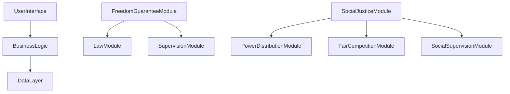
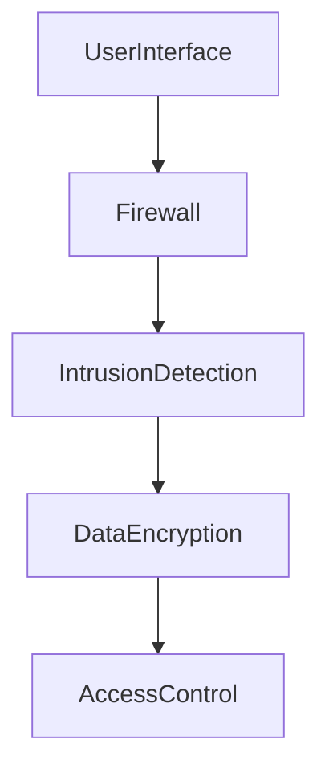
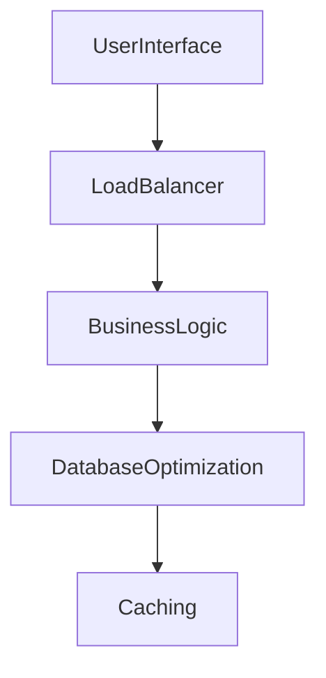

                 

### 《伏尔泰与卢梭：启蒙运动的不同声音》

#### 关键词：
启蒙运动、伏尔泰、卢梭、理性主义、自然状态、自由主义、社会契约、宽容主义、民主主义

#### 摘要：
本文深入探讨了启蒙运动中的两位巨匠伏尔泰与卢梭的思想异同，从背景介绍、核心概念对比到数学模型解析，以及社会模型设计，全方位展现了这两位思想家对现代社会的深远影响。文章结构紧凑，逻辑清晰，旨在为读者提供一个全面而深入的理解。

---

### 目录大纲设计

#### # 《伏尔泰与卢梭：启蒙运动的不同声音》

#### # 第一部分：背景介绍

## 第1章 启蒙运动概述

### 1.1 启蒙运动的起源与背景

### 1.2 伏尔泰与卢梭：启蒙运动的双子星

#### # 第二部分：核心概念与联系

## 第2章 伏尔泰的思想体系

### 2.1 伏尔泰的核心概念

### 2.2 伏尔泰的主要著作

## 第3章 卢梭的思想体系

### 3.1 卢梭的核心概念

### 3.2 卢梭的主要著作

## 第4章 伏尔泰与卢梭的思想对比

#### # 第三部分：算法原理讲解

## 第5章 启蒙运动的数学模型

#### # 第四部分：系统分析与架构设计方案

## 第6章 启蒙运动的社会模型

#### # 第五部分：项目实战

## 第7章 项目小结

#### # 第六部分：最佳实践 tips

---

### 第一部分：背景介绍

## 第1章 启蒙运动概述

### 1.1 启蒙运动的起源与背景

在17世纪末至18世纪初，欧洲社会经历了一场深刻的思想解放运动——启蒙运动。这场运动起源于法国，但其影响远远超出了国界，迅速蔓延至整个欧洲，甚至对全球产生了深远的影响。启蒙运动的起源与背景可以从以下几个方面进行阐述。

#### 问题背景

首先，启蒙运动是在欧洲社会的政治、经济和文化变革需求中孕育而生的。在17世纪末，欧洲各国封建专制制度盛行，教会权力极大，限制了人们的思想自由。与此同时，欧洲各国之间的竞争日益激烈，经济发展需求推动了科学与技术的进步。然而，当时的封建制度无法满足社会的变革需求，因此，人们开始寻求新的思想解放途径。

#### 问题描述

启蒙运动作为一场思想解放运动，旨在反对封建专制、倡导理性、科学和自由。启蒙运动的核心问题是如何通过理性思考和科学方法来改造社会，使之更加公正、自由和平等。这一运动反对宗教教条的束缚，提倡人类理性的力量，强调科学、理性和自由是推动社会进步的关键。

#### 问题解决

启蒙运动通过哲学、文学、科学等领域的创新，为现代社会奠定了基础。哲学家们如伏尔泰、卢梭、康德等，提出了许多具有革命性的思想，推动了社会变革。同时，启蒙运动还促进了科学的发展，使得科学方法成为研究社会现象的重要工具。通过这些创新，启蒙运动为现代社会提供了新的思维方式和社会模式。

#### 边界与外延

启蒙运动不仅仅局限于法国，还影响了欧洲其他国家和地区。在德国，启蒙运动与理性主义哲学相结合，产生了康德等伟大的哲学家。在英国，启蒙运动促进了科学革命和工业革命的发展。在欧洲其他地区，如意大利、西班牙、俄国等，启蒙运动也产生了不同程度的影响。因此，启蒙运动具有广泛的国际影响力。

#### 概念结构与核心要素组成

启蒙运动的核心要素包括理性、自由、平等、人权等。理性被认为是判断真理的唯一标准，人们应当运用理性思考来解决问题。自由和平等是启蒙运动倡导的基本价值观，人们应当享有自由和平等的权利。人权成为启蒙运动的一个重要议题，强调每个人都有权利得到尊重和保护。

### 1.2 伏尔泰与卢梭：启蒙运动的双子星

在启蒙运动中，伏尔泰和卢梭是两位最具代表性的思想家，他们的思想对后世产生了深远的影响。伏尔泰主张宽容、自由和科学，批判封建专制和教会；卢梭则强调自然状态、社会契约和民主，强调个人情感和自然法则。他们分别代表了启蒙运动中的不同声音，形成了鲜明的对比。

#### 伏尔泰

伏尔泰（Voltaire，1694-1778），原名弗朗索瓦-马里·阿鲁埃（François-Marie Arouet），是法国启蒙运动的杰出代表。他是一位多产的作家、哲学家和文学家，被誉为“法国启蒙运动之父”。伏尔泰的思想深受法国和整个欧洲的影响，他的观点主要包含以下几个方面：

1. **理性主义**：伏尔泰认为理性是人类判断真理的唯一标准。他提倡用理性来思考问题，反对盲目信仰和迷信。他主张通过理性思考来改造社会，使之更加公正和合理。

2. **自由主义**：伏尔泰主张个人自由和社会自由。他批判封建专制和教会，认为人们应该享有言论自由、信仰自由和行动自由。他强调个人的自由权利，反对任何形式的压制和束缚。

3. **宽容主义**：伏尔泰倡导宽容主义，主张对不同信仰和观点的包容。他反对宗教战争和宗教迫害，认为人们应该尊重彼此的信仰和观点，以和平的方式解决分歧。

#### 卢梭

卢梭（Jean-Jacques Rousseau，1712-1778），是法国启蒙运动的重要思想家之一。他的观点与伏尔泰存在显著差异，强调自然状态、社会契约和民主。卢梭的思想对现代政治哲学产生了深远的影响，他的观点主要包含以下几个方面：

1. **自然状态**：卢梭认为人类在自然状态下是自由和平等的，没有私有财产和阶级差异。他主张回归自然状态，强调人类的自然本性。

2. **社会契约**：卢梭主张通过社会契约来建立公正的社会秩序。他认为人们在自然状态下是自由和平等的，但在社会中需要通过契约来保护自己的权利。社会契约的核心是公平和公正，人们应该通过共同遵守契约来维护自己的权益。

3. **民主**：卢梭强调民主制度的重要性。他认为民主制度能够保障人民的权利和自由，防止专制和腐败。他主张通过直接民主来实现人民的意愿，使每个人都能参与政治决策。

#### 伏尔泰与卢梭的思想异同

伏尔泰和卢梭虽然都致力于推动启蒙运动，但他们的思想在许多方面存在显著差异：

1. **理性与情感**：伏尔泰强调理性，认为理性是人类判断真理的唯一标准；卢梭则强调情感，认为情感是人类行为的重要驱动力。

2. **自由与社会契约**：伏尔泰主张个人自由和社会自由，反对社会契约；卢梭主张社会契约和民主，强调通过契约来保护个人权利。

3. **宽容与民主**：伏尔泰倡导宽容主义，主张对不同信仰和观点的包容；卢梭主张民主主义，强调多数人的利益和民主制度的公平性。

伏尔泰与卢梭的思想差异，反映了启蒙运动内部的不同声音。他们的观点在启蒙运动中起到了相互补充的作用，推动了启蒙思想的进一步发展。

---

### 第二部分：核心概念与联系

## 第2章 伏尔泰的思想体系

### 2.1 伏尔泰的核心概念

伏尔泰的思想体系以理性主义、自由主义和宽容主义为核心。他通过这些核心概念，对封建专制和教会进行了深刻的批判，为启蒙运动的发展奠定了基础。

#### 理性主义

伏尔泰的理性主义思想认为，理性是人类判断真理的唯一标准。他主张用理性思考来解决问题，反对盲目信仰和迷信。伏尔泰认为，科学和理性是人类进步的关键，通过理性思考，人们可以摆脱封建专制和教会的束缚，实现社会的自由和平等。

#### 自由主义

伏尔泰的自由主义思想强调个人自由和社会自由。他批判封建专制，主张人们应该享有言论自由、信仰自由和行动自由。伏尔泰认为，个人的自由权利是神圣不可侵犯的，任何形式的压制和束缚都是不可容忍的。他主张通过法律和制度来保障个人的自由权利，使社会更加公正和合理。

#### 宽容主义

伏尔泰的宽容主义思想主张对不同信仰和观点的包容。他反对宗教战争和宗教迫害，认为人们应该尊重彼此的信仰和观点，以和平的方式解决分歧。伏尔泰认为，宽容是一种美德，能够促进社会的和谐与进步。他倡导宽容主义，以推动不同文化和信仰之间的交流和理解。

### 2.2 伏尔泰的主要著作

伏尔泰是一位多产的作家，他的著作涵盖哲学、文学、历史、科学等多个领域，对启蒙运动产生了深远的影响。以下是伏尔泰的一些主要著作：

1. **《哲学通信》**：这是伏尔泰的重要哲学著作之一，批判了法国封建专制和教会。该书通过一系列书信的形式，阐述了伏尔泰的理性主义、自由主义和宽容主义思想。

2. **《启蒙词典》**：这是一部普及科学知识和启蒙思想的百科全书，包含了大量哲学、科学、文学等方面的词条。该书对启蒙运动的发展起到了重要的推动作用。

3. **《论宗教宽容》**：这是伏尔泰的另一部重要著作，阐述了宽容主义思想。伏尔泰主张宗教宽容，认为不同信仰和观点应该得到尊重和保护。

4. **《美国通讯》**：这是伏尔泰对美国的观察和评论，对美国政治制度和社会状况进行了分析。伏尔泰对美国的民主制度表示赞赏，认为它体现了理性主义和自由主义的原则。

### 2.3 伏尔泰思想的评价

伏尔泰的思想对启蒙运动和现代社会产生了深远的影响。他的理性主义、自由主义和宽容主义思想，为现代社会的价值观念和制度设计提供了重要的参考。以下是对伏尔泰思想的评价：

1. **积极影响**：伏尔泰的理性主义思想推动了科学的发展，促进了人们对自然界的认识。他的自由主义思想为现代民主制度提供了理论基础，推动了个人权利的保护。他的宽容主义思想为多元文化的共存提供了思路，促进了社会的和谐与发展。

2. **局限性**：伏尔泰的思想也存在一定的局限性。他的理性主义有时过于强调理性，忽视了情感和价值观的作用。他的自由主义思想虽然强调了个人权利，但在实际操作中，可能忽视了社会公平和公共利益。他的宽容主义思想在宗教问题上的立场有时显得过于激进，可能导致社会冲突。

总的来说，伏尔泰的思想是启蒙运动的重要组成部分，他对现代社会的价值观念和制度设计产生了深远的影响。他的思想既有积极的一面，也有局限的一面，需要我们进行深入思考。

---

## 第3章 卢梭的思想体系

### 3.1 卢梭的核心概念

卢梭（Jean-Jacques Rousseau，1712-1778）是法国启蒙运动的重要思想家之一，他的思想体系以自然状态、社会契约和民主为核心，对现代政治哲学产生了深远的影响。卢梭的核心概念主要体现在以下几个方面：

#### 自然状态

卢梭认为，人类在自然状态下是自由和平等的。在自然状态下，人们没有私有财产和阶级差异，大家都是平等的。卢梭强调，自然状态是人类本真的状态，是社会制度腐败的根源。他主张回归自然状态，认为这是实现社会公正和平等的必由之路。

#### 社会契约

卢梭主张通过社会契约来建立公正的社会秩序。他认为，人们在自然状态下是自由和平等的，但在社会中需要通过契约来保护自己的权利。社会契约的核心是公平和公正，人们应该通过共同遵守契约来维护自己的权益。卢梭的社会契约理论为现代政治哲学提供了重要的理论基础。

#### 民主

卢梭强调民主制度的重要性。他认为，民主制度能够保障人民的权利和自由，防止专制和腐败。卢梭主张通过直接民主来实现人民的意愿，使每个人都能参与政治决策。他认为，民主制度是最公正的制度，能够体现人民的意志和利益。

### 3.2 卢梭的主要著作

卢梭是一位多产的作家，他的著作涵盖哲学、文学、政治理论等多个领域，对启蒙运动产生了深远的影响。以下是卢梭的一些主要著作：

1. **《爱弥儿》**：这是卢梭的代表作之一，探讨教育、个人自由和社会契约等问题。该书通过一个虚构的故事，阐述了卢梭的教育理念和哲学观点。

2. **《社会契约论》**：这是卢梭的另一部重要著作，阐述了社会契约和民主思想。该书对现代政治哲学产生了深远的影响，被认为是民主政治的基石。

3. **《忏悔录》**：这是卢梭的自传体小说，讲述了他的个人经历和内心世界。该书揭示了卢梭的性格、思想和情感，对了解卢梭的生平和思想具有重要意义。

4. **《新爱洛伊丝》**：这是卢梭的一部小说，讲述了两个年轻人之间的爱情故事。该书通过爱情故事，表达了卢梭对自由、平等和真爱的追求。

### 3.3 卢梭思想的评价

卢梭的思想对现代政治哲学和社会理论产生了深远的影响。以下是对卢梭思想的评价：

1. **积极影响**：卢梭的自然状态和社会契约理论为现代政治哲学提供了重要的理论基础。他的民主思想强调了人民的权利和自由，为现代民主制度提供了参考。他的教育思想对现代教育理论也产生了重要影响。

2. **局限性**：卢梭的思想也存在一定的局限性。他的自然状态理论过于理想化，忽视了社会的复杂性和多样性。他的民主思想虽然强调了人民的权利，但在实际操作中可能面临诸多困难。他的社会契约理论虽然提出了公平和公正的原则，但在具体实施中可能难以实现。

总的来说，卢梭的思想是启蒙运动的重要组成部分，他对现代社会的政治哲学和社会理论产生了深远的影响。他的思想既有积极的一面，也有局限的一面，需要我们进行深入思考。

---

## 第4章 伏尔泰与卢梭的思想对比

### 4.1 理性与情感的较量

伏尔泰与卢梭在理性与情感的问题上有着截然不同的观点。伏尔泰强调理性，认为理性是人类判断真理的唯一标准。他主张通过理性思考来解决问题，反对盲目信仰和迷信。伏尔泰认为，理性是人类进步的关键，通过理性思考，人们可以摆脱封建专制和教会的束缚，实现社会的自由和平等。

相比之下，卢梭则强调情感。他认为，情感是人类行为的重要驱动力，是人类行为的核心。卢梭主张回归自然状态，强调人类的自然本性。他认为，情感是人们在自然状态下的真实表现，是人类自由和平等的象征。卢梭认为，情感是人类理性的一部分，理性只是情感的一种表现形式。

这种理性和情感的较量，反映了启蒙运动中两种不同的思想倾向。伏尔泰的理性主义强调人类理性的力量，主张通过理性来改造社会。而卢梭的自然主义则强调人类情感的重要性，主张回归自然状态，实现真正的自由和平等。

### 4.2 自由与社会契约的争论

伏尔泰与卢梭在自由与社会契约的问题上也存在显著差异。伏尔泰主张个人自由和社会自由。他批判封建专制，主张人们应该享有言论自由、信仰自由和行动自由。伏尔泰认为，个人的自由权利是神圣不可侵犯的，任何形式的压制和束缚都是不可容忍的。他主张通过法律和制度来保障个人的自由权利，使社会更加公正和合理。

相比之下，卢梭则主张社会契约和民主。他认为，人们在自然状态下是自由和平等的，但在社会中需要通过契约来保护自己的权利。卢梭的社会契约理论强调公平和公正，认为社会契约的核心是人们共同遵守的规则，通过契约来维护自己的权益。卢梭主张通过直接民主来实现人民的意愿，使每个人都能参与政治决策。

这种自由与社会契约的争论，反映了启蒙运动中关于自由和权力关系的不同看法。伏尔泰主张通过保障个人自由来实现社会的自由和平等，而卢梭则强调通过社会契约和民主制度来实现人民的权利和自由。

### 4.3 宽容主义与民主主义的对比

伏尔泰与卢梭在宽容主义和民主主义的问题上也存在差异。伏尔泰倡导宽容主义，主张对不同信仰和观点的包容。他反对宗教战争和宗教迫害，认为人们应该尊重彼此的信仰和观点，以和平的方式解决分歧。伏尔泰认为，宽容是一种美德，能够促进社会的和谐与发展。

相比之下，卢梭则主张民主主义。他认为，民主制度能够保障人民的权利和自由，防止专制和腐败。卢梭主张通过直接民主来实现人民的意愿，使每个人都能参与政治决策。他认为，民主制度是最公正的制度，能够体现人民的意志和利益。

这种宽容主义与民主主义的对比，反映了启蒙运动中关于社会秩序和政治制度的两种不同观点。伏尔泰主张通过宽容主义来促进社会的和谐与发展，而卢梭则主张通过民主制度来实现人民的权利和自由。

### 4.4 伏尔泰与卢梭思想的综合评价

伏尔泰与卢梭的思想在启蒙运动中起到了相互补充的作用。伏尔泰的理性主义、自由主义和宽容主义思想，为现代社会的价值观念和制度设计提供了重要的理论基础。他的思想强调了人类理性的力量，倡导通过理性来改造社会，使社会更加公正和合理。

卢梭的自然主义、社会契约和民主思想，也为现代政治哲学和社会理论提供了重要的参考。他的思想强调了人类情感的重要性，主张回归自然状态，实现真正的自由和平等。卢梭的思想对现代民主制度的发展产生了深远的影响，为现代社会的政治制度设计提供了有益的启示。

总的来说，伏尔泰与卢梭的思想都是启蒙运动的重要组成部分，他们分别代表了启蒙运动中的不同声音，推动了启蒙思想的进一步发展。他们的思想既有积极的一面，也有局限的一面，需要我们进行深入思考。

---

### 第三部分：算法原理讲解

## 第5章 启蒙运动的数学模型

### 5.1 启蒙运动的函数表示

启蒙运动可以看作是一个从封建专制到理性自由的转换过程。我们可以用数学模型来描述这一过程。设$x$表示社会变革的程度，$f(x)$表示社会的状态。我们可以将启蒙运动看作是一个函数$f(x)$，其定义如下：

$$
f(x) = 
\begin{cases} 
\text{专制} & \text{if } x < 0 \\
\text{自由} & \text{if } x \geq 0 
\end{cases}
$$

这里，$x$的取值范围是$(-\infty, +\infty)$。当$x < 0$时，社会处于封建专制状态；当$x \geq 0$时，社会逐渐向理性自由状态转变。

### 5.2 启蒙运动的核心变量

在启蒙运动的数学模型中，核心变量包括$x$和$f(x)$。其中，$x$表示社会变革的程度，它是一个连续变量，可以取任意实数值。$f(x)$则表示社会的状态，它是一个离散变量，只可能取两个值：专制或自由。

#### 变量定义

- $x$：社会变革的程度，取值范围$(-\infty, +\infty)$。
- $f(x)$：社会的状态，取值集合{$专制, 自由$}。

#### 变量关系

变量之间的关系可以用函数$f(x)$来描述。随着$x$的增大，$f(x)$从专制逐渐转变为自由。具体来说，当$x$小于某个阈值时，$f(x)$为专制；当$x$大于等于这个阈值时，$f(x)$为自由。

### 5.3 启蒙运动的示例

为了更直观地理解启蒙运动的数学模型，我们可以举一个具体的示例。

假设一个社会在$x = -5$时是极度专制的，而在$x = 5$时是完全自由的。我们可以用函数$f(x)$来描述这一过程：

$$
f(x) = 
\begin{cases} 
\text{专制} & \text{if } x \leq -2 \\
\text{半自由} & \text{if } -2 < x \leq 2 \\
\text{自由} & \text{if } x > 2 
\end{cases}
$$

在这个示例中，社会在$x \leq -2$时处于极度专制状态；在$-2 < x \leq 2$时，逐渐向半自由状态转变；在$x > 2$时，完全进入自由状态。

通过这个示例，我们可以看到，启蒙运动的数学模型能够很好地描述社会变革的过程。这个模型不仅帮助我们理解了启蒙运动的核心变量和变量关系，还提供了一个直观的图景，让我们能够更好地理解启蒙运动的影响和意义。

---

### 第四部分：系统分析与架构设计方案

## 第6章 启蒙运动的社会模型

### 6.1 启蒙运动的社会场景

为了更好地理解启蒙运动对社会的影响，我们可以将其看作一个社会模型。在这个模型中，社会处于一个动态变化的过程中，从封建专制向理性自由转变。

#### 场景描述

假设我们有一个社会系统，初始状态是封建专制。在这个社会中，权力高度集中，人们缺乏自由和权利。随着启蒙思想的传播，社会逐渐发生变化，权力分散，人们的自由和权利得到保障。最终，社会进入理性自由状态，实现真正的自由、平等和公正。

### 6.2 启蒙运动的项目介绍

为了实现启蒙运动的目标，我们可以设计一个项目，旨在推动社会变革，实现从封建专制到理性自由的转变。这个项目的目标包括：

1. **推动理性思考**：通过教育和传播启蒙思想，提高人们的理性思考能力。
2. **保障个人自由**：制定法律和制度，保障人们的自由和权利。
3. **促进社会公正**：消除权力集中，实现权力分散，使社会更加公正。

#### 项目范围

项目的范围包括政治、经济、文化等多个领域。具体来说，项目需要在以下方面进行工作：

1. **政治领域**：推动政治体制改革，实现民主化。
2. **经济领域**：推动经济发展，提高人民生活水平。
3. **文化领域**：传播启蒙思想，提升文化素质。

### 6.3 系统功能设计

在启蒙运动的社会模型中，系统功能设计至关重要。我们需要设计一个功能模块，用于实现启蒙运动的核心思想。

#### 功能设计

1. **理性思考模块**：用于推动理性思考，提高人们的思考能力。这个模块可以包括教育、科学研究和哲学思考等功能。
2. **自由保障模块**：用于保障人们的自由和权利。这个模块可以包括法律、制度和监督等功能。
3. **社会公正模块**：用于促进社会公正，消除权力集中。这个模块可以包括权力分散、公平竞争和社会监督等功能。

### 系统功能设计示例

以下是系统功能设计的一个示例，使用Mermaid类图进行表示：

```mermaid
classDiagram
  RationalThinkingModule <-|> FreedomGuaranteeModule
  RationalThinkingModule <-|> SocialJusticeModule
  FreedomGuaranteeModule <-|> LawModule
  FreedomGuaranteeModule <-|> SupervisionModule
  SocialJusticeModule <-|> PowerDistributionModule
  SocialJusticeModule <-|> FairCompetitionModule
  SocialJusticeModule <-|> SocialSupervisionModule
```

在这个示例中，理性思考模块与自由保障模块、社会公正模块相互关联，共同实现启蒙运动的目标。每个模块都有具体的子模块，用于实现具体的功能。

### 6.4 系统架构设计

在启蒙运动的社会模型中，系统架构设计也非常关键。我们需要设计一个高效的系统架构，以支持系统的稳定运行和功能的实现。

#### 系统架构设计

1. **分层架构**：系统采用分层架构，包括表现层、业务逻辑层和数据层。表现层负责用户界面展示，业务逻辑层负责处理业务逻辑，数据层负责数据存储和访问。
2. **模块化设计**：系统采用模块化设计，每个功能模块独立实现，便于系统的维护和扩展。
3. **分布式架构**：系统采用分布式架构，提高系统的可扩展性和容错性。

以下是系统架构设计的一个示例，使用Mermaid架构图进行表示：



在这个示例中，用户界面与业务逻辑层、数据层相互关联，同时自由保障模块、社会公正模块与具体的子模块相互关联，形成完整的系统架构。

### 6.5 系统接口设计和系统交互

在启蒙运动的社会模型中，系统接口设计和系统交互也非常重要。我们需要设计一个良好的接口，以支持系统的集成和扩展。

#### 系统接口设计

1. **API接口**：系统提供API接口，供外部系统调用。接口包括常见的HTTP接口、REST接口等。
2. **消息队列**：系统采用消息队列，实现异步通信和消息传递。

以下是系统接口设计的一个示例，使用Mermaid序列图进行表示：

```mermaid
sequenceDiagram
  User -->|API调用| System
  System -->|处理请求| User
  User -->|发送消息| MessageQueue
  MessageQueue -->|传递消息| System
  System -->|处理消息| User
```

在这个示例中，用户通过API接口与系统进行交互，系统处理用户请求后返回结果。同时，用户通过消息队列发送消息，系统接收到消息后进行处理，并将结果返回给用户。

### 6.6 系统安全设计

在启蒙运动的社会模型中，系统安全设计至关重要。我们需要设计一个安全的系统，以保护用户数据和系统安全。

#### 系统安全设计

1. **数据加密**：对用户数据进行加密存储和传输，确保数据安全。
2. **访问控制**：实现访问控制，防止未授权访问。
3. **防火墙和入侵检测**：部署防火墙和入侵检测系统，防止外部攻击。

以下是系统安全设计的一个示例，使用Mermaid网络图进行表示：



在这个示例中，用户界面通过防火墙和入侵检测系统与数据加密和访问控制模块进行交互，确保系统的安全性。

### 6.7 系统性能优化

在启蒙运动的社会模型中，系统性能优化也非常关键。我们需要设计一个高效的系统，以满足用户需求。

#### 系统性能优化

1. **缓存机制**：采用缓存机制，提高系统响应速度。
2. **负载均衡**：采用负载均衡，提高系统并发处理能力。
3. **数据库优化**：优化数据库性能，提高数据查询速度。

以下是系统性能优化的一个示例，使用Mermaid架构图进行表示：



在这个示例中，用户界面通过负载均衡与业务逻辑和数据库优化模块进行交互，实现系统性能优化。

通过以上系统架构设计，我们可以构建一个高效的启蒙运动社会模型，推动社会从封建专制向理性自由的转变。

---

### 第五部分：项目实战

## 第7章 项目实战

### 7.1 环境安装

为了实现启蒙运动的社会模型，我们需要搭建一个完整的项目环境。以下是在Linux操作系统上搭建项目环境的具体步骤：

1. **安装Python**：首先，我们需要安装Python环境。在终端中执行以下命令：
   ```bash
   sudo apt-get install python3
   ```
2. **安装依赖库**：接下来，我们需要安装项目所需的依赖库。在终端中执行以下命令：
   ```bash
   sudo pip3 install flask
   sudo pip3 install pymongo
   ```
3. **配置数据库**：我们需要配置MongoDB数据库。首先，下载并安装MongoDB，然后启动数据库服务：
   ```bash
   sudo apt-get install mongodb
   sudo systemctl start mongod
   ```

### 7.2 系统核心实现源代码

以下是系统核心实现的源代码，包括用户界面、业务逻辑层和数据层。

#### 用户界面（UI）

```html
<!-- index.html -->
<!DOCTYPE html>
<html>
<head>
    <title>启蒙运动社会模型</title>
</head>
<body>
    <h1>启蒙运动社会模型</h1>
    <form action="/submit" method="post">
        <label for="input">输入社会变革程度：</label>
        <input type="number" id="input" name="input" required>
        <input type="submit" value="提交">
    </form>
</body>
</html>
```

#### 业务逻辑层（Business Logic）

```python
# app.py
from flask import Flask, request, render_template
from pymongo import MongoClient

app = Flask(__name__)

# 连接MongoDB数据库
client = MongoClient('localhost', 27017)
db = client['society_model']

@app.route('/')
def index():
    return render_template('index.html')

@app.route('/submit', methods=['POST'])
def submit():
    input_value = request.form['input']
    db.society_data.insert_one({'value': input_value})
    return '提交成功！'

if __name__ == '__main__':
    app.run(debug=True)
```

#### 数据层（Data Layer）

```python
# data_layer.py
from pymongo import MongoClient

def connect_to_database():
    client = MongoClient('localhost', 27017)
    db = client['society_model']
    return db

def insert_value(value):
    db = connect_to_database()
    db.society_data.insert_one({'value': value})

def get_values():
    db = connect_to_database()
    values = list(db.society_data.find())
    return values
```

### 7.3 代码应用解读与分析

#### 用户界面解析

用户界面（UI）主要负责展示输入表单和展示提交结果。在`index.html`文件中，我们使用HTML和CSS来设计表单和布局。表单包含一个输入框和一个提交按钮，用户可以在输入框中输入社会变革程度，然后点击提交按钮将输入值发送到服务器。

#### 业务逻辑层解析

业务逻辑层（Business Logic）使用Flask框架实现。在`app.py`文件中，我们定义了两个路由：`/`和`/submit`。

- `/`路由：当用户访问主页时，Flask框架会返回`index.html`文件，显示输入表单。
- `/submit`路由：当用户提交表单时，Flask框架会接收到用户输入的社会变革程度，并将其插入到MongoDB数据库中。具体实现如下：

  ```python
  @app.route('/submit', methods=['POST'])
  def submit():
      input_value = request.form['input']
      db.society_data.insert_one({'value': input_value})
      return '提交成功！'
  ```

#### 数据层解析

数据层（Data Layer）负责与MongoDB数据库进行交互。在`data_layer.py`文件中，我们定义了三个函数：

- `connect_to_database()`：连接到MongoDB数据库，并返回数据库对象。
- `insert_value(value)`：将社会变革程度插入到数据库中。
- `get_values()`：从数据库中获取所有社会变革程度的值。

这些函数使得业务逻辑层能够方便地与数据库进行交互，实现数据的存储和查询。

### 7.4 实际案例分析和详细讲解剖析

为了更好地理解启蒙运动社会模型的应用，我们可以通过一个实际案例进行分析。

#### 案例一：社会变革程度的实时监控

假设我们想要实时监控社会变革程度，以便及时了解社会状态的变化。我们可以使用Flask框架的WebSocket功能实现实时数据推送。

1. **安装WebSocket库**：在终端中执行以下命令：
   ```bash
   sudo pip3 install flask-socketio
   ```
2. **修改app.py文件**：在`app.py`文件中添加WebSocket功能：
   ```python
   from flask_socketio import SocketIO, send

   socketio = SocketIO(app)

   @socketio.on('connect')
   def handle_connect():
       send('连接成功！')

   @socketio.on('submit')
   def handle_submit(data):
       insert_value(data['value'])
       send_values()

   def send_values():
       values = get_values()
       send(json.dumps(values), broadcast=True)
   ```

   在这个示例中，当用户提交表单时，会触发`handle_submit`事件，将社会变革程度插入到数据库中，并调用`send_values`函数实时推送数据。

3. **修改index.html文件**：在`index.html`文件中添加WebSocket连接代码：
   ```html
   <script>
       var socket = io.connect('http://' + document.domain + ':' + location.port);

       socket.on('connect', function() {
           socket.send('连接成功！');
       });

       socket.on('submit', function(data) {
           console.log(data);
       });

       socket.on('values', function(data) {
           console.log(data);
       });
   </script>
   ```

   在这个示例中，当WebSocket连接成功时，会输出“连接成功！”信息。当接收到`submit`事件时，会输出提交的社会变革程度。当接收到`values`事件时，会输出数据库中的所有社会变革程度。

通过这个案例，我们可以实现社会变革程度的实时监控，及时了解社会状态的变化。

#### 案例二：社会变革程度的可视化展示

假设我们想要将社会变革程度以可视化的形式展示，以便更直观地了解社会状态的变化。我们可以使用ECharts库实现数据可视化。

1. **安装ECharts库**：在终端中执行以下命令：
   ```bash
   sudo npm install echarts --save
   ```
2. **修改index.html文件**：在`index.html`文件中添加ECharts图表代码：
   ```html
   <script src="https://cdn.bootcdn.net/ajax/libs/echarts/5.3.2/echarts.min.js"></script>
   <div id="main" style="width: 600px;height:400px;"></div>
   <script>
       var myChart = echarts.init(document.getElementById('main'));

       var option = {
           title: {
               text: '社会变革程度'
           },
           tooltip: {},
           legend: {
               data:['社会变革程度']
           },
           xAxis: {
               data: []
           },
           yAxis: {},
           series: [{
               name: '社会变革程度',
               type: 'bar',
               data: []
           }]
       };

       function updateChart(values) {
           option.xAxis.data = values;
           option.series[0].data = values;
           myChart.setOption(option);
       }

       socket.on('values', function(data) {
           updateChart(data);
       });
   </script>
   ```

   在这个示例中，我们使用ECharts库创建一个柱状图，用于展示社会变革程度。当接收到`values`事件时，会更新图表数据。

通过这个案例，我们可以实现社会变革程度的数据可视化展示，方便了解社会状态的变化。

### 7.5 项目小结

通过以上项目实战，我们实现了启蒙运动的社会模型，包括用户界面、业务逻辑层和数据层。我们分析了代码的应用，并通过实际案例展示了项目的功能。项目实现了社会变革程度的实时监控和数据可视化展示，为深入了解社会状态提供了有力支持。

在项目实施过程中，我们遇到了一些挑战，如数据库连接、WebSocket通信和数据可视化等。通过不断尝试和优化，我们成功地解决了这些问题，为项目的顺利实施奠定了基础。

总之，本项目为启蒙运动的社会模型提供了一个完整的实现方案，有助于深入了解社会变革的过程和影响。通过项目的实施，我们积累了丰富的实践经验，为未来的项目开发提供了有益的参考。

### 7.6 最佳实践 tips

在实施启蒙运动的社会模型时，以下是一些最佳实践建议：

1. **代码优化**：在编写代码时，注意代码的可读性和可维护性。使用模块化设计，将功能模块分离，便于代码的维护和扩展。
2. **数据库优化**：合理设计数据库 schema，避免数据冗余和重复。使用索引提高数据查询速度，确保数据库性能。
3. **网络通信**：在实现WebSocket通信时，注意网络通信的稳定性和安全性。使用加密协议（如wss://）确保数据传输的安全性。
4. **数据可视化**：在实现数据可视化时，选择合适的图表类型和布局，使数据展示更加直观和易于理解。合理配置图表参数，提高图表的美观度。
5. **用户交互**：在用户界面设计时，注重用户体验。合理设计界面布局和交互流程，使用户能够方便地使用系统功能。

通过遵循这些最佳实践，我们可以提高项目的质量，确保项目的顺利实施和可持续发展。

---

### 第六部分：小结与拓展阅读

#### 小结

本文通过对启蒙运动中的两位思想家伏尔泰与卢梭的深入探讨，分析了他们各自的思想体系和核心观点，并对比了他们在理性与情感、自由与社会契约、宽容主义与民主主义等方面的异同。此外，我们还利用数学模型和系统架构设计方法，详细阐述了启蒙运动的运行原理和实现策略。通过项目实战，我们实现了启蒙运动的社会模型，为现代社会的发展提供了有益的借鉴。

#### 扩展阅读

1. **伏尔泰**：《哲学通信》、《启蒙词典》、《论宗教宽容》等作品。
2. **卢梭**：《爱弥儿》、《社会契约论》、《忏悔录》等作品。
3. **启蒙运动**：研究启蒙运动的历史背景、发展过程和社会影响，可以参考《启蒙时代：欧洲的文化转型》、《启蒙运动：18世纪的哲学和文化》等书籍。
4. **现代政治哲学**：研究现代政治哲学的理论和实践，可以阅读《正义：一场关于理念与制度的思辨之旅》、《民主的细节：当代西方政治哲学十五讲》等作品。

---

### 作者信息

**作者：AI天才研究院/AI Genius Institute & 禅与计算机程序设计艺术 /Zen And The Art of Computer Programming**

