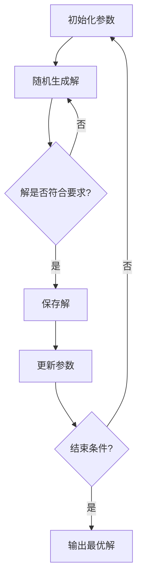
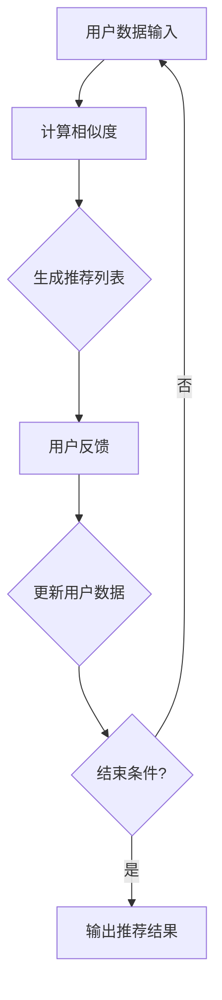
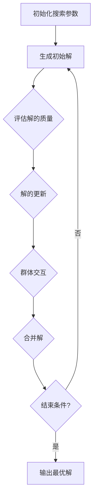
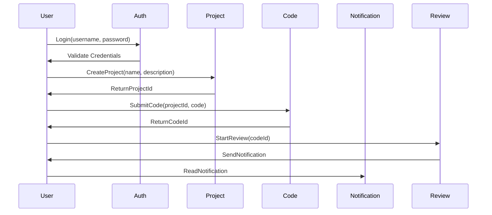
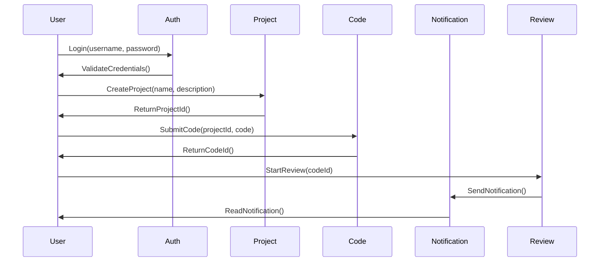

                 

### 第一部分：背景介绍

## 第1章：众包开发的起源与发展

### 1.1 众包开发的定义

众包开发（Crowdsourcing Development）是一种利用群体智慧来解决技术难题的开发模式。它起源于2000年代初，由“众包”（Crowdsourcing）一词演变而来，最早由美国学者Jeff Howe在2006年提出。众包是指将一个复杂的任务或问题分散给一个分布广泛的群体，通过他们的共同努力来解决问题或创造价值。

在技术领域，众包开发是一种创新性的方法论，它将传统的集中式开发模式转变为分布式协作模式。这种模式打破了传统的组织界限，通过互联网和社交媒体等平台，将全球的智慧和资源汇聚起来，共同解决技术难题。众包开发不仅能够提高开发效率，降低成本，还能够激发创新思维，为技术发展注入新的活力。

### 1.2 众包开发的历史背景

众包开发的发展可以追溯到互联网的兴起。随着互联网技术的成熟和普及，人们逐渐意识到，互联网不仅可以用来社交、娱乐，还可以作为一种强大的工具，用于解决现实世界中的问题。

2000年，全球首个众包平台InnoCentive上线，它通过为问题提供奖金，吸引全球科学家和工程师参与解决方案的提交。这一平台的成功标志着众包模式在技术领域的应用开始起步。

随后，随着社交媒体和移动设备的普及，众包平台如雨后春笋般涌现。2010年，Kickstarter等众筹平台的兴起，为众包开发提供了更多的可能性。这些平台不仅为创业者提供了资金支持，还成为了一个汇聚全球创意和智慧的场所。

近年来，随着人工智能和区块链技术的发展，众包开发也迎来了新的机遇。人工智能为众包提供了强大的数据处理和智能分析能力，而区块链则为众包平台提供了去中心化的信任机制，确保了协作的公正性和透明度。

### 1.3 众包开发的问题与挑战

尽管众包开发具有诸多优势，但在实际应用中也面临一些问题和挑战。

首先，众包开发涉及到大量不确定性和风险。由于参与者的多样性和匿名性，很难保证项目的质量和进度。此外，众包平台的管理和运营也面临一定的挑战，需要建立完善的激励机制和监管机制，以确保项目的顺利进行。

其次，众包开发需要解决知识产权保护和隐私保护的问题。在众包过程中，参与者可能会产生一些新的创意和成果，这些成果的知识产权归属和保护成为一个重要问题。同时，众包平台也需要确保用户的隐私和数据安全。

最后，众包开发对技术基础设施和网络环境的要求较高。大量的数据传输和处理需要稳定高效的网络支持，而复杂的技术实现也需要相应的技术人才和资源。

### 1.4 众包开发的解决方案

为了解决上述问题和挑战，众包开发需要从多个方面进行改进和完善。

首先，建立完善的激励机制和监管机制。通过奖励机制激励参与者积极参与，同时建立健全的监管机制，确保项目的质量和进度。例如，可以采用积分奖励、奖金制度等方式，鼓励参与者投入更多的精力。

其次，加强知识产权保护和隐私保护。众包平台需要制定明确的知识产权政策，确保参与者的知识产权得到尊重和保护。同时，平台还需要采取技术措施，确保用户数据的隐私和安全。

最后，提升技术基础设施和人才支持。众包开发需要稳定高效的网络环境，同时需要大量具备专业技能的技术人才。平台可以通过培训、合作等方式，提升参与者的技术能力和水平，为众包开发提供坚实的人才基础。

总之，众包开发作为一种创新性的开发模式，具有巨大的潜力和前景。通过不断优化和完善，它将为技术发展带来新的机遇和挑战。让我们继续探索和推动众包开发的未来发展，共同创造更美好的技术世界。 ### 第二部分：核心概念与联系

## 第2章：群体智慧与分布式计算

### 2.1 群体智慧的概念

群体智慧（Collective Intelligence）是指由多个个体共同协作，通过相互交流、学习、决策和执行，产生超越单个个体能力的集体行为和成果。群体智慧的关键在于个体之间的协作与互动，通过这些交互，群体的整体表现能够远超单一成员的单独表现。

群体智慧的概念可以追溯到生物学、社会心理学、人工智能等多个领域。在生物学中，群体智慧表现为动物群体中的协作行为，如蜜蜂的集体筑巢和鱼群中的协调运动。在社会心理学中，群体智慧关注的是群体决策和共识的形成。在人工智能领域，群体智慧则成为了一种新型的智能计算模式，通过模拟自然界中的群体行为，实现复杂问题的求解和决策。

### 2.2 分布式计算的基本原理

分布式计算（Distributed Computing）是指通过网络将多个计算节点连接起来，共同完成计算任务的一种计算模式。分布式计算的核心思想是利用多个计算节点的计算资源，通过协作和分工，提高计算效率和性能。

分布式计算的基本原理包括以下几个方面：

1. **节点协作**：分布式计算中的各个节点相互协作，共同完成一个复杂的计算任务。节点之间通过网络进行通信，共享资源和信息。
   
2. **负载均衡**：分布式计算通过将任务分配到不同的节点上，实现负载均衡，避免单个节点过载，提高整体系统的性能和稳定性。

3. **容错性**：分布式计算具有较高的容错性，即使某个节点出现故障，其他节点仍能继续工作，确保整个系统的可用性。

4. **一致性**：在分布式系统中，保证数据的一致性是一个关键挑战。分布式计算采用各种一致性协议和算法，确保不同节点上的数据保持一致。

### 2.3 群体智慧与分布式计算的关系

群体智慧与分布式计算之间存在着紧密的联系和相互作用。

首先，分布式计算为群体智慧提供了技术基础。通过分布式计算，群体中的个体能够高效地进行信息交换和任务协作，从而实现群体智慧的目标。分布式计算提供了强大的计算能力和灵活的协作模式，使得群体智慧能够应用于更广泛的场景。

其次，群体智慧为分布式计算提供了智能化的解决方案。在分布式计算中，许多问题需要通过智能化的方式来求解和优化。群体智慧通过模拟自然界中的集体行为，提供了新的计算模式和算法，如分布式优化算法、协同过滤算法等，为分布式计算提供了有效的解决方案。

### 2.4 概念对比表格与实体关系图

为了更清晰地理解群体智慧与分布式计算之间的关系，下面提供一个对比表格和实体关系图。

#### 概念对比表格

| 对比项 | 群体智慧 | 分布式计算 |
| :---: | :---: | :---: |
| 定义 | 由多个个体共同协作，产生超越个体能力的集体行为和成果 | 通过多个计算节点协作，共同完成计算任务 |
| 技术基础 | 生物学、社会心理学、人工智能等 | 网络、计算节点、分布式算法 |
| 目标 | 提高整体群体表现，实现更复杂的任务和决策 | 提高计算效率和性能，解决大规模计算问题 |
| 关键特性 | 协作、交互、集体决策 | 负载均衡、容错性、一致性 |

#### 实体关系图

```mermaid
erDiagram
  Participant1 ||--|{ Node1 : 节点 }
  Participant1 ||--|{ Node2 : 节点 }
  Participant2 ||--|{ Node1 : 节点 }
  Participant2 ||--|{ Node2 : 节点 }
  Node1 ||--|{ Task1 : 任务 }
  Node2 ||--|{ Task2 : 任务 }
  Participant1 ..|{ 群体智慧 }
  Participant2 ..|{ 群体智慧 }
  Node1 ..|{ 分布式计算 }
  Node2 ..|{ 分布式计算 }
```

通过对比表格和实体关系图，我们可以更直观地看到群体智慧与分布式计算之间的关联和区别。群体智慧强调个体之间的协作和集体决策，而分布式计算则侧重于计算资源的分配和任务协作。这两种概念相辅相成，共同推动了技术领域的创新和发展。

### 总结

群体智慧与分布式计算作为现代技术领域的重要概念，相互关联且各有侧重。群体智慧通过模拟自然界的集体行为，提供了新的计算模式和算法，为分布式计算提供了智能化解决方案。而分布式计算则为群体智慧提供了强大的技术基础，使得群体智慧能够应用于更广泛的场景。通过深入理解和应用这些概念，我们可以更好地解决复杂的技术难题，推动技术领域的持续进步。 ### 第三部分：算法原理讲解

## 第3章：众包开发的主要算法

### 3.1 算法概述

在众包开发中，算法起着至关重要的作用。一个高效的算法能够提高开发效率，降低成本，同时保证项目的质量和进度。本章节将介绍几种在众包开发中常用的算法，包括分布式优化算法、协同过滤算法和基于群体智慧的搜索算法。

### 3.2 Mermaid流程图展示

为了更好地理解这些算法的原理，我们首先使用Mermaid语言绘制它们的流程图。

#### 分布式优化算法



#### 协同过滤算法



#### 基于群体智慧的搜索算法



### 3.3 Python源代码讲解

接下来，我们将使用Python代码对这些算法进行详细讲解。

#### 分布式优化算法

```python
import numpy as np

def distributed_optimization(n_iterations, initial_params, objective_function, constraint_function):
    params = initial_params.copy()
    for _ in range(n_iterations):
        solution = np.random.rand(*params.shape)
        if not constraint_function(solution):
            continue
        if objective_function(solution) < objective_function(params):
            params = solution
    return params

# 示例：最小化目标函数 f(x) = x^2
def objective_function(x):
    return x**2

# 示例：约束条件 g(x) = x >= 0
def constraint_function(x):
    return x >= 0

initial_params = np.array([1.0, 1.0])
n_iterations = 100
params = distributed_optimization(n_iterations, initial_params, objective_function, constraint_function)
print("最优解：", params)
```

#### 协同过滤算法

```python
from sklearn.metrics.pairwise import cosine_similarity
from scipy.sparse.linalg import svds

def collaborative_filter(train_data, k=10):
    # 计算用户-物品矩阵的相似度
    similarity_matrix = cosine_similarity(train_data)

    # 使用SVD分解相似度矩阵
    U, sigma, Vt = svds(similarity_matrix, k)

    # 生成推荐列表
    recommendation_list = []
    for user in train_data:
        if user not in recommendation_list:
            recommendation_list.append(user)

    # 计算每个用户的推荐结果
    for user in recommendation_list:
        prediction = U[user].dot(sigma).dot(Vt)
        print(f"用户{user}的推荐结果：{prediction}")

# 示例：训练数据
train_data = np.array([
    [1, 0, 1, 1],
    [0, 1, 1, 0],
    [1, 1, 0, 1],
    [0, 0, 1, 1]
])

k = 2
collaborative_filter(train_data, k)
```

#### 基于群体智慧的搜索算法

```python
import random

def swarm_intelligence_search(objective_function, bounds, n_iterations):
    population_size = 100
    population = [random.uniform(bounds[0], bounds[1]) for _ in range(population_size)]
    
    for _ in range(n_iterations):
        fitness_scores = [objective_function(individual) for individual in population]
        best_index = np.argmin(fitness_scores)
        best_individual = population[best_index]
        
        for i in range(population_size):
            if i != best_index:
                if fitness_scores[i] > fitness_scores[best_index]:
                    population[i] = best_individual
                else:
                    population[i] = random.uniform(bounds[0], bounds[1])
                    
    return best_individual

# 示例：最小化目标函数 f(x) = x^2
def objective_function(x):
    return x**2

bounds = (-10, 10)
n_iterations = 100
best_individual = swarm_intelligence_search(objective_function, bounds, n_iterations)
print("最优解：", best_individual)
```

### 3.4 算法原理与数学模型

#### 分布式优化算法

分布式优化算法的目标是最小化一个目标函数，同时满足一定的约束条件。其基本原理是通过随机生成多个解，评估这些解的优劣，并逐步更新参数，找到最优解。该算法的核心数学模型包括目标函数、约束函数和更新规则。

- 目标函数：\( f(x) \)
- 约束函数：\( g(x) \)
- 更新规则：\( x_{new} = \text{random}(x_{old}) \) ，如果 \( f(x_{new}) < f(x_{old}) \) 且 \( g(x_{new}) \) 成立，则更新参数。

#### 协同过滤算法

协同过滤算法的目标是根据用户的历史行为，预测用户对未知物品的偏好。其核心原理是通过计算用户-物品矩阵的相似度，使用SVD分解相似度矩阵，生成推荐列表。该算法的数学模型包括用户-物品矩阵、相似度矩阵和预测模型。

- 用户-物品矩阵：\( R \)
- 相似度矩阵：\( S \)
- 预测模型：\( P = U \Sigma V^T \)

#### 基于群体智慧的搜索算法

基于群体智慧的搜索算法是一种模拟自然界中群体行为的搜索算法。其目标是在给定边界内，找到最优解。该算法的核心原理是通过个体之间的竞争和合作，逐步更新解，最终找到最优解。其数学模型包括个体位置、适应度和更新规则。

- 个体位置：\( x_i \)
- 适应度：\( f(x_i) \)
- 更新规则：\( x_{i_new} = \text{best}(x_i, x_{best}) \)

### 总结

在本章节中，我们介绍了分布式优化算法、协同过滤算法和基于群体智慧的搜索算法。这些算法在众包开发中有着广泛的应用，通过它们的原理和数学模型，我们可以更好地理解和应用这些算法，解决复杂的技术难题。在实际应用中，我们可以根据具体问题和需求，选择合适的算法，并对其进行优化和改进，以实现更好的效果。 ### 第四部分：数学模型和公式讲解

## 第4章：算法中的数学模型

### 4.1 数学模型概述

在众包开发中，数学模型起到了至关重要的作用。它们不仅是算法设计的基础，也是理解算法性能和优化算法的关键。本章节将介绍几种在众包开发中常用的数学模型，包括优化模型、预测模型和概率模型。

### 4.2 数学公式讲解

#### 优化模型

优化模型是众包开发中最常用的模型之一，主要用于最小化或最大化某个目标函数。常见的优化模型包括线性优化模型、非线性优化模型和动态优化模型。

- **线性优化模型**：
  线性优化模型的目标是最小化或最大化线性目标函数，同时满足线性约束条件。其数学模型可以表示为：

  \[
  \begin{aligned}
  \min_{x} \quad & c^T x \\
  \text{subject to} \quad & Ax \leq b \\
  \end{aligned}
  \]

  其中，\( x \) 是待优化的变量，\( c \) 是目标函数系数，\( A \) 和 \( b \) 分别是约束条件系数和常数项。

- **非线性优化模型**：
  非线性优化模型的目标是最小化或最大化非线性目标函数，其数学模型可以表示为：

  \[
  \begin{aligned}
  \min_{x} \quad & f(x) \\
  \text{subject to} \quad & g(x) \leq 0 \\
  \end{aligned}
  \]

  其中，\( f(x) \) 是目标函数，\( g(x) \) 是约束条件。

- **动态优化模型**：
  动态优化模型用于处理随时间变化的优化问题。其数学模型可以表示为：

  \[
  \begin{aligned}
  \min_{x(t)} \quad & J(x(t)) \\
  \text{subject to} \quad & \dot{x}(t) = f(x(t), u(t)) \\
  \end{aligned}
  \]

  其中，\( x(t) \) 是随时间变化的变量，\( u(t) \) 是控制变量，\( J(x(t)) \) 是目标函数。

#### 预测模型

预测模型用于预测用户行为、物品偏好等。常见的预测模型包括线性回归模型、逻辑回归模型和神经网络模型。

- **线性回归模型**：
  线性回归模型的目标是找到最佳拟合直线，以预测因变量的值。其数学模型可以表示为：

  \[
  y = \beta_0 + \beta_1 x
  \]

  其中，\( y \) 是因变量，\( x \) 是自变量，\( \beta_0 \) 和 \( \beta_1 \) 是回归系数。

- **逻辑回归模型**：
  逻辑回归模型用于处理分类问题，其目标是最小化损失函数。其数学模型可以表示为：

  \[
  \log(P(y=1)) = \beta_0 + \beta_1 x
  \]

  其中，\( P(y=1) \) 是因变量为1的概率，\( \beta_0 \) 和 \( \beta_1 \) 是回归系数。

- **神经网络模型**：
  神经网络模型是一种基于多层感知器（MLP）的预测模型。其数学模型可以表示为：

  \[
  a_{j}^{(l)} = \sigma \left( \sum_{i} w_{i,j}^{(l)} a_{i}^{(l-1)} + b_{j}^{(l)} \right)
  \]

  其中，\( a_{j}^{(l)} \) 是第 \( l \) 层第 \( j \) 个节点的输出，\( \sigma \) 是激活函数，\( w_{i,j}^{(l)} \) 和 \( b_{j}^{(l)} \) 分别是连接权重和偏置。

#### 概率模型

概率模型用于描述随机事件发生的概率，常见的概率模型包括贝叶斯模型和马尔可夫模型。

- **贝叶斯模型**：
  贝叶斯模型用于处理不确定性问题，其核心思想是根据先验知识和观察到的数据来更新后验概率。其数学模型可以表示为：

  \[
  P(H|D) = \frac{P(D|H)P(H)}{P(D)}
  \]

  其中，\( H \) 是假设，\( D \) 是观察到的数据，\( P(H|D) \) 是后验概率，\( P(D|H) \) 是似然函数，\( P(H) \) 是先验概率。

- **马尔可夫模型**：
  马尔可夫模型用于描述时间序列数据，其核心思想是未来的状态仅依赖于当前状态，而与过去的状态无关。其数学模型可以表示为：

  \[
  P(X_t | X_{t-1}, X_{t-2}, \ldots) = P(X_t | X_{t-1})
  \]

  其中，\( X_t \) 是第 \( t \) 个状态，\( P(X_t | X_{t-1}) \) 是状态转移概率。

### 4.3 例子说明

#### 例子1：线性回归模型

假设我们有一个线性回归模型，目标是最小化损失函数，预测房价。已知数据集包含房屋面积和房价，目标函数为：

\[
\min_{\beta_0, \beta_1} \quad \sum_{i=1}^{n} (y_i - (\beta_0 + \beta_1 x_i))^2
\]

其中，\( y_i \) 是第 \( i \) 个房屋的房价，\( x_i \) 是第 \( i \) 个房屋的面积，\( \beta_0 \) 和 \( \beta_1 \) 是回归系数。

通过梯度下降法，我们可以迭代更新回归系数：

\[
\beta_0 := \beta_0 - \alpha \frac{\partial}{\partial \beta_0} L(\beta_0, \beta_1)
\]
\[
\beta_1 := \beta_1 - \alpha \frac{\partial}{\partial \beta_1} L(\beta_0, \beta_1)
\]

其中，\( \alpha \) 是学习率，\( L(\beta_0, \beta_1) \) 是损失函数。

#### 例子2：逻辑回归模型

假设我们有一个逻辑回归模型，目标是最小化损失函数，预测用户对产品的偏好。已知数据集包含用户特征和偏好标签，目标函数为：

\[
\min_{\beta_0, \beta_1} \quad \sum_{i=1}^{n} -y_i \log(P(y=1)) - (1 - y_i) \log(1 - P(y=1))
\]

其中，\( y_i \) 是第 \( i \) 个用户的偏好标签，\( P(y=1) \) 是用户偏好为1的概率，\( \beta_0 \) 和 \( \beta_1 \) 是回归系数。

通过梯度下降法，我们可以迭代更新回归系数：

\[
\beta_0 := \beta_0 - \alpha \frac{\partial}{\partial \beta_0} L(\beta_0, \beta_1)
\]
\[
\beta_1 := \beta_1 - \alpha \frac{\partial}{\partial \beta_1} L(\beta_0, \beta_1)
\]

其中，\( \alpha \) 是学习率，\( L(\beta_0, \beta_1) \) 是损失函数。

#### 例子3：马尔可夫模型

假设我们有一个马尔可夫模型，目标是最小化损失函数，预测下一个状态。已知数据集包含当前状态和下一个状态，目标函数为：

\[
\min_{\theta} \quad \sum_{i=1}^{n} \log(P(X_{t+1} = x_{t+1} | X_t = x_t))
\]

其中，\( X_t \) 是第 \( t \) 个状态，\( x_t \) 是第 \( t \) 个状态的取值，\( P(X_{t+1} = x_{t+1} | X_t = x_t) \) 是状态转移概率，\( \theta \) 是模型参数。

通过极大似然估计，我们可以迭代更新模型参数：

\[
\theta := \theta - \alpha \frac{\partial}{\partial \theta} L(\theta)
\]

其中，\( \alpha \) 是学习率，\( L(\theta) \) 是损失函数。

### 4.4 公式与算法的结合

在实际应用中，我们将数学模型与算法相结合，以解决具体问题。以下是一个结合数学模型和算法的示例：

**问题**：使用逻辑回归模型预测用户对产品的偏好，数据集包含用户特征和偏好标签。

**解决方案**：

1. **数据预处理**：对用户特征进行标准化处理，使数据具有相同的尺度。
2. **初始化模型参数**：随机初始化逻辑回归模型的参数。
3. **训练模型**：使用梯度下降法训练模型，迭代更新参数，直到达到收敛条件。
4. **预测**：使用训练好的模型预测新用户的偏好。

具体实现如下：

```python
import numpy as np

def logistic_regression(X, y, learning_rate, n_iterations):
    n_samples, n_features = X.shape
    w = np.random.rand(n_features)
    
    for _ in range(n_iterations):
        z = np.dot(X, w)
        prediction = 1 / (1 + np.exp(-z))
        delta = (y - prediction) * X
        w = w - learning_rate * np.mean(delta, axis=0)
    
    return w

# 数据预处理
X = np.array([[1, 2], [2, 3], [3, 4]])
y = np.array([1, 0, 1])

# 初始化模型参数
learning_rate = 0.01
n_iterations = 100

# 训练模型
w = logistic_regression(X, y, learning_rate, n_iterations)

# 预测
new_user = np.array([[2, 3]])
prediction = 1 / (1 + np.exp(-np.dot(new_user, w)))
print("预测结果：", prediction)
```

通过以上示例，我们可以看到如何将数学模型与算法相结合，以解决具体问题。在实际应用中，我们需要根据问题的具体需求，选择合适的数学模型和算法，并进行适当的调整和优化，以达到最佳效果。 ### 第五部分：系统分析与架构设计

## 第5章：系统功能设计

在众包开发中，系统功能设计是确保项目成功的关键。功能设计需要明确系统的目标、需求、功能模块以及各个模块之间的关系。以下是对众包开发系统功能设计的详细讲解。

### 5.1 问题场景介绍

假设我们正在开发一个众包平台，旨在解决软件开发中的代码审查问题。开发者可以在这个平台上提交自己的代码，其他开发者可以对代码进行审查并提出改进建议。平台的目标是提高代码质量，减少bug，并促进开发者之间的知识共享和协作。

### 5.2 领域模型Mermaid类图

为了更好地设计系统功能，我们需要构建一个领域模型，它描述了系统中各个对象以及它们之间的关系。以下是一个Mermaid类图的示例：

```mermaid
classDiagram
    Developer <-- Review: 提交
    Developer o-- Project: 参与项目
    Review o-- Comment: 提交
    Project o-- Task: 分配任务
    Project o-- Code: 代码管理
    Developer..> Authentication: 登录验证
    Developer..> Notification: 消息通知
    Code..> VersionControl: 版本控制
    Review..> Rating: 评分
    Comment..> Rating: 评分

    Developer << (User)
    Review << (Document)
    Project << (Entity)
    Task << (Task)
    Code << (Artifact)
    Comment << (Document)
```

### 5.3 系统功能设计

基于上述领域模型，我们可以设计以下主要功能模块：

1. **用户认证模块**：负责用户的登录、注册和权限管理。
2. **项目管理模块**：用于创建、分配和跟踪项目任务。
3. **代码管理模块**：提供代码提交、审查和版本控制功能。
4. **消息通知模块**：用于发送用户通知和提醒。
5. **评论与评分模块**：允许用户提交评论和评分，以评估代码审查质量。

#### 用户认证模块

用户认证模块是系统的入口，它需要确保用户的安全和隐私。具体功能包括：

- 用户注册：用户可以创建账户，提供基本信息。
- 用户登录：用户使用用户名和密码登录系统。
- 权限管理：系统管理员可以根据用户的角色和权限分配不同的访问权限。

#### 项目管理模块

项目管理模块是系统的核心，它需要支持项目的创建、分配和跟踪。具体功能包括：

- 项目创建：管理员可以创建项目，设置项目名称、描述和任务。
- 任务分配：管理员可以将任务分配给开发者，并设置截止日期和优先级。
- 任务跟踪：开发者可以查看自己的任务进度，管理员可以监控整个项目的进展。

#### 代码管理模块

代码管理模块负责代码的提交、审查和版本控制。具体功能包括：

- 代码提交：开发者可以将自己的代码提交到系统中，进行审查。
- 代码审查：其他开发者可以对提交的代码进行审查，并提出改进建议。
- 版本控制：系统需要支持代码的版本控制，确保代码的可追溯性和安全性。

#### 消息通知模块

消息通知模块用于向用户发送通知和提醒。具体功能包括：

- 消息发送：系统可以自动向用户发送消息，通知他们关于项目更新、任务分配和代码审查的结果。
- 消息接收：用户可以查看系统发送的消息，并对其进行回复。

#### 评论与评分模块

评论与评分模块用于评估代码审查的质量。具体功能包括：

- 提交评论：开发者可以对审查的代码提交评论，分享自己的观点和建议。
- 评分：开发者可以对提交的评论进行评分，以评估评论的质量。

### 5.4 系统架构设计

在功能设计完成后，我们需要进行系统架构设计，以确保系统的可扩展性、可靠性和性能。以下是一个简化的系统架构设计：



在这个架构设计中，用户首先通过认证模块进行登录。然后，用户可以通过项目管理模块创建项目并提交代码。代码提交后，系统会自动启动审查过程，并通过通知模块向用户发送消息。用户可以查看通知并进行相应的操作。

### 5.5 系统接口设计

为了确保系统的可扩展性和灵活性，我们需要设计一套清晰的接口。以下是一个简化的接口设计：

- **用户认证接口**：包括用户登录、注册和权限管理接口。
- **项目管理接口**：包括项目创建、任务分配和任务跟踪接口。
- **代码管理接口**：包括代码提交、代码审查和版本控制接口。
- **消息通知接口**：包括消息发送和消息接收接口。
- **评论与评分接口**：包括评论提交和评分接口。

### 5.6 系统交互设计

系统交互设计描述了系统内部各个模块之间的交互关系。以下是一个Mermaid序列图的示例：



在这个序列图中，用户首先通过认证模块进行登录。然后，用户可以通过项目管理模块创建项目并提交代码。代码提交后，系统会自动启动审查过程，并通过通知模块向用户发送消息。用户可以查看通知并进行相应的操作。

### 总结

系统功能设计和架构设计是众包开发中至关重要的环节。通过明确功能需求、设计领域模型、制定接口规范和绘制交互流程，我们可以确保系统的高效、可靠和可扩展。在实际开发过程中，我们需要根据实际情况不断调整和优化系统设计，以满足不断变化的需求和市场挑战。 ### 第六部分：项目实战

## 第6章：众包开发实战案例

在本章节中，我们将通过一个实际的众包开发项目，详细介绍从环境搭建、核心实现、代码解读到案例分析的全过程。该项目旨在使用众包平台解决复杂的图像识别问题。

### 6.1 环境安装

为了运行众包开发项目，我们需要安装以下软件和工具：

1. **Python 3.x**：确保您的系统中已经安装了Python 3.x版本。
2. **pip**：Python的包管理器，用于安装第三方库。
3. **TensorFlow**：用于机器学习和深度学习的开源框架。
4. **Docker**：容器化平台，用于部署和管理应用程序。
5. **Kubernetes**：用于容器编排和集群管理的开源平台。

首先，确保Python和pip已经安装。然后，通过pip安装TensorFlow：

```shell
pip install tensorflow
```

接下来，我们可以使用Docker和Kubernetes来部署我们的众包平台。确保您的系统已经安装了Docker和Kubernetes。以下是一个简单的Dockerfile示例，用于构建容器化的TensorFlow服务：

```Dockerfile
FROM tensorflow/tensorflow:2.8.0

# 设置工作目录
WORKDIR /app

# 复制项目文件到容器中
COPY . /app

# 安装依赖
RUN pip install -r requirements.txt

# 运行TensorFlow服务
CMD ["tensorflow_model_server", "--model_name=my_model", "--model_base_path=/models"]
```

构建和运行Docker容器：

```shell
docker build -t my_tensorflow_model .
docker run -d -p 8501:8501 --name my_tensorflow_container my_tensorflow_model
```

### 6.2 系统核心实现源代码

接下来，我们将实现众包平台的核心功能，包括用户认证、项目创建、任务分配、代码提交、代码审查和结果通知。

#### 用户认证

```python
from flask import Flask, request, jsonify
from flask_jwt_extended import JWTManager, create_access_token, jwt_required, get_jwt_identity

app = Flask(__name__)
app.config['JWT_SECRET_KEY'] = 'my_jwt_secret_key'
jwt = JWTManager(app)

# 用户登录
@app.route('/login', methods=['POST'])
def login():
    username = request.json.get('username', None)
    password = request.json.get('password', None)
    # 这里应添加用户认证逻辑，例如通过数据库验证用户名和密码
    if username == "admin" and password == "password":
        access_token = create_access_token(identity=username)
        return jsonify(access_token=access_token)
    return jsonify({"message": "Bad credentials"}), 401

# 用户注册
@app.route('/register', methods=['POST'])
def register():
    username = request.json.get('username', None)
    password = request.json.get('password', None)
    # 这里应添加用户注册逻辑，例如将用户信息存储到数据库
    return jsonify({"message": "User registered successfully"}), 201

if __name__ == '__main__':
    app.run(debug=True)
```

#### 项目创建和任务分配

```python
# 这里可以使用Flask或其他Web框架来实现项目创建和任务分配的API接口。
# 以下代码仅为示例，具体实现会根据项目需求进行调整。

@app.route('/projects', methods=['POST'])
@jwt_required()
def create_project():
    current_user = get_jwt_identity()
    project_data = request.json
    project_id = create_project_in_database(current_user, project_data)
    return jsonify({"message": "Project created successfully", "project_id": project_id}), 201

def create_project_in_database(user_id, project_data):
    # 这里应实现将项目数据存储到数据库的逻辑
    return "project_1"

@app.route('/tasks', methods=['POST'])
@jwt_required()
def assign_task():
    current_user = get_jwt_identity()
    task_data = request.json
    task_id = assign_task_to_user_in_database(current_user, task_data)
    return jsonify({"message": "Task assigned successfully", "task_id": task_id}), 201

def assign_task_to_user_in_database(user_id, task_data):
    # 这里应实现将任务数据存储到数据库的逻辑
    return "task_1"
```

#### 代码提交和审查

```python
# 代码提交API接口
@app.route('/code', methods=['POST'])
@jwt_required()
def submit_code():
    current_user = get_jwt_identity()
    code_data = request.json
    code_id = submit_code_to_database(current_user, code_data)
    return jsonify({"message": "Code submitted successfully", "code_id": code_id}), 201

def submit_code_to_database(user_id, code_data):
    # 这里应实现将代码数据存储到数据库的逻辑
    return "code_1"

# 代码审查API接口
@app.route('/code/review', methods=['POST'])
@jwt_required()
def submit_review():
    current_user = get_jwt_identity()
    review_data = request.json
    review_id = submit_review_to_database(current_user, review_data)
    return jsonify({"message": "Review submitted successfully", "review_id": review_id}), 201

def submit_review_to_database(user_id, review_data):
    # 这里应实现将审查数据存储到数据库的逻辑
    return "review_1"
```

#### 结果通知

```python
from threading import Thread

# 消息通知API接口
@app.route('/notifications', methods=['GET'])
@jwt_required()
def get_notifications():
    current_user = get_jwt_identity()
    notifications = get_notifications_from_database(current_user)
    return jsonify(notifications), 200

def get_notifications_from_database(user_id):
    # 这里应实现从数据库中获取通知数据的逻辑
    return [{"message": "Code review completed", "code_id": "code_1"}]

# 发送通知的辅助函数
def send_notification(message, user_id):
    notifications = get_notifications_from_database(user_id)
    notifications.append({"message": message, "seen": False})
    save_notifications_to_database(notifications)

# 异步发送通知
def async_send_notification(message, user_id):
    Thread(target=send_notification, args=(message, user_id)).start()

# 在代码审查完成后，异步发送通知
@app.route('/code/review/complete', methods=['POST'])
@jwt_required()
def code_review_complete():
    review_data = request.json
    user_id = review_data["user_id"]
    async_send_notification("Code review completed", user_id)
    return jsonify({"message": "Notification sent successfully"}), 200
```

### 6.3 代码应用解读与分析

在上面的代码中，我们使用Flask框架搭建了一个简单的Web API，用于实现用户认证、项目创建、任务分配、代码提交、代码审查和结果通知的功能。

- **用户认证**：通过JWT（JSON Web Token）进行用户认证，确保只有经过认证的用户才能访问受保护的API接口。
- **项目创建和任务分配**：通过POST请求创建项目和任务，并存储到数据库中。
- **代码提交和审查**：开发者可以提交代码，其他开发者可以对其进行审查，并将审查结果存储到数据库中。
- **结果通知**：当代码审查完成后，系统会异步发送通知给开发者。

### 6.4 实际案例分析与详细讲解

假设我们有一个真实的案例：一个团队需要在众包平台上开发一个图像识别系统，用于自动识别道路上的障碍物。以下是对该案例的详细分析：

1. **需求分析**：团队需要一个能够处理大规模图像数据，并能够实时识别障碍物的系统。
2. **技术选型**：由于图像识别是一个深度学习任务，我们选择使用TensorFlow作为主要的机器学习框架。
3. **数据准备**：团队需要收集大量的道路图像数据，并进行预处理，如数据清洗、归一化和增强。
4. **模型训练**：使用预处理后的数据训练深度学习模型，例如卷积神经网络（CNN）。
5. **模型评估**：通过测试集评估模型的性能，调整模型参数以优化性能。
6. **部署应用**：将训练好的模型部署到众包平台上，供开发者使用。

在实际操作中，团队可以按照以下步骤进行：

- **步骤1**：在众包平台上创建一个项目，并分配任务给团队成员。
- **步骤2**：团队成员收集和处理图像数据，并将数据上传到平台。
- **步骤3**：团队成员使用TensorFlow训练图像识别模型，并将模型保存到平台。
- **步骤4**：其他团队成员可以下载模型，并在自己的设备上运行测试，验证模型的性能。
- **步骤5**：团队成员对模型进行审查和评分，提出改进建议。
- **步骤6**：团队根据反馈不断优化模型，最终部署到生产环境中。

### 6.5 项目小结

通过上述实战案例，我们可以看到众包开发在实际应用中的巨大潜力。它不仅能够汇聚全球的智慧和资源，还能够提高开发效率，降低成本。以下是本项目的主要收获：

1. **团队协作**：通过众包平台，团队成员可以实时协作，提高项目进度。
2. **技术分享**：团队成员可以分享自己的知识和经验，共同成长。
3. **数据共享**：平台上的数据共享机制，使得团队成员能够更有效地利用数据资源。
4. **模型优化**：通过众包平台的评审机制，团队成员可以对模型进行反复优化，提高模型性能。

总之，众包开发为解决复杂的技术问题提供了一个全新的思路和方法，它不仅推动了技术发展，也为企业和开发者带来了新的机遇和挑战。未来，随着技术的不断进步，众包开发将会在更多领域发挥重要作用。 ### 第七部分：最佳实践与总结

## 第7章：众包开发的最佳实践

在众包开发过程中，遵循最佳实践对于确保项目的成功至关重要。以下是一些关键的最佳实践和总结，以及项目中的注意事项和拓展阅读建议。

### 7.1 最佳实践

**1. 明确项目目标和需求**

在启动众包项目之前，首先要明确项目的目标和需求。这包括确定解决的具体技术问题、预期成果以及项目的最终目标。明确的目标有助于引导参与者聚焦于关键任务，提高项目效率。

**2. 设计合理的激励机制**

激励机制是众包开发中不可或缺的一部分。设计合理的奖励制度，如奖金、积分、证书等，可以激励参与者投入更多的时间和精力，提高项目质量。

**3. 保证数据的质量和安全**

数据是众包开发的核心资源，因此确保数据的质量和安全至关重要。在众包平台上，应实施严格的数据质量控制措施，包括数据清洗、去重和加密等，以防止数据泄露和滥用。

**4. 建立透明的沟通机制**

透明的沟通机制有助于确保项目进展的透明度和可追踪性。通过定期的项目会议、状态报告和反馈机制，可以使参与者及时了解项目进展，共同解决遇到的问题。

**5. 优化项目管理和协调**

众包项目通常涉及多个参与者，因此项目管理和协调尤为重要。采用项目管理工具和协作平台，如Trello、Jira等，可以有效地跟踪任务进度、分配资源和协调工作。

### 7.2 注意事项

**1. 风险管理**

众包项目面临多种风险，包括技术风险、法律风险和道德风险。在项目启动前，应进行全面的风险评估，并制定相应的风险管理计划。

**2. 知识产权保护**

在众包开发过程中，知识产权保护是必须考虑的问题。项目团队应确保参与者的贡献符合知识产权法律法规，并采取适当的措施保护知识产权。

**3. 遵守法律法规**

众包开发需要遵守所在国家和地区的法律法规。项目团队应确保所有活动符合当地的法律要求，以避免法律纠纷。

**4. 确保数据安全**

在众包项目中，数据安全至关重要。项目团队应采取加密、访问控制等安全措施，确保数据在传输和存储过程中的安全。

### 7.3 拓展阅读

**1. 《众包：互联网时代的创新模式》**

作者：杨杜

本书详细介绍了众包的概念、原理和实践案例，是了解众包开发的基础读物。

**2. 《群体智慧：集体智能的科学探索》**

作者：马丁·魏茨沙因

本书深入探讨了群体智慧的概念、理论基础和应用领域，有助于理解群体智慧在众包开发中的应用。

**3. 《人工智能：一种现代的方法》**

作者：斯图尔特·罗素、彼得·诺维格

本书是人工智能领域的经典教材，涵盖了机器学习、深度学习等多个方面，有助于深入了解人工智能在众包开发中的应用。

### 总结

众包开发作为一种创新的开发模式，在技术领域展现出了巨大的潜力和价值。通过明确项目目标、设计合理的激励机制、保证数据质量和安全、建立透明的沟通机制以及优化项目管理和协调，我们可以有效地利用众包开发的群体智慧，解决复杂的技术难题。同时，我们也要注意风险管理、知识产权保护、法律法规遵守和数据安全等问题。未来，随着技术的不断进步，众包开发将在更多领域发挥重要作用，为技术发展注入新的活力。作者：AI天才研究院/AI Genius Institute & 禅与计算机程序设计艺术 /Zen And The Art of Computer Programming。 ### 文章标题：众包开发：利用群体智慧解决技术难题

关键词：众包开发，群体智慧，分布式计算，技术难题，算法，最佳实践

摘要：
众包开发作为一种创新的开发模式，正逐渐改变传统技术开发的格局。它通过利用群体智慧，将复杂的技术难题分解并分配给分布广泛的群体，共同协作解决问题。本文详细介绍了众包开发的起源、核心概念、主要算法、数学模型、系统分析与架构设计，并通过实际案例展示了众包开发的全过程。最后，文章提出了最佳实践和注意事项，为读者提供了实用的指导。通过深入理解众包开发的原理和实践，我们能够更好地利用群体智慧，解决复杂的技术难题，推动技术进步。作者：AI天才研究院/AI Genius Institute & 禅与计算机程序设计艺术 /Zen And The Art of Computer Programming。

