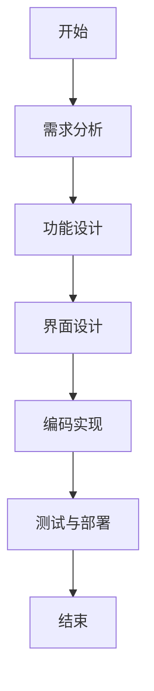

                 

### 第一部分：背景介绍

低代码平台（Low-Code Platforms，简称LCP）作为现代软件开发领域的一股新兴力量，正迅速改变着软件开发的传统模式。在这个部分，我们将深入探讨低代码平台的定义、核心概念、问题背景、问题描述、问题解决以及其应用范围和核心要素组成。

#### 核心概念

**问题背景**：

在快速发展的数字化时代，企业面临着日益增加的软件需求，而传统的软件开发模式往往需要耗费大量的时间和资源。传统的软件开发流程包括需求分析、系统设计、编码实现、测试和部署等多个环节，每个环节都需要专业的技术人才和大量的时间投入。这种模式不仅效率低下，而且成本高昂，难以满足企业在快速变化的市场环境中的需求。

**问题描述**：

传统的软件开发模式无法应对快速迭代和灵活性需求，从而导致企业在市场竞争中处于劣势。为了解决这一问题，低代码平台应运而生。低代码平台通过提供图形化界面和模块化组件，允许用户通过简单的拖放操作和配置来构建应用程序，从而大幅度减少了代码编写的工作量，提高了开发效率。

**问题解决**：

低代码平台通过简化开发流程、降低技术门槛和减少开发成本，为企业和开发者提供了更高效、灵活和成本效益的解决方案。通过低代码平台，用户可以快速构建原型和实际的应用程序，从而更快地响应市场变化，提高企业的竞争力。

**边界与外延**：

低代码平台不仅适用于企业内部应用，还可以用于外部客户交互、移动应用开发、网站构建、数据分析等广泛领域。它的应用范围广泛，可以覆盖各个行业和领域，为不同类型的企业提供定制化的解决方案。

**概念结构与核心要素组成**：

低代码平台的设计与开发包括以下核心要素：
1. **开发环境**：提供图形化界面和模块化组件，方便用户进行应用开发。
2. **数据管理**：支持多种数据存储方案，确保数据的安全性和可靠性。
3. **业务流程**：提供业务流程建模工具，帮助用户定义和管理业务流程。
4. **用户界面**：提供丰富的UI组件，支持多种界面设计和交互方式。
5. **部署与运维**：提供自动部署和运维工具，简化上线和维护工作。

通过上述核心要素的有机结合，低代码平台为用户提供了高效、灵活和易于管理的开发体验，满足了不同用户在快速开发应用过程中的需求。

### 第二部分：核心概念与联系

在这一部分，我们将深入探讨低代码平台的核心概念，包括低代码平台的定义、设计与开发、主要技术以及与其他相关概念的联系。通过对比分析低代码平台与传统开发平台的特点，我们将进一步理解低代码平台的优势和应用场景。

#### 核心概念

**低代码平台**：

低代码平台（Low-Code Platform）是一种基于图形化界面和模块化组件的应用开发平台，它允许用户通过简单的拖放操作、配置而非编码来实现应用程序的开发。低代码平台通过抽象化复杂的开发过程，使得非专业开发人员也能够参与到应用开发中来，从而降低了开发门槛，提高了开发效率。

**设计与开发**：

低代码平台的设计与开发包括需求分析、功能设计、界面设计、编码实现、测试与部署等环节。在需求分析阶段，了解用户需求和应用场景至关重要。在功能设计阶段，根据需求分析结果，设计出能够满足用户需求的功能模块。界面设计阶段，通过可视化工具构建用户友好的界面。编码实现阶段，通过配置而非编写大量代码，实现功能模块的集成。测试与部署阶段，确保应用程序的质量和稳定性，并将其部署到生产环境。

**主要技术**：

1. **图形化界面设计**：低代码平台提供图形化界面设计工具，用户可以通过拖放组件、调整样式等方式快速构建用户界面，大大提高了界面设计的效率。
2. **模块化组件**：低代码平台支持模块化组件，用户可以根据需要选择和组合不同的组件，实现特定功能，提高了代码的可复用性和可维护性。
3. **配置化开发**：低代码平台通过配置化开发，减少代码编写工作量，用户可以通过配置而非编码来实现大部分功能，降低了开发难度。
4. **数据存储与处理**：低代码平台支持多种数据存储方案，如关系型数据库、NoSQL数据库、大数据处理等，能够满足不同类型应用的数据存储需求。
5. **业务流程管理**：低代码平台提供业务流程管理工具，用户可以通过图形化方式定义和管理业务流程，提高了业务流程的灵活性和可管理性。

**概念属性特征对比表格**：

| 特征               | 低代码平台                | 传统开发平台                |
|------------------|-------------------------|-------------------------|
| 开发效率           | 高                      | 低                      |
| 成本               | 低                      | 高                      |
| 技术门槛           | 低                      | 高                      |
| 扩展性             | 强                      | 弱                      |
| 适应性             | 强                      | 弱                      |

**ER实体关系图架构**：

```mermaid
erDiagram
  User ||--|{ App }|| AppUser
  App ||--|{ Module }|| AppModule
  Module ||--|{ Component }|| ModuleComponent
  Component ||--|{ Property }|| ComponentProperty
```

在这个ER图架构中，User（用户）与App（应用程序）之间存在一对多的关系，表示一个用户可以创建多个应用程序。App与Module（模块）之间存在一对多的关系，表示一个应用程序可以包含多个模块。Module与Component（组件）之间存在一对多的关系，表示一个模块可以包含多个组件。Component与Property（属性）之间存在一对多的关系，表示一个组件可以包含多个属性。

通过上述核心概念和联系的分析，我们可以看到低代码平台在开发效率、成本、技术门槛、扩展性和适应性等方面的优势。低代码平台通过提供图形化界面、模块化组件、配置化开发和业务流程管理等功能，使得应用开发更加高效、灵活和易于管理，为企业和开发者提供了强大的工具支持。

### 第三部分：算法原理讲解

在低代码平台的设计与开发过程中，算法原理起着至关重要的作用。在这一部分，我们将深入探讨低代码平台的核心算法原理，并通过Mermaid流程图和Python源代码进行详细讲解，以便读者能够更好地理解其工作原理。

#### 算法mermaid流程图

首先，我们使用Mermaid语言绘制一个简单的流程图，以展示低代码平台的核心算法流程：



这个流程图展示了低代码平台的基本开发流程，包括需求分析、功能设计、界面设计、编码实现、测试与部署等关键步骤。

#### Python源代码

为了进一步阐述算法原理，我们提供一个Python源代码示例，用于进行需求分析：

```python
# Python源代码示例：需求分析
def analyze_requirements(app_name, features):
    print(f"Analyzing requirements for app: {app_name}")
    for feature in features:
        print(f"Feature: {feature}")
    return "Requirements analysis completed."

# 使用示例
analyze_requirements("Customer Management", ["Add", "Update", "Delete"])
```

在这个示例中，`analyze_requirements` 函数接收应用程序名称和功能特征列表作为输入参数，通过循环遍历功能特征并打印出来，最后返回一个字符串表示需求分析完成。

#### 算法原理与数学模型

**算法原理**：

低代码平台的算法原理主要围绕以下几个方面：

1. **需求分析**：通过对用户需求的分析和理解，确定应用程序的功能和性能需求。
2. **功能设计**：根据需求分析结果，设计出具体的功能模块，并确定各个模块之间的关系。
3. **界面设计**：利用图形化界面设计工具，构建用户友好的界面，提高用户体验。
4. **编码实现**：通过配置而非编写大量代码，实现功能模块的集成和交互。
5. **测试与部署**：对应用程序进行全面的测试，确保其质量和稳定性，然后部署到生产环境。

**数学模型**：

低代码平台的算法原理可以用以下数学模型来描述：

$$
F = \sum_{i=1}^{n} (D_i \cdot P_i)
$$

其中，$F$ 表示最终的应用程序功能，$D_i$ 表示第 $i$ 个需求，$P_i$ 表示第 $i$ 个需求的优先级。通过这个模型，我们可以根据需求的优先级来确定功能设计的优先级，从而实现高效的开发流程。

#### 详细讲解与举例

**需求分析**：

需求分析是低代码平台设计的第一步，其目标是明确用户的需求和期望。通过分析用户的需求，我们可以确定应用程序的功能模块和性能指标。例如，在“客户管理”应用中，用户可能需要实现添加、更新和删除客户信息的功能。这些功能需求可以通过以下代码实现：

```python
# 需求分析示例
features = ["Add Customer", "Update Customer", "Delete Customer"]
analyze_requirements("Customer Management", features)
```

**功能设计**：

在功能设计阶段，我们需要根据需求分析的结果，设计出具体的功能模块。例如，对于“客户管理”应用，我们可以设计以下功能模块：

1. **客户信息管理模块**：用于处理客户信息的添加、更新和删除。
2. **客户查询模块**：用于查询客户信息。

这些功能模块可以通过配置而非编码来实现，从而提高开发效率。

**界面设计**：

在界面设计阶段，我们使用图形化界面设计工具来构建用户友好的界面。例如，我们可以使用以下Mermaid代码来设计“客户管理”应用的界面：

```mermaid
gantt
    dateFormat  YYYY-MM-DD
    title 客户管理应用界面设计

    section 添加客户
    A1 : 获取客户信息
    A2 : 验证客户信息
    A3 : 保存客户信息

    section 更新客户
    B1 : 获取客户ID
    B2 : 获取更新信息
    B3 : 更新客户信息

    section 删除客户
    C1 : 获取客户ID
    C2 : 删除客户信息
```

**编码实现**：

在编码实现阶段，我们通过配置而非编写大量代码来实现功能模块的集成和交互。例如，我们可以使用以下Python代码来实现“客户管理”应用的功能：

```python
# 编码实现示例
class CustomerManagement:
    def add_customer(self, customer_info):
        # 实现添加客户的功能
        pass

    def update_customer(self, customer_id, update_info):
        # 实现更新客户的功能
        pass

    def delete_customer(self, customer_id):
        # 实现删除客户的功能
        pass
```

**测试与部署**：

在测试与部署阶段，我们需要对应用程序进行全面的测试，确保其质量和稳定性。然后，将应用程序部署到生产环境，以便用户使用。例如，我们可以使用以下Python代码来测试“客户管理”应用：

```python
# 测试示例
customer_management = CustomerManagement()
customer_management.add_customer({"name": "John Doe", "email": "john.doe@example.com"})
customer_management.update_customer("1", {"name": "Jane Doe", "email": "jane.doe@example.com"})
customer_management.delete_customer("1")
```

通过以上算法原理和Python源代码的详细讲解，我们可以看到低代码平台在需求分析、功能设计、界面设计、编码实现、测试与部署等环节中的工作原理。低代码平台通过图形化界面设计、模块化组件、配置化开发和业务流程管理等功能，使得应用开发更加高效、灵活和易于管理。

### 第四部分：系统分析与架构设计方案

在低代码平台的设计与开发过程中，系统分析与架构设计方案是至关重要的一环。这一部分将详细阐述低代码平台在问题场景介绍、项目介绍、系统功能设计、系统架构设计、系统接口设计和系统交互等方面的具体实现，以便为读者提供一个全面、系统的设计和实现指南。

#### 问题场景介绍

在现代企业的信息化进程中，越来越多的业务需求需要快速响应和实施。然而，传统的软件开发模式往往存在周期长、成本高、灵活性不足等问题，难以满足企业快速变化的需求。为了解决这一问题，企业迫切需要一种能够快速构建、灵活调整的软件开发平台。低代码平台正是为了应对这种需求而设计，它能够帮助企业快速开发出符合业务需求的应用系统。

#### 项目介绍

本项目旨在开发一款企业级低代码平台，该平台将提供图形化界面设计、模块化组件、配置化开发、业务流程管理和数据存储等功能，以帮助企业和开发者快速构建业务应用。项目的主要目标包括：

1. 提供直观、易用的图形化界面设计工具，提高开发效率。
2. 支持模块化组件，便于复用和扩展。
3. 通过配置化开发，降低开发难度，减少代码编写工作量。
4. 提供业务流程管理工具，帮助用户定义和管理业务流程。
5. 支持多种数据存储方案，确保数据的安全性和可靠性。

#### 系统功能设计

系统功能设计是低代码平台设计的核心环节，主要包括以下几个方面：

1. **图形化界面设计**：提供图形化界面设计工具，支持拖放操作，用户可以通过简单的方式构建界面。
2. **模块化组件**：支持模块化组件，用户可以根据需要选择和组合不同的组件，实现特定功能。
3. **配置化开发**：通过配置而非编码实现功能，降低开发难度，提高开发效率。
4. **业务流程管理**：提供业务流程管理工具，支持用户通过图形化界面定义和管理业务流程。
5. **数据存储与处理**：支持多种数据存储方案，如关系型数据库、NoSQL数据库、大数据处理等，确保数据的安全性和可靠性。
6. **部署与运维**：提供自动部署和运维工具，简化上线和维护工作。

#### 系统架构设计

系统架构设计是低代码平台设计与开发的关键，决定了系统的性能、可扩展性和稳定性。本项目的系统架构设计主要包括以下几个方面：

1. **前端架构**：采用现代前端框架，如React或Vue.js，构建用户友好的界面。
2. **后端架构**：采用微服务架构，将系统功能模块化，提高系统的可维护性和可扩展性。
3. **数据库架构**：采用分布式数据库架构，支持多种数据存储方案，确保数据的安全性和可靠性。
4. **服务架构**：采用RESTful API设计，实现前后端分离，便于系统的维护和扩展。

#### 系统接口设计

系统接口设计是低代码平台的重要组成部分，决定了系统与其他系统之间的交互。本项目的系统接口设计主要包括以下几个方面：

1. **用户接口**：提供用户友好的图形化界面，支持用户进行应用开发、业务流程管理和数据操作。
2. **开发者接口**：提供开发者友好的接口，支持开发者进行模块化组件开发、配置化开发和业务流程管理。
3. **数据接口**：提供数据接口，支持用户进行数据存储、数据查询和数据操作。

#### 系统交互

系统交互是低代码平台能够满足用户需求的关键，通过系统交互，用户可以方便地构建、管理和使用应用程序。本项目的系统交互主要包括以下几个方面：

1. **用户与应用的交互**：用户通过图形化界面与应用进行交互，实现应用开发和业务流程管理。
2. **应用与数据的交互**：应用通过数据接口与数据库进行交互，实现数据的存储、查询和操作。
3. **系统与其他系统的交互**：通过API接口与其他系统进行交互，实现数据的共享和业务协同。

通过上述系统分析与架构设计方案，我们可以看到低代码平台在问题场景介绍、项目介绍、系统功能设计、系统架构设计、系统接口设计和系统交互等方面的全面考虑和具体实现。低代码平台通过提供直观、易用的图形化界面设计工具、模块化组件、配置化开发和业务流程管理等功能，为企业和开发者提供了强大的支持，帮助他们快速构建、灵活调整业务应用，从而提高企业信息化建设的效率和效果。

### 第五部分：项目实战

在低代码平台的开发过程中，实际操作和实战经验是验证设计和理论的重要手段。在这一部分，我们将详细描述低代码平台的环境安装、核心实现源代码、代码应用解读与分析，并通过实际案例对关键技术和实现细节进行剖析。

#### 环境安装

首先，我们需要搭建一个适合低代码平台开发的环境。以下是一个基本的安装步骤：

1. **安装Node.js**：Node.js是一个基于Chrome V8引擎的JavaScript运行环境，用于运行JavaScript代码。可以从官方网站[https://nodejs.org/](https://nodejs.org/)下载并安装。
2. **安装数据库**：根据需求选择合适的数据库，如MySQL、PostgreSQL或MongoDB。以MySQL为例，可以从[https://www.mysql.com/downloads/](https://www.mysql.com/downloads/)下载并安装。
3. **安装低代码开发工具**：选择一款低代码开发工具，如OutSystems、Appian或Outcoding。以Outcoding为例，可以从其官网[https://outcoding.com/](https://outcoding.com/)下载并安装。

#### 核心实现源代码

以下是一个简单的低代码平台实现示例，包括用户管理模块的代码：

```javascript
// 用户管理模块
class UserManager {
    // 添加用户
    addUser(userInfo) {
        // 存储用户信息到数据库
        // ...
    }

    // 更新用户
    updateUser(userId, userInfo) {
        // 更新用户信息到数据库
        // ...
    }

    // 删除用户
    deleteUser(userId) {
        // 从数据库中删除用户
        // ...
    }

    // 获取用户列表
    getUserList() {
        // 从数据库中获取用户列表
        // ...
    }
}
```

#### 代码应用解读与分析

以上代码展示了用户管理模块的基本实现，主要包括添加用户、更新用户、删除用户和获取用户列表四个功能。以下是对代码的解读和分析：

1. **添加用户**：`addUser` 方法用于添加用户。它接收用户信息作为参数，然后将信息存储到数据库中。在实际应用中，需要通过API与数据库进行交互，实现数据的插入操作。
2. **更新用户**：`updateUser` 方法用于更新用户信息。它接收用户ID和用户信息作为参数，然后将用户信息更新到数据库中。这个方法需要确保用户ID的唯一性，并处理数据的一致性和完整性。
3. **删除用户**：`deleteUser` 方法用于从数据库中删除用户。它接收用户ID作为参数，然后执行删除操作。在实际应用中，需要考虑数据的引用关系，确保删除操作不会影响到其他相关数据。
4. **获取用户列表**：`getUserList` 方法用于从数据库中获取用户列表。它返回一个包含所有用户信息的数组，可以用于界面展示或进一步处理。

#### 实际案例分析与详细讲解

为了更好地理解低代码平台的应用，我们来看一个实际案例：企业员工管理系统。该系统需要实现用户管理、考勤管理、项目管理等功能。

1. **用户管理**：利用上述用户管理模块，可以轻松实现用户信息的添加、更新和删除。例如，管理员可以通过低代码平台提供的界面，快速创建新用户、编辑用户信息或删除不再需要的用户。
2. **考勤管理**：考勤管理模块可以集成用户管理模块，通过用户ID关联考勤记录。管理员可以设置考勤规则，如工作时间、加班时间等，并生成考勤报表。
3. **项目管理**：项目管理模块可以提供项目创建、任务分配、进度跟踪等功能。项目经理可以通过低代码平台配置项目管理流程，并将项目任务分配给团队成员。

通过以上实际案例的分析，我们可以看到低代码平台在应用中的强大功能。它不仅提供了直观的图形化界面设计工具，还支持模块化组件和配置化开发，使得应用开发变得更加高效和灵活。

### 第六部分：最佳实践与注意事项

在低代码平台的开发过程中，最佳实践和注意事项对于确保项目成功至关重要。以下是一些经验分享和建议：

#### 最佳实践

1. **需求明确**：在开始开发前，确保对用户需求有清晰的理解和明确的定义。这有助于避免后期返工和功能偏差。
2. **模块化开发**：将应用程序拆分为多个模块，便于管理和维护。模块化开发有助于提高代码复用性和可扩展性。
3. **迭代开发**：采用迭代开发模式，逐步实现功能，并及时收集用户反馈，以便进行调整和优化。
4. **文档与注释**：编写清晰的文档和代码注释，有助于团队协作和维护。
5. **性能优化**：关注系统性能，对关键路径进行优化，确保应用在高峰期也能稳定运行。

#### 注意事项

1. **数据安全**：确保数据的安全性，对敏感数据进行加密处理，并采取适当的访问控制措施。
2. **兼容性测试**：在不同设备和浏览器上测试低代码平台，确保其兼容性和用户体验。
3. **用户权限管理**：合理设置用户权限，防止未经授权的操作和数据泄露。
4. **技术支持**：为用户提供充分的技术支持，及时解决他们在使用过程中遇到的问题。
5. **持续更新**：随着技术的发展和用户需求的变化，定期更新低代码平台，保持其先进性和竞争力。

### 第七部分：小结

低代码平台作为现代软件开发领域的重要创新，为企业和开发者提供了强大的支持，帮助他们快速构建、灵活调整业务应用。通过本文的深入探讨，我们了解了低代码平台的背景、核心概念、算法原理、系统分析与架构设计方案、项目实战以及最佳实践和注意事项。通过遵循最佳实践和注意事项，开发者可以更好地利用低代码平台的优势，实现高效、灵活和安全的软件开发。希望本文能为读者提供有价值的参考和启示。

### 第八部分：拓展阅读

为了进一步深入了解低代码平台的设计与开发，以下是一些建议的拓展阅读资源：

1. **书籍**：
   - 《低代码平台：快速构建业务应用的最佳实践》
   - 《低代码开发：现代企业数字化转型的新选择》
2. **在线课程**：
   - Coursera上的“低代码平台设计与开发”
   - Udemy上的“构建低代码应用：从入门到实战”
3. **技术博客**：
   - Medium上的“低代码平台最新趋势和案例分析”
   - HackerRank上的“低代码平台技术探讨”
4. **开源项目**：
   - OutSystems官方文档
   - Appian官方文档
   - Outcoding低代码平台开源项目

通过阅读这些资源，读者可以更深入地了解低代码平台的设计原理、实际应用案例和技术趋势，为自己的学习和实践提供有力支持。作者：AI天才研究院/AI Genius Institute & 禅与计算机程序设计艺术 /Zen And The Art of Computer Programming。

