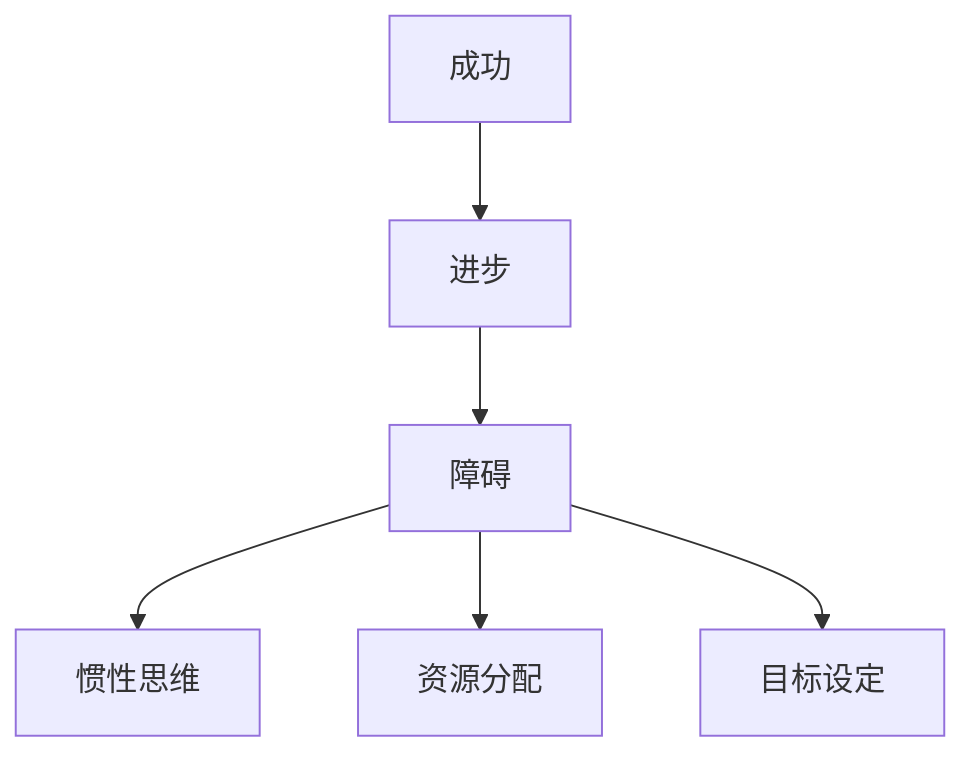

                 

## 引言

### 1.1 问题背景与引入

在当今快速发展的信息技术领域，成功与进步成为每个人追求的目标。然而，现实中的许多成功案例却揭示了这样一个悖论：那些曾经使我们成功的因素，最终却可能成为阻碍我们进一步进步的障碍。这一现象引发了广泛的探讨，人们开始质疑，是什么让我们在成功的道路上越走越远，却又无法突破自我，实现更高的成就。

本篇文章旨在深入探讨这一现象，从多个角度分析那些既促进成功又阻碍进步的因素。通过结合理论分析和实际案例，我们将试图揭示这一现象背后的原因，并提供有效的解决策略。

#### 1.1.1 问题的普遍性

成功与进步的矛盾并不局限于某个特定领域或行业，它普遍存在于各个领域。无论是个人职业发展、学术研究，还是企业运营、技术创新，成功的因素往往在初始阶段推动我们前进，但随着时间的推移，这些因素可能会逐渐变成制约我们进一步发展的瓶颈。

#### 1.1.2 问题的具体表现

具体来说，问题的表现形式多种多样。例如，一个在某个技术领域取得初步成功的程序员，可能会因为对现有技术的过度依赖，而无法接受和适应新的技术变革；一个在创业初期取得成功的企业家，可能会因为过于坚持原有的商业模式，而错失市场变化的机遇。

#### 1.1.3 研究的意义

探讨这一现象的意义在于，它不仅有助于我们理解成功的本质，还能为我们提供克服障碍、实现持续进步的方法。通过深入分析成功与进步之间的矛盾，我们可以更好地制定个人职业规划，优化企业发展战略，从而在激烈的市场竞争中保持领先地位。

### 1.2 问题描述与界定

#### 1.2.1 成功的定义

在探讨成功与进步的矛盾之前，我们首先需要明确成功是什么。成功可以理解为在某一领域内达到了既定目标，取得了显著成就。这些成就可能是个人层面的，如获得某个重要职位或完成一个重要项目；也可能是组织层面的，如企业实现了利润增长或技术创新。

#### 1.2.2 进步的含义

进步则意味着在现有成就的基础上，不断地提升自我，追求更高的目标。进步不仅仅是数量上的增加，更包括质量上的提升，如技能的精进、思维的拓展、创新能力的增强等。

#### 1.2.3 成功与进步的冲突

成功与进步之间的冲突主要体现在以下几个方面：

1. **惯性思维**：成功往往带来满足感和安全感，使人们容易陷入惯性思维，不愿意接受新的挑战和变革。
2. **资源分配**：成功的因素可能占用了大量的时间和精力，导致在追求进步时难以进行有效的资源分配。
3. **目标设定**：成功的标准可能会影响个人或组织的目标设定，使其更加保守，难以迎接新的挑战。

### 1.3 研究方法与框架

#### 1.3.1 研究方法的选择

为了深入探讨成功与进步之间的矛盾，本研究采用定性与定量相结合的研究方法。定性研究将帮助我们理解成功与进步的内在机制，定量研究则通过数据分析来验证这些机制的有效性。

#### 1.3.2 研究框架的建立

本研究采用以下研究框架：

1. **核心概念定义**：明确成功、进步、障碍等核心概念。
2. **影响因素分析**：分析成功与进步的影响因素。
3. **案例分析**：通过实际案例探讨成功与进步之间的矛盾。
4. **策略与建议**：提出克服障碍、实现持续进步的策略。

#### 1.3.3 核心概念及其关系

在本文中，核心概念包括成功、进步、障碍等。这些概念之间的关系如图1所示：



通过以上框架，我们将对成功与进步的矛盾进行深入剖析，旨在为读者提供有益的启示和指导。

## 核心概念与联系

### 2.1 成功因素

成功因素是指那些能够推动个人或组织在某一领域内取得显著成就的因素。这些因素包括个人特质、外部环境和方法论等。以下是成功因素的定义、属性特征以及它们之间的对比表格：

#### 2.1.1 成功的定义与标准

成功可以定义为在某一领域内达到了预定的目标或标准。这些目标或标准可以是个人层面的，如获得某个职位或完成某个项目；也可以是组织层面的，如企业实现盈利或技术创新。

#### 2.1.2 成功的主要因素

成功的主要因素包括以下几个方面：

1. **个人特质**：如自信、决心、学习能力、适应力和沟通能力。
2. **外部环境**：如社会支持、资源获取和竞争环境。
3. **方法论**：如目标设定、计划执行和反馈与调整。

#### 2.1.3 成功因素的特征对比表

| 成功因素 | 特征 |
| --- | --- |
| 个人特质 | - 自信：在面对困难和挑战时保持积极态度。<br>- 决心：坚定的追求目标，不畏艰难。<br>- 学习能力：不断学习新知识，适应变化。<br>- 适应力：在新的环境中迅速适应并发挥作用。<br>- 沟通能力：有效沟通，建立良好的人际关系。 |
| 外部环境 | - 社会支持：家人、朋友和同事的支持。<br>- 资源获取：包括资金、技术、信息和人力。<br>- 竞争环境：刺激创新和进步的外部竞争。 |
| 方法论 | - 目标设定：明确、具体、可衡量的目标。<br>- 计划执行：按照计划进行，确保目标的实现。<br>- 反馈与调整：根据反馈调整计划，提高效率。 |

### 2.2 进步障碍

进步障碍是指那些阻碍个人或组织在某一领域内进一步提升的因素。这些障碍可能来自个人层面、社会与文化因素、环境与资源限制等。以下是进步障碍的定义、属性特征以及它们之间的对比表格：

#### 2.2.1 障碍的定义与类型

进步障碍可以定义为那些阻碍个人或组织在某一领域内进一步提升的因素。这些障碍包括以下几个方面：

1. **个人层面的阻力**：如自我设限、情绪管理、习惯养成。
2. **社会与文化因素**：如社会期望、文化背景、社会结构。
3. **环境与资源限制**：如经济压力、时间管理、技术更新。

#### 2.2.2 障碍因素的特征对比表

| 进步障碍 | 特征 |
| --- | --- |
| 个人层面的阻力 | - 自我设限：自我认知不足，无法突破自我。<br>- 情绪管理：情绪波动大，影响决策和行动。<br>- 习惯养成：难以改变旧有习惯，影响进步。 |
| 社会与文化因素 | - 社会期望：对个人或组织的期望可能过高或过低。<br>- 文化背景：不同的文化背景可能导致不同的行为和决策。<br>- 社会结构：社会结构可能限制个人或组织的发展。 |
| 环境与资源限制 | - 经济压力：资金不足，影响项目或业务的发展。<br>- 时间管理：时间分配不当，影响工作效率。<br>- 技术更新：技术落后，影响业务创新和竞争力。 |

#### 2.2.3 ER实体关系图

为了更好地理解成功因素与进步障碍之间的关系，我们可以使用ER实体关系图来表示。以下是成功因素与进步障碍之间的ER实体关系图：

```mermaid
erDiagram
A[成功因素] ||--|{ B[个人特质] }
A ||--|{ C[外部环境] }
A ||--|{ D[方法论] }
A ||--|{ E[进步障碍] }
E ||--|{ F[个人层面的阻力] }
E ||--|{ G[社会与文化因素] }
E ||--|{ H[环境与资源限制] }
```

通过上述核心概念与联系的分析，我们可以更清晰地理解成功与进步之间的矛盾，并为后续的研究提供坚实的基础。

### 3.1 个人特质

个人特质在成功与进步中扮演着至关重要的角色。这些特质不仅影响个人在职业生涯中的表现，还决定了个人是否能够在成功之后继续进步。以下是几种关键的个人特质，以及它们如何影响个人的成功和进步。

#### 3.1.1 自信与决心

自信和决心是成功的重要因素。一个自信的人相信自己能够实现目标，而决心则使他们在面对困难和挑战时保持坚持不懈。然而，过度的自信和决心也可能成为阻碍进步的障碍。当一个人过于自信时，他们可能忽视反馈和批评，不愿意接受新的挑战和变化。同样，如果决心过于强烈，个人可能会过于坚持现有的方法，而不愿意尝试新的思路。

**实例分析**：一位在软件开发领域取得显著成就的程序员，因为对自己的编程技术极度自信，拒绝学习新的编程语言和工具，最终在技术不断更新的环境中逐渐落后。

#### 3.1.2 学习能力与适应力

学习能力与适应力是保持个人进步的关键特质。一个具有强大学习能力的人能够迅速掌握新知识和技能，适应新的工作环境和要求。适应力强的人能够灵活应对变化，适应不同的工作压力和文化差异。然而，学习能力不足或适应力差的人可能在面对新技术和新环境时感到困惑和无从下手。

**实例分析**：一位在市场销售领域取得成功的经理，由于缺乏对新销售策略的学习能力，无法适应市场变化，导致业绩下滑。

#### 3.1.3 团队协作与沟通能力

团队协作和沟通能力在成功和进步中同样重要。一个优秀的团队成员能够有效地与他人合作，共同完成项目。良好的沟通能力有助于团队内部信息的流通，避免误解和冲突。然而，如果团队协作和沟通能力不足，团队成员之间可能产生隔阂，影响工作效率和团队整体绩效。

**实例分析**：一家在技术创新领域取得成功的初创公司，由于内部团队协作不畅，导致项目进度延误，最终错失市场机遇。

#### 3.1.4 情绪管理与自我调控

情绪管理和自我调控能力是个人成功和进步的基石。一个情绪稳定的人能够更好地应对工作压力和挑战，保持专注和高效。自我调控能力使个人能够理性分析问题，做出明智的决策。然而，情绪管理和自我调控能力差的人可能在面对压力和挫折时情绪失控，影响判断力和执行力。

**实例分析**：一位在金融投资领域取得成功的交易员，由于无法有效管理情绪，在一次重大市场波动中做出了错误决策，导致亏损。

#### 3.1.5 习惯养成与自我激励

习惯养成和自我激励能力对个人的长期成功和进步至关重要。良好的习惯有助于提高工作效率和保持学习动力。自我激励能力使个人能够自我驱动，克服困难，不断追求卓越。然而，不良的习惯和缺乏自我激励可能导致个人在成功后逐渐停滞不前。

**实例分析**：一位在学术研究领域取得杰出成就的学者，由于缺乏良好的习惯和持续的自我激励，在后续的研究中逐渐失去了创新的动力。

### 结论

个人特质对成功与进步有着深远的影响。自信和决心、学习能力与适应力、团队协作与沟通能力、情绪管理与自我调控、习惯养成与自我激励等特质不仅决定了个人在职业生涯中的表现，还决定了个人是否能够在成功之后继续进步。理解并掌握这些特质，对于在竞争激烈的环境中实现持续成功至关重要。

### 3.2 外部环境

外部环境是影响个人和企业在成功和进步过程中至关重要的一环。这些环境因素包括社会支持、资源获取和竞争环境，它们在塑造成功和推动进步方面发挥着重要作用。以下是这些外部环境因素的定义、特征以及它们对成功和进步的具体影响。

#### 3.2.1 社会支持

社会支持是指个人或组织在追求成功和进步过程中所获得的来自社会各界的帮助和鼓励。这些支持可以包括家人、朋友、同事和社区等各方面的资源。社会支持能够提供情感上的安慰、实际上的帮助以及职业发展上的指导。

**特征**：
- **情感支持**：通过鼓励和安慰减轻个人的压力，增强自信心。
- **资源支持**：提供资金、技术和信息等资源，帮助个人或组织克服困难和挑战。
- **网络支持**：通过人际关系网络，为个人或组织提供更多的发展机会和资源。

**影响**：
- **促进成功**：社会支持可以帮助个人或组织在追求目标的过程中减少阻力，提高成功的可能性。
- **促进进步**：社会支持可以为个人或组织提供新的视角和资源，帮助他们克服现有障碍，实现更高的目标。

**实例分析**：一个创业者在创业初期获得了家人和朋友的经济支持、技术建议和市场信息，这极大地提高了他的成功概率，并在后续的发展过程中不断推动他实现更大的进步。

#### 3.2.2 资源获取

资源获取是指个人或组织在追求成功和进步过程中能够有效利用的各种资源。这些资源包括资金、技术、信息、人力和其他形式的有形和无形资源。

**特征**：
- **资金资源**：为项目或业务提供必要的财务支持，确保其顺利运行。
- **技术资源**：提供技术工具、设备和研究资料，帮助个人或组织提升技术水平。
- **信息资源**：通过获取行业动态、市场信息和专业知识，为决策提供依据。
- **人力资源**：招聘和培养优秀人才，增强组织的竞争力和创新能力。

**影响**：
- **促进成功**：丰富的资源可以帮助个人或组织快速响应市场需求，提高业务效率和竞争力。
- **促进进步**：通过有效的资源管理和利用，个人或组织可以持续提升自身能力，实现长期发展。

**实例分析**：一家科技创新公司在获得了风险投资后，不仅获得了所需的资金支持，还通过投资方的人脉和资源，迅速扩大了研发团队和市场渠道，从而在短时间内取得了显著的进展。

#### 3.2.3 竞争环境

竞争环境是指个人或组织在追求成功和进步过程中所面临的竞争对手和市场竞争状况。竞争环境既是挑战，也是机遇。

**特征**：
- **激烈竞争**：竞争对手的存在激发了个人或组织的竞争意识和创新能力。
- **动态变化**：市场环境不断变化，要求个人或组织灵活应对。
- **压力与动力**：竞争带来的压力可以转化为推动进步的动力。

**影响**：
- **促进成功**：竞争环境可以激发个人或组织的潜力，促使他们不断优化产品和服务，提升竞争力。
- **促进进步**：竞争环境促使个人或组织不断创新和改进，以保持领先地位。

**实例分析**：在智能手机市场中，苹果和三星的竞争促使它们不断推出创新产品，提高用户体验，最终使整个行业得到了快速发展。

### 结论

外部环境对个人和企业的成功和进步具有显著影响。社会支持、资源获取和竞争环境等外部因素不仅能够促进成功，还能够为个人和组织的持续进步提供动力。理解并利用这些外部环境因素，对于实现长期成功和持续进步至关重要。

### 3.3 方法论

方法论是指个人或组织在追求成功和进步过程中所采用的一系列科学、系统的策略和步骤。这些方法论包括目标设定、计划执行和反馈与调整等关键环节，它们共同构成了成功与进步的基石。以下是这些方法论的具体内容及其在实际应用中的重要性。

#### 3.3.1 目标设定

目标设定是方法论的第一步，它为个人或组织提供了明确的方向和动力。一个明确、具体、可衡量的目标是成功和进步的必要前提。

**目标设定的原则**：
- **明确性**：目标应清晰明确，避免模糊和含糊。
- **具体性**：目标应具体可操作，而非抽象和模糊。
- **可衡量性**：目标应具备可量化的指标，以便于评估和调整。

**实例**：一个初创公司的目标是“在未来三年内实现收入突破一亿人民币”。这是一个明确、具体且可衡量的目标。

**目标设定的应用**：
- **个人职业发展**：通过设定明确的职业目标，如晋升到特定职位或实现特定收入水平，个人可以更加有针对性地规划职业生涯。
- **企业发展战略**：企业通过设定清晰的商业目标，如市场份额扩大或新产品研发，可以更有效地制定和执行战略规划。

#### 3.3.2 计划执行

计划执行是将目标转化为行动的过程。一个良好的计划应包括具体的时间表、任务分配和资源调配。

**计划执行的原则**：
- **全面性**：计划应涵盖所有关键任务和环节。
- **阶段性**：将整体任务分解为阶段性目标，逐步推进。
- **灵活性**：计划应具备一定的灵活性，以应对不确定因素和变化。

**实例**：一家公司在实现年营业额增长30%的目标时，可以将这一目标分解为季度目标，并制定详细的工作计划和资源配置。

**计划执行的应用**：
- **项目管理和运营**：通过详细的计划执行，确保项目按期完成，运营顺利进行。
- **团队协作**：明确每个人的任务和职责，提高团队协作效率。

#### 3.3.3 反馈与调整

反馈与调整是方法论中的关键环节，它通过对执行过程的监控和评估，确保目标的实现和优化。

**反馈与调整的原则**：
- **及时性**：及时收集和反馈执行过程中的信息，避免偏差和失误。
- **客观性**：反馈应客观、公正，避免主观偏见。
- **调整性**：根据反馈结果，及时调整计划和策略，以实现最佳效果。

**实例**：一个创业团队在产品测试阶段，通过用户反馈发现产品存在的问题，并迅速进行调整，最终提高了产品的市场竞争力。

**反馈与调整的应用**：
- **质量管理**：通过持续的质量监控和用户反馈，不断优化产品和服务。
- **战略调整**：根据市场变化和竞争态势，及时调整战略和策略。

### 结论

方法论是个人和企业在追求成功和进步过程中不可或缺的工具。目标设定、计划执行和反馈与调整等环节共同构成了方法论的核心。通过科学、系统的方法论，个人和企业可以更加高效地实现目标，持续推动进步。掌握和应用这些方法论，是成功和进步的关键。

### 3.4 成功因素的实践应用

在现实世界中，成功因素的实践应用不仅能够推动个人和企业实现短期目标，还能为长期的持续进步奠定基础。以下将通过个人案例和案例分析，探讨成功因素在实际中的应用，并提供经验总结。

#### 3.4.1 个人案例分享

**案例一：技术大牛的逆袭之路**

李明是一位资深软件工程师，在职业生涯的早期，他凭借卓越的技术能力和项目经验，迅速在业界崭露头角。然而，随着技术的不断更新和行业变革，李明发现自己在某些新技术领域逐渐落后。为了保持竞争力，他开始制定学习计划，每天投入两小时学习新技术，并积极参与开源项目。此外，他还通过建立个人博客，分享自己的技术见解，积累了大量粉丝和同行的认可。通过不断学习和分享，李明不仅巩固了自己的技术地位，还拓展了职业发展空间。

**经验总结**：
1. **持续学习**：技术领域变化迅速，持续学习是保持竞争力的关键。
2. **分享经验**：通过分享经验和见解，可以拓展人脉，提升个人影响力。
3. **灵活适应**：在面对技术变革时，灵活调整自己的学习路径和职业规划。

**案例二：创业者的成功与挑战**

张华是一位年轻的创业者，他在创业初期凭借敏锐的市场洞察力和强大的执行力，迅速占领了市场，实现了企业的快速成长。然而，随着企业的扩大，张华发现自己在管理和运营方面遇到了瓶颈。为了克服这些挑战，他开始系统学习企业管理知识，并引进了专业团队，通过明确的分工和高效的协作，提高了企业的运营效率。此外，张华还注重客户反馈，不断优化产品和服务，确保企业的持续竞争力。

**经验总结**：
1. **专业学习**：在专业领域之外，不断学习管理知识和技能，以应对企业发展中的新挑战。
2. **团队协作**：引入专业团队，明确分工，提高企业的运营效率。
3. **客户导向**：注重客户反馈，以客户需求为导向，持续优化产品和服务。

#### 3.4.2 组织案例分析

**案例一：苹果公司的创新之路**

苹果公司是全球知名的创新企业，其成功得益于其对技术创新的持续投入和执行。苹果公司通过明确的研发目标、高效的执行计划和灵活的反馈机制，不断推出革命性的产品。例如，苹果公司在iPhone推出前，通过多年的研发和技术积累，终于推出了这款改变手机产业的革命性产品。随后，苹果公司通过持续的创新，如iPad、Apple Watch等，保持了其在全球科技行业的领先地位。

**经验总结**：
1. **明确研发目标**：明确的技术研发目标，有助于企业集中资源，实现创新突破。
2. **高效的执行计划**：通过高效的执行计划，确保研发项目按时完成，快速推向市场。
3. **灵活的反馈机制**：通过持续的反馈和调整，不断优化产品和服务，满足市场需求。

**案例二：阿里巴巴的电商战略**

阿里巴巴作为中国最大的电商平台，其成功离不开其精准的市场定位和灵活的战略调整。在电商领域竞争激烈的市场环境中，阿里巴巴通过不断调整战略，如拓展国际市场、发展云计算和数字娱乐等，实现了业务的多元化发展。同时，阿里巴巴通过大数据分析和用户反馈，不断优化用户体验，提高了用户粘性。

**经验总结**：
1. **市场定位**：精准的市场定位有助于企业抓住机遇，实现快速发展。
2. **战略调整**：灵活的战略调整有助于企业应对市场变化，保持竞争优势。
3. **用户体验**：通过持续优化用户体验，提高用户满意度和忠诚度。

### 结论

通过个人案例和案例分析，我们可以看到成功因素在实际应用中的重要性。持续学习、分享经验、专业学习、团队协作、市场定位、战略调整和用户体验等成功因素，不仅帮助个人和企业实现短期目标，还为长期的持续进步提供了坚实的基础。理解并灵活应用这些成功因素，是个人和企业实现持续成功的必要条件。

### 4.1 个人层面的阻力

在追求成功和进步的过程中，个人层面的阻力往往是不可忽视的重要因素。这些阻力可能来自自我设限、情绪管理和习惯养成等方面，它们在不同程度上影响个人的发展。以下将详细分析这些个人层面的阻力，并探讨其具体表现和影响。

#### 4.1.1 自我设限

自我设限是指个人在追求目标过程中，由于对自己的能力和潜力的怀疑或限制，从而限制了自己的行动和发展。自我设限可能表现为：

- **缺乏自信**：个人在面对新挑战时缺乏自信心，认为自己无法胜任。
- **恐惧失败**：担心失败可能带来的负面后果，从而选择逃避挑战。
- **固定思维**：认为自己的能力和智力是固定的，无法通过努力提升。

**影响**：

自我设限对个人的发展产生负面影响，它可能导致个人放弃机会、停滞不前。长期自我设限还可能形成一种消极的心理状态，影响个人的情绪和行为。

**实例**：一位有潜力的年轻程序员，因为害怕失败，不敢尝试新的编程语言和技术，导致其技能水平长期停滞。

#### 4.1.2 情绪管理

情绪管理是指个人在应对工作压力和生活挑战时，如何合理表达和调节自己的情绪。情绪管理能力差可能导致：

- **情绪波动**：在遇到挫折或困难时，情绪波动较大，影响判断力和决策能力。
- **情绪压抑**：长期压抑负面情绪，导致心理健康问题。
- **情感失控**：在高压环境下，情绪可能失控，影响人际关系和工作效率。

**影响**：

情绪管理能力差不仅影响个人的心理健康，还可能影响工作绩效和人际关系。长期的情绪问题可能导致个人无法专注于工作，甚至影响职业生涯的发展。

**实例**：一位销售经理因为情绪管理不当，在业绩压力下情绪失控，与同事发生冲突，导致团队士气下降。

#### 4.1.3 习惯养成

习惯养成是指个人在日常生活中，通过重复行为形成稳定的行为模式。良好的习惯有助于提高工作效率和生活质量，而不良的习惯则可能阻碍个人的进步：

- **拖延症**：拖延导致任务积压，影响工作效率和目标实现。
- **懒散习惯**：缺乏自律和动力，导致懒散和消极。
- **无效习惯**：一些不良习惯如长时间使用手机、缺乏锻炼等，对健康和工作产生负面影响。

**影响**：

不良习惯会消耗个人大量的时间和精力，降低工作效率，影响生活质量。长期不良习惯可能导致身体健康问题，甚至影响职业生涯的发展。

**实例**：一位创业者因为沉迷于社交媒体，导致工作效率低下，最终错过了市场机遇。

#### 4.1.4 综合影响

自我设限、情绪管理和习惯养成等个人层面的阻力，共同作用于个人的发展。这些阻力不仅影响个人的心理状态和行为，还可能影响工作绩效和职业发展。

- **心理压力**：自我设限和情绪问题可能导致个人承受巨大的心理压力，影响身心健康。
- **工作效能**：不良习惯和情绪管理问题可能导致工作效率低下，影响工作质量。
- **职业发展**：长期的自我设限和情绪问题可能导致个人在职业发展上停滞不前，错失晋升机会。

**实例**：一位工程师因为情绪管理不当，导致项目进度延误，最终失去了晋升机会。

### 结论

个人层面的阻力是影响个人成功和进步的重要因素。自我设限、情绪管理和习惯养成等阻力，不仅影响个人的心理状态和行为，还可能阻碍个人的职业发展。通过提高自我认知、学会情绪管理和培养良好习惯，个人可以克服这些阻力，实现持续进步。

### 4.2 社会与文化因素

社会与文化因素在塑造个人成功和进步过程中扮演着至关重要的角色。这些因素不仅影响个人的价值观和行为模式，还可能成为阻碍进步的障碍。以下将分析社会期望、文化背景和社会结构这三个关键因素，以及它们对个人成功和进步的具体影响。

#### 4.2.1 社会期望

社会期望是指社会对个人在职业、成就和生活方面的期待和标准。这些期望通常来源于家庭、教育体系、职场环境和社会规范。社会期望可能对个人产生积极和消极的双重影响：

- **积极影响**：社会期望可以激励个人追求更高的目标，增强责任感和使命感。例如，家庭和社会对学业成绩的期望可以促使学生努力学习，争取优异的成绩。
- **消极影响**：过高的社会期望可能导致个人感到压力过大，产生焦虑和恐惧。例如，在某些文化中，对职业成功的追求可能过于极端，导致个人忽视生活的其他方面，如家庭和个人幸福。

**实例**：在一个竞争激烈的社会环境中，对高薪职位的期望可能导致个人过于关注职业发展，而忽视了健康和家庭。

#### 4.2.2 文化背景

文化背景是指个人成长的社会文化环境，包括价值观、信仰、传统习俗和行为规范。不同的文化背景可能对个人的行为和决策产生深远影响：

- **共同价值观**：共同的文化价值观可以增强个人的归属感和认同感，推动个人追求社会认可的目标。例如，在强调集体主义的文化中，个人可能会更倾向于团队合作和集体荣誉。
- **文化冲突**：在多元文化环境中，文化差异可能导致个人在价值观和生活方式上的冲突。例如，在跨文化团队合作中，可能因为文化差异导致沟通障碍和冲突。

**实例**：在一个强调个人主义的文化中，个人可能更注重个人成就和自我实现，而在一个强调集体主义的文化中，个人可能更注重团队利益和社会责任。

#### 4.2.3 社会结构

社会结构是指社会各阶层、群体和组织之间的关系及其构成方式。社会结构对个人的成功和进步有重要影响：

- **阶层流动性**：社会结构的阶层流动性影响个人通过努力改变社会地位的机会。在一个阶层流动性高的社会中，个人通过努力提升社会地位的可能性较大。例如，许多发达国家提供了丰富的教育资源和就业机会，为个人提供了广阔的发展空间。
- **权力结构**：社会结构中的权力分配影响个人的机会和资源获取。在某些权力高度集中的社会结构中，个人可能面临资源分配不公和机会限制。

**实例**：在一个等级森严的社会结构中，底层个人可能难以获得高级职位和优质资源，这限制了他们的职业发展。

#### 4.2.4 社会与文化因素的综合影响

社会期望、文化背景和社会结构这三个因素相互作用，共同影响个人的成功和进步。这些因素不仅影响个人的行为和决策，还可能成为阻碍个人进步的障碍：

- **期望与压力**：社会期望可能给个人带来巨大的压力，使其在追求成功的过程中产生焦虑和恐惧，影响其心理和生理健康。
- **文化制约**：文化背景可能对个人的价值观和行为模式产生深远影响，使其在面对挑战和变化时缺乏灵活性和适应性。
- **结构限制**：社会结构中的权力和资源分配可能限制个人的发展机会，使其难以通过努力改变社会地位。

**实例**：在一个强调家庭价值观的社会中，个人可能因为家庭责任而放弃追求职业发展，这限制了其在职业生涯上的进步。

### 结论

社会与文化因素对个人成功和进步有着深远的影响。社会期望、文化背景和社会结构不仅塑造了个人的价值观和行为模式，还可能成为阻碍个人进步的障碍。理解这些因素的作用，有助于个人更好地应对挑战，实现持续进步。

### 4.3 环境与资源限制

在追求成功和进步的过程中，环境与资源限制是个人和企业无法回避的现实挑战。这些限制包括经济压力、时间管理和技术更新等方面，它们在不同程度上影响个人和企业的绩效与发展。以下将详细分析这些限制，并探讨其对个人和企业成功和进步的具体影响。

#### 4.3.1 经济压力

经济压力是指个人和企业因资金短缺、财务困境或经济不确定性而产生的压力。这种压力可能来自以下几个方面：

- **资金短缺**：企业可能因投资不足、营收下滑或成本增加等原因面临资金短缺，影响正常运营和项目推进。
- **财务困境**：个人可能因失业、收入减少或债务问题陷入财务困境，影响生活质量和职业发展。
- **经济不确定性**：经济环境的不确定性，如经济衰退或市场波动，可能导致个人和企业对未来充满担忧，影响决策和行动。

**影响**：

经济压力对个人和企业的影响深远，可能导致：

- **个人层面**：生活质量下降，心理健康受到影响，职业发展受阻。
- **企业层面**：运营困难，项目延误，市场份额下降，甚至可能导致企业破产。

**实例**：在经济衰退期间，一家初创公司因资金短缺，无法继续研发新产品，最终被迫关闭。

#### 4.3.2 时间管理

时间管理是指个人和企业如何合理安排时间，确保任务高效完成。时间管理能力差可能导致以下问题：

- **时间浪费**：个人可能因拖延、缺乏计划和注意力分散而浪费大量时间。
- **任务积压**：任务过多，导致个人或企业无法在规定时间内完成所有任务，影响工作效率和项目进度。
- **工作与生活失衡**：长时间工作可能导致个人忽视家庭和个人生活，影响身心健康。

**影响**：

时间管理不当对个人和企业的影响显著，可能导致：

- **个人层面**：工作效率低下，生活质量下降，职业发展受限。
- **企业层面**：项目延误，客户满意度下降，竞争力减弱。

**实例**：一位销售经理因时间管理不当，无法有效跟进客户，导致销售额下降。

#### 4.3.3 技术更新

技术更新是指随着科技的不断进步，新技术和新工具的涌现对现有技术体系的挑战和影响。技术更新的速度和频率对个人和企业提出了新的要求：

- **技术淘汰**：旧技术可能因性能不足或安全性问题逐渐被淘汰，导致企业设备过时、效率下降。
- **技能更新**：个人需要不断学习新技术和工具，以保持竞争力，这可能导致学习和适应上的压力。
- **创新压力**：技术更新推动企业不断创新，以保持市场竞争力，这可能导致创新压力增大。

**影响**：

技术更新对个人和企业的影响包括：

- **个人层面**：技能更新压力增大，职业发展面临新挑战。
- **企业层面**：创新和适应新技术成为企业生存和发展的关键，否则可能被市场淘汰。

**实例**：一家制造业企业因未及时更新生产设备，导致生产效率低下，在市场竞争中逐渐失去优势。

#### 4.3.4 综合影响

环境与资源限制对个人和企业的成功和进步具有综合影响，这些限制不仅影响当前的工作效率，还可能对未来产生深远影响：

- **资源短缺**：资金、技术和时间等资源的不足，直接影响个人和企业的短期和长期发展。
- **发展瓶颈**：环境与资源限制可能导致个人和企业陷入发展瓶颈，无法实现进一步的成长和突破。
- **创新能力**：在资源有限的情况下，个人和企业需要不断创新，以应对挑战，实现进步。

**实例**：一位工程师因缺少必要的技术支持，无法完成复杂的项目，导致职业发展受限。

### 结论

环境与资源限制是个人和企业追求成功和进步过程中不可忽视的挑战。经济压力、时间管理和技术更新等因素在不同程度上影响个人和企业的绩效与发展。理解并有效应对这些限制，对于个人和企业实现持续成功和进步至关重要。

### 4.4 阻力与挑战的应对策略

在面对个人和企业在追求成功和进步过程中遇到的阻力与挑战时，有效的应对策略显得尤为重要。以下将详细介绍几种应对策略，并提供具体的实践建议，帮助个人和企业克服这些障碍，实现持续进步。

#### 4.4.1 阻力分析

首先，识别和分析阻力是应对挑战的第一步。这需要个人和企业对当前面临的问题进行深入调查和分析，以了解阻力的具体原因和表现形式。

**方法**：
- **SWOT分析**：通过优势（Strengths）、劣势（Weaknesses）、机会（Opportunities）和威胁（Threats）分析，全面评估当前状况。
- **因果分析图**：绘制因果分析图，分析阻力产生的根本原因。

**实践建议**：
- **定期评估**：设立定期评估机制，对阻力和挑战进行持续监控。
- **团队协作**：鼓励团队成员共同参与阻力分析，发挥集体智慧。

#### 4.4.2 应对策略

1. **资源优化管理**

**策略**：有效管理和利用现有资源，确保资源的最优配置和使用。

**方法**：
- **预算规划**：制定详细的预算计划，合理分配资金和人力资源。
- **资源整合**：通过内部资源整合，提高资源利用效率。

**实践建议**：
- **建立资源数据库**：建立企业资源数据库，便于实时查询和分配。
- **优先级排序**：根据任务的重要性和紧急程度，对资源进行优先级排序。

2. **持续学习与创新**

**策略**：不断学习新技术和知识，提升个人和企业的创新能力和竞争力。

**方法**：
- **培训计划**：制定培训计划，为员工提供专业技能和知识更新。
- **技术引入**：积极引入新技术和工具，提升工作效率和创新能力。

**实践建议**：
- **建立学习平台**：建立企业内部学习平台，提供在线课程和资料。
- **设立创新基金**：设立创新基金，鼓励员工提出创新项目和解决方案。

3. **团队协作与沟通**

**策略**：通过有效的团队协作和沟通，提高团队效率和解决复杂问题的能力。

**方法**：
- **团队建设活动**：定期组织团队建设活动，增强团队凝聚力和协作能力。
- **沟通机制**：建立高效的沟通机制，确保信息畅通和反馈及时。

**实践建议**：
- **建立项目小组**：针对重要项目，建立专门的项目小组，明确职责和沟通流程。
- **定期反馈会议**：定期举行反馈会议，收集团队意见和改进建议。

4. **情绪管理与心理健康**

**策略**：通过情绪管理和心理健康措施，提高个人和团队的抗压力和心理健康水平。

**方法**：
- **心理健康教育**：提供心理健康教育，提高员工的自我认知和情绪管理能力。
- **心理咨询服务**：设立心理咨询服务，帮助员工解决心理问题。

**实践建议**：
- **员工辅导计划**：实施员工辅导计划，为员工提供个性化的心理健康支持。
- **健康福利计划**：提供健康福利计划，如健身、休假等，促进员工身心健康。

5. **灵活应对与快速调整**

**策略**：在面临不确定性和变化时，灵活应对和快速调整，以适应新的环境和需求。

**方法**：
- **应急预案**：制定应急预案，应对突发事件和意外情况。
- **敏捷管理**：采用敏捷管理方法，快速响应变化，灵活调整策略。

**实践建议**：
- **建立应急预案**：针对关键业务和项目，建立详细的应急预案。
- **持续改进**：通过持续改进，不断优化流程和策略，提高应对变化的灵活性。

### 结论

面对个人和企业在追求成功和进步过程中遇到的阻力与挑战，有效的应对策略至关重要。通过资源优化管理、持续学习与创新、团队协作与沟通、情绪管理与心理健康、灵活应对与快速调整等策略，个人和企业可以克服障碍，实现持续进步。理解和灵活应用这些策略，是成功和进步的关键。

### 4.4.3 实践案例

为了更直观地理解阻力与挑战的应对策略，以下将通过具体案例来展示这些策略的实际应用及其效果。

#### 案例一：初创企业的困境与突破

**背景**：
一家初创科技公司，专注于人工智能应用的开发。在初创阶段，公司面临着资金短缺、技术更新迅速和市场竞争激烈等多重挑战。

**应对策略**：
1. **资源优化管理**：
   - **预算规划**：公司通过严格的预算规划，确保每一分钱都用在刀刃上。他们制定了详细的财务计划，将资金重点投入到技术研发和市场推广上。
   - **资源整合**：公司通过与大学和研究机构合作，获得了必要的技术支持和人才资源，提高了研发效率。

2. **持续学习与创新**：
   - **培训计划**：公司为员工提供了定期的技术培训，确保他们掌握最新的技术趋势和工具。
   - **技术引入**：公司积极引入先进的人工智能技术，提升了产品的竞争力。

3. **团队协作与沟通**：
   - **团队建设活动**：公司定期组织团队建设活动，增强了员工的凝聚力和协作能力。
   - **沟通机制**：公司建立了高效的沟通机制，确保团队成员之间的信息畅通和反馈及时。

4. **情绪管理与心理健康**：
   - **心理健康教育**：公司为员工提供心理健康教育，帮助他们更好地应对工作压力。
   - **心理咨询服务**：公司设立了心理咨询服务，为员工提供个性化的心理健康支持。

5. **灵活应对与快速调整**：
   - **应急预案**：公司制定了详细的应急预案，以应对突发事件和市场变化。
   - **持续改进**：公司通过持续改进，不断优化产品和服务，提高了市场适应性。

**效果**：
通过上述策略的应用，公司成功地克服了资金短缺、技术更新迅速和市场竞争激烈等挑战。他们的产品在市场上取得了良好反响，市场份额逐渐扩大。此外，员工的满意度和工作效率也显著提高。

#### 案例二：个人职业发展的困境与突破

**背景**：
一位拥有多年工作经验的软件工程师，在职业发展的过程中遇到了技能过时、职业瓶颈和压力增大的问题。

**应对策略**：
1. **资源优化管理**：
   - **预算规划**：工程师通过制定个人学习计划，合理分配时间，确保学习的有效性。
   - **资源整合**：工程师积极参与开源项目，通过贡献代码和交流经验，提升了技能。

2. **持续学习与创新**：
   - **培训计划**：工程师报名参加了线上和线下的技术培训课程，不断更新自己的知识体系。
   - **技术引入**：工程师尝试将新兴技术应用到实际工作中，提高了工作效率和创新能力。

3. **团队协作与沟通**：
   - **团队建设活动**：工程师通过参与团队活动，增强了与同事的协作能力。
   - **沟通机制**：工程师建立了与上级和同事的定期沟通机制，确保信息畅通和反馈及时。

4. **情绪管理与心理健康**：
   - **心理健康教育**：工程师通过阅读心理学书籍和参加讲座，提高了情绪管理能力。
   - **心理咨询服务**：工程师在感到压力过大时，寻求心理咨询服务，缓解了心理问题。

5. **灵活应对与快速调整**：
   - **应急预案**：工程师在面对技术难题时，制定了详细的解决方案和应急预案。
   - **持续改进**：工程师通过反思和总结，不断改进工作方法和技巧，提高了职业竞争力。

**效果**：
通过上述策略的应用，工程师成功地克服了技能过时、职业瓶颈和压力增大的问题。他的技能水平得到了显著提升，职业发展也取得了新的突破。此外，他的工作效率和心理健康水平也明显提高。

### 结论

通过具体案例，我们可以看到应对阻力与挑战的策略在实践中的有效性。通过资源优化管理、持续学习与创新、团队协作与沟通、情绪管理与心理健康、灵活应对与快速调整等策略，个人和企业可以克服困境，实现持续进步。这些实践案例为我们提供了宝贵的经验和启示，帮助我们在面对挑战时更加从容和有信心。

### 5.1 自我认知

自我认知是个人在追求成功和进步过程中的核心要素。它不仅影响个人的心理状态和行为模式，还决定了个人如何应对挑战和实现目标。以下将详细探讨自我认知的重要性、自我评估的方法以及如何通过自我激励来实现个人成长。

#### 5.1.1 自我认知的重要性

自我认知是指个体对自己思想、情感、行为和心理状态的认知和了解。它包括自我意识、自我评价、自我动机和自我调节等方面。自我认知的重要性体现在以下几个方面：

1. **心理成长**：通过自我认知，个体能够更好地理解自己的心理需求，找到心理成长的方向。
2. **行为调整**：自我认知有助于个体识别和改正不良行为习惯，提高行为有效性。
3. **目标设定**：清晰的自我认知有助于个体设定符合自己能力和兴趣的目标，提高目标实现的可能性。
4. **情绪管理**：自我认知有助于个体理解和调节自己的情绪，提高情绪稳定性。

#### 5.1.2 自我评估的方法

自我评估是自我认知的重要环节。以下是一些常用的自我评估方法：

1. **自我反思**：定期进行自我反思，思考自己的行为、情绪和心理状态，记录反思日记，帮助自己更好地了解自己。
2. **心理测试**：通过心理测试工具，如MBTI、DISC等，了解自己的性格特点和优势劣势。
3. **他人反馈**：向同事、朋友或家人寻求反馈，了解自己在外界的形象和行为表现。
4. **目标设定与评估**：设定具体的目标，定期评估自己的进展和成果，了解自己在实现目标过程中的表现。

#### 5.1.3 自我激励

自我激励是指通过内在动力和外在激励，激发个人的积极性和进取心，实现个人成长和进步。以下是一些自我激励的方法：

1. **设立目标**：明确具体的短期和长期目标，并制定实现目标的计划和步骤，提高自我激励的动力。
2. **积极心态**：保持积极的心态，相信自己能够克服困难，实现目标。
3. **自我奖励**：在实现小目标后，给自己设置奖励，如休息一天、买一件喜欢的物品等，增强自我激励。
4. **榜样激励**：找到榜样人物，学习他们的成功经验和行为模式，激发自己的进取心。
5. **建立支持系统**：与家人、朋友或同事建立支持系统，共同面对挑战，互相鼓励和激励。

#### 5.1.4 自我成长的实践

以下是一个自我成长的具体实践案例：

**案例**：一位年轻的工程师小明，在职业发展的过程中，意识到自我认知的重要性。他开始通过以下方法进行自我成长：

1. **自我反思**：每天晚上写下自己的工作表现和情绪状态，分析成功和失败的原因，找出改进的方向。
2. **心理测试**：通过MBTI测试，了解到自己是典型的INTJ性格，擅长逻辑分析和解决问题，但在团队协作方面需要加强。
3. **他人反馈**：向同事和领导请教，了解自己的工作表现和团队合作中的问题，积极采纳建议。
4. **目标设定**：设立短期目标，如学习新的编程语言，参加技术研讨会；长期目标，如提升项目管理能力，晋升为技术经理。
5. **积极心态**：保持积极的心态，相信通过努力，能够实现目标。
6. **自我奖励**：每完成一个目标，给自己设置小奖励，如休息一天、购买一本专业书籍等。
7. **榜样激励**：学习一位技术大牛的博客和演讲，借鉴他的经验和观点，激发自己的学习热情。
8. **建立支持系统**：与同事建立学习小组，定期分享技术知识和心得，互相鼓励和支持。

**效果**：通过上述自我成长实践，小明不仅提高了自己的技术能力，还在团队合作和项目管理方面取得了显著进步。他顺利晋升为技术经理，并在公司内部成为了一位备受尊敬的技术专家。

### 结论

自我认知是个人在追求成功和进步过程中不可或缺的要素。通过自我评估和自我激励，个人可以更好地了解自己的优势和不足，找到成长的方向，并通过持续的努力和自我驱动，实现个人成长和进步。理解和掌握自我认知的方法，是每个人在职业生涯中取得成功的关键。

### 5.2 学习策略

在追求个人和职业进步的过程中，学习策略起着至关重要的作用。有效的学习策略不仅能够提升个人的知识水平和技能，还能够增强解决问题的能力。以下将详细探讨学习策略的具体内容，包括学习方法、学习资源以及学习效果评估。

#### 5.2.1 学习方法

选择合适的学习方法是实现有效学习的关键。以下是一些常用的学习方法：

1. **主动学习**：主动学习是指通过主动思考和积极参与，主动探索知识。例如，通过阅读、讨论、实践和提问等方式，主动获取和掌握知识。

2. **分散学习**：分散学习是指将学习内容分散到不同的时间和地点进行学习。这种方法有助于减轻学习负担，提高学习效率。例如，利用碎片时间学习，如通勤、午休等。

3. **深度学习**：深度学习是指通过深入研究和理解知识，达到掌握和内化的程度。例如，通过阅读专业书籍、参与学术研讨会和进行项目实践等方式，深入理解复杂概念和理论。

4. **合作学习**：合作学习是指通过与他人合作，共同完成学习任务。这种方法有助于分享知识、激发思维和提升学习兴趣。例如，通过团队讨论、小组项目和学术合作等方式，实现知识的共享和互补。

5. **反思学习**：反思学习是指通过反思学习过程和结果，总结经验教训，不断提升学习能力。例如，通过写学习日记、进行自我评估和接受反馈等方式，不断改进学习方法和策略。

#### 5.2.2 学习资源

学习资源是指在学习过程中所需的各种工具和资料。以下是一些常见的学习资源：

1. **书籍和教材**：书籍和教材是获取系统知识和理论的重要资源。选择适合自己水平的书籍和教材，有助于构建扎实的知识基础。

2. **在线课程和讲座**：在线课程和讲座提供了丰富的学习机会，特别是在技术领域。通过在线学习平台，可以随时随地进行学习，获取最新的知识和技能。

3. **学术论文和期刊**：学术论文和期刊是获取前沿研究成果的重要途径。通过阅读学术论文和期刊，可以了解最新的研究动态和理论进展。

4. **实践项目和案例**：通过实际项目和案例学习，可以将理论知识应用于实践，提高解决实际问题的能力。例如，通过参与项目、编写代码和解决实际问题等方式，巩固和提升技能。

5. **专业社群和论坛**：专业社群和论坛提供了交流和学习的机会。通过参与专业社群和论坛，可以结识同行、分享经验和获取帮助。

#### 5.2.3 学习效果评估

学习效果评估是指通过评估学习过程和结果，了解学习成效，并据此调整学习策略。以下是一些常用的学习效果评估方法：

1. **知识测试**：通过定期进行知识测试，如笔试、面试和技术评审等，评估对知识点的掌握程度。

2. **项目评估**：通过实际项目或案例的完成情况，评估应用能力的提升。

3. **反馈与自我评估**：通过向导师、同事或学习者自身进行反馈和自我评估，了解学习过程中的优点和不足，及时调整学习方法和策略。

4. **学习记录和反思**：通过记录学习过程和结果，进行定期反思和总结，了解学习成效，并制定下一步的学习计划。

### 结论

有效的学习策略是个人和职业进步的基石。通过主动学习、分散学习、深度学习、合作学习和反思学习等方法，结合书籍、在线课程、学术论文、实践项目和专业社群等学习资源，个人可以不断提升自己的知识水平和技能。同时，通过知识测试、项目评估、反馈与自我评估和学习记录等效果评估方法，可以确保学习成效，并据此调整学习策略，实现持续进步。

### 5.3 时间管理

时间管理是提高个人和工作效率的关键要素。有效的时间管理不仅能够帮助个人在有限的时间内完成更多任务，还能提升生活质量和工作满意度。以下将详细探讨时间管理的基本原则，包括时间分配、目标设定以及反馈与调整。

#### 5.3.1 时间分配

时间分配是指如何将有限的时间合理地分配给不同的任务和活动。以下是一些时间分配的基本原则：

1. **优先级排序**：将任务按照重要性和紧急性进行排序，确保优先完成重要且紧急的任务。可以使用“四象限法则”，将任务分为重要紧急、重要不紧急、不重要紧急和不重要不紧急四个象限。

2. **任务分解**：将大型任务分解为小任务，逐步完成。这样可以避免因任务过于庞大而导致的拖延和压力。

3. **固定时间表**：制定固定的时间表，为每天的任务安排预留具体的时间段。例如，每天早上用于处理重要但不紧急的任务，下午用于处理紧急任务。

4. **灵活调整**：在执行时间表时，考虑到意外情况，预留一定的缓冲时间。这样可以应对突发事件，保持时间表的灵活性。

#### 5.3.2 目标设定

目标设定是时间管理的重要环节，它为个人提供了明确的方向和动力。以下是一些目标设定的基本原则：

1. **SMART原则**：目标应具备SMART特性，即具体（Specific）、可衡量（Measurable）、可达成（Achievable）、相关（Relevant）和时限性（Time-bound）。例如，一个具体的目标可以是“每天阅读两小时技术书籍”。

2. **阶段性目标**：将长期目标分解为阶段性目标，逐步实现。这样可以避免因长期目标过于遥远而导致的挫败感。

3. **可调整性**：目标设定时应考虑到可能的变化和不确定性，确保目标具有一定的灵活性，以便在必要时进行调整。

#### 5.3.3 反馈与调整

反馈与调整是时间管理过程中不可或缺的一环。通过持续的反馈和调整，个人可以不断优化时间管理策略，提高效率。以下是一些反馈与调整的方法：

1. **定期评估**：定期对时间管理效果进行评估，了解哪些策略有效，哪些需要改进。例如，每周或每月进行一次时间管理评估，分析任务的完成情况和时间分配的合理性。

2. **记录与分析**：记录每天的时间使用情况，分析时间浪费的原因和改进空间。通过数据驱动的分析，找到优化时间管理的具体方法。

3. **调整策略**：根据评估和反馈结果，及时调整时间管理策略。例如，如果发现某个时间段内任务完成效果不佳，可以调整时间安排或优化任务优先级。

4. **寻求反馈**：向同事、朋友或专业人士寻求反馈，了解自己在时间管理方面的优点和不足。外部视角可以帮助发现内部难以察觉的问题。

### 结论

有效的时间管理是提高个人和工作效率的关键。通过合理的优先级排序、任务分解、固定时间表和灵活调整，结合SMART原则和阶段性目标设定，以及持续的反馈与调整，个人可以更好地管理时间，提高任务完成率和生活质量。掌握和运用这些时间管理策略，是实现持续进步和成功的重要保障。

### 5.4 寻求支持

在追求个人和职业进步的过程中，寻求支持是不可或缺的一环。有效的支持系统可以提供情感上的安慰、专业上的指导以及资源上的帮助，从而助力个人克服困难和实现目标。以下将详细探讨寻求支持的渠道，包括社会网络、专业咨询和互助合作，并分享一些最佳实践和注意事项。

#### 5.4.1 社会网络

社会网络是指个人在社交活动中建立的人际关系网络。这些网络可以提供丰富的信息和资源，为个人发展提供支持。

**渠道**：
- **家人和朋友**：家人和朋友是个人最重要的支持来源。他们可以提供情感支持、建议和资源。
- **同事和同学**：同事和同学是工作中的重要支持网络。通过团队合作和交流，可以共同解决问题、提升技能。
- **行业组织和专业协会**：加入行业组织和专业协会，可以结识同行业的专业人士，获取最新的行业动态和资源。

**最佳实践**：
- **建立真诚关系**：与支持者建立真诚的关系，通过信任和互助实现共同成长。
- **主动沟通**：定期与支持者保持沟通，分享自己的进展和困惑，寻求他们的建议和帮助。
- **互惠互利**：在寻求支持的同时，也给予支持者帮助和回馈，建立长期的合作关系。

**注意事项**：
- **保持界限**：在寻求支持时，注意保护个人隐私和界限，避免过度依赖他人。
- **选择合适的支持者**：选择那些有经验、专业知识和良好口碑的支持者，确保他们的建议和帮助是有价值的。

#### 5.4.2 专业咨询

专业咨询是指通过专业的咨询服务，获取针对性的指导和建议。

**渠道**：
- **咨询公司**：专业的咨询公司提供各类咨询服务，如职业规划、团队建设、战略咨询等。
- **教练和导师**：专业的教练和导师可以提供个性化的指导和训练，帮助个人提升技能和实现目标。
- **在线咨询服务**：通过在线平台，可以获取到全球范围内的专业咨询服务。

**最佳实践**：
- **明确需求**：在寻求专业咨询前，明确自己的需求和目标，确保咨询服务的针对性。
- **选择合适的专家**：选择那些具有丰富经验和良好口碑的专家，确保咨询的质量。
- **积极参与**：在咨询过程中，积极参与讨论和反思，确保充分理解和吸收专家的建议。

**注意事项**：
- **保护隐私**：在咨询过程中，注意保护个人隐私，确保信息的安全。
- **费用考虑**：考虑咨询服务的费用，确保预算合理。

#### 5.4.3 互助合作

互助合作是指通过团队协作和合作伙伴关系，共同实现目标。

**渠道**：
- **团队项目**：参与团队项目，与团队成员共同解决问题，提升协作能力。
- **合作伙伴**：与同行或其他组织建立合作伙伴关系，共享资源和经验，实现共同发展。
- **志愿者活动**：参与志愿者活动，结识志同道合的人，共同为社会贡献力量。

**最佳实践**：
- **建立信任**：在互助合作中，建立信任是关键。通过透明沟通和互相支持，增强团队的凝聚力。
- **分工明确**：明确团队成员的职责和任务，确保合作的效率和效果。
- **共同目标**：确保团队成员有共同的目标和愿景，共同努力实现目标。

**注意事项**：
- **尊重差异**：在团队中尊重每个人的差异和观点，避免因个人偏见导致合作失败。
- **有效沟通**：确保团队内部的信息畅通和反馈及时，避免误解和冲突。

### 结论

寻求支持是个人和职业进步的重要保障。通过建立和利用社会网络、专业咨询和互助合作等渠道，个人可以获取丰富的信息和资源，克服困难，实现目标。在寻求支持的过程中，最佳实践和注意事项有助于确保支持的有效性和安全性，为个人和职业发展提供坚实的支持。

### 6.1 案例介绍

为了更好地理解本书中探讨的成功与进步的矛盾现象，以下将通过一个具体的案例来深入分析成功因素如何在某些情况下成为阻碍进步的因素。

#### 6.1.1 案例背景

本案例的主角是一位名叫李华的技术项目经理。李华在一家知名的科技公司工作，他拥有多年的项目管理经验，并因其出色的领导能力和技术专长而受到公司的高度评价。在公司内部，李华负责多个重要项目，并多次成功推动项目按期完成，取得了显著的成绩。然而，随着时间的推移，李华开始意识到，他的成功因素似乎也成为了他进一步进步的障碍。

#### 6.1.2 案例目标

本案例的目标是通过分析李华的成功因素，探讨这些因素如何在其职业生涯的后期成为阻碍他进步的因素，并提供相应的解决策略。

#### 6.1.3 案例参与者

- **李华**：技术项目经理，拥有丰富的项目管理和技术背景。
- **团队成员**：参与李华负责的项目，包括开发人员、测试工程师和产品经理等。
- **上级领导**：公司高层管理人员，对李华的工作进行监督和评估。

### 6.2 成功

在李华的职业生涯早期，他的成功主要归功于以下几个因素：

1. **技术专长**：李华拥有深厚的计算机科学背景，熟悉多种编程语言和开发工具。这使得他能够快速理解技术问题，并提出有效的解决方案。
   
2. **领导能力**：李华具备出色的领导能力，能够激励和带领团队高效完成任务。他的沟通技巧和决策能力使团队在紧张的项目周期内保持高度协作和凝聚力。

3. **目标设定**：李华擅长设定具体、可衡量的项目目标，并通过严格的时间管理和任务分解，确保项目按计划推进。

4. **资源获取**：凭借其出色的工作表现，李华在公司内部获得了良好的声誉，这使得他能够有效地获取项目资源和人力支持。

通过上述因素的综合作用，李华在多个关键项目中取得了显著的成功，为公司带来了巨大的商业价值。这些成功不仅提升了李华的职业地位，还为他赢得了上级领导和同事的尊重。

### 6.3 成功因素与进步障碍

然而，随着时间的推移，李华开始意识到，他的成功因素也逐渐成为了他进一步进步的障碍：

1. **技术专长**：尽管李华在技术领域具有深厚的基础，但随着技术不断演进，他逐渐发现自己对某些新兴技术的了解不够深入。这使得他在面对新技术和挑战时，感到力不从心。

2. **领导能力**：李华的领导风格以严格和高效著称，这种风格在项目初期非常有效。然而，随着项目的复杂性和团队规模的扩大，这种风格开始变得过于严格，限制了团队成员的创造性和自主性。

3. **目标设定**：李华擅长设定具体的目标，但在追求这些目标的过程中，他有时忽视了项目的长远发展。这种短期导向可能导致项目在短期内取得成功，但长期来看，可能忽视了技术迭代和市场变化。

4. **资源获取**：虽然李华在公司内部享有较高的声誉，但他过于依赖现有的资源和支持，缺乏主动寻求新资源和新机会的意愿。这限制了他在面对新挑战时的灵活性和创新能力。

### 6.4 成功因素转变为进步障碍的实例

以下是一些具体实例，说明李华的成功因素如何变成了他进一步进步的障碍：

1. **技术专长障碍**：
   - **实例**：在李华负责的一个新项目开发中，项目需要使用一种新兴的人工智能技术。由于李华对这项技术不熟悉，他在项目初期未能及时识别技术风险，导致项目进度延误。

2. **领导能力障碍**：
   - **实例**：在一个大型团队项目中，李华的严格管理风格导致团队成员感到压力过大，缺乏创新动力。最终，团队在项目的关键阶段出现严重分歧，项目进展受到影响。

3. **目标设定障碍**：
   - **实例**：在另一个项目中，李华为了确保项目按时交付，忽视了用户反馈和市场变化。结果，项目完成后，用户对新功能的需求变化导致项目价值大幅下降。

4. **资源获取障碍**：
   - **实例**：在一个跨部门合作项目中，李华因缺乏主动寻求新资源的能力，未能获得其他部门的必要支持。最终，项目因资源不足而被迫延期。

### 6.5 解决策略

为了克服这些障碍，李华采取了一系列策略：

1. **技术更新**：
   - **策略**：李华开始定期学习新兴技术，并积极参与行业研讨会和技术培训，提升自己的技术素养。
   - **效果**：通过持续学习，李华对新技术的掌握程度显著提升，项目中的技术风险得到有效控制。

2. **领导风格调整**：
   - **策略**：李华意识到需要调整领导风格，采用更加灵活和开放的管理方式，鼓励团队成员的自主创新。
   - **效果**：团队的工作氛围变得更加积极，成员的创新能力和自主性得到了提升。

3. **目标设定调整**：
   - **策略**：李华开始更加注重项目的长远发展，在设定目标时，充分考虑市场变化和用户需求。
   - **效果**：项目的用户满意度提高，市场反响良好。

4. **资源获取**：
   - **策略**：李华主动寻求跨部门的支持和资源，建立了更广泛的合作关系。
   - **效果**：项目获得了更多的资源和支持，进度和质量都得到了保障。

### 6.6 结论

通过本案例的分析，我们可以看到，成功因素在特定情况下可能成为阻碍进步的障碍。李华的成功因素如技术专长、领导能力、目标设定和资源获取，在其职业生涯的早期推动了项目的成功，但后期却成为了他进一步进步的障碍。通过采取有效的解决策略，李华成功地克服了这些障碍，实现了职业上的持续进步。这一案例为我们提供了一个宝贵的启示：在追求成功的过程中，我们需要不断反思和调整，以适应不断变化的环境和需求，实现长期发展。

