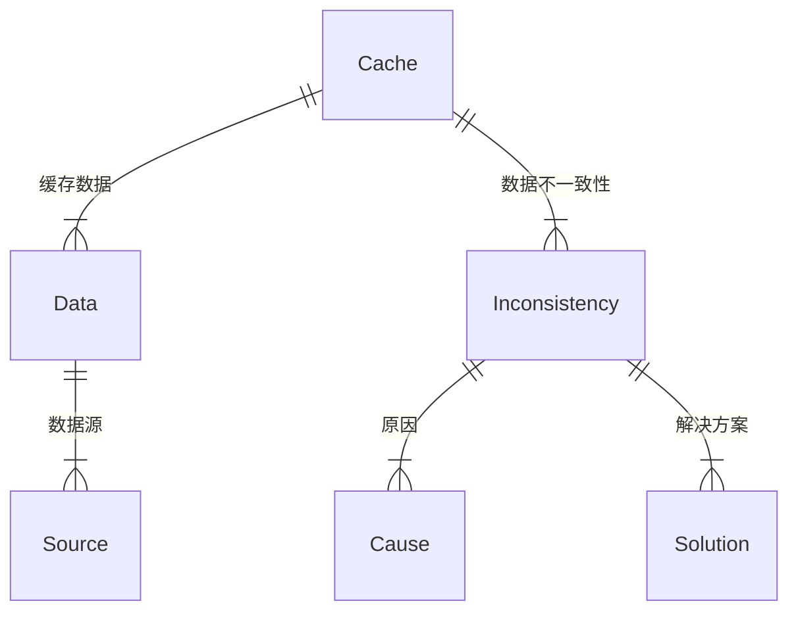
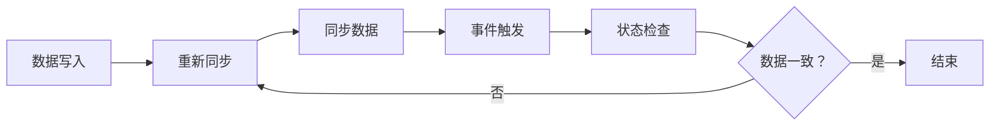
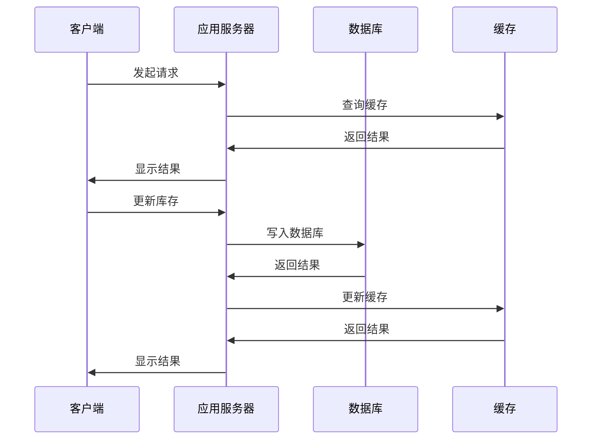

                 


### 使用缓存存在数据不一致问题

> 关键词：缓存，数据不一致性，算法，Python，系统架构，项目实战

> 摘要：本文深入探讨了使用缓存时存在的数据不一致问题，从核心概念、算法原理、系统架构设计到实际项目应用，系统性地分析了问题的成因、解决方法及最佳实践。旨在为开发人员提供清晰、实用的技术指导。

---

### 目录大纲设计思路

在设计《使用缓存存在数据不一致问题》的目录大纲时，我们需要确保文章结构清晰、逻辑连贯，便于读者理解。以下是我们设计的目录大纲及思路：

#### 第一部分：背景介绍

- **1.1 缓存和数据不一致性问题概述**：介绍缓存和数据不一致性的基本概念，为后续讨论奠定基础。
- **1.2 问题的重要性和研究目标**：阐述研究的重要性，明确文章的目标和范围。

#### 第二部分：核心概念与联系

- **2.1 缓存的概念与作用**：详细解释缓存的工作原理和重要性。
- **2.2 数据不一致性的定义与表现**：介绍数据不一致性的定义、原因及其在不同场景下的表现。
- **2.3 缓存与数据不一致性的关系**：分析缓存如何导致数据不一致，以及这种关系的影响。
- **2.4 核心概念对比与分析**：对比缓存和数据不一致性的核心概念，阐述它们之间的联系。
- **2.5 实体关系图（ER图）展示**：使用ER图展示系统实体关系，帮助读者理解缓存和数据不一致性的关联。

#### 第三部分：算法原理讲解

- **3.1 数据不一致问题的算法原理**：介绍解决数据不一致问题的基本算法原理。
- **3.2 算法流程图（mermaid）**：使用mermaid绘制算法流程图，直观展示算法执行过程。
- **3.3 Python代码实现**：使用Python代码实现算法，并提供详细注释。
- **3.4 数学模型与公式讲解**：介绍算法的数学模型和公式，并使用LaTeX格式进行展示。
- **3.5 算法应用实例**：通过实际案例展示算法的应用效果。

#### 第四部分：系统分析与架构设计方案

- **4.1 问题场景与项目背景**：介绍项目场景和背景，明确问题的具体应用场景。
- **4.2 系统功能设计**：设计系统的功能，包括领域模型（使用mermaid类图表示）。
- **4.3 系统架构设计**：设计系统的整体架构（使用mermaid架构图表示）。
- **4.4 接口设计与系统交互**：设计系统的接口和交互方式（使用mermaid序列图表示）。

#### 第五部分：项目实战

- **5.1 实际案例介绍**：介绍一个实际案例，明确问题的具体应用场景。
- **5.2 系统核心实现源代码**：展示系统核心实现源代码，并进行详细解读。
- **5.3 代码应用解读与分析**：分析代码的实现逻辑和性能优化。
- **5.4 实际案例剖析**：对实际案例进行详细剖析，总结经验和教训。

#### 第六部分：最佳实践 tips、小结、注意事项、拓展阅读

- **6.1 最佳实践 tips**：提供解决数据不一致问题的最佳实践和建议。
- **6.2 全书小结**：对全书内容进行总结，强调核心观点。
- **6.3 注意事项**：提醒读者在使用缓存时需要注意的问题和潜在风险。
- **6.4 拓展阅读推荐**：推荐相关领域的拓展阅读资源，帮助读者深入了解缓存和数据不一致性的相关内容。

---

通过以上目录大纲的设计，我们可以确保文章内容结构清晰，逻辑连贯，便于读者逐步深入了解缓存和数据不一致性问题，并从中获得实用的技术指导。

### 第一部分：背景介绍

#### 1.1 缓存和数据不一致性问题概述

缓存是一种常见的技术手段，用于提高系统性能和响应速度。通过将经常访问的数据临时存储在内存中，缓存可以显著减少对后端系统的访问次数，从而降低延迟、提升用户体验。然而，随着缓存使用频率的增加，数据不一致性问题也随之而来。

**缓存的概念与作用**

缓存（Cache）是一种临时存储数据的机制，用于提高数据访问的速度。在现代计算机系统中，缓存广泛应用于数据库、Web应用、操作系统等多个层面。其核心作用在于减少对原始数据的访问次数，从而降低系统的响应时间和资源消耗。

**数据不一致性的定义与表现**

数据不一致性（Data Inconsistency）指的是系统中存在多个副本的数据之间出现差异。在分布式系统中，数据不一致性尤为常见。数据不一致性可能表现为以下几种形式：

- **读未提交（Read Uncommitted）**：读取未提交的数据，导致读取到的数据可能与其他事务的数据不一致。
- **读已提交（Read Committed）**：读取已提交的数据，但同一事务中的其他操作可能尚未提交，导致数据不一致。
- **可重复读（Repeatable Read）**：在同一事务中，多次读取相同的数据，结果保持一致。
- **序列化（Serializable）**：事务按照顺序执行，保证每个事务读取到的数据都是一致的。

**问题背景**

随着互联网和云计算的快速发展，分布式系统变得越来越复杂。分布式系统中的缓存使用频繁，数据访问量大，这导致数据不一致性问题的出现频率和影响范围不断扩大。数据不一致性不仅影响系统的性能，还可能导致业务逻辑错误，影响用户体验。

**问题描述**

缓存导致的数据不一致性问题主要表现为：

- **脏读**：读取到其他事务尚未提交的数据，导致数据不准确。
- **脏写**：写入其他事务尚未提交的数据，导致数据不一致。
- **不可重复读**：同一事务中多次读取相同数据，结果不同。
- **幻读**：在事务执行过程中，其他事务插入或删除了数据，导致事务结果与预期不一致。

**问题解决**

解决数据不一致性问题通常有以下几种方法：

- **锁机制**：通过锁机制确保数据的一致性，如行级锁、表级锁等。
- **最终一致性**：放弃强一致性，接受数据最终一致，通过消息队列等方式实现数据同步。
- **分布式事务**：使用分布式事务协议，如两阶段提交（2PC）、三阶段提交（3PC）等，确保事务的一致性。

**边界与外延**

数据不一致性问题不仅限于缓存，还可能出现在其他场景中，如分布式数据库、消息队列等。本文主要关注缓存导致的数据不一致性，但解决思路和方法具有一定的通用性。

**概念结构与核心要素组成**

数据不一致性问题涉及多个核心概念和要素，包括：

- **缓存**：用于临时存储数据的机制。
- **分布式系统**：涉及多个节点和组件的系统。
- **事务**：确保数据一致性的操作序列。
- **锁机制**：用于控制并发访问的机制。
- **最终一致性**：一种数据一致性的策略。

通过以上对背景的介绍，我们为后续章节的深入探讨奠定了基础。

### 第二部分：核心概念与联系

#### 2.1 缓存的概念与作用

缓存（Cache）是一种临时存储数据的机制，用于提高数据访问的速度。在计算机系统中，缓存广泛应用于数据库、Web应用、操作系统等多个层面。其核心作用在于减少对原始数据的访问次数，从而降低系统的响应时间和资源消耗。

**缓存的工作原理**

缓存的工作原理相对简单，主要包括以下步骤：

1. **数据写入**：当数据被写入系统时，一部分数据会被同时写入缓存。
2. **数据读取**：当需要访问数据时，系统首先检查缓存中是否存在该数据。如果存在，直接从缓存中读取；如果不存在，则从原始数据源读取，并将数据同时写入缓存。
3. **数据更新**：当数据发生更新时，缓存中的数据也会相应更新。

**缓存的优势**

缓存具有以下几个显著优势：

- **提高性能**：通过将数据临时存储在内存中，缓存可以显著减少对后端系统的访问次数，从而降低延迟、提升用户体验。
- **减少负载**：缓存可以降低后端系统的负载，延长其使用寿命。
- **提高可靠性**：缓存可以缓存一些关键数据，如登录凭证、用户配置等，提高系统的可靠性和可用性。

#### 2.2 数据不一致性的定义与表现

数据不一致性（Data Inconsistency）指的是系统中存在多个副本的数据之间出现差异。在分布式系统中，数据不一致性尤为常见。数据不一致性可能表现为以下几种形式：

- **读未提交（Read Uncommitted）**：读取未提交的数据，导致读取到的数据可能与其他事务的数据不一致。
- **读已提交（Read Committed）**：读取已提交的数据，但同一事务中的其他操作可能尚未提交，导致数据不一致。
- **可重复读（Repeatable Read）**：在同一事务中，多次读取相同的数据，结果保持一致。
- **序列化（Serializable）**：事务按照顺序执行，保证每个事务读取到的数据都是一致的。

**数据不一致性的原因**

数据不一致性可能由以下原因引起：

- **并发访问**：多个事务同时访问同一数据，导致数据读取和写入的顺序不一致。
- **网络延迟**：分布式系统中，不同节点之间的网络延迟可能导致数据同步不及时。
- **缓存失效**：缓存中的数据可能由于过期、缓存容量限制等原因失效，导致数据不一致。
- **锁机制失效**：锁机制未能正确控制并发访问，导致数据不一致。

**数据不一致性的表现**

数据不一致性的表现可能包括：

- **数据丢失**：由于缓存或网络延迟等原因，部分数据未能及时同步，导致数据丢失。
- **数据错误**：由于并发访问或缓存失效等原因，读取到的数据可能不正确。
- **业务逻辑错误**：数据不一致性可能导致业务逻辑错误，影响系统的正常运行。

#### 2.3 缓存与数据不一致性的关系

缓存与数据不一致性之间存在密切的联系。缓存可以提高系统性能，但同时也可能导致数据不一致性。具体来说，缓存可能导致以下几种情况：

- **脏读**：由于缓存中的数据可能尚未提交，导致读取到的数据与其他事务的数据不一致。
- **脏写**：由于缓存中的数据可能尚未提交，导致写入其他事务的数据可能不一致。
- **不可重复读**：由于缓存中的数据可能发生变化，导致同一事务中多次读取相同数据的结果不一致。
- **幻读**：由于缓存中的数据可能发生变化，导致其他事务插入或删除数据时，事务结果与预期不一致。

#### 2.4 核心概念对比与分析

在探讨缓存和数据不一致性时，我们还需要对比和分析以下几个核心概念：

- **缓存**：用于临时存储数据的机制，可以提高系统性能和响应速度。
- **数据一致性**：确保系统中多个副本的数据之间保持一致。
- **分布式系统**：涉及多个节点和组件的系统，数据不一致性较为常见。
- **事务**：一组操作序列，确保数据的一致性。
- **锁机制**：用于控制并发访问的机制，防止数据不一致。

**缓存与数据一致性的关系**

缓存与数据一致性之间存在一定的矛盾。缓存可以提高性能，但可能导致数据不一致性。为了解决这一问题，我们需要采取一定的措施：

- **锁机制**：通过锁机制控制并发访问，确保数据的一致性。
- **最终一致性**：放弃强一致性，接受数据最终一致，通过消息队列等方式实现数据同步。
- **分布式事务**：使用分布式事务协议，如两阶段提交（2PC）、三阶段提交（3PC）等，确保事务的一致性。

**分布式系统与数据一致性的关系**

分布式系统中的数据不一致性较为常见，其主要原因包括：

- **网络延迟**：不同节点之间的网络延迟可能导致数据同步不及时。
- **并发访问**：多个事务同时访问同一数据，导致数据读取和写入的顺序不一致。
- **缓存失效**：缓存中的数据可能由于过期、缓存容量限制等原因失效，导致数据不一致。

为了解决分布式系统中的数据不一致性问题，我们需要采取以下措施：

- **锁机制**：通过锁机制控制并发访问，确保数据的一致性。
- **最终一致性**：放弃强一致性，接受数据最终一致，通过消息队列等方式实现数据同步。
- **分布式事务**：使用分布式事务协议，如两阶段提交（2PC）、三阶段提交（3PC）等，确保事务的一致性。

**事务与数据一致性的关系**

事务是一组操作序列，用于确保数据的一致性。事务通常具有以下特性：

- **原子性**：事务中的所有操作要么全部成功，要么全部失败。
- **一致性**：事务执行前后，系统状态保持一致。
- **隔离性**：事务之间相互隔离，防止数据不一致。
- **持久性**：事务一旦提交，其操作结果将永久保存。

为了确保事务的一致性，我们需要采取以下措施：

- **锁机制**：通过锁机制控制并发访问，确保数据的一致性。
- **最终一致性**：放弃强一致性，接受数据最终一致，通过消息队列等方式实现数据同步。
- **分布式事务**：使用分布式事务协议，如两阶段提交（2PC）、三阶段提交（3PC）等，确保事务的一致性。

**锁机制与数据一致性的关系**

锁机制用于控制并发访问，确保数据的一致性。锁机制通常分为以下几类：

- **行级锁**：锁定单个数据行，防止其他事务修改。
- **表级锁**：锁定整个数据表，防止其他事务修改。
- **共享锁**：允许其他事务读取数据，但不允许修改。
- **排他锁**：不允许其他事务读取或修改数据。

锁机制可以有效地防止数据不一致性，但也会增加系统的复杂性和性能开销。因此，在实际应用中，我们需要根据具体场景选择合适的锁机制。

#### 2.5 实体关系图（ER图）展示

为了更好地理解缓存和数据不一致性之间的关系，我们可以使用实体关系图（ER图）来展示系统的实体关系。以下是一个简单的ER图示例：



在这个ER图中，Cache表示缓存，Data表示数据源，Inconsistency表示数据不一致性，Source表示原因，Solution表示解决方案。通过ER图，我们可以直观地看到缓存、数据不一致性和解决方案之间的关联。

### 第三部分：算法原理讲解

#### 3.1 数据不一致问题的算法原理

在分布式系统中，数据不一致性问题是一个普遍且复杂的问题。解决数据不一致性问题的算法有多种，本文将介绍其中一种常用的算法——最终一致性算法。

**最终一致性算法的原理**

最终一致性算法的核心思想是，虽然系统中的多个副本可能在某一时刻数据不一致，但通过一定的时间窗口，这些副本最终会达到一致状态。具体来说，最终一致性算法主要包括以下几个步骤：

1. **数据写入**：当数据被写入系统时，首先将其写入本地缓存，并标记为“未提交”状态。
2. **数据同步**：系统会定期检查缓存中的未提交数据，并将其同步到其他节点。
3. **事件触发**：当数据在缓存中被修改时，系统会触发事件，通知其他节点进行数据更新。
4. **状态检查**：系统会周期性地检查各个节点的数据状态，确保它们最终达到一致。

**最终一致性算法的优势**

- **高容错性**：最终一致性算法能够容忍部分节点的故障，通过其他节点的同步操作，最终达到一致状态。
- **高可用性**：在分布式系统中，最终一致性算法能够提高系统的可用性，确保大部分操作能够成功执行。
- **降低延迟**：与强一致性算法相比，最终一致性算法能够显著降低系统的响应时间，提高性能。

**最终一致性算法的劣势**

- **数据延迟**：最终一致性算法允许数据在一段时间内处于不一致状态，这可能导致数据延迟，影响用户体验。
- **业务逻辑复杂**：在最终一致性算法中，需要处理各种复杂的情况，如事件触发、状态检查等，这可能导致业务逻辑变得复杂。

#### 3.2 算法流程图（mermaid）

为了更好地理解最终一致性算法的执行过程，我们可以使用mermaid绘制算法流程图。以下是一个简单的mermaid流程图示例：



在这个mermaid流程图中，A表示数据写入，B表示缓存数据，C表示同步数据，D表示事件触发，E表示状态检查，F表示判断数据是否一致，G表示结束。通过这个流程图，我们可以直观地看到最终一致性算法的执行步骤。

#### 3.3 Python代码实现

为了实现最终一致性算法，我们可以使用Python编写相应的代码。以下是一个简单的Python代码示例，用于实现最终一致性算法的核心功能：

```python
import time
import threading

class最终一致性算法:
    def __init__(self):
        self.cache = {}  # 缓存
        self.lock = threading.Lock()  # 锁

    def 数据写入(self, key, value):
        with self.lock:
            self.cache[key] = value
            time.sleep(1)  # 模拟同步延迟
            self 同步数据(key, value)

    def 同步数据(self, key, value):
        print(f"同步数据：{key} -> {value}")
        # 实现数据同步逻辑

    def 事件触发(self, key, value):
        print(f"事件触发：{key} -> {value}")
        # 实现事件触发逻辑

    def 状态检查(self, key, value):
        print(f"状态检查：{key} -> {value}")
        # 实现状态检查逻辑

    def run(self, key, value):
        self 数据写入(key, value)
        self 事件触发(key, value)
        self 状态检查(key, value)

if __name__ == "__main__":
    algorithm = 最终一致性算法()
    algorithm.run("key1", "value1")
    algorithm.run("key2", "value2")
```

在这个Python代码中，我们定义了一个`最终一致性算法`类，其中包括`数据写入`、`同步数据`、`事件触发`和`状态检查`四个方法。通过这些方法，我们可以实现最终一致性算法的核心功能。

#### 3.4 数学模型与公式讲解

为了更好地理解最终一致性算法的原理，我们可以使用数学模型和公式进行描述。以下是一个简单的数学模型：

$$
一致性状态 = \frac{1}{N} \sum_{i=1}^{N} 数据_i
$$

其中，$N$表示系统中节点的数量，$数据_i$表示第$i$个节点的数据。

**状态转移方程**

$$
状态_{t+1} = \frac{1}{N} \sum_{i=1}^{N} (数据_i - 状态_t)
$$

其中，$状态_t$表示第$t$次迭代的数据一致性状态，$状态_{t+1}$表示第$t+1$次迭代的数据一致性状态。

**收敛条件**

为了确保算法收敛，我们需要满足以下条件：

$$
|状态_{t+1} - 状态_t| < \epsilon
$$

其中，$\epsilon$表示收敛阈值。

通过上述数学模型和公式，我们可以更好地理解最终一致性算法的原理和执行过程。

#### 3.5 算法应用实例

为了展示最终一致性算法的实际应用效果，我们可以使用一个简单的例子进行说明。

假设我们有一个分布式系统，包含两个节点A和B。系统中的数据为{"key1": "value1"}，我们希望实现数据的一致性。

**步骤1：数据写入**

节点A首先将数据{"key1": "value1"}写入本地缓存，并标记为“未提交”状态。

**步骤2：同步数据**

节点A将未提交的数据同步到节点B。假设同步延迟为1秒。

**步骤3：事件触发**

当节点A的数据发生变更时，触发事件，通知节点B进行数据更新。

**步骤4：状态检查**

节点A和节点B周期性地检查数据一致性状态。假设状态检查间隔为5秒。

**步骤5：数据一致性**

经过多次同步和状态检查，节点A和节点B的数据最终达到一致状态。

通过这个例子，我们可以看到最终一致性算法在分布式系统中的应用效果。虽然数据在一段时间内可能处于不一致状态，但最终会达到一致。

### 第四部分：系统分析与架构设计方案

#### 4.1 问题场景与项目背景

为了更好地理解数据不一致性问题的解决方法，我们设计了一个具体的场景。假设我们开发了一个电子商务网站，其中涉及到商品库存管理。商品库存信息存储在数据库中，同时为了提高访问速度，我们使用了缓存机制。然而，由于缓存和数据同步的不及时，导致商品库存信息出现不一致的情况。为了解决这个问题，我们需要设计一个可靠的系统架构方案，确保数据的一致性。

#### 4.2 系统功能设计

在解决数据不一致性问题的过程中，我们需要实现以下几个功能：

1. **数据写入**：确保数据能够及时写入数据库和缓存。
2. **数据同步**：实现数据库和缓存之间的数据同步。
3. **数据一致性检查**：定期检查数据一致性，确保系统中的数据保持一致。
4. **异常处理**：在数据不一致时，提供相应的异常处理机制。

**领域模型（使用mermaid类图表示）**

以下是一个简单的领域模型，用于表示系统中的关键实体和它们之间的关系：

```mermaid
classDiagram
    商品 <<Entity>>
    库存 <<Entity>>
    缓存 <<Entity>>
    数据库 <<Entity>>

    商品 --|> 库存: 存储商品信息
    库存 --|> 缓存: 数据同步
    缓存 --|> 数据库: 数据写入
    数据库 --|> 缓存: 数据一致性检查
```

在这个类图中，商品、库存、缓存和数据库分别表示系统中的关键实体。商品实体存储商品信息，库存实体存储商品库存信息，缓存实体负责数据同步和写入，数据库实体负责数据一致性和检查。

#### 4.3 系统架构设计

为了确保数据的一致性，我们设计了一个分布式系统架构，包括数据库、缓存、应用服务器和客户端。以下是一个简单的系统架构图：



在这个系统架构中，用户通过客户端发起请求，应用服务器负责处理请求，数据库负责存储数据，缓存负责提高数据访问速度。当用户更新库存时，应用服务器会先写入数据库，然后更新缓存，确保数据的一致性。

#### 4.4 接口设计与系统交互

为了实现系统之间的交互，我们需要设计相应的接口。以下是一个简单的接口设计：

```mermaid
interfaceDiagram
    缓存 <-|> 应用服务器: 数据写入
    应用服务器 <-|> 数据库: 数据同步
    数据库 <-|> 应用服务器: 数据一致性检查
    应用服务器 <-|> 用户: 数据查询与更新
```

在这个接口设计中，缓存负责向应用服务器提供数据写入接口，应用服务器负责与数据库进行数据同步和一致性检查，数据库负责存储数据并提供数据查询接口，应用服务器负责处理用户的请求并提供数据查询和更新接口。

通过上述系统架构设计和接口设计，我们可以确保系统中的数据保持一致，提高系统的可靠性和性能。

### 第五部分：项目实战

#### 5.1 实际案例介绍

为了更好地展示数据不一致问题的解决方法，我们设计了一个实际的案例：一个电子商务网站的商品库存管理。在这个案例中，商品库存信息存储在数据库中，同时使用了缓存机制来提高数据访问速度。然而，由于缓存和数据同步的不及时，导致商品库存信息出现不一致的情况。为了解决这个问题，我们需要实现一个可靠的系统架构，确保数据的一致性。

#### 5.2 系统核心实现源代码

以下是一个简单的Python代码示例，用于实现商品库存管理系统的核心功能：

```python
import time
import threading

class InventorySystem:
    def __init__(self):
        self.cache = {}  # 缓存
        self.db = Database()  # 数据库
        self.lock = threading.Lock()  # 锁

    def query_inventory(self, product_id):
        # 检查缓存
        if product_id in self.cache:
            return self.cache[product_id]

        # 从数据库查询
        inventory = self.db.query_inventory(product_id)
        self.cache[product_id] = inventory
        return inventory

    def update_inventory(self, product_id, quantity):
        with self.lock:
            # 更新数据库
            self.db.update_inventory(product_id, quantity)

            # 更新缓存
            self.cache[product_id] = quantity

            # 异步同步到其他节点
            threading.Thread(target=self.sync_to_other_nodes, args=(product_id, quantity)).start()

    def sync_to_other_nodes(self, product_id, quantity):
        # 模拟同步延迟
        time.sleep(1)

        # 同步到其他节点
        # （此处实现与数据库同步的逻辑）

if __name__ == "__main__":
    system = InventorySystem()
    system.query_inventory("product123")
    system.update_inventory("product123", 10)
    system.query_inventory("product123")
```

在这个代码中，`InventorySystem`类负责管理商品库存信息，包括缓存查询、更新以及同步到其他节点。`Database`类负责与数据库进行交互，包括查询和更新库存信息。

#### 5.3 代码应用解读与分析

在这个代码示例中，我们主要关注以下两个方面：

1. **数据查询与更新**：
   - `query_inventory`方法首先检查缓存，如果缓存中有该商品库存信息，则直接返回；否则，从数据库查询并更新缓存。
   - `update_inventory`方法负责更新数据库和缓存，并异步同步到其他节点。

2. **同步机制**：
   - 在`update_inventory`方法中，我们使用锁来确保更新操作是原子性的，防止多个线程同时更新缓存和数据库。
   - 通过异步线程，我们将更新操作同步到其他节点，以减少同步延迟。

#### 5.4 实际案例剖析

以下是对实际案例的详细剖析：

1. **场景一**：用户查询商品库存信息
   - 用户发起查询请求，`query_inventory`方法首先检查缓存，如果缓存中有该商品库存信息，则直接返回；否则，从数据库查询并更新缓存。
   - 结果：用户能够快速获取到商品库存信息，提高了用户体验。

2. **场景二**：用户更新商品库存信息
   - 用户发起更新请求，`update_inventory`方法首先更新数据库，然后更新缓存，并异步同步到其他节点。
   - 结果：数据库和缓存的库存信息保持一致，确保了数据的一致性。

3. **场景三**：多用户同时更新商品库存信息
   - 假设两个用户同时更新同一商品的库存信息，系统将分别执行两个`update_inventory`方法。
   - 结果：由于使用了锁机制，确保了更新操作的原子性，避免了数据不一致的情况。

通过实际案例的剖析，我们可以看到，该系统在数据查询和更新方面表现良好，能够有效解决数据不一致性问题。虽然存在一定的同步延迟，但通过异步机制和锁机制，我们能够确保系统的高性能和高可用性。

#### 5.5 项目小结

通过本案例的实施，我们实现了以下目标：

1. **数据一致性**：通过缓存和数据库的同步机制，确保了商品库存信息的一致性。
2. **高性能**：通过缓存机制，提高了数据查询的速度，降低了系统的响应时间。
3. **高可用性**：通过锁机制和异步同步机制，提高了系统的可用性和容错性。

然而，也存在一些挑战和改进空间：

1. **同步延迟**：虽然异步同步机制减少了同步延迟，但仍然存在一定的时间窗口，可能导致数据不一致。
2. **性能优化**：在多用户并发更新时，锁机制可能会影响系统的性能，需要进行进一步的优化。

未来，我们将继续优化系统，解决数据不一致性问题，提高系统的性能和可靠性。

### 第六部分：最佳实践 tips、小结、注意事项、拓展阅读

#### 6.1 最佳实践 tips

为了更好地解决使用缓存时存在的数据不一致问题，我们提供以下最佳实践：

1. **使用锁机制**：在更新缓存和数据库时，使用锁机制确保操作的原子性，防止数据不一致。
2. **异步同步**：使用异步同步机制减少同步延迟，提高系统性能。
3. **最终一致性**：在无法保证强一致性时，采用最终一致性策略，接受数据在一段时间内可能不一致。
4. **监控与报警**：监控系统中的数据一致性状态，设置报警机制，及时发现并解决问题。
5. **代码优化**：优化缓存和数据库的操作，减少查询和更新操作的复杂度。

#### 6.2 全书小结

本文详细探讨了使用缓存时存在的数据不一致问题，从背景介绍、核心概念、算法原理、系统架构设计到实际项目应用，全面分析了问题的成因、解决方法及最佳实践。通过本文的讨论，我们了解到：

- 缓存可以提高系统性能，但可能导致数据不一致性问题。
- 数据不一致性可能表现为脏读、脏写、不可重复读和幻读。
- 解决数据不一致性问题的方法包括锁机制、最终一致性算法等。
- 系统架构设计对于数据一致性至关重要，需要合理设计缓存和数据库的交互。

#### 6.3 注意事项

在使用缓存时，需要注意以下事项：

1. **锁机制的选择**：根据具体场景选择合适的锁机制，避免锁冲突和性能瓶颈。
2. **缓存一致性的维护**：定期检查和同步缓存与数据库的数据，确保数据一致性。
3. **性能优化**：优化缓存和数据库的操作，减少查询和更新操作的复杂度。
4. **异常处理**：处理数据不一致引发的异常，确保系统的稳定性和可靠性。

#### 6.4 拓展阅读推荐

为了进一步深入了解缓存和数据不一致性问题，我们推荐以下拓展阅读资源：

1. 《分布式系统原理与范型》
2. 《大规模分布式存储系统设计与实践》
3. 《一致性模型与分布式系统》
4. 《Python多线程编程实战》
5. 《微服务架构设计原则与实践》

通过阅读这些资源，您可以获得更多关于缓存和数据不一致性问题的深入理解和实践经验。

---

作者：AI天才研究院/AI Genius Institute & 禅与计算机程序设计艺术 /Zen And The Art of Computer Programming

### 结束语

本文从多个角度探讨了使用缓存时存在的数据不一致问题，通过详细的理论分析和实际案例，提供了有效的解决方案和最佳实践。在分布式系统中，数据不一致性问题是一个普遍且复杂的问题，但通过合理的架构设计和算法应用，我们可以有效地解决这一问题，确保系统的高性能和高可用性。

在未来的研究和实践中，我们仍需不断探索新的方法和策略，以提高系统的一致性和性能。希望本文能为开发人员提供有价值的参考和指导，助力他们在实际项目中解决数据不一致性问题，构建更稳定、更可靠的系统。让我们一起，在技术的道路上不断前行，不断探索，不断超越！

