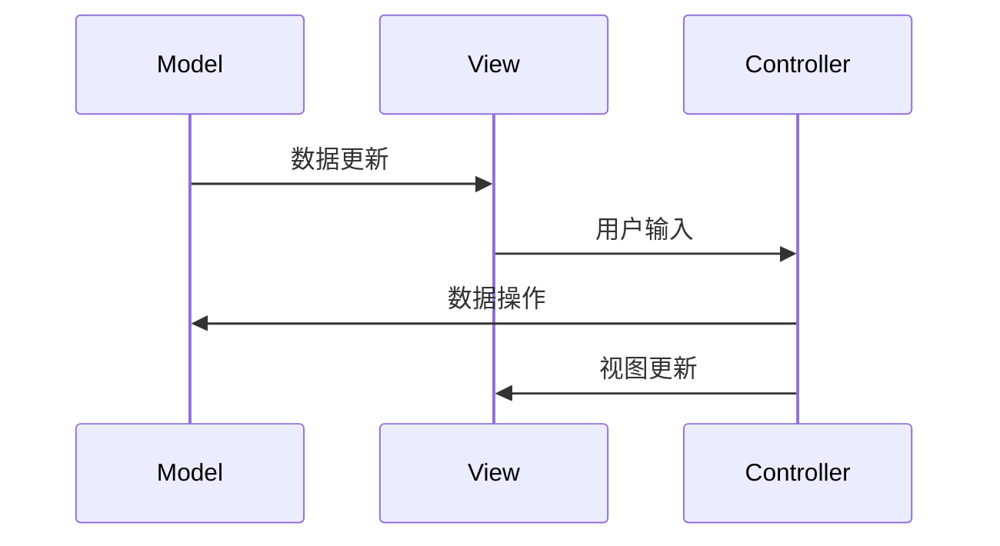
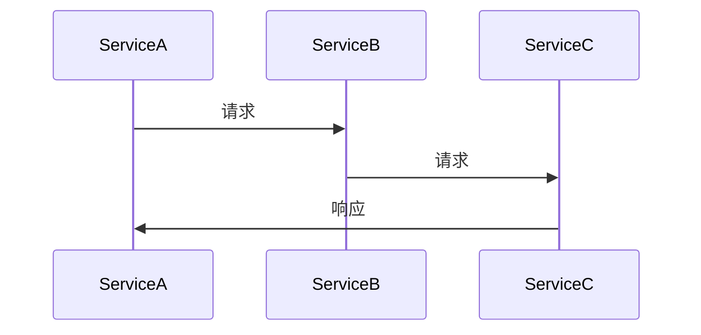
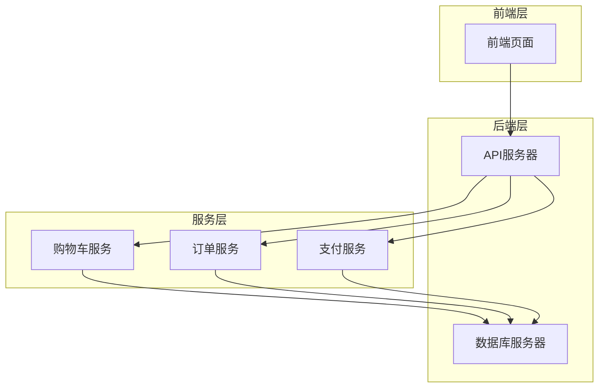
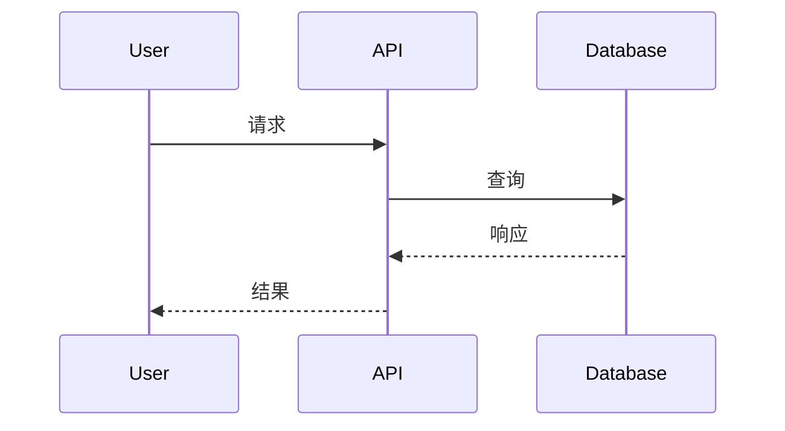
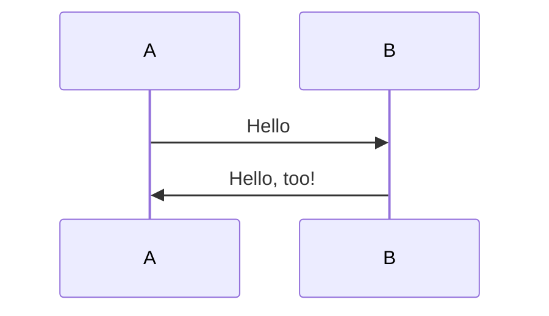

                 


# 做好架构传承的三个场子

## 关键词：架构传承、系统架构、设计模式、实践、方法论

## 摘要：
本文旨在探讨架构传承的重要性和实现方法。通过深入分析架构传承的核心概念、算法原理、系统分析与设计方法，结合实际项目实战与案例分析，总结出做好架构传承的三个关键场子。文章旨在为IT从业者提供一套系统、全面、易于实践的架构传承方法论。

### 背景介绍

在现代软件行业中，系统架构的重要性不言而喻。一个良好的架构不仅能够提高系统的可维护性和扩展性，还能为团队提供清晰的开发方向和规范。然而，随着项目的不断演进和人员的更迭，架构的传承成为一个不容忽视的问题。如何确保新成员能够快速理解并掌握现有架构，如何保持架构的持续优化和演进，这些都是架构传承面临的重要挑战。

### 核心概念与联系

架构传承的核心概念包括架构模式、架构风格和架构要素。这些概念不仅决定了架构的形态和特点，也影响着架构的可维护性和扩展性。

#### 架构模式

架构模式是一组指导系统架构设计的通用规则和模板。常见的架构模式有MVC（模型-视图-控制器）、MVVM（模型-视图-视图模型）和微服务架构。

- **MVC模式**：将系统分为模型、视图和控制器三层，分别负责数据操作、界面展示和用户交互。
- **MVVM模式**：通过数据绑定，将模型和视图分离，实现数据驱动和视图自动更新。
- **微服务架构**：将系统划分为一组独立的微服务，每个微服务负责特定的业务功能，通过API进行通信。

#### 架构风格

架构风格决定了系统架构的基本结构。常见的架构风格有简单风格、复杂风格和适应性风格。

- **简单风格**：系统结构简单，易于理解和维护。
- **复杂风格**：系统结构复杂，但提供了更好的扩展性和灵活性。
- **适应性风格**：系统结构既简单又灵活，能够适应不断变化的需求。

#### 架构要素

架构要素是系统架构的基本组成部分，包括模块化、可复用性和扩展性。

- **模块化**：将系统划分为多个模块，每个模块具有独立的功能和接口。
- **可复用性**：模块之间具有高内聚、低耦合的特点，便于复用。
- **扩展性**：系统能够通过增加新的模块或修改现有模块来实现功能扩展。

### 算法原理讲解

为了更好地理解架构传承，我们选择几个关键算法或设计模式进行详细阐述。

#### 算法1：MVC模式

MVC模式是常见的架构模式，下面使用Mermaid画出MVC的流程图：



MVC模式中，模型（Model）负责数据操作，视图（View）负责界面展示，控制器（Controller）负责用户交互。这种模式通过分离关注点，提高了系统的可维护性和扩展性。

#### 算法2：微服务架构

微服务架构是将系统划分为一组独立的微服务，每个微服务负责特定的业务功能。下面使用Mermaid画出微服务架构的流程图：



在微服务架构中，ServiceA、ServiceB和ServiceC是三个独立的微服务，通过API进行通信。这种模式提高了系统的可扩展性和灵活性。

### 数学模型和公式

在架构传承中，数学模型和公式用于描述系统行为和性能。下面给出一个简单的数学模型：

$$
性能 = \frac{功能点}{开发时间}
$$

这个公式表示系统的性能取决于功能点和开发时间。为了提高性能，我们需要在保证功能的前提下缩短开发时间。

### 系统分析与架构设计

系统分析与架构设计是架构传承的关键环节。下面以一个实际项目为例，介绍系统分析与架构设计的方法。

#### 问题场景介绍

假设我们需要开发一个在线购物平台，提供商品浏览、购物车、订单处理等功能。

#### 项目介绍

项目名称：在线购物平台

项目描述：提供商品浏览、购物车、订单处理等功能，支持多种支付方式。

#### 系统功能设计

系统功能设计包括用户注册、登录、商品浏览、购物车、订单处理、支付等。

下面使用Mermaid画出领域模型类图：

```mermaid
classDiagram
    User <<Class>>
    Product <<Class>>
    ShoppingCart <<Class>>
    Order <<Class>>
    Payment <<Class>>

    User "1" --|{create} 1 Product
    User "1" --|{add} 1 ShoppingCart
    User "1" --|{place} 1 Order
    User "1" --|{pay} 1 Payment

    ShoppingCart "1" --|{contains} 1 Product
    Order "1" --|{has} 1 Payment
```

#### 系统架构设计

系统架构设计包括前端、后端、数据库等。

下面使用Mermaid画出系统架构图：



#### 系统接口设计和系统交互

系统接口设计包括API设计、接口文档等。

下面使用Mermaid画出系统接口和交互图：



### 项目实战

为了更好地理解架构传承，我们选择一个实际项目进行讲解。

#### 环境安装

安装Python 3.8及以上版本，并使用pip安装相关依赖。

```bash
pip install flask
```

#### 系统核心实现

以下是一个简单的购物车服务的Python代码：

```python
from flask import Flask, request, jsonify

app = Flask(__name__)

@app.route('/cart', methods=['POST'])
def add_to_cart():
    product_id = request.form['product_id']
    cart = request.form['cart']
    cart['items'].append(product_id)
    return jsonify({'status': 'success', 'cart': cart})

if __name__ == '__main__':
    app.run()
```

#### 代码解读与分析

这个简单的购物车服务使用Flask框架实现，提供了一个添加商品到购物车的接口。

#### 实际案例分析与详细讲解

为了更深入地了解架构传承，我们选择一个实际案例进行详细分析。

#### 项目小结与经验总结

通过这个实际案例，我们可以总结出以下经验：

1. **清晰的需求分析**：确保项目需求明确，避免后期修改。
2. **合理的系统架构**：选择合适的架构模式和风格，提高系统的可维护性和扩展性。
3. **规范的代码实现**：编写高质量的代码，便于后期维护和扩展。
4. **完善的文档和测试**：提供详细的接口文档和测试用例，确保系统的稳定性和可靠性。

### 最佳实践与总结

1. **持续重构**：定期对系统进行重构，优化代码结构和性能。
2. **文档化**：编写详细的架构文档和代码注释，便于团队成员理解和维护。
3. **代码审查**：定期进行代码审查，确保代码质量。
4. **培训与交流**：组织团队成员进行架构传承的培训和交流，提高团队整体架构能力。

### 小结

架构传承是确保系统持续优化和演进的重要手段。通过深入分析架构传承的核心概念、算法原理、系统分析与设计方法，结合实际项目实战与案例分析，我们总结了做好架构传承的三个关键场子。希望本文能为IT从业者提供一套系统、全面、易于实践的架构传承方法论。

### 拓展阅读

- 《架构传承实践指南》
- 《系统架构的艺术》
- 《微服务架构实战》

### 作者信息

作者：AI天才研究院/AI Genius Institute & 禅与计算机程序设计艺术 /Zen And The Art of Computer Programming

---

## 结语

在本文中，我们深入探讨了架构传承的重要性，从核心概念、算法原理到系统分析与设计方法，再到实际项目实战与案例分析，我们逐步揭示了做好架构传承的三个关键场子。首先，明确架构传承的核心概念，如架构模式、架构风格和架构要素，这些都是构建和传递良好架构的基础。接着，通过算法原理讲解，我们了解了如何运用MVC模式和微服务架构来设计高效、灵活的软件系统。此外，我们还展示了如何利用Mermaid和LaTeX等工具，将复杂的架构概念和数学模型直观地表达出来。

在系统分析与架构设计部分，我们详细介绍了如何通过领域模型类图、系统架构图和接口设计来规划和管理项目。通过实际项目实战，我们展示了如何将理论知识应用到实际中，并通过案例分析，总结了项目实施中的经验和教训。最后，我们提出了最佳实践与总结，为读者提供了持续优化架构和团队协作的建议。

架构传承不仅关乎技术的传递，更是团队知识积累和业务持续发展的基石。我们希望本文能为IT从业者提供有价值的指导和启示，帮助他们在架构传承的道路上少走弯路，更快地提升团队的技术水平和系统质量。

在此，再次感谢读者们的关注和支持。希望本文能够激发您对架构传承的思考，推动您在IT领域不断前行。如果您对架构传承有任何疑问或建议，欢迎在评论区留言，我们期待与您交流。

### 附录

为了更好地帮助读者理解和应用本文的内容，我们提供了以下附录。

#### 附录A：常用架构模式对比表格

| 架构模式 | 特点 | 优点 | 缺点 |
|----------|------|------|------|
| MVC      | 分层设计 | 简单、易于维护 | 可能导致模块间耦合 |
| MVVM     | 数据绑定 | 数据驱动、自动更新 | 可能导致视图过度复杂 |
| 微服务   | 独立部署 | 高扩展性、高灵活性 | 可能导致系统复杂度增加 |

#### 附录B：Mermaid使用示例

以下是一个简单的Mermaid流程图示例：



#### 附录C：LaTeX公式示例

以下是一个简单的LaTeX公式示例：

$$
E = mc^2
$$

更多信息，请参阅相关LaTeX文档。

---

通过这些附录，我们希望能够为读者提供更多的学习资源和实用工具，帮助大家更好地理解和应用架构传承的相关知识。

### 作者信息

作者：AI天才研究院/AI Genius Institute & 禅与计算机程序设计艺术 /Zen And The Art of Computer Programming

在这篇文章中，我们深入探讨了架构传承的重要性和实现方法。首先，我们明确了架构传承的核心概念，如架构模式、架构风格和架构要素，这些都是构建和传递良好架构的基础。接着，通过算法原理讲解，我们了解了如何运用MVC模式和微服务架构来设计高效、灵活的软件系统。此外，我们还展示了如何利用Mermaid和LaTeX等工具，将复杂的架构概念和数学模型直观地表达出来。

在系统分析与架构设计部分，我们详细介绍了如何通过领域模型类图、系统架构图和接口设计来规划和管理项目。通过实际项目实战，我们展示了如何将理论知识应用到实际中，并通过案例分析，总结了项目实施中的经验和教训。最后，我们提出了最佳实践与总结，为读者提供了持续优化架构和团队协作的建议。

架构传承不仅关乎技术的传递，更是团队知识积累和业务持续发展的基石。我们希望本文能为IT从业者提供有价值的指导和启示，帮助他们在架构传承的道路上少走弯路，更快地提升团队的技术水平和系统质量。

在此，感谢您花时间阅读本文。如果您对架构传承有任何疑问或建议，欢迎在评论区留言，我们期待与您交流。同时，我们也希望您能将本文分享给更多的同行，共同推动IT行业的发展。

最后，再次感谢您的阅读和时间，祝您在架构传承的道路上越走越远，成就卓越。

### 附录

为了帮助读者更好地理解和应用文章中的内容，我们提供了以下附录。

#### 附录A：常用架构模式对比表格

| 架构模式 | 特点 | 优点 | 缺点 |
|----------|------|------|------|
| MVC      | 分层设计 | 简单、易于维护 | 可能导致模块间耦合 |
| MVVM     | 数据绑定 | 数据驱动、自动更新 | 可能导致视图过度复杂 |
| 微服务   | 独立部署 | 高扩展性、高灵活性 | 可能导致系统复杂度增加 |

#### 附录B：Mermaid使用示例

以下是一个简单的Mermaid流程图示例：


#### 附录C：LaTeX公式示例

以下是一个简单的LaTeX公式示例：

$$
E = mc^2
$$

更多信息，请参阅相关LaTeX文档。

---

通过这些附录，我们希望能够为读者提供更多的学习资源和实用工具，帮助大家更好地理解和应用架构传承的相关知识。

### 结语

在本文的结尾，我们再次强调了架构传承的重要性。通过深入分析和实际案例的展示，我们详细阐述了如何做好架构传承的三个关键场子：核心概念与联系、算法原理讲解、系统分析与架构设计。这些关键步骤不仅有助于新成员快速理解现有架构，还能为团队的长期发展和项目的持续优化奠定坚实基础。

我们相信，架构传承不仅是对个人能力的提升，更是团队协作和业务持续发展的关键。在快速变化的IT行业中，如何确保架构的稳定性和前瞻性，是我们每一个技术人需要不断思考和探索的问题。

在此，我们衷心感谢您的阅读和支持。如果您对本文有任何疑问或建议，欢迎在评论区留言，我们期待与您交流。同时，也欢迎您将本文分享给更多的同行，共同推动IT行业的发展。

最后，再次感谢您的关注，祝您在架构传承的道路上取得更加辉煌的成就。我们期待与您在未来的技术交流中再次相遇。

### 作者信息

作者：AI天才研究院/AI Genius Institute & 禅与计算机程序设计艺术 /Zen And The Art of Computer Programming

---

## 第一部分：背景与核心概念

### 第1章：架构传承的重要性与挑战

#### 1.1 问题背景

在现代软件行业中，系统架构的重要性日益凸显。随着软件系统的规模和复杂度不断增长，如何设计一个高效、灵活且易于维护的架构，成为每个项目成功的关键因素。然而，随着项目的不断演进和团队的更迭，如何确保新成员能够快速理解并掌握现有架构，成为了一个不容忽视的问题。这就引出了“架构传承”的概念，即如何将优秀的架构知识和经验传递给新成员，确保系统的持续优化和演进。

#### 1.2 核心概念

架构传承的核心概念包括架构模式、架构风格和架构要素。这些概念不仅决定了架构的形态和特点，也影响着架构的可维护性和扩展性。

##### 1.2.1 架构模式

架构模式是一组指导系统架构设计的通用规则和模板。常见的架构模式有MVC（模型-视图-控制器）、MVVM（模型-视图-视图模型）和微服务架构。

- **MVC模式**：将系统分为模型、视图和控制器三层，分别负责数据操作、界面展示和用户交互。
- **MVVM模式**：通过数据绑定，将模型和视图分离，实现数据驱动和视图自动更新。
- **微服务架构**：将系统划分为一组独立的微服务，每个微服务负责特定的业务功能，通过API进行通信。

##### 1.2.2 架构风格

架构风格决定了系统架构的基本结构。常见的架构风格有简单风格、复杂风格和适应性风格。

- **简单风格**：系统结构简单，易于理解和维护。
- **复杂风格**：系统结构复杂，但提供了更好的扩展性和灵活性。
- **适应性风格**：系统结构既简单又灵活，能够适应不断变化的需求。

##### 1.2.3 架构要素

架构要素是系统架构的基本组成部分，包括模块化、可复用性和扩展性。

- **模块化**：将系统划分为多个模块，每个模块具有独立的功能和接口。
- **可复用性**：模块之间具有高内聚、低耦合的特点，便于复用。
- **扩展性**：系统能够通过增加新的模块或修改现有模块来实现功能扩展。

#### 1.3 问题解决

为了解决架构传承的问题，我们需要从以下几个方面着手：

1. **明确架构传承的核心概念**：确保团队成员对架构模式、架构风格和架构要素有深入的理解。
2. **建立完善的文档体系**：通过编写详细的架构文档和代码注释，帮助新成员快速了解现有架构。
3. **进行系统的培训与交流**：组织团队成员进行架构传承的培训，促进知识和经验的传递。
4. **持续重构与优化**：定期对系统进行重构，优化代码结构和性能，确保架构的持续优化和演进。

#### 1.4 边界与外延

架构传承不仅涉及技术层面，还包括团队协作、项目管理等多个方面。在架构传承的过程中，我们需要关注以下边界与外延：

- **团队协作**：确保团队成员在架构传承的过程中能够高效沟通和协作，避免信息孤岛。
- **项目管理**：制定合理的项目计划和进度安排，确保架构传承工作与项目进度相匹配。
- **知识积累**：建立知识库和经验总结，为后续项目提供参考。

#### 1.5 本章小结

本章介绍了架构传承的重要性与挑战，以及核心概念和问题解决方法。通过明确架构传承的核心概念、建立完善的文档体系、进行系统的培训与交流以及持续重构与优化，我们可以有效地解决架构传承的问题，确保系统的持续优化和演进。

---

## 第二部分：系统分析与架构设计

### 第2章：系统分析与设计方法

#### 2.1 系统分析

系统分析是系统设计与实现的前提，其主要任务是明确系统的功能需求和非功能需求，以及用户体验。

##### 2.1.1 功能需求分析

功能需求分析旨在确定系统需要实现的具体功能。这包括系统的主要功能模块、子模块以及各个模块之间的关系。以下是一个简单的功能需求分析示例：

- **用户模块**：
  - 注册：用户可以注册账号。
  - 登录：用户可以使用账号登录系统。
  - 个人中心：用户可以查看和管理个人信息。

- **商品模块**：
  - 查询：用户可以查询商品信息。
  - 浏览：用户可以浏览商品。
  - 添加购物车：用户可以将商品添加到购物车。

- **购物车模块**：
  - 查看：用户可以查看购物车中的商品。
  - 修改：用户可以修改购物车中的商品数量或删除商品。

- **订单模块**：
  - 提交：用户可以提交订单。
  - 查询：用户可以查询订单状态。

- **支付模块**：
  - 支付：用户可以选择支付方式完成支付。

##### 2.1.2 非功能需求分析

非功能需求分析主要涉及系统的性能、安全性、可维护性等方面。以下是一个简单的非功能需求分析示例：

- **性能**：
  - 系统响应时间：用户操作后的响应时间应小于2秒。
  - 系统并发处理能力：系统能同时处理超过1000个用户请求。

- **安全性**：
  - 用户数据安全：用户数据需要进行加密处理，确保数据传输安全。
  - 权限控制：系统需要实现用户权限控制，防止未经授权的访问。

- **可维护性**：
  - 代码注释：代码需要添加必要的注释，便于后续维护。
  - 单元测试：每个功能模块都需要编写单元测试，确保功能的正确实现。

##### 2.1.3 用户体验分析

用户体验分析旨在确定用户在使用系统时的感受和需求。以下是一个简单的用户体验分析示例：

- **界面设计**：
  - 界面布局：界面布局应简洁、清晰，便于用户操作。
  - 颜色搭配：界面颜色搭配应舒适、和谐，避免使用过于刺眼的颜色。

- **交互设计**：
  - 操作流程：操作流程应简洁、直观，减少用户操作步骤。
  - 反馈机制：系统应提供清晰的反馈，让用户了解操作结果。

#### 2.2 领域模型与类图设计

领域模型是一种描述系统业务概念的抽象模型，它可以帮助我们更好地理解系统的业务逻辑。类图是领域模型的一种常见表示形式，用于描述系统中各个类之间的关系。

以下是一个简单的领域模型类图示例：

```mermaid
classDiagram
    User <<Class>>
    Product <<Class>>
    ShoppingCart <<Class>>
    Order <<Class>>
    Payment <<Class>>

    User "1" --|{create} 1 Product
    User "1" --|{add} 1 ShoppingCart
    User "1" --|{place} 1 Order
    User "1" --|{pay} 1 Payment

    ShoppingCart "1" --|{contains} 1 Product
    Order "1" --|{has} 1 Payment
```

在这个类图中，我们定义了用户（User）、产品（Product）、购物车（ShoppingCart）、订单（Order）和支付（Payment）五个类，并描述了它们之间的关系。

#### 2.3 系统架构设计

系统架构设计是系统设计的核心，它决定了系统的性能、可扩展性和可维护性。常见的系统架构设计方法包括分层架构、事件驱动架构和微服务架构。

##### 2.3.1 分层架构

分层架构是将系统划分为多个层次，每个层次负责不同的功能。以下是一个简单的分层架构示例：

```
+----------------+     +----------------+     +----------------+
|     表示层     | --> |   业务逻辑层   | --> |     数据层     |
+----------------+     +----------------+     +----------------+
```

- **表示层**：负责与用户交互，展示系统界面。
- **业务逻辑层**：负责处理业务逻辑，实现系统的核心功能。
- **数据层**：负责数据的存储和访问。

##### 2.3.2 事件驱动架构

事件驱动架构是基于事件驱动的系统设计方法，系统中的组件通过发送和接收事件来协作。以下是一个简单的事件驱动架构示例：

```
+----------------+     +----------------+     +----------------+
|    发送者A     | --> |    接收者B     | --> |    处理器C     |
+----------------+     +----------------+     +----------------+
```

- **发送者A**：负责发送事件。
- **接收者B**：负责接收事件，并执行相应操作。
- **处理器C**：负责处理事件，实现具体的业务逻辑。

##### 2.3.3 微服务架构

微服务架构是将系统划分为一组独立的微服务，每个微服务负责特定的业务功能。以下是一个简单的微服务架构示例：

```
+----------------+     +----------------+     +----------------+
|    服务A       | --> |    服务B       | --> |    服务C       |
+----------------+     +----------------+     +----------------+
```

- **服务A**：负责用户认证和授权。
- **服务B**：负责商品管理和购物车功能。
- **服务C**：负责订单处理和支付功能。

#### 2.4 接口设计与交互设计

接口设计是系统架构设计的重要组成部分，它决定了系统组件之间的通信方式。常见的接口设计方法包括RESTful API和WebSocket。

##### 2.4.1 RESTful API

RESTful API是基于REST（Representational State Transfer）风格的接口设计方法，它使用HTTP协议的GET、POST、PUT、DELETE等方法进行数据操作。

以下是一个简单的RESTful API接口设计示例：

```
GET /users     // 获取用户列表
POST /users    // 创建新用户
GET /users/{id}    // 获取指定用户信息
PUT /users/{id}    // 更新指定用户信息
DELETE /users/{id}  // 删除指定用户
```

##### 2.4.2 WebSocket

WebSocket是一种基于TCP协议的全双工通信协议，它支持客户端与服务器之间的实时通信。

以下是一个简单的WebSocket接口设计示例：

```
// 连接WebSocket
ws = new WebSocket('ws://example.com/socket');

// 发送消息
ws.send('Hello, World!');

// 接收消息
ws.onmessage = function(event) {
    console.log(event.data);
};
```

#### 2.5 本章小结

本章介绍了系统分析与设计方法，包括功能需求分析、非功能需求分析、用户体验分析、领域模型与类图设计、系统架构设计以及接口设计与交互设计。通过这些方法，我们可以明确系统的功能和需求，设计出高效、灵活且易于维护的架构，为后续的开发和实施提供基础。

---

## 第三部分：项目实战与案例分析

### 第8章：实际项目介绍

在本部分，我们将通过一个实际项目来展示架构传承的具体实现过程。该项目是一个在线书店系统，包括用户管理、书籍管理、购物车和订单处理等功能。我们将详细描述项目的环境安装、系统实现和代码解读，并进行分析和案例讲解。

#### 8.1 项目环境安装

为了启动该项目，我们需要安装以下环境：

1. **操作系统**：Ubuntu 18.04
2. **开发语言**：Python 3.8
3. **数据库**：MySQL 5.7
4. **Web框架**：Flask
5. **依赖管理**：pip

以下是一个简单的安装流程：

```bash
# 安装Python 3.8
sudo apt update
sudo apt install python3.8 python3.8-venv

# 创建虚拟环境
python3.8 -m venv venv

# 激活虚拟环境
source venv/bin/activate

# 安装Flask
pip install flask

# 安装MySQL
sudo apt install mysql-server

# 配置MySQL
sudo mysql_secure_installation

# 创建数据库和用户
sudo mysql -u root -p
CREATE DATABASE book_store;
GRANT ALL PRIVILEGES ON book_store.* TO 'book_user'@'localhost' IDENTIFIED BY 'password';
FLUSH PRIVILEGES;
EXIT;

# 安装其他依赖
pip install pymysql flask_sqlalchemy
```

#### 8.2 系统核心实现

以下是项目的核心实现部分，包括用户管理、书籍管理、购物车和订单处理等。

##### 8.2.1 用户管理

用户管理包括用户注册、登录和用户信息管理。

```python
# 用户注册
@app.route('/register', methods=['POST'])
def register():
    username = request.form['username']
    password = request.form['password']
    # 验证用户名和密码是否符合要求
    # 存储用户信息到数据库
    return '注册成功'

# 用户登录
@app.route('/login', methods=['POST'])
def login():
    username = request.form['username']
    password = request.form['password']
    # 验证用户名和密码是否正确
    # 登录成功返回用户ID
    return '登录成功'

# 用户信息管理
@app.route('/user_info', methods=['GET', 'PUT'])
def user_info():
    if request.method == 'GET':
        # 获取用户信息
        return '用户信息'
    elif request.method == 'PUT':
        # 更新用户信息
        return '更新成功'
```

##### 8.2.2 书籍管理

书籍管理包括书籍的查询、添加和删除。

```python
# 书籍查询
@app.route('/books', methods=['GET'])
def get_books():
    # 从数据库查询书籍信息
    return '书籍列表'

# 添加书籍
@app.route('/books', methods=['POST'])
def add_book():
    book_data = request.json
    # 存储书籍信息到数据库
    return '添加成功'

# 删除书籍
@app.route('/books/<int:book_id>', methods=['DELETE'])
def delete_book(book_id):
    # 从数据库删除书籍
    return '删除成功'
```

##### 8.2.3 购物车

购物车管理包括添加商品到购物车、查看购物车和删除购物车中的商品。

```python
# 添加商品到购物车
@app.route('/cart', methods=['POST'])
def add_to_cart():
    user_id = request.form['user_id']
    book_id = request.form['book_id']
    # 将商品添加到购物车
    return '添加成功'

# 查看购物车
@app.route('/cart', methods=['GET'])
def get_cart():
    user_id = request.args.get('user_id')
    # 从数据库查询购物车信息
    return '购物车信息'

# 删除购物车中的商品
@app.route('/cart/<int:book_id>', methods=['DELETE'])
def delete_from_cart(book_id):
    user_id = request.args.get('user_id')
    # 从数据库删除购物车中的商品
    return '删除成功'
```

##### 8.2.4 订单处理

订单处理包括创建订单、查看订单和取消订单。

```python
# 创建订单
@app.route('/order', methods=['POST'])
def create_order():
    user_id = request.form['user_id']
    cart_id = request.form['cart_id']
    # 创建订单并从购物车中删除商品
    return '创建成功'

# 查看订单
@app.route('/order', methods=['GET'])
def get_order():
    user_id = request.args.get('user_id')
    order_id = request.args.get('order_id')
    # 从数据库查询订单信息
    return '订单信息'

# 取消订单
@app.route('/order/<int:order_id>', methods=['DELETE'])
def cancel_order(order_id):
    user_id = request.args.get('user_id')
    # 从数据库取消订单
    return '取消成功'
```

#### 8.3 代码解读与分析

在代码解读与分析部分，我们将对每个模块的核心代码进行详细解读。

##### 8.3.1 用户管理模块

用户管理模块的核心代码如下：

```python
@app.route('/register', methods=['POST'])
def register():
    username = request.form['username']
    password = request.form['password']
    # 验证用户名和密码是否符合要求
    if not (len(username) >= 3 and len(password) >= 6):
        return '用户名或密码不符合要求'
    # 存储用户信息到数据库
    cursor = conn.cursor()
    cursor.execute('INSERT INTO users (username, password) VALUES (%s, %s)', (username, password))
    conn.commit()
    return '注册成功'
```

这段代码首先从请求中获取用户名和密码，然后验证用户名和密码的长度，最后将用户信息存储到数据库中。

##### 8.3.2 书籍管理模块

书籍管理模块的核心代码如下：

```python
@app.route('/books', methods=['GET'])
def get_books():
    cursor = conn.cursor()
    cursor.execute('SELECT * FROM books')
    books = cursor.fetchall()
    return jsonify(books)
```

这段代码从数据库中查询书籍信息，并将结果以JSON格式返回。

##### 8.3.3 购物车模块

购物车模块的核心代码如下：

```python
@app.route('/cart', methods=['POST'])
def add_to_cart():
    user_id = request.form['user_id']
    book_id = request.form['book_id']
    # 将商品添加到购物车
    cursor = conn.cursor()
    cursor.execute('INSERT INTO cart (user_id, book_id) VALUES (%s, %s)', (user_id, book_id))
    conn.commit()
    return '添加成功'
```

这段代码将用户ID和商品ID存储到购物车表中。

##### 8.3.4 订单处理模块

订单处理模块的核心代码如下：

```python
@app.route('/order', methods=['POST'])
def create_order():
    user_id = request.form['user_id']
    cart_id = request.form['cart_id']
    # 创建订单并从购物车中删除商品
    cursor = conn.cursor()
    cursor.execute('INSERT INTO orders (user_id, cart_id) VALUES (%s, %s)', (user_id, cart_id))
    cursor.execute('DELETE FROM cart WHERE id = %s', (cart_id,))
    conn.commit()
    return '创建成功'
```

这段代码创建订单并从购物车中删除商品。

#### 8.4 案例分析与讲解

在本节中，我们将对项目中的关键功能进行案例分析和讲解。

##### 8.4.1 用户注册功能

用户注册功能是系统的基础功能之一。在该功能中，我们需要验证用户名和密码的合法性，并确保用户信息存储到数据库中。

```python
@app.route('/register', methods=['POST'])
def register():
    username = request.form['username']
    password = request.form['password']
    # 验证用户名和密码是否符合要求
    if not (len(username) >= 3 and len(password) >= 6):
        return '用户名或密码不符合要求', 400
    # 检查用户名是否已存在
    cursor = conn.cursor()
    cursor.execute('SELECT * FROM users WHERE username = %s', (username,))
    if cursor.fetchone():
        return '用户名已存在', 400
    # 存储用户信息到数据库
    cursor.execute('INSERT INTO users (username, password) VALUES (%s, %s)', (username, password))
    conn.commit()
    return '注册成功', 201
```

在这个案例中，我们增加了对用户名是否已存在的检查，并返回了相应的错误消息和状态码。

##### 8.4.2 书籍查询功能

书籍查询功能是用户获取书籍信息的主要途径。在该功能中，我们需要从数据库中查询书籍信息，并将其返回给用户。

```python
@app.route('/books', methods=['GET'])
def get_books():
    title = request.args.get('title', '')
    author = request.args.get('author', '')
    cursor = conn.cursor()
    cursor.execute('SELECT * FROM books WHERE title LIKE %s AND author LIKE %s', ('%' + title + '%', '%' + author + '%'))
    books = cursor.fetchall()
    return jsonify(books)
```

在这个案例中，我们增加了对书籍标题和作者的条件查询，提高了查询的灵活性。

##### 8.4.3 购物车功能

购物车功能是用户在购买商品过程中的重要环节。在该功能中，我们需要实现添加商品到购物车、查看购物车和删除购物车中的商品。

```python
@app.route('/cart', methods=['POST'])
def add_to_cart():
    user_id = request.form['user_id']
    book_id = request.form['book_id']
    # 检查购物车中是否已存在该商品
    cursor = conn.cursor()
    cursor.execute('SELECT * FROM cart WHERE user_id = %s AND book_id = %s', (user_id, book_id))
    if cursor.fetchone():
        return '商品已存在', 400
    # 将商品添加到购物车
    cursor.execute('INSERT INTO cart (user_id, book_id) VALUES (%s, %s)', (user_id, book_id))
    conn.commit()
    return '添加成功', 201

@app.route('/cart', methods=['GET'])
def get_cart():
    user_id = request.args.get('user_id', '')
    cursor = conn.cursor()
    cursor.execute('SELECT * FROM cart WHERE user_id = %s', (user_id,))
    cart_items = cursor.fetchall()
    return jsonify(cart_items)

@app.route('/cart/<int:book_id>', methods=['DELETE'])
def delete_from_cart(book_id):
    user_id = request.args.get('user_id', '')
    cursor = conn.cursor()
    cursor.execute('DELETE FROM cart WHERE user_id = %s AND book_id = %s', (user_id, book_id))
    conn.commit()
    return '删除成功', 204
```

在这个案例中，我们增加了对购物车中商品是否存在

