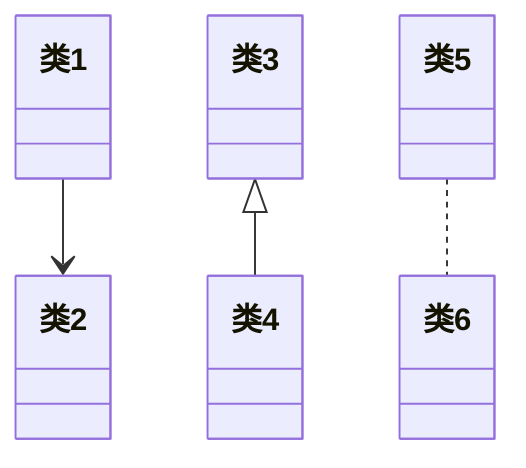
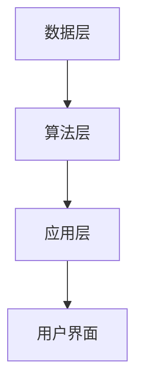
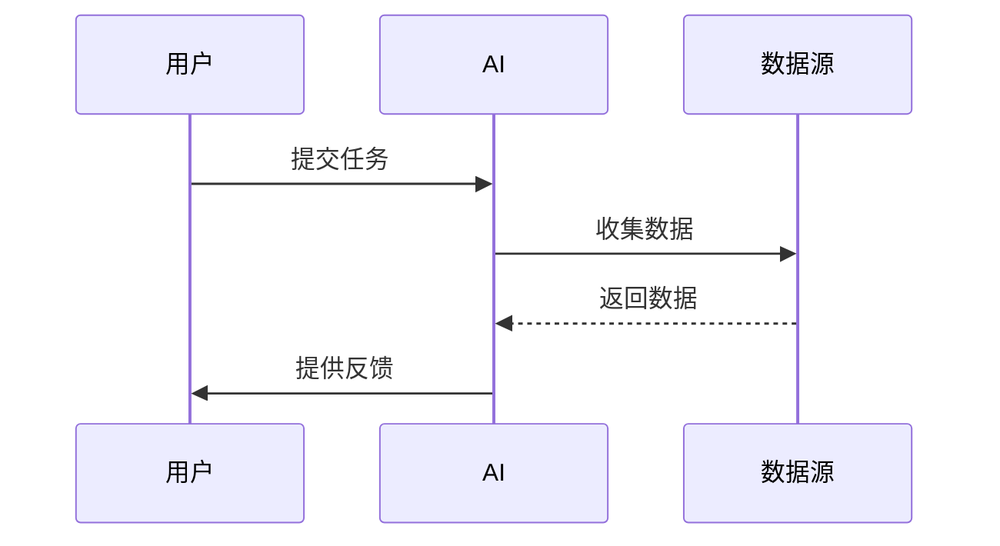

                 

### 文章标题

# 元认知AI Agent：自我监控与调节

> 关键词：元认知AI Agent，自我监控，自我调节，人工智能，教育，工业控制

> 摘要：本文深入探讨了元认知AI Agent的概念、原理和应用场景。通过逐步分析，我们揭示了元认知AI Agent如何通过自我监控与调节，提高人工智能系统的性能和效率。文章还针对教育领域和工业控制领域的应用案例进行了详细分析，以展示元认知AI Agent的广泛潜力。

----------------------------------------------------------------

## 引言

在人工智能（AI）快速发展的今天，如何提升智能系统的自适应能力和智能化水平，成为了关键问题。元认知AI Agent作为一种具备自我监控与调节能力的智能代理，逐渐成为研究热点。元认知AI Agent不仅能够执行特定任务，还能在执行过程中不断调整自己的行为，以优化任务执行效果。这种自适应性为人工智能系统带来了全新的可能性。

本文将从以下几个方面进行探讨：

1. **元认知AI Agent的基本概念与背景**：介绍元认知AI Agent的定义、重要性、发展历程和核心特性。
2. **元认知机制原理**：分析元认知AI Agent的自我监控、自我评估和自我调节原理。
3. **元认知AI Agent的应用场景**：探讨元认知AI Agent在教育领域和工业控制领域的应用案例。
4. **元认知AI Agent的开发与实现**：介绍元认知AI Agent的开发工具与框架，并展示具体实现过程。

通过以上探讨，我们希望对元认知AI Agent有一个全面深入的理解，并探讨其在实际应用中的潜力。

### 第一部分：元认知AI Agent的基本概念

#### 第1章：元认知AI Agent：概念与背景

##### 1.1 元认知AI Agent的定义与重要性

- **元认知AI Agent的定义**：

元认知AI Agent是指具备自我监控、自我评估和自我调节能力的智能代理。它不仅能够执行任务，还能在执行过程中不断调整自己的行为，以提高性能和效率。这种智能代理可以应用于各种场景，如教育、工业控制、医疗等。

- **元认知AI Agent的重要性**：

随着人工智能技术的快速发展，元认知AI Agent在各个领域中的应用越来越广泛。它能够帮助提高系统的自适应能力和智能化水平。例如，在教育领域，元认知AI Agent可以帮助学生进行个性化学习，提供智能辅导；在工业控制领域，元认知AI Agent可以实现对生产过程的实时监控和自主调节，提高生产效率。

##### 1.2 元认知AI Agent的发展历程

- **早期的尝试**：

早在20世纪80年代，研究人员就开始探索元认知的概念，并在儿童教育和学习辅助系统中尝试应用。例如，美国斯坦福大学的研究人员开发了一个名为“智能顾问”（Intelligent Tutoring System）的系统，用于帮助学生进行数学学习。

- **现代技术进步**：

随着深度学习和强化学习等技术的成熟，元认知AI Agent的研究和应用得到了极大的推动。例如，深度学习技术可以用于构建复杂的元认知模型，强化学习技术可以用于实现AI Agent的自我调节能力。

##### 1.3 元认知AI Agent的核心特性

- **自我监控**：

元认知AI Agent能够实时监控自己的行为和状态，以识别可能的错误或异常。例如，在教育领域，元认知AI Agent可以监控学生的学习行为，识别学习困难点；在工业控制领域，元认知AI Agent可以监控生产过程，识别潜在的问题。

- **自我评估**：

通过分析自身行为，元认知AI Agent能够评估任务的完成情况和效果。例如，在教育领域，元认知AI Agent可以评估学生的学习效果，给出改进建议；在工业控制领域，元认知AI Agent可以评估生产过程的效率，提出优化方案。

- **自我调节**：

基于评估结果，元认知AI Agent能够调整自己的行为策略，以优化任务执行。例如，在教育领域，元认知AI Agent可以根据学生的学习效果，调整教学策略；在工业控制领域，元认知AI Agent可以根据生产过程的反馈，调整生产参数。

#### 第2章：元认知机制原理

##### 2.1 元认知机制的基本原理

- **元认知循环**：

元认知AI Agent通过不断的循环过程，实现对自身行为的监控、评估和调节。这个过程可以分为以下几个步骤：

1. **监控**：实时收集自身行为和状态的数据。
2. **评估**：分析数据，评估自身行为的性能和效果。
3. **调节**：根据评估结果，调整自身的策略和行为。

- **元认知模型**：

基于心理学和认知科学的研究成果，可以构建元认知模型来描述AI Agent的元认知过程。例如，可以将元认知模型分为三个层次：感知层、认知层和决策层。

1. **感知层**：感知自身行为和状态的数据，如学生的学习行为、生产过程的数据。
2. **认知层**：分析数据，形成对自身行为的理解和评估。
3. **决策层**：基于评估结果，制定调节策略，调整自身行为。

##### 2.2 自我监控原理

- **实时监控**：

元认知AI Agent利用传感器和数据采集技术，实时收集执行过程中的信息。例如，在教育领域，可以通过监控学生的学习行为，如点击、答题等，收集数据；在工业控制领域，可以通过传感器收集生产过程中的温度、湿度等数据。

- **异常检测**：

通过分析实时数据，识别执行过程中可能出现的异常或错误。例如，在教育领域，可以通过分析学习行为数据，识别学习困难点；在工业控制领域，可以通过分析传感器数据，识别潜在的问题。

##### 2.3 自我评估原理

- **性能指标**：

定义一系列性能指标，用于评估AI Agent的执行效果。例如，在教育领域，可以定义学习效率、正确率等指标；在工业控制领域，可以定义生产效率、设备运行状态等指标。

- **反馈机制**：

建立反馈机制，将评估结果用于指导后续的任务执行。例如，在教育领域，可以通过反馈机制，调整教学策略，提高学生的学习效果；在工业控制领域，可以通过反馈机制，调整生产参数，提高生产效率。

##### 2.4 自我调节原理

- **策略调整**：

根据评估结果，调整AI Agent的行为策略，以提高任务执行的效果。例如，在教育领域，可以根据学生的学习效果，调整教学策略；在工业控制领域，可以根据生产过程的反馈，调整生产参数。

- **学习机制**：

通过经验积累和模型优化，不断提高AI Agent的自我调节能力。例如，在教育领域，可以通过学习学生的反馈，优化教学策略；在工业控制领域，可以通过学习生产数据，优化生产参数。

### 第二部分：元认知AI Agent的应用场景

#### 第3章：元认知AI Agent在教育领域的应用

##### 3.1 元认知AI Agent在个性化学习中的应用

- **学习路径推荐**：

元认知AI Agent可以基于学生的元认知数据，为每个学生制定个性化的学习路径。例如，通过分析学生的学习行为数据，识别学生的学习风格和偏好，然后根据这些信息推荐合适的学习资源和任务。

- **学习效果评估**：

通过监控学生的学习行为，实时评估学习效果，并给出改进建议。例如，通过分析学生的学习数据，识别学习困难点，然后根据这些信息提供针对性的辅导和练习。

##### 3.2 元认知AI Agent在在线教育平台的应用

- **学习行为分析**：

对学生在在线教育平台上的行为进行分析，识别学生的学习需求和问题。例如，通过分析学生的点击、浏览、答题等行为数据，了解学生的学习兴趣和难点。

- **智能辅导**：

基于元认知数据，为学生提供个性化的辅导服务。例如，通过分析学生的学习数据，识别学习困难点，然后根据这些信息提供针对性的辅导和练习，帮助学生克服学习障碍。

#### 第4章：元认知AI Agent在工业控制领域的应用

##### 4.1 元认知AI Agent在自动化生产线中的应用

- **实时监控**：

对生产过程中的各个环节进行实时监控，及时发现并处理异常情况。例如，通过传感器收集生产线上的温度、压力等数据，实时监控生产过程的稳定性。

- **自主调节**：

根据生产环境的变化，自主调节生产参数，以保证生产过程的稳定和高效。例如，通过分析生产数据，自动调整生产速度、温度等参数，以适应生产需求。

##### 4.2 元认知AI Agent在工业机器人控制中的应用

- **路径规划**：

基于元认知能力，为机器人规划最优的移动路径，以提高工作效率。例如，通过分析环境数据，规划机器人的移动路径，避免碰撞和拥堵。

- **自主避障**：

通过实时监控周围环境，实现自主避障，保证机器人的安全运行。例如，通过分析环境数据，识别障碍物，自动调整机器人的移动路径，避免碰撞。

### 第三部分：元认知AI Agent的开发与实现

#### 第5章：元认知AI Agent的开发工具与框架

##### 5.1 开发工具的选择

- **编程语言**：

选择适合开发元认知AI Agent的编程语言，如Python、Java等。Python因其简洁性和丰富的库支持，常常被用于AI开发，而Java则在工业级应用中具有广泛的应用。

- **开发环境**：

配置适合的集成开发环境（IDE），以方便开发和调试。例如，PyCharm适用于Python开发，而Eclipse适用于Java开发。

##### 5.2 开发框架的选择

- **机器学习框架**：

选择适合的机器学习框架，如TensorFlow、PyTorch等，以加速开发过程。这些框架提供了丰富的API和工具，可以简化机器学习模型的构建和训练。

- **强化学习框架**：

对于需要自我调节能力的应用场景，可以选用强化学习框架，如OpenAI的Gym，它提供了多种模拟环境，用于测试和训练强化学习算法。

#### 第6章：元认知AI Agent的具体实现

##### 6.1 系统架构设计

- **系统功能设计**：

设计元认知AI Agent的核心功能模块，包括数据采集、监控分析、评估反馈和调节执行等。使用Mermaid类图描述系统功能模块及其关系。



- **系统架构设计**：

使用Mermaid架构图描述元认知AI Agent的系统架构，包括数据层、算法层和应用层等。



- **系统接口设计**：

设计元认知AI Agent的接口，包括数据接口、控制接口和反馈接口等。使用Mermaid序列图描述系统接口设计和系统交互。



##### 6.2 实现步骤

- **环境安装**：

安装必要的开发环境和工具，如Python、TensorFlow等。

- **系统核心实现**：

编写Python代码实现元认知AI Agent的核心功能，包括数据采集、监控分析、评估反馈和调节执行等。

```python
# 示例代码：数据采集
def collect_data():
    # 采集学生行为数据
    pass

# 示例代码：监控分析
def monitor_analysis(data):
    # 分析数据，识别学习困难点
    pass

# 示例代码：评估反馈
def assess_feedback(assessment):
    # 根据评估结果提供反馈
    pass

# 示例代码：调节执行
def adjust_execution(feedback):
    # 根据反馈调整教学策略
    pass
```

- **代码应用解读与分析**：

对实现的代码进行解读和分析，解释每个模块的功能和作用，以及如何协同工作，实现元认知AI Agent的自我监控与调节。

- **实际案例分析和详细讲解**：

通过具体案例，分析元认知AI Agent在个性化学习和工业控制中的应用，展示其实际效果和优势。

```python
# 示例代码：个性化学习案例
def personalized_learning(student_data):
    assessment = monitor_analysis(student_data)
    feedback = assess_feedback(assessment)
    adjusted_strategy = adjust_execution(feedback)
    return adjusted_strategy

# 示例代码：工业控制案例
def industrial_control(production_data):
    assessment = monitor_analysis(production_data)
    feedback = assess_feedback(assessment)
    adjusted_params = adjust_execution(feedback)
    return adjusted_params
```

- **项目小结**：

总结元认知AI Agent的开发与实现过程，强调其关键技术和创新点，以及对未来发展的展望。

### 小结

元认知AI Agent作为一种具备自我监控与调节能力的智能代理，正在逐渐改变人工智能的应用格局。通过本文的探讨，我们深入了解了元认知AI Agent的基本概念、原理和应用场景，展示了其在教育领域和工业控制领域的广泛应用潜力。未来，随着人工智能技术的不断进步，元认知AI Agent有望在更多领域发挥重要作用，推动人工智能系统向更高层次发展。

### 注意事项与最佳实践

在开发元认知AI Agent时，需要注意以下几点：

1. **数据安全**：确保收集和存储的数据安全，避免数据泄露和滥用。
2. **模型优化**：持续优化元认知模型，提高其准确性和鲁棒性。
3. **用户隐私**：在应用场景中，特别关注用户隐私保护，遵守相关法律法规。
4. **系统集成**：确保元认知AI Agent与其他系统的无缝集成，提高整体效率。

最佳实践建议：

1. **多学科合作**：结合心理学、认知科学和计算机科学等多学科知识，构建更有效的元认知模型。
2. **数据驱动**：充分利用实时数据，动态调整AI Agent的行为策略。
3. **迭代开发**：采用敏捷开发方法，不断迭代和优化系统功能。

### 拓展阅读

1. **《智能教育：基于元认知AI的个性化学习》**：本书详细介绍了元认知AI Agent在教育领域的应用，包括个性化学习路径推荐、学习效果评估和智能辅导等。
2. **《工业AI：元认知AI Agent在工业控制中的应用》**：本书探讨了元认知AI Agent在工业控制领域的应用，包括自动化生产线监控和工业机器人控制等。
3. **《人工智能：从理论到实践》**：本书系统地介绍了人工智能的基本理论、方法和应用，包括深度学习、强化学习等。

### 作者信息

作者：AI天才研究院/AI Genius Institute & 禅与计算机程序设计艺术 /Zen And The Art of Computer Programming

AI天才研究院致力于推动人工智能技术的创新和发展，其研究成果在多个领域取得了显著成果。同时，禅与计算机程序设计艺术是一本经典著作，深入探讨了计算机编程的哲学和艺术，对开发者有着深远的影响。

