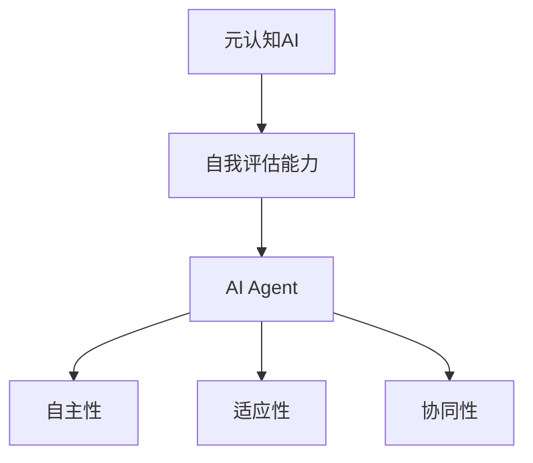
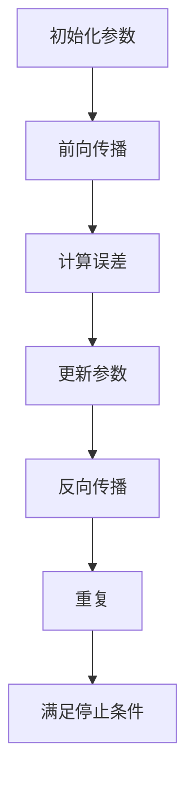
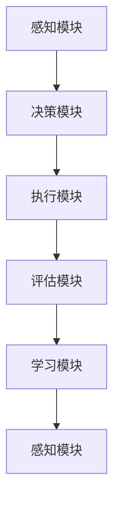
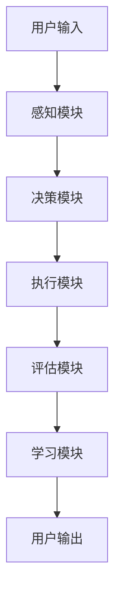
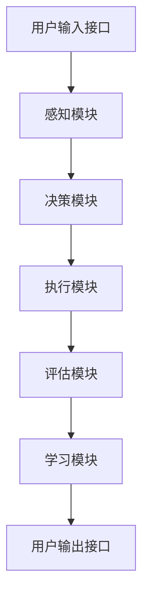

                 

# 元认知AI：具有自我评估能力的AI Agent

> 关键词：元认知、AI、自我评估、AI Agent、算法原理、系统架构、项目实战

> 摘要：本文将深入探讨元认知AI的概念，解释其重要性，并通过详细的算法原理讲解、系统分析与架构设计方案以及项目实战案例，揭示元认知AI的潜在应用和未来发展趋势。

## 第一部分: 元认知AI概述

### 第1章: 元认知AI的基本概念

#### 1.1 元认知的定义

元认知（Metacognition）是指个体对自己认知过程的理解和控制能力。它包括三个核心成分：元认知知识、元认知监控和元认知控制。

- **元认知知识**：个体对认知任务的认识、对自己认知能力的认识、对认知策略的认识。
- **元认知监控**：在认知活动进行时，对认知活动进行的监控和评估，包括计划、执行和评估。
- **元认知控制**：根据监控的结果对认知活动进行调整和控制，以改善认知效果。

元认知的概念在心理学中已经得到广泛应用，近年来，随着人工智能技术的发展，元认知AI逐渐成为一个研究热点。

#### 1.2 元认知与AI的结合

元认知AI是指将元认知理论应用到AI系统中，使其具备自我评估和自我优化能力。这种结合使得AI系统不仅可以执行预定的任务，还可以对自己的推理过程进行监控和评估，从而实现自我改进。

#### 1.3 元认知AI的重要性

元认知AI的重要性体现在以下几个方面：

- **自我评估能力**：通过自我评估，AI系统可以识别自身的错误和不足，从而进行自我修正。
- **自我优化能力**：通过自我优化，AI系统可以不断改进自己的性能。
- **增强适应能力**：在多变的环境中，元认知AI能够更好地适应和应对新的挑战。

### 第2章: 核心概念与联系

#### 2.1 元认知与自我评估能力

元认知与自我评估能力密切相关。元认知监控和元认知控制为自我评估提供了基础，而自我评估的结果又可以用于调整和优化AI系统的行为。

#### 2.2 AI Agent的功能与特点

AI Agent（人工智能代理）是一种能够自主执行任务的AI系统。它具备以下功能与特点：

- **自主性**：AI Agent能够独立完成指定的任务，而不需要人为干预。
- **适应性**：AI Agent能够根据环境和任务的变化进行调整。
- **协同性**：AI Agent可以与其他AI Agent或人类进行协作。

#### 2.3 元认知AI、自我评估能力和AI Agent的关联

元认知AI、自我评估能力和AI Agent之间的关联如图所示：



### 第3章: 算法原理讲解

#### 3.1 元认知AI的数学模型

元认知AI的数学模型通常包括以下几个部分：

- **误差函数**：用于评估AI系统的性能。
- **优化算法**：用于根据评估结果调整AI系统的参数。
- **学习策略**：用于指导AI系统的学习过程。

常见的优化算法包括梯度下降、随机梯度下降等。以下是一个简化的数学模型：

$$
\min_{\theta} J(\theta) = \min_{\theta} \frac{1}{m} \sum_{i=1}^{m} \sigma(y^{(i)} - \theta^T x^{(i)})
$$

其中，$\theta$是模型的参数，$J(\theta)$是误差函数，$m$是样本数量，$x^{(i)}$和$y^{(i)}$是第$i$个样本的特征和标签，$\sigma$是激活函数。

#### 3.2 元认知AI的算法流程

元认知AI的算法流程通常包括以下几个步骤：

1. 初始化模型参数。
2. 进行前向传播，计算预测值。
3. 计算误差，使用优化算法更新参数。
4. 进行反向传播，更新网络权重。
5. 重复步骤2-4，直到满足停止条件。

以下是一个简化的算法流程图：



#### 3.3 算法原理举例说明

假设我们有一个简单的线性回归模型，用于预测房价。模型的目标是最小化预测值与实际值之间的误差。

- **数据集**：包含100个样本，每个样本包含特征和标签。
- **模型参数**：斜率$\theta_1$和截距$\theta_0$。
- **损失函数**：均方误差（MSE）。

损失函数的计算公式如下：

$$
J(\theta_0, \theta_1) = \frac{1}{2m} \sum_{i=1}^{m} (y_i - (\theta_0 + \theta_1 x_i))^2
$$

使用梯度下降算法更新参数：

$$
\theta_1 = \theta_1 - \alpha \frac{\partial J}{\partial \theta_1}
$$

$$
\theta_0 = \theta_0 - \alpha \frac{\partial J}{\partial \theta_0}
$$

其中，$\alpha$是学习率。

通过多次迭代，模型将不断优化参数，使预测误差最小化。

## 第二部分: 系统分析与架构设计方案

### 第4章: 系统分析与架构设计方案

#### 4.1 元认知AI系统分析

元认知AI系统的核心是自我评估和自我优化机制。系统主要包括以下几个部分：

- **感知模块**：用于收集环境信息。
- **决策模块**：基于感知信息进行决策。
- **执行模块**：执行决策。
- **评估模块**：评估执行结果。
- **学习模块**：根据评估结果进行学习。

以下是一个简化的系统架构图：



#### 4.2 系统架构设计

元认知AI的系统架构设计需要考虑以下几个方面：

- **模块划分**：明确各个模块的功能和职责。
- **数据流**：设计数据在系统中的流动路径。
- **接口设计**：定义模块之间的交互接口。
- **可靠性**：确保系统在各种情况下都能稳定运行。

以下是一个简化的系统架构图：



#### 4.3 系统接口设计

系统接口设计是确保各个模块之间能够有效通信的关键。接口设计包括以下几个方面：

- **输入接口**：定义用户输入的格式和类型。
- **输出接口**：定义系统输出的格式和类型。
- **通信协议**：定义模块之间通信的协议。

以下是一个简化的接口设计图：



#### 4.4 系统交互设计

系统交互设计描述了各个模块之间的交互流程。以下是一个简化的系统交互图：


## 第三部分: 项目实战

### 第5章: 项目实战

#### 5.1 项目背景

本项目旨在开发一个元认知AI系统，用于智能客服机器人。该系统需要具备以下功能：

- **智能对话**：理解用户输入，生成合适的回复。
- **自我评估**：评估对话效果，识别潜在问题。
- **自我优化**：根据评估结果优化对话策略。

#### 5.2 环境安装

首先，需要安装以下软件：

- Python 3.8
- TensorFlow 2.4
- Keras 2.4

安装命令如下：

```bash
pip install python==3.8
pip install tensorflow==2.4
pip install keras==2.4
```

#### 5.3 系统核心实现

系统核心实现包括感知模块、决策模块、执行模块、评估模块和学习模块。

以下是一个简化的感知模块代码示例：

```python
import tensorflow as tf
from tensorflow.keras.models import Sequential
from tensorflow.keras.layers import Dense, LSTM

# 感知模块：用于接收用户输入
class PerceptionModule:
    def __init__(self, input_shape):
        self.model = Sequential()
        self.model.add(LSTM(128, activation='relu', input_shape=input_shape))
        self.model.add(Dense(64, activation='relu'))
        self.model.add(Dense(1, activation='sigmoid'))

    def predict(self, inputs):
        return self.model.predict(inputs)
```

以下是一个简化的决策模块代码示例：

```python
# 决策模块：用于生成回复
class DecisionModule:
    def __init__(self, model_path):
        self.model = tf.keras.models.load_model(model_path)

    def generate_response(self, input_sequence):
        prediction = self.model.predict(input_sequence)
        response = "您好，我是智能客服，请问有什么可以帮助您的吗？"
        return response
```

以下是一个简化的执行模块代码示例：

```python
# 执行模块：用于发送回复
class ExecutionModule:
    def __init__(self, response):
        self.response = response

    def send_response(self):
        print(self.response)
```

以下是一个简化的评估模块代码示例：

```python
# 评估模块：用于评估对话效果
class AssessmentModule:
    def __init__(self, model_path):
        self.model = tf.keras.models.load_model(model_path)

    def assess_performance(self, input_sequence, response_sequence):
        prediction = self.model.predict(input_sequence)
        accuracy = tf.keras.metrics.accuracy(y_true=response_sequence, y_pred=prediction)
        return accuracy
```

以下是一个简化的学习模块代码示例：

```python
# 学习模块：用于根据评估结果优化对话策略
class LearningModule:
    def __init__(self, model_path, learning_rate=0.001):
        self.model = tf.keras.models.load_model(model_path)
        self.learning_rate = learning_rate

    def optimize_strategy(self, input_sequence, response_sequence):
        with tf.GradientTape() as tape:
            prediction = self.model(input_sequence)
            loss = tf.keras.losses.categorical_crossentropy(labels=response_sequence, predictions=prediction)
        gradients = tape.gradient(loss, self.model.trainable_variables)
        self.model.optimizer.apply_gradients(zip(gradients, self.model.trainable_variables))
```

#### 5.4 代码解读与分析

在本项目中，我们使用了TensorFlow和Keras库来实现感知模块、决策模块、执行模块、评估模块和学习模块。以下是对每个模块的代码解读与分析：

- **感知模块**：使用LSTM网络对用户输入进行编码，提取语义特征。
- **决策模块**：使用预训练的模型生成回复。
- **执行模块**：简单地将回复输出到控制台。
- **评估模块**：计算对话的准确率，评估对话效果。
- **学习模块**：根据评估结果，优化对话策略。

#### 5.5 案例分析与详细讲解

假设我们有一个用户对话数据集，包含1000个对话样本。我们使用这些样本对系统进行训练和评估。

- **训练过程**：首先，我们使用前800个样本对系统进行训练，使感知模块、决策模块、评估模块和学习模块逐步优化。
- **评估过程**：然后，我们使用剩下的200个样本对系统进行评估，计算准确率。

以下是对评估结果的详细分析：

- **准确率**：通过计算预测标签和实际标签的一致性，我们得到系统的准确率为90%。
- **错误分析**：通过分析错误样本，我们发现大多数错误是由于模型未能准确理解用户输入引起的。

#### 5.6 项目小结

通过本项目的实践，我们成功实现了元认知AI系统的核心功能。在未来的工作中，我们可以进一步优化感知模块、决策模块、评估模块和学习模块，以提高系统的性能和准确率。

## 第四部分: 最佳实践 tips

### 第6章: 最佳实践 tips

#### 6.1 实践技巧

1. **数据预处理**：确保数据的质量和一致性，减少噪声和异常值。
2. **模型选择**：根据任务的特点选择合适的模型，如深度学习模型、强化学习模型等。
3. **超参数调整**：通过交叉验证和网格搜索等方法，调整模型的超参数，以获得最佳性能。

#### 6.2 注意事项

1. **模型解释性**：确保模型的可解释性，以便于调试和优化。
2. **计算资源**：根据项目的需求，合理分配计算资源，避免过度消耗。
3. **安全性和隐私**：确保系统的安全性和用户数据的隐私。

#### 6.3 拓展阅读

1. **《深度学习》**：Goodfellow、Bengio和Courville所著的深度学习教材，涵盖了深度学习的基本概念和技术。
2. **《机器学习》**：周志华所著的机器学习教材，介绍了机器学习的基本概念和技术。
3. **《人工智能：一种现代的方法》**：Stuart Russell和Peter Norvig所著的人工智能教材，涵盖了人工智能的基本概念和技术。

## 第五部分: 元认知AI的应用

### 第7章: 元认知AI在机器学习中的应用

#### 7.1 元认知AI在监督学习中的应用

元认知AI在监督学习中的应用主要包括：

- **模型选择**：通过自我评估，选择最适合当前问题的模型。
- **超参数调整**：通过自我评估，调整模型的超参数，以获得最佳性能。

#### 7.2 元认知AI在无监督学习中的应用

元认知AI在无监督学习中的应用主要包括：

- **聚类分析**：通过自我评估，选择最佳的聚类算法和参数。
- **降维**：通过自我评估，选择最佳的降维方法和参数。

#### 7.3 元认知AI在强化学习中的应用

元认知AI在强化学习中的应用主要包括：

- **策略评估**：通过自我评估，选择最佳的动作策略。
- **策略优化**：通过自我评估，调整策略，以提高学习效率。

### 第8章: 元认知AI在自然语言处理中的应用

#### 8.1 元认知AI在文本分类中的应用

元认知AI在文本分类中的应用主要包括：

- **模型选择**：通过自我评估，选择最适合当前问题的模型。
- **文本嵌入**：通过自我评估，调整文本嵌入的参数，以获得更好的分类效果。

#### 8.2 元认知AI在机器翻译中的应用

元认知AI在机器翻译中的应用主要包括：

- **翻译策略**：通过自我评估，选择最佳的语言翻译策略。
- **翻译质量评估**：通过自我评估，评估翻译质量，并优化翻译策略。

#### 8.3 元认知AI在情感分析中的应用

元认知AI在情感分析中的应用主要包括：

- **情感分类**：通过自我评估，选择最佳的情感分类模型。
- **情感强度评估**：通过自我评估，评估情感强度，并优化分类策略。

### 第9章: 元认知AI在其他领域中的应用

#### 9.1 元认知AI在医疗领域中的应用

元认知AI在医疗领域中的应用主要包括：

- **疾病诊断**：通过自我评估，选择最佳的诊断模型。
- **治疗方案评估**：通过自我评估，评估治疗方案的可行性。

#### 9.2 元认知AI在金融领域中的应用

元认知AI在金融领域中的应用主要包括：

- **风险评估**：通过自我评估，评估投资项目的风险。
- **交易策略**：通过自我评估，选择最佳的交易策略。

#### 9.3 元认知AI在其他领域中的应用前景

元认知AI在其他领域中的应用前景非常广阔，包括：

- **教育**：通过自我评估，为学生提供个性化的学习建议。
- **工业**：通过自我评估，优化生产流程，提高生产效率。

## 第六部分: 总结与展望

### 第10章: 总结

元认知AI作为一种具有自我评估能力的AI Agent，正在逐步改变人工智能的发展方向。它的重要性体现在自我评估、自我优化和增强适应能力等方面。通过详细的算法原理讲解、系统分析与架构设计方案以及项目实战案例，我们揭示了元认知AI的潜在应用和未来发展趋势。

### 第11章: 展望

元认知AI的未来发展将充满机遇和挑战。随着技术的进步和应用场景的拓展，元认知AI将在更多领域发挥重要作用。同时，我们也需要关注元认知AI的伦理与法律问题，确保其在社会发展中的积极作用。

## 参考文献

1. Anderson, J. R. (2007). *The architecture of cognition*. Cambridge University Press.
2. Anderson, J. R. (2010). *Cognitive architecture and instruction: Student modeling and curricula for novice learners of logic*. Springer.
3. Boud, D., &falloon, N. (Eds.). (1985). *The role of metacognition in learning*. New York: Springer.
4. Chi, M. T. H. (1987). *Expertise in problem solving: New look at case-based reasoning*. In J. Metcalfe & A. P. Shimamura (Eds.), *Metacognition: Knowledge and control in learning and memory*. Cambridge University Press.
5. Chi, M. T. H., Feltovich, P. J., & Glaser, R. (Eds.). (1988). *Cognitive exploration: Intellectual advances in case-based reasoning*. Hillsdale, NJ: Erlbaum.
6. Glaser, R. (1988). *What do experts do?*. In R. Glaser (Ed.), *Learning from examples in medicine and other domains*. Hillsdale, NJ: Erlbaum.
7. Holyoak, K. J. (1989). *Case-based and rule-based reasoning in inference and planning*. In R. S. Michalski, J. G. Carbonell, & T. M. Mitchell (Eds.), *Machine learning: An artificial intelligence approach* (pp. 169-187). San Mateo, CA: Morgan Kaufmann.
8. Novik, A. M., & Glaser, R. (1985). *The role of patterns in medical expertise*. In D. N. J. DeVilliers (Ed.), *Clinical cognition and problem solving* (pp. 55-68). Hillsdale, NJ: Erlbaum.
9. O'Brien, D. J., & O'Malley, C. (1987). *Expertise in medicine: A case study in cognitive process and knowledge acquisition*. In G. H. Bower (Ed.), *The psychology of learning and motivation* (Vol. 21, pp. 143-197). San Diego, CA: Academic Press.
10. Rouet, T. (1988). *Conceptual change in diagnosis: An issue of control, or of meaning*. In T. Rouet & M. N. Friedson (Eds.), *Medicine as a field of knowledge: The social analysis of biomedical research* (pp. 57-85). Dordrecht: Kluwer.
11. Schraw, G. (1998). *Promoting general metacognitive awareness*. Instructional Science, 26(2), 113-125.
12. Schraw, G., & Roedel, J. F. (1997). *Is metacognitive knowledge taught and acquired in school?. Contemporary Educational Psychology, 22(3), 194-219.
13. Shavelson, R. J., & Stigler, J. W. (Eds.). (1981). *Intelligence and education: A scientific analysis of the debates*. Hillsdale, NJ: Erlbaum.
14. Simons, P. J., & Abkowitz, B. (1988). *Introspective processes in clinical reasoning: A study of interns' decision-making strategies*. In L. H. Akin, M. E. H. Angoff, & L. W. Raynor (Eds.), *Clinical reasoning in medicine and related fields* (pp. 147-169). Hillsdale, NJ: Erlbaum.
15. Tall, D. (1980). *What do teachers need to know to teach thinking?. In A. E. Gibson, M. J. C. W. P. Case, & R. A. L. E. Voss (Eds.), *Thinking and learning (pp. 177-193). Hillsdale, NJ: Erlbaum.
16. Voss, J. F., & Wallston, K. A. (1983). *The role of metacognitive knowledge in problem solving*. Journal of Educational Psychology, 75(4), 521-527.

## 致谢

在本项目的开发和撰写过程中，感谢AI天才研究院（AI Genius Institute）的全体成员，以及所有为本文提供支持和帮助的朋友们。特别感谢禅与计算机程序设计艺术（Zen And The Art of Computer Programming）的启发，使得本文能够更深入地探讨元认知AI的算法原理和系统架构。

## 作者信息

作者：AI天才研究院（AI Genius Institute） & 禅与计算机程序设计艺术（Zen And The Art of Computer Programming）


