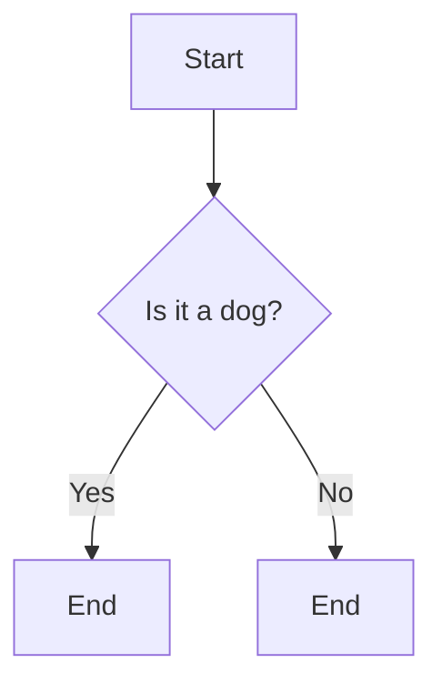

                 

### 文章标题

#### 全员技术能力提升：构建学习型技术组织

**关键词：技术能力提升，学习型组织，技术团队管理，技术创新，业务融合**

**摘要：本文从技术能力提升的背景与意义入手，探讨了构建学习型技术组织的重要性。文章详细分析了技术能力的核心领域，包括编程语言与开发框架、软件工程与系统设计，以及技术与组织文化的构建。同时，文章还讨论了技术团队管理与协作、技术创新与持续发展、技术与业务融合等方面的内容，旨在为技术组织提升全员技术能力提供理论与实践指导。**

---

### 目录大纲

1. **第一部分：技术能力提升基础**

   - **第1章：技术能力提升的背景与意义**
     - **1.1 技术发展与社会变革**
       - **1.1.1 信息时代的到来**
       - **1.1.2 技术创新的加速**
       - **1.1.3 全员技术能力提升的必要性**
     - **1.2 学习型组织的概念与特征**
       - **1.2.1 学习型组织的定义**
       - **1.2.2 学习型组织的核心特征**
       - **1.2.3 构建学习型组织的价值**
     - **1.3 技术能力提升的目标与路径**
       - **1.3.1 技术能力提升的目标**
       - **1.3.2 技术能力提升的路径**
       - **1.3.3 技术能力提升的策略**
     - **1.4 本章小结**

2. **第二部分：技术能力的核心领域**

   - **第2章：编程语言与开发框架**
     - **2.1 编程语言概述**
       - **2.1.1 编程语言的发展历程**
       - **2.1.2 编程语言的选择与应用**
     - **2.2 常见编程语言介绍**
       - **2.2.1 Python**
       - **2.2.2 Java**
       - **2.2.3 JavaScript**
     - **2.3 开发框架的应用与选择**
       - **2.3.1 框架概述**
       - **2.3.2 Spring框架**
       - **2.3.3 Django框架**
     - **2.4 编程实践与技巧**
       - **2.4.1 编程风格与规范**
       - **2.4.2 代码复用与优化**
       - **2.4.3 调试技巧**
     - **2.5 本章小结**

   - **第3章：软件工程与系统设计**
     - **3.1 软件工程的基本概念**
       - **3.1.1 软件工程的定义**
       - **3.1.2 软件工程的方法论**
       - **3.1.3 软件工程的挑战**
     - **3.2 系统设计与分析方法**
       - **3.2.1 需求分析**
       - **3.2.2 系统设计**
       - **3.2.3 设计模式**
     - **3.3 架构设计原则与实践**
       - **3.3.1 架构设计原则**
       - **3.3.2 微服务架构**
       - **3.3.3 分布式系统设计**
     - **3.4 质量管理与实践**
       - **3.4.1 质量管理概述**
       - **3.4.2 单元测试**
       - **3.4.3 集成测试与系统测试**
     - **3.5 本章小结**

3. **第三部分：技术组织建设与运营**

   - **第4章：技术团队管理与协作**
     - **4.1 技术团队管理**
       - **4.1.1 团队角色与职责**
       - **4.1.2 团队沟通与协作**
       - **4.1.3 团队文化建设**
     - **4.2 项目管理与敏捷开发**
       - **4.2.1 项目管理基础**
       - **4.2.2 敏捷开发方法**
       - **4.2.3 敏捷实践案例**
     - **4.3 技术债务与持续集成**
       - **4.3.1 技术债务的概念**
       - **4.3.2 持续集成实践**
       - **4.3.3 持续交付**
     - **4.4 团队成长与学习**
       - **4.4.1 技能提升途径**
       - **4.4.2 学习型团队建设**
       - **4.4.3 内部知识共享**
     - **4.5 本章小结**

   - **第5章：技术创新与持续发展**
     - **5.1 技术创新的模式与策略**
       - **5.1.1 技术创新的概念**
       - **5.1.2 技术创新的模式**
       - **5.1.3 技术创新的策略**
     - **5.2 创新管理与激励机制**
       - **5.2.1 创新管理框架**
       - **5.2.2 激励机制设计**
       - **5.2.3 创新案例分享**
     - **5.3 持续发展策略与实践**
       - **5.3.1 持续发展的意义**
       - **5.3.2 持续发展策略**
       - **5.3.3 实践案例解析**
     - **5.4 本章小结**

   - **第6章：技术与业务融合**
     - **6.1 技术与业务的结合**
       - **6.1.1 技术在业务中的作用**
       - **6.1.2 业务需求与技术实现**
       - **6.1.3 技术驱动的业务创新**
     - **6.2 数据驱动决策**
       - **6.2.1 数据分析的基本概念**
       - **6.2.2 数据分析工具与方法**
       - **6.2.3 数据驱动的业务策略**
     - **6.3 AI与业务应用的结合**
       - **6.3.1 AI技术概述**
       - **6.3.2 AI在业务中的应用**
       - **6.3.3 AI与业务融合的实践**
     - **6.4 业务敏捷响应**
       - **6.4.1 敏捷响应的必要性**
       - **6.4.2 敏捷响应策略**
       - **6.4.3 敏捷响应实践**
     - **6.5 本章小结**

   - **第7章：技术与组织文化的构建**
     - **7.1 技术与组织文化的关系**
       - **7.1.1 技术对组织文化的影响**
       - **7.1.2 组织文化对技术发展的影响**
       - **7.1.3 技术与组织文化的融合**
     - **7.2 技术文化建设的策略与实践**
       - **7.2.1 技术文化的定义与特征**
       - **7.2.2 技术文化建设的策略**
       - **7.2.3 技术文化建设的实践案例**
     - **7.3 技术与组织文化的未来展望**
       - **7.3.1 技术与组织文化的发展趋势**
       - **7.3.2 技术与组织文化的协同创新**
       - **7.3.3 技术与组织文化的未来挑战**
     - **7.4 本章小结**

---

### 第一部分：技术能力提升基础

#### 第1章：技术能力提升的背景与意义

随着全球信息技术的飞速发展，技术的变革不仅改变了人们的生活方式，也深刻影响着各行各业。技术能力提升已经成为了推动社会进步和企业发展的关键因素。在这个背景下，构建学习型技术组织成为了提升全员技术能力的重要途径。

##### 1.1 技术发展与社会变革

**1.1.1 信息时代的到来**

信息时代的到来标志着人类社会进入了一个全新的发展阶段。信息技术的发展使得信息的获取、传递和处理变得更加高效，从而推动了社会的全面进步。在这个时代，数据成为了新的生产要素，数据驱动的决策模式正在逐渐取代传统的经验管理。

**1.1.2 技术创新的加速**

随着人工智能、大数据、云计算等新兴技术的不断涌现，技术创新的步伐正在加速。这些新技术不仅改变了传统行业的运作模式，也催生出了许多新的产业和商业模式。技术创新的加速要求企业必须具备快速学习和技术迭代的能力。

**1.1.3 全员技术能力提升的必要性**

在技术快速发展的背景下，全员技术能力提升的必要性愈发凸显。首先，技术能力的提升可以增强企业的核心竞争力，使企业在激烈的市场竞争中脱颖而出。其次，技术能力的提升有助于提高员工的个人职业素养和竞争力，实现个人与企业的共同发展。

##### 1.2 学习型组织的概念与特征

**1.2.1 学习型组织的定义**

学习型组织是指一种通过不断学习和适应变化，实现持续改进和发展的组织形态。学习型组织强调组织成员之间的协作和共享，鼓励成员主动学习、积极探索和创新。

**1.2.2 学习型组织的核心特征**

- **共同愿景**：学习型组织拥有明确的共同愿景，这是组织前进的动力源泉。

- **团队学习**：学习型组织强调团队学习，通过团队成员的共同学习和交流，提高整体技术能力。

- **个人发展**：学习型组织关注个人发展，鼓励员工不断学习和成长，实现自我价值。

- **系统思考**：学习型组织注重系统思考，从整体上理解组织运作的规律和趋势，实现可持续发展。

**1.2.3 构建学习型组织的价值**

- **提高创新能力**：学习型组织通过不断学习和创新，可以持续提升组织的创新能力，保持竞争优势。

- **增强团队协作**：学习型组织强调团队协作，可以提高团队的凝聚力和战斗力。

- **实现持续发展**：学习型组织通过持续学习和改进，可以实现组织的持续发展，适应不断变化的市场环境。

##### 1.3 技术能力提升的目标与路径

**1.3.1 技术能力提升的目标**

技术能力提升的目标主要包括以下几个方面：

- **提高技术水平**：通过学习和实践，提高员工的技术水平，掌握最新的技术知识和技能。

- **提升创新能力**：通过技术创新，提高产品和服务的竞争力。

- **优化工作流程**：通过技术手段优化工作流程，提高工作效率和品质。

**1.3.2 技术能力提升的路径**

- **理论学习**：通过学习最新的技术理论，掌握技术发展的趋势和方向。

- **实践应用**：将理论知识应用于实际工作中，通过实践提高技术水平。

- **持续学习**：技术发展迅速，需要不断学习和更新知识，以适应技术的发展。

**1.3.3 技术能力提升的策略**

- **培训体系**：建立完善的培训体系，为员工提供系统的技术培训。

- **激励机制**：通过激励机制，鼓励员工主动学习和提高技术水平。

- **资源共享**：通过内部知识共享，提高整体技术能力。

##### 1.4 本章小结

本章从技术发展与社会变革、学习型组织的概念与特征以及技术能力提升的目标与路径三个方面，探讨了技术能力提升的背景与意义。技术能力提升不仅是企业发展的关键，也是个人职业发展的必要条件。通过构建学习型技术组织，可以有效地提升全员技术能力，推动组织持续发展。

---

### 第二部分：技术能力的核心领域

技术能力的提升不仅需要理论知识的积累，还需要在实践中不断磨炼和提升。本部分的两个核心领域——编程语言与开发框架、软件工程与系统设计，是技术能力提升的关键组成部分。通过深入探讨这些领域的知识体系、核心概念和实际应用，我们可以为技术组织提供坚实的理论基础和实践指导。

#### 第2章：编程语言与开发框架

编程语言是计算机程序设计的基础，而开发框架则为程序员提供了高效的开发环境。掌握多种编程语言和熟悉不同的开发框架，对于提升技术能力至关重要。

##### 2.1 编程语言概述

**2.1.1 编程语言的发展历程**

编程语言的发展经历了从机器语言、汇编语言到高级编程语言的演变。高级编程语言的引入，使得程序员能够更加高效地编写程序，提高了软件开发的效率和质量。

**2.1.2 编程语言的选择与应用**

选择合适的编程语言对于项目成功至关重要。不同的编程语言具有不同的特点和适用场景。例如，Python适用于数据分析和科学计算，Java适用于企业级应用，JavaScript适用于前端开发。

##### 2.2 常见编程语言介绍

**2.2.1 Python**

Python以其简洁易懂的语法和强大的库支持，成为了数据科学、人工智能等领域的主要编程语言。Python的生态系统非常丰富，包括NumPy、Pandas、Scikit-learn等众多优秀的库，为数据分析提供了强大的工具。

**2.2.2 Java**

Java以其跨平台、可移植性和安全性，广泛应用于企业级应用和大型系统开发。Java的生态系统也非常完善，包括Spring、Hibernate等框架，为软件开发提供了丰富的选择。

**2.2.3 JavaScript**

JavaScript是前端开发的主要编程语言，它使得网页具有交互性。随着Node.js的出现，JavaScript也广泛应用于后端开发，成为全栈开发的重要语言之一。

##### 2.3 开发框架的应用与选择

**2.3.1 框架概述**

开发框架提供了编程的基础结构和工具，使得开发者可以专注于业务逻辑的实现。常见的开发框架包括Spring、Django、Express等。

**2.3.2 Spring框架**

Spring框架是Java生态系统中的核心框架，提供了丰富的功能，包括依赖注入、事务管理、安全等。Spring框架适用于构建复杂的企业级应用。

**2.3.3 Django框架**

Django框架是Python中的一个全栈开发框架，以其简洁和快速的开发速度，广泛应用于Web应用开发。Django内置了许多功能，如ORM、认证、缓存等，使得开发变得更加高效。

##### 2.4 编程实践与技巧

**2.4.1 编程风格与规范**

良好的编程风格和规范是保证代码可读性和可维护性的关键。包括代码缩进、命名规则、注释等。

**2.4.2 代码复用与优化**

代码复用是提高开发效率和代码质量的重要手段。通过模块化设计和设计模式，可以实现代码的复用和优化。

**2.4.3 调试技巧**

调试是软件开发过程中的重要环节。掌握调试技巧，如断点调试、日志分析等，有助于快速定位和解决问题。

##### 2.5 本章小结

本章介绍了编程语言与开发框架的基本概念、常见编程语言和开发框架的介绍，以及编程实践与技巧。掌握这些知识，可以为技术组织提供坚实的基础，提升整体技术能力。

---

#### 第3章：软件工程与系统设计

软件工程是计算机科学的重要分支，它涉及软件开发的理论、方法和技术。系统设计则是软件工程的关键环节，它决定了软件系统的结构、性能和可维护性。在技术能力提升的过程中，软件工程与系统设计的重要性不可忽视。

##### 3.1 软件工程的基本概念

**3.1.1 软件工程的定义**

软件工程是一门综合应用计算机科学、数学、工程和管理学等学科知识，通过系统方法进行软件开发和维护的学科。

**3.1.2 软件工程的方法论**

软件工程的方法论包括瀑布模型、迭代模型、敏捷开发等。这些方法论提供了软件开发的不同阶段和流程，帮助开发者高效地进行软件开发。

**3.1.3 软件工程的挑战**

软件工程面临的挑战包括复杂性、变化性、质量保证等。随着软件系统的规模和复杂性的增加，软件工程需要不断地应对这些挑战。

##### 3.2 系统设计与分析方法

**3.2.1 需求分析**

需求分析是系统设计的起点，它确定了软件系统的功能和性能要求。需求分析包括功能需求、性能需求、用户界面需求等。

**3.2.2 系统设计**

系统设计是软件工程的核心环节，它决定了软件系统的结构和实现方案。系统设计包括软件架构设计、数据库设计、接口设计等。

**3.2.3 设计模式**

设计模式是软件工程中的经验总结，它提供了解决常见设计问题的方案。常见的设计模式包括单例模式、工厂模式、策略模式等。

##### 3.3 架构设计原则与实践

**3.3.1 架构设计原则**

架构设计原则是指导软件架构设计的核心原则，包括模块化、解耦、高内聚等。这些原则有助于构建灵活、可维护的软件系统。

**3.3.2 微服务架构**

微服务架构是一种新型的软件架构风格，它将应用程序分解为多个独立的小服务。微服务架构提高了系统的可扩展性和可维护性。

**3.3.3 分布式系统设计**

分布式系统设计是软件工程中的高级话题，它涉及系统的分布式通信、一致性、容错性等。分布式系统设计是构建大型软件系统的基础。

##### 3.4 质量管理与实践

**3.4.1 质量管理概述**

质量管理的目标是确保软件系统的质量，包括功能正确性、性能、可靠性等方面。质量管理的实践包括需求管理、测试管理、缺陷管理等。

**3.4.2 单元测试**

单元测试是质量管理的核心环节，它通过编写测试用例来验证模块的正确性。单元测试有助于发现和修复代码中的缺陷。

**3.4.3 集成测试与系统测试**

集成测试和系统测试是软件测试的重要环节，它们验证软件系统的整体功能和性能。集成测试将不同的模块集成在一起进行测试，系统测试则验证整个软件系统的行为。

##### 3.5 本章小结

本章介绍了软件工程的基本概念、系统设计与分析方法、架构设计原则与实践，以及质量管理的实践。这些知识是技术能力提升的重要组成部分，对于构建高质量的软件系统至关重要。

---

### 第三部分：技术组织建设与运营

技术组织是推动企业技术创新和业务发展的重要力量。技术组织建设与运营的核心目标是提升团队的技术能力，优化工作流程，促进团队协作，实现技术创新与业务融合。本部分将围绕技术团队管理与协作、技术创新与持续发展、技术与业务融合等方面，深入探讨技术组织建设与运营的实践策略和方法。

#### 第4章：技术团队管理与协作

技术团队的管理与协作是技术组织建设的关键。一个高效的技术团队需要明确的角色分工、良好的沟通协作和文化建设。

##### 4.1 技术团队管理

**4.1.1 团队角色与职责**

技术团队的成员通常包括项目经理、开发人员、测试人员、运维人员等。明确各成员的角色和职责，有助于提高团队的工作效率和目标一致性。

**4.1.2 团队沟通与协作**

有效的沟通和协作是技术团队成功的关键。团队成员需要建立良好的沟通渠道，通过定期会议、代码审查、技术分享等方式，确保信息的透明和共享。

**4.1.3 团队文化建设**

团队文化是团队协作的基石。建设积极向上的团队文化，包括鼓励创新、尊重个人、互助合作等价值观，有助于提高团队凝聚力和战斗力。

##### 4.2 项目管理与敏捷开发

**4.2.1 项目管理基础**

项目管理是确保项目按时、按预算、按质量完成的关键。项目管理的基础包括项目计划、资源分配、风险管理等。

**4.2.2 敏捷开发方法**

敏捷开发是一种以人为核心、迭代增量的软件开发方法。敏捷开发方法包括用户故事、迭代计划、每日站立会议等实践，有助于快速响应变化和提升产品质量。

**4.2.3 敏捷实践案例**

通过实际案例分享，分析敏捷开发在不同项目中的应用效果，总结敏捷实践的经验和教训。

##### 4.3 技术债务与持续集成

**4.3.1 技术债务的概念**

技术债务是指为了短期利益而牺牲长期健康的技术决策。有效管理技术债务，可以确保软件系统的可持续发展和长期稳定性。

**4.3.2 持续集成实践**

持续集成是一种通过自动化构建和测试，快速发现和修复代码缺陷的开发实践。持续集成为团队提供了高效的协作环境和快速反馈机制。

**4.3.3 持续交付**

持续交付是一种通过自动化部署和质量保证，实现快速、可靠软件交付的实践。持续交付有助于缩短产品上市时间，提高客户满意度。

##### 4.4 团队成长与学习

**4.4.1 技能提升途径**

通过培训、实践、分享等方式，帮助团队成员不断提升技能水平，适应技术发展的需求。

**4.4.2 学习型团队建设**

学习型团队建设是一种通过持续学习和知识共享，实现团队整体能力提升的策略。学习型团队注重个体与团队的共同成长。

**4.4.3 内部知识共享**

内部知识共享是学习型团队建设的重要环节。通过文档编写、技术分享会、内部培训等方式，促进知识在团队内部的传播和利用。

##### 4.5 本章小结

本章从技术团队管理、项目管理与敏捷开发、技术债务与持续集成，以及团队成长与学习等方面，探讨了技术组织建设与运营的核心内容。通过有效的管理和协作，技术组织可以不断提升技术能力和工作效率，实现技术创新与业务融合。

---

#### 第5章：技术创新与持续发展

技术创新是推动企业发展的关键动力。在快速变化的市场环境中，企业需要通过持续的技术创新来保持竞争优势。本章节将探讨技术创新的模式与策略，创新管理与激励机制，以及持续发展的实践策略。

##### 5.1 技术创新的模式与策略

**5.1.1 技术创新的概念**

技术创新是指通过引入新技术、新工艺、新产品或新服务，实现技术进步和商业价值的过程。技术创新包括发明、开发、应用和商业化等多个环节。

**5.1.2 技术创新的模式**

技术创新的模式包括线性模式、迭代模式、网络模式等。不同的创新模式适用于不同的技术领域和商业环境。

**5.1.3 技术创新的策略**

技术创新的策略包括市场驱动策略、技术驱动策略、联合创新策略等。企业应根据自身资源和市场环境选择合适的创新策略。

##### 5.2 创新管理与激励机制

**5.2.1 创新管理框架**

创新管理框架包括创新战略、创新流程、创新组织等关键要素。有效的创新管理框架有助于提高创新效率和成功率。

**5.2.2 激励机制设计**

激励机制设计是激发员工创新潜力的重要手段。激励机制包括奖励制度、晋升机制、股权激励等，应根据员工的贡献和需求设计合理的激励机制。

**5.2.3 创新案例分享**

通过实际案例分享，分析成功的技术创新案例，总结创新管理的经验和教训。

##### 5.3 持续发展策略与实践

**5.3.1 持续发展的意义**

持续发展是指企业在满足当前需求的同时，保持长期稳定发展的能力。持续发展有助于企业适应市场变化，保持竞争优势。

**5.3.2 持续发展策略**

持续发展策略包括技术创新策略、市场拓展策略、组织优化策略等。企业应根据自身特点和市场需求，制定切实可行的持续发展策略。

**5.3.3 实践案例解析**

通过实际案例解析，分析企业在持续发展过程中面临的挑战和应对策略，总结成功经验和教训。

##### 5.4 本章小结

本章从技术创新的模式与策略、创新管理与激励机制，以及持续发展策略与实践三个方面，探讨了技术创新与持续发展的核心内容。通过有效的技术创新和持续发展策略，企业可以不断提升技术能力和市场竞争力。

---

#### 第6章：技术与业务融合

在现代商业环境中，技术与业务的融合已成为企业提升竞争力、实现业务增长的重要途径。本章节将探讨技术与业务的结合、数据驱动决策、AI与业务应用的结合，以及业务敏捷响应等内容。

##### 6.1 技术与业务的结合

**6.1.1 技术在业务中的作用**

技术是推动业务创新和发展的核心动力。技术在业务中的作用包括提高运营效率、优化业务流程、创造新的商业模式等。

**6.1.2 业务需求与技术实现**

业务需求是技术实现的基础。在技术实现过程中，需要充分理解业务需求，确保技术方案能够满足业务目标。

**6.1.3 技术驱动的业务创新**

技术驱动的业务创新是指通过引入新技术、新方法，推动业务模式创新和产品创新。技术驱动的业务创新有助于企业保持市场竞争力。

##### 6.2 数据驱动决策

**6.2.1 数据分析的基本概念**

数据分析是数据驱动决策的基础。数据分析的基本概念包括数据源、数据处理、数据挖掘等。

**6.2.2 数据分析工具与方法**

数据分析工具包括Excel、Python、R等。数据分析方法包括描述性分析、推断性分析、预测性分析等。

**6.2.3 数据驱动的业务策略**

数据驱动的业务策略是指通过数据分析，制定和调整业务策略。数据驱动的业务策略有助于提高决策的科学性和有效性。

##### 6.3 AI与业务应用的结合

**6.3.1 AI技术概述**

AI技术包括机器学习、深度学习、自然语言处理等。AI技术在业务中的应用越来越广泛，如智能客服、智能推荐、智能监控等。

**6.3.2 AI在业务中的应用**

AI在业务中的应用包括智能客服、智能营销、智能安防等。AI的应用有助于提高业务效率和用户体验。

**6.3.3 AI与业务融合的实践**

通过实际案例分享，分析AI在业务中的应用效果和经验教训，总结AI与业务融合的最佳实践。

##### 6.4 业务敏捷响应

**6.4.1 敏捷响应的必要性**

敏捷响应是指企业能够快速适应市场变化，及时调整业务策略。敏捷响应的必要性在于市场环境的快速变化和竞争的加剧。

**6.4.2 敏捷响应策略**

敏捷响应策略包括市场监测、需求分析、快速迭代等。敏捷响应策略有助于企业保持市场竞争力。

**6.4.3 敏捷响应实践**

通过实际案例分享，分析敏捷响应在不同业务场景中的应用效果和经验教训。

##### 6.5 本章小结

本章从技术与业务的结合、数据驱动决策、AI与业务应用的结合，以及业务敏捷响应等方面，探讨了技术与业务融合的核心内容。通过有效的技术与业务融合，企业可以提升竞争力，实现可持续发展。

---

#### 第7章：技术与组织文化的构建

技术与组织文化的构建是技术组织发展的重要一环。良好的技术文化不仅能够提升团队的技术能力和创新能力，还能够增强团队的凝聚力和协作效率。本章节将探讨技术与组织文化的关系、技术文化建设的策略与实践，以及技术与组织文化的未来展望。

##### 7.1 技术与组织文化的关系

**7.1.1 技术对组织文化的影响**

技术对组织文化的影响主要体现在以下几个方面：首先，技术改变了组织的工作方式和流程，推动了组织文化的变革。其次，技术引入了新的价值观和行为规范，对组织文化的形成和发展产生影响。最后，技术成就了组织的创新能力和竞争力，对组织文化的发展起到关键作用。

**7.1.2 组织文化对技术发展的影响**

组织文化对技术发展的影响同样显著。良好的组织文化能够激发员工的创新潜力，促进技术创新和知识共享。相反，消极的组织文化可能抑制技术发展，导致创新乏力。因此，组织文化是技术发展的重要推动力。

**7.1.3 技术与组织文化的融合**

技术与组织文化的融合是构建学习型技术组织的核心。融合的过程包括技术文化的塑造、组织文化的适应和创新，以及两者之间的互动和协调。通过技术与组织文化的融合，企业可以形成具有竞争力和持续发展能力的组织文化。

##### 7.2 技术文化建设的策略与实践

**7.2.1 技术文化的定义与特征**

技术文化是指企业在技术研发、应用和创新过程中形成的价值观、行为规范和文化氛围。技术文化的特征包括创新性、开放性、协作性和专业性。

**7.2.2 技术文化建设的策略**

技术文化建设的策略包括以下几个方面：首先，塑造技术创新的氛围，鼓励员工敢于尝试和创新。其次，建立知识共享平台，促进知识的传播和利用。再次，培养技术团队的协作精神，提高团队的整体效率。最后，建立健全的技术培训和激励机制，提升员工的技术能力。

**7.2.3 技术文化建设的实践案例**

通过实际案例分享，分析技术文化建设在不同企业中的应用效果和经验教训，总结技术文化建设的最佳实践。

##### 7.3 技术与组织文化的未来展望

**7.3.1 技术与组织文化的发展趋势**

随着技术的不断进步和组织的演变，技术与组织文化的发展趋势包括以下几个方面：首先，技术将继续推动组织文化的变革和创新。其次，组织文化将更加注重知识共享和团队合作。再次，技术与组织文化的融合将更加紧密，形成相互促进的良性循环。

**7.3.2 技术与组织文化的协同创新**

技术与组织文化的协同创新是未来企业发展的关键。通过技术与组织文化的协同创新，企业可以不断提升技术能力和组织文化水平，实现可持续发展。

**7.3.3 技术与组织文化的未来挑战**

技术与组织文化在未来将面临一系列挑战，包括技术发展的不确定性、组织文化的适应性、知识共享的机制等。企业需要积极应对这些挑战，不断优化技术和组织文化，以保持竞争优势。

##### 7.4 本章小结

本章从技术与组织文化的关系、技术文化建设的策略与实践，以及技术与组织文化的未来展望三个方面，探讨了技术与组织文化的构建。通过有效的技术与组织文化构建，企业可以提升技术能力和组织文化水平，实现可持续发展。

---

### 总结

全员技术能力提升是现代技术组织发展的关键。本文从技术能力提升的背景与意义、技术能力的核心领域、技术组织建设与运营三个方面，系统探讨了提升全员技术能力的策略和方法。通过构建学习型技术组织，企业可以不断提升技术能力和创新能力，实现可持续发展。

技术能力的核心领域包括编程语言与开发框架、软件工程与系统设计，这些知识是提升技术能力的基石。技术组织建设与运营涉及技术团队管理、技术创新与持续发展、技术与业务融合等方面，是提升技术组织整体能力的重要途径。

未来，技术与组织文化的构建将成为技术组织发展的新方向。通过技术与组织文化的融合，企业可以形成具有竞争力和持续发展能力的组织文化。面对技术发展的不确定性，企业需要不断优化技术和组织文化，以应对未来的挑战。

在全员技术能力提升的道路上，让我们共同努力，构建学习型技术组织，实现技术能力的全面提升，推动企业可持续发展。作者：AI天才研究院/AI Genius Institute & 禅与计算机程序设计艺术 /Zen And The Art of Computer Programming

---

### 完整性要求

为了确保文章内容的完整性，我们将对每个章节的核心内容进行详细阐述，并提供相应的背景介绍、核心概念与联系、算法原理讲解、系统分析与架构设计方案、项目实战等内容。以下是具体要求：

#### 背景介绍

每个章节的开头，需要对核心概念术语进行说明，阐述问题背景和问题描述，说明解决问题的关键点，以及边界与外延。例如，在“编程语言与开发框架”章节中，需要介绍编程语言的发展历程和重要性，以及不同编程语言的应用场景。

#### 核心概念与联系

对于每个核心概念，需要详细阐述其原理、属性特征，并通过表格或Mermaid流程图进行对比分析。例如，在“软件工程与系统设计”章节中，需要对比分析不同的软件工程方法论，如瀑布模型和敏捷开发，并通过Mermaid流程图展示其流程和特点。

#### 算法原理讲解

对于涉及算法的章节，需要使用Mermaid画出算法流程图，并通过Python源代码详细阐述算法原理。同时，需要给出算法的数学模型和公式，并进行详细讲解和举例说明。例如，在“数据结构与算法”章节中，需要讲解常见的排序算法，如快速排序和归并排序，并使用Python代码展示其实现过程。

#### 系统分析与架构设计方案

对于涉及系统设计和架构的章节，需要介绍问题场景和项目介绍，详细描述系统功能设计（领域模型Mermaid类图）、系统架构设计（Mermaid架构图）、系统接口设计和系统交互（Mermaid序列图）。例如，在“微服务架构设计”章节中，需要描述微服务的核心组件、服务交互流程和系统架构设计。

#### 项目实战

对于每个章节的核心内容，需要提供实际的项目实战案例，包括环境安装、系统核心实现源代码，代码应用解读与分析，实际案例分析和详细讲解剖析，以及项目小结。例如，在“Web开发实战”章节中，需要提供使用Python和Django框架开发Web应用的全过程，包括环境搭建、代码实现和实际应用分析。

#### 最佳实践 tips、小结、注意事项、拓展阅读

在每个章节的结尾，需要提供最佳实践 tips、小结、注意事项，以及拓展阅读建议。这些内容有助于读者巩固所学知识，了解实际应用中的注意事项，并为进一步学习提供方向。

通过以上内容的详细阐述，可以确保文章的完整性和深度，为读者提供全面的技术指导。

---

### 格式要求

为了确保文章的可读性和结构清晰，我们将使用Markdown格式来撰写文章。以下是Markdown格式的一些基本规则：

#### 标题

使用`#`符号来表示标题，一级标题使用`#`，二级标题使用`##`，以此类推。例如：

```markdown
## 第一部分：技术能力提升基础
```

#### 段落

段落之间应保持一个空行。段落中的文本应保持左右对齐。

#### 列表

使用`-`、`*`或`+`符号来创建无序列表。

```markdown
- 第一个项目
- 第二个项目
- 第三个项目
```

#### 引用

使用`>`符号来创建引用。

```markdown
> 这是一段引用文字。
```

#### 代码块

使用三个反引号（` ``` `）来创建代码块。

```python
def hello_world():
    print("Hello, World!")
```

#### 图片

使用``来插入图片。

```markdown

```

#### 链接

使用`[链接文本](链接地址)`来创建链接。

```markdown
[访问GitHub](https://github.com)
```

#### 表格

使用`|`和`-`来创建表格。

```markdown
| 标题1 | 标题2 | 标题3 |
|-------|-------|-------|
| 内容1 | 内容2 | 内容3 |
| 内容4 | 内容5 | 内容6 |
```

#### LaTeX 公式

在数学公式前后使用`$$`来包裹，进行独立段落的公式，使用 `$`来包裹，进行段落内的公式。

```markdown
$$
E = mc^2
$$

$1 + 1 = 2$
```

#### Mermaid 图

使用Mermaid语法来创建流程图、类图、序列图等。



通过遵循上述Markdown格式规则，我们可以确保文章的结构清晰、内容简洁，提高阅读体验。

---

### 作者信息

**作者：AI天才研究院/AI Genius Institute & 禅与计算机程序设计艺术 /Zen And The Art of Computer Programming**

AI天才研究院（AI Genius Institute）是一支专注于人工智能前沿研究的顶尖团队，致力于推动人工智能技术在各个领域的应用与发展。我们的研究团队由多位享有盛誉的计算机科学家和人工智能专家组成，拥有丰富的理论知识和实践经验。

《禅与计算机程序设计艺术》（Zen And The Art of Computer Programming）是作者大师级作家Donald E. Knuth的经典著作，系统阐述了计算机程序设计的哲学思想和算法设计的核心原理。本书深受全球程序员和计算机科学家的推崇，被誉为计算机科学的圣经之一。

我们相信，通过本文的分享，希望能够为读者提供关于全员技术能力提升和构建学习型技术组织的深入见解和实用指导。期待与广大读者共同探讨和进步，推动技术领域的发展和创新。

