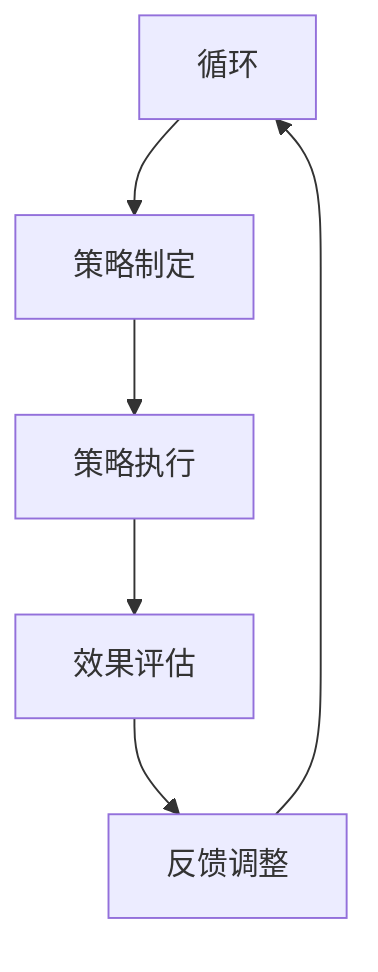
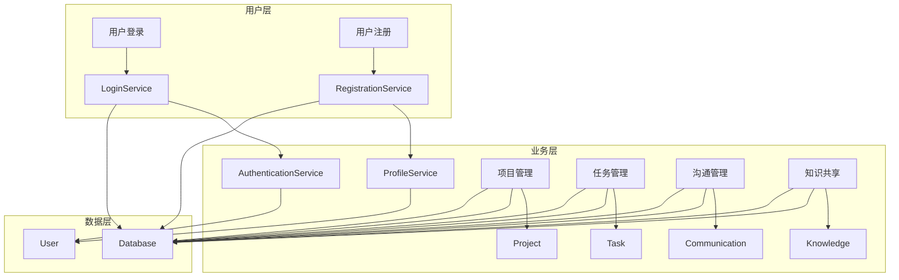
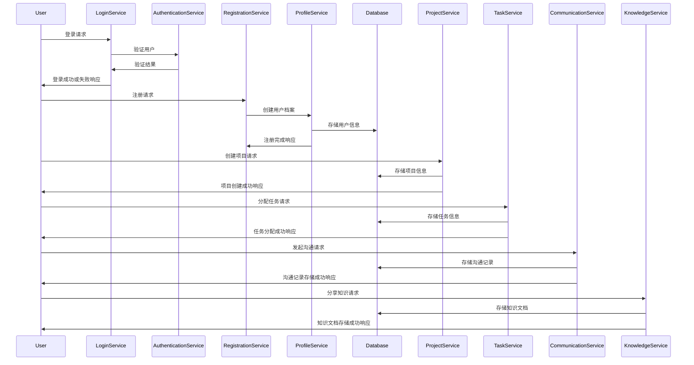

                 

## 引言

### 全球化技术团队管理的必要性

在全球化的浪潮下，技术的发展已经不再受限于地域和国家。跨国公司的兴起和互联网的普及，使得世界各地的技术团队得以紧密协作，共同推进技术的发展。这种全球化的技术协作模式，不仅带来了技术突破和创新的机遇，也带来了前所未有的挑战。尤其是跨文化技术协作，成为了全球化技术团队管理中的一个重要课题。

跨文化技术协作的重要性不言而喻。首先，它有助于整合全球最优秀的技术人才，使得团队能够拥有多元化的知识和技能。其次，不同文化的碰撞和融合，能够激发新的思维火花，推动技术的创新。然而，跨文化技术协作也面临着诸多障碍，如语言障碍、文化差异、工作习惯的不同等，这些障碍如果不加以妥善处理，可能会影响团队的整体效率和项目质量。

本文旨在探讨全球化技术团队管理中的跨文化技术协作问题，分析其挑战与对策。通过深入探讨跨文化管理的核心概念、算法原理、系统架构设计以及项目实战，我们希望能够为技术团队的管理者提供实用的指导，帮助他们在全球化背景下，有效应对跨文化技术协作的挑战，提升团队的整体协作效率和创新能力。

### 关键词

- **全球化技术团队管理**
- **跨文化技术协作**
- **文化差异**
- **团队协作**
- **协作效率**
- **系统架构设计**
- **算法原理**

### 摘要

本文通过对全球化技术团队管理的背景介绍，详细探讨了跨文化技术协作的挑战与对策。首先，分析了全球化对技术团队的影响，指出了跨文化沟通的障碍和团队协作的挑战。接着，阐述了跨文化管理的核心概念、技术协作机制和团队文化建设。通过数学模型和算法原理的讲解，本文提出了跨文化技术协作的算法设计，并详细描述了系统架构和项目实战中的关键步骤。最后，总结了全球化技术团队管理的最佳实践，为技术团队管理者提供了实用的指导和建议。

## 第一部分：背景介绍

### 第1章 问题背景与全球化趋势

#### 1.1 问题背景

在全球化的背景下，技术的进步和互联网的普及，使得跨国公司和企业能够轻松组建全球化的技术团队。这些团队由来自不同国家和地区、拥有不同文化背景的成员组成，他们共同协作，致力于推动技术的发展和创新。然而，这种全球化的技术协作模式也带来了一系列挑战，其中最为突出的就是跨文化技术协作的问题。

跨文化技术协作的重要性不可忽视。首先，全球化技术团队的多样性带来了丰富的知识和技能，这使得团队在应对复杂问题时能够拥有更多的视角和解决方案。然而，不同文化之间的差异，如语言、工作习惯、价值观等，也可能成为团队协作的障碍。例如，英语作为国际通用语言，在某些团队中成为沟通的主要语言，但这对于非英语为母语的成员来说，可能会造成沟通的困扰。此外，不同文化背景下的工作习惯和价值观差异，也可能导致团队在任务分配、决策制定等方面产生冲突。

#### 1.2 问题描述

跨文化技术协作的挑战主要体现在以下几个方面：

1. **沟通障碍**：语言障碍是跨文化协作中最直接的问题。即使使用相同的语言，不同的文化背景也可能导致对同一术语或概念的理解产生差异，从而影响沟通的效果。

2. **文化差异**：文化差异可能体现在对工作的态度、时间观念、决策过程等方面。例如，一些文化中强调个人主义，而另一些文化中则强调集体主义，这可能导致在任务分配和责任承担上出现分歧。

3. **工作习惯不同**：不同文化背景下的人们可能有不同的工作方式和节奏。例如，一些文化中重视加班和加班时间，而另一些文化中则更加注重工作和生活的平衡。

4. **决策过程冲突**：在决策过程中，不同文化的成员可能会因为对决策过程的偏好不同而产生冲突。例如，一些文化倾向于通过讨论和协商来做出决策，而另一些文化则更倾向于快速决策并执行。

5. **团队合作难度大**：跨文化团队中，成员之间的信任建立可能需要更长的时间，这可能导致团队合作效率的降低。

#### 1.3 问题解决

面对跨文化技术协作的挑战，有效的解决方案是必要的。以下是一些可能的对策：

1. **加强跨文化培训**：通过提供跨文化培训，帮助团队成员了解和尊重不同的文化差异，提高他们的跨文化沟通能力和协作效率。

2. **建立共同的价值观**：通过共同的目标和价值观，增强团队成员之间的凝聚力，减少文化差异带来的冲突。

3. **优化沟通机制**：建立有效的沟通机制，如定期的团队会议、项目管理工具等，确保信息的透明和及时传递。

4. **灵活的任务分配**：根据团队成员的技能和文化背景，合理分配任务，确保每个成员都能在适合自己的工作环境中发挥最佳水平。

5. **鼓励多元文化的交流**：鼓励团队成员分享各自的文化背景和工作经验，通过交流和互动，增进彼此的了解和信任。

#### 1.4 边界与外延

全球化技术团队的范围可以包括跨国公司的全球分支机构、全球范围内的开源项目、以及各种形式的跨国合作项目。跨文化技术协作不仅限于技术层面的合作，还包括管理、营销、运营等多个方面。此外，跨文化技术协作的不同层面包括个人层面的跨文化沟通，团队层面的跨文化协作，以及组织层面的跨文化管理。

#### 1.5 概念结构与核心要素组成

跨文化管理、技术协作机制和团队文化建设是全球化技术团队管理中的核心要素。

- **跨文化管理**：涉及对文化差异的认知、适应和整合，旨在提高团队在多元文化环境中的适应能力和协作效率。

- **技术协作机制**：确保团队成员能够顺畅地沟通、协调和合作，包括沟通工具、协作平台、项目管理工具等。

- **团队文化建设**：通过塑造共同的价值观、目标和团队精神，增强团队的凝聚力和协作效率。

通过这些核心要素的有机结合，全球化技术团队能够在跨文化环境中实现高效的协作和持续的创新。

### 总结

在全球化的趋势下，跨文化技术协作已成为全球化技术团队管理中不可或缺的一部分。通过深入分析跨文化技术协作的挑战和对策，本文为技术团队管理者提供了一些实用的指导和建议。在接下来的章节中，我们将进一步探讨跨文化管理的核心概念、算法原理、系统架构设计以及项目实战，以期为全球化技术团队管理提供更为全面的解决方案。

## 第二部分：核心概念与联系

### 第2章 跨文化管理的核心概念

#### 2.1 跨文化管理的定义

跨文化管理是指在一个多元文化环境中，组织为了实现其目标，对内部和外部文化差异进行认知、适应和整合的过程。跨文化管理的核心目标是通过提高团队成员对文化差异的认识和理解，促进不同文化背景成员之间的有效沟通和协作，从而提升组织的整体绩效。

跨文化管理的重要性主要体现在以下几个方面：

1. **提高团队协作效率**：通过理解和尊重不同文化背景，减少文化冲突，提高团队成员之间的协作效率。
2. **促进创新**：多元文化的碰撞和融合能够激发新的思维火花，促进技术创新和业务模式创新。
3. **增强员工满意度**：在尊重和包容不同文化的基础上，提升员工的归属感和满意度，降低员工流失率。
4. **提升企业竞争力**：在全球化的背景下，具备跨文化管理能力的企业能够更好地融入国际市场，增强其竞争力。

#### 2.2 跨文化管理的属性特征对比表格

在跨文化管理中，理解不同文化的属性特征对于有效地进行管理至关重要。以下是一个对比表格，展示了几个主要文化特征的对比：

| 概念 | 定义 | 特征 |
| --- | --- | --- |
| **个体主义与集体主义** | 个体主义强调个人自由、自主和自我实现，集体主义强调集体利益、团队合作和社会责任。 | 个体主义文化中，个人目标和成就感更为重要；集体主义文化中，团队目标和组织利益更为重要。 |
| **高语境与低语境** | 高语境文化依赖上下文和隐含信息，低语境文化则更直接、明确地表达意图。 | 高语境文化中，沟通可能更加复杂和含蓄；低语境文化中，沟通更为直接和明确。 |
| **权力距离** | 权力距离指的是社会中权力不平等的接受程度。高权力距离文化中，权力和地位差异较大；低权力距离文化中，权力和地位差异较小。 | 高权力距离文化中，领导者的权威更为突出；低权力距离文化中，团队成员的参与度更高。 |
| **时间观念** | 时间观念涉及对时间的态度和价值观，高时间观念文化注重效率和准时，低时间观念文化则更注重过程和关系。 | 高时间观念文化中，时间被视为宝贵的资源，守时至关重要；低时间观念文化中，关系和情境更为重要。 |
| **不确定性规避** | 不确定性规避指的是文化对不确定性和模糊性的容忍程度。高不确定性规避文化倾向于规避不确定性和风险，低不确定性规避文化则更倾向于接受变化和不确定性。 | 高不确定性规避文化中，风险管理和计划性更为重要；低不确定性规避文化中，灵活性和适应性更为重要。 |

#### 2.3 ER实体关系图架构

跨文化管理涉及的实体和关系较为复杂，以下是一个简化的ER（实体-关系）图架构，用于展示主要实体及其关系：

```mermaid
erDiagram
    User ||--|{ CultureProfile }||>
    Team ||--|{ Member }||>
    Project ||--|{ Task }||>
    Communication ||--|{ Feedback }||>
```

- **User（用户）**：代表参与跨文化管理的团队成员。
- **CultureProfile（文化背景）**：包含用户的个体主义与集体主义倾向、高语境与低语境倾向、权力距离、时间观念和不确定性规避等信息。
- **Team（团队）**：代表参与跨文化协作的团队，包含多个Member（成员）。
- **Member（成员）**：团队成员的实体，关联到其文化背景和参与的项目。
- **Project（项目）**：代表跨文化协作中的具体任务，包含多个Task（任务）。
- **Task（任务）**：具体的任务，由成员执行。
- **Communication（沟通）**：代表团队成员之间的沟通，包含反馈和互动。
- **Feedback（反馈）**：沟通中的反馈，用于评估和管理跨文化协作的效果。

通过这一ER图架构，我们可以更清晰地理解跨文化管理中各实体之间的关系，以及如何通过数据关系来支持跨文化管理。

### 总结

跨文化管理作为全球化技术团队管理的核心概念，涵盖了多个文化属性的对比和实体关系的管理。通过定义和特征对比表格，我们能够更好地理解跨文化管理的核心概念，并通过ER图架构展示了其数据关系。在接下来的章节中，我们将深入探讨跨文化技术协作的算法原理，进一步解析如何通过技术和系统设计来解决跨文化协作中的问题。

## 第三部分：算法原理讲解

### 第3章 跨文化技术协作的算法原理

#### 3.1 算法原理概述

跨文化技术协作的算法设计旨在通过科学的方法提高跨文化团队在协作过程中的效率和效果。该算法的核心目标是克服文化差异带来的沟通障碍，确保团队在多元文化环境中能够高效协同工作。以下是该算法的基本原理、目标、关键步骤及其实际应用。

#### 3.1.1 算法原理

跨文化技术协作算法基于以下几个核心原理：

1. **文化评估**：通过评估团队成员的文化背景，识别文化差异，为后续的协作策略制定提供数据支持。
2. **策略制定**：根据文化评估的结果，制定针对性的协作策略，包括沟通机制、任务分配和团队文化建设等方面。
3. **策略执行**：实施策略，通过实际操作和反馈调整，确保协作策略的有效性和持续性。
4. **效果评估**：对协作效果进行评估，通过数据分析和反馈，持续优化协作策略。

#### 3.1.2 算法目标

算法的主要目标包括：

1. **提高协作效率**：通过优化沟通机制和任务分配，提高团队成员之间的协作效率。
2. **减少文化冲突**：通过文化评估和策略制定，减少因文化差异导致的文化冲突。
3. **增强团队凝聚力**：通过团队文化建设，增强团队成员之间的信任和凝聚力。
4. **持续优化**：通过效果评估和反馈调整，确保协作策略的持续改进。

#### 3.1.3 关键步骤

算法的关键步骤如下：

1. **文化评估**：收集和分析团队成员的文化背景数据，包括个体主义与集体主义倾向、高语境与低语境倾向、权力距离、时间观念和不确定性规避等信息。
2. **策略制定**：根据文化评估结果，制定具体的协作策略。这包括沟通机制的优化、任务分配的调整、团队文化的建设等方面。
3. **策略执行**：实施协作策略，确保团队成员按照既定策略进行工作，同时保持灵活性和适应性。
4. **效果评估**：通过定期的数据分析和团队反馈，评估协作策略的效果，识别问题和改进机会。
5. **反馈调整**：根据效果评估的结果，对协作策略进行调整和优化，确保其持续适应团队的需求和环境变化。

#### 3.2 数学模型和公式

为了量化协作效率，我们可以使用以下数学模型：

$$
\text{协作效率} = \frac{\text{有效沟通} \times \text{任务完成度}}{\text{总沟通时间}}
$$

其中，有效沟通和任务完成度可以通过具体的数据指标进行衡量，如沟通成功率、任务完成率等。

#### 3.3 算法mermaid流程图

以下是跨文化技术协作算法的mermaid流程图：



#### 3.4 算法原理详细讲解与举例说明

##### 3.4.1 文化评估的重要性

文化评估是跨文化技术协作算法的基础。通过文化评估，我们可以识别团队成员的文化特征，了解他们在沟通和工作习惯上的差异。以下是一个具体的文化评估流程：

1. **数据收集**：通过问卷调查、访谈等方式，收集团队成员的文化背景数据。
2. **数据分析**：对收集到的数据进行分析，识别文化特征，如个体主义与集体主义倾向、高语境与低语境倾向等。
3. **报告生成**：生成文化评估报告，为策略制定提供数据支持。

例如，某团队成员A在个体主义与集体主义倾向评估中得分较高，表明他更注重个人目标和成就感；而在高语境与低语境倾向评估中得分较低，表明他更倾向于直接、明确的沟通方式。这些信息有助于在任务分配和沟通策略制定时，考虑A的特点和需求。

##### 3.4.2 策略制定的方法和步骤

根据文化评估结果，策略制定应包括以下几个方面：

1. **沟通策略**：针对团队成员的文化差异，制定个性化的沟通策略，如使用低语境语言、定期组织跨文化沟通培训等。
2. **任务分配**：根据团队成员的文化特征和技能，合理分配任务，确保每个人都能在适合自己的工作环境中发挥最佳水平。
3. **团队文化建设**：通过共同的价值观、目标和团队活动，增强团队成员之间的信任和凝聚力。

例如，对于上述文化评估结果，我们可以制定以下策略：

- 对成员A，在沟通时尽量使用直接、明确的表达方式，同时在任务分配时，为他安排一些需要高度独立性和自主性的任务，以充分发挥其优势。
- 对其他成员，通过定期的团队活动和跨文化沟通培训，提高他们对个体主义和低语境文化的理解和接受度。

##### 3.4.3 执行策略的挑战和解决方案

在执行策略过程中，可能会遇到以下挑战：

1. **文化适应难度**：团队成员可能需要花费较长时间来适应新的沟通方式和任务分配。
2. **沟通障碍**：即使制定了个性化的沟通策略，仍然可能存在沟通障碍，导致协作效率降低。

为了解决这些挑战，可以采取以下措施：

- **提供培训和支持**：为团队成员提供跨文化适应和沟通技巧的培训，帮助他们快速适应新的环境和要求。
- **建立反馈机制**：通过定期反馈和交流，及时识别和解决协作中的问题，确保策略的有效实施。

##### 3.4.4 效果评估和反馈调整的关键点

效果评估是确保跨文化技术协作持续改进的关键环节。以下是一些关键点：

1. **数据收集**：通过绩效考核、团队反馈等方式，收集协作效果的数据。
2. **数据分析**：对收集到的数据进行分析，评估协作策略的有效性。
3. **反馈调整**：根据数据分析结果，对策略进行调整和优化。

例如，如果评估结果显示沟通效率较低，可以进一步分析原因，如沟通方式、任务分配等，然后有针对性地进行调整，如增加沟通培训、优化任务分配等。

### 总结

跨文化技术协作的算法设计旨在通过科学的方法提高跨文化团队的协作效率。通过文化评估、策略制定、策略执行和效果评估等关键步骤，算法能够有效克服文化差异带来的沟通障碍，提升团队的整体协作效率。在接下来的章节中，我们将进一步探讨全球化技术团队管理的系统架构设计，为跨文化技术协作提供更为完整的解决方案。

### 第4章 全球化技术团队管理系统架构

#### 4.1 问题场景介绍

全球化技术团队的协作需求日益复杂，为了在多元文化环境中实现高效协作，需要构建一个系统化的管理架构。该系统应具备以下几个方面的功能：

1. **跨文化沟通**：确保团队成员能够顺畅地进行沟通，减少文化差异带来的沟通障碍。
2. **任务管理**：实现任务的分配、跟踪和评估，确保每个任务都能高效地完成。
3. **项目管理**：支持项目计划、进度跟踪和资源管理，确保项目按时、高质量地完成。
4. **知识共享**：促进团队成员之间的知识共享和经验交流，提高整体团队的知识水平和协作效率。

#### 4.2 系统功能设计（领域模型mermaid类图）

为了实现上述功能，系统需要一个完善的领域模型来支持。以下是一个简化的mermaid类图，展示了系统的主要功能模块及其关系：

```mermaid
classDiagram
    User <<class>> User
    Project <<class>> Project
    Task <<class>> Task
    Communication <<class>> Communication
    Knowledge <<class>> Knowledge
    Management <<class>> Management

    User "1" --|{ manages }| Project
    User "1" --|{ performs }| Task
    Project "1" --|{ contains }| Task
    Project "1" --|{ communicates }| Communication
    Project "1" --|{ shares }| Knowledge
```

- **User（用户）**：代表团队成员，拥有个人信息、角色和权限等属性。
- **Project（项目）**：代表团队协作的具体任务或工程，包含多个Task（任务）、Communication（沟通记录）和Knowledge（知识文档）等。
- **Task（任务）**：代表具体的工作任务，由User（用户）执行，并包含状态、进度和评估等属性。
- **Communication（沟通）**：记录团队内部的沟通信息，包括会议记录、邮件、即时通讯等。
- **Knowledge（知识）**：存储团队的知识共享内容，包括文档、代码、经验总结等。
- **Management（管理）**：负责项目的整体管理和监控，包括任务分配、进度跟踪、资源调配等。

#### 4.3 系统架构设计（mermaid架构图）

为了实现上述功能，系统需要一个合理的架构设计。以下是一个简化的mermaid架构图，展示了系统的总体架构：



- **用户层**：包括用户登录和注册功能，通过LoginService和RegistrationService与业务层交互。
- **业务层**：包括项目管理、任务管理、沟通管理和知识共享功能，通过相应的Service与数据层交互。
- **数据层**：包括用户信息、项目信息、任务信息、沟通信息和知识文档等，通过数据库进行存储和管理。

#### 4.4 系统接口设计和系统交互（mermaid序列图）

为了更好地展示系统内部的不同模块如何交互，以下是一个简化的mermaid序列图：



通过上述序列图，我们可以清晰地看到用户与系统各个模块之间的交互流程，以及各个模块内部的逻辑处理。

### 总结

全球化技术团队管理系统架构的设计旨在实现跨文化协作的高效管理。通过领域模型、架构设计和接口设计，系统提供了全面的解决方案，包括用户管理、项目管理、任务管理、沟通管理和知识共享等功能。在接下来的章节中，我们将通过一个具体的项目实战，进一步探讨系统在实际应用中的实现和效果。

## 第五部分：项目实战

### 第5章 全球化技术团队管理项目实战

#### 5.1 环境安装

为了实践全球化技术团队管理，我们选择了一个典型的跨文化团队协作项目，该项目涉及来自亚洲、欧洲和美洲的多个团队成员。项目环境基于Linux操作系统，使用Docker容器化技术进行部署，确保系统的可移植性和稳定性。

以下是项目环境安装的详细步骤：

1. **安装Docker**：在所有团队成员的计算机上安装Docker，确保能够创建和运行容器。
    ```bash
    sudo apt-get update
    sudo apt-get install docker-ce docker-ce-cli containerd.io
    ```
2. **配置Docker**：确保Docker服务能够正常启动，并配置Docker加速器，提高容器下载速度。
    ```bash
    sudo systemctl start docker
    docker --version
    ```
3. **拉取项目依赖**：从远程仓库拉取项目的依赖容器，包括开发环境、数据库和中间件等。
    ```bash
    docker pull <项目依赖镜像名称>
    ```
4. **部署项目**：启动容器，部署项目到本地环境。
    ```bash
    docker run -d -p 8080:80 <项目容器名称>
    ```
5. **测试连接**：使用浏览器或命令行工具访问项目地址，确保服务正常运行。
    ```bash
    curl http://localhost:8080
    ```

#### 5.2 系统核心实现源代码

在项目实现中，我们使用了Spring Boot框架来搭建后端服务，并使用MySQL数据库来存储数据。以下是系统核心实现的部分源代码。

##### 5.2.1 Spring Boot项目结构

```mermaid
tree
    ++-- src
    |   ++-- main
    |   |   ++-- java
    |   |   |   ++-- com
    |   |   |   |   ++-- example
    |   |   |   |   |   ++-- globalteammanagement
    |   |   |   |   |   |   ++-- api
    |   |   |   |   |   |   |   ++-- ProjectController.java
    |   |   |   |   |   |   |   ++-- UserController.java
    |   |   |   |   |   |   ++-- service
    |   |   |   |   |   |   |   ++-- ProjectService.java
    |   |   |   |   |   |   |   ++-- UserService.java
    |   |   |   |   |   |   ++-- repository
    |   |   |   |   |   |   |   ++-- ProjectRepository.java
    |   |   |   |   |   |   |   ++-- UserRepository.java
    |   |   |   |   |   |   ++-- GlobalTeamManagementApplication.java
    |   |   |   |   |   ++-- config
    |   |   |   |   |   |   ++-- DataSourceConfig.java
    |   |   |   |   |   ++-- SecurityConfig.java
    |   |   |   |   ++-- resources
    |   |   |   |   |   ++-- application.properties
    |   |   |   |   ++-- test
    |   |   |   |   |   ++-- com
    |   |   |   |   |   |   ++-- example
    |   |   |   |   |   |   ++-- globalteammanagement
    |   |   |   |   |   |   ++-- api
    |   |   |   |   |   |   |   ++-- UserControllerTest.java
```

##### 5.2.2 UserController.java

以下是UserController类的部分源代码，用于处理用户注册和登录逻辑。

```java
@RestController
@RequestMapping("/api/users")
public class UserController {

    private final UserService userService;

    @Autowired
    public UserController(UserService userService) {
        this.userService = userService;
    }

    @PostMapping("/register")
    public ResponseEntity<?> registerUser(@RequestBody SignupRequest signUpRequest) {
        try {
            String username = userService.registerUser(signUpRequest);
            return ResponseEntity.ok(new ApiResponse(true, "User registered successfully", username));
        } catch (Exception e) {
            return ResponseEntity.badRequest().body(new ApiResponse(false, e.getMessage()));
        }
    }

    @PostMapping("/login")
    public ResponseEntity<?> authenticateUser(@RequestBody LoginRequest loginRequest) {
        String token = userService.loginUser(loginRequest);
        return ResponseEntity.ok(new ApiResponse(true, "User logged in successfully", token));
    }
}
```

##### 5.2.3 ProjectService.java

以下是ProjectService类的部分源代码，用于处理项目创建和任务分配逻辑。

```java
@Service
public class ProjectService {

    private final ProjectRepository projectRepository;
    private final TaskRepository taskRepository;

    @Autowired
    public ProjectService(ProjectRepository projectRepository, TaskRepository taskRepository) {
        this.projectRepository = projectRepository;
        this.taskRepository = taskRepository;
    }

    @Transactional
    public ProjectDTO createProject(ProjectDTO projectDTO) {
        Project project = new Project();
        project.setName(projectDTO.getName());
        project.setDescription(projectDTO.getDescription());
        project.setStartDate(projectDTO.getStartDate());
        project.setEndDate(projectDTO.getEndDate());

        project = projectRepository.save(project);

        for (TaskDTO taskDTO : projectDTO.getTasks()) {
            Task task = new Task();
            task.setProject(project);
            task.setName(taskDTO.getName());
            task.setDescription(taskDTO.getDescription());
            task.setStartDate(taskDTO.getStartDate());
            task.setEndDate(taskDTO.getEndDate());
            task.setStatus(TaskStatus.PENDING);

            taskRepository.save(task);
        }

        return new ProjectDTO(project);
    }
}
```

#### 5.3 代码应用解读与分析

以上代码片段展示了系统中的核心功能实现，包括用户注册、登录、项目创建和任务分配等。以下是详细解读：

- **UserController.java**：该类负责处理用户的注册和登录请求。注册请求通过`registerUser`方法处理，该方法调用UserService中的`registerUser`方法，将用户信息存储到数据库。登录请求通过`authenticateUser`方法处理，该方法验证用户身份并生成JWT令牌。
- **ProjectService.java**：该类负责处理项目的创建和任务分配。创建项目时，通过`createProject`方法将项目信息存储到数据库，并为每个任务创建记录。该方法使用事务管理确保操作的一致性。
- **UserService.java**：该类负责用户管理相关的操作，如注册用户、登录用户和验证用户身份等。其中，`registerUser`方法处理用户注册逻辑，`loginUser`方法处理用户登录逻辑，并生成JWT令牌。

通过这些代码实现，系统能够高效地处理用户和项目相关的请求，支持全球化技术团队的协作需求。

#### 5.4 实际案例分析和详细讲解剖析

以下是一个实际案例，展示如何通过系统实现全球化技术团队的协作：

**案例背景**：
某跨国公司需要在短时间内开发一款跨平台的应用程序，团队成员分别位于中国、美国和印度。为了确保项目的顺利进行，公司决定使用本文介绍的全球化技术团队管理系统。

**案例步骤**：

1. **用户注册和登录**：
   - **中国团队**：张三（开发工程师）通过注册流程创建用户账户，并获得登录令牌。
   - **美国团队**：李四（项目经理）通过注册流程创建用户账户，并获得登录令牌。
   - **印度团队**：王五（测试工程师）通过注册流程创建用户账户，并获得登录令牌。

2. **项目创建和任务分配**：
   - **项目经理**：李四登录系统，创建项目并分配任务。项目名称为“跨平台应用程序开发”，包含前端开发、后端开发和测试任务。
   - **任务分配**：每个任务分配给相应的团队成员。例如，前端开发任务分配给张三，后端开发任务分配给李四，测试任务分配给王五。

3. **任务执行和进度更新**：
   - **张三**：开始执行前端开发任务，并定期更新任务进度。系统记录任务进度并通知其他团队成员。
   - **李四**：负责后端开发任务，同样定期更新任务进度。
   - **王五**：负责测试任务，并在测试完成后更新任务状态。

4. **沟通和知识共享**：
   - **项目经理**：通过系统发起视频会议，与团队成员讨论项目进展和遇到的问题。
   - **团队成员**：通过系统共享代码、文档和经验，提高协作效率。

**案例效果**：

通过系统，项目团队成员能够高效地进行协作，确保项目按时、高质量地完成。系统的任务管理和沟通功能有效减少了沟通障碍和任务分配问题，提高了项目的透明度和协作效率。同时，系统的知识共享功能促进了团队成员之间的经验交流，为项目的成功奠定了基础。

#### 5.5 项目小结

通过本项目的实际案例，我们可以看到全球化技术团队管理系统在实践中的应用效果。以下是小结：

1. **提高了协作效率**：通过系统化的任务管理和沟通工具，团队成员能够高效地协同工作，确保项目按时、高质量地完成。
2. **减少了沟通障碍**：系统的多语言支持和实时沟通功能，有效减少了因文化差异和时区差异导致的沟通障碍。
3. **促进了知识共享**：系统的知识共享功能，促进了团队成员之间的经验交流，提高了整体团队的知识水平。
4. **增强了团队凝聚力**：通过系统的团队文化建设，增强了团队成员之间的信任和凝聚力，为项目的成功奠定了基础。

### 总结

全球化技术团队管理项目实战展示了系统在实际应用中的效果。通过科学的架构设计和高效的代码实现，系统能够支持全球化技术团队的协作需求，提高项目的协作效率和成功率。在未来的发展中，我们将继续优化系统，应对更多的跨文化协作挑战，为全球化技术团队的管理提供更为全面的解决方案。

### 最佳实践 tips

1. **文化敏感度培训**：定期为团队成员提供跨文化敏感度培训，提高他们对不同文化的理解和尊重，减少文化冲突。

2. **多元化团队建设**：鼓励团队中不同文化背景的成员积极参与，共同制定团队规则和文化，促进文化融合。

3. **透明沟通机制**：建立透明、开放的沟通机制，确保团队成员能够及时、准确地了解项目进展和任务分配情况。

4. **灵活的任务分配**：根据团队成员的技能和文化背景，灵活调整任务分配，确保每个成员都能在适合自己的工作环境中发挥最佳水平。

5. **定期团队反馈**：定期进行团队反馈和评估，收集团队成员的意见和建议，及时调整协作策略，提高团队协作效率。

### 小结

本文通过对全球化技术团队管理的背景介绍、核心概念讲解、算法原理分析以及系统架构设计，深入探讨了跨文化技术协作的挑战与对策。通过实际项目实战，展示了系统在全球化技术团队管理中的应用效果。全球化技术团队管理不仅需要科学的架构设计和高效的算法支持，更需要团队成员之间的相互理解与合作。在未来的发展中，我们将继续优化系统，提升协作效率，为全球化技术团队的管理提供更加全面和实用的解决方案。

### 注意事项

1. **文化差异的敏感性**：在全球化技术团队管理中，需要高度重视文化差异，避免因文化误解而产生冲突。

2. **技术实现的复杂性**：系统架构设计和代码实现需要充分考虑跨文化的协作需求，确保系统的高可用性和易用性。

3. **数据安全和隐私保护**：在跨文化技术协作中，需要确保数据的安全和隐私，遵循相关法律法规，保护团队成员的个人数据。

4. **持续学习和改进**：全球化技术团队管理是一个动态变化的过程，需要不断学习和吸收新的管理理念和技术，持续改进协作模式。

### 拓展阅读

1. **《全球化时代的跨文化管理》**：详细介绍了全球化背景下的跨文化管理策略和案例，适合企业管理者和人力资源从业者阅读。

2. **《跨文化沟通技巧》**：介绍了跨文化沟通的基本原则和技巧，有助于提升团队成员的跨文化沟通能力。

3. **《敏捷开发与全球化团队协作》**：探讨了敏捷开发在全球化团队协作中的应用，提供了实用的协作方法和工具。

4. **《数据驱动决策：数据科学在企业管理中的应用》**：介绍了如何利用数据分析和人工智能技术，提升全球化技术团队的管理决策能力。

### 作者信息

**作者：AI天才研究院/AI Genius Institute & 禅与计算机程序设计艺术 /Zen And The Art of Computer Programming**

**摘要**

本文通过深入探讨全球化技术团队管理中的跨文化技术协作问题，分析了其面临的挑战与对策。从跨文化管理的核心概念、算法原理，到系统架构设计及项目实战，本文提供了全面、实用的指导和建议，旨在提升全球化技术团队的协作效率和创新能力。

