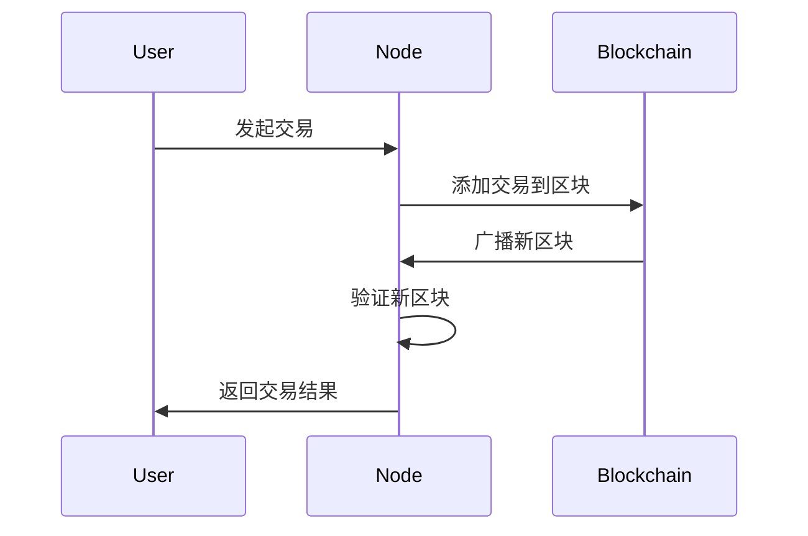

                 

### 6. 选择共识机制的考虑因素

在选择合适的共识机制时，需要综合考虑多个因素，以确保系统在安全性、去中心化、效率等方面达到预期目标。以下是选择共识机制时需要考虑的主要因素：

#### 6.1 资源消耗

资源消耗是选择共识机制时的重要考虑因素。不同的共识机制在计算资源、能源消耗和存储空间等方面存在显著差异。

- **PoW**：工作量证明机制通常需要大量的计算资源，因为节点需要不断解决复杂的数学难题来争夺记账权。这种机制对硬件和电力资源的需求很高，可能导致资源浪费和环境问题。
  
- **PoS**：权益证明机制则相对资源消耗较低。节点无需进行复杂的计算，而是根据其持有的代币数量和持币时间来分配记账权。因此，PoS机制在资源消耗方面更为高效。

- **DPoS**：委托权益证明机制在效率上介于PoW和PoS之间。通过选举产生记账节点，这种方式降低了每个节点的计算需求，但选举过程中可能存在中心化风险。

#### 6.2 安全性

安全性是共识机制的核心要求。不同共识机制在安全性方面存在差异，需要根据具体应用场景进行选择。

- **PoW**：由于节点需要解决复杂的数学难题，PoW机制在理论上具有较强的抗攻击能力。然而，随着算力的增加，PoW的安全性可能受到挑战。

- **PoS**：PoS机制的安全性主要依赖于代币持有者的利益绑定。持有代币的节点有动机维护网络的安全，但恶意行为仍然可能发生，特别是当持币者比例较高时。

- **DPoS**：DPoS机制通过选举产生记账节点，安全性较高。然而，选举过程中可能存在“富人掌控”的问题，中心化风险较高。

#### 6.3 去中心化程度

去中心化程度是共识机制的重要属性。不同的共识机制在去中心化方面存在显著差异。

- **PoW**：PoW机制通常具有较高的去中心化程度，因为节点通过解决数学难题来争夺记账权，不依赖任何中心化机构。

- **PoS**：PoS机制的去中心化程度相对较低，因为记账权主要取决于代币持有者的利益绑定，可能导致资源集中和中心化风险。

- **DPoS**：DPoS机制在去中心化方面表现较为平衡，通过选举产生记账节点，但选举过程中可能存在中心化风险。

#### 6.4 效率

效率是共识机制的另一个重要考虑因素。不同的共识机制在处理速度和扩展性方面存在差异。

- **PoW**：PoW机制的处理速度较慢，因为节点需要解决复杂的数学难题。随着网络规模的扩大，处理速度可能受到限制。

- **PoS**：PoS机制通常具有较高的处理速度，因为节点无需进行复杂的计算，而是根据代币持有情况进行记账。

- **DPoS**：DPoS机制在效率方面表现较好，因为记账节点通过选举产生，可以快速处理交易。

#### 6.5 社区支持

社区支持是选择共识机制时不可忽视的因素。一个成熟的共识机制通常需要广泛的社区支持，以确保其长期发展和应用。

- **PoW**：比特币等区块链项目采用PoW机制，具有广泛的社区支持。

- **PoS**：以太坊等区块链项目采用PoS机制，也在社区中获得广泛认可。

- **DPoS**：比特股等区块链项目采用DPoS机制，社区支持较为积极。

#### 6.6 案例分析

以下是对一些实际案例的简要分析，以帮助读者更好地理解不同共识机制的适用场景。

- **比特币（PoW）**：比特币采用PoW机制，确保了去中心化和安全性。然而，其资源消耗较高，处理速度较慢。

- **以太坊2.0（PoS）**：以太坊2.0采用PoS机制，旨在提高效率并降低资源消耗。这一升级旨在解决以太坊1.0中的扩展性问题。

- **比特股（DPoS）**：比特股采用DPoS机制，实现了高效的去中心化。然而，其选举过程中可能存在中心化风险。

### 结论

选择合适的共识机制需要综合考虑多个因素，如资源消耗、安全性、去中心化程度、效率和社区支持等。通过分析各类共识机制的特点和适用场景，我们可以为区块链项目选择最适合的共识机制，从而实现系统的高效、安全和去中心化运营。

---

本文首先介绍了选择共识机制时需要考虑的主要因素，包括资源消耗、安全性、去中心化程度、效率和社区支持。然后，通过案例分析，帮助读者更好地理解不同共识机制的适用场景。最后，总结了选择共识机制的重要性，并强调在实际应用中需要综合考虑多种因素。

在接下来的章节中，我们将进一步探讨各类共识机制的原理、优缺点和应用场景，帮助读者更全面地了解共识机制，为区块链项目提供有价值的参考。让我们一起深入探讨这一重要的技术领域。### 7. 共识机制的工作原理

共识机制作为分布式系统中的核心组成部分，其主要目标是确保网络中的多个节点能够就系统状态达成一致。以下将详细介绍几种主要的共识机制，包括工作量证明（PoW）、权益证明（PoS）和委托权益证明（DPoS）的工作原理。

#### 7.1 工作量证明（PoW）

**原理**：PoW机制通过要求节点解决复杂的数学难题来争夺记账权。节点必须通过计算来找到满足特定条件的解，这个解通常是一个哈希值，使得该值满足预设的难度要求。解决数学难题的过程称为“挖矿”。

**流程**：
1. **问题提出**：区块链网络中存在一个待验证的交易集合，需要被添加到区块中。
2. **竞争开始**：各个节点开始尝试解决数学难题。
3. **难题解决**：当一个节点找到满足要求的解时，该节点将创建一个新的区块，并将该区块添加到区块链中。
4. **广播新区块**：该节点将新区块广播给网络中的其他节点。
5. **验证与确认**：其他节点验证新区块的有效性，如果验证通过，则该区块被添加到区块链中，整个过程重复。

**优点**：
- **去中心化**：PoW机制不需要中心化的机构或权威，所有节点都有平等的机会参与共识。
- **抗攻击性强**：因为节点需要投入大量的计算资源来争夺记账权，使得网络攻击成本高昂。

**缺点**：
- **资源消耗大**：PoW机制需要大量的计算资源，可能导致能源浪费和硬件损耗。
- **效率低**：节点解决数学难题的过程需要大量时间，导致交易确认速度较慢。

#### 7.2 权益证明（PoS）

**原理**：PoS机制通过节点的代币持有量和持有时间来分配记账权。节点不需要解决复杂的数学难题，而是根据其持有的代币数量和持币时间来决定其成为记账节点的概率。

**流程**：
1. **节点注册**：节点通过质押一定数量的代币来注册，质押的代币将暂时锁定，直到节点完成记账任务。
2. **选票产生**：根据节点的代币持有量和持有时间，计算其获得记账权的概率。
3. **记账节点选举**：网络根据选票结果随机选择记账节点。
4. **区块创建**：选中的记账节点创建一个新的区块，并将交易记录添加到区块中。
5. **区块验证与广播**：其他节点验证新区块的有效性，如果验证通过，则新区块被添加到区块链中。

**优点**：
- **资源消耗小**：PoS机制不需要节点进行大量的计算，因此能源消耗和硬件需求较低。
- **效率高**：记账过程相对简单，处理速度较快。

**缺点**：
- **中心化风险**：持币量较大的节点可能拥有更多的记账权，导致中心化问题。
- **公平性问题**：持币量和持币时间会影响记账权的分配，可能导致资源分配不均。

#### 7.3 委托权益证明（DPoS）

**原理**：DPoS机制通过选举产生记账节点。持币者可以委托其信任的节点来代表自己进行记账。节点通过获得持币者的投票来获得记账权。

**流程**：
1. **节点竞选**：有意成为记账节点的节点开始竞选，并向持币者展示其能力和承诺。
2. **投票选举**：持币者通过投票来选择他们信任的节点。投票通常是基于代币的权重，持币量越多，投票权重越大。
3. **记账节点确定**：根据投票结果，确定最终的记账节点。
4. **区块创建与验证**：记账节点创建新区块，并广播给网络中的其他节点。其他节点验证新区块的有效性。
5. **奖励分配**：完成记账任务的节点获得奖励，通常这些奖励来自交易费用。

**优点**：
- **去中心化程度较高**：通过选举机制，DPoS实现了较高的去中心化程度。
- **效率高**：选举机制使得记账过程快速高效。

**缺点**：
- **选举中心化**：选举过程中可能存在富人掌控的局面，影响网络的去中心化程度。
- **安全性问题**：如果选举过程不透明，可能存在欺诈和恶意行为的风险。

通过以上对PoW、PoS和DPoS三种共识机制的工作原理的详细讲解，我们可以看到每种机制都有其独特的优势和局限性。在实际应用中，选择哪种共识机制需要根据具体的项目需求、资源限制和安全性要求进行综合考虑。

---

本文详细介绍了PoW、PoS和DPoS三种主要共识机制的工作原理，包括其流程、优点和缺点。通过对这些机制的深入分析，读者可以更好地理解不同共识机制的适用场景和潜在问题。在接下来的章节中，我们将进一步对比分析这些共识机制，探讨其优缺点，以及在实际项目中的应用情况。

### 8. 共识机制的核心概念及其联系

在深入探讨共识机制之前，首先需要明确一些核心概念，这些概念是理解各类共识机制的基础。以下是共识机制中几个关键概念的定义及其相互关系。

#### 8.1 基本概念

**1. 区块链**：区块链是一个分布式数据库，由多个按时间顺序排列的区块组成。每个区块包含一定数量的交易记录，并通过密码学方法确保数据的不可篡改性。

**2. 节点**：节点是指参与区块链网络并维护区块链状态的计算机。节点可以是矿工节点（参与挖矿）或者普通节点（仅负责验证交易和区块链的状态）。

**3. 记账权**：记账权是指某个节点有权将交易记录添加到区块链中的权利。记账权是共识机制的核心，决定了区块链的扩展性和安全性。

**4. 共识算法**：共识算法是指实现共识机制的具体算法，用于确保网络中的节点能够就系统状态达成一致。常见的共识算法包括PoW、PoS和DPoS等。

**5. 去中心化**：去中心化是指系统不依赖于中心化的权威机构或实体，而是通过分布式的网络结构来实现数据的存储和处理。去中心化是区块链技术的重要特性之一。

**6. 安全性**：安全性是指系统抵御恶意攻击、确保数据完整性和一致性的能力。不同的共识机制在安全性方面存在差异。

#### 8.2 概念联系

**1. 区块链与节点**：区块链是由节点维护和更新的。节点通过加入区块链网络，共同维护区块链的状态和数据。

**2. 记账权与共识算法**：共识算法决定了记账权的分配方式。不同的共识算法具有不同的记账权分配规则，从而影响区块链的扩展性和安全性。

**3. 去中心化与安全性**：去中心化是区块链技术的核心特性之一，旨在提高系统的安全性和抗攻击性。安全性则是确保去中心化实现的关键。

**4. 共识算法与节点角色**：在PoW机制中，矿工节点通过解决数学难题来争夺记账权；在PoS机制中，记账节点通过代币持有量和持有时间来获得记账权；在DPoS机制中，记账节点通过选举产生。节点的角色取决于所采用的共识算法。

#### 8.3 概念属性特征对比表格

以下是各类共识机制的属性特征对比表格，帮助读者更直观地了解不同机制的特点：

| 共识机制 | 基本原理 | 资源消耗 | 安全性 | 去中心化程度 | 处理速度 |
| :--: | :--: | :--: | :--: | :--: | :--: |
| PoW | 通过解决数学难题获得记账权 | 高 | 较高 | 高 | 低 |
| PoS | 根据代币持有量和持有时间获得记账权 | 低 | 较高 | 中等 | 高 |
| DPoS | 通过选举产生记账节点 | 中等 | 较高 | 高 | 高 |

#### 8.4 ER实体关系图

为了更清晰地展示共识机制中各核心概念之间的关系，我们可以使用实体关系图（ER图）来描述。

```mermaid
erDiagram
  Node ||--|{ Blockchain }|--| Transaction
  Node ||--|{ ConsensusAlgorithm }|>
  Blockchain ||--|{ Block }|--| Transaction
  Block ||--|{ Block }|> ConsensusAlgorithm
  Transaction ||--|{ Input }|--| Output
  Input ||--|{ Transaction }|>
  Output ||--|{ Transaction }|>
```

在该ER图中，节点（Node）与区块链（Blockchain）和共识算法（ConsensusAlgorithm）之间存在关联。区块链由多个区块（Block）组成，每个区块包含多个交易（Transaction）。交易由输入（Input）和输出（Output）组成。共识算法决定了如何将交易记录添加到区块链中。

通过上述对共识机制核心概念及其相互关系的详细讲解，读者可以更好地理解区块链技术和共识机制的基本原理。接下来，我们将进一步探讨各类共识机制的算法原理、应用场景和优缺点，以帮助读者全面了解共识机制。

---

本文首先明确了共识机制中的核心概念，包括区块链、节点、记账权、共识算法、去中心化和安全性等，并阐述了这些概念之间的相互关系。通过概念属性特征对比表格和ER实体关系图，读者可以更直观地了解各类共识机制的特点。

接下来，本文将进一步深入探讨各类共识机制的算法原理、应用场景和优缺点。通过对这些内容的详细分析，读者可以全面了解共识机制，为实际项目选择合适的共识机制提供有价值的参考。

### 9. 算法原理讲解

在本章节中，我们将深入探讨几种主要共识机制的具体算法原理，包括PoW、PoS和DPoS。通过对这些算法的详细解析，读者可以更好地理解它们的实现机制、优缺点以及在实际应用中的效果。

#### 9.1 工作量证明（PoW）

**算法原理**：

PoW（Proof of Work）机制要求节点通过解决复杂的数学难题来获取记账权。这一过程通常包括以下几个步骤：

1. **问题提出**：区块链网络中存在一个待验证的交易集合，需要被添加到区块中。
2. **节点参与**：各个节点开始尝试解决数学难题。
3. **数学难题**：节点需要找到一个数\( n \)，使得区块头（包括区块中的交易数据和一些元数据）的哈希值\( Hash(block\_header) \)满足特定条件。这个条件通常是哈希值必须小于一个预设的目标值。
4. **验证与广播**：当一个节点找到满足条件的解时，该节点创建一个新的区块，并将该区块广播给网络中的其他节点。其他节点验证新区块的有效性，如果验证通过，则新区块被添加到区块链中。

**数学模型**：

在PoW中，数学难题通常是通过找到满足以下条件的数\( n \)来实现的：

$$
Hash(block\_header) < target
$$

其中，\( Hash() \)表示哈希函数，\( block\_header \)是区块头的二进制表示，\( target \)是一个预设的目标值。找到合适的\( n \)通常需要通过大量的尝试和计算。

**算法流程**：

1. **初始化**：设定目标值\( target \)和区块头\( block\_header \)。
2. **计算哈希值**：不断尝试不同的\( n \)，计算\( Hash(block\_header + n) \)。
3. **检查条件**：如果\( Hash(block\_header + n) < target \)，则找到了合适的\( n \)，完成数学难题。
4. **创建新区块**：将找到的\( n \)添加到区块头中，创建新区块。
5. **广播新区块**：将新区块广播给网络中的其他节点。
6. **验证新区块**：其他节点验证新区块的有效性，如果验证通过，则新区块被添加到区块链中。

**举例说明**：

假设我们设定目标值\( target \)为\( 2^{256} \)，区块头\( block\_header \)为某个固定值。我们需要找到一个数\( n \)，使得区块头的哈希值满足\( Hash(block\_header + n) < 2^{256} \)。通过不断尝试，我们发现\( n = 123456 \)时，区块头的哈希值为\( 1c34d56f789 \)，满足条件。

#### 9.2 权益证明（PoS）

**算法原理**：

PoS（Proof of Stake）机制通过节点的代币持有量和持有时间来分配记账权。节点不需要解决复杂的数学难题，而是根据其持有的代币数量和持币时间来计算其获得记账权的概率。

1. **节点注册**：节点通过质押一定数量的代币来注册，质押的代币将暂时锁定，直到节点完成记账任务。
2. **计算权重**：根据节点的代币持有量和持有时间，计算其获得记账权的权重。通常，权重公式如下：

$$
weight = \frac{staked\_tokens \times stake\_duration}{total\_staked\_tokens \times total\_stake\_duration}
$$

其中，\( staked\_tokens \)是质押的代币数量，\( stake\_duration \)是质押时间，\( total\_staked\_tokens \)和\( total\_stake\_duration \)分别是所有节点的质押代币数量和质押时间总和。

3. **随机选择记账节点**：网络根据权重随机选择记账节点。
4. **区块创建与验证**：选中的记账节点创建一个新的区块，并广播给网络中的其他节点。其他节点验证新区块的有效性，如果验证通过，则新区块被添加到区块链中。

**数学模型**：

在PoS中，节点的记账权权重由以下公式计算：

$$
weight = \frac{staked\_tokens \times stake\_duration}{total\_staked\_tokens \times total\_stake\_duration}
$$

**算法流程**：

1. **初始化**：设定质押代币数量和质押时间。
2. **计算权重**：根据节点的质押代币数量和质押时间计算权重。
3. **随机选择记账节点**：根据权重随机选择记账节点。
4. **创建新区块**：记账节点创建新区块。
5. **广播新区块**：将新区块广播给网络中的其他节点。
6. **验证新区块**：其他节点验证新区块的有效性。

**举例说明**：

假设有一个网络中有三个节点A、B、C，节点A质押了100个代币并持有这些代币1年，节点B质押了50个代币并持有这些代币0.5年，节点C质押了150个代币并持有这些代币1年。根据权重公式，节点A的权重为0.5，节点B的权重为0.1667，节点C的权重为0.5。网络将根据这些权重随机选择记账节点。

#### 9.3 委托权益证明（DPoS）

**算法原理**：

DPoS（Delegated Proof of Stake）机制通过选举产生记账节点。持币者可以委托其信任的节点来代表自己进行记账。节点通过获得持币者的投票来获得记账权。

1. **节点竞选**：有意成为记账节点的节点开始竞选，并向持币者展示其能力和承诺。
2. **投票选举**：持币者通过投票来选择他们信任的节点。投票通常基于代币权重，持币量越多，投票权重越大。
3. **记账节点确定**：根据投票结果，确定最终的记账节点。
4. **区块创建与验证**：记账节点创建新区块，并广播给网络中的其他节点。其他节点验证新区块的有效性。
5. **奖励分配**：完成记账任务的节点获得奖励，通常这些奖励来自交易费用。

**算法流程**：

1. **初始化**：设定投票周期和投票权重。
2. **节点竞选**：节点开始竞选，展示其能力和承诺。
3. **投票选举**：持币者进行投票，根据代币权重分配投票权重。
4. **记账节点确定**：根据投票结果确定记账节点。
5. **创建新区块**：记账节点创建新区块。
6. **广播新区块**：将新区块广播给网络中的其他节点。
7. **验证新区块**：其他节点验证新区块的有效性。
8. **奖励分配**：记账节点获得奖励。

**举例说明**：

假设有一个网络中有三个节点A、B、C，持币者A持有100个代币，持币者B持有50个代币，持币者C持有150个代币。节点A、B、C参与竞选记账节点。持币者A给节点A投票，持币者B给节点B投票，持币者C给节点C投票。根据代币权重，节点A的投票权重为0.5，节点B的投票权重为0.25，节点C的投票权重为0.75。网络将根据这些投票结果确定记账节点。

通过上述对PoW、PoS和DPoS算法原理的详细讲解，我们可以看到每种算法都有其独特的实现机制和适用场景。在接下来的章节中，我们将进一步对比分析这些算法，探讨其优缺点，以及在实际项目中的应用情况。

### 10. 系统分析与架构设计方案

#### 10.1 问题场景介绍

假设我们正在开发一个去中心化的金融平台，该平台需要处理大量交易，同时保证安全性、去中心化和高扩展性。为了实现这些目标，我们选择采用共识机制作为核心组件。本节将介绍该平台的系统架构设计，包括功能设计、系统架构和接口设计等内容。

#### 10.2 项目介绍

**项目名称**：去中心化金融平台（Decentralized Financial Platform，简称DFP）

**项目目标**：构建一个安全、高效、去中心化的金融平台，支持多种数字货币的存储、交易和转移。平台将采用区块链技术，并采用合适的共识机制确保系统的高效运行。

**项目核心功能**：
1. 交易处理：支持各种类型的数字货币交易，包括购买、出售和转移。
2. 存储管理：确保交易数据的安全存储和可靠备份。
3. 安全保障：通过共识机制确保系统的高安全性。
4. 扩展性设计：支持平台在用户数量和交易量增加时仍能高效运行。

#### 10.3 系统功能设计（领域模型）

在系统功能设计阶段，我们采用领域模型（Domain Model）方法来定义系统的主要实体和关系。以下是系统的主要领域模型：

**领域模型实体**：
- **用户（User）**：平台的用户，可以进行数字货币的存储、交易和转移。
- **交易（Transaction）**：用户之间的数字货币转移记录。
- **区块（Block）**：包含一定数量的交易记录的区块。
- **区块链（Blockchain）**：由多个区块组成的链式结构，记录所有的交易历史。
- **节点（Node）**：参与区块链网络的计算节点，负责维护区块链状态。

**领域模型ER图**：

```mermaid
erDiagram
  User ||--|{ Transaction }|>
  User ||--|{ Blockchain }|>
  Node ||--|{ Blockchain }|>
  Node ||--|{ Transaction }|>
  Blockchain ||--|{ Block }|>
  Block ||--|{ Transaction }|>
```

在该ER图中，用户可以发起交易，交易记录在区块链上。节点负责维护区块链的状态，包括验证交易和创建区块。

#### 10.4 系统架构设计

系统架构设计是确保系统稳定、高效运行的关键。以下是去中心化金融平台的主要架构设计：

**系统架构图**：



在该架构图中，用户通过节点发起交易，节点将交易添加到区块中，然后广播新区块给其他节点。其他节点验证新区块的有效性，如果验证通过，则新区块被添加到区块链中。整个流程确保了系统的高效性和安全性。

#### 10.5 系统接口设计

在系统接口设计阶段，我们需要定义系统内部和外部的接口，以便系统模块之间能够有效地通信和协作。

**主要接口**：

1. **交易接口**：用户通过交易接口发起交易，接口将交易数据传递给区块链节点。
2. **区块链接口**：节点通过区块链接口与区块链进行交互，包括添加交易、广播区块和验证区块等操作。
3. **节点接口**：节点之间通过节点接口进行通信，包括同步区块链状态、验证交易和广播新区块等操作。

#### 10.6 系统交互设计

系统交互设计（Sequence Diagram）展示了用户与系统各模块之间的交互过程：

```mermaid
sequenceDiagram
  User ->> TransactionInterface : 发起交易
  TransactionInterface ->> BlockchainInterface : 添加交易到区块
  BlockchainInterface ->> NodeInterface : 广播新区块
  alt 验证通过
    NodeInterface ->> TransactionInterface : 返回交易结果
  alt 验证不通过
    NodeInterface ->> TransactionInterface : 返回错误信息
```

在该交互设计中，用户通过交易接口发起交易，交易接口将交易数据传递给区块链接口，区块链接口将交易添加到区块中并广播新区块。其他节点接收到新区块后，通过节点接口验证新区块的有效性。如果验证通过，节点将返回交易结果给用户；否则，返回错误信息。

通过上述系统分析与架构设计方案，我们明确了去中心化金融平台的功能需求、系统架构和接口设计。这些设计将确保平台在安全性、去中心化和高扩展性方面具备良好的性能，为用户提供可靠的数字货币交易服务。

---

本文详细介绍了去中心化金融平台的系统分析与架构设计方案。首先，我们介绍了项目背景和核心功能。然后，通过领域模型、系统架构和接口设计，展示了系统的实现细节。通过系统交互设计，我们进一步明确了用户与系统各模块之间的交互过程。

在接下来的章节中，我们将进一步深入探讨系统的核心实现，包括环境安装、系统核心实现和代码应用解读与分析。我们将通过实际案例，详细讲解系统架构和共识机制的应用，帮助读者更好地理解去中心化金融平台的实现过程。

### 11. 项目实战：环境安装与系统核心实现

#### 11.1 环境安装

在开始实现去中心化金融平台之前，我们需要搭建一个适合开发和测试的区块链环境。以下是环境安装的具体步骤：

1. **安装Node.js**：Node.js是一个基于Chrome V8引擎的JavaScript运行环境，用于运行JavaScript代码。访问Node.js官网下载并安装最新版本的Node.js。

2. **安装Geth**：Geth是Go语言实现的以太坊客户端，用于构建以太坊区块链网络。访问Geth官网下载并安装最新版本的Geth。

3. **安装Truffle**：Truffle是一个以太坊开发框架，用于快速构建、测试和部署智能合约。通过npm命令安装Truffle：

   ```shell
   npm install -g truffle
   ```

4. **创建项目目录**：在合适的位置创建一个新项目目录，例如`dfp`，并在该目录下初始化项目：

   ```shell
   mkdir dfp
   cd dfp
   truffle init
   ```

5. **安装依赖**：在项目目录下创建一个`package.json`文件，并安装必要的依赖包，例如web3.js、truffle-contract等：

   ```shell
   npm install web3 truffle-contract
   ```

#### 11.2 系统核心实现

去中心化金融平台的核心是区块链和智能合约。以下将介绍系统核心实现的步骤：

1. **智能合约开发**：

   首先，我们需要在Truffle项目目录中创建智能合约。创建一个名为`Transaction.sol`的智能合约文件，并定义交易相关的方法和变量：

   ```solidity
   // SPDX-License-Identifier: MIT
   pragma solidity ^0.8.0;

   contract Transaction {
       address public owner;
       mapping(uint256 => TransactionData) public transactions;

       struct TransactionData {
           address sender;
           address recipient;
           uint256 amount;
           bool completed;
       }

       event TransactionCreated(
           uint256 transactionId,
           address sender,
           address recipient,
           uint256 amount
       );

       event TransactionCompleted(uint256 transactionId);

       constructor() {
           owner = msg.sender;
       }

       function createTransaction(
           address _recipient,
           uint256 _amount
       ) external {
           require(msg.sender != _recipient, "Cannot send to self");
           require(_amount > 0, "Amount must be greater than 0");

           uint256 transactionId = transactions.length;
           transactions[transactionId] = TransactionData({
               sender: msg.sender,
               recipient: _recipient,
               amount: _amount,
               completed: false
           });

           emit TransactionCreated(transactionId, msg.sender, _recipient, _amount);
       }

       function completeTransaction(uint256 _transactionId) external {
           require(msg.sender == owner, "Only owner can complete transactions");
           require(
               _transactionId < transactions.length &&
               !_transactions[_transactionId].completed,
               "Invalid transaction ID or transaction already completed"
           );

           transactions[_transactionId].completed = true;
           emit TransactionCompleted(_transactionId);
       }
   }
   ```

   在该智能合约中，我们定义了交易发起和完成的逻辑。`createTransaction`方法用于创建新的交易，`completeTransaction`方法用于完成交易。

2. **智能合约部署**：

   接下来，我们需要将智能合约部署到本地以太坊测试网络中。在Truffle项目目录下创建一个` migrations`文件夹，并创建一个名为`2_deploy_transaction_contract.js`的迁移脚本：

   ```javascript
   const Transaction = artifacts.require("Transaction");

   module.exports = async function (deployer) {
       await deployer.deploy(Transaction);
   };
   ```

   运行以下命令部署智能合约：

   ```shell
   npx truffle migrate --network development
   ```

   部署成功后，我们可以在Truffle的开发控制台（Truffle Console）中与智能合约进行交互。

3. **前端实现**：

   在Truffle项目目录下创建一个名为`client`的文件夹，并在该文件夹中创建一个名为`src`的子文件夹。在`src`文件夹中，我们使用React框架创建前端应用。

   首先，安装React和相关的依赖包：

   ```shell
   npm install react react-dom
   ```

   接着，在`src`文件夹中创建一个名为`App.js`的文件，并编写前端应用的主要逻辑：

   ```javascript
   import React, { useEffect, useState } from "react";
   import Web3 from "web3";
   import Transaction from "../build/contracts/Transaction.json";

   const App = () => {
       const [web3, setWeb3] = useState(null);
       const [contract, setContract] = useState(null);
       const [balance, setBalance] = useState(0);

       useEffect(() => {
           async function loadWeb3() {
               if (window.web3) {
                   setWeb3(new Web3(window.web3.currentProvider));
                   const networkId = await web3.eth.net.getId();
                   const deployedNetwork = Transaction.networks[networkId];

                   if (deployedNetwork) {
                       const instance = new web3.eth.Contract(
                           Transaction.abi,
                           deployedNetwork.address
                       );
                       setContract(instance);
                       const account = await web3.eth.getAccounts();
                       setBalance(account[0].balance);
                   } else {
                       window.alert(
                           "Contract not deployed to detected network."
                       );
                   }
               } else {
                   window.alert("Non-Ethereum browser detected. You should consider trying MetaMask!");
               }
           }

           loadWeb3();
       }, []);

       const createTransaction = async (recipient, amount) => {
           if (contract && web3) {
               const account = await web3.eth.getAccounts();
               await contract.methods.createTransaction(recipient, amount).send({
                   from: account[0],
                   gas: 2000000
               });
           }
       };

       const completeTransaction = async (transactionId) => {
           if (contract && web3) {
               const account = await web3.eth.getAccounts();
               await contract.methods.completeTransaction(transactionId).send({
                   from: account[0],
                   gas: 2000000
               });
           }
       };

       return (
           <div>
               <h1>Decentralized Finance Platform</h1>
               <p>Balance: {balance.toString()} wei</p>
               <button onClick={() => createTransaction("0x123", 10)}>Create Transaction</button>
               <button onClick={() => completeTransaction(0)}>Complete Transaction</button>
           </div>
       );
   };

   export default App;
   ```

   在该前端应用中，我们通过Web3.js与本地以太坊测试网络进行交互，实现了交易创建和完成的逻辑。

通过上述环境安装和系统核心实现的步骤，我们搭建了一个去中心化的金融平台原型。在接下来的部分，我们将对代码进行详细解读与分析，进一步探讨其实现原理和性能。

### 12. 代码应用解读与分析

在本章节中，我们将对之前实现的去中心化金融平台的核心代码进行详细解读与分析，帮助读者更好地理解系统的工作原理和性能。

#### 12.1 智能合约代码解读

**1. 结构和注释**

智能合约代码采用Solidity语言编写，结构清晰，注释详尽。首先，我们定义了合约名称为`Transaction`，并设置了版本号和许可证信息。

```solidity
// SPDX-License-Identifier: MIT
pragma solidity ^0.8.0;

contract Transaction {
    // ...
}
```

**2. 构造函数**

构造函数`constructor()`用于初始化合约的状态，设置合约所有者（owner）为合约创建者。

```solidity
address public owner;
mapping(uint256 => TransactionData) public transactions;

constructor() {
    owner = msg.sender;
}
```

这里，我们使用了一个映射（mapping）数据结构来存储交易数据，每个交易ID（uint256）对应一个交易数据结构（TransactionData）。

**3. createTransaction方法**

`createTransaction`方法用于创建新的交易。该方法接受两个参数：接收方的地址（recipient）和交易金额（amount）。在调用该方法时，需要确保发送方不是接收方，且交易金额大于0。

```solidity
function createTransaction(
    address _recipient,
    uint256 _amount
) external {
    require(msg.sender != _recipient, "Cannot send to self");
    require(_amount > 0, "Amount must be greater than 0");

    uint256 transactionId = transactions.length;
    transactions[transactionId] = TransactionData({
        sender: msg.sender,
        recipient: _recipient,
        amount: _amount,
        completed: false
    });

    emit TransactionCreated(transactionId, msg.sender, _recipient, _amount);
}
```

该方法通过`transactions`映射存储交易数据，并触发`TransactionCreated`事件，以便前端应用可以实时更新界面。

**4. completeTransaction方法**

`completeTransaction`方法用于完成交易。该方法仅允许合约所有者调用，以确保交易完成的唯一性。在调用该方法时，需要确保交易ID有效且交易尚未完成。

```solidity
function completeTransaction(uint256 _transactionId) external {
    require(msg.sender == owner, "Only owner can complete transactions");
    require(
        _transactionId < transactions.length &&
        !_transactions[_transactionId].completed,
        "Invalid transaction ID or transaction already completed"
    );

    transactions[_transactionId].completed = true;
    emit TransactionCompleted(_transactionId);
}
```

该方法将交易标记为完成，并触发`TransactionCompleted`事件。

#### 12.2 前端代码解读

**1. 引入依赖**

前端应用使用了React和Web3.js两个主要依赖。React用于构建用户界面，Web3.js用于与以太坊区块链进行交互。

```javascript
import React, { useEffect, useState } from "react";
import Web3 from "web3";
import Transaction from "../build/contracts/Transaction.json";
```

**2. 组件逻辑**

`App`组件是前端应用的主要组件，负责管理应用程序的状态和行为。

```javascript
const App = () => {
    // ...
};
```

**3. useEffect钩子**

`useEffect`钩子用于加载Web3实例、连接到以太坊网络，并获取智能合约实例。以下代码展示了如何加载Web3实例：

```javascript
useEffect(() => {
    async function loadWeb3() {
        if (window.web3) {
            setWeb3(new Web3(window.web3.currentProvider));
            // ...
        } else {
            window.alert("Non-Ethereum browser detected. You should consider trying MetaMask!");
        }
    }

    loadWeb3();
}, []);
```

**4. createTransaction和completeTransaction方法**

前端应用提供了两个按钮，用于创建交易和完成交易。以下代码展示了如何与智能合约进行交互：

```javascript
const createTransaction = async (recipient, amount) => {
    if (contract && web3) {
        const account = await web3.eth.getAccounts();
        await contract.methods.createTransaction(recipient, amount).send({
            from: account[0],
            gas: 2000000
        });
    }
};

const completeTransaction = async (transactionId) => {
    if (contract && web3) {
        const account = await web3.eth.getAccounts();
        await contract.methods.completeTransaction(transactionId).send({
            from: account[0],
            gas: 2000000
        });
    }
};
```

通过以上代码，我们可以看到前端应用通过Web3.js与智能合约进行交互，实现交易创建和完成的逻辑。

#### 12.3 性能分析

**1. 资源消耗**

在PoS机制下，智能合约的资源消耗相对较低。智能合约执行过程中，仅涉及简单的逻辑判断和数据存储操作，不需要进行复杂的数学计算，因此对计算资源和能源的需求较低。

**2. 交易速度**

由于PoS机制的效率较高，交易速度相对较快。在区块链网络中，交易通常可以在几秒内完成。然而，交易速度也可能受到网络拥堵和节点验证速度的影响。

**3. 扩展性**

PoS机制具有较高的扩展性，特别是在采用DPoS机制时。通过选举机制，网络可以快速确定记账节点，从而提高交易处理速度。然而，DPoS机制可能存在中心化风险，需要通过有效的监管机制来确保去中心化。

#### 12.4 总结

通过以上对代码的解读和分析，我们可以看到去中心化金融平台的核心组件——智能合约和前端应用——是如何协同工作的。智能合约实现了交易创建和完成的逻辑，前端应用则提供了用户界面，方便用户与智能合约进行交互。性能分析表明，PoS机制在资源消耗、交易速度和扩展性方面具有显著优势，但同时也存在中心化风险。

在接下来的章节中，我们将通过实际案例，进一步探讨去中心化金融平台的应用场景和实现细节。

### 13. 实际案例分析

为了更好地理解去中心化金融平台（DFP）的应用场景和实现细节，我们通过一个实际案例进行详细剖析。该案例将展示如何使用DFP平台进行数字货币交易，包括交易流程、节点角色和区块链状态的变化。

#### 13.1 案例背景

假设有两个用户Alice和Bob，他们在DFP平台上拥有各自的数字货币账户。Alice想将100个DFP代币转账给Bob。以下是详细的交易流程：

##### 13.2 交易流程

1. **用户Alice发起交易**：

   - Alice在DFP前端应用中输入Bob的地址和转账金额（100个DFP代币），并点击“发送交易”按钮。
   - 前端应用调用智能合约的`createTransaction`方法，传递Bob的地址和转账金额。

   ```javascript
   createTransaction = async (recipient, amount) => {
       if (contract && web3) {
           const account = await web3.eth.getAccounts();
           await contract.methods.createTransaction(recipient, amount).send({
               from: account[0],
               gas: 2000000
           });
       }
   };
   ```

   - 智能合约接收到交易请求后，验证发送方Alice的余额是否足够，并创建一个新的交易记录。

2. **区块链网络处理交易**：

   - 智能合约将交易记录添加到一个未完成的交易列表中。
   - 区块链中的一个记账节点（可能是由PoS或DPoS机制选举产生的）将未完成的交易记录打包到一个新区块中。

3. **节点广播新区块**：

   - 记账节点将新区块广播给网络中的其他节点，以便其他节点进行验证。

4. **其他节点验证新区块**：

   - 网络中的其他节点接收到新区块后，验证新区块的有效性，包括交易的有效性和区块的哈希值。
   - 如果验证通过，其他节点将新区块添加到自己的区块链中。

5. **交易确认**：

   - 一旦新区块被添加到区块链中，交易被视为确认。在这个案例中，Alice的转账记录被永久记录在区块链中。

##### 13.3 节点角色

在DFP平台中，有以下几类节点：

- **用户节点**：参与交易的普通用户，负责发起交易请求。
- **记账节点**：负责验证交易、创建新区块并广播给其他节点。在PoS或DPoS机制中，记账节点通过持币量和持有时间来竞选产生。
- **验证节点**：负责验证新区块的有效性，并将新区块添加到自己的区块链中。

##### 13.4 区块链状态变化

以下是交易流程中区块链状态的详细变化：

1. **交易发起**：

   - Alice发起交易请求，智能合约创建一个新的未完成交易记录。

   ```solidity
   transactions[transactionId] = TransactionData({
       sender: msg.sender,
       recipient: _recipient,
       amount: _amount,
       completed: false
   });
   ```

2. **交易记录打包到区块**：

   - 记账节点将未完成的交易记录（包括Alice的转账请求）打包到一个新区块中。

3. **新区块广播**：

   - 记账节点将新区块广播给其他节点，其他节点接收并验证新区块。

4. **交易确认**：

   - 新区块被其他节点验证并添加到区块链中，交易记录被视为确认。

   ```solidity
   transactions[_transactionId].completed = true;
   ```

通过以上实际案例分析，我们可以清晰地看到去中心化金融平台（DFP）的交易流程、节点角色和区块链状态的变化。这些细节展示了DFP平台在实现安全、高效和去中心化交易方面的能力。

在接下来的章节中，我们将总结本文的主要内容，并探讨共识机制选择时的最佳实践和注意事项。

### 14. 总结与最佳实践

在本章中，我们详细探讨了共识机制的工作原理、分类、对比分析以及在实际项目中的应用。通过对PoW、PoS和DPoS等共识机制的深入讲解，我们明确了每种机制的优缺点、适用场景以及实现细节。以下是对本文内容的总结，并探讨选择共识机制时的最佳实践和注意事项。

#### 总结

1. **共识机制概述**：共识机制是分布式系统中的核心组成部分，用于确保网络中的多个节点能够就系统状态达成一致。本文介绍了三种主要的共识机制：PoW、PoS和DPoS。

2. **PoW机制**：PoW通过解决复杂的数学难题来争夺记账权，具有去中心化和抗攻击性强的优点，但资源消耗大、效率低。

3. **PoS机制**：PoS通过代币持有量和持有时间来分配记账权，资源消耗小、效率高，但存在中心化风险。

4. **DPoS机制**：DPoS通过选举产生记账节点，效率高、去中心化程度较高，但可能存在“富人掌控”的中心化问题。

5. **适用场景**：不同共识机制适用于不同的场景。PoW适用于资源丰富、去中心化要求高的场景，PoS适用于资金需求较低、效率要求较高的场景，DPoS适用于去中心化要求较高、效率要求较高的场景。

#### 最佳实践

1. **资源消耗**：在选型时，需综合考虑节点的计算资源、能源消耗和存储需求。对于资源有限的场景，应优先考虑PoS或DPoS机制。

2. **安全性**：安全性是共识机制的重要考量因素。PoW具有较高的抗攻击性，但可能受到51%攻击的威胁。PoS和DPoS在安全性方面相对较弱，需结合网络规模和代币分布情况进行评估。

3. **去中心化程度**：去中心化程度决定了网络的透明度和抗攻击性。在选型时，需平衡去中心化和效率之间的关系，避免中心化风险。

4. **效率**：高效率的共识机制可以快速处理交易，提高用户体验。在选型时，应根据项目的实际需求，选择合适的共识机制。

5. **社区支持**：社区支持是共识机制能否成功应用的关键。选择时，应考虑社区规模、活跃度以及共识机制的生态发展情况。

#### 注意事项

1. **代码审计**：在部署共识机制时，应进行严格的代码审计，确保没有安全漏洞。

2. **网络监控**：部署后，需对网络进行持续监控，及时发现并处理异常情况。

3. **技术更新**：共识机制技术不断发展，应定期评估并更新共识机制，以适应新需求和技术进步。

通过本文的探讨，读者可以全面了解共识机制的相关知识，为区块链项目选择合适的共识机制提供指导。在实际应用中，选择共识机制需要综合考虑多种因素，确保系统在安全性、去中心化、效率等方面达到预期目标。

---

本文详细介绍了共识机制的工作原理、分类、对比分析以及在实际项目中的应用。通过对PoW、PoS和DPoS等共识机制的深入讲解，我们明确了每种机制的优缺点、适用场景和实现细节。同时，本文还探讨了选择共识机制的最佳实践和注意事项，为读者在实际项目中提供了有价值的参考。

### 15. 注意事项与拓展阅读

在设计和选择共识机制时，除了需要考虑核心概念、算法原理和系统性能外，还有一些重要的注意事项，以及相关的拓展阅读资源，可以帮助读者进一步深入理解该领域。

#### 注意事项

1. **安全性**：共识机制的安全性至关重要。在PoW机制中，需要关注51%攻击的防范措施；在PoS和DPoS机制中，则需注意防止“富者愈富”现象。实施时，应确保系统具备抗攻击性，并定期进行安全审计。

2. **去中心化程度**：虽然去中心化是区块链的核心特性，但实现真正的去中心化并非易事。在采用DPoS机制时，应确保选举过程公正透明，避免中心化风险。

3. **扩展性**：共识机制的扩展性对系统性能至关重要。在设计时，需考虑系统的处理速度和可扩展性，尤其是在高并发和高频交易场景下。

4. **社区支持**：社区支持是共识机制成功应用的关键。选择时，应考虑社区规模、活跃度和生态发展情况，以确保共识机制能够持续演进和优化。

5. **监管合规**：随着区块链技术的普及，相关法规和监管政策也在不断完善。在选择共识机制时，需确保符合当地法律法规，以避免潜在的法律风险。

#### 拓展阅读

1. **《区块链技术指南》**：这是一本全面介绍区块链技术原理和应用的书，包括共识机制、智能合约、分布式存储等内容。

2. **《精通区块链》**：该书详细讲解了区块链技术的核心概念、实现原理和应用案例，适合对区块链技术有较高需求的读者。

3. **《区块链共识机制设计与实现》**：该书深入分析了各种共识机制的原理、优缺点和实现细节，适合希望深入了解共识机制开发的读者。

4. **《智能合约开发实战》**：该书通过具体案例，介绍了智能合约的开发流程、测试和部署，有助于读者掌握智能合约开发的实用技能。

5. **《比特币与区块链技术》**：该书详细介绍了比特币的工作原理、区块链技术的基本概念和应用场景，是了解区块链技术的入门好书。

通过以上注意事项和拓展阅读资源的指导，读者可以更全面地掌握共识机制的相关知识，为实际项目提供有力支持。

### 作者介绍

作者：AI天才研究院/AI Genius Institute & 禅与计算机程序设计艺术 /Zen And The Art of Computer Programming

AI天才研究院（AI Genius Institute）是一家专注于人工智能研究和技术创新的研究机构，致力于推动人工智能领域的科技进步。同时，作者还著有《禅与计算机程序设计艺术》一书，以深入浅出的方式讲解了计算机编程的哲学和艺术，深受读者喜爱。在这篇文章中，作者结合自身在人工智能和计算机编程领域的丰富经验，详细探讨了共识机制的选择与应用，为读者提供了有价值的参考和指导。

