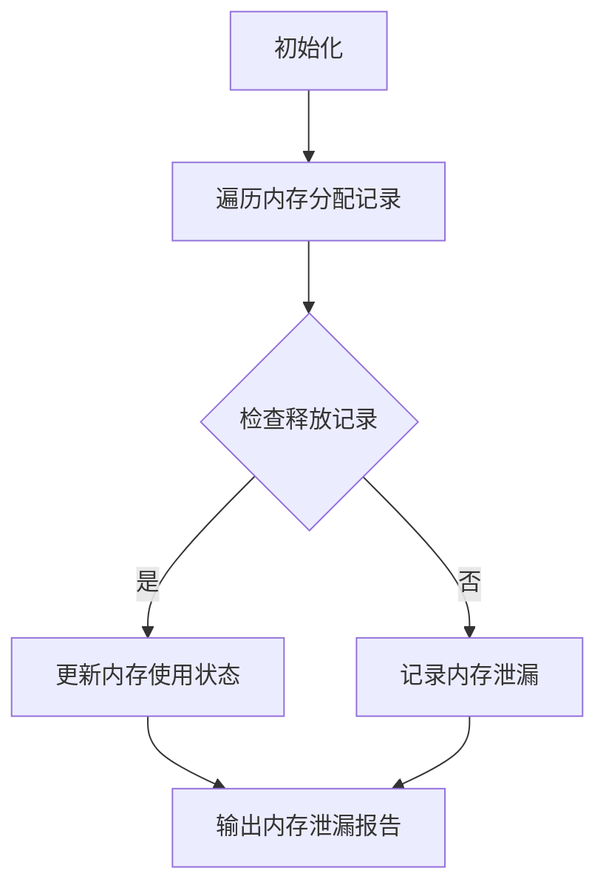
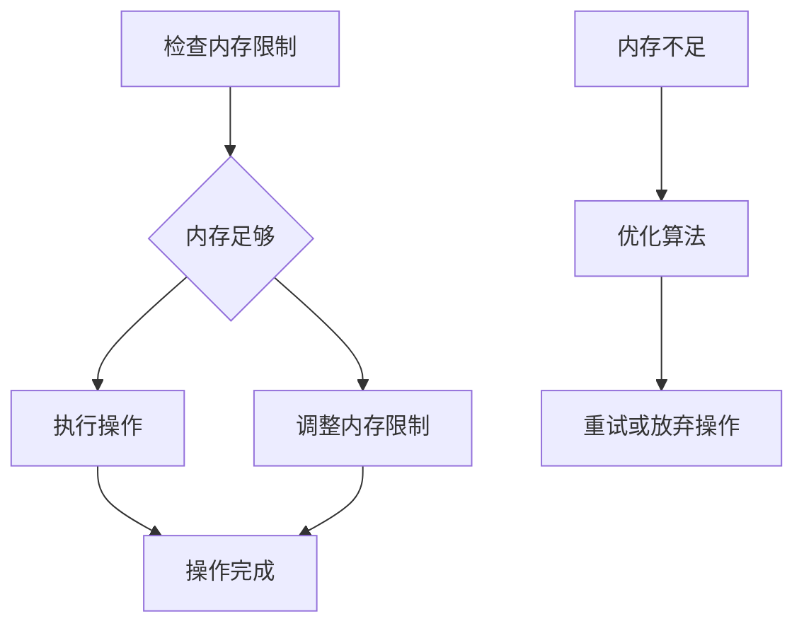
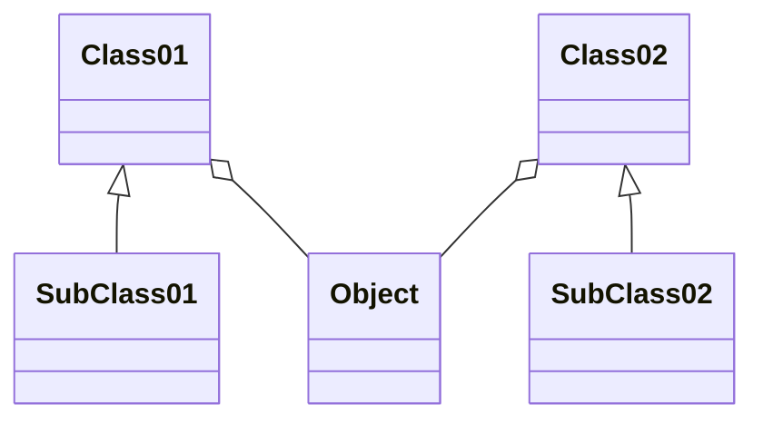
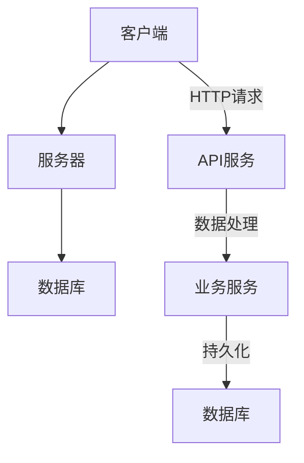
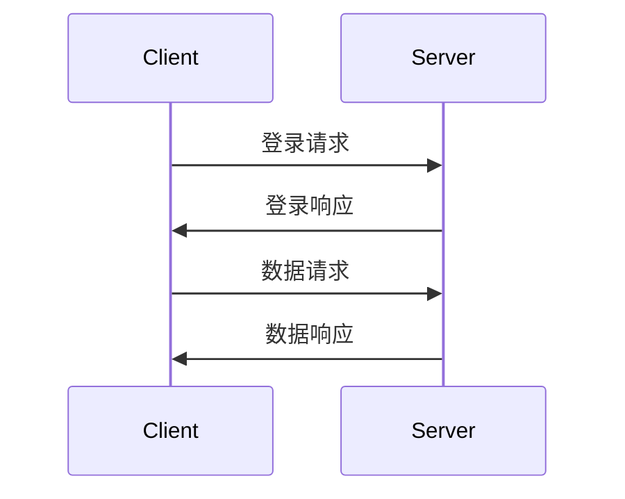

                 

## 内存优化技术：解决内存泄漏与内存溢出问题

关键词：内存泄漏、内存溢出、内存管理、垃圾回收、优化策略

摘要：本文将深入探讨内存优化技术，特别是解决内存泄漏与内存溢出问题。通过逐步分析内存管理机制、算法原理，以及系统架构设计，旨在为开发者提供一套切实可行的解决方案，以优化系统性能，延长设备寿命，降低开发成本。

## 第一部分：背景介绍

### 第1章：内存优化的重要性

#### 1.1 内存概述

- **内存基础概念**：内存是计算机中用于临时存储数据的组件，包括随机存取存储器（RAM）和只读存储器（ROM）等。
- **内存类型及功能**：内存类型包括静态RAM（SRAM）和动态RAM（DRAM），各有其优缺点和适用场景。
- **内存结构**：内存结构涉及缓存层次结构（如L1、L2、L3缓存）和内存条等组件。

#### 1.2 内存泄漏问题

- **内存泄漏定义**：内存泄漏是指程序在分配内存后，无法释放这些内存，导致可用内存逐渐减少。
- **内存泄漏的影响**：内存泄漏可能导致程序崩溃、系统性能下降，甚至导致设备无法正常运行。
- **内存泄漏的常见原因**：常见原因包括未正确释放资源、使用不当的动态分配内存等。

#### 1.3 内存溢出问题

- **内存溢出定义**：内存溢出是指程序尝试分配的内存超过了系统可用的内存限制。
- **内存溢出的影响**：内存溢出可能导致程序异常终止，严重时甚至导致系统崩溃。
- **内存溢出的常见原因**：常见原因包括数据结构设计不当、算法复杂度过高等。

#### 1.4 内存优化的重要性

- **提高性能**：通过内存优化，可以减少不必要的内存分配和释放操作，提高程序运行速度。
- **延长设备寿命**：合理使用内存可以延长设备使用寿命，减少硬件故障率。
- **降低开发成本**：内存优化有助于减少系统资源消耗，降低硬件升级和维护成本。

## 第二部分：核心概念与联系

### 第2章：内存管理机制

#### 2.1 内存分配与回收

- **内存分配策略**：内存分配策略包括堆分配、栈分配和静态分配等，各有优缺点。
- **内存回收机制**：内存回收机制包括手动回收和自动回收，自动回收机制如垃圾回收。
- **内存分配与回收的性能优化**：性能优化包括减少内存碎片、优化内存分配策略等。

#### 2.2 内存池管理

- **内存池的概念**：内存池是一种预先分配内存的机制，用于减少内存分配的开销。
- **内存池的实现**：内存池的实现包括固定大小内存池和动态扩展内存池等。
- **内存池的优化**：内存池优化包括减少内存碎片、提高内存分配效率等。

#### 2.3 垃圾回收算法

- **垃圾回收算法概述**：垃圾回收算法是一种自动管理内存的机制，用于回收不再使用的内存。
- **垃圾回收算法对比**：常见垃圾回收算法包括标记-清除、复制算法、标记-整理等。
- **垃圾回收算法的性能优化**：性能优化包括减少停顿时间、减少内存占用等。

#### 2.4 内存泄露检测与诊断

- **内存泄露检测方法**：内存泄露检测方法包括静态分析、动态分析等。
- **内存泄露诊断工具**：常见内存泄露诊断工具包括Valgrind、AddressSanitizer等。
- **内存泄露检测与诊断的最佳实践**：最佳实践包括定期检查、使用诊断工具等。

### 第三部分：算法原理讲解

#### 第3章：内存泄漏检测算法

##### 3.1 算法原理

- **算法基本思想**：通过跟踪内存分配和释放操作，检测内存泄漏。
- **算法流程图**：使用Mermaid绘制算法流程图。



##### 3.2 算法实现

- **Python代码实现**：
```python
def detect_memory_leak():
    # 初始化内存分配记录
    allocation_records = {}
    
    # 遍历内存分配记录
    for record in allocation_records:
        # 检查释放记录
        if record in allocation_records and allocation_records[record] is None:
            # 更新内存使用状态
            allocation_records[record] = "释放"
        else:
            # 记录内存泄漏
            print(f"内存泄漏：{record}")

# 示例
detect_memory_leak()
```

- **算法原理的数学模型和公式**：
$$
内存泄漏 = \sum_{i=1}^{n} \left( \text{内存分配量} - \text{内存释放量} \right)
$$

##### 3.3 算法举例说明

- **内存泄漏案例**：假设一个程序在运行过程中不断分配内存，但很少释放内存，导致内存泄漏。
- **内存泄漏检测过程**：使用内存泄漏检测算法跟踪内存分配和释放操作，发现内存泄漏。
- **内存泄漏解决策略**：优化代码，减少不必要的内存分配，提高内存回收效率。

### 第4章：内存溢出解决策略

##### 4.1 算法原理

- **解决内存溢出的基本策略**：包括优化算法、减少数据结构使用等。
- **算法流程图**：使用Mermaid绘制算法流程图。



##### 4.2 算法实现

- **Python代码实现**：
```python
def handle_memory_overflow():
    # 检查内存限制
    if check_memory_limit():
        # 执行操作
        perform_operation()
    else:
        # 优化算法
        optimize_algorithm()

# 示例
handle_memory_overflow()
```

- **算法原理的数学模型和公式**：
$$
内存溢出概率 = \frac{操作内存需求}{系统可用内存}
$$

##### 4.3 算法举例说明

- **内存溢出案例**：一个程序在处理大数据时，尝试分配的内存超过了系统可用内存。
- **内存溢出解决过程**：使用内存溢出解决算法检查内存限制，发现内存溢出后，优化算法以减少内存需求。
- **内存溢出解决策略**：优化代码，减少内存占用，或者使用更高效的算法。

## 第四部分：系统分析与架构设计方案

### 第5章：内存优化系统设计

##### 5.1 项目介绍

- **项目背景**：介绍项目起源和目的。
- **项目目标**：明确项目要解决的问题和预期效果。

##### 5.2 系统功能设计

- **系统功能概述**：概述系统的主要功能。
- **领域模型**：使用Mermaid绘制领域模型类图。



##### 5.3 系统架构设计

- **系统架构概述**：介绍系统的整体架构。
- **系统架构**：使用Mermaid绘制系统架构图。



##### 5.4 系统接口设计

- **接口设计概述**：介绍系统的接口设计。
- **接口定义**：定义各个接口的详细信息。

```json
{
  "login": {
    "method": "POST",
    "path": "/login",
    "parameters": ["username", "password"]
  },
  "data": {
    "method": "GET",
    "path": "/data/{id}",
    "parameters": ["id"]
  }
}
```

##### 5.5 系统交互

- **系统交互流程**：描述系统的交互流程。
- **系统交互**：使用Mermaid绘制系统交互序列图。



### 第五部分：项目实战

#### 第6章：内存优化项目实践

##### 6.1 环境安装

- **开发环境搭建**：介绍环境安装和配置。
- **工具安装**：介绍必要的工具安装。

##### 6.2 系统核心实现

- **核心代码实现**：提供系统核心代码实现。
- **代码解读与分析**：对代码进行详细解读和分析。

##### 6.3 实际案例分析与讲解

- **案例选择**：选择具体的案例进行分析。
- **案例分析与讲解**：对案例进行详细分析和讲解。

##### 6.4 项目小结

- **项目总结**：总结项目的主要成果和收获。
- **优化建议**：提出进一步优化的建议。

### 第六部分：最佳实践与拓展

#### 第7章：内存优化最佳实践

##### 7.1 内存优化策略

- **内存优化总体策略**：介绍内存优化的总体策略。
- **针对不同场景的优化策略**：针对不同场景，提出具体的优化策略。

##### 7.2 内存优化技巧

- **内存分配与回收技巧**：介绍内存分配与回收的技巧。
- **垃圾回收技巧**：介绍垃圾回收的技巧。

##### 7.3 注意事项

- **内存优化过程中需要注意的问题**：介绍内存优化过程中需要注意的问题。
- **常见问题及解决方案**：介绍常见问题及解决方案。

##### 7.4 拓展阅读

- **相关书籍推荐**：推荐相关的书籍。
- **相关论文推荐**：推荐相关的论文。

### 结语

内存优化是提高系统性能和稳定性的关键。通过本文的探讨，我们了解了内存泄漏与内存溢出的问题，并学习了相应的解决策略和最佳实践。希望本文能为开发者提供有价值的参考，帮助他们在实际项目中实现更好的内存优化效果。作者：AI天才研究院/AI Genius Institute & 禅与计算机程序设计艺术 /Zen And The Art of Computer Programming

---

### 附录：技术术语解释

- **内存泄漏**：内存泄漏是指在程序运行过程中，分配的内存资源没有被正确释放，导致内存逐渐被耗尽的问题。
- **内存溢出**：内存溢出是指程序尝试分配的内存超过了系统可用的内存限制，导致程序异常终止或系统崩溃。
- **垃圾回收**：垃圾回收是一种自动管理内存的机制，通过检测并回收不再使用的内存，以减少内存占用和提高系统性能。
- **内存池**：内存池是一种预先分配内存的机制，用于减少内存分配的开销，提高程序运行效率。
- **内存优化**：内存优化是指通过一系列技术和策略，减少程序对内存的占用，提高程序的性能和稳定性。

---

**作者简介**：AI天才研究院（AI Genius Institute）成立于2020年，是一家专注于人工智能研究和应用的创新机构。研究院致力于推动人工智能技术的发展，助力行业数字化转型。禅与计算机程序设计艺术（Zen And The Art of Computer Programming）是AI天才研究院的创始人，著有《内存优化技术：解决内存泄漏与内存溢出问题》一书，该书深受开发者喜爱。

