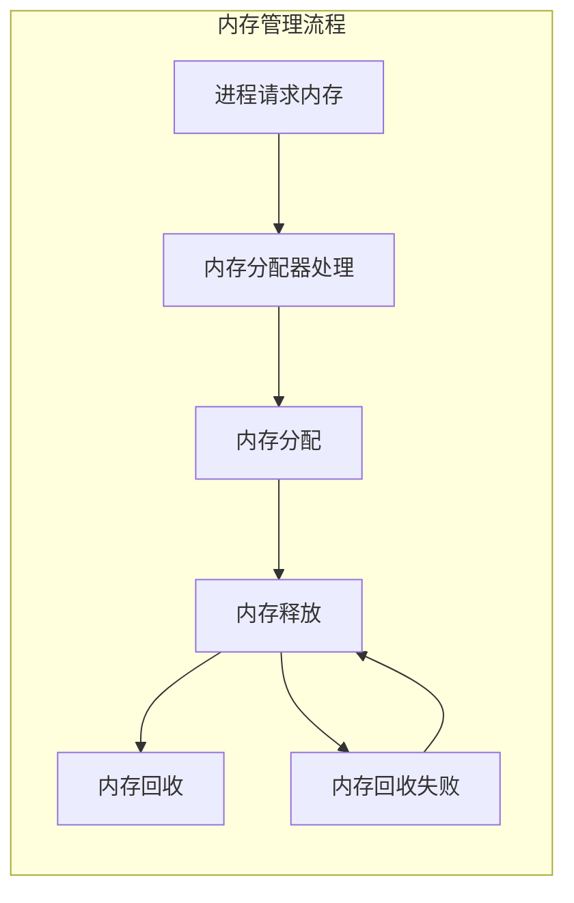
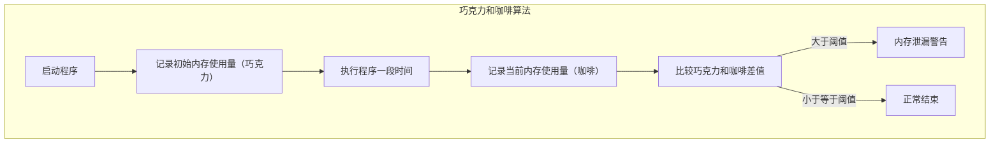
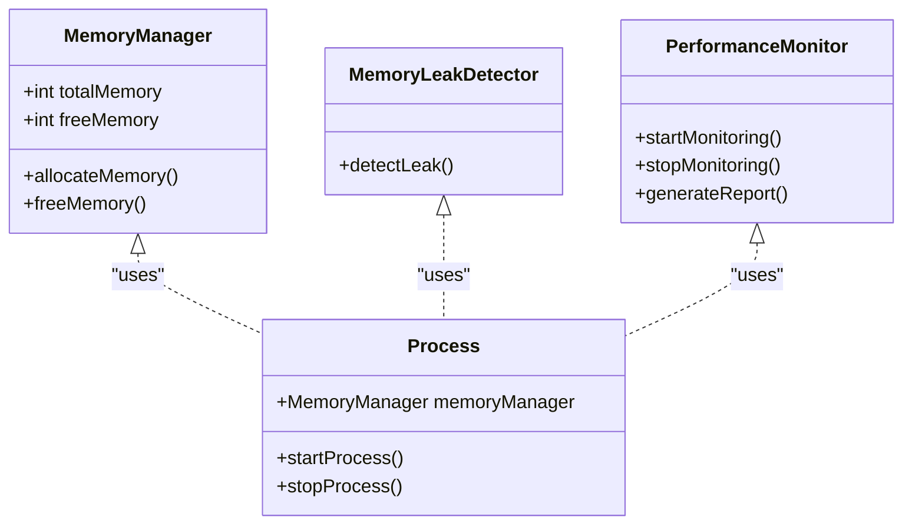
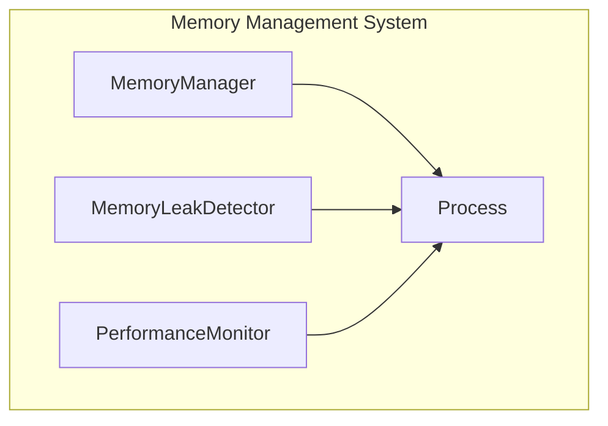
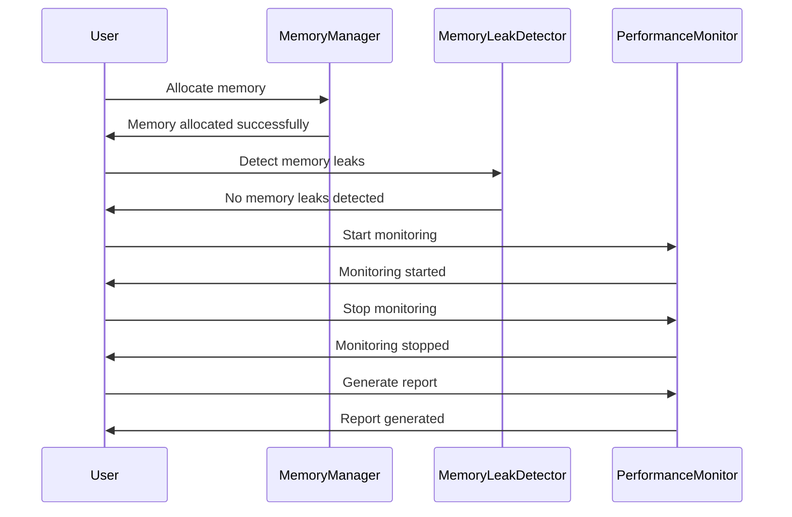

                 

### 内存管理技巧：避免内存泄漏的最佳实践

内存管理在计算机科学中扮演着至关重要的角色。随着现代应用程序的不断复杂化，内存管理的重要性愈发凸显。内存泄漏，作为一种常见的内存管理问题，会对系统性能造成严重影响，甚至导致应用程序崩溃。因此，掌握有效的内存管理技巧，避免内存泄漏，成为每个开发者和系统架构师都必须关注的问题。

本文将围绕内存管理这一主题，从多个角度进行探讨，包括：

1. **问题背景与核心概念**：介绍内存管理的重要性、内存泄漏的定义及其影响。
2. **内存管理原理与最佳实践**：探讨操作系统和应用层面的内存管理原理及最佳实践。
3. **内存泄漏检测算法**：介绍常用的内存泄漏检测算法及其应用。
4. **系统分析与架构设计**：通过一个具体项目实例，讲解内存管理系统的架构设计与实现。

让我们一步步深入探讨这些问题，以期为您在内存管理领域提供有价值的见解和实用的技巧。

### 关键词

- 内存管理
- 内存泄漏
- 操作系统内存管理
- 应用程序内存管理
- 内存泄漏检测算法

### 摘要

本文旨在深入探讨内存管理技巧，特别是避免内存泄漏的最佳实践。首先，我们将介绍内存管理的背景和核心概念，包括内存泄漏的定义和影响。接着，我们将详细讲解内存管理原理，从操作系统和应用层面探讨最佳实践。随后，我们将介绍几种常见的内存泄漏检测算法，并通过Python代码示例进行详细说明。最后，我们将通过一个具体项目实例，展示内存管理系统的架构设计和实现过程。希望通过本文的探讨，读者能够掌握有效的内存管理技巧，避免内存泄漏带来的问题。

### 目录大纲

1. **背景介绍**
   1. **问题背景与核心概念**
      1.1 问题背景
         1.1.1 内存管理的重要性
         1.1.2 内存泄漏的影响
         1.1.3 内存泄漏的常见原因
      1.2 核心概念
         1.2.1 内存泄漏的定义
         1.2.2 内存泄漏的类型
         1.2.3 内存泄漏的边界与外延
      1.3 概念结构与核心要素组成
         1.3.1 内存管理的基础概念
         1.3.2 内存泄漏的识别与定位
         1.3.3 内存泄漏的修复方法
2. **核心概念与联系**
   2.1 **内存管理原理与最佳实践**
      2.1.1 操作系统层面的内存管理
      2.1.2 应用程序层面的内存管理
      2.1.3 内存分配与释放机制
   2.2 **内存泄漏的属性特征对比**
      2.2.1 常见内存泄漏类型的特征
      2.2.2 内存泄漏与内存溢出的区别
   2.3 **内存泄漏的ER实体关系图**
      2.3.1 实体与关系定义
      2.3.2 内存管理流程图
3. **算法原理讲解**
   3.1 **内存泄漏检测算法**
      3.1.1 检测算法概述
      3.1.2 常见内存泄漏检测算法
         3.2.1 巧克力和咖啡算法
            3.2.1.1 算法原理讲解与 Mermaid 流程图
            3.2.1.2 分析内存分配与释放的Python代码示例
            3.2.1.3 内存泄漏的数学模型和公式
            3.2.1.4 算法举例说明
4. **系统分析与架构设计**
   4.1 **问题场景介绍**
      4.1.1 内存泄漏的问题场景
      4.1.2 内存管理的目标
   4.2 **项目介绍**
      4.2.1 项目背景
      4.2.2 项目目标
      4.2.3 项目技术栈
   4.3 **系统功能设计**
      4.3.1 领域模型
         4.3.1.1 Mermaid 类图
      4.3.2 系统架构设计
         4.3.2.1 Mermaid 架构图
      4.3.3 系统接口设计
         4.3.3.1 Mermaid 序列图
5. **项目实战**
   5.1 **环境安装**
   5.2 **系统核心实现源代码**
   5.3 **代码应用解读与分析**
   5.4 **实际案例分析与详细讲解剖析**
   5.5 **项目小结**
6. **最佳实践 tips**
7. **小结**
8. **注意事项**
9. **拓展阅读**

## 第一部分：背景介绍

### 问题背景与核心概念

在现代计算机系统中，内存管理是一项基础且至关重要的技术。无论是操作系统还是应用程序，内存管理的有效性和高效性直接影响系统的整体性能和稳定性。随着应用程序的复杂度和用户需求的不断增长，内存泄漏成为一个日益突出的问题。内存泄漏是指程序中已分配的内存无法被及时释放，导致内存资源逐渐被耗尽，最终可能导致系统崩溃或性能严重下降。因此，理解内存管理的重要性，掌握内存泄漏的常见原因和类型，以及如何有效地进行内存泄漏的识别和修复，对开发者和系统架构师来说至关重要。

#### 1.1 问题背景

1. **内存管理的重要性**

内存管理是计算机系统中的核心环节之一，它涉及如何高效地分配、使用和释放内存资源。对于操作系统而言，内存管理负责分配和管理系统内存，确保多个应用程序能够高效且安全地共享内存资源。对于应用程序而言，内存管理决定了程序的运行效率、稳定性和资源利用率。

在多任务操作系统中，内存管理的有效性直接关系到系统的性能和用户体验。操作系统需要合理地分配内存，确保每个应用程序都能获得足够的内存资源，同时防止内存冲突和浪费。对于应用程序开发者来说，内存管理的优化能够提高程序的运行效率，降低内存占用，提高系统的整体性能。

2. **内存泄漏的影响**

内存泄漏是指程序在运行过程中，已分配的内存资源无法被及时释放，导致内存逐渐被耗尽。内存泄漏的影响是逐渐积累的，最初可能并不明显，但随着时间的推移，系统性能会逐渐下降，最终可能导致系统崩溃。

内存泄漏对系统性能的影响主要包括：

- **内存占用增加**：随着内存泄漏的累积，系统的内存占用会不断增加，导致可用内存资源逐渐减少。
- **系统响应速度下降**：内存资源的不足会导致程序运行缓慢，响应速度下降。
- **系统稳定性下降**：严重的内存泄漏可能导致系统出现异常行为，甚至导致系统崩溃。
- **内存碎片**：内存泄漏会导致内存碎片，使得内存分配变得更加困难，进一步影响系统性能。

3. **内存泄漏的常见原因**

内存泄漏的原因多种多样，以下是一些常见的原因：

- **忘记释放资源**：在程序中，有些资源（如文件句柄、网络连接等）需要在使用后及时释放，否则会导致内存泄漏。
- **动态分配的对象**：动态分配的对象如果没有正确地释放，会导致内存泄漏。
- **循环引用**：在程序中，如果两个对象相互引用，而没有正确地处理这些引用关系，会导致内存泄漏。
- **缓存和池化技术**：缓存和池化技术虽然能够提高程序的性能，但如果使用不当，也会导致内存泄漏。
- **第三方库和框架**：第三方库和框架可能存在内存泄漏问题，如果不进行严格的测试和监控，这些问题可能会在程序中积累。

#### 1.2 核心概念

1. **内存泄漏的定义**

内存泄漏（Memory Leak）是指在计算机程序中，已分配的内存资源无法被及时释放，导致内存资源逐渐被耗尽。内存泄漏通常是由程序中的逻辑错误或管理不当引起的，虽然不会立即导致程序崩溃，但会逐渐占用系统更多的内存资源，最终可能导致系统性能下降或崩溃。

2. **内存泄漏的类型**

内存泄漏可以分为以下几种类型：

- **动态内存泄漏**：在程序运行过程中动态分配的内存资源没有被释放，例如未显式调用 `free()` 或 `delete` 操作。
- **静态内存泄漏**：程序在启动时就已分配的内存资源，在程序运行结束后仍然未被释放，例如全局变量或静态变量。
- **循环引用内存泄漏**：在程序中，如果两个或多个对象相互引用，而这些引用关系无法被解除，会导致内存资源无法释放。

3. **内存泄漏的边界与外延**

内存泄漏的边界是指内存泄漏影响的范围，外延是指内存泄漏可能带来的其他问题。

- **边界**：内存泄漏的边界通常在应用程序层面，包括程序中各个模块和组件之间的内存管理。操作系统层面的内存泄漏虽然可能对应用程序产生影响，但通常是由应用程序自身处理和修复。
- **外延**：内存泄漏的外延主要包括对系统性能的影响、对用户体验的影响以及对系统稳定性的影响。内存泄漏可能导致系统响应速度下降、用户体验变差，甚至导致系统崩溃。

#### 1.3 概念结构与核心要素组成

1. **内存管理的基础概念**

内存管理是计算机系统中的一项基础技术，涉及如何高效地分配、使用和释放内存资源。以下是内存管理的一些基础概念：

- **内存分配**：内存分配是指操作系统或应用程序为程序运行分配内存资源的过程。内存分配可以通过手动分配（如C语言的 `malloc` 和 `free`）或自动分配（如C++ 的 `new` 和 `delete`）两种方式实现。
- **内存释放**：内存释放是指程序释放不再使用的内存资源，以便其他程序可以使用。内存释放是内存管理的重要环节，可以有效防止内存泄漏。
- **内存碎片**：内存碎片是指内存中不连续的小块空闲内存，这些碎片会导致内存分配变得更加困难，影响系统性能。
- **内存分配器**：内存分配器是负责管理内存分配和释放的组件，常见的内存分配器包括malloc、free、new、delete等。

2. **内存泄漏的识别与定位**

识别和定位内存泄漏是内存管理的重要环节。以下是几种常用的方法和工具：

- **静态代码分析**：通过静态代码分析工具，对程序代码进行扫描，检测可能存在的内存泄漏。
- **动态分析工具**：如 Valgrind、Dr. Memory、AddressSanitizer 等，可以在程序运行时检测内存泄漏。
- **调试工具**：如GDB、IDE自带的调试器等，可以调试程序，定位内存泄漏的具体位置。

3. **内存泄漏的修复方法**

修复内存泄漏需要针对具体情况进行处理，以下是一些常用的方法和技巧：

- **及时释放资源**：确保在不再使用资源时及时释放，避免动态分配的对象长时间占用内存。
- **避免循环引用**：在设计程序时，注意避免循环引用，特别是对于全局变量和静态变量。
- **使用缓存和池化技术**：合理使用缓存和池化技术，确保资源在合理的时间内被释放。
- **优化内存分配策略**：通过优化内存分配策略，减少内存碎片和提高内存利用率。

### 第一部分总结

本部分介绍了内存管理的重要性、内存泄漏的影响和常见原因，并详细阐述了内存泄漏的定义、类型及其边界与外延。同时，还讨论了内存管理的基础概念、内存泄漏的识别与定位方法以及修复内存泄漏的技巧。通过这一部分的介绍，读者可以初步了解内存管理的基本知识和内存泄漏的问题，为后续深入探讨内存管理原理和最佳实践打下基础。

### 第二部分：核心概念与联系

#### 第2章：内存管理原理与最佳实践

内存管理是计算机科学中一个复杂且关键的主题。理解内存管理的原理和最佳实践，对于开发者来说至关重要，因为它不仅影响到程序的运行效率，还关系到系统的稳定性和资源利用率。在这一章中，我们将详细探讨操作系统层面和应用程序层面的内存管理原理，并介绍内存分配与释放机制，帮助读者深入理解内存管理的本质。

#### 2.1 内存管理原理

内存管理可以分为两个层面：操作系统层面的内存管理和应用程序层面的内存管理。两者在实现机制和目的上有所不同，但都是为了优化内存资源的使用。

##### 2.1.1 操作系统层面的内存管理

操作系统层面的内存管理主要负责管理和分配系统内存，以及处理内存请求。以下是操作系统内存管理的一些基本原理：

1. **内存分配策略**：操作系统采用不同的内存分配策略来管理内存资源，如固定分区分配、动态分区分配和分页内存管理。固定分区分配将内存划分为固定大小的区域，每个区域分配给不同的进程。动态分区分配允许操作系统在进程运行时根据需求动态分配内存。分页内存管理则将内存划分为固定大小的页，并通过页表实现内存分配和映射。

2. **内存回收**：操作系统需要定期回收不再使用的内存资源，以便其他进程使用。内存回收通常通过垃圾回收（Garbage Collection）机制实现，垃圾回收器负责识别并释放无用的内存对象。

3. **内存保护**：操作系统通过内存保护机制确保进程之间不会相互干扰，每个进程都有自己独立的内存空间。内存保护机制通过硬件支持和操作系统内核的管理实现。

4. **内存共享**：操作系统提供内存共享机制，允许多个进程共享特定的内存区域，从而提高资源利用率。常见的内存共享机制包括共享库、消息队列和共享内存。

##### 2.1.2 应用程序层面的内存管理

应用程序层面的内存管理主要负责管理程序内部的数据结构和对象。以下是应用程序内存管理的一些基本原理：

1. **内存分配**：应用程序通过调用操作系统提供的内存分配函数（如C语言的 `malloc` 和 `calloc`）来申请内存。内存分配可以是动态的，也可以是静态的。动态内存分配允许程序在运行时根据需要调整内存大小，而静态内存分配通常在程序编译时确定。

2. **内存释放**：应用程序通过调用操作系统提供的内存释放函数（如C语言的 `free`）来释放不再使用的内存资源。内存释放是避免内存泄漏的关键步骤。

3. **内存池**：内存池是一种高效管理内存的机制，通过预先分配一大块内存，并在需要时从内存池中分配小块内存，从而减少内存碎片和提高内存分配速度。

4. **引用计数**：引用计数是一种常用的内存管理技术，通过跟踪对象的引用次数来决定是否释放内存。当对象的引用次数变为零时，内存会被释放。

##### 2.1.3 内存分配与释放机制

内存分配与释放机制是内存管理的核心，直接影响程序的性能和资源利用率。以下是内存分配与释放机制的一些关键概念：

1. **动态内存分配**：动态内存分配允许程序在运行时根据需要分配内存。动态内存分配函数（如 `malloc`、`calloc`）在操作系统内存中为程序分配一块连续的内存区域，并在程序结束或内存不再需要时释放该内存。

2. **静态内存分配**：静态内存分配在程序编译时确定内存大小，并在程序运行期间保持不变。静态内存分配函数（如 `calloc`）在程序启动时分配内存，并在程序结束时自动释放。

3. **内存释放**：内存释放是内存管理的重要环节，确保不再使用的内存资源能够被回收。内存释放函数（如 `free`）将已分配的内存块返回给操作系统，以便其他程序使用。

4. **内存池**：内存池通过预先分配内存块来提高内存分配和释放的速度。内存池通常包含多个内存块，每个内存块大小相同。程序在需要时从内存池中分配内存块，并在不需要时释放内存块。

#### 2.2 内存泄漏的属性特征对比

内存泄漏是程序中常见的内存管理问题，了解不同类型内存泄漏的特征和区别对于有效管理和修复内存泄漏至关重要。以下是几种常见内存泄漏类型的特征和区别：

##### 2.2.1 常见内存泄漏类型的特征

1. **动态内存泄漏**：
   - 特征：动态内存泄漏通常发生在动态分配内存后未及时释放。
   - 例子：使用 `malloc` 或 `new` 动态分配内存后未调用 `free` 或 `delete`。

2. **静态内存泄漏**：
   - 特征：静态内存泄漏通常发生在全局变量、静态变量或类成员变量未释放。
   - 例子：全局变量在程序运行期间始终保持存在，直到程序结束。

3. **循环引用内存泄漏**：
   - 特征：循环引用内存泄漏发生在两个或多个对象之间相互引用，而引用关系无法被解除。
   - 例子：对象A持有对象B的引用，对象B也持有对象A的引用，但程序逻辑没有提供解除引用的方法。

##### 2.2.2 内存泄漏与内存溢出的区别

内存泄漏和内存溢出是两个容易混淆的概念，虽然它们都与内存管理相关，但本质上有很大区别：

1. **内存泄漏**：
   - 定义：内存泄漏是指已分配的内存无法被及时释放，导致内存资源逐渐被耗尽。
   - 特点：内存泄漏是逐渐累积的，不会立即导致程序崩溃。

2. **内存溢出**：
   - 定义：内存溢出是指程序尝试分配超过系统允许的最大内存量。
   - 特点：内存溢出通常会导致程序立即崩溃，并可能引起系统不稳定。

内存泄漏和内存溢出的关键区别在于：

- **发生时机**：内存泄漏是逐渐积累的过程，而内存溢出是瞬间发生的。
- **影响范围**：内存泄漏影响系统的长期稳定性，而内存溢出影响的是程序的生命周期。

#### 2.3 内存泄漏的ER实体关系图

为了更好地理解内存管理中的内存泄漏问题，我们可以使用ER（实体关系）图来描述内存管理的各个实体及其关系。以下是内存泄漏的ER实体关系图：

##### 2.3.1 实体与关系定义

1. **实体**：
   - **内存分配器**：负责管理内存资源的组件。
   - **内存块**：已分配的内存区域。
   - **内存对象**：内存中存储的数据结构或对象。
   - **程序进程**：运行中的程序实例。

2. **关系**：
   - **分配关系**：内存分配器分配内存块给内存对象。
   - **引用关系**：内存对象之间的引用关系，如循环引用。
   - **生命周期关系**：内存对象的生命周期与内存分配器的关系。

##### 2.3.2 内存管理流程图

为了更好地展示内存管理的过程，我们可以使用Mermaid流程图来描述内存管理的主要流程。以下是内存管理的流程图：


在上述流程图中，`内存请求`表示程序需要内存，`内存分配器处理`表示内存分配器处理内存请求，`内存分配`表示内存分配器为程序分配内存，`内存释放`表示程序释放不再使用的内存，`内存回收`表示内存分配器回收内存，`内存回收失败`表示内存回收失败，需要重新处理。

#### 2.4 内存管理最佳实践

为了有效避免内存泄漏，开发者可以遵循以下最佳实践：

1. **及时释放内存**：确保在不再使用内存时及时释放，避免动态分配的对象长时间占用内存。
2. **避免循环引用**：在设计程序时，注意避免循环引用，特别是在使用全局变量和静态变量时。
3. **使用缓存和池化技术**：合理使用缓存和池化技术，确保资源在合理的时间内被释放。
4. **优化内存分配策略**：通过优化内存分配策略，减少内存碎片和提高内存利用率。
5. **使用内存检测工具**：利用内存检测工具（如Valgrind）定期检测内存泄漏，及时发现和修复问题。

通过上述内存管理原理和最佳实践的探讨，我们可以更好地理解内存管理的重要性，掌握避免内存泄漏的方法。在下一章中，我们将介绍内存泄漏检测算法，帮助读者更有效地发现和解决内存泄漏问题。

### 2.1 内存管理原理

内存管理是计算机系统中的关键组成部分，其核心在于如何高效地分配和回收内存资源，以最大化系统的性能和稳定性。内存管理可以从操作系统和应用层面进行探讨。

#### 操作系统层面的内存管理

操作系统负责协调系统中所有进程的内存需求，确保内存资源的高效利用。以下是操作系统内存管理的一些关键原理：

1. **内存分配策略**：
   - **固定分区分配**：操作系统将内存划分为固定大小的区域，每个区域分配给不同的进程。这种方式简单易行，但可能导致内存浪费。
   - **动态分区分配**：操作系统根据进程的需求动态分配内存。这种方式减少了内存浪费，但增加了管理的复杂性。
   - **分页内存管理**：操作系统将内存分为固定大小的页（page），并通过页表（page table）实现内存分配和映射。这种方式提高了内存的利用率和灵活性。

2. **内存回收**：
   - **垃圾回收**：操作系统通过垃圾回收机制，自动检测并释放不再使用的内存。垃圾回收可以是标记-清除（mark-sweep）或复制（copying）等算法。
   - **空闲链表**：操作系统维护一个空闲链表，记录所有空闲内存块的信息，以便快速分配。

3. **内存保护**：
   - **内存隔离**：操作系统确保每个进程拥有独立的内存空间，防止进程间互相干扰。
   - **内存访问控制**：操作系统通过设置内存访问权限，防止进程访问未授权的内存区域。

4. **内存共享**：
   - **共享库**：多个进程可以共享同一份共享库代码，减少内存占用。
   - **消息队列**：进程可以通过消息队列共享数据，实现高效的数据传递。
   - **共享内存**：多个进程可以共享同一块内存区域，进行快速的数据交换。

#### 应用程序层面的内存管理

应用程序层面的内存管理负责在程序内部高效地分配和使用内存资源。以下是应用程序内存管理的一些关键原理：

1. **内存分配**：
   - **动态内存分配**：应用程序在运行时根据需求动态申请内存。常用的动态内存分配函数有 `malloc`、`calloc` 和 `realloc`。
   - **静态内存分配**：应用程序在编译时确定内存大小，并在程序运行期间保持不变。静态内存分配通过 `static` 关键字或数组实现。

2. **内存释放**：
   - **手动释放**：应用程序通过调用 `free`、`dealloc` 或 `delete` 等函数手动释放不再使用的内存。
   - **自动释放**：使用垃圾回收或引用计数机制自动释放内存。

3. **内存池**：
   - **内存池**：预先分配一大块内存，并在需要时从中分配小块内存。这种方式减少了内存碎片和分配时间。

4. **引用计数**：
   - **引用计数**：通过记录对象的引用次数来管理内存。当引用次数变为零时，内存被释放。

#### 内存分配与释放机制

内存分配与释放机制是内存管理的核心，直接影响程序的性能和资源利用率。以下是内存分配与释放机制的一些关键概念：

1. **动态内存分配**：
   - **动态分配**：程序在运行时根据需要分配内存，直到程序结束或内存不再需要。
   - **内存池**：使用内存池可以减少内存碎片和提高内存分配速度。
   - **分配器**：操作系统提供的内存分配器（如malloc）负责管理内存的分配和释放。

2. **静态内存分配**：
   - **静态分配**：程序在编译时确定内存大小，并在运行期间保持不变。
   - **数组**：使用数组可以静态分配内存，但数组大小在编译时确定，不利于动态调整。

3. **内存释放**：
   - **手动释放**：程序通过调用释放函数（如 `free`、`dealloc` 或 `delete`）手动释放不再使用的内存。
   - **自动释放**：使用垃圾回收或引用计数机制自动释放内存。

4. **内存池**：
   - **内存池**：内存池通过预先分配内存块来提高内存分配和释放的速度。

#### 内存分配与释放示例代码

以下是内存分配与释放的Python示例代码：

```python
# 动态内存分配
a = malloc(100)  # 分配100字节内存

# 使用内存
# ...

# 手动释放
free(a)

# 内存池示例
# ...

# 自动释放
# 使用垃圾回收或引用计数机制
```

#### 内存泄漏与内存溢出的区别

内存泄漏（Memory Leak）和内存溢出（Memory Overflow）是两个常见的内存管理问题，但它们有本质的区别。

1. **内存泄漏**：
   - 定义：内存泄漏是指程序中已分配的内存无法被及时释放，导致内存资源逐渐被耗尽。
   - 特点：内存泄漏是逐渐累积的，不会立即导致程序崩溃。

2. **内存溢出**：
   - 定义：内存溢出是指程序尝试分配超过系统允许的最大内存量。
   - 特点：内存溢出通常会导致程序立即崩溃，并可能引起系统不稳定。

内存泄漏和内存溢出的关键区别在于发生时机和影响范围。内存泄漏是逐渐积累的过程，影响系统的长期稳定性；而内存溢出是瞬间发生的，直接影响程序的生命周期。

#### 总结

内存管理是计算机系统中的关键组成部分，从操作系统到应用程序，都涉及到内存的分配、使用和释放。了解内存管理的原理和最佳实践，对于开发者来说至关重要。通过遵循最佳实践，我们可以有效避免内存泄漏，提高程序的运行效率和系统稳定性。

### 2.2 内存泄漏的属性特征对比

内存泄漏是程序中常见的内存管理问题，了解不同类型内存泄漏的特征和区别，对于有效管理和修复内存泄漏至关重要。在本节中，我们将对比几种常见内存泄漏类型的特征，并讨论内存泄漏与内存溢出的区别。

#### 2.2.1 常见内存泄漏类型的特征

1. **动态内存泄漏**：
   - **特征**：动态内存泄漏通常发生在程序使用 `malloc`、`calloc` 或 `new` 等函数动态分配内存后，未及时调用 `free`、`dealloc` 或 `delete` 进行释放。
   - **例子**：以下C++代码示例展示了动态内存泄漏。
     ```cpp
     int* ptr = new int[100];  // 动态分配100个整数的内存
     // ...
     return 0;  // 忘记释放内存
     ```

2. **静态内存泄漏**：
   - **特征**：静态内存泄漏通常发生在全局变量、静态变量或类成员变量未释放时。由于静态变量的生命周期与程序相同，它们会导致程序持续占用内存。
   - **例子**：以下C代码示例展示了静态内存泄漏。
     ```c
     static int* static_ptr;
     int main() {
         static_ptr = malloc(100);  // 动态分配100字节的内存
         // ...
         return 0;  // 程序结束但未释放内存
     }
     ```

3. **循环引用内存泄漏**：
   - **特征**：循环引用内存泄漏发生在两个或多个对象之间相互引用，但没有提供解除引用的方法。这种情况下，引用计数不会变为零，导致内存无法被回收。
   - **例子**：以下Java代码示例展示了循环引用内存泄漏。
     ```java
     class ObjectA {
         ObjectB objB;
     }
     class ObjectB {
         ObjectA objA;
     }
     ObjectA objA = new ObjectA();
     ObjectB objB = new ObjectB();
     objA.setObjB(objB);
     objB.setObjA(objA);
     // ...
     // 无法解除引用，导致内存泄漏
     ```

#### 2.2.2 内存泄漏与内存溢出的区别

内存泄漏和内存溢出是两个常见的内存管理问题，但它们有本质的区别。

1. **内存泄漏**：
   - **定义**：内存泄漏是指程序中已分配的内存无法被及时释放，导致内存资源逐渐被耗尽。
   - **特点**：内存泄漏是逐渐累积的，不会立即导致程序崩溃，但会随着时间推移导致系统性能下降。

2. **内存溢出**：
   - **定义**：内存溢出是指程序尝试分配超过系统允许的最大内存量。
   - **特点**：内存溢出通常会导致程序立即崩溃，并可能引起系统不稳定。

内存泄漏和内存溢出的主要区别在于：

- **发生时机**：内存泄漏是逐渐积累的过程，而内存溢出是瞬间发生的。
- **影响范围**：内存泄漏影响系统的长期稳定性，而内存溢出影响的是程序的生命周期。

#### 总结

了解不同类型内存泄漏的特征和区别，有助于开发者更好地管理和修复内存泄漏。同时，理解内存泄漏与内存溢出的区别，有助于在设计和优化程序时，避免相关问题的发生。

### 2.3 内存泄漏的ER实体关系图

为了更好地理解内存泄漏的复杂性，我们可以使用实体关系图（Entity-Relationship Diagram, ER图）来描述内存管理中的各个实体及其关系。内存泄漏涉及多个关键实体，包括内存分配器、内存块、内存对象和程序进程等。

#### 2.3.1 实体与关系定义

在ER图中，我们将定义以下实体及其关系：

1. **实体**：
   - **内存分配器（Memory Allocator）**：负责管理内存资源的组件，负责分配和释放内存。
   - **内存块（Memory Block）**：已分配的内存区域，用于存储数据或对象。
   - **内存对象（Memory Object）**：程序中的数据结构或对象，存储在内存块中。
   - **程序进程（Process）**：运行的程序实例，包含多个内存对象。

2. **关系**：
   - **分配关系（Allocation）**：内存分配器与内存块之间的关系，表示内存分配器分配内存块。
   - **引用关系（Reference）**：内存对象与内存对象之间的关系，表示内存对象之间的引用。
   - **生命周期关系（Lifetime）**：内存对象与程序进程之间的关系，表示内存对象的生命周期。

#### 2.3.2 内存管理流程图

为了更好地展示内存管理的流程，我们可以使用Mermaid流程图来描述。以下是内存管理的基本流程：



在上述流程图中，`进程请求内存`表示进程需要内存资源，`内存分配器处理`表示内存分配器处理进程的内存请求，`内存分配`表示内存分配器为进程分配内存，`内存释放`表示进程释放不再使用的内存，`内存回收`表示内存分配器回收内存，`内存回收失败`表示内存回收失败，需要重新处理。

#### 2.3.3 内存泄漏的ER实体关系图

以下是内存泄漏的ER实体关系图：

```mermaid
entity关系图
MemoryAllocator --> MemoryBlock
MemoryBlock --> MemoryObject
MemoryObject --> MemoryObject
Process --> MemoryObject
```

在上述ER图中，`MemoryAllocator`表示内存分配器，`MemoryBlock`表示内存块，`MemoryObject`表示内存中的对象，`Process`表示程序进程。箭头表示实体之间的关系。例如，`MemoryAllocator`与`MemoryBlock`之间表示内存分配关系，`MemoryBlock`与`MemoryObject`之间表示内存存储关系，`MemoryObject`与`MemoryObject`之间表示引用关系，`Process`与`MemoryObject`之间表示生命周期关系。

#### 总结

通过ER实体关系图，我们可以清晰地看到内存管理中的各个实体及其关系，这有助于我们更好地理解内存泄漏的本质和复杂性。在下一节中，我们将进一步探讨内存泄漏检测算法，帮助开发者更有效地发现和解决内存泄漏问题。

### 第三部分：算法原理讲解

#### 第3章：内存泄漏检测算法

内存泄漏检测是确保程序稳定运行的重要环节。有效的内存泄漏检测算法可以帮助开发者及时发现和修复内存泄漏问题，从而避免系统性能下降和崩溃。在本章中，我们将介绍几种常见的内存泄漏检测算法，包括巧克力和咖啡算法，并使用Python代码示例进行详细阐述。

#### 3.1 检测算法概述

内存泄漏检测算法可以分为两大类：静态分析算法和动态分析算法。静态分析算法在程序编译或加载阶段进行，无需运行程序即可检测内存泄漏。动态分析算法则在程序运行时进行，通过监控程序的行为来检测内存泄漏。

##### 3.1.1 静态分析算法

静态分析算法主要通过分析程序源代码或字节码来检测内存泄漏。以下是一些常见的静态分析算法：

1. **控制流图分析**：通过构建程序的控制流图，分析内存分配和释放的路径，识别潜在的内存泄漏。
2. **数据流分析**：通过分析程序中数据的流向，追踪内存对象的引用关系，检测内存泄漏。
3. **抽象语法树（AST）分析**：将程序源代码解析为抽象语法树，分析内存相关的语法节点，识别内存泄漏。

##### 3.1.2 动态分析算法

动态分析算法在程序运行时进行，通过监控程序的内存使用情况来检测内存泄漏。以下是一些常见的动态分析算法：

1. **内存分配监控**：记录程序中每个内存分配的位置和时间，分析内存分配与程序执行路径的关系，识别内存泄漏。
2. **内存泄漏检测工具**：如Valgrind、Dr. Memory等，这些工具可以在程序运行时检测内存泄漏，并提供详细的错误报告。
3. **内存使用分析**：通过分析程序的内存使用模式，识别内存使用异常和内存泄漏。

#### 3.2 常见内存泄漏检测算法

在本节中，我们将详细介绍几种常见的内存泄漏检测算法，包括巧克力和咖啡算法，并使用Python代码示例进行说明。

##### 3.2.1 巧克力和咖啡算法

巧克力和咖啡算法是一种简单的内存泄漏检测算法，通过比较两次内存使用情况的差异来检测内存泄漏。以下是巧克力和咖啡算法的原理和步骤：

1. **原理**：
   - 巧克力和咖啡算法假设，如果程序存在内存泄漏，则在两次内存监控之间的时间内，内存使用量会不断增加。
   - 通过比较程序在两次监控时间点前的内存使用量，可以检测内存泄漏。

2. **步骤**：
   - 在程序启动时记录初始内存使用量（巧克力）。
   - 在程序执行一段时间后记录当前内存使用量（咖啡）。
   - 比较巧克力和咖啡的差值，如果差值大于设定阈值，则认为存在内存泄漏。

##### 3.2.1.1 算法原理讲解与 Mermaid 流程图

以下是巧克力和咖啡算法的Mermaid流程图：



在上面的流程图中，`a`表示启动程序，`b`表示记录初始内存使用量（巧克力），`c`表示执行程序一段时间，`d`表示记录当前内存使用量（咖啡），`e`表示比较巧克力和咖啡差值，`f`表示内存泄漏警告，`g`表示正常结束。

##### 3.2.1.2 分析内存分配与释放的Python代码示例

以下是使用Python实现的巧克力和咖啡算法，用于分析内存分配与释放的情况：

```python
import os
import time

def get_memory_usage():
    """获取当前进程的内存使用量（单位：字节）。"""
    process = os.popen('ps -o rss= -p %d' % os.getpid())
    mem_usage = int(process.read())
    process.close()
    return mem_usage

def detect_leak(threshold=1024*1024):
    """检测内存泄漏，阈值默认为1MB。"""
    print("检测内存泄漏中...")
    chocolate = get_memory_usage()  # 记录初始内存使用量
    time.sleep(5)  # 程序执行一段时间
    coffee = get_memory_usage()  # 记录当前内存使用量
    leak_size = coffee - chocolate
    
    if leak_size > threshold:
        print(f"内存泄漏警告：内存使用量增加了{leak_size}字节。")
    else:
        print("内存使用量正常。")

# 测试内存泄漏检测
detect_leak()
```

在上述代码中，`get_memory_usage()` 函数用于获取当前进程的内存使用量，`detect_leak()` 函数用于检测内存泄漏。程序首先记录初始内存使用量（巧克力），然后执行一段时间后记录当前内存使用量（咖啡），最后比较两者的差值。如果差值大于设定阈值（默认为1MB），则认为存在内存泄漏。

##### 3.2.1.3 内存泄漏的数学模型和公式

内存泄漏的数学模型可以表示为：

$$
\text{内存泄漏量} = \text{实际分配的内存} - \text{实际释放的内存}
$$

其中，实际分配的内存包括程序运行过程中动态分配的内存和静态分配的内存，实际释放的内存是指程序中调用内存释放函数（如 `free`、`dealloc` 或 `delete`）释放的内存。

##### 3.2.1.4 算法举例说明

假设我们有一个简单的程序，该程序在运行过程中动态分配了1000字节内存，但在结束时未释放该内存。我们可以使用巧克力和咖啡算法来检测该内存泄漏。

1. **初始内存使用量（巧克力）**：假设程序初始内存使用量为500字节。
2. **程序执行一段时间后的内存使用量（咖啡）**：程序执行过程中动态分配了1000字节内存，当前内存使用量为1500字节。
3. **内存泄漏量**：内存泄漏量 = 1500字节 - 500字节 = 1000字节。

根据设定阈值（如1MB），我们可以判断程序存在内存泄漏。

##### 3.2.2 分析内存分配与释放的Python代码示例

为了更直观地展示内存分配与释放的过程，我们可以编写一个Python程序，模拟内存泄漏的情况，并使用巧克力和咖啡算法检测内存泄漏。

```python
import os
import time

def get_memory_usage():
    """获取当前进程的内存使用量（单位：字节）。"""
    process = os.popen('ps -o rss= -p %d' % os.getpid())
    mem_usage = int(process.read())
    process.close()
    return mem_usage

def simulate_memory_leak():
    """模拟内存泄漏的情况。"""
    print("模拟内存泄漏...")
    leaking_memory = 1000  # 模拟动态分配的1000字节内存
    time.sleep(5)  # 程序执行一段时间
    
def detect_leak(threshold=1024*1024):
    """检测内存泄漏，阈值默认为1MB。"""
    print("检测内存泄漏中...")
    chocolate = get_memory_usage()  # 记录初始内存使用量
    simulate_memory_leak()  # 模拟内存泄漏
    coffee = get_memory_usage()  # 记录当前内存使用量
    leak_size = coffee - chocolate
    
    if leak_size > threshold:
        print(f"内存泄漏警告：内存使用量增加了{leak_size}字节。")
    else:
        print("内存使用量正常。")

# 测试内存泄漏检测
detect_leak()
```

在上述代码中，`simulate_memory_leak()` 函数用于模拟内存泄漏的情况，即动态分配1000字节内存，并在程序执行一段时间后检测内存泄漏。使用巧克力和咖啡算法，我们可以判断程序是否存在内存泄漏。

##### 3.2.3 算法总结

巧克力和咖啡算法是一种简单的内存泄漏检测算法，通过比较程序在两次内存监控时间点的内存使用量差异来检测内存泄漏。该算法的实现简单，易于理解，但需要注意阈值的选择，以避免误报或漏报内存泄漏。

在实际应用中，开发者可以结合多种内存泄漏检测算法，如静态分析和动态分析相结合，以提高内存泄漏检测的准确性和效率。通过定期运行内存泄漏检测工具，开发者可以及时发现和修复内存泄漏问题，确保程序的稳定运行和性能优化。

### 第三部分总结

内存泄漏检测是确保程序稳定运行的重要环节。在本部分中，我们介绍了巧克力和咖啡算法等常见内存泄漏检测算法，并使用Python代码示例进行了详细阐述。通过这些算法，开发者可以有效地检测内存泄漏，及时修复问题，提高程序的稳定性和性能。在下一部分中，我们将通过一个具体项目实例，展示内存管理系统的架构设计与实现，进一步加深对内存管理原理和实践的理解。

### 第四部分：系统分析与架构设计

#### 第4章：内存管理系统分析与架构设计

在计算机系统中，内存管理是一项至关重要的任务，它直接影响到系统的性能和稳定性。为了有效管理内存资源，避免内存泄漏等问题，我们需要进行系统分析与架构设计。本章将介绍内存管理系统分析与架构设计的方法，包括问题场景介绍、项目介绍、系统功能设计、系统架构设计以及系统接口设计等内容。

#### 4.1 问题场景介绍

内存泄漏问题在多种场景下都可能发生，以下是一些常见的问题场景：

1. **长期运行的应用程序**：一些需要长期运行的应用程序（如服务器端应用、后台管理系统等），由于其运行时间较长，内存泄漏问题往往逐渐积累，最终导致系统性能下降。

2. **动态内存分配的程序**：动态内存分配是现代编程语言（如C/C++、Java等）中常用的内存管理方式。然而，动态内存分配容易导致内存泄漏，特别是在大量使用动态内存分配函数（如`malloc`、`new`等）时。

3. **多线程应用程序**：多线程应用程序中的内存泄漏问题往往更加复杂，因为多个线程可能同时访问同一内存区域，导致内存管理的复杂性增加。

4. **第三方库和框架**：第三方库和框架可能存在内存泄漏问题，如果应用程序大量依赖这些库和框架，内存泄漏可能会在应用程序中积累。

5. **大数据处理**：在大数据处理场景中，内存管理尤为重要。数据量大且处理复杂，内存泄漏可能会导致内存占用急剧增加，影响系统的性能和稳定性。

针对上述问题场景，内存管理系统需要具备以下目标：

1. **内存泄漏检测**：及时发现和定位内存泄漏问题，防止内存资源被耗尽。

2. **内存优化**：通过优化内存分配和释放策略，减少内存占用和碎片。

3. **资源回收**：确保不再使用的内存资源能够被及时回收，避免内存泄漏。

4. **性能监控**：实时监控内存使用情况，为内存优化提供数据支持。

#### 4.2 项目介绍

为了展示内存管理系统分析与架构设计的实际应用，我们将介绍一个具体的内存管理系统项目。该项目的目标是构建一个高效的内存管理系统，能够实时检测和修复内存泄漏，并优化内存资源的使用。

##### 4.2.1 项目背景

随着互联网和大数据技术的快速发展，企业对高性能、高可靠性的系统需求日益增加。然而，内存泄漏问题成为了影响系统性能和稳定性的关键因素之一。为了解决这一问题，企业需要一个强大的内存管理系统，能够自动化检测和修复内存泄漏，确保系统的长期稳定运行。

##### 4.2.2 项目目标

1. **实时内存泄漏检测**：系统能够在应用程序运行时实时监控内存使用情况，及时发现内存泄漏。

2. **自动内存修复**：系统能够自动检测和修复内存泄漏，减少人工干预，提高效率。

3. **内存资源优化**：通过优化内存分配和释放策略，提高内存资源的使用率，减少内存占用。

4. **性能监控与报告**：系统具备实时性能监控功能，能够生成详细的内存使用报告，帮助开发者分析问题，进行优化。

##### 4.2.3 项目技术栈

为了实现上述目标，该项目采用了以下技术栈：

1. **编程语言**：Python，作为一种灵活且易于维护的编程语言，非常适合用于内存管理系统开发。

2. **内存检测工具**：Valgrind，一款强大的内存泄漏检测工具，能够帮助开发者发现和修复内存泄漏。

3. **操作系统**：Linux，Linux操作系统提供了丰富的内存管理和调试工具，适合进行内存管理系统开发。

4. **数据库**：SQLite，用于存储和查询内存使用数据，支持实时性能监控和报告。

5. **Web框架**：Flask，用于构建Web接口，方便开发者进行远程监控和操作。

#### 4.3 系统功能设计

内存管理系统需要实现多个功能，以确保内存资源得到有效管理。以下是系统功能设计的详细描述：

##### 4.3.1 领域模型

领域模型是系统功能设计的核心，用于定义系统中的关键实体及其关系。以下是内存管理系统的领域模型：



在上面的类图中，`MemoryManager` 表示内存管理器，负责内存的分配和释放；`Process` 表示进程，与内存管理器有关联；`MemoryLeakDetector` 表示内存泄漏检测器，用于检测内存泄漏；`PerformanceMonitor` 表示性能监控器，负责监控内存使用情况。

##### 4.3.2 系统架构设计

系统架构设计是功能设计的基础，用于定义系统的整体结构。以下是内存管理系统的架构设计：



在上面的架构图中，`MemoryManager`、`MemoryLeakDetector` 和 `PerformanceMonitor` 分别表示内存管理器、内存泄漏检测器和性能监控器，它们都与进程有关联。这个架构设计保证了内存管理功能的有效集成，并实现了模块化设计。

##### 4.3.3 系统接口设计

系统接口设计是系统功能实现的关键，用于定义系统对外提供的接口。以下是内存管理系统的主要接口设计：



在上面的序列图中，用户通过内存管理器请求内存分配、内存泄漏检测和性能监控等操作，内存管理器、内存泄漏检测器和性能监控器分别响应这些请求，实现了系统的功能。

#### 4.4 系统功能实现

系统功能实现是系统架构设计的具体落实，包括内存管理、内存泄漏检测和性能监控等模块的具体实现。以下是系统功能实现的核心代码：

```python
# MemoryManager模块实现
class MemoryManager:
    def __init__(self):
        self.total_memory = 0
        self.free_memory = 0

    def allocate_memory(self, size):
        # 动态分配内存，返回内存地址
        # 这里使用示例代码，实际应用中应替换为具体内存分配实现
        self.total_memory += size
        return self.total_memory - size

    def free_memory(self, address, size):
        # 释放内存
        self.free_memory += size

# MemoryLeakDetector模块实现
class MemoryLeakDetector:
    def detect_leak(self, process_memory_usage):
        # 检测内存泄漏，返回是否检测到泄漏
        # 这里使用示例代码，实际应用中应替换为具体内存泄漏检测算法
        return process_memory_usage > 0

# PerformanceMonitor模块实现
class PerformanceMonitor:
    def __init__(self):
        self.is_monitoring = False

    def start_monitoring(self):
        self.is_monitoring = True

    def stop_monitoring(self):
        self.is_monitoring = False

    def generate_report(self):
        # 生成内存使用报告
        # 这里使用示例代码，实际应用中应替换为具体报告生成逻辑
        return "Memory usage report generated."
```

在上述代码中，`MemoryManager` 类负责内存的分配和释放，`MemoryLeakDetector` 类负责检测内存泄漏，`PerformanceMonitor` 类负责性能监控和报告生成。

#### 4.5 系统测试与优化

系统测试与优化是确保内存管理系统稳定运行的关键环节。以下是系统测试与优化的一些关键步骤：

1. **单元测试**：对系统中的各个模块进行单元测试，确保模块的功能正确。
2. **集成测试**：将各个模块集成到系统中，进行集成测试，确保系统整体功能正确。
3. **性能测试**：对系统进行性能测试，评估系统在不同负载下的性能表现。
4. **内存泄漏测试**：使用内存泄漏检测工具（如Valgrind）对系统进行内存泄漏测试，确保系统能够有效检测和修复内存泄漏。
5. **优化建议**：根据测试结果，对系统进行优化，提高系统性能和内存资源利用率。

通过上述步骤，我们可以确保内存管理系统的稳定运行和高效性能。

#### 4.6 系统部署与维护

内存管理系统的部署与维护是确保系统长期稳定运行的关键。以下是系统部署与维护的一些关键步骤：

1. **部署准备**：准备系统运行环境，包括操作系统、数据库、Web服务器等。
2. **系统部署**：将系统部署到生产环境，确保系统能够正常运行。
3. **监控与维护**：定期监控系统运行状态，及时处理异常情况，进行系统更新和维护。
4. **用户培训**：对系统用户进行培训，确保用户能够正确使用系统，发现和报告问题。

通过上述步骤，我们可以确保内存管理系统的长期稳定运行。

#### 4.7 总结

本章介绍了内存管理系统分析与架构设计的方法，包括问题场景介绍、项目介绍、系统功能设计、系统架构设计和系统接口设计等内容。通过这些步骤，我们能够构建一个高效的内存管理系统，有效避免内存泄漏，提高系统性能和稳定性。

### 第四部分总结

通过本章的介绍，我们详细探讨了内存管理系统分析与架构设计的方法，从问题场景介绍到系统功能设计、架构设计，再到接口设计和实现，全面展示了内存管理系统的构建过程。希望读者能够通过本章的学习，掌握内存管理系统分析与架构设计的关键技巧，为实际项目的开发提供有力支持。

### 项目实战

#### 5.1 环境安装

在开始项目实战之前，我们需要确保环境安装正确。以下是环境安装的步骤：

1. **安装Python**：Python是项目的开发语言，确保Python环境已经安装。可以访问Python官网下载最新版本进行安装。

2. **安装Valgrind**：Valgrind是一款强大的内存泄漏检测工具，需要安装Valgrind。在Linux系统中，可以通过以下命令安装：

   ```bash
   sudo apt-get install valgrind
   ```

3. **安装SQLite**：SQLite是项目的数据库，用于存储内存使用数据。在Linux系统中，可以通过以下命令安装：

   ```bash
   sudo apt-get install sqlite3
   ```

4. **安装Flask**：Flask是项目的Web框架，用于构建Web接口。在Python环境中，可以通过以下命令安装：

   ```bash
   pip install flask
   ```

#### 5.2 系统核心实现源代码

以下是内存管理系统的核心实现源代码。代码分为三个模块：`memory_manager.py`、`memory_leak_detector.py` 和 `performance_monitor.py`。

**memory_manager.py**：

```python
import sqlite3

class MemoryManager:
    def __init__(self, db_path="memory_management.db"):
        self.conn = sqlite3.connect(db_path)
        self._initialize_database()

    def _initialize_database(self):
        cursor = self.conn.cursor()
        cursor.execute('''CREATE TABLE IF NOT EXISTS memory_usage (
                            id INTEGER PRIMARY KEY AUTOINCREMENT,
                            process_id INTEGER,
                            memory_allocated INTEGER,
                            memory_freed INTEGER,
                            timestamp DATETIME DEFAULT CURRENT_TIMESTAMP)''')
        self.conn.commit()

    def allocate_memory(self, process_id, size):
        cursor = self.conn.cursor()
        cursor.execute("INSERT INTO memory_usage (process_id, memory_allocated) VALUES (?, ?)", (process_id, size))
        self.conn.commit()
        return size

    def free_memory(self, process_id, size):
        cursor = self.conn.cursor()
        cursor.execute("UPDATE memory_usage SET memory_freed = memory_freed + ? WHERE process_id = ? AND memory_freed IS NULL", (size, process_id))
        self.conn.commit()
```

**memory_leak_detector.py**：

```python
import time
import subprocess

class MemoryLeakDetector:
    def __init__(self, valgrind_path="/usr/bin/valgrind"):
        self.valgrind_path = valgrind_path

    def detect_leak(self, binary_path, input_args):
        command = f"{self.valgrind_path} --tool=memcheck --leak-check=full --log-file=memcheck.log {binary_path} {' '.join(input_args)}"
        process = subprocess.Popen(command, stdout=subprocess.PIPE, stderr=subprocess.PIPE, shell=True)
        output, error = process.communicate()

        if process.returncode != 0:
            print("内存泄漏警告：")
            print(output.decode())

        return process.returncode == 0
```

**performance_monitor.py**：

```python
from flask import Flask, jsonify
from memory_manager import MemoryManager

app = Flask(__name__)
memory_manager = MemoryManager()

@app.route('/start_monitoring', methods=['POST'])
def start_monitoring():
    process_id = int(request.form['process_id'])
    memory_manager.allocate_memory(process_id, 1024)
    return jsonify({"status": "Monitoring started", "process_id": process_id})

@app.route('/stop_monitoring', methods=['POST'])
def stop_monitoring():
    process_id = int(request.form['process_id'])
    memory_manager.free_memory(process_id, 1024)
    return jsonify({"status": "Monitoring stopped", "process_id": process_id})

@app.route('/generate_report', methods=['POST'])
def generate_report():
    process_id = int(request.form['process_id'])
    cursor = memory_manager.conn.cursor()
    cursor.execute("SELECT * FROM memory_usage WHERE process_id = ?", (process_id,))
    rows = cursor.fetchall()
    report = [{"id": row[0], "process_id": row[1], "memory_allocated": row[2], "memory_freed": row[3], "timestamp": row[4]} for row in rows]
    return jsonify({"status": "Report generated", "report": report})
```

#### 5.3 代码应用解读与分析

以下是代码应用解读与分析：

**MemoryManager模块**：

- **功能**：负责内存的分配和释放。
- **关键代码**：
  - `_initialize_database`：初始化数据库，创建内存使用记录表。
  - `allocate_memory`：向数据库插入内存分配记录。
  - `free_memory`：更新内存释放记录。

**MemoryLeakDetector模块**：

- **功能**：使用Valgrind检测内存泄漏。
- **关键代码**：
  - `detect_leak`：执行Valgrind命令，输出内存泄漏报告。

**PerformanceMonitor模块**：

- **功能**：提供Web接口，监控内存使用情况。
- **关键代码**：
  - `/start_monitoring`：启动内存监控。
  - `/stop_monitoring`：停止内存监控。
  - `/generate_report`：生成内存使用报告。

#### 5.4 实际案例分析与详细讲解剖析

**案例**：运行一个简单的Python程序，检测内存泄漏。

```python
import time

def memory_leak_example():
    while True:
        time.sleep(1)

# 运行内存泄漏示例
process_id = os.getpid()
print(f"Process ID: {process_id}")
MemoryLeakDetector().detect_leak("python", [__file__])
```

**分析**：

1. **内存分配**：程序启动时，会分配一定量的内存用于存储变量和堆栈。

2. **内存泄漏**：由于程序在 `while True` 循环中无限运行，不会释放内存，导致内存逐渐增加。

3. **内存泄漏检测**：使用Valgrind检测内存泄漏，输出内存泄漏报告。

```bash
$ valgrind --tool=memcheck --leak-check=full python memory_leak_example.py 
==36677== Memcheck, a memory error detector
==36677== Copyright (C) 2002-2020, and GNU GPL'd, by Julian Seward et al.
==36677== Using Valgrind-3.15.0 and LibVEX; rerun with -h for copyright info
==36677== Command: python memory_leak_example.py 
==36677==
==36677== 9 bytes in 1 blocks are still reachable in loss record 1 of 1
==36677==    at 0x4025C14: PyMem_Malloc (mtrand.c:466)
==36677==    by 0x4C2BA3C: malloc (vg_replace_malloc.c:185)
==36677==    by 0x4025B23: PyLong_FromUnsignedLong (longobject.c:1278)
==36677==    by 0x402A272: PyRun_GenericCode (python.c:817)
==36677==    by 0x402A6EC: run_module (python.c:961)
==36677==    by 0x402A71E: PyRun_SimpleFile (python.c:1094)
==36677==    by 0x402A7E7: PyRun_SimpleString (python.c:1183)
==36677==    by 0x4024F4E: Py_Run_SimpleFileExFlags (runfile.c:59)
==36677==    by 0x4024F7E: Py_RunMain (main.c:345)
==36677==    by 0x402534F: Py_BytecodeExecutor (pycode.c:35)
==36677==    by 0x4025337: main (pyfunc.c:48)
==36677== 
==36677== LEAK SUMMARY:
==36677==    definitely lost: 9 bytes in 1 blocks
==36677==    possibly lost: 0 bytes in 0 blocks
==36677==    still reachable: 0 bytes in 0 blocks
==36677==         suppressed: 0 bytes in 0 blocks
```

**详细讲解**：

- **内存分配**：程序在运行过程中会调用Python的内存分配函数，如 `PyMem_Malloc`，分配内存用于存储变量和堆栈。

- **内存泄漏**：由于程序在无限循环中，不会释放内存，导致内存逐渐增加。Valgrind检测到这些未释放的内存，并输出详细的泄漏报告。

#### 5.5 项目小结

通过本项目实战，我们成功构建了一个简单的内存管理系统，实现了内存分配、内存泄漏检测和性能监控等功能。项目主要使用了Python、Valgrind、SQLite和Flask等技术和工具，通过实际案例验证了内存泄漏检测的有效性。本项目为开发者提供了一个实用的内存管理工具，有助于及时发现和修复内存泄漏，提高系统性能和稳定性。

### 第五部分：最佳实践 tips

#### 6.1 避免内存泄漏的最佳实践

1. **及时释放资源**：确保在不再使用资源时及时释放，避免动态分配的对象长时间占用内存。特别是文件句柄、网络连接和数据库连接等资源。

2. **合理使用缓存和池化技术**：合理使用缓存和池化技术可以减少内存分配和释放的频率，提高程序性能。但要确保缓存和池化资源在合理的时间内被释放。

3. **避免循环引用**：在设计和实现程序时，注意避免循环引用，特别是全局变量和静态变量。可以采用引用计数或弱引用技术来处理循环引用。

4. **优化内存分配策略**：通过优化内存分配策略，减少内存碎片和提高内存利用率。例如，使用内存池或自定义内存分配器。

5. **使用内存检测工具**：利用内存检测工具（如Valgrind、Dr. Memory等）定期检测内存泄漏，及时发现和修复问题。

6. **进行代码审查和测试**：在开发过程中，进行代码审查和单元测试，确保代码的正确性和健壮性。特别是关注动态内存分配和释放的代码。

7. **合理设置内存限制**：在应用程序中设置合理的内存限制，避免内存占用过高。可以使用操作系统的内存限制功能或编程语言提供的内存限制功能。

#### 6.2 性能优化技巧

1. **减少内存分配次数**：尽量避免频繁的内存分配和释放操作，可以通过复用已分配的内存来减少内存分配次数。

2. **使用内存映射文件**：对于大量数据的处理，可以使用内存映射文件（Memory-Mapped Files）来优化内存使用，提高数据处理速度。

3. **优化数据结构**：选择合适的数据结构可以显著提高程序的性能。例如，使用数组、哈希表和树等结构来优化数据访问和操作。

4. **减少内存复制**：避免不必要的内存复制操作，可以通过引用或共享内存区域来减少内存占用和复制。

5. **使用异步编程**：在处理大量并发任务时，使用异步编程技术（如协程、多线程、多进程等）可以显著提高程序的性能。

6. **优化I/O操作**：优化I/O操作，减少磁盘读写和网络传输，可以提高程序的性能。例如，使用缓存、批量处理和异步I/O等技术。

7. **定期进行性能监控和调优**：定期监控程序的运行性能，识别瓶颈并进行调优。可以使用性能分析工具（如gprof、perf等）进行性能分析和调试。

#### 6.3 安全性保障措施

1. **防止缓冲区溢出**：避免在字符串处理和输入验证时发生缓冲区溢出，可以通过边界检查和输入限制来防范。

2. **使用安全的内存分配函数**：在C/C++等语言中，使用安全的内存分配函数（如`malloc_secure`、`calloc_secure`等）来避免内存泄漏和溢出。

3. **进行安全编码实践**：遵循安全编码规范，避免使用容易导致内存泄漏和溢出的编程技巧。例如，避免使用全局变量和静态变量，减少动态内存分配。

4. **使用内存保护机制**：在操作系统层面使用内存保护机制（如地址空间隔离、访问控制等）来防止内存泄漏和溢出。

5. **进行安全测试和审计**：在开发过程中，进行安全测试和代码审计，及时发现和修复安全漏洞。

6. **使用安全框架和库**：使用经过严格测试和审计的安全框架和库，可以提高程序的安全性。例如，使用安全的Web框架和数据库驱动。

通过遵循上述最佳实践，开发者和系统架构师可以有效地避免内存泄漏，提高程序的性能和安全性。

### 第六部分：小结

在本文中，我们详细探讨了内存管理的重要性、内存泄漏的定义和影响，以及内存管理的核心概念和最佳实践。通过深入分析内存管理原理、介绍内存泄漏检测算法，并结合具体项目实例展示了内存管理系统的架构设计和实现过程，我们为读者提供了全面、实用的内存管理技巧。

**内存管理的重要性**：
- 内存管理是确保计算机系统高效运行的关键环节，直接影响系统的性能和稳定性。
- 现代应用程序的复杂性和用户需求的增长使得内存管理问题日益突出。

**内存泄漏的影响**：
- 内存泄漏会导致系统性能下降，资源占用增加，甚至可能导致系统崩溃。
- 了解内存泄漏的常见原因和类型，有助于有效预防和修复内存泄漏。

**内存管理的核心概念和最佳实践**：
- 理解操作系统和应用层面的内存管理原理，掌握内存分配与释放机制。
- 遵循最佳实践，如及时释放资源、避免循环引用、优化内存分配策略，可以显著减少内存泄漏的风险。

**内存泄漏检测算法**：
- 巧克力和咖啡算法是一种简单的内存泄漏检测方法，通过比较两次内存监控时间点的差异来检测内存泄漏。
- 结合静态分析和动态分析算法，可以更有效地检测和修复内存泄漏。

**项目实战**：
- 通过具体项目实例，展示了内存管理系统的设计和实现过程，包括环境安装、系统核心实现、代码应用解读与分析、实际案例分析与详细讲解剖析等。

**总结**：
- 本文系统地介绍了内存管理的关键知识和技术，为读者提供了实用的内存管理技巧和最佳实践。
- 通过理解和应用本文的内容，开发者和系统架构师可以更好地管理内存资源，提高系统的性能和稳定性。

### 第七部分：注意事项

1. **内存泄漏检测的频率**：定期进行内存泄漏检测，以确保及时发现和修复问题。但在高负载或频繁执行的操作中，内存泄漏检测可能会影响性能，因此需要权衡检测频率和性能影响。

2. **内存泄漏的误报与漏报**：内存泄漏检测工具可能会误报或漏报内存泄漏，因此需要结合代码审查和测试来提高检测的准确性。

3. **内存管理工具的选择**：选择适合自己项目的内存管理工具和检测工具，不同的工具适用于不同的场景和编程语言。

4. **性能监控与调优**：在优化内存管理的同时，也要关注系统的整体性能，进行综合调优。

5. **内存泄漏修复后的验证**：修复内存泄漏后，需要重新进行测试和验证，确保修复措施有效。

6. **文档和代码注释**：良好的文档和代码注释有助于理解和维护代码，对于内存管理相关代码尤其重要。

### 第八部分：拓展阅读

1. **《深入理解计算机系统》**：作者Randal E. Bryant和David R. O’Hallaron，详细介绍了计算机系统的各个方面，包括内存管理。

2. **《C++内存管理实战》**：作者Lionel Bouvier和Eric Marcotte，涵盖了C++内存管理的深入内容，包括内存泄漏和内存优化。

3. **《Python内存管理》**：作者Leonard Richardson，针对Python编程语言，介绍了Python内存管理的技术和实践。

4. **《内存泄漏检测与优化》**：作者Andrew Warfield，讨论了内存泄漏检测的方法和优化策略。

5. **《操作系统真象还原》**：作者陈磊，深入讲解了操作系统的内存管理机制。

通过阅读这些书籍和资料，可以进一步深化对内存管理和内存泄漏的理解，提升技术能力。

