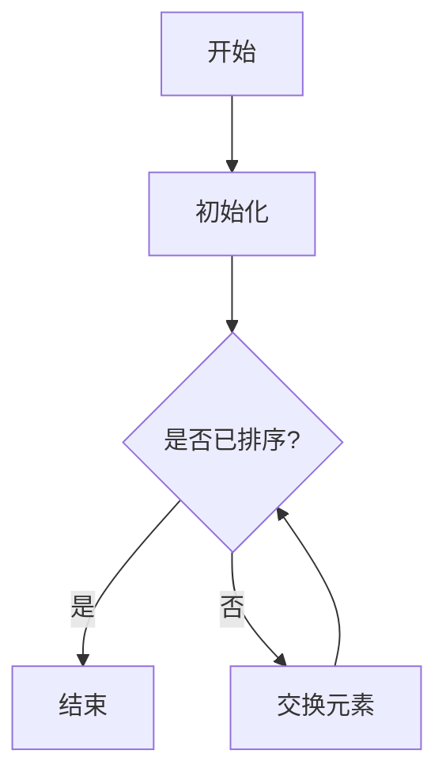
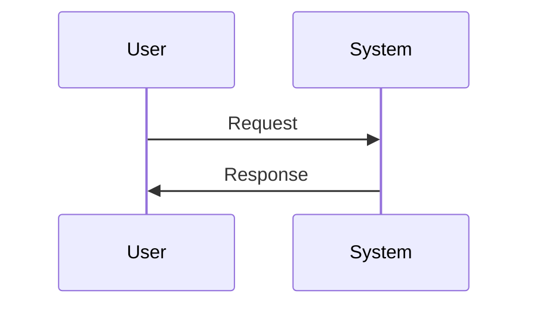
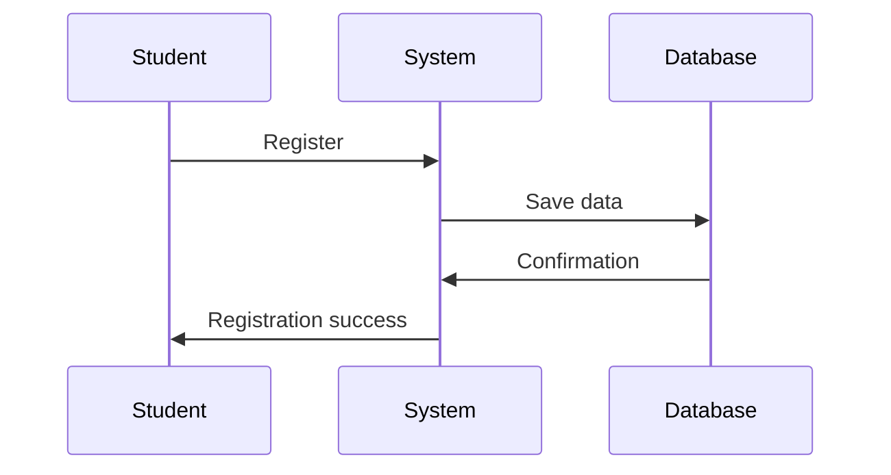

                 


## 写好系统分析的标准范式

### 关键词：
系统分析、标准范式、算法、数学模型、系统设计、项目实战

### 摘要：
本文将深入探讨系统分析中的标准范式，旨在为读者提供一个清晰的框架，以指导他们在复杂系统中进行有效的分析。我们将从定义系统分析和标准范式开始，逐步深入探讨核心概念、算法原理、数学模型，以及系统设计和项目实施的最佳实践。

### 前言

#### 目标读者
本文面向对系统分析有兴趣的工程师、架构师和项目经理，希望他们能通过本文的学习，掌握系统分析的标准范式，提高系统设计和实施的能力。

#### 书籍结构
本文分为八个章节，从基础概念到实战应用，系统性地介绍了系统分析的标准范式。

#### 核心概念
- **系统分析**：对系统的结构和行为进行详细的分析和定义。
- **标准范式**：一套通用的方法和规则，用于系统分析的过程和结果。

### 第一部分：系统分析与标准范式概述

#### 第1章：系统分析与标准范式简介

##### 1.1 系统分析的定义与重要性
系统分析是计算机科学和信息工程中的一项核心活动。它涉及对系统的结构、功能、行为和性能进行深入的理解和定义，以确保系统能够满足既定的需求和目标。

##### 1.1.1 系统分析的过程
系统分析通常包括以下几个步骤：
1. **需求收集**：了解系统必须满足的用户需求。
2. **系统定义**：明确系统的范围和边界。
3. **需求分析**：将用户需求转化为具体的功能需求。
4. **设计**：基于需求分析结果，设计系统的架构和组件。
5. **验证与确认**：确保系统设计满足需求。

##### 1.1.2 标准范式的作用
标准范式为系统分析提供了一套统一的框架和语言，使得不同人员和分析过程之间能够有效沟通和协同工作。

##### 1.1.3 标准范式的类型
常见的标准范式包括：
1. **Waterfall模型**：一种线性顺序的开发方法。
2. **敏捷开发**：一种迭代和增量的开发方法。
3. **V模型**：与Waterfall模型类似，但更强调验证和确认。

##### 1.2 系统分析的挑战与机遇
现代系统分析面临着复杂性和多样性的挑战。同时，随着技术的不断进步，也带来了新的机遇。

##### 1.2.1 现代系统分析面临的挑战
1. **系统复杂性**：现代系统通常具有复杂的功能和结构。
2. **数据多样性**：系统需要处理来自不同源的数据，并且这些数据格式和结构可能不同。

##### 1.2.2 标准范式带来的机遇
1. **标准化流程**：通过标准范式，可以确保开发流程的一致性和可重复性。
2. **工具和方法**：标准范式提供了大量的工具和方法，帮助工程师更有效地进行分析和设计。

##### 1.2.3 标准范式在系统分析中的应用
标准范式在系统分析中的应用非常广泛，包括需求管理、系统设计、测试和部署等各个环节。

##### 1.3 本书内容安排与学习方法
本书将从基础概念开始，逐步深入，通过实际案例和项目实战，帮助读者掌握系统分析的标准范式。

### 第二部分：系统分析的核心概念与原则

#### 第2章：系统分析的核心概念与原则

##### 2.1 系统分析的基础概念
1. **系统**：一个具有特定功能的整体，由多个部分组成。
2. **模块化**：将系统划分为多个模块，每个模块负责特定的功能。
3. **层次化**：将系统按照功能或重要性划分为不同的层次。

##### 2.2 系统分析的原则
1. **完整性**：系统分析应该覆盖系统的所有方面，确保没有遗漏。
2. **一致性**：系统分析的结果应该与其他相关文档和系统保持一致。
3. **可扩展性**：系统设计应该能够适应未来的变化和扩展。

##### 2.3 核心概念比较
| 概念 | 定义 | 特点 |
| ---- | ---- | ---- |
| 模块化 | 将系统划分为多个模块 | 提高系统的可维护性和可测试性 |
| 层次化 | 将系统按照功能或重要性划分为不同层次 | 提高系统的可理解性和可管理性 |

##### 2.4 ER实体关系图
使用Mermaid绘制ER实体关系图，展示系统的实体、属性和关系。

```mermaid
erDiagram
  Class1 ||--|{ ClassB : known as "ChildB" }
  Class1 ||--|+ ClassC : known as "ChildC"
  Class1 ||--|+ ClassD : known as "ChildD"
  ClassM ||--|{ ClassL : known as "ChildL" }
```

### 第三部分：系统分析的算法原理

#### 第3章：系统分析中的算法原理

##### 3.1 算法的基本概念
1. **算法**：解决问题的步骤集合。
2. **时间复杂度**：描述算法执行时间与输入规模之间的关系。
3. **空间复杂度**：描述算法所需内存与输入规模之间的关系。

##### 3.2 常见算法
1. **排序算法**：如冒泡排序、选择排序、插入排序等。
2. **搜索算法**：如线性搜索、二分搜索等。
3. **图算法**：如深度优先搜索、广度优先搜索等。

##### 3.3 Mermaid流程图
使用Mermaid绘制算法流程图，展示算法的执行步骤。



##### 3.4 Python代码示例
使用Python代码实现排序算法，并分析其时间复杂度和空间复杂度。

```python
def bubble_sort(arr):
    n = len(arr)
    for i in range(n):
        for j in range(0, n-i-1):
            if arr[j] > arr[j+1]:
                arr[j], arr[j+1] = arr[j+1], arr[j]
    return arr

arr = [64, 34, 25, 12, 22, 11, 90]
print("原始数组：", arr)
sorted_arr = bubble_sort(arr)
print("排序后的数组：", sorted_arr)
```

##### 3.5 算法原理讲解
1. **冒泡排序**：通过重复遍历要排序的数列，一次比较两个元素，如果它们的顺序错误就把它们交换过来。
2. **时间复杂度**：O(n^2)。
3. **空间复杂度**：O(1)。

### 第四部分：系统分析的数学模型与公式

#### 第4章：系统分析的数学模型与公式

##### 4.1 数学模型的基本概念
1. **模型**：对现实世界的抽象和简化。
2. **公式**：用数学语言表达模型中的关系。

##### 4.2 常见数学模型
1. **线性模型**：如线性回归、线性规划等。
2. **非线性模型**：如逻辑回归、神经网络等。

##### 4.3 LaTeX公式
使用LaTeX格式编写数学公式，并解释其含义。

$$
\sum_{i=1}^{n} x_i = \frac{\sum_{i=1}^{n} x_i^2 - \sum_{i=1}^{n} x_i}{n}
$$

该公式表示样本均值的计算方法。

### 第五部分：系统设计与架构

#### 第5章：系统设计与架构

##### 5.1 系统设计的基本概念
1. **领域模型**：描述系统的业务领域和功能。
2. **架构设计**：确定系统的整体结构和组件。

##### 5.2 Mermaid类图
使用Mermaid绘制类图，展示系统的领域模型。

```mermaid
classDiagram
    Person <<interface>>
    Student <<interface>> : study
    Teacher <<interface>> : teach
    Class <<entity>> : classroom
    Student o-- Person
    Teacher o-- Person
    Class o-- Student
    Class o-- Teacher
```

##### 5.3 Mermaid架构图
使用Mermaid绘制架构图，展示系统的整体架构。



##### 5.4 系统接口设计
设计系统的接口，包括API设计、数据传输格式等。

##### 5.5 系统交互
使用Mermaid绘制系统交互序列图，展示系统内部组件之间的交互。



### 第六部分：项目实战

#### 第6章：项目实施

##### 6.1 环境搭建
介绍如何搭建项目开发环境，包括所需的软件和硬件。

##### 6.2 核心系统实现
详细讲解系统的核心实现，包括数据存储、数据处理和用户接口。

##### 6.3 代码解读与分析
分析系统实现的代码，解释其工作原理和设计理念。

##### 6.4 实际案例分析
通过实际案例，展示系统分析在实际项目中的应用。

##### 6.5 项目小结
总结项目的关键点，讨论项目的优势和不足。

### 第七部分：最佳实践与结论

#### 第7章：最佳实践与结论

##### 7.1 最佳实践
分享系统分析的最佳实践，包括工具选择、流程优化等。

##### 7.2 结论
总结系统分析的标准范式，强调其重要性。

##### 7.3 拓展阅读
推荐相关书籍和资料，供读者进一步学习。

### 作者信息

作者：AI天才研究院/AI Genius Institute & 禅与计算机程序设计艺术 /Zen And The Art of Computer Programming

[End of Article]

