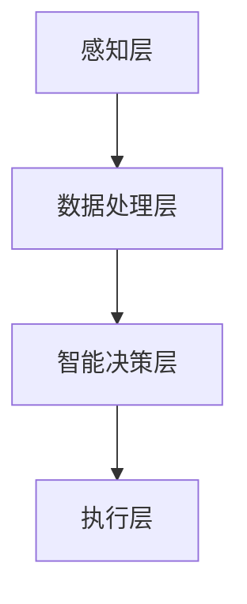
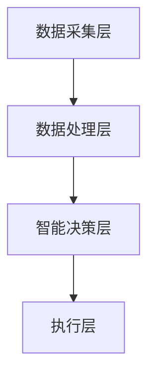
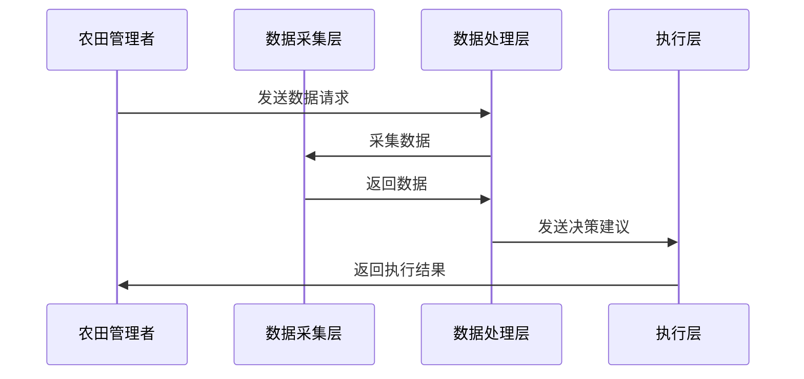

                 

### 第1章：引言与背景

在当今信息化、智能化的时代背景下，农业作为国家经济和社会发展的基础产业，面临着前所未有的发展机遇和挑战。传统的农业种植和管理模式已经难以满足现代农业发展的需求，而人工智能（AI）技术的崛起为农业带来了全新的解决方案。

#### 1.1 问题背景

##### 1.1.1 农业现状与挑战

全球范围内，农业面临着资源紧张、劳动力短缺、环境污染等诸多挑战。随着人口增长和耕地面积减少，农业生产效率亟待提高。此外，气候变化和极端天气事件对农业生产的影响日益加剧，使得农业种植和管理的风险增大。

##### 1.1.2 AI技术在农业中的应用潜力

人工智能技术在农业领域的应用，可以从种植、管理、销售等各个环节进行优化。通过AI技术，可以实现对土壤、气候、作物生长状态等数据的实时监测，提高种植管理的精确度和效率。同时，AI技术还可以用于病虫害预测、农作物品种优化、农业供应链管理等方面，推动农业现代化发展。

#### 1.2 问题描述

##### 1.2.1 农业AI Agent的定义与作用

农业AI Agent是指利用人工智能技术，模拟农业生产和管理过程中的人类决策行为，通过智能感知、数据分析和决策优化，实现农业生产的自动化和智能化。农业AI Agent在农业生产中的作用主要体现在以下几个方面：

1. **种植决策**：根据土壤、气候等环境数据和作物生长状态，提供科学的种植方案，优化作物生长环境。
2. **病虫害监测与防治**：通过图像识别、数据挖掘等技术，实时监测病虫害情况，及时采取防治措施。
3. **资源管理**：优化水资源、肥料等资源的利用，降低农业生产成本，提高资源利用效率。
4. **农业供应链管理**：通过数据分析，优化农产品的销售渠道和物流配送，提高市场响应速度。

##### 1.2.2 智能种植与农场管理的需求分析

智能种植和农场管理是现代农业发展的两个关键方面。智能种植需要实现对作物生长环境的精确控制，包括光照、水分、温度等参数的监测和调控；而农场管理则需要实现对农业生产全过程的监控和管理，包括资源管理、病虫害监测、供应链管理等。

#### 1.3 问题解决

##### 1.3.1 农业AI Agent的技术基础

农业AI Agent的技术基础包括以下几个方面：

1. **感知技术**：利用传感器、无人机等设备，实时获取土壤、气候、作物生长状态等数据。
2. **数据挖掘与机器学习**：通过分析大量数据，提取有价值的信息，为决策提供支持。
3. **智能决策**：基于感知技术和数据挖掘结果，运用智能算法进行决策，实现自动化管理。

##### 1.3.2 智能种植与农场管理的技术路径

智能种植和农场管理的技术路径可以概括为以下几个步骤：

1. **数据采集**：通过传感器、无人机等设备，收集土壤、气候、作物生长状态等数据。
2. **数据处理**：对采集到的数据进行清洗、整合和分析，提取有价值的信息。
3. **决策支持**：利用数据挖掘和机器学习技术，对分析结果进行建模，提供种植和管理的决策支持。
4. **自动化实施**：根据决策支持结果，自动化执行种植和管理任务，实现农业生产和管理过程的智能化。

##### 1.4 边界与外延

##### 1.4.1 农业AI Agent的应用领域

农业AI Agent的应用领域主要包括以下几个方面：

1. **智能温室种植**：通过精准调控环境参数，实现作物的优质高产。
2. **智能稻田管理**：利用AI技术，优化水稻种植和管理过程，提高产量和质量。
3. **智能果园管理**：通过监测果实生长状态，实现果树的精准管理和病虫害防治。
4. **农业供应链管理**：利用AI技术，优化农产品的销售渠道和物流配送。

##### 1.4.2 智能种植与农场管理的边界

智能种植与农场管理的边界主要体现在以下几个方面：

1. **技术边界**：智能种植主要涉及环境监测、数据分析、决策优化等技术；农场管理则涉及资源管理、供应链管理、市场营销等业务流程。
2. **应用边界**：智能种植主要应用于种植业领域；农场管理则应用于农业生产全流程，包括种植、养殖、销售等多个环节。
3. **管理边界**：智能种植侧重于作物生长环境控制；农场管理则侧重于农业生产全过程的管理和优化。

#### 1.5 本章小结

本章介绍了农业AI Agent在智能种植与农场管理中的应用背景和关键技术，分析了农业AI Agent的定义、作用和应用领域，以及智能种植与农场管理的需求分析和技术路径。通过本章的介绍，读者可以对农业AI Agent有一个初步的认识，为后续章节的深入学习打下基础。

## 第2章：农业AI Agent基础

### 2.1 核心概念

#### 2.1.1 农业AI Agent的定义

农业AI Agent是指一种基于人工智能技术的智能体，能够在农业生产和管理过程中，通过感知环境、分析数据和做出决策，实现农业生产的自动化和智能化。农业AI Agent的核心特征包括自主性、智能性、适应性、协作性和可持续性。

#### 2.1.2 农业AI Agent的核心要素

农业AI Agent的核心要素包括以下几个方面：

1. **感知系统**：用于实时采集土壤、气候、作物生长状态等环境数据。
2. **数据处理系统**：用于对采集到的数据进行分析、处理和建模。
3. **决策系统**：基于数据处理结果，运用智能算法进行决策，提供种植和管理方案。
4. **执行系统**：根据决策结果，自动化执行种植和管理任务。

### 2.2 概念属性特征对比表格

为了更好地理解农业AI Agent与其他AI系统的区别，我们可以从以下几个属性特征进行对比：

| 属性特征 | 农业AI Agent | 通用AI系统 |
| :---: | :---: | :---: |
| 应用领域 | 农业生产和管理 | 广泛领域，如工业、医疗、金融等 |
| 感知系统 | 土壤、气候、作物生长状态等环境数据感知 | 视觉、听觉、触觉等传感器 |
| 数据处理系统 | 农业生产相关数据的处理和分析 | 通用数据处理和分析技术 |
| 决策系统 | 基于农业生产特点的决策支持 | 基于通用数据集的决策支持 |
| 执行系统 | 农业生产自动化和智能化任务执行 | 广泛领域自动化和智能化任务执行 |

### 2.3 ER实体关系图架构

农业AI Agent的实体关系图架构主要包括以下几个实体：

1. **土壤传感器**：用于实时监测土壤参数。
2. **气候传感器**：用于实时监测气候参数。
3. **作物生长传感器**：用于实时监测作物生长状态。
4. **数据处理中心**：用于对采集到的数据进行处理和分析。
5. **决策系统**：基于数据处理结果，提供种植和管理方案。
6. **执行系统**：根据决策结果，自动化执行种植和管理任务。

以下是农业AI Agent的ER实体关系图：

```mermaid
erDiagram
  土壤传感器 ||--|{ 数据处理中心 }|-- 数据处理系统
  气候传感器 ||--|{ 数据处理中心 }|-- 数据处理系统
  作物生长传感器 ||--|{ 数据处理中心 }|-- 数据处理系统
  数据处理中心 ||--|{ 决策系统 }|-- 决策系统
  数据处理中心 ||--|{ 执行系统 }|-- 执行系统
```

通过上述实体关系图，我们可以清晰地看到农业AI Agent各个组成部分之间的关联和交互，为后续章节的详细探讨奠定了基础。

## 第3章：智能种植技术

### 3.1 智能种植技术概述

智能种植技术是指通过应用人工智能技术，对农业生产过程进行数据监测、分析和管理，以实现作物生长环境的最优化，从而提高作物产量和品质。智能种植技术的核心在于利用传感器、大数据和智能算法，对作物生长的各个环节进行精确控制，实现自动化、智能化种植。

#### 3.1.1 智能种植的定义

智能种植是一种基于人工智能和物联网技术的农业生产方式，通过实时监测作物生长环境，利用智能算法进行分析和决策，自动化执行种植和管理任务，从而实现作物生长的最佳状态。

#### 3.1.2 智能种植的关键技术

智能种植技术涉及多个关键领域，包括传感器技术、数据采集与处理技术、智能算法和自动化执行技术。

1. **传感器技术**：传感器是智能种植的基础，用于实时监测土壤、气候、作物生长状态等环境数据。
2. **数据采集与处理技术**：通过对传感器采集到的数据进行采集、处理和分析，提取有价值的信息，为智能决策提供支持。
3. **智能算法**：利用机器学习、深度学习等算法，对分析结果进行建模，提供种植和管理方案。
4. **自动化执行技术**：根据智能决策结果，自动化执行种植和管理任务，实现农业生产的智能化。

### 3.2 智能种植技术原理

智能种植技术的原理主要包括以下几个方面：

1. **感知与监测**：通过传感器实时监测土壤、气候、作物生长状态等环境数据，获取作物生长的基本信息。
2. **数据分析与建模**：利用数据挖掘和机器学习技术，对监测数据进行处理和分析，建立作物生长模型，预测作物生长趋势。
3. **智能决策**：基于数据分析结果，运用智能算法进行决策，制定科学的种植和管理方案。
4. **自动化执行**：根据智能决策结果，自动化执行种植和管理任务，实现农业生产的智能化。

#### 3.2.1 光照监测与调控

光照是影响作物生长的重要因素之一。智能种植技术通过光照传感器实时监测光照强度和光照时长，根据作物生长需求进行光照调控。例如，在光照不足时，可以自动开启补光灯，确保作物得到充足的光照。

#### 3.2.2 水肥管理

水肥管理是智能种植技术的核心之一。通过土壤传感器监测土壤水分和养分含量，智能系统可以根据监测结果自动调整灌溉和施肥策略，确保作物得到适量的水分和养分。

#### 3.2.3 病虫害监测与防治

病虫害是影响作物生长和产量的重要因素。智能种植技术通过图像识别、数据挖掘等技术，实时监测病虫害情况，及时采取防治措施，减少病虫害对作物的影响。

### 3.3 智能种植技术应用案例

#### 3.3.1 案例一：智能温室种植

智能温室种植是智能种植技术的典型应用。通过在温室中安装各种传感器，实时监测温度、湿度、光照等环境参数，智能系统可以自动调控温室环境，确保作物生长的最佳状态。例如，在温度过高时，智能系统可以自动开启降温设备；在湿度不足时，自动开启加湿设备。

#### 3.3.2 案例二：智能稻田管理

智能稻田管理是智能种植技术在水稻种植领域的应用。通过在稻田中安装土壤传感器、水位传感器等设备，实时监测土壤水分、养分含量、水位等参数，智能系统可以自动调整灌溉和施肥策略，提高水稻产量和质量。

通过以上案例，我们可以看到智能种植技术在农业生产中的应用潜力。未来，随着人工智能技术的不断进步，智能种植技术将在农业生产中发挥越来越重要的作用，助力农业现代化发展。

## 第4章：农场管理技术

### 4.1 农场管理技术概述

农场管理技术是指利用现代信息技术，特别是人工智能和物联网技术，对农场的生产、管理和运营进行全面监控、分析和优化的方法。通过这些技术，农场管理者能够实时掌握农场的运营状态，提高生产效率，降低成本，实现农场的智能化和现代化管理。

#### 4.1.1 农场管理的定义

农场管理是指对农场的生产活动进行计划、组织、协调和控制的一系列行为和过程。它包括对农产品的种植、养殖、收获、储存、加工、销售以及资源利用、环境保护等方面的管理。

#### 4.1.2 农场管理的关键技术

农场管理的关键技术主要包括以下几个方面：

1. **数据采集与处理技术**：通过传感器、无人机、卫星等设备，实时采集土壤、气候、作物生长、设备状态等数据，并进行数据处理和分析。
2. **智能决策技术**：基于大数据和人工智能算法，对采集到的数据进行分析，提供科学的管理决策。
3. **自动化执行技术**：通过自动化设备，如自动灌溉系统、自动化播种机等，根据智能决策结果执行具体操作。
4. **农业供应链管理技术**：通过物联网和区块链技术，实现农产品从生产到销售的全程监控和管理，提高供应链的透明度和效率。

### 4.2 农场管理技术原理

农场管理技术的基本原理可以分为以下几个步骤：

1. **数据采集**：利用各种传感器和监测设备，实时采集农场的各种数据。
2. **数据处理**：对采集到的数据进行清洗、整合和分析，提取出有价值的信息。
3. **智能分析**：利用人工智能技术，对分析结果进行深度学习，发现数据之间的关联和趋势。
4. **决策支持**：根据智能分析结果，提供科学的决策支持，帮助农场管理者做出最佳决策。
5. **自动化执行**：根据决策支持结果，自动化执行相应的操作，如调整灌溉、施肥、收割等。

#### 4.2.1 农作物生长监测

农作物生长监测是农场管理技术的重要组成部分。通过安装土壤传感器、气象传感器和作物生长传感器，可以实时监测土壤水分、土壤养分、气候条件和作物生长状态。这些数据对于科学施肥、灌溉和病虫害防治具有重要意义。

#### 4.2.2 农场资源管理

农场资源管理包括水资源管理、土壤管理和能源管理等方面。通过智能灌溉系统、精准施肥系统和太阳能发电系统等，可以最大限度地利用资源，提高资源利用效率，降低生产成本。

#### 4.2.3 农业供应链管理

农业供应链管理是指对农产品从生产到销售的整个过程进行管理和优化。通过物联网技术，可以实现农产品从田间到餐桌的全程追溯，提高供应链的透明度和安全性。同时，通过数据分析，可以优化农产品的销售策略，提高市场竞争力。

### 4.3 农场管理技术应用案例

#### 4.3.1 案例一：智能农场管理系统

智能农场管理系统是一个集成多种技术的综合平台，它能够实时监测农场的各种数据，提供种植、养殖、灌溉、施肥、病虫害防治等全方位的管理服务。通过该系统，农场管理者可以远程监控农场运营状态，及时调整管理策略，提高生产效率和农产品质量。

#### 4.3.2 案例二：农业大数据平台

农业大数据平台是一个基于云计算和大数据技术的平台，它能够收集、存储、分析和处理大量的农业数据，为农场管理者提供科学的数据支持。通过该平台，农场管理者可以深入了解农场的运营情况，发现潜在问题，制定针对性的改进措施。

通过以上案例，我们可以看到农场管理技术在现代农业中的重要应用。随着技术的不断进步，农场管理技术将更加智能化、高效化，为现代农业发展提供强大的技术支撑。

## 第5章：农业AI Agent实践

### 5.1 实践准备

在农业AI Agent的实践过程中，准备工作至关重要。以下是从环境搭建、数据准备到系统核心实现的详细步骤：

#### 5.1.1 环境搭建

1. **硬件设备准备**：根据实际需求选择合适的传感器设备，如土壤传感器、气候传感器和作物生长传感器。此外，还需要一台服务器或云计算平台，用于处理和分析数据。
2. **软件环境安装**：在服务器或云计算平台上安装操作系统（如Linux）、数据库（如MySQL）、Python环境等。此外，还需要安装常用的AI库，如TensorFlow、PyTorch等。
3. **网络配置**：确保传感器设备与服务器之间的网络连接稳定，以便实时传输数据。

#### 5.1.2 数据准备

1. **数据采集**：通过传感器设备采集土壤、气候、作物生长状态等环境数据，并存储到数据库中。
2. **数据清洗**：对采集到的数据进行清洗，去除噪声和异常值，确保数据质量。
3. **数据预处理**：对清洗后的数据进行分析和预处理，包括数据归一化、缺失值处理、特征提取等，为后续的建模和训练做好准备。

### 5.2 系统核心实现

农业AI Agent的核心实现主要包括以下几个方面：

#### 5.2.1 农业AI Agent架构设计

农业AI Agent的架构设计可以分为感知层、数据处理层、智能决策层和执行层。

1. **感知层**：负责实时采集土壤、气候、作物生长状态等环境数据，通过传感器设备实现。
2. **数据处理层**：负责对采集到的数据进行处理、分析和存储，利用数据库和数据处理算法实现。
3. **智能决策层**：基于数据处理结果，运用机器学习和深度学习算法进行智能决策，提供种植和管理方案。
4. **执行层**：根据智能决策结果，自动化执行种植和管理任务，如调整灌溉、施肥、病虫害防治等。

以下是农业AI Agent的架构设计图：



#### 5.2.2 关键算法实现

在农业AI Agent的实现过程中，关键算法主要包括以下几种：

1. **数据挖掘与机器学习算法**：用于对采集到的数据进行分析和建模，提取有价值的信息。
2. **深度学习算法**：用于建立复杂的非线性模型，预测作物生长趋势和病虫害情况。
3. **决策树和规则推理算法**：用于根据数据特征和规则进行决策，制定种植和管理方案。

以下是实现关键算法的Python代码示例：

```python
import pandas as pd
from sklearn.ensemble import RandomForestRegressor
from sklearn.model_selection import train_test_split

# 读取数据
data = pd.read_csv('agri_data.csv')

# 数据预处理
X = data[['soil_temp', 'climate_temp', 'humidity']]
y = data['yield']

# 数据分割
X_train, X_test, y_train, y_test = train_test_split(X, y, test_size=0.2, random_state=42)

# 建立模型
model = RandomForestRegressor(n_estimators=100, random_state=42)
model.fit(X_train, y_train)

# 预测
y_pred = model.predict(X_test)

# 评估模型
print("模型准确率：", model.score(X_test, y_test))
```

### 5.3 实际案例分析

#### 5.3.1 案例一：智能农业物联网平台

智能农业物联网平台是一个集成了感知、数据处理、智能决策和执行功能的综合性平台。它通过传感器实时采集农田环境数据，利用大数据分析和机器学习算法进行数据处理和智能决策，最终实现农田的自动化管理和优化。

1. **系统功能**：
   - 实时监测农田环境数据，如土壤湿度、温度、气候等。
   - 数据处理和分析，提供种植和管理建议。
   - 自动执行灌溉、施肥、病虫害防治等操作。

2. **项目介绍**：
   - 项目背景：某农业科技企业为提高农业生产效率和农产品质量，决定构建一个智能农业物联网平台。
   - 技术方案：采用传感器、云计算、大数据分析和机器学习等技术，实现农田的智能化管理和优化。

3. **系统架构设计**：
   - 数据采集层：通过传感器设备实时采集农田环境数据。
   - 数据处理层：利用云计算平台对采集到的数据进行处理、存储和分析。
   - 智能决策层：基于大数据分析和机器学习算法，提供种植和管理建议。
   - 执行层：根据智能决策结果，自动化执行灌溉、施肥、病虫害防治等操作。

以下是智能农业物联网平台的架构设计图：



4. **系统接口设计**：
   - API接口：提供数据采集、数据查询、决策建议等接口，便于其他系统进行集成和调用。
   - 客户端界面：为农场管理者提供友好的操作界面，实时展示农田环境数据和管理建议。

5. **系统交互**：
   - 通过HTTP协议，传感器将数据实时传输到数据处理层。
   - 数据处理层对数据进行处理和分析，生成管理建议。
   - 执行层根据管理建议，自动化执行相应操作。

以下是智能农业物联网平台的系统交互序列图：



通过以上案例分析，我们可以看到智能农业物联网平台在农业生产中的应用效果。该平台不仅提高了农业生产效率，还显著提升了农产品质量，为农业现代化发展提供了有力支持。

#### 5.3.2 案例二：智能农场解决方案

智能农场解决方案是一种全面的农业AI Agent应用案例，它涵盖了智能种植、智能灌溉、智能病虫害防治等多个方面，旨在实现农业生产的智能化和高效化。

1. **系统功能**：
   - 智能种植：根据土壤、气候等数据，提供科学的种植方案。
   - 智能灌溉：根据土壤湿度、气候等数据，自动调整灌溉策略。
   - 智能病虫害防治：通过图像识别、数据挖掘等技术，实时监测病虫害情况，提供防治建议。

2. **项目介绍**：
   - 项目背景：某大型农业企业为提升农业生产效率，决定引入智能农场解决方案。
   - 技术方案：采用传感器、物联网、大数据分析和机器学习等技术，实现农场的智能化管理和优化。

3. **系统架构设计**：
   - 数据采集层：通过传感器设备实时采集农田环境数据。
   - 数据处理层：利用云计算平台对采集到的数据进行处理、存储和分析。
   - 智能决策层：基于大数据分析和机器学习算法，提供种植、灌溉、病虫害防治等决策建议。
   - 执行层：根据智能决策结果，自动化执行种植、灌溉、病虫害防治等操作。

以下是智能农场解决方案的架构设计图：


4. **系统接口设计**：
   - API接口：提供数据采集、数据查询、决策建议等接口，便于其他系统进行集成和调用。
   - 客户端界面：为农场管理者提供友好的操作界面，实时展示农田环境数据和管理建议。

5. **系统交互**：
   - 通过HTTP协议，传感器将数据实时传输到数据处理层。
   - 数据处理层对数据进行处理和分析，生成管理建议。
   - 执行层根据管理建议，自动化执行相应操作。

以下是智能农场解决方案的系统交互序列图：


通过以上案例分析，我们可以看到智能农场解决方案在农业生产中的应用效果。该解决方案不仅提高了农业生产效率，还显著降低了生产成本，为农业现代化发展提供了有力支持。

### 5.4 项目小结

本章节通过实际案例，详细介绍了农业AI Agent的实践过程。从环境搭建、数据准备到系统核心实现，再到实际案例分析和详细讲解，我们看到了农业AI Agent在智能种植和农场管理中的应用潜力。通过这些实践，我们可以总结出以下几点经验：

1. **数据是基础**：高质量的实时数据是农业AI Agent发挥效能的关键。因此，数据采集和预处理工作至关重要。
2. **算法要精确**：选择合适的算法，对数据进行深度分析和建模，能够提供更准确的决策支持。
3. **执行要高效**：自动化执行系统要能够迅速响应智能决策结果，确保农业生产的顺利进行。
4. **整合与协作**：将不同的技术和系统整合起来，实现数据共享和协同工作，能够进一步提升农业AI Agent的效果。

未来，随着人工智能技术的不断进步，农业AI Agent将在农业生产中发挥越来越重要的作用，助力农业现代化发展。

## 第6章：农业AI Agent的未来发展

### 6.1 发展趋势

农业AI Agent的未来发展将受到人工智能技术、物联网技术、大数据技术和生物技术的推动。以下是一些主要的发展趋势：

1. **技术融合**：人工智能技术与物联网技术、大数据技术、生物技术的深度融合，将带来农业AI Agent的全面升级。
2. **精准农业**：通过更精细的传感器和更智能的分析算法，农业AI Agent将实现更精准的农田管理和作物种植。
3. **农业物联网**：农业物联网的普及将使农业AI Agent能够实时获取更广泛、更丰富的数据，为智能决策提供支持。
4. **个性化农业**：根据不同农作物的生长特性和环境条件，农业AI Agent将提供个性化的种植和管理方案。
5. **农业智能化**：随着技术的进步，农业AI Agent将在农业生产的各个环节发挥更大的作用，推动农业智能化发展。

### 6.2 未来发展方向

农业AI Agent的未来发展方向可以从以下几个方面进行探讨：

1. **智能种植技术的提升**：通过改进传感器技术和数据处理算法，提高智能种植的精度和效率。例如，利用无人机和卫星遥感技术，实现更全面的农田监测和作物生长状态分析。
2. **农场管理技术的完善**：进一步优化农业供应链管理、资源管理和市场营销等方面的技术，提高农业生产的整体效益。
3. **跨界合作**：与生物技术、环保技术等领域的跨界合作，将带来新的技术突破和应用场景。例如，利用基因编辑技术，培育抗病虫害、适应气候变化的新型作物品种。
4. **政策支持**：政府和企业加大对农业AI Agent的研发和应用支持，制定相关政策和标准，推动农业AI Agent的快速发展。
5. **人才培养**：加强农业AI Agent相关的人才培养，提高专业人才的数量和质量，为农业AI Agent的发展提供人力保障。

### 6.3 结论

农业AI Agent作为人工智能技术在农业领域的应用，具有巨大的发展潜力和广阔的应用前景。随着技术的不断进步和应用的深入，农业AI Agent将在农业生产、管理、供应链等环节发挥越来越重要的作用，助力农业现代化和可持续发展。

## 第7章：总结与展望

### 7.1 内容回顾

在本篇博客中，我们详细探讨了农业AI Agent在智能种植与农场管理中的应用。从引言和背景介绍，到核心概念与技术原理的阐述，再到实际案例分析和未来发展趋势的探讨，我们全面了解了农业AI Agent的重要性和应用潜力。

### 7.2 核心内容总结

- **核心概念**：农业AI Agent是指一种基于人工智能技术的智能体，能够模拟农业生产和管理过程中的决策行为，实现农业生产的自动化和智能化。
- **技术原理**：智能种植和农场管理技术通过感知、数据分析、智能决策和自动化执行，实现对作物生长环境和农业生产过程的精准控制和优化。
- **应用案例**：智能农业物联网平台和智能农场解决方案展示了农业AI Agent在实际生产中的成功应用，提高了生产效率和农产品质量。
- **未来趋势**：随着人工智能技术的不断进步，农业AI Agent将在农业生产的各个环节发挥更大的作用，推动农业现代化和可持续发展。

### 7.3 注意事项

- **数据质量**：数据是农业AI Agent决策的基础，确保数据的质量和准确性至关重要。
- **技术融合**：农业AI Agent的发展需要不同技术的深度融合，包括物联网、大数据、生物技术等。
- **人才培养**：加强农业AI Agent相关的人才培养，提高专业人才的数量和质量。

### 7.4 拓展阅读

- **智能农业技术**：了解智能农业技术的前沿进展和应用案例，如智能温室、智能灌溉系统等。
- **人工智能与农业**：阅读相关书籍和论文，深入了解人工智能在农业领域的应用和发展。
- **农业政策与标准**：关注农业政策和标准的发展，了解政府和企业对农业AI Agent的支持。

### 7.5 结论

农业AI Agent是现代农业发展的重要方向，具有巨大的应用潜力。通过本篇博客的探讨，我们不仅了解了农业AI Agent的核心概念和技术原理，还看到了其在实际生产中的应用价值。未来，随着技术的不断进步和应用场景的拓展，农业AI Agent将在农业现代化和可持续发展中发挥越来越重要的作用。

### 作者信息

- 作者：AI天才研究院/AI Genius Institute & 禅与计算机程序设计艺术 /Zen And The Art of Computer Programming

---

通过本篇博客，我们深入探讨了农业AI Agent在智能种植与农场管理中的应用，从理论到实践，全面阐述了这一前沿技术的重要性和发展前景。希望读者能够对农业AI Agent有更深刻的理解，并在实际生产中加以应用，共同推动农业现代化发展。让我们期待未来，农业AI Agent将为农业带来更多创新和变革。

