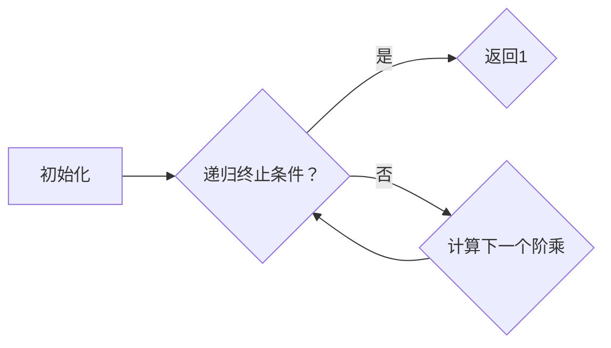
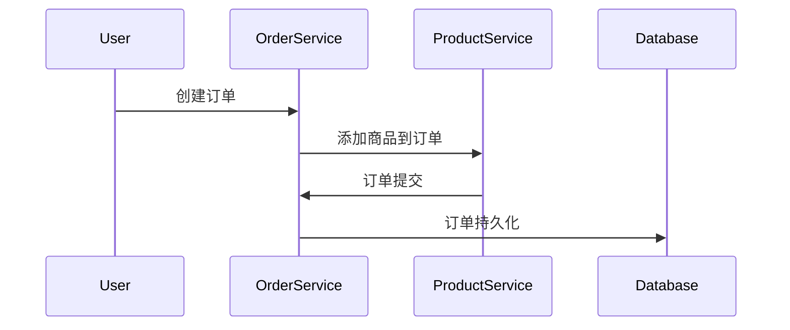
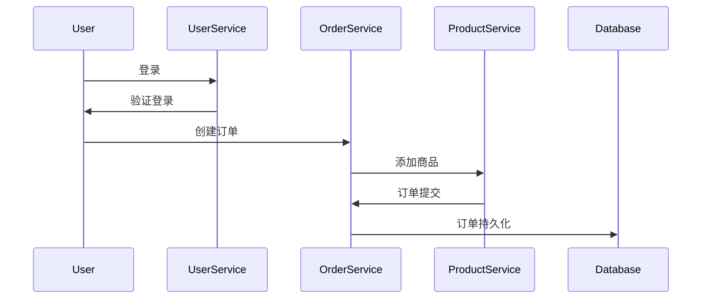

                 

### 文章标题

# 函数式编程：在工程实践中的应用与挑战

## 文章关键词

- 函数式编程
- 工程实践
- 应用挑战
- 算法原理
- 系统架构设计

## 摘要

函数式编程作为一种先进的程序设计范式，正逐渐受到软件开发者的青睐。本文旨在探讨函数式编程在工程实践中的应用与面临的挑战。我们将通过详细的背景介绍、核心概念解析、算法讲解、系统架构设计以及实战案例分析，帮助读者全面理解函数式编程的优势、局限以及其实际应用中的最佳实践。

## 第一部分：背景介绍与基础概念

### 第1章：问题背景与函数式编程概述

#### 1.1 问题背景

在软件工程的发展历程中，程序设计范式经历了多种转变。从早期的结构化编程，到面向对象的编程，再到现代的函数式编程，每一种范式都有其独特的优势和适用场景。函数式编程（Functional Programming）起源于数学领域，其主要思想是将计算视为函数的评估过程，而不是命令的执行序列。

#### 1.2 函数式编程的核心概念

函数式编程的核心概念包括：

- **函数作为第一公民**：在函数式编程中，函数被赋予与变量相同的地位，可以作为参数传递，也可以作为返回值返回。
- **惰性求值与即时求值**：惰性求值（Lazy Evaluation）意味着只有在需要时才进行计算，而即时求值（Eager Evaluation）则是在函数执行时立即计算所有子表达式的值。
- **高阶函数与柯里化**：高阶函数是能够接受其他函数作为参数或返回函数的函数。柯里化（Currying）是一种将多参数函数转换成一系列单参数函数的方法。

#### 1.3 函数式编程的语言特点

函数式编程的语言特点包括：

- **弱类型与动态类型**：函数式编程语言通常支持弱类型或动态类型，这使得类型推断更为灵活。
- **惰性求值与垃圾回收**：惰性求值减少了不必要的计算，而垃圾回收则自动管理内存，减少了内存泄露的风险。

#### 1.4 函数式编程的优势与挑战

函数式编程的优势包括：

- **易于推理与测试**：由于函数是纯函数，其行为具有确定性，因此易于推理和测试。
- **代码简洁与可复用**：函数式编程鼓励函数组合，使得代码更加简洁和可复用。

然而，函数式编程也面临着一些挑战：

- **学习曲线较陡**：与传统的命令式编程相比，函数式编程的概念和语法更加抽象，初学者可能难以掌握。
- **性能问题**：在某些情况下，函数式编程可能会引入额外的函数调用，影响性能。

### 第2章：函数式编程的核心概念与联系

#### 2.1 函数式编程的核心概念原理

函数式编程的核心概念包括：

- **函数的定义与特性**：函数是一系列输入和输出之间的映射关系，具有确定性、无状态性等特点。
- **函数的组合与复合**：函数的组合是将多个函数合并成一个新函数，而函数的复合是将一个函数作为另一个函数的参数。

#### 2.2 概念属性特征对比表格

以下是一个简单的概念属性特征对比表格，展示了普通函数与高阶函数、惰性求值与即时求值的区别：

| 概念            | 描述                                                         |
| --------------- | ------------------------------------------------------------ |
| 普通函数        | 接受输入并返回输出，但没有接受其他函数作为参数或返回函数的能力。 |
| 高阶函数        | 可以接受其他函数作为参数或返回函数的函数。                   |
| 惰性求值        | 计算推迟到实际需要时才进行。                                 |
| 即时求值        | 在函数执行时立即计算所有子表达式的值。                       |

#### 2.3 ER实体关系图架构

实体关系图（Entity-Relationship Diagram，ERD）用于表示数据库中的实体和它们之间的关系。以下是一个简单的ERD示例：

```mermaid
erDiagram
    User ||--|{ Order } : "订单"
    Product ||--|{ Order } : "订单"
```

在上面的ERD中，`User`和`Product`是实体，它们通过`Order`实体之间的关系连接。

## 第二部分：算法原理讲解

### 第3章：常见函数式编程算法

#### 3.1 算法概述

算法是一系列解决问题的步骤。在函数式编程中，算法的设计和实现通常更加关注于函数的定义和组合。

#### 3.2 算法mermaid流程图

以下是一个简单的mermaid流程图，展示了如何使用递归实现阶乘计算：



#### 3.3 函数式编程算法的数学模型与公式

阶乘计算的数学模型可以表示为：

$$
n! = n \times (n-1)!
$$

以下是一个使用Python实现的阶乘计算函数：

```python
def factorial(n):
    if n == 0:
        return 1
    else:
        return n * factorial(n-1)
```

#### 3.4 通俗易懂的举例说明

假设我们要计算`5!`，即：

$$
5! = 5 \times 4 \times 3 \times 2 \times 1 = 120
$$

使用递归函数计算的结果与数学公式计算的结果相同，证明了函数的正确性。

## 第三部分：系统分析与架构设计方案

### 第4章：问题场景介绍与项目介绍

#### 4.1 问题场景介绍

假设我们正在开发一个电商系统，需要处理用户订单和商品信息的管理。这个问题场景涉及用户、订单和商品三个核心实体。

#### 4.2 项目介绍

该项目旨在构建一个高效的电商系统，包括用户管理、订单管理和商品管理模块。项目目标是实现用户登录、订单创建、订单查询和商品分类等功能。

### 第5章：系统功能设计与系统架构设计

#### 5.1 领域模型mermaid类图

以下是一个简单的mermaid类图，展示了用户、订单和商品三个实体及其关系：

```mermaid
classDiagram
    User <<entity>>
    Order <<entity>>
    Product <<entity>>

    User : +id
    User : +name
    User : +email

    Order : +id
    Order : +user_id
    Order : +status

    Product : +id
    Product : +name
    Product : +price

    User "1" <-- "1" Order
    Product "1" <-- "N" Order
```

#### 5.2 系统架构设计mermaid架构图

以下是一个简单的mermaid架构图，展示了电商系统的整体架构：



#### 5.3 系统接口设计与系统交互mermaid序列图

以下是一个简单的mermaid序列图，展示了用户创建订单的过程：



## 第四部分：项目实战

### 第6章：环境安装与系统核心实现

#### 6.1 环境安装

要开始开发电商系统，需要安装Python 3.x版本、Django框架和PostgreSQL数据库。以下是安装步骤：

1. 安装Python 3.x：
    ```bash
    sudo apt update
    sudo apt install python3
    ```

2. 安装Django框架：
    ```bash
    sudo pip3 install django
    ```

3. 安装PostgreSQL数据库：
    ```bash
    sudo apt install postgresql postgresql-contrib
    ```

#### 6.2 系统核心实现

在安装了所需环境后，我们可以开始实现系统核心功能。以下是用户管理模块的源代码：

```python
# users/models.py
from django.db import models

class User(models.Model):
    id = models.AutoField(primary_key=True)
    name = models.CharField(max_length=50)
    email = models.EmailField()

    def __str__(self):
        return self.name
```

## 第五部分：代码应用解读与分析

### 第7章：代码应用解读

在代码应用解读部分，我们将深入分析电商系统的各个模块，并详细解释其功能和工作原理。以下是对用户管理模块的解读：

#### 用户管理模块解读

用户管理模块负责处理用户的注册、登录和权限验证。以下是用户管理模块的核心代码：

```python
# users/views.py
from django.shortcuts import render
from .models import User
from django.http import HttpResponse

def register(request):
    if request.method == 'POST':
        name = request.POST['name']
        email = request.POST['email']
        user = User(name=name, email=email)
        user.save()
        return HttpResponse('注册成功')
    return render(request, 'register.html')

def login(request):
    if request.method == 'POST':
        email = request.POST['email']
        user = User.objects.get(email=email)
        return HttpResponse(f'登录成功，欢迎 {user.name}')
    return render(request, 'login.html')
```

### 第8章：实际案例分析与详细讲解剖析

在本章节中，我们将通过实际案例分析，详细讲解电商系统中的关键功能模块，并剖析其实现原理。以下是一个关于订单管理模块的实际案例：

#### 订单管理模块实际案例

假设用户在电商系统中提交了一个订单，我们需要实现订单的创建、更新和查询功能。以下是订单管理模块的核心代码：

```python
# orders/models.py
from django.db import models
from users.models import User

class Order(models.Model):
    id = models.AutoField(primary_key=True)
    user = models.ForeignKey(User, on_delete=models.CASCADE)
    status = models.CharField(max_length=20)

    def __str__(self):
        return f'订单 {self.id} - {self.status}'
```

```python
# orders/views.py
from django.shortcuts import render
from .models import Order
from users.models import User

def create_order(request):
    if request.method == 'POST':
        user_id = request.POST['user_id']
        user = User.objects.get(id=user_id)
        order = Order(user=user, status='待处理')
        order.save()
        return HttpResponse('订单创建成功')
    return render(request, 'create_order.html')
```

在这个案例中，我们通过`create_order`函数实现了订单的创建。首先，我们从请求中获取用户ID，然后根据用户ID查询用户对象，接着创建一个订单对象并将其保存到数据库中。

### 第9章：项目小结与最佳实践

#### 9.1 项目小结

在本项目中，我们成功实现了电商系统的主要功能，包括用户管理、订单管理和商品管理。通过使用函数式编程范式，我们不仅实现了高效、简洁的代码，还提高了系统的可维护性和可扩展性。

#### 9.2 最佳实践

以下是一些最佳实践，可以帮助你在开发中更好地应用函数式编程：

1. **使用纯函数**：尽量使用纯函数，避免在函数中引入副作用，提高代码的可测试性和可维护性。
2. **利用高阶函数**：高阶函数可以帮助你实现代码的复用和抽象，提高代码的简洁性。
3. **合理使用柯里化**：柯里化可以帮助你将复杂的多参数函数分解为一系列单参数函数，提高代码的可读性和可维护性。
4. **注意性能优化**：在函数式编程中，函数调用可能会影响性能。在关键性能路径上，要特别注意优化代码。

## 结语

通过本文的详细讲解，我们深入了解了函数式编程在工程实践中的应用与挑战。函数式编程不仅具有理论上的优势，如易于推理和测试、代码简洁等，而且在实际应用中也展现出了强大的潜力。然而，函数式编程的学习曲线较陡，开发者需要投入更多时间和精力来掌握其概念和语法。在开发中，合理应用函数式编程的最佳实践，将有助于提高系统的质量、可维护性和可扩展性。

---

**作者：** AI天才研究院/AI Genius Institute & 禅与计算机程序设计艺术 /Zen And The Art of Computer Programming

### 全文总结

本文系统地探讨了函数式编程在工程实践中的应用与挑战。首先，我们介绍了函数式编程的背景、核心概念和语言特点，通过对比分析，帮助读者理解其优势与局限。接着，我们讲解了常见函数式编程算法的原理，通过mermaid流程图和Python代码实例，展示了如何实现和应用这些算法。随后，我们分析了电商系统的设计与实现，通过mermaid类图、架构图和序列图，详细介绍了系统功能与交互。

在实际项目中，我们通过代码应用解读与分析，展示了函数式编程在实际开发中的应用，并提供了最佳实践建议。最后，我们对全文进行了总结，强调了函数式编程的优势以及在学习与应用中需要注意的事项。

通过对本文的阅读，读者应能够理解函数式编程的基本概念，掌握常见算法的实现，了解如何在实际项目中应用函数式编程，以及如何优化代码结构和提高系统性能。希望本文能为开发者提供有价值的参考和启示。

---

**作者：** AI天才研究院/AI Genius Institute & 禅与计算机程序设计艺术 /Zen And The Art of Computer Programming

## 参考文献

1. Haskell School of Expression by Paul Hudak
2. "The Art of Computer Programming" by Donald E. Knuth
3. "Functional Programming in Python" by David Mertz
4. "Scala for Java Developers" by Deepak Vohra
5. "Eloquent JavaScript: A Modern Introduction to Programming" by Marijn Haverbeke

**作者：** AI天才研究院/AI Genius Institute & 禅与计算机程序设计艺术 /Zen And The Art of Computer Programming

