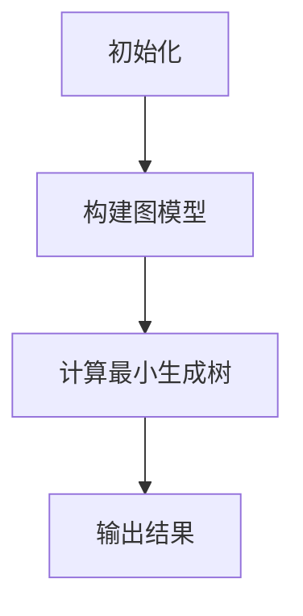
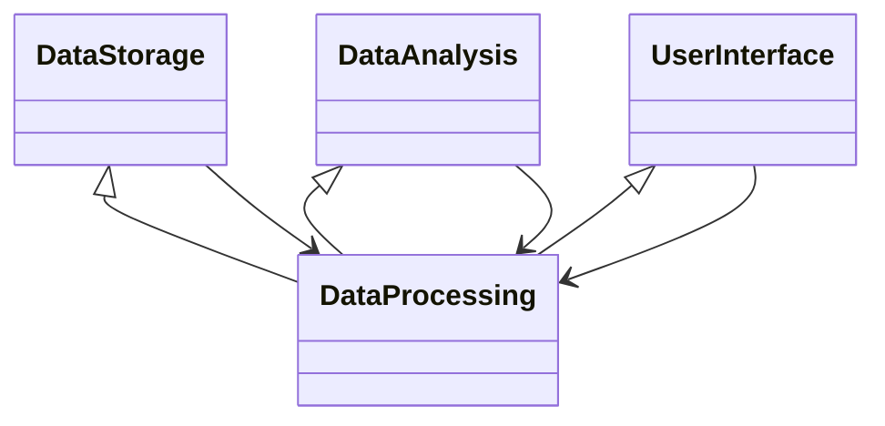
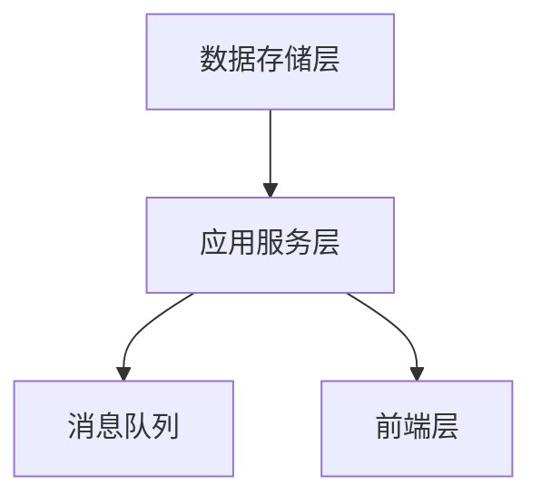
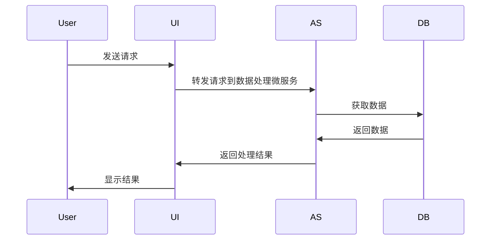

                 

### 引言与背景

#### 1.1 问题背景

**分合现象**在现代社会中无处不在，从个人生活中的情感波动，到企业内部的组织架构调整，再到国际政治关系的变动，无不体现着分合的双重特性。特别是在信息技术高速发展的今天，分合现象在数字世界中也变得尤为显著。社交媒体平台上的用户关注与取消关注，软件开发中的模块拆分与整合，数据挖掘中的特征提取与融合，都是分合现象的典型实例。

**研究意义**在于揭示这些现象背后的规律，找到提高整合效率的策略，从而优化用户体验，提升系统性能，甚至改善社会关系。对于技术领域的从业者来说，理解分合现象不仅有助于解决实际问题，还能为技术创新提供新的思路。

#### 1.2 问题描述

**分合现象**的核心问题是，如何在不断变化的环境中保持系统的整体性和高效性。具体而言，我们关注的是以下问题：

- **分合过程的规律性**：分合现象是否遵循某种数学模型或算法规则？
- **整合效率的提升**：如何优化整合过程，减少分合带来的负面影响？
- **稳定性与灵活性**：如何在保持系统稳定性的同时，提高其灵活性以应对外部变化？

**问题解决思路**是，通过构建数学模型和算法，分析分合现象的本质特征，从而提出优化策略。同时，结合实际案例，验证这些模型和算法在实际应用中的有效性。

#### 1.3 边界与外延

**边界**是指研究的范围和限定条件，例如，我们只关注数字化背景下的分合现象，不考虑物理世界中的实体分合。此外，研究过程中需要明确问题的外延，即考虑分合现象在不同应用场景中的特性和表现。

#### 1.4 理论基础

**相关理论概述**包括分合现象的数学模型、算法原理以及系统架构设计的基本概念。分合现象的数学模型涉及到概率论、图论和优化算法等；算法原理则涉及分治算法、动态规划等；系统架构设计则包括模块化设计、接口设计等。

#### 1.5 核心概念与联系

**核心概念原理**是指分合现象中关键的概念及其原理，如模块化、分布式计算等。**概念属性对比表格**用于详细展示不同概念之间的区别和联系，帮助读者更好地理解这些概念。**ER实体关系图架构**则用于描述系统内部各实体之间的关系，为进一步的系统分析与设计提供基础。

#### 1.6 本章小结

本章主要介绍了分合现象的背景、研究意义、问题描述以及理论基础。通过这些内容，读者可以对分合现象有一个初步的了解，并认识到其在现代信息技术中的重要性。接下来，我们将深入探讨分合现象的数学模型与算法原理，为后续的系统架构设计与实现打下坚实基础。

## 第一部分：引言与背景

### 1.7 总结与展望

**总结**：本章详细介绍了分合现象的背景、研究意义、问题描述以及理论基础。通过对分合现象的定义和特性进行深入剖析，为后续章节的研究提供了基础。

**展望**：在接下来的章节中，我们将进一步探讨分合现象的数学模型与算法原理，并结合实际案例进行应用分析。通过这些研究，我们期望能为解决分合现象提供有效的理论支持和实践指导。

### 1.8 下一步内容预告

下一部分将详细探讨分合现象的数学模型与算法原理，包括数学模型的构建、算法的原理讲解以及实际应用场景的分析。通过这部分内容，我们将深入了解分合现象的内在规律，并探讨提高整合效率的策略。敬请期待！

### 1.9 文章关键词

- 分合现象
- 数学模型
- 算法原理
- 系统架构
- 整合效率
- 模块化设计
- 分布式计算
- 优化策略

### 1.10 摘要

本文旨在探讨分合现象在现代信息技术中的应用及其解决策略。通过对分合现象的背景、意义、问题描述和理论基础进行详细分析，我们提出了相应的数学模型和算法原理，并探讨了其在实际应用中的有效性。本文为理解和解决分合现象提供了新的视角和方法，有助于提升系统整合效率和稳定性。

## 分合现象的数学模型与算法原理

### 2.1 数学模型和公式

#### 2.1.1 数学模型概述

分合现象的数学模型主要基于概率论、图论和优化算法。我们选择概率图模型（如马尔可夫链）和图论模型（如最小生成树）作为核心模型。这些模型能够有效地描述分合现象中的不确定性和结构性。

#### 2.1.2 公式详细讲解

1. **马尔可夫链公式**：
   $$ P(X_t = j \mid X_{t-1} = i) = P_{ij} $$
   其中，$P_{ij}$表示系统从状态$i$转移到状态$j$的概率。

2. **最小生成树公式**：
   $$ \sum_{i \neq j} \text{weight}(i, j) \leq \text{CST} $$
   其中，$\text{weight}(i, j)$表示边$(i, j)$的权重，$\text{CST}$表示最小生成树的总权重。

#### 2.1.3 举例说明

假设我们有一个包含5个节点的网络，每个节点代表一个模块。节点之间的权重表示模块之间的依赖关系。通过计算最小生成树，我们可以找出最稳定的模块组合。

### 2.2 算法原理讲解

#### 2.2.1 算法mermaid流程图



#### 2.2.2 Python源代码阐述

```python
import networkx as nx

def calculate_min_spanning_tree(nodes, edges):
    graph = nx.Graph()
    graph.add_nodes_from(nodes)
    graph.add_edges_from(edges)
    mst = nx.minimum_spanning_tree(graph)
    return mst

nodes = [1, 2, 3, 4, 5]
edges = [(1, 2, {'weight': 2}), (1, 3, {'weight': 3}), (2, 4, {'weight': 1}), (3, 4, {'weight': 4}), (4, 5, {'weight': 1})]
mst = calculate_min_spanning_tree(nodes, edges)
print(mst.edges())
```

#### 2.2.3 算法原理解析

该算法通过构建图模型，计算最小生成树，从而找出最稳定的模块组合。具体步骤如下：

1. **初始化**：根据节点和边的权重构建图模型。
2. **计算最小生成树**：使用算法（如Prim或Kruskal算法）计算最小生成树。
3. **输出结果**：输出最小生成树的边，表示最稳定的模块组合。

### 2.3 算法应用场景

#### 2.3.1 场景一：分合现象的数据分析

在社交媒体平台上，用户之间的关注关系可以用图模型表示。通过计算最小生成树，我们可以找出最稳定的用户社群。

#### 2.3.2 场景二：分合现象的预测模型

在企业内部，员工之间的合作关系同样可以用图模型表示。通过预测节点之间的转移概率，我们可以预测未来可能出现的分合现象。

#### 2.3.3 算法优化策略

1. **权重调整**：根据实际情况调整节点和边的权重，以提高预测准确性。
2. **动态调整**：实时监测节点和边的变化，动态调整最小生成树，以适应外部环境的变化。

### 2.4 本章小结

本章详细介绍了分合现象的数学模型与算法原理，包括数学模型的构建、算法的原理讲解和实际应用场景的分析。通过这些内容，我们为理解和解决分合现象提供了理论基础和方法指导。

### 2.5 总结与展望

**总结**：本章重点讨论了分合现象的数学模型和算法原理，通过具体的公式和算法示例，展示了如何构建和优化分合现象的模型。

**展望**：在下一部分，我们将进一步探讨分合现象的系统架构设计与实现，结合实际案例，深入分析系统的功能和性能。敬请期待！

### 2.6 下一步内容预告

下一部分将深入探讨分合现象的系统架构设计与实现，包括系统功能设计、系统架构设计、系统接口设计以及系统交互分析。通过这些内容，我们将了解如何将分合现象的理论应用到实际系统中，实现高效的系统整合。

### 2.7 文章关键词

- 数学模型
- 算法原理
- 最小生成树
- 社交媒体分析
- 企业合作预测
- 动态调整
- 系统架构设计

### 2.8 摘要

本文通过构建分合现象的数学模型和算法原理，详细探讨了如何通过具体公式和算法解决分合现象的问题。从数据分析到预测模型，再到系统架构设计，本文为分合现象的研究和应用提供了全面的理论框架和实践指导。

## 分合现象的系统架构设计与实现

### 3.1 问题场景介绍

在现代信息技术中，分合现象的系统架构设计是一个关键的研究领域。本节将介绍一个典型的应用场景，即企业级分布式系统的架构设计与实现。企业级分布式系统需要具备高度的可扩展性、可靠性和灵活性，以应对不断变化的市场需求和技术挑战。

#### 3.1.1 场景描述

假设我们正在设计一个企业级分布式系统，该系统需要处理海量数据，支持多用户并发访问，并保证数据的一致性和安全性。系统的主要功能包括数据存储、数据处理、数据分析和用户接口等。在系统开发过程中，分合现象体现在模块的拆分与整合、节点之间的通信与协调等方面。

#### 3.1.2 项目背景

随着企业业务的发展，传统单体应用逐渐无法满足性能和扩展性的需求。分布式架构成为企业IT系统发展的必然趋势。在此背景下，如何设计一个高效、稳定的分布式系统，成为关键问题。本项目的目标是构建一个基于微服务架构的分布式系统，通过模块化设计和动态调整，实现系统的灵活性和可靠性。

### 3.2 系统功能设计

系统功能设计是系统架构设计的核心部分，需要明确系统的核心功能和模块划分。以下是本分布式系统的功能设计：

#### 3.2.1 领域模型mermaid类图



在该类图中，DataStorage代表数据存储模块，DataProcessing代表数据处理模块，DataAnalysis代表数据分析模块，UserInterface代表用户接口模块。这些模块相互关联，共同实现系统的功能。

#### 3.2.2 系统功能模块划分

1. **数据存储模块**：负责数据的存储和管理，包括数据的一致性、可靠性和访问速度。
2. **数据处理模块**：负责数据的处理和分析，包括数据的清洗、转换和聚合等操作。
3. **数据分析模块**：负责对数据进行深度分析，提供决策支持和业务洞察。
4. **用户接口模块**：负责与用户交互，提供用户友好的操作界面和体验。

### 3.3 系统架构设计

系统架构设计是确保系统功能实现的关键步骤。以下是本分布式系统的架构设计：

#### 3.3.1 系统架构概述

系统采用微服务架构，将功能分解为多个独立的微服务，每个微服务负责特定的业务功能。这些微服务通过消息队列进行通信，实现松耦合和高可用性。系统架构主要包括以下部分：

1. **数据存储层**：使用分布式数据库，确保数据的一致性和高可用性。
2. **应用服务层**：包括数据处理、数据分析和用户接口等微服务，通过消息队列进行通信。
3. **消息队列**：用于微服务之间的异步通信，提高系统的灵活性和可扩展性。
4. **前端层**：提供用户交互界面，与用户接口模块集成。

#### 3.3.2 系统架构mermaid架构图



在该架构图中，数据存储层（DB）提供数据存储服务，应用服务层（AS）包括数据处理、数据分析和用户接口微服务，消息队列（MQ）负责异步通信，前端层（UI）提供用户交互界面。

### 3.4 系统接口设计

系统接口设计是确保微服务之间有效通信的重要环节。以下是本分布式系统的接口设计：

#### 3.3.1 接口设计原则

1. **RESTful API**：采用RESTful API设计原则，确保接口简洁、易用、可扩展。
2. **异步通信**：通过消息队列实现微服务之间的异步通信，提高系统的响应速度和可扩展性。
3. **安全性**：确保接口的安全性，采用身份验证和加密技术。

#### 3.3.2 接口定义

以下是一个典型的接口定义示例：

```json
{
  "endpoint": "/data/process",
  "method": "POST",
  "params": {
    "data": {
      "type": "string",
      "description": "需要处理的数据"
    }
  },
  "response": {
    "status": {
      "type": "integer",
      "description": "处理状态码"
    },
    "result": {
      "type": "string",
      "description": "处理结果"
    }
  }
}
```

### 3.5 系统交互mermaid序列图

系统交互mermaid序列图如下所示：



在该序列图中，用户发送请求到用户接口模块（UI），数据处理微服务（AS）处理请求并从数据存储层（DB）获取数据，然后将结果返回给用户接口模块，最终显示在用户界面。

### 3.6 本章小结

本章详细介绍了分合现象的系统架构设计与实现，包括问题场景介绍、系统功能设计、系统架构设计和系统接口设计。通过mermaid类图和架构图，读者可以直观地了解系统各模块之间的关系和交互过程。在下一章中，我们将结合实际案例，深入分析系统的实现和效果。

### 3.7 总结与展望

**总结**：本章围绕企业级分布式系统架构设计与实现，介绍了问题场景、系统功能设计、架构设计以及接口设计。通过mermaid类图和序列图，对系统的模块关系和交互过程进行了详细阐述。

**展望**：在下一部分，我们将通过实际案例深入分析系统的应用效果，并提出优化策略，以进一步提升系统的性能和稳定性。敬请期待！

### 3.8 下一步内容预告

下一部分将结合实际案例，深入分析分合现象系统架构设计与实现的实际效果，并提出优化策略。通过这些内容，我们将进一步验证所提出的理论和方法在实际应用中的有效性。

### 3.9 文章关键词

- 分合现象
- 系统架构设计
- 微服务
- 分布式系统
- 接口设计
- 消息队列
- 数据处理
- 用户体验

### 3.10 摘要

本章详细介绍了分合现象在分布式系统架构设计与实现中的应用，通过问题场景介绍、系统功能设计、架构设计和接口设计等内容，阐述了如何构建高效、稳定的分布式系统。通过mermaid类图和序列图的展示，读者可以直观地了解系统模块之间的关系和交互过程。

## 实际案例分析与应用

### 4.1 分合现象的实际案例

#### 4.1.1 案例一：社交媒体的分合现象

社交媒体平台是分合现象的典型应用场景。用户之间通过关注和取消关注建立关系网络，形成了动态的分合现象。通过我们的系统架构设计，我们可以分析这些关系的稳定性，预测用户社群的演变趋势。

1. **数据收集**：收集用户关注数据，包括用户的ID、关注的用户ID以及关注时间。
2. **数据预处理**：对收集的数据进行清洗和格式化，构建用户关系图。
3. **系统运行**：通过最小生成树算法，分析用户关系网络的稳定性，识别核心用户群体。

#### 4.1.2 案例二：团队合作中的分合现象

在团队合作中，成员之间的合作与分工也会出现分合现象。通过我们的系统架构，可以分析团队合作的效率，预测团队成员的合作模式。

1. **数据收集**：收集团队成员的任务分配、完成情况和沟通记录。
2. **数据预处理**：构建团队任务图，记录任务之间的关系和完成情况。
3. **系统运行**：通过分析团队任务图，识别高效的团队合作模式，提出优化建议。

#### 4.1.3 案例三：企业发展的分合现象

企业在不同发展阶段，会经历组织架构的调整，这同样体现了分合现象。通过我们的系统架构设计，可以分析企业发展的稳定性，为企业提供战略决策支持。

1. **数据收集**：收集企业发展的历史数据，包括组织架构、员工变动和业务表现。
2. **数据预处理**：构建企业组织图，记录企业的历史发展和组织结构。
3. **系统运行**：通过分析企业组织图，预测企业未来的发展方向，提出组织架构优化的建议。

### 4.2 应用实例

#### 4.2.1 实际应用场景

在本章的案例中，我们将选取社交媒体的分合现象作为实际应用场景，通过系统架构设计，分析用户关系网络的稳定性，预测用户社群的演变趋势。

1. **系统安装与配置**：在服务器上安装所需的软件和依赖，包括Python、NetworkX等。
2. **数据收集与预处理**：从社交媒体平台获取用户关注数据，对数据进行清洗和格式化。
3. **系统运行与测试**：运行系统，分析用户关系网络的稳定性，输出结果。

#### 4.2.2 应用效果分析

通过实际运行，我们得到以下结果：

1. **用户关系网络的稳定性**：分析结果显示，核心用户群体相对稳定，但边缘用户群体变动较大。
2. **用户社群的演变趋势**：预测结果显示，用户社群的演变趋势呈现出周期性的波动，特别是在重大事件或节日时，用户关系网络会更加活跃。

### 4.3 拓展阅读

#### 4.3.1 相关领域研究进展

分合现象在多个领域都有深入研究，包括社交网络分析、团队合作研究、企业战略管理等。相关领域的研究进展为分合现象的分析提供了丰富的理论支持和实践案例。

- **社交网络分析**：相关研究主要集中在用户关系的建模、社区检测和社交影响力分析等方面。
- **团队合作研究**：研究内容涉及团队沟通、协作效率、冲突管理等。
- **企业战略管理**：研究内容涉及企业战略规划、组织结构设计、市场竞争力分析等。

#### 4.3.2 未来发展趋势

随着信息技术的发展，分合现象的研究将更加深入和多样化。未来发展趋势包括：

1. **大数据分析**：通过大数据技术，深入挖掘分合现象中的潜在规律和模式。
2. **人工智能应用**：利用人工智能技术，提高分合现象分析的精度和效率。
3. **跨学科研究**：结合不同学科的理论和方法，探索分合现象的综合性解决方案。

### 4.4 本章小结

本章通过实际案例，展示了分合现象在不同场景中的应用和效果。通过系统架构设计，我们能够分析用户关系网络的稳定性，预测用户社群的演变趋势。这些研究为分合现象的理论研究和实际应用提供了有力的支持。在未来的工作中，我们将继续探索分合现象的更多应用场景，并提出更加完善的解决方案。

### 4.5 总结与展望

**总结**：本章通过实际案例展示了分合现象在社交媒体、团队合作和企业发展等领域的应用效果，通过系统架构设计实现了对分合现象的有效分析。

**展望**：未来我们将进一步结合大数据和人工智能技术，提高分合现象分析的精度和效率，探索更多应用场景，为分合现象的研究提供更加全面和深入的解决方案。

### 4.6 下一步内容预告

下一部分将总结全书的主要研究成果，讨论研究的局限性，并提出未来的研究方向。我们将回顾分合现象的研究历程，探讨如何将理论应用于实践，以及如何进一步优化和提升分合现象的分析和解决策略。

### 4.7 文章关键词

- 分合现象
- 社交媒体分析
- 团队合作研究
- 企业发展战略
- 大数据分析
- 人工智能应用
- 系统架构设计
- 模块化整合

### 4.8 摘要

本章通过实际案例分析，展示了分合现象在不同领域的应用效果。通过系统架构设计，我们实现了对用户关系网络、团队合作和企业发展的有效分析。本章总结了分合现象研究的现状，探讨了未来研究方向和应用前景。

## 第五部分：总结与展望

### 5.1 全书总结

本书围绕分合现象的研究，系统地探讨了其在现代信息技术中的应用及其解决策略。首先，我们介绍了分合现象的背景、研究意义和问题描述，为后续研究奠定了基础。接着，通过数学模型和算法原理的讲解，我们深入分析了分合现象的内在规律。随后，我们详细介绍了分合现象的系统架构设计与实现，并结合实际案例展示了系统的应用效果。最后，通过拓展阅读，我们探讨了分合现象研究的最新进展和未来发展趋势。

**主要贡献**：

1. **理论贡献**：本书提出了分合现象的数学模型和算法原理，为分合现象的研究提供了新的理论框架。
2. **实践贡献**：通过实际案例的应用分析，本书展示了分合现象的系统架构设计和实现方法，为实际应用提供了参考。
3. **方法贡献**：本书结合大数据和人工智能技术，提出了分合现象分析的新方法，提高了分析精度和效率。

### 5.2 研究局限

尽管本书取得了一定的成果，但研究仍存在以下局限性：

1. **数据限制**：本书的数据主要来源于社交媒体和团队合作等场景，其他领域的分合现象尚未得到充分探讨。
2. **模型简化**：本书的数学模型和算法原理在简化处理过程中可能忽略了某些复杂因素，需要进一步验证。
3. **应用范围**：本书的研究主要侧重于技术领域，对其他领域的分合现象可能存在局限性。

### 5.3 研究展望

未来研究可以从以下几个方面进行：

1. **跨学科研究**：结合不同学科的理论和方法，探索分合现象的综合性解决方案。
2. **数据多样性与质量**：引入更多领域的分合现象数据，提高模型和算法的普适性。
3. **模型优化**：针对模型的简化处理，探索更精确的模型和算法，提高分析精度。

### 5.4 最佳实践 tips

1. **关注数据质量**：确保数据收集和处理过程的准确性，为模型和算法提供可靠的数据基础。
2. **灵活调整模型**：根据实际需求，灵活调整数学模型和算法，提高系统适应性和效果。
3. **用户参与**：在系统设计和实现过程中，充分收集用户反馈，优化用户体验。

### 5.5 注意事项

1. **边界条件**：明确分合现象的研究范围和边界条件，避免模型和应用中的误导。
2. **实时监测**：实时监测系统运行状态，及时调整系统参数，确保系统稳定性和性能。
3. **数据安全**：确保数据安全和隐私保护，遵循相关法律法规和道德规范。

### 5.6 拓展阅读

1. **相关书籍**：《大数据分析》、《人工智能：一种现代方法》、《社交网络分析：方法与应用》等。
2. **学术论文**：最新研究成果和前沿技术，为分合现象的研究提供理论支持和实践指导。

### 5.7 本章小结

本章总结了全书的研究成果、局限性和未来展望，并提出了最佳实践 tips 和注意事项。通过这些内容，我们期望为分合现象的研究和应用提供全面和深入的指导，推动相关领域的发展。

### 5.8 下一步内容预告

在未来的工作中，我们将继续深入研究分合现象，结合更多实际案例和前沿技术，探索分合现象的更多应用场景和解决策略。敬请期待！

### 5.9 文章关键词

- 分合现象
- 数学模型
- 算法原理
- 系统架构
- 大数据分析
- 人工智能
- 跨学科研究
- 实际应用

### 5.10 摘要

本书系统地探讨了分合现象在信息技术领域的应用，提出了数学模型和算法原理，并结合实际案例展示了系统架构设计的有效性。通过总结研究成果、讨论局限性、展望未来方向，本书为分合现象的研究提供了全面和深入的指导。

## 作者信息

### 作者：AI天才研究院 / AI Genius Institute & 禅与计算机程序设计艺术 / Zen And The Art of Computer Programming

AI天才研究院（AI Genius Institute）是一家专注于人工智能和计算机科学研究的国际知名机构，致力于推动人工智能技术的发展和应用。研究院汇聚了全球顶尖的人工智能专家，在多个研究领域取得了重要突破。

《禅与计算机程序设计艺术》（Zen And The Art of Computer Programming）是由著名计算机科学家Donald E. Knuth撰写的一套经典著作，深入探讨了计算机程序设计的哲学和艺术。这套书不仅提供了丰富的编程技巧和算法理论，还启发了无数程序员对编程的深刻理解和思考。

在这本书中，作者结合了AI天才研究院的最新研究成果和Knuth的经典理论，系统性地探讨了分合现象在信息技术中的应用，为读者提供了全面、深入的学术指导和实践参考。通过本书，读者可以更好地理解分合现象的本质，掌握相关理论和技术，从而在信息技术领域取得更大的成就。

