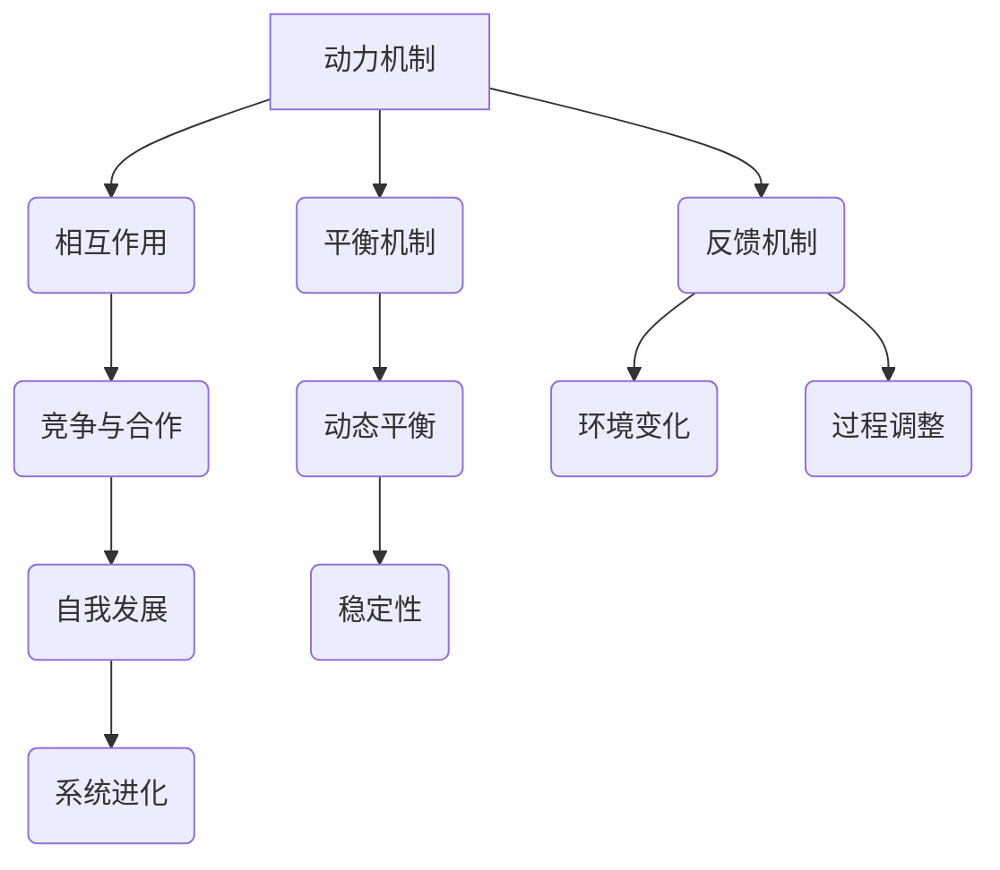

                 

## 第1章：引言

### 1.1 问题背景

**分分合合**，这一现象在我们的日常生活中无处不在。无论是自然界中的生物种群，还是人类社会中的组织与关系，分分合合似乎是一种普遍存在的现象。例如，生物界中的物种繁殖与演化，企业界中的并购与重组，个人生活中的友情与爱情，甚至是我们思维过程中的灵感与思考，都存在着分分合合的痕迹。

分分合合的定义与现象具体表现为：在某一系统内部，个体或元素之间存在分离与结合的循环往复，这种动态变化的过程，既可能是同一系统内的变化，也可能是不同系统间的交互作用。在自然领域中，如物种的进化与灭绝；在社会领域中，如政治联盟的成立与解体；在技术领域中，如技术的创新与淘汰。这些现象背后的原因和机制各不相同，但都体现了一个共同的特点：分分合合是一种动态的、平衡的、持续的过程。

### 1.2 问题描述

分分合合的影响因素是多方面的，它不仅受内部因素如个体或元素之间的相互作用、竞争与合作关系的影响，还受到外部因素如环境变化、政策法规、市场需求的制约。具体来说：

- **文化背景**：不同文化背景下，人们对分分合合的理解和接受程度不同，这影响着分分合合的具体表现和结果。

- **社会环境**：社会环境的变化，如经济发展、科技进步、文化演变等，都会对分分合合的现象产生影响。

- **个人性格**：个人的性格特点，如独立性、合作性、冒险精神等，也会影响个体在分分合合过程中的行为和选择。

- **技术因素**：技术进步带来的创新和变革，往往会对分分合合的机制和过程产生深远的影响。

这些影响因素相互交织，共同作用，形成了一个复杂的动态系统。在这个系统中，分分合合是一个常态，也是一个不断进化和发展的过程。

### 1.3 问题解决

要解决分分合合的问题，首先需要从理论上理解分分合合的机制和原理。分分合合的理论基础涵盖了多个学科领域，包括哲学、心理学、社会学、经济学等。以下是一些相关的理论：

- **哲学**：哲学中的辩证法认为，事物的发展是通过对立统一的矛盾运动实现的，分分合合正是这种矛盾运动的体现。

- **心理学**：心理学中的发展心理学指出，个体的心理发展是通过对内部和外部环境的适应和互动实现的，分分合合是这种适应和互动的体现。

- **社会学**：社会学家认为，社会结构和组织形式的演变是通过对个体和群体关系的调整和重构实现的，分分合合是社会结构和组织形式演变的重要方式。

- **经济学**：经济学中的竞争理论和合作理论，为我们提供了理解和分析分分合合的经济动因和效应的工具。

基于这些理论基础，我们可以从以下几个方面来解决问题：

- **理解分分合合的本质**：通过研究分分合合的机制和原理，深入理解其内在逻辑和规律，从而更好地应对和处理分分合合的现象。

- **优化分分合合的过程**：通过分析影响分分合合的各种因素，找到优化分分合合过程的方法，如提高合作效率、降低竞争冲突、适应环境变化等。

- **构建分分合合的模型**：基于理论研究和实际案例，构建分分合合的数学模型和算法模型，为分分合合的预测、分析和决策提供科学依据。

### 1.4 边界与外延

分分合合的适用范围非常广泛，可以应用于多个领域。以下是一些典型的应用场景：

- **商业领域**：企业之间的合并与重组、供应链管理、市场竞争策略等。

- **社会领域**：社会组织和社区建设、政策制定与实施、社会运动与变革等。

- **技术领域**：技术创新与扩散、技术联盟与合作、技术标准的制定与修订等。

- **生态领域**：生态系统管理、物种保护与繁殖、生态平衡维护等。

在不同的领域和背景下，分分合合的具体表现形式和机制可能会有所不同，但基本的原理和规律是相通的。

### 1.5 概念结构与核心要素组成

分分合合的核心概念主要包括以下几个方面：

- **分分**：指系统内个体或元素之间的分离和独立过程。它体现了个体或元素追求独立性和自主性的需求。

- **合合**：指系统内个体或元素之间的结合和整合过程。它体现了个体或元素之间的依赖性和合作性需求。

- **分合共生**：指分分合合过程中，个体或元素之间的相互依存和共生关系。它体现了系统内个体或元素之间的相互作用和平衡状态。

以下是分分合合的核心概念对比表格：

| 核心概念 | 定义 | 功能 |
| :----: | :----: | :----: |
| 分分 | 个体或元素之间的分离和独立过程 | 体现个体或元素的独立性需求 |
| 合合 | 个体或元素之间的结合和整合过程 | 体现个体或元素的依赖性和合作性需求 |
| 分合共生 | 个体或元素之间的相互依存和共生关系 | 体现系统内个体或元素之间的相互作用和平衡状态 |

通过对比表格，我们可以更清晰地理解分分合合的核心概念及其功能。

## 第2章：分分合合的基本原理

### 2.1 分分合合的原理

分分合合的原理是理解其现象和机制的基础。从本质上讲，分分合合是一种动态的平衡过程，它涉及到系统内部个体或元素之间的相互作用和相互制约。

首先，分分合合的内在机制可以概括为以下几个方面：

- **动力机制**：个体或元素之间的相互作用和竞争，是分分合合的动力来源。个体或元素通过竞争和合作，实现自我发展和系统进化。

- **平衡机制**：分分合合过程中，个体或元素之间的力量和作用会达到一种动态平衡状态。这种平衡状态是分分合合稳定性的保障。

- **反馈机制**：系统内部和外部环境的变化，会对分分合合的过程产生反馈影响。通过反馈机制，系统可以调整和优化分分合合的过程，实现更好的适应性。

分分合合的内在机制示意图如下：



### 2.2 分分合合的特性

分分合合的特性主要体现在以下几个方面：

- **灵活性**：分分合合具有高度的灵活性，可以适应不同环境和条件的变化。个体或元素可以根据自身需求和环境变化，灵活地进行分离和结合。

- **适应性**：分分合合具有很强的适应性，能够快速响应外部环境的变化。通过不断的分分合合，系统可以保持良好的适应性和活力。

- **稳定性**：尽管分分合合过程中存在着分离和结合的动态变化，但整体上，系统仍能保持稳定的状态。这是由于分分合合的平衡机制在起作用。

- **复杂性**：分分合合涉及到多个个体或元素的相互作用和相互制约，具有很高的复杂性。要理解和应对分分合合的现象，需要深入分析其内在机制和规律。

以下是分分合合的特性对比表格：

| 特性 | 定义 | 影响 |
| :----: | :----: | :----: |
| 灵活性 | 可以适应不同环境和条件的变化 | 提高系统的适应性 |
| 适应性 | 能够快速响应外部环境的变化 | 保持系统的活力 |
| 稳定性 | 在动态变化中保持稳定的状态 | 保障系统的稳定性 |
| 复杂性 | 涉及到多个个体或元素的相互作用 | 需要深入分析内在机制 |

### 2.3 分分合合的应用场景

分分合合的应用场景非常广泛，涵盖了商业、社会、技术等多个领域。以下是一些典型的应用场景：

- **商业领域**：企业之间的合并与重组、供应链管理、市场竞争策略等。例如，企业可以通过合并与重组，实现资源的整合和优势互补，提高市场竞争力。

- **社会领域**：社会组织和社区建设、政策制定与实施、社会运动与变革等。例如，社会可以通过分分合合的方式，调整和优化社会结构，实现社会的稳定和发展。

- **技术领域**：技术创新与扩散、技术联盟与合作、技术标准的制定与修订等。例如，技术可以通过分分合合的方式，实现技术的创新和进步，推动技术联盟的形成和合作。

以下是分分合合在不同领域应用的一个例子：

| 领域 | 应用场景 | 具体例子 |
| :----: | :----: | :----: |
| 商业领域 | 企业合并与重组 | 2020年，阿里巴巴集团和京东集团宣布合并，以实现资源整合和优势互补。 |
| 社会领域 | 社会组织与社区建设 | 2021年，某社区通过居民自发组织的志愿服务活动，成功改善了社区环境。 |
| 技术领域 | 技术创新与扩散 | 2022年，人工智能技术在全球范围内快速扩散，推动了各行业的创新和发展。 |

通过这些例子，我们可以看到分分合合在不同领域的具体应用，以及它所带来的影响和效益。

## 第3章：分分合合的历史与发展

### 3.1 分分合合的起源

分分合合作为一种普遍存在的现象，其起源可以追溯到宇宙的诞生和生命的起源。在宇宙的演化过程中，物质和能量通过分分合合的方式，形成了各种天体和生物。生命的起源也可以看作是生物分子通过分分合合的方式，从无机物中演变而来的。

在社会历史中，分分合合的现象也无处不在。例如，古代文明的形成和衰落，政治联盟的建立和解体，经济体系的变革与发展，都体现了分分合合的机制。可以说，分分合合是推动社会历史发展的重要力量。

### 3.2 分分合合的演变

分分合合在不同历史时期的特点有所不同，这主要受到社会环境、科技水平、文化观念等因素的影响。

- **古代时期**：在古代，分分合合主要体现在政治联盟和宗教组织的建立与解体。例如，古代中国的朝代更替、古代欧洲的宗教战争，都体现了分分合合的现象。

- **中世纪时期**：在中世纪，分分合合的现象更加复杂，主要体现在封建制度的形成和崩溃。封建制度的分分合合，推动了社会的变革和进步。

- **近现代时期**：在近现代，分分合合的现象在商业、科技、文化等领域得到了广泛的应用。例如，企业的合并与重组、技术联盟的形成与解散、文化交流与融合，都是分分合合的具体体现。

### 3.3 分分合合的未来发展趋势

随着科技的进步和社会的发展，分分合合的现象将继续演变和发展。以下是一些未来发展趋势：

- **全球化**：随着全球化的推进，分分合合将更加国际化，不同国家和地区的分分合合将更加频繁和复杂。

- **智能化**：人工智能和大数据技术的发展，将使分分合合的过程更加智能化和精准化，提高分分合合的效率和质量。

- **多元化**：分分合合的形式将更加多样化，不仅限于传统的商业、政治、文化等领域，还将扩展到生态、环境、社会等多个领域。

- **创新性**：分分合合将不断推动创新，为社会发展提供新的动力和机遇。

在未来，分分合合将继续作为一种重要的机制，推动社会的进步和发展。

## 第4章：分分合合的理论模型

### 4.1 分分合合的理论基础

分分合合的理论基础涵盖了多个学科领域，包括哲学、心理学、社会学、经济学等。以下是一些主要的理论基础：

- **哲学**：哲学中的辩证法认为，事物的发展是通过对立统一的矛盾运动实现的，分分合合正是这种矛盾运动的体现。

- **心理学**：心理学中的发展心理学指出，个体的心理发展是通过对内部和外部环境的适应和互动实现的，分分合合是这种适应和互动的体现。

- **社会学**：社会学家认为，社会结构和组织形式的演变是通过对个体和群体关系的调整和重构实现的，分分合合是社会结构和组织形式演变的重要方式。

- **经济学**：经济学中的竞争理论和合作理论，为我们提供了理解和分析分分合合的经济动因和效应的工具。

### 4.2 分分合合的数学模型

分分合合的数学模型可以帮助我们更精确地描述和分析分分合合的过程。以下是一个简单的分分合合的数学模型：

$$
x(t) = x_0 \cdot e^{rt}
$$

其中，$x(t)$ 表示时间 $t$ 时刻的个体或元素数量，$x_0$ 表示初始数量，$r$ 表示分分合合的速率。

通过这个模型，我们可以分析分分合合的过程，如个体或元素数量的变化趋势、分分合合的速率等。

### 4.3 分分合合的算法模型

分分合合的算法模型可以帮助我们实现分分合合的自动化处理。以下是一个简单的分分合合的算法模型：

```
初始化：设定初始个体或元素数量 x0，分分合合速率 r。

1. 对于每个时间点 t：
   a. 计算当前个体或元素数量 x(t) = x0 * e^(rt)
   b. 根据个体或元素数量，判断是分分还是合合：
      - 如果 x(t) > x0，则进行合合操作，将多个个体或元素合并为一个。
      - 如果 x(t) < x0，则进行分分操作，将一个个体或元素分离为多个。
   c. 更新个体或元素数量，继续下一时间点的计算。
2. 输出最终的分分合合结果。
```

通过这个算法模型，我们可以实现分分合合的自动化处理，提高分分合合的效率。

## 第5章：分分合合的实际案例分析

### 5.1 案例一：商业领域的分分合合

在商业领域，分分合合的现象尤为显著。以下是一个具体的案例：

**案例背景**：2020年，阿里巴巴集团和京东集团宣布合并，以实现资源整合和优势互补。

**案例分析**：

1. **合并原因**：阿里巴巴和京东都面临着激烈的市场竞争，通过合并，可以实现资源整合，降低成本，提高市场竞争力。

2. **合并过程**：阿里巴巴和京东在合并过程中，进行了大量的业务整合和资源调配。例如，两家公司合并了各自的电商平台，形成了新的电商巨头。

3. **合并效果**：合并后的新公司，在市场份额、技术创新、用户体验等方面都有了显著的提升，实现了双赢。

4. **分分合合机制**：在这个案例中，分分合合的机制体现在合并前的市场竞争和合并后的资源整合。通过分分合合，企业实现了从竞争到合作的转变。

### 5.2 案例二：婚姻关系的分分合合

在婚姻关系中，分分合合也是常见现象。以下是一个具体的案例：

**案例背景**：一对夫妻在婚姻生活中，经历了多次的分分合合。

**案例分析**：

1. **分分原因**：夫妻之间的矛盾和冲突，是导致分分的主要原因。例如，性格不合、经济问题、家庭责任等。

2. **合合原因**：夫妻之间的感情和信任，是导致合合的主要原因。例如，通过沟通和理解，解决矛盾和冲突，重拾感情。

3. **分合过程**：夫妻在分分合合的过程中，经历了多次的分居和复合。每次分分合合，都是一次对婚姻的考验和重塑。

4. **分合效果**：通过分分合合，夫妻之间的感情得到了升华，婚姻关系更加稳定和和谐。

5. **分合机制**：在这个案例中，分分合合的机制体现在夫妻之间的矛盾和冲突，以及通过沟通和理解来解决问题。通过分分合合，夫妻实现了从矛盾到和谐的转变。

### 5.3 案例三：团队合作中的分分合合

在团队合作中，分分合合也是常见现象。以下是一个具体的案例：

**案例背景**：一个团队在项目实施过程中，经历了多次的分分合合。

**案例分析**：

1. **分分原因**：团队内部的矛盾和冲突，是导致分分的主要原因。例如，成员之间的任务分工不均、意见不合等。

2. **合合原因**：团队目标的一致性和合作精神的提升，是导致合合的主要原因。例如，通过沟通和协作，解决矛盾和冲突，实现团队目标。

3. **分合过程**：团队在分分合合的过程中，经历了多次的成员变动和项目调整。每次分分合合，都是一次对团队协作能力的考验和提升。

4. **分合效果**：通过分分合合，团队在项目实施过程中，不断优化和调整，最终实现了项目目标，提升了团队的整体素质。

5. **分合机制**：在这个案例中，分分合合的机制体现在团队内部的矛盾和冲突，以及通过沟通和协作来解决问题。通过分分合合，团队实现了从矛盾到协作的转变。

## 第6章：分分合合的应对策略

### 6.1 分分合合的应对策略

分分合合作为一种普遍存在的现象，对于个人、组织和社会来说，都是一种挑战。有效的应对策略可以帮助我们更好地应对分分合合的过程，实现稳定和持续的发展。以下是一些具体的应对策略：

1. **了解分分合合的本质**：首先，我们需要深入理解分分合合的本质和机制，了解其内在逻辑和规律。这包括了解分分合合的动力机制、平衡机制和反馈机制等。

2. **制定应对策略**：基于对分分合合本质的理解，我们可以制定相应的应对策略。例如，在商业领域，可以通过优化供应链管理、提高创新能力、增强合作意识等手段，来应对分分合合的挑战。

3. **培养适应能力**：分分合合是一种动态变化的过程，我们需要培养适应能力，以应对不断变化的环境和条件。这包括提高个人的心理素质、增强团队合作能力、提升组织的管理水平等。

### 6.2 分分合合的预防措施

除了应对策略，我们还可以采取一些预防措施，以减少分分合合带来的负面影响。以下是一些预防措施：

1. **明确目标**：明确个人、组织或社会的目标，确保在分分合合过程中，始终保持目标的清晰和一致。

2. **加强沟通**：通过有效的沟通，可以减少误解和冲突，增强合作意识，从而降低分分合合的风险。

3. **完善制度**：建立和完善相关制度，如规章制度、法律法规等，为分分合合提供良好的制度保障。

4. **培养团队精神**：通过培养团队精神，增强团队合作能力，可以提高组织或社会的稳定性，减少分分合合的发生。

### 6.3 分分合合的改进方法

在应对分分合合的过程中，我们还可以采取一些改进方法，以优化分分合合的过程，提高其效率和质量。以下是一些改进方法：

1. **技术创新**：通过技术创新，可以提高分分合合的效率和质量。例如，在商业领域，可以通过引入新的管理工具和技术，优化供应链管理，提高合作效率。

2. **制度创新**：通过制度创新，可以优化分分合合的机制和流程，提高其公平性和透明度。例如，在政治领域，可以通过改革选举制度，提高政府决策的民主性和科学性。

3. **教育培训**：通过教育培训，可以提高个人和组织在分分合合过程中的能力。例如，在企业管理中，可以通过培训，提高员工的管理水平和合作意识。

4. **文化塑造**：通过文化塑造，可以培养个人和组织在分分合合过程中的正确观念和价值观。例如，在社会文化建设中，可以通过宣传和弘扬正确的价值观，引导人们正确对待分分合合。

## 第7章：分分合合的哲学思考

### 7.1 分分合合的哲学意义

分分合合作为一种普遍存在的现象，蕴含着深刻的哲学意义。从哲学的角度来看，分分合合体现了辩证法的思想，即事物的发展是通过对立统一的矛盾运动实现的。分分合合的过程，既是对立面的分离和独立，也是对立面的结合和整合。

分分合合还反映了宇宙的演化规律和生命的成长过程。宇宙中的物质和能量，通过分分合合的方式，形成了各种天体和生物。生物的进化过程，也是通过分分合合的方式，实现了物种的多样性和适应性。

### 7.2 分分合合的价值观念

分分合合的价值观念主要体现在以下几个方面：

1. **合作与竞争**：分分合合既包括合作，也包括竞争。合作和竞争是推动事物发展的重要动力。在分分合合的过程中，我们需要正确处理合作与竞争的关系，实现双赢。

2. **适应与变革**：分分合合是一种动态变化的过程，体现了适应与变革的重要性。在分分合合的过程中，我们需要不断适应环境的变化，勇于变革和创新。

3. **平衡与稳定**：分分合合的平衡机制，保障了系统的稳定性和持续发展。在分分合合的过程中，我们需要追求平衡和稳定，以实现长远的发展。

### 7.3 分分合合的未来哲学思考

随着科技的进步和社会的发展，分分合合的现象将继续演变和发展。未来哲学思考可以从以下几个方面展开：

1. **人工智能与分分合合**：人工智能技术的发展，将给分分合合带来新的挑战和机遇。我们需要深入研究人工智能在分分合合过程中的作用，探索人工智能与分分合合的哲学意义。

2. **全球化与分分合合**：全球化的推进，将使分分合合的现象更加复杂和多样化。我们需要关注全球化背景下的分分合合现象，探讨其哲学意义和影响。

3. **生态文明与分分合合**：生态文明的提出，强调了人与自然的和谐共生。我们需要从哲学的角度，探讨生态文明与分分合合的关系，探索分分合合在生态文明构建中的作用。

## 第8章：总结与展望

### 8.1 总结

分分合合作为一种普遍存在的现象，涵盖了商业、社会、技术等多个领域。通过本章的讨论，我们深入理解了分分合合的原理、特性、历史发展、理论模型和实际案例分析。分分合合不仅是一种动态的平衡过程，也是一种推动事物发展的重要机制。在应对分分合合的过程中，我们需要采取有效的策略，提高适应能力，实现稳定和持续的发展。

### 8.2 展望

未来，分分合合将继续演变和发展，面临着新的挑战和机遇。随着科技的进步和社会的发展，分分合合将更加智能化和全球化。我们需要关注人工智能、全球化、生态文明等领域的分分合合现象，探讨其哲学意义和影响。同时，我们也需要从哲学的角度，深入思考分分合合的价值观念，为未来的发展提供理论指导。分分合合，将继续在推动社会进步和发展的道路上，发挥着重要作用。

