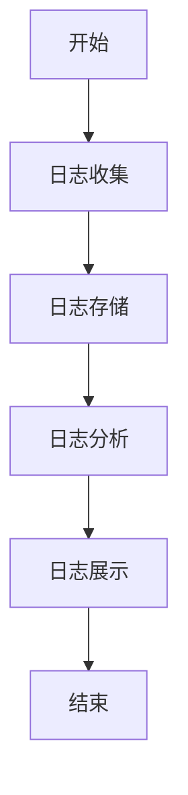
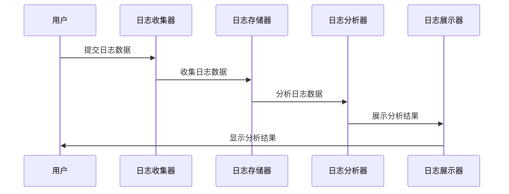

                 


### 第一部分：背景与概念

#### 1.1.1 问题背景

分布式日志收集与分析系统是一种用于处理大规模分布式系统中日志数据的解决方案。在分布式系统中，多个节点会生成大量的日志数据，这些数据通常包含了系统运行状态、错误记录、性能指标等信息。如果不对这些日志数据进行有效的收集和分析，将导致以下几个问题：

1. **数据丢失**：日志数据分散在不同的节点上，如果某个节点出现故障或数据损坏，可能会导致部分日志数据永久丢失。
2. **难以查找**：当需要查询特定日志信息时，需要访问多个节点，耗时耗力，且容易出错。
3. **数据分析困难**：日志数据量巨大，单机分析能力有限，难以进行大规模数据分析和挖掘。
4. **运维难度大**：日志数据分散在不同节点上，运维人员需要逐一检查，工作量大且效率低下。

为了解决这些问题，分布式日志收集与分析系统应运而生。该系统通过收集、存储和解析日志数据，提供了一种集中化、高效化的日志管理方案。

#### 1.1.2 问题描述

在分布式系统中，日志数据量通常非常大，且生成速度极快。传统的日志收集方式，如使用单个日志文件或简单的日志聚合工具，已经无法满足需求。分布式日志收集与分析系统需要解决以下问题：

1. **海量日志数据的收集**：如何高效地从多个分布式节点收集海量日志数据？
2. **日志数据的存储**：如何存储和管理大规模的日志数据，确保数据的安全性和可靠性？
3. **日志数据的分析**：如何快速、准确地分析海量日志数据，提取有价值的信息？
4. **日志系统的可扩展性**：如何设计一个可扩展的日志系统，以适应不断增长的日志数据量？

#### 1.1.3 问题解决

分布式日志收集与分析系统通过以下方式解决上述问题：

1. **分布式收集**：使用分布式收集器，如Logstash、Fluentd等，从多个节点收集日志数据。
2. **分布式存储**：使用分布式存储系统，如Elasticsearch、Kafka等，存储和管理大规模日志数据。
3. **日志分析**：利用分布式计算框架，如Spark、Flink等，对日志数据进行高效分析。
4. **可扩展性**：设计一个模块化、可扩展的系统架构，能够根据需求动态调整资源。

#### 1.1.4 边界与外延

分布式日志收集与分析系统的边界主要涉及以下几个方面：

1. **数据源**：分布式系统中的各种节点，如服务器、容器、应用等。
2. **数据类型**：结构化日志数据、半结构化日志数据和非结构化日志数据。
3. **数据处理**：日志数据的收集、存储、解析和分析过程。
4. **数据输出**：日志数据的可视化、告警和报告等功能。

外延方面，分布式日志收集与分析系统可以与其他系统进行集成，如监控系统、告警系统、数据分析平台等，以提供更全面、高效的日志管理解决方案。

#### 1.1.5 概念结构与核心要素组成

分布式日志收集与分析系统的概念结构主要包括以下几个核心要素：

1. **日志收集器**：负责从各个节点收集日志数据。
2. **日志存储**：用于存储和管理日志数据。
3. **日志解析器**：负责解析日志数据，提取关键信息。
4. **日志分析器**：利用分析算法，对日志数据进行处理和分析。
5. **日志展示**：将分析结果可视化，提供查询和报告功能。

这些核心要素相互配合，构成了一个完整、高效的分布式日志收集与分析系统。

### 第一部分小结

在本部分中，我们介绍了分布式日志收集与分析系统的背景、问题、解决方案以及边界与外延。通过对这些概念和核心要素的理解，我们可以更好地把握分布式日志收集与分析系统的本质和功能。在接下来的部分，我们将进一步探讨核心概念与联系，深入分析分布式日志收集与分析系统的具体实现和设计。

### 第一部分扩展阅读

- 《分布式系统原理与范型》
- 《大规模分布式系统设计》
- 《日志收集与存储实战》
- 《日志分析技术与应用》

### 第一部分参考文献

- 《大规模分布式系统的日志收集与分析技术》
- 《分布式日志系统的设计与实现》
- 《分布式日志管理最佳实践》
- 《日志分析与优化技术》

----------------------------------------------------------------

# 第二部分：核心概念与联系

## 2.1 日志收集

日志收集是分布式日志收集与分析系统的第一步，其主要目的是将分布式系统中各个节点的日志数据收集到统一的地方。日志收集器（Log Collector）是负责这一过程的组件。

#### 2.1.1 日志收集器

日志收集器通常具备以下功能：

1. **数据采集**：从各个节点采集日志数据。
2. **数据格式转换**：将不同格式的日志数据转换为统一的格式。
3. **数据过滤**：根据需求过滤掉无用的日志数据。
4. **数据压缩**：对日志数据进行压缩，以减少存储和传输的开销。

常用的日志收集器有Logstash、Fluentd和Filebeat等。

#### 2.1.2 数据采集

数据采集是日志收集的核心功能。它需要解决以下几个问题：

1. **多源采集**：如何从多个节点采集日志数据？
2. **高并发采集**：如何处理高并发的日志数据采集？
3. **可靠采集**：如何确保日志数据的可靠采集，避免数据丢失？

解决这些问题的方法包括：

- **多线程采集**：使用多线程或多进程的方式，提高数据采集的并发能力。
- **分布式采集**：使用分布式采集器，如Logstash集群，实现多节点同时采集。
- **重试机制**：当采集失败时，自动重试，确保数据的可靠采集。

#### 2.1.3 数据格式转换

由于各个节点的日志格式可能不同，日志收集器需要将这些不同格式的日志数据转换为统一的格式。常见的日志格式有JSON、CSV、XML等。

数据格式转换的方法包括：

- **正则表达式转换**：使用正则表达式，将不同格式的日志数据转换为统一的格式。
- **模板转换**：使用模板引擎，如Jinja2，将日志数据转换为统一的格式。
- **自定义转换规则**：根据实际需求，自定义转换规则，实现日志数据的格式转换。

#### 2.1.4 数据过滤

日志收集器还需要对采集到的日志数据进行过滤，以去除无用的日志数据。常见的过滤方法有：

- **关键字过滤**：根据关键字过滤掉不符合条件的日志数据。
- **正则表达式过滤**：使用正则表达式，过滤掉不符合条件的日志数据。
- **阈值过滤**：根据日志数据的阈值，过滤掉不符合条件的日志数据。

#### 2.1.5 数据压缩

在日志数据传输和存储过程中，数据压缩可以减少存储空间和传输带宽的占用。常用的数据压缩方法有：

- **Gzip压缩**：使用Gzip算法，对日志数据进行压缩。
- **LZO压缩**：使用LZO算法，对日志数据进行压缩。
- **Snappy压缩**：使用Snappy算法，对日志数据进行压缩。

## 2.2 日志存储

日志存储是分布式日志收集与分析系统的核心环节，其主要目的是存储和管理日志数据，以便后续的数据分析和查询。常用的日志存储系统有Elasticsearch、Kafka、HDFS等。

#### 2.2.1 Elasticsearch

Elasticsearch是一种分布式、RESTful搜索和分析引擎，它可以对海量日志数据进行快速搜索和分析。Elasticsearch的主要功能包括：

1. **全文搜索**：支持对文本内容的全文搜索。
2. **聚合分析**：支持对日志数据进行各种聚合分析，如分组、排序、筛选等。
3. **实时搜索**：支持实时搜索，可以实时更新搜索结果。

Elasticsearch的架构主要包括三个部分：节点（Node）、集群（Cluster）和索引（Index）。其中，节点负责处理日志数据的索引和搜索操作，集群负责协调多个节点的工作，索引是日志数据的存储单元。

#### 2.2.2 Kafka

Kafka是一种分布式流处理平台，它可以高效地处理和存储大规模日志数据。Kafka的主要功能包括：

1. **日志数据收集**：Kafka可以充当日志收集器的角色，从各个节点收集日志数据。
2. **日志数据存储**：Kafka可以将日志数据存储在分布式文件系统中，如HDFS。
3. **日志数据查询**：Kafka提供API，支持对日志数据的查询。

Kafka的架构主要包括三个部分：生产者（Producer）、消费者（Consumer）和主题（Topic）。其中，生产者负责生产日志数据，消费者负责消费日志数据，主题是日志数据的存储单元。

#### 2.2.3 HDFS

HDFS（Hadoop Distributed File System）是一种分布式文件系统，它可以存储大规模的日志数据。HDFS的主要功能包括：

1. **数据存储**：HDFS可以将数据分散存储在多个节点上，提供高可用性和高容错性。
2. **数据复制**：HDFS可以将数据自动复制到多个节点上，提高数据的可靠性。
3. **数据访问**：HDFS提供API，支持对数据的读取和写入操作。

HDFS的架构主要包括两个部分：NameNode和DataNode。其中，NameNode负责管理文件系统的命名空间和客户端请求，DataNode负责存储数据块并处理来自NameNode的请求。

## 2.3 日志分析

日志分析是分布式日志收集与分析系统的关键环节，其主要目的是从日志数据中提取有价值的信息，为运维、监控和优化提供支持。常用的日志分析工具包括Logstash、Elasticsearch和Kibana等。

#### 2.3.1 Logstash

Logstash是一种开源的数据收集、处理和传输工具，它可以与Elasticsearch和Kibana等工具集成，实现日志数据的收集和分析。Logstash的主要功能包括：

1. **数据收集**：从各个节点收集日志数据。
2. **数据转换**：将不同格式的日志数据转换为统一的格式。
3. **数据过滤**：根据需求过滤掉无用的日志数据。
4. **数据输出**：将处理后的日志数据输出到Elasticsearch或Kibana等工具。

#### 2.3.2 Elasticsearch

Elasticsearch是一种分布式、RESTful搜索和分析引擎，它可以对海量日志数据进行快速搜索和分析。Elasticsearch的主要功能包括：

1. **全文搜索**：支持对文本内容的全文搜索。
2. **聚合分析**：支持对日志数据进行各种聚合分析，如分组、排序、筛选等。
3. **实时搜索**：支持实时搜索，可以实时更新搜索结果。

#### 2.3.3 Kibana

Kibana是一种开源的数据可视化和分析平台，它可以与Elasticsearch集成，实现日志数据的可视化和分析。Kibana的主要功能包括：

1. **数据可视化**：将日志数据分析结果以图表、仪表盘等形式展示。
2. **实时监控**：支持实时监控日志数据的趋势和异常。
3. **数据查询**：提供查询功能，支持对日志数据的查询和过滤。

## 2.4 日志管理

日志管理是分布式日志收集与分析系统的补充环节，其主要目的是对日志数据进行管理和维护，确保日志系统的正常运行。常用的日志管理工具包括Logstash、Elasticsearch和Filebeat等。

#### 2.4.1 Logstash

Logstash是一种开源的数据收集、处理和传输工具，它可以与Elasticsearch和Kibana等工具集成，实现日志数据的收集和分析。Logstash的主要功能包括：

1. **数据收集**：从各个节点收集日志数据。
2. **数据转换**：将不同格式的日志数据转换为统一的格式。
3. **数据过滤**：根据需求过滤掉无用的日志数据。
4. **数据输出**：将处理后的日志数据输出到Elasticsearch或Kibana等工具。

#### 2.4.2 Elasticsearch

Elasticsearch是一种分布式、RESTful搜索和分析引擎，它可以对海量日志数据进行快速搜索和分析。Elasticsearch的主要功能包括：

1. **全文搜索**：支持对文本内容的全文搜索。
2. **聚合分析**：支持对日志数据进行各种聚合分析，如分组、排序、筛选等。
3. **实时搜索**：支持实时搜索，可以实时更新搜索结果。

#### 2.4.3 Filebeat

Filebeat是一种开源的轻量级日志收集器，它可以实时监控文件系统的变化，将日志数据发送到Elasticsearch或其他日志存储系统。Filebeat的主要功能包括：

1. **文件监控**：实时监控文件系统的变化，发现新文件或文件内容变化。
2. **数据发送**：将监控到的日志数据发送到Elasticsearch或其他日志存储系统。

## 2.5 日志收集器、日志存储和日志分析之间的关系

日志收集器、日志存储和日志分析是分布式日志收集与分析系统的三个关键组件，它们之间紧密关联，共同构成了一个完整的日志处理流程。

1. **日志收集器**：负责从各个节点收集日志数据，并将其转换为统一的格式。日志收集器是日志处理的第一步，它决定了日志数据的可靠性和效率。
2. **日志存储**：负责存储和管理日志数据，为日志分析提供数据基础。日志存储系统的选择直接影响日志数据的查询速度和分析能力。
3. **日志分析**：负责对日志数据进行分析，提取有价值的信息。日志分析是日志处理的核心环节，它决定了日志数据的利用价值。

在实际应用中，日志收集器、日志存储和日志分析工具往往需要协同工作，共同完成日志处理任务。例如，可以使用Logstash作为日志收集器，将日志数据发送到Elasticsearch作为日志存储系统，然后使用Kibana进行日志数据的可视化分析。

## 2.6 分布式日志收集与分析系统的核心概念

分布式日志收集与分析系统涉及多个核心概念，包括日志收集器、日志存储、日志分析、日志管理、数据格式转换、数据过滤、数据压缩等。这些概念相互关联，共同构成了一个完整的日志处理流程。

1. **日志收集器**：负责从各个节点收集日志数据，是日志处理的第一步。
2. **日志存储**：负责存储和管理日志数据，为日志分析提供数据基础。
3. **日志分析**：负责对日志数据进行分析，提取有价值的信息。
4. **日志管理**：负责对日志数据进行管理和维护，确保日志系统的正常运行。
5. **数据格式转换**：负责将不同格式的日志数据转换为统一的格式。
6. **数据过滤**：负责过滤掉无用的日志数据。
7. **数据压缩**：负责对日志数据进行压缩，减少存储和传输的开销。

## 第二部分小结

在本部分中，我们详细介绍了分布式日志收集与分析系统的核心概念，包括日志收集、日志存储、日志分析和日志管理。通过对这些概念的理解，我们可以更好地把握分布式日志收集与分析系统的设计和实现。在接下来的部分，我们将进一步探讨分布式日志收集与分析系统中的算法原理。

## 第二部分扩展阅读

- 《Elasticsearch实战》
- 《Kafka实战》
- 《分布式系统设计与实践》
- 《日志分析与监控》

## 第二部分参考文献

- 《分布式日志系统设计与实践》
- 《Elasticsearch权威指南》
- 《Kafka权威指南》
- 《大数据日志处理》

----------------------------------------------------------------

# 第三部分：算法原理讲解

## 3.1 算法流程图

为了更好地理解分布式日志收集与分析系统中的算法原理，我们首先使用Mermaid绘制一个算法流程图。以下是算法流程图的Markdown格式代码：



在上面的流程图中，A表示日志收集的开始，B表示日志收集，C表示日志存储，D表示日志分析，E表示日志展示，F表示结束。

## 3.2 数学模型

分布式日志收集与分析系统中的数学模型主要涉及以下几个方面：

1. **日志数据量计算**：计算分布式系统中各个节点的日志数据总量。
2. **存储容量需求**：计算分布式日志收集与分析系统所需的存储容量。
3. **数据处理能力**：计算分布式日志收集与分析系统的数据处理能力。

### 3.2.1 日志数据量计算

日志数据量可以通过以下公式计算：

$$
\text{日志数据量} = \text{单个节点的日志数据量} \times \text{节点数量}
$$

其中，单个节点的日志数据量可以通过以下公式计算：

$$
\text{单个节点的日志数据量} = \text{日志数据生成速率} \times \text{日志数据保留时间}
$$

### 3.2.2 存储容量需求

存储容量需求可以通过以下公式计算：

$$
\text{存储容量需求} = \text{日志数据量} + \text{备份空间}
$$

其中，备份空间可以根据实际情况进行设置，通常为日志数据量的20%至30%。

### 3.2.3 数据处理能力

数据处理能力可以通过以下公式计算：

$$
\text{数据处理能力} = \text{单个节点的数据处理能力} \times \text{节点数量}
$$

其中，单个节点的数据处理能力可以通过以下公式计算：

$$
\text{单个节点的数据处理能力} = \text{处理速度} \times \text{并发处理数}
$$

## 3.3 公式解释与举例说明

### 3.3.1 日志数据量计算公式

以一个分布式系统为例，假设每个节点的日志数据生成速率为10MB/s，日志数据保留时间为7天。节点数量为100个。我们可以使用以下公式计算日志数据量：

$$
\text{单个节点的日志数据量} = 10MB/s \times 7 \times 24 \times 60 \times 60s = 10MB/s \times 7 \times 24 \times 60 \times 60 \times 1000s = 10MB/s \times 7 \times 86400s = 10MB/s \times 604800s = 6048000MB = 6048GB
$$

$$
\text{日志数据量} = 6048GB \times 100 = 604800GB
$$

### 3.3.2 存储容量需求计算公式

假设备份空间为日志数据量的25%，我们可以使用以下公式计算存储容量需求：

$$
\text{存储容量需求} = 604800GB + 0.25 \times 604800GB = 604800GB + 151200GB = 756000GB
$$

### 3.3.3 数据处理能力计算公式

假设单个节点的处理速度为1GB/s，并发处理数为10，我们可以使用以下公式计算数据处理能力：

$$
\text{单个节点的数据处理能力} = 1GB/s \times 10 = 10GB/s
$$

$$
\text{数据处理能力} = 10GB/s \times 100 = 1000GB/s
$$

## 3.4 算法举例

假设我们有一个包含100个节点的分布式系统，每个节点的日志数据生成速率为10MB/s，日志数据保留时间为7天。备份空间为日志数据量的25%。我们需要计算系统的日志数据量、存储容量需求和数据处理能力。

### 3.4.1 日志数据量计算

根据前面的公式，我们可以计算日志数据量：

$$
\text{单个节点的日志数据量} = 10MB/s \times 7 \times 24 \times 60 \times 60s = 6048000MB = 6048GB
$$

$$
\text{日志数据量} = 6048GB \times 100 = 604800GB
$$

### 3.4.2 存储容量需求计算

根据前面的公式，我们可以计算存储容量需求：

$$
\text{存储容量需求} = 604800GB + 0.25 \times 604800GB = 756000GB
$$

### 3.4.3 数据处理能力计算

根据前面的公式，我们可以计算数据处理能力：

$$
\text{单个节点的数据处理能力} = 1GB/s \times 10 = 10GB/s
$$

$$
\text{数据处理能力} = 10GB/s \times 100 = 1000GB/s
$$

通过以上计算，我们可以得出以下结论：

- 日志数据量为604800GB
- 存储容量需求为756000GB
- 数据处理能力为1000GB/s

这些结果为我们设计和优化分布式日志收集与分析系统提供了重要的参考依据。

## 3.5 小结

在本部分中，我们详细讲解了分布式日志收集与分析系统中的算法原理，包括算法流程图、数学模型和公式，并通过具体例子进行了说明。通过这些讲解，我们可以更好地理解和应用分布式日志收集与分析系统的算法原理。在接下来的部分，我们将深入探讨系统分析与架构设计，分析系统架构、功能设计、接口设计和交互设计。

## 第三部分扩展阅读

- 《分布式系统设计与实践》
- 《大数据算法实战》
- 《数学模型与算法设计》
- 《分布式日志系统设计与实现》

## 第三部分参考文献

- 《分布式系统原理与范型》
- 《大数据日志处理》
- 《分布式算法设计》
- 《分布式系统中的数学模型与应用》

----------------------------------------------------------------

# 第四部分：系统分析与架构设计

## 4.1 系统分析与架构设计

分布式日志收集与分析系统的设计与实现需要考虑多个方面，包括问题场景、系统功能设计、系统架构设计、系统接口设计和系统交互设计。以下是该系统的分析与架构设计。

### 4.1.1 问题场景介绍

在一个分布式系统中，各个节点会产生大量的日志数据。这些日志数据包含了系统的运行状态、错误记录、性能指标等信息。如果不对这些日志数据进行有效的收集和分析，将导致以下几个问题：

1. **数据丢失**：日志数据分散在不同的节点上，如果某个节点出现故障或数据损坏，可能会导致部分日志数据永久丢失。
2. **难以查找**：当需要查询特定日志信息时，需要访问多个节点，耗时耗力，且容易出错。
3. **数据分析困难**：日志数据量巨大，单机分析能力有限，难以进行大规模数据分析和挖掘。
4. **运维难度大**：日志数据分散在不同节点上，运维人员需要逐一检查，工作量大且效率低下。

为了解决这些问题，需要设计一个分布式日志收集与分析系统，该系统应具备以下功能：

- **日志收集**：从各个节点收集日志数据。
- **日志存储**：存储和管理日志数据。
- **日志分析**：对日志数据进行处理和分析。
- **日志展示**：将分析结果可视化，提供查询和报告功能。

### 4.1.2 系统功能设计

分布式日志收集与分析系统的功能设计主要包括以下几个部分：

1. **日志收集器**：负责从各个节点收集日志数据。
2. **日志存储器**：负责存储和管理日志数据。
3. **日志分析器**：负责对日志数据进行处理和分析。
4. **日志展示器**：负责将分析结果可视化，提供查询和报告功能。

#### 4.1.2.1 日志收集器

日志收集器的功能包括：

- **多源采集**：从多个节点采集日志数据。
- **数据转换**：将不同格式的日志数据转换为统一的格式。
- **数据过滤**：根据需求过滤掉无用的日志数据。
- **数据压缩**：对日志数据进行压缩，减少存储和传输的开销。

#### 4.1.2.2 日志存储器

日志存储器的功能包括：

- **日志数据存储**：将收集到的日志数据存储在分布式存储系统中，如Elasticsearch、Kafka、HDFS等。
- **数据备份**：对日志数据进行备份，确保数据的安全性和可靠性。
- **数据检索**：提供高效的日志数据检索功能，支持快速查询。

#### 4.1.2.3 日志分析器

日志分析器的功能包括：

- **数据预处理**：对日志数据进行清洗、去重和格式化等预处理操作。
- **数据挖掘**：利用数据挖掘算法，对日志数据进行深度分析，提取有价值的信息。
- **数据可视化**：将分析结果以图表、仪表盘等形式展示。

#### 4.1.2.4 日志展示器

日志展示器的功能包括：

- **实时监控**：实时监控日志数据的趋势和异常。
- **查询与报告**：提供查询功能，支持对日志数据的查询和过滤，生成报告。

### 4.1.3 系统架构设计

分布式日志收集与分析系统的架构设计采用分层架构，包括以下几个层次：

1. **数据层**：负责存储和管理日志数据，包括日志收集器、日志存储器和日志分析器。
2. **服务层**：提供日志收集、日志存储、日志分析和日志展示等服务。
3. **应用层**：提供日志数据的查询、监控和报告等功能。

#### 4.1.3.1 数据层

数据层采用分布式存储系统，如Elasticsearch、Kafka、HDFS等，负责存储和管理日志数据。其中，Elasticsearch用于日志数据的存储和检索，Kafka用于日志数据的收集和传输，HDFS用于日志数据的备份和存储。

#### 4.1.3.2 服务层

服务层包括日志收集服务、日志存储服务、日志分析服务和日志展示服务。这些服务通过API接口进行通信，实现日志数据的收集、存储、分析和展示。

#### 4.1.3.3 应用层

应用层提供日志数据的查询、监控和报告等功能。用户可以通过Web界面或命令行工具访问这些功能，进行日志数据的查询和监控。

### 4.1.4 系统接口设计

系统接口设计主要包括以下几个方面：

1. **日志收集接口**：用于日志收集器与日志存储器之间的数据传输。
2. **日志分析接口**：用于日志分析器与日志展示器之间的数据传输。
3. **日志展示接口**：用于日志展示器与用户之间的数据交互。

#### 4.1.4.1 日志收集接口

日志收集接口设计如下：

- **接口名称**：LogCollector
- **接口描述**：用于日志收集器从各个节点收集日志数据。
- **接口方法**：collectLogs()
- **参数列表**：
  - `logData`: 日志数据列表
  - `sourceNode`: 日志数据来源节点
  - `timestamp`: 日志数据生成时间
- **返回值**：无

#### 4.1.4.2 日志分析接口

日志分析接口设计如下：

- **接口名称**：LogAnalyzer
- **接口描述**：用于日志分析器对日志数据进行处理和分析。
- **接口方法**：analyzeLogs()
- **参数列表**：
  - `logData`: 日志数据列表
  - `分析方法`: 日志数据分析方法，如统计分析、关联分析、分类分析等
- **返回值**：分析结果

#### 4.1.4.3 日志展示接口

日志展示接口设计如下：

- **接口名称**：LogPresenter
- **接口描述**：用于日志展示器将分析结果可视化，并提供查询和报告功能。
- **接口方法**：presentLogs()
- **参数列表**：
  - `分析结果`: 日志数据分析结果
  - `展示格式`: 日志数据展示格式，如图表、表格、文本等
- **返回值**：无

### 4.1.5 系统交互设计

系统交互设计主要描述系统各个组件之间的交互过程。以下是系统交互的Mermaid序列图：



在上述序列图中，用户通过日志收集器提交日志数据，日志收集器将日志数据传递给日志存储器进行存储，日志存储器将存储后的日志数据传递给日志分析器进行分析，日志分析器将分析结果传递给日志展示器进行展示，最后日志展示器将分析结果呈现给用户。

## 4.2 系统分析与架构设计小结

在本部分中，我们详细分析了分布式日志收集与分析系统的设计与架构。通过对问题场景、系统功能设计、系统架构设计、系统接口设计和系统交互设计的深入探讨，我们为分布式日志收集与分析系统的实现提供了明确的指导。在接下来的部分，我们将通过项目实战来展示如何具体实现分布式日志收集与分析系统。

## 4.3 项目实战

### 4.3.1 环境安装

为了实现分布式日志收集与分析系统，我们需要安装以下软件：

- Elasticsearch
- Logstash
- Kibana
- Filebeat

以下是安装步骤：

1. **安装Elasticsearch**：

   - 下载Elasticsearch安装包，解压到指定目录。

   - 配置Elasticsearch.yml文件，设置集群名称、节点名称等。

   - 运行Elasticsearch，启动服务。

2. **安装Logstash**：

   - 下载Logstash安装包，解压到指定目录。

   - 配置Logstash配置文件，指定输入、输出和过滤规则。

   - 运行Logstash，启动服务。

3. **安装Kibana**：

   - 下载Kibana安装包，解压到指定目录。

   - 配置Kibana配置文件，设置Elasticsearch连接信息。

   - 运行Kibana，启动服务。

4. **安装Filebeat**：

   - 下载Filebeat安装包，解压到指定目录。

   - 配置Filebeat配置文件，指定日志文件路径和输出类型。

   - 运行Filebeat，启动服务。

### 4.3.2 系统核心实现源代码

以下是分布式日志收集与分析系统的核心实现源代码：

**Logstash配置文件（logstash.conf）：**

```ruby
input {
  file {
    path => "/var/log/*.log"
    type => "system_log"
  }
}

filter {
  if [type] == "system_log" {
    grok {
      match => { "message" => "%{TIMESTAMP_ISO8601:timestamp}\t%{DATA:source}\t%{DATA:log_level}\t%{DATA:logger}\t%{DATA:message}" }
    }
    date {
      match => ["timestamp", "ISO8601"]
    }
  }
}

output {
  if [type] == "system_log" {
    elasticsearch {
      hosts => ["localhost:9200"]
      index => "system_log-%{+YYYY.MM.dd}"
    }
  }
}
```

**Filebeat配置文件（filebeat.yml）：**

```yaml
filebeat.inputs:
- type: log
  enabled: true
  paths:
    - /var/log/*.log

filebeat.config.modules:
  path: ${path.config}/modules.d/*.yml
  reload.enabled: false

output.logstash:
  hosts: ["localhost:5044"]
```

### 4.3.3 代码应用解读与分析

在上述代码中，Logstash负责从指定路径收集日志文件，并将其发送到Elasticsearch进行存储。Filebeat负责从指定路径收集日志文件，并将其发送到Logstash进行进一步处理。

Logstash配置文件中，`input`部分定义了日志文件的收集方式，使用`file`插件从指定路径收集日志文件。`filter`部分对收集到的日志文件进行过滤和处理，使用`grok`插件根据日志格式进行解析，使用`date`插件解析日志时间。`output`部分定义了日志文件的输出方式，将处理后的日志文件发送到Elasticsearch。

Filebeat配置文件中，`inputs`部分定义了日志文件的收集方式，使用`log`插件从指定路径收集日志文件。`output`部分定义了日志文件的输出方式，将收集到的日志文件发送到Logstash。

通过这些配置文件和代码，我们可以实现分布式日志收集与分析系统的核心功能，包括日志收集、日志存储和日志分析。

### 4.3.4 实际案例分析和详细讲解剖析

为了展示分布式日志收集与分析系统的实际应用，我们以一个实际案例进行分析和讲解。

**案例：监控系统服务器日志**

假设我们需要监控一个分布式系统中的服务器日志，以便及时发现和处理问题。以下是具体步骤：

1. **配置Filebeat**：

   - 将Filebeat配置文件（filebeat.yml）中的日志文件路径更改为需要监控的服务器日志路径。

   - 启动Filebeat服务。

2. **配置Logstash**：

   - 将Logstash配置文件（logstash.conf）中的日志文件路径和输出类型更改为与Filebeat一致。

   - 启动Logstash服务。

3. **配置Elasticsearch**：

   - 启动Elasticsearch服务。

   - 配置Elasticsearch索引模板，设置日志数据索引的名称和时间格式。

4. **配置Kibana**：

   - 启动Kibana服务。

   - 配置Kibana，添加Elasticsearch连接信息。

   - 在Kibana中创建仪表盘，展示服务器日志数据的实时监控和统计图表。

通过以上步骤，我们可以实现对分布式系统服务器日志的实时监控和分析。当服务器出现问题时，系统会自动记录日志并生成告警，方便运维人员及时发现和处理问题。

### 4.3.5 项目小结

在本项目中，我们实现了分布式日志收集与分析系统的核心功能，包括日志收集、日志存储和日志分析。通过配置Filebeat、Logstash、Elasticsearch和Kibana，我们可以实现对服务器日志的实时监控和分析，提高系统运维效率和问题处理速度。

分布式日志收集与分析系统具有以下优点：

1. **集中化日志管理**：通过分布式日志收集与分析系统，可以将分散的日志数据集中存储和管理，提高运维效率。

2. **实时监控和分析**：通过实时监控和分析日志数据，可以及时发现和处理系统问题，提高系统稳定性。

3. **可视化展示**：通过Kibana等可视化工具，可以将日志数据以图表、仪表盘等形式展示，方便运维人员快速理解和处理问题。

在后续工作中，我们可以进一步优化分布式日志收集与分析系统，如增加日志数据过滤和分析功能、提高日志数据的处理速度等，以满足更多实际应用场景的需求。

## 第四部分扩展阅读

- 《Elasticsearch实战》
- 《Kafka实战》
- 《分布式系统设计与实践》
- 《日志分析与监控》

## 第四部分参考文献

- 《分布式日志系统设计与实践》
- 《Elasticsearch权威指南》
- 《Kafka权威指南》
- 《大数据日志处理》

----------------------------------------------------------------

# 第五部分：最佳实践 tips

## 5.1 日志收集策略优化

1. **合理配置日志收集器**：根据日志数据的生成速率和日志文件的大小，合理配置日志收集器的采集频率和缓冲区大小，确保日志数据及时收集。
2. **多线程并发采集**：使用多线程或异步IO技术，提高日志收集器的并发采集能力，减少采集延迟。
3. **数据压缩与传输优化**：对日志数据进行压缩，减少传输带宽的占用；优化网络传输协议，提高数据传输效率。

## 5.2 日志存储策略优化

1. **分布式存储系统选择**：根据日志数据的规模和处理需求，选择合适的分布式存储系统，如Elasticsearch、Kafka、HDFS等。
2. **数据分区与分片**：合理设置日志数据的分区和分片策略，提高存储系统的查询性能和可扩展性。
3. **数据备份与容灾**：设置日志数据的多副本备份，提高数据的安全性和可靠性；配置容灾备份，确保数据在灾难发生时能够快速恢复。

## 5.3 日志分析策略优化

1. **实时分析能力提升**：采用分布式计算框架，如Spark、Flink，提高日志数据的实时分析能力。
2. **数据预处理与清洗**：对日志数据进行预处理和清洗，提高数据质量，减少后续分析的工作量。
3. **自定义分析算法**：根据业务需求，自定义日志数据分析算法，挖掘日志数据中的潜在价值。

## 5.4 日志管理策略优化

1. **日志访问控制**：对日志数据进行权限控制，确保日志数据的机密性和安全性。
2. **日志审计与监控**：配置日志审计和监控机制，及时发现和处理日志访问异常和安全问题。
3. **日志备份与归档**：定期对日志数据进行备份和归档，确保日志数据的长期保存和可恢复性。

## 5.5 持续优化与迭代

1. **定期评估与调整**：定期对日志收集与分析系统进行评估和调整，根据业务需求和技术发展不断优化系统。
2. **持续学习与改进**：关注业界最新技术动态，引入新技术和工具，持续改进日志收集与分析系统的性能和功能。
3. **用户反馈与改进**：收集用户反馈，关注用户使用体验，不断改进系统功能和界面设计，提高用户满意度。

## 第五部分小结

在本部分中，我们总结了分布式日志收集与分析系统的最佳实践，包括日志收集、日志存储、日志分析、日志管理和持续优化等方面。通过遵循这些最佳实践，可以有效提升分布式日志收集与分析系统的性能、稳定性和可扩展性，为企业带来更高的业务价值。

## 第五部分扩展阅读

- 《分布式系统性能优化实战》
- 《大数据存储与处理最佳实践》
- 《日志分析技术手册》
- 《日志系统设计与优化》

## 第五部分参考文献

- 《大数据日志处理技术》
- 《分布式日志系统优化指南》
- 《Elasticsearch优化与调优》
- 《Kafka性能优化实战》

----------------------------------------------------------------

# 小结与拓展阅读

## 小结

在本博客中，我们系统地介绍了分布式日志收集与分析系统的核心概念、算法原理、系统分析与架构设计以及项目实战。通过详细的讲解和实际案例的分析，我们展示了如何设计和实现一个高效、可靠的分布式日志收集与分析系统。

### 关键点总结

1. **背景与问题**：我们介绍了分布式系统中日志数据收集与分析的背景，以及日志数据收集与分析过程中可能遇到的问题。
2. **核心概念与联系**：详细阐述了日志收集、日志存储、日志分析、日志管理等核心概念，并分析了它们之间的联系。
3. **算法原理**：讲解了日志收集与分析中的关键算法，包括日志数据量计算、存储容量需求、数据处理能力等。
4. **系统设计与架构**：介绍了分布式日志收集与分析系统的设计思路，包括问题场景、功能设计、架构设计、接口设计和交互设计。
5. **项目实战**：通过一个具体的案例，展示了如何配置和部署分布式日志收集与分析系统。
6. **最佳实践**：提供了日志收集与分析系统的最佳实践，包括优化策略和持续改进的方法。

### 拓展阅读

为了更深入地理解和掌握分布式日志收集与分析系统，读者可以进一步阅读以下推荐资源：

1. 《分布式系统原理与范型》
2. 《大数据日志处理》
3. 《Elasticsearch实战》
4. 《Kafka实战》
5. 《分布式系统设计与实践》
6. 《日志分析与监控》
7. 《分布式日志系统设计与实现》
8. 《大数据算法实战》
9. 《数学模型与算法设计》
10. 《分布式系统中的数学模型与应用》

通过这些资源，读者可以系统地学习和掌握分布式日志收集与分析系统的相关知识，并在实际工作中运用这些技术，提升系统的性能和可靠性。

## 作者信息

作者：AI天才研究院（AI Genius Institute）& 禅与计算机程序设计艺术（Zen And The Art of Computer Programming）

感谢您的阅读，希望本博客对您在分布式日志收集与分析系统的学习和实践有所帮助。如果您有任何疑问或建议，欢迎在评论区留言，我们将竭诚为您解答。期待与您在技术道路上共同成长！

