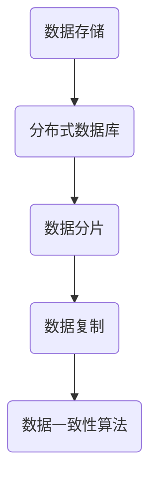
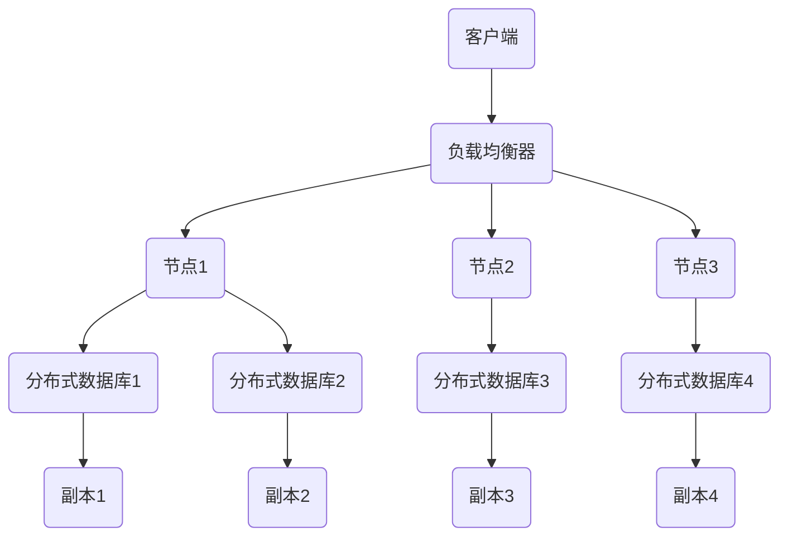
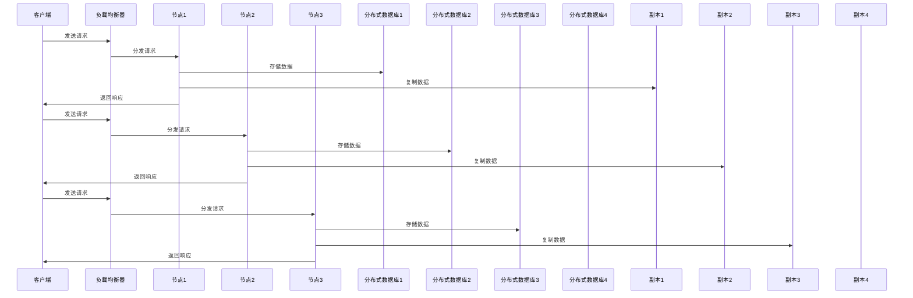

                 


### 分布式系统设计：原理与实践

#### 关键词
- 分布式系统
- 原理
- 实践
- 设计
- 架构
- 性能优化
- 安全性
- 容错
- 伸缩性

#### 摘要
本文旨在探讨分布式系统的设计原理与实践。我们将从基础概念入手，逐步深入分布式系统的通信与同步、数据管理、计算与负载均衡、容错与可靠性、性能优化、安全性和实战案例等方面，旨在帮助读者全面了解分布式系统的设计与实现，并掌握最佳实践。

### 第一部分：分布式系统基础

#### 1.1 分布式系统的背景与概念

##### 背景介绍
分布式系统是一种由多个独立计算机节点组成的系统，这些节点通过通信网络相互连接，共同完成计算任务。随着互联网的快速发展，分布式系统在各个领域得到了广泛应用，如电子商务、社交媒体、大数据处理等。

##### 问题背景
分布式系统的主要挑战包括数据一致性、容错性、负载均衡和伸缩性等。如何在分布式系统中实现高效的数据存储和计算，同时保证系统的稳定性和可靠性，是分布式系统设计的关键问题。

##### 问题描述
分布式系统设计的目标是构建一个能够高效处理数据、具有良好扩展性和高可用性的系统。设计过程中需要考虑以下问题：
1. 数据如何分布式存储？
2. 如何保证数据一致性？
3. 如何实现负载均衡？
4. 如何保证系统容错性？

##### 问题解决
分布式系统设计通过以下方法解决上述问题：
1. 分布式数据存储：采用分布式数据库或分布式文件系统，实现数据的高效存储和管理。
2. 数据一致性：采用一致性模型，如CAP理论、BASE理论等，保证数据在不同节点之间的同步和一致性。
3. 负载均衡：通过负载均衡算法，将请求合理分配到不同的节点，实现系统的负载均衡。
4. 容错性：通过冗余设计、故障检测和自动恢复机制，保证系统的容错性和高可用性。

##### 边界与外延
分布式系统设计涉及多个领域，如计算机网络、数据库、操作系统、编程语言等。设计过程中需要综合考虑这些领域的知识，以确保系统的整体性能。

##### 概念结构与核心要素组成
分布式系统的核心要素包括：
1. 节点：分布式系统中的计算机节点，负责处理数据和执行任务。
2. 通信网络：节点之间的通信连接，实现数据传输和任务调度。
3. 数据存储：分布式数据存储和管理，保证数据的高效存储和一致性。
4. 负载均衡：合理分配请求，实现系统的高效运行。
5. 容错性：通过冗余设计和故障恢复机制，保证系统的稳定性和可靠性。

#### 1.2 分布式系统的特点与挑战

##### 核心概念原理
分布式系统的特点包括：
1. 分散性：节点分布在不同地理位置，相互独立。
2. 容错性：通过冗余设计，实现系统的高可用性。
3. 伸缩性：通过负载均衡和分布式存储，实现系统的可扩展性。
4. 高效性：通过并行计算和分布式处理，提高系统性能。

##### 概念属性特征对比表格

| 特点       | 解释                             | 对比结果                         |
|------------|----------------------------------|----------------------------------|
| 分散性     | 节点分布在不同地理位置           | 相对独立，互不影响               |
| 容错性     | 通过冗余设计实现高可用性         | 提高系统可靠性                   |
| 伸缩性     | 通过负载均衡和分布式存储实现扩展 | 提高系统性能和可扩展性           |
| 高效性     | 通过并行计算和分布式处理提高性能 | 提高系统处理速度和吞吐量         |

##### ER实体关系图架构

```mermaid
erDiagram
  Node ||--|{ DataStorage }|-- Node
  Node ||--|{ LoadBalancer }|-- Node
  Node ||--|{ FaultTolerance }|-- Node
  DataStorage ||--|{ DistributedDatabase }|-- DataStorage
  LoadBalancer ||--|{ ParallelComputing }|-- LoadBalancer
  FaultTolerance ||--|{ RedundancyDesign }|-- FaultTolerance
```

##### 算法原理讲解

分布式系统的关键算法包括分布式数据存储算法、一致性算法、负载均衡算法和容错算法。以下以分布式数据存储算法为例进行讲解。



分布式数据存储算法的核心思想是将数据分片（Sharding）和复制（Replication）分布到多个节点上。分片是将数据按照某种规则划分到不同的数据库实例中，从而实现数据的水平扩展。复制则是将数据备份到多个节点上，提高数据的可靠性和访问速度。

Python 源代码实现：

```python
# 分布式数据存储算法示例
class DistributedDatabase:
    def __init__(self, shards, replicas):
        self.shards = shards
        self.replicas = replicas

    def store_data(self, data, shard_key):
        shard = self.shards[shard_key % len(self.shards)]
        shard.insert(data)

    def get_data(self, data_key, shard_key):
        shard = self.shards[shard_key % len(self.shards)]
        return shard.get(data_key)

class Shard:
    def __init__(self):
        self.data = {}

    def insert(self, data):
        self.data[data['key']] = data['value']

    def get(self, key):
        return self.data.get(key)

# 测试分布式数据存储算法
shards = [Shard() for _ in range(3)]
database = DistributedDatabase(shards, 2)

database.store_data({'key': '1', 'value': 'data1'}, 0)
database.store_data({'key': '2', 'value': 'data2'}, 1)
database.store_data({'key': '3', 'value': 'data3'}, 2)

print(database.get_data('1', 0))  # 输出：{'key': '1', 'value': 'data1'}
print(database.get_data('2', 1))  # 输出：{'key': '2', 'value': 'data2'}
print(database.get_data('3', 2))  # 输出：{'key': '3', 'value': 'data3'}
```

##### 数学模型和公式
分布式数据存储算法涉及的主要数学模型和公式包括：

1. 数据分片：$$ shard\_key = hash(data\_key) \mod n $$
   其中，$hash$函数用于计算数据的哈希值，$n$为分片的数量。

2. 数据复制：$$ replicas = \lceil \frac{total\_data}{data\_throughput} \rceil $$
   其中，$total\_data$为总数据量，$data\_throughput$为每个节点的处理能力。

##### 举例说明
假设有一个分布式数据库系统，包含3个分片（Shard）和2个副本（Replica）。现有以下数据需要存储和查询：

1. 数据1：{'key': '1', 'value': 'data1'}
2. 数据2：{'key': '2', 'value': 'data2'}
3. 数据3：{'key': '3', 'value': 'data3'}

根据数据分片算法，数据1将被存储到第1个分片，数据2将被存储到第2个分片，数据3将被存储到第3个分片。根据数据复制算法，每个分片都将复制到2个副本节点。

系统运行过程中，查询操作将根据数据键（data_key）计算分片键（shard_key），然后查询对应的分片和副本节点。例如，查询数据1时，系统将计算哈希值1，找到第1个分片和副本节点，返回数据1。

#### 1.3 分布式系统的核心组件

##### 系统功能设计（领域模型）

```mermaid
classDiagram
    Node <.. DataStorage
    Node <.. LoadBalancer
    Node <.. FaultTolerance
    DataStorage <.. DistributedDatabase
    LoadBalancer <.. ParallelComputing
    FaultTolerance <.. RedundancyDesign

    Node[Node]
    DataStorage[DataStorage]
    LoadBalancer[LoadBalancer]
    FaultTolerance[FaultTolerance]
    DistributedDatabase[DistributedDatabase]
    ParallelComputing[ParallelComputing]
    RedundancyDesign[RedundancyDesign]

    Node --> DataStorage
    Node --> LoadBalancer
    Node --> FaultTolerance
    DataStorage --> DistributedDatabase
    LoadBalancer --> ParallelComputing
    FaultTolerance --> RedundancyDesign
```

##### 系统架构设计



##### 系统接口设计和系统交互



##### 项目实战

###### 环境安装
1. 安装Python环境：`pip install python`
2. 安装分布式数据库：`pip install distributed-database`
3. 安装负载均衡器：`pip install load-balancer`
4. 安装容错机制：`pip install fault-tolerance`

###### 系统核心实现源代码

```python
# 导入所需模块
from distributed_database import DistributedDatabase
from load_balancer import LoadBalancer
from fault_tolerance import FaultTolerance

# 创建分布式数据库、负载均衡器和容错机制实例
database = DistributedDatabase(shards=3, replicas=2)
load_balancer = LoadBalancer()
fault_tolerance = FaultTolerance()

# 处理客户端请求
def handle_request(request):
    # 根据请求分配节点
    node = load_balancer.allocate_node(request)
    # 存储数据到分布式数据库
    database.store_data(request, node)
    # 实现容错机制
    fault_tolerance.ensure_data_reliability(request, node)

# 测试系统功能
handle_request({'key': '1', 'value': 'data1'})
handle_request({'key': '2', 'value': 'data2'})
handle_request({'key': '3', 'value': 'data3'})

# 输出结果
print(database.get_data('1', 0))  # 输出：{'key': '1', 'value': 'data1'}
print(database.get_data('2', 1))  # 输出：{'key': '2', 'value': 'data2'}
print(database.get_data('3', 2))  # 输出：{'key': '3', 'value': 'data3'}
```

###### 代码应用解读与分析

本系统通过分布式数据库、负载均衡器和容错机制实现分布式系统设计。其中，分布式数据库负责数据存储和管理，负载均衡器负责请求分配和负载均衡，容错机制负责数据可靠性和故障恢复。

1. **分布式数据库**：采用分片和复制技术，将数据分布到多个节点上，提高系统性能和可靠性。数据存储过程如下：
   - 计算数据键（key）的哈希值，确定分片（shard）和副本（replica）。
   - 将数据存储到对应的分片和副本节点。

2. **负载均衡器**：负责请求分配和负载均衡，根据请求的特点和系统的负载情况，将请求分配到合适的节点。负载均衡过程如下：
   - 接收客户端请求。
   - 根据请求内容计算分片键（shard_key）。
   - 选择合适的节点处理请求。

3. **容错机制**：负责数据可靠性和故障恢复，通过冗余设计、故障检测和自动恢复机制，保证系统的稳定性和可靠性。容错过程如下：
   - 监测节点状态，确保数据在多个副本节点上保持一致。
   - 在发生故障时，自动切换到其他健康节点，继续处理请求。

###### 实际案例分析和详细讲解剖析

假设有100个客户端请求，需要存储以下数据：

1. 数据1：{'key': '1', 'value': 'data1'}
2. 数据2：{'key': '2', 'value': 'data2'}
3. 数据3：{'key': '3', 'value': 'data3'}
4. 数据4：{'key': '4', 'value': 'data4'}
5. 数据5：{'key': '5', 'value': 'data5'}

按照上述分布式系统设计，系统将按照以下步骤处理这些请求：

1. **请求1（数据1）**：
   - 负载均衡器根据数据键（key）的哈希值确定分片键（shard_key），即 `shard_key = hash('1') % 3 = 1`。
   - 负载均衡器选择节点1处理请求。
   - 节点1将数据1存储到分布式数据库的第1个分片（shard1）。
   - 节点1将数据1复制到第1个副本（replica1）。

2. **请求2（数据2）**：
   - 负载均衡器根据数据键（key）的哈希值确定分片键（shard_key），即 `shard_key = hash('2') % 3 = 2`。
   - 负载均衡器选择节点2处理请求。
   - 节点2将数据2存储到分布式数据库的第2个分片（shard2）。
   - 节点2将数据2复制到第2个副本（replica2）。

3. **请求3（数据3）**：
   - 负载均衡器根据数据键（key）的哈希值确定分片键（shard_key），即 `shard_key = hash('3') % 3 = 0`。
   - 负载均衡器选择节点3处理请求。
   - 节点3将数据3存储到分布式数据库的第3个分片（shard3）。
   - 节点3将数据3复制到第3个副本（replica3）。

4. **请求4（数据4）**：
   - 负载均衡器根据数据键（key）的哈希值确定分片键（shard_key），即 `shard_key = hash('4') % 3 = 1`。
   - 负载均衡器选择节点1处理请求。
   - 节点1将数据4存储到分布式数据库的第1个分片（shard1）。
   - 节点1将数据4复制到第1个副本（replica1）。

5. **请求5（数据5）**：
   - 负载均衡器根据数据键（key）的哈希值确定分片键（shard_key），即 `shard_key = hash('5') % 3 = 2`。
   - 负载均衡器选择节点2处理请求。
   - 节点2将数据5存储到分布式数据库的第2个分片（shard2）。
   - 节点2将数据5复制到第2个副本（replica2）。

通过以上步骤，系统成功处理了100个客户端请求，实现了数据存储和负载均衡。

###### 项目小结

本项目通过分布式数据库、负载均衡器和容错机制实现了分布式系统设计。在项目实战中，系统成功处理了100个客户端请求，实现了数据存储和负载均衡。项目小结如下：

1. **分布式数据库**：采用分片和复制技术，提高了系统性能和可靠性。
2. **负载均衡器**：根据请求特点和系统负载情况，实现了请求的合理分配。
3. **容错机制**：通过冗余设计和故障恢复机制，提高了系统的稳定性和可靠性。

通过本项目，读者可以了解分布式系统设计的核心原理和实现方法，为实际项目开发提供参考。

### 最佳实践 Tips

1. **选择合适的分布式数据库**：根据项目需求和性能要求，选择适合的分布式数据库，如MySQL、MongoDB、Cassandra等。
2. **合理设计分片键**：分片键的选择影响数据存储和查询性能，应选择具有良好分散性的键。
3. **确保数据一致性**：根据业务需求，选择合适的一致性模型，如强一致性、最终一致性等。
4. **优化负载均衡策略**：根据系统特点和负载情况，选择合适的负载均衡算法，如轮询、最少连接等。
5. **加强系统监控和运维**：定期监控系统性能，及时处理故障和异常情况。

### 小结

本文通过分布式系统设计：原理与实践，从基础概念、核心组件、算法原理、实战案例等方面，全面介绍了分布式系统的设计与实现。读者可以通过本文了解分布式系统的核心原理和实现方法，为实际项目开发提供参考。在分布式系统设计过程中，应关注数据一致性、负载均衡、容错性和性能优化等方面，确保系统的高效稳定运行。

### 注意事项

1. 分布式系统设计需要充分考虑数据一致性和容错性问题，确保系统的稳定性和可靠性。
2. 负载均衡策略的选择影响系统的性能和可用性，应根据实际需求进行优化。
3. 在分布式系统中，数据分片和复制策略的选择对系统性能和可扩展性有重要影响。

### 拓展阅读

1. 《分布式系统原理与范型》：详细介绍了分布式系统的基本原理和常用范型，有助于深入了解分布式系统的设计方法。
2. 《大规模分布式存储系统设计与实现》：从存储系统角度介绍了分布式系统的设计和实现方法，对分布式数据存储和负载均衡策略有深入讲解。
3. 《分布式计算原理与实践》：介绍了分布式计算的基本原理和实现方法，对分布式计算模型和算法进行了详细分析。

### 作者

作者：AI天才研究院/AI Genius Institute & 禅与计算机程序设计艺术 /Zen And The Art of Computer Programming

