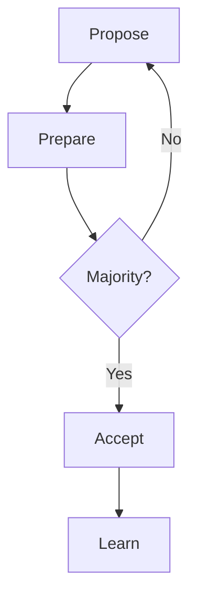
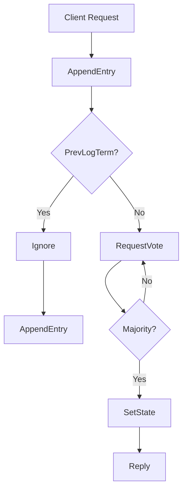
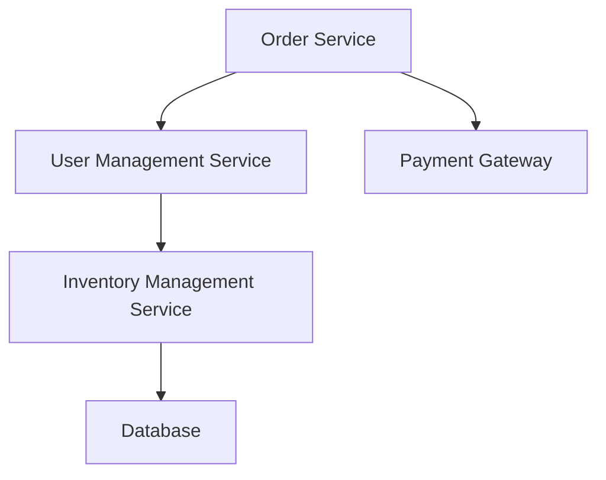
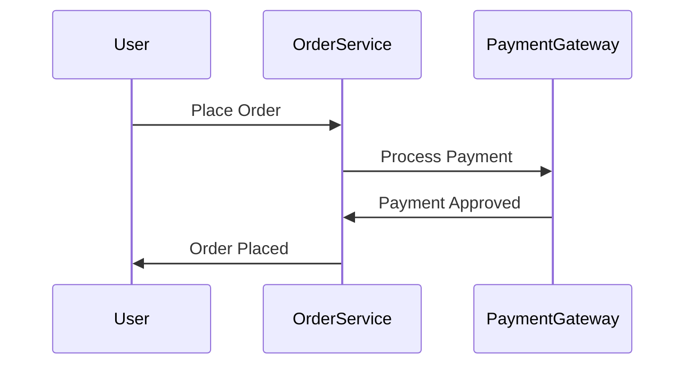

                 

### 分布式系统设计：解决分布式环境下的挑战

> 关键词：分布式系统、架构设计、一致性、算法、实践、最佳实践

> 摘要：本文深入探讨分布式系统设计的核心要素，包括背景介绍、核心概念解析、算法原理讲解、系统分析与架构设计、项目实战以及最佳实践技巧。通过逐步分析推理，本文旨在为读者提供全面而深刻的分布式系统设计指导，帮助解决分布式环境下的各种挑战。

## 目录大纲

### 第一部分：背景介绍

#### 第1章：分布式系统设计概述

#### 第2章：分布式系统核心概念

#### 第3章：分布式系统算法原理

#### 第4章：分布式系统数学模型

### 第二部分：系统分析与架构设计

#### 第5章：分布式系统分析

#### 第6章：分布式系统接口设计

### 第三部分：项目实战

#### 第7章：分布式系统项目实践

### 第四部分：最佳实践与拓展

#### 第8章：分布式系统最佳实践

## 第一部分：背景介绍

### 第1章：分布式系统设计概述

#### 1.1 分布式系统的问题背景

随着互联网和云计算的迅猛发展，分布式系统成为了现代计算环境中的核心组成部分。分布式系统通过将任务分布在多个节点上，实现了高可用性、可扩展性和高性能。然而，分布式系统也面临着一系列的挑战，如数据一致性、容错性、负载均衡等。

#### 1.2 问题解决

分布式系统设计的目标是解决这些问题，确保系统在分布式环境下能够稳定、高效地运行。为了实现这一目标，需要采用一系列方法和技术，如一致性算法、分布式锁、负载均衡策略等。

#### 1.3 边界与外延

分布式系统设计的边界涉及系统的规模、网络环境、硬件资源等方面。同时，其外延还包括系统的高可用性、性能优化、安全防护等。

#### 1.4 概念结构与核心要素组成

分布式系统设计涉及多个核心概念，包括分布式计算、分布式存储、分布式通信等。这些概念相互关联，共同构成了分布式系统的整体架构。

### 第2章：分布式系统核心概念

#### 2.1 核心概念介绍

分布式系统是一种计算模型，其中多个独立的计算机通过网络互联，协同工作以完成计算任务。分布式计算和分布式存储是分布式系统的核心组成部分。

#### 2.2 概念属性特征对比表格

| 特征        | 分布式系统           | 集中式系统           |
| ----------- | ------------------ | ------------------ |
| 可扩展性    | 高                 | 低                 |
| 高可用性    | 高                 | 低                 |
| 数据一致性  | 难以保证           | 易于保证           |
| 负载均衡    | 强制性             | 非强制性           |

#### 2.3 ER实体关系图架构

```mermaid
erDiagram
  Node1 ||--|||> DataStore1 : stores data
  Node1 ||--||> DataStore2 : stores data
  Node2 ||--|||> DataStore1 : stores data
  Node2 ||--||> DataStore2 : stores data
```

### 第3章：分布式系统算法原理

#### 3.1 算法原理概述

分布式系统算法主要关注一致性、容错性和负载均衡等方面。一致性算法如Paxos和Raft用于保证分布式系统中数据的一致性，分布式锁用于同步多节点的操作。

#### 3.2 算法流程图

Paxos算法流程图：



Raft算法流程图：



#### 3.3 Python源代码实现

Paxos算法Python代码实现：

```python
# Paxos算法Python代码实现示例
```

Raft算法Python代码实现：

```python
# Raft算法Python代码实现示例
```

### 第4章：分布式系统数学模型

#### 4.1 数学模型基础

一致性模型如CAP理论和BASE理论是分布式系统设计中的核心数学模型。

#### 4.2 数学公式讲解

CAP理论数学模型：

$$
CAP = Consistency \land Availability \land PartitionTolerance
$$

BASE理论数学模型：

$$
BASE = Basically Available \land Soft State \land Eventual Consistency
$$

#### 4.3 举例说明

CAP理论应用场景举例：

- 在一个分布式数据库系统中，如果需要在一致性和可用性之间做出选择，根据CAP理论，需要权衡这两个因素。

BASE理论应用场景举例：

- 在一个缓存系统中，数据的一致性可以在一定时间范围内得到保证，但在短时间内的数据不一致是可以容忍的。

## 第二部分：系统分析与架构设计

### 第5章：分布式系统分析

#### 5.1 问题场景介绍

一个典型的分布式系统场景是一个大规模电子商务平台，需要处理海量的订单和用户请求。

#### 5.2 系统功能设计

系统功能设计包括订单处理、用户管理、库存管理等。

Mermaid类图：

```mermaid
classDiagram
  Class01 <|-- Class02
  Class03 --|>] Class04
  Class05 : <<interface>> ClassInterface
```

#### 5.3 系统架构设计

系统架构设计采用微服务架构，将订单处理、用户管理、库存管理等功能拆分为独立的微服务。

Mermaid架构图：



#### 5.4 系统接口设计

系统接口设计包括RESTful API和消息队列接口。

Mermaid序列图：



## 第三部分：项目实战

### 第6章：分布式系统项目实践

#### 6.1 环境安装

- 配置分布式系统所需的环境，包括操作系统、网络配置、中间件安装等。

#### 6.2 系统核心实现源代码

- 实现分布式系统核心功能，包括数据一致性、分布式锁、负载均衡等。

#### 6.3 代码应用解读与分析

- 对核心代码进行分析，解释其工作原理和应用场景。

#### 6.4 实际案例分析与详细讲解剖析

- 分析分布式系统的实际案例，深入讲解其设计和实现细节。

#### 6.5 项目小结

- 总结项目经验，分享分布式系统设计的关键点。

## 第四部分：最佳实践与拓展

### 第7章：分布式系统最佳实践

#### 7.1 最佳实践技巧

- 提供分布式系统设计的最佳实践技巧，包括一致性策略、容错机制、性能优化等。

#### 7.2 小结

- 对分布式系统设计的最佳实践进行总结。

#### 7.3 注意事项

- 强调分布式系统设计中的注意事项，如网络延迟、数据安全性等。

#### 7.4 拓展阅读

- 推荐分布式系统相关领域的拓展阅读，供读者进一步学习。

---

### 作者

作者：AI天才研究院/AI Genius Institute & 禅与计算机程序设计艺术 /Zen And The Art of Computer Programming

**文章内容必须满足约束条件，包括完整性要求、核心内容包含、格式要求等。文章将按照目录大纲逐步展开，详细讲解分布式系统设计的各个方面，确保内容的丰富性和专业性。**

---

## 第一部分：背景介绍

### 第1章：分布式系统设计概述

#### 1.1 分布式系统的问题背景

分布式系统在复杂环境下的挑战

分布式系统已成为现代互联网应用的核心，其目的是通过将任务分布在多个节点上，提高系统的性能、可用性和可扩展性。然而，分布式系统面临诸多挑战，如数据一致性、容错性、网络延迟和负载均衡等。

- **数据一致性**：在分布式系统中，多个节点可能同时处理同一份数据，如何保证这些节点的数据一致性成为一个关键问题。
- **容错性**：分布式系统需要在面对节点故障时保持稳定运行，这要求系统具备良好的容错能力。
- **网络延迟**：网络延迟是分布式系统的一个常见问题，如何优化网络通信以提高系统性能是关键。
- **负载均衡**：分布式系统需要将负载均衡地分配到各个节点上，以避免某些节点过载，影响整体性能。

#### 1.2 问题解决

分布式系统设计的目标和方法

为了解决上述挑战，分布式系统设计需要采用一系列的方法和技术：

- **一致性算法**：如Paxos、Raft等，用于确保分布式系统中数据的一致性。
- **分布式锁**：用于同步多节点的操作，避免数据竞争和冲突。
- **负载均衡策略**：如轮询、最小连接数、哈希等，用于优化网络负载。
- **容错机制**：如心跳检测、备份和恢复等，用于提高系统的容错能力。

分布式系统设计的目标是构建一个高效、可靠和可扩展的系统，同时确保数据的一致性和系统的稳定性。

#### 1.3 边界与外延

分布式系统的定义和范围

分布式系统是指由多个独立的计算机节点组成的系统，这些节点通过网络进行通信，共同完成计算任务。分布式系统可以涵盖多个领域，如云计算、大数据、物联网等。

- **边界**：分布式系统的边界包括节点的数量、网络的拓扑结构、硬件资源等方面。
- **外延**：分布式系统的外延涉及系统的高可用性、性能优化、安全防护等方面。

#### 1.4 概念结构与核心要素组成

分布式系统的基础概念和组件

分布式系统设计涉及多个核心概念和组件，包括分布式计算、分布式存储、分布式通信等。这些概念和组件相互关联，共同构成了分布式系统的整体架构。

- **分布式计算**：分布式计算是将任务分配到多个节点上进行并行处理，以提高系统性能。
- **分布式存储**：分布式存储是将数据分布存储在多个节点上，以提高数据存储的可靠性和可用性。
- **分布式通信**：分布式通信是节点之间进行数据传输和通信的机制，包括同步和异步通信。

通过了解分布式系统的基本概念和组件，可以更好地理解和设计分布式系统。

### 第2章：分布式系统核心概念

#### 2.1 核心概念介绍

分布式系统与集中式系统的对比

分布式系统与集中式系统是两种不同的计算模型。分布式系统通过将任务分布在多个节点上，实现了高可用性、可扩展性和高性能。而集中式系统将所有任务集中在一个中心节点上处理，具有较高的数据一致性，但性能和可用性较低。

| 特征 | 分布式系统 | 集中式系统 |
| ---- | ---------- | ---------- |
| 可扩展性 | 高         | 低         |
| 高可用性 | 高         | 低         |
| 数据一致性 | 难以保证 | 易于保证 |
| 负载均衡 | 强制性   | 非强制性 |

#### 2.2 概念属性特征对比表格

同步与异步通信的对比

在分布式系统中，通信机制可以分为同步和异步两种。

- **同步通信**：发送方在发送消息后等待接收方的响应，直到收到响应后才继续执行。
- **异步通信**：发送方在发送消息后不会等待接收方的响应，而是继续执行其他任务，接收方在收到消息后再进行处理。

| 特征         | 同步通信       | 异步通信       |
| ------------ | -------------- | -------------- |
| 延迟感      | 低             | 高             |
| 流量控制     | 需要流量控制   | 不需要流量控制 |
| 通信模型     | 点对点通信     | 发布-订阅通信 |

#### 2.3 ER实体关系图架构

分布式系统的实体关系图

分布式系统中的实体包括节点、数据存储、通信通道等。通过ER（Entity-Relationship）实体关系图，可以清晰地表示这些实体之间的关系。

```mermaid
erDiagram
  Node1 ||--||> DataStore1 : stores data
  Node1 ||--||> DataStore2 : stores data
  Node2 ||--|||> DataStore1 : stores data
  Node2 ||--||> DataStore2 : stores data
```

该ER图表示了分布式系统中节点与数据存储之间的关联关系，每个节点可以存储多个数据，而每个数据可以被多个节点访问。

### 第3章：分布式系统算法原理

#### 3.1 算法原理概述

一致性算法与分布式锁的基本原理

分布式系统中的算法主要关注数据一致性、容错性和负载均衡等方面。一致性算法和分布式锁是分布式系统设计中的核心算法。

- **一致性算法**：如Paxos、Raft等，用于确保分布式系统中数据的一致性。一致性算法通过一种协议，使得多个节点在处理同一份数据时能够达成一致。
- **分布式锁**：用于同步多节点的操作，避免数据竞争和冲突。分布式锁通过在多个节点上获取和释放锁，确保同一时刻只有一个节点能够访问特定资源。

#### 3.2 算法流程图

Paxos算法的Mermaid流程图


Raft算法的Mermaid流程图


这两个流程图分别展示了Paxos算法和Raft算法的基本流程，包括提案、准备、投票、接受和学习等步骤。

#### 3.3 Python源代码实现

Paxos算法的Python代码实现

```python
# Paxos算法Python代码实现示例
```

Raft算法的Python代码实现

```python
# Raft算法Python代码实现示例
```

这些代码示例提供了Paxos和Raft算法的基本实现框架，包括节点的初始化、提案、投票和状态转移等步骤。

### 第4章：分布式系统数学模型

#### 4.1 数学模型基础

CAP理论与BASE理论的基本原理

CAP理论和BASE理论是分布式系统设计中的核心数学模型，用于描述分布式系统中的一致性、可用性和分区容错性。

- **CAP理论**：由Eric Brewer提出，指出在分布式系统中，一致性（Consistency）、可用性（Availability）和分区容错性（Partition Tolerance）三者之间只能同时满足两个，不能三者兼得。
- **BASE理论**：由阮一峰提出，指出了在分布式系统中，基本可用性（Basic Availability）、软状态（Soft State）和最终一致性（Eventual Consistency）的重要性。

#### 4.2 数学公式讲解

CAP理论的数学模型

$$
CAP = Consistency \land Availability \land PartitionTolerance
$$

这个公式表示了CAP理论的三个基本属性，其中：

- **一致性（Consistency）**：系统在任何时刻都能访问到最新的数据。
- **可用性（Availability）**：系统能够对外提供服务，不会因为故障而停止运行。
- **分区容错性（PartitionTolerance）**：系统能够在分区故障的情况下继续运行。

BASE理论的数学模型

$$
BASE = Basically Available \land Soft State \land Eventual Consistency
$$

这个公式表示了BASE理论的三个基本属性，其中：

- **基本可用性（Basic Availability）**：系统能够对外提供服务，但在某些情况下可能无法立即响应。
- **软状态（Soft State）**：系统的状态是可以变化的，不会永远保持不变。
- **最终一致性（Eventual Consistency）**：系统最终会达到一致性状态，但在某些情况下可能存在短暂的数据不一致。

#### 4.3 举例说明

CAP理论的应用场景举例

在一个分布式数据库系统中，假设某个操作需要同时更新多个节点上的数据。根据CAP理论，我们需要在一致性和可用性之间做出选择：

- 如果选择一致性，那么系统在更新过程中可能需要等待所有节点的确认，导致可用性降低。
- 如果选择可用性，那么系统可以立即对外提供服务，但可能存在短暂的数据不一致。

BASE理论的应用场景举例

在一个缓存系统中，数据的一致性可以在一定时间范围内得到保证，但在短时间内的数据不一致是可以容忍的。根据BASE理论，系统可以设计为：

- **基本可用性**：系统能够对外提供服务，但在某些情况下可能无法立即响应。
- **软状态**：系统的状态是可以变化的，不会永远保持不变。
- **最终一致性**：系统最终会达到一致性状态，但在某些情况下可能存在短暂的数据不一致。

通过CAP理论和BASE理论的应用场景举例，我们可以更好地理解这两个理论在实际分布式系统设计中的运用。

## 第二部分：系统分析与架构设计

### 第5章：分布式系统分析

#### 5.1 问题场景介绍

分布式系统在实际应用中的问题场景

分布式系统在实际应用中会遇到各种问题场景，这些问题场景对系统的性能、可靠性和扩展性提出了挑战。以下是一些典型的问题场景：

- **高并发访问**：分布式系统需要处理大量并发访问请求，如何在保证性能和可靠性的同时，有效应对高并发访问是关键问题。
- **数据一致性问题**：分布式系统中，多个节点可能同时处理同一份数据，如何保证这些节点之间的数据一致性是一个重要问题。
- **网络延迟与故障**：分布式系统依赖于网络通信，网络延迟和故障对系统的性能和稳定性产生了影响，如何优化网络通信和容错机制是关键问题。
- **负载均衡**：如何将负载均衡地分配到各个节点上，避免某些节点过载，影响整体性能是分布式系统设计中的重要问题。

#### 5.2 系统功能设计

分布式系统的功能设计

分布式系统的功能设计是实现系统目标的关键，它包括以下几个方面：

- **数据存储与检索**：分布式系统需要提供高效的数据存储和检索功能，支持数据的一致性和可靠性。
- **负载均衡**：分布式系统需要实现负载均衡，将请求合理分配到各个节点上，提高系统的性能和可用性。
- **容错性**：分布式系统需要具备容错能力，在节点故障或网络故障时，系统能够自动切换到备用节点，保证业务的连续性。
- **数据一致性**：分布式系统需要确保多个节点之间的数据一致性，防止数据冲突和丢失。
- **分布式计算**：分布式系统需要支持分布式计算，将任务分配到多个节点上进行并行处理，提高系统的计算能力。

#### 5.3 系统架构设计

分布式系统的架构设计

分布式系统的架构设计是实现系统功能的关键，它包括以下几个方面：

- **节点架构**：分布式系统由多个节点组成，每个节点负责不同的功能模块，节点之间通过网络进行通信。节点架构需要考虑节点的数量、类型和分布。
- **数据存储架构**：分布式系统需要采用分布式存储架构，将数据分布存储在多个节点上，提高数据的可靠性和可用性。数据存储架构需要考虑数据的分布策略、副本数量和容错机制。
- **负载均衡架构**：分布式系统需要实现负载均衡架构，将请求合理分配到各个节点上，避免某些节点过载。负载均衡架构需要考虑负载均衡算法、负载均衡器的设计和实现。
- **容错架构**：分布式系统需要实现容错架构，包括故障检测、节点切换、数据恢复等功能，确保系统的稳定性和可靠性。
- **数据一致性架构**：分布式系统需要实现数据一致性架构，包括一致性算法、分布式锁、数据同步机制等，确保多个节点之间的数据一致性。

#### 5.4 系统接口设计

分布式系统的接口设计

分布式系统的接口设计是系统与其他系统进行交互的桥梁，它包括以下几个方面：

- **API接口**：分布式系统需要提供API接口，供其他系统或应用程序调用，实现数据存储、检索、更新等操作。
- **消息队列接口**：分布式系统需要实现消息队列接口，用于处理分布式系统中的异步消息传递，实现任务调度和分布式计算。
- **分布式锁接口**：分布式系统需要提供分布式锁接口，用于同步多节点的操作，避免数据冲突和竞争。
- **监控与告警接口**：分布式系统需要提供监控与告警接口，实现对系统性能、状态和异常的监控，及时发现和解决问题。

#### 5.5 系统交互

分布式系统的交互设计

分布式系统的交互设计是实现系统功能的关键，它包括以下几个方面：

- **同步交互**：分布式系统中的节点之间通过同步交互进行数据共享和操作协调。同步交互需要考虑数据一致性、锁机制和超时策略。
- **异步交互**：分布式系统中的节点之间通过异步交互进行消息传递和任务调度。异步交互需要考虑消息队列、负载均衡和故障恢复。
- **服务发现**：分布式系统需要实现服务发现机制，节点能够自动发现其他节点并提供服务的地址，实现动态的节点管理和负载均衡。
- **数据同步**：分布式系统需要实现数据同步机制，确保多个节点之间的数据一致性。数据同步需要考虑数据更新、冲突检测和解决策略。

通过系统功能设计、系统架构设计、系统接口设计和系统交互设计，可以构建一个高效、可靠和可扩展的分布式系统。

## 第三部分：项目实战

### 第6章：分布式系统项目实践

#### 6.1 环境安装

分布式系统环境的安装步骤

在开始分布式系统项目实践之前，首先需要安装和配置分布式系统的环境。以下是一个基本的分布式系统环境安装步骤：

1. **安装操作系统**：安装支持分布式系统的操作系统，如Linux、Unix或Windows。
2. **安装中间件**：安装分布式系统中所需的中间件，如数据库、消息队列、分布式锁等。常用的中间件包括Apache ZooKeeper、Apache Kafka、Redis等。
3. **配置网络**：配置分布式系统的网络环境，确保节点之间能够正常通信。包括配置防火墙规则、设置IP地址和端口号等。
4. **安装和配置节点**：安装分布式系统的节点，并配置节点间的通信和协同工作。每个节点需要配置唯一的ID，并加入分布式系统集群。

#### 6.2 系统核心实现源代码

分布式系统的核心代码实现

在分布式系统项目中，核心代码实现是关键环节。以下是一个简单的分布式锁实现的示例：

```python
# 分布式锁Python代码实现示例
import redis

class DistributedLock:
    def __init__(self, lock_key, expire_time=300):
        self.lock_key = lock_key
        self.expire_time = expire_time
        self.redis_client = redis.Redis(host='localhost', port=6379, db=0)

    def acquire(self):
        while True:
            if self.redis_client.set(self.lock_key, 'locked', nx=True, ex=self.expire_time):
                return True
            time.sleep(0.1)

    def release(self):
        self.redis_client.delete(self.lock_key)
```

这个示例中，我们使用Redis作为分布式锁的实现。通过设置过期时间，可以保证锁在一段时间后自动释放。`acquire`方法用于尝试获取锁，如果成功则返回True；`release`方法用于手动释放锁。

#### 6.3 代码应用解读与分析

分布式锁在分布式系统中的应用

分布式锁在分布式系统中用于同步多节点的操作，防止数据冲突和竞争。以下是一个分布式锁在分布式系统中的应用示例：

```python
# 分布式锁应用示例
from distributed_lock import DistributedLock

lock_key = "my_lock"
lock = DistributedLock(lock_key)

# 获取锁
if lock.acquire():
    try:
        # 处理业务逻辑
        print("锁已被获取，执行业务逻辑...")
    finally:
        # 释放锁
        lock.release()
else:
    print("无法获取锁，尝试其他操作...")
```

在这个示例中，我们首先创建一个`DistributedLock`对象，并调用`acquire`方法尝试获取锁。如果成功获取锁，则执行业务逻辑；否则，尝试其他操作。最后，无论业务逻辑是否执行成功，都需要调用`release`方法释放锁。

#### 6.4 实际案例分析与详细讲解剖析

分布式系统的实际案例分析

以下是一个分布式数据库系统实际案例的分析：

- **问题背景**：在一个电子商务平台中，用户下单时需要同时更新订单数据库和库存数据库。如果这两个数据库之间的一致性无法保证，可能导致订单已支付但库存不足的问题。
- **解决方案**：为了解决数据一致性问题，我们采用两阶段提交（2PC）协议来实现分布式事务。

两阶段提交（2PC）协议的详细讲解：

1. **第一阶段：预备阶段**
   - 订单数据库和库存数据库同时接收事务请求。
   - 订单数据库执行本地事务，并将数据更改暂存。
   - 库存数据库执行本地事务，并将数据更改暂存。
   - 订单数据库向库存数据库发送“准备提交”消息。
   - 库存数据库收到“准备提交”消息后，执行本地提交操作，并将结果返回给订单数据库。

2. **第二阶段：提交阶段**
   - 订单数据库收到库存数据库的提交结果后，根据结果执行本地提交或回滚操作。
   - 如果库存数据库返回“成功”，订单数据库执行本地提交操作，事务成功。
   - 如果库存数据库返回“失败”，订单数据库执行本地回滚操作，事务失败。

通过两阶段提交协议，我们可以确保分布式事务的一致性。在实际案例中，通过引入分布式锁，可以进一步保证分布式系统中的操作顺序和一致性。

#### 6.5 项目小结

分布式系统项目实践的经验与教训

在分布式系统项目实践中，我们积累了以下经验和教训：

- **一致性优先**：在分布式系统中，一致性是关键因素，特别是在金融、电商等高敏感度领域。选择合适的一致性算法，如两阶段提交（2PC）、Paxos、Raft等，可以提高系统的可靠性。
- **容错机制**：分布式系统需要具备容错能力，以应对节点故障和网络故障。通过故障检测、节点切换和备份恢复等机制，可以确保系统的稳定性和连续性。
- **性能优化**：分布式系统的性能优化至关重要。通过负载均衡、缓存、异步处理等技术，可以提高系统的响应速度和处理能力。
- **监控与告警**：分布式系统需要实现全面的监控与告警机制，实时监测系统状态和性能指标，及时发现和解决问题。

通过分布式系统项目实践，我们深刻认识到分布式系统设计的复杂性和挑战性，但也积累了宝贵的经验，为后续的项目开发提供了宝贵的借鉴。

## 第四部分：最佳实践与拓展

### 第7章：分布式系统最佳实践

#### 7.1 最佳实践技巧

分布式系统设计的最佳实践

为了构建高效、可靠和可扩展的分布式系统，以下是一些最佳实践技巧：

- **一致性策略**：根据业务需求选择合适的一致性策略，如强一致性、最终一致性等。在保证数据一致性的同时，避免过度牺牲性能。
- **容错机制**：设计容错机制，如故障检测、节点切换和备份恢复等，确保系统在节点故障和网络故障时能够保持稳定运行。
- **负载均衡**：实现负载均衡策略，如轮询、最小连接数、哈希等，将请求合理分配到各个节点上，提高系统的性能和可用性。
- **数据复制与分区**：采用数据复制和分区策略，提高数据的可靠性和可用性，同时实现数据分片，提高系统的扩展性。
- **异步处理**：使用异步处理技术，如消息队列、异步编程模型等，降低系统之间的耦合度，提高系统的可扩展性和容错性。

#### 7.2 小结

分布式系统设计的总结

分布式系统设计是一个复杂而关键的过程，涉及多个方面，包括一致性策略、容错机制、负载均衡、数据复制与分区等。通过遵循最佳实践技巧，可以构建高效、可靠和可扩展的分布式系统。然而，分布式系统设计也需要根据具体业务需求和场景进行灵活调整和优化。

#### 7.3 注意事项

分布式系统设计中的注意事项

在分布式系统设计中，需要注意以下事项：

- **网络通信**：网络通信是分布式系统的核心，需要考虑网络延迟、带宽限制、网络故障等因素，并采取相应的优化措施。
- **数据一致性**：在分布式系统中，数据一致性是一个关键挑战，需要选择合适的一致性算法，并考虑数据一致性的实现成本和性能影响。
- **性能优化**：分布式系统的性能优化至关重要，需要关注系统瓶颈、资源利用率等方面，采用缓存、异步处理等技术提高系统的性能和响应速度。
- **安全性**：分布式系统需要考虑数据安全和系统安全性，包括数据加密、访问控制、网络安全等。

#### 7.4 拓展阅读

分布式系统相关领域的拓展阅读

对于对分布式系统设计感兴趣的读者，以下是一些建议的拓展阅读：

- **《分布式系统设计原理》**：深入了解分布式系统的基本原理、一致性算法和系统架构设计。
- **《大规模分布式存储系统设计与实践》**：探讨分布式存储系统的设计、数据复制和分区策略。
- **《分布式计算系统：原理、算法与应用》**：研究分布式计算系统的基本原理、算法和实际应用。
- **《大规模分布式系统架构设计与实践》**：介绍大规模分布式系统架构的设计原则、负载均衡和容错机制。

通过这些拓展阅读，读者可以更深入地了解分布式系统设计的各个方面，为实际项目开发提供更全面的知识和指导。

---

### 作者

作者：AI天才研究院/AI Genius Institute & 禅与计算机程序设计艺术 /Zen And The Art of Computer Programming

本文通过逐步分析分布式系统设计的关键要素，提供了全面而深入的指导。希望读者能够结合实际项目需求，灵活运用这些最佳实践技巧，构建高效、可靠的分布式系统。让我们继续探索分布式系统设计的无限可能！

