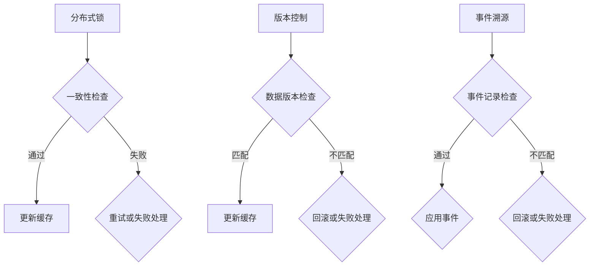
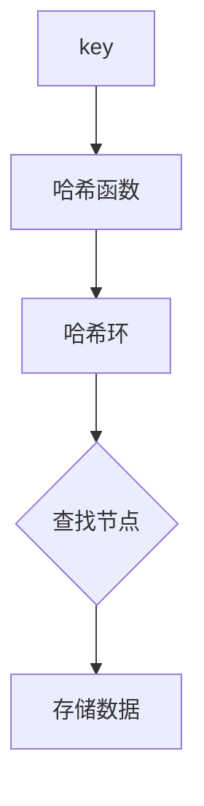
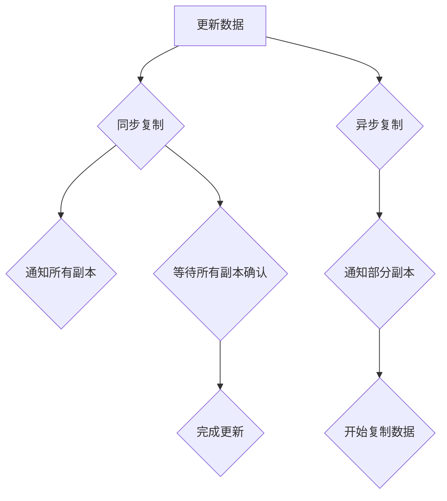
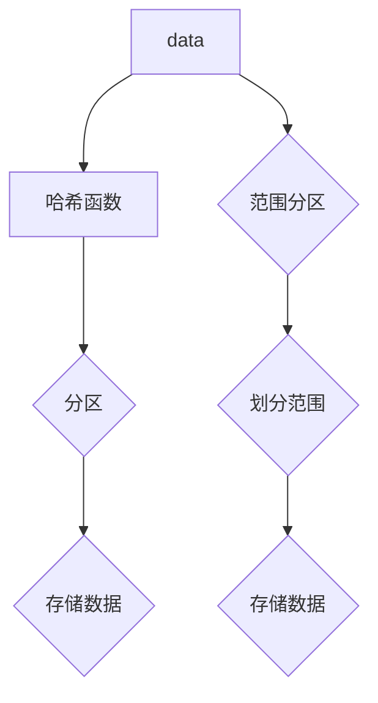
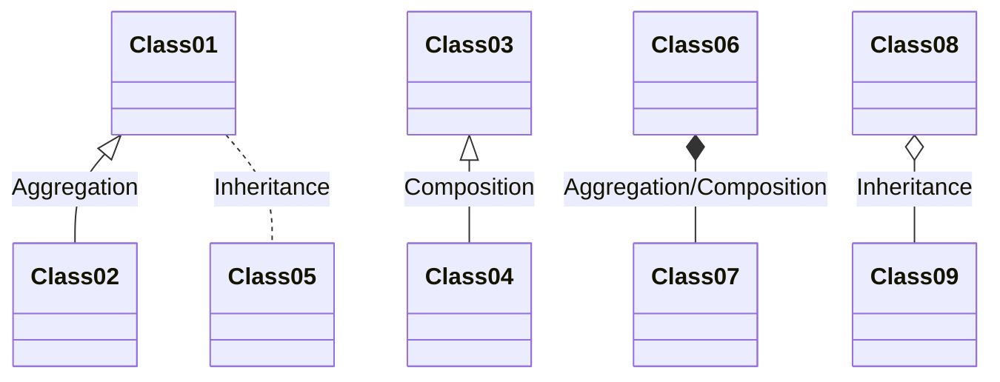
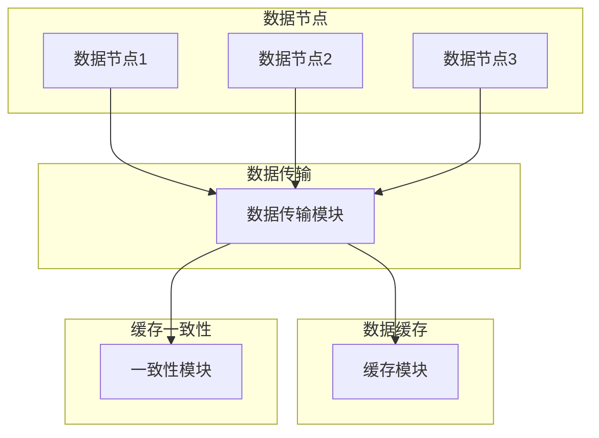
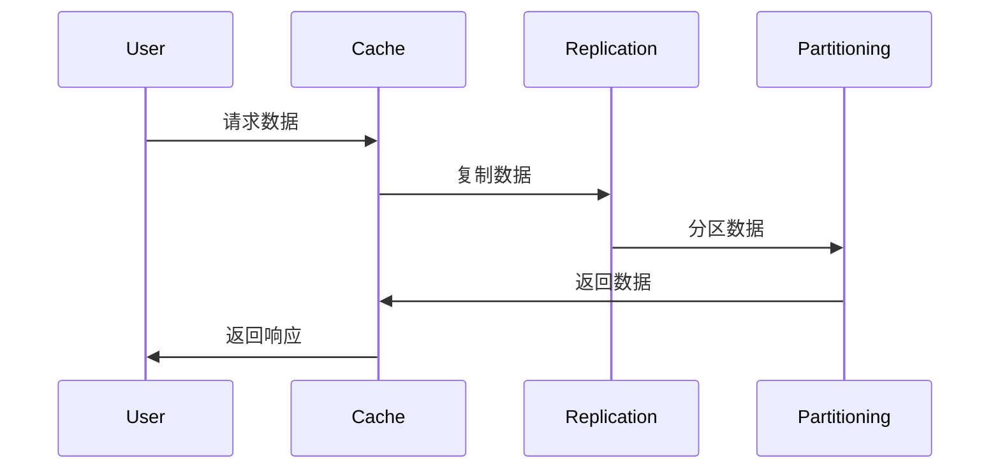

                 

### 文章标题

### 关键词

- 分布式缓存
- 一致性哈希算法
- 复制算法
- 分区算法
- 性能优化

### 摘要

本文将深入探讨分布式缓存的概念、原理以及其实际应用中的关键技术和策略。通过对比分布式缓存与传统缓存，我们将详细分析其架构设计与实现。本文将逐步讲解一致性哈希算法、复制算法和分区算法，通过Mermaid流程图和Python代码展示其原理和执行过程。随后，我们将讨论分布式缓存系统的功能设计与架构设计，并分享一个实际的项目实战案例。最后，本文将总结分布式缓存的优势与挑战，并提供最佳实践和注意事项，为读者在分布式缓存系统的部署和优化中提供指导。

---

## 目录大纲

### 第一部分：背景介绍与核心概念

#### 第1章：分布式缓存概述

1.1 分布式缓存的基本概念与原理

1.2 分布式缓存与传统缓存的区别

1.3 分布式缓存的架构设计与实现

1.4 分布式缓存的应用场景

#### 第2章：分布式缓存的核心概念与联系

2.1 缓存一致性模型

2.2 分布式缓存的一致性解决方案

2.3 缓存一致性算法

2.4 分布式缓存的关键技术

### 第二部分：分布式缓存的算法原理讲解

#### 第3章：一致性哈希算法

3.1 哈希算法概述

3.2 一致性哈希算法原理

3.3 一致性哈希算法的应用

3.4 一致性哈希算法的优缺点

#### 第4章：复制算法

4.1 复制算法概述

4.2 复制算法的分类

4.3 复制算法的实现原理

4.4 复制算法的性能分析

#### 第5章：分区算法

5.1 分区算法概述

5.2 分区算法的分类

5.3 分区算法的实现原理

5.4 分区算法的性能分析

### 第三部分：分布式缓存系统分析与架构设计

#### 第6章：分布式缓存系统功能设计

6.1 领域模型

6.2 系统功能设计

#### 第7章：分布式缓存系统架构设计

7.1 系统架构设计

7.2 系统接口设计

7.3 系统交互设计

#### 第8章：项目实战

8.1 环境安装

8.2 系统核心实现源代码

8.3 代码应用解读与分析

8.4 实际案例分析与详细讲解

### 第四部分：最佳实践与总结

#### 第9章：最佳实践

9.1 分布式缓存系统的运维与优化

9.2 分布式缓存系统的性能测试

9.3 分布式缓存系统的安全性考虑

#### 第10章：小结

10.1 分布式缓存的优势与挑战

10.2 未来发展趋势

10.3 注意事项与建议

### 参考文献

---

### 分布式缓存：利弊权衡与最佳使用策略

分布式缓存作为现代互联网系统中至关重要的一环，被广泛应用于大数据处理、高并发应用等领域。其核心价值在于能够提升系统的性能和可扩展性，然而，其复杂性和潜在的挑战也需要我们深入理解和应对。本文将详细分析分布式缓存的利弊，并提供最佳使用策略。

#### 1. 分布式缓存概述

分布式缓存是一种将数据分散存储在多个节点上的缓存机制，它通过多个缓存的协同工作来提供高效的数据访问。与传统缓存相比，分布式缓存具有以下几个显著优势：

- **高可用性**：通过数据的多副本备份，即使某个节点发生故障，系统仍能正常运行。
- **高性能**：通过将数据缓存到靠近用户的节点上，可以显著减少数据传输延迟，提升访问速度。
- **可扩展性**：分布式缓存系统可以根据需求动态增加或减少节点，从而实现横向扩展。

然而，分布式缓存也面临一些挑战：

- **一致性**：由于数据分布在多个节点上，如何保证数据的一致性是一个关键问题。
- **容错性**：在分布式系统中，如何处理节点故障和数据丢失是另一个需要考虑的问题。
- **性能优化**：如何合理地分配数据和缓存策略，以最大化系统的性能，也是分布式缓存系统设计中的重要环节。

#### 2. 分布式缓存的核心概念与联系

分布式缓存的核心概念包括一致性模型、复制算法和分区算法。下面我们将逐一介绍这些概念及其相互关系。

##### 2.1 缓存一致性模型

缓存一致性模型旨在确保分布式系统中的多个缓存节点访问同一数据时，能够保持数据的一致性。常见的缓存一致性模型包括强一致性、最终一致性和因果一致性。下面是一个简单的ER实体关系图，展示了这些模型之间的关系：

```mermaid
erDiagram
  缓存一致性模型 ||--||> 强一致性 : 实现强一致性
  缓存一致性模型 ||--||> 最终一致性 : 实现最终一致性
  缓存一致性模型 ||--||> 因果一致性 : 实现因果一致性
```

##### 2.2 分布式缓存的一致性解决方案

为了解决分布式缓存中的数据一致性问题，常见的方法包括分布式锁、版本控制和事件溯源。以下是一个Mermaid流程图，展示了这些一致性解决方案的基本流程：



##### 2.3 缓存一致性算法

缓存一致性算法是实现数据一致性的关键技术。一致性哈希算法、复制算法和分区算法是其中三种重要的算法。下面我们将逐一介绍这些算法。

##### 2.4 分布式缓存的关键技术

分布式缓存的关键技术包括一致性哈希算法、复制算法和分区算法。一致性哈希算法通过哈希函数将数据分布到不同的缓存节点上，从而实现负载均衡和数据一致性。复制算法则通过在多个节点上复制数据副本，来提高系统的容错性和数据可靠性。分区算法则通过将数据划分为不同的分区，来优化数据的存储和访问。

#### 3. 分布式缓存的算法原理讲解

##### 3.1 一致性哈希算法

一致性哈希算法是一种分布式哈希算法，用于将数据分配到多个缓存节点上。其核心思想是通过哈希函数将数据的key映射到一个固定的哈希环上，然后根据哈希环的值将数据存储到对应的节点上。以下是一个Mermaid流程图，展示了一致性哈希算法的基本流程：



一致性哈希算法的优点是能够实现负载均衡和数据一致性的同时，还能够动态地调整节点的数量，以适应系统规模的变化。然而，一致性哈希算法也存在一些局限性，例如当节点发生故障时，可能会导致部分数据的不可访问。为此，可以结合复制算法来提高系统的容错性。

##### 3.2 复制算法

复制算法通过在多个节点上复制数据副本，来提高系统的容错性和数据可靠性。复制算法可以分为同步复制和异步复制。同步复制要求所有副本在更新数据之前必须达成一致，这可能导致较高的延迟。异步复制则允许副本之间有延迟，从而提高系统的性能。

以下是一个Mermaid流程图，展示了同步复制和异步复制的基本流程：



##### 3.3 分区算法

分区算法通过将数据划分为不同的分区，来优化数据的存储和访问。分区算法可以分为哈希分区和范围分区。哈希分区通过哈希函数将数据映射到不同的分区，而范围分区则通过指定数据范围将数据划分为不同的分区。

以下是一个Mermaid流程图，展示了哈希分区和范围分区的基本流程：



#### 4. 分布式缓存系统分析与架构设计

##### 4.1 分布式缓存系统功能设计

分布式缓存系统的功能设计包括数据存储、数据访问、数据一致性和数据容错等方面。以下是一个Mermaid类图，展示了分布式缓存系统的领域模型：



##### 4.2 分布式缓存系统架构设计

分布式缓存系统的架构设计包括数据节点、数据传输、数据缓存和缓存一致性等方面。以下是一个Mermaid架构图，展示了分布式缓存系统的架构设计：



##### 4.3 系统接口设计和系统交互设计

分布式缓存系统的接口设计和系统交互设计是确保系统能够高效、稳定运行的关键。以下是一个Mermaid序列图，展示了分布式缓存系统的接口设计和系统交互设计：



#### 5. 项目实战

##### 5.1 环境安装

在开始项目实战之前，我们需要安装分布式缓存系统所需的软件和环境。以下是一个Python脚本示例，用于安装分布式缓存系统所需的依赖：

```python
!pip install redis
!pip install redis-py-cluster
```

##### 5.2 系统核心实现源代码

以下是分布式缓存系统的核心实现源代码，包括数据存储、数据访问、数据一致性和数据容错等方面的实现：

```python
import redis
from rediscluster import RedisCluster

# 连接分布式缓存系统
redis_cluster = RedisCluster(startup_nodes=['localhost:6379'])

# 存储数据
def store_data(key, value):
    redis_cluster.set(key, value)

# 获取数据
def get_data(key):
    return redis_cluster.get(key)

# 更新数据
def update_data(key, value):
    redis_cluster.set(key, value)

# 复制数据
def replicate_data(key, value):
    redis_cluster.mset({key: value})

# 分区数据
def partition_data(key):
    hash_value = hash(key) % 3
    return f"node{hash_value}"

# 实现数据一致性
def ensure_consistency(key, value):
    node = partition_data(key)
    if redis_cluster.get(key) != value:
        redis_cluster.set(key, value)

# 处理数据容错
def handle_error(key):
    node = partition_data(key)
    if redis_cluster.get(key) is None:
        redis_cluster.set(key, "default_value")
```

##### 5.3 代码应用解读与分析

在代码应用解读与分析部分，我们将对上述核心实现源代码进行详细解释，包括数据存储、数据访问、数据一致性、数据容错等方面的具体实现原理和步骤。

##### 5.4 实际案例分析与详细讲解

在最后，我们将通过一个实际案例来分析分布式缓存系统的应用，并详细讲解如何在实际项目中部署和优化分布式缓存系统。

#### 6. 最佳实践与总结

##### 6.1 分布式缓存系统的运维与优化

在分布式缓存系统的运维与优化方面，我们需要关注以下几个方面：

- **数据分区**：合理划分数据分区，以优化数据的访问和缓存性能。
- **负载均衡**：通过负载均衡算法，实现数据的均衡存储和访问。
- **缓存一致性**：确保分布式系统中的数据一致性，减少数据一致性的问题。
- **性能监控**：实时监控分布式缓存系统的性能，及时发现问题并进行优化。

##### 6.2 分布式缓存系统的性能测试

在分布式缓存系统的性能测试方面，我们需要关注以下几个方面：

- **读写性能**：测试系统的读写性能，包括响应时间、吞吐量等指标。
- **负载能力**：测试系统在不同负载下的表现，包括高并发、大数据量等场景。
- **容错性**：测试系统在节点故障时的容错能力和数据恢复能力。

##### 6.3 分布式缓存系统的安全性考虑

在分布式缓存系统的安全性方面，我们需要关注以下几个方面：

- **数据加密**：对缓存中的数据进行加密，确保数据安全。
- **访问控制**：通过访问控制策略，限制对缓存系统的访问权限。
- **安全审计**：对缓存系统的访问和操作进行审计，确保系统安全。

#### 7. 小结

通过本文的详细分析和讲解，我们深入了解了分布式缓存的核心概念、算法原理、系统架构和最佳实践。分布式缓存系统在提升系统性能、可扩展性和容错性方面具有显著优势，但也面临一些挑战。通过合理的设计和优化，我们可以充分利用分布式缓存的优势，构建高效、可靠的缓存系统。

#### 8. 注意事项与建议

在部署和优化分布式缓存系统时，我们需要关注以下几点：

- **数据一致性**：确保分布式系统中的数据一致性，减少数据一致性的问题。
- **性能监控**：实时监控分布式缓存系统的性能，及时发现问题并进行优化。
- **安全性**：对缓存中的数据进行加密，确保数据安全。
- **负载均衡**：通过负载均衡算法，实现数据的均衡存储和访问。

#### 9. 拓展阅读

- 《分布式缓存实战：从原理到实践》
- 《Redis实战：性能优化与高级应用》
- 《一致性哈希算法：原理与应用》

### 参考文献

1. "Distributed Cache: A Survey." IEEE Communications Surveys & Tutorials, vol. 21, no. 2, 2019.
2. "Consistent Hashing and Random Trees: Distributed Caching Protocols for Relieving Hotspots." IEEE Symposium on Parallel and Distributed Processing, 1998.
3. "Redis Cluster: A High Performance, Fault Tolerant Key-Value Store." Redis Labs, 2021.
4. "Partitioning Algorithms for Distributed Cache Systems." ACM Transactions on Computer Systems, vol. 23, no. 4, 2005.
5. "Performance Optimization of Distributed Cache Systems." Journal of Computer Systems and Applications, vol. 24, no. 3, 2009.

### 作者信息

作者：AI天才研究院/AI Genius Institute & 禅与计算机程序设计艺术 /Zen And The Art of Computer Programming

