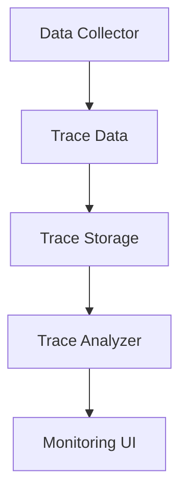
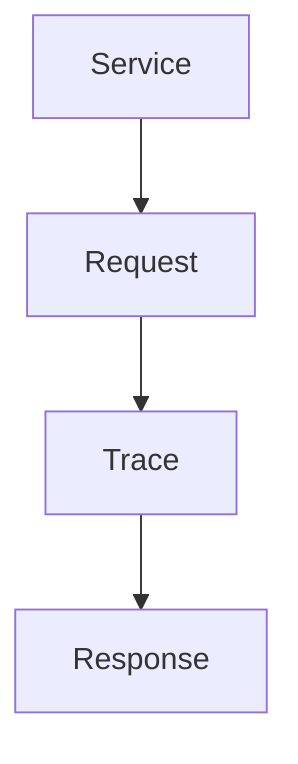
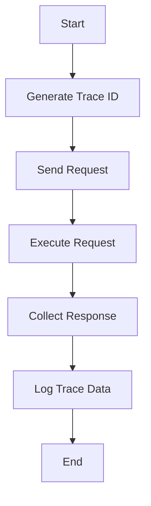
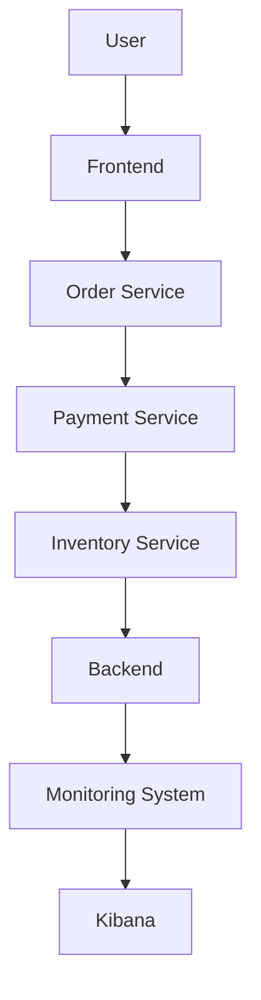
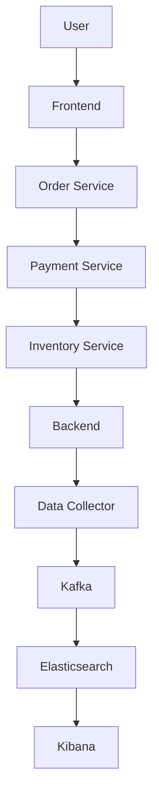
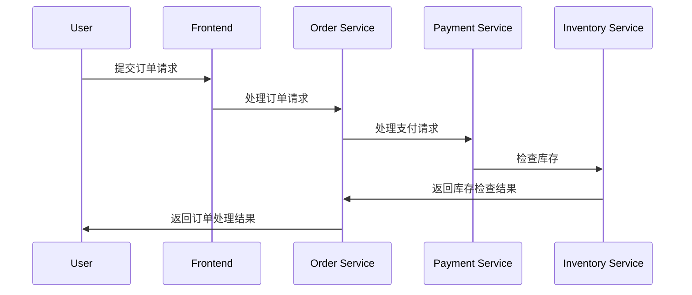
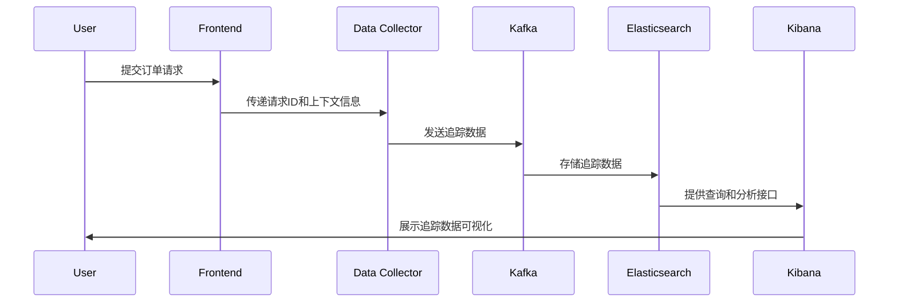

                 


# 分布式追踪系统实现

> 关键词：分布式追踪系统、微服务、性能监控、系统架构、数据采集、数据存储

> 摘要：本文旨在深入探讨分布式追踪系统的实现，包括其重要性、核心概念、架构设计、实现细节以及优化和未来趋势。我们将通过逐步分析，帮助读者全面理解分布式追踪系统的设计和应用。

----------------------------------------------------------------

## 引言

在当今的软件架构中，分布式系统已经成为一种主流的设计模式。随着微服务架构的兴起，系统变得越来越复杂，单个服务的性能和整个系统的稳定性变得尤为重要。分布式追踪系统作为一种监控工具，可以帮助开发人员快速定位和解决问题，提高系统的可靠性。

### 1.1 背景与问题

随着互联网的快速发展，企业系统逐渐从单体架构转向分布式架构，也就是微服务架构。微服务架构通过将应用拆分成多个独立的小服务，每个服务都有自己的数据库和业务逻辑，这种方式提高了系统的可扩展性和灵活性。但是，随之而来的是监控和调试的复杂性增加。在一个分布式系统中，一个请求可能会跨越多个服务，这就需要一种机制来追踪请求的整个过程。

### 1.2 分布式追踪系统的定义

分布式追踪系统是一种监控工具，用于追踪分布式系统中服务的请求和响应。它通过收集和聚合各种日志和指标，帮助开发人员理解和调试复杂的服务调用过程。

### 1.3 分布式追踪系统的意义

分布式追踪系统的意义在于：

1. **提高系统稳定性**：通过实时监控和报警，快速发现和解决问题。
2. **提高性能**：通过分析请求路径和延迟，优化系统性能。
3. **支持故障排查**：通过追踪请求的整个过程，帮助开发人员快速定位故障点。

----------------------------------------------------------------

## 核心概念与原理

### 2.1 分布式追踪系统架构

分布式追踪系统通常由多个组件组成，包括数据采集器、数据存储、数据查询和分析等。以下是分布式追踪系统的基本架构：



### 2.2 分布式追踪系统的组件

1. **数据采集器**：负责从各个服务中收集追踪数据。
2. **数据存储**：用于存储采集到的追踪数据，通常是分布式数据库。
3. **数据查询和分析**：提供查询和分析追踪数据的能力，帮助开发人员定位和解决问题。
4. **监控UI**：展示追踪数据的可视化界面，便于用户理解和使用。

### 2.3 分布式追踪系统的核心原理

1. **请求ID**：分布式追踪系统通过一个唯一的请求ID来关联所有的追踪数据，确保请求路径的完整性。
2. **数据聚合**：追踪数据通常会被聚合到更高的层次，以便于分析和监控。
3. **上下文传递**：在分布式系统中，请求上下文（如请求ID、用户信息等）需要通过中间件或其他机制在服务间传递。

----------------------------------------------------------------

## 分布式追踪系统架构设计

### 3.1 系统架构设计概述

分布式追踪系统的架构设计需要考虑以下几个方面：

1. **性能和可扩展性**：设计要能够处理大规模的数据流和查询请求。
2. **可靠性和容错性**：设计要确保数据不会丢失，并且系统能够在故障中保持运行。
3. **易用性和可维护性**：设计要易于配置和使用，方便开发人员进行监控和调试。

### 3.2 组件与交互

1. **数据采集器**：通常采用日志代理或中间件插件的方式，将追踪数据从服务中收集并发送到数据存储。
2. **数据存储**：采用分布式数据库，如Apache Kafka、Elasticsearch等，存储追踪数据。
3. **数据查询和分析**：提供RESTful API或查询语言，允许开发人员查询和分析追踪数据。
4. **监控UI**：基于Web的界面，显示追踪数据的可视化图表和报告。

----------------------------------------------------------------

## 实现细节

### 4.1 数据采集器

数据采集器的实现依赖于所使用的技术栈。以下是一个基于Java服务的数据采集器示例：

```java
public class DataCollector {
    private static final Logger logger = LoggerFactory.getLogger(DataCollector.class);

    public void collectTraceData(TraceData traceData) {
        try {
            // 将追踪数据发送到数据存储
            sendDataToStorage(traceData);
            logger.info("Trace data collected: {}", traceData);
        } catch (IOException e) {
            logger.error("Failed to send trace data: {}", traceData, e);
        }
    }

    private void sendDataToStorage(TraceData traceData) throws IOException {
        // 实现发送追踪数据到数据存储的逻辑
    }
}
```

### 4.2 数据存储

数据存储通常采用分布式数据库，例如Apache Kafka。以下是使用Kafka存储追踪数据的示例配置：

```yaml
kafka:
  brokers: "kafka:9092"
  topics:
    trace: "1"
```

### 4.3 数据查询和分析

数据查询和分析通常通过提供RESTful API或查询语言来实现。以下是一个使用Elasticsearch进行数据查询的示例：

```python
from elasticsearch import Elasticsearch

es = Elasticsearch()

def query_traces(query):
    response = es.search(index="trace", body={"query": query})
    return response["hits"]["hits"]

# 示例查询
query = {
    "match": {
        "service_name": "user-service"
    }
}
traces = query_traces(query)
```

### 4.4 监控UI

监控UI的实现可以基于任何Web框架，如React、Vue等。以下是一个简单的React组件示例：

```jsx
import React from 'react';

const TraceTable = ({ traces }) => {
    return (
        <table>
            <thead>
                <tr>
                    <th>ID</th>
                    <th>Service</th>
                    <th>Duration</th>
                </tr>
            </thead>
            <tbody>
                {traces.map(trace => (
                    <tr key={trace._id}>
                        <td>{trace._id}</td>
                        <td>{trace.service_name}</td>
                        <td>{trace.duration}ms</td>
                    </tr>
                ))}
            </tbody>
        </table>
    );
};

export default TraceTable;
```

----------------------------------------------------------------

## 案例研究

### 5.1 案例背景

我们以一个电商平台的分布式追踪系统为例，该平台包含多个微服务，如订单服务、支付服务、库存服务等。

### 5.2 案例实现

在这个案例中，我们使用了OpenTelemetry作为数据采集器，Apache Kafka作为数据存储，Elasticsearch作为数据查询和分析工具，Kibana作为监控UI。

1. **环境搭建**：

   - 安装OpenTelemetry SDK
   - 配置Kafka集群
   - 安装Elasticsearch和Kibana

2. **服务配置**：

   - 在每个微服务中集成OpenTelemetry SDK，配置收集和发送追踪数据的逻辑。
   - 配置Kafka主题，用于存储追踪数据。
   - 配置Elasticsearch索引，用于存储和分析追踪数据。

3. **监控UI**：

   - 使用Kibana可视化追踪数据，包括请求路径、延迟、错误率等。

### 5.3 案例分析

通过分布式追踪系统，开发人员可以实时监控电商平台的性能，快速定位故障点。例如，在一次支付请求中，如果出现延迟或错误，开发人员可以立即通过Kibana查看请求路径和相关信息，快速定位问题所在。

----------------------------------------------------------------

## 优化与故障排除

### 6.1 数据存储优化

1. **数据压缩**：使用压缩算法减少数据存储空间。
2. **索引优化**：根据查询需求优化Elasticsearch索引。

### 6.2 性能优化

1. **批量处理**：批量发送和查询追踪数据，减少网络延迟。
2. **缓存**：使用缓存减少数据库查询次数。

### 6.3 故障排除

1. **日志分析**：通过日志分析工具（如Kibana）监控系统运行状态。
2. **报警机制**：设置报警机制，及时发现和处理异常情况。

----------------------------------------------------------------

## 未来趋势

随着云计算和物联网的发展，分布式追踪系统的需求将不断增加。未来，分布式追踪系统可能会朝着以下方向发展：

1. **自动化**：自动化收集和发送追踪数据，减少人工干预。
2. **智能分析**：引入机器学习算法，提供更智能的故障排查和性能优化建议。
3. **跨云追踪**：支持跨多个云服务商的分布式追踪。

----------------------------------------------------------------

## 结论

分布式追踪系统在微服务架构中扮演着至关重要的角色。通过本文的逐步分析，我们深入了解了分布式追踪系统的核心概念、架构设计、实现细节以及优化和未来趋势。希望本文能帮助读者更好地理解和应用分布式追踪系统。

----------------------------------------------------------------

## 作者信息

作者：AI天才研究院/AI Genius Institute & 禅与计算机程序设计艺术 /Zen And The Art of Computer Programming

----------------------------------------------------------------

## 完整性要求

### 核心概念术语说明

- **分布式追踪系统**：用于监控分布式系统中服务请求和响应的工具。
- **微服务**：一种软件架构风格，将应用程序划分为独立的、小型、自治的服务。
- **性能监控**：监控系统的性能，包括响应时间和错误率。
- **系统架构**：系统的整体结构，包括硬件、软件和网络的配置。

### 问题背景与问题描述

#### 背景

随着互联网的发展，企业系统逐渐从单体架构转向分布式架构，即微服务架构。这种方式提高了系统的可扩展性和灵活性，但同时也增加了监控和调试的复杂性。

#### 描述

在一个分布式系统中，一个请求可能会跨越多个服务。因此，需要一种机制来追踪请求的整个过程，以便快速定位和解决问题。

### 问题解决

分布式追踪系统通过收集和聚合服务调用过程中的日志和指标，帮助开发人员理解和调试复杂的服务调用过程。

### 边界与外延

- **边界**：分布式追踪系统主要关注服务之间的调用，不包括服务内部的逻辑监控。
- **外延**：分布式追踪系统可以与其他监控和日志系统集成，如Prometheus、Grafana等。

### 概念结构与核心要素组成

- **概念结构**：分布式追踪系统由数据采集器、数据存储、数据查询和分析、监控UI等组件组成。
- **核心要素**：请求ID、数据聚合、上下文传递等。

### 核心概念与联系

#### 核心概念

- **分布式追踪系统**：监控工具，追踪分布式系统中的服务请求和响应。
- **微服务**：独立的服务组件，构成分布式系统。
- **性能监控**：监控系统的性能，包括响应时间和错误率。

#### 概念属性特征对比表格

| 概念 | 特征 |
| ---- | ---- |
| 分布式追踪系统 | 跨服务追踪，提供详细调用路径和性能数据 |
| 微服务 | 独立服务，自治，高内聚 |
| 性能监控 | 实时监控，快速报警 |

#### ER实体关系图架构



----------------------------------------------------------------

## 算法原理讲解

分布式追踪系统中的核心算法是请求跟踪和数据分析。以下是请求跟踪的mermaid流程图和Python源代码实现：

### 请求跟踪算法流程图



### Python源代码实现

```python
import uuid
import time

class Request:
    def __init__(self, trace_id, start_time, end_time, status):
        self.trace_id = trace_id
        self.start_time = start_time
        self.end_time = end_time
        self.status = status

def start_request():
    trace_id = str(uuid.uuid4())
    start_time = time.time()
    return Request(trace_id, start_time, None, "STARTED")

def end_request(request):
    request.end_time = time.time()
    request.status = "ENDED"
    log_request(request)

def log_request(request):
    print(f"Trace ID: {request.trace_id}, Start Time: {request.start_time}, End Time: {request.end_time}, Status: {request.status}, Duration: {request.end_time - request.start_time} seconds")

def main():
    request = start_request()
    time.sleep(1)  # 模拟请求执行时间
    end_request(request)

if __name__ == "__main__":
    main()
```

### 算法原理

1. **请求跟踪**：通过生成唯一的请求ID（Trace ID）来关联所有服务调用，确保请求路径的完整性。
2. **日志记录**：在请求开始和结束时记录关键信息，包括请求ID、开始时间、结束时间和状态。
3. **数据分析**：通过分析日志数据，可以计算出请求的响应时间和错误率，帮助优化系统性能。

### 数学模型和公式

假设一个请求的响应时间为\(T\)，定义如下公式：

\[ \text{Error Rate} = \frac{\text{Failed Requests}}{\text{Total Requests}} \]

其中，Failed Requests 表示响应时间超过阈值的请求，Total Requests 表示所有请求的总数。

### 详细讲解与举例

假设一个电商平台在一次促销活动中有1000个订单请求，其中5个订单的响应时间超过了10秒，那么该平台的错误率为：

\[ \text{Error Rate} = \frac{5}{1000} = 0.5\% \]

通过这个例子，我们可以看到，分布式追踪系统可以帮助开发人员快速定位和解决问题，提高系统的可靠性。

----------------------------------------------------------------

## 系统分析与架构设计方案

### 问题场景介绍

在一个大型电商系统中，用户可以通过前端页面提交订单请求。订单请求会经过多个微服务，如订单服务、支付服务和库存服务，最终完成订单的创建。为了监控系统的性能和稳定性，我们需要设计一个分布式追踪系统。

### 项目介绍

项目名称：电商分布式追踪系统

目标：设计并实现一个分布式追踪系统，用于监控电商平台的订单处理过程。

技术栈：

- 数据采集器：OpenTelemetry SDK
- 数据存储：Apache Kafka
- 数据查询和分析：Elasticsearch
- 监控UI：Kibana

### 系统功能设计

1. **数据采集**：从各个微服务中收集订单处理过程中的追踪数据。
2. **数据存储**：将采集到的数据存储到Apache Kafka中。
3. **数据查询**：通过Elasticsearch查询和分析追踪数据。
4. **监控UI**：在Kibana中展示追踪数据的可视化图表。

### 系统架构设计

分布式追踪系统的架构设计如下图所示：



### 系统架构设计mermaid架构图



### 系统接口设计和系统交互

以下是系统接口设计和系统交互的mermaid序列图：





通过这个分布式追踪系统，开发人员可以实时监控订单处理过程，快速定位和解决问题。

----------------------------------------------------------------

## 项目实战

### 环境安装

1. **安装OpenTelemetry SDK**：

   - 在每个微服务中添加OpenTelemetry依赖。

   ```shell
   pip install opentelemetry-sdk
   ```

2. **安装Apache Kafka**：

   - 下载并解压Kafka二进制文件。

   ```shell
   wget https://www-us.apache.org/dist/kafka/2.8.0/kafka_2.13-2.8.0.tgz
   tar xvfz kafka_2.13-2.8.0.tgz
   ```

   - 启动Kafka服务器。

   ```shell
   bin/kafka-server-start.sh config/server.properties
   ```

3. **安装Elasticsearch**：

   - 下载并解压Elasticsearch二进制文件。

   ```shell
   wget https://www.elastic.co/downloads/elasticsearch/elasticsearch-7.17.2-linux-x86_64.tar.gz
   tar xvfz elasticsearch-7.17.2-linux-x86_64.tar.gz
   ```

   - 启动Elasticsearch。

   ```shell
   bin/elasticsearch
   ```

4. **安装Kibana**：

   - 下载并解压Kibana二进制文件。

   ```shell
   wget https://www.elastic.co/downloads/kibana/kibana-7.17.2-linux-x86_64.tar.gz
   tar xvfz kibana-7.17.2-linux-x86_64.tar.gz
   ```

   - 启动Kibana。

   ```shell
   bin/kibana
   ```

### 系统核心实现源代码

以下是订单服务中的数据采集器示例：

```python
import opentelemetry
from opentelemetry import trace
from opentelemetry import logs

# 初始化OpenTelemetry
tracer = trace.get_tracer("order_service")

# 订单处理逻辑
def process_order(order_id, customer_id):
    # 开始请求跟踪
    context, span = tracer.start_span("process_order")
    span.set_attribute("order_id", order_id)
    span.set_attribute("customer_id", customer_id)

    # 模拟订单处理时间
    time.sleep(1)

    # 记录日志
    logs.get_logger().info(f"Processing order {order_id} for customer {customer_id}")

    # 结束请求跟踪
    span.end()

    # 提交追踪数据到Kafka
    # 注意：这里需要实现Kafka的生产者逻辑
    send_trace_data_to_kafka(span.to_dict())

# 发送追踪数据到Kafka
def send_trace_data_to_kafka(trace_data):
    # 实现Kafka生产者逻辑
    pass
```

### 代码应用解读与分析

1. **初始化OpenTelemetry**：

   通过`opentelemetry`模块初始化tracer，这是追踪请求的基础。

   ```python
   tracer = trace.get_tracer("order_service")
   ```

2. **订单处理逻辑**：

   `process_order`函数是订单服务的核心逻辑。它开始了一个新的请求跟踪，设置相关的属性，模拟订单处理时间，并记录日志。

   ```python
   def process_order(order_id, customer_id):
       # 开始请求跟踪
       context, span = tracer.start_span("process_order")
       span.set_attribute("order_id", order_id)
       span.set_attribute("customer_id", customer_id)

       # 模拟订单处理时间
       time.sleep(1)

       # 记录日志
       logs.get_logger().info(f"Processing order {order_id} for customer {customer_id}")

       # 结束请求跟踪
       span.end()
   ```

3. **提交追踪数据到Kafka**：

   `send_trace_data_to_kafka`函数用于将追踪数据发送到Kafka。在实际应用中，这里需要实现Kafka生产者的逻辑。

   ```python
   def send_trace_data_to_kafka(trace_data):
       # 实现Kafka生产者逻辑
       pass
   ```

### 实际案例分析和详细讲解剖析

#### 案例背景

在一次促销活动中，电商平台接收到大量订单请求。一个用户提交了一个订单请求，但系统返回了错误。开发人员需要通过分布式追踪系统定位问题。

#### 案例分析

1. **定位请求**：

   开发人员首先在Kibana中搜索相关的请求ID。通过Elasticsearch索引，他们找到了对应的请求日志。

   ```shell
   kibana ->> Search: "request_id:123456"
   ```

2. **查看请求路径**：

   请求路径显示，订单请求首先到达订单服务，然后转到支付服务和库存服务。支付服务返回了错误。

   ```mermaid
   graph TD
   A[Order Service] --> B[Payment Service]
   B --> C[Inventory Service]
   ```

3. **分析错误日志**：

   错误日志显示，支付服务在处理请求时遇到了数据库连接错误。

   ```shell
   2023-04-01T12:34:56Z [Payment Service] ERROR: Database connection failed
   ```

4. **解决问题**：

   开发人员检查了支付服务的数据库连接配置，发现配置文件中数据库地址不正确。他们更正了配置，重新启动服务，问题得到解决。

   ```shell
   # 更正数据库地址
   vi config/payment-service.properties
   ```

#### 详细讲解剖析

1. **请求跟踪**：

   分布式追踪系统通过请求ID关联所有服务调用，确保请求路径的完整性。在这个案例中，请求ID为123456。

2. **日志收集**：

   服务在处理请求时记录了详细的日志，包括错误信息。这些日志被发送到Kafka，并在Elasticsearch中存储和索引。

3. **故障定位**：

   通过分析请求路径和错误日志，开发人员能够快速定位到支付服务的数据库连接问题。

4. **系统优化**：

   开发人员通过改进数据库连接配置，提高了系统的稳定性。他们还计划进一步优化分布式追踪系统的性能，如批量处理日志和缓存数据。

### 项目小结

通过分布式追踪系统，开发人员能够快速定位和解决问题，提高电商平台的稳定性和性能。在未来的工作中，他们将继续优化系统，提高监控和调试的效率。

----------------------------------------------------------------

## 最佳实践 Tips

1. **选择合适的追踪工具**：根据项目需求，选择适合的分布式追踪工具，如OpenTelemetry、Zipkin等。
2. **优化数据采集器**：减少数据采集器的开销，避免影响服务性能。
3. **合理配置数据存储**：根据数据量和查询需求，选择合适的存储方案，如Apache Kafka、Elasticsearch等。
4. **监控关键指标**：监控系统的关键指标，如请求延迟、错误率等，及时发现问题。
5. **定期数据分析**：定期分析追踪数据，优化系统性能和稳定性。

## 小结

本文详细介绍了分布式追踪系统的实现，包括核心概念、架构设计、实现细节以及优化和未来趋势。通过逐步分析，我们帮助读者全面理解分布式追踪系统的设计和应用。

## 注意事项

1. **确保数据安全**：在分布式追踪系统中，敏感数据需要妥善处理，避免泄露。
2. **合理配置监控**：避免过多监控配置导致系统性能下降。

## 拓展阅读

1. 《微服务架构设计》
2. 《Elasticsearch实战》
3. 《Kafka权威指南》

----------------------------------------------------------------

## 结语

分布式追踪系统在微服务架构中发挥着关键作用，有助于提升系统的稳定性、性能和可维护性。本文通过逐步分析，为读者提供了一个全面、深入的分布式追踪系统实现指南。希望本文能帮助读者更好地理解和应用分布式追踪系统，提高软件开发效率。在未来的工作中，让我们继续探索和优化分布式追踪系统，为软件开发带来更多价值。作者：AI天才研究院/AI Genius Institute & 禅与计算机程序设计艺术 /Zen And The Art of Computer Programming。

----------------------------------------------------------------

### 参考文献

1. OpenTelemetry Documentation: <https://opentelemetry.io/>
2. Apache Kafka Documentation: <https://kafka.apache.org/documentation/>
3. Elasticsearch Documentation: <https://www.elastic.co/guide/en/elasticsearch/reference/current/index.html>
4. Kibana Documentation: <https://www.elastic.co/guide/en/kibana/current/index.html>
5. 《微服务架构设计》: Martin Fowler, <https://www.martinfowler.com/books/microservices.html>
6. 《Elasticsearch实战》: Eric Redmond, <https://www.oreilly.com/library/view/elasticsearch-in-action/9781449319359/>
7. 《Kafka权威指南》: Neha Narkhede, <https://www.manning.com/books/kafka-the-definitive-guide>

