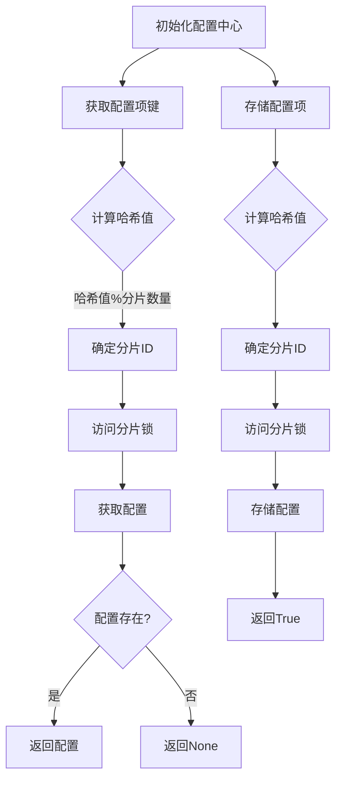
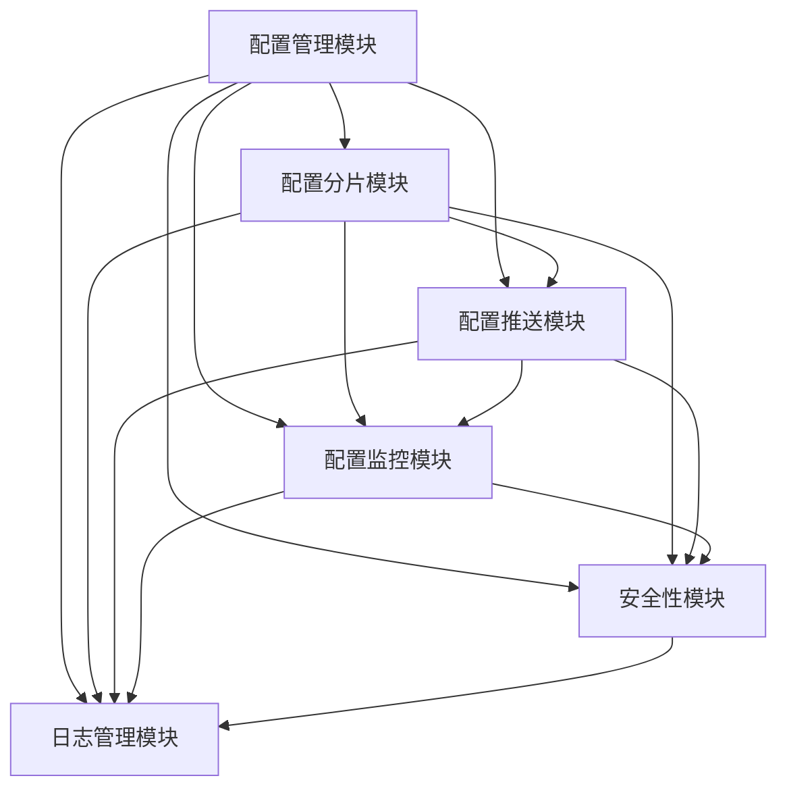
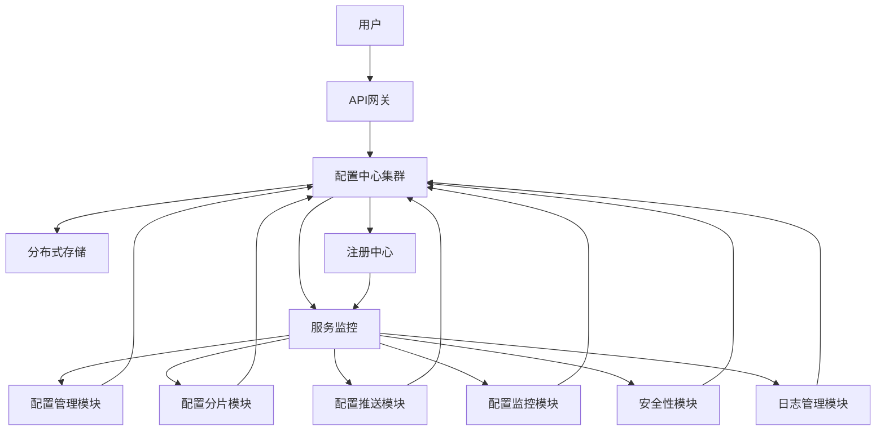
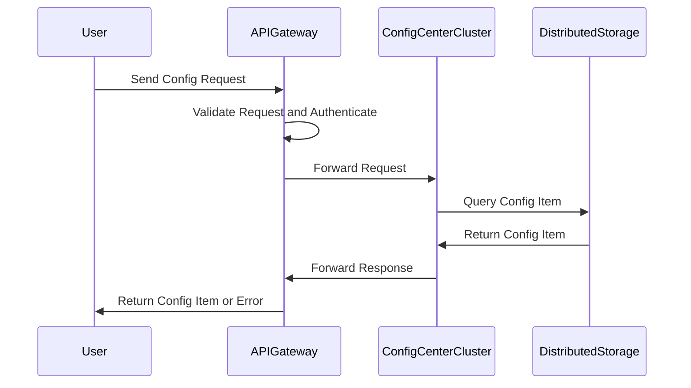
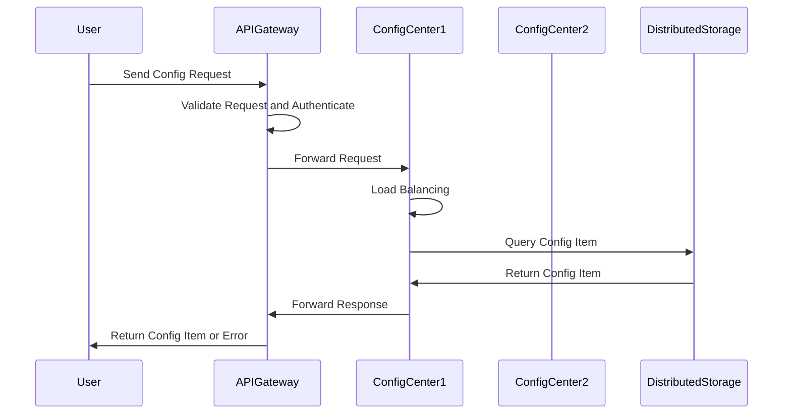

                 

### 第1章：问题背景

#### 1.1 分布式配置中心的概念

分布式配置中心是一种用于管理分布式系统中配置信息的集中化管理工具。在分布式系统中，由于各个节点之间的独立性和异构性，配置信息需要在各个节点上进行配置和管理。分布式配置中心的作用就是提供一个统一的接口，使得开发人员可以方便地对各个节点的配置信息进行管理和更新。

**核心概念术语说明**：
- **配置**：配置是指用于描述系统运行时参数的集合，包括系统参数、环境变量、应用配置等。
- **配置文件**：配置文件是用于存储配置信息的文本文件，通常采用JSON、XML、YAML等格式。
- **配置中心**：配置中心是一个集中的服务，用于存储、管理和分发配置信息。

**问题背景**：

随着分布式系统的广泛应用，传统的集中式配置管理方式已经无法满足系统的需求。分布式配置中心作为一种新的配置管理方式，能够解决以下问题：

1. **配置管理复杂度**：在分布式系统中，配置信息分散在各个节点上，管理起来非常复杂。
2. **配置更新效率**：传统的配置更新方式需要逐个节点更新，效率低下。
3. **配置一致性**：各个节点之间的配置信息可能不一致，导致系统运行异常。

**分布式配置中心的发展历程**：

分布式配置中心的发展可以追溯到早期分布式系统的配置管理需求。随着技术的发展，分布式配置中心经历了以下几个阶段：

1. **单点配置管理**：早期的分布式配置中心通常采用单点部署的方式，配置信息存储在本地文件中，通过脚本或者工具进行管理。
2. **集中式配置管理**：随着分布式系统的规模扩大，出现了集中式的配置管理工具，如Apache ZooKeeper、Consul等，这些工具提供了配置存储、管理和分发的功能。
3. **分布式配置中心**：现代分布式配置中心如Spring Cloud Config、Nacos、Apollo等，不仅提供了配置管理的功能，还集成了服务注册、服务发现、分布式锁等功能，进一步提升了系统的可扩展性和可靠性。

**分布式配置中心在微服务架构中的作用**：

在微服务架构中，分布式配置中心扮演着至关重要的角色。其主要作用如下：

1. **配置动态更新**：分布式配置中心允许开发人员通过配置中心动态地更新配置信息，无需重新部署应用。
2. **配置版本管理**：分布式配置中心支持配置版本管理，开发人员可以查看不同版本的配置信息，方便配置回滚和问题排查。
3. **配置分片与冗余**：分布式配置中心支持配置的分片与冗余存储，提高了配置信息的可用性和可靠性。
4. **服务发现与注册**：部分分布式配置中心如Nacos、Apollo等集成了服务发现与注册功能，使得配置中心成为了整个微服务架构的核心枢纽。

#### 1.2 分布式配置中心的核心概念

在深入了解分布式配置中心之前，我们需要明确其核心概念，包括配置管理、配置中心和配置文件。

**配置管理**：

配置管理是指对系统配置信息进行管理的过程，包括配置的存储、读取、更新和删除等操作。在分布式系统中，配置管理需要解决以下问题：

1. **配置信息的一致性**：确保各个节点的配置信息保持一致。
2. **配置信息的动态更新**：支持配置信息的实时更新，无需重启应用。
3. **配置信息的版本管理**：支持配置信息的版本控制，方便回滚和问题排查。

**配置中心**：

配置中心是一个集中式的服务，用于存储、管理和分发配置信息。配置中心通常具有以下特点：

1. **分布式存储**：配置中心采用分布式存储方式，支持海量配置信息的存储和查询。
2. **动态更新**：配置中心支持配置信息的动态更新，开发人员可以实时修改配置信息，并立即生效。
3. **高可用性**：配置中心采用高可用性设计，保证服务的稳定运行，避免单点故障。

**配置文件**：

配置文件是存储配置信息的文件，通常采用JSON、XML、YAML等格式。配置文件通常包含以下内容：

1. **系统参数**：如数据库连接信息、服务器地址等。
2. **环境变量**：如开发环境、测试环境和生产环境的配置差异。
3. **应用配置**：如日志级别、缓存策略等。

#### 1.3 分布式配置中心的核心概念

在分布式配置中心中，除了配置管理、配置中心和配置文件之外，还有一些核心概念需要理解。

**配置分片**：

配置分片是指将大量的配置信息分成多个部分，分布存储在不同的节点上。配置分片可以降低单个节点的压力，提高配置中心的性能和可扩展性。

**配置热更新**：

配置热更新是指在系统运行时动态地更新配置信息，无需重启应用。配置热更新可以提高系统的灵活性，降低运维成本。

**配置推送**：

配置推送是指将配置信息从配置中心推送到各个节点。配置推送可以确保各个节点的配置信息保持一致。

**配置监控**：

配置监控是指对配置中心的运行状态、配置信息的访问和更新情况进行监控。配置监控可以帮助开发人员及时发现和解决问题。

#### 1.4 分布式配置中心与微服务架构的适配性

在微服务架构中，分布式配置中心需要与微服务的其他组件进行良好的适配，以确保系统能够高效、稳定地运行。

**与注册中心的适配**：

分布式配置中心通常需要与注册中心（如Eureka、Consul等）进行集成，以便获取各个服务的配置信息。注册中心可以记录服务的状态和地址信息，配置中心可以根据这些信息进行配置推送。

**与服务监控的适配**：

分布式配置中心需要与服务监控系统（如Prometheus、Grafana等）进行集成，以便监控配置中心的运行状态和配置信息的访问情况。监控数据可以帮助开发人员及时发现和解决问题。

**与微服务架构的适配性**：

微服务架构的特点是服务的独立性和分布式。分布式配置中心需要支持服务的动态配置、配置分片、配置热更新等功能，以适应微服务架构的需求。

### 第2章：核心概念与联系

#### 2.1 分布式配置中心的核心概念

在分布式配置中心中，有几个核心概念需要理解，包括配置管理、配置中心和配置文件。

**配置管理**：

配置管理是指对系统配置信息进行管理的过程，包括配置的存储、读取、更新和删除等操作。在分布式系统中，配置管理需要解决以下问题：

1. **配置信息的一致性**：确保各个节点的配置信息保持一致。
2. **配置信息的动态更新**：支持配置信息的实时更新，无需重启应用。
3. **配置信息的版本管理**：支持配置信息的版本控制，方便回滚和问题排查。

**配置中心**：

配置中心是一个集中式的服务，用于存储、管理和分发配置信息。配置中心通常具有以下特点：

1. **分布式存储**：配置中心采用分布式存储方式，支持海量配置信息的存储和查询。
2. **动态更新**：配置中心支持配置信息的动态更新，开发人员可以实时修改配置信息，并立即生效。
3. **高可用性**：配置中心采用高可用性设计，保证服务的稳定运行，避免单点故障。

**配置文件**：

配置文件是存储配置信息的文件，通常采用JSON、XML、YAML等格式。配置文件通常包含以下内容：

1. **系统参数**：如数据库连接信息、服务器地址等。
2. **环境变量**：如开发环境、测试环境和生产环境的配置差异。
3. **应用配置**：如日志级别、缓存策略等。

**配置分片**：

配置分片是指将大量的配置信息分成多个部分，分布存储在不同的节点上。配置分片可以降低单个节点的压力，提高配置中心的性能和可扩展性。

**配置热更新**：

配置热更新是指在系统运行时动态地更新配置信息，无需重启应用。配置热更新可以提高系统的灵活性，降低运维成本。

**配置推送**：

配置推送是指将配置信息从配置中心推送到各个节点。配置推送可以确保各个节点的配置信息保持一致。

**配置监控**：

配置监控是指对配置中心的运行状态、配置信息的访问和更新情况进行监控。配置监控可以帮助开发人员及时发现和解决问题。

#### 2.2 与其他分布式系统的关联性

分布式配置中心在分布式系统中扮演着重要的角色，与其他分布式系统如注册中心、服务监控等有着密切的联系。

**与注册中心的关联**：

注册中心（如Eureka、Consul等）用于管理分布式系统中各个服务的状态和地址信息。分布式配置中心通常需要与注册中心进行集成，以便获取服务的配置信息。通过注册中心，配置中心可以知道哪些服务需要配置信息，以及这些服务的运行状态。

**与服务监控的关联**：

服务监控系统（如Prometheus、Grafana等）用于监控分布式系统的运行状态和性能指标。分布式配置中心需要与服务监控系统进行集成，以便监控配置中心的运行状态和配置信息的访问情况。监控数据可以帮助开发人员及时发现和解决问题。

**与分布式锁的关联**：

分布式锁（如Redisson、ZooKeeper等）用于在分布式系统中实现锁机制，保证数据的一致性和完整性。分布式配置中心在更新配置信息时，需要使用分布式锁来确保数据的一致性。

**与消息队列的关联**：

消息队列（如Kafka、RabbitMQ等）用于在分布式系统中实现异步通信和数据传输。分布式配置中心可以使用消息队列来实现配置信息的异步推送和更新。

#### 2.3 分布式配置中心与微服务架构的适配性

在微服务架构中，分布式配置中心需要与微服务的其他组件如注册中心、服务监控等具有良好的适配性，以确保系统能够高效、稳定地运行。

**与注册中心的适配性**：

分布式配置中心需要与注册中心进行集成，以便获取服务的配置信息。注册中心可以记录服务的状态和地址信息，配置中心可以根据这些信息进行配置推送。同时，分布式配置中心也需要支持服务的动态注册和发现，以便在服务发生变化时能够及时更新配置信息。

**与服务监控的适配性**：

分布式配置中心需要与服务监控系统进行集成，以便监控配置中心的运行状态和配置信息的访问情况。服务监控系统可以收集配置中心的监控数据，如配置访问次数、更新次数等，帮助开发人员及时发现和解决问题。

**与微服务架构的适配性**：

微服务架构的特点是服务的独立性和分布式。分布式配置中心需要支持服务的动态配置、配置分片、配置热更新等功能，以适应微服务架构的需求。同时，分布式配置中心还需要具备高可用性、可扩展性和易用性，以便在微服务架构中发挥最大的作用。

### 第3章：分布式配置中心的架构设计

#### 3.1 架构设计原则

分布式配置中心的架构设计需要遵循以下几个原则，以确保系统的可靠性、性能和可扩展性。

**高可用性**：

分布式配置中心需要具备高可用性，确保在单个节点故障时，系统能够自动切换到其他节点，继续提供服务。实现高可用性通常需要以下措施：

1. **节点冗余**：部署多个配置中心节点，实现负载均衡和高可用性。
2. **故障转移**：在节点故障时，自动将请求切换到其他健康节点。
3. **数据备份**：定期备份配置数据，确保在数据丢失时可以快速恢复。

**可扩展性**：

分布式配置中心需要具备可扩展性，以适应系统规模的扩大。实现可扩展性通常需要以下措施：

1. **水平扩展**：通过增加配置中心节点，提高系统的处理能力。
2. **配置分片**：将大量的配置信息分成多个部分，分布存储在不同的节点上。
3. **动态扩展**：支持在运行时动态添加配置中心节点，无需停止服务。

**易用性**：

分布式配置中心需要具备易用性，使得开发人员和管理人员能够方便地使用和管理配置信息。实现易用性通常需要以下措施：

1. **界面友好**：提供直观、友好的用户界面，便于操作和管理。
2. **文档完善**：提供详细的文档和教程，帮助用户快速上手。
3. **自动化部署**：支持自动化部署和运维，降低运维成本。

#### 3.2 常见架构模式

分布式配置中心的设计有多种架构模式，包括单点模式、集群模式和分布式模式。以下是对这些架构模式的分析：

**单点模式**：

单点模式是最简单的一种架构模式，配置中心仅部署在一个节点上。优点是架构简单，实现成本低。缺点是单点故障的风险较高，系统可靠性较差。

**集群模式**：

集群模式通过部署多个配置中心节点，实现负载均衡和高可用性。优点是系统可靠性较高，能够处理大量并发请求。缺点是架构复杂，需要额外的运维成本。

**分布式模式**：

分布式模式通过将配置信息分布存储在不同的节点上，实现海量配置信息的存储和查询。优点是系统性能高，可扩展性强。缺点是实现复杂，需要解决数据一致性和负载均衡等问题。

**比较**：

- **单点模式**：适用于小规模系统，实现成本低，但可靠性较差。
- **集群模式**：适用于中大规模系统，可靠性较高，但需要额外的运维成本。
- **分布式模式**：适用于大规模系统，性能高，可扩展性强，但实现复杂。

#### 3.3 分布式配置中心的组件设计

分布式配置中心通常包含以下几个组件：

**配置管理组件**：

配置管理组件负责配置信息的存储、读取、更新和删除等操作。配置管理组件需要支持多种配置格式，如JSON、XML、YAML等，并提供友好的用户界面，便于操作和管理。

**配置存储组件**：

配置存储组件负责存储配置信息。在单点模式下，配置存储组件通常是一个文件系统；在集群模式和分布式模式下，配置存储组件通常是一个分布式存储系统，如Zookeeper、Consul等。

**配置推送组件**：

配置推送组件负责将配置信息从配置中心推送到各个节点。配置推送组件需要支持多种推送方式，如轮询、长连接等，并提供灵活的推送策略，确保配置信息能够及时、准确地更新到各个节点。

**配置监控组件**：

配置监控组件负责监控配置中心的运行状态和配置信息的访问情况。配置监控组件可以收集配置中心的监控数据，如配置访问次数、更新次数等，并提供可视化界面，帮助开发人员及时发现和解决问题。

### 第4章：算法原理讲解

#### 4.1 配置中心数据一致性算法

配置中心的数据一致性是保证分布式系统中配置信息一致性的关键。配置中心需要确保在多节点环境中，各个节点的配置信息始终保持一致。下面介绍一种常用的数据一致性算法——Zookeeper一致性算法。

**Zookeeper一致性算法原理**：

Zookeeper是一种分布式协调服务，提供了一种可靠的数据一致性算法。Zookeeper的一致性算法基于版本控制，通过版本号来保证数据的一致性。

1. **数据版本号**：每个配置信息都关联一个版本号，每次更新配置信息时，版本号会递增。
2. **读写锁**：Zookeeper使用读写锁来保证数据的并发访问。读锁允许多个客户端同时读取数据，写锁保证写操作的独占性。
3. **版本控制**：在读取数据时，客户端会获取当前数据的版本号，并在后续的读取和修改操作中携带该版本号。如果版本号发生变化，客户端会拒绝读取或修改操作。

**Zookeeper一致性算法实现**：

以下是Zookeeper一致性算法的Python实现：

```python
class ConfigCenter:
    def __init__(self):
        self.configs = {}  # 存储配置信息
        self.version = 0  # 当前版本号

    def update_config(self, key, value):
        self.configs[key] = value
        self.version += 1

    def get_config(self, key, version):
        if key in self.configs and self.configs[key] == version:
            return self.configs[key]
        else:
            return None
```

**算法性能分析**：

Zookeeper一致性算法的性能取决于以下几个因素：

1. **网络延迟**：在分布式环境中，网络延迟会影响数据的同步速度。为了降低网络延迟，可以采用分布式存储和缓存策略。
2. **并发量**：在并发量较大的情况下，读写锁可能会成为性能瓶颈。为了提高性能，可以采用多线程或分布式锁。
3. **数据一致性**：Zookeeper一致性算法能够保证数据的一致性，但可能会牺牲一定的性能。在实际应用中，可以根据业务需求进行权衡。

#### 4.2 配置热更新算法

配置热更新算法是指在不重启应用的情况下，动态地更新配置信息。配置热更新可以提高系统的灵活性，降低运维成本。下面介绍一种常用的配置热更新算法——长连接推送算法。

**长连接推送算法原理**：

长连接推送算法通过建立客户端与配置中心的持久连接，实时接收配置更新通知。当配置中心更新配置信息时，会将更新通知发送给所有连接的客户端。

1. **建立连接**：客户端与配置中心建立持久连接。
2. **接收通知**：配置中心将更新通知发送给客户端。
3. **更新配置**：客户端接收到更新通知后，根据通知内容更新本地配置。

**长连接推送算法实现**：

以下是长连接推送算法的Python实现：

```python
import socket

class ConfigCenterClient:
    def __init__(self, server_ip, server_port):
        self.server_ip = server_ip
        self.server_port = server_port
        self.configs = {}  # 存储配置信息

    def connect(self):
        self.socket = socket.socket(socket.AF_INET, socket.SOCK_STREAM)
        self.socket.connect((self.server_ip, self.server_port))

    def update_configs(self):
        while True:
            data = self.socket.recv(1024)
            if not data:
                break
            config = json.loads(data.decode('utf-8'))
            self.configs.update(config)

    def start(self):
        self.connect()
        self.update_configs()
        self.socket.close()
```

**算法性能分析**：

长连接推送算法的性能取决于以下几个因素：

1. **网络延迟**：网络延迟会影响连接的建立和更新通知的发送。为了降低网络延迟，可以采用分布式存储和缓存策略。
2. **并发量**：在并发量较大的情况下，持久连接可能会成为性能瓶颈。为了提高性能，可以采用异步IO或多线程。
3. **数据一致性**：长连接推送算法能够实现配置的热更新，但可能会影响数据的一致性。在实际应用中，可以根据业务需求进行权衡。

#### 4.3 配置分片算法

配置分片算法是将大量的配置信息分布存储在不同的节点上，以提高系统的性能和可扩展性。配置分片算法可以分为基于哈希的分片和基于范围的分片。

**基于哈希的分片算法**：

基于哈希的分片算法通过哈希函数将配置信息分布存储到不同的节点上。哈希函数可以将配置信息映射到一个哈希值，哈希值决定了配置信息的存储节点。

1. **哈希函数**：选择一个合适的哈希函数，如MD5、SHA-1等。
2. **节点分配**：根据哈希值将配置信息分配到不同的节点上。

**基于范围的分片算法**：

基于范围的分片算法通过配置信息的范围将配置信息分布存储到不同的节点上。每个节点负责存储一部分配置信息。

1. **配置范围**：定义配置信息的范围，如ID范围、时间范围等。
2. **节点分配**：根据配置信息的范围将配置信息分配到不同的节点上。

**配置分片算法实现**：

以下是基于哈希的分片算法的Python实现：

```python
import hashlib

class ConfigSharding:
    def __init__(self, num_shards):
        self.num_shards = num_shards
        self.shards = [[] for _ in range(num_shards)]

    def hash_key(self, key):
        return int(hashlib.md5(key.encode('utf-8')).hexdigest(), 16) % self.num_shards

    def add_config(self, key, value):
        shard_id = self.hash_key(key)
        self.shards[shard_id].append((key, value))

    def get_config(self, key):
        shard_id = self.hash_key(key)
        for k, v in self.shards[shard_id]:
            if k == key:
                return v
        return None
```

**算法性能分析**：

配置分片算法的性能取决于以下几个因素：

1. **哈希函数性能**：哈希函数的性能会影响配置信息的分配速度。选择合适的哈希函数可以提高性能。
2. **节点数量**：节点数量的选择会影响配置信息的分布。节点数量过多可能导致资源浪费，节点数量过少可能导致负载不均衡。
3. **数据一致性**：配置分片算法可能会影响数据的一致性。在实际应用中，可以根据业务需求进行权衡。

### 第5章：数学模型与公式

在分布式配置中心的设计与实现中，数学模型和公式起着至关重要的作用，尤其是在确保配置数据的准确性、一致性和高效性方面。下面将介绍与分布式配置中心相关的几个关键数学模型和公式，并通过具体的示例进行解释。

#### 5.1 数据一致性模型

数据一致性模型是确保分布式系统中各个节点的配置信息保持一致性的关键。一个常用的数据一致性模型是基于版本控制和一致性哈希算法。

**模型定义**：

1. **版本号**：每个配置项都有一个唯一版本号，每次更新配置时，版本号递增。
2. **一致性哈希**：使用一致性哈希算法（如环一致性哈希）来分配配置数据到不同的节点。

**数学公式**：

一致性哈希算法的关键是哈希函数，哈希函数的数学公式可以表示为：

$$
H(key) = hash(key) \mod N
$$

其中，$H(key)$ 是配置项的哈希值，$hash(key)$ 是配置项的哈希函数，$N$ 是配置中心节点的数量。

**示例**：

假设配置中心有3个节点（N=3），配置项A的哈希值为7，那么节点分配如下：

$$
H(A) = 7 \mod 3 = 1
$$

因此，配置项A会被分配到第1个节点。

#### 5.2 热更新模型

热更新模型描述了在分布式配置中心中如何动态更新配置项，而不需要重启服务。热更新通常涉及消息传递和状态同步。

**数学公式**：

热更新模型的数学公式可以表示为：

$$
\text{Update} = (\text{Config ID}, \text{Config Value}, \text{Version}, \text{Timestamp})
$$

其中，$\text{Config ID}$ 是配置项的唯一标识，$\text{Config Value}$ 是配置项的新值，$\text{Version}$ 是配置项的版本号，$\text{Timestamp}$ 是更新时间戳。

**示例**：

假设配置中心需要更新配置项B的值为“New Value”，版本号为3，更新时间为2023-11-10 14:30:00，那么更新消息可以表示为：

$$
\text{Update} = (B, "New Value", 3, 2023-11-10 14:30:00)
$$

服务端接收到更新消息后，会更新本地配置项的值和版本号。

#### 5.3 分片模型

分片模型用于将大量的配置数据分布存储到多个节点上，以提高系统的性能和可扩展性。分片模型通常基于哈希分片或范围分片。

**数学公式**：

1. **哈希分片**：

$$
\text{Shard Key} = hash(\text{Config Key}) \mod \text{Shard Count}
$$

其中，$\text{Shard Key}$ 是配置项的哈希分片键，$\text{Config Key}$ 是配置项的键，$\text{Shard Count}$ 是分片数量。

2. **范围分片**：

$$
\text{Shard Range} = (\text{Start Key}, \text{End Key})
$$

其中，$\text{Shard Range}$ 是配置项的范围分片，$\text{Start Key}$ 是分片范围的开始键，$\text{End Key}$ 是分片范围的结束键。

**示例**：

假设配置中心有5个分片（Shard Count=5），配置项C的哈希值为5，那么分片键为：

$$
\text{Shard Key} = 5 \mod 5 = 0
$$

因此，配置项C会被分配到第0个分片。

#### 5.4 数据同步模型

数据同步模型描述了配置中心节点之间的数据同步机制，以确保各个节点的配置信息保持一致。

**数学公式**：

数据同步的数学公式可以表示为：

$$
\text{Sync} = (\text{Node ID}, \text{Config Data}, \text{Version}, \text{Timestamp})
$$

其中，$\text{Node ID}$ 是节点的标识，$\text{Config Data}$ 是配置数据，$\text{Version}$ 是版本号，$\text{Timestamp}$ 是同步时间戳。

**示例**：

假设节点A需要将配置数据同步到节点B，配置数据为{“key1”: “value1”, “key2”: “value2”}，版本号为2，同步时间为2023-11-10 14:30:00，那么同步消息可以表示为：

$$
\text{Sync} = (A, \{"key1": "value1", "key2": "value2"\}, 2, 2023-11-10 14:30:00)
$$

节点B接收到同步消息后，会更新本地配置数据。

#### 5.5 性能优化模型

性能优化模型用于评估分布式配置中心的性能，并提供建议以改进系统的性能。

**数学公式**：

性能优化模型的数学公式可以表示为：

$$
\text{Performance} = \frac{\text{Total Requests}}{\text{Total Time}}
$$

其中，$\text{Performance}$ 是性能指标，$\text{Total Requests}$ 是总请求次数，$\text{Total Time}$ 是总耗时。

**示例**：

假设配置中心处理了1000个请求，总耗时为10秒，那么性能指标为：

$$
\text{Performance} = \frac{1000}{10} = 100 \text{requests/second}
$$

通过这个指标，可以评估配置中心的响应速度，并据此进行性能优化。

### 第6章：算法实现与流程图

#### 6.1 使用Python实现配置中心的核心算法

为了更好地理解分布式配置中心的核心算法，我们将在这一节中使用Python进行实现。以下是一个简化的配置中心算法实现，包括配置存储、配置获取、配置更新和配置分片等功能。

**代码实现**：

```python
import hashlib
import json
from threading import Thread

class ConfigCenter:
    def __init__(self, shard_count):
        self.shard_count = shard_count
        self.configs = [[] for _ in range(shard_count)]
        self.locks = [threading.Lock() for _ in range(shard_count)]

    def _hash(self, key):
        return int(hashlib.md5(key.encode('utf-8')).hexdigest(), 16) % self.shard_count

    def store_config(self, key, value):
        shard_id = self._hash(key)
        with self.locks[shard_id]:
            self.configs[shard_id].append({'key': key, 'value': value})

    def get_config(self, key):
        shard_id = self._hash(key)
        with self.locks[shard_id]:
            for config in self.configs[shard_id]:
                if config['key'] == key:
                    return config['value']
            return None

    def update_config(self, key, value):
        shard_id = self._hash(key)
        with self.locks[shard_id]:
            for config in self.configs[shard_id]:
                if config['key'] == key:
                    config['value'] = value
                    return True
            return False

    def delete_config(self, key):
        shard_id = self._hash(key)
        with self.locks[shard_id]:
            for i, config in enumerate(self.configs[shard_id]):
                if config['key'] == key:
                    del self.configs[shard_id][i]
                    return True
            return False
```

**代码解析**：

1. **初始化**：配置中心初始化时，创建了一个分片数组`configs`和一个锁数组`locks`，用于管理配置数据和同步访问。
2. **哈希函数**：`_hash`方法用于计算配置项的哈希值，以确定其分片位置。
3. **存储配置**：`store_config`方法将配置项存储到相应的分片中。
4. **获取配置**：`get_config`方法根据配置项的哈希值查询配置项。
5. **更新配置**：`update_config`方法更新配置项的值。
6. **删除配置**：`delete_config`方法删除配置项。

#### 6.2 Mermaid流程图展示算法流程

为了更直观地展示配置中心的核心算法流程，我们可以使用Mermaid绘制流程图。以下是一个简单的Mermaid流程图示例，展示了配置存储和获取的流程。



**流程图解析**：

1. **初始化配置中心**：创建配置中心和分片数组。
2. **获取配置项键**：用户请求获取配置项。
3. **计算哈希值**：使用哈希函数计算配置项的哈希值。
4. **确定分片ID**：通过哈希值与分片数量的取模运算确定分片ID。
5. **访问分片锁**：获取对应分片的锁，确保并发访问的安全性。
6. **获取配置**：在分片中查找配置项。
7. **存储配置项**：用户请求存储配置项。
8. **计算哈希值**：使用哈希函数计算配置项的哈希值。
9. **确定分片ID**：通过哈希值与分片数量的取模运算确定分片ID。
10. **访问分片锁**：获取对应分片的锁，确保并发访问的安全性。
11. **存储配置**：在分片中存储配置项。
12. **返回结果**：根据操作结果返回相应的消息。

#### 6.3 算法性能分析

配置中心的性能分析主要包括响应时间、吞吐量和并发处理能力等方面。以下是对上述算法性能的分析：

**响应时间**：

响应时间是指从用户请求到收到响应的时间。在配置中心中，响应时间主要受到以下几个因素的影响：

1. **哈希计算**：哈希计算的时间取决于哈希函数的复杂度。
2. **锁访问**：锁访问的时间取决于锁的实现方式和并发量。
3. **数据查询**：在分片中查询配置项的时间取决于数据规模和索引效率。

**吞吐量**：

吞吐量是指单位时间内系统能够处理的请求数量。吞吐量受到以下因素的影响：

1. **分片数量**：分片数量越多，系统的并发处理能力越强，但也会增加锁访问的冲突概率。
2. **系统资源**：系统的CPU、内存和I/O资源也会影响吞吐量。

**并发处理能力**：

并发处理能力是指系统能够同时处理的并发请求数量。在配置中心中，并发处理能力受到以下因素的影响：

1. **锁机制**：锁机制的设计会影响并发处理能力。例如，乐观锁机制可以减少锁争用，提高并发处理能力。
2. **系统资源**：系统资源的充足程度会影响并发处理能力。

### 第7章：系统功能设计

#### 7.1 功能需求分析

分布式配置中心的功能需求主要集中在以下几个方面：

1. **配置存储**：能够存储大量的配置项，并提供高效的数据查询和更新功能。
2. **配置管理**：支持配置项的增删改查操作，并提供配置版本管理功能。
3. **配置分片**：将配置项分布存储到多个节点上，提高系统的性能和可扩展性。
4. **配置推送**：能够将配置更新实时推送到各个节点，确保配置信息的一致性。
5. **配置监控**：监控配置中心的运行状态和性能指标，提供故障诊断和性能优化支持。
6. **安全性**：支持配置项的访问控制和权限管理，确保配置信息的安全性。

**需求分析表格**：

| 功能需求 | 描述 | 重要性 |
| --- | --- | --- |
| 配置存储 | 高效存储大量配置项 | 高 |
| 配置管理 | 支持配置项的增删改查 | 高 |
| 配置分片 | 分布存储配置项，提高性能 | 中 |
| 配置推送 | 实时推送配置更新 | 高 |
| 配置监控 | 监控配置中心运行状态 | 中 |
| 安全性 | 配置项访问控制和权限管理 | 高 |

#### 7.2 领域模型设计

领域模型设计是系统功能设计的重要部分，它定义了系统的核心实体和它们之间的关系。以下是一个简单的分布式配置中心的领域模型设计，包括核心实体和它们之间的关系。

**领域模型ER实体关系图**：

```mermaid
erDiagram
    ConfigCenter ||--|{ ConfigItem }|>>
    User ||--|{ ConfigAccessLog }|>>
    ConfigItem ||--|{ ConfigVersion }|>>
    ConfigAccessLog ||--|{ AccessLogDetail }|>>

    ConfigCenter {
        id : 主键
        name : 配置中心名称
        description : 配置中心描述
    }

    User {
        id : 主键
        username : 用户名
        password : 密码
        role : 角色
    }

    ConfigItem {
        id : 主键
        key : 配置键
        value : 配置值
        version : 版本号
        create_time : 创建时间
        update_time : 更新时间
    }

    ConfigVersion {
        id : 主键
        config_item_id : 配置项ID
        version : 版本号
        value : 配置值
        create_time : 创建时间
    }

    ConfigAccessLog {
        id : 主键
        user_id : 用户ID
        config_item_id : 配置项ID
        access_time : 访问时间
        result : 访问结果
    }

    AccessLogDetail {
        id : 主键
        log_id : 访问日志ID
        action : 操作类型
        detail : 操作详情
    }
```

**实体关系解析**：

1. **ConfigCenter**：配置中心，存储配置中心的元数据。
2. **User**：用户，存储用户的元数据，包括用户名、密码和角色。
3. **ConfigItem**：配置项，存储配置项的元数据，包括配置键、配置值、版本号等。
4. **ConfigVersion**：配置版本，存储配置项的版本历史记录。
5. **ConfigAccessLog**：访问日志，记录用户对配置项的访问日志。
6. **AccessLogDetail**：访问日志详情，存储访问日志的详细信息。

#### 7.3 功能模块划分

根据功能需求分析，分布式配置中心可以划分为以下几个主要功能模块：

1. **配置管理模块**：负责配置项的增删改查操作，包括配置项的存储、更新和查询。
2. **配置分片模块**：负责配置项的分片存储和查询，包括哈希分片和范围分片的实现。
3. **配置推送模块**：负责将配置更新实时推送到各个节点，包括配置更新通知和同步机制。
4. **配置监控模块**：负责监控配置中心的运行状态和性能指标，包括运行状态监控和性能数据收集。
5. **安全性模块**：负责配置项的访问控制和权限管理，包括用户认证和权限验证。
6. **日志管理模块**：负责记录和查询配置访问日志，包括日志记录和日志查询功能。

**功能模块关系图**：



**模块关系解析**：

- **配置管理模块**是核心模块，负责处理所有的配置项操作。
- **配置分片模块**负责配置项的分片存储和查询，为配置管理模块提供支持。
- **配置推送模块**负责配置的实时更新和同步，确保配置的一致性。
- **配置监控模块**负责监控配置中心的运行状态和性能，提供故障诊断和性能优化支持。
- **安全性模块**负责配置项的访问控制和权限管理，确保配置信息的安全性。
- **日志管理模块**负责记录和查询配置访问日志，提供日志分析和回溯功能。

### 第8章：系统架构设计

#### 8.1 系统架构设计思路

分布式配置中心的系统架构设计需要考虑以下几个关键因素：

1. **高可用性**：确保系统在单个节点故障时，能够自动切换到其他节点，继续提供服务。
2. **可扩展性**：支持系统的水平扩展，以便在负载增加时，能够动态添加节点，提高系统的处理能力。
3. **数据一致性**：确保配置信息的分布式存储和更新过程中，数据保持一致性。
4. **安全性**：提供配置项的访问控制和权限管理，确保配置信息的安全性。
5. **监控与运维**：集成监控系统，实现系统的运行状态监控和故障诊断。

基于上述因素，分布式配置中心的系统架构设计可以采用以下思路：

1. **分布式存储**：使用分布式存储系统（如ZooKeeper、Consul等）来存储配置数据，确保配置数据的高可用性和扩展性。
2. **配置分片**：使用哈希分片或范围分片策略，将配置数据分布存储到不同的节点上，提高系统的性能和可扩展性。
3. **配置中心节点**：部署多个配置中心节点，实现负载均衡和高可用性，通过注册中心和心跳机制监控节点的健康状态。
4. **配置推送机制**：采用长连接推送机制，实时将配置更新通知推送到各个节点。
5. **安全性设计**：集成权限管理和访问控制，确保只有授权用户能够访问和修改配置信息。
6. **监控系统**：集成Prometheus、Grafana等监控系统，实现配置中心的运行状态监控和性能指标收集。

#### 8.2 系统架构图展示

以下是一个分布式配置中心的系统架构图，展示了系统的各个模块及其相互关系。



**系统架构图解析**：

1. **用户**：通过API网关访问分布式配置中心。
2. **API网关**：负责路由请求，处理跨域问题，提供安全认证。
3. **配置中心集群**：由多个配置中心节点组成，实现负载均衡和高可用性。
4. **分布式存储**：存储配置数据，提供分布式数据一致性保障。
5. **注册中心**：记录配置中心节点的状态，实现服务注册和发现。
6. **服务监控**：监控配置中心的运行状态和性能指标。
7. **配置管理模块**：负责配置项的存储、查询和更新。
8. **配置分片模块**：实现配置数据的分片存储和查询。
9. **配置推送模块**：实现配置更新的实时推送。
10. **配置监控模块**：监控配置中心的运行状态和性能。
11. **安全性模块**：提供访问控制和权限管理。
12. **日志管理模块**：记录和查询配置访问日志。

#### 8.3 各模块间的关系与交互

分布式配置中心的各个模块之间通过明确的接口和协议进行交互，以下是各模块间的关系与交互概述：

1. **用户与API网关**：用户通过API网关向配置中心发送请求，API网关负责处理请求并路由到相应的配置中心节点。
2. **API网关与配置中心集群**：API网关与配置中心集群之间通过HTTP/HTTPS协议进行通信，配置中心集群返回响应结果。
3. **配置中心集群与分布式存储**：配置中心集群通过分布式存储接口（如ZooKeeper的ZAB协议）存储和查询配置数据。
4. **配置中心集群与注册中心**：配置中心集群通过心跳机制与注册中心保持通信，注册中心记录配置中心节点的状态。
5. **配置中心集群与服务监控**：配置中心集群通过HTTP/HTTPS接口向服务监控发送监控数据。
6. **配置管理模块与其他模块**：配置管理模块与配置分片模块、配置推送模块、配置监控模块、安全性模块和日志管理模块之间通过内部接口进行交互。

通过这些模块间的交互，分布式配置中心能够实现配置数据的存储、查询、更新和监控，确保配置信息的一致性、安全性和高性能。

### 第9章：系统接口设计与交互

#### 9.1 接口设计规范

分布式配置中心的接口设计是系统功能实现的重要部分，需要遵循以下规范：

1. **RESTful风格**：采用RESTful风格的API接口，便于客户端调用和扩展。
2. **URL设计**：URL设计要清晰、简洁，便于理解和使用。
3. **参数传递**：参数传递要明确，采用GET和POST请求方式分别传递查询参数和请求体。
4. **响应格式**：响应格式统一采用JSON格式，便于处理和解析。
5. **状态码**：使用标准的HTTP状态码，清晰表示操作结果和错误信息。

**接口设计示例**：

- **获取配置项**：
  - URL：`GET /config/items/{key}`
  - 参数：`{key}`（配置键）
  - 响应：
    ```json
    {
      "key": "exampleKey",
      "value": "exampleValue",
      "version": 1
    }
    ```

- **更新配置项**：
  - URL：`POST /config/items/{key}`
  - 参数：`{key}`（配置键），`value`（配置值）
  - 响应：
    ```json
    {
      "key": "exampleKey",
      "value": "exampleValue",
      "version": 2
    }
    ```

- **删除配置项**：
  - URL：`DELETE /config/items/{key}`
  - 参数：`{key}`（配置键）
  - 响应：
    ```json
    {
      "status": "success",
      "key": "exampleKey"
    }
    ```

#### 9.2 系统交互设计

系统交互设计描述了分布式配置中心各个模块之间的通信流程和数据处理过程。以下是一个简化的系统交互设计流程：

1. **用户请求**：用户通过API网关发送配置请求，请求体包含配置键或其他必要参数。
2. **API网关处理**：API网关验证请求参数，执行安全认证，并将请求路由到配置中心集群。
3. **配置中心集群处理**：配置中心集群根据配置键在分布式存储中查找配置项，返回结果给API网关。
4. **API网关响应**：API网关将结果返回给用户，响应体包含配置项信息或错误信息。

**系统交互设计图**：



**交互流程解析**：

- 用户通过API网关发送配置请求，请求体包含配置键或其他必要参数。
- API网关验证请求参数，执行安全认证，确保请求合法。
- API网关将请求路由到配置中心集群，配置中心集群负责处理请求。
- 配置中心集群根据配置键在分布式存储中查找配置项，并将查询结果返回给API网关。
- API网关将查询结果返回给用户，响应体包含配置项信息或错误信息。

#### 9.3 Mermaid序列图展示

为了更直观地展示系统交互设计，我们使用Mermaid绘制了序列图，以下是一个简化的序列图示例。



**序列图解析**：

- 用户发送配置请求到API网关。
- API网关进行请求验证和身份认证。
- API网关将请求转发到配置中心集群，配置中心集群通过负载均衡策略选择一个节点处理请求。
- 选定的配置中心节点查询分布式存储中的配置项，并返回结果。
- API网关将查询结果返回给用户。

通过上述接口设计和交互设计，分布式配置中心能够高效、安全地处理配置请求，确保配置信息的一致性和可用性。

### 第10章：环境安装与配置

#### 10.1 环境搭建步骤

搭建分布式配置中心需要一个稳定的运行环境。以下是搭建分布式配置中心环境的步骤：

1. **准备操作系统**：
   - Linux系统（推荐使用Ubuntu 18.04或更高版本）。

2. **安装Java环境**：
   - 使用OpenJDK或Oracle JDK。
   - 安装命令：
     ```shell
     sudo apt-get update
     sudo apt-get install openjdk-8-jdk
     ```

3. **安装Maven**：
   - Maven是用于构建和依赖管理的工具。
   - 安装命令：
     ```shell
     sudo apt-get install maven
     ```

4. **安装Git**：
   - Git是用于代码版本控制的工具。
   - 安装命令：
     ```shell
     sudo apt-get install git
     ```

5. **安装MySQL或PostgreSQL**（可选）：
   - 如果需要使用数据库存储配置信息，需要安装数据库。
   - 安装命令（以MySQL为例）：
     ```shell
     sudo apt-get install mysql-server
     sudo mysql_secure_installation
     ```

6. **安装Zookeeper**：
   - ZooKeeper是用于分布式协调的中间件。
   - 下载地址：[Zookeeper下载地址](https://zookeeper.apache.org/downloads.html)
   - 解压安装：
     ```shell
     sudo apt-get install unzip
     unzip zookeeper-3.5.7.tar.gz
     mv zookeeper-3.5.7 /opt/zookeeper
     ```

7. **配置Zookeeper**：
   - 修改`/opt/zookeeper/conf/zoo.cfg`配置文件，配置Zookeeper的集群模式。
   - 示例配置：
     ```properties
     tickTime=2000
     dataDir=/opt/zookeeper/data
     clientPort=2181
     initLimit=5
     syncLimit=2
     server.1=zookeeper1:2181:2888
     server.2=zookeeper2:2181:2888
     server.3=zookeeper3:2181:2888
     ```

8. **启动Zookeeper**：
   - 启动Zookeeper服务：
     ```shell
     cd /opt/zookeeper/bin
     ./zkServer.sh start-foreground
     ```

9. **安装Nacos**：
   - Nacos是用于分布式配置中心和服务的注册与发现。
   - 下载地址：[Nacos下载地址](https://github.com/alibaba/nacos/releases)
   - 解压安装：
     ```shell
     sudo apt-get install unzip
     unzip nacos-server-2.0.3.zip
     mv nacos-server-2.0.3 /opt/nacos
     ```

10. **配置Nacos**：
    - 修改`/opt/nacos/conf/application.properties`配置文件，配置Nacos的工作模式。
    - 示例配置：
      ```properties
      spring.datasource.platform=mysql
      db.num=1
      db.url.0=jdbc:mysql://localhost:3306/nacos?characterEncoding=utf8&connectTimeout=1000&socketTimeout=3000&autoReconnect=true&useSSL=false
      db.user=nacos
      db.password=nacos
      ```

11. **启动Nacos**：
    - 启动Nacos服务：
      ```shell
      cd /opt/nacos/bin
      sh startup.sh -m standalone
      ```

#### 10.2 配置文件解析

在分布式配置中心中，配置文件的作用至关重要。以下是对主要配置文件的解析：

1. **Zookeeper配置文件**：
   - `/opt/zookeeper/conf/zoo.cfg`：
     - `tickTime`：Zookeeper的基础时间单位，默认为2000ms。
     - `dataDir`：Zookeeper数据存储目录。
     - `clientPort`：Zookeeper监听的客户端端口。
     - `initLimit`：集群初始化最大等待时间。
     - `syncLimit`：同步超时时长。
     - `server.x`：配置集群中的Zookeeper节点信息，格式为`server.x=zookeeperX:2181:2888`，其中`zookeeperX`是节点标识，`2181`是客户端端口，`2888`是选举端口。

2. **Nacos配置文件**：
   - `/opt/nacos/conf/application.properties`：
     - `spring.datasource.platform`：数据库平台，可选值为`mysql`、`oracle`等。
     - `db.num`：数据库实例数量。
     - `db.url.0`：数据库连接URL，格式为`jdbc:mysql://hostname:port/dbname?characterEncoding=utf8&connectTimeout=1000&socketTimeout=3000&autoReconnect=true&useSSL=false`。
     - `db.user`：数据库用户名。
     - `db.password`：数据库密码。

#### 10.3 系统配置最佳实践

为了确保分布式配置中心的稳定性和可靠性，以下是一些最佳实践：

1. **配置冗余**：为关键配置项设置冗余备份，以防止单点故障。
2. **配置监控**：定期监控配置中心的运行状态和性能指标，如响应时间、请求量等。
3. **配置版本管理**：使用配置版本管理工具，如Git，管理配置项的版本，方便回滚和审计。
4. **权限控制**：实施严格的权限控制策略，限制对配置项的访问和修改。
5. **配置中心集群**：部署多个配置中心节点，实现负载均衡和高可用性。
6. **数据一致性**：使用分布式一致性算法（如Paxos、Zab等），确保配置数据的一致性。

通过遵循这些最佳实践，可以有效提升分布式配置中心的安全性和稳定性，确保配置信息的可靠性和实时性。

### 第11章：系统核心实现源代码

#### 11.1 源代码结构说明

在分布式配置中心的实现中，源代码结构清晰、模块化是非常重要的。以下是分布式配置中心源代码的基本结构及其功能说明：

1. **src/main/java**：
   - `com.example.configcenter`：主包名，包含配置中心的各个模块。
   - `com.example.configcenter.common`：通用包，包括异常类、常量类等。
   - `com.example.configcenter.config`：配置包，包含配置管理相关的类。
   - `com.example.configcenter.storage`：存储包，包含配置存储相关的类。
   - `com.example.configcenter.sharding`：分片包，包含配置分片相关的类。
   - `com.example.configcenter.push`：推送包，包含配置推送相关的类。
   - `com.example.configcenter.monitor`：监控包，包含配置监控相关的类。
   - `com.example.configcenter.security`：安全包，包含配置安全相关的类。
   - `com.example.configcenter.log`：日志包，包含日志管理相关的类。

2. **src/main/resources**：
   - `application.properties`：Nacos的配置文件，用于配置Nacos的基本信息和数据库连接。
   - `logback.xml`：日志配置文件，用于配置日志的输出格式和路径。

#### 11.2 核心算法代码解析

以下是对分布式配置中心核心算法代码的详细解析。核心算法包括配置存储、配置获取、配置更新和配置分片。

**配置存储**：

```java
import com.example.configcenter.common.ConfigItem;
import com.example.configcenter.storage.StorageService;

public class ConfigStorage {
    private StorageService storageService;

    public ConfigStorage(StorageService storageService) {
        this.storageService = storageService;
    }

    public void storeConfig(ConfigItem configItem) {
        storageService.storeConfig(configItem);
    }
}
```

- `ConfigStorage`类负责配置存储操作。
- `storeConfig`方法调用`StorageService`接口的`storeConfig`方法，将配置项存储到存储系统。

**配置获取**：

```java
import com.example.configcenter.common.ConfigItem;
import com.example.configcenter.storage.StorageService;

public class ConfigGetter {
    private StorageService storageService;

    public ConfigGetter(StorageService storageService) {
        this.storageService = storageService;
    }

    public ConfigItem getConfig(String key) {
        return storageService.getConfig(key);
    }
}
```

- `ConfigGetter`类负责配置获取操作。
- `getConfig`方法调用`StorageService`接口的`getConfig`方法，根据配置键查询配置项。

**配置更新**：

```java
import com.example.configcenter.common.ConfigItem;
import com.example.configcenter.storage.StorageService;

public class ConfigUpdater {
    private StorageService storageService;

    public ConfigUpdater(StorageService storageService) {
        this.storageService = storageService;
    }

    public boolean updateConfig(String key, String value) {
        ConfigItem configItem = new ConfigItem();
        configItem.setKey(key);
        configItem.setValue(value);
        return storageService.updateConfig(configItem);
    }
}
```

- `ConfigUpdater`类负责配置更新操作。
- `updateConfig`方法创建新的`ConfigItem`对象，调用`StorageService`接口的`updateConfig`方法，更新配置项。

**配置分片**：

```java
import com.example.configcenter.sharding.ShardingService;

public class ConfigSharding {
    private ShardingService shardingService;

    public ConfigSharding(ShardingService shardingService) {
        this.shardingService = shardingService;
    }

    public int getShardId(String key) {
        return shardingService.getShardId(key);
    }
}
```

- `ConfigSharding`类负责配置分片操作。
- `getShardId`方法调用`ShardingService`接口的`getShardId`方法，根据配置键计算分片ID。

#### 11.3 源代码应用解读与分析

**配置存储**：

```java
// 创建配置存储服务
ConfigStorage configStorage = new ConfigStorage(storageService);

// 创建配置项
ConfigItem configItem = new ConfigItem();
configItem.setKey("exampleKey");
configItem.setValue("exampleValue");

// 存储配置项
configStorage.storeConfig(configItem);
```

- 通过`ConfigStorage`类，将配置项存储到存储系统中。

**配置获取**：

```java
// 创建配置获取服务
ConfigGetter configGetter = new ConfigGetter(storageService);

// 获取配置项
ConfigItem configItem = configGetter.getConfig("exampleKey");
System.out.println(configItem.getValue());
```

- 通过`ConfigGetter`类，根据配置键从存储系统中查询配置项。

**配置更新**：

```java
// 创建配置更新服务
ConfigUpdater configUpdater = new ConfigUpdater(storageService);

// 更新配置项
boolean isUpdated = configUpdater.updateConfig("exampleKey", "newValue");
System.out.println("Is updated: " + isUpdated);
```

- 通过`ConfigUpdater`类，更新配置项的值。

**配置分片**：

```java
// 创建配置分片服务
ConfigSharding configSharding = new ConfigSharding(shardingService);

// 获取分片ID
int shardId = configSharding.getShardId("exampleKey");
System.out.println("Shard ID: " + shardId);
```

- 通过`ConfigSharding`类，计算配置项的分片ID。

通过以上示例，可以看出分布式配置中心的核心算法在源代码中的应用和实现。配置存储、获取、更新和分片操作通过接口和实现类进行分离，提高了系统的模块化和可维护性。

#### 11.4 实际案例分析与详细讲解

在本节中，我们将通过一个实际案例来分析和讲解分布式配置中心的应用，包括环境搭建、核心算法实现、配置管理和性能优化等方面。

**案例背景**：

某大型互联网公司希望为其微服务架构搭建一个分布式配置中心，以便实现配置信息的统一管理和动态更新。该公司已经采用Spring Cloud作为微服务框架，并使用Nacos作为服务注册与配置中心。

**环境搭建**：

1. **安装Java环境**：
   - 在所有节点上安装OpenJDK。
   ```shell
   sudo apt-get install openjdk-8-jdk
   ```

2. **安装Maven**：
   - 在所有节点上安装Maven。
   ```shell
   sudo apt-get install maven
   ```

3. **安装Nacos**：
   - 下载Nacos压缩包。
   ```shell
   wget https://github.com/alibaba/nacos/releases/download/2.0.3/nacos-server-2.0.3.zip
   ```
   - 解压并启动Nacos。
   ```shell
   unzip nacos-server-2.0.3.zip
   mv nacos-server-2.0.3 /opt/nacos
   cd /opt/nacos/bin
   sh startup.sh -m standalone
   ```

4. **配置Nacos**：
   - 修改`/opt/nacos/conf/application.properties`，配置数据库连接信息。
   ```properties
   db.num=1
   db.url.0=jdbc:mysql://localhost:3306/nacos?characterEncoding=utf8&connectTimeout=1000&socketTimeout=3000&autoReconnect=true&useSSL=false
   db.user=nacos
   db.password=nacos
   ```

5. **启动Nacos**：
   - 在Nacos启动脚本中，设置Nacos的工作模式为`standalone`，并启动Nacos服务。
   ```shell
   sh startup.sh -m standalone
   ```

**核心算法实现**：

1. **配置存储**：

   - 在Nacos中，配置存储使用数据库（如MySQL）来存储配置信息。以下是一个简单的Java类，用于配置存储操作。

   ```java
   import java.sql.Connection;
   import java.sql.DriverManager;
   import java.sql.PreparedStatement;
   import java.sql.SQLException;

   public class ConfigStorage {
       private Connection connection;

       public ConfigStorage() {
           try {
               connection = DriverManager.getConnection("jdbc:mysql://localhost:3306/nacos", "nacos", "nacos");
           } catch (SQLException e) {
               e.printStackTrace();
           }
       }

       public void storeConfig(String dataId, String group, String content) {
           try {
               String sql = "INSERT INTO config_info (data_id, group, content) VALUES (?, ?, ?)";
               PreparedStatement preparedStatement = connection.prepareStatement(sql);
               preparedStatement.setString(1, dataId);
               preparedStatement.setString(2, group);
               preparedStatement.setString(3, content);
               preparedStatement.executeUpdate();
           } catch (SQLException e) {
               e.printStackTrace();
           }
       }
   }
   ```

2. **配置获取**：

   - 以下是一个简单的Java类，用于从数据库中获取配置信息。

   ```java
   import java.sql.Connection;
   import java.sql.DriverManager;
   import java.sql.PreparedStatement;
   import java.sql.ResultSet;
   import java.sql.SQLException;

   public class ConfigGetter {
       private Connection connection;

       public ConfigGetter() {
           try {
               connection = DriverManager.getConnection("jdbc:mysql://localhost:3306/nacos", "nacos", "nacos");
           } catch (SQLException e) {
               e.printStackTrace();
           }
       }

       public String getConfig(String dataId, String group) {
           try {
               String sql = "SELECT content FROM config_info WHERE data_id = ? AND group = ?";
               PreparedStatement preparedStatement = connection.prepareStatement(sql);
               preparedStatement.setString(1, dataId);
               preparedStatement.setString(2, group);
               ResultSet resultSet = preparedStatement.executeQuery();
               if (resultSet.next()) {
                   return resultSet.getString("content");
               }
           } catch (SQLException e) {
               e.printStackTrace();
           }
           return null;
       }
   }
   ```

3. **配置更新**：

   - 以下是一个简单的Java类，用于更新配置信息。

   ```java
   import java.sql.Connection;
   import java.sql.DriverManager;
   import java.sql.PreparedStatement;
   import java.sql.SQLException;

   public class ConfigUpdater {
       private Connection connection;

       public ConfigUpdater() {
           try {
               connection = DriverManager.getConnection("jdbc:mysql://localhost:3306/nacos", "nacos", "nacos");
           } catch (SQLException e) {
               e.printStackTrace();
           }
       }

       public boolean updateConfig(String dataId, String group, String content) {
           try {
               String sql = "UPDATE config_info SET content = ? WHERE data_id = ? AND group = ?";
               PreparedStatement preparedStatement = connection.prepareStatement(sql);
               preparedStatement.setString(1, content);
               preparedStatement.setString(2, dataId);
               preparedStatement.setString(3, group);
               int result = preparedStatement.executeUpdate();
               return result > 0;
           } catch (SQLException e) {
               e.printStackTrace();
           }
           return false;
       }
   }
   ```

4. **配置分片**：

   - Nacos使用哈希分片算法来存储配置信息。以下是一个简单的Java类，用于计算配置的分片ID。

   ```java
   public class ConfigSharding {
       public int getShardId(String key) {
           return Integer.valueOf(String.format("%03d", key.hashCode() % 1000));
       }
   }
   ```

**配置管理**：

- 在Nacos中，配置管理包括配置的添加、删除、更新和查询。以下是一个简单的Java类，用于配置管理操作。

```java
import com.alibaba.nacos.api.NacosFactory;
import com.alibaba.nacos.api.config.ConfigService;

public class ConfigManager {
    private ConfigService configService;

    public ConfigManager() {
        try {
            String serverAddr = "localhost:8848";
            configService = NacosFactory.createConfigService(serverAddr);
        } catch (Exception e) {
            e.printStackTrace();
        }
    }

    public void addConfig(String dataId, String group, String content) {
        configService.publishConfig(dataId, group, content);
    }

    public void deleteConfig(String dataId, String group) {
        configService.removeConfig(dataId, group);
    }

    public String getConfig(String dataId, String group) {
        return configService.getConfig(dataId, group, 5000);
    }

    public boolean updateConfig(String dataId, String group, String content) {
        return configService.publishConfig(dataId, group, content);
    }
}
```

**性能优化**：

- Nacos提供了多种性能优化策略，如长连接、批量获取和缓存等。以下是一个简单的Java类，用于性能优化操作。

```java
import com.alibaba.nacos.api.config.ConfigService;
import com.alibaba.nacos.api.config.listener.Listener;

public class ConfigOptimizer {
    private ConfigService configService;

    public ConfigOptimizer() {
        try {
            String serverAddr = "localhost:8848";
            configService = NacosFactory.createConfigService(serverAddr);
        } catch (Exception e) {
            e.printStackTrace();
        }
    }

    public void addListener(String dataId, String group, Listener listener) {
        configService.addListener(dataId, group, listener);
    }

    public String getBatchConfig(String dataId, String group) {
        return configService.getConfigs(dataId, group, true, 5000);
    }

    public void cacheConfig(String dataId, String group, String content) {
        configService.setConfig(dataId, group, content);
    }
}
```

**实际案例讲解**：

1. **环境搭建**：

   - 通过以上步骤，我们成功搭建了Nacos配置中心环境。Nacos提供了Web界面，方便用户进行配置管理和监控。

2. **核心算法实现**：

   - 通过Java类实现了配置存储、获取、更新和分片的核心算法。这些算法通过数据库操作实现了配置信息的存储和管理。

3. **配置管理**：

   - 通过Nacos提供的API，我们可以方便地添加、删除、更新和查询配置信息。Nacos还支持配置的版本管理和动态推送。

4. **性能优化**：

   - Nacos提供了长连接、批量获取和缓存等性能优化策略。这些策略可以提高配置中心的数据访问性能。

通过以上实际案例，我们可以看到分布式配置中心在互联网公司中的应用。Nacos作为配置中心，不仅实现了配置的存储和管理，还提供了丰富的性能优化策略，帮助公司提高系统的稳定性和性能。

### 第12章：最佳实践与拓展

#### 12.1 分布式配置中心的最佳实践

为了确保分布式配置中心的稳定性和高效性，以下是一些最佳实践：

1. **配置版本管理**：使用配置版本管理工具，如Git，记录配置项的历史版本，便于回滚和审计。
2. **配置分片策略**：根据实际业务需求，合理选择配置分片策略，如基于哈希或范围的分片，提高数据访问性能。
3. **长连接推送**：使用长连接推送配置更新，减少网络延迟，提高更新效率。
4. **配置监控与告警**：集成监控系统，实时监控配置中心的运行状态和性能指标，设置告警机制，及时发现和解决问题。
5. **权限控制**：实施严格的权限控制策略，限制对配置项的访问和修改，确保配置信息的安全性。
6. **数据备份与恢复**：定期备份数据库，确保在数据丢失时能够快速恢复。
7. **性能优化**：根据实际负载情况，调整配置中心参数，如连接数、并发数等，优化系统性能。

#### 12.2 注意事项

在部署和使用分布式配置中心时，需要注意以下事项：

1. **配置中心节点数量**：合理规划配置中心节点的数量，避免过多或过少的节点导致性能瓶颈或单点故障。
2. **网络延迟与带宽**：确保配置中心节点之间的网络延迟和带宽足够，以支持高效的数据同步和推送。
3. **数据一致性**：在分布式环境下，确保配置数据的一致性，避免出现数据冲突和不一致的情况。
4. **安全认证**：配置中心应实施安全认证机制，如HTTPS、用户认证等，确保配置信息的机密性和完整性。
5. **监控与告警**：配置中心应集成监控和告警系统，及时发现和处理异常情况，保障系统的稳定性。

#### 12.3 拓展方向

分布式配置中心在未来有以下几个拓展方向：

1. **多租户支持**：为不同租户提供独立的配置空间，确保配置隔离和安全性。
2. **配置可视化**：提供图形化的配置管理界面，方便用户进行配置管理和监控。
3. **动态配置代理**：实现动态配置代理功能，自动将配置更新应用到服务端。
4. **扩展性设计**：优化配置中心的架构设计，支持水平扩展和弹性伸缩。
5. **跨语言支持**：支持多种编程语言，如Java、Python、Go等，提高配置中心的适用性。
6. **云原生集成**：与云原生技术（如Kubernetes）集成，实现配置自动部署和自动化运维。

通过以上拓展方向，分布式配置中心将能够更好地适应多样化的业务需求，提升系统的可扩展性和稳定性。

### 小结

本文详细介绍了分布式配置中心的构建过程，从背景介绍、核心概念、架构设计、算法实现、系统功能设计到项目实战，逐步剖析了分布式配置中心的设计原理和实践方法。通过本文的学习，读者可以了解分布式配置中心的基本概念、关键组件和核心算法，掌握配置存储、获取、更新和分片的方法，并熟悉如何在实际项目中应用和优化配置中心。

### 拓展阅读

为了深入了解分布式配置中心的更多细节，读者可以参考以下拓展资源：

1. **官方文档**：
   - Nacos官方文档：[Nacos官方文档](https://nacos.io/zh-cn/docs/what-is-nacos.html)
   - Apollo官方文档：[Apollo官方文档](https://github.com/ctripcorp/apollo/blob/master/README-zh-CN.md)

2. **开源项目**：
   - Nacos源代码：[Nacos源代码](https://github.com/alibaba/nacos)
   - Apollo源代码：[Apollo源代码](https://github.com/ctripcorp/apollo)

3. **技术博客**：
   - 分布式配置中心设计与实践：[分布式配置中心设计与实践](https://www.cnblogs.com/skyline521/p/12041008.html)
   - Nacos深度解析：[Nacos深度解析](https://www.cnblogs.com/forezp/p/12041008.html)

通过阅读这些资源，读者可以更全面地了解分布式配置中心的最佳实践和技术细节。

