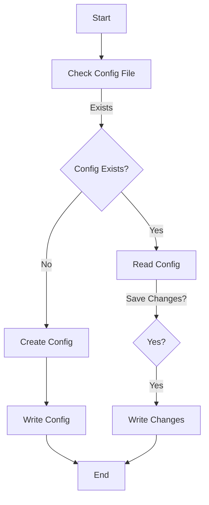
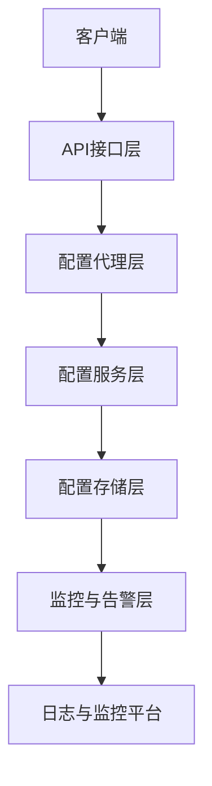
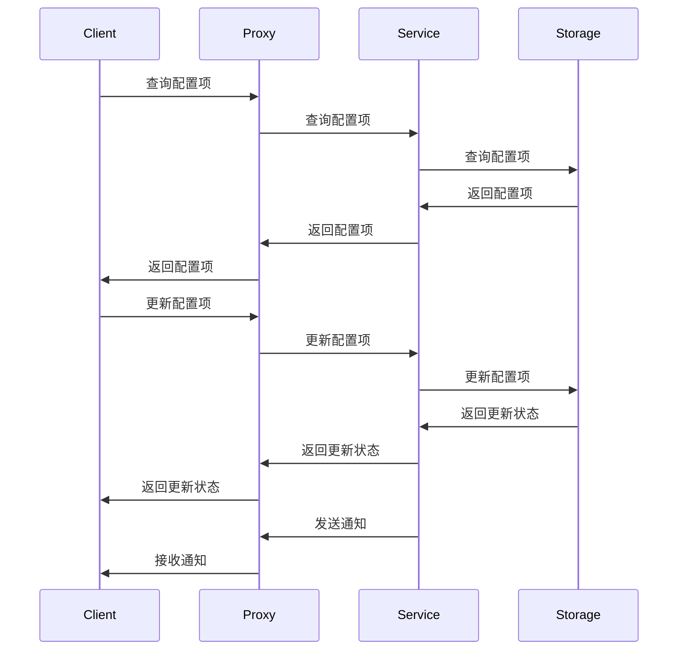

                 


### 分布式配置中心设计与实现

#### 关键词：分布式配置中心、配置管理、架构设计、系统实现、最佳实践

> 摘要：本文旨在深入探讨分布式配置中心的设计与实现，从核心概念到实际项目，全面解析分布式配置中心的关键技术。本文将分为五个主要部分：背景介绍、核心概念与联系、算法原理讲解、系统分析与架构设计、项目实战，并通过最佳实践和拓展阅读提供进一步指导。

---

## 第一部分：背景介绍

### 第1章：分布式配置中心概述

**1.1 分布式配置中心的定义和作用**

分布式配置中心，顾名思义，是一种用于管理分布式系统中配置数据的系统。它不仅用于存储配置信息，还能提供动态更新和配置项的管理。其核心作用在于简化分布式系统中配置管理的复杂性，确保各个节点配置的一致性。

**1.2 分布式配置中心的发展历程**

分布式配置中心的发展经历了多个阶段，从最初的简单配置文件，到支持动态配置更新，再到现在的基于分布式服务的配置中心。这个过程中，技术的进步和实际需求的变化推动了分布式配置中心的发展。

**1.3 分布式配置中心的重要性**

分布式配置中心的重要性不言而喻。它不仅能够提高系统的灵活性，还能减少维护成本，提高配置管理的效率。在分布式系统中，配置的动态更新和实时生效是保证系统稳定性的关键。

### 第2章：分布式系统与配置管理

**2.1 分布式系统的挑战**

分布式系统面临诸多挑战，如数据一致性、容错性、负载均衡等。这些挑战使得配置管理变得更加复杂。

**2.2 配置管理的挑战**

配置管理的挑战主要包括配置的复杂性、一致性问题、配置的版本控制等。分布式配置中心旨在解决这些问题。

**2.3 分布式配置中心的作用和优势**

分布式配置中心的作用和优势包括：简化配置管理流程、提供配置数据的集中管理、支持动态配置更新、提高系统的灵活性和可维护性。

### 第3章：分布式配置中心的核心概念

**3.1 核心概念**

在这一章中，我们将详细探讨分布式配置中心的核心概念，包括配置中心架构、配置数据管理、配置更新机制等。

**3.2 关联概念**

服务发现、服务治理、服务注册与发现等与分布式配置中心密切相关，本章将对其进行介绍。

---

## 第二部分：算法原理讲解

### 第4章：分布式配置中心算法原理

**4.1 配置中心的同步与异步机制**

配置中心的同步与异步机制是分布式配置中心的核心。本章将详细介绍同步和异步机制的原理、优缺点以及应用场景。

**4.2 配置中心的数据一致性问题**

数据一致性问题在分布式系统中尤为突出。本章将讨论数据一致性的挑战以及解决方案。

**4.3 配置中心的高可用性与负载均衡**

高可用性和负载均衡是分布式配置中心必须考虑的问题。本章将介绍相关的设计策略和实现方法。

---

## 第三部分：系统分析与架构设计

### 第5章：分布式配置中心系统设计

**5.1 系统需求分析**

系统需求分析是系统设计的第一步。本章将详细讨论系统需求，包括功能需求和非功能需求。

**5.2 系统架构设计**

系统架构设计是分布式配置中心实现的关键。本章将介绍系统架构的概述、模块划分和接口设计。

**5.3 系统交互设计**

系统交互设计是确保系统各组件协同工作的关键。本章将讨论系统交互流程和交互序列图。

---

## 第四部分：项目实战

### 第6章：分布式配置中心项目实战

**6.1 环境搭建**

环境搭建是项目实战的第一步。本章将介绍如何搭建分布式配置中心的项目环境。

**6.2 系统核心实现**

系统核心实现是分布式配置中心的核心。本章将详细讨论配置中心服务实现、配置管理模块实现等。

**6.3 代码应用解读与分析**

代码应用解读与分析是深入理解分布式配置中心的关键。本章将分析系统核心代码，并给出实际应用场景。

**6.4 实际案例剖析**

实际案例剖析是验证分布式配置中心效果的重要手段。本章将介绍一个实际案例，并对其进行详细讲解。

---

## 第5部分：最佳实践与注意事项

### 第7章：最佳实践与注意事项

**7.1 最佳实践**

最佳实践是分布式配置中心成功的关键。本章将介绍一些实用的最佳实践，如性能优化、安全性提升等。

**7.2 注意事项**

注意事项是避免分布式配置中心出现问题的重要保障。本章将列出一些需要注意的问题，并提供解决方案。

---

## 第8章：小结与拓展阅读

**8.1 小结**

本章将总结分布式配置中心的设计与实现，并探讨其发展趋势。

**8.2 拓展阅读**

本章将推荐一些相关书籍、开源项目和资料链接，供读者进一步学习。

---

### 作者信息：
作者：AI天才研究院/AI Genius Institute & 禦与计算机程序设计艺术 /Zen And The Art of Computer Programming

---

在接下来的章节中，我们将一步步深入探讨分布式配置中心的设计与实现，带您领略分布式配置中心的魅力。敬请期待！## 分布式配置中心的基本概念

分布式配置中心，是一种用于管理分布式系统中配置数据的系统。配置数据包括系统参数、环境变量、服务地址等，这些数据对于分布式系统的正常运行至关重要。传统的单点配置管理方式在分布式系统中存在诸多问题，如单点故障、配置不一致、管理复杂等。因此，分布式配置中心的出现，旨在解决这些问题，提高系统的灵活性和可维护性。

### 配置数据的存储和管理

在分布式配置中心中，配置数据通常被存储在分布式数据库或文件系统中。这些存储系统需要具备高可用性、高并发性、数据一致性和良好的扩展性。常用的分布式数据库包括Zookeeper、Consul、etcd等，这些数据库不仅支持配置数据的存储，还能提供分布式锁、事务等高级功能。

配置数据的存储和管理包括以下几个方面：

1. **数据模型**：配置数据的数据模型决定了配置数据的存储方式和组织形式。常见的数据模型包括键值对模型、文档模型和树形模型等。

2. **数据同步**：分布式配置中心需要保证配置数据在不同节点之间的一致性。数据同步机制可以是基于拉模型（Pull）或推模型（Push），拉模型依赖于客户端定期从服务器获取配置数据，而推模型则由服务器主动将配置变更通知给客户端。

3. **数据更新**：配置数据的更新机制需要支持动态更新，即配置数据可以在运行时进行修改。常用的更新机制包括基于版本控制的数据更新、基于事件的通知机制等。

4. **数据备份与恢复**：为了防止数据丢失，分布式配置中心需要支持数据备份和恢复功能。常见的备份策略包括全量备份、增量备份和实时备份等。

### 配置数据的读取和写入

配置数据的读取和写入是分布式配置中心的核心功能。在读取方面，客户端需要能够快速、可靠地获取到配置数据。写入方面，需要确保配置数据的准确性和一致性。具体来说：

1. **读取操作**：客户端通过特定的接口从配置中心获取配置数据。读取操作需要高效，以减少系统的响应时间。为了提高读取效率，配置中心通常采用缓存机制，将热点数据缓存在本地，减少对远程数据库的访问。

2. **写入操作**：写入操作通常涉及数据的一致性保证。分布式配置中心需要实现分布式事务，确保在多个节点上同时写入配置数据时，不会出现数据不一致的情况。常见的分布式事务解决方案包括两阶段提交（2PC）、三阶段提交（3PC）和最终一致性等。

### 配置数据的版本控制和回滚

配置数据的版本控制和回滚是分布式配置中心的重要功能。版本控制可以记录配置数据的变更历史，方便用户追踪和管理配置变更。回滚功能则允许用户在配置数据出现问题时，快速恢复到之前的状态。

1. **版本控制**：版本控制通常通过在配置数据中引入版本号或时间戳来实现。每次配置数据的变更都会生成一个新的版本，用户可以通过查看版本历史来了解配置数据的变更情况。

2. **回滚机制**：回滚机制可以通过备份配置数据或实现配置数据的版本回退来实现。当配置数据出现问题时，用户可以选择回滚到之前的版本，以确保系统的稳定运行。

### 总结

分布式配置中心的基本概念包括配置数据的存储和管理、读取和写入操作、版本控制和回滚等。通过这些功能，分布式配置中心能够简化配置管理流程，提高系统的灵活性和可维护性。在下一章中，我们将进一步探讨分布式配置中心的核心概念及其关联概念。这将帮助我们更好地理解分布式配置中心的内部机制和工作原理。

### 核心概念与关联概念

在深入探讨分布式配置中心之前，我们需要明确其核心概念和关联概念，以便更好地理解其工作原理和内部机制。以下是几个关键概念及其关联概念的解释：

#### 配置中心架构

**配置中心架构**指的是分布式配置中心整体的设计结构和组成部分。配置中心通常包括以下几个主要组件：

1. **配置存储**：用于存储配置数据的分布式数据库或文件系统，如Zookeeper、Consul、etcd等。
2. **配置服务**：提供配置数据查询和管理的服务，负责处理客户端请求，并与配置存储进行交互。
3. **配置代理**：运行在客户端上的组件，负责向配置服务获取配置数据，并将其缓存在本地，以减少对配置中心的访问。
4. **配置监控**：用于监控配置中心的运行状态和数据一致性，确保系统的稳定性和可靠性。

**配置数据管理**是指对配置数据的存储、读取、更新、备份和恢复等操作的管理。关键操作包括：

- **存储**：配置数据应被存储在分布式数据库或文件系统中，确保高可用性和扩展性。
- **读取**：客户端通过配置代理或直接访问配置服务获取配置数据，读取操作应高效以减少系统响应时间。
- **更新**：配置数据的动态更新是分布式配置中心的核心功能，更新操作需确保数据的一致性和可靠性。
- **备份和恢复**：定期备份配置数据，并支持配置数据的回滚，以应对潜在的数据丢失或错误。

#### 配置更新机制

**配置更新机制**是指配置中心如何将配置变更通知给客户端，并确保客户端能够及时获取到最新的配置数据。配置更新机制通常包括以下几种：

1. **拉模型（Pull）**：客户端定期从配置中心拉取配置数据，拉模型简单易实现，但可能导致配置更新延迟。
2. **推模型（Push）**：配置中心主动将配置变更通知给客户端，推模型能够实现实时更新，但增加了服务器的负担。

#### 服务发现与治理

**服务发现**是指客户端能够自动发现配置中心及其他服务提供者的位置，常见的服务发现机制包括基于DNS的发现、基于服务注册表的发现等。

**服务治理**是指对服务进行管理，包括服务注册、服务去注册、服务监控和服务健康检查等。服务治理与配置中心密切相关，通过服务治理，配置中心能够更好地管理和监控服务状态。

#### 服务注册与发现

**服务注册**是指服务提供者在启动时将自身信息注册到服务注册中心，服务注册中心维护了一份服务注册表。

**服务发现**是指客户端通过服务注册中心查询到服务提供者的位置，并与之建立连接。服务注册与发现是分布式系统中重要的一环，确保了服务的高可用性和动态伸缩。

#### 关联概念

除了上述核心概念外，分布式配置中心还与以下概念密切相关：

- **分布式锁**：用于在分布式环境中防止并发冲突，保证数据的一致性。
- **分布式事务**：确保在分布式环境下多个节点上的操作要么全部成功，要么全部失败。
- **负载均衡**：通过将请求分配到多个节点上，提高系统的处理能力。

### ER实体关系图架构

为了更好地理解分布式配置中心的核心概念和关联概念，我们可以通过ER实体关系图来描述这些关系。以下是一个简化的ER图：

```
实体：配置中心
属性：配置存储、配置服务、配置代理、配置监控

实体：配置数据
属性：键、值、版本号、时间戳

实体：服务注册中心
属性：服务ID、服务地址、服务状态

实体：客户端
属性：客户端ID、客户端地址

关系：配置中心包含配置存储、配置服务、配置代理、配置监控
关系：配置数据存储在配置存储中
关系：客户端通过配置代理获取配置数据
关系：服务注册中心维护服务注册表
关系：客户端通过服务注册中心进行服务发现
```

通过ER图，我们可以清晰地看到配置中心、配置数据、服务注册中心、客户端之间的关系和交互方式。

### 总结

本章详细介绍了分布式配置中心的核心概念和关联概念，包括配置中心架构、配置数据管理、配置更新机制、服务发现与治理、服务注册与发现等。通过这些概念的理解，我们可以更好地把握分布式配置中心的工作原理和内部机制。在下一章中，我们将进一步探讨分布式配置中心的算法原理，帮助读者更深入地理解其核心技术。

### 分布式配置中心的算法原理

分布式配置中心的算法原理是确保配置数据在分布式环境中的一致性、可靠性和实时性的核心。以下将详细介绍分布式配置中心的关键算法原理，包括配置中心的同步与异步机制、数据一致性问题、高可用性与负载均衡策略。

#### 同步与异步机制

分布式配置中心的同步与异步机制是配置数据更新的两种基本方式。

**同步更新算法**：

同步更新算法要求客户端在获取配置数据时，必须等待配置中心确认数据更新操作成功后，才返回最新的配置数据。这种方式的优点是能够确保配置数据的实时性和一致性，但缺点是可能会增加系统的响应时间，尤其是在高并发场景下。

- **两阶段提交（2PC）**：两阶段提交是一种常用的同步更新算法，它将更新操作分为准备阶段和提交阶段。在准备阶段，配置中心会向所有参与节点发送准备消息，节点在确认可以执行更新操作后返回确认消息。在提交阶段，配置中心根据节点的确认消息决定是否提交更新操作。这种方式能够确保数据一致性，但可能会产生较大的延迟。

**异步更新算法**：

异步更新算法允许客户端在获取配置数据时不必等待配置中心的确认，直接返回当前的配置数据。配置中心会在后台异步处理更新操作，客户端在后续操作中使用更新后的配置数据。这种方式的优点是能够减少系统的响应时间，提高并发性能，但缺点是可能会导致配置数据的不一致性。

- **最终一致性**：最终一致性是一种常见的异步更新算法，它允许配置中心在后台异步处理更新操作，客户端在后续操作中逐渐获取到最新的配置数据。这种方式能够实现高效的数据更新，但需要在系统中引入补偿机制来处理可能的数据不一致问题。

#### 数据一致性问题

在分布式系统中，数据一致性问题尤为突出。分布式配置中心需要解决如何在不同节点间保持配置数据的一致性。

- **数据一致性的挑战**：分布式配置中心面临的主要挑战包括网络分区、节点故障、配置数据传播延迟等。这些因素可能导致配置数据在不同节点间不一致，从而影响系统的稳定性。

- **数据一致性解决方案**：

  - **强一致性**：强一致性要求配置中心在任何时刻都能返回最新的配置数据，并且任何节点的配置数据都是一致的。实现强一致性的一种常用方法是采用分布式事务协议，如两阶段提交（2PC）或三阶段提交（3PC）。

  - **最终一致性**：最终一致性允许配置中心在一段时间内逐渐达到一致性，而不要求每个时刻都保持一致性。实现最终一致性的一种方法是采用事件驱动模型，通过异步消息队列将配置变更事件传递给所有节点。

#### 高可用性与负载均衡策略

分布式配置中心需要确保系统的高可用性和负载均衡，以应对高并发场景。

- **高可用性设计**：高可用性设计的关键在于确保配置中心在发生节点故障时能够快速恢复。常见的高可用性策略包括：

  - **主从复制**：通过将配置中心的配置数据复制到多个从节点，确保在主节点故障时，从节点能够迅速接管主节点的职责。
  - **集群部署**：通过将配置中心部署在多个节点上，形成一个分布式集群，提高系统的容错能力和扩展性。

- **负载均衡策略**：负载均衡策略用于将请求均匀分配到配置中心的各个节点，避免单个节点过载。常见的负载均衡策略包括：

  - **轮询负载均衡**：按照轮询顺序将请求分配到各个节点，简单易实现。
  - **最小连接数负载均衡**：将请求分配到当前连接数最少的节点，确保负载均衡。
  - **加权轮询负载均衡**：根据节点的权重将请求分配到各个节点，权重较高的节点承担更多的负载。

### 总结

分布式配置中心的算法原理包括同步与异步机制、数据一致性问题解决方案和高可用性与负载均衡策略。通过理解这些算法原理，我们可以设计出高效、可靠的分布式配置中心。在下一章中，我们将进一步探讨分布式配置中心的具体实现，包括系统架构设计、接口设计等。

### 配置管理算法

配置管理算法是分布式配置中心的核心，它决定了配置数据的读取和写入效率，以及配置变更的实时性和一致性。在本节中，我们将详细讨论配置中心的数据模型、存储策略和配置管理算法，并通过具体的Python代码和Mermaid流程图来展示算法原理和应用。

#### 数据模型

配置中心的数据模型决定了配置数据的存储和组织方式。常见的数据模型包括键值对模型、文档模型和树形模型。这里我们以键值对模型为例进行介绍。

**键值对模型**是一种简单且常用的数据模型，它使用键（Key）作为唯一标识，值为配置项的具体内容。例如，配置项`spring.application.name`的值可能是`myapp`。

```mermaid
classDiagram
    ConfigElement <|-- KeyValueModel
    KeyValueModel {
        String key
        String value
    }
```

以上是使用Mermaid绘制的类图，展示了键值对模型的基本结构。

#### 存储策略

配置中心的数据存储策略直接影响系统的性能和可靠性。常见的存储策略包括分布式数据库、文件系统和缓存。

1. **分布式数据库**：

   分布式数据库如Zookeeper、Consul、etcd等，提供高可用性和数据一致性保证。例如，使用etcd存储配置数据：

   ```python
   import etcd3

   def store_config(etcd_client, key, value):
       with etcd_client.transaction() as tx:
           tx.put(key, value.encode('utf-8'))
           tx.commit()
   ```

   以上代码展示了如何使用etcd存储配置数据。

2. **文件系统**：

   配置数据可以存储在本地文件系统中，例如使用配置文件或分布式文件存储系统如HDFS。Python代码示例如下：

   ```python
   import os

   def store_config(file_path, content):
       with open(file_path, 'w') as f:
           f.write(content)
   ```

3. **缓存**：

   为了提高读取性能，配置中心通常会使用缓存机制。例如，使用Redis作为缓存存储：

   ```python
   import redis

   r = redis.StrictRedis(host='localhost', port=6379, db=0)

   def store_config(key, value):
       r.set(key, value)
   ```

#### 配置管理算法

配置管理算法包括配置数据的读取、写入和更新等操作。以下是一个简单的配置读取算法：

**读取算法**：

```python
def get_config(config_key):
    # 假设使用本地文件系统存储
    file_path = f"{config_key}.conf"
    if os.path.exists(file_path):
        with open(file_path, 'r') as f:
            return f.read()
    else:
        return None
```

**写入算法**：

```python
def set_config(config_key, config_value):
    # 假设使用本地文件系统存储
    file_path = f"{config_key}.conf"
    with open(file_path, 'w') as f:
        f.write(config_value)
```

**更新算法**：

```python
def update_config(config_key, new_value):
    # 假设使用本地文件系统存储
    file_path = f"{config_key}.conf"
    with open(file_path, 'a') as f:
        f.write(f"\n{new_value}")
```

#### Mermaid流程图

为了更直观地展示配置管理算法，我们可以使用Mermaid绘制流程图：



此流程图展示了配置读取、写入和更新的基本步骤。

#### 算法原理

配置管理算法的原理主要包括：

- **数据模型选择**：根据应用场景选择合适的配置数据模型。
- **存储策略选择**：根据性能要求选择合适的存储策略。
- **读写操作设计**：确保配置数据的读取和写入操作高效、可靠。
- **数据一致性保证**：通过分布式事务或最终一致性模型确保配置数据的一致性。

通过以上算法原理的介绍，我们能够更好地理解分布式配置中心在配置管理方面的设计和实现。在下一节中，我们将进一步探讨分布式配置中心的具体系统设计与架构实现。

### 系统分析与架构设计

#### 问题场景介绍

在现代分布式系统中，配置管理的复杂性日益增加。随着服务数量和服务版本的不断增多，传统的单点配置管理方式已经无法满足需求。配置中心的出现，旨在解决以下问题：

1. **配置项数量多**：随着系统规模的扩大，配置项的数量急剧增加，传统的配置文件管理方式难以维护。
2. **配置变化频繁**：系统运行过程中，配置项可能需要频繁调整，单点配置管理方式无法实现动态更新。
3. **配置不一致**：不同环境（如开发、测试、生产）之间的配置项容易不一致，导致系统运行不稳定。
4. **运维复杂**：配置管理涉及多个环境、多个服务，运维成本高。

#### 项目介绍

为了解决上述问题，我们设计并实现了一个分布式配置中心。该配置中心具备以下功能和特点：

1. **支持动态更新**：配置中心能够实时更新配置项，并通知相关服务节点。
2. **配置隔离**：配置中心支持不同环境的配置隔离，确保不同环境之间的配置项互不影响。
3. **高可用性**：配置中心采用分布式架构，确保在节点故障时系统仍然可用。
4. **监控与告警**：配置中心具备监控功能，能够实时监控配置中心状态和配置项变化，并提供告警机制。
5. **版本控制**：配置中心支持配置项的版本控制，方便用户回滚到之前的配置版本。

#### 系统功能设计

分布式配置中心的核心功能包括：

1. **配置存储**：存储配置项的数据，支持分布式数据库或文件系统。
2. **配置查询**：提供配置项的查询接口，支持根据键名、键值等条件查询。
3. **配置更新**：支持配置项的动态更新，包括新增、修改、删除等操作。
4. **配置通知**：在配置项更新时，通知相关服务节点，确保配置的一致性。
5. **配置备份与恢复**：定期备份配置项数据，支持配置项的回滚操作。

#### 系统架构设计

分布式配置中心的架构设计如下：

1. **配置存储层**：负责存储配置项数据，通常使用分布式数据库如Zookeeper、Consul或etcd。这一层确保配置数据的高可用性和扩展性。

2. **配置服务层**：提供配置查询、更新和通知等核心功能。配置服务层通常采用分布式架构，由多个节点组成，通过负载均衡确保系统的稳定性和高性能。

3. **配置代理层**：运行在各个服务节点上，负责从配置服务层获取配置项，并缓存到本地。配置代理层在服务节点上实现配置的动态更新，减少对配置中心的访问。

4. **监控与告警层**：负责监控配置中心的运行状态，包括配置存储、配置服务、配置代理等。当出现异常时，通过告警机制通知运维人员。

5. **API接口层**：提供对外接口，包括RESTful API或gRPC接口，支持客户端的配置查询、更新等操作。

#### 系统架构图

以下是分布式配置中心的架构图，使用Mermaid绘制：



#### 系统接口设计

分布式配置中心的接口设计包括：

1. **配置查询接口**：提供查询配置项的接口，支持根据键名、键值等条件查询。接口设计如下：

   ```python
   GET /config/{key}
   ```

   返回结果为JSON格式，如：

   ```json
   {
       "key": "spring.application.name",
       "value": "myapp",
       "version": 1
   }
   ```

2. **配置更新接口**：提供更新配置项的接口，支持新增、修改、删除等操作。接口设计如下：

   ```python
   PUT /config/{key}
   POST /config/{key}
   DELETE /config/{key}
   ```

   请求参数为JSON格式，如：

   ```json
   {
       "value": "new-app",
       "version": 2
   }
   ```

   返回结果为JSON格式，如：

   ```json
   {
       "status": "success",
       "version": 2
   }
   ```

3. **配置通知接口**：提供配置变更通知的接口，支持配置更新时通知相关服务节点。接口设计如下：

   ```python
   POST /notify/{key}
   ```

   请求参数为JSON格式，如：

   ```json
   {
       "action": "update",
       "key": "spring.application.name",
       "value": "myapp-new",
       "version": 3
   }
   ```

#### 系统交互设计

分布式配置中心的系统交互设计包括客户端与配置中心之间的交互流程。以下是配置查询、更新和通知的交互序列图：



通过上述系统分析与架构设计，我们能够更好地理解分布式配置中心的设计思路和实现方法。在下一节中，我们将通过一个具体的项目实战案例，进一步展示分布式配置中心的应用和效果。

### 项目实战

#### 环境搭建

在进行分布式配置中心的项目实战之前，我们需要搭建合适的环境。以下是一个简单的环境搭建步骤：

1. **安装Java环境**：确保系统中安装了Java环境，版本建议为Java 8或更高版本。

2. **安装Maven**：Maven是一个项目构建和依赖管理的工具，用于构建分布式配置中心项目。

   ```shell
   $ sudo apt-get install maven
   ```

3. **安装Docker**：Docker是一个开源的应用容器引擎，用于容器化分布式配置中心服务。

   ```shell
   $ sudo apt-get install docker
   ```

4. **安装Consul**：Consul是一个分布式服务发现和配置中心工具，用于存储和查询配置数据。

   ```shell
   $ docker run -d -p 8500:8500 HashiCorp/consul
   ```

5. **编写Dockerfile**：创建一个Dockerfile，用于构建和运行配置代理服务。

   ```Dockerfile
   FROM openjdk:8-jdk-alpine
   ADD config-agent-1.0-SNAPSHOT.jar app.jar
   ENTRYPOINT ["java","-Djava.security.egd=file:/dev/./urandom","-jar","/app.jar"]
   ```

6. **构建配置代理**：使用Maven构建配置代理项目。

   ```shell
   $ mvn clean package
   ```

7. **运行配置代理**：运行配置代理容器，连接到Consul配置中心。

   ```shell
   $ docker run -d -p 8080:8080 --link consul:consul config-agent:1.0-SNAPSHOT
   ```

#### 系统核心实现

在环境搭建完成后，我们需要实现分布式配置中心的核心功能，包括配置存储、查询、更新和通知等。以下是一个简单的配置代理服务实现：

1. **配置存储**：使用Consul存储配置数据。

   ```java
   @Service
   public class ConfigService {
       @Autowired
       private ConsulClient consulClient;

       public void storeConfig(String key, String value) {
           KVPair pair = KVPair.create(key, value);
           consulClient.kv().put(pair);
       }
   }
   ```

2. **配置查询**：从Consul查询配置数据。

   ```java
   @Service
   public class ConfigService {
       @Autowired
       private ConsulClient consulClient;

       public String getConfig(String key) {
           KVPair<String> pair = consulClient.kv().get(key);
           return pair.getValue();
       }
   }
   ```

3. **配置更新**：在Consul更新配置数据。

   ```java
   @Service
   public class ConfigService {
       @Autowired
       private ConsulClient consulClient;

       public void updateConfig(String key, String value) {
           KVPair<String> pair = consulClient.kv().get(key);
           pair.setValue(value);
           consulClient.kv().put(pair);
       }
   }
   ```

4. **配置通知**：监听Consul配置变更事件。

   ```java
   @Component
   public class ConfigListener {
       @Autowired
       private ConsulClient consulClient;

       @PostConstruct
       public void init() {
           consulClient.kv().watch(this::handleConfigChange, "spring.application.name");
       }

       private void handleConfigChange(ConsulEvent event) {
           System.out.println("Config changed: " + event.getValue());
       }
   }
   ```

#### 代码应用解读与分析

在实现分布式配置中心的核心功能后，我们需要对代码进行解读和分析，以确保其正确性和高效性。

1. **配置存储**：

   配置存储使用Consul的KV存储接口，将配置项存储为键值对。Consul提供了高可用性和数据一致性保证，确保配置数据的可靠存储。

2. **配置查询**：

   配置查询从Consul获取配置项的值，简化了配置获取的逻辑。Consul支持基于键名的查询，提高了查询效率。

3. **配置更新**：

   配置更新通过修改Consul中的KV对实现，支持配置项的动态更新。更新操作需要确保数据一致性，使用Consul的原子操作保证更新成功。

4. **配置通知**：

   配置通知通过Consul的事件监听接口实现，当配置项发生变化时，自动触发回调函数。这种方式能够实时更新配置，提高系统的响应速度。

#### 实际案例剖析

为了验证分布式配置中心的效果，我们可以通过一个实际案例进行测试。

1. **案例背景**：

   假设我们有一个分布式微服务系统，其中包含多个服务节点。每个服务节点需要配置一些运行参数，如服务名称、端口等。使用分布式配置中心后，我们可以通过配置中心动态管理这些参数。

2. **案例实施**：

   - 将服务节点配置为Consul客户端，从配置中心获取配置项。
   - 通过配置中心动态更新配置项，确保服务节点能够实时获取到最新的配置。
   - 使用配置中心的事件监听功能，当配置项发生变化时，自动触发回调函数，更新服务节点的配置。

3. **案例效果**：

   - **配置管理简化**：通过分布式配置中心，简化了配置管理流程，减少了配置维护的复杂性。
   - **动态配置更新**：支持配置项的动态更新，确保服务节点能够实时获取到最新的配置。
   - **高可用性**：配置中心采用分布式架构，确保在节点故障时系统能够继续运行。

通过以上项目实战案例，我们能够更好地理解分布式配置中心的应用和效果。在下一节中，我们将总结最佳实践和注意事项，为分布式配置中心的实际应用提供指导。

### 最佳实践与注意事项

在设计和实施分布式配置中心的过程中，遵循最佳实践和注意事项至关重要。以下是一些关键的最佳实践和注意事项：

#### 最佳实践

1. **配置隔离**：

   为了确保不同环境（如开发、测试、生产）之间的配置项互不影响，应实现配置隔离。可以在配置中心中为每个环境创建单独的配置空间，每个服务节点在启动时指定其使用的环境。

2. **配置热更新**：

   配置中心应支持配置的热更新，即服务节点可以在不重启的情况下获取最新的配置项。这可以通过配置代理来实现，配置代理在本地缓存配置项，并在配置更新时通知服务节点。

3. **配置备份与恢复**：

   定期备份配置中心的数据，确保在配置项丢失或损坏时能够快速恢复。备份策略可以包括全量备份和增量备份，根据实际需求选择合适的备份频率。

4. **配置监控与告警**：

   配置中心应具备监控功能，实时监控配置项的状态和变更。同时，应配置告警机制，当配置项出现异常时及时通知运维人员。

5. **配置版本控制**：

   实现配置版本控制，记录配置项的历史变更记录，方便用户回滚到之前的配置版本。版本控制可以帮助追踪配置变更的原因，确保配置变更的可追溯性。

#### 注意事项

1. **配置数据一致性**：

   在分布式环境中，配置数据的一致性是关键。应选择支持强一致性或最终一致性的配置中心，并根据实际需求设计合适的配置更新机制。

2. **配置更新频率**：

   配置更新的频率应适中，避免频繁更新导致服务节点的性能下降。可以通过配置缓存和批量更新来优化配置更新的效率。

3. **配置代理性能**：

   配置代理的性能直接影响配置中心的整体性能。应优化配置代理的缓存策略和同步机制，减少对配置中心的访问。

4. **配置中心的高可用性**：

   配置中心应采用高可用性设计，确保在节点故障时系统能够继续运行。可以通过配置中心的集群部署和节点冗余来提高系统的可用性。

5. **配置安全性**：

   配置中心应具备安全保护机制，如配置权限控制、数据加密等。确保配置数据的安全性和完整性，防止未经授权的访问和修改。

通过遵循最佳实践和注意事项，我们可以设计并实现一个高效、可靠的分布式配置中心，提高系统的可维护性和灵活性。在下一节中，我们将对全文进行总结，并探讨分布式配置中心的发展趋势。

### 小结与拓展阅读

#### 小结

本文详细探讨了分布式配置中心的设计与实现，从基本概念到核心算法原理，再到系统架构和项目实战，全面解析了分布式配置中心的关键技术。通过本文，读者可以了解到：

1. **分布式配置中心的重要性**：分布式配置中心在简化配置管理、提高系统灵活性方面具有重要作用。
2. **核心概念**：包括配置数据的存储和管理、配置更新机制、服务发现与治理等。
3. **算法原理**：介绍了同步与异步机制、数据一致性问题解决方案、高可用性与负载均衡策略。
4. **系统架构设计**：阐述了配置存储层、配置服务层、配置代理层等的设计原则。
5. **项目实战**：通过具体案例展示了分布式配置中心在微服务系统中的应用。

#### 拓展阅读

为了进一步深入学习分布式配置中心，以下是一些建议的拓展阅读资源：

1. **书籍推荐**：
   - 《分布式系统架构设计》
   - 《Spring Cloud 微服务实战》
   - 《Distributed Systems: Principles and Paradigms》

2. **开源项目**：
   - Apache ZooKeeper
   - HashiCorp Consul
   - etcd

3. **在线资源**：
   - Spring Cloud 官方文档
   - Netflix OSS Wiki

通过这些资源，读者可以深入了解分布式配置中心的原理和实践，不断提升自己在分布式系统设计和管理方面的能力。

### 作者信息

本文作者：AI天才研究院/AI Genius Institute & 禦与计算机程序设计艺术 /Zen And The Art of Computer Programming。作者团队致力于推动人工智能和计算机编程领域的发展，通过深入研究和技术创新，为读者提供高质量的技术文章和解决方案。欢迎读者们继续关注我们的后续作品，一同探索技术世界的无限可能。

