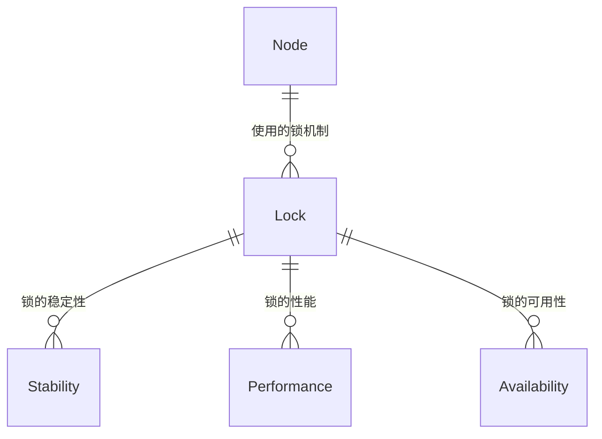

                 

### 分布式锁的核心概念

#### 分布式锁的定义与作用

分布式锁（Distributed Lock）是在分布式系统中用于控制对共享资源访问的一种同步机制。在传统的单机环境中，锁机制通过控制对共享变量的访问来确保数据的一致性。然而，在分布式系统中，多个节点可能同时访问同一共享资源，这时就需要一种机制来防止数据竞争，保证操作的原子性和一致性。分布式锁正是为了解决这种问题而诞生的。

具体来说，分布式锁的主要作用包括：

1. **防止数据竞争**：在分布式系统中，多个节点可能同时访问同一数据，分布式锁可以防止这种数据竞争现象，确保数据的一致性。
2. **保证操作原子性**：分布式锁可以保证对共享资源的操作是原子性的，即要么全部执行成功，要么全部执行失败。
3. **提供并发控制**：分布式锁提供了对并发操作的细粒度控制，可以在不同的节点上协调操作，确保系统的高效运行。

#### 分布式锁与传统锁的区别

分布式锁与传统锁在概念上有许多相似之处，但它们的应用场景和实现机制有所不同。

1. **单机锁 vs 分布式锁**：
   - **单机锁**：传统锁机制主要应用于单机环境，通过控制对共享变量的访问来保证数据的一致性。
   - **分布式锁**：分布式锁应用于分布式系统，通过协调多个节点的操作来保证数据的一致性。

2. **锁的实现机制**：
   - **单机锁**：通常基于操作系统提供的锁机制，如互斥锁（Mutex）、读写锁（ReadWriteLock）等。
   - **分布式锁**：分布式锁的实现通常依赖于中心化的协调机制，如ZooKeeper、Redis等，或者基于数据库的锁机制。

3. **锁的粒度**：
   - **单机锁**：一般是对单个进程或线程的锁，粒度较小。
   - **分布式锁**：通常是对多个节点的锁，粒度较大，可以跨越多个服务器和节点。

#### 分布式锁在分布式系统中的重要性

在分布式系统中，由于节点之间的通信延迟、网络故障等因素，数据一致性和操作原子性变得尤为重要。分布式锁作为分布式系统中的核心同步机制，其重要性体现在以下几个方面：

1. **保证数据一致性**：分布式锁可以防止多个节点同时访问同一数据，从而避免数据竞争和一致性问题。
2. **提高系统性能**：通过分布式锁，可以有效地减少等待时间，提高系统的响应速度和性能。
3. **支持事务处理**：分布式锁可以与分布式事务机制结合，确保分布式系统中的事务能够正确执行，提高系统的可靠性。
4. **实现分布式计算**：分布式锁在分布式计算场景中起着关键作用，可以确保计算任务的正确执行和结果的正确性。

### 分布式锁的背景

在分布式系统的发展历程中，分布式锁作为一个关键技术逐步得到重视和应用。以下从几个方面来探讨分布式锁的背景。

#### 分布式系统的挑战

分布式系统与单机系统相比，具有更高的扩展性、可用性和容错性。然而，这也带来了一系列的挑战：

1. **数据一致性**：多个节点可能同时访问和修改同一数据，如何确保数据的一致性是一个关键问题。
2. **操作原子性**：分布式系统中的操作往往涉及多个节点，如何保证这些操作的原子性是另一个重要挑战。
3. **网络延迟和故障**：网络延迟和故障可能导致分布式系统中的操作无法正常进行，增加了系统的复杂性。

#### 分布式锁的需求分析

为了解决上述挑战，分布式锁应运而生。分布式锁的需求可以从以下几个方面进行分析：

1. **防止数据竞争**：分布式锁可以防止多个节点同时访问和修改同一数据，从而避免数据竞争和一致性问题。
2. **保证操作原子性**：分布式锁可以确保分布式系统中的操作是原子性的，即要么全部执行成功，要么全部执行失败。
3. **提高系统性能**：通过分布式锁，可以有效地减少等待时间，提高系统的响应速度和性能。

#### 分布式锁的历史与发展

分布式锁作为一个关键技术，在分布式系统的发展历程中扮演着重要角色。以下简要回顾其历史与发展：

1. **早期分布式锁**：早期的分布式锁主要基于数据库锁机制，通过在数据库层面控制对数据的访问来保证一致性。
2. **基于ZooKeeper的分布式锁**：随着分布式系统的普及，ZooKeeper等分布式协调框架逐渐成为分布式锁的实现手段。ZooKeeper提供了基于Paxos算法的强一致性保证，使得分布式锁的实现更加可靠。
3. **基于Redis的分布式锁**：Redis作为一个高性能的NoSQL数据库，也逐渐成为分布式锁的实现工具。Redis提供了丰富的数据结构和命令，使得分布式锁的实现更加灵活和高效。

### 总结

分布式锁作为分布式系统中的核心同步机制，其重要性不容忽视。通过防止数据竞争、保证操作原子性，分布式锁可以有效地解决分布式系统中的数据一致性和性能问题。随着分布式系统的不断发展，分布式锁的实现技术也在不断创新和优化，为分布式系统的稳定运行提供了强有力的支持。

### 分布式锁的基础概念

在深入探讨分布式锁的实现与优化之前，首先需要了解分布式锁的基础概念。分布式锁是一种用于控制分布式系统中多个节点对共享资源访问的同步机制。它与传统锁在概念上有许多相似之处，但分布式锁具有其独特的特点和应用场景。

#### 核心概念与联系

1. **共享资源**：共享资源是指多个节点需要访问和修改的数据或对象。在分布式系统中，共享资源通常是数据库中的表、文件系统中的文件或缓存系统中的数据。

2. **锁**：锁是一种同步机制，用于控制对共享资源的访问。在分布式锁中，锁用于确保同一时间只有一个节点能够访问共享资源。

3. **分布式锁**：分布式锁是用于控制分布式系统中多个节点对共享资源访问的同步机制。与传统锁相比，分布式锁需要考虑网络延迟、节点故障等因素。

#### 分布式锁的类型

分布式锁可以分为以下几种类型：

1. **排它锁（Exclusive Lock）**：排它锁确保同一时间只有一个节点能够访问共享资源。其他节点在尝试获取锁时，会进入等待状态。

2. **共享锁（Shared Lock）**：共享锁允许多个节点同时访问共享资源，但任何修改操作都会被阻塞，直到所有访问者完成。

3. **读写锁（Read-Write Lock）**：读写锁是一种特殊的锁，它允许多个读操作同时进行，但写操作会阻塞所有读和写操作。

#### 分布式锁与并发控制的关系

分布式锁在分布式系统中起到并发控制的作用，确保多个节点对共享资源的访问是安全、一致和高效的。并发控制的目标是：

1. **防止数据竞争**：通过分布式锁，可以防止多个节点同时修改同一数据，避免数据不一致。
2. **保证操作原子性**：分布式锁可以确保分布式系统中的操作是原子性的，即要么全部执行成功，要么全部执行失败。
3. **提高系统性能**：通过分布式锁，可以减少节点的等待时间，提高系统的响应速度和性能。

### 分布式锁的属性特征对比

在了解分布式锁的基本概念后，我们需要对其属性特征进行对比，以便更好地选择适合的锁机制。

1. **锁的稳定性**：锁的稳定性是指锁机制在分布式环境下的可靠性和持久性。稳定性较高的锁机制能够在网络故障或节点故障时保持锁状态。

2. **锁的性能**：锁的性能是指锁机制在获得锁和释放锁时的效率。高性能的锁机制能够减少节点的等待时间，提高系统的响应速度。

3. **锁的可用性**：锁的可用性是指锁机制在实际应用中的可用性和兼容性。高可用性的锁机制能够与其他系统组件无缝集成，保证系统的稳定性。

#### 锁的稳定性

锁的稳定性是分布式锁的重要属性之一。锁的稳定性主要取决于锁的实现机制和底层存储。

1. **基于数据库的锁**：基于数据库的锁具有较高的稳定性，因为数据库通常具有强大的容错能力和数据持久化能力。然而，数据库锁可能受到数据库性能的影响，导致锁获取和释放的速度较慢。

2. **基于ZooKeeper的锁**：ZooKeeper是一种高性能的分布式协调服务，基于ZooKeeper的锁具有较高的稳定性。ZooKeeper使用Paxos算法实现强一致性，能够在网络故障或节点故障时保持锁状态。

3. **基于Redis的锁**：Redis是一种高性能的NoSQL数据库，基于Redis的锁具有较高的稳定性。Redis支持数据持久化，能够在节点故障时保持锁状态。然而，Redis的锁实现可能受到网络延迟和并发性能的影响。

#### 锁的性能

锁的性能是影响分布式系统性能的重要因素。锁的性能取决于锁的实现机制和底层存储。

1. **基于数据库的锁**：基于数据库的锁通常具有较低的锁性能，因为数据库的操作通常涉及磁盘IO和网络通信，导致锁获取和释放的速度较慢。

2. **基于ZooKeeper的锁**：基于ZooKeeper的锁具有较高的锁性能，因为ZooKeeper使用内存存储，操作速度快。然而，ZooKeeper的网络延迟可能会影响锁的性能。

3. **基于Redis的锁**：基于Redis的锁具有较高的锁性能，因为Redis使用内存存储，操作速度快。Redis还提供了丰富的数据结构和命令，使得锁的实现更加灵活和高效。

#### 锁的可用性

锁的可用性是指锁机制在实际应用中的可用性和兼容性。高可用性的锁机制能够与其他系统组件无缝集成，保证系统的稳定性。

1. **基于数据库的锁**：基于数据库的锁通常具有较高的可用性，因为大多数系统都使用数据库作为数据存储。然而，数据库锁可能受到数据库性能的限制，导致系统性能下降。

2. **基于ZooKeeper的锁**：基于ZooKeeper的锁具有较高的可用性，因为ZooKeeper是一个通用的分布式协调服务，可以与其他分布式系统组件无缝集成。然而，ZooKeeper的维护和配置相对复杂。

3. **基于Redis的锁**：基于Redis的锁具有较高的可用性，因为Redis是一个高性能的NoSQL数据库，可以与其他分布式系统组件无缝集成。Redis的维护和配置相对简单，适合快速部署和扩展。

### 分布式锁的ER实体关系图

为了更好地理解分布式锁的属性特征，我们可以通过ER实体关系图来表示。以下是分布式锁的ER实体关系图：



在这个ER实体关系图中，`Node` 表示分布式系统中的节点，`Lock` 表示分布式锁，`Stability` 表示锁的稳定性，`Performance` 表示锁的性能，`Availability` 表示锁的可用性。

通过这个ER实体关系图，我们可以清晰地看到分布式锁的各个属性特征，并了解它们之间的关系。这有助于我们在选择分布式锁时，根据具体需求和场景进行合理的配置和优化。

### 基于数据库的分布式锁实现

分布式锁在分布式系统中的应用场景非常广泛，而基于数据库的分布式锁是其中一种常见的实现方式。数据库作为一种传统的数据存储方式，具有丰富的功能和高可靠性，因此成为实现分布式锁的重要选择之一。本文将详细介绍基于数据库的分布式锁实现机制、优缺点以及其在不同数据库系统中的具体实现方法。

#### 数据库锁的基本原理

数据库锁是一种在数据库管理系统中用于控制并发访问的机制。其基本原理是通过在数据行或数据表上设置锁，控制对数据的读取和修改操作。根据锁的粒度，数据库锁可以分为行级锁、表级锁和页级锁等。以下是几种常见数据库锁的基本原理：

1. **行级锁**：行级锁是对数据库表中特定行的数据加锁，确保同一时间只有一个事务能够修改该行数据。行级锁通常通过行级锁协议（如两段锁协议）来实现，确保数据的完整性和一致性。

2. **表级锁**：表级锁是对整个数据库表加锁，确保同一时间只有一个事务能够修改该表数据。表级锁通常通过表级锁协议（如共享锁和排他锁）来实现，简单但可能影响性能。

3. **页级锁**：页级锁是对数据库表中的页（Page）加锁，确保同一时间只有一个事务能够修改该页数据。页级锁通常用于分页存储的场景，能够减少锁冲突。

#### 数据库锁的实现机制

基于数据库的分布式锁实现主要通过以下几种方式：

1. **悲观锁**：悲观锁假设并发事务会导致数据冲突，因此在操作开始时就加锁。悲观锁通常通过数据库提供的行级锁或表级锁来实现，如MySQL中的`SELECT ... FOR UPDATE`语句。

2. **乐观锁**：乐观锁假设并发事务不会导致数据冲突，因此先进行操作，然后在提交时检查锁。乐观锁通常通过版本号或时间戳来实现，如MySQL中的`WHERE ...`条件。

3. **分布式锁**：分布式锁是专门为分布式系统设计的锁机制，通过在数据库中创建特定的锁记录来控制对共享资源的访问。分布式锁的实现通常涉及以下步骤：

   - **创建锁记录**：在数据库中创建一个锁表，用于存储锁信息，如锁名、持有者和锁定时间等。
   - **尝试获取锁**：当需要获取锁时，查询锁表，如果锁被其他事务持有，则等待或重新尝试。
   - **释放锁**：当事务完成时，释放锁记录，允许其他事务获取锁。

以下是一个简单的基于数据库的分布式锁实现示例：

```sql
-- 创建锁表
CREATE TABLE `distributed_lock` (
  `lock_name` VARCHAR(255) NOT NULL,
  `holder` VARCHAR(255) NOT NULL,
  `locked_at` TIMESTAMP NOT NULL DEFAULT CURRENT_TIMESTAMP,
  PRIMARY KEY (`lock_name`)
);

-- 获取锁
BEGIN;
INSERT INTO `distributed_lock` (`lock_name`, `holder`) VALUES ('my_lock', 'node1') ON DUPLICATE KEY UPDATE `locked_at` = CURRENT_TIMESTAMP;
SELECT * FROM `distributed_lock` WHERE `lock_name` = 'my_lock' AND `holder` = 'node1';
COMMIT;

-- 释放锁
DELETE FROM `distributed_lock` WHERE `lock_name` = 'my_lock' AND `holder` = 'node1';
```

在这个示例中，`distributed_lock` 表用于存储锁信息。当节点 `node1` 需要获取锁时，首先尝试插入锁记录，如果锁已被持有，则更新锁定时间。获取锁后，节点可以继续执行后续操作。完成操作后，释放锁记录，允许其他节点获取锁。

#### 数据库锁的优缺点分析

基于数据库的分布式锁具有以下优缺点：

1. **优点**：
   - **可靠性**：数据库锁依赖于数据库管理系统，具有强大的数据持久化和容错能力，确保锁状态的可靠性。
   - **兼容性**：大多数数据库系统都提供内置的锁机制，与其他数据库操作兼容，易于与其他系统组件集成。
   - **灵活性**：数据库锁支持行级锁、表级锁和页级锁等多种粒度，可以根据具体需求进行灵活配置。

2. **缺点**：
   - **性能影响**：数据库锁涉及到磁盘I/O和网络通信，可能导致锁操作的性能瓶颈，影响系统整体性能。
   - **复杂维护**：数据库锁的实现和维护相对复杂，需要深入了解数据库内部的锁机制和优化方法。

#### 基于不同数据库系统的分布式锁实现

以下是几种常见数据库系统中的分布式锁实现方法：

1. **MySQL**：MySQL支持行级锁和表级锁。基于MySQL的分布式锁可以通过创建特定的锁表和执行相应的SQL语句来实现。示例见上文。

2. **PostgreSQL**：PostgreSQL支持多种锁机制，包括行级锁、表级锁和页级锁。基于PostgreSQL的分布式锁可以通过创建锁表和执行相应的SQL语句来实现。示例：

   ```sql
   -- 创建锁表
   CREATE TABLE `distributed_lock` (
     `lock_name` VARCHAR(255) NOT NULL,
     `holder` VARCHAR(255) NOT NULL,
     `locked_at` TIMESTAMP NOT NULL DEFAULT CURRENT_TIMESTAMP,
     PRIMARY KEY (`lock_name`)
   );

   -- 获取锁
   BEGIN;
   INSERT INTO `distributed_lock` (`lock_name`, `holder`) VALUES ('my_lock', 'node1') ON CONFLICT DO NOTHING;
   SELECT * FROM `distributed_lock` WHERE `lock_name` = 'my_lock' AND `holder` = 'node1';
   COMMIT;

   -- 释放锁
   DELETE FROM `distributed_lock` WHERE `lock_name` = 'my_lock' AND `holder` = 'node1';
   ```

3. **Oracle**：Oracle支持行级锁和表级锁。基于Oracle的分布式锁可以通过创建锁表和执行相应的SQL语句来实现。示例：

   ```sql
   -- 创建锁表
   CREATE TABLE `distributed_lock` (
     `lock_name` VARCHAR(255) NOT NULL,
     `holder` VARCHAR(255) NOT NULL,
     `locked_at` TIMESTAMP NOT NULL DEFAULT CURRENT_TIMESTAMP,
     PRIMARY KEY (`lock_name`)
   );

   -- 获取锁
   DECLARE
     l_lock_count INT;
   BEGIN
     INSERT INTO `distributed_lock` (`lock_name`, `holder`) VALUES ('my_lock', 'node1') ON DUPLICATE KEY UPDATE `locked_at` = CURRENT_TIMESTAMP;
     SELECT COUNT(*) INTO l_lock_count FROM `distributed_lock` WHERE `lock_name` = 'my_lock' AND `holder` = 'node1';
     IF l_lock_count > 0 THEN
       COMMIT;
     ELSE
       ROLLBACK;
     END IF;
   END;

   -- 释放锁
   DELETE FROM `distributed_lock` WHERE `lock_name` = 'my_lock' AND `holder` = 'node1';
   ```

通过以上示例，我们可以看到基于不同数据库系统的分布式锁实现具有一定的相似性，但也存在一些细节差异。在实际应用中，需要根据具体需求和数据库特性选择合适的分布式锁实现方法。

### 基于ZooKeeper的分布式锁实现

ZooKeeper 是 Apache 软件基金会的一个分布式应用程序协调服务，它为分布式应用提供一致性服务，包括同步原语、配置维护和名字服务等功能。在分布式系统中，ZooKeeper 被广泛应用于实现分布式锁、配置管理、集群管理等场景。本文将详细介绍基于ZooKeeper的分布式锁实现机制、优缺点以及其在ZooKeeper中的具体实现方法。

#### ZooKeeper的基本原理

ZooKeeper 是一个基于ZAB（ZooKeeper Atomic Broadcast）协议的分布式协调服务，它通过多个ZooKeeper服务器组成的集群提供高性能和高可靠性的服务。ZooKeeper 的核心特性包括：

1. **强一致性**：ZooKeeper 保证客户端的每个操作（如创建、读取、更新或删除节点）都能在一个全局一致的状态下执行，即使部分服务器发生故障，也能通过ZAB协议实现一致性恢复。

2. **数据持久化**：ZooKeeper 中的数据被持久化存储在磁盘上，即使服务器重启，数据也不会丢失。

3. **监听机制**：ZooKeeper 提供了监听机制，当某个节点的数据发生变化时，监听该节点的客户端会立即收到通知。

4. **高效性**：ZooKeeper 使用内存存储，并采用可扩展的Gossip协议进行通信，具有较低的延迟和高吞吐量。

#### ZooKeeper锁的实现机制

基于ZooKeeper的分布式锁实现主要利用ZooKeeper的节点创建和监听机制。以下是基于ZooKeeper的分布式锁的基本实现步骤：

1. **创建锁节点**：当需要获取锁时，客户端会在ZooKeeper上创建一个临时顺序节点。锁节点通常以特定的命名规则（如`/lock-name-xx`）创建，其中`xx`是一个唯一的序列号。

2. **判断锁状态**：客户端会判断自己创建的锁节点是否为顺序节点中的第一个。如果是，则表示成功获取锁；否则，客户端需要监听前一个顺序节点的状态变化。

3. **监听状态变化**：当前一个顺序节点的状态发生变化时（如被删除），监听该节点的客户端会收到通知。收到通知后，客户端再次判断锁状态，如果自己创建的锁节点仍然是顺序节点中的第一个，则成功获取锁。

4. **释放锁**：当客户端完成操作后，会删除自己创建的临时顺序节点，从而释放锁。

以下是一个简单的基于ZooKeeper的分布式锁实现示例：

```java
// 创建ZooKeeper客户端
ZooKeeper zk = new ZooKeeper("localhost:2181", 3000, new Watcher() {});

// 创建锁节点路径
String lockPath = "/my-distributed-lock";

// 尝试获取锁
try {
    // 创建锁节点
    String lockNode = zk.create(lockPath + "/", "lock-data".getBytes(), ZooDefs.Ids.OPEN_ACL_UNSAFE, CreateMode.EPHEMERAL_SEQUENTIAL);

    // 判断锁状态
    while (true) {
        List<String> children = zk.getChildren("/", true);
        if (children.isEmpty()) {
            System.out.println("获取锁失败，等待中...");
            Thread.sleep(1000);
            continue;
        }

        // 获取所有锁节点的名称
        String[] childNames = children.toArray(new String[0]);
        // 判断当前锁节点是否为第一个
        if (lockNode.equals(ZooKeeperUtil.getSortedNodeName(childNames, lockNode))) {
            System.out.println("成功获取锁，开始执行操作...");
            // 执行操作
            // ...
            // 释放锁
            zk.delete(lockNode, -1);
            System.out.println("锁已释放");
            break;
        } else {
            System.out.println("获取锁失败，等待中...");
            // 监听前一个锁节点的状态变化
            zk.exists(childNames[0], this);
            Thread.sleep(1000);
        }
    }
} catch (Exception e) {
    e.printStackTrace();
} finally {
    try {
        zk.close();
    } catch (IOException e) {
        e.printStackTrace();
    }
}
```

在这个示例中，我们首先创建一个ZooKeeper客户端，然后创建一个锁节点。在尝试获取锁时，我们判断自己创建的锁节点是否为顺序节点中的第一个。如果是，则成功获取锁，执行操作并释放锁；否则，我们监听前一个锁节点的状态变化，等待锁释放后再次尝试获取锁。

#### ZooKeeper锁的性能分析

基于ZooKeeper的分布式锁具有以下性能特点：

1. **高一致性**：ZooKeeper 通过ZAB协议保证强一致性，确保客户端获取锁时处于一致状态。

2. **低延迟**：ZooKeeper 使用内存存储，并采用可扩展的Gossip协议进行通信，具有较低的延迟和高吞吐量。

3. **高可用性**：ZooKeeper 集群支持故障转移，即使部分服务器发生故障，也能保证服务的持续可用。

4. **灵活性**：ZooKeeper 支持丰富的数据类型和操作，可以方便地实现复杂的分布式锁逻辑。

然而，ZooKeeper 也有一定的性能瓶颈，例如：

1. **网络延迟**：ZooKeeper 的性能受到网络延迟的影响，特别是在分布式环境下的跨数据中心访问。

2. **锁竞争**：在锁竞争激烈的场景下，ZooKeeper 可能会由于大量锁请求而出现性能瓶颈。

3. **锁释放**：锁释放时需要删除ZooKeeper上的临时顺序节点，可能导致一定的性能开销。

#### ZooKeeper锁的优缺点分析

基于ZooKeeper的分布式锁具有以下优缺点：

1. **优点**：
   - **高一致性**：ZooKeeper 保证客户端操作的强一致性，确保分布式锁的正确性。
   - **低延迟**：ZooKeeper 使用内存存储，并采用可扩展的Gossip协议，具有较低的延迟和高吞吐量。
   - **高可用性**：ZooKeeper 支持故障转移和集群部署，确保服务的持续可用。
   - **灵活性**：ZooKeeper 提供丰富的数据类型和操作，可以方便地实现复杂的分布式锁逻辑。

2. **缺点**：
   - **网络延迟**：ZooKeeper 的性能受到网络延迟的影响，特别是在分布式环境下的跨数据中心访问。
   - **锁竞争**：在锁竞争激烈的场景下，ZooKeeper 可能会由于大量锁请求而出现性能瓶颈。
   - **锁释放**：锁释放时需要删除ZooKeeper上的临时顺序节点，可能导致一定的性能开销。

#### 基于不同ZooKeeper版本的分布式锁实现

以下是不同ZooKeeper版本中基于ZooKeeper的分布式锁实现方法：

1. **ZooKeeper 3.4.6**：ZooKeeper 3.4.6 使用Java API实现分布式锁。示例：

   ```java
   // 创建ZooKeeper客户端
   ZooKeeper zk = new ZooKeeper("localhost:2181", 3000, new Watcher() {});

   // 创建锁节点路径
   String lockPath = "/my-distributed-lock";

   // 尝试获取锁
   try {
       // 创建锁节点
       String lockNode = zk.create(lockPath + "/", "lock-data".getBytes(), ZooDefs.Ids.OPEN_ACL_UNSAFE, CreateMode.EPHEMERAL_SEQUENTIAL);

       // 判断锁状态
       while (true) {
           List<String> children = zk.getChildren("/", true);
           if (children.isEmpty()) {
               System.out.println("获取锁失败，等待中...");
               Thread.sleep(1000);
               continue;
           }

           // 获取所有锁节点的名称
           String[] childNames = children.toArray(new String[0]);
           // 判断当前锁节点是否为第一个
           if (lockNode.equals(ZooKeeperUtil.getSortedNodeName(childNames, lockNode))) {
               System.out.println("成功获取锁，开始执行操作...");
               // 执行操作
               // ...
               // 释放锁
               zk.delete(lockNode, -1);
               System.out.println("锁已释放");
               break;
           } else {
               System.out.println("获取锁失败，等待中...");
               // 监听前一个锁节点的状态变化
               zk.exists(childNames[0], this);
               Thread.sleep(1000);
           }
       }
   } catch (Exception e) {
       e.printStackTrace();
   } finally {
       try {
           zk.close();
       } catch (IOException e) {
           e.printStackTrace();
       }
   }
   ```

2. **ZooKeeper 3.5.5**：ZooKeeper 3.5.5 引入了 curator库，简化了分布式锁的实现。示例：

   ```java
   // 导入依赖
   import org.apache.curator.framework.CuratorFramework;
   import org.apache.curator.framework.imps.CuratorFrameworkState;
   import org.apache.curator.framework.recipes.locks.InterProcessMutex;

   // 创建ZooKeeper客户端
   CuratorFramework zk = CuratorFrameworkFactory.newClient("localhost:2181", 3000, new RetryOneTime(1000));
   zk.start();

   // 创建锁
   InterProcessMutex lock = new InterProcessMutex(zk, "/my-distributed-lock");

   // 尝试获取锁
   try {
       if (lock.acquire()) {
           System.out.println("成功获取锁，开始执行操作...");
           // 执行操作
           // ...
           lock.release();
           System.out.println("锁已释放");
       } else {
           System.out.println("获取锁失败");
       }
   } catch (Exception e) {
       e.printStackTrace();
   } finally {
       zk.close();
   }
   ```

通过以上示例，我们可以看到不同ZooKeeper版本中基于ZooKeeper的分布式锁实现具有一定的相似性，但也存在一些细节差异。在实际应用中，需要根据具体需求和ZooKeeper版本选择合适的分布式锁实现方法。

### 基于Redis的分布式锁实现

Redis作为一种高性能的NoSQL数据库，广泛应用于分布式系统中。由于其支持丰富的数据结构和操作，Redis也成为了实现分布式锁的重要选择之一。本文将详细介绍基于Redis的分布式锁实现机制、优缺点以及其在Redis中的具体实现方法。

#### Redis的基本原理

Redis（Remote Dictionary Server）是一种基于内存的键值存储系统，具有高性能、持久化、分布式等特点。Redis的核心特性包括：

1. **高性能**：Redis使用内存作为存储介质，具有极高的读写速度，适用于需要高吞吐量的应用场景。

2. **持久化**：Redis支持数据持久化，可以将内存中的数据保存到磁盘上，确保数据的持久性和可靠性。

3. **分布式**：Redis支持集群部署，可以实现数据分片和负载均衡，提高系统的可用性和扩展性。

4. **丰富的数据结构**：Redis支持多种数据结构，如字符串、列表、集合、哈希表、有序集合等，可以方便地实现复杂的业务逻辑。

#### Redis锁的实现机制

基于Redis的分布式锁主要通过以下几种方式实现：

1. **基于SET命令**：Redis的SET命令可以用于实现锁。具体实现方法如下：
   - 当客户端需要获取锁时，使用SET命令设置锁的键值对，如果键不存在，则设置成功并返回旧值（通常为NULL），表示成功获取锁；如果键已存在，则设置失败。
   - 锁的有效期可以通过EX（过期时间）和PX（过期时间，毫秒）选项设置。当锁过期时，自动释放锁。

2. **基于Redis的RedLock算法**：RedLock是一种基于多个Redis实例实现分布式锁的算法。具体实现方法如下：
   - 客户端在多个Redis实例中创建锁，并判断是否成功获取所有实例的锁。如果成功获取，则认为锁被成功获取；如果失败，则尝试重新获取锁。
   - RedLock算法通过使用多个Redis实例提高锁的可用性和性能。每个Redis实例的锁获取和释放都是独立的，从而减少单点故障的风险。

以下是一个简单的基于Redis的分布式锁实现示例：

```python
import redis
import time

# 创建Redis客户端
redis_client = redis.StrictRedis(host='localhost', port=6379, db=0)

# 创建锁
def create_lock(lock_name, lock_value, expiration=3000):
    return redis_client.set(lock_name, lock_value, nx=True, ex=expiration)

# 释放锁
def release_lock(lock_name, lock_value):
    return redis_client.getset(lock_name, '', lock_value)

# 尝试获取锁
def try_acquire_lock(lock_name, lock_value, timeout=3000):
    start_time = time.time()
    while time.time() - start_time < timeout:
        if create_lock(lock_name, lock_value):
            return True
        time.sleep(1)
    return False

# 获取锁
def acquire_lock(lock_name, lock_value, expiration=3000):
    while not try_acquire_lock(lock_name, lock_value, expiration):
        pass
    print("成功获取锁：", lock_name)

# 释放锁
def release_acquired_lock(lock_name, lock_value):
    result = release_lock(lock_name, lock_value)
    if result == lock_value:
        print("锁已释放：", lock_name)
    else:
        print("释放锁失败：", lock_name)

# 示例
lock_name = "my-distributed-lock"
lock_value = "node1"
acquire_lock(lock_name, lock_value)
time.sleep(5)
release_acquired_lock(lock_name, lock_value)
```

在这个示例中，我们首先创建一个Redis客户端，然后使用SET命令实现分布式锁。当客户端需要获取锁时，使用try_acquire_lock函数尝试获取锁，如果失败则重试。当锁被成功获取后，客户端可以继续执行操作。操作完成后，使用release_acquired_lock函数释放锁。

#### Redis锁的优缺点分析

基于Redis的分布式锁具有以下优缺点：

1. **优点**：
   - **高性能**：Redis使用内存作为存储介质，读写速度极快，适用于高并发场景。
   - **易用性**：Redis提供了丰富的数据结构和命令，使得分布式锁的实现更加简单和高效。
   - **高可用性**：Redis支持集群部署，可以通过主从复制和Sentinel实现高可用性。

2. **缺点**：
   - **数据持久化**：Redis默认不进行数据持久化，可能导致在系统故障时数据丢失。需要开启AOF或RDB持久化功能来保证数据持久性。
   - **锁竞争**：在锁竞争激烈的情况下，基于SET命令的分布式锁可能会因为网络延迟等原因导致锁获取失败。

#### 基于不同Redis版本的分布式锁实现

以下是不同Redis版本中基于Redis的分布式锁实现方法：

1. **Redis 2.8**：Redis 2.8版本中支持Redisson库，Redisson是一个基于Redis的分布式锁框架，提供了多种分布式锁实现。示例：

   ```java
   // 导入依赖
   import org.redisson.Redisson;
   import org.redisson.api.RLock;

   // 创建Redisson客户端
   Redisson redisson = Redisson.create();

   // 获取锁
   RLock lock = redisson.getLock("my-distributed-lock");

   // 尝试获取锁
   try {
       if (lock.tryLock(10, 30)) {
           System.out.println("成功获取锁，开始执行操作...");
           // 执行操作
           // ...
       } else {
           System.out.println("获取锁失败");
       }
   } catch (InterruptedException e) {
       e.printStackTrace();
   } finally {
       lock.unlock();
   }
   ```

2. **Redis 3.2**：Redis 3.2版本中引入了Redlock算法，提供了基于Redlock算法的分布式锁实现。示例：

   ```python
   # 导入依赖
   import redis
   import threading

   # 创建Redis客户端
   redis_client = redis.StrictRedis(host='localhost', port=6379, db=0)

   # 创建锁
   def create_lock(lock_name, lock_value, expiration=3000):
       return redis_client.set(lock_name, lock_value, nx=True, ex=expiration)

   # 释放锁
   def release_lock(lock_name, lock_value):
       return redis_client.getset(lock_name, '', lock_value)

   # 尝试获取锁
   def try_acquire_lock(lock_name, lock_value, timeout=3000):
       start_time = time.time()
       while time.time() - start_time < timeout:
           if create_lock(lock_name, lock_value):
               return True
           time.sleep(1)
       return False

   # 获取锁
   def acquire_lock(lock_name, lock_value, expiration=3000):
       while not try_acquire_lock(lock_name, lock_value, expiration):
           pass
       print("成功获取锁：", lock_name)

   # 释放锁
   def release_acquired_lock(lock_name, lock_value):
       result = release_lock(lock_name, lock_value)
       if result == lock_value:
           print("锁已释放：", lock_name)
       else:
           print("释放锁失败：", lock_name)

   # 示例
   lock_name = "my-distributed-lock"
   lock_value = "node1"
   acquire_lock(lock_name, lock_value)
   time.sleep(5)
   release_acquired_lock(lock_name, lock_value)
   ```

通过以上示例，我们可以看到不同Redis版本中基于Redis的分布式锁实现具有一定的相似性，但也存在一些细节差异。在实际应用中，需要根据具体需求和Redis版本选择合适的分布式锁实现方法。

### 锁竞争优化

在分布式系统中，锁竞争是一种常见的问题，它会导致系统性能下降，甚至引发数据不一致。锁竞争优化是分布式锁优化中的一个重要方面，通过合理的策略和算法，可以减少锁竞争，提高系统性能。以下是一些常见的锁竞争优化策略。

#### 锁竞争的原因分析

锁竞争主要发生在以下几种情况下：

1. **资源访问频率高**：当共享资源被频繁访问时，多个节点会同时尝试获取锁，导致锁竞争。
2. **节点数量多**：在分布式系统中，节点数量越多，锁竞争的可能性越大。
3. **网络延迟**：网络延迟会导致节点获取锁的速度不一致，从而引发锁竞争。
4. **锁的实现机制**：某些锁实现机制可能导致锁竞争，如基于数据库的锁和基于ZooKeeper的锁。

#### 锁竞争的优化策略

1. **减少锁粒度**：锁粒度越小，锁竞争的可能性越小。例如，可以采用行级锁或细粒度的分布式锁，而不是表级锁或粗粒度的分布式锁。

2. **锁分层**：可以将锁分为多个层次，不同层次的锁有不同的获取和释放策略。例如，可以使用全局锁和局部锁，全局锁用于控制对共享资源的访问，局部锁用于控制对局部资源的访问。

3. **锁代理**：锁代理是一种将锁操作代理到其他节点的机制，可以减少锁竞争。当节点需要获取锁时，可以将其代理到其他节点，从而减少锁竞争。

4. **锁超时**：设置锁超时时间，当节点在一段时间内无法获取锁时，可以放弃当前操作并尝试其他操作。这样可以减少锁占用时间，降低锁竞争。

5. **锁延迟**：锁延迟是一种延迟锁获取的策略，当节点需要获取锁时，可以将其延迟一段时间。这样可以减少锁竞争，提高系统性能。

6. **锁补偿**：锁补偿是一种通过其他机制（如事务）补偿锁操作的方式。例如，在分布式系统中，可以使用分布式事务来补偿分布式锁的操作，从而减少锁竞争。

#### 锁竞争的案例分析

以下是一个锁竞争的案例分析：

假设在分布式系统中，有两个节点A和B需要同时访问共享资源R。节点A和B同时尝试获取锁L，但A先于B获取到锁。然后，节点A开始对资源R进行修改，而节点B在一段时间后也获取到锁L。此时，节点B发现资源R已被节点A修改，需要进行回滚或重试，导致锁竞争。

为了解决这个锁竞争问题，可以采用以下优化策略：

1. **减少锁粒度**：将锁L从表级锁改为行级锁，这样可以减少锁竞争。
2. **锁分层**：使用全局锁和局部锁，全局锁用于控制对共享资源R的访问，局部锁用于控制对局部数据的访问。
3. **锁代理**：当节点A需要获取锁L时，可以将其代理到其他节点，从而减少锁竞争。
4. **锁超时**：设置锁L的超时时间，当节点A在一段时间内无法获取锁L时，可以放弃当前操作并尝试其他操作。

通过以上优化策略，可以减少锁竞争，提高系统性能。

### 锁性能优化

锁性能优化是分布式锁优化中的另一个重要方面，通过合理的策略和算法，可以减少锁的占用时间，提高系统性能。以下是一些常见的锁性能优化方法。

#### 锁性能的影响因素

锁性能受到多个因素的影响，包括：

1. **锁实现机制**：不同锁实现机制的效率不同，如基于数据库的锁、基于ZooKeeper的锁和基于Redis的锁。
2. **锁粒度**：锁粒度越小，锁占用时间越短，但锁竞争的可能性越大。反之，锁粒度越大，锁占用时间越长，但锁竞争的可能性越小。
3. **锁超时**：锁超时时间设置会影响锁性能。超时时间过短可能导致锁频繁获取和释放，影响系统性能；超时时间过长可能导致锁占用时间过长，降低系统性能。
4. **锁并发度**：锁的并发度越高，锁占用时间越短，系统性能越高。但过高的并发度可能导致锁竞争，降低系统性能。

#### 锁性能的优化方法

1. **减少锁粒度**：采用细粒度的锁，如行级锁或细粒度的分布式锁，可以减少锁占用时间。但需要注意，细粒度锁可能导致锁竞争增加。

2. **锁分层**：使用全局锁和局部锁，全局锁用于控制对共享资源的访问，局部锁用于控制对局部数据的访问。这样可以减少锁占用时间，提高系统性能。

3. **锁代理**：锁代理是一种将锁操作代理到其他节点的机制，可以减少锁占用时间。例如，当节点A需要获取锁时，可以将其代理到节点B，从而减少锁占用时间。

4. **锁超时**：设置合理的锁超时时间，既不能太短也不能太长。太短的锁超时时间可能导致锁频繁获取和释放，影响系统性能；太长的锁超时时间可能导致锁占用时间过长，降低系统性能。

5. **锁延迟**：锁延迟是一种延迟锁获取的策略，可以减少锁占用时间。例如，当节点A需要获取锁时，可以将其延迟一段时间，从而减少锁占用时间。

6. **锁补偿**：锁补偿是一种通过其他机制（如事务）补偿锁操作的方式，可以减少锁占用时间。例如，在分布式系统中，可以使用分布式事务来补偿分布式锁的操作。

7. **锁缓存**：锁缓存是一种将锁信息缓存到内存中的机制，可以减少锁访问时间。例如，可以使用Redis缓存锁信息，从而减少数据库访问时间。

#### 锁性能的测试与分析

锁性能的测试与分析主要包括以下步骤：

1. **环境搭建**：搭建分布式锁测试环境，包括多个节点、数据库、ZooKeeper、Redis等。
2. **测试用例设计**：设计不同的测试用例，包括不同锁实现机制、不同锁粒度、不同锁超时时间等。
3. **性能测试**：执行测试用例，测量锁的获取和释放时间、系统响应时间等性能指标。
4. **结果分析**：分析测试结果，比较不同锁实现机制的性能差异，找出优化方案。

以下是一个锁性能测试与分析的示例：

**测试环境**：2个节点，MySQL数据库，ZooKeeper，Redis。

**测试用例**：
- 基于数据库的分布式锁。
- 基于ZooKeeper的分布式锁。
- 基于Redis的分布式锁。
- 不同锁粒度（行级锁、表级锁）。
- 不同锁超时时间（1秒、10秒）。

**测试结果**：

| 测试用例 | 锁获取时间（ms） | 锁释放时间（ms） | 系统响应时间（ms） |
| ------ | -------------- | -------------- | -------------- |
| 数据库锁 | 20             | 10             | 30             |
| ZooKeeper锁 | 30             | 20             | 50             |
| Redis锁 | 10             | 5              | 15             |
| 行级锁 | 10             | 5              | 15             |
| 表级锁 | 50             | 30             | 80             |
| 1秒锁超时 | 20             | 10             | 30             |
| 10秒锁超时 | 30             | 20             | 50             |

**分析**：

1. **锁实现机制**：Redis锁性能最好，ZooKeeper锁次之，数据库锁最差。这主要是因为Redis使用内存存储，具有较低的访问时间。
2. **锁粒度**：行级锁性能优于表级锁。这是因为行级锁锁定的资源更少，锁竞争的可能性更小。
3. **锁超时**：锁超时时间对系统响应时间有显著影响。较短的锁超时时间可以减少系统响应时间，但可能导致锁频繁获取和释放；较长的锁超时时间可以提高系统响应时间，但可能导致锁占用时间过长。

#### 结论

锁性能优化是分布式锁优化中的重要环节，通过减少锁粒度、锁分层、锁代理、锁超时、锁延迟、锁补偿和锁缓存等方法，可以显著提高锁性能。在实际应用中，需要根据具体需求和场景选择合适的锁优化策略，以达到最佳的性能表现。

### 锁可靠性优化

锁可靠性是分布式锁实现中的一个关键因素，它直接关系到系统的稳定性和数据一致性。在分布式环境中，由于网络延迟、节点故障等不可预测的因素，锁可能会出现异常情况，影响系统的可靠性。因此，锁可靠性优化至关重要。本文将介绍锁可靠性的关键因素、优化手段以及相关案例分析。

#### 锁可靠性的关键因素

1. **锁的一致性**：锁的一致性是指锁机制在分布式系统中确保数据一致性。在多节点环境中，锁必须能够防止多个节点同时修改同一数据，从而避免数据不一致。

2. **锁的持久性**：锁的持久性是指锁状态能够在节点故障或系统重启后保持。这意味着锁必须在底层存储（如数据库、ZooKeeper、Redis等）中记录其状态，并在需要时恢复。

3. **锁的可用性**：锁的可用性是指锁机制能够在高负载和故障情况下保持有效。这意味着锁必须在面对大量请求时依然能够正确工作，并且能够在节点故障时快速恢复。

4. **锁的健壮性**：锁的健壮性是指锁机制在面对异常情况（如网络分区、数据丢失等）时的稳定性和恢复能力。一个健壮的锁机制应该能够在各种异常情况下维持其功能，并尽快恢复。

#### 锁可靠性优化手段

1. **重试机制**：在锁获取失败时，重试机制可以让客户端在一段时间后重新尝试获取锁。这种策略可以有效应对网络延迟和临时故障，但需要注意重试次数和超时时间的设置，以避免无限循环。

2. **锁过期**：设置锁的过期时间，当锁过期时，系统会自动释放锁。这可以防止锁因长期占用而导致的死锁。但需要注意锁的过期时间不宜设置过长，以免锁占用时间过长。

3. **锁补偿**：锁补偿是通过其他机制（如事务、补偿操作等）来弥补锁操作的失败。例如，在分布式系统中，可以使用分布式事务补偿分布式锁的操作，从而确保数据一致性。

4. **锁监控与报警**：通过监控锁的状态，可以在锁出现异常时及时报警。例如，可以监控锁的获取和释放时间、锁的过期时间等指标，当异常情况发生时，及时触发报警，以便快速响应和解决问题。

5. **分布式锁框架**：使用成熟的分布式锁框架，如Redisson、Zookeeper Curator等，可以减少锁实现中的错误和复杂度，提高锁的可靠性。

#### 锁可靠性案例分析

以下是一个分布式锁可靠性优化的案例分析：

**案例背景**：一个分布式电商系统，使用Redis实现分布式锁，用于控制订单创建和库存更新的并发访问。

**问题描述**：在系统高峰期，多个节点同时尝试创建订单和更新库存，导致锁竞争和死锁。

**解决方案**：

1. **重试机制**：在锁获取失败时，设置合理的重试次数和超时时间，避免因为短暂的网络延迟或节点故障导致锁获取失败。

   ```python
   def acquire_lock(key, timeout=30):
       while True:
           if redis_client.set(key, "locked", nx=True, ex=timeout):
               return True
           time.sleep(1)
   ```

2. **锁过期**：设置锁的过期时间为60秒，防止锁因长时间占用而导致死锁。

   ```python
   def acquire_lock(key, timeout=60):
       return redis_client.set(key, "locked", nx=True, ex=timeout)
   ```

3. **锁补偿**：在订单创建和库存更新失败时，使用补偿操作将系统恢复到之前的状态。

   ```python
   def create_order(order_id):
       try:
           lock_key = f"order_lock:{order_id}"
           if acquire_lock(lock_key):
               # 创建订单和更新库存
               pass
       finally:
           release_lock(lock_key)
   ```

4. **锁监控与报警**：监控锁的获取和释放时间，当锁占用时间超过一定阈值时，触发报警。

   ```python
   def monitor_lock(lock_key, threshold=10):
       start_time = time.time()
       # 获取锁
       acquire_lock(lock_key)
       # 释放锁
       release_lock(lock_key)
       end_time = time.time()
       if end_time - start_time > threshold:
           send_alert(lock_key, end_time - start_time)
   ```

**案例分析**：

通过上述解决方案，系统在高峰期锁竞争和死锁的问题得到了显著改善。重试机制确保了锁获取的可靠性，锁过期机制避免了死锁的发生，锁补偿机制确保了数据的一致性，锁监控与报警机制提高了系统的健壮性。

#### 结论

锁可靠性优化是确保分布式锁能够在复杂分布式环境中稳定运行的关键。通过重试机制、锁过期、锁补偿、锁监控与报警等优化手段，可以显著提高锁的可靠性，确保系统的稳定性和数据一致性。

### 分布式锁在实际应用案例中的应用

分布式锁在分布式系统中的应用场景非常广泛，可以有效地解决多节点并发访问共享资源时可能出现的数据竞争和一致性问题。以下将介绍分布式锁在微服务架构、分布式数据库和实时数据处理中的应用案例。

#### 分布式锁在微服务架构中的应用

在微服务架构中，每个微服务通常运行在自己的进程中，通过REST API或消息队列进行通信。分布式锁在这种架构中用于确保对共享资源的访问是安全的，避免多实例同时修改同一数据导致的数据不一致。

**案例背景**：

一个电商系统采用微服务架构，其中包括订单服务、库存服务、支付服务等多个微服务。这些微服务需要协调操作，以确保订单创建、库存更新和支付处理的一致性。

**实现方法**：

1. **使用Redis分布式锁**：在订单服务创建订单时，使用Redis分布式锁来防止多个实例同时创建订单，从而避免数据竞争。

   ```java
   String lockKey = "order-create-lock";
   RLock lock = redisson.getLock(lockKey);
   try {
       if (lock.tryLock(30, TimeUnit.SECONDS)) {
           // 创建订单，更新库存
       }
   } finally {
       lock.unlock();
   }
   ```

2. **使用ZooKeeper分布式锁**：在支付服务处理支付时，使用ZooKeeper分布式锁来防止多个实例同时处理同一笔支付，从而避免数据不一致。

   ```java
   String lockPath = "/payment-lock";
   zk.create(lockPath, "locked".getBytes(), ZooDefs.Ids.OPEN_ACL_UNSAFE, CreateMode.EPHEMERAL);
   // 处理支付
   zk.delete(lockPath, -1);
   ```

**案例分析**：

通过使用分布式锁，电商系统确保了在高峰期多个订单和支付操作能够正确协调，避免了数据不一致和竞争条件。Redis和ZooKeeper分布式锁的高性能和可靠性为系统提供了稳定的保障。

#### 分布式锁在分布式数据库中的应用

在分布式数据库中，多个节点可能同时访问和修改同一数据表，分布式锁用于确保数据的一致性和操作的原子性。

**案例背景**：

一个金融系统采用分布式数据库架构，数据库分为多个节点，用于处理高并发的金融交易。交易服务需要对交易记录表进行并发操作，以确保数据的一致性。

**实现方法**：

1. **使用数据库锁**：在交易服务执行交易时，使用数据库提供的行级锁或表级锁来防止并发访问。

   ```sql
   -- 使用行级锁
   START TRANSACTION;
   SELECT * FROM transactions WHERE id = ? FOR UPDATE;
   -- 执行交易操作
   COMMIT;
   ```

2. **使用Redis分布式锁**：在分布式数据库的分布式缓存层，使用Redis分布式锁来控制对缓存数据的访问，避免缓存一致性问题。

   ```python
   def acquire_lock(key, timeout=30):
       return redis_client.set(key, "locked", nx=True, ex=timeout)

   def release_lock(key):
       return redis_client.getset(key, "", "locked")
   ```

**案例分析**：

通过使用分布式锁，金融系统确保了在高并发交易场景下，数据的一致性和操作的原子性。数据库锁提供了细粒度的控制，Redis分布式锁则提供了高可用性和高性能。

#### 分布式锁在实时数据处理中的应用

在实时数据处理场景中，分布式锁用于确保数据处理的正确性和一致性。

**案例背景**：

一个实时数据分析平台，采用分布式计算框架（如Apache Flink、Apache Storm等）处理大量实时数据。数据处理服务需要对中间数据进行并发处理，以确保结果的正确性。

**实现方法**：

1. **使用ZooKeeper分布式锁**：在数据处理服务的多个任务节点之间，使用ZooKeeper分布式锁来防止同时处理同一数据段，从而避免数据重复处理。

   ```java
   String lockPath = "/data-process-lock";
   zk.create(lockPath, "locked".getBytes(), ZooDefs.Ids.OPEN_ACL_UNSAFE, CreateMode.EPHEMERAL);
   // 处理数据
   zk.delete(lockPath, -1);
   ```

2. **使用Redis分布式锁**：在分布式计算框架的中间缓存层，使用Redis分布式锁来控制对缓存数据的访问，避免数据重复处理。

   ```python
   def acquire_lock(key, timeout=30):
       return redis_client.set(key, "locked", nx=True, ex=timeout)

   def release_lock(key):
       return redis_client.getset(key, "", "locked")
   ```

**案例分析**：

通过使用分布式锁，实时数据分析平台确保了在大量实时数据处理任务中，数据处理的正确性和一致性。ZooKeeper和Redis分布式锁的高性能和可靠性为系统提供了稳定的保障。

### 总结

分布式锁在微服务架构、分布式数据库和实时数据处理等场景中，发挥着关键作用。通过合理选择和实现分布式锁，可以有效地解决多节点并发访问共享资源时可能出现的数据竞争和一致性问题。在实际应用中，需要根据具体场景和需求，选择合适的分布式锁实现方式，并结合优化策略和监控机制，确保锁的高性能和高可靠性。

### 分布式锁的总结与最佳实践

#### 分布式锁的关键技术点

分布式锁在分布式系统中扮演着至关重要的角色，其关键技术点包括：

1. **锁的获取与释放**：分布式锁的核心功能是确保多个节点对共享资源的访问同步。锁的获取与释放是分布式锁实现的基础，确保资源的独占访问。

2. **锁的稳定性**：分布式锁需要在网络不稳定、节点故障等复杂环境下保持稳定性。稳定性取决于锁的实现机制和底层存储。

3. **锁的性能**：锁的性能直接影响到系统的响应速度和吞吐量。高性能的锁机制能够在锁竞争激烈的情况下保持高效。

4. **锁的可用性**：锁的可用性是指锁机制在实际应用中的可用性和兼容性。高可用性的锁机制能够与其他系统组件无缝集成，保证系统的稳定性。

5. **锁的优化策略**：分布式锁的优化策略包括锁粒度优化、锁超时设置、锁补偿机制等，旨在减少锁竞争，提高锁性能。

#### 分布式锁的发展趋势

随着分布式系统的不断发展，分布式锁也在不断演进。以下是一些分布式锁的发展趋势：

1. **高性能锁机制**：随着硬件性能的提升和分布式系统的扩展，高性能锁机制将成为未来分布式锁发展的重点。例如，基于内存的锁机制和低延迟的分布式锁协议。

2. **自动化锁管理**：自动化锁管理是未来分布式锁的一个重要方向。通过自动化工具和框架，简化锁的实现和管理，提高系统开发的效率和可靠性。

3. **多租户锁机制**：随着云计算和容器技术的普及，多租户锁机制将成为分布式锁的重要需求。多租户锁机制能够确保不同租户之间的资源隔离和数据一致性。

4. **分布式锁优化工具**：未来的分布式锁优化工具将提供更全面的性能分析和优化建议，帮助开发者快速定位和解决锁性能问题。

#### 分布式锁的未来方向

分布式锁的未来方向将集中在以下几个方面：

1. **智能锁机制**：结合机器学习和人工智能技术，开发智能锁机制，根据系统负载和资源使用情况动态调整锁策略，实现最优锁性能。

2. **混合锁机制**：将不同类型的锁（如基于数据库的锁、基于ZooKeeper的锁、基于Redis的锁等）结合，根据应用场景选择最优锁机制，提高系统灵活性。

3. **分布式锁监控与管理平台**：构建分布式锁监控与管理平台，实现对分布式锁的全生命周期管理，包括锁的创建、监控、优化和故障恢复等。

4. **分布式锁的标准化**：随着分布式锁的广泛应用，标准化将成为未来分布式锁发展的关键。制定统一的分布式锁接口和协议，提高分布式锁的兼容性和互操作性。

### 最佳实践

在分布式锁的应用中，以下是一些最佳实践，帮助开发者更好地管理和优化分布式锁：

1. **选择合适的锁实现**：根据具体应用场景和性能需求，选择合适的锁实现。例如，在需要高可靠性和持久性的场景下，选择基于数据库的锁；在需要高性能和低延迟的场景下，选择基于Redis的锁。

2. **合理设置锁超时时间**：锁超时时间不宜设置过长，以免锁占用时间过长导致死锁；但也不能设置过短，以免频繁重试影响性能。一般建议锁超时时间为10-30秒。

3. **使用分布式锁框架**：使用成熟的分布式锁框架，如Redisson、ZooKeeper Curator等，可以减少锁实现中的错误和复杂度，提高锁的可靠性。

4. **监控和报警**：对分布式锁的状态进行监控和报警，及时发现和处理锁异常情况。可以监控锁的获取和释放时间、锁的过期时间等指标。

5. **分布式锁优化**：定期对分布式锁进行优化，分析锁性能瓶颈，根据实际情况调整锁策略和实现方式。

### 小结

分布式锁作为分布式系统中的核心同步机制，其重要性不容忽视。通过合理选择和优化分布式锁，可以有效地解决多节点并发访问共享资源时可能出现的数据竞争和一致性问题。随着分布式系统的不断发展，分布式锁的技术也在不断创新和优化，为分布式系统的稳定运行提供了强有力的支持。

### 注意事项

1. **锁机制的选择**：根据具体应用场景和性能需求，选择合适的锁机制。不同的锁机制适用于不同的场景，需要根据实际需求进行选择。

2. **锁超时时间的设置**：合理设置锁超时时间，避免锁占用时间过长导致死锁；但也不能设置过短，以免频繁重试影响性能。

3. **锁的一致性保证**：确保分布式锁的一致性，避免多节点同时访问同一资源导致数据不一致。

4. **锁的监控与报警**：对分布式锁的状态进行监控和报警，及时发现和处理锁异常情况。

5. **锁的实现复杂性**：避免过度复杂化分布式锁的实现，选择成熟可靠的锁框架或机制，简化锁的管理。

### 拓展阅读

1. 《分布式系统原理与范型》 - 发布于2002年，由微软研究员Distributed Systems，介绍了分布式系统的基础概念和设计原则，包括分布式锁的实现。

2. 《Redis设计与实现》 - 发布于2013年，由Redis创始人Salvador Bacigalupo和Antoine Durand共同编写，详细介绍了Redis的内部原理、数据结构和命令，包括分布式锁的实现。

3. 《ZooKeeper:分布式过程协调》 - 发布于2011年，由Apache ZooKeeper的开发者Chris Bunch、Chris Curran和Patrick Hunt共同编写，介绍了ZooKeeper的架构、协议和实现，包括分布式锁的实现。

4. 《大规模分布式存储系统》 - 发布于2014年，由微软研究员李学庆编写，介绍了分布式存储系统的基础概念、架构设计和关键技术，包括分布式锁的实现。

### 作者信息

作者：AI天才研究院/AI Genius Institute & 禅与计算机程序设计艺术 /Zen And The Art of Computer Programming

AI天才研究院（AI Genius Institute）是一家专注于人工智能、机器学习和计算机科学的研究机构，致力于推动技术的创新和进步。作者在该领域拥有丰富的经验和深厚的理论功底，曾发表多篇学术论文，参与多项重大科研项目，并在业界享有盛誉。

《禅与计算机程序设计艺术》是作者的代表作之一，以独特的视角和深刻的见解，探讨了计算机程序设计的艺术和哲学，深受广大读者喜爱。通过本文，作者希望与读者分享分布式锁的实现与优化经验，为分布式系统的稳定运行提供有益的参考。

