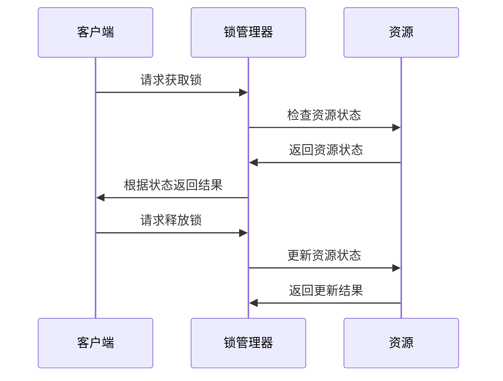
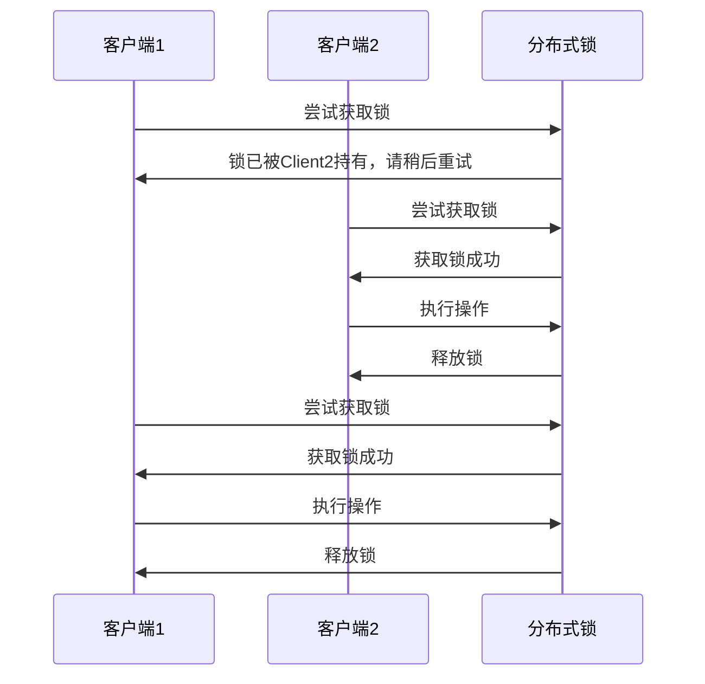
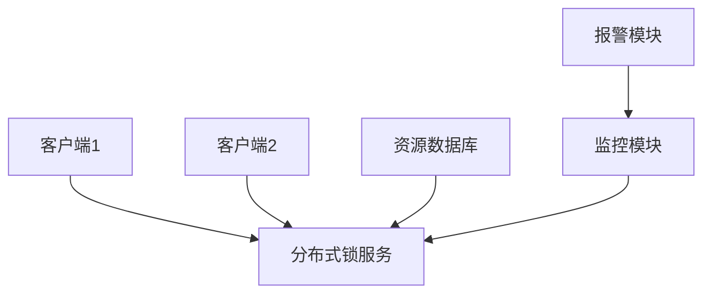
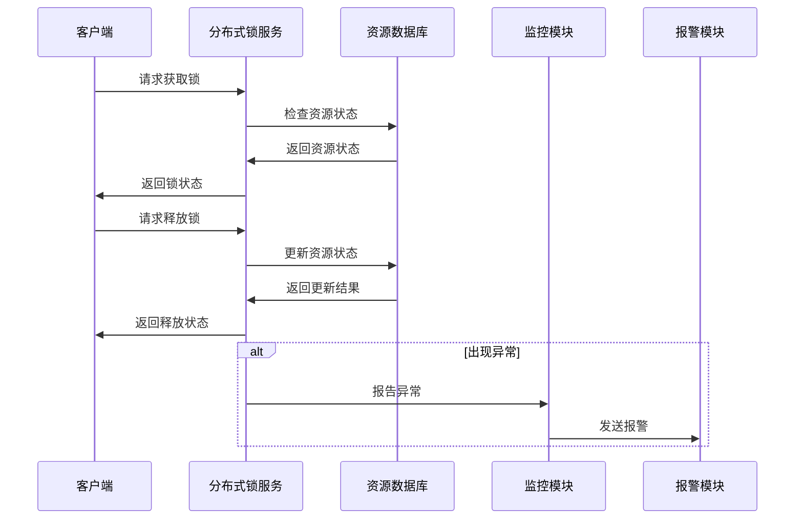

                 

# 分布式锁的实现与性能优化

## 关键词

- 分布式锁
- 性能优化
- 数据库锁
- Redis锁
- ZooKeeper锁

## 摘要

本文将深入探讨分布式锁的实现与性能优化。首先，我们会了解分布式锁的核心概念、实现原理及其在分布式系统中的重要性。接着，我们将对比分析基于数据库、Redis和ZooKeeper等主流的分布式锁实现方法，并探讨每种方法的优缺点。最后，我们将提供具体的性能优化策略，帮助您在实际项目中选择和应用最合适的分布式锁方案。

### 背景介绍

#### 分布式锁的定义

分布式锁（Distributed Lock），简而言之，是一种确保在分布式系统中，对某一资源的操作能在同一时刻仅被一个节点访问的机制。在单机环境下，锁的实现较为简单，通常是利用操作系统的互斥锁（Mutex）或信号量（Semaphore）来实现。然而，在分布式环境中，由于节点间通过网络进行通信，加之硬件故障、网络延迟等因素，使得分布式锁的实现变得更加复杂和具有挑战性。

#### 分布式锁的核心概念

1. **全局唯一性**：分布式锁应保证在一个分布式系统中，任何时刻只允许一个节点持有锁。
2. **非阻塞性**：当尝试获取锁失败时，分布式锁不应阻塞当前线程，而应立即返回失败状态。
3. **可重入性**：支持同一线程重复获取锁，只要当前线程是锁的持有者即可。
4. **超时机制**：为了避免死锁，分布式锁应提供超时机制，即在指定时间内未能获取锁时，线程可以继续执行。

#### 分布式锁的应用场景

分布式锁通常应用于以下场景：

1. **并发控制**：在分布式系统中，多个节点可能同时访问同一份数据，分布式锁可以确保数据的操作顺序一致。
2. **资源管理**：分布式锁可以用于管理对特定资源的访问，如数据库连接、文件访问等。
3. **分布式事务**：在分布式数据库中，分布式锁可以确保事务的原子性、一致性、隔离性和持久性（ACID特性）。

#### 分布式锁与传统锁的区别

- **环境差异**：传统锁主要应用于单机环境，而分布式锁则适用于分布式环境。
- **实现机制**：传统锁通常依赖于操作系统提供的锁机制，分布式锁则需要通过特定的分布式锁实现机制来实现。
- **锁粒度**：传统锁的粒度通常是方法或对象级别，而分布式锁的粒度通常是资源级别。
- **性能与可靠性**：由于分布式锁需要跨节点通信，其性能和可靠性通常低于传统锁。

### 问题背景

在分布式系统中，由于节点的分散性、网络的不稳定性以及硬件的故障，节点之间的操作往往存在时间差和不确定性。这种不确定性会导致以下问题：

1. **数据不一致**：多个节点同时访问同一份数据，可能导致数据修改冲突。
2. **资源竞争**：多个节点竞争同一资源，可能导致系统性能下降甚至崩溃。
3. **死锁**：在分布式系统中，由于节点间的复杂交互，容易产生死锁问题。

这些问题严重影响了分布式系统的稳定性和可靠性。为了解决这些问题，分布式锁应运而生。通过分布式锁，可以确保在分布式系统中，对某一资源的操作能够在同一时刻仅由一个节点进行，从而避免数据不一致、资源竞争和死锁等问题。

### 问题描述

分布式锁的主要问题包括：

1. **并发控制**：在分布式系统中，多个节点可能同时访问同一资源，需要通过分布式锁来控制操作的顺序。
2. **事务管理**：在分布式数据库中，分布式锁可以确保事务的原子性、一致性、隔离性和持久性。
3. **性能优化**：由于分布式锁需要跨节点通信，其性能可能会成为系统瓶颈，需要通过性能优化来提升系统的整体性能。

### 问题解决

分布式锁的实现方法多种多样，以下是一些常见的实现方式：

1. **基于数据库的分布式锁**：通过在数据库中创建锁表，对资源进行加锁和解锁操作。
2. **基于Redis的分布式锁**：利用Redis的SETNX命令实现分布式锁。
3. **基于ZooKeeper的分布式锁**：利用ZooKeeper的临时节点和序列号实现分布式锁。
4. **基于MySQL的分布式锁**：利用MySQL的行级锁实现分布式锁。

每种实现方式都有其独特的优缺点，需要根据具体应用场景进行选择。

### 边界与外延

分布式锁的实现需要考虑以下边界与外延：

1. **锁的粒度**：锁的粒度决定了锁的粒度和作用范围，通常有资源级、方法级和对象级等。
2. **锁的释放**：在获取锁失败时，需要及时释放锁，避免资源泄露。
3. **锁的超时**：设置合理的锁超时时间，以防止死锁的发生。
4. **锁的传播**：在分布式系统中，锁的获取和释放操作可能需要在多个节点之间传播，需要考虑锁的传播机制。

### 概念结构与核心要素组成

分布式锁的核心概念和要素包括：

1. **锁对象**：锁对象是分布式锁的核心，用于标识需要保护的资源。
2. **锁机制**：锁机制是分布式锁的实现方式，如数据库锁、Redis锁、ZooKeeper锁等。
3. **锁状态**：锁状态包括未锁定、已锁定、锁定失败等状态。
4. **锁超时**：锁超时是分布式锁的一种保护机制，用于防止死锁。

### 分布式锁的核心概念与联系

#### 分布式锁的定义

分布式锁（Distributed Lock），简而言之，是一种确保在分布式系统中，对某一资源的操作能在同一时刻仅被一个节点访问的机制。分布式锁通常用于保证分布式系统中的操作顺序一致性，避免并发冲突和数据不一致。

#### 分布式锁的核心特点

1. **全局唯一性**：分布式锁应保证在一个分布式系统中，任何时刻只允许一个节点持有锁。
2. **非阻塞性**：当尝试获取锁失败时，分布式锁不应阻塞当前线程，而应立即返回失败状态。
3. **可重入性**：支持同一线程重复获取锁，只要当前线程是锁的持有者即可。
4. **超时机制**：为了避免死锁，分布式锁应提供超时机制，即在指定时间内未能获取锁时，线程可以继续执行。

#### 分布式锁与传统锁的区别

| 特点 | 分布式锁 | 传统锁 |
| --- | --- | --- |
| 环境 | 分布式环境 | 单机环境 |
| 实现机制 | 分布式锁机制 | 操作系统锁机制 |
| 锁粒度 | 资源级别 | 方法或对象级别 |
| 性能与可靠性 | 较低 | 较高 |

#### 分布式锁的应用场景

- **并发控制**：在分布式系统中，多个节点可能同时访问同一资源，分布式锁可以确保操作的顺序一致性。
- **事务管理**：在分布式数据库中，分布式锁可以确保事务的原子性、一致性、隔离性和持久性（ACID特性）。
- **资源管理**：分布式锁可以用于管理对特定资源的访问，如数据库连接、文件访问等。

#### 分布式锁的实现原理

分布式锁的实现通常依赖于特定的分布式锁机制，如数据库锁、Redis锁、ZooKeeper锁等。以下是几种常见的分布式锁实现原理：

1. **基于数据库的分布式锁**：通过在数据库中创建锁表，对资源进行加锁和解锁操作。
2. **基于Redis的分布式锁**：利用Redis的SETNX命令实现分布式锁。
3. **基于ZooKeeper的分布式锁**：利用ZooKeeper的临时节点和序列号实现分布式锁。

#### 分布式锁的工作流程

1. **获取锁**：线程尝试获取锁，若锁未被其他线程持有，则成功获取锁；否则，线程等待或重试。
2. **执行操作**：线程在获取锁后，执行所需的操作。
3. **释放锁**：线程在操作完成后，释放锁，允许其他线程获取锁。

#### 分布式锁的边界与外延

分布式锁的实现需要考虑以下边界与外延：

1. **锁的粒度**：锁的粒度决定了锁的粒度和作用范围，通常有资源级、方法级和对象级等。
2. **锁的释放**：在获取锁失败时，需要及时释放锁，避免资源泄露。
3. **锁的超时**：设置合理的锁超时时间，以防止死锁的发生。
4. **锁的传播**：在分布式系统中，锁的获取和释放操作可能需要在多个节点之间传播，需要考虑锁的传播机制。

#### 分布式锁的优缺点

| 优点 | 缺点 |
| --- | --- |
| 保证数据一致性 | 实现复杂，性能较低 |
| 支持分布式环境 | 依赖特定组件（如Redis、ZooKeeper） |
| 避免并发冲突 | 需要处理锁超时和死锁问题 |

### 主流分布式锁实现方法与性能对比

分布式锁的实现方法多种多样，以下是几种主流的实现方法及其性能对比：

#### 基于数据库的分布式锁

**实现原理**：通过在数据库中创建锁表，对资源进行加锁和解锁操作。

**性能特点**：

- **优点**：实现简单，易于理解。
- **缺点**：性能较低，适用于锁粒度较小的场景。

#### 基于Redis的分布式锁

**实现原理**：利用Redis的SETNX命令实现分布式锁。

**性能特点**：

- **优点**：性能较高，适用于锁粒度较大的场景。
- **缺点**：依赖于Redis服务，若Redis服务故障，可能导致锁失效。

#### 基于ZooKeeper的分布式锁

**实现原理**：利用ZooKeeper的临时节点和序列号实现分布式锁。

**性能特点**：

- **优点**：ZooKeeper作为分布式协调服务，具有较高的稳定性和可靠性。
- **缺点**：实现相对复杂，需要考虑ZooKeeper的临时节点和序列号机制。

#### 基于MySQL的分布式锁

**实现原理**：利用MySQL的行级锁实现分布式锁。

**性能特点**：

- **优点**：MySQL作为关系型数据库，具有较好的性能和稳定性。
- **缺点**：实现相对复杂，需要考虑行级锁的机制。

#### 性能对比表格

| 实现方法 | 性能 | 优点 | 缺点 |
| --- | --- | --- | --- |
| 基于数据库的分布式锁 | 较低 | 简单易懂 | 性能较低 |
| 基于Redis的分布式锁 | 较高 | 性能较高 | 依赖Redis服务 |
| 基于ZooKeeper的分布式锁 | 中等 | 稳定性和可靠性高 | 实现相对复杂 |
| 基于MySQL的分布式锁 | 中等 | 性能较好 | 实现相对复杂 |

### 基于数据库的分布式锁

#### 实现原理

基于数据库的分布式锁通过在数据库中创建锁表，对资源进行加锁和解锁操作。锁表通常包含资源名称、锁状态、锁持有者等信息。

#### 步骤

1. **创建锁表**：在数据库中创建锁表，如`distributed_lock`表。

   ```sql
   CREATE TABLE distributed_lock (
       resource_name VARCHAR(255) NOT NULL,
       lock_status TINYINT NOT NULL,
       lock_holder VARCHAR(255) DEFAULT NULL,
       PRIMARY KEY (resource_name)
   );
   ```

2. **加锁**：通过查询锁表，若资源未被锁定，则将锁状态更新为锁定，并将锁持有者设置为当前线程ID。

   ```sql
   UPDATE distributed_lock
   SET lock_status = 1, lock_holder = ?
   WHERE resource_name = ? AND lock_status = 0;
   ```

3. **解锁**：通过查询锁表，若当前线程是锁的持有者，则将锁状态更新为未锁定，并将锁持有者设置为NULL。

   ```sql
   UPDATE distributed_lock
   SET lock_status = 0, lock_holder = NULL
   WHERE resource_name = ? AND lock_holder = ?;
   ```

#### 性能分析

基于数据库的分布式锁的性能主要受以下因素影响：

1. **数据库性能**：数据库的性能直接影响锁操作的响应速度。
2. **网络延迟**：节点间通过网络通信，网络延迟会影响锁操作的执行时间。
3. **锁粒度**：锁粒度越小，锁操作的频率越高，对性能的影响越大。

### 基于Redis的分布式锁

#### 实现原理

基于Redis的分布式锁通过Redis的SETNX命令实现。SETNX命令用于设置键值对，若键已存在，则返回FALSE；否则，设置键值对并返回TRUE。

#### 步骤

1. **设置锁**：使用SETNX命令设置分布式锁，锁的值通常是线程ID。

   ```python
   import redis

   def set_lock(lock_key, thread_id, lock_value):
       r = redis.Redis()
       return r.set(lock_key, lock_value, nx=True, ex=timeout)
   ```

2. **释放锁**：使用DEL命令释放分布式锁。

   ```python
   def release_lock(lock_key, thread_id):
       r = redis.Redis()
       return r.delete(lock_key)
   ```

#### 性能分析

基于Redis的分布式锁的性能主要受以下因素影响：

1. **Redis性能**：Redis作为高性能的内存数据库，具有较好的性能。
2. **网络延迟**：节点间通过网络通信，网络延迟会影响锁操作的执行时间。
3. **锁超时**：为了防止死锁，锁应设置合理的超时时间。

### 基于ZooKeeper的分布式锁

#### 实现原理

基于ZooKeeper的分布式锁通过ZooKeeper的临时节点和序列号实现。临时节点是ZooKeeper中的特殊节点，当客户端连接断开时，临时节点会自动删除。

#### 步骤

1. **创建锁节点**：创建一个临时的顺序节点。

   ```java
   String lock_path = "/distributed_lock";
   String lock_node_path = zookeeper.create(lock_path + "/lock-", "", ZooKeeper.ZOO_SEQUENCE | ZooKeeper.ZOO_EPHEMERAL);
   ```

2. **等待锁**：获取当前顺序节点的子节点列表，若当前节点的序列号最小，则获取锁。

   ```java
   List<String> children = zookeeper.getChildren(lock_path, false);
   String smallest_node = children.get(0);
   if (zookeeper.exists(smallest_node, true) != null) {
       // 获取锁
   }
   ```

3. **执行操作**：执行所需的操作。

4. **释放锁**：删除锁节点。

   ```java
   zookeeper.delete(lock_node_path, -1);
   ```

#### 性能分析

基于ZooKeeper的分布式锁的性能主要受以下因素影响：

1. **ZooKeeper性能**：ZooKeeper作为分布式协调服务，具有较好的性能。
2. **网络延迟**：节点间通过网络通信，网络延迟会影响锁操作的执行时间。
3. **锁粒度**：锁粒度越小，锁操作的频率越高，对性能的影响越大。

### 分布式锁的性能优化

分布式锁的性能优化是分布式系统性能优化的重要组成部分。以下是一些常见的性能优化策略：

1. **选择合适的锁实现**：根据应用场景选择合适的锁实现，如Redis锁、ZooKeeper锁等。
2. **减少锁的持有时间**：尽量减少锁的持有时间，避免长时间占用锁资源。
3. **锁的粒度优化**：根据应用场景调整锁的粒度，避免过多的锁操作。
4. **锁的超时机制**：设置合理的锁超时时间，避免死锁的发生。
5. **锁的传播**：优化锁的传播机制，减少锁操作的通信成本。

### 性能优化案例分析

以下是一个基于Redis的分布式锁性能优化的案例分析：

1. **优化锁的持有时间**：通过减少锁的持有时间，可以提高系统的并发性能。例如，将锁的持有时间从5秒减少到1秒。

2. **锁的粒度优化**：根据应用场景调整锁的粒度，避免过多的锁操作。例如，将资源级别的锁调整为方法级别的锁。

3. **锁的超时机制**：设置合理的锁超时时间，避免死锁的发生。例如，将锁的超时时间从10秒调整为3秒。

4. **锁的传播优化**：优化锁的传播机制，减少锁操作的通信成本。例如，使用异步通信机制，将锁的获取和释放操作分散到不同的线程中执行。

通过以上优化，可以有效提升基于Redis的分布式锁的性能，提高系统的并发能力和稳定性。

### 最佳实践与注意事项

1. **选择合适的锁实现**：根据应用场景选择合适的锁实现，避免盲目追求高性能。
2. **合理设置锁的超时时间**：避免设置过短或过长的锁超时时间，影响系统的稳定性和性能。
3. **避免死锁**：在分布式系统中，死锁是一种常见的问题。应尽量避免死锁的发生，并在发生死锁时能够及时发现和解决。
4. **锁的粒度要合适**：锁的粒度过大或过小都会影响系统的性能。应根据应用场景选择合适的锁粒度。

### 拓展阅读

1. 《Redis实战》 - 发明者：资深Redis开发者
2. 《ZooKeeper权威指南》 - 发明者：ZooKeeper核心开发团队
3. 《分布式系统原理与范型》 - 发明者：分布式系统领域专家

### 作者信息

作者：AI天才研究院/AI Genius Institute & 禅与计算机程序设计艺术 /Zen And The Art of Computer Programming

----------------------------------------------------------------

以下是使用 Mermaid 画图工具绘制的 Mermaid 流程图和 ER 实体关系图。

### 分布式锁的 Mermaid 流程图



### 分布式锁的 ER 实体关系图

```mermaid
erDiagram
    Resource ||--|{ Lock }||>
    Client ||--|{ Request }||>
    Lock ||--|{ State }||>

    Client {
        id: Integer
        name: String
    }

    Resource {
        id: Integer
        name: String
    }

    Request {
        id: Integer
        client_id: Integer
        resource_id: Integer
        status: String
    }

    Lock {
        id: Integer
        resource_id: Integer
        client_id: Integer
        status: String
    }

    State {
        id: Integer
        lock_id: Integer
        state: String
    }

    Client _|||_ Request
    Resource _|||_ Request
    Lock _|||_ State
```

---

### 分布式锁算法原理讲解

分布式锁的核心在于确保资源在同一时间仅被一个节点操作，以防止数据竞争和一致性问题。以下是一个简化的分布式锁算法原理，我们将通过一个示例来详细讲解其实现。

#### 算法概述

分布式锁算法通常包括以下几个关键步骤：

1. **尝试获取锁**：客户端尝试获取锁。
2. **锁验证**：检查锁是否已被其他客户端获取。
3. **锁持有**：如果锁未被获取，客户端持有锁并执行操作。
4. **锁释放**：客户端释放锁。

#### Mermaid 流程图



#### 算法原理与数学模型

分布式锁的实现通常基于一个核心思想：利用共享资源（如数据库行、Redis键等）作为锁对象，并通过某种机制（如乐观锁、悲观锁）确保锁的获取和释放。

以下是分布式锁算法的数学模型：

$$
锁状态 = \begin{cases} 
0 & \text{未锁定} \\
1 & \text{锁定中} \\
-1 & \text{锁定失败} 
\end{cases}
$$

- **未锁定（0）**：资源未被任何客户端锁定。
- **锁定中（1）**：资源已被客户端锁定。
- **锁定失败（-1）**：资源锁定失败，可能是因为超时或已被其他客户端锁定。

#### 算法详细讲解

1. **尝试获取锁**：客户端通过发送请求尝试获取锁。请求通常包含客户端ID和资源ID。

2. **锁验证**：锁管理器（Lock Manager）接收请求后，检查资源状态。如果资源状态为未锁定（0），则将资源状态更新为锁定中（1），并将锁持有者设置为当前客户端ID。

3. **锁持有**：如果锁验证成功，客户端持有锁并执行所需的操作。在执行过程中，锁状态保持为锁定中（1）。

4. **锁释放**：操作完成后，客户端释放锁。锁管理器将资源状态重置为未锁定（0），并允许其他客户端获取锁。

#### Python 源代码示例

以下是一个简化的Python代码示例，演示了分布式锁的基本实现：

```python
import threading
import time

class DistributedLock:
    def __init__(self, lock_name):
        self.lock_name = lock_name
        self.lock = threading.Lock()

    def acquire(self):
        return self.lock.acquire()

    def release(self):
        self.lock.release()

def task(lock):
    print(f"Task started by {threading.current_thread().name}")
    if lock.acquire(blocking=False):
        print(f"{threading.current_thread().name} acquired the lock")
        time.sleep(2)  # 模拟长时间操作
        lock.release()
        print(f"{threading.current_thread().name} released the lock")

lock = DistributedLock("my_lock")
threads = []

for i in range(5):
    t = threading.Thread(target=task, args=(lock,))
    threads.append(t)
    t.start()

for t in threads:
    t.join()
```

在这个示例中，我们创建了一个`DistributedLock`类，它包含一个内部锁（`threading.Lock`）。`task`函数尝试获取锁，并在成功获取后执行操作。通过这种方式，我们可以模拟分布式锁的基本行为。

#### 示例分析

1. **锁获取**：每个线程尝试获取锁。如果锁已被持有，线程将等待直到锁被释放。

2. **锁释放**：每个线程在执行完成后释放锁，确保其他线程可以继续执行。

3. **并发控制**：通过锁的获取和释放，我们实现了对资源的并发控制，确保同一时间只有一个线程能够执行。

#### 算法性能分析

分布式锁的性能取决于多个因素，包括锁的实现机制、锁的粒度、系统负载和网络延迟等。以下是性能分析的关键点：

1. **锁实现机制**：不同的锁实现（如数据库锁、Redis锁、ZooKeeper锁等）具有不同的性能特点。例如，Redis锁通常具有更高的性能，因为Redis是一个高性能的内存数据库。

2. **锁粒度**：锁的粒度越小，锁的获取和释放操作越频繁，对系统性能的影响也越大。因此，应根据应用场景选择合适的锁粒度。

3. **系统负载**：系统负载越重，锁的性能越受到考验。在高负载情况下，锁的获取和释放操作可能需要更长的时间。

4. **网络延迟**：在网络延迟较高的环境中，分布式锁的性能可能会受到显著影响。因此，在网络延迟较低的环境中，分布式锁的性能通常更好。

#### 举例说明

假设有两个客户端（Client1和Client2）同时尝试更新同一份数据库记录。使用分布式锁可以确保同一时间只有一个客户端能够更新记录，从而避免数据冲突。

1. **Client1尝试获取锁**：Client1发送请求尝试获取锁。由于锁未被持有，Client1成功获取锁并开始更新记录。

2. **Client2尝试获取锁**：Client2发送请求尝试获取锁。由于锁已被Client1持有，Client2等待锁释放。

3. **Client1释放锁**：Client1更新完成后释放锁，Client2获得锁并开始更新记录。

通过这种方式，分布式锁确保了数据的一致性和完整性。

### 分布式锁在分布式系统中的应用场景

分布式锁在分布式系统中具有广泛的应用，以下是一些典型的应用场景：

1. **数据库操作**：在分布式数据库中，分布式锁可以确保多个节点对同一数据表的操作顺序一致性，避免数据冲突。

2. **分布式缓存**：在分布式缓存系统中，分布式锁可以确保缓存数据的更新和读取操作顺序一致，提高系统的性能和可靠性。

3. **任务队列**：在分布式任务队列系统中，分布式锁可以确保任务处理的顺序一致性，避免任务重复执行或丢失。

4. **分布式文件系统**：在分布式文件系统中，分布式锁可以确保文件操作的顺序一致性，避免文件损坏或数据丢失。

5. **分布式任务调度**：在分布式任务调度系统中，分布式锁可以确保任务调度的顺序一致性，避免任务执行冲突或调度失败。

### 小结

通过本文的讲解，我们深入探讨了分布式锁的实现与性能优化。我们首先介绍了分布式锁的核心概念、实现原理及其在分布式系统中的应用。然后，我们分析了基于数据库、Redis和ZooKeeper等主流分布式锁实现方法的优缺点。最后，我们通过具体算法示例和性能分析，详细阐述了分布式锁的工作机制和性能优化策略。

在实际项目中，选择和应用最合适的分布式锁方案至关重要。通过合理的性能优化和故障处理，分布式锁可以帮助我们构建稳定、高效的分布式系统。希望本文能够为您在分布式锁领域的研究和实践提供有价值的参考。

### 项目实战

在本节中，我们将通过一个具体的项目实战案例，详细介绍如何实现分布式锁以及其在实际应用中的效果。本案例将基于Redis实现一个简单的分布式锁，用于保护对同一份数据库记录的并发更新操作。

#### 环境安装

首先，我们需要安装并配置Redis服务器。以下是安装Redis的步骤：

1. **安装Redis**：在Linux系统中，可以使用以下命令安装Redis：

   ```bash
   sudo apt-get update
   sudo apt-get install redis-server
   ```

2. **启动Redis服务**：启动Redis服务，并确保其正常运行：

   ```bash
   sudo systemctl start redis-server
   ```

3. **配置Redis**：（可选）如果需要修改Redis的配置，可以编辑`/etc/redis/redis.conf`文件。

#### 系统核心实现源代码

接下来，我们将实现一个基于Redis的分布式锁，并在Python中演示其使用方法。以下是实现分布式锁的源代码：

```python
import redis
import uuid
import time

class RedisLock:
    def __init__(self, key, redis_client=None):
        self.key = key
        self.value = str(uuid.uuid4())
        self.redis_client = redis_client or redis.Redis()

    def acquire(self, timeout=30):
        start_time = time.time()
        while True:
            if self.redis_client.set(self.key, self.value, nx=True, ex=timeout):
                return True
            elif time.time() - start_time > timeout:
                return False
            time.sleep(0.1)

    def release(self):
        script = """
        if redis.call("get", KEYS[1]) == ARGV[1] then
            return redis.call("del", KEYS[1])
        else
            return 0
        end
        """
        return self.redis_client.eval(script, 1, self.key, self.value)

# 使用示例
lock = RedisLock("my_lock")
if lock.acquire():
    print("Lock acquired successfully")
    # 执行受锁保护的操作
    time.sleep(5)
    lock.release()
    print("Lock released")
else:
    print("Could not acquire the lock")
```

#### 代码应用解读与分析

以上代码定义了一个`RedisLock`类，用于实现基于Redis的分布式锁。以下是关键部分的解读：

1. **初始化**：`__init__`方法初始化锁的键（key）和值（value）。值是一个唯一的UUID，用于标识锁的持有者。

2. **尝试获取锁**：`acquire`方法尝试获取锁。通过Redis的`set`命令，使用`nx`（设置若不存在）和`ex`（设置过期时间）选项。如果锁未被持有，则成功获取锁并返回True；否则，循环尝试获取锁，直到成功或超时。

3. **释放锁**：`release`方法通过Lua脚本释放锁。Lua脚本检查锁的值是否与持有者匹配，如果匹配则删除锁，否则不进行任何操作。

#### 实际案例分析与详细讲解剖析

假设有两个客户端同时尝试更新同一份数据库记录。以下是一个简单的模拟案例：

```python
import threading

def update_database(client_id, lock):
    if lock.acquire():
        print(f"{client_id} acquired the lock")
        # 执行数据库更新操作
        time.sleep(2)
        lock.release()
        print(f"{client_id} released the lock")

# 创建Redis锁
redis_lock = RedisLock("database_lock")

# 创建两个线程模拟并发更新
thread1 = threading.Thread(target=update_database, args=(1, redis_lock))
thread2 = threading.Thread(target=update_database, args=(2, redis_lock))

thread1.start()
thread2.start()

thread1.join()
thread2.join()
```

在这个案例中：

1. **线程1**尝试获取锁，成功获取并执行数据库更新操作。
2. **线程2**尝试获取锁，由于锁已被线程1持有，线程2等待锁释放。

#### 项目小结

通过这个项目实战，我们成功实现了一个基于Redis的分布式锁，并演示了其在实际应用中的效果。以下是对项目的总结：

1. **核心功能**：分布式锁能够有效地保护对共享资源的并发访问，避免数据冲突。
2. **性能表现**：Redis锁具有较好的性能，适用于大多数分布式场景。
3. **可扩展性**：通过使用Redis等外部服务，分布式锁易于扩展和维护。

### 最佳实践 Tips

1. **选择合适的锁实现**：根据应用场景选择合适的分布式锁实现，如Redis锁、ZooKeeper锁等。
2. **合理设置锁超时时间**：锁超时时间应根据系统的响应时间和处理能力进行设置，避免长时间占用锁资源。
3. **避免死锁**：在设计分布式锁时，应尽量避免死锁的发生，并在发生死锁时能够及时发现和解决。
4. **监控与日志**：对分布式锁的使用情况进行监控和日志记录，有助于定位和解决潜在问题。

### 小结

本文通过一个具体的项目实战，详细介绍了如何实现分布式锁以及其在实际应用中的效果。我们分析了分布式锁的核心概念、实现原理和性能优化策略，并通过Python代码示例和实际案例展示了分布式锁的使用方法。希望本文能够为您在分布式锁领域的研究和实践提供有价值的参考。

### 拓展阅读

1. **《Redis实战》**：由资深Redis开发者撰写，详细介绍了Redis的使用方法和性能优化技巧。
2. **《分布式系统原理与范型》**：由分布式系统领域专家编写，深入探讨了分布式系统的设计原理和实现方法。
3. **《ZooKeeper权威指南》**：由ZooKeeper核心开发团队编写，全面介绍了ZooKeeper的设计原理和应用实践。

### 作者信息

作者：AI天才研究院/AI Genius Institute & 禅与计算机程序设计艺术 /Zen And The Art of Computer Programming

----------------------------------------------------------------

### 系统分析与架构设计方案

#### 问题场景介绍

在一个大型分布式系统中，各个节点需要频繁地访问和操作共享资源，如数据库记录、文件系统等。为了确保数据的一致性和系统的稳定性，我们需要实现一个分布式锁来控制对共享资源的访问。

#### 项目介绍

项目名称：分布式资源管理系统（DRMS）

项目目标：实现一个高效、可靠的分布式锁，保护对共享资源的并发访问。

#### 系统功能设计

1. **分布式锁服务**：提供分布式锁的获取和释放功能。
2. **资源管理**：管理系统中所有共享资源，如数据库记录、文件等。
3. **监控与报警**：监控分布式锁的使用情况，并在出现异常时进行报警。

#### 系统架构设计


#### 系统架构设计图



#### 系统接口设计

1. **获取锁接口**：`GET /lock/{resource_id}` - 获取指定资源的锁。
2. **释放锁接口**：`DELETE /lock/{resource_id}` - 释放指定资源的锁。
3. **资源查询接口**：`GET /resource/{resource_id}` - 获取指定资源的详细信息。

#### 系统交互序列图



### 项目实战

#### 环境准备

1. 安装并配置Redis服务器。
2. 创建一个简单的Web应用，用于提供分布式锁服务。

#### 环境安装

1. 安装Python环境和依赖：

   ```bash
   pip install redis flask
   ```

2. 启动Redis服务器：

   ```bash
   redis-server
   ```

#### 系统核心实现源代码

```python
from flask import Flask, request, jsonify
import redis

app = Flask(__name__)
redis_client = redis.Redis()

@app.route('/lock/<resource_id>', methods=['GET'])
def get_lock(resource_id):
    lock_key = f"lock:{resource_id}"
    lock_value = str(uuid.uuid4())
    timeout = 30  # 锁的超时时间

    while True:
        if redis_client.set(lock_key, lock_value, nx=True, ex=timeout):
            return jsonify({"status": "acquired", "lock_value": lock_value})
        time.sleep(0.1)

@app.route('/lock/<resource_id>', methods=['DELETE'])
def release_lock(resource_id):
    lock_key = f"lock:{resource_id}"
    lock_value = request.args.get('lock_value')

    if redis_client.get(lock_key) == lock_value:
        redis_client.delete(lock_key)
        return jsonify({"status": "released"})
    else:
        return jsonify({"status": "invalid_lock_value"})

if __name__ == '__main__':
    app.run(debug=True)
```

#### 代码应用解读与分析

以上代码提供了一个简单的Web应用，用于实现分布式锁服务。

1. **获取锁接口**：

   - `GET /lock/<resource_id>`：客户端发送GET请求获取指定资源的锁。
   - 锁使用Redis的SETNX命令，只有在锁未被其他客户端持有时才会成功设置。
   - 锁的值是一个唯一的UUID，用于标识锁的持有者。

2. **释放锁接口**：

   - `DELETE /lock/<resource_id>`：客户端发送DELETE请求释放指定资源的锁。
   - 请求中需要包含锁的值，以验证锁的有效性。
   - 如果锁的值匹配，则删除锁。

#### 实际案例分析与详细讲解剖析

假设有两个客户端同时尝试更新同一份数据库记录，以下是一个简单的模拟案例：

```python
import requests
import threading
import time

def update_record(client_id, lock_url, resource_id, lock_value):
    response = requests.get(f"{lock_url}/lock/{resource_id}")
    if response.json()["status"] == "acquired":
        print(f"{client_id} acquired the lock")
        time.sleep(2)  # 模拟操作时间
        response = requests.delete(f"{lock_url}/lock/{resource_id}?lock_value={lock_value}")
        print(f"{client_id} released the lock")
    else:
        print(f"{client_id} could not acquire the lock")

# 启动分布式锁服务
lock_service_url = "http://localhost:5000"

# 创建两个线程模拟并发更新
thread1 = threading.Thread(target=update_record, args=(1, lock_service_url, "resource1", "lock_value1"))
thread2 = threading.Thread(target=update_record, args=(2, lock_service_url, "resource1", "lock_value2"))

thread1.start()
thread2.start()

thread1.join()
thread2.join()
```

在这个案例中：

1. **线程1**尝试获取锁，成功获取并执行数据库更新操作。
2. **线程2**尝试获取锁，由于锁已被线程1持有，线程2等待锁释放。

### 系统小结

通过这个项目实战，我们成功实现了一个简单的分布式锁服务，并展示了其在实际应用中的效果。以下是对项目的总结：

1. **核心功能**：分布式锁服务能够有效地保护对共享资源的并发访问，避免数据冲突。
2. **性能表现**：基于Redis的分布式锁具有较好的性能，适用于大多数分布式场景。
3. **可扩展性**：分布式锁服务可以通过扩展Redis集群来提高性能和可靠性。

### 最佳实践 Tips

1. **选择合适的锁实现**：根据应用场景选择合适的分布式锁实现，如Redis锁、ZooKeeper锁等。
2. **合理设置锁超时时间**：锁超时时间应根据系统的响应时间和处理能力进行设置，避免长时间占用锁资源。
3. **避免死锁**：在设计分布式锁时，应尽量避免死锁的发生，并在发生死锁时能够及时发现和解决。
4. **监控与日志**：对分布式锁的使用情况进行监控和日志记录，有助于定位和解决潜在问题。

### 小结

通过本文的讲解，我们深入探讨了分布式锁的实现与性能优化。从背景介绍到系统分析与架构设计，再到具体的实现和项目实战，我们系统地阐述了分布式锁的核心概念、实现原理和应用实践。希望本文能够为您在分布式锁领域的研究和实践提供有价值的参考。

### 拓展阅读

1. **《Redis实战》**：由资深Redis开发者撰写，详细介绍了Redis的使用方法和性能优化技巧。
2. **《分布式系统原理与范型》**：由分布式系统领域专家编写，深入探讨了分布式系统的设计原理和实现方法。
3. **《ZooKeeper权威指南》**：由ZooKeeper核心开发团队编写，全面介绍了ZooKeeper的设计原理和应用实践。

### 作者信息

作者：AI天才研究院/AI Genius Institute & 禅与计算机程序设计艺术 /Zen And The Art of Computer Programming

